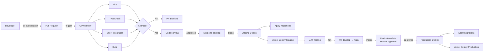
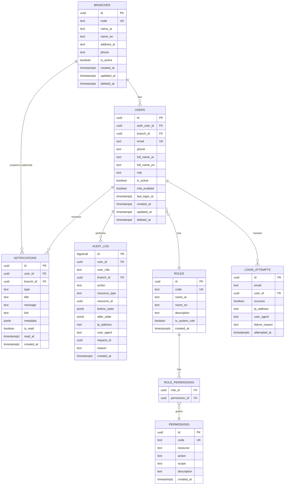
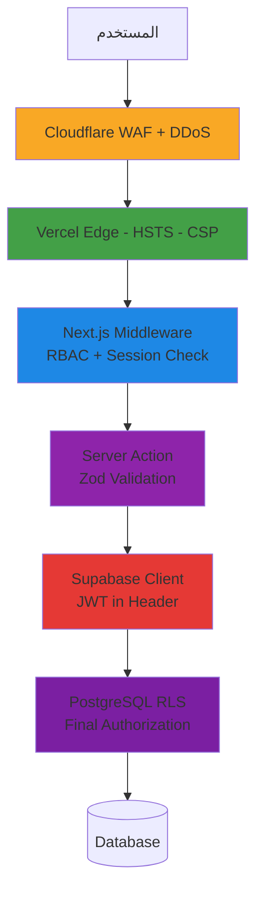
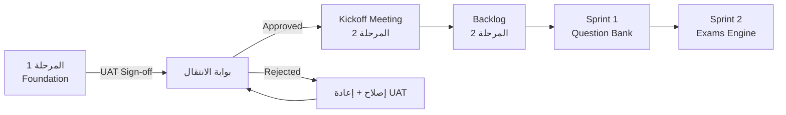

# المرحلة 1: التأسيس (Foundation)

> **النوع:** مرحلة بنية تحتية تقنية
> **المدة المُقدّرة:** أسبوعان (10 أيام عمل) — قابلة للتمديد ليوم أو يومين إن استلزمت معايرة RLS
> **التبعيات السابقة:** لا توجد (نقطة البداية للمشروع)
> **التبعيات اللاحقة:** كل المراحل القادمة (من 2 إلى 10) تعتمد عليها اعتماداً كاملاً
> **الإصدار:** 1.0
> **التاريخ:** 2026-05-13
> **معدّ الخطة:** Senior Project Manager + Senior Solutions Architect
> **الجمهور:** المبرمج الرئيسي (Full-Stack Senior) + قائد المنتج

---

## 1. الملخص التنفيذي (Executive Summary)

المرحلة الأولى — **التأسيس (Foundation)** — هي اللبنة الحجرية التي تستند إليها بقية مراحل نظام **النظام IIMS**. هي مرحلة بنية تحتية صرفة لا تُنتج ميزات وظيفية يراها المستخدم النهائي، لكنها **تُنتج الإطار التقني الكامل** الذي ستُبنى عليه كل الموديولات الـ24 في المراحل العشر القادمة. لا توجد ميزة أكاديمية أو مالية أو إدارية في المراحل اللاحقة لن تعتمد على ما يتم إنجازه هنا — من المصادقة إلى عزل الفروع، ومن سجل التدقيق إلى الإشعارات الحية، ومن خط النشر الآلي إلى رصد الأخطاء.

الهدف الرئيسي من هذه المرحلة هو **إنتاج نواة معمارية مستقرة وقابلة للتوسع** تخدم 1,000 طالب موزّعين على 4 فروع (BRANCH_A, BRANCH_B, BRANCH_C, BRANCH_D)، مع جاهزية معمارية للتوسع إلى 10,000 طالب و8 فروع دون إعادة كتابة جوهرية. سنُنشئ مشروع Next.js 14 + TypeScript Strict، نُهيّئ Supabase Project مع Schema أولي يضمّ الجداول الأساسية (`branches`, `users`, `roles`, `permissions`, `role_permissions`, `audit_log`, `notifications`)، نُفعّل **Row-Level Security (RLS)** بسياسات صارمة على كل جدول، نُعدّ 4 أدوار قاعدية (`super_admin`, `admin`, `teacher`, `student`)، نُقيم خط CI/CD آلي على GitHub Actions يُغطي PR Checks وStaging وProduction، ونُفعّل Sentry + Vercel Analytics للمراقبة.

السمة الفارقة لهذه المرحلة هي **Multi-Branch by Design**: كل جدول في قاعدة البيانات يحتوي عمود `branch_id`، وكل سياسة RLS تتحقق من انتماء المستخدم للفرع، وكل استعلام في الـ Server Components يمر عبر طبقة موحّدة تضمن العزل. هذا يعني أن مدير الفرع الأول لن يتمكن **تقنياً** من قراءة بيانات الفرع الثاني — ليس لأن الواجهة تخفيها، بل لأن قاعدة البيانات ترفض إعادتها أصلاً. هذا قرار حاسم نتبناه من اليوم الأول لأن إصلاحه لاحقاً يكلف 5-10 أضعاف.

في نهاية الأسبوعين، سنُسلّم: **مستودع Git** كامل بمعمارية Feature-Based، **بيئة Supabase Staging** تعمل، **خط CI/CD** يُشغّل الاختبارات تلقائياً، **صفحة تسجيل دخول** عربية RTL مكتملة تقبل 4 أدوار، **لوحة تحكم فارغة** لكل دور تثبت أن المصادقة تعمل، **3 مستخدمين تجريبيين** يثبتون عزل الفروع، و**وثيقة قبول (UAT)** موقّعة من العميل. هذا التسليم وحده ليس "منتجاً" — لكنه **الأساس الذي يجعل كل المراحل القادمة ممكنة ومتوقعة زمنياً وتقنياً**.

---

## 2. الأهداف والمخرجات (Objectives & Deliverables)

### 2.1 الأهداف الاستراتيجية

| # | الهدف | المؤشر القابل للقياس |
|---|------|----------------------|
| O1 | إقامة بنية تقنية صلبة قابلة للتوسع 10×× | جميع الجداول تحتوي `branch_id` + Indexes صحيحة |
| O2 | تأمين المصادقة وإدارة الأدوار | 4 أدوار تعمل + 2FA للأدوار الحساسة + Lockout policy |
| O3 | عزل الفروع تقنياً عبر RLS | اختبار آلي يُثبت أن مدير فرع A لا يرى بيانات فرع B |
| O4 | بناء سجل تدقيق غير قابل للحذف | Triggers تُسجّل كل تغيير حساس في `audit_log` |
| O5 | واجهة عربية RTL احترافية | 3 صفحات أساسية بـ Cairo Font + Logical Properties |
| O6 | خط نشر آلي للبيئات الثلاث | Push to `develop` → Staging، Push to `main` → Production |
| O7 | رصد فوري للأخطاء والأداء | Sentry يلتقط 100% من الأخطاء + Vercel Analytics |
| O8 | الالتزام بـ PDPL من اليوم الأول | تشفير + Privacy Policy + Cookie Consent (إن لزم) |

### 2.2 المخرجات التقنية المحددة (Deliverables)

| # | المُخرَج | الموقع التقني | معيار القبول |
|---|----------|--------------|--------------|
| D1 | مستودع Git (GitHub) جاهز | `github.com/ruwwad-attaa/iims` | حماية على `main` + `develop`، Branch Protection Rules |
| D2 | مشروع Next.js 14 + TypeScript Strict | `apps/web` (single repo) | `pnpm build` ينجح بلا تحذيرات |
| D3 | بنية مجلدات Feature-based | `src/features/*` | كل ميزة في مجلدها (auth, branches, users, audit) |
| D4 | Supabase Project (Cloud) | `iims-staging.supabase.co` | Schema + RLS + Seed data مطبّقة |
| D5 | Migrations مطبقة | `supabase/migrations/0001_*.sql` إلى `0010_*.sql` | جميعها تعمل عبر `supabase db reset` |
| D6 | 4 أدوار قاعدية في DB | `roles` table | كل دور له `role_permissions` كاملة |
| D7 | 4 فروع Seed | `branches` table | BRANCH_A, BRANCH_B, BRANCH_C, BRANCH_D |
| D8 | Sentry + Vercel Analytics | Dashboard مُفعّل | يلتقط خطأ تجريبي مزروع |
| D9 | CI/CD على GitHub Actions | `.github/workflows/*.yml` | 3 workflows: PR / Staging / Production |
| D10 | صفحة Login عربية RTL | `/login` | تسجيل دخول + 2FA للأدوار الحساسة |
| D11 | Middleware للحماية | `src/middleware.ts` | يُعيد توجيه غير المصرّح لهم لـ `/403` |
| D12 | لوحات تحكم فارغة لكل دور | `/admin`, `/branch`, `/teacher`, `/student` | تعرض اسم المستخدم + الدور + الفرع فقط |
| D13 | Audit Log infrastructure | `audit_log` + Triggers + واجهة بحث | Trigger يعمل على `students` و `users` تجريبياً |
| D14 | Notification Skeleton | جدول + Realtime + Component | Toast يظهر عند إدراج صف في `notifications` |
| D15 | Privacy Policy page | `/privacy-policy` | محتوى متوافق مع PDPL |
| D16 | E2E Tests أساسية | `e2e/auth.spec.ts` | 3 سيناريوهات: login/logout/wrong-role |
| D17 | وثيقة تشغيل (Runbook) | `docs/runbook.md` | كيفية النشر، Restart، Rollback |

### 2.3 ما هو خارج نطاق هذه المرحلة (Out-of-Scope)

- ❌ أي ميزة وظيفية تخدم الطالب أو الموظف مباشرة (ستأتي في المراحل 2-10).
- ❌ بنك الأسئلة، الاختبارات، الدرجات، التحضير، الطلبات (المراحل 2-7).
- ❌ تكامل البرنامج المحاسبي أو WhatsApp أو SMS (المراحل 3 و8).
- ❌ تقارير معقدة أو لوحات KPI (المرحلة 7).
- ❌ Self-Hosted Supabase على VPS سعودي (يُؤجَّل لمرحلة 9 أو بعد قبول العميل).
- ❌ Nafath SSO (المرحلة 9).

---

## 3. المتطلبات السابقة (Prerequisites)

قبل بدء يوم العمل الأول، يجب أن تكون البنود التالية **متوفّرة ومُعتَمدة**:

### 3.1 الحسابات والاشتراكات

| البند | المسؤول | الحالة المطلوبة قبل البدء |
|------|---------|---------------------------|
| حساب GitHub Organization | العميل أو المطوّر | Created + Billing مُفعّل (إن Pro) |
| حساب Vercel Team | المطوّر | Linked to GitHub Org |
| حساب Supabase | المطوّر | Free Tier + Staging Project مُنشأ |
| حساب Cloudflare | المطوّر | Domain مُسجّل (مثلاً `ruwwadattaa.sa` أو فرعي للاختبار) |
| حساب Sentry | المطوّر | Free Tier (5K errors/month) |
| حساب Anthropic (Claude API) | المطوّر | API Key (للمراحل القادمة، لكن نُجهّزه الآن) |

### 3.2 الأدوات على جهاز المطوّر

| الأداة | الإصدار الأدنى | الغرض |
|--------|----------------|------|
| Node.js | 20.10 LTS | تشغيل Next.js |
| pnpm | 9.x | مدير الحزم (نختار pnpm لكفاءة الـ disk) |
| Git | 2.40+ | التحكم بالإصدارات |
| Docker Desktop | 4.30+ | تشغيل Supabase Local |
| Supabase CLI | 1.190+ | Migrations + Local Dev |
| VS Code + Extensions | latest | محرر مع ESLint, Prettier, Tailwind, Deno |

### 3.3 الموارد من العميل

| البند | الأولوية | الموعد المطلوب |
|------|----------|-----------------|
| **شعار النظام** (SVG / PNG) | 🟠 عالية | اليوم 3 (يمكن البدء بـ Placeholder) |
| **ألوان الهوية** (Primary + Accent) | 🟠 عالية | اليوم 3 |
| **أسماء الفروع الفعلية** بالعربي والإنجليزي | 🔴 حرجة | اليوم 1 (وإلا نستخدم BRANCH_A...D) |
| **عناوين الفروع والهواتف** | 🟡 متوسطة | اليوم 5 |
| **بريد إلكتروني رسمي للنظام** (مثلاً `noreply@ruwwadattaa.sa`) | 🟠 عالية | اليوم 4 |
| **أسماء 4 مستخدمين تجريبيين** (لكل دور قاعدي) | 🟡 متوسطة | اليوم 7 |
| **اعتماد سياسة الخصوصية الأولية** | 🟠 عالية | اليوم 8 |

### 3.4 القرارات المعمارية المُعتمدة مسبقاً

> هذه القرارات **محسومة** ولا يجوز تغييرها في هذه المرحلة دون اجتماع رسمي:

- **Single Repo** بدلاً من Monorepo معقد (pnpm workspaces ممكن لاحقاً عند ظهور `packages/shared`).
- **App Router** في Next.js 14 (لا Pages Router).
- **Supabase Cloud** للبداية، Self-Hosted KSA مؤجَّل.
- **TypeScript Strict Mode** إلزامي (لا `any`، لا `enum`).
- **Conventional Commits** + Husky.
- **4 أدوار قاعدية** فقط في هذه المرحلة (`super_admin`, `admin`, `teacher`, `student`). الأدوار الأخرى (`branch_manager`, `finance_officer`, `student_affairs`, `registration_officer`) ستُضاف في المراحل اللاحقة بنفس الـ infrastructure.

---

## 4. الموديولات الفرعية (Sub-Modules)

تنقسم هذه المرحلة إلى **11 موديول فرعي** متسلسل ومترابط. كل موديول يستند إلى ما قبله ويُمهّد لما بعده.

### 4.1 إعداد المشروع التقني (Project Bootstrap)

#### 4.1.1 الوصف

إنشاء البنية التحتية للكود: المستودع، Next.js، TypeScript، Tooling، بنية المجلدات. هذا أول ما يبدأ به المطوّر في اليوم الأول.

#### 4.1.2 User Stories

- **US-1.1.1** كمطوّر، أريد `pnpm install && pnpm dev` يعمل على جهاز جديد خلال أقل من 10 دقائق، لأبدأ التطوير فوراً.
- **US-1.1.2** كمطوّر، أريد ESLint و Prettier يعملان تلقائياً عند الحفظ في VS Code، لتجنّب أخطاء التنسيق.
- **US-1.1.3** كمطوّر، أريد Git Hooks (Husky) تمنعني من commit بكود لا يجتاز lint+typecheck، لأحمي الفرع الرئيسي.
- **US-1.1.4** كقائد فريق، أريد كل ميزة في مجلدها (`features/auth`, `features/audit`)، لأسهّل العمل المتوازي مستقبلاً.
- **US-1.1.5** كمطوّر، أريد متغيرات البيئة موثّقة في `.env.example` مع تعليقات، لأعرف كل قيمة لماذا.

#### 4.1.3 المتطلبات التقنية

| البند | المواصفة |
|------|----------|
| Node.js | 20.10 LTS (محدد في `.nvmrc`) |
| Package Manager | pnpm 9.x (محدد في `package.json` → `packageManager`) |
| Next.js | 14.2+ (App Router) |
| TypeScript | 5.4+ Strict mode (راجع `tsconfig.json` في الجزء 04) |
| ESLint | 8.57+ مع `eslint-config-next` + `eslint-plugin-tailwindcss` |
| Prettier | 3.3+ مع `prettier-plugin-tailwindcss` |
| Husky | 9.1+ + lint-staged |
| Commitlint | conventional config |

#### 4.1.4 التغييرات في الـ Database

لا يوجد. هذا الموديول لا يلمس قاعدة البيانات.

#### 4.1.5 الـ APIs / Server Actions

لا يوجد بعد. سيُعَدّ الـ infrastructure للـ Server Actions فقط (folder `src/server/actions/`).

#### 4.1.6 مكوّنات الـ UI

- **`<RootLayout>`** الجذر مع HTML lang="ar" dir="rtl".
- **`<ThemeProvider>`** للوضع الفاتح (الداكن لاحقاً).
- صفحة هبوط بسيطة `/` تعرض "النظام قيد التطوير".

#### 4.1.7 الاختبارات المطلوبة

- **Smoke Test**: `pnpm dev` يفتح `localhost:3000` ويعرض الصفحة الافتراضية بـ status 200.
- **Build Test**: `pnpm build` ينجح بلا أخطاء أو تحذيرات.
- **Lint Test**: `pnpm lint` ينجح.
- **Type Check**: `pnpm typecheck` ينجح.

#### 4.1.8 بنية المجلدات المُعتَمدة

```
ruwwad-attaa/
├── .github/
│   └── workflows/
│       ├── ci.yml                 # PR Checks
│       ├── deploy-staging.yml     # Auto-deploy on develop
│       └── deploy-production.yml  # Auto-deploy on main
├── .husky/
│   ├── pre-commit
│   ├── commit-msg
│   └── pre-push
├── docs/
│   ├── runbook.md
│   ├── architecture.md
│   └── onboarding.md
├── public/
│   ├── fonts/                     # Cairo (محلي للأداء)
│   └── logo.svg
├── src/
│   ├── app/                       # Next.js App Router
│   │   ├── (public)/
│   │   │   ├── layout.tsx
│   │   │   ├── page.tsx           # /
│   │   │   ├── login/page.tsx
│   │   │   └── privacy-policy/page.tsx
│   │   ├── (authenticated)/
│   │   │   ├── layout.tsx
│   │   │   ├── admin/page.tsx
│   │   │   ├── branch/page.tsx
│   │   │   ├── teacher/page.tsx
│   │   │   └── student/page.tsx
│   │   ├── api/
│   │   │   └── health/route.ts
│   │   ├── layout.tsx             # Root layout
│   │   ├── error.tsx
│   │   ├── not-found.tsx
│   │   └── 403/page.tsx
│   ├── features/
│   │   ├── auth/
│   │   │   ├── components/
│   │   │   ├── hooks/
│   │   │   ├── server/
│   │   │   ├── types.ts
│   │   │   └── schemas.ts
│   │   ├── audit/
│   │   ├── branches/
│   │   ├── users/
│   │   ├── roles/
│   │   └── notifications/
│   ├── shared/
│   │   ├── components/
│   │   │   ├── ui/                # shadcn/ui
│   │   │   └── layout/
│   │   ├── hooks/
│   │   ├── lib/
│   │   │   ├── utils.ts           # cn(), formatDate, etc.
│   │   │   ├── env.ts             # Zod-validated env
│   │   │   └── supabase/
│   │   │       ├── client.ts
│   │   │       ├── server.ts
│   │   │       └── middleware.ts
│   │   ├── types/
│   │   └── constants/
│   ├── server/
│   │   ├── actions/               # Server Actions per feature
│   │   └── queries/
│   ├── styles/
│   │   └── globals.css
│   └── middleware.ts
├── supabase/
│   ├── config.toml
│   ├── migrations/
│   │   ├── 20260513000001_branches.sql
│   │   ├── 20260513000002_users.sql
│   │   ├── 20260513000003_roles.sql
│   │   ├── 20260513000004_permissions.sql
│   │   ├── 20260513000005_role_permissions.sql
│   │   ├── 20260513000006_audit_log.sql
│   │   ├── 20260513000007_notifications.sql
│   │   ├── 20260513000008_rls_policies.sql
│   │   ├── 20260513000009_triggers.sql
│   │   └── 20260513000010_seed.sql
│   └── seed.sql
├── tests/
│   ├── unit/
│   └── integration/
├── e2e/
│   └── auth.spec.ts
├── .env.example
├── .eslintrc.json
├── .gitignore
├── .nvmrc
├── .prettierrc
├── commitlint.config.js
├── next.config.js
├── package.json
├── playwright.config.ts
├── pnpm-lock.yaml
├── README.md
├── tailwind.config.ts
├── tsconfig.json
└── vitest.config.ts
```

#### 4.1.9 ملف `package.json` الأساسي

```json
{
  "name": "ruwwad-attaa-iims",
  "version": "0.1.0",
  "private": true,
  "packageManager": "pnpm@9.12.0",
  "engines": {
    "node": ">=20.10.0"
  },
  "scripts": {
    "dev": "next dev",
    "build": "next build",
    "start": "next start",
    "lint": "next lint",
    "lint:fix": "next lint --fix",
    "typecheck": "tsc --noEmit",
    "format": "prettier --write .",
    "format:check": "prettier --check .",
    "test": "vitest run",
    "test:watch": "vitest",
    "test:e2e": "playwright test",
    "test:e2e:ui": "playwright test --ui",
    "db:start": "supabase start",
    "db:stop": "supabase stop",
    "db:reset": "supabase db reset",
    "db:diff": "supabase db diff",
    "db:push": "supabase db push",
    "db:seed": "supabase db reset --linked",
    "prepare": "husky install",
    "validate": "pnpm lint && pnpm typecheck && pnpm test"
  },
  "lint-staged": {
    "*.{ts,tsx}": ["eslint --fix", "prettier --write"],
    "*.{json,md,yml}": ["prettier --write"]
  }
}
```

#### 4.1.10 متغيرات البيئة `.env.example`

```env
# ==================================================
# Supabase
# ==================================================
NEXT_PUBLIC_SUPABASE_URL=https://your-project.supabase.co
NEXT_PUBLIC_SUPABASE_ANON_KEY=eyJ...
SUPABASE_SERVICE_ROLE_KEY=eyJ...           # Server only — never expose

# ==================================================
# Application
# ==================================================
NEXT_PUBLIC_APP_URL=http://localhost:3000
NEXT_PUBLIC_APP_NAME="النظام IIMS"
NEXT_PUBLIC_DEFAULT_LOCALE=ar
NEXT_PUBLIC_DEFAULT_TIMEZONE=Asia/Riyadh

# ==================================================
# Sentry
# ==================================================
NEXT_PUBLIC_SENTRY_DSN=
SENTRY_AUTH_TOKEN=
SENTRY_ORG=ruwwad-attaa
SENTRY_PROJECT=iims-web

# ==================================================
# Security
# ==================================================
ENCRYPTION_KEY=                             # 32-byte hex key for column-level encryption (Phase 3+)
JWT_SECRET=                                 # if needed for non-supabase tokens

# ==================================================
# Rate Limiting (Upstash Redis — optional Phase 1)
# ==================================================
UPSTASH_REDIS_REST_URL=
UPSTASH_REDIS_REST_TOKEN=

# ==================================================
# Feature Flags
# ==================================================
NEXT_PUBLIC_FEATURE_2FA_ENFORCED=true
NEXT_PUBLIC_FEATURE_AUDIT_UI=true
NEXT_PUBLIC_FEATURE_MAINTENANCE_MODE=false
```

#### 4.1.11 `src/shared/lib/env.ts` — Zod Validation

```typescript
import { z } from 'zod';

const envSchema = z.object({
  // Supabase
  NEXT_PUBLIC_SUPABASE_URL: z.string().url(),
  NEXT_PUBLIC_SUPABASE_ANON_KEY: z.string().min(32),
  SUPABASE_SERVICE_ROLE_KEY: z.string().min(32).optional(),

  // App
  NEXT_PUBLIC_APP_URL: z.string().url(),
  NEXT_PUBLIC_APP_NAME: z.string().min(1),
  NEXT_PUBLIC_DEFAULT_LOCALE: z.literal('ar'),
  NEXT_PUBLIC_DEFAULT_TIMEZONE: z.literal('Asia/Riyadh'),

  // Sentry
  NEXT_PUBLIC_SENTRY_DSN: z.string().url().optional(),
  SENTRY_AUTH_TOKEN: z.string().optional(),

  // Flags
  NEXT_PUBLIC_FEATURE_2FA_ENFORCED: z.coerce.boolean().default(true),
  NEXT_PUBLIC_FEATURE_AUDIT_UI: z.coerce.boolean().default(true),
  NEXT_PUBLIC_FEATURE_MAINTENANCE_MODE: z.coerce.boolean().default(false),
});

export const env = envSchema.parse(process.env);
export type Env = z.infer<typeof envSchema>;
```

---

### 4.2 إعداد Supabase والـ Schema الأولي

#### 4.2.1 الوصف

إنشاء مشروع Supabase Cloud (Free Tier للبداية)، إعداد Supabase CLI محلياً، كتابة Migrations للجداول السبعة الأساسية، إعداد Seed data للفروع الأربعة. هذه نواة قاعدة البيانات التي ستُضاف لها 40+ جدولاً في المراحل القادمة.

#### 4.2.2 User Stories

- **US-1.2.1** كمطوّر، أريد `supabase start` يُشغّل Postgres محلياً مع كل الـ Schemas الأخيرة، لأطوّر دون قلق من تأثير زملائي.
- **US-1.2.2** كمطوّر، أريد كل تعديل في الـ Schema يكون عبر Migration ملف مرقّم، لتعقّب التغييرات وعدم الفوضى.
- **US-1.2.3** كأدمن، أريد البيئة الإنتاجية تحتوي على 4 فروع جاهزة بمجرد النشر، لأبدأ تسجيل المستخدمين.
- **US-1.2.4** كمطوّر، أريد جدول `branches` يدعم 4 فروع أو 100 فرع بنفس الكفاءة، لأن المعهد قد يتوسّع.
- **US-1.2.5** كأدمن، أريد جدول `audit_log` مُقسَّماً شهرياً (Partitioned)، لتجنّب تضخّمه مع الوقت.

#### 4.2.3 المتطلبات التقنية

- **Supabase CLI** على جهاز المطوّر.
- **Project** على Supabase Cloud (region: `eu-central-1` أو الأقرب).
- **Migrations** بصيغة `YYYYMMDDHHMMSS_description.sql`.
- **Seed Data** للفروع + الأدوار + الصلاحيات.

#### 4.2.4 التغييرات في الـ Database (SQL DDL)

> الـ SQL الكامل في القسم **5. تعديلات نموذج البيانات** أدناه.

#### 4.2.5 الـ APIs / Server Actions

- `src/shared/lib/supabase/server.ts` — عميل Supabase للـ Server Components.
- `src/shared/lib/supabase/client.ts` — عميل Supabase للـ Client Components.
- `src/shared/lib/supabase/middleware.ts` — عميل خاص بـ Middleware (Refresh Session).
- `src/shared/lib/supabase/types.ts` — Types مُولّدة تلقائياً من `supabase gen types typescript`.

#### 4.2.6 مكوّنات الـ UI

لا توجد. هذا الموديول backend خالص.

#### 4.2.7 الاختبارات المطلوبة

- **Migration Test**: `supabase db reset` يُطبّق كل الـ Migrations بنجاح.
- **Seed Test**: بعد reset، الجدول `branches` يحتوي 4 صفوف بـ codes صحيحة.
- **Schema Test**: كل جدول له `id` كـ UUID، و `created_at` و `updated_at`.
- **Types Test**: `supabase gen types typescript` يُنتج ملف TypeScript بلا أخطاء.

---

### 4.3 المصادقة والأدوار الأساسية (Authentication & Base RBAC)

#### 4.3.1 الوصف

تفعيل Supabase Auth، إعداد تسجيل الدخول بالبريد + كلمة المرور، تفعيل 2FA (TOTP) للأدوار الحساسة، إنشاء 4 أدوار قاعدية، middleware للحماية، Session Management، Lockout policy.

#### 4.3.2 User Stories

- **US-1.3.1** كمستخدم، أريد تسجيل دخول بسيط بالبريد وكلمة المرور، لأدخل النظام في أقل من 30 ثانية.
- **US-1.3.2** كأدمن، أريد إجبار 2FA على دور `super_admin` و `admin`، لحماية الحسابات الحرجة.
- **US-1.3.3** كأدمن، أريد قفل أي حساب يفشل في الدخول 5 مرات لمدة 15 دقيقة، لمنع هجمات Brute Force.
- **US-1.3.4** كطالب، أريد إعادة تعيين كلمة المرور عبر البريد، لأستعيد الوصول دون التواصل مع الإدارة.
- **US-1.3.5** كمستخدم، أريد جلستي تنتهي تلقائياً بعد فترة خمول (30 دقيقة)، لحماية حسابي في الحاسوب المشترك.

#### 4.3.3 المتطلبات التقنية

| البند | المواصفة |
|------|----------|
| Provider | Supabase Auth (GoTrue) |
| الطرق المدعومة | Email + Password |
| 2FA | TOTP عبر Google Authenticator/Authy |
| Password Min Length | 12 حرف |
| Password Complexity | حرف كبير + صغير + رقم + رمز |
| Hash | Argon2id (افتراضي Supabase) |
| Session JWT | 1 ساعة |
| Refresh Token | 7 أيام (rolling) |
| Idle Timeout | 30 دقيقة |
| Absolute Session | 24 ساعة (admin/finance) / 7 أيام (student/teacher) |
| Lockout | 5 محاولات → 15 دقيقة قفل |
| Cookie Flags | Secure + HttpOnly + SameSite=Strict |

#### 4.3.4 التغييرات في الـ Database

- جدول `users` (إضافي عن `auth.users`) لحفظ بيانات الأعمال (`branch_id`, `role`, `mfa_enabled`).
- جدول `login_attempts` لتتبع المحاولات الفاشلة.
- جدول `auth_identities` (موجود في الجزء 03) — مُؤجَّل للمرحلة 9 (Nafath).

#### 4.3.5 الـ APIs / Server Actions

| الـ Action / Endpoint | الغرض | الـ Path |
|----------------------|-------|---------|
| `signInWithPassword` | تسجيل الدخول | Server Action: `src/features/auth/server/sign-in.ts` |
| `signOut` | تسجيل الخروج | Server Action: `src/features/auth/server/sign-out.ts` |
| `enroll2FA` | تفعيل 2FA لأول مرة | Server Action: `src/features/auth/server/enroll-2fa.ts` |
| `verify2FA` | إدخال كود 2FA | Server Action: `src/features/auth/server/verify-2fa.ts` |
| `requestPasswordReset` | طلب إعادة كلمة المرور | Server Action: `src/features/auth/server/request-reset.ts` |
| `resetPassword` | تعيين كلمة المرور الجديدة | Server Action: `src/features/auth/server/reset-password.ts` |
| `getCurrentUser` | جلب المستخدم الحالي | Server Query: `src/features/auth/server/get-current-user.ts` |
| `GET /api/health` | فحص الصحة | Route Handler |

#### 4.3.6 مكوّنات الـ UI

- **`<LoginForm>`** — نموذج تسجيل دخول بـ React Hook Form + Zod.
- **`<TwoFactorEnrollment>`** — عرض QR + إدخال كود التحقق الأولي.
- **`<TwoFactorChallenge>`** — إدخال كود 6 أرقام بعد كلمة المرور.
- **`<RequestPasswordResetForm>`** — نموذج إدخال البريد.
- **`<ResetPasswordForm>`** — نموذج كلمة المرور الجديدة.
- **`<UserMenu>`** — قائمة في الـ Header (الاسم + الخروج).
- **`<SessionTimeoutWarning>`** — Modal يُحذّر قبل انتهاء الجلسة بـ 2 دقيقة.

#### 4.3.7 الاختبارات المطلوبة

- **Unit Tests** على Zod Schemas (`signInSchema`, `resetPasswordSchema`).
- **Integration Tests** على Server Actions (`signInWithPassword` تُرجع خطأ مع كلمة خاطئة).
- **E2E Tests** (Playwright):
  - تسجيل دخول ناجح بحساب صحيح.
  - رفض الدخول بحساب خاطئ.
  - 2FA Challenge بعد كلمة مرور صحيحة (لـ super_admin).
  - Lockout بعد 5 محاولات فاشلة.
  - إعادة توجيه غير المصرّح له من `/admin` إلى `/403`.

#### 4.3.8 الأدوار الـ 4 القاعدية وصلاحياتها

| Role Code | الاسم العربي | المسار الافتراضي | 2FA |
|-----------|---------------|-------------------|-----|
| `super_admin` | الإدارة العامة | `/admin` | إلزامي |
| `admin` | أدمن النظام | `/admin` | إلزامي |
| `teacher` | المعلم | `/teacher` | اختياري |
| `student` | الطالب | `/student` | اختياري |

> **ملاحظة:** الأدوار التفصيلية الأخرى (`branch_manager`, `finance_officer`, `student_affairs`, `registration_officer`) ستُضاف في المرحلة 3 لتجنّب تضخّم الـ Scope في المرحلة 1.

---

### 4.4 الـ RLS (Row Level Security)

#### 4.4.1 الوصف

تفعيل Row-Level Security على كل جدول، وكتابة Policies دقيقة للـ SELECT / INSERT / UPDATE / DELETE لكل دور. هذا أهم قرار أمني في النظام — الـ RLS تضمن أن **حتى لو حصل المهاجم على Anon Key، لن يستطيع قراءة بيانات لا تخصه**.

#### 4.4.2 User Stories

- **US-1.4.1** كمطوّر، أريد كل جدول مُفعَّل عليه RLS بشكل افتراضي، لأمنع تسريب البيانات بالخطأ.
- **US-1.4.2** كأدمن، أريد مدير الفرع A لا يستطيع قراءة بيانات الفرع B حتى بـ SQL مباشر، لأن العزل يجب أن يكون على مستوى DB لا UI.
- **US-1.4.3** كطالب، أريد أن أرى ملفي فقط ولا أرى ملف زميلي، حتى لو حاولت تخمين الـ URL.
- **US-1.4.4** كـ super_admin، أريد رؤية كل الفروع، لأنني أحتاج رؤية شاملة.
- **US-1.4.5** كأمن، أريد اختباراً آلياً يتأكد أن RLS لا "تنكسر" مع أي migration جديدة.

#### 4.4.3 المتطلبات التقنية

- كل جدول له `ALTER TABLE ... ENABLE ROW LEVEL SECURITY`.
- كل دور له Policy واحدة على الأقل لكل عملية (SELECT/INSERT/UPDATE/DELETE).
- استخدام دالة مساعدة `auth.current_user_role()` و `auth.current_user_branch_id()`.
- اختبار RLS باستخدام `SET LOCAL ROLE` و `SET LOCAL request.jwt.claims`.

#### 4.4.4 الـ Policies الرئيسية (تفصيلها في القسم 8)

| الجدول | Policy | الوصف |
|--------|--------|------|
| `branches` | `branches_super_admin_all` | super_admin يرى الكل |
| `branches` | `branches_others_read_active` | الباقي يرى الفروع النشطة فقط |
| `users` | `users_self_read` | المستخدم يرى ملفه |
| `users` | `users_super_admin_all` | super_admin يرى الكل |
| `users` | `users_branch_scoped` | الأدوار المحلية ترى نفس فرعها |
| `audit_log` | `audit_log_super_admin_read` | super_admin فقط يقرأ |
| `audit_log` | `audit_log_no_delete` | حظر مطلق على الحذف |
| `notifications` | `notifications_self_only` | المستخدم يرى إشعاراته فقط |
| `roles` | `roles_read_all` | كل المستخدمين يقرؤون الأدوار |
| `permissions` | `permissions_read_all` | كل المستخدمين يقرؤون الصلاحيات |

#### 4.4.5 مكوّنات الـ UI

لا توجد. اختبار RLS يكون عبر Test Suite.

#### 4.4.6 الاختبارات المطلوبة

- **RLS Test Suite** في `tests/integration/rls/`:
  - `branches.test.ts`: super_admin يرى 4 فروع، admin يرى 4 فروع، teacher يرى فرعه فقط (إن وُجد)، student يرى فرعه فقط.
  - `users.test.ts`: student لا يرى student آخر، teacher لا يرى teacher آخر إلا في نفس الفرع.
  - `audit_log.test.ts`: محاولة DELETE تفشل لكل الأدوار.
  - `cross_branch.test.ts`: مستخدم في BRANCH_A لا يستطيع SELECT من جدول students حيث branch_id = BRANCH_B.

---

### 4.5 Multi-Branch Foundation

#### 4.5.1 الوصف

تصميم Schema يدعم 4 فروع اليوم وN فرع غداً دون migration. كل جدول مرتبط بفرع يحتوي `branch_id` مع index، وكل سياسة RLS تستخدم هذا العمود.

#### 4.5.2 User Stories

- **US-1.5.1** كأدمن، أريد إضافة فرع جديد بصف واحد في `branches`، لأن المعهد قد يفتح فرعاً خامساً غداً.
- **US-1.5.2** كمستخدم في فرع A، أريد كل بياناتي مفلترة تلقائياً على فرعي بدون كتابة `WHERE branch_id`، لأن هذا مرعب أمنياً.
- **US-1.5.3** كمدير، أريد رؤية احصائيات مقارنة بين الفروع، لأقيّم الأداء.
- **US-1.5.4** كمطوّر، أريد كل index على `branch_id` ليُسرّع الاستعلامات الفلترة.

#### 4.5.3 المتطلبات التقنية

- جدول `branches` بهيكل واضح.
- كل جدول لاحق (في المراحل القادمة) يحتوي `branch_id UUID NOT NULL REFERENCES branches(id)`.
- Index على `branch_id` في كل جدول.
- في المرحلة 1: جدولا `users` و `notifications` فقط لهما `branch_id`. باقي الجداول (لا تخص فرعاً معيناً مثل `roles`, `permissions`, `audit_log`) لا تحتوي `branch_id`.

#### 4.5.4 التغييرات في الـ Database

- Seed 4 صفوف في `branches`:
  - BRANCH_A: الفرع الأول
  - BRANCH_B: الفرع الثاني
  - BRANCH_C: الفرع الثالث
  - BRANCH_D: الفرع الرابع

#### 4.5.5 الـ APIs / Server Actions

- `getActiveBranches()` — Server Query تُرجع الفروع النشطة (للعرض في dropdowns لاحقاً).
- `getMyBranch()` — Server Query تُرجع فرع المستخدم الحالي.

#### 4.5.6 مكوّنات الـ UI

- **`<BranchBadge>`** — Component صغير يعرض كود الفرع في الـ Header.
- **`<BranchSelector>`** (للـ super_admin فقط) — Switch بين الفروع.

#### 4.5.7 الاختبارات المطلوبة

- **Unit**: `getMyBranch()` تُرجع NULL لـ super_admin (cross-branch) و UUID للأدوار الأخرى.
- **Integration**: اختبار INSERT في جدول له `branch_id` بدون قيمة → يفشل.
- **E2E**: تسجيل دخول كمدير BRANCH_A وتأكيد أن `<BranchBadge>` يعرض "الفرع الأول".

---

### 4.6 Audit Log Infrastructure

#### 4.6.1 الوصف

بناء جدول `audit_log` (Partitioned شهرياً) + Triggers تلقائية على الجداول الحساسة + واجهة بحث للأدمن. هذا المتطلب **قانوني (PDPL)** وليس اختيارياً.

#### 4.6.2 User Stories

- **US-1.6.1** كأدمن، أريد رؤية كل تعديل حصل على ملف الطالب (من، متى، ماذا، لماذا)، لأن PDPL يفرض ذلك.
- **US-1.6.2** كأدمن، أريد البحث في Audit Log بفلاتر (المستخدم، النوع، الفترة)، لأحقق في حادثة معينة.
- **US-1.6.3** كنظام، أريد كل عملية حساسة تُسجَّل تلقائياً عبر Trigger، لأمنع نسيان المطوّر للتسجيل اليدوي.
- **US-1.6.4** كنظام، أريد جدول `audit_log` لا يُحذف منه شيء أبداً، حتى من super_admin.
- **US-1.6.5** كنظام، أريد تقسيم الجدول شهرياً (Partitioning)، لأحافظ على الأداء عند تراكم الملايين من السجلات.

#### 4.6.3 المتطلبات التقنية

- **Partitioning**: `PARTITION BY RANGE (created_at)` شهرياً.
- **Retention**: سنتان للسجلات العادية، 7 سنوات للسجلات المالية (تُؤجَّل لمرحلة 3+).
- **Triggers** على الجداول الحساسة (في المرحلة 1: `users`, `branches`).
- **حظر مطلق على DELETE** عبر Policy + Revoke.

#### 4.6.4 الـ APIs / Server Actions

- `getAuditLogs(filters)` — Query مع فلاتر (super_admin فقط).
- `getAuditLogById(id)` — تفاصيل حدث واحد.

#### 4.6.5 مكوّنات الـ UI

- **`/admin/audit-log`** — جدول مع pagination + filters.
- **`<AuditLogTable>`** — جدول رئيسي مع `@tanstack/react-table`.
- **`<AuditLogDetailDrawer>`** — drawer جانبي يعرض before/after JSON diff.
- **`<AuditLogFilters>`** — فلاتر: المستخدم، الـ resource، الفترة الزمنية.

#### 4.6.6 الاختبارات المطلوبة

- **Trigger Test**: تعديل صف في `users` يُنشئ سجلاً في `audit_log`.
- **Delete Block Test**: محاولة `DELETE FROM audit_log` تفشل لكل الأدوار.
- **Partition Test**: تواريخ مختلفة تذهب لـ partitions صحيحة.
- **UI Test**: super_admin يفتح `/admin/audit-log` ويرى السجلات.

---

### 4.7 الواجهة العربية RTL (Arabic RTL Layout)

#### 4.7.1 الوصف

إعداد Tailwind لدعم RTL، تثبيت خط Cairo محلياً (للأداء)، استخدام Logical CSS Properties (ms-, me-, ps-, pe-) بدلاً من (ml-, mr-, pl-, pr-)، اختبار على 3 صفحات أساسية.

#### 4.7.2 User Stories

- **US-1.7.1** كمستخدم عربي، أريد كل الواجهة من اليمين لليسار دون أي شذوذ، لأنني أعمل بالعربية أصلاً.
- **US-1.7.2** كمستخدم، أريد خط Cairo واضح ومريح للقراءة، لأن العمل سيستغرق ساعات.
- **US-1.7.3** كمطوّر، أريد استخدام `me-4` بدلاً من `mr-4`، لأن `me-` يعمل في RTL وLTR معاً دون مفاجآت.
- **US-1.7.4** كمستخدم، أريد الأيقونات (السهم، Caret) تنعكس في RTL، لأن السهم لليسار خطأ منطقي.
- **US-1.7.5** كمستخدم، أريد الأرقام تبقى أرقاماً عربية أو هندية حسب السياق، لا تنعكس.

#### 4.7.3 المتطلبات التقنية

- **HTML**: `<html lang="ar" dir="rtl">` في الـ Root Layout.
- **Tailwind Plugin**: `tailwindcss-rtl` مُفعَّل.
- **Cairo Font**: محلي في `public/fonts/` (4 وزنات: 400, 500, 600, 700).
- **Logical Properties**: قاعدة ESLint تمنع استخدام `mr-`, `ml-`, `pr-`, `pl-` (custom rule أو eslint-plugin-tailwindcss config).
- **Icons**: استخدام `<ChevronLeft>` بدلاً من `<ChevronRight>` للسهام التي يجب أن تنعكس (أو استخدام `rtl:rotate-180`).

#### 4.7.4 إعداد الخط Cairo

```typescript
// src/app/layout.tsx
import { Cairo } from 'next/font/google';

const cairo = Cairo({
  subsets: ['arabic', 'latin'],
  weight: ['400', '500', '600', '700'],
  variable: '--font-cairo',
  display: 'swap',
});

export default function RootLayout({ children }: { children: React.ReactNode }) {
  return (
    <html lang="ar" dir="rtl" className={cairo.variable}>
      <body className="font-sans antialiased">{children}</body>
    </html>
  );
}
```

#### 4.7.5 إعداد `tailwind.config.ts`

```typescript
import type { Config } from 'tailwindcss';

const config: Config = {
  content: ['./src/**/*.{ts,tsx}'],
  theme: {
    extend: {
      fontFamily: {
        sans: ['var(--font-cairo)', 'system-ui', 'sans-serif'],
      },
      colors: {
        primary: { DEFAULT: '#065F46', /* ... */ },
        accent: { DEFAULT: '#D4A574', /* ... */ },
      },
    },
  },
  plugins: [require('tailwindcss-rtl')],
};

export default config;
```

#### 4.7.6 مكوّنات الـ UI

- **`<Layout>` العام** بدعم RTL.
- **`<Header>`** — شعار يميناً، قائمة المستخدم يساراً.
- **`<Sidebar>`** — على اليمين (في RTL، Sidebar يكون يميناً عرفاً).
- **3 صفحات للاختبار**:
  - `/` صفحة هبوط.
  - `/login` صفحة تسجيل دخول.
  - `/admin` لوحة فارغة لأدمن.

#### 4.7.7 الاختبارات المطلوبة

- **Visual Test**: لقطة شاشة لـ 3 صفحات + مراجعة بصرية للـ RTL.
- **Lint Test**: قاعدة ESLint تمنع `mr-`, `ml-`, `pr-`, `pl-`.
- **Accessibility Test**: `lang="ar"` موجود، `dir="rtl"` موجود.

---

### 4.8 الإشعارات الداخلية (Notifications Skeleton)

#### 4.8.1 الوصف

جدول `notifications` + API endpoint + Component للعرض + Supabase Realtime subscription. هذا "هيكل" فقط — المنطق التجاري (متى نُنشئ إشعارات) سيأتي في المراحل اللاحقة.

#### 4.8.2 User Stories

- **US-1.8.1** كمستخدم، أريد جرس إشعارات في الـ Header يعرض عدد غير المقروء، لأعرف هل لدي شيء جديد.
- **US-1.8.2** كمستخدم، أريد فتح قائمة الإشعارات ورؤية آخر 10، لأقرأها بسرعة.
- **US-1.8.3** كنظام، أريد إرسال إشعار يصل فوراً عبر Realtime بدون إعادة تحميل، لأن تجربة المستخدم تتطلب ذلك.
- **US-1.8.4** كمستخدم، أريد تمييز إشعار كمقروء عند النقر عليه.
- **US-1.8.5** كمستخدم، أريد رؤية إشعاراتي فقط، لا إشعارات الآخرين (RLS).

#### 4.8.3 المتطلبات التقنية

- جدول `notifications` بـ `user_id`, `title`, `message`, `type`, `link`, `is_read`, `created_at`.
- Supabase Realtime مُفعّل على `notifications`.
- Toast (sonner) عند وصول إشعار جديد.
- Bell Component في الـ Header.

#### 4.8.4 التغييرات في الـ Database

```sql
CREATE TABLE notifications (
  id UUID PRIMARY KEY DEFAULT gen_random_uuid(),
  user_id UUID NOT NULL REFERENCES users(id) ON DELETE CASCADE,
  branch_id UUID REFERENCES branches(id),
  type VARCHAR(50) NOT NULL,
  title TEXT NOT NULL,
  message TEXT NOT NULL,
  link TEXT,
  metadata JSONB,
  is_read BOOLEAN NOT NULL DEFAULT FALSE,
  read_at TIMESTAMPTZ,
  created_at TIMESTAMPTZ NOT NULL DEFAULT NOW()
);

CREATE INDEX idx_notif_user_unread ON notifications(user_id, created_at DESC)
  WHERE is_read = FALSE;
CREATE INDEX idx_notif_user_all ON notifications(user_id, created_at DESC);
```

#### 4.8.5 الـ APIs / Server Actions

| الـ Action | الغرض |
|-----------|------|
| `getUnreadCount()` | عدد غير المقروء للمستخدم |
| `getMyNotifications(limit, offset)` | قائمة الإشعارات |
| `markAsRead(notificationId)` | تمييز كمقروء |
| `markAllAsRead()` | تمييز الكل كمقروء |

#### 4.8.6 مكوّنات الـ UI

- **`<NotificationBell>`** — أيقونة Bell + Badge بالعدد.
- **`<NotificationDropdown>`** — قائمة منسدلة بآخر 10 إشعارات.
- **`<NotificationItem>`** — صف واحد (title, message, time).
- **`<RealtimeNotificationListener>`** — Component خفي يستمع لـ Realtime.

#### 4.8.7 الاختبارات المطلوبة

- **Manual Test**: INSERT يدوي في `notifications` لمستخدم مسجّل دخول → Toast يظهر فوراً.
- **Unit Test**: `markAsRead` تُحدّث `is_read = TRUE` و `read_at = NOW()`.
- **RLS Test**: مستخدم A لا يستطيع SELECT إشعارات المستخدم B.

---

### 4.9 CI/CD Pipeline الأساسي

#### 4.9.1 الوصف

3 GitHub Actions Workflows: PR Checks (lint + typecheck + test + build)، Auto-deploy Staging عند merge إلى `develop`، Auto-deploy Production عند merge إلى `main` (مع موافقة يدوية). Supabase Migrations تُطبَّق آلياً.

#### 4.9.2 User Stories

- **US-1.9.1** كمطوّر، أريد PR يُفشل تلقائياً إن لم يجتاز lint/test/build، لا يصل لـ review.
- **US-1.9.2** كمطوّر، أريد كل push إلى `develop` يُنشر تلقائياً على Staging، لأختبر الميزة في بيئة شبيهة بالإنتاج.
- **US-1.9.3** كقائد، أريد Production deploy يتطلب موافقتي اليدوية، لمنع نشر غير مُختبَر.
- **US-1.9.4** كمطوّر، أريد Migrations تُطبَّق آلياً مع كل deploy، لا يدوياً.
- **US-1.9.5** كمطوّر، أريد متغيرات البيئة لكل بيئة (Staging vs Production) مفصولة في GitHub Secrets.

#### 4.9.3 المتطلبات التقنية

- **GitHub Actions** كمزوّد CI/CD.
- **Vercel CLI** للنشر.
- **Supabase CLI** للـ Migrations.
- **GitHub Environments**: `staging` و `production` مع Required Reviewers.
- **Branch Protection**: `main` و `develop` محميان، لا direct push، PR إلزامي.

#### 4.9.4 خط CI/CD التفصيلي



#### 4.9.5 ملفات الـ Workflows

**`.github/workflows/ci.yml`** — PR Checks:

```yaml
name: CI

on:
  pull_request:
    branches: [develop, main]

jobs:
  validate:
    runs-on: ubuntu-latest
    steps:
      - uses: actions/checkout@v4
      - uses: pnpm/action-setup@v4
        with:
          version: 9
      - uses: actions/setup-node@v4
        with:
          node-version: 20
          cache: 'pnpm'
      - run: pnpm install --frozen-lockfile
      - run: pnpm lint
      - run: pnpm typecheck
      - run: pnpm test
      - run: pnpm build
        env:
          NEXT_PUBLIC_SUPABASE_URL: ${{ secrets.STAGING_SUPABASE_URL }}
          NEXT_PUBLIC_SUPABASE_ANON_KEY: ${{ secrets.STAGING_SUPABASE_ANON_KEY }}
```

**`.github/workflows/deploy-staging.yml`**:

```yaml
name: Deploy Staging

on:
  push:
    branches: [develop]

jobs:
  deploy:
    runs-on: ubuntu-latest
    environment: staging
    steps:
      - uses: actions/checkout@v4
      - uses: pnpm/action-setup@v4
        with: { version: 9 }
      - uses: actions/setup-node@v4
        with: { node-version: 20, cache: 'pnpm' }
      - run: pnpm install --frozen-lockfile

      # Apply Supabase migrations
      - uses: supabase/setup-cli@v1
        with: { version: latest }
      - run: supabase link --project-ref ${{ secrets.STAGING_SUPABASE_PROJECT_REF }}
        env:
          SUPABASE_ACCESS_TOKEN: ${{ secrets.SUPABASE_ACCESS_TOKEN }}
      - run: supabase db push
        env:
          SUPABASE_DB_PASSWORD: ${{ secrets.STAGING_SUPABASE_DB_PASSWORD }}

      # Deploy to Vercel
      - run: npm i -g vercel
      - run: vercel pull --yes --environment=preview --token=${{ secrets.VERCEL_TOKEN }}
      - run: vercel build --token=${{ secrets.VERCEL_TOKEN }}
      - run: vercel deploy --prebuilt --token=${{ secrets.VERCEL_TOKEN }}
```

**`.github/workflows/deploy-production.yml`**:

```yaml
name: Deploy Production

on:
  push:
    branches: [main]

jobs:
  deploy:
    runs-on: ubuntu-latest
    environment: production  # Required reviewer in GitHub
    steps:
      # ... similar to staging but with production secrets
      - run: vercel deploy --prebuilt --prod --token=${{ secrets.VERCEL_TOKEN }}
```

#### 4.9.6 الـ Secrets المطلوبة في GitHub

| Secret | البيئة | الغرض |
|--------|--------|------|
| `VERCEL_TOKEN` | جميع | النشر |
| `VERCEL_ORG_ID` | جميع | تعريف Org |
| `VERCEL_PROJECT_ID` | جميع | تعريف Project |
| `SUPABASE_ACCESS_TOKEN` | جميع | CLI |
| `STAGING_SUPABASE_URL` | staging | عميل |
| `STAGING_SUPABASE_ANON_KEY` | staging | عميل |
| `STAGING_SUPABASE_PROJECT_REF` | staging | CLI link |
| `STAGING_SUPABASE_DB_PASSWORD` | staging | Migrations |
| `PRODUCTION_SUPABASE_URL` | production | عميل |
| `PRODUCTION_SUPABASE_ANON_KEY` | production | عميل |
| `PRODUCTION_SUPABASE_PROJECT_REF` | production | CLI link |
| `PRODUCTION_SUPABASE_DB_PASSWORD` | production | Migrations |
| `SENTRY_AUTH_TOKEN` | جميع | Source Maps Upload |

#### 4.9.7 الاختبارات المطلوبة

- **PR Test**: فتح PR بكود يحتوي خطأ ESLint → الـ Action تفشل.
- **Staging Test**: Merge إلى `develop` → النشر يحصل خلال 5 دقائق.
- **Production Gate Test**: Merge إلى `main` → ينتظر موافقة من Reviewer.

---

### 4.10 Observability

#### 4.10.1 الوصف

Sentry لرصد الأخطاء، Vercel Analytics للأداء، Supabase Dashboard لـ DB metrics، استراتيجية Logging (Pino + Supabase Logs).

#### 4.10.2 User Stories

- **US-1.10.1** كمطوّر، أريد إشعار فوري في Sentry عند حدوث خطأ في الإنتاج، لأصلحه قبل أن يبلّغ المستخدم.
- **US-1.10.2** كمطوّر، أريد رؤية Stack Trace كامل + الـ User + الـ Page التي حدث فيها الخطأ.
- **US-1.10.3** كمنتج، أريد رؤية أبطأ 10 صفحات (TTFB) أسبوعياً، لأتخذ قرار تحسين.
- **US-1.10.4** كأمن، أريد كل محاولة دخول فاشلة تُسجَّل في Log منظم، للتحقيق لاحقاً.
- **US-1.10.5** كأدمن، أريد لوحة "حالة النظام" تعرض uptime + آخر النشرات + Database health.

#### 4.10.3 المتطلبات التقنية

- **Sentry SDK** `@sentry/nextjs` مُفعّل في الـ Server + Client.
- **Vercel Analytics** بـ `@vercel/analytics` و `@vercel/speed-insights`.
- **Logger** مخصص (Pino) في `src/shared/lib/logger.ts`.
- **Health Endpoint** `/api/health` يُرجع status DB + Auth.

#### 4.10.4 إعداد Sentry

```typescript
// sentry.client.config.ts
import * as Sentry from '@sentry/nextjs';

Sentry.init({
  dsn: process.env.NEXT_PUBLIC_SENTRY_DSN,
  tracesSampleRate: 0.1, // 10% من الـ requests
  replaysSessionSampleRate: 0.1,
  replaysOnErrorSampleRate: 1.0,
  integrations: [
    Sentry.replayIntegration({
      maskAllText: true, // PDPL — لا نُسرّب نصوص
      blockAllMedia: true,
    }),
  ],
  beforeSend(event) {
    // إزالة الـ PII من البيانات قبل الإرسال
    if (event.request?.cookies) delete event.request.cookies;
    return event;
  },
});
```

#### 4.10.5 إعداد Logger

```typescript
// src/shared/lib/logger.ts
import pino from 'pino';

export const logger = pino({
  level: process.env.NODE_ENV === 'production' ? 'info' : 'debug',
  transport:
    process.env.NODE_ENV !== 'production'
      ? { target: 'pino-pretty', options: { colorize: true } }
      : undefined,
  base: {
    app: 'ruwwad-attaa-iims',
    env: process.env.NODE_ENV,
  },
  redact: ['password', 'token', 'authorization', 'cookie'], // PDPL
});
```

#### 4.10.6 مكوّنات الـ UI

- **`/admin/system-status`** — صفحة بسيطة تعرض:
  - DB ping latency.
  - Auth service status.
  - آخر deployment time.
  - عدد الأخطاء في آخر 24 ساعة (من Sentry API).

#### 4.10.7 الاختبارات المطلوبة

- **Smoke Test**: زرع خطأ متعمّد (`throw new Error('test')`) في صفحة + التأكد أنه يصل لـ Sentry.
- **Performance Test**: تشغيل Lighthouse على الصفحة الرئيسية، التأكد أن LCP < 2.5s.
- **Health Test**: GET `/api/health` يُرجع 200 + JSON `{ db: 'ok', auth: 'ok' }`.

---

### 4.11 PDPL Compliance Basics

#### 4.11.1 الوصف

الأساسيات للامتثال مع PDPL السعودي: Privacy Policy page، Cookie Consent (إن لزم)، Encryption at-rest + in-transit، استعداد لـ Data Export API (يُكتمل في مرحلة 9).

#### 4.11.2 User Stories

- **US-1.11.1** كمستخدم، أريد قراءة سياسة الخصوصية قبل التسجيل، لأعرف كيف ستُستخدم بياناتي.
- **US-1.11.2** كمستخدم، أريد قبول صريح للـ Cookies، لأن PDPL يفرض ذلك.
- **US-1.11.3** كأدمن، أريد كل البيانات الحساسة مشفّرة في الـ DB، لأن تسريب الـ Backup لا يكشف الـ PII.
- **US-1.11.4** كأدمن، أريد كل اتصال يمر عبر TLS 1.3، لا HTTP عاري.
- **US-1.11.5** كمستخدم، أريد طلب نسخة من بياناتي ومحوها لاحقاً (في مرحلة 9).

#### 4.11.3 المتطلبات التقنية

- **Privacy Policy** بمحتوى عربي رسمي.
- **Cookie Banner** (إن استخدمنا analytics).
- **HSTS Headers** + TLS 1.3 (تلقائي على Vercel).
- **AES-256** للـ Storage (افتراضي Supabase).
- **pgcrypto** extension مُفعّل (للحقول الحساسة في المرحلة 3+).

#### 4.11.4 صفحة `/privacy-policy`

محتوى المسوّدة الأولى (تحتاج مراجعة محامي):

```
1. مَن نحن
2. ما هي البيانات التي نجمعها
3. كيف نستخدم بياناتك
4. مع مَن نشاركها (لا أحد دون موافقتك)
5. مدة الاحتفاظ بالبيانات
6. حقوقك (الوصول، التصحيح، المحو، النقل)
7. آلية الاتصال بمسؤول حماية البيانات (DPO)
8. التعديلات على هذه السياسة
9. الجهات الرقابية (CITC, SDAIA)
```

#### 4.11.5 الـ APIs / Server Actions

- لا توجد في هذه المرحلة. Data Export API يأتي في مرحلة 9.

#### 4.11.6 مكوّنات الـ UI

- **`<CookieConsent>`** — Banner أسفل الصفحة (إن استخدمنا Cookies غير ضرورية).
- **`/privacy-policy`** — صفحة Markdown rendered.

#### 4.11.7 الاختبارات المطلوبة

- **Manual Test**: زيارة `/privacy-policy` تعرض محتوى صحيح.
- **Security Test**: محاولة GET بـ HTTP (لا HTTPS) → redirect تلقائي.
- **Header Test**: `curl -I` على الصفحة الرئيسية يُظهر `Strict-Transport-Security`.

---

## 5. تعديلات نموذج البيانات (Data Model Changes)

### 5.1 المخطط العام لهذه المرحلة



### 5.2 الـ SQL الكامل (Migration Scripts)

#### 5.2.1 Migration 0001: Branches

```sql
-- File: supabase/migrations/20260513000001_branches.sql

-- Extensions
CREATE EXTENSION IF NOT EXISTS "pgcrypto";
CREATE EXTENSION IF NOT EXISTS "uuid-ossp";

-- Branches table
CREATE TABLE branches (
  id UUID PRIMARY KEY DEFAULT gen_random_uuid(),
  code VARCHAR(20) NOT NULL UNIQUE,
  name_ar TEXT NOT NULL,
  name_en TEXT,
  address_ar TEXT,
  phone VARCHAR(20),
  email VARCHAR(255),
  is_active BOOLEAN NOT NULL DEFAULT TRUE,
  created_at TIMESTAMPTZ NOT NULL DEFAULT NOW(),
  updated_at TIMESTAMPTZ NOT NULL DEFAULT NOW(),
  deleted_at TIMESTAMPTZ
);

-- Updated_at trigger function (used everywhere)
CREATE OR REPLACE FUNCTION update_updated_at_column()
RETURNS TRIGGER AS $$
BEGIN
  NEW.updated_at = NOW();
  RETURN NEW;
END;
$$ LANGUAGE plpgsql;

CREATE TRIGGER branches_updated_at
  BEFORE UPDATE ON branches
  FOR EACH ROW
  EXECUTE FUNCTION update_updated_at_column();

CREATE INDEX idx_branches_code ON branches(code) WHERE deleted_at IS NULL;
CREATE INDEX idx_branches_active ON branches(is_active) WHERE deleted_at IS NULL;

COMMENT ON TABLE branches IS 'الفروع - 4 فروع ابتداءً، قابل للتوسع';
COMMENT ON COLUMN branches.code IS 'رمز قصير فريد (BRANCH_A, BRANCH_B, ...)';
```

#### 5.2.2 Migration 0002: Users

```sql
-- File: supabase/migrations/20260513000002_users.sql

CREATE TABLE users (
  id UUID PRIMARY KEY DEFAULT gen_random_uuid(),
  auth_user_id UUID NOT NULL UNIQUE REFERENCES auth.users(id) ON DELETE CASCADE,
  branch_id UUID REFERENCES branches(id),  -- NULL لـ super_admin (cross-branch)
  email VARCHAR(255) NOT NULL UNIQUE,
  phone VARCHAR(20),
  full_name_ar TEXT NOT NULL,
  full_name_en TEXT,
  role VARCHAR(30) NOT NULL CHECK (role IN ('super_admin', 'admin', 'teacher', 'student')),
  is_active BOOLEAN NOT NULL DEFAULT TRUE,
  mfa_enabled BOOLEAN NOT NULL DEFAULT FALSE,
  mfa_required BOOLEAN NOT NULL DEFAULT FALSE, -- إلزام 2FA على هذا المستخدم
  last_login_at TIMESTAMPTZ,
  failed_login_attempts INTEGER NOT NULL DEFAULT 0,
  locked_until TIMESTAMPTZ,
  password_changed_at TIMESTAMPTZ,
  metadata JSONB NOT NULL DEFAULT '{}',
  created_at TIMESTAMPTZ NOT NULL DEFAULT NOW(),
  updated_at TIMESTAMPTZ NOT NULL DEFAULT NOW(),
  deleted_at TIMESTAMPTZ
);

CREATE TRIGGER users_updated_at
  BEFORE UPDATE ON users
  FOR EACH ROW
  EXECUTE FUNCTION update_updated_at_column();

CREATE INDEX idx_users_auth_user_id ON users(auth_user_id);
CREATE INDEX idx_users_branch ON users(branch_id) WHERE deleted_at IS NULL;
CREATE INDEX idx_users_role ON users(role) WHERE deleted_at IS NULL;
CREATE INDEX idx_users_email ON users(email) WHERE deleted_at IS NULL;
CREATE INDEX idx_users_active ON users(is_active) WHERE deleted_at IS NULL;

-- Helper function: current user's role
CREATE OR REPLACE FUNCTION auth.current_user_role()
RETURNS TEXT AS $$
  SELECT role FROM public.users WHERE auth_user_id = auth.uid() AND deleted_at IS NULL;
$$ LANGUAGE SQL SECURITY DEFINER STABLE;

-- Helper function: current user's branch
CREATE OR REPLACE FUNCTION auth.current_user_branch_id()
RETURNS UUID AS $$
  SELECT branch_id FROM public.users WHERE auth_user_id = auth.uid() AND deleted_at IS NULL;
$$ LANGUAGE SQL SECURITY DEFINER STABLE;

-- Helper function: is super admin
CREATE OR REPLACE FUNCTION auth.is_super_admin()
RETURNS BOOLEAN AS $$
  SELECT EXISTS (
    SELECT 1 FROM public.users
    WHERE auth_user_id = auth.uid()
      AND role = 'super_admin'
      AND deleted_at IS NULL
  );
$$ LANGUAGE SQL SECURITY DEFINER STABLE;

-- Helper function: is admin or super_admin
CREATE OR REPLACE FUNCTION auth.is_admin()
RETURNS BOOLEAN AS $$
  SELECT EXISTS (
    SELECT 1 FROM public.users
    WHERE auth_user_id = auth.uid()
      AND role IN ('super_admin', 'admin')
      AND deleted_at IS NULL
  );
$$ LANGUAGE SQL SECURITY DEFINER STABLE;

COMMENT ON TABLE users IS 'بيانات الأعمال للمستخدمين (مرتبطة بـ auth.users)';
```

#### 5.2.3 Migration 0003: Roles

```sql
-- File: supabase/migrations/20260513000003_roles.sql

CREATE TABLE roles (
  id UUID PRIMARY KEY DEFAULT gen_random_uuid(),
  code VARCHAR(50) NOT NULL UNIQUE,
  name_ar TEXT NOT NULL,
  name_en TEXT,
  description TEXT,
  is_system_role BOOLEAN NOT NULL DEFAULT FALSE,
  created_at TIMESTAMPTZ NOT NULL DEFAULT NOW(),
  updated_at TIMESTAMPTZ NOT NULL DEFAULT NOW()
);

CREATE TRIGGER roles_updated_at
  BEFORE UPDATE ON roles
  FOR EACH ROW
  EXECUTE FUNCTION update_updated_at_column();

CREATE INDEX idx_roles_code ON roles(code);

COMMENT ON TABLE roles IS 'الأدوار في النظام';
COMMENT ON COLUMN roles.is_system_role IS 'الأدوار الأساسية لا تُحذف';
```

#### 5.2.4 Migration 0004: Permissions

```sql
-- File: supabase/migrations/20260513000004_permissions.sql

CREATE TABLE permissions (
  id UUID PRIMARY KEY DEFAULT gen_random_uuid(),
  code VARCHAR(100) NOT NULL UNIQUE,  -- e.g., 'users.create', 'students.read.branch'
  resource VARCHAR(50) NOT NULL,       -- e.g., 'users', 'students', 'audit_log'
  action VARCHAR(50) NOT NULL,         -- 'create', 'read', 'update', 'delete'
  scope VARCHAR(20) NOT NULL DEFAULT 'own' CHECK (scope IN ('own', 'branch', 'all')),
  description TEXT,
  created_at TIMESTAMPTZ NOT NULL DEFAULT NOW()
);

CREATE INDEX idx_permissions_resource_action ON permissions(resource, action);
CREATE INDEX idx_permissions_code ON permissions(code);

COMMENT ON TABLE permissions IS 'الصلاحيات الذرية في النظام';
COMMENT ON COLUMN permissions.scope IS 'own = ملفه فقط، branch = فرعه، all = كل النظام';
```

#### 5.2.5 Migration 0005: Role-Permissions

```sql
-- File: supabase/migrations/20260513000005_role_permissions.sql

CREATE TABLE role_permissions (
  role_id UUID NOT NULL REFERENCES roles(id) ON DELETE CASCADE,
  permission_id UUID NOT NULL REFERENCES permissions(id) ON DELETE CASCADE,
  granted_at TIMESTAMPTZ NOT NULL DEFAULT NOW(),
  PRIMARY KEY (role_id, permission_id)
);

CREATE INDEX idx_role_permissions_role ON role_permissions(role_id);
CREATE INDEX idx_role_permissions_permission ON role_permissions(permission_id);

-- Helper function: check permission
CREATE OR REPLACE FUNCTION auth.has_permission(p_permission_code TEXT)
RETURNS BOOLEAN AS $$
  SELECT EXISTS (
    SELECT 1
    FROM public.users u
    JOIN public.roles r ON r.code = u.role
    JOIN public.role_permissions rp ON rp.role_id = r.id
    JOIN public.permissions p ON p.id = rp.permission_id
    WHERE u.auth_user_id = auth.uid()
      AND u.deleted_at IS NULL
      AND u.is_active = TRUE
      AND p.code = p_permission_code
  );
$$ LANGUAGE SQL SECURITY DEFINER STABLE;

COMMENT ON TABLE role_permissions IS 'ربط الأدوار بالصلاحيات (Many-to-Many)';
```

#### 5.2.6 Migration 0006: Audit Log (Partitioned)

```sql
-- File: supabase/migrations/20260513000006_audit_log.sql

CREATE TABLE audit_log (
  id BIGSERIAL,
  user_id UUID REFERENCES users(id),
  user_role VARCHAR(50),
  branch_id UUID REFERENCES branches(id),
  action VARCHAR(100) NOT NULL,
  resource_type VARCHAR(50) NOT NULL,
  resource_id UUID,
  before_state JSONB,
  after_state JSONB,
  ip_address INET,
  user_agent TEXT,
  request_id UUID,
  reason TEXT,
  metadata JSONB,
  created_at TIMESTAMPTZ NOT NULL DEFAULT NOW(),
  PRIMARY KEY (id, created_at)
) PARTITION BY RANGE (created_at);

-- Create monthly partitions for the next 12 months
DO $$
DECLARE
  start_date DATE := DATE_TRUNC('month', NOW());
  end_date DATE;
  partition_name TEXT;
  i INT;
BEGIN
  FOR i IN 0..11 LOOP
    end_date := start_date + INTERVAL '1 month';
    partition_name := 'audit_log_' || TO_CHAR(start_date, 'YYYY_MM');
    EXECUTE FORMAT(
      'CREATE TABLE IF NOT EXISTS %I PARTITION OF audit_log FOR VALUES FROM (%L) TO (%L)',
      partition_name, start_date, end_date
    );
    start_date := end_date;
  END LOOP;
END $$;

-- Indexes on each partition will inherit via PARTITION
CREATE INDEX idx_audit_log_user_created ON audit_log(user_id, created_at DESC);
CREATE INDEX idx_audit_log_resource ON audit_log(resource_type, resource_id);
CREATE INDEX idx_audit_log_action ON audit_log(action, created_at DESC);
CREATE INDEX idx_audit_log_branch ON audit_log(branch_id, created_at DESC);

-- Auto-create future partition function (run monthly via pg_cron)
CREATE OR REPLACE FUNCTION create_next_audit_log_partition()
RETURNS VOID AS $$
DECLARE
  next_month DATE := DATE_TRUNC('month', NOW() + INTERVAL '1 month');
  end_date DATE := next_month + INTERVAL '1 month';
  partition_name TEXT := 'audit_log_' || TO_CHAR(next_month, 'YYYY_MM');
BEGIN
  EXECUTE FORMAT(
    'CREATE TABLE IF NOT EXISTS %I PARTITION OF audit_log FOR VALUES FROM (%L) TO (%L)',
    partition_name, next_month, end_date
  );
END;
$$ LANGUAGE plpgsql;

-- REVOKE all DELETE permissions
REVOKE DELETE ON audit_log FROM PUBLIC;
REVOKE DELETE ON audit_log FROM authenticated;
REVOKE DELETE ON audit_log FROM anon;

COMMENT ON TABLE audit_log IS 'سجل تدقيق غير قابل للحذف - PDPL';
COMMENT ON COLUMN audit_log.reason IS 'سبب العملية الحساسة (إلزامي لبعض الأنواع)';
```

#### 5.2.7 Migration 0007: Notifications

```sql
-- File: supabase/migrations/20260513000007_notifications.sql

CREATE TABLE notifications (
  id UUID PRIMARY KEY DEFAULT gen_random_uuid(),
  user_id UUID NOT NULL REFERENCES users(id) ON DELETE CASCADE,
  branch_id UUID REFERENCES branches(id),
  type VARCHAR(50) NOT NULL,
  title TEXT NOT NULL,
  message TEXT NOT NULL,
  link TEXT,
  metadata JSONB NOT NULL DEFAULT '{}',
  is_read BOOLEAN NOT NULL DEFAULT FALSE,
  read_at TIMESTAMPTZ,
  expires_at TIMESTAMPTZ,
  created_at TIMESTAMPTZ NOT NULL DEFAULT NOW()
);

CREATE INDEX idx_notif_user_unread ON notifications(user_id, created_at DESC)
  WHERE is_read = FALSE;
CREATE INDEX idx_notif_user_all ON notifications(user_id, created_at DESC);
CREATE INDEX idx_notif_type ON notifications(type, created_at DESC);

-- Enable Supabase Realtime
ALTER PUBLICATION supabase_realtime ADD TABLE notifications;

COMMENT ON TABLE notifications IS 'الإشعارات الداخلية في النظام (Realtime)';
```

#### 5.2.8 Migration 0008: Login Attempts

```sql
-- File: supabase/migrations/20260513000008_login_attempts.sql

CREATE TABLE login_attempts (
  id UUID PRIMARY KEY DEFAULT gen_random_uuid(),
  email VARCHAR(255) NOT NULL,
  user_id UUID REFERENCES users(id),
  success BOOLEAN NOT NULL,
  ip_address INET,
  user_agent TEXT,
  failure_reason VARCHAR(100),
  attempted_at TIMESTAMPTZ NOT NULL DEFAULT NOW()
);

CREATE INDEX idx_login_attempts_email_time ON login_attempts(email, attempted_at DESC);
CREATE INDEX idx_login_attempts_user_time ON login_attempts(user_id, attempted_at DESC);
CREATE INDEX idx_login_attempts_failed ON login_attempts(email, success, attempted_at DESC)
  WHERE success = FALSE;

COMMENT ON TABLE login_attempts IS 'سجل محاولات الدخول لتطبيق Lockout policy';
```

#### 5.2.9 Migration 0009: RLS Policies

```sql
-- File: supabase/migrations/20260513000009_rls_policies.sql

-- ==============================================================
-- ENABLE RLS ON ALL TABLES
-- ==============================================================
ALTER TABLE branches ENABLE ROW LEVEL SECURITY;
ALTER TABLE users ENABLE ROW LEVEL SECURITY;
ALTER TABLE roles ENABLE ROW LEVEL SECURITY;
ALTER TABLE permissions ENABLE ROW LEVEL SECURITY;
ALTER TABLE role_permissions ENABLE ROW LEVEL SECURITY;
ALTER TABLE audit_log ENABLE ROW LEVEL SECURITY;
ALTER TABLE notifications ENABLE ROW LEVEL SECURITY;
ALTER TABLE login_attempts ENABLE ROW LEVEL SECURITY;

-- ==============================================================
-- BRANCHES POLICIES
-- ==============================================================

-- Super admin sees everything
CREATE POLICY branches_super_admin_all
ON branches FOR ALL
TO authenticated
USING (auth.is_super_admin())
WITH CHECK (auth.is_super_admin());

-- Admin sees all branches
CREATE POLICY branches_admin_read
ON branches FOR SELECT
TO authenticated
USING (auth.is_admin());

-- Other authenticated users see only active branches
CREATE POLICY branches_authenticated_read_active
ON branches FOR SELECT
TO authenticated
USING (is_active = TRUE AND deleted_at IS NULL);

-- ==============================================================
-- USERS POLICIES
-- ==============================================================

-- User sees their own profile
CREATE POLICY users_self_read
ON users FOR SELECT
TO authenticated
USING (auth_user_id = auth.uid());

-- User can update their own non-critical fields (handled via Server Action)
CREATE POLICY users_self_update_limited
ON users FOR UPDATE
TO authenticated
USING (auth_user_id = auth.uid())
WITH CHECK (auth_user_id = auth.uid());

-- Super admin sees everyone
CREATE POLICY users_super_admin_all
ON users FOR ALL
TO authenticated
USING (auth.is_super_admin())
WITH CHECK (auth.is_super_admin());

-- Admin sees everyone (read only here; mutations via Server Actions only)
CREATE POLICY users_admin_read
ON users FOR SELECT
TO authenticated
USING (auth.is_admin());

-- Branch-scoped read for teacher/student in same branch
CREATE POLICY users_branch_scoped_read
ON users FOR SELECT
TO authenticated
USING (
  branch_id IS NOT NULL
  AND branch_id = auth.current_user_branch_id()
);

-- ==============================================================
-- ROLES POLICIES
-- ==============================================================

CREATE POLICY roles_read_all
ON roles FOR SELECT
TO authenticated
USING (TRUE);

CREATE POLICY roles_super_admin_write
ON roles FOR ALL
TO authenticated
USING (auth.is_super_admin())
WITH CHECK (auth.is_super_admin());

-- ==============================================================
-- PERMISSIONS POLICIES
-- ==============================================================

CREATE POLICY permissions_read_all
ON permissions FOR SELECT
TO authenticated
USING (TRUE);

CREATE POLICY permissions_super_admin_write
ON permissions FOR ALL
TO authenticated
USING (auth.is_super_admin())
WITH CHECK (auth.is_super_admin());

-- ==============================================================
-- ROLE_PERMISSIONS POLICIES
-- ==============================================================

CREATE POLICY role_permissions_read_all
ON role_permissions FOR SELECT
TO authenticated
USING (TRUE);

CREATE POLICY role_permissions_super_admin_write
ON role_permissions FOR ALL
TO authenticated
USING (auth.is_super_admin())
WITH CHECK (auth.is_super_admin());

-- ==============================================================
-- AUDIT_LOG POLICIES
-- ==============================================================

-- Only super_admin and admin can READ
CREATE POLICY audit_log_admin_read
ON audit_log FOR SELECT
TO authenticated
USING (auth.is_admin());

-- Inserts are done by triggers (with SECURITY DEFINER), so no INSERT policy needed
-- DELETE is REVOKED entirely at GRANT level

-- ==============================================================
-- NOTIFICATIONS POLICIES
-- ==============================================================

-- User reads their own notifications
CREATE POLICY notifications_self_read
ON notifications FOR SELECT
TO authenticated
USING (
  user_id IN (SELECT id FROM users WHERE auth_user_id = auth.uid())
);

-- User updates their own (mark as read)
CREATE POLICY notifications_self_update
ON notifications FOR UPDATE
TO authenticated
USING (
  user_id IN (SELECT id FROM users WHERE auth_user_id = auth.uid())
);

-- Super admin can insert (manual + future automation)
CREATE POLICY notifications_admin_insert
ON notifications FOR INSERT
TO authenticated
WITH CHECK (auth.is_admin());

-- ==============================================================
-- LOGIN_ATTEMPTS POLICIES
-- ==============================================================

-- Only super_admin can read login attempts (sensitive)
CREATE POLICY login_attempts_super_admin_read
ON login_attempts FOR SELECT
TO authenticated
USING (auth.is_super_admin());

-- Inserts via SECURITY DEFINER function only
```

#### 5.2.10 Migration 0010: Triggers (Audit)

```sql
-- File: supabase/migrations/20260513000010_triggers.sql

-- ==============================================================
-- GENERIC AUDIT TRIGGER FUNCTION
-- ==============================================================
CREATE OR REPLACE FUNCTION audit_trigger_fn()
RETURNS TRIGGER AS $$
DECLARE
  v_user_id UUID;
  v_user_role TEXT;
  v_branch_id UUID;
BEGIN
  -- Get current user context
  SELECT id, role, branch_id INTO v_user_id, v_user_role, v_branch_id
  FROM public.users
  WHERE auth_user_id = auth.uid()
  LIMIT 1;

  IF TG_OP = 'INSERT' THEN
    INSERT INTO audit_log (
      user_id, user_role, branch_id, action, resource_type, resource_id,
      before_state, after_state, created_at
    ) VALUES (
      v_user_id, v_user_role, v_branch_id,
      TG_OP, TG_TABLE_NAME, NEW.id,
      NULL, to_jsonb(NEW), NOW()
    );
    RETURN NEW;

  ELSIF TG_OP = 'UPDATE' THEN
    -- Only log if something actually changed (excluding updated_at)
    IF to_jsonb(NEW) - 'updated_at' IS DISTINCT FROM to_jsonb(OLD) - 'updated_at' THEN
      INSERT INTO audit_log (
        user_id, user_role, branch_id, action, resource_type, resource_id,
        before_state, after_state, created_at
      ) VALUES (
        v_user_id, v_user_role, v_branch_id,
        TG_OP, TG_TABLE_NAME, NEW.id,
        to_jsonb(OLD), to_jsonb(NEW), NOW()
      );
    END IF;
    RETURN NEW;

  ELSIF TG_OP = 'DELETE' THEN
    INSERT INTO audit_log (
      user_id, user_role, branch_id, action, resource_type, resource_id,
      before_state, after_state, created_at
    ) VALUES (
      v_user_id, v_user_role, v_branch_id,
      TG_OP, TG_TABLE_NAME, OLD.id,
      to_jsonb(OLD), NULL, NOW()
    );
    RETURN OLD;
  END IF;

  RETURN NULL;
END;
$$ LANGUAGE plpgsql SECURITY DEFINER;

-- Attach to sensitive tables (Phase 1)
CREATE TRIGGER users_audit
  AFTER INSERT OR UPDATE OR DELETE ON users
  FOR EACH ROW EXECUTE FUNCTION audit_trigger_fn();

CREATE TRIGGER branches_audit
  AFTER INSERT OR UPDATE OR DELETE ON branches
  FOR EACH ROW EXECUTE FUNCTION audit_trigger_fn();

CREATE TRIGGER roles_audit
  AFTER INSERT OR UPDATE OR DELETE ON roles
  FOR EACH ROW EXECUTE FUNCTION audit_trigger_fn();

CREATE TRIGGER role_permissions_audit
  AFTER INSERT OR UPDATE OR DELETE ON role_permissions
  FOR EACH ROW EXECUTE FUNCTION audit_trigger_fn();

-- In subsequent phases: attach to students, requests, grades, etc.
```

#### 5.2.11 Migration 0011: Seed Data

```sql
-- File: supabase/migrations/20260513000011_seed.sql

-- ==============================================================
-- BRANCHES SEED
-- ==============================================================
INSERT INTO branches (code, name_ar, name_en, is_active) VALUES
  ('BRANCH_A', 'الفرع الأول', 'Branch A', TRUE),
  ('BRANCH_B', 'الفرع الثاني', 'Branch B', TRUE),
  ('BRANCH_C', 'الفرع الثالث', 'Branch C', TRUE),
  ('BRANCH_D', 'الفرع الرابع', 'Branch D', TRUE)
ON CONFLICT (code) DO NOTHING;

-- ==============================================================
-- ROLES SEED
-- ==============================================================
INSERT INTO roles (code, name_ar, name_en, description, is_system_role) VALUES
  ('super_admin', 'الإدارة العامة', 'Super Administrator',
   'الصلاحيات الكاملة عبر جميع الفروع', TRUE),
  ('admin', 'أدمن', 'Administrator',
   'صلاحيات إدارية عبر النظام (دون الإعدادات الحساسة)', TRUE),
  ('teacher', 'معلم', 'Teacher',
   'إدارة المواد المُسندة + الحضور + الدرجات', TRUE),
  ('student', 'طالب', 'Student',
   'عرض الملف الشخصي + تقديم الطلبات', TRUE)
ON CONFLICT (code) DO NOTHING;

-- ==============================================================
-- PERMISSIONS SEED (Phase 1 base permissions)
-- ==============================================================
INSERT INTO permissions (code, resource, action, scope, description) VALUES
  -- Branches
  ('branches.read.all', 'branches', 'read', 'all', 'قراءة كل الفروع'),
  ('branches.create', 'branches', 'create', 'all', 'إنشاء فرع جديد'),
  ('branches.update.all', 'branches', 'update', 'all', 'تعديل أي فرع'),
  ('branches.delete', 'branches', 'delete', 'all', 'حذف فرع (Soft Delete)'),

  -- Users
  ('users.read.self', 'users', 'read', 'own', 'قراءة الملف الشخصي'),
  ('users.read.branch', 'users', 'read', 'branch', 'قراءة مستخدمي الفرع'),
  ('users.read.all', 'users', 'read', 'all', 'قراءة كل المستخدمين'),
  ('users.create', 'users', 'create', 'all', 'إنشاء مستخدم'),
  ('users.update.self', 'users', 'update', 'own', 'تعديل الملف الشخصي'),
  ('users.update.all', 'users', 'update', 'all', 'تعديل أي مستخدم'),
  ('users.delete', 'users', 'delete', 'all', 'حذف مستخدم'),

  -- Roles & Permissions
  ('roles.read.all', 'roles', 'read', 'all', 'قراءة الأدوار'),
  ('roles.manage', 'roles', 'manage', 'all', 'إدارة الأدوار والصلاحيات'),

  -- Audit Log
  ('audit_log.read.all', 'audit_log', 'read', 'all', 'قراءة سجل التدقيق كاملاً'),
  ('audit_log.read.branch', 'audit_log', 'read', 'branch', 'قراءة سجل تدقيق الفرع'),

  -- Notifications
  ('notifications.read.self', 'notifications', 'read', 'own', 'قراءة الإشعارات الشخصية'),
  ('notifications.create', 'notifications', 'create', 'all', 'إنشاء إشعار'),

  -- System
  ('system.settings.manage', 'system', 'manage', 'all', 'إدارة إعدادات النظام')
ON CONFLICT (code) DO NOTHING;

-- ==============================================================
-- ROLE_PERMISSIONS SEED
-- ==============================================================

-- Super Admin gets ALL permissions
INSERT INTO role_permissions (role_id, permission_id)
SELECT r.id, p.id
FROM roles r
CROSS JOIN permissions p
WHERE r.code = 'super_admin'
ON CONFLICT DO NOTHING;

-- Admin gets all except super-sensitive
INSERT INTO role_permissions (role_id, permission_id)
SELECT r.id, p.id
FROM roles r
CROSS JOIN permissions p
WHERE r.code = 'admin'
  AND p.code NOT IN ('roles.manage', 'system.settings.manage', 'branches.delete')
ON CONFLICT DO NOTHING;

-- Teacher base permissions
INSERT INTO role_permissions (role_id, permission_id)
SELECT r.id, p.id
FROM roles r
CROSS JOIN permissions p
WHERE r.code = 'teacher'
  AND p.code IN (
    'users.read.self',
    'users.update.self',
    'branches.read.all',
    'notifications.read.self'
  )
ON CONFLICT DO NOTHING;

-- Student base permissions
INSERT INTO role_permissions (role_id, permission_id)
SELECT r.id, p.id
FROM roles r
CROSS JOIN permissions p
WHERE r.code = 'student'
  AND p.code IN (
    'users.read.self',
    'users.update.self',
    'notifications.read.self'
  )
ON CONFLICT DO NOTHING;
```

### 5.3 الفهارس المُلخّصة (Indexes Summary)

| الجدول | الفهرس | النوع | الغرض |
|--------|--------|------|------|
| `branches` | `idx_branches_code` | UNIQUE | البحث بالـ code |
| `branches` | `idx_branches_active` | partial | الفروع النشطة فقط |
| `users` | `idx_users_auth_user_id` | UNIQUE | الربط مع auth |
| `users` | `idx_users_branch` | btree | فلترة بالفرع |
| `users` | `idx_users_role` | btree | فلترة بالدور |
| `users` | `idx_users_email` | UNIQUE | تسجيل الدخول |
| `users` | `idx_users_active` | partial | المستخدمين النشطين |
| `roles` | `idx_roles_code` | UNIQUE | البحث بالـ code |
| `permissions` | `idx_permissions_resource_action` | composite | RBAC checks |
| `permissions` | `idx_permissions_code` | UNIQUE | البحث بالـ code |
| `role_permissions` | `idx_role_permissions_role` | btree | JOIN |
| `role_permissions` | `idx_role_permissions_permission` | btree | JOIN |
| `audit_log` | `idx_audit_log_user_created` | btree DESC | البحث بالمستخدم زمنياً |
| `audit_log` | `idx_audit_log_resource` | composite | البحث بالـ resource |
| `audit_log` | `idx_audit_log_action` | btree DESC | البحث بالعملية |
| `audit_log` | `idx_audit_log_branch` | btree DESC | تقارير الفرع |
| `notifications` | `idx_notif_user_unread` | partial DESC | غير المقروء |
| `notifications` | `idx_notif_user_all` | btree DESC | كل الإشعارات |
| `notifications` | `idx_notif_type` | btree DESC | فلترة بالنوع |
| `login_attempts` | `idx_login_attempts_email_time` | composite | Rate Limit |
| `login_attempts` | `idx_login_attempts_failed` | partial | كشف Brute Force |

---

## 6. مواصفات الواجهة (UI/UX Specifications)

### 6.1 الشاشات المطلوبة في المرحلة 1

| # | الشاشة | المسار | الدور | الحالة |
|---|--------|--------|------|--------|
| 1 | الصفحة الرئيسية | `/` | الجميع | عامة |
| 2 | تسجيل الدخول | `/login` | الجميع | عامة |
| 3 | إعادة تعيين كلمة المرور (طلب) | `/forgot-password` | الجميع | عامة |
| 4 | إعادة تعيين كلمة المرور (تعيين) | `/reset-password?token=` | الجميع | عامة |
| 5 | إعداد 2FA | `/setup-2fa` | مستخدمين جدد للأدوار الحساسة | مُصادق |
| 6 | تحدّي 2FA | `/verify-2fa` | بعد كلمة المرور | مُصادق جزئي |
| 7 | سياسة الخصوصية | `/privacy-policy` | الجميع | عامة |
| 8 | غير مصرح | `/403` | الجميع | عامة |
| 9 | غير موجود | `/404` (built-in) | الجميع | عامة |
| 10 | لوحة Super Admin | `/admin` | super_admin | مُصادق |
| 11 | سجل التدقيق | `/admin/audit-log` | super_admin, admin | مُصادق |
| 12 | حالة النظام | `/admin/system-status` | super_admin | مُصادق |
| 13 | لوحة Admin | `/admin` (مشتركة) | admin | مُصادق |
| 14 | لوحة Teacher (فارغة) | `/teacher` | teacher | مُصادق |
| 15 | لوحة Student (فارغة) | `/student` | student | مُصادق |

### 6.2 التدفقات الرئيسية (Main Flows)

#### 6.2.1 تدفق تسجيل الدخول

```mermaid
flowchart TD
    A[الصفحة الرئيسية /] --> B{مسجّل دخول؟}
    B -->|لا| C[/login]
    B -->|نعم| D[توجيه لـ /admin أو /teacher أو /student حسب الدور]
    C --> E[إدخال البريد + كلمة المرور]
    E --> F{بيانات صحيحة؟}
    F -->|لا| G[رسالة خطأ + +1 على عداد المحاولات]
    G --> H{عداد >= 5?}
    H -->|نعم| I[قفل 15 دقيقة]
    H -->|لا| C
    F -->|نعم| J{Role يتطلب 2FA؟}
    J -->|لا| K[تسجيل في login_attempts بنجاح]
    K --> D
    J -->|نعم| L{2FA مُفعّل سابقاً؟}
    L -->|لا| M[/setup-2fa<br/>عرض QR + كود تأكيد]
    L -->|نعم| N[/verify-2fa<br/>إدخال كود 6 أرقام]
    M --> O[تحقق + حفظ secret]
    N --> P{كود صحيح؟}
    O --> K
    P -->|لا| N
    P -->|نعم| K
```

#### 6.2.2 تدفق إعادة تعيين كلمة المرور

```mermaid
flowchart TD
    A["/login -- نسيت كلمة المرور؟"] --> B[/forgot-password]
    B --> C[إدخال البريد]
    C --> D[Server Action: إرسال رابط]
    D --> E[البريد يصل خلال دقيقة]
    E --> F[المستخدم ينقر الرابط]
    F --> G[/reset-password?token=...]
    G --> H{Token صالح؟}
    H -->|لا| I[خطأ: الرابط منتهي]
    H -->|نعم| J[إدخال كلمة مرور جديدة + تأكيد]
    J --> K{قوة الكلمة كافية؟}
    K -->|لا| L[خطأ: ضعيفة]
    L --> J
    K -->|نعم| M[تحديث + جلسة جديدة]
    M --> N[إشعار: تم التحديث]
    N --> O[/login]
```

### 6.3 تصميم بصري بـ ASCII

#### 6.3.1 شاشة `/login`

```
┌─────────────────────────────────────────────────────────────────────┐
│                                                                     │
│            ┌────────────────────────────────────────┐               │
│            │   🏛️ شعار النظام IIMS               │               │
│            ├────────────────────────────────────────┤               │
│            │                                        │               │
│            │   البريد الإلكتروني                       │               │
│            │   ┌──────────────────────────────────┐  │               │
│            │   │ ahmed@example.sa                 │  │               │
│            │   └──────────────────────────────────┘  │               │
│            │                                        │               │
│            │   كلمة المرور                            │               │
│            │   ┌──────────────────────────────────┐  │               │
│            │   │ ••••••••••••                     │  │               │
│            │   └──────────────────────────────────┘  │               │
│            │                                        │               │
│            │   نسيت كلمة المرور؟                       │               │
│            │                                        │               │
│            │   ┌──────────────────────────────────┐  │               │
│            │   │       تسجيل الدخول                  │  │               │
│            │   └──────────────────────────────────┘  │               │
│            │                                        │               │
│            └────────────────────────────────────────┘               │
│                                                                     │
│   © 2026 النظام | سياسة الخصوصية | شروط الاستخدام                   │
└─────────────────────────────────────────────────────────────────────┘
```

#### 6.3.2 شاشة `/admin` (لوحة فارغة)

```
┌─────────────────────────────────────────────────────────────────────┐
│ 🏛️ النظام    [🔔 3]              أحمد العمري — الإدارة العامة 👤 │
├──────────────┬──────────────────────────────────────────────────────┤
│              │                                                      │
│  🏠 الرئيسية   │   مرحباً، أحمد العمري                                  │
│  👥 المستخدمون │   الدور: الإدارة العامة                                │
│  🏢 الفروع     │   الفرع: كل الفروع                                     │
│  📋 سجل التدقيق│                                                      │
│  📊 حالة النظام│   ────────────────────────────────────────           │
│  ⚙️  الإعدادات │                                                      │
│              │   لوحة قيادة المرحلة الأولى — فارغة بالكامل                │
│              │   ستُملأ في المرحلة 2 وما بعد.                            │
│              │                                                      │
│              │   ────────────────────────────────────────           │
│              │                                                      │
│              │   إحصائيات سريعة (Placeholder):                       │
│              │   • عدد المستخدمين: 0                                  │
│              │   • عدد الفروع: 4                                      │
│              │   • Uptime: 99.9%                                    │
│              │                                                      │
└──────────────┴──────────────────────────────────────────────────────┘
```

#### 6.3.3 شاشة `/admin/audit-log`

```
┌─────────────────────────────────────────────────────────────────────┐
│  سجل التدقيق                                                          │
├─────────────────────────────────────────────────────────────────────┤
│                                                                     │
│  فلاتر:                                                              │
│  ┌─────────────┐ ┌─────────────┐ ┌─────────────┐ ┌─────────────┐    │
│  │ المستخدم ▼   │ │ النوع ▼      │ │ من تاريخ      │ │ إلى تاريخ      │    │
│  └─────────────┘ └─────────────┘ └─────────────┘ └─────────────┘    │
│                                                                     │
│  ┌─────────────────────────────────────────────────────────────┐   │
│  │ الوقت    │ المستخدم    │ العملية        │ الجدول    │ التفاصيل    │   │
│  ├──────────┼──────────────┼─────────────────┼──────────┼─────────┤   │
│  │ 10:23 ص │ أحمد العمري  │ UPDATE         │ users    │ [عرض] 🔍 │   │
│  │ 10:15 ص │ محمد علي    │ INSERT          │ branches │ [عرض] 🔍 │   │
│  │ 09:48 ص │ سارة أحمد   │ INSERT          │ users    │ [عرض] 🔍 │   │
│  └──────────┴──────────────┴─────────────────┴──────────┴─────────┘   │
│                                                                     │
│  السابق | 1 2 3 4 ... 28 | التالي                                       │
│                                                                     │
└─────────────────────────────────────────────────────────────────────┘
```

### 6.4 ألوان الهوية البصرية المُقترحة

| اللون | الكود HEX | الاستخدام |
|------|-----------|----------|
| Primary (أخضر داكن) | `#065F46` | الأزرار الرئيسية، الـ Headers |
| Primary Light | `#10B981` | Hover states |
| Accent (ذهبي) | `#D4A574` | الشعارات، الشارات |
| Success | `#22C55E` | رسائل النجاح |
| Warning | `#F59E0B` | تحذيرات |
| Danger | `#EF4444` | أخطاء، حذف |
| Background | `#F9FAFB` | خلفية الصفحات |
| Surface | `#FFFFFF` | البطاقات |
| Border | `#E5E7EB` | الحدود |
| Text Primary | `#111827` | النص الأساسي |
| Text Muted | `#6B7280` | النص الثانوي |

> ⚠️ هذه الألوان **مقترحة** — تخضع لاعتماد العميل بناءً على هويته البصرية.

### 6.5 معايير UX الإلزامية

- **Loading States**: كل Server Action له `<Spinner>` أو Skeleton.
- **Error States**: كل خطأ يظهر بـ Toast (sonner) أو inline.
- **Empty States**: كل قائمة فارغة لها رسالة + CTA (مثلاً: "لا يوجد مستخدمون. أنشئ أول مستخدم").
- **Confirmation**: كل عملية حذف أو حساسة تتطلب AlertDialog (shadcn).
- **Accessibility**:
  - كل صورة لها `alt`.
  - كل Form Input له `<label>`.
  - Keyboard Navigation تعمل في كل الـ Forms.
  - تباين الألوان WCAG AA.

---

## 7. التكاملات (Integrations)

في هذه المرحلة (التأسيس)، **لا توجد تكاملات خارجية فعلية**. كل التكاملات (Accounting API, WhatsApp, SMS, Nafath) مؤجَّلة للمراحل اللاحقة.

ما يُجهَّز في هذه المرحلة هو **البنية التحتية للتكاملات** فقط:

| العنصر | الحالة في المرحلة 1 |
|--------|---------------------|
| Sentry SDK | ✅ مُفعَّل |
| Vercel Analytics | ✅ مُفعَّل |
| Anthropic Claude API | 🟡 API Key مُهَيَّأ في الـ env فقط (بدون استخدام) |
| Supabase | ✅ مُفعَّل كاملاً |
| Cloudflare | ✅ DNS + WAF + SSL |
| GitHub Actions | ✅ Workflows جاهزة |
| Resend (Email) | 🟡 حساب مُنشأ، يُستخدم فقط لـ Password Reset emails |

### 7.1 Resend للـ Password Reset (الاستخدام الوحيد)

```typescript
// src/server/email/send-password-reset.ts
import { Resend } from 'resend';
import { env } from '@/shared/lib/env';

const resend = new Resend(env.RESEND_API_KEY);

export async function sendPasswordResetEmail({
  to,
  fullName,
  resetLink,
}: {
  to: string;
  fullName: string;
  resetLink: string;
}) {
  await resend.emails.send({
    from: 'noreply@ruwwadattaa.sa',
    to,
    subject: 'إعادة تعيين كلمة المرور — النظام',
    html: `
      <div dir="rtl" style="font-family: Cairo, sans-serif;">
        <h2>السلام عليكم ${fullName}،</h2>
        <p>طلبتم إعادة تعيين كلمة المرور لحسابكم في النظام.</p>
        <p>الرابط صالح لمدة 15 دقيقة فقط:</p>
        <a href="${resetLink}" style="background:#065F46;color:#fff;padding:12px 24px;text-decoration:none;border-radius:6px;">
          إعادة تعيين كلمة المرور
        </a>
        <p>إن لم تطلبوا ذلك، تجاهلوا هذه الرسالة.</p>
      </div>
    `,
  });
}
```

---

## 8. الأمان والصلاحيات (Security & RLS)

### 8.1 جدول السياسات الكامل (Phase 1)

| الجدول | السياسة | العملية | الشرط (Condition) |
|--------|----------|---------|-------------------|
| `branches` | `branches_super_admin_all` | ALL | `auth.is_super_admin()` |
| `branches` | `branches_admin_read` | SELECT | `auth.is_admin()` |
| `branches` | `branches_authenticated_read_active` | SELECT | `is_active = TRUE AND deleted_at IS NULL` |
| `users` | `users_self_read` | SELECT | `auth_user_id = auth.uid()` |
| `users` | `users_self_update_limited` | UPDATE | `auth_user_id = auth.uid()` |
| `users` | `users_super_admin_all` | ALL | `auth.is_super_admin()` |
| `users` | `users_admin_read` | SELECT | `auth.is_admin()` |
| `users` | `users_branch_scoped_read` | SELECT | `branch_id = auth.current_user_branch_id()` |
| `roles` | `roles_read_all` | SELECT | `TRUE` |
| `roles` | `roles_super_admin_write` | ALL | `auth.is_super_admin()` |
| `permissions` | `permissions_read_all` | SELECT | `TRUE` |
| `permissions` | `permissions_super_admin_write` | ALL | `auth.is_super_admin()` |
| `role_permissions` | `role_permissions_read_all` | SELECT | `TRUE` |
| `role_permissions` | `role_permissions_super_admin_write` | ALL | `auth.is_super_admin()` |
| `audit_log` | `audit_log_admin_read` | SELECT | `auth.is_admin()` |
| `audit_log` | (No INSERT/UPDATE/DELETE) | — | محظور (Triggers فقط) |
| `notifications` | `notifications_self_read` | SELECT | `user_id IN (SELECT id FROM users WHERE auth_user_id = auth.uid())` |
| `notifications` | `notifications_self_update` | UPDATE | نفس الشرط |
| `notifications` | `notifications_admin_insert` | INSERT | `auth.is_admin()` |
| `login_attempts` | `login_attempts_super_admin_read` | SELECT | `auth.is_super_admin()` |

### 8.2 سيناريوهات اختبار RLS

#### السيناريو 1: عزل الفروع للمستخدمين

**الإعداد:**
- مستخدم 1: `teacher` في BRANCH_A
- مستخدم 2: `teacher` في BRANCH_B
- مستخدم 3: `student` في BRANCH_A

**الاختبارات:**

```typescript
// tests/integration/rls/branch-isolation.test.ts
describe('RLS — Branch Isolation', () => {
  it('teacher in BRANCH_A cannot see users in BRANCH_B', async () => {
    await signInAs('teacher-branch-a');
    const { data, error } = await supabase
      .from('users')
      .select('*')
      .eq('branch_id', BRANCH_B_ID);

    expect(error).toBeNull();
    expect(data).toEqual([]); // RLS blocks
  });

  it('student in BRANCH_A can only see themselves', async () => {
    await signInAs('student-branch-a');
    const { data } = await supabase.from('users').select('*');

    expect(data?.length).toBeGreaterThan(0);
    expect(data?.every((u) => u.id === currentStudentId || u.branch_id === BRANCH_A_ID)).toBe(true);
  });

  it('super_admin sees everyone', async () => {
    await signInAs('super-admin');
    const { data } = await supabase.from('users').select('*');
    expect(data?.length).toBeGreaterThanOrEqual(3);
  });
});
```

#### السيناريو 2: حظر الحذف على Audit Log

```typescript
describe('RLS — Audit Log Immutability', () => {
  it.each(['super_admin', 'admin', 'teacher', 'student'])(
    '%s cannot DELETE from audit_log',
    async (role) => {
      await signInAs(`test-${role}`);
      const { error } = await supabase
        .from('audit_log')
        .delete()
        .eq('id', 1);

      expect(error?.code).toBe('42501'); // permission denied
    },
  );

  it('UPDATE on audit_log fails for all', async () => {
    await signInAs('super_admin');
    const { error } = await supabase
      .from('audit_log')
      .update({ reason: 'modified' })
      .eq('id', 1);

    expect(error).toBeDefined();
  });
});
```

#### السيناريو 3: عزل الإشعارات

```typescript
describe('RLS — Notifications Privacy', () => {
  it('user A cannot read user B notifications', async () => {
    // Setup
    await asAdmin.from('notifications').insert({
      user_id: userBId,
      type: 'test',
      title: 'سرّي',
      message: 'لا يحق لـ A قراءته',
    });

    await signInAs('user-a');
    const { data } = await supabase
      .from('notifications')
      .select('*')
      .eq('user_id', userBId);

    expect(data).toEqual([]);
  });
});
```

### 8.3 طبقات الأمان (Defense in Depth)



كل طبقة تتحقق من شرط مختلف:
1. **Cloudflare WAF**: حظر IPs ضارة، Rate Limiting، Bot Detection.
2. **Vercel Edge**: Security Headers (HSTS, CSP, X-Frame-Options).
3. **Middleware**: التحقق من وجود Session + Role قبل عرض الصفحة.
4. **Server Action**: Zod validation + Business Logic Authorization.
5. **Supabase Client**: JWT في Authorization header (تلقائي).
6. **PostgreSQL RLS**: **الطبقة النهائية والأهم**. حتى لو فشلت كل الطبقات السابقة، RLS تمنع التسريب.

### 8.4 Threat Model الأولي

| التهديد | الاحتمالية | الأثر | الحماية |
|---------|------------|------|---------|
| **Brute Force على Login** | عالية | متوسط | Lockout 5/15min + reCAPTCHA |
| **SQL Injection** | منخفضة | حرج | Supabase Client (parameterized) + Zod |
| **XSS** | متوسطة | عالي | React يهرب القيم تلقائياً + CSP |
| **CSRF** | منخفضة | عالي | SameSite=Strict + CSRF Token |
| **Session Hijacking** | منخفضة | حرج | HttpOnly + Secure + Short JWT TTL |
| **Insider Threat** | متوسطة | حرج | Audit Log + 2FA + Least Privilege |
| **Data Breach via Misconfigured RLS** | متوسطة | حرج | RLS Test Suite في CI |
| **Account Takeover** | متوسطة | حرج | 2FA + Email Verification |
| **DDoS** | منخفضة | عالي | Cloudflare |

---

## 9. خطة الاختبار (Testing Plan)

### 9.1 معايير التغطية

| نوع الاختبار | معيار التغطية | معيار القبول |
|---------------|---------------|--------------|
| Unit Tests | ≥ 80% للـ utility functions | ≥ 90% |
| Integration Tests | كل Server Action مغطى | 100% للأهم |
| RLS Tests | كل Policy لها سيناريوهين على الأقل | 100% |
| E2E Tests | 5 سيناريوهات أساسية | 100% |

### 9.2 Unit Tests (أمثلة محددة)

```typescript
// tests/unit/lib/validators.test.ts
import { describe, it, expect } from 'vitest';
import { passwordSchema, emailSchema } from '@/features/auth/schemas';

describe('Password validation', () => {
  it('rejects passwords shorter than 12 chars', () => {
    expect(() => passwordSchema.parse('Aa1!aBcD')).toThrow();
  });

  it('requires uppercase letter', () => {
    expect(() => passwordSchema.parse('aaaaaa1!aaaa')).toThrow();
  });

  it('requires lowercase letter', () => {
    expect(() => passwordSchema.parse('AAAAAA1!AAAA')).toThrow();
  });

  it('requires digit', () => {
    expect(() => passwordSchema.parse('AaAaAaAa!AaA')).toThrow();
  });

  it('requires special character', () => {
    expect(() => passwordSchema.parse('AaAaAa1AaAaA')).toThrow();
  });

  it('accepts valid password', () => {
    expect(() => passwordSchema.parse('Test123!Pass')).not.toThrow();
  });
});

describe('Email validation', () => {
  it('accepts valid email', () => {
    expect(() => emailSchema.parse('user@example.sa')).not.toThrow();
  });

  it('rejects invalid format', () => {
    expect(() => emailSchema.parse('not-an-email')).toThrow();
  });
});
```

### 9.3 Integration Tests (سيناريوهات)

```typescript
// tests/integration/auth/sign-in.test.ts
describe('Sign In Server Action', () => {
  beforeEach(async () => {
    await resetDb();
    await seedUser({
      email: 'test@example.sa',
      password: 'Valid123!Pass',
      role: 'teacher',
    });
  });

  it('signs in successfully with correct credentials', async () => {
    const result = await signInAction({
      email: 'test@example.sa',
      password: 'Valid123!Pass',
    });

    expect(result.success).toBe(true);
    expect(result.user?.role).toBe('teacher');
  });

  it('fails with wrong password', async () => {
    const result = await signInAction({
      email: 'test@example.sa',
      password: 'Wrong!Pass123',
    });

    expect(result.success).toBe(false);
    expect(result.error).toContain('invalid');
  });

  it('records failed attempt in login_attempts', async () => {
    await signInAction({ email: 'test@example.sa', password: 'Wrong!' });

    const { data } = await supabaseAdmin
      .from('login_attempts')
      .select('*')
      .eq('email', 'test@example.sa')
      .order('attempted_at', { ascending: false })
      .limit(1);

    expect(data?.[0]?.success).toBe(false);
  });

  it('locks account after 5 failed attempts', async () => {
    for (let i = 0; i < 5; i++) {
      await signInAction({ email: 'test@example.sa', password: 'Wrong!' });
    }

    const result = await signInAction({
      email: 'test@example.sa',
      password: 'Valid123!Pass', // even correct password
    });

    expect(result.success).toBe(false);
    expect(result.error).toContain('locked');
  });
});
```

### 9.4 E2E Tests (User Flows)

```typescript
// e2e/auth.spec.ts
import { test, expect } from '@playwright/test';

test.describe('Authentication Flow', () => {
  test('login → admin dashboard → logout', async ({ page }) => {
    await page.goto('/login');
    await expect(page).toHaveTitle(/تسجيل الدخول/);

    await page.fill('input[name="email"]', 'admin@test.sa');
    await page.fill('input[name="password"]', 'Test123!Pass');
    await page.click('button[type="submit"]');

    // 2FA challenge for super_admin
    await page.fill('input[name="otp"]', generateTestOtp());
    await page.click('button[type="submit"]');

    await expect(page).toHaveURL('/admin');
    await expect(page.locator('text=الإدارة العامة')).toBeVisible();

    // Logout
    await page.click('[data-testid="user-menu"]');
    await page.click('text=تسجيل الخروج');
    await expect(page).toHaveURL('/login');
  });

  test('unauthenticated redirect to login', async ({ page }) => {
    await page.goto('/admin');
    await expect(page).toHaveURL(/\/login/);
  });

  test('wrong role gets 403', async ({ page }) => {
    await loginAs(page, 'teacher@test.sa');
    await page.goto('/admin');
    await expect(page).toHaveURL('/403');
  });

  test('RTL layout direction', async ({ page }) => {
    await page.goto('/');
    const html = page.locator('html');
    await expect(html).toHaveAttribute('dir', 'rtl');
    await expect(html).toHaveAttribute('lang', 'ar');
  });

  test('audit log accessibility', async ({ page }) => {
    await loginAs(page, 'super-admin@test.sa');
    await page.goto('/admin/audit-log');
    await expect(page.locator('table')).toBeVisible();
    await expect(page.locator('text=الوقت')).toBeVisible();
  });
});
```

### 9.5 RLS Test Strategy

كل Policy تحتاج سيناريوهين على الأقل:
1. **Happy Path**: مستخدم مخوّل ينجح في الوصول.
2. **Sad Path**: مستخدم غير مخوّل يفشل.

```typescript
// tests/integration/rls/_helpers.ts
export async function asUser(role: BaseRole, branchCode?: string) {
  const { data: { session } } = await supabase.auth.signInWithPassword({
    email: `test-${role}-${branchCode ?? 'global'}@test.sa`,
    password: 'TestPass123!',
  });
  return session;
}

// Run BEFORE each suite:
beforeAll(async () => {
  await seedTestUsers({
    superAdmin: 1,
    admins: [{ branch: null }],
    teachers: [{ branch: 'BRANCH_A' }, { branch: 'BRANCH_B' }],
    students: [{ branch: 'BRANCH_A' }, { branch: 'BRANCH_B' }],
  });
});
```

### 9.6 خطة الاختبار في الـ CI

| المرحلة | الاختبارات | المدة المتوقعة |
|--------|------------|-----------------|
| PR Check | Lint + TypeCheck + Unit | ~3 دقائق |
| PR Check | Integration (Supabase Local) | ~5 دقائق |
| Staging Deploy | E2E على Preview URL | ~10 دقائق |
| Pre-Production | RLS Test Suite الكامل | ~5 دقائق |
| Nightly | Full E2E Suite + Visual Regression | ~30 دقيقة |

---

## 10. تقسيم الـ Sprints (Sprint Breakdown)

المرحلة تنقسم إلى **Sprint واحدين** كل sprint 5 أيام عمل (إجمالي 10 أيام).

### 10.1 Sprint 1 (الأيام 1-5): البنية التقنية + قاعدة البيانات

#### اليوم 1: Project Bootstrap

| الوقت | المهمة | المخرج | المدة |
|------|--------|--------|------|
| 09:00-10:00 | إنشاء GitHub Repo + Branch Protection | Repo جاهز | 1س |
| 10:00-11:00 | تهيئة Next.js 14 + TypeScript Strict | `pnpm create next-app` | 1س |
| 11:00-12:30 | إعداد ESLint + Prettier + Husky + Commitlint | `.husky/` + configs | 1.5س |
| 13:30-15:00 | بنية المجلدات Feature-based | `src/features/` | 1.5س |
| 15:00-16:30 | `.env.example` + Zod validation | `env.ts` | 1.5س |
| 16:30-17:00 | First Commit + Push | Initial commit | 30د |

**Definition of Done:**
- `pnpm install && pnpm dev` يعمل.
- `pnpm lint && pnpm typecheck && pnpm build` ينجح.
- Git Hooks تمنع commit بكود فاشل.

#### اليوم 2: Supabase Setup + Schema

| الوقت | المهمة | المخرج |
|------|--------|--------|
| 09:00-10:00 | إنشاء Supabase Project + Link CLI | Project URL |
| 10:00-11:30 | كتابة Migrations 0001-0005 (Branches, Users, Roles, Permissions, Role_Permissions) | 5 SQL files |
| 11:30-12:30 | كتابة Migration 0006 (Audit Log + Partitioning) | SQL file |
| 13:30-15:00 | كتابة Migrations 0007-0008 (Notifications + Login Attempts) | SQL files |
| 15:00-16:30 | Helper functions (`auth.current_user_role()` etc.) | DDL |
| 16:30-17:00 | `supabase db reset` يعمل | Local DB |

**Definition of Done:**
- 4 فروع موجودة في DB.
- 4 أدوار + Permissions seeded.
- `supabase gen types typescript` ينتج types.

#### اليوم 3: RLS Policies + Tailwind RTL

| الوقت | المهمة | المخرج |
|------|--------|--------|
| 09:00-11:00 | كتابة Migration 0009 (RLS Policies كاملة) | SQL file |
| 11:00-12:30 | كتابة Migration 0010 (Audit Triggers) | SQL file |
| 13:30-14:30 | تطبيق Tailwind + tailwindcss-rtl plugin | `tailwind.config.ts` |
| 14:30-15:30 | تنزيل خط Cairo محلياً + Next/Font | `app/layout.tsx` |
| 15:30-17:00 | shadcn/ui init + 5 مكونات أساسية (Button, Input, Label, Card, Toast) | `components/ui/` |

**Definition of Done:**
- RLS مُفعَّلة على كل الجداول.
- خط Cairo يعمل.
- 5 shadcn components تعمل.

#### اليوم 4: Authentication + Middleware

| الوقت | المهمة | المخرج |
|------|--------|--------|
| 09:00-10:30 | Supabase Client setup (server.ts, client.ts, middleware.ts) | 3 files |
| 10:30-12:30 | صفحة `/login` كاملة (UI + Server Action) | `app/login/page.tsx` |
| 13:30-15:00 | `src/middleware.ts` (RBAC routing) | `middleware.ts` |
| 15:00-16:00 | Lockout Policy + login_attempts | Server Action |
| 16:00-17:00 | Password Reset flow (request + email + reset) | 3 صفحات |

**Definition of Done:**
- تسجيل دخول يعمل لـ 4 أدوار.
- Middleware يُعيد توجيه /admin إلى /403 للـ student.
- Lockout يعمل بعد 5 محاولات.

#### اليوم 5: 2FA + Dashboards الفارغة

| الوقت | المهمة | المخرج |
|------|--------|--------|
| 09:00-11:00 | `/setup-2fa` + QR generation | صفحة |
| 11:00-12:30 | `/verify-2fa` + TOTP validation | صفحة |
| 13:30-14:30 | لوحات فارغة لكل دور (`/admin`, `/teacher`, `/student`) | 3 صفحات |
| 14:30-16:00 | Header + Sidebar + UserMenu | Layout components |
| 16:00-17:00 | اختبار شامل لـ Sprint 1 | Manual QA |

**Definition of Done:**
- 2FA يعمل لـ super_admin و admin.
- 4 أدوار يدخلون ويرون لوحاتهم.
- لا أخطاء في Console.

### 10.2 Sprint 2 (الأيام 6-10): Audit Log UI + CI/CD + Observability

#### اليوم 6: Audit Log UI

| الوقت | المهمة | المخرج |
|------|--------|--------|
| 09:00-10:30 | `getAuditLogs` Server Query | `server/queries/audit-log.ts` |
| 10:30-12:30 | `<AuditLogTable>` مع TanStack Table | Component |
| 13:30-15:00 | `<AuditLogFilters>` (المستخدم، النوع، الفترة) | Component |
| 15:00-16:30 | `<AuditLogDetailDrawer>` (JSON diff before/after) | Component |
| 16:30-17:00 | اختبار Trigger يعمل | Manual |

**Definition of Done:**
- تعديل user في DB → سجل يظهر في UI خلال ثوانٍ.
- Filters تعمل بشكل صحيح.

#### اليوم 7: Notifications Skeleton

| الوقت | المهمة | المخرج |
|------|--------|--------|
| 09:00-10:30 | `<NotificationBell>` + badge | Component |
| 10:30-12:30 | `<NotificationDropdown>` + Server Actions | Component |
| 13:30-15:00 | Realtime subscription | `<RealtimeNotificationListener>` |
| 15:00-16:30 | Toast (sonner) عند إشعار جديد | Integration |
| 16:30-17:00 | اختبار INSERT يدوي → Toast | Manual |

**Definition of Done:**
- INSERT في DB → Toast يظهر في < 2 ثانية.
- markAsRead يعمل.

#### اليوم 8: CI/CD Workflows

| الوقت | المهمة | المخرج |
|------|--------|--------|
| 09:00-10:30 | `ci.yml` — PR Checks | Workflow |
| 10:30-12:30 | `deploy-staging.yml` | Workflow |
| 13:30-15:00 | `deploy-production.yml` + Required Reviewer | Workflow |
| 15:00-16:00 | Supabase Migrations في CI | Integration |
| 16:00-17:00 | GitHub Environments + Secrets | Settings |

**Definition of Done:**
- PR بـ ESLint error → الـ CI تفشل.
- Push to develop → Staging deploys.
- Push to main → ينتظر Manual Approval.

#### اليوم 9: Observability + PDPL Basics

| الوقت | المهمة | المخرج |
|------|--------|--------|
| 09:00-10:30 | Sentry setup (client + server) | `sentry.*.config.ts` |
| 10:30-11:30 | Vercel Analytics + Speed Insights | `app/layout.tsx` |
| 11:30-12:30 | Pino Logger في الـ Server Actions | `lib/logger.ts` |
| 13:30-14:30 | `/api/health` endpoint | Route Handler |
| 14:30-15:30 | `/admin/system-status` page | صفحة |
| 15:30-17:00 | صفحة `/privacy-policy` | Markdown content |

**Definition of Done:**
- خطأ متعمد يظهر في Sentry Dashboard.
- `/api/health` يُرجع 200.
- Privacy Policy متوفرة بالعربي.

#### اليوم 10: E2E Tests + Documentation + Handover

| الوقت | المهمة | المخرج |
|------|--------|--------|
| 09:00-11:00 | E2E Tests أساسية (auth flow, RTL, audit) | `e2e/*.spec.ts` |
| 11:00-12:30 | RLS Test Suite | `tests/integration/rls/` |
| 13:30-15:00 | `docs/runbook.md` (النشر، Rollback، Restart) | Markdown |
| 15:00-16:00 | `docs/onboarding.md` للمطورين الجدد | Markdown |
| 16:00-17:00 | UAT مع العميل + اعتماد المرحلة | Sign-off |

**Definition of Done:**
- 5 E2E tests تمر.
- RLS Suite يمر بـ 100%.
- العميل وقّع على قبول المرحلة.

### 10.3 Buffer (1-2 يوم احتياطي)

في حال تأخر أي مهمة (RLS غالباً ما يحتاج وقتاً إضافياً)، نُضيف 1-2 يوم. الجدول الكلي يبقى ضمن **أسبوعين تقويميين**.

---

## 11. معايير القبول (Acceptance Criteria)

كل معيار **قابل للاختبار يدوياً وآلياً**. العميل يوقّع على هذه القائمة في نهاية المرحلة.

### 11.1 معايير وظيفية

| # | المعيار | الاختبار |
|---|---------|---------|
| AC-1.1 | Super Admin يستطيع تسجيل الدخول | فتح /login + إدخال بيانات + 2FA → /admin |
| AC-1.2 | Admin يستطيع تسجيل الدخول | فتح /login + إدخال بيانات + 2FA → /admin |
| AC-1.3 | Teacher يستطيع تسجيل الدخول | فتح /login + إدخال بيانات → /teacher |
| AC-1.4 | Student يستطيع تسجيل الدخول | فتح /login + إدخال بيانات → /student |
| AC-1.5 | Teacher محاول دخول /admin → /403 | محاولة + التحقق من URL |
| AC-1.6 | Student محاول دخول /teacher → /403 | محاولة + التحقق من URL |
| AC-1.7 | Lockout بعد 5 محاولات فاشلة | 5 كلمات مرور خاطئة + التحقق من رسالة |
| AC-1.8 | Password Reset يعمل عبر البريد | طلب + استلام بريد + إعادة تعيين |
| AC-1.9 | تغيير صف في `users` يُسجَّل في `audit_log` | UPDATE + SELECT من audit_log |
| AC-1.10 | DELETE من `audit_log` يفشل لكل الأدوار | محاولة + تأكيد فشل |
| AC-1.11 | إنشاء notification يظهر للمستخدم خلال < 2 ثانية | INSERT + مراقبة Toast |
| AC-1.12 | الواجهة كلها RTL | فحص بصري + `dir="rtl"` في HTML |
| AC-1.13 | خط Cairo يعمل في كل الصفحات | فحص في DevTools |
| AC-1.14 | 4 فروع موجودة في DB | SELECT FROM branches → 4 rows |
| AC-1.15 | كل جدول له RLS مُفعَّل | SELECT * FROM pg_tables → rls_enabled |

### 11.2 معايير تقنية

| # | المعيار | الاختبار |
|---|---------|---------|
| AC-2.1 | `pnpm install && pnpm dev` يعمل على جهاز جديد | اختبار على VM/Docker |
| AC-2.2 | `pnpm build` ينجح بلا أخطاء | Run CI |
| AC-2.3 | `pnpm typecheck` ينجح | Run CI |
| AC-2.4 | `pnpm lint` ينجح بلا تحذيرات | Run CI |
| AC-2.5 | `pnpm test` ينجح بـ ≥ 80% coverage | Coverage Report |
| AC-2.6 | E2E tests الـ 5 الأساسية تمر | `pnpm test:e2e` |
| AC-2.7 | CI Workflow يفشل على PR بخطأ | فتح PR تجريبي |
| AC-2.8 | Staging Deploy تلقائي عند merge develop | Push + مراقبة |
| AC-2.9 | Production Deploy يتطلب موافقة | Merge to main + مراقبة |
| AC-2.10 | Sentry يلتقط خطأ متعمد | زرع خطأ + مراقبة Dashboard |
| AC-2.11 | `/api/health` يُرجع 200 + JSON | curl |
| AC-2.12 | TLS 1.3 + HSTS مُفعَّلان | `curl -I -v` |

### 11.3 معايير الجودة

| # | المعيار | الاختبار |
|---|---------|---------|
| AC-3.1 | لا أخطاء في Browser Console | فتح كل صفحة + DevTools |
| AC-3.2 | Lighthouse Performance ≥ 80 | Lighthouse CI |
| AC-3.3 | Lighthouse Accessibility ≥ 90 | Lighthouse CI |
| AC-3.4 | كل Form يحتوي `<label>` | a11y test |
| AC-3.5 | كل Input له validation Zod | فحص الكود |
| AC-3.6 | لا `console.log` في الكود الإنتاجي | ESLint rule |
| AC-3.7 | لا `any` في TypeScript | ESLint rule |
| AC-3.8 | كل ميزة في `src/features/<name>/` | فحص بصري |
| AC-3.9 | كل migration مرقّمة ومُؤرَّخة | `supabase/migrations/` |
| AC-3.10 | `README.md` محدّث | فتح + قراءة |

### 11.4 معايير الأمان

| # | المعيار | الاختبار |
|---|---------|---------|
| AC-4.1 | كلمة المرور ≥ 12 حرف + معقدة | اختبار نموذج |
| AC-4.2 | 2FA إلزامي لـ super_admin/admin | تسجيل دخول + التحقق |
| AC-4.3 | Cookies بـ HttpOnly + Secure + SameSite=Strict | فحص في DevTools |
| AC-4.4 | Session تنتهي بعد 30 دقيقة خمول | انتظار + اختبار |
| AC-4.5 | RLS Test Suite يمر 100% | Run RLS tests |
| AC-4.6 | لا secrets في الكود | git-secrets scan |
| AC-4.7 | Cloudflare WAF مُفعّل | فحص Headers |
| AC-4.8 | CSP Headers مُعدَّة | curl -I |

---

## 12. المخاطر والتخفيف (Risks & Mitigations)

| # | المخاطرة | الاحتمالية | الأثر | التخفيف |
|---|----------|------------|------|---------|
| R1 | **RLS Policies معقّدة تستهلك وقتاً أكثر من المتوقع** | عالية | متوسط | تخصيص buffer يوم 3 + كتابة helper functions مبكراً + اختبارات RLS من اليوم الأول |
| R2 | **Supabase Free Tier محدود (500MB DB, 2GB Bandwidth)** | متوسطة | منخفض | الترقية لـ Pro ($25/شهر) عند الحاجة في المرحلة 2 |
| R3 | **مشاكل في 2FA على متصفحات قديمة** | منخفضة | متوسط | اختبار على Chrome/Edge/Safari الحديثة فقط + رسالة "حدّث المتصفح" |
| R4 | **Cloudflare DNS Propagation يأخذ وقتاً** | متوسطة | منخفض | إعداد DNS في اليوم 1 (يعطي 48 ساعة هامش) |
| R5 | **خط Cairo من Google Fonts بطيء** | متوسطة | منخفض | تنزيله محلياً في `public/fonts/` (Next/Font) |
| R6 | **CI/CD secrets misconfigured** | متوسطة | متوسط | Documentation كاملة + Test deploy للـ Staging أولاً |
| R7 | **العميل يطلب تعديلات على الـ Schema منتصف المرحلة** | متوسطة | عالي | إعلام العميل بأن أي تعديل يحتاج Change Request + إعادة تقدير |
| R8 | **التأخر في توفير بيانات الفروع/الشعار** | عالية | منخفض | البدء بـ Placeholder + استبدال لاحقاً (لا توقف العمل) |
| R9 | **Migration تفشل في Production** | منخفضة | حرج | اختبار كل migration على Staging أولاً + Backup قبل Deploy + Rollback plan |
| R10 | **RLS Policy تُعطّل وظيفة بالخطأ** | متوسطة | عالي | RLS Test Suite + Staged rollout (تفعيل Policy + اختبار + Continue) |
| R11 | **Sentry يستهلك Quota مجاني سريعاً** | منخفضة | منخفض | Sampling 10% فقط + Filter للأخطاء غير المهمة |
| R12 | **Performance ضعيف على شبكات بطيئة (الفروع البعيدة)** | متوسطة | متوسط | Static Generation + CDN + Image Optimization |
| R13 | **PDPL لا يُتوافق بشكل كامل (Supabase Cloud في فرانكفورت)** | عالية | عالي | اعتبارها ملاحظة مؤجَّلة للمرحلة 9 (Self-Hosted KSA) + موافقة العميل المكتوبة |
| R14 | **التأخر في مراجعة العميل لكل sprint** | متوسطة | متوسط | جدولة Demo مع العميل في نهاية كل sprint مسبقاً |
| R15 | **تباين بين بيئة المطوّر المحلية والإنتاج** | متوسطة | متوسط | Supabase Local Docker مطابق لـ Cloud + استخدام نفس الإصدارات |

---

## 13. تقدير الجهد (Effort Estimation)

### 13.1 التقدير التفصيلي لكل Sub-Module

| Sub-Module | الجهد (Person-Days) | الحرجية | الاعتمادية |
|------------|----------------------|---------|------------|
| 1.1 Project Bootstrap | 1.0 | حرج | لا تبعيات |
| 1.2 Supabase Setup + Schema | 1.5 | حرج | 1.1 |
| 1.3 Authentication + RBAC | 2.0 | حرج | 1.2 |
| 1.4 RLS Policies | 1.5 | حرج | 1.2, 1.3 |
| 1.5 Multi-Branch Foundation | 0.5 | حرج | 1.2 |
| 1.6 Audit Log Infrastructure | 1.5 | عالي | 1.2 |
| 1.7 Arabic RTL Layout | 1.0 | عالي | 1.1 |
| 1.8 Notifications Skeleton | 1.0 | متوسط | 1.2, 1.3 |
| 1.9 CI/CD Pipeline | 1.0 | عالي | 1.1 |
| 1.10 Observability | 0.5 | متوسط | 1.1, 1.9 |
| 1.11 PDPL Compliance Basics | 0.5 | عالي | 1.7 |
| **Testing + UAT + Documentation** | 1.5 | عالي | الكل |
| **إجمالي** | **13.5 يوم** | — | — |

> ملاحظة: التقدير لـ **مطوّر Senior Full-Stack منفرد**. مع فريق من 2 مطوّر، يمكن تقليلها لـ 7-8 أيام.

### 13.2 التوزيع على الـ Sprints

| Sprint | الأيام | الجهد | المخرجات الرئيسية |
|--------|-------|------|--------------------|
| Sprint 1 | 1-5 | 6 يوم | Project Setup + DB + Auth + RTL |
| Sprint 2 | 6-10 | 5 يوم | Audit UI + Notifications + CI/CD + Observability |
| Buffer | 11-12 | 2.5 يوم | احتياطي للمفاجآت |

### 13.3 تكلفة البنية التحتية الشهرية (Phase 1)

| الخدمة | الباقة | التكلفة |
|--------|--------|---------|
| Supabase | Free | $0 |
| Vercel | Hobby | $0 (للتطوير) أو Pro $20 للإنتاج |
| Cloudflare | Free | $0 |
| Sentry | Developer (Free) | $0 (حتى 5K errors) |
| Resend | Free Tier | $0 (حتى 3K emails/شهر) |
| GitHub | Free | $0 (Public أو Organization Free) |
| Anthropic Claude API | Pay-as-you-go | $0 (غير مستخدم في المرحلة 1) |
| **الإجمالي الشهري** | — | **$0 - $20** |

---

## 14. مخرجات التسليم (Deliverables Checklist)

في نهاية المرحلة، يجب أن تكون كل البنود التالية مكتملة قبل اعتماد UAT:

### 14.1 الكود

- [ ] الكود مرفوع على GitHub Repo (`ruwwad-attaa/iims`).
- [ ] Branch Protection على `main` و `develop`.
- [ ] فرع `main` يعكس الإنتاج، `develop` يعكس Staging.
- [ ] لا أخطاء ESLint أو TypeScript.
- [ ] جميع الـ commits بصيغة Conventional Commits.
- [ ] `README.md` محدّث ومُفصّل.

### 14.2 قاعدة البيانات

- [ ] 11 Migrations مكتوبة ومُطبَّقة (0001 إلى 0011).
- [ ] Supabase Staging Project يعمل.
- [ ] 4 Branches Seeded.
- [ ] 4 Roles Seeded.
- [ ] 17+ Permissions Seeded.
- [ ] Role-Permissions Mappings.
- [ ] جميع جداول `audit_log` partitions جاهزة لـ 12 شهر.
- [ ] RLS مُفعَّل على كل الـ 8 جداول.
- [ ] جميع الـ Triggers تعمل.

### 14.3 الاختبارات

- [ ] Unit Tests ≥ 80% coverage.
- [ ] Integration Tests للـ Server Actions الأساسية.
- [ ] RLS Test Suite (≥ 20 سيناريو).
- [ ] E2E Tests الـ 5 الأساسية تمر.
- [ ] CI Workflow يُشغّل كل الاختبارات تلقائياً.

### 14.4 البنية التحتية

- [ ] Vercel Production Deployment يعمل.
- [ ] Vercel Staging Deployment يعمل.
- [ ] Cloudflare DNS + WAF + SSL.
- [ ] Domain Custom مُعدَّ (مثلاً `iims.ruwwadattaa.sa`).
- [ ] Sentry Project + DSN يعمل.
- [ ] Vercel Analytics مُفعَّل.
- [ ] Resend مُعدَّ مع SPF/DKIM/DMARC.

### 14.5 الـ CI/CD

- [ ] `.github/workflows/ci.yml` يعمل.
- [ ] `.github/workflows/deploy-staging.yml` يعمل.
- [ ] `.github/workflows/deploy-production.yml` يعمل مع Required Reviewer.
- [ ] GitHub Environments (`staging`, `production`) مُعدَّة.
- [ ] جميع Secrets مُضافة.
- [ ] Branch Protection Rules مُفعَّلة.

### 14.6 التوثيق

- [ ] `README.md` يحتوي على Quick Start.
- [ ] `docs/architecture.md` يصف المعمارية.
- [ ] `docs/runbook.md` يصف عمليات التشغيل.
- [ ] `docs/onboarding.md` للمطورين الجدد.
- [ ] `docs/rls-policies.md` يوثق كل سياسة.
- [ ] تعليقات SQL على الجداول الحساسة.
- [ ] JSDoc على Server Actions.

### 14.7 الواجهات

- [ ] `/` (Landing) بـ RTL.
- [ ] `/login` تعمل.
- [ ] `/forgot-password` + `/reset-password` تعملان.
- [ ] `/setup-2fa` + `/verify-2fa` تعملان.
- [ ] `/admin` لـ super_admin و admin.
- [ ] `/admin/audit-log` تعمل مع Filters.
- [ ] `/admin/system-status` تعمل.
- [ ] `/teacher` (فارغة) للـ teacher.
- [ ] `/student` (فارغة) للـ student.
- [ ] `/privacy-policy` متوفرة.
- [ ] `/403` و `/404` مُصمّمتان.

### 14.8 الأمان

- [ ] TLS 1.3 + HSTS مُفعَّلان.
- [ ] CSP Headers مُعدَّة.
- [ ] Cookies بـ HttpOnly + Secure + SameSite=Strict.
- [ ] Lockout Policy تعمل (5/15 دقيقة).
- [ ] 2FA إلزامي للـ super_admin و admin.
- [ ] Password Policy (12+ chars, complexity).
- [ ] RLS مُفعَّلة على كل جدول.

### 14.9 الـ UAT

- [ ] جلسة UAT مع العميل (Demo).
- [ ] قائمة Acceptance Criteria موقَّعة.
- [ ] تجربة العميل لـ 3 سيناريوهات أساسية.
- [ ] إبلاغ العميل بالحسابات التجريبية.
- [ ] استلام موافقة كتابية على المرحلة.

### 14.10 المسوّدة المالية

- [ ] فاتورة الدفعة الأولى مُرسَلة.
- [ ] استلام السداد المُتفق عليه.
- [ ] تسليم الكود وفقاً لشروط الدفع.

---

## 15. الانتقال للمرحلة القادمة (Transition to Phase 2)

قبل بدء **المرحلة 2 (الاختبارات وبنك الأسئلة)**، يجب التأكد من البنود التالية:

### 15.1 شروط الانتقال (Exit Criteria)

| # | الشرط | الحالة المطلوبة |
|---|------|------------------|
| EC-1 | كل بنود Deliverables Checklist مكتملة | ✅ |
| EC-2 | كل Acceptance Criteria موقَّعة | ✅ |
| EC-3 | RLS Test Suite يمر 100% | ✅ |
| EC-4 | الإنتاج (Production) يعمل بلا أخطاء حرجة لـ 48 ساعة | ✅ |
| EC-5 | العميل وفّر بيانات إضافية للمرحلة 2 (المواد، الدبلومات) | ✅ |
| EC-6 | Discovery Session للمرحلة 2 مُكتمل | ✅ |
| EC-7 | الـ Backlog للمرحلة 2 جاهز | ✅ |

### 15.2 ما تأخذه المرحلة 2 من المرحلة 1

| المورد | الاستخدام في المرحلة 2 |
|--------|------------------------|
| جدول `users` | الطلاب والمدربون كمستخدمين |
| جدول `branches` | كل سؤال/اختبار/مادة مرتبط بفرع |
| `audit_log` infrastructure | تسجيل كل تعديل على بنك الأسئلة |
| `notifications` | إشعار الطالب باختبار قادم |
| RLS helpers (`auth.is_admin()`, etc.) | استخدام في كل Policy جديدة |
| CI/CD | كل migration للمرحلة 2 تمر عبر نفس الـ pipeline |
| Sentry | رصد أخطاء المرحلة 2 |
| Tailwind RTL | كل صفحة جديدة بنفس الـ Layout |

### 15.3 ما يجب توفيره من العميل قبل المرحلة 2

| البند | الأولوية |
|------|----------|
| قائمة الدبلومات (Programs) الرسمية | 🔴 حرجة |
| قائمة المواد (Courses) لكل دبلوم | 🔴 حرجة |
| سياسة الاختبارات (عدد المحاولات، الحرمان، إلخ) | 🔴 حرجة |
| أمثلة على أسئلة فعلية (10+ سؤال لكل نوع) | 🟠 عالية |
| نسبة النجاح (Passing Score) لكل مادة | 🟠 عالية |
| موافقة على استخدام Claude AI لاقتراح الأسئلة | 🟠 عالية |
| API Key لـ Anthropic Claude | 🟠 عالية |

### 15.4 خطة الانتقال التقني



### 15.5 الحسابات التجريبية للمرحلة 2

في نهاية المرحلة 1، نُسلّم العميل **حسابات تجريبية** للتجربة:

| الدور | البريد | كلمة المرور | الفرع |
|------|-------|-------------|------|
| super_admin | superadmin@iims.test | (مُرسَل بـ Secure Channel) | كل الفروع |
| admin | admin@iims.test | (مُرسَل بـ Secure Channel) | كل الفروع |
| teacher | teacher-a@iims.test | (مُرسَل بـ Secure Channel) | BRANCH_A |
| teacher | teacher-b@iims.test | (مُرسَل بـ Secure Channel) | BRANCH_B |
| student | student-a@iims.test | (مُرسَل بـ Secure Channel) | BRANCH_A |
| student | student-b@iims.test | (مُرسَل بـ Secure Channel) | BRANCH_B |

### 15.6 الإحصائيات النهائية المتوقعة لنهاية المرحلة 1

| المؤشر | القيمة المتوقعة |
|--------|------------------|
| عدد الجداول في DB | 8 |
| عدد الـ Migrations | 11 |
| عدد الـ RLS Policies | 20+ |
| عدد الـ Triggers | 5 (4 audit + 1 updated_at generic) |
| عدد الـ Server Actions | 15+ |
| عدد الصفحات | 14+ |
| عدد المكوّنات (Components) | 30+ |
| Unit Tests | 40+ |
| Integration Tests | 25+ |
| E2E Tests | 5 |
| RLS Tests | 20+ |
| إجمالي SLOC (Source Lines of Code) | ~5,000-7,000 سطر |
| حجم الـ Bundle (Production) | < 200 KB (gzip) |
| Lighthouse Performance Score | ≥ 85 |
| Lighthouse Accessibility Score | ≥ 95 |

---

## 16. ملاحظات ختامية للمبرمج

> **رسالة من مدير المشروع:**

هذه المرحلة **ليست مرحلة ميزات**. إن أردت "إنجاز سريع" تُريه للعميل، ستجد نفسك في المرحلة 2 أو 3 وقد بنينا على أساس هش. خذ الوقت اللازم في:

1. **الـ RLS** — كل دقيقة تستثمرها هنا توفر ساعات لاحقاً.
2. **الـ Schema** — تجنّب إضافة أعمدة عشوائياً. كل عمود يجب أن يكون له مبرّر.
3. **الـ Naming Conventions** — `snake_case` في DB، `camelCase` في TS، `PascalCase` للمكونات. لا تخلط.
4. **الـ Server Actions vs Route Handlers** — Server Actions للـ Mutations، Route Handlers فقط للـ APIs المُستهلكة من خارج التطبيق.
5. **التوثيق** — كل قرار غير بديهي يجب أن يكون في `docs/`.

**القاعدة الذهبية:** إن لم تعرف كيف ستختبر شيئاً، فلا تكتبه.

**موعد الـ Demo مع العميل:** نهاية اليوم 5 و نهاية اليوم 10. كل Demo يجب أن تكون **مُستعدة** بمستندات + سيناريوهات واضحة.

---

## 17. التواقيع (Sign-offs)

| الدور | الاسم | التاريخ | التوقيع |
|------|------|--------|---------|
| **العميل (صاحب المشروع)** | _______________ | _______ | _______ |
| **مدير المشروع** | _______________ | _______ | _______ |
| **المبرمج الرئيسي** | _______________ | _______ | _______ |
| **مهندس الأمن (مراجعة RLS)** | _______________ | _______ | _______ |

---

**نهاية وثيقة خطة المرحلة 1 — التأسيس (Foundation)**

> هذه الوثيقة **حية** — أي تعديل يُسجَّل في الـ Changelog أدناه ويحتاج اعتماد جميع الأطراف.

### Changelog

| الإصدار | التاريخ | التغيير | المعتمِد |
|---------|---------|---------|-----------|
| 1.0 | 2026-05-13 | الإصدار الأول | — |
