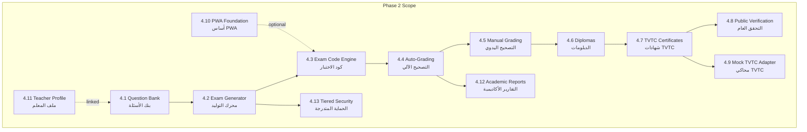
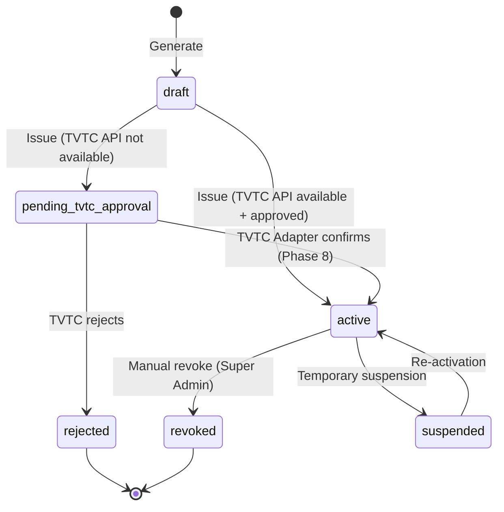
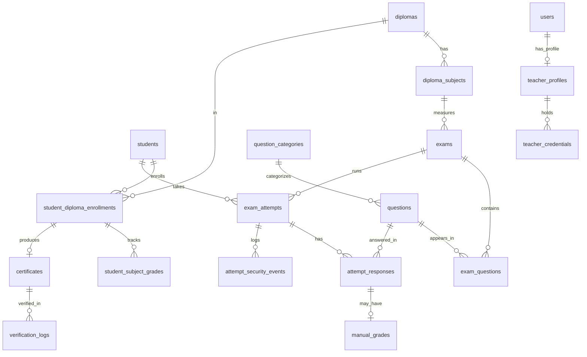
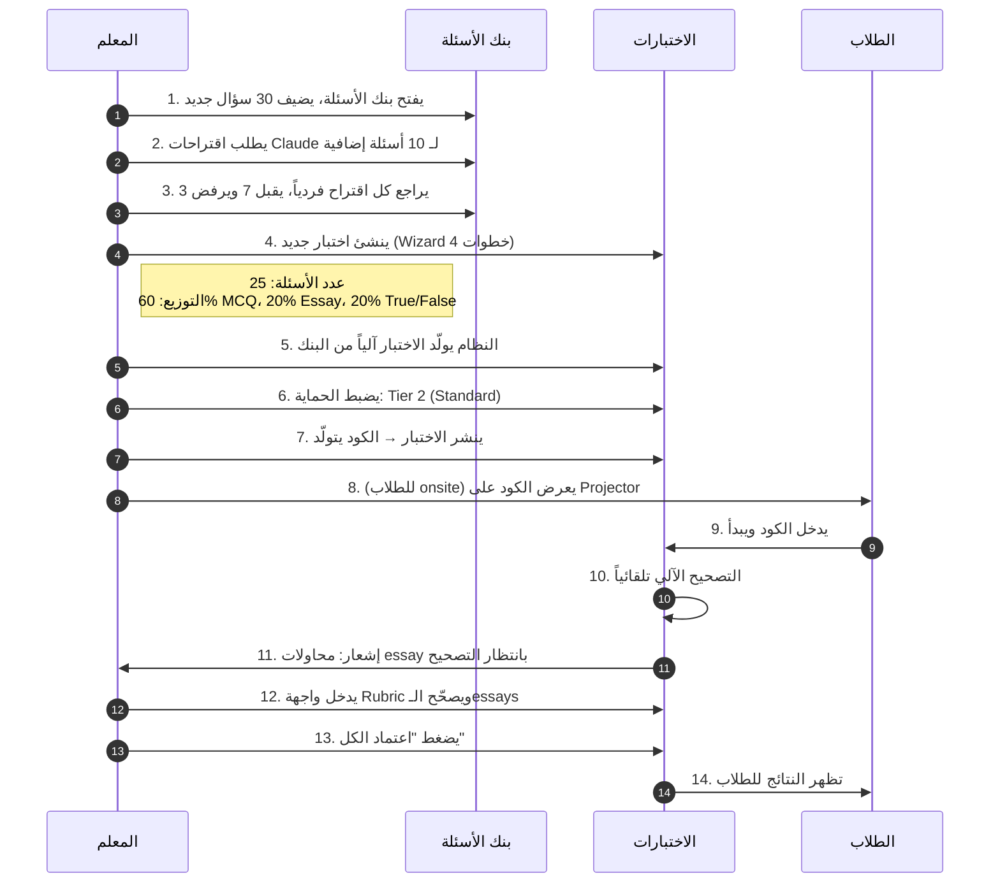
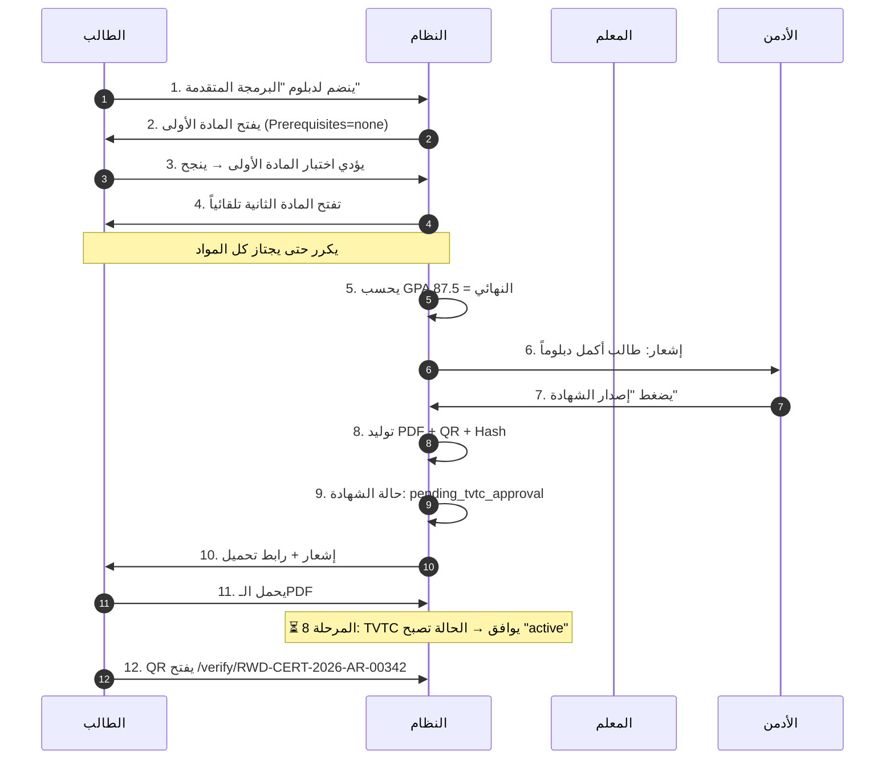
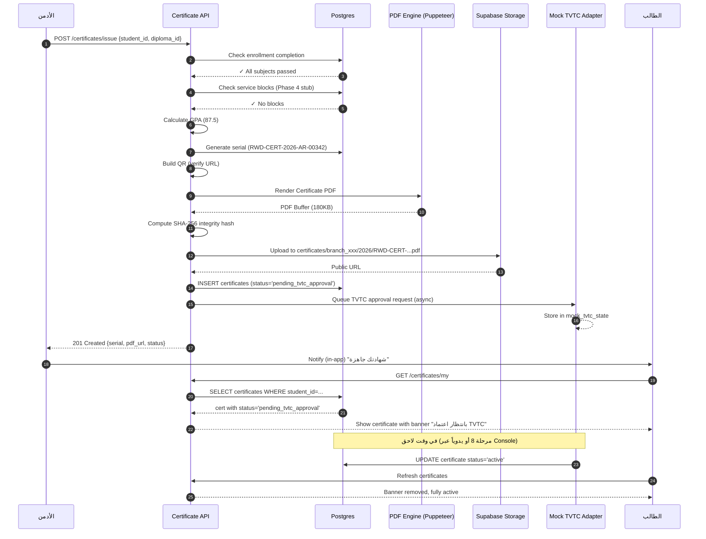
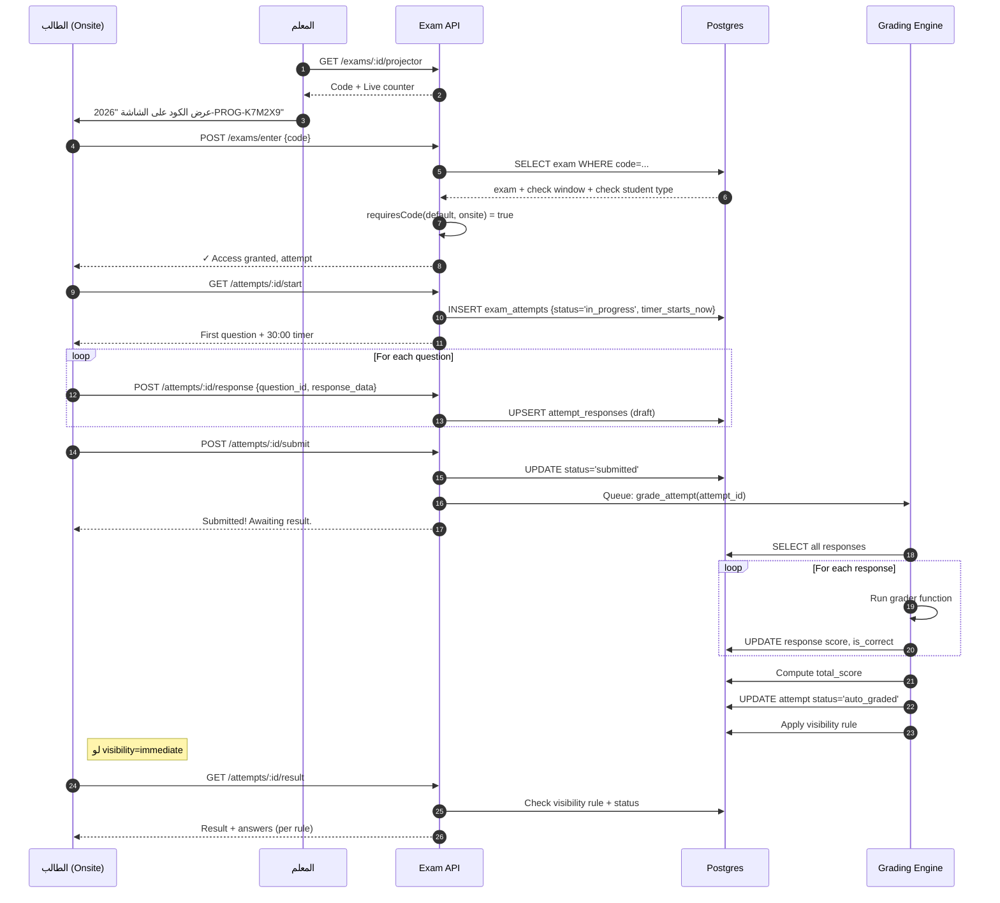

# خطة المرحلة 2 — الاختبارات والشهادات (Examinations & Certifications)

> **المشروع:** نظام إدارة المعهد التدريبي (IIMS)
> **المرحلة:** 02 من 10 — منصة الاختبارات الإلكترونية + الشهادات TVTC
> **التاريخ:** 2026-05-13
> **المعدّ:** Senior Project Manager + Senior Systems Analyst
> **الحالة:** خطة تنفيذية معتمدة (Ready for Sprint Planning)
> **التبعية:** اكتمال المرحلة 1 (التأسيس) شرط مسبق
> **المدة المقدّرة:** 11 أسبوعاً (5 Sprints × أسبوعين + أسبوع تسليم) — 88 يوم عمل
> **الجهد المُجمَّع:** 235-265 يوم/مهندس (انظر القسم 13)

---

## فهرس الأقسام

1. [الملخص التنفيذي](#1-الملخص-التنفيذي)
2. [الأهداف وتعريف النجاح](#2-الأهداف-وتعريف-النجاح)
3. [المتطلبات السابقة (Preconditions)](#3-المتطلبات-السابقة-preconditions)
4. [الموديولات والمكوّنات الإلزامية](#4-الموديولات-والمكوّنات-الإلزامية)
5. [نموذج البيانات (Data Model)](#5-نموذج-البيانات-data-model)
6. [واجهات المستخدم (UI/UX)](#6-واجهات-المستخدم-uiux)
7. [التكاملات (Integrations)](#7-التكاملات-integrations)
8. [الأمان والامتثال (Security & Compliance)](#8-الأمان-والامتثال-security--compliance)
9. [استراتيجية الاختبار (QA Strategy)](#9-استراتيجية-الاختبار-qa-strategy)
10. [خطة الـSprints التفصيلية](#10-خطة-الـsprints-التفصيلية)
11. [معايير القبول (Acceptance Criteria)](#11-معايير-القبول-acceptance-criteria)
12. [المخاطر وخطط التخفيف (Risks & Mitigation)](#12-المخاطر-وخطط-التخفيف-risks--mitigation)
13. [تقدير الجهد والكلفة](#13-تقدير-الجهد-والكلفة)
14. [التسليم والاعتماد (Delivery & Sign-off)](#14-التسليم-والاعتماد-delivery--sign-off)
15. [الانتقال للمرحلة التالية (Transition)](#15-الانتقال-للمرحلة-التالية-transition)

---

## 1. الملخص التنفيذي

### 1.1 لماذا هذه المرحلة الآن؟

منصة الاختبارات هي **المكوّن الأنضج والأكثر قِيَماً تجارياً** في مشروع النظام، وهي البنية التي بُنيت أصلاً قبل ضم بقية الموديولات. اختيارها كمرحلة ثانية مباشرة بعد التأسيس يحقق ثلاثة أهداف استراتيجية:

1. **عرض القيمة للعميل مبكراً (Early Value Demonstration):** خلال 11 أسبوعاً يستلم العميل نظام اختبارات حيّ يمكنه استخدامه على دفعة واحدة من 50-100 طالب، مع شهادات قابلة للتحقق العام. هذا ينقل المشروع من "وعد تقني" إلى "أصل تشغيلي ملموس".

2. **التحقق من المعمارية:** الاختبارات تشغّل كل طبقات النظام — Auth، RLS، Multi-Branch، Storage، Realtime، Background Jobs، PDF Generation، PWA. نجاحها = برهان أن الأساس الذي بُني في المرحلة 1 قادر على تحمّل بقية الموديولات.

3. **بناء أصل البيانات:** بنك الأسئلة (Question Bank) أصل معرفي يبقى للمعهد إلى الأبد. كل أسبوع تأخير = أسئلة تُكتب يدوياً وتُفقد. البدء المبكر يعني تراكم 500-1,000 سؤال بحلول نهاية المرحلة 5.

### 1.2 ما الذي يُسلَّم في هذه المرحلة؟

| المكوّن | الوصف الموجز | حالة التسليم |
|---------|--------------|---------------|
| **بنك الأسئلة المركزي** | جداول + APIs + واجهات لـ14 نوع سؤال + 3 قنوات إدخال (يدوي، Excel، Claude AI) | كامل |
| **محرك توليد الاختبارات** | Auto + Manual، 5 خيارات لعرض النتيجة، 3 أنماط دخول | كامل |
| **آلية كود الاختبار** | توليد + إعادة توليد + Projector Mode + بطاقة طباعة | كامل |
| **التصحيح الآلي** | 13 نوع سؤال يُصحَّح آلياً، الأخير (essay) يدوي | كامل |
| **التصحيح اليدوي (Rubric)** | واجهة معلم لتصحيح المقالي + اعتماد قبل النشر | كامل |
| **نظام الدبلومات** | Prerequisites، حد النجاح، GPA، توليد شهادات | كامل |
| **شهادة TVTC المعتمدة** ⭐#2 | شعار TVTC، رقم اعتماد، السلم الوظيفي، QR ثنائي التحقق | كامل (State: pending_tvtc_approval قبل المرحلة 8) |
| **صفحة التحقق العامة `/verify/:serial`** | بدون تسجيل دخول، Rate-limited، QR scannable | كامل |
| **Mock Adapter لـ TVTC API** ⭐#17 | Mock Server محلي يحاكي 3 endpoints | كامل |
| **PWA أساسي** | Manifest + SW + Offline cache للأسئلة + استمارات التحضير | أساس قابل للترقية في المرحلة 7 |
| **ملف المعلم الأساسي** ⭐#6 جزء 1 | جدول teacher_profiles + Tab "ملفي" + رفع المؤهلات | أساس قابل للترقية في المرحلة 9 |
| **التقارير الأكاديمية الأساسية** | متوسط، انحراف، Item Analysis، أصعب/أسهل سؤال | كامل |
| **الحماية المتدرجة (3 طبقات)** | Basic (دائم) + Standard (اختياري) + Advanced (Realtime) | كامل |

### 1.3 ما الذي **لا** يدخل في هذه المرحلة (Out-of-Scope)؟

- ❌ **التكامل الفعلي مع TVTC API** — مؤجَّل للمرحلة 8 (يبقى Mock Adapter يعمل).
- ❌ **WhatsApp Notifications** — مؤجَّلة للمرحلة 10 (إشعارات داخل النظام فقط الآن).
- ❌ **التحضير الميداني الكامل + GPS Geofencing** — أساس فقط الآن، النضج في المرحلة 7.
- ❌ **مراقبة الكاميرا (Webcam Proctoring)** — خارج النطاق الكلي للنظام (قرار العميل).
- ❌ **إدارة الجلسات الدراسية اليومية والجداول** — مرحلة 7.
- ❌ **الربط مع وزارة الموارد البشرية أو نظام نفاذ** — مؤجَّل (قرار العميل: لاحقاً).
- ❌ **إدارة المدفوعات/المالية للاختبارات (مثلاً رسوم الإعادة)** — مرحلة 4.

### 1.4 الفلسفة التصميمية لهذه المرحلة

> **"بناء أصل معرفي مملوك للمعهد، مع تجربة طالب لا تنكسر تحت ضغط 100 طالب في وقت واحد، ومخرجات معتمدة قانونياً."**

ثلاث مبادئ توجيهية:

1. **Question Bank as a First-Class Asset:** السؤال ليس "حقل في اختبار"، بل **كيان مستقل** له تاريخ استخدام، معامل تمييز، حالة (مسودة/قيد المراجعة/نشط/أرشيف)، وقابلية إعادة الاستخدام في عدة اختبارات. كل قرار تصميمي يحترم هذا.

2. **Grading is a State Machine:** التصحيح ليس "حساب مجموع". كل محاولة تمرّ بحالات (in_progress → submitted → auto_graded → pending_manual → graded → approved → published). كل انتقال له `actor`, `timestamp`, `reason`، ومحفوظ في `audit_log`.

3. **TVTC-Ready, Not TVTC-Dependent:** نُصمّم الشهادات بمواصفات TVTC الكاملة (شعار، رقم اعتماد، سلم وظيفي، QR ثنائي) لكن **لا نتوقف عند غياب الـAPI**. الشهادات تُصدَر بحالة `pending_tvtc_approval` ويبقى QR Code يتحقق محلياً، وحين تتاح TVTC API في المرحلة 8 يُفعَّل التحقق المتقاطع تلقائياً.

### 1.5 المخرجات الكميّة المتوقعة بنهاية المرحلة

- **15 جدول قاعدة بيانات جديد** (انظر القسم 5).
- **42 API endpoint** (REST/RPC) موزَّعة على 6 وحدات (Questions, Exams, Attempts, Grading, Diplomas, Certificates).
- **28 شاشة UI** (انظر القسم 6).
- **3 Background Jobs** (Cleanup expired attempts, Item analysis cron, Certificate generator).
- **150+ Unit Tests + 25 E2E Tests** (Playwright).
- **مستند Mock TVTC API** قابل للنشر منفصلاً.

---

## 2. الأهداف وتعريف النجاح

### 2.1 الأهداف الاستراتيجية

| # | الهدف الاستراتيجي | المؤشر القابل للقياس (KPI) | الهدف الكمي بنهاية المرحلة |
|---|--------------------|------------------------------|------------------------------|
| **G1** | **بنك أسئلة وظيفي** | عدد الأسئلة المُدخَلة، عدد المعلمين المساهمين | ≥ 200 سؤال × 5 معلمين تجريبياً |
| **G2** | **اختبار حيّ بـ50 طالباً** | عدد المحاولات الناجحة، نسبة فشل التسليم | 50 طالب × ≥ 95% تسليم ناجح |
| **G3** | **شهادة TVTC قابلة للتحقق** | عدد الشهادات المُولَّدة، عدد عمليات التحقق العامة | ≥ 10 شهادات تجريبية + 50 تحقق ناجح |
| **G4** | **PWA يعمل offline** | معدل المزامنة بعد الانقطاع، Lighthouse PWA Score | ≥ 90 / 100 |
| **G5** | **التصحيح الآلي بدقة 100%** | فروقات بين الآلي والمراجعة اليدوية | 0 فروق في 1,000 محاولة |
| **G6** | **حماية اختبار من تبديل التابات** | عدد المحاولات الموقفة آلياً، نسبة False Positive | ≥ 95% كشف صحيح |

### 2.2 معايير "Done" للمرحلة

تُعتبر المرحلة منتهية عند تحقق كل ما يلي مجتمعاً:

- [x] جميع المكوّنات الـ13 في القسم 4 منفَّذة + مختبَرة.
- [x] **اختبار قبول العميل (UAT)** يجري على فرع تجريبي واحد بـ50 طالباً ويُجاز.
- [x] **0 مشاكل أمنية حرجة** (Critical/High) في تقرير الـSecurity Review.
- [x] **0 Migration Errors** في قاعدة البيانات.
- [x] **Code Coverage ≥ 75%** للوحدات الجوهرية (Grading Engine, Exam Generation, Certificate Issuance).
- [x] **Documentation مكتمل:** API Reference، Database Schema، Runbooks لـ3 سيناريوهات تشغيلية (Code Reset، Manual Grading، Certificate Re-issuance).
- [x] **Performance Benchmark:** اختبار بـ100 طالب متزامن يكمل في <60 ثانية لعرض السؤال (P95).

### 2.3 ما يُقاس بعد الإطلاق (Post-Launch Metrics)

تُقاس خلال 4 أسابيع بعد الإطلاق التجريبي:

| المقياس | الحد الأدنى المقبول | الهدف الطموح |
|---------|--------------------|----------------|
| Uptime منصة الاختبارات | 99.0% | 99.9% |
| متوسط زمن تحميل سؤال (P95) | < 2 ثانية | < 800ms |
| نسبة المحاولات المُسلَّمة بنجاح | ≥ 95% | ≥ 99% |
| نسبة Auto-Grading Accuracy | ≥ 99% | 100% |
| متوسط زمن توليد الشهادة | < 30 ثانية | < 10 ثوان |
| نسبة الـ Cache Hit للأسئلة | ≥ 70% | ≥ 90% |

---

## 3. المتطلبات السابقة (Preconditions)

### 3.1 من المرحلة 1 (التأسيس) — إلزامي

> ⚠️ **لا يبدأ Sprint 1 من المرحلة 2 إلا بعد تأكيد اكتمال كل هذه البنود.**

| البند | المسؤول عن التأكيد | كيف نتحقق |
|------|----------------------|------------|
| Next.js 14 + TypeScript Project مُهيَّأ | DevOps Lead | `pnpm dev` يعمل بلا أخطاء |
| Supabase Project موجود + متّصل | Tech Lead | RLS مفعّل + Migrations stack جاهز |
| جداول Core (`tenants`, `branches`, `users`, `roles`, `audit_log`, `students`) موجودة | DBA | فحص Schema يدوي |
| Auth Flow كامل (login, logout, password reset, 2FA لـsuper_admin) | Auth Lead | اختبار يدوي + Playwright |
| RLS Policies على Core Tables تعمل (Multi-Branch isolation) | Security Lead | اختبار Cross-Branch Access Denied |
| Roles & Permissions (RBAC) موجود مع matrix محفوظ في `permissions` table | Tech Lead | استعلام `SELECT * FROM permissions` يُرجع ≥ 50 صف |
| Tailwind + shadcn/ui مُهيَّأ + Theme عربي RTL | UI Lead | لقطة شاشة من Login |
| Audit Log Trigger يعمل على Core Tables | DBA | INSERT/UPDATE يُسجَّل تلقائياً |
| Supabase Storage Buckets جاهزة: `attachments`, `letters`, `certificates`, `media-questions` | DevOps | فحص في Supabase Dashboard |
| ESLint + Prettier + Husky pre-commit hooks | Tech Lead | `git commit` يفشل عند Warning |
| CI Pipeline (GitHub Actions) — Build + Test + Lint | DevOps | آخر Build في `main` Green |
| `.env.example` كامل + Secret Management عبر Vercel/Supabase | DevOps | لا أسرار في الـrepo |

### 3.2 المتطلبات الخارجية (Client-Side Confirmations)

> 📋 **هذه نقاط تحتاج إجابة من العميل قبل Sprint 2.** قائمة الـRACI:

| البند | المسؤول | الموعد النهائي |
|------|---------|------------------|
| تأكيد قالب الشهادة (HTML + CSS) من ناحية الهوية البصرية | العميل + UI Lead | بنهاية Sprint 1 |
| تأكيد قائمة الدبلومات الأولية (الأسماء + المواد + Prerequisites) | العميل (شؤون المتدربين) | بنهاية Sprint 1 |
| تأكيد قائمة المعلمين الأوائل + المواد المعتمدين لها | العميل (الإدارة) | بنهاية Sprint 1 |
| تأكيد رقم اعتماد TVTC لكل برنامج (إن وُجد) | العميل (الإدارة + TVTC) | بنهاية Sprint 2 |
| اعتماد قاعدة الـMVP "كم سؤال إلزامي قبل اختبار حيّ؟" | العميل | بنهاية Sprint 1 |
| اعتماد سياسة المحاولات المتعددة (هل تأخذ الأعلى، الأخيرة، المتوسط؟) | العميل | بنهاية Sprint 2 |
| تأكيد سياسة الأزمنة (Business Hours، نهاية الأسبوع، الإجازات) | العميل | بنهاية Sprint 1 |
| تأكيد سياسة التشفير (هل نُشفّر الأسئلة في الـDB؟) | العميل + Security Lead | بنهاية Sprint 1 |
| نموذج Excel للاستيراد — موافقة على الـSchema | العميل + معلم تجريبي | بنهاية Sprint 2 |

### 3.3 المتطلبات التقنية (Infrastructure & Tooling)

```yaml
required_services:
  - name: Supabase
    plan: Pro (إذا تجاوزنا Free Limits خلال Sprint 3)
    features: [Postgres, Auth, Storage, Realtime, Edge Functions]
  - name: Vercel
    plan: Pro (للـ Cron Jobs و Background Functions)
    features: [Edge Functions, Cron, Analytics]
  - name: Cloudflare R2 (احتياطي للوسائط)
    plan: Free Tier (< 10GB)
    features: [S3-compatible Storage]
  - name: Anthropic Claude API
    plan: Pay-as-you-go
    features: [claude-3-5-sonnet للاقتراح الذكي]
  - name: GitHub Actions
    plan: Free (2,000 دقيقة/شهر كافية)
    features: [CI/CD, Secrets]

required_libraries:
  - "@supabase/supabase-js": "^2.45.0"
  - "@supabase/ssr": "^0.5.0"
  - "next": "14.2.x"
  - "react": "18.3.x"
  - "typescript": "5.5.x"
  - "tailwindcss": "3.4.x"
  - "shadcn/ui": "latest"
  - "xstate": "^5.18.0"
  - "puppeteer": "^23.0.0"  # توليد PDF
  - "@sparticuz/chromium": "^127.0.0"  # للسيرفرلس
  - "qrcode": "^1.5.4"
  - "handlebars": "^4.7.8"  # قوالب الشهادات
  - "exceljs": "^4.4.0"  # استيراد Excel
  - "katex": "^0.16.11"  # عرض LaTeX
  - "mathjs": "^13.0.0"  # تقييم رياضي
  - "next-pwa": "^5.6.0"
  - "@anthropic-ai/sdk": "^0.27.0"  # Claude AI
  - "zod": "^3.23.0"  # Validation
  - "react-hook-form": "^7.52.0"
  - "@hello-pangea/dnd": "^16.6.0"  # Drag & Drop questions
  - "isolated-vm": "^5.0.1"  # JS Code Question Runner
```

---

## 4. الموديولات والمكوّنات الإلزامية

### 4.1 خريطة الموديولات (Module Map)



### 4.2 4.1 — بنك الأسئلة المركزي (Question Bank)

#### 4.2.1 الكيانات الأساسية

```typescript
// types/question.ts
export type QuestionType =
  | 'mcq_single' | 'mcq_multi' | 'true_false' | 'fill_blank'
  | 'ordering' | 'matching' | 'drag_drop' | 'hotspot'
  | 'short_answer' | 'essay' | 'math_latex' | 'code_editor'
  | 'media_question' | 'case_study';

export type Difficulty = 'easy' | 'medium' | 'hard';
export type QuestionStatus = 'draft' | 'pending_review' | 'active' | 'archived' | 'rejected';

export interface Question<T extends QuestionType = QuestionType> {
  id: string;
  type: T;
  category_id: string;
  difficulty: Difficulty;
  weight: number;
  question_data: QuestionDataMap[T];
  answer_data: AnswerDataMap[T];
  tags: string[];
  learning_outcome: string | null;
  status: QuestionStatus;
  created_by: string;
  reviewed_by: string | null;
  usage_count: number;
  avg_correct_rate: number | null;
  discrimination_index: number | null;
  created_at: string;
  updated_at: string;
}
```

#### 4.2.2 قنوات الإدخال الثلاث — متطلبات وظيفية

| القناة | الـUI | الفاحص | شروط القبول |
|--------|------|---------|---------------|
| **يدوي** | Form ديناميكي يتغيّر حسب النوع | Zod Schema lifecycle (Client → Server) | تحقق لحظي + رسائل خطأ عربية |
| **Excel Import** | Drag & Drop + قالب جاهز للتحميل | exceljs → Zod array | تقرير أخطاء صف بصف + Undo قبل الحفظ |
| **Claude AI** | Form: مادة + موضوع + N + نوع + صعوبة + Prompt إضافي | يستدعي Claude → يعرض → معلم يوافق فردياً | لا يُحفظ شيء إلا بعد موافقة فردية على كل سؤال |

#### 4.2.3 الـ14 نوع سؤال — جدول التنفيذ السريع

| # | النوع | UI Component | Validator | Grader Function | يدعم وسائط |
|---|------|---------------|-----------|-----------------|-------------|
| 1 | mcq_single | `<MCQSingleEditor>` | `mcqSingleSchema` | `gradeMCQSingle` | الخيارات |
| 2 | mcq_multi | `<MCQMultiEditor>` | `mcqMultiSchema` | `gradeMCQMulti` (3 طرق) | الخيارات |
| 3 | true_false | `<TrueFalseEditor>` | `trueFalseSchema` | `gradeTrueFalse` | لا |
| 4 | fill_blank | `<FillBlankEditor>` | `fillBlankSchema` | `gradeFillBlank` (مرادفات) | لا |
| 5 | ordering | `<OrderingEditor>` | `orderingSchema` | `gradeOrdering` (2 طرق) | لا |
| 6 | matching | `<MatchingEditor>` | `matchingSchema` | `gradeMatching` | لا |
| 7 | drag_drop | `<DragDropEditor>` (Canvas) | `dragDropSchema` | `gradeDragDrop` | إلزامي (Background) |
| 8 | hotspot | `<HotspotEditor>` (Canvas) | `hotspotSchema` | `gradeHotspot` (هندسي) | إلزامي |
| 9 | short_answer | `<ShortAnswerEditor>` | `shortAnswerSchema` | `gradeShortAnswer` (3 أوضاع) | لا |
| 10 | essay | `<EssayEditor>` + Rubric | `essaySchema` | **manual** | اختياري |
| 11 | math_latex | `<MathEditor>` (KaTeX) | `mathSchema` | `gradeMath` (mathjs) | لا |
| 12 | code_editor | `<CodeEditor>` (Monaco) | `codeSchema` | `gradeCode` (isolated-vm) | لا |
| 13 | media_question | `<MediaQuestionEditor>` | `mediaSchema` | delegates to sub_question | إلزامي |
| 14 | case_study | `<CaseStudyEditor>` | `caseStudySchema` | sum of sub_questions | اختياري |

#### 4.2.4 خوارزمية التطبيع العربي (Arabic Normalization)

> هذه الدالة جوهرية لـ `fill_blank` و `short_answer` لتقبل إجابات بأشكال إملائية مختلفة (ألف بأنواعها، تاء مربوطة/مفتوحة، إلخ).

```typescript
// lib/grading/normalize-arabic.ts
const ARABIC_DIACRITICS = /[ً-ْٰـ]/g; // التشكيل + التطويل
const ALEF_VARIANTS = /[آأإٱ]/g;
const YA_VARIANTS = /ى/g;
const TA_MARBUTA = /ة/g;

export function normalizeArabic(text: string): string {
  return text
    .replace(ARABIC_DIACRITICS, '')
    .replace(ALEF_VARIANTS, 'ا')
    .replace(YA_VARIANTS, 'ي')
    .replace(TA_MARBUTA, 'ه')
    .trim()
    .replace(/\s+/g, ' ');
}

export function fuzzyMatchArabic(answer: string, accepted: string[], threshold = 1.0): boolean {
  const a = normalizeArabic(answer);
  return accepted.some(ac => normalizeArabic(ac) === a);
}
```

### 4.3 4.2 — محرك توليد الاختبارات (Exam Generator)

#### 4.3.1 وضعا التشغيل

```typescript
// types/exam-generation.ts
export type ExamGenerationRequest =
  | { mode: 'manual'; question_ids: string[] }
  | { mode: 'auto'; spec: ExamAutoSpec };

export interface ExamAutoSpec {
  total_questions: number;
  category_ids: string[];
  type_distribution: Array<{ type: QuestionType; count: number; weight_override?: number }>;
  difficulty_distribution: { easy: number; medium: number; hard: number }; // total = 100
  must_include_tags?: string[];
  exclude_used_in_last_days?: number;
  diversification_seed?: string; // لضمان توليد متباين لكل طالب لو رغبنا
}
```

#### 4.3.2 خوارزمية التوليد التلقائي — Pseudo-Code معتمد

```typescript
// lib/exam/auto-generator.ts
export async function generateExamPool(spec: ExamAutoSpec): Promise<Question[]> {
  // 1. التحقق من توزيع الصعوبات (يجب أن يكون مجموعه 100)
  const dd = spec.difficulty_distribution;
  if (dd.easy + dd.medium + dd.hard !== 100) {
    throw new ValidationError('difficulty_distribution must sum to 100');
  }

  // 2. التحقق من إجمالي عدد الأسئلة
  const totalFromTypes = spec.type_distribution.reduce((s, t) => s + t.count, 0);
  if (totalFromTypes !== spec.total_questions) {
    throw new ValidationError(
      `type_distribution sum (${totalFromTypes}) ≠ total_questions (${spec.total_questions})`
    );
  }

  const pool: Question[] = [];

  for (const td of spec.type_distribution) {
    // قسّم العدد على الصعوبات
    const easyCount = Math.round(td.count * dd.easy / 100);
    const medCount = Math.round(td.count * dd.medium / 100);
    const hardCount = td.count - easyCount - medCount;

    for (const [diff, n] of [['easy', easyCount], ['medium', medCount], ['hard', hardCount]] as const) {
      if (n === 0) continue;
      const candidates = await fetchCandidates({
        type: td.type,
        difficulty: diff,
        categories: spec.category_ids,
        excludeRecentDays: spec.exclude_used_in_last_days,
        mustIncludeTags: spec.must_include_tags,
      });

      if (candidates.length < n) {
        throw new InsufficientQuestionsError({
          type: td.type,
          difficulty: diff,
          need: n,
          have: candidates.length,
          suggestion: 'أضف أسئلة جديدة في البنك أو غيّر التوزيع',
        });
      }

      pool.push(...weightedRandomPick(candidates, n, td.weight_override));
    }
  }

  return pool;
}

function weightedRandomPick(candidates: Question[], n: number, weightOverride?: number): Question[] {
  // Weighted by inverse of usage_count (تفضيل الأقل استخداماً)
  const weights = candidates.map(q => 1 / (q.usage_count + 1));
  const result: Question[] = [];
  const pool = [...candidates];

  for (let i = 0; i < n; i++) {
    const totalWeight = weights.reduce((s, w) => s + w, 0);
    let rand = Math.random() * totalWeight;
    let idx = 0;
    while (rand > 0 && idx < weights.length) {
      rand -= weights[idx];
      if (rand <= 0) break;
      idx++;
    }
    const chosen = pool[idx];
    if (weightOverride) chosen.weight = weightOverride;
    result.push(chosen);
    pool.splice(idx, 1);
    weights.splice(idx, 1);
  }
  return result;
}
```

#### 4.3.3 إعدادات الاختبار (Exam Settings) — TypeScript

```typescript
export interface ExamSettings {
  // الزمن
  duration_seconds: number;
  per_question_time_seconds?: number; // اختياري — يلغي duration

  // النافذة الزمنية
  attempt_window: { start: string; end: string }; // ISO datetime

  // المحاولات
  max_attempts: number; // 1, 2, 3...
  attempt_score_policy: 'highest' | 'last' | 'average'; // أيها يُحتسَب في النهاية

  // الخلط
  shuffle_questions: boolean;
  shuffle_options: boolean;

  // عرض النتيجة (5 خيارات)
  result_visibility:
    | { type: 'immediate'; show_correct_answers: boolean; show_explanations: boolean }
    | { type: 'scheduled'; reveal_at: string; show_correct_answers: boolean }
    | { type: 'manual_release'; admin_only_after: boolean }
    | { type: 'after_window_close'; show_correct_answers: true }
    | { type: 'never_show_answers'; show_score_only: true };

  // الحماية
  security_level: 'basic' | 'standard' | 'advanced';
  security_options?: {
    require_fullscreen?: boolean;
    detect_tab_switch?: boolean;
    block_copy_paste?: boolean;
    block_right_click?: boolean;
    lock_to_ip_range?: string[]; // CIDR
    require_browser_fingerprint?: boolean;
    realtime_proctor?: boolean;
  };

  // نمط الدخول
  access_mode: 'default' | 'code_for_all' | 'open_for_all';

  // اعتماد قبل النشر
  require_approval_before_publish: boolean;

  // إشعارات
  notify_on_submit: boolean;
  remind_before_minutes?: number;
}
```

### 4.4 4.3 — آلية كود الاختبار (Exam Code Engine)

#### 4.4.1 منطق الدخول الذكي

```typescript
// lib/exam/access-rules.ts
export type StudentEnrollmentType = 'remote' | 'onsite';
export type ExamAccessMode = 'default' | 'code_for_all' | 'open_for_all';

export function requiresCode(
  examMode: ExamAccessMode,
  studentType: StudentEnrollmentType
): boolean {
  if (examMode === 'open_for_all') return false;
  if (examMode === 'code_for_all') return true;
  // default mode
  return studentType === 'onsite';
}

// مصفوفة الكشف
export function canSeeCode(role: UserRole, examOwnerId: string, viewerId: string): boolean {
  if (role === 'super_admin') return true;
  if (role === 'branch_manager') return true; // داخل فرعه فقط (RLS)
  if (role === 'instructor') return examOwnerId === viewerId;
  return false;
}
```

#### 4.4.2 توليد الكود — SQL Function

```sql
-- migrations/202605_exam_code_gen.sql
CREATE OR REPLACE FUNCTION generate_exam_code(p_subject_slug TEXT)
RETURNS TEXT AS $$
DECLARE
  v_code TEXT;
  v_attempts INTEGER := 0;
BEGIN
  LOOP
    v_code := CONCAT(
      EXTRACT(YEAR FROM NOW())::TEXT, '-',
      UPPER(SUBSTRING(REGEXP_REPLACE(p_subject_slug, '[^A-Za-z0-9]', '', 'g'), 1, 4)), '-',
      UPPER(SUBSTRING(REPLACE(gen_random_uuid()::TEXT, '-', '') FROM 1 FOR 6))
    );
    -- ضمان التفرّد
    IF NOT EXISTS (SELECT 1 FROM exams WHERE code = v_code) THEN
      RETURN v_code;
    END IF;
    v_attempts := v_attempts + 1;
    IF v_attempts > 5 THEN
      RAISE EXCEPTION 'Could not generate unique exam code after 5 attempts';
    END IF;
  END LOOP;
END;
$$ LANGUAGE plpgsql SECURITY DEFINER;
```

#### 4.4.3 إعادة توليد الكود (Code Reset)

عند تسرّب الكود، المعلم/الأدمن يضغط "تجديد الكود" → API:

```typescript
// app/api/exams/[id]/regenerate-code/route.ts
export async function POST(req: Request, { params }: { params: { id: string } }) {
  const { reason } = await req.json();
  const user = await getCurrentUser();

  // فحص الصلاحية
  const exam = await db.exams.findById(params.id);
  if (!canSeeCode(user.role, exam.created_by, user.id)) {
    return new Response('Forbidden', { status: 403 });
  }

  // فحص: لا تجديد لاختبار بدأ فعلاً (active attempts > 0)
  const activeAttempts = await db.exam_attempts.count({
    exam_id: params.id,
    status: 'in_progress',
  });
  if (activeAttempts > 0) {
    return new Response(
      JSON.stringify({ error: 'لا يمكن تجديد الكود أثناء وجود محاولات نشطة' }),
      { status: 409 }
    );
  }

  // توليد كود جديد
  const newCode = await db.rpc('generate_exam_code', { p_subject_slug: exam.subject_slug });

  // تحديث + Audit
  await db.exams.update(params.id, { code: newCode, code_regenerated_at: new Date() });
  await audit('EXAM_CODE_REGENERATED', {
    exam_id: params.id,
    old_code: exam.code, // مشفّر في الـlog
    new_code: newCode,
    reason,
    actor: user.id,
  });

  return Response.json({ code: newCode });
}
```

#### 4.4.4 Projector Mode + بطاقة طباعة

شاشتان منفصلتان:

- `/exam/[id]/projector` — Full-screen، الكود بخط 96pt، QR، عدّاد الداخلين Live (Supabase Realtime).
- `/exam/[id]/code-card` — قالب A5 قابل للطباعة، يحوي: اسم الاختبار + الكود + QR + تعليمات قصيرة للطالب.

### 4.5 4.4 — التصحيح الآلي (Auto-Grading Engine)

#### 4.5.1 المعمارية العامة

```mermaid
flowchart LR
    A[Student Submits Attempt] --> B[Queue Job: grade_attempt]
    B --> C[For each response in attempt]
    C --> D{Question type}
    D -->|Auto-gradable| E[Run grader function]
    D -->|Essay| F[Mark pending_manual]
    E --> G[Save response_grade + Save raw output if code]
    F --> H[Notify teacher]
    G --> I{All responses processed?}
    H --> I
    I -->|All auto-done| J[Compute attempt total]
    I -->|Has pending essay| K[Set attempt status=pending_manual_review]
    J --> L{Result visibility rule}
    K --> M[Wait for teacher grading]
    M --> J
    L -->|immediate| N[Publish to student]
    L -->|scheduled| O[Schedule reveal job]
    L -->|manual| P[Hold until admin releases]
    N --> Q[Audit: ATTEMPT_GRADED]
    O --> Q
    P --> Q
```



#### 4.5.2 الـ Grader Registry (Pattern)

```typescript
// lib/grading/registry.ts
type GraderFn<T extends QuestionType> = (
  question: Question<T>,
  response: ResponseDataMap[T]
) => Promise<GradeResult> | GradeResult;

type GradeResult = {
  score: number;
  max_score: number;
  is_correct: boolean;
  partial_credit?: boolean;
  feedback?: string;
  metadata?: Record<string, unknown>; // مثلاً: نتائج test cases للكود
};

export const GRADERS: { [K in QuestionType]: GraderFn<K> } = {
  mcq_single: gradeMCQSingle,
  mcq_multi: gradeMCQMulti,
  true_false: gradeTrueFalse,
  fill_blank: gradeFillBlank,
  ordering: gradeOrdering,
  matching: gradeMatching,
  drag_drop: gradeDragDrop,
  hotspot: gradeHotspot,
  short_answer: gradeShortAnswer,
  essay: gradeEssay, // returns { score: 0, is_correct: false, metadata: { requires_manual: true } }
  math_latex: gradeMathLatex,
  code_editor: gradeCodeEditor,
  media_question: gradeMediaQuestion,
  case_study: gradeCaseStudy,
};

export async function gradeResponse(
  question: Question,
  response: unknown
): Promise<GradeResult> {
  const grader = GRADERS[question.type];
  if (!grader) throw new Error(`No grader registered for type ${question.type}`);
  return grader(question as any, response as any);
}
```

#### 4.5.3 معاملات السؤال (Weight + Partial Credit)

```typescript
// كل سؤال له:
// - weight: المعامل (الافتراضي 1.0)
// - max_score: محسوبة = weight × base_score (عادة 100 للسؤال الكامل)

// مثال: سؤال MCQ Multi بـ weight=2 وطريقة partial:
// - 3 إجابات صحيحة مطلوبة
// - الطالب اختار 2 صحيحة + 1 خطأ
// - partial: score = (2/3) × 2 = 1.33

// مثال: سؤال Code بـ 5 test cases (كل واحد weight=0.2):
// - الطالب نجح في 4 من 5
// - score = 0.8 × question.weight
```

### 4.6 4.5 — التصحيح اليدوي للمقالي (Manual Grading + Rubric)

#### 4.6.1 الـ Rubric Schema

```typescript
export interface RubricCriterion {
  id: string;
  label_ar: string;
  description_ar: string;
  max_points: number;
  required: boolean;
}

export interface EssayQuestion {
  // ... existing fields
  question_data: {
    prompt: string;
    min_words?: number;
    max_words?: number;
    rubric: RubricCriterion[];
    sample_answer?: string; // مرجع للمعلم فقط
  };
}

export interface ManualGradeEntry {
  attempt_response_id: string;
  rubric_scores: Array<{
    criterion_id: string;
    points: number;
    notes_ar?: string;
  }>;
  overall_feedback?: string;
  graded_by: string;
  graded_at: string;
}
```

#### 4.6.2 واجهة التصحيح اليدوي — Workflow

1. المعلم يفتح `/teacher/grading/pending` — قائمة محاولات بانتظار التصحيح.
2. يضغط على محاولة → يفتح `/teacher/grading/[response_id]`:
   - يميناً: نص السؤال + Rubric.
   - يساراً: إجابة الطالب.
   - أسفل: عداد كلمات، حقل ملاحظات عامة، أزرار "حفظ ومتابعة" / "حفظ وإغلاق".
3. عند الـSubmit: حساب المجموع تلقائياً + التحقق من أن جميع المعايير ذات `required=true` لها درجة.
4. إذا كان `require_approval_before_publish=true` → الحالة تنتقل لـ `awaiting_approval` ويُشعَر المشرف الأكاديمي.

#### 4.6.3 اعتماد الدرجات (Grade Approval)

```typescript
// app/api/grading/[attemptId]/approve/route.ts
export async function POST(req: Request, { params }) {
  const user = await getCurrentUser();
  if (!user.permissions.includes('grades.approve')) {
    return new Response('Forbidden', { status: 403 });
  }

  const attempt = await db.exam_attempts.findById(params.attemptId);
  if (attempt.status !== 'awaiting_approval') {
    return new Response('Invalid state', { status: 409 });
  }

  // كل المحاولات لنفس الاختبار يجب أن تُعتَمَد دفعة واحدة (تجنب الفروق)
  const { approve_all } = await req.json();
  const where = approve_all
    ? { exam_id: attempt.exam_id, status: 'awaiting_approval' }
    : { id: attempt.id };

  await db.exam_attempts.updateMany(where, {
    status: 'graded_approved',
    approved_by: user.id,
    approved_at: new Date(),
  });

  // تطبيق Result Visibility Rule
  await applyVisibilityRule(attempt.exam_id);

  await audit('GRADES_APPROVED', { exam_id: attempt.exam_id, count: approve_all ? '*' : 1 });

  return Response.json({ ok: true });
}
```

### 4.7 4.6 — نظام الدبلومات (Diplomas)

#### 4.7.1 المخطط

```sql
CREATE TABLE diplomas (
  id                UUID PRIMARY KEY DEFAULT gen_random_uuid(),
  branch_id         UUID REFERENCES branches(id),
  code              TEXT UNIQUE NOT NULL,
  name_ar           TEXT NOT NULL,
  name_en           TEXT,
  description_ar    TEXT,
  duration_months   SMALLINT,
  passing_grade     NUMERIC(5,2) DEFAULT 60,
  tvtc_program_code TEXT,                        -- رقم TVTC للبرنامج (إن وُجد)
  tvtc_level        SMALLINT,                    -- السلم الوظيفي 1-7
  status            TEXT DEFAULT 'active' CHECK (status IN ('active','archived','draft')),
  created_at        TIMESTAMPTZ DEFAULT NOW(),
  updated_at        TIMESTAMPTZ DEFAULT NOW()
);

CREATE TABLE diploma_subjects (
  id                       UUID PRIMARY KEY DEFAULT gen_random_uuid(),
  diploma_id               UUID REFERENCES diplomas(id) ON DELETE CASCADE,
  code                     TEXT NOT NULL,
  name_ar                  TEXT NOT NULL,
  sequence                 SMALLINT NOT NULL,
  prerequisite_subject_id  UUID REFERENCES diploma_subjects(id),
  passing_grade            NUMERIC(5,2),
  max_retakes              SMALLINT DEFAULT 2,
  weight_in_gpa            NUMERIC(5,2) DEFAULT 1.0,
  hours                    SMALLINT,
  UNIQUE(diploma_id, sequence),
  UNIQUE(diploma_id, code)
);

CREATE TABLE student_diploma_enrollments (
  id              UUID PRIMARY KEY DEFAULT gen_random_uuid(),
  student_id      UUID REFERENCES students(id),
  diploma_id      UUID REFERENCES diplomas(id),
  status          TEXT DEFAULT 'in_progress'
    CHECK (status IN ('in_progress','completed','withdrawn','suspended')),
  enrolled_at     TIMESTAMPTZ DEFAULT NOW(),
  completed_at    TIMESTAMPTZ,
  final_gpa       NUMERIC(5,2),
  UNIQUE(student_id, diploma_id)
);

CREATE TABLE student_subject_grades (
  id                  UUID PRIMARY KEY DEFAULT gen_random_uuid(),
  enrollment_id       UUID REFERENCES student_diploma_enrollments(id),
  subject_id          UUID REFERENCES diploma_subjects(id),
  attempt_count       SMALLINT DEFAULT 0,
  best_grade          NUMERIC(5,2),
  current_grade       NUMERIC(5,2),
  status              TEXT DEFAULT 'not_started'
    CHECK (status IN ('not_started','in_progress','passed','failed','retake_available')),
  passed_at           TIMESTAMPTZ,
  UNIQUE(enrollment_id, subject_id)
);
```

#### 4.7.2 Unlock Engine (تسلسل المواد)

```typescript
// lib/diploma/unlock-engine.ts
export async function getAvailableSubjects(
  studentId: string,
  diplomaId: string
): Promise<DiplomaSubject[]> {
  const enrollment = await db.student_diploma_enrollments.findOne({
    student_id: studentId,
    diploma_id: diplomaId,
  });
  if (!enrollment) throw new Error('Student not enrolled in this diploma');

  const allSubjects = await db.diploma_subjects.findAll({ diploma_id: diplomaId });
  const grades = await db.student_subject_grades.findAll({ enrollment_id: enrollment.id });
  const passedIds = new Set(
    grades.filter(g => g.status === 'passed').map(g => g.subject_id)
  );

  return allSubjects.filter(s => {
    if (s.status === 'passed') return false; // اجتاز بالفعل
    if (!s.prerequisite_subject_id) return true; // الأولى دائماً متاحة
    return passedIds.has(s.prerequisite_subject_id);
  });
}
```

#### 4.7.3 حساب الـGPA

```typescript
export function calculateGPA(
  grades: Array<{ subject_id: string; best_grade: number; weight: number }>
): number {
  if (grades.length === 0) return 0;
  const totalWeight = grades.reduce((s, g) => s + g.weight, 0);
  const weightedSum = grades.reduce((s, g) => s + g.best_grade * g.weight, 0);
  return Math.round((weightedSum / totalWeight) * 100) / 100; // 2 decimals
}

export function gpaToLetter(gpa: number): string {
  if (gpa >= 95) return 'A+';
  if (gpa >= 90) return 'A';
  if (gpa >= 85) return 'B+';
  if (gpa >= 80) return 'B';
  if (gpa >= 75) return 'C+';
  if (gpa >= 70) return 'C';
  if (gpa >= 60) return 'D';
  return 'F';
}
```

### 4.8 4.7 — شهادة TVTC المعتمدة (Certificate Engine) ⭐ #2

#### 4.8.1 متطلبات الشهادة (Functional Spec)

| العنصر | المصدر | إلزامي | ملاحظات |
|--------|--------|---------|----------|
| اسم الطالب الكامل | `students.full_name` | نعم | كما في الهوية |
| رقم الهوية | `students.id_number` | نعم | للشهادات الرسمية فقط (أخفّى للنسخة العامة) |
| اسم الدبلوم العربي + الإنجليزي | `diplomas.name_ar/en` | نعم | — |
| اسم المعهد + الترويسة | إعدادات النظام | نعم | "المعهد للتدريب" |
| **شعار TVTC** | Static asset | نعم | في الترويسة (يمين/يسار حسب التصميم) |
| **رقم اعتماد TVTC للبرنامج** | `diplomas.tvtc_program_code` | إن وُجد | إن لم يوجد: "بانتظار الاعتماد" |
| **رمز السلم الوظيفي** | `diplomas.tvtc_level` (1-7) | إن وُجد | بصياغة "المستوى التدريبي: الثالث" |
| معادلة المؤهل | `diplomas.tvtc_equivalence` | إن وُجد | "يعادل دبلوم متوسط - 60 ساعة معتمدة" |
| GPA + التقدير | محسوب | نعم | "ممتاز - 92.5" |
| تاريخ التخرج (هجري + ميلادي) | `certificates.issued_at` | نعم | — |
| رقم الشهادة التسلسلي | `certificates.serial` | نعم | `RWD-CERT-2026-AR-00342` |
| توقيع مدير الفرع | صورة من إعدادات الفرع | نعم | base64 PNG |
| ختم المعهد | صورة من الإعدادات | نعم | شفافية 80% |
| QR Code | محسوب | نعم | يربط بـ `/verify/:serial` |
| **حالة الشهادة** (Watermark) | `certificates.status` | حسب الحالة | "بانتظار اعتماد TVTC" / "معتمدة TVTC" / "ملغاة" |

#### 4.8.2 State Machine للشهادة



#### 4.8.3 خوارزمية الإصدار

```typescript
// lib/certificates/issue.ts
export async function issueCertificate(
  studentId: string,
  diplomaId: string,
  issuerId: string
): Promise<Certificate> {
  // 1. فحص الاكتمال
  const enrollment = await db.student_diploma_enrollments.findOne({
    student_id: studentId,
    diploma_id: diplomaId,
  });
  if (!enrollment) throw new BusinessError('Student not enrolled');

  const grades = await db.student_subject_grades.findAll({ enrollment_id: enrollment.id });
  const allSubjects = await db.diploma_subjects.findAll({ diploma_id: diplomaId });
  const passedCount = grades.filter(g => g.status === 'passed').length;
  if (passedCount < allSubjects.length) {
    throw new BusinessError(`Diploma incomplete: ${passedCount}/${allSubjects.length}`);
  }

  // 2. فحص الـ Service Blocks (مرحلة 4 — هنا نضع Stub)
  // const blocks = await getActiveBlocks(studentId);
  // if (blocks.some(b => b.affects.includes('certificate_issuance'))) {
  //   throw new ServiceBlockedError('certificate_issuance', blocks);
  // }

  // 3. حساب GPA
  const gpa = calculateGPA(
    grades.map(g => ({
      subject_id: g.subject_id,
      best_grade: g.best_grade!,
      weight: allSubjects.find(s => s.id === g.subject_id)!.weight_in_gpa,
    }))
  );

  // 4. توليد التسلسل
  const serial = await generateCertSerial(diplomaId);

  // 5. تحديد الحالة الأولية
  const diploma = await db.diplomas.findById(diplomaId);
  const tvtcAvailable = await isTVTCAdapterAvailable(); // false في المرحلة 2
  const initialStatus = (diploma.tvtc_program_code && tvtcAvailable)
    ? 'active'
    : 'pending_tvtc_approval';

  // 6. توليد QR
  const verifyUrl = `${process.env.PUBLIC_URL}/verify/${serial}`;
  const qrDataUrl = await QRCode.toDataURL(verifyUrl, {
    errorCorrectionLevel: 'H', // مستوى عالٍ للخدوش
    width: 320,
    margin: 1,
  });

  // 7. توليد PDF
  const student = await db.students.findById(studentId);
  const pdfBuffer = await renderCertificatePdf({
    student,
    diploma,
    grades,
    gpa,
    serial,
    qrDataUrl,
    status: initialStatus,
    issuer: await db.users.findById(issuerId),
  });

  // 8. حساب الـHash للسلامة
  const integrityHash = computeIntegrityHash(pdfBuffer, serial, new Date());

  // 9. رفع للـStorage
  const pdfPath = `certificates/${diploma.branch_id}/${new Date().getFullYear()}/${serial}.pdf`;
  const pdfUrl = await storage.upload(pdfPath, pdfBuffer, { contentType: 'application/pdf' });

  // 10. حفظ السجل
  const cert = await db.certificates.insert({
    serial,
    student_id: studentId,
    diploma_id: diplomaId,
    enrollment_id: enrollment.id,
    gpa,
    grade_letter: gpaToLetter(gpa),
    issued_by: issuerId,
    issued_at: new Date(),
    pdf_url: pdfUrl,
    integrity_hash: integrityHash,
    tvtc_program_code: diploma.tvtc_program_code,
    tvtc_level: diploma.tvtc_level,
    status: initialStatus,
    metadata: { qr_url: verifyUrl },
  });

  // 11. تحديث Enrollment
  await db.student_diploma_enrollments.update(enrollment.id, {
    status: 'completed',
    completed_at: new Date(),
    final_gpa: gpa,
  });

  // 12. إذا الـTVTC API متاح، اطلب الاعتماد (المرحلة 8)
  if (tvtcAvailable && diploma.tvtc_program_code) {
    await queueTVTCApprovalRequest(cert.id);
  }

  // 13. Audit
  await audit('CERTIFICATE_ISSUED', {
    cert_id: cert.id,
    student_id: studentId,
    diploma_id: diplomaId,
    status: initialStatus,
    gpa,
  });

  return cert;
}
```

#### 4.8.4 قالب HTML للشهادة (مختصر — كامل في `templates/certificate.hbs`)

```html
<!DOCTYPE html>
<html lang="ar" dir="rtl">
<head>
  <meta charset="UTF-8" />
  <style>
    @page { size: A4 landscape; margin: 15mm; }
    body { font-family: 'IBM Plex Sans Arabic', 'Cairo', sans-serif; direction: rtl; }
    .border-frame { border: 6px double #2D5C8F; padding: 25mm 30mm; height: 180mm; position: relative; }
    .header { display: flex; justify-content: space-between; align-items: center; }
    .logo-institute { height: 80px; }
    .logo-tvtc { height: 70px; }
    .title { text-align: center; font-size: 42pt; color: #1E2C3F; margin: 20mm 0 5mm; font-weight: 700; }
    .subtitle { text-align: center; font-size: 18pt; color: #4296CD; margin-bottom: 25mm; }
    .body { font-size: 16pt; line-height: 2.2; text-align: center; }
    .student-name { font-size: 28pt; color: #2D5C8F; font-weight: 700; margin: 10mm 0; }
    .diploma-name { font-size: 22pt; color: #1E2C3F; font-weight: 600; }
    .footer { position: absolute; bottom: 25mm; left: 30mm; right: 30mm; display: flex; justify-content: space-between; align-items: flex-end; }
    .signature, .stamp, .qr { text-align: center; }
    .signature img { height: 50px; }
    .stamp img { height: 90px; opacity: 0.85; }
    .qr img { width: 90px; height: 90px; }
    .serial { position: absolute; top: 5mm; left: 5mm; font-size: 10pt; color: #555; }
    .tvtc-status { position: absolute; top: 5mm; right: 5mm; font-size: 10pt; padding: 3mm 6mm; border-radius: 3mm; }
    .status-pending { background: #FFF8DC; color: #8B6914; border: 1px solid #DAA520; }
    .status-active { background: #E8F5E9; color: #2E7D32; border: 1px solid #66BB6A; }
    .tvtc-info { font-size: 12pt; color: #555; margin-top: 5mm; }
  </style>
</head>
<body>
  <div class="border-frame">
    <div class="serial">الرقم التسلسلي: {{serial}}</div>

    {{#if (eq status 'pending_tvtc_approval')}}
      <div class="tvtc-status status-pending">بانتظار اعتماد TVTC</div>
    {{else}}
      <div class="tvtc-status status-active">معتمدة TVTC</div>
    {{/if}}

    <div class="header">
      
      
    </div>

    <h1 class="title">شهادة إتمام دبلوم</h1>
    <p class="subtitle">Certificate of Diploma Completion</p>

    <div class="body">
      <p>تشهد إدارة <strong>المعهد للتدريب</strong></p>
      <p>بأن المتدرب/ة</p>
      <p class="student-name">{{student.full_name}}</p>
      <p>قد أتمّ/ت بنجاح متطلبات دبلوم</p>
      <p class="diploma-name">{{diploma.name_ar}}</p>
      <p>بتقدير <strong>{{grade_letter}}</strong> ومعدّل <strong>{{gpa}}</strong></p>
      <p>بتاريخ {{issued_date_hijri}} هـ — الموافق {{issued_date_gregorian}} م</p>

      {{#if diploma.tvtc_program_code}}
        <div class="tvtc-info">
          <p>رقم الاعتماد TVTC: <strong>{{diploma.tvtc_program_code}}</strong></p>
          {{#if diploma.tvtc_level}}
            <p>المستوى التدريبي على السلم الوظيفي: <strong>{{tvtc_level_ar}}</strong></p>
          {{/if}}
          {{#if diploma.tvtc_equivalence}}
            <p>{{diploma.tvtc_equivalence}}</p>
          {{/if}}
        </div>
      {{/if}}
    </div>

    <div class="footer">
      <div class="signature">
        
        <p><strong>{{issuer.name}}</strong></p>
        <p>{{issuer.title}}</p>
      </div>
      <div class="stamp">
        
      </div>
      <div class="qr">
        
        <p style="font-size: 9pt;">امسح للتحقق</p>
      </div>
    </div>
  </div>
</body>
</html>
```

### 4.9 4.8 — صفحة التحقق العامة (Public Verification)

#### 4.9.1 المتطلبات

- **المسار:** `/verify/:serial`
- **بدون تسجيل دخول.**
- **Rate Limiting:** 30 طلب/IP/دقيقة (عبر Upstash Redis في Edge Middleware).
- **يدعم URL parameter للـQR:** `?h=<short_hash>` للتحقق المباشر من السلامة.
- **يدعم QR Scan من الموبايل:** التصميم Responsive.

#### 4.9.2 الـUI

```typescript
// app/(public)/verify/[serial]/page.tsx
export default async function VerifyPage({ params, searchParams }: { params: { serial: string }; searchParams: { h?: string } }) {
  const cert = await db.certificates.findOne({ serial: params.serial });

  if (!cert) {
    return <NotFound title="شهادة غير موجودة" message="لم نعثر على شهادة بهذا الرقم." />;
  }

  // فحص الـHash إن وُجد
  const hashMatches = searchParams.h
    ? cert.integrity_hash.startsWith(searchParams.h)
    : null;

  // لا نكشف عن الـ id_number أو الجوال
  const safeStudent = {
    full_name: cert.student.full_name,
    initials: getInitials(cert.student.full_name), // "محمد . أ"
  };

  // تسجيل التحقق
  await db.verification_logs.insert({
    cert_id: cert.id,
    ip: getIP(),
    user_agent: getUserAgent(),
    hash_provided: !!searchParams.h,
    hash_matched: hashMatches,
  });

  return (
    <PublicVerifyView
      cert={cert}
      student={safeStudent}
      hashStatus={hashMatches}
    />
  );
}
```

#### 4.9.3 العناصر المعروضة في الصفحة

| الحقل | يُعرض | السبب |
|------|--------|--------|
| اسم الطالب الكامل | نعم | للجهة المتحققة لتأكيد الشخص |
| رقم الهوية | **لا** | حماية PDPL |
| الجوال | **لا** | حماية PDPL |
| اسم الدبلوم | نعم | جوهر التحقق |
| تاريخ الإصدار | نعم | للتحقق من الزمنية |
| GPA + التقدير | نعم | معلومة موثوقة |
| رقم اعتماد TVTC | نعم | إن وُجد |
| المستوى التدريبي | نعم | إن وُجد |
| اسم المعهد + الفرع | نعم | للتوثيق |
| **حالة الشهادة** | نعم (بارز) | "سارية" / "بانتظار اعتماد" / "ملغاة" |
| لقطة من PDF أو رابط تحميل | فقط لرابط التحميل (بحقن watermark "نسخة تحقق") | حماية ضد التزوير المرئي |

### 4.10 4.9 — Mock Adapter لـ TVTC API ⭐ #17

#### 4.10.1 المعمارية

نتبع نفس **Adapter Pattern** الذي سيُستخدم في المرحلة 8، لكن مع تنفيذ Mock محلي يقرأ/يكتب من جدول Postgres محلي (`mock_tvtc_state`).

```typescript
// lib/integrations/tvtc/adapter.ts
export interface ITVTCAdapter {
  registerTrainee(payload: TVTCTraineePayload): Promise<TVTCRegistrationResult>;
  submitGrades(payload: TVTCGradesPayload): Promise<TVTCGradesResult>;
  verifyCertificate(serial: string): Promise<TVTCVerificationResult>;
  // قابلية مستقبلية
  requestProgramAccreditation?(payload: TVTCProgramPayload): Promise<TVTCProgramResult>;
}

export class MockTVTCAdapter implements ITVTCAdapter {
  async registerTrainee(payload: TVTCTraineePayload): Promise<TVTCRegistrationResult> {
    // محاكاة تأخير الشبكة
    await sleep(Math.random() * 500 + 200);

    // محاكاة معدل فشل 2%
    if (Math.random() < 0.02) {
      throw new TVTCAPIError('TVTC_BUSY', 'الخدمة مشغولة، حاول لاحقاً');
    }

    const tvtcId = `TVTC-MOCK-${Date.now()}-${Math.random().toString(36).substr(2, 6).toUpperCase()}`;

    await db.mock_tvtc_state.insert({
      type: 'trainee',
      tvtc_id: tvtcId,
      payload,
      created_at: new Date(),
    });

    return { tvtc_trainee_id: tvtcId, status: 'registered', confirmation_url: `mock://tvtc/trainees/${tvtcId}` };
  }

  async submitGrades(payload: TVTCGradesPayload): Promise<TVTCGradesResult> {
    await sleep(Math.random() * 800 + 300);

    const batchId = `BATCH-${Date.now()}`;
    await db.mock_tvtc_state.insert({
      type: 'grades_batch',
      tvtc_id: batchId,
      payload,
      created_at: new Date(),
    });

    return { batch_id: batchId, status: 'accepted', records_count: payload.grades.length };
  }

  async verifyCertificate(serial: string): Promise<TVTCVerificationResult> {
    await sleep(200);

    // المحاكاة: كل الشهادات الـactive في الـDB المحلية تُعتبر معتمدة في TVTC
    const cert = await db.certificates.findOne({ serial });
    if (!cert) {
      return { valid: false, reason: 'NOT_FOUND' };
    }
    if (cert.status === 'pending_tvtc_approval') {
      return { valid: false, reason: 'PENDING_APPROVAL', expected_at: '2026-08-01' };
    }
    if (cert.status === 'revoked') {
      return { valid: false, reason: 'REVOKED', revoked_at: cert.revoked_at };
    }
    return {
      valid: true,
      tvtc_program_code: cert.tvtc_program_code,
      tvtc_level: cert.tvtc_level,
      issued_at: cert.issued_at,
    };
  }
}

// الـ Factory
export function getTVTCAdapter(): ITVTCAdapter {
  if (process.env.TVTC_MODE === 'real') {
    return new RealTVTCAdapter(); // مرحلة 8
  }
  return new MockTVTCAdapter();
}
```

#### 4.10.2 جدول الحالة المحلية

```sql
CREATE TABLE mock_tvtc_state (
  id          UUID PRIMARY KEY DEFAULT gen_random_uuid(),
  type        TEXT NOT NULL CHECK (type IN ('trainee','grades_batch','program','verification')),
  tvtc_id     TEXT NOT NULL,
  payload     JSONB NOT NULL,
  response    JSONB,
  status      TEXT DEFAULT 'pending',
  created_at  TIMESTAMPTZ DEFAULT NOW(),
  updated_at  TIMESTAMPTZ DEFAULT NOW()
);

CREATE INDEX idx_mock_tvtc_type ON mock_tvtc_state(type);
CREATE INDEX idx_mock_tvtc_id ON mock_tvtc_state(tvtc_id);
```

#### 4.10.3 لوحة تحكم Mock TVTC (لـ Super Admin فقط)

`/admin/integrations/tvtc/mock-console` — صفحة بسيطة تعرض:
- جدول كل العمليات (التسجيلات، الدرجات، التحققات).
- زر "تأكيد الموافقة" لتحويل شهادة من `pending_tvtc_approval` إلى `active` يدوياً (محاكاة قرار TVTC).
- زر "محاكاة رفض" لاختبار سيناريو الرفض.
- زر "محاكاة تأخر" لاختبار المهلة.

### 4.11 4.10 — PWA للتحضير الميداني (نسخة أساسية)

#### 4.11.1 الإعداد

```javascript
// next.config.mjs
import withPWA from 'next-pwa';

const config = withPWA({
  dest: 'public',
  register: true,
  skipWaiting: true,
  disable: process.env.NODE_ENV === 'development',
  runtimeCaching: [
    {
      urlPattern: /^https:\/\/.*\.supabase\.co\/.*$/,
      handler: 'NetworkFirst',
      options: {
        cacheName: 'supabase-cache',
        expiration: { maxEntries: 200, maxAgeSeconds: 60 * 60 * 24 }, // 24h
      },
    },
    {
      urlPattern: /\/api\/questions\/.+/,
      handler: 'StaleWhileRevalidate',
      options: { cacheName: 'questions-cache' },
    },
  ],
})({
  // ... rest of Next.js config
});
```

#### 4.11.2 ملف الـManifest

```json
{
  "name": "النظام — منصة المعهد",
  "short_name": "النظام",
  "description": "نظام إدارة المعهد التدريبي",
  "lang": "ar",
  "dir": "rtl",
  "start_url": "/",
  "display": "standalone",
  "background_color": "#FFFFFF",
  "theme_color": "#2D5C8F",
  "icons": [
    { "src": "/icons/icon-192.png", "sizes": "192x192", "type": "image/png" },
    { "src": "/icons/icon-512.png", "sizes": "512x512", "type": "image/png" },
    { "src": "/icons/maskable-192.png", "sizes": "192x192", "type": "image/png", "purpose": "maskable" }
  ]
}
```

#### 4.11.3 شاشة التحضير الأساسية (Foundation)

`/m/attendance` — مسار مخصص للجوال:

```typescript
// app/m/attendance/[sessionId]/page.tsx
'use client';

export default function MobileAttendance({ params }) {
  const [students, setStudents] = useState<Student[]>([]);
  const [pending, setPending] = useState<AttendanceRecord[]>([]);

  useEffect(() => {
    // محاولة Online → Cache
    loadRoster(params.sessionId).then(setStudents);

    // عند الـ online، ادفع الـpending
    const onOnline = () => syncPending();
    window.addEventListener('online', onOnline);
    return () => window.removeEventListener('online', onOnline);
  }, []);

  const markAttendance = async (studentId: string, status: AttendanceStatus) => {
    const record = { studentId, status, at: new Date().toISOString(), sessionId: params.sessionId };
    // أولوية: حفظ في IndexedDB فوراً
    await idb.add('pending_attendance', record);
    setPending(prev => [...prev, record]);

    // محاولة الإرسال (إن متصل)
    if (navigator.onLine) {
      try {
        await fetch('/api/attendance', { method: 'POST', body: JSON.stringify(record) });
        await idb.delete('pending_attendance', record.id);
        setPending(prev => prev.filter(r => r.id !== record.id));
      } catch { /* سيتم retry */ }
    }
  };

  return (
    <div className="p-4">
      {!navigator.onLine && <OfflineBanner pending={pending.length} />}
      {students.map(s => (
        <AttendanceRow key={s.id} student={s} onMark={markAttendance} />
      ))}
    </div>
  );
}
```

> **ملاحظة:** هذه نسخة أساسية. المرحلة 7 ستضيف: GPS Geofencing، Photo verification، Late penalty rules، Bulk operations.

### 4.12 4.11 — ملف المعلم الأساسي (Teacher Profile Foundation) ⭐ #6 جزء 1

#### 4.12.1 الجدول

```sql
CREATE TABLE teacher_profiles (
  id                       UUID PRIMARY KEY DEFAULT gen_random_uuid(),
  user_id                  UUID UNIQUE REFERENCES users(id) ON DELETE CASCADE,

  -- البيانات الشخصية (تأتي من users لكن نُضيف معلمة هنا)
  display_name_ar          TEXT NOT NULL,
  display_name_en          TEXT,
  bio_ar                   TEXT,
  bio_en                   TEXT,
  profile_picture_url      TEXT,

  -- التواصل المهني (للعرض في الشهادات والتقارير)
  professional_email       TEXT,
  professional_phone       TEXT,
  linkedin_url             TEXT,

  -- التخصص
  primary_specialization   TEXT,
  secondary_specializations TEXT[],

  -- المؤهلات
  highest_degree           TEXT, -- 'phd', 'masters', 'bachelors', 'diploma'
  graduation_university    TEXT,
  graduation_year          SMALLINT,

  -- الخبرة
  years_of_experience      SMALLINT,
  previous_institutions    JSONB DEFAULT '[]', -- [{name, role, years}]

  -- المواد المعتمد لتدريسها
  approved_subjects        UUID[] DEFAULT '{}', -- references diploma_subjects(id)
  approved_at              TIMESTAMPTZ,
  approved_by              UUID REFERENCES users(id),

  -- الإحصائيات (محسوبة)
  total_students_taught    INTEGER DEFAULT 0,
  total_exams_created      INTEGER DEFAULT 0,
  total_questions_authored INTEGER DEFAULT 0,
  avg_student_rating       NUMERIC(3,2),

  -- التواقيع
  signature_image_url      TEXT,

  -- الحالة
  status                   TEXT DEFAULT 'active' CHECK (status IN ('active','on_leave','archived','suspended')),

  created_at               TIMESTAMPTZ DEFAULT NOW(),
  updated_at               TIMESTAMPTZ DEFAULT NOW()
);

-- المؤهلات الموثَّقة (PDF uploads)
CREATE TABLE teacher_credentials (
  id              UUID PRIMARY KEY DEFAULT gen_random_uuid(),
  teacher_id      UUID REFERENCES teacher_profiles(id) ON DELETE CASCADE,
  credential_type TEXT NOT NULL CHECK (credential_type IN (
    'degree_certificate', 'training_certificate', 'professional_license',
    'tvtc_trainer_card', 'work_experience', 'other'
  )),
  title_ar        TEXT NOT NULL,
  issuer          TEXT,
  issued_date     DATE,
  expiry_date     DATE,
  file_url        TEXT NOT NULL,
  verified        BOOLEAN DEFAULT FALSE,
  verified_by     UUID REFERENCES users(id),
  verified_at     TIMESTAMPTZ,
  created_at      TIMESTAMPTZ DEFAULT NOW()
);

CREATE INDEX idx_teacher_credentials_type ON teacher_credentials(teacher_id, credential_type);
```

#### 4.12.2 شاشة "ملفي" للمعلم — Tab 1: الشخصي

`/teacher/profile` يحوي Tabs:

1. **الشخصي** (المرحلة 2) — الاسم، الصورة، البيو، التخصص، التواصل، التوقيع.
2. **المؤهلات** (المرحلة 2) — رفع PDF، عرض، حذف، طلب التوثيق.
3. **مواد التدريس** (المرحلة 2) — قائمة المواد المعتمد لها (للقراءة فقط، الأدمن يضيف).
4. **الإنجازات الأكاديمية** (Stub، تكتمل في المرحلة 9).
5. **التقييمات** (Stub، تكتمل في المرحلة 9).

### 4.13 4.12 — التقارير الأكاديمية الأساسية

#### 4.13.1 مقاييس التحليل

```typescript
// lib/reports/exam-analytics.ts
export interface ExamAnalytics {
  exam_id: string;
  total_attempts: number;
  completed_attempts: number;

  // الإحصاءات المركزية
  mean_score: number;
  median_score: number;
  std_deviation: number;
  min_score: number;
  max_score: number;

  // التوزيع
  pass_rate: number;    // % الذين تجاوزوا حد النجاح
  fail_rate: number;
  grade_distribution: { A_plus: number; A: number; B_plus: number; B: number; C_plus: number; C: number; D: number; F: number };

  // الزمن
  avg_completion_time_seconds: number;

  // تحليل الأسئلة
  per_question_stats: Array<{
    question_id: string;
    correct_rate: number;
    avg_time_seconds: number;
    discrimination_index: number; // معامل التمييز (-1 إلى +1)
  }>;
  hardest_questions: Question[];
  easiest_questions: Question[];
}
```

#### 4.13.2 معامل التمييز (Discrimination Index)

```typescript
// لكل سؤال:
// 1. رتّب الطلاب حسب المجموع الكلي للاختبار (تنازلياً)
// 2. خذ أعلى 27% (Upper) وأدنى 27% (Lower)
// 3. discrimination_index = (% Upper correct) - (% Lower correct)
// - قيم > 0.4: ممتاز
// - 0.3-0.4: جيد
// - 0.2-0.3: مقبول
// - < 0.2: ضعيف (يحتاج مراجعة)

export function calculateDiscriminationIndex(
  questionId: string,
  attempts: Array<{ total_score: number; question_responses: Array<{ question_id: string; is_correct: boolean }> }>
): number {
  if (attempts.length < 4) return NaN; // عينة صغيرة جداً
  const sorted = [...attempts].sort((a, b) => b.total_score - a.total_score);
  const groupSize = Math.ceil(sorted.length * 0.27);
  const upper = sorted.slice(0, groupSize);
  const lower = sorted.slice(-groupSize);

  const correctIn = (group: typeof attempts) =>
    group.filter(a => a.question_responses.find(r => r.question_id === questionId)?.is_correct).length / group.length;

  return correctIn(upper) - correctIn(lower);
}
```

### 4.14 4.13 — الحماية المتدرجة (Tiered Security)

#### 4.14.1 ملخص الطبقات الثلاث

| الطبقة | الخصائص | متى تُفعَّل |
|--------|---------|-----------|
| 🟢 **Basic** (افتراضي) | خلط الأسئلة، حفظ تلقائي 20ث، تسجيل IP/جهاز، Browser Fingerprint خفيف | كل الاختبارات |
| 🟡 **Standard** | Fullscreen API، Tab switch detection، Block copy/paste/right-click، IP CIDR Lock | اختبارات نهائية |
| 🔴 **Advanced** | كل ما سبق + Realtime monitoring (Supabase Realtime) للمعلم | الاختبارات الحساسة |

#### 4.14.2 تطبيق Tier 1 (Basic) — على كل المحاولات

```typescript
// hooks/use-auto-save.ts
export function useAutoSave(attemptId: string, currentAnswers: Record<string, unknown>) {
  useEffect(() => {
    const timer = setInterval(async () => {
      try {
        await fetch(`/api/attempts/${attemptId}/save-draft`, {
          method: 'POST',
          body: JSON.stringify({ answers: currentAnswers }),
        });
      } catch (err) {
        console.error('Auto-save failed', err);
      }
    }, 20_000); // كل 20 ثانية

    return () => clearInterval(timer);
  }, [attemptId, currentAnswers]);
}
```

#### 4.14.3 تطبيق Tier 2 (Standard)

```typescript
// hooks/use-exam-security.ts
export function useExamSecurity(attemptId: string, options: SecurityOptions) {
  const [tabBlurCount, setTabBlurCount] = useState(0);

  useEffect(() => {
    if (options.detect_tab_switch) {
      const onBlur = async () => {
        const newCount = tabBlurCount + 1;
        setTabBlurCount(newCount);
        await fetch(`/api/attempts/${attemptId}/security-event`, {
          method: 'POST',
          body: JSON.stringify({ kind: 'tab_blur', count: newCount, at: new Date() }),
        });

        if (newCount >= 3) toast.warning('تنبيه: تم رصد تبديل التابات. التكرار قد يؤدي لإنهاء الاختبار.');
        if (newCount >= 5) {
          await forceSubmit(attemptId);
          window.location.href = `/exam/${attemptId}/result`;
        }
      };
      window.addEventListener('blur', onBlur);
      return () => window.removeEventListener('blur', onBlur);
    }
  }, [options, attemptId, tabBlurCount]);

  // Fullscreen
  useEffect(() => {
    if (options.require_fullscreen) {
      document.documentElement.requestFullscreen().catch(console.error);
      const onChange = () => {
        if (!document.fullscreenElement) {
          fetch(`/api/attempts/${attemptId}/security-event`, {
            method: 'POST',
            body: JSON.stringify({ kind: 'fullscreen_exit', at: new Date() }),
          });
        }
      };
      document.addEventListener('fullscreenchange', onChange);
      return () => document.removeEventListener('fullscreenchange', onChange);
    }
  }, [options, attemptId]);

  // Block copy/paste/right-click
  useEffect(() => {
    if (options.block_copy_paste) {
      const prevent = (e: Event) => e.preventDefault();
      document.addEventListener('copy', prevent);
      document.addEventListener('cut', prevent);
      document.addEventListener('paste', prevent);
      document.addEventListener('contextmenu', prevent);
      return () => {
        document.removeEventListener('copy', prevent);
        document.removeEventListener('cut', prevent);
        document.removeEventListener('paste', prevent);
        document.removeEventListener('contextmenu', prevent);
      };
    }
  }, [options]);
}
```

#### 4.14.4 تطبيق Tier 3 (Advanced) — Realtime Monitoring

```typescript
// app/teacher/exams/[id]/monitor/page.tsx
'use client';
import { createClient } from '@supabase/supabase-js';

export default function MonitorPage({ params }) {
  const [liveAttempts, setLiveAttempts] = useState<LiveAttempt[]>([]);

  useEffect(() => {
    const supabase = createClient(/*...*/);
    const channel = supabase
      .channel(`exam-${params.id}-monitor`)
      .on('postgres_changes', {
        event: '*',
        schema: 'public',
        table: 'exam_attempts',
        filter: `exam_id=eq.${params.id}`,
      }, (payload) => {
        // تحديث القائمة الحية
        updateAttempts(payload);
      })
      .on('broadcast', { event: 'security_event' }, (payload) => {
        // عرض إنذار للمعلم
        showSecurityAlert(payload);
      })
      .subscribe();

    return () => { supabase.removeChannel(channel); };
  }, [params.id]);

  return (
    <div>
      <h1>مراقبة حية: {liveAttempts.length} طالب نشط</h1>
      <Grid>
        {liveAttempts.map(a => (
          <AttemptCard
            key={a.id}
            attempt={a}
            // alert if: security events > threshold
            alertLevel={getAlertLevel(a)}
          />
        ))}
      </Grid>
    </div>
  );
}
```

---

## 5. نموذج البيانات (Data Model)

### 5.1 خريطة الجداول الجديدة في المرحلة 2

| # | الجدول | الغرض | RLS Strategy |
|---|--------|--------|--------------|
| 1 | `question_categories` | تصنيف هرمي 4 مستويات | branch_id-based |
| 2 | `questions` | بنك الأسئلة المركزي | branch + creator |
| 3 | `exams` | تعريف الاختبار | branch + creator |
| 4 | `exam_questions` | ربط الاختبار بالأسئلة | inherit from exam |
| 5 | `exam_attempts` | محاولات الطلاب | student_id + teacher |
| 6 | `attempt_responses` | إجابات تفصيلية | inherit from attempt |
| 7 | `attempt_security_events` | أحداث الأمان | inherit from attempt |
| 8 | `manual_grades` | درجات التصحيح اليدوي | grader + supervisor |
| 9 | `diplomas` | الدبلومات | branch_id |
| 10 | `diploma_subjects` | مواد الدبلوم | inherit from diploma |
| 11 | `student_diploma_enrollments` | تسجيل الطلاب في الدبلومات | student + admin |
| 12 | `student_subject_grades` | درجات الطالب لكل مادة | student + teacher |
| 13 | `certificates` | الشهادات الصادرة | student + admin |
| 14 | `verification_logs` | سجل عمليات التحقق العام | admin only (read) |
| 15 | `teacher_profiles` | ملفات المعلمين | self + admin |
| 16 | `teacher_credentials` | المؤهلات المرفوعة | self + admin |
| 17 | `mock_tvtc_state` | حالة Mock TVTC | super_admin only |

### 5.2 المخطط الكامل (SQL)

```sql
-- ===========================================
-- Phase 2: Examinations & Certifications Schema
-- Migration: 202605_phase2_init.sql
-- ===========================================

-- 1. Question Categories (Hierarchical)
CREATE TABLE question_categories (
  id          UUID PRIMARY KEY DEFAULT gen_random_uuid(),
  parent_id   UUID REFERENCES question_categories(id) ON DELETE CASCADE,
  branch_id   UUID REFERENCES branches(id),
  name_ar     TEXT NOT NULL,
  name_en     TEXT,
  slug        TEXT NOT NULL,
  level       SMALLINT NOT NULL CHECK (level BETWEEN 1 AND 4),
  -- 1=قسم رئيسي، 2=مادة، 3=موضوع، 4=موضوع فرعي
  description TEXT,
  created_by  UUID REFERENCES users(id),
  created_at  TIMESTAMPTZ DEFAULT NOW(),
  updated_at  TIMESTAMPTZ DEFAULT NOW(),
  UNIQUE(branch_id, parent_id, slug)
);

CREATE INDEX idx_qc_parent ON question_categories(parent_id);
CREATE INDEX idx_qc_branch ON question_categories(branch_id);

-- 2. Questions
CREATE TABLE questions (
  id                    UUID PRIMARY KEY DEFAULT gen_random_uuid(),
  type                  TEXT NOT NULL CHECK (type IN (
    'mcq_single','mcq_multi','true_false','fill_blank',
    'ordering','matching','drag_drop','hotspot',
    'short_answer','essay','math_latex','code_editor',
    'media_question','case_study'
  )),
  category_id           UUID REFERENCES question_categories(id),
  branch_id             UUID REFERENCES branches(id),
  difficulty            TEXT CHECK (difficulty IN ('easy','medium','hard')),
  weight                NUMERIC(5,2) DEFAULT 1.0 CHECK (weight > 0),
  question_data         JSONB NOT NULL,
  answer_data           JSONB NOT NULL,
  tags                  TEXT[] DEFAULT '{}',
  learning_outcome      TEXT,
  source_ai_model       TEXT,                  -- 'claude-3-5-sonnet' إن مولّد آلياً
  source_method         TEXT CHECK (source_method IN ('manual','excel','ai_suggested')),
  status                TEXT DEFAULT 'draft'
    CHECK (status IN ('draft','pending_review','active','archived','rejected')),
  usage_count           INTEGER DEFAULT 0,
  avg_correct_rate      NUMERIC(5,2),
  discrimination_index  NUMERIC(5,3),
  created_by            UUID REFERENCES users(id),
  reviewed_by           UUID REFERENCES users(id),
  reviewed_at           TIMESTAMPTZ,
  created_at            TIMESTAMPTZ DEFAULT NOW(),
  updated_at            TIMESTAMPTZ DEFAULT NOW()
);

CREATE INDEX idx_q_category ON questions(category_id);
CREATE INDEX idx_q_type ON questions(type);
CREATE INDEX idx_q_tags ON questions USING GIN(tags);
CREATE INDEX idx_q_difficulty ON questions(difficulty);
CREATE INDEX idx_q_status ON questions(status);
CREATE INDEX idx_q_branch ON questions(branch_id);

-- 3. Exams
CREATE TABLE exams (
  id                              UUID PRIMARY KEY DEFAULT gen_random_uuid(),
  code                            TEXT UNIQUE NOT NULL,
  title_ar                        TEXT NOT NULL,
  title_en                        TEXT,
  description                     TEXT,
  subject_id                      UUID REFERENCES diploma_subjects(id),
  branch_id                       UUID REFERENCES branches(id),
  generation_mode                 TEXT NOT NULL CHECK (generation_mode IN ('manual','auto')),
  generation_spec                 JSONB,
  duration_seconds                INTEGER NOT NULL,
  per_question_time_seconds       INTEGER,
  attempt_window_start            TIMESTAMPTZ NOT NULL,
  attempt_window_end              TIMESTAMPTZ NOT NULL,
  max_attempts                    SMALLINT DEFAULT 1,
  attempt_score_policy            TEXT DEFAULT 'highest'
    CHECK (attempt_score_policy IN ('highest','last','average')),
  shuffle_questions               BOOLEAN DEFAULT TRUE,
  shuffle_options                 BOOLEAN DEFAULT TRUE,
  result_visibility               JSONB NOT NULL,
  security_level                  TEXT DEFAULT 'basic'
    CHECK (security_level IN ('basic','standard','advanced')),
  security_options                JSONB,
  access_mode                     TEXT DEFAULT 'default'
    CHECK (access_mode IN ('default','code_for_all','open_for_all')),
  require_approval_before_publish BOOLEAN DEFAULT TRUE,
  total_score                     NUMERIC(7,2),
  passing_score                   NUMERIC(7,2),
  status                          TEXT DEFAULT 'draft'
    CHECK (status IN ('draft','scheduled','active','closed','archived')),
  created_by                      UUID REFERENCES users(id),
  code_regenerated_at             TIMESTAMPTZ,
  published_at                    TIMESTAMPTZ,
  closed_at                       TIMESTAMPTZ,
  created_at                      TIMESTAMPTZ DEFAULT NOW(),
  updated_at                      TIMESTAMPTZ DEFAULT NOW()
);

CREATE INDEX idx_e_code ON exams(code);
CREATE INDEX idx_e_branch ON exams(branch_id);
CREATE INDEX idx_e_status ON exams(status);
CREATE INDEX idx_e_window ON exams(attempt_window_start, attempt_window_end);

-- 4. Exam-Question Linking
CREATE TABLE exam_questions (
  id             UUID PRIMARY KEY DEFAULT gen_random_uuid(),
  exam_id        UUID REFERENCES exams(id) ON DELETE CASCADE,
  question_id    UUID REFERENCES questions(id),
  sequence       SMALLINT NOT NULL,
  weight_override NUMERIC(5,2),
  UNIQUE(exam_id, sequence)
);

CREATE INDEX idx_eq_exam ON exam_questions(exam_id);

-- 5. Exam Attempts
CREATE TABLE exam_attempts (
  id                  UUID PRIMARY KEY DEFAULT gen_random_uuid(),
  exam_id             UUID REFERENCES exams(id),
  student_id          UUID REFERENCES students(id),
  attempt_number      SMALLINT NOT NULL,
  started_at          TIMESTAMPTZ DEFAULT NOW(),
  submitted_at        TIMESTAMPTZ,
  graded_at           TIMESTAMPTZ,
  approved_at         TIMESTAMPTZ,
  approved_by         UUID REFERENCES users(id),
  total_score         NUMERIC(7,2),
  max_possible_score  NUMERIC(7,2),
  status              TEXT DEFAULT 'in_progress'
    CHECK (status IN (
      'in_progress','submitted','auto_graded',
      'pending_manual','awaiting_approval','graded_approved',
      'published','cancelled','timed_out','force_submitted'
    )),
  ip_address          INET,
  user_agent          TEXT,
  browser_fingerprint TEXT,
  time_spent_seconds  INTEGER,
  UNIQUE(exam_id, student_id, attempt_number)
);

CREATE INDEX idx_att_exam ON exam_attempts(exam_id);
CREATE INDEX idx_att_student ON exam_attempts(student_id);
CREATE INDEX idx_att_status ON exam_attempts(status);

-- 6. Attempt Responses
CREATE TABLE attempt_responses (
  id                   UUID PRIMARY KEY DEFAULT gen_random_uuid(),
  attempt_id           UUID REFERENCES exam_attempts(id) ON DELETE CASCADE,
  question_id          UUID REFERENCES questions(id),
  sequence             SMALLINT,
  response_data        JSONB NOT NULL DEFAULT '{}',
  is_correct           BOOLEAN,
  score                NUMERIC(5,2),
  max_score            NUMERIC(5,2),
  graded_at            TIMESTAMPTZ,
  grading_method       TEXT CHECK (grading_method IN ('auto','manual','partial_auto')),
  grader_id            UUID REFERENCES users(id),
  feedback             TEXT,
  time_spent_seconds   INTEGER,
  metadata             JSONB DEFAULT '{}',
  UNIQUE(attempt_id, question_id)
);

CREATE INDEX idx_ar_attempt ON attempt_responses(attempt_id);

-- 7. Security Events
CREATE TABLE attempt_security_events (
  id          UUID PRIMARY KEY DEFAULT gen_random_uuid(),
  attempt_id  UUID REFERENCES exam_attempts(id) ON DELETE CASCADE,
  kind        TEXT NOT NULL CHECK (kind IN (
    'tab_blur','tab_focus','fullscreen_exit','fullscreen_enter',
    'copy_attempt','paste_blocked','rightclick_blocked',
    'ip_changed','fingerprint_changed','suspicious_activity'
  )),
  detail      JSONB,
  at          TIMESTAMPTZ DEFAULT NOW()
);

CREATE INDEX idx_ase_attempt ON attempt_security_events(attempt_id);

-- 8. Manual Grades (Rubric)
CREATE TABLE manual_grades (
  id                  UUID PRIMARY KEY DEFAULT gen_random_uuid(),
  response_id         UUID REFERENCES attempt_responses(id) ON DELETE CASCADE,
  rubric_scores       JSONB NOT NULL, -- [{criterion_id, points, notes}]
  overall_feedback    TEXT,
  total_points        NUMERIC(5,2) NOT NULL,
  graded_by           UUID REFERENCES users(id),
  graded_at           TIMESTAMPTZ DEFAULT NOW(),
  approved_by         UUID REFERENCES users(id),
  approved_at         TIMESTAMPTZ
);

-- 9. Diplomas (See 4.7.1)
-- 10. Diploma Subjects (See 4.7.1)
-- 11. Student Diploma Enrollments (See 4.7.1)
-- 12. Student Subject Grades (See 4.7.1)

-- 13. Certificates
CREATE TABLE certificates (
  id                    UUID PRIMARY KEY DEFAULT gen_random_uuid(),
  serial                TEXT UNIQUE NOT NULL,
  student_id            UUID REFERENCES students(id),
  diploma_id            UUID REFERENCES diplomas(id),
  enrollment_id         UUID REFERENCES student_diploma_enrollments(id),
  gpa                   NUMERIC(5,2) NOT NULL,
  grade_letter          TEXT,
  issued_by             UUID REFERENCES users(id),
  issued_at             TIMESTAMPTZ DEFAULT NOW(),
  pdf_url               TEXT NOT NULL,
  integrity_hash        TEXT NOT NULL,
  tvtc_program_code     TEXT,
  tvtc_level            SMALLINT CHECK (tvtc_level BETWEEN 1 AND 7),
  tvtc_trainee_id       TEXT,      -- يُملأ بعد المرحلة 8
  tvtc_batch_id         TEXT,
  tvtc_verified_at      TIMESTAMPTZ,
  status                TEXT DEFAULT 'pending_tvtc_approval'
    CHECK (status IN ('draft','pending_tvtc_approval','active','revoked','suspended','rejected')),
  revoked_at            TIMESTAMPTZ,
  revoked_by            UUID REFERENCES users(id),
  revocation_reason     TEXT,
  metadata              JSONB DEFAULT '{}',
  created_at            TIMESTAMPTZ DEFAULT NOW(),
  updated_at            TIMESTAMPTZ DEFAULT NOW()
);

CREATE INDEX idx_cert_serial ON certificates(serial);
CREATE INDEX idx_cert_student ON certificates(student_id);
CREATE INDEX idx_cert_diploma ON certificates(diploma_id);
CREATE INDEX idx_cert_status ON certificates(status);

-- 14. Verification Logs
CREATE TABLE verification_logs (
  id           UUID PRIMARY KEY DEFAULT gen_random_uuid(),
  cert_id      UUID REFERENCES certificates(id),
  ip           INET,
  user_agent   TEXT,
  hash_provided BOOLEAN DEFAULT FALSE,
  hash_matched BOOLEAN,
  geo_country  TEXT,
  geo_city     TEXT,
  at           TIMESTAMPTZ DEFAULT NOW()
);

CREATE INDEX idx_vl_cert ON verification_logs(cert_id);
CREATE INDEX idx_vl_at ON verification_logs(at);

-- 15. Teacher Profiles (See 4.12.1)
-- 16. Teacher Credentials (See 4.12.1)
-- 17. Mock TVTC State (See 4.10.2)

-- ===========================================
-- RLS Policies (مثال)
-- ===========================================

ALTER TABLE questions ENABLE ROW LEVEL SECURITY;

CREATE POLICY questions_select_own_branch ON questions FOR SELECT
USING (
  branch_id IN (SELECT branch_id FROM user_branches WHERE user_id = auth.uid())
  OR EXISTS (SELECT 1 FROM users WHERE id = auth.uid() AND role = 'super_admin')
);

CREATE POLICY questions_insert_teacher ON questions FOR INSERT
WITH CHECK (
  EXISTS (SELECT 1 FROM users WHERE id = auth.uid()
          AND role IN ('instructor','branch_manager','super_admin'))
  AND created_by = auth.uid()
);

CREATE POLICY questions_update_creator_or_admin ON questions FOR UPDATE
USING (
  created_by = auth.uid()
  OR EXISTS (SELECT 1 FROM users WHERE id = auth.uid()
             AND role IN ('branch_manager','super_admin'))
);

-- وهكذا لباقي الجداول...

-- ===========================================
-- Triggers
-- ===========================================

-- تحديث updated_at تلقائياً
CREATE OR REPLACE FUNCTION trigger_set_timestamp()
RETURNS TRIGGER AS $$
BEGIN
  NEW.updated_at = NOW();
  RETURN NEW;
END;
$$ LANGUAGE plpgsql;

CREATE TRIGGER set_q_timestamp BEFORE UPDATE ON questions
  FOR EACH ROW EXECUTE FUNCTION trigger_set_timestamp();
-- (نفس الـtrigger لكل الجداول التي لها updated_at)

-- تحديث usage_count عند ربط سؤال باختبار
CREATE OR REPLACE FUNCTION increment_question_usage()
RETURNS TRIGGER AS $$
BEGIN
  UPDATE questions SET usage_count = usage_count + 1 WHERE id = NEW.question_id;
  RETURN NEW;
END;
$$ LANGUAGE plpgsql;

CREATE TRIGGER tr_inc_q_usage AFTER INSERT ON exam_questions
  FOR EACH ROW EXECUTE FUNCTION increment_question_usage();
```

### 5.3 العلاقات الجوهرية (ERD مبسّط)



---

## 6. واجهات المستخدم (UI/UX)

### 6.1 خريطة الشاشات (Screen Map)

| # | المسار (Route) | الدور | الوصف الموجز |
|---|----------------|------|---------------|
| **بنك الأسئلة** ||||
| 1 | `/admin/questions` | Admin/Teacher | جدول مع فلاتر (مادة، نوع، صعوبة، حالة) |
| 2 | `/admin/questions/new` | Admin/Teacher | Wizard 3 خطوات (النوع → التصنيف → التفاصيل) |
| 3 | `/admin/questions/[id]/edit` | Admin/Teacher | تعديل، أرشفة، حذف |
| 4 | `/admin/questions/import` | Admin/Teacher | رفع Excel + معاينة قبل الحفظ |
| 5 | `/admin/questions/ai-suggest` | Admin/Teacher | حوار مع Claude لاقتراح + مراجعة فردية |
| 6 | `/admin/categories` | Admin | إدارة شجرة التصنيفات |
| **الاختبارات** ||||
| 7 | `/admin/exams` | Admin/Teacher | جدول الاختبارات + الحالة |
| 8 | `/admin/exams/new` | Admin/Teacher | Wizard 4 خطوات (الإعدادات → الأسئلة → الحماية → المراجعة) |
| 9 | `/admin/exams/[id]` | Admin/Teacher | تفاصيل + معاينة + إدارة الكود |
| 10 | `/admin/exams/[id]/projector` | Admin/Teacher | Projector Mode (Fullscreen) |
| 11 | `/admin/exams/[id]/code-card` | Admin/Teacher | بطاقة طباعة A5 |
| 12 | `/admin/exams/[id]/monitor` | Teacher | مراقبة حية (Tier 3) |
| 13 | `/admin/exams/[id]/analytics` | Admin/Teacher | تقارير الاختبار |
| **التصحيح** ||||
| 14 | `/teacher/grading/pending` | Teacher | قائمة محاولات بانتظار التصحيح |
| 15 | `/teacher/grading/[response_id]` | Teacher | واجهة Rubric Grading |
| 16 | `/admin/grading/approval` | Supervisor | اعتماد الدرجات |
| **الطالب** ||||
| 17 | `/student/exams` | Student | قائمة الاختبارات المتاحة |
| 18 | `/student/exams/[id]/enter` | Student | إدخال الكود (لو الحاجة) |
| 19 | `/student/exams/[id]/take` | Student | شاشة الاختبار الفعلي |
| 20 | `/student/exams/[id]/result` | Student | عرض النتيجة (حسب visibility rule) |
| 21 | `/student/diplomas` | Student | تقدمي في الدبلوم |
| 22 | `/student/certificates` | Student | شهاداتي + تحميل PDF |
| **الدبلومات** ||||
| 23 | `/admin/diplomas` | Admin | إدارة الدبلومات والمواد |
| 24 | `/admin/diplomas/[id]/edit` | Admin | المواد + Prerequisites |
| 25 | `/admin/diplomas/[id]/enrollments` | Admin | المسجَّلون في الدبلوم |
| **الشهادات** ||||
| 26 | `/admin/certificates` | Admin | الشهادات الصادرة + إصدار يدوي |
| 27 | `/admin/certificates/[id]` | Admin | تفاصيل + revoke |
| 28 | `/verify/[serial]` | Public | صفحة التحقق العامة |
| **المعلم** ||||
| 29 | `/teacher/profile` | Teacher | ملفي (5 Tabs) |
| **PWA** ||||
| 30 | `/m/attendance/[sessionId]` | Teacher (Mobile) | تحضير ميداني |
| **التكاملات** ||||
| 31 | `/admin/integrations/tvtc/mock-console` | Super Admin | لوحة Mock TVTC |

### 6.2 مبادئ تصميم UX خاصة بمرحلة الاختبارات

#### مبدأ 1: التركيز (Focus) أثناء الاختبار

شاشة الاختبار يجب أن تكون **خالية من الإلهاء**:
- لا Sidebar.
- لا Notifications.
- شريط علوي ضيق فقط: الزمن المتبقي + رقم السؤال + زر "تسليم".
- خلفية بيضاء صرفة، نص بحجم 18pt افتراضي.

#### مبدأ 2: التغذية الراجعة الفورية (Immediate Feedback) خارج الاختبار

- عند الـAuto-Grading، الطالب يرى النتيجة (حسب visibility) خلال **< 5 ثوان من التسليم**.
- شاشة النتيجة فيها أيقونات وألوان واضحة (أخضر/أصفر/أحمر).
- إن كان `show_correct_answers=true`، تُعرض الإجابة الصحيحة جنباً لإجابة الطالب.

#### مبدأ 3: السرعة على الجوال (PWA)

- شاشة الاختبار **Responsive** ولكن لا تشجع على الأداء من الجوال (الأفضل من Tablet/Laptop).
- التحضير من الجوال **سلس**: نقرة واحدة لكل طالب، استجابة < 100ms.

#### مبدأ 4: RTL أصلي وليس مقلوب

- جميع المسافات (padding, margin) مع `inset-inline-start/end` بدل `left/right`.
- جميع الأيقونات الاتجاهية معكوسة بحسب RTL (الـChevron يشير لليسار في القائمة).
- خطوط: `IBM Plex Sans Arabic` (Primary) + `Cairo` (احتياطي).

### 6.3 الـUser Journeys الرئيسية

#### Journey 1: معلم يبني اختباراً (Happy Path)



#### Journey 2: طالب يكمل دبلوماً ويحصل على شهادة



### 6.4 مكتبة المكوّنات (Components Library)

#### Custom Components للمرحلة 2 (قابلة للإعادة)

```typescript
// components/exam/
├── QuestionPreview.tsx          // معاينة سؤال بأي نوع
├── QuestionEditor.tsx           // محرر ديناميكي (يفتح المحرر المناسب)
├── McqSingleEditor.tsx
├── McqMultiEditor.tsx
├── TrueFalseEditor.tsx
├── FillBlankEditor.tsx
├── OrderingEditor.tsx           // مع DnD
├── MatchingEditor.tsx
├── DragDropEditor.tsx           // Canvas + DnD
├── HotspotEditor.tsx            // Canvas + النقر
├── ShortAnswerEditor.tsx
├── EssayEditor.tsx              // مع Rubric Builder
├── MathLatexEditor.tsx          // KaTeX preview
├── CodeQuestionEditor.tsx       // Monaco Editor
├── MediaQuestionEditor.tsx
├── CaseStudyEditor.tsx          // Sub-questions list

// components/grading/
├── RubricGrader.tsx             // واجهة تصحيح Essay
├── AutoGradeIndicator.tsx       // أيقونة "تم التصحيح آلياً"
├── PartialCreditBadge.tsx

// components/certificate/
├── CertificatePreview.tsx       // معاينة قبل الإصدار
├── CertificateStatusBadge.tsx   // pending/active/revoked
├── QrVerifyButton.tsx           // زر "ابحث عن شهادة"

// components/exam-taking/
├── ExamTimer.tsx                // مؤقت تنازلي
├── QuestionNavigator.tsx        // أرقام الأسئلة (المُجاب/الفارغ)
├── SubmitConfirmDialog.tsx
├── SecurityWarningBanner.tsx    // إنذارات tab blur وغيرها
```

---

## 7. التكاملات (Integrations)

### 7.1 Claude AI (Anthropic)

#### 7.1.1 استخدام الـAPI

```typescript
// lib/ai/claude-question-generator.ts
import Anthropic from '@anthropic-ai/sdk';

const client = new Anthropic({ apiKey: process.env.ANTHROPIC_API_KEY! });

export async function suggestQuestions(params: {
  subject: string;
  topic: string;
  count: number;
  type: QuestionType;
  difficulty: Difficulty;
  custom_prompt?: string;
  language: 'ar' | 'en';
}): Promise<SuggestedQuestion[]> {
  const systemPrompt = `أنت معلم خبير يعمل في معهد تدريب سعودي. مهمتك توليد أسئلة عالية الجودة لبنك الأسئلة المركزي للمعهد.

القواعد:
1. الأسئلة باللغة العربية الفصحى (إلا إذا طُلب الإنجليزية).
2. كل سؤال يجب أن يكون قابلاً للتصحيح آلياً (المعلم سيراجع).
3. الأسئلة يجب أن تكون منوعة في الزاوية وليست متكررة.
4. تجنّب الأسئلة ذات الإجابات الواضحة جداً أو الغامضة جداً.
5. لكل سؤال، قدّم: السؤال، الخيارات/الإجابة، شرح موجز.

أعِد الاستجابة في صيغة JSON صالحة.`;

  const userPrompt = `
المادة: ${params.subject}
الموضوع: ${params.topic}
نوع السؤال: ${params.type}
الصعوبة: ${params.difficulty}
العدد المطلوب: ${params.count}

${params.custom_prompt ? `ملاحظة إضافية من المعلم: ${params.custom_prompt}` : ''}

أرسل النتيجة كمصفوفة JSON بالشكل المطلوب لنوع ${params.type}.
`;

  const response = await client.messages.create({
    model: 'claude-3-5-sonnet-20241022',
    max_tokens: 4000,
    messages: [
      { role: 'user', content: userPrompt },
    ],
    system: systemPrompt,
  });

  // استخراج الـJSON + التحقق بـZod
  const rawText = response.content[0].type === 'text' ? response.content[0].text : '';
  const parsed = JSON.parse(extractJSON(rawText));
  return validateSuggestedQuestions(parsed, params.type);
}
```

#### 7.1.2 التحكم بالكلفة

- **Prompt Caching:** نستخدم Anthropic Prompt Caching للـsystem prompt الثابت → خصم 90% على إعادة الاستخدام.
- **حدّ يومي:** $50 افتراضياً لكل tenant عبر `claude_usage_tracker` table.
- **محرر سياق:** نمرر فقط آخر 5 أسئلة من نفس الموضوع كـcontext (لا كل البنك).

### 7.2 Supabase

#### 7.2.1 الميزات المستخدمة

| الميزة | الاستخدام في المرحلة 2 |
|--------|---------------------------|
| **Auth** | تسجيل الدخول، 2FA لـSuper Admin، استعادة كلمة المرور |
| **Postgres + RLS** | كل الجداول الـ17، Multi-Branch isolation |
| **Storage** | تخزين الصور (hotspot, drag-drop)، PDFs للشهادات، Credentials |
| **Realtime** | مراقبة الاختبارات الحية (Tier 3 Security) |
| **Edge Functions** | توليد PDF للشهادات (في بيئة Lambda) |
| **Database Functions (RPC)** | `generate_exam_code`, `calculate_gpa`, `unlock_subjects` |

#### 7.2.2 Storage Buckets

```yaml
buckets:
  - name: "questions-media"
    public: false  # وصول عبر signed URLs فقط
    max_size_mb: 50
    allowed_mime: [image/*, video/*, audio/*]
    rls: question_creator_or_admin
  - name: "certificates"
    public: false
    rls: cert_owner_or_admin_only
  - name: "teacher-credentials"
    public: false
    rls: self_or_admin
  - name: "exam-attachments"
    public: false
    rls: exam_creator_or_admin
```

### 7.3 Mock TVTC (See 4.10)

### 7.4 Puppeteer / Chromium

> **خيار الاستضافة:** بدلاً من تشغيل Puppeteer كاملاً على Vercel (محدود)، نُهيِّء **Edge Function منفصل على Supabase** (`functions/render-certificate-pdf`) يستخدم `@sparticuz/chromium`. تكلفته أقل وأداؤه أسرع.

### 7.5 Sentry (Error Tracking)

```typescript
// lib/sentry.ts
import * as Sentry from '@sentry/nextjs';

Sentry.init({
  dsn: process.env.NEXT_PUBLIC_SENTRY_DSN,
  tracesSampleRate: 0.1,
  replaysOnErrorSampleRate: 1.0,
  beforeSend(event) {
    // PDPL: إخفاء أرقام الهوية والجوالات
    if (event.request?.headers) {
      delete event.request.headers['authorization'];
    }
    return event;
  },
});
```

### 7.6 Vercel Cron Jobs

```typescript
// app/api/cron/cleanup-expired-attempts/route.ts
export async function GET(req: Request) {
  if (req.headers.get('authorization') !== `Bearer ${process.env.CRON_SECRET}`) {
    return new Response('Unauthorized', { status: 401 });
  }

  // أغلق المحاولات التي تجاوزت نافذة الاختبار ولا تزال in_progress
  const result = await db.exam_attempts.updateMany(
    {
      status: 'in_progress',
      started_at: { $lt: new Date(Date.now() - 24 * 3600_000) }, // 24h
    },
    { status: 'timed_out', submitted_at: new Date() }
  );

  return Response.json({ closed: result.count });
}
```

```json
// vercel.json
{
  "crons": [
    { "path": "/api/cron/cleanup-expired-attempts", "schedule": "0 * * * *" },
    { "path": "/api/cron/item-analysis", "schedule": "0 2 * * *" },
    { "path": "/api/cron/cert-status-sync", "schedule": "*/30 * * * *" }
  ]
}
```

---

## 8. الأمان والامتثال (Security & Compliance)

### 8.1 PDPL (نظام حماية البيانات السعودي)

| المتطلب | التنفيذ في المرحلة 2 |
|---------|---------------------------|
| **تشفير at-rest** | Postgres SSL + Storage encrypted by Supabase |
| **تشفير in-transit** | TLS 1.3 على كل الـAPIs و Storage URLs |
| **حق الوصول للطالب** | `/student/data-export` يصدر JSON من بيانات الطالب |
| **حق المحو** | `delete_user_account` RPC مع Audit + Soft Delete |
| **Audit Log** | كل عملية حرجة (issue cert, regenerate code, manual grade) |
| **عدم كشف الـ id_number في صفحة التحقق العامة** | تطبيق صارم في `/verify/:serial` |

### 8.2 RLS Policies — مفصّلة

#### مثال 1: محاولة لا تظهر للطالب إلا الخاصة به

```sql
CREATE POLICY attempt_select_own_or_teacher ON exam_attempts FOR SELECT
USING (
  -- الطالب يرى محاولاته
  student_id = (SELECT student_id FROM users WHERE id = auth.uid())
  -- أو المعلم منشئ الاختبار
  OR EXISTS (
    SELECT 1 FROM exams e
    WHERE e.id = exam_attempts.exam_id
      AND e.created_by = auth.uid()
  )
  -- أو الأدمن
  OR EXISTS (
    SELECT 1 FROM users WHERE id = auth.uid()
      AND role IN ('branch_manager','super_admin','academic_supervisor')
  )
);
```

#### مثال 2: لا تعديل لمحاولة بعد التسليم

```sql
CREATE POLICY attempt_update_owner_in_progress ON exam_attempts FOR UPDATE
USING (
  student_id = (SELECT student_id FROM users WHERE id = auth.uid())
  AND status = 'in_progress'
)
WITH CHECK (
  status IN ('in_progress','submitted')
);
```

### 8.3 OWASP Top 10 — تطبيق

| التهديد | كيف نحمي |
|---------|-----------|
| **Broken Access Control** | RLS صارم + Server-side authz في كل API |
| **Cryptographic Failures** | bcrypt للكلمات + HTTPS Only + Secure Cookies |
| **Injection** | Parameterized queries (Supabase Client) + Zod للـvalidation |
| **Insecure Design** | State Machines صريحة لكل entity (attempts, certs) |
| **Security Misconfiguration** | فحص دوري على `.env`، CSP headers صارمة |
| **Vulnerable Components** | Dependabot + `pnpm audit` في CI |
| **Authentication Failures** | Rate limiting على /login، 2FA لـsuper_admin |
| **Software & Data Integrity** | Integrity hash لكل شهادة، Signed URLs للملفات |
| **Logging Failures** | Audit Log شامل + Sentry للأخطاء |
| **SSRF** | لا fetch من URLs من المستخدم مباشرة |

### 8.4 ضدّ الغش (Anti-Cheating)

| الإجراء | الطبقة | الفعالية |
|---------|--------|-----------|
| Shuffle questions + options | Basic | عالية ضد التواطؤ |
| Browser Fingerprint | Basic | تكشف تبديل الجهاز |
| Auto-save + IP/Device log | Basic | تكشف الـmultiple sessions |
| Tab blur detection | Standard | كشف بحث Google |
| Fullscreen API | Standard | منع رؤية شاشات أخرى |
| Block copy/paste | Standard | منع نقل الأسئلة لخارج |
| IP CIDR Lock | Standard | للاختبارات الحضورية (الفرع فقط) |
| Realtime Monitor | Advanced | إشعار فوري للمعلم |
| Force Submit after 5 blurs | Advanced | عقوبة آلية |

### 8.5 امتثال للوصول (Accessibility)

- **WCAG 2.1 Level AA** هدف أدنى.
- Tab navigation كامل لكل الشاشات.
- Alt text لكل الصور (بما فيها أسئلة hotspot).
- التباين اللوني ≥ 4.5:1 للنصوص.

---

## 9. استراتيجية الاختبار (QA Strategy)

### 9.1 هرم الاختبار (Test Pyramid)

```
        ▲
       ╱ ╲
      ╱E2E╲          25 سيناريو Playwright
     ╱─────╲
    ╱ Integ ╲       50 اختبار تكاملي (API + DB)
   ╱─────────╲
  ╱   Unit    ╲    150+ unit test (Vitest)
 ╱─────────────╲
```

### 9.2 Unit Tests (الأولوية القصوى للـGrading Engine)

```typescript
// __tests__/grading/grade-mcq-multi.test.ts
import { gradeMCQMulti } from '@/lib/grading';

describe('gradeMCQMulti', () => {
  const question = {
    weight: 2,
    answer_data: { correct_option_ids: ['a','b','c'], scoring_method: 'partial' },
  } as any;

  it('full mark when all correct selected', () => {
    expect(gradeMCQMulti(question, { selected_ids: ['a','b','c'] }).score).toBe(2);
  });

  it('partial credit', () => {
    expect(gradeMCQMulti(question, { selected_ids: ['a','b'] }).score).toBeCloseTo(1.33, 2);
  });

  it('zero when wrong selected with all_or_nothing', () => {
    const q = { ...question, answer_data: { ...question.answer_data, scoring_method: 'all_or_nothing' }};
    expect(gradeMCQMulti(q, { selected_ids: ['a','b','c','d'] }).score).toBe(0);
  });

  it('penalty mode never goes negative', () => {
    const q = { ...question, answer_data: { ...question.answer_data, scoring_method: 'penalty' }};
    expect(gradeMCQMulti(q, { selected_ids: ['d','e'] }).score).toBe(0);
  });
});
```

### 9.3 Integration Tests

```typescript
// __tests__/integration/exam-flow.test.ts
describe('Complete Exam Flow', () => {
  it('student takes exam → auto-grades → result published', async () => {
    // 1. Setup
    const exam = await createTestExam({ questionsCount: 5 });
    const student = await createTestStudent({ branch_id: exam.branch_id });

    // 2. Start attempt
    const attempt = await startAttempt(exam.id, student.id);
    expect(attempt.status).toBe('in_progress');

    // 3. Submit answers
    for (const q of exam.questions) {
      await submitResponse(attempt.id, q.id, mockCorrectResponse(q));
    }

    // 4. Submit attempt
    const submitted = await submitAttempt(attempt.id);
    expect(submitted.status).toBe('auto_graded');
    expect(submitted.total_score).toBe(exam.total_score);

    // 5. Result visibility
    const result = await getResult(attempt.id, student.id);
    expect(result.visible).toBe(true);
  });
});
```

### 9.4 E2E Tests (Playwright)

#### السيناريوهات الـ25 الإلزامية

| # | السيناريو | الدور | الوقت المقدر |
|---|-----------|------|----------------|
| 1 | Login → Create question manually → Save → Verify in list | Teacher | 2 min |
| 2 | Import Excel with 50 questions → fix errors → save all | Teacher | 4 min |
| 3 | AI suggest → review each → accept 7 / reject 3 → save | Teacher | 5 min |
| 4 | Build manual exam (10 Qs) → set timer 30 min → publish | Teacher | 3 min |
| 5 | Build auto-gen exam (spec) → publish | Teacher | 3 min |
| 6 | Generate + print code card → reset code → verify new code | Teacher | 2 min |
| 7 | Onsite student enters code → takes exam → submits | Student | 5 min |
| 8 | Remote student starts exam without code → submits | Student | 5 min |
| 9 | Wrong code → 3 attempts blocked | Student | 2 min |
| 10 | Tab blur 3x → warning shown → blur 5x → force submit | Student | 4 min |
| 11 | Auto-save every 20s → refresh page → answers preserved | Student | 3 min |
| 12 | Teacher grades essay via Rubric → submits | Teacher | 4 min |
| 13 | Supervisor approves grades → student sees result | Multiple | 3 min |
| 14 | Student fails → retake → passes → unlock next subject | Student | 6 min |
| 15 | Student completes diploma → admin issues certificate | Multiple | 4 min |
| 16 | Public verify cert → all fields correct → no PII shown | Public | 2 min |
| 17 | QR scan → opens verify page → status displayed | Public (Mobile) | 2 min |
| 18 | Revoke certificate → /verify shows "revoked" | Admin | 2 min |
| 19 | Mock TVTC console: approve pending → cert becomes "active" | Super Admin | 2 min |
| 20 | Teacher uploads PDF credential → admin verifies | Multiple | 3 min |
| 21 | Item analysis: identify hardest question | Admin | 2 min |
| 22 | PWA install → offline attendance → sync on reconnect | Teacher (Mobile) | 5 min |
| 23 | Multiple attempts → score policy = highest is taken | Student | 4 min |
| 24 | Result visibility = scheduled → student can't see before reveal_at | Student | 3 min |
| 25 | Realtime monitor → see 5 students in real-time | Teacher | 3 min |

### 9.5 Performance Testing

```yaml
# k6 script: load-test-exam.js
import http from 'k6/http';
import { check, sleep } from 'k6';

export const options = {
  stages: [
    { duration: '2m', target: 50 },   // ramp up to 50 students
    { duration: '10m', target: 100 }, // 100 concurrent
    { duration: '3m', target: 0 },    // ramp down
  ],
  thresholds: {
    http_req_duration: ['p(95)<2000'], // 95% < 2s
    http_req_failed: ['rate<0.01'],     // <1% errors
  },
};

export default function() {
  // 1. Fetch question
  const q = http.get('https://app.example.com/api/attempts/abc/next');
  check(q, { 'question loaded': r => r.status === 200 });
  sleep(60); // student "thinks" 60s

  // 2. Submit response
  const r = http.post('https://app.example.com/api/attempts/abc/response', { answer: 'a' });
  check(r, { 'response saved': r => r.status === 200 });
}
```

### 9.6 Security Testing (مرحلة Pre-Launch)

- **DAST:** OWASP ZAP Scanner ضد staging environment.
- **SAST:** Snyk Code ضد الـrepo.
- **Manual Pentest:** 1 يوم لـSenior Security Engineer.
- **DB Audit:** فحص الـRLS Policies بـtests يحاول كل دور قراءة بيانات دور آخر.

---

## 10. خطة الـSprints التفصيلية

### 10.1 نظرة عامة على الـSprints

| Sprint | الأسابيع | التركيز الرئيسي | المخرج الرئيسي |
|--------|----------|--------------------|------------------|
| **S1** | 1-2 | بنك الأسئلة (Foundation) | جداول + 4 أنواع أسئلة + Manual Entry |
| **S2** | 3-4 | بنك الأسئلة (Complete) + Excel + AI | 14 نوع كامل + استيراد + Claude |
| **S3** | 5-6 | الاختبارات + التصحيح الآلي + شاشة الطالب | اختبار حيّ يعمل End-to-End |
| **S4** | 7-8 | الدبلومات + الشهادات + التحقق العام | شهادة TVTC قابلة للتحقق |
| **S5** | 9-10 | Mock TVTC + PWA + Reports + Security Tiers | كل المكوّنات الـ13 |
| **W11** | 11 | UAT + Bug Fixes + Documentation | اعتماد العميل |

### 10.2 Sprint 1 — أساس بنك الأسئلة (الأسبوعان 1-2)

#### الأهداف
- Schema كامل للـ17 جدول.
- 4 أنواع أسئلة أساسية شاملة (mcq_single, mcq_multi, true_false, fill_blank).
- شاشة "إضافة سؤال يدوي" مع Wizard 3 خطوات.
- شجرة التصنيفات (CRUD).

#### المهام التفصيلية

| # | المهمة | الجهد (يوم) | المالك المقترح |
|---|--------|----------------|------------------|
| 1.1 | كتابة Migrations لكل الـ17 جدول | 2 | DBA |
| 1.2 | كتابة RLS Policies | 2 | Security Lead |
| 1.3 | كتابة Audit Triggers | 1 | DBA |
| 1.4 | إعداد Zod Schemas للـ14 نوع | 1.5 | Backend |
| 1.5 | بناء API: `POST /questions` + `GET /questions` | 1.5 | Backend |
| 1.6 | بناء API: `PUT /questions/:id` + `DELETE` | 1 | Backend |
| 1.7 | شاشة قائمة الأسئلة `/admin/questions` | 1.5 | Frontend |
| 1.8 | Wizard "إضافة سؤال" — الخطوة 1 (النوع) | 0.5 | Frontend |
| 1.9 | Wizard — الخطوة 2 (التصنيف) | 0.5 | Frontend |
| 1.10 | Editor: MCQSingleEditor + MCQMultiEditor | 1.5 | Frontend |
| 1.11 | Editor: TrueFalseEditor + FillBlankEditor | 1 | Frontend |
| 1.12 | Arabic Normalization function + tests | 0.5 | Backend |
| 1.13 | Grader functions للأنواع الأربعة + 40 unit test | 1.5 | Backend |
| 1.14 | شاشة شجرة التصنيفات `/admin/categories` | 1 | Frontend |
| 1.15 | API + UI: تعديل/أرشفة سؤال | 1 | Full-stack |
| 1.16 | E2E: Test سيناريوهات 1, 4 (من قائمة 9.4) | 1 | QA |
| 1.17 | Sprint Review + Demo + Retrospective | 0.5 | All |

**إجمالي:** 18.5 يوم/مهندس → فريق 2 مهندسين × 10 أيام = 20 يوم (متاح). ✓

#### Definition of Done (Sprint 1)
- [x] 17 جدول مُهجَّر + RLS فعّال.
- [x] 4 أنواع أسئلة كاملة (إدخال يدوي + تصحيح آلي + تقييم).
- [x] 40 unit tests لـGraders تمر.
- [x] 2 E2E scenarios تمر.
- [x] قائمة الأسئلة قابلة للفلترة بـ4 معايير.
- [x] لا Critical Bugs.

### 10.3 Sprint 2 — بنك الأسئلة كامل + AI (الأسابيع 3-4)

#### الأهداف
- إكمال الأنواع الـ10 المتبقية.
- استيراد Excel.
- تكامل Claude AI للاقتراح.
- ملف المعلم Tab 1 + المؤهلات.

#### المهام

| # | المهمة | الجهد (يوم) |
|---|--------|----------------|
| 2.1 | Editors: Ordering, Matching, DragDrop, Hotspot | 3 |
| 2.2 | Editors: ShortAnswer, Essay (with Rubric Builder), MathLatex | 2 |
| 2.3 | Editors: CodeEditor (Monaco), MediaQuestion, CaseStudy | 2 |
| 2.4 | Graders للأنواع العشرة + 60 unit test | 3 |
| 2.5 | Excel Template generator + Import wizard | 2 |
| 2.6 | API: `POST /questions/import` مع validation | 1.5 |
| 2.7 | Claude AI integration + Prompt Engineering | 1.5 |
| 2.8 | UI: حوار اقتراح + مراجعة فردية | 1.5 |
| 2.9 | شاشة `/teacher/profile` Tab 1 (الشخصي) | 1 |
| 2.10 | Upload credentials (PDF) + الواجهة | 1 |
| 2.11 | API: Sign Teacher Approval لمواد | 0.5 |
| 2.12 | E2E: 2, 3, 5 (Excel, AI, Auto-gen) | 1.5 |
| 2.13 | Code Editor Question Runner (isolated-vm) | 1.5 |

**إجمالي:** 22.5 يوم/مهندس.

### 10.4 Sprint 3 — الاختبارات + شاشة الطالب + التصحيح (الأسابيع 5-6)

#### الأهداف
- محرك توليد الاختبارات (Auto + Manual).
- شاشة بناء الاختبار (Wizard 4 خطوات).
- شاشة الطالب لأداء الاختبار.
- التصحيح الآلي End-to-End.
- آلية الكود + Projector Mode.

#### المهام

| # | المهمة | الجهد (يوم) |
|---|--------|----------------|
| 3.1 | RPC `generate_exam_code` + tests | 0.5 |
| 3.2 | Auto-generator algorithm + tests | 2 |
| 3.3 | API: CRUD `/exams` + publish | 2 |
| 3.4 | Wizard بناء الاختبار (4 خطوات) | 3 |
| 3.5 | Projector Mode + Code Card | 1.5 |
| 3.6 | شاشة الطالب: قائمة `/student/exams` | 1 |
| 3.7 | شاشة إدخال الكود | 0.5 |
| 3.8 | شاشة أداء الاختبار `/student/exams/:id/take` | 3 |
| 3.9 | Timer + Auto-save + Question Navigator | 1.5 |
| 3.10 | API: Start attempt + Submit response + Submit attempt | 2 |
| 3.11 | Grading Pipeline (Queue Job) | 2 |
| 3.12 | شاشة نتائج الطالب `/student/exams/:id/result` | 1 |
| 3.13 | Result Visibility Rules implementation | 1.5 |
| 3.14 | E2E: 6, 7, 8, 9, 11 | 2 |

**إجمالي:** 23.5 يوم/مهندس.

### 10.5 Sprint 4 — الدبلومات + الشهادات + التحقق (الأسابيع 7-8)

#### الأهداف
- إدارة الدبلومات والمواد + Prerequisites.
- محرك الـUnlock.
- إصدار الشهادة كاملاً.
- صفحة التحقق العامة.
- التصحيح اليدوي (Rubric Grading).

#### المهام

| # | المهمة | الجهد (يوم) |
|---|--------|----------------|
| 4.1 | API + UI: CRUD Diplomas + Subjects | 2 |
| 4.2 | Unlock Engine + tests | 1.5 |
| 4.3 | GPA Calculator + Letter Grade + tests | 1 |
| 4.4 | تسجيل طلاب في دبلومات (UI + API) | 1.5 |
| 4.5 | Certificate Issuance Engine | 2 |
| 4.6 | Certificate Template (HTML/CSS RTL) | 2 |
| 4.7 | Puppeteer setup + Edge Function | 1.5 |
| 4.8 | QR Generator + Integrity Hash | 0.5 |
| 4.9 | صفحة التحقق العامة `/verify/:serial` | 1.5 |
| 4.10 | Rate limiting + Verification logs | 1 |
| 4.11 | Rubric Grader UI | 2 |
| 4.12 | API: Manual grading + Approval flow | 1.5 |
| 4.13 | شاشة قائمة محاولات بانتظار التصحيح | 1 |
| 4.14 | E2E: 12, 13, 14, 15, 16, 17, 18 | 2.5 |

**إجمالي:** 21.5 يوم/مهندس.

### 10.6 Sprint 5 — Mock TVTC + PWA + Reports + Security (الأسابيع 9-10)

#### الأهداف
- Mock TVTC Adapter + Console.
- PWA Setup كامل + شاشة تحضير ميداني أساسية.
- 3 طبقات الحماية.
- التقارير الأكاديمية الأساسية.

#### المهام

| # | المهمة | الجهد (يوم) |
|---|--------|----------------|
| 5.1 | ITVTCAdapter interface + Mock implementation | 1 |
| 5.2 | Mock Console UI + manual approve | 1.5 |
| 5.3 | Certificate state transitions (pending → active) | 1 |
| 5.4 | PWA: next-pwa setup + Manifest + Icons | 1 |
| 5.5 | Service Worker + Cache strategies | 1.5 |
| 5.6 | شاشة `/m/attendance` أساسية + IndexedDB | 2 |
| 5.7 | Sync logic عند الـreconnect | 1 |
| 5.8 | Security Tier 2: Fullscreen + Tab blur + Copy block | 2 |
| 5.9 | Security Tier 3: Realtime monitor UI | 2 |
| 5.10 | API: Security events logging | 0.5 |
| 5.11 | Item Analysis Cron + Reports | 2 |
| 5.12 | شاشة تقارير الاختبار `/admin/exams/:id/analytics` | 1.5 |
| 5.13 | E2E: 10, 19, 20, 21, 22, 23, 24, 25 | 3 |

**إجمالي:** 20 يوم/مهندس.

### 10.7 الأسبوع 11 — UAT + Bug Fixes + Documentation

| # | المهمة | الجهد (يوم) |
|---|--------|----------------|
| W11.1 | UAT بـ50 طالب تجريبياً | 2 |
| W11.2 | Bug fixes (Buffer للأخطاء المكتشفة) | 3 |
| W11.3 | Performance testing + optimization | 1 |
| W11.4 | Security Review (SAST + DAST + Manual) | 1 |
| W11.5 | API Documentation + Runbooks | 1 |
| W11.6 | Training session للعميل | 0.5 |
| W11.7 | Sign-off + Phase 2 Demo | 0.5 |

**إجمالي:** 9 أيام.

### 10.8 الجهد الكلي للمرحلة

| البند | الجهد |
|------|--------|
| Sprint 1 | 18.5 |
| Sprint 2 | 22.5 |
| Sprint 3 | 23.5 |
| Sprint 4 | 21.5 |
| Sprint 5 | 20 |
| Week 11 | 9 |
| **Buffer (10%)** | **12** |
| **الإجمالي** | **127 يوم/مهندس فعلي** |

**فريق 2 مهندسين × 11 أسبوع × 5 يوم = 110 يوم متاح.**
→ نحتاج فريق 3 مهندسين أو مهندس + 0.5 مساعد. التفصيل في القسم 13.

---

## 11. معايير القبول (Acceptance Criteria)

### 11.1 معايير القبول لكل مكوّن

#### 4.1 بنك الأسئلة
- [x] 14 نوع سؤال يمكن إدخاله، تعديله، أرشفته.
- [x] الاستيراد من Excel يعمل لـ50 سؤال بدون أخطاء.
- [x] Claude AI يقترح أسئلة + المعلم يوافق فردياً.
- [x] الفلترة بالـ(نوع، صعوبة، تصنيف، tags، حالة، تاريخ).
- [x] البحث النصي يعمل (في stem و tags).

#### 4.2 محرك توليد الاختبارات
- [x] Auto-gen يعمل بـ500 سؤال في البنك ويخرج 25 سؤال في < 3 ثوان.
- [x] Manual selection يعمل + معاينة قبل الحفظ.
- [x] إعدادات الاختبار كاملة (زمن، نافذة، محاولات، خلط، عرض النتيجة).
- [x] رسائل خطأ واضحة عند عدم كفاية الأسئلة.

#### 4.3 آلية الكود
- [x] الكود يتولّد فريداً.
- [x] إعادة التوليد ممنوعة أثناء محاولات نشطة.
- [x] Projector Mode يعرض الكود + عداد الـlive.
- [x] صلاحيات الكشف صحيحة (Student أبداً، Teacher يرى الخاص به).

#### 4.4 التصحيح الآلي
- [x] دقة 100% للـ13 نوع.
- [x] partial credit للـMCQ Multi و Ordering يعمل.
- [x] Code question runner يُنفّذ في < 5 ثوان.
- [x] LaTeX equivalence يكشف `(x+1)^2 = x^2+2x+1`.

#### 4.5 التصحيح اليدوي
- [x] واجهة Rubric تعرض كل المعايير.
- [x] حساب المجموع تلقائي.
- [x] لا تسليم بدون كل المعايير الإلزامية.
- [x] الاعتماد قبل النشر يعمل.

#### 4.6 الدبلومات
- [x] إنشاء دبلوم + مواد + Prerequisites.
- [x] Unlock يفتح المادة التالية تلقائياً.
- [x] GPA يُحسَب صحيحاً.
- [x] محاولات الإعادة تحترم الـmax_retakes.

#### 4.7 شهادة TVTC
- [x] PDF يُولَّد بالعربية RTL ممتاز.
- [x] QR يفتح صفحة التحقق.
- [x] Integrity hash محفوظ.
- [x] حالة "pending_tvtc_approval" تظهر على الشهادة.

#### 4.8 صفحة التحقق
- [x] بدون تسجيل دخول.
- [x] لا تكشف id_number أو الجوال.
- [x] Rate limit 30/min يعمل.
- [x] QR scan من الموبايل يفتح الصفحة صحيحة.

#### 4.9 Mock TVTC
- [x] 3 endpoints تعمل (register, grades, verify).
- [x] Console يسمح بـmanual approve.
- [x] الانتقال من Mock إلى Real يتطلب فقط ENV change.

#### 4.10 PWA
- [x] Lighthouse PWA Score ≥ 90.
- [x] التحضير يعمل offline + sync عند return.
- [x] Manifest يدعم Install على iOS/Android.

#### 4.11 ملف المعلم
- [x] Tab "الشخصي" + رفع PDF + المواد المعتمد لها.
- [x] الأدمن يستطيع اعتماد مواد للمعلم.

#### 4.12 التقارير الأكاديمية
- [x] متوسط، انحراف، نسبة نجاح/رسوب تظهر صحيحة.
- [x] Discrimination Index يُحسَب لـ100+ محاولة.
- [x] أصعب/أسهل 5 أسئلة تظهر مع النسب.

#### 4.13 الحماية المتدرجة
- [x] Basic مفعّل دائماً.
- [x] Standard يكشف ≥ 95% من tab switches.
- [x] Advanced realtime يعرض كل المحاولات حية.

### 11.2 معايير قبول العامة (Quality Gates)

- [x] **Performance:** P95 < 2s لتحميل أي شاشة، P95 < 800ms لـAPI calls.
- [x] **Accessibility:** WCAG AA على جميع الشاشات.
- [x] **Browser Support:** Chrome 100+, Edge 100+, Safari 15+, Firefox 100+.
- [x] **Mobile:** PWA يعمل على iOS Safari 15+ و Chrome Android.
- [x] **Code Coverage:** ≥ 75% للوحدات الجوهرية.
- [x] **Security:** 0 Critical, 0 High issues في تقرير DAST.
- [x] **Documentation:** API Reference متكامل، Runbooks لـ3 سيناريوهات.
- [x] **UX:** يستطيع معلم جديد إنشاء اختبار من البداية بدون مساعدة في < 15 دقيقة.

---

## 12. المخاطر وخطط التخفيف (Risks & Mitigation)

### 12.1 جدول المخاطر

| # | المخاطرة | الاحتمال | الأثر | المخاطرة المُجمَّعة | التخفيف |
|---|----------|----------|--------|----------------------|---------|
| **R1** | **Puppeteer لا يعمل على Vercel Serverless** | متوسط | عالي | 🔴 عالٍ | استخدام `@sparticuz/chromium` + Edge Function على Supabase. **بديل:** خادم VPS مخصص (5$/شهر) |
| **R2** | **عدم اعتماد TVTC رقم البرنامج بحلول المرحلة 8** | عالٍ | متوسط | 🟡 متوسط | الشهادة تُصدَر بحالة `pending_tvtc_approval` بشكل صالح قانونياً. صفحة التحقق تذكر الحالة |
| **R3** | **Claude AI ينتج JSON غير صالح** | متوسط | متوسط | 🟡 متوسط | Validation + Retry محدّد، 3 محاولات قبل الفشل + Fallback لـmanual entry |
| **R4** | **الـCode Question Runner يستهلك CPU كثيراً** | متوسط | عالي | 🔴 عالٍ | isolated-vm مع time/memory limits صارمة. Queue + Background Workers |
| **R5** | **انفلات الـRLS Policies → كشف بيانات** | منخفض | حرج | 🔴 عالٍ | اختبار Cross-branch صارم + Manual review + Pentest قبل الإطلاق |
| **R6** | **معلم يفقد أسئلته أثناء الـExcel Import** | متوسط | متوسط | 🟡 متوسط | معاينة إلزامية قبل الحفظ + Undo خلال 24h |
| **R7** | **طالب يفقد المحاولة بسبب انقطاع إنترنت** | عالٍ | عالٍ | 🔴 حرج | Auto-save كل 20s + IndexedDB backup + Resume from last save |
| **R8** | **ذاكرة Supabase Free Tier (500MB) لا تكفي** | عالٍ | منخفض | 🟡 متوسط | الانتقال لـPro ($25/شهر) عند الحاجة + Archive الأسئلة الـold |
| **R9** | **تأخير في تأكيدات العميل** | عالٍ | متوسط | 🟡 متوسط | Stub + بيانات تجريبية + التعديل لاحقاً عبر Settings |
| **R10** | **Performance على 100 طالب متزامن** | متوسط | عالي | 🔴 عالٍ | Load testing مبكر في Sprint 3 + DB indexes + Edge Caching |
| **R11** | **عدم توافق المتصفحات القديمة (Safari < 15)** | منخفض | منخفض | 🟢 منخفض | Polyfills + Banner ينصح بالتحديث |
| **R12** | **عدم تطبيق التشكيل العربي صحيحاً في PDF** | متوسط | متوسط | 🟡 متوسط | اختبار مكثف لـIBM Plex Sans Arabic + Cairo backup |
| **R13** | **زيادة كلفة Claude AI عن الميزانية** | متوسط | متوسط | 🟡 متوسط | حد يومي لكل tenant + Prompt Caching + Token tracking |
| **R14** | **Storage Bucket امتلأ بـMedia كبيرة** | متوسط | منخفض | 🟢 منخفض | Compress images + max 50MB per file + Cloudflare R2 backup |
| **R15** | **اختلاف Encoding عربي بين Excel و DB** | متوسط | متوسط | 🟡 متوسط | UTF-8 BOM + Excel template جاهز + Validation |

### 12.2 خطة الـContingency للمخاطر الحرجة

#### R5 (RLS Failure) — أعلى أولوية
**خطة الطوارئ:**
1. Trigger "Emergency Switch" يُجمّد كل الـAPIs غير المصرّح بها.
2. Rollback آلي للـMigration التي تسببت بالمشكلة.
3. تنبيه فوري للـSecurity Lead + Super Admin.
4. Post-mortem إلزامي خلال 24h.

#### R7 (Lost Attempt) — أعلى أولوية
**خطة الطوارئ:**
1. Recovery API: `/attempts/:id/recover` تستخدم آخر auto-save.
2. إذا فُقد كل شيء: المعلم يستطيع منح "محاولة استثنائية" بـAudit log.
3. الـSLA: 100% من الفقدان يُستعاد خلال 1h.

---

## 13. تقدير الجهد والكلفة

### 13.1 توزيع الجهد على الفريق

| الدور | عدد الأشخاص | يوم/شخص للمرحلة | الإجمالي |
|------|-------------|----------------------|------------|
| **Tech Lead / Senior Full-Stack** | 1 | 55 يوم (55%) | 55 |
| **Mid Full-Stack Engineer** | 1 | 55 يوم (55%) | 55 |
| **Frontend Specialist** (Part-time) | 0.5 | 50 يوم (50%) | 25 |
| **DBA / Backend** (Part-time) | 0.4 | 50 يوم (40%) | 20 |
| **UI/UX Designer** | 0.3 | 55 يوم (30%) | 16 |
| **QA Engineer** (للأخيرين) | 0.6 | 30 يوم (60%) | 18 |
| **DevOps** (Setup/CI/Deploy) | 0.2 | 30 يوم (20%) | 6 |
| **PM/Scrum Master** | 0.3 | 55 يوم (30%) | 16 |
| **Security Reviewer** (Pentest) | - | 5 يوم flat | 5 |
| **Buffer (10%)** | - | - | 21 |
| **الإجمالي** | **~3.3 FTE** | - | **237 يوم/مهندس** |

### 13.2 كلفة العمل (افتراضية — قابلة للتعديل)

| الدور | معدّل يومي (ريال) | الإجمالي |
|------|-----------------------|------------|
| Senior Full-Stack | 1,500 | 82,500 |
| Mid Full-Stack | 1,000 | 55,000 |
| Frontend Spec | 1,000 | 25,000 |
| DBA/Backend | 1,200 | 24,000 |
| UI/UX | 900 | 14,400 |
| QA | 800 | 14,400 |
| DevOps | 1,200 | 7,200 |
| PM | 1,200 | 19,200 |
| Security Reviewer | 2,500 | 12,500 |
| **Buffer** | - | 30,000 |
| **الإجمالي العمل** | - | **284,200 ريال** |

### 13.3 كلفة البنية التحتية (3 شهور)

| البند | الشهري | للمرحلة (3 شهور) |
|------|---------|----------------------|
| Supabase Pro | $25 | $75 (~281 ريال) |
| Vercel Pro | $20 | $60 (~225 ريال) |
| Anthropic Claude API | $80 (مقدر) | $240 (~900 ريال) |
| Sentry | $0 (Free Tier) | $0 |
| Cloudflare R2 | $0 (تحت 10GB) | $0 |
| Domain + SSL | $15/سنة | $4 |
| **الإجمالي البنية** | - | **~1,410 ريال** |

### 13.4 الكلفة الكلية للمرحلة 2

| البند | المبلغ |
|------|--------|
| العمل | 284,200 ريال |
| البنية | 1,410 ريال |
| **الإجمالي** | **~285,610 ريال** |

> **ملاحظة:** هذه أرقام افتراضية. الكلفة الفعلية تعتمد على هيكل الفريق وعقد العميل.

### 13.5 ROI متوقع

| الفائدة | القيمة السنوية المقدرة |
|--------|----------------------------|
| **توفير وقت المعلمين** (تصحيح آلي 90%) | 60,000 ريال (1500 ساعة × 40 ريال/ساعة) |
| **توفير وقت إعداد الشهادات** | 30,000 ريال (200 شهادة × 150 ريال/شهادة يدوية) |
| **زيادة سمعة المعهد** (شهادات قابلة للتحقق) | 100,000 ريال (تقدير زيادة 5% في الطلاب) |
| **التوافق مع TVTC** | لا يمكن تقديره مادياً (Strategic) |
| **الإجمالي السنوي** | **~190,000 ريال** |

**ROI:** الكلفة تُسترَد خلال 18 شهراً تقريباً.

---

## 14. التسليم والاعتماد (Delivery & Sign-off)

### 14.1 ما يُسلَّم للعميل

| البند | الصيغة | المسؤول |
|------|--------|---------|
| 1. كود المصدر الكامل | GitHub repository (private) | Tech Lead |
| 2. قاعدة البيانات Schema | `schema.sql` + Migrations chain | DBA |
| 3. Mock TVTC Adapter | منفصل في `adapters/tvtc/` | Backend |
| 4. Deployment Guide | Markdown + Video walkthrough | DevOps |
| 5. API Reference | Swagger/OpenAPI 3 spec | Tech Lead |
| 6. User Manuals | PDF (4 أدوار × 20-30 صفحة) | PM + UI/UX |
| 7. Admin Runbooks | 3 سيناريوهات (Code Reset, Manual Grade Workflow, Cert Re-issue) | Tech Lead |
| 8. Test Results | Playwright HTML report + Coverage report | QA |
| 9. Security Audit Report | PDF + Remediation log | Security Reviewer |
| 10. Performance Benchmark | k6 report + Lighthouse scores | DevOps |
| 11. Training Recording | Video 1-2h | PM |
| 12. UAT Sign-off Sheet | PDF موقّع من العميل | PM |

### 14.2 معايير الاعتماد النهائي

اعتماد المرحلة 2 يتطلب توقيع العميل على نموذج Sign-off بعد:

1. **UAT ناجح:** 50 طالب يكملون اختباراً واحداً على الأقل بدون فقدان بيانات.
2. **عرض حيّ:** كل المكوّنات الـ13 تُعرض في جلسة واحدة (1.5h) مع العميل.
3. **اختبار أمني نهائي:** 0 Critical/High.
4. **Documentation Review:** العميل يراجع الـManuals ويوافق.

### 14.3 ما بعد التسليم (Post-Delivery Support)

- **Hypercare Period:** 4 أسابيع بعد التسليم — دعم 24/5 (سبت-أربعاء).
- **Bug Fixes:** Severity 1 → 4h SLA، Severity 2 → 24h.
- **Enhancements:** خارج النطاق — تذهب لـbacklog المرحلة 3.

---

## 15. الانتقال للمرحلة التالية (Transition)

### 15.1 المرحلة 3 (الطلاب والفروع) — التبعيات المنتظَرة

المرحلة 2 تُسلّم للمرحلة 3:
- جداول `students`, `branches`, `users`, `roles` (من المرحلة 1).
- **جدول `teacher_profiles`** (المرحلة 2) — يستخدمه المرحلة 3 لإسناد المواد.
- **جدول `student_diploma_enrollments`** — المرحلة 3 تضيف ميزات تتبع متقدم.
- **هوية المعهد البصرية** (Logo, Colors) — جاهزة من المرحلة 1.

### 15.2 ما يجب تأكيده قبل بدء المرحلة 3

| البند | المسؤول |
|------|---------|
| UAT للمرحلة 2 ناجح + موقّع | PM |
| لا Critical Bugs مفتوحة | QA |
| Documentation كامل | Tech Lead |
| فريق المرحلة 3 محدد + Onboarded | PM |
| البيانات التجريبية في staging يمكن نقلها لـprod | DevOps |

### 15.3 Open Items لمراحل لاحقة

هذه عناصر بدأت في المرحلة 2 وتتقدم في مراحل أخرى:

| العنصر | المرحلة المستهدفة | الوصف |
|--------|--------------------|--------|
| **شهادة TVTC**: التحقق المتقاطع مع TVTC الحقيقي | المرحلة 8 | Real Adapter بدل Mock |
| **PWA**: التحضير الميداني المتقدم (GPS, Photo) | المرحلة 7 | بناء على الأساس |
| **ملف المعلم**: التقييمات + الإنجازات + الأرشيف | المرحلة 9 | Tabs 4 و 5 |
| **Service Blocking**: حجب الشهادات للمدينين | المرحلة 4 | يُدمج في `issueCertificate` |
| **Workflow Engine**: طلب "مراجعة درجة" | المرحلة 5 | يستخدم الـgrading API |
| **Letters Generator**: خطاب إفادة تخرج | المرحلة 5 | يستخدم بيانات certificates |
| **WhatsApp Notifications** للنتائج والشهادات | المرحلة 10 | يستبدل الإشعارات الداخلية |

### 15.4 درس مستفاد من المرحلة 1 (Lessons Learned Carryover)

> 📋 سيُملأ هذا القسم بعد جلسة Retrospective للمرحلة 1.

### 15.5 Pre-Phase-3 Workshop

قبل أسبوع من بدء المرحلة 3، تُعقد ورشة (نصف يوم) لـ:
- استعراض ما اكتمل في المرحلة 2 + Demo حيّ.
- مراجعة Backlog للمرحلة 3.
- تأكيد التبعيات.
- Onboarding للفريق الجديد (إن انضم).

---

## ملحق أ: مخططات حالات إضافية

### State Machine لمحاولة الاختبار (Exam Attempt)

```mermaid
stateDiagram-v2
    [*] --> in_progress : START_ATTEMPT
    in_progress --> in_progress : SAVE_DRAFT (auto every 20s)
    in_progress --> submitted : MANUAL_SUBMIT
    in_progress --> timed_out : TIMER_EXPIRED
    in_progress --> force_submitted : SECURITY_VIOLATION (5+ tab blurs)
    in_progress --> cancelled : ADMIN_CANCEL

    submitted --> auto_graded : ALL_QUESTIONS_AUTO_GRADABLE
    submitted --> pending_manual : HAS_ESSAY
    timed_out --> auto_graded : SAME_AS_SUBMITTED
    force_submitted --> auto_graded : SAME_AS_SUBMITTED

    auto_graded --> awaiting_approval : REQUIRES_APPROVAL = true
    auto_graded --> published : REQUIRES_APPROVAL = false

    pending_manual --> awaiting_approval : ALL_MANUAL_DONE & REQUIRES_APPROVAL
    pending_manual --> published : ALL_MANUAL_DONE & NO_APPROVAL

    awaiting_approval --> graded_approved : SUPERVISOR_APPROVES
    awaiting_approval --> pending_manual : SUPERVISOR_REJECTS (back for re-grade)

    graded_approved --> published : APPLY_VISIBILITY_RULE
    published --> [*]
    cancelled --> [*]
```



### Sequence Diagram لإصدار شهادة TVTC



### Sequence لأداء اختبار (Onsite Student)



---

## ملحق ب: نموذج Excel للاستيراد

### الأعمدة الإلزامية

| العمود | النوع | مثال | ملاحظات |
|--------|------|------|----------|
| `type` | TEXT | `mcq_single` | من القائمة الـ14 |
| `category_path` | TEXT | `البرمجة/Python/المتغيرات` | يُحَلَّل لـcategory_id |
| `difficulty` | TEXT | `medium` | easy/medium/hard |
| `weight` | NUMBER | 1.0 | الوزن |
| `stem` | TEXT | ما هو نوع البيانات في Python؟ | السؤال |
| `option_a` | TEXT | int | للـMCQ |
| `option_b` | TEXT | string | |
| `option_c` | TEXT | array | |
| `option_d` | TEXT | كل ما سبق | |
| `correct_answer` | TEXT | d | للـMCQ Single |
| `tags` | TEXT (comma) | `python,types,basic` | |
| `learning_outcome` | TEXT | يفهم أنواع البيانات | |

(الأعمدة تختلف حسب النوع — Excel Template ديناميكي بـsheets منفصلة)

---

## ملحق ج: قائمة المراجعة قبل الإطلاق (Pre-Launch Checklist)

### Backend
- [ ] جميع Migrations مُطبَّقة في Production.
- [ ] RLS Policies مفعّلة على جميع الجداول.
- [ ] Indexes مُنشأة (انظر القسم 5).
- [ ] Cron Jobs مجدولة في Vercel.
- [ ] `.env` كامل في Vercel + Supabase Secrets.
- [ ] Backup Strategy: Daily snapshots لـPostgres.

### Frontend
- [ ] جميع الشاشات Responsive (Desktop, Tablet, Mobile).
- [ ] RTL يعمل ممتاز.
- [ ] Lighthouse Score: Performance ≥ 90, Accessibility ≥ 95.
- [ ] PWA Score ≥ 90.
- [ ] جميع النصوص بالعربية (لا English fallback ظاهر).

### Security
- [ ] Penetration test report submitted + remediated.
- [ ] OWASP ZAP scan: 0 High/Critical.
- [ ] CSP headers configured.
- [ ] Rate limiting active على verify endpoint.
- [ ] 2FA mandatory for super_admin.

### Documentation
- [ ] README + Setup Guide.
- [ ] API Reference (Swagger).
- [ ] User Manuals (PDF) لـ4 أدوار.
- [ ] Runbooks لـ3 سيناريوهات.
- [ ] Architecture Decision Records (ADRs) للقرارات الكبرى.

### Operations
- [ ] Monitoring dashboards (Vercel Analytics + Supabase Logs).
- [ ] On-call rotation defined.
- [ ] Incident response plan.
- [ ] Sentry error tracking active.
- [ ] Status Page (status.rewad.example.com) ready.

---

## ختام

هذه الخطة تمثّل **العقد التنفيذي** للمرحلة 2 من مشروع النظام. كل بند فيها قابل للقياس والتسليم، وكل تقدير مبني على معطيات الجزء 02 من وثيقة التسليم + منصة الاختبارات الأصلية.

> **الخطوة التالية الفورية:**
> 1. مراجعة هذه الخطة مع العميل وفريق التنفيذ.
> 2. تأكيد القرارات المعلَّقة في القسم 3.2 (المتطلبات الخارجية).
> 3. كاياكوف Sprint 0 (نصف أسبوع) للـtechnical setup + onboarding.
> 4. بدء Sprint 1 بتاريخ محدَّد + تجنيد الفريق.

— **المعِدّ:** Senior Project Manager + Senior Systems Analyst
— **التاريخ:** 2026-05-13
— **رقم الإصدار:** v1.0
— **الاعتماد المتوقع:** بنهاية الأسبوع الجاري
