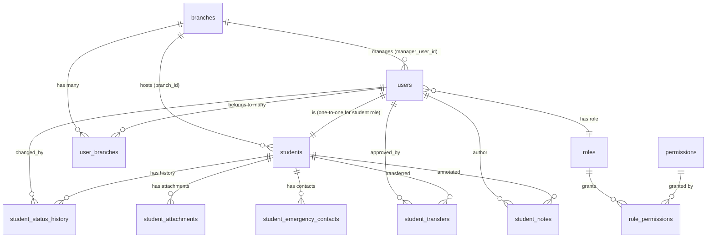
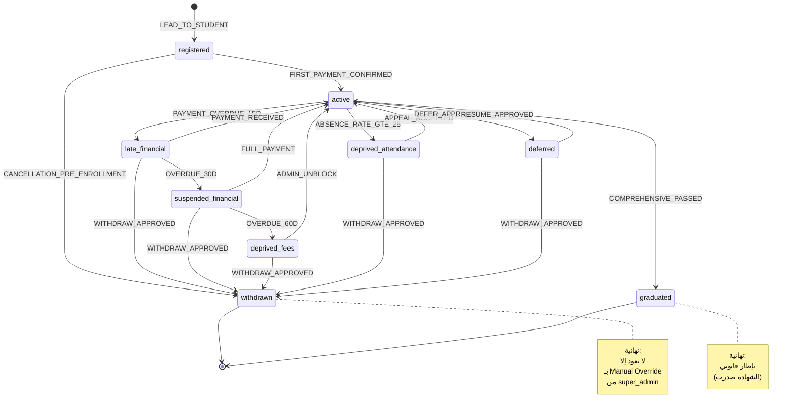
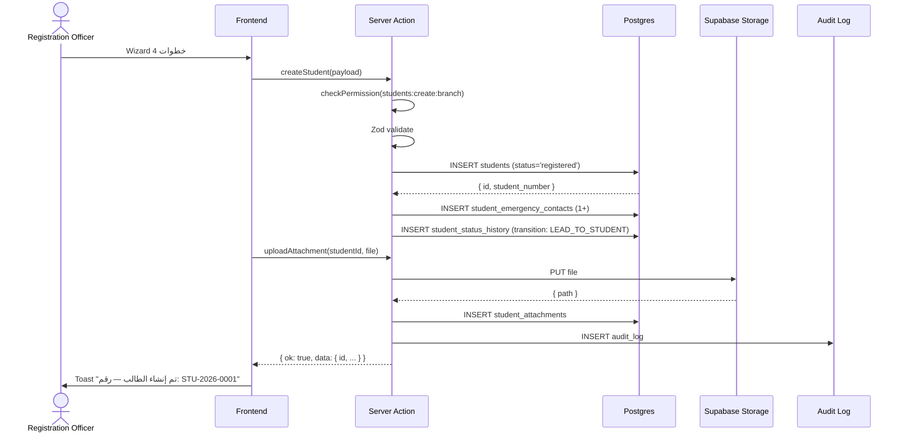
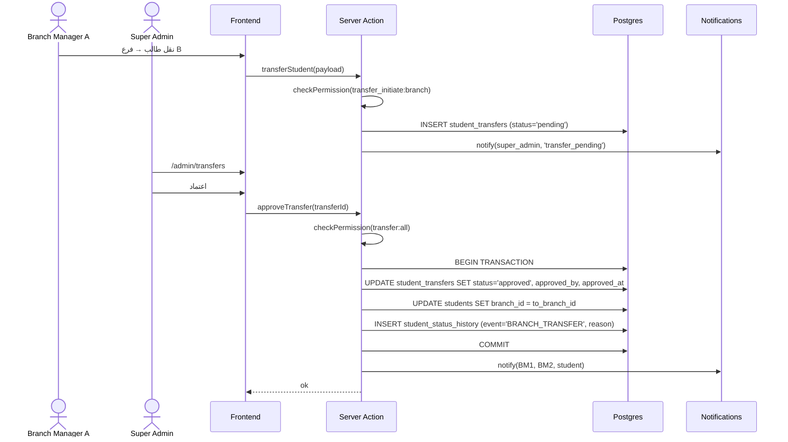
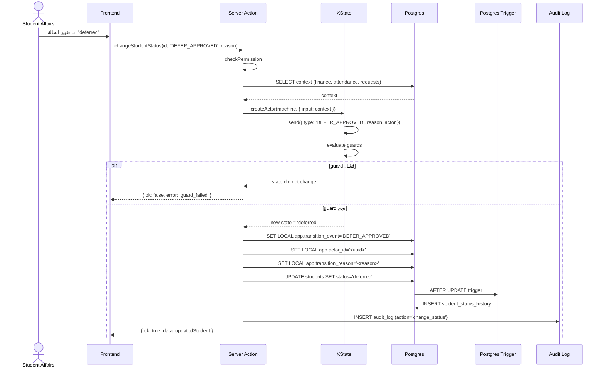

# خطة المرحلة 3: الطلاب والفروع (Students & Multi-Branch)

> **المشروع:** نظام إدارة المعهد التدريبي المتكامل (IIMS)
> **المرحلة:** 03 — الطلاب والفروع
> **الإصدار:** 1.0
> **التاريخ:** 2026-05-13
> **الجمهور:** المبرمج المشارك + مدير المشروع + مهندس QA
> **معدّ الوثيقة:** Senior Project Manager + Solutions Architect
> **الحالة:** مسودة جاهزة للتنفيذ
> **التبعيات:** المرحلة 01 (التأسيس) — منجزة، المرحلة 02 (الاختبارات) — متوازية/منجزة
> **مدة التنفيذ المقدّرة:** 6 أسابيع (240 ساعة عمل)

---

## فهرس الأقسام

1. النظرة العامة والأهداف
2. النطاق والتسليمات
3. التبعيات والافتراضات
4. نموذج البيانات (Data Model)
5. State Machine للطالب (التصميم الكامل)
6. الأدوار والصلاحيات (RBAC Matrix Extension)
7. سياسات RLS التفصيلية
8. الشاشات وتدفق المستخدم (UX Flows)
9. الـ APIs والـ Endpoints
10. Workflows التشغيلية الحرجة
11. Bulk Import وExport
12. Audit Log والتتبع
13. خطة الاختبار (Test Plan)
14. التوصيف التشغيلي والـ Sprint Plan
15. معايير القبول والمخاطر

---

## 1. النظرة العامة والأهداف (Overview & Objectives)

### 1.1 السياق

المرحلة 3 هي **القلب التشغيلي** لالنظام. بعد أن انتهت المرحلة 1 من تأسيس البنية التحتية (Next.js 14 + Supabase + Auth + Schema الأساسي + Seed للفروع الأربعة) وانتهت المرحلة 2 من بناء بنية الاختبارات (Vitest + Playwright + RBAC tests skeleton)، تأتي هذه المرحلة لبناء **الكتلة الوظيفية الأكبر في النظام**: ملف الطالب الكامل + إدارة الفروع التشغيلية + State Machine الحرج الذي يربط الأكاديمي بالمالي.

هذه المرحلة **ممكِّنة لكل ما يليها**: المرحلة 4 (المالية والحجب) تحتاج State Machine جاهز، والمرحلة 5 (الطلبات والخطابات) تحتاج ملف طالب مكتمل بحقول التوظيف، والمرحلة 6 (شؤون المتدربين) تحتاج Workflow نقل الطلاب بين الفروع وتغيير الحالة، والمرحلة 7 (الأكاديمي) تحتاج صلاحيات تفصيلية لكل فرع.

### 1.2 الأهداف الاستراتيجية (Strategic Goals)

| # | الهدف | المؤشر القابل للقياس | الفائدة |
|---|------|--------------------|---------|
| G1 | بناء ملف الطالب الكامل مع كل البيانات الإلزامية والاختيارية | 100% من حقول وثيقة الاحتياجات مغطّاة + Validation كامل | استبدال Excel نهائياً |
| G2 | تفعيل State Machine بـ 8 حالات + transitions موثّقة | كل انتقال له trigger + guard + action + تسجيل في `student_status_history` | ربط الأكاديمي بالمالي بدقة |
| G3 | عزل الفروع عبر RLS صارم | اختبارات RLS تثبت أن مدير الفرع لا يرى بيانات فرع آخر — صفر تسرب | Multi-Branch آمن من اليوم الأول |
| G4 | استيراد جماعي من Excel للطلاب الموجودين | استيراد 1,000 طالب موزّعين على 4 فروع في < 5 دقائق + تقرير أخطاء | Migration نظيف من النظام القديم |
| G5 | إضافة دور **مدير الفرع** + **موظف التسجيل والقبول** | RBAC matrix بـ 7 أدوار × 60+ صلاحية + اختبارات لكل دور | استكمال الهرم الإداري |
| G6 | حقول التوظيف الاختيارية (التطوير #5) | 5 حقول جديدة في `students` + استخدامها في الخطابات لاحقاً | تخصيص قطاعي حكومي |
| G7 | Audit Log كامل لكل تغيير حالة + شاشة Timeline | كل انتقال يظهر في "رحلة الطالب" مع الزمن والمصدر والسبب | شفافية PDPL + قابلية التدقيق |

### 1.3 الأوجاع التي تعالجها هذه المرحلة

| الوجع | الحل في هذه المرحلة | المرجع |
|------|-------------------|--------|
| P3 (حرج) عدم وجود سجل موحّد لحالة الطالب | State Machine بـ 8 حالات + `student_status_history` | §5 |
| P3 (مكمّل) الإدارة لا تعرف عدد المنتظمين/المتعثرين | شاشات Dashboard لكل فرع + قائمة فلتر متقدمة | §8 |
| Migration من النظام القديم (Excel) | Bulk Import مع Validation وتقرير أخطاء | §11 |
| لا توجد صلاحيات تفصيلية | RBAC بـ 7 أدوار + 60+ صلاحية + RLS | §6-§7 |
| فقدان تاريخ الطالب عند انتقال بين الفروع | جدول `student_transfers` + Workflow اعتماد | §10.2 |

### 1.4 المنتجات النهائية (Final Deliverables) — تلخيص سريع

1. **Schema Migration كامل** لـ `students`, `branches`, `user_branches`, `student_status_history`, `student_attachments`, `student_emergency_contacts`, `student_transfers`, `roles`, `permissions`, `role_permissions`.
2. **State Machine في XState** مع 8 حالات + 14 transition + 12 guard + 8 action.
3. **شاشات Next.js 14** (App Router) لقائمة الطلاب + ملف الطالب + إضافة/تعديل + نقل بين الفروع + تغيير الحالة + Bulk Import + Audit Timeline.
4. **APIs/Server Actions** لكل العمليات (CRUD + Bulk + Transfer + Status Change + Export).
5. **اختبارات شاملة** (Unit + Integration + E2E + RLS isolation tests).
6. **توثيق المطوّر** (Storybook لكل Component + JSDoc لكل function + README للموديول).

---

## 2. النطاق والتسليمات (Scope & Deliverables)

### 2.1 ما داخل النطاق (In-Scope)

#### 2.1.1 إدارة الفروع المتكاملة (Branch Management Suite)

- توسعة جدول `branches` بحقول إضافية: `logo_url`, `address_full`, `geo_lat`, `geo_lng`, `working_hours`, `manager_user_id`, `currency`, `timezone`, `settings_json`.
- جدول `user_branches` (Many-to-Many) — موظف قد ينتمي لأكثر من فرع (مثل المحاسب الرئيسي).
- دور **Branch Manager** كحقل في `users.role` ومربوط بـ `branches.manager_user_id`.
- شاشة إعدادات الفرع (Settings UI) — تعديل البيانات الأساسية + الشعار + ساعات العمل.
- تقارير منفصلة لكل فرع + تقرير مجمّع للإدارة العامة.
- View باسم `v_branch_kpis` يجمّع KPIs لكل فرع (عدد الطلاب النشطين، المتأخرين، المنسحبين، إلخ).

#### 2.1.2 State Machine للطالب (Student State Machine)

- **8 حالات رسمية:**
  1. `active` — منتظم
  2. `late_financial` — متأخر مالياً (15 يوم تأخر)
  3. `suspended_financial` — موقوف مالياً (30 يوم تأخر)
  4. `deprived_fees` — محروم بسبب الرسوم (60 يوم تأخر)
  5. `deprived_attendance` — محروم بسبب الغياب (≥25%)
  6. `withdrawn` — منسحب
  7. `deferred` — مؤجل
  8. `graduated` — متخرج

- **+ حالة مبدئية `registered`** للطالب قبل اكتمال شروط التحول إلى `active` (دفعة أولى + بيانات شاملة).
- بناء State Machine بـ **XState v5** مع `setup()` + Actor model.
- Triggers + Guards + Actions موثّقة (انظر §5).
- مخطط Mermaid `stateDiagram-v2` (إلزامي — §5.3).
- شاشة عرض **رحلة الطالب الزمنية** (Timeline View) من `student_status_history`.
- Trigger Postgres تلقائي يكتب في `student_status_history` عند أي UPDATE على `students.status`.

#### 2.1.3 ملف الطالب الكامل (Comprehensive Student Profile)

**البيانات الأساسية (إلزامية):**
- الاسم الرباعي العربي + الإنجليزي.
- رقم الهوية الوطنية / الإقامة (Validation: 10 أرقام + checksum سعودي).
- الجنسية + بلد الميلاد + تاريخ الميلاد + الجنس.
- الجوال (Validation: +966 + 9 أرقام تبدأ بـ 5) + الجوال الاحتياطي.
- البريد الإلكتروني (Validation: RFC 5322) — اختياري لكنه يصبح إلزامياً عند تفعيل بوابة الطالب.
- العنوان الكامل + المدينة + الحي + الرمز البريدي.
- الفرع (FK) + البرنامج/الدبلوم (FK) + الدفعة (Cohort) + تاريخ بداية الدراسة + التوقيت المتوقع للتخرج.

**جهة الاتصال للطوارئ (`student_emergency_contacts`):**
- الاسم + الصلة + رقم الجوال + بريد إلكتروني اختياري.
- يمكن تسجيل أكثر من جهة اتصال (1-3 جهات).

**المرفقات (`student_attachments`):**
- صورة الهوية (Front + Back).
- الشهادات الأكاديمية السابقة.
- العقد الموقع (PDF).
- الصورة الشخصية (للشهادة).
- مرفقات إضافية (أي ملف).
- تخزين في Supabase Storage Bucket باسم `students` مع مفتاح `{student_id}/{attachment_type}/{filename}`.

**التاريخ الدراسي (View جاهز):**
- المواد المكتملة (من `enrollments` + `grades` — تأتي من المرحلة 7 لكن نهيّئ View هنا).
- الاختبارات (من المرحلة 2).
- المعدل التراكمي (مُحسوب).

**الملاحظات (Notes):**
- جدول `student_notes` — ملاحظات داخلية للموظفين (غير مرئية للطالب).
- كل ملاحظة لها كاتب + تاريخ + نوع (`general`, `disciplinary`, `financial`, `academic`).

#### 2.1.4 حقول التوظيف الاختيارية (التطوير #5)

تُضاف كـ JSONB في `students.employment_info` أو كأعمدة منفصلة (نوصي بـ **JSONB لمرونة لاحقة**):

```json
{
  "employer_name": "وزارة الداخلية",
  "job_title": "ضابط أمن",
  "employee_number": "EMP-12345",
  "rank_grade": "ملازم أول / الدرجة السادسة",
  "employment_type": "permanent",
  "employer_address": "الرياض - حي السفارات",
  "supervisor_name": "—",
  "supervisor_phone": "—"
}
```

كل هذه الحقول **اختيارية** (`NULL` مقبول). تظهر في تبويب منفصل في ملف الطالب باسم **"بيانات التوظيف"**. تُستخدم لاحقاً في المرحلة 5 لتوليد خطابات الجهات الحكومية تلقائياً.

> **ملاحظة:** **لا حاجة لراعي/جهة دفع** (الطالب موظف حكومي ويدفع بنفسه). جدول `sponsors` غير موجود في هذه المرحلة.

#### 2.1.5 أدوار جديدة (New Roles)

| الدور | الكود | التطوير الفعلي في | الموجود الآن في المرحلة 3 |
|------|------|------------------|--------------------------|
| مدير الفرع | `branch_manager` | المرحلة 3 (هنا) | RBAC + RLS + Dashboard |
| موظف التسجيل والقبول | `registration_officer` | المرحلة 3 (هنا) | RBAC + شاشات إضافة طالب |
| شؤون المتدربين | `student_affairs` | المرحلة 6 | فقط RBAC + RLS skeleton |
| المالية | `finance_officer` | المرحلة 4 | فقط RBAC + RLS skeleton |

#### 2.1.6 شاشات إدارة الطلاب (UI Screens)

| الشاشة | المسار | الجمهور | حالة التسليم |
|--------|--------|--------|-------------|
| قائمة الطلاب | `/admin/students` | super_admin, branch_manager, student_affairs, registration | كاملة |
| ملف طالب (View) | `/admin/students/[id]` | كل الأدوار حسب RLS | كاملة (5 تبويبات) |
| إضافة طالب | `/admin/students/new` | super_admin, branch_manager, registration_officer | كاملة |
| تعديل طالب | `/admin/students/[id]/edit` | حسب RBAC | كاملة |
| نقل طالب | `/admin/students/[id]/transfer` | super_admin, branch_manager | كاملة (Workflow) |
| تغيير الحالة | `/admin/students/[id]/change-status` | حسب RBAC + State Machine guards | كاملة |
| استيراد بالجملة | `/admin/students/import` | super_admin فقط | كاملة |
| تصدير | `/admin/students/export` | حسب الصلاحيات | كاملة |
| رحلة الطالب (Timeline) | `/admin/students/[id]/timeline` | حسب RLS | كاملة |
| Audit Log للطالب | `/admin/students/[id]/audit` | super_admin, branch_manager | كاملة |
| إعدادات الفرع | `/admin/branches/[id]/settings` | super_admin, branch_manager (own) | كاملة |
| Dashboard الفرع | `/admin/branches/[id]/dashboard` | super_admin, branch_manager (own) | كاملة |

### 2.2 ما خارج النطاق (Out-of-Scope) — صراحةً

| البند | السبب | يُنفّذ في |
|------|------|----------|
| ربط الحالة بالحجب التلقائي للخدمات | يحتاج Service Blocking Engine | المرحلة 4 |
| ربط المالية مع البرنامج المحاسبي الخارجي | يحتاج accounting_sync_log + API integration | المرحلة 4 |
| إصدار الخطابات الرسمية تلقائياً عند تغيير الحالة (مثل: خطاب انسحاب) | يحتاج Letters Engine | المرحلة 5 |
| Workflow طلبات الطالب (طلب تأجيل، طلب رفع حرمان) | يحتاج Workflow Engine الكامل | المرحلة 5-6 |
| الحضور والغياب وحساب نسبة الـ 25% | يحتاج Attendance Module | المرحلة 7 |
| الدرجات والمعدل التراكمي الفعلي | يحتاج Grades Module | المرحلة 7 |
| بوابة الطالب (Student Portal) — صفحة الطالب لرؤية ملفه | جزئي هنا، التوسعة في المرحلة 6 | جزئي في 3، تكامل 6 |
| تطبيق جوال Native | قرار معماري — لا تطبيق جوال (PWA فقط) | لا يُنفّذ |
| ZATCA و الفواتير الضريبية | برنامج محاسبي خارجي | لا يُنفّذ |
| تكامل Nafath للتحقق من الهوية | نفاذ مؤجّلة (قرار معماري) | المرحلة 10 (اختياري) |

### 2.3 التطويرات في هذه المرحلة

- ✅ **التطوير #5: حقول التوظيف الاختيارية** — مكتمل في §2.1.4.

---

## 3. التبعيات والافتراضات (Dependencies & Assumptions)

### 3.1 التبعيات الإلزامية (Hard Dependencies)

| التبعية | المصدر | الحالة المتوقعة |
|---------|--------|----------------|
| Supabase project مُعدّ + Auth جاهز | المرحلة 1 | ✅ |
| جداول `users`, `branches`, `audit_log` موجودة | المرحلة 1 | ✅ |
| Next.js 14 App Router + TypeScript strict | المرحلة 1 | ✅ |
| RLS مُفعّل على كل الجداول | المرحلة 1 | ✅ |
| Tailwind + shadcn/ui + خطوط Cairo/IBM Plex Sans Arabic | المرحلة 1 | ✅ |
| Vitest + Playwright + RBAC test harness | المرحلة 2 | ✅ |
| Storybook مُهيّأ | المرحلة 2 | ✅ |
| CI/CD pipeline (GitHub Actions) | المرحلة 1 | ✅ |
| ESLint + Prettier + Husky pre-commit | المرحلة 1 | ✅ |
| Supabase Storage Bucket `students` + سياسات الرفع | المرحلة 1 | ⚠️ نُنشئ هنا لو غير موجود |

### 3.2 التبعيات الناعمة (Soft Dependencies)

- مكتبة XState v5 (نُضيفها في هذه المرحلة).
- مكتبة `xlsx` أو `exceljs` للاستيراد/التصدير (نُضيفها هنا).
- مكتبة `react-pdf` أو `@react-pdf/renderer` لتصدير ملف الطالب PDF (نُضيفها هنا).
- مكتبة `zod` للـ Validation (موجودة من المرحلة 1).
- مكتبة `react-hook-form` (موجودة).
- مكتبة `tanstack/react-table` لجداول الطلاب الكبيرة مع pagination/sorting/filtering.

### 3.3 الافتراضات (Assumptions)

1. **حجم البيانات الأولية:** ~1,000 طالب يُستوردون مرة واحدة عبر Bulk Import. لاحقاً ~30-50 طالب جديد شهرياً (طبيعي).
2. **توزيع الفروع:** 4 فروع بنسبة متوسطة 250 طالب/فرع، مع احتمال انحراف ±30%.
3. **الأدوار الفعّالة فوراً:** super_admin (1-2)، branch_manager (4)، registration_officer (4-8)، student_affairs (4)، instructor (15-25)، finance_officer (2-4)، student (1,000).
4. **الجلسات المتزامنة:** ذروة متوقعة 50 مستخدم متزامن (موظفين + ~30 طالب يتصفحون ملفهم).
5. **سرعة الإنترنت:** كل الفروع لديها ADSL/Fiber 20+ Mbps. PWA caching يخفف الاعتماد.
6. **اللغة:** عربية أساسية + إنجليزية ثانوية (RTL).
7. **التوقيت:** Asia/Riyadh (UTC+3).
8. **العملة:** SAR (ريال سعودي) — لكن العملة قابلة للضبط في `branches.currency` لمرونة مستقبلية.

### 3.4 المخاطر التي تُغطّيها الافتراضات

| المخاطرة | الافتراض المُخفِّف |
|---------|-------------------|
| استيراد فاشل بسبب أخطاء بيانات | تقرير Validation تفصيلي قبل الاستيراد الفعلي |
| تسرب بيانات فرع لفرع | RLS صارم + اختبارات `RLS isolation` لكل سيناريو |
| Race condition في تغيير الحالة | استخدام XState مع `actor.send` المتسلسل + DB lock |
| كسر ملف الطالب عند migration | Snapshot قبل Bulk Import + Rollback تلقائي عند فشل > 5% |

---

## 4. نموذج البيانات (Data Model)

### 4.1 المخطط العلائقي (ER Diagram)



### 4.2 توسعة جدول `branches`

```sql
-- المرحلة 1 أنشأت branches بشكل مبدئي. هنا نوسّعه.
ALTER TABLE branches ADD COLUMN IF NOT EXISTS logo_url TEXT;
ALTER TABLE branches ADD COLUMN IF NOT EXISTS address_full TEXT;
ALTER TABLE branches ADD COLUMN IF NOT EXISTS city TEXT;
ALTER TABLE branches ADD COLUMN IF NOT EXISTS district TEXT;
ALTER TABLE branches ADD COLUMN IF NOT EXISTS postal_code TEXT;
ALTER TABLE branches ADD COLUMN IF NOT EXISTS geo_lat NUMERIC(10, 7);
ALTER TABLE branches ADD COLUMN IF NOT EXISTS geo_lng NUMERIC(10, 7);
ALTER TABLE branches ADD COLUMN IF NOT EXISTS working_hours JSONB DEFAULT '{
    "sun": {"open": "07:00", "close": "22:00"},
    "mon": {"open": "07:00", "close": "22:00"},
    "tue": {"open": "07:00", "close": "22:00"},
    "wed": {"open": "07:00", "close": "22:00"},
    "thu": {"open": "07:00", "close": "22:00"},
    "fri": {"closed": true},
    "sat": {"open": "08:00", "close": "20:00"}
}'::jsonb;
ALTER TABLE branches ADD COLUMN IF NOT EXISTS manager_user_id UUID REFERENCES users(id);
ALTER TABLE branches ADD COLUMN IF NOT EXISTS currency CHAR(3) NOT NULL DEFAULT 'SAR';
ALTER TABLE branches ADD COLUMN IF NOT EXISTS timezone TEXT NOT NULL DEFAULT 'Asia/Riyadh';
ALTER TABLE branches ADD COLUMN IF NOT EXISTS settings JSONB DEFAULT '{}'::jsonb;

CREATE INDEX IF NOT EXISTS idx_branches_manager ON branches(manager_user_id)
    WHERE deleted_at IS NULL;
```

### 4.3 جدول `user_branches` (Many-to-Many)

```sql
CREATE TABLE user_branches (
    user_id UUID NOT NULL REFERENCES users(id) ON DELETE CASCADE,
    branch_id UUID NOT NULL REFERENCES branches(id) ON DELETE CASCADE,
    is_primary BOOLEAN NOT NULL DEFAULT FALSE,
    assigned_at TIMESTAMPTZ NOT NULL DEFAULT NOW(),
    assigned_by UUID REFERENCES users(id),
    PRIMARY KEY (user_id, branch_id)
);

CREATE INDEX idx_user_branches_user ON user_branches(user_id);
CREATE INDEX idx_user_branches_branch ON user_branches(branch_id);

-- ضمان أن لكل مستخدم فرع رئيسي واحد فقط
CREATE UNIQUE INDEX uq_user_primary_branch
    ON user_branches(user_id) WHERE is_primary = TRUE;
```

> **ملاحظة معمارية:** نحتفظ بـ `users.branch_id` للسهولة (الفرع الرئيسي)، ونستخدم `user_branches` للحالات الخاصة (محاسب رئيسي يشرف على عدة فروع). الـ RLS يستخدم `user_branches`.

### 4.4 توسعة جدول `students`

```sql
-- إضافة الحقول الجديدة لجدول students الموجود من المرحلة 1
ALTER TABLE students ADD COLUMN IF NOT EXISTS full_name_father TEXT;
ALTER TABLE students ADD COLUMN IF NOT EXISTS full_name_grandfather TEXT;
ALTER TABLE students ADD COLUMN IF NOT EXISTS family_name TEXT;
ALTER TABLE students ADD COLUMN IF NOT EXISTS nationality TEXT NOT NULL DEFAULT 'SA';
ALTER TABLE students ADD COLUMN IF NOT EXISTS id_type TEXT NOT NULL DEFAULT 'national_id'
    CHECK (id_type IN ('national_id', 'iqama', 'passport', 'gcc_id'));
ALTER TABLE students ADD COLUMN IF NOT EXISTS id_expiry_date DATE;
ALTER TABLE students ADD COLUMN IF NOT EXISTS phone_secondary TEXT;
ALTER TABLE students ADD COLUMN IF NOT EXISTS city TEXT;
ALTER TABLE students ADD COLUMN IF NOT EXISTS district TEXT;
ALTER TABLE students ADD COLUMN IF NOT EXISTS postal_code TEXT;
ALTER TABLE students ADD COLUMN IF NOT EXISTS cohort_code TEXT;
ALTER TABLE students ADD COLUMN IF NOT EXISTS program_id UUID;  -- FK يُربط في المرحلة 7
ALTER TABLE students ADD COLUMN IF NOT EXISTS expected_graduation_date DATE;
ALTER TABLE students ADD COLUMN IF NOT EXISTS shift_type TEXT
    CHECK (shift_type IN ('morning', 'evening', 'weekend'));

-- التطوير #5: حقول التوظيف
ALTER TABLE students ADD COLUMN IF NOT EXISTS employment_info JSONB DEFAULT NULL;
-- البنية المتوقعة في JSON:
-- {
--   "employer_name": string,
--   "job_title": string,
--   "employee_number": string,
--   "rank_grade": string,
--   "employment_type": "permanent" | "temporary" | "contracted",
--   "employer_address": string,
--   "supervisor_name": string,
--   "supervisor_phone": string
-- }

-- توسعة CHECK constraint للحالات (إضافة registered كحالة ابتدائية)
ALTER TABLE students DROP CONSTRAINT IF EXISTS students_status_check;
ALTER TABLE students ADD CONSTRAINT students_status_check CHECK (status IN (
    'registered',
    'active',
    'late_financial',
    'suspended_financial',
    'deprived_fees',
    'deprived_attendance',
    'withdrawn',
    'deferred',
    'graduated'
));

-- index على cohort + shift للفلترة السريعة
CREATE INDEX IF NOT EXISTS idx_students_cohort ON students(cohort_code) WHERE deleted_at IS NULL;
CREATE INDEX IF NOT EXISTS idx_students_shift ON students(shift_type) WHERE deleted_at IS NULL;
CREATE INDEX IF NOT EXISTS idx_students_branch_status ON students(branch_id, status)
    WHERE deleted_at IS NULL;
```

> **ملاحظة:** نوحّد التسمية مع State Machine — استخدمنا `late_financial` و`suspended_financial` بدلاً من `financially_late` و`financially_suspended` لمواءمة المرجع في `الجزء-02`.

### 4.5 جدول `student_status_history`

```sql
CREATE TABLE student_status_history (
    id UUID PRIMARY KEY DEFAULT gen_random_uuid(),
    student_id UUID NOT NULL REFERENCES students(id) ON DELETE CASCADE,
    from_status TEXT,
    to_status TEXT NOT NULL,
    transition_event TEXT NOT NULL,
    -- 'ENROLL', 'PAYMENT_OVERDUE_15D', 'PAYMENT_RECEIVED',
    -- 'OVERDUE_30D', 'FULL_PAYMENT', 'OVERDUE_60D', 'ADMIN_UNBLOCK',
    -- 'ABSENCE_RATE_GTE_25', 'APPEAL_ACCEPTED', 'DEFER_APPROVED',
    -- 'RESUME_APPROVED', 'WITHDRAW_APPROVED', 'COMPREHENSIVE_PASSED',
    -- 'MANUAL_OVERRIDE'
    reason TEXT NOT NULL CHECK (length(reason) >= 10),
    changed_by UUID NOT NULL REFERENCES users(id),
    changed_at TIMESTAMPTZ NOT NULL DEFAULT NOW(),
    metadata JSONB DEFAULT '{}'::jsonb,
    -- metadata قد يحتوي: { "approval_ref": "uuid", "snapshot_balance": 12300 }
    ip_address INET,
    user_agent TEXT
);

CREATE INDEX idx_status_history_student
    ON student_status_history(student_id, changed_at DESC);
CREATE INDEX idx_status_history_event
    ON student_status_history(transition_event);
CREATE INDEX idx_status_history_actor
    ON student_status_history(changed_by, changed_at DESC);

-- منع الحذف (PDPL + Audit)
CREATE POLICY status_history_no_delete
    ON student_status_history FOR DELETE USING (FALSE);
```

### 4.6 جدول `student_attachments`

```sql
CREATE TABLE student_attachments (
    id UUID PRIMARY KEY DEFAULT gen_random_uuid(),
    student_id UUID NOT NULL REFERENCES students(id) ON DELETE CASCADE,
    attachment_type TEXT NOT NULL CHECK (attachment_type IN (
        'id_front', 'id_back', 'passport',
        'prior_certificate', 'transcript',
        'contract', 'photo',
        'medical_report', 'employer_letter',
        'other'
    )),
    file_name TEXT NOT NULL,
    file_path TEXT NOT NULL,  -- المسار في Supabase Storage
    file_size_bytes BIGINT NOT NULL,
    mime_type TEXT NOT NULL,
    checksum_sha256 TEXT,
    uploaded_by UUID NOT NULL REFERENCES users(id),
    uploaded_at TIMESTAMPTZ NOT NULL DEFAULT NOW(),
    is_verified BOOLEAN NOT NULL DEFAULT FALSE,
    verified_by UUID REFERENCES users(id),
    verified_at TIMESTAMPTZ,
    metadata JSONB DEFAULT '{}'::jsonb,
    deleted_at TIMESTAMPTZ
);

CREATE INDEX idx_attachments_student ON student_attachments(student_id)
    WHERE deleted_at IS NULL;
CREATE INDEX idx_attachments_type ON student_attachments(attachment_type)
    WHERE deleted_at IS NULL;
```

### 4.7 جدول `student_emergency_contacts`

```sql
CREATE TABLE student_emergency_contacts (
    id UUID PRIMARY KEY DEFAULT gen_random_uuid(),
    student_id UUID NOT NULL REFERENCES students(id) ON DELETE CASCADE,
    contact_name TEXT NOT NULL,
    relation TEXT NOT NULL CHECK (relation IN (
        'father', 'mother', 'spouse', 'sibling',
        'son', 'daughter', 'relative', 'friend', 'employer', 'other'
    )),
    phone_primary TEXT NOT NULL,
    phone_secondary TEXT,
    email TEXT,
    address TEXT,
    is_primary BOOLEAN NOT NULL DEFAULT FALSE,
    created_at TIMESTAMPTZ NOT NULL DEFAULT NOW(),
    updated_at TIMESTAMPTZ NOT NULL DEFAULT NOW()
);

CREATE INDEX idx_emergency_student ON student_emergency_contacts(student_id);
CREATE UNIQUE INDEX uq_emergency_primary
    ON student_emergency_contacts(student_id) WHERE is_primary = TRUE;
```

### 4.8 جدول `student_transfers` — نقل الطلاب بين الفروع

```sql
CREATE TABLE student_transfers (
    id UUID PRIMARY KEY DEFAULT gen_random_uuid(),
    student_id UUID NOT NULL REFERENCES students(id),
    from_branch_id UUID NOT NULL REFERENCES branches(id),
    to_branch_id UUID NOT NULL REFERENCES branches(id),
    requested_by UUID NOT NULL REFERENCES users(id),
    requested_at TIMESTAMPTZ NOT NULL DEFAULT NOW(),
    reason TEXT NOT NULL CHECK (length(reason) >= 20),
    status TEXT NOT NULL DEFAULT 'pending' CHECK (status IN (
        'pending', 'approved', 'rejected', 'cancelled', 'completed'
    )),
    approved_by UUID REFERENCES users(id),
    approved_at TIMESTAMPTZ,
    rejected_reason TEXT,
    effective_date DATE NOT NULL,
    new_student_number TEXT,  -- قد يتغيّر رقم الطالب حسب الفرع الجديد
    metadata JSONB DEFAULT '{}'::jsonb,
    created_at TIMESTAMPTZ NOT NULL DEFAULT NOW(),
    updated_at TIMESTAMPTZ NOT NULL DEFAULT NOW(),

    CHECK (from_branch_id <> to_branch_id)
);

CREATE INDEX idx_transfers_student ON student_transfers(student_id, requested_at DESC);
CREATE INDEX idx_transfers_status ON student_transfers(status)
    WHERE status IN ('pending', 'approved');
```

### 4.9 جدول `student_notes`

```sql
CREATE TABLE student_notes (
    id UUID PRIMARY KEY DEFAULT gen_random_uuid(),
    student_id UUID NOT NULL REFERENCES students(id) ON DELETE CASCADE,
    author_id UUID NOT NULL REFERENCES users(id),
    note_type TEXT NOT NULL CHECK (note_type IN (
        'general', 'disciplinary', 'financial', 'academic', 'medical', 'other'
    )),
    title TEXT NOT NULL,
    body TEXT NOT NULL,
    is_internal BOOLEAN NOT NULL DEFAULT TRUE,  -- TRUE = غير مرئية للطالب
    is_pinned BOOLEAN NOT NULL DEFAULT FALSE,
    created_at TIMESTAMPTZ NOT NULL DEFAULT NOW(),
    updated_at TIMESTAMPTZ NOT NULL DEFAULT NOW(),
    deleted_at TIMESTAMPTZ
);

CREATE INDEX idx_notes_student ON student_notes(student_id, created_at DESC)
    WHERE deleted_at IS NULL;
CREATE INDEX idx_notes_type ON student_notes(note_type) WHERE deleted_at IS NULL;
```

### 4.10 جداول الـ RBAC الديناميكي

```sql
CREATE TABLE roles (
    id SERIAL PRIMARY KEY,
    code TEXT UNIQUE NOT NULL,
    name_ar TEXT NOT NULL,
    name_en TEXT NOT NULL,
    description TEXT,
    is_system BOOLEAN NOT NULL DEFAULT FALSE,  -- TRUE = لا يُحذف
    created_at TIMESTAMPTZ NOT NULL DEFAULT NOW()
);

CREATE TABLE permissions (
    id SERIAL PRIMARY KEY,
    resource VARCHAR(50) NOT NULL,
    action VARCHAR(50) NOT NULL,
    scope VARCHAR(20) NOT NULL CHECK (scope IN ('own', 'branch', 'all')),
    description TEXT,
    created_at TIMESTAMPTZ NOT NULL DEFAULT NOW(),
    UNIQUE(resource, action, scope)
);

CREATE TABLE role_permissions (
    role_id INTEGER NOT NULL REFERENCES roles(id) ON DELETE CASCADE,
    permission_id INTEGER NOT NULL REFERENCES permissions(id) ON DELETE CASCADE,
    PRIMARY KEY (role_id, permission_id)
);

CREATE INDEX idx_role_perms_role ON role_permissions(role_id);
CREATE INDEX idx_role_perms_perm ON role_permissions(permission_id);
```

### 4.11 Seed Data

```sql
-- Seed: roles
INSERT INTO roles (code, name_ar, name_en, is_system) VALUES
  ('super_admin', 'الإدارة العامة', 'Super Admin', TRUE),
  ('branch_manager', 'مدير الفرع', 'Branch Manager', TRUE),
  ('finance_officer', 'موظف المالية والتحصيل', 'Finance Officer', TRUE),
  ('student_affairs', 'موظف شؤون المتدربين', 'Student Affairs', TRUE),
  ('registration_officer', 'موظف التسجيل والقبول', 'Registration Officer', TRUE),
  ('instructor', 'المدرب/المعلم', 'Instructor', TRUE),
  ('student', 'الطالب', 'Student', TRUE);

-- Seed: permissions (مقتطفات — 60+ صلاحية إجمالاً)
INSERT INTO permissions (resource, action, scope, description) VALUES
  ('students', 'read', 'all', 'قراءة بيانات أي طالب'),
  ('students', 'read', 'branch', 'قراءة طلاب الفرع'),
  ('students', 'read', 'own', 'قراءة بيانات الطالب نفسه'),
  ('students', 'create', 'branch', 'إنشاء طالب في الفرع'),
  ('students', 'create', 'all', 'إنشاء طالب في أي فرع'),
  ('students', 'update', 'branch', 'تعديل طالب في الفرع'),
  ('students', 'update', 'all', 'تعديل أي طالب'),
  ('students', 'delete', 'all', 'حذف طالب (Soft)'),
  ('students', 'change_status', 'branch', 'تغيير حالة طالب في الفرع'),
  ('students', 'change_status', 'all', 'تغيير حالة أي طالب'),
  ('students', 'transfer', 'all', 'نقل طالب بين الفروع'),
  ('students', 'transfer_initiate', 'branch', 'بدء طلب نقل من الفرع'),
  ('students', 'import_bulk', 'all', 'استيراد بالجملة'),
  ('students', 'export', 'branch', 'تصدير طلاب الفرع'),
  ('students', 'export', 'all', 'تصدير كل الطلاب'),
  ('students_attachments', 'upload', 'branch', 'رفع مرفق طالب الفرع'),
  ('students_attachments', 'verify', 'branch', 'توثيق مرفق طالب الفرع'),
  ('students_notes', 'create', 'branch', 'كتابة ملاحظة'),
  ('students_notes', 'read', 'branch', 'قراءة الملاحظات'),
  ('students_notes', 'pin', 'branch', 'تثبيت ملاحظة'),
  ('students_history', 'read', 'branch', 'قراءة تاريخ حالة طالب'),
  ('branches', 'read', 'all', 'قراءة كل الفروع'),
  ('branches', 'read', 'own', 'قراءة الفرع المسؤول'),
  ('branches', 'update', 'own', 'تعديل إعدادات فرعي'),
  ('branches', 'update', 'all', 'تعديل أي فرع'),
  ('branches', 'create', 'all', 'إنشاء فرع'),
  ('branches', 'manage_users', 'own', 'إدارة موظفي الفرع'),
  ('branches', 'view_kpis', 'own', 'عرض KPIs الفرع'),
  ('branches', 'view_kpis', 'all', 'عرض KPIs كل الفروع'),
  ('users', 'read', 'branch', 'قراءة موظفي الفرع'),
  ('users', 'read', 'all', 'قراءة كل الموظفين'),
  ('users', 'create', 'all', 'إنشاء موظف'),
  ('users', 'update', 'branch', 'تعديل موظف فرع'),
  ('users', 'update', 'all', 'تعديل أي موظف'),
  ('users', 'assign_to_branch', 'all', 'تعيين موظف لفرع'),
  ('audit_log', 'read', 'branch', 'قراءة Audit الفرع'),
  ('audit_log', 'read', 'all', 'قراءة كل Audit'),
  ('reports', 'run', 'branch', 'تشغيل تقارير الفرع'),
  ('reports', 'run', 'all', 'تشغيل التقارير الموحّدة'),
  ('reports', 'export', 'branch', 'تصدير تقارير الفرع'),
  ('reports', 'export', 'all', 'تصدير تقارير شاملة');
-- ... (المزيد للموديولات اللاحقة في مراحلها)

-- Seed: role_permissions (يُملأ ببرمجة بسيطة في Migration)
```

### 4.12 Views المساعدة

```sql
-- View: ملخص الطالب الموسّع (يُستخدم في القائمة)
CREATE OR REPLACE VIEW v_students_listing AS
SELECT
    s.id,
    s.student_number,
    s.full_name_ar,
    s.national_id,
    s.phone,
    s.email,
    s.status,
    s.shift_type,
    s.enrollment_date,
    s.cohort_code,
    b.id AS branch_id,
    b.name_ar AS branch_name,
    b.code AS branch_code,
    -- جهة العمل (مفيدة في القائمة لاحقاً)
    (s.employment_info->>'employer_name') AS employer_name,
    (s.employment_info->>'job_title') AS job_title,
    s.created_at,
    s.updated_at
FROM students s
JOIN branches b ON s.branch_id = b.id
WHERE s.deleted_at IS NULL;

-- View: KPIs الفرع
CREATE OR REPLACE VIEW v_branch_kpis AS
SELECT
    b.id AS branch_id,
    b.code,
    b.name_ar,
    COUNT(*) FILTER (WHERE s.status = 'active') AS active_count,
    COUNT(*) FILTER (WHERE s.status = 'late_financial') AS late_financial_count,
    COUNT(*) FILTER (WHERE s.status = 'suspended_financial') AS suspended_financial_count,
    COUNT(*) FILTER (WHERE s.status = 'deprived_fees') AS deprived_fees_count,
    COUNT(*) FILTER (WHERE s.status = 'deprived_attendance') AS deprived_attendance_count,
    COUNT(*) FILTER (WHERE s.status = 'withdrawn') AS withdrawn_count,
    COUNT(*) FILTER (WHERE s.status = 'deferred') AS deferred_count,
    COUNT(*) FILTER (WHERE s.status = 'graduated') AS graduated_count,
    COUNT(*) FILTER (WHERE s.status = 'registered') AS registered_count,
    COUNT(*) AS total_count
FROM branches b
LEFT JOIN students s ON b.id = s.branch_id AND s.deleted_at IS NULL
WHERE b.deleted_at IS NULL
GROUP BY b.id, b.code, b.name_ar;
```

---

## 5. State Machine للطالب (التصميم الكامل)

### 5.1 الفلسفة التصميمية

نتعامل مع حالة الطالب كـ **آلة حالات منتهية (Finite State Machine)** لسببين رئيسيين:

1. **منع الانتقالات غير الصحيحة:** لا يمكن لطالب `graduated` أن يصبح `active` مرة أخرى (إلا بـ Override خاص من super_admin). State Machine يفرض هذا في مكان واحد.
2. **التتبع الكامل (Auditability):** كل انتقال له trigger وسبب ومستخدم — لا تغيير غامض.

**أداة التنفيذ:** **XState v5** (`setup()` API + Actor model).

### 5.2 المخطط الرسمي (Mermaid stateDiagram-v2)



### 5.3 جدول الـ Transitions الكامل

| # | من | إلى | الـ Event | Guard | Action | المُطلِق |
|---|-----|-----|----------|-------|---------|---------|
| T01 | (initial) | `registered` | `LEAD_TO_STUDENT` | `canCreateStudent` | `assignStudentNumber`, `notifyDepartments` | Registration Officer |
| T02 | `registered` | `active` | `FIRST_PAYMENT_CONFIRMED` | `firstPaymentReceived`, `documentsComplete` | `runBlockingRules`, `notifyStudent`, `recalcKPIs` | Webhook المحاسبي |
| T03 | `registered` | `withdrawn` | `CANCELLATION_PRE_ENROLLMENT` | `canCancelEarly` | `archiveProfile`, `refundIfApplicable` | Registration Officer + Admin |
| T04 | `active` | `late_financial` | `PAYMENT_OVERDUE_15D` | `paymentOverdueDays >= 15` | `notifyStudent`, `notifyFinance`, `logAlert` | Cron يومي |
| T05 | `late_financial` | `active` | `PAYMENT_RECEIVED` | `outstandingBalance = 0` | `unblockServices`, `notifyStudent` | Webhook المحاسبي |
| T06 | `late_financial` | `suspended_financial` | `OVERDUE_30D` | `paymentOverdueDays >= 30` | `applyBlocking(level=1)`, `notifyAll` | Cron يومي |
| T07 | `suspended_financial` | `active` | `FULL_PAYMENT` | `outstandingBalance = 0` | `unblockServices`, `notifyStudent` | Webhook المحاسبي |
| T08 | `suspended_financial` | `deprived_fees` | `OVERDUE_60D` | `paymentOverdueDays >= 60` | `applyBlocking(level=2)`, `escalateToAdmin` | Cron يومي |
| T09 | `deprived_fees` | `active` | `ADMIN_UNBLOCK` | `hasAdminApproval`, `reasonProvided` | `unblockServices`, `auditOverride` | Super Admin / Branch Manager |
| T10 | `active` | `deprived_attendance` | `ABSENCE_RATE_GTE_25` | `absenceRate >= 0.25` | `applyBlocking(level=3)`, `notifyStudent` | Cron يومي بعد إغلاق التحضير |
| T11 | `deprived_attendance` | `active` | `APPEAL_ACCEPTED` | `hasApprovedAppeal` | `unblockServices`, `closeAppealRequest` | Student Affairs |
| T12 | `active` | `deferred` | `DEFER_APPROVED` | `hasApprovedDeferRequest`, `noPendingExams` | `pauseEnrollments`, `notifyAll` | Admin/Branch Manager |
| T13 | `deferred` | `active` | `RESUME_APPROVED` | `hasApprovedResumeRequest`, `outstandingBalance = 0` | `restoreEnrollments`, `notifyAll` | Student Affairs |
| T14 | `*` (إلا terminal) | `withdrawn` | `WITHDRAW_APPROVED` | `canWithdraw`, `hasApprovedWithdrawRequest` | `archiveProfile`, `cancelEnrollments`, `notifyAll`, `issueWithdrawLetter` | Admin |
| T15 | `active` | `graduated` | `COMPREHENSIVE_PASSED` | `allCoursesPassed`, `comprehensiveExamPassed`, `noOutstandingBalance` | `issueCertificate`, `notifyAll`, `archiveProfile` | Student Affairs / System |
| T16 | `*` | `*` (الـ super) | `MANUAL_OVERRIDE` | `isSuperAdmin`, `reasonProvided (>=20 chars)` | `forceTransition`, `auditCritical` | Super Admin (استثنائي) |

### 5.4 Guards التفصيلية

| Guard | الشرط (Predicate) | مصدر البيانات |
|------|-------------------|---------------|
| `canCreateStudent` | الـlead في `awaiting_first_payment` + documents verified | context.lead |
| `firstPaymentReceived` | دفعة أولى وصلت من المحاسبي | context.payment |
| `documentsComplete` | كل المرفقات الإلزامية (id_front, id_back, contract, photo) موثّقة | context.attachments |
| `paymentOverdue(days)` | `context.finance.overdueDays >= days` (15/30/60) | snapshot |
| `outstandingBalanceZero` | `context.finance.outstandingBalance === 0` | snapshot |
| `absenceRateGte25` | `context.attendance.absenceRate >= 0.25` | المرحلة 7 |
| `hasAdminApproval` | الـ event.actor.role ∈ {super_admin, branch_manager} | event.approval |
| `reasonProvided` | `event.reason.trim().length >= 10` | event |
| `hasApprovedDeferRequest` | يوجد request type='defer' status='approved' | context.activeRequests |
| `canWithdraw` | الحالة الحالية ∉ {graduated, withdrawn} | context.currentStatus |
| `canMarkGraduated` | اجتاز كل المواد + الاختبار الشامل + رصيد=0 | context.academic + finance |
| `isSuperAdmin` | `event.actor.role === 'super_admin'` | event |

> **التنفيذ:** كل guard دالة Pure في `src/lib/student-state-machine/guards.ts` بتوقيع `({ context, event }) => boolean`. يتم اختبار كل guard بـ ≥ 2 cases (positive + negative) في Sprint 2.

### 5.5 Actions التفصيلية

| Action | الوظيفة | تفاصيل التنفيذ |
|--------|---------|----------------|
| `recordTransition` | إدراج صف في `student_status_history` | يأخذ `(from, to)` + يقرأ من context: `outstandingBalance`, `absenceRate`, `approval_ref` |
| `applyBlocking(level)` | **Stub** للمرحلة الحالية | في المرحلة 4 سيُربط بـ Service Blocking Engine |
| `unblockServices` | **Stub** للمرحلة الحالية | كذلك في المرحلة 4 |
| `notifyStudent` | إدراج في `notification_queue` | الإرسال الفعلي في المرحلة 6 |
| `notifyFinance`, `notifyAll` | كذلك للموظفين المعنيين | — |
| `archiveProfile` | كتابة `archived_at` في metadata | لا حذف فعلي |
| `issueCertificate` | **Stub** للمرحلة 9 | — |
| `cancelEnrollments`, `pauseEnrollments`, `restoreEnrollments` | **Stubs** للمرحلة 7 | تُربط لاحقاً |
| `recalcKPIs`, `escalateToAdmin`, `logAlert` | عمليات مساعدة محلية | — |

> **مبدأ:** كل Action في هذه المرحلة إما **محلي** (يكتب في DB) أو **Stub** يطبع log + يضع رسالة في notification_queue. تتحول الـ Stubs لاستدعاءات حقيقية في المراحل 4-9.

### 5.6 الـ Machine — مخطط البنية

```typescript
// src/lib/student-state-machine/machine.ts
export const studentMachine = setup({
  types: { context: {} as StudentContext, events: {} as TransitionEvent },
  guards,
  actions,
}).createMachine({
  id: 'studentLifecycle',
  initial: 'registered',
  context: ({ input }) => input as StudentContext,
  states: {
    registered: { /* on: FIRST_PAYMENT_CONFIRMED → active, CANCELLATION_PRE_ENROLLMENT → withdrawn */ },
    active: { /* on: PAYMENT_OVERDUE_15D, ABSENCE_RATE_GTE_25, DEFER_APPROVED, WITHDRAW_APPROVED, COMPREHENSIVE_PASSED */ },
    late_financial: { /* on: PAYMENT_RECEIVED → active, OVERDUE_30D → suspended_financial, WITHDRAW_APPROVED → withdrawn */ },
    suspended_financial: { /* on: FULL_PAYMENT → active, OVERDUE_60D → deprived_fees, WITHDRAW_APPROVED → withdrawn */ },
    deprived_fees: { /* on: ADMIN_UNBLOCK → active, WITHDRAW_APPROVED → withdrawn */ },
    deprived_attendance: { /* on: APPEAL_ACCEPTED → active, WITHDRAW_APPROVED → withdrawn */ },
    deferred: { /* on: RESUME_APPROVED → active, WITHDRAW_APPROVED → withdrawn */ },
    withdrawn: { type: 'final' },
    graduated: { type: 'final' },
  },
});
```

كل `on` block يحتوي على `target`, `guard` (من §5.4), و `actions` (من §5.5). التنفيذ الكامل في `src/lib/student-state-machine/machine.ts` — التفاصيل في `tests/unit/student-state-machine/machine.test.ts` (22 اختبار يغطي كل transition).

### 5.7 Trigger Postgres للحفاظ على الـ History

> **مبدأ الدفاع في العمق:** XState يكتب التاريخ من جانب التطبيق، لكن نضيف **Trigger Postgres** كحارس ثانٍ في حالة تغيير `students.status` يدوياً (`UPDATE` مباشر مثلاً).

```sql
CREATE OR REPLACE FUNCTION fn_log_student_status_change()
RETURNS TRIGGER AS $$
BEGIN
    IF (OLD.status IS DISTINCT FROM NEW.status) THEN
        INSERT INTO student_status_history (
            student_id,
            from_status,
            to_status,
            transition_event,
            reason,
            changed_by,
            metadata
        ) VALUES (
            NEW.id,
            OLD.status,
            NEW.status,
            COALESCE(current_setting('app.transition_event', true), 'DB_DIRECT_UPDATE'),
            COALESCE(current_setting('app.transition_reason', true), 'تغيير مباشر في قاعدة البيانات'),
            COALESCE(NULLIF(current_setting('app.actor_id', true), '')::UUID, NEW.updated_by),
            jsonb_build_object(
                'db_trigger', true,
                'old_updated_at', OLD.updated_at,
                'new_updated_at', NEW.updated_at
            )
        );
    END IF;
    RETURN NEW;
END;
$$ LANGUAGE plpgsql;

CREATE TRIGGER trg_student_status_change
    AFTER UPDATE OF status ON students
    FOR EACH ROW
    EXECUTE FUNCTION fn_log_student_status_change();
```

> **شرح للمبرمج:** قبل أي UPDATE من التطبيق، نضبط `SET LOCAL app.transition_event = 'PAYMENT_RECEIVED'` و`SET LOCAL app.actor_id = '<uuid>'` و`SET LOCAL app.transition_reason = '...'`. هذا يضمن أن الـ Trigger يلتقط الـ context الصحيح.

### 5.8 شاشة "رحلة الطالب" (Timeline View)

عرض زمني للـ `student_status_history` بحيث:
- كل سطر = انتقال واحد.
- يُظهر: من → إلى + التاريخ + السبب + من قام بالتغيير + الـ event.
- إذا كان metadata يحتوي على `approval_ref`، يُظهر رابطاً لطلب الاعتماد.
- تصدير PDF للسجل كامل (يخدم PDPL — حق الوصول).

---

## 6. الأدوار والصلاحيات (RBAC Matrix Extension)

### 6.1 الأدوار الفعّالة في هذه المرحلة

| الكود | الاسم | النطاق | معتمَد من |
|------|------|--------|----------|
| `super_admin` | الإدارة العامة | All branches | المرحلة 1 |
| `branch_manager` | مدير الفرع | Own branch | **هذه المرحلة** |
| `finance_officer` | المالية | Cross-branch (read) | Skeleton هنا، تفعيل في المرحلة 4 |
| `student_affairs` | شؤون المتدربين | Own branch | Skeleton هنا، تفعيل في المرحلة 6 |
| `registration_officer` | التسجيل والقبول | Own branch | **هذه المرحلة** |
| `instructor` | المدرب | Own courses | Skeleton هنا، تفعيل في المرحلة 7 |
| `student` | الطالب | Self | المرحلة 1 (محدود) + توسعة هنا |

### 6.2 مصفوفة الصلاحيات الكاملة (Students/Branches Domain)

| المورد | الفعل | super_admin | branch_manager | finance | student_affairs | registration | instructor | student |
|--------|------|:-----------:|:--------------:|:-------:|:---------------:|:------------:|:----------:|:-------:|
| Students | read | All | Branch | All (read-only) | Branch | Branch | Own courses | Self |
| Students | create | All | Branch | ❌ | Branch | Branch | ❌ | ❌ |
| Students | update (profile) | All | Branch | Financial only | Status only | Profile | ❌ | Self (limited) |
| Students | delete (soft) | All | ❌ | ❌ | ❌ | ❌ | ❌ | ❌ |
| Students | change_status | All | Branch | Financial transitions | All allowed transitions | ❌ | ❌ | ❌ |
| Students | transfer (initiate) | All | Branch (out) | ❌ | Branch (out) | ❌ | ❌ | ❌ |
| Students | transfer (approve) | All | ❌ | ❌ | ❌ | ❌ | ❌ | ❌ |
| Students | import_bulk | All | ❌ | ❌ | ❌ | ❌ | ❌ | ❌ |
| Students | export (Excel) | All | Branch | Branch (financial only) | Branch | Branch | ❌ | Self (PDF) |
| Students | view_employment | All | Branch | Branch | Branch | Branch | ❌ | Self |
| Students | edit_employment | All | Branch | ❌ | Branch | Branch | ❌ | Self |
| Attachments | upload | All | Branch | ❌ | Branch | Branch | ❌ | Self |
| Attachments | verify | All | Branch | ❌ | Branch | Branch | ❌ | ❌ |
| Attachments | delete (soft) | All | Branch | ❌ | ❌ | Branch | ❌ | ❌ |
| Notes | create | All | Branch | Branch (financial only) | Branch | Branch | ❌ | ❌ |
| Notes | read | All | Branch | Branch | Branch | Branch | ❌ | ❌ |
| Notes | pin | All | Branch | ❌ | Branch | ❌ | ❌ | ❌ |
| Status History | read | All | Branch | Branch | Branch | Branch | ❌ | Self |
| Status History | export | All | Branch | Branch | Branch | ❌ | ❌ | Self |
| Branches | read | All | Self | All | All | All | Own | ❌ |
| Branches | create | ✅ | ❌ | ❌ | ❌ | ❌ | ❌ | ❌ |
| Branches | update (settings) | All | Own | ❌ | ❌ | ❌ | ❌ | ❌ |
| Branches | manage_users | All | Own (limited) | ❌ | ❌ | ❌ | ❌ | ❌ |
| Branches | view_kpis | All | Own | All (financial) | Own | Own | ❌ | ❌ |
| Users | read | All | Branch | All | Branch | Branch | Self | Self |
| Users | create | ✅ | ❌ | ❌ | ❌ | ❌ | ❌ | ❌ |
| Users | assign_to_branch | ✅ | ❌ | ❌ | ❌ | ❌ | ❌ | ❌ |
| Users | reset_password | All | Branch | ❌ | ❌ | ❌ | ❌ | Self |
| Audit Log | read | All | Branch | Branch (finance only) | Branch (affairs only) | Branch (reg only) | ❌ | Self only |

### 6.3 ميكنة الـ RBAC في الكود

**`checkPermission(userId, resource, action, scope, targetBranchId?)`** (موقع: `src/lib/rbac/check-permission.ts`):

1. اقرأ `users.role` للمستخدم من DB.
2. اقرأ `role_permissions` matching على resource+action.
3. إذا scope='all' → سماح.
4. إذا scope='branch' → اقرأ `user_branches` وتحقق أن `targetBranchId` من ضمنها.
5. إذا scope='own' → تحقق أن `targetBranchId === user.branch_id` (أو user_id == ownerId للأدوار `student`).
6. وإلا → رفض.

**`withPermission` HOF** (موقع: `src/lib/rbac/with-permission.ts`): تغليف لكل Server Action — إذا الصلاحية غير موجودة، يرمي `ForbiddenError` (HTTP 403). يستخرج `targetBranchId` من المعطيات إن أمكن (مثلاً من id الطالب → branch_id).

> **استخدام:** كل Server Action يبدأ بـ `withPermission({ resource: 'students', action: 'update', scope: 'branch' }, async (...) => { ... })`.

---

## 7. سياسات RLS التفصيلية

### 7.1 المبدأ

كل جدول له **RLS مفعّل (FORCE)**. كل صف يجب أن يمر عبر سياسة. لا استعلام مباشر بـ `service_role` إلا في:
- Cron jobs (Service Blocking Engine, status updates).
- Migration scripts.
- Bulk Import.

### 7.2 Helper Function

```sql
-- وظيفة مساعدة: استخراج دور المستخدم من JWT
CREATE OR REPLACE FUNCTION auth.user_role()
RETURNS TEXT AS $$
    SELECT (auth.jwt() ->> 'role')::TEXT;
$$ LANGUAGE SQL STABLE;

-- وظيفة مساعدة: قائمة الفروع التي ينتمي إليها المستخدم
CREATE OR REPLACE FUNCTION auth.user_branches()
RETURNS SETOF UUID AS $$
    SELECT branch_id FROM user_branches WHERE user_id = auth.uid();
$$ LANGUAGE SQL STABLE;

-- وظيفة مساعدة: هل المستخدم super_admin؟
CREATE OR REPLACE FUNCTION auth.is_super_admin()
RETURNS BOOLEAN AS $$
    SELECT EXISTS (
        SELECT 1 FROM users
        WHERE auth_user_id = auth.uid() AND role = 'super_admin'
    );
$$ LANGUAGE SQL STABLE;
```

### 7.3 RLS على `students`

```sql
ALTER TABLE students ENABLE ROW LEVEL SECURITY;
ALTER TABLE students FORCE ROW LEVEL SECURITY;

-- 7.3.1 — super_admin يرى الكل (SELECT/INSERT/UPDATE/DELETE)
CREATE POLICY students_super_admin_all
ON students FOR ALL
USING (auth.is_super_admin())
WITH CHECK (auth.is_super_admin());

-- 7.3.2 — branch_manager / finance / student_affairs / registration
--          يرون طلاب فروعهم
CREATE POLICY students_branch_staff_read
ON students FOR SELECT
USING (
    branch_id IN (SELECT auth.user_branches())
    AND auth.user_role() IN (
        'branch_manager', 'finance_officer',
        'student_affairs', 'registration_officer'
    )
);

-- 7.3.3 — branch_manager / registration_officer ينشئون في فرعهم
CREATE POLICY students_branch_staff_insert
ON students FOR INSERT
WITH CHECK (
    branch_id IN (SELECT auth.user_branches())
    AND auth.user_role() IN ('branch_manager', 'registration_officer')
);

-- 7.3.4 — branch_manager / student_affairs / registration يعدّلون في فرعهم
CREATE POLICY students_branch_staff_update
ON students FOR UPDATE
USING (
    branch_id IN (SELECT auth.user_branches())
    AND auth.user_role() IN (
        'branch_manager', 'student_affairs', 'registration_officer'
    )
)
WITH CHECK (
    branch_id IN (SELECT auth.user_branches())
);

-- 7.3.5 — finance_officer للقراءة فقط عبر كل الفروع (موافقة بالـ scope='all')
CREATE POLICY students_finance_read_all
ON students FOR SELECT
USING (auth.user_role() = 'finance_officer');

-- 7.3.6 — instructor يرى طلاب موادّه (سيُربط بالمرحلة 7)
-- نُنشئ Skeleton مع enrollments view من المرحلة 7
CREATE POLICY students_instructor_read
ON students FOR SELECT
USING (
    auth.user_role() = 'instructor'
    AND EXISTS (
        SELECT 1 FROM enrollments e
        JOIN courses c ON c.id = e.course_id
        WHERE e.student_id = students.id
          AND c.instructor_id = auth.uid()
    )
);

-- 7.3.7 — student يرى نفسه فقط
CREATE POLICY students_self_read
ON students FOR SELECT
USING (
    user_id = (SELECT id FROM users WHERE auth_user_id = auth.uid())
);

-- 7.3.8 — student يعدّل بياناته المحدودة فقط (phone, email, address)
-- نفعل ذلك في Server Action مع UPDATE محصور بحقول معيّنة، RLS تسمح
CREATE POLICY students_self_update_limited
ON students FOR UPDATE
USING (
    user_id = (SELECT id FROM users WHERE auth_user_id = auth.uid())
)
WITH CHECK (
    user_id = (SELECT id FROM users WHERE auth_user_id = auth.uid())
);
```

### 7.4 RLS على `student_status_history`

```sql
ALTER TABLE student_status_history ENABLE ROW LEVEL SECURITY;
ALTER TABLE student_status_history FORCE ROW LEVEL SECURITY;

CREATE POLICY status_history_super_admin
ON student_status_history FOR SELECT
USING (auth.is_super_admin());

CREATE POLICY status_history_branch_staff
ON student_status_history FOR SELECT
USING (
    student_id IN (
        SELECT id FROM students
        WHERE branch_id IN (SELECT auth.user_branches())
    )
    AND auth.user_role() IN (
        'branch_manager', 'finance_officer',
        'student_affairs', 'registration_officer'
    )
);

CREATE POLICY status_history_self_read
ON student_status_history FOR SELECT
USING (
    student_id IN (
        SELECT s.id FROM students s
        JOIN users u ON u.id = s.user_id
        WHERE u.auth_user_id = auth.uid()
    )
);

-- INSERT فقط من service_role أو الـ trigger
CREATE POLICY status_history_insert_via_trigger
ON student_status_history FOR INSERT
WITH CHECK (FALSE);  -- سنستخدم security definer function للكتابة

-- لا DELETE أبداً
CREATE POLICY status_history_no_delete
ON student_status_history FOR DELETE
USING (FALSE);
```

### 7.5 RLS على `student_attachments`

```sql
ALTER TABLE student_attachments ENABLE ROW LEVEL SECURITY;
ALTER TABLE student_attachments FORCE ROW LEVEL SECURITY;

CREATE POLICY attachments_super_admin
ON student_attachments FOR ALL
USING (auth.is_super_admin());

CREATE POLICY attachments_branch_staff_read
ON student_attachments FOR SELECT
USING (
    student_id IN (
        SELECT id FROM students WHERE branch_id IN (SELECT auth.user_branches())
    )
);

CREATE POLICY attachments_branch_staff_write
ON student_attachments FOR INSERT
WITH CHECK (
    student_id IN (
        SELECT id FROM students WHERE branch_id IN (SELECT auth.user_branches())
    )
    AND auth.user_role() IN (
        'branch_manager', 'student_affairs', 'registration_officer'
    )
);

CREATE POLICY attachments_self_read
ON student_attachments FOR SELECT
USING (
    student_id IN (
        SELECT s.id FROM students s
        JOIN users u ON u.id = s.user_id
        WHERE u.auth_user_id = auth.uid()
    )
);
```

### 7.6 RLS على `branches`

```sql
ALTER TABLE branches ENABLE ROW LEVEL SECURITY;

CREATE POLICY branches_read_all
ON branches FOR SELECT
USING (deleted_at IS NULL);  -- الجميع يقرأ قائمة الفروع

CREATE POLICY branches_super_admin_write
ON branches FOR INSERT WITH CHECK (auth.is_super_admin());

CREATE POLICY branches_super_admin_update
ON branches FOR UPDATE USING (auth.is_super_admin());

CREATE POLICY branches_manager_settings
ON branches FOR UPDATE
USING (
    auth.user_role() = 'branch_manager'
    AND id IN (SELECT auth.user_branches())
)
WITH CHECK (
    auth.user_role() = 'branch_manager'
    AND id IN (SELECT auth.user_branches())
);
```

### 7.7 RLS على `user_branches`

```sql
ALTER TABLE user_branches ENABLE ROW LEVEL SECURITY;

CREATE POLICY user_branches_super_admin
ON user_branches FOR ALL
USING (auth.is_super_admin());

CREATE POLICY user_branches_self_read
ON user_branches FOR SELECT
USING (user_id = (SELECT id FROM users WHERE auth_user_id = auth.uid()));
```

### 7.8 RLS على `student_transfers`

```sql
ALTER TABLE student_transfers ENABLE ROW LEVEL SECURITY;
ALTER TABLE student_transfers FORCE ROW LEVEL SECURITY;

CREATE POLICY transfers_super_admin
ON student_transfers FOR ALL
USING (auth.is_super_admin());

-- مدير الفرع يرى التحويلات الخارجة من فرعه أو الواردة إليه
CREATE POLICY transfers_branch_manager_read
ON student_transfers FOR SELECT
USING (
    auth.user_role() = 'branch_manager'
    AND (
        from_branch_id IN (SELECT auth.user_branches())
        OR to_branch_id IN (SELECT auth.user_branches())
    )
);

-- مدير الفرع يبدأ تحويلاً من فرعه
CREATE POLICY transfers_branch_manager_initiate
ON student_transfers FOR INSERT
WITH CHECK (
    auth.user_role() = 'branch_manager'
    AND from_branch_id IN (SELECT auth.user_branches())
);
```

### 7.9 اختبارات RLS الإلزامية

| السيناريو | المتوقع | كيف نختبره |
|----------|--------|------------|
| branch_manager للفرع A يحاول قراءة طالب في الفرع B | RLS يرفض (0 صف) | E2E test مع JWT منشأ يدوياً |
| student يقرأ سجل status history لطالب آخر | RLS يرفض (0 صف) | Test fixture |
| finance_officer يحاول UPDATE على `students.full_name_ar` | RLS يرفض | Test fixture |
| instructor يقرأ طالباً ليس في موادّه | RLS يرفض | يحتاج enrollments — نستخدم Mock |
| super_admin يحذف من `student_status_history` | DELETE policy يرفض | Test |
| Cron job (service_role) يكتب في `students.status` | يعمل (يتجاوز RLS) | Test |

---

## 8. الشاشات وتدفق المستخدم (UX Flows)

### 8.1 خريطة الشاشات

```
/admin
  └── /students
        ├── /            ← قائمة الطلاب (List)
        ├── /new         ← إضافة طالب
        ├── /import      ← استيراد بالجملة
        ├── /export      ← تصدير
        └── /[id]
              ├── /              ← ملف الطالب (Profile - 5 tabs)
              ├── /edit          ← تعديل
              ├── /transfer      ← نقل بين الفروع
              ├── /change-status ← تغيير الحالة
              ├── /timeline      ← رحلة الطالب
              ├── /audit         ← Audit Log
              └── /attachments   ← المرفقات
  └── /branches
        ├── /            ← قائمة الفروع
        └── /[id]
              ├── /dashboard ← Dashboard الفرع
              └── /settings  ← إعدادات الفرع
```

### 8.2 قائمة الطلاب (`/admin/students`)

**المكونات:**
- شريط بحث علوي (بحث في: الاسم، رقم الطالب، رقم الهوية، الجوال) — debounced 300ms.
- فلاتر جانبية (Sidebar): الفرع، الحالة، الفترة (cohort)، النوع (صباحي/مسائي/ويكند)، تاريخ التسجيل (range).
- جدول `tanstack/react-table` بـ pagination (20/50/100) + sorting لكل عمود.
- أعمدة: # | رقم الطالب | الاسم الكامل | الفرع | الحالة (Badge ملوّن) | الجوال | تاريخ التسجيل | إجراءات.
- إجراءات لكل صف: عرض / تعديل / تغيير حالة / Audit.
- زر علوي: + إضافة طالب (مرئي حسب RBAC).
- زر علوي: استيراد (super_admin فقط).
- زر علوي: تصدير CSV/Excel.
- ألوان Badge للحالات (يجب أن تكون من Tailwind tokens):
  - `active` → بدرجة أخضر.
  - `late_financial` → أصفر.
  - `suspended_financial` → برتقالي.
  - `deprived_fees`, `deprived_attendance` → أحمر.
  - `withdrawn` → رمادي.
  - `deferred` → أزرق فاتح.
  - `graduated` → بنفسجي.
  - `registered` → سماوي.

**استخدام:**
- Server Component لجلب البيانات بـ `prefetch`.
- Client Component للجدول والـ filters (useState/useTransition).
- Suspense Boundary حول الجدول مع Skeleton Loader.

### 8.3 ملف الطالب (`/admin/students/[id]`)

**التبويبات الخمسة:**

| التبويب | المحتوى |
|--------|---------|
| 1) البيانات الأساسية | الاسم، الهوية، الجوال، البريد، الفرع، البرنامج، الدفعة، النوع، تاريخ التسجيل، الحالة الحالية، Badge مرئي |
| 2) جهات الاتصال للطوارئ | جدول `student_emergency_contacts` (+ زر إضافة/تعديل) |
| 3) بيانات التوظيف (التطوير #5) | كل حقول `employment_info` JSON — قابلة للتعديل |
| 4) المرفقات | جدول مع تنزيل/معاينة + رفع جديد + توثيق |
| 5) الملاحظات والـ Timeline | الملاحظات الأخيرة + Timeline مصغّر (الـ 5 الأخيرة) مع رابط لرحلة كاملة |

كل تبويب Server Component مستقل (Streaming + Suspense per tab).

### 8.4 إضافة طالب (`/admin/students/new`)

**خطوات Wizard (4 خطوات):**

1. **البيانات الأساسية** — اسم رباعي، هوية، جوال، البريد، الفرع (إذا super_admin), البرنامج، الدفعة، النوع.
2. **جهة اتصال الطوارئ** — جهة واحدة على الأقل.
3. **بيانات التوظيف** (اختيارية) — يمكن تخطّيها (Skip).
4. **مراجعة + رفع المرفقات** — صورة الهوية + الصورة الشخصية + العقد.

كل خطوة Validation بـ Zod + react-hook-form. الحفظ بعد المراجعة فقط (يُنشئ سجلاً واحداً بحالة `registered`).

### 8.5 تغيير الحالة (`/admin/students/[id]/change-status`)

تعرض الشاشة:
- الحالة الحالية + الحالات المسموح الانتقال إليها (محسوبة من State Machine).
- لكل انتقال: زر مع وصف.
- عند الضغط: Modal بـ:
  - الحالة الجديدة.
  - الـ event الذي سيُسجَّل.
  - حقل **السبب** (إلزامي ≥ 10 حروف).
  - حقل **مرفق** (اختياري — مثلاً: قرار إداري PDF).
  - زر التأكيد.
- بعد التأكيد:
  - استدعاء Server Action `changeStudentStatus()`.
  - الـ Action ينفّذ guards، يستدعي XState، يكتب في DB.
  - عند النجاح: refresh + toast "تم التحديث".
  - عند الفشل: error message مع تفاصيل (مثلاً: "السبب قصير جداً").

### 8.6 نقل بين الفروع (`/admin/students/[id]/transfer`)

**Workflow:**

1. **بدء التحويل** (`branch_manager` للفرع A):
   - يختار الفرع B.
   - يكتب السبب (≥ 20 حرف).
   - يحدّد تاريخ نفاذ التحويل.
   - يُنشئ سجل في `student_transfers` بحالة `pending`.
2. **اعتماد التحويل** (`super_admin`):
   - يرى الطلبات المعلقة في `/admin/transfers`.
   - يضغط "اعتماد" أو "رفض".
   - عند الاعتماد:
     - يتم تحديث `students.branch_id` للفرع B.
     - يُنشأ رقم طالب جديد إذا كان التنسيق يعتمد على رمز الفرع.
     - تُنقل الملاحظات والمرفقات (لا تُنقل لأنها مرتبطة بـ student_id الذي لم يتغيّر).
     - تُكتب transition في `student_status_history` بـ event `BRANCH_TRANSFER` (حالة الطالب لا تتغير، لكن نسجّل التحويل).
     - إشعار لكل من: مدير الفرع A + مدير الفرع B + الطالب نفسه.

### 8.7 Bulk Import (`/admin/students/import`)

شرح كامل في §11.

### 8.8 Dashboard الفرع (`/admin/branches/[id]/dashboard`)

**Widgets:**
- KPIs العلوية (Cards):
  - عدد الطلاب النشطين | المتأخرين | الموقوفين | المحرومين | المنسحبين | المتخرجين.
  - الإجمالي + النسب المئوية.
- مخطط Pie لتوزيع الحالات.
- مخطط Bar لتوزيع الطلاب حسب البرنامج.
- مخطط Line لتطور عدد الطلاب الشهري (12 شهر).
- جدول آخر 10 تغييرات حالة في الفرع.
- جدول الطلبات المعلقة (Skeleton — التفعيل في المرحلة 5).

### 8.9 إعدادات الفرع (`/admin/branches/[id]/settings`)

- البيانات الأساسية (الاسم، العنوان، الهاتف، البريد).
- شعار الفرع (Upload + Crop).
- ساعات العمل (Editor JSON منظَّم — UI أيام الأسبوع).
- موقع الجغرافي (خريطة + إحداثيات).
- المدير المسؤول (Dropdown من موظفي الفرع برتبة `branch_manager`).

---

## 9. الـ APIs والـ Endpoints

> **مبدأ:** نستخدم **Server Actions** للعمليات الداخلية (UI ↔ Server). REST API endpoints فقط للتكاملات الخارجية أو الـ Bulk operations.

### 9.1 Server Actions الأساسية

| الـ Action | الموقع | المدخلات | المخرجات | RBAC |
|-----------|-------|---------|---------|------|
| `getStudentsList(filters, pagination)` | `app/admin/students/actions.ts` | `{ branchId?, status?, search?, page, pageSize }` | `{ items, total, page }` | حسب المصفوفة |
| `getStudentById(id)` | `app/admin/students/[id]/actions.ts` | `id: UUID` | `Student` | حسب المصفوفة |
| `createStudent(payload)` | `app/admin/students/new/actions.ts` | `CreateStudentInput` | `{ id, studentNumber }` | `students:create:branch` |
| `updateStudent(id, payload)` | `app/admin/students/[id]/edit/actions.ts` | `(id, UpdateStudentInput)` | `Student` | `students:update:*` |
| `changeStudentStatus(id, event, reason)` | `app/admin/students/[id]/change-status/actions.ts` | `(id, TransitionEvent, reason)` | `Student` (بعد التحديث) | `students:change_status:*` |
| `transferStudent(payload)` | `app/admin/students/[id]/transfer/actions.ts` | `TransferInput` | `{ transferId }` | `students:transfer_initiate:branch` |
| `approveTransfer(transferId)` | `app/admin/transfers/[id]/actions.ts` | `transferId: UUID` | `Transfer` | `students:transfer:all` |
| `uploadAttachment(studentId, file, type)` | `app/admin/students/[id]/attachments/actions.ts` | `(id, FormData, type)` | `Attachment` | `students_attachments:upload:*` |
| `addNote(studentId, payload)` | `app/admin/students/[id]/notes/actions.ts` | `(id, NoteInput)` | `Note` | `students_notes:create:*` |
| `getStatusHistory(studentId)` | `app/admin/students/[id]/timeline/actions.ts` | `studentId` | `StatusHistoryEntry[]` | `students_history:read:*` |
| `bulkImportStudents(file)` | `app/admin/students/import/actions.ts` | `FormData (xlsx)` | `{ jobId }` | `students:import_bulk:all` |
| `getBulkImportStatus(jobId)` | as above | `jobId` | `{ status, processed, total, errors }` | as above |
| `exportStudents(filters, format)` | `app/admin/students/export/actions.ts` | `(filters, 'xlsx'|'csv')` | `Blob` | `students:export:*` |
| `exportStudentPDF(studentId)` | as above | `studentId` | `Blob (PDF)` | `students_export:own` or branch |
| `getBranchKPIs(branchId?)` | `app/admin/branches/[id]/dashboard/actions.ts` | `branchId?` | `BranchKPIs` | `branches:view_kpis:*` |
| `updateBranchSettings(id, payload)` | `app/admin/branches/[id]/settings/actions.ts` | `(id, BranchSettings)` | `Branch` | `branches:update:own/all` |

### 9.2 REST Endpoints (للتكاملات والـ Cron)

| Method | Path | الغرض | الـ Authentication |
|--------|------|------|-------------------|
| `POST` | `/api/v1/students/bulk-import` | استيراد جماعي (Background Job) | API Key + Role |
| `GET` | `/api/v1/students/:id/export-pdf` | تصدير PDF فردي | Bearer Token |
| `POST` | `/api/v1/students/status-cron-tick` | Cron يستدعيه Supabase Scheduled Function (PAYMENT_OVERDUE_15D إلخ) | Service Role secret |
| `GET` | `/api/v1/branches/:id/kpis` | KPIs لاستخدام Dashboard خارجي | Bearer Token |

### 9.3 توقيع موحّد للـ Server Actions

كل Server Action يعيد `ActionResult<T>`:
- نجاح: `{ ok: true, data: T }`.
- فشل: `{ ok: false, error: { code, message, field? } }`.

أكواد الخطأ القياسية: `REASON_TOO_SHORT`, `FORBIDDEN`, `NOT_FOUND`, `VALIDATION_FAILED`, `GUARD_FAILED`, `CONFLICT`, `INTERNAL_ERROR`. كل error message بالعربية للعرض المباشر للمستخدم.

---

## 10. Workflows التشغيلية الحرجة

### 10.1 Workflow: تسجيل طالب جديد



### 10.2 Workflow: نقل طالب بين الفروع



### 10.3 Workflow: تغيير حالة طالب يدوياً



---

## 11. Bulk Import وExport

### 11.1 Bulk Import — تدفق المعالجة

```mermaid
flowchart TD
    A[المستخدم: super_admin] --> B[رفع ملف Excel]
    B --> C{Validation أولي}
    C -->|الصيغة خاطئة| D[رفض + خطأ]
    C -->|صحيح| E[إنشاء Import Job]
    E --> F[الـ Job ID للمستخدم<br/>Background processing]
    F --> G[Edge Function: parse rows]
    G --> H[Loop: لكل صف]
    H --> I{Validation الصف}
    I -->|فشل| J[جمع الخطأ في errors[]]
    I -->|نجاح| K[Stage في الذاكرة]
    H --> L[End loop]
    L --> M{نسبة الأخطاء<br/>أكبر من 5%؟}
    M -->|نعم| N[Rollback + Report]
    M -->|لا| O[Begin Transaction]
    O --> P[Bulk INSERT students]
    P --> Q[Bulk INSERT emergency_contacts]
    Q --> R[Bulk INSERT status_history initial]
    R --> S[COMMIT]
    S --> T[Report للمستخدم<br/>عدد المُستورد + الفاشل]
    N --> T
    D --> T
```

### 11.2 نموذج Excel القياسي

| العمود | النوع | إلزامي | مثال | Validation |
|--------|------|--------|------|------------|
| `student_number` | string | يُولَّد إذا فارغ | STU-2026-0001 | فريد |
| `national_id` | string(10) | ✅ | 1012345678 | 10 أرقام + checksum |
| `full_name_ar` | string | ✅ | عبدالله محمد علي السبيعي | ≥ 4 كلمات |
| `full_name_en` | string | اختياري | Abdullah Mohammed Ali | لاتيني |
| `phone` | string | ✅ | +966501234567 | بداية +9665 |
| `email` | string | اختياري | aa@example.com | RFC 5322 |
| `branch_code` | string | ✅ | BRANCH_A | يجب أن يكون موجوداً |
| `cohort_code` | string | اختياري | 2026-S1-MORN | — |
| `shift_type` | enum | ✅ | morning | morning/evening/weekend |
| `enrollment_date` | date | ✅ | 2026-01-15 | < اليوم |
| `status` | enum | ✅ | active | حالة صالحة |
| `employer_name` | string | اختياري | وزارة الداخلية | — |
| `job_title` | string | اختياري | ضابط | — |
| `employee_number` | string | اختياري | EMP-12345 | — |
| `rank_grade` | string | اختياري | ملازم | — |
| `employment_type` | enum | اختياري | permanent | permanent/temporary/contracted |

### 11.3 تقرير الأخطاء

ملف Excel جديد بنفس الصفوف + عمودان إضافيان: `error_code` و `error_message_ar`. أمثلة:
- `INVALID_NATIONAL_ID` — رقم هوية غير صحيح.
- `BRANCH_NOT_FOUND` — رمز الفرع غير موجود.
- `DUPLICATE_NATIONAL_ID` — هوية مكررة في الملف أو موجودة في DB.
- `INVALID_PHONE` — جوال لا يبدأ بـ +9665.
- `INVALID_DATE` — تاريخ غير صالح.

### 11.4 Export

| التنسيق | الاستخدام | الـ scope |
|---------|----------|----------|
| Excel `.xlsx` | قائمة كاملة مع كل الأعمدة | كل طلاب الفرع/الفروع |
| CSV `.csv` | تكامل خارجي | كل طلاب الفرع/الفروع |
| PDF فردي | حق الوصول PDPL | طالب واحد — حسب RLS |

PDF الفردي يحتوي:
- شعار المعهد + اسم الفرع.
- البيانات الأساسية.
- بيانات التوظيف (إن وُجدت).
- التاريخ الدراسي (المواد + الدرجات — إذا كانت محدّثة).
- Status History الكامل (آخر 20 transition).
- توقيع QR للتحقق من النسخة.

---

## 12. Audit Log والتتبع

### 12.1 المبدأ

كل عملية حساسة تكتب صفاً في `audit_log` (المرحلة 1) **بالإضافة إلى** الجداول الفرعية المتخصصة (`student_status_history`).

### 12.2 العمليات المُسجَّلة في هذه المرحلة

| العملية | resource_type | action | السبب الإلزامي |
|--------|--------------|--------|----------------|
| إنشاء طالب | `student` | `create` | ❌ |
| تعديل طالب | `student` | `update` | ❌ (لكن diff في `new_values` vs `old_values`) |
| تغيير حالة | `student_status` | `change` | ✅ (≥ 10 حرف) |
| نقل بين الفروع | `student_transfer` | `initiate` / `approve` | ✅ (≥ 20 حرف) |
| رفع مرفق | `student_attachment` | `upload` | ❌ |
| توثيق مرفق | `student_attachment` | `verify` | ❌ |
| حذف مرفق (Soft) | `student_attachment` | `delete` | ✅ (≥ 10 حرف) |
| Bulk Import | `student` | `bulk_import` | ❌ (لكن `metadata.job_id`) |
| Export | `student` | `export` | ❌ (لكن `metadata.filter`) |
| تعديل إعدادات فرع | `branch` | `update_settings` | ❌ |
| تعيين موظف لفرع | `user_branch` | `assign` | ❌ |
| Manual Override للحالة | `student_status` | `manual_override` | ✅ (≥ 30 حرف) — super_admin فقط |

### 12.3 شاشة Audit للطالب

`/admin/students/[id]/audit`:
- جدول بكل العمليات على الطالب من `audit_log` + `student_status_history`.
- فلتر بنوع العملية.
- تصدير CSV.
- لا يمكن لأحد التعديل أو الحذف.

---

## 13. خطة الاختبار (Test Plan)

### 13.1 هرم الاختبار

```
              E2E (Playwright)
                 ▲
        Integration (Vitest + Supabase Local)
                 ▲
            Unit (Vitest)
```

### 13.2 Unit Tests (الأهداف)

| الملف | عدد الـ tests | التغطية |
|------|--------------|---------|
| `student-state-machine/guards.test.ts` | 18 | كل guard + cases الحرجة |
| `student-state-machine/actions.test.ts` | 12 | كل action مع mock للـ supabase |
| `student-state-machine/machine.test.ts` | 22 | كل transition + invalid transitions |
| `validators/student.test.ts` | 15 | Zod schema |
| `validators/national-id-checksum.test.ts` | 8 | سعودي 10 أرقام |
| `rbac/check-permission.test.ts` | 14 | كل دور + كل scope |
| `bulk-import/parser.test.ts` | 10 | Excel parsing + Validation |

### 13.3 Integration Tests

اختبارات على Supabase Local Stack:

- إنشاء طالب → التحقق أن RLS تسمح للمستخدمين الصحيحين وترفض الخاطئين.
- تغيير الحالة → التحقق أن trigger كتب في `student_status_history`.
- Bulk Import → 100 صف، يفحص أن كل شيء وصل.
- نقل بين الفروع → اعتماد → التحقق أن `students.branch_id` تغيّر + سجل التحويل + transition history.
- محاولة DELETE على `student_status_history` → يفشل.

### 13.4 E2E Tests (Playwright)

| السيناريو | المستخدم | المتوقع |
|----------|---------|---------|
| تسجيل دخول كـ super_admin + استعراض كل الفروع | super_admin | يرى 4 فروع، يستطيع تعديل أي شيء |
| تسجيل دخول كـ branch_manager B + محاولة فتح طلب طالب في الفرع A | branch_manager B | 403 / لا يجد الطالب |
| إنشاء طالب جديد (Wizard كامل) | registration_officer | الطالب يظهر في القائمة بحالة registered |
| Bulk Import 50 طالب | super_admin | كلهم في القائمة، تقرير 0 أخطاء |
| نقل طالب + اعتماد | branch_manager A → super_admin | يظهر في الفرع B |
| تغيير الحالة من active → deferred | student_affairs | Timeline يُحدّث |
| محاولة DELETE من Audit | super_admin | لا يوجد زر، API يرفض |

### 13.5 RLS Isolation Tests (إلزامية)

ملف `tests/rls/students-isolation.spec.ts` يستخدم JWT منشأ يدوياً لكل دور. السيناريوهات الإلزامية (12):

1. branch_manager A يحاول SELECT على branch B → نتيجة فارغة.
2. branch_manager A يحاول UPDATE على طالب في branch B → خطأ 42501.
3. student X يحاول SELECT على ملف student Y → فارغ.
4. student X يحاول UPDATE حقل name_ar الخاص بـ student Y → خطأ.
5. finance_officer يقرأ كل الطلاب — مسموح.
6. finance_officer يحاول UPDATE حقل full_name_ar → خطأ.
7. registration_officer ينشئ طالب في فرع آخر → خطأ.
8. instructor يقرأ طالب ليس في موادّه → فارغ (يستخدم mock enrollments).
9. super_admin يحذف من student_status_history → DELETE policy يرفض.
10. أي مستخدم غير super_admin يحاول `roles.delete()` → خطأ.
11. branch_manager A يحاول رفع مرفق لطالب في branch B → خطأ.
12. service_role (Cron) يستطيع UPDATE على students.status (يتجاوز RLS).

### 13.6 Performance Tests

| الاختبار | الأداة | الهدف |
|---------|------|------|
| قائمة 1,000 طالب + filters | k6 | < 500ms p95 |
| Bulk Import 1,000 صف | لوحياً + log | < 5 دقائق |
| Export Excel 1,000 صف | لوحياً | < 30 ثانية |

---

## 14. التوصيف التشغيلي والـ Sprint Plan

### 14.1 تقسيم المرحلة إلى Sprints

**المدة الإجمالية: 6 أسابيع (240 ساعة عمل، مبرمج واحد بدوام كامل)**

| Sprint | المدة | الأهداف الرئيسية | التسليمات |
|--------|-------|------------------|----------|
| **S1: Schema & Migrations** | الأسبوع 1 | كل الجداول الجديدة + الـ Indexes + Views + RLS Policies | Migration files + Seed scripts + RLS tests خضراء |
| **S2: State Machine + Audit** | الأسبوع 2 | XState v5 + Postgres trigger + شاشة Timeline | Machine + tests + شاشة Timeline + Audit |
| **S3: Students CRUD UI** | الأسبوع 3 | قائمة + ملف الطالب + إضافة (Wizard) + تعديل + Storybook | UI Components + Server Actions + Storybook + E2E مبدئي |
| **S4: RBAC + Branches** | الأسبوع 4 | جدول permissions + role_permissions + Helper + 7 أدوار + شاشات الفرع | RBAC matrix tests + Branch Dashboard + Settings |
| **S5: Transfers + Bulk Import** | الأسبوع 5 | Workflow التحويلات + Bulk Import + Export + PDF فردي | Transfers + Import (مع 1,000 طالب) + Export |
| **S6: Polish + Testing + Docs** | الأسبوع 6 | RLS exhaustive tests + E2E شامل + Storybook 100% + توثيق | كل الاختبارات خضراء + Storybook + README + Acceptance Demo |

### 14.2 Tasks تفصيلية لكل Sprint

#### Sprint 1 — Schema & Migrations (40 ساعة)

| T# | المهمة | الساعات | المسؤول |
|----|--------|---------|---------|
| S1.1 | كتابة migration لـ `branches` ALTER | 2 | المبرمج |
| S1.2 | كتابة migration لـ `user_branches` | 2 | المبرمج |
| S1.3 | كتابة migration لـ `students` ALTER (employment_info + باقي الحقول) | 4 | المبرمج |
| S1.4 | كتابة migration لـ `student_status_history` + Trigger | 4 | المبرمج |
| S1.5 | كتابة migration لـ `student_attachments` | 2 | المبرمج |
| S1.6 | كتابة migration لـ `student_emergency_contacts` | 2 | المبرمج |
| S1.7 | كتابة migration لـ `student_transfers` | 3 | المبرمج |
| S1.8 | كتابة migration لـ `student_notes` | 2 | المبرمج |
| S1.9 | كتابة migration لـ `roles`, `permissions`, `role_permissions` | 3 | المبرمج |
| S1.10 | Seed scripts (roles + 60 permissions) | 4 | المبرمج |
| S1.11 | كتابة كل RLS policies | 6 | المبرمج |
| S1.12 | Helper functions (`auth.is_super_admin`, `auth.user_branches`) | 2 | المبرمج |
| S1.13 | اختبارات RLS أولية | 4 | المبرمج |

#### Sprint 2 — State Machine + Audit (40 ساعة)

| T# | المهمة | الساعات |
|----|--------|---------|
| S2.1 | تنصيب XState v5 + إعداد types | 2 |
| S2.2 | تعريف `studentMachine` كامل (8 states + 16 transitions) | 8 |
| S2.3 | كتابة 12 guard | 6 |
| S2.4 | كتابة 8 action | 5 |
| S2.5 | Postgres trigger كامل + Helper SQL functions | 4 |
| S2.6 | Unit tests للـ machine (22 test) | 8 |
| S2.7 | شاشة `/admin/students/[id]/timeline` | 5 |
| S2.8 | شاشة `/admin/students/[id]/audit` | 2 |

#### Sprint 3 — Students CRUD UI (40 ساعة)

| T# | المهمة | الساعات |
|----|--------|---------|
| S3.1 | Server Action `getStudentsList` مع filters + pagination | 4 |
| S3.2 | شاشة قائمة الطلاب (tanstack-table + filters sidebar) | 8 |
| S3.3 | Server Action `getStudentById` + شاشة Profile (5 tabs) | 8 |
| S3.4 | شاشة `new` (Wizard 4 steps + Zod) | 8 |
| S3.5 | شاشة `edit` + Server Action `updateStudent` | 5 |
| S3.6 | شاشة `change-status` + Server Action مع XState | 5 |
| S3.7 | Storybook لكل Component جديد | 2 |

#### Sprint 4 — RBAC + Branches (40 ساعة)

| T# | المهمة | الساعات |
|----|--------|---------|
| S4.1 | Helper `checkPermission()` + tests | 6 |
| S4.2 | HOF `withPermission()` لكل Server Actions | 4 |
| S4.3 | تطبيق RBAC على كل Actions السابقة | 6 |
| S4.4 | شاشة `/admin/branches` (قائمة) | 4 |
| S4.5 | Dashboard الفرع (KPIs + Charts) | 8 |
| S4.6 | شاشة Settings الفرع | 6 |
| S4.7 | إدارة `user_branches` (UI) | 4 |
| S4.8 | RBAC matrix tests شاملة | 2 |

#### Sprint 5 — Transfers + Bulk Import + Export (40 ساعة)

| T# | المهمة | الساعات |
|----|--------|---------|
| S5.1 | جدول student_transfers + Workflow كامل | 6 |
| S5.2 | شاشة `transfer` + Approval flow | 6 |
| S5.3 | شاشة `/admin/transfers` (إدارة الطلبات المعلقة) | 4 |
| S5.4 | Bulk Import: Edge Function للـ parsing | 6 |
| S5.5 | شاشة Import مع Progress | 4 |
| S5.6 | تقرير الأخطاء Excel | 3 |
| S5.7 | Server Action Export Excel | 4 |
| S5.8 | PDF فردي للطالب (react-pdf) | 5 |
| S5.9 | اختبار Migration 1,000 طالب | 2 |

#### Sprint 6 — Polish + Testing + Docs (40 ساعة)

| T# | المهمة | الساعات |
|----|--------|---------|
| S6.1 | RLS isolation tests شاملة (12 سيناريو) | 6 |
| S6.2 | E2E Playwright (10 سيناريو) | 10 |
| S6.3 | Storybook coverage 100% | 4 |
| S6.4 | Performance tests + tuning | 4 |
| S6.5 | README الموديول + شرح State Machine | 4 |
| S6.6 | JSDoc لكل function عامة | 3 |
| S6.7 | Bug fixes من Acceptance Test | 6 |
| S6.8 | Demo للعميل + تحضير الانتقال للمرحلة 4 | 3 |

### 14.3 Definition of Done (DoD) لكل Task

كل task لا تُعتبر منجزة إلا بعد:

1. ✅ الكود مكتوب وفق معايير §16 (TypeScript strict + ESLint + Prettier).
2. ✅ Unit tests تغطّي ≥ 80% من الـ code paths المنطقية.
3. ✅ Integration test على Supabase Local يمر.
4. ✅ Code Review من Senior (PR + Approval).
5. ✅ Storybook (للـ UI Components).
6. ✅ JSDoc لكل دالة عامة.
7. ✅ Migration قابل لـ `down` بأمان (Rollback test).
8. ✅ تحديث الـ README إن انطبق.
9. ✅ تشغيل في Staging دون errors لمدة 24 ساعة.

### 14.4 ميزانية الوقت الفعلية (Effort Estimation)

| البند | الساعات |
|------|---------|
| Backend (Schema + RLS + Triggers + State Machine) | 80 |
| Server Actions + Validation | 30 |
| Frontend (Screens + Components) | 70 |
| Storybook + UI Polish | 15 |
| Testing (Unit + Integration + E2E + RLS) | 30 |
| Documentation + Code Review + Bug fixes | 15 |
| **الإجمالي** | **240** |

---

## 15. معايير القبول والمخاطر

### 15.1 معايير القبول (Acceptance Criteria)

كل بند لا بد أن يُختبر بنسبة 100% قبل اعتبار المرحلة منتهية:

#### 15.1.1 الـ Schema والـ DB

- ✅ كل الجداول الـ 9 الجديدة منشأة + Indexes + Constraints.
- ✅ RLS مُفعّل ومجبر (FORCE) على جميع الجداول.
- ✅ Migration قابل للـ rollback بدون فقد بيانات.
- ✅ Seed data (4 فروع + 7 أدوار + 60+ permission) موجود.

#### 15.1.2 State Machine

- ✅ كل الـ 16 transition قابلة للاختبار وتعمل.
- ✅ كل guard يُحاكي السيناريو الصحيح ويرفض الخاطئ.
- ✅ Postgres trigger يُسجّل كل تغيير حالة.
- ✅ لا يمكن الانتقال إلى حالة غير شرعية حتى عبر API.

#### 15.1.3 الـ RLS والـ RBAC

- ✅ مدير الفرع A لا يرى أي بيانات من الفرع B (مختَبر بـ 12 سيناريو).
- ✅ الطالب يرى نفسه فقط.
- ✅ المدرب يرى طلاب موادّه فقط (Skeleton — يكتمل في المرحلة 7).
- ✅ super_admin يرى الكل (مع الـ Audit).
- ✅ كل Server Action تستدعي `withPermission`.

#### 15.1.4 الـ UI

- ✅ كل الشاشات الـ 12 منشأة وتعمل.
- ✅ RTL سليم (لا أي عنصر LTR في الواجهة).
- ✅ Mobile-Responsive (تم اختباره على iPhone + Android).
- ✅ Storybook لكل Component جديد.
- ✅ Accessibility (WCAG 2.1 AA) — اختبار axe-core يمر.

#### 15.1.5 Bulk Import / Export

- ✅ استيراد 1,000 طالب في < 5 دقائق.
- ✅ تقرير أخطاء واضح للصفوف الفاشلة.
- ✅ Rollback إذا تجاوزت الأخطاء 5%.
- ✅ Export Excel/CSV/PDF يعمل وفق RLS.

#### 15.1.6 الأداء

- ✅ قائمة 1,000 طالب: < 500ms p95.
- ✅ ملف طالب: < 300ms TTFB.
- ✅ شاشة Dashboard الفرع: < 800ms.

#### 15.1.7 التطوير #5

- ✅ حقول التوظيف الاختيارية مخزنة في `students.employment_info` JSONB.
- ✅ شاشة "بيانات التوظيف" في ملف الطالب تعمل (عرض + تعديل).
- ✅ Bulk Import يدعم استيراد هذه الحقول.
- ✅ Export يدعم تصديرها.

### 15.2 المخاطر والـ Mitigation

| الخطر | الأثر | الاحتمالية | الـ Mitigation |
|------|------|----------|---------------|
| **R1:** RLS بطيء على Queries كبيرة | تجربة المستخدم سيئة | متوسطة | استخدام `STABLE` functions + Materialized views للـ Dashboard + Indexes على branch_id |
| **R2:** Bulk Import يفشل في منتصفه | بيانات نصف مستوردة | متوسطة | معالجة في Transaction + Rollback عند فشل > 5% + شاشة Recovery |
| **R3:** State Machine يصبح معقّداً عند إضافة حالات | صعوبة الصيانة | منخفضة | استخدام XState `setup()` typed APIs + توثيق كامل في README |
| **R4:** تعارض في تحديث حالة الطالب (Race condition) | بيانات متناقضة | متوسطة | استخدام `SELECT ... FOR UPDATE` + version field |
| **R5:** المستخدمون يخلطون بين user_branches و users.branch_id | bugs في RLS | عالية | RLS يستخدم user_branches فقط، users.branch_id هي display فقط — موثّق في README |
| **R6:** Supabase Storage policies غير محكَمة | تسرب مرفقات | متوسطة | اختبار صريح لـ Storage RLS + signed URLs مع TTL |
| **R7:** الـ migration على بيانات production كبيرة بطيء | downtime | منخفضة | تشغيل في maintenance window + اختبار في staging أولاً |
| **R8:** تغيير الحالة لا يُسجّل بسبب نسيان `SET LOCAL` | فقدان Audit | عالية | Helper function `safeUpdateStudentStatus()` يفرض الـ SET LOCAL — لا UPDATE مباشر |
| **R9:** الـ employment_info JSON غير منظّم | بيانات قذرة | متوسطة | Zod schema للـ JSON عند الإدخال + DB CHECK constraint على الـ keys |
| **R10:** تأخر المرحلة عن 6 أسابيع | تأخر الـ Roadmap كله | متوسطة | Daily standups + Sprint Reviews + scope cutting (مثلاً تأجيل Dashboard charts) |

### 15.3 Exit Criteria للمرحلة

المرحلة 3 تُعتبر منتهية رسمياً عندما:

1. ✅ كل بنود §15.1 خضراء.
2. ✅ Acceptance Demo للعميل (1 ساعة) منجح + توقيع.
3. ✅ Production deploy للـ Staging environment + 48 ساعة من المراقبة بدون P0/P1.
4. ✅ كل الـ Migrations والـ Seed scripts في `main` branch.
5. ✅ توثيق Storybook + README + Architecture Decision Records (ADRs) محدّثة.
6. ✅ Handoff للمرحلة 4 (Finance) مع جلسة ساعة لتوضيح State Machine.

### 15.4 ما يدخل في المرحلة 4 (للسياق)

عند اكتمال المرحلة 3، تبدأ المرحلة 4 (المالية والحجب) بـ:
- ربط `student_financial_snapshot` بالبرنامج المحاسبي الخارجي.
- Service Blocking Engine الكامل.
- Cron jobs الحقيقية لإطلاق `PAYMENT_OVERDUE_15D` و`OVERDUE_30D` و`OVERDUE_60D`.
- تحويل actions الـ State Machine من stubs إلى استدعاءات حقيقية.
- شاشات المالية الكاملة.

---

## ملحق أ: قائمة الملفات المطلوب إنشاؤها

```
supabase/migrations/
├── 20260513_01_branches_extension.sql
├── 20260513_02_user_branches.sql
├── 20260513_03_students_extension.sql
├── 20260513_04_student_status_history.sql
├── 20260513_05_student_attachments.sql
├── 20260513_06_student_emergency_contacts.sql
├── 20260513_07_student_transfers.sql
├── 20260513_08_student_notes.sql
├── 20260513_09_rbac_tables.sql
├── 20260513_10_rls_policies_students.sql
├── 20260513_11_rls_policies_branches.sql
├── 20260513_12_helper_functions.sql
├── 20260513_13_triggers.sql
└── 20260513_14_views.sql

supabase/seed/
├── 01_roles.sql
├── 02_permissions.sql
└── 03_role_permissions.sql

src/lib/student-state-machine/
├── machine.ts
├── guards.ts
├── actions.ts
├── types.ts
└── index.ts

src/lib/rbac/
├── check-permission.ts
├── with-permission.ts
├── types.ts
└── matrix.ts

src/lib/bulk-import/
├── parser.ts
├── validator.ts
├── importer.ts
└── error-report.ts

src/lib/pdf/
└── student-profile.tsx

src/components/students/
├── students-table.tsx
├── student-profile-tabs.tsx
├── student-form-wizard.tsx
├── status-change-modal.tsx
├── transfer-modal.tsx
├── attachment-uploader.tsx
├── notes-section.tsx
└── timeline-view.tsx

src/components/branches/
├── branch-card.tsx
├── branch-kpis.tsx
├── branch-settings-form.tsx
└── working-hours-editor.tsx

src/app/admin/students/
├── page.tsx
├── new/page.tsx
├── new/actions.ts
├── import/page.tsx
├── import/actions.ts
├── export/actions.ts
└── [id]/
    ├── page.tsx
    ├── edit/page.tsx
    ├── edit/actions.ts
    ├── transfer/page.tsx
    ├── transfer/actions.ts
    ├── change-status/page.tsx
    ├── change-status/actions.ts
    ├── timeline/page.tsx
    ├── audit/page.tsx
    └── attachments/page.tsx

src/app/admin/branches/
├── page.tsx
└── [id]/
    ├── dashboard/page.tsx
    └── settings/page.tsx

src/app/admin/transfers/
├── page.tsx
└── [id]/actions.ts

tests/unit/student-state-machine/
├── guards.test.ts
├── actions.test.ts
└── machine.test.ts

tests/integration/
├── students-crud.test.ts
├── bulk-import.test.ts
└── transfers.test.ts

tests/rls/
├── students-isolation.test.ts
├── branches-isolation.test.ts
└── attachments-isolation.test.ts

tests/e2e/
├── student-registration.spec.ts
├── student-transfer.spec.ts
├── status-change.spec.ts
└── bulk-import.spec.ts

docs/phases/03-students/
├── README.md
├── state-machine.md
└── rbac-matrix.md
```

---

## ملحق ب: قائمة الـ NPM packages الجديدة

```json
{
  "dependencies": {
    "xstate": "^5.x",
    "@xstate/react": "^4.x",
    "xlsx": "^0.20.x",
    "@tanstack/react-table": "^8.x",
    "@react-pdf/renderer": "^3.x",
    "recharts": "^2.x"
  },
  "devDependencies": {
    "@xstate/inspect": "^0.7.x"
  }
}
```

---

> **توقيع المعمار:** هذا التوثيق يمثّل **الخطة الموثّقة** للمرحلة 3 من مشروع النظام.
> **الجاهزية للتنفيذ:** ✅
> **التبعيات على المرحلة 1 و 2:** ✅ مكتملة.
> **الانتقال للمرحلة 4:** فور إكمال §15.3 (Exit Criteria).
