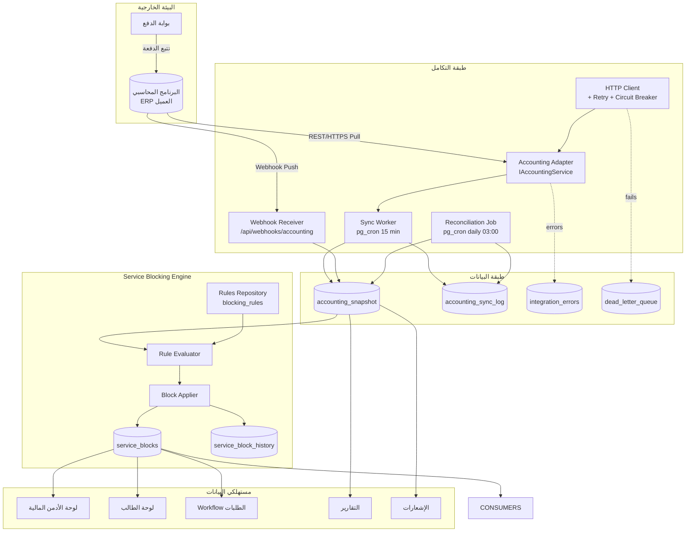
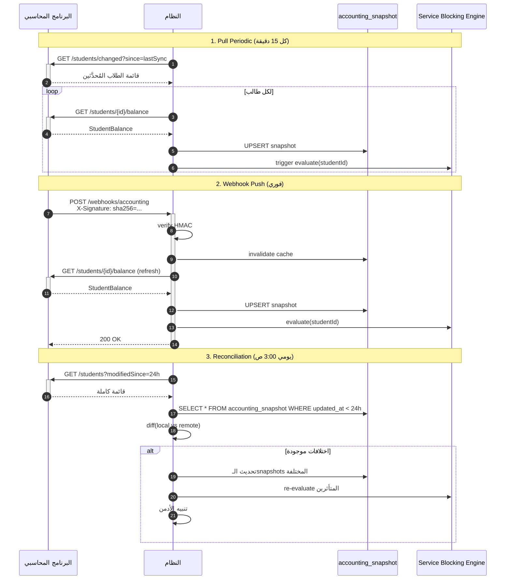
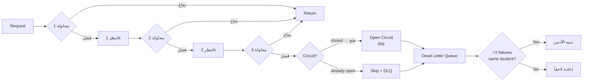
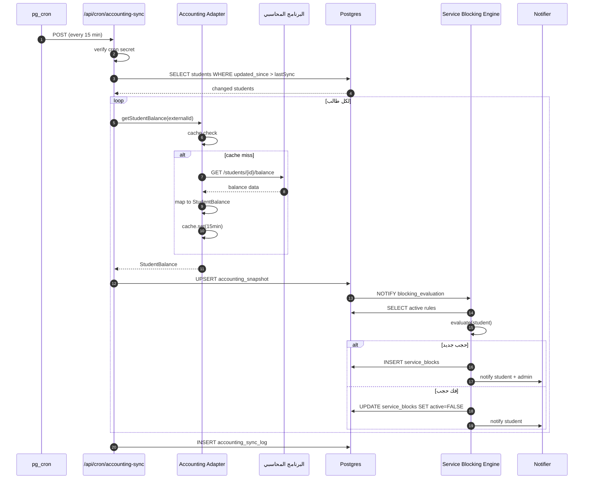
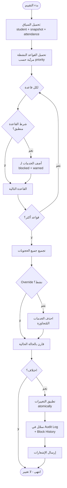
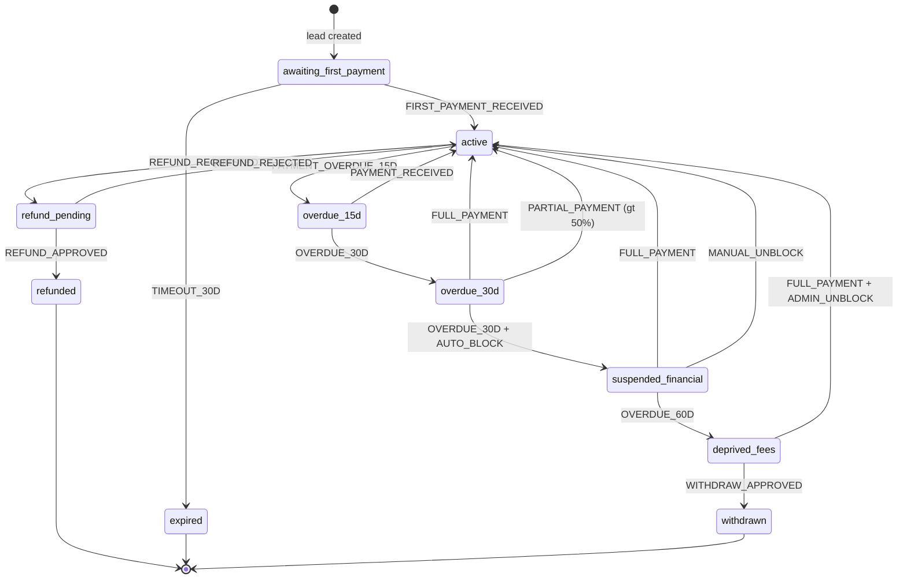
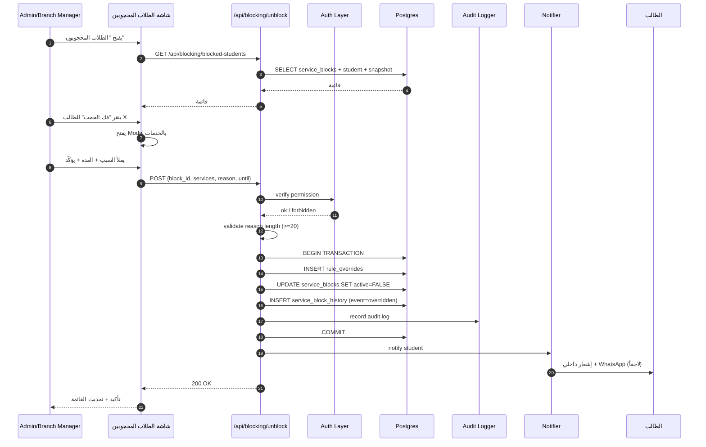

# خطة المرحلة 4 — المالية والحجب (Accounting Integration & Service Blocking)

> **المشروع:** النظام — نظام إدارة معهد تدريبي سعودي متعدد الفروع.
> **المرحلة:** 4 — التكامل المحاسبي ومحرّك حجب الخدمات.
> **التاريخ:** 2026-05-13.
> **الإصدار:** 1.0 (مسوّدة قابلة للتعديل بعد الاجتماع التقني مع مزوّد البرنامج المحاسبي).
> **حالة المرحلة:** ⭐⭐ **الأعلى أولوية تجارية** — قال العميل حرفياً: *"أهم نقطة لدينا أن تكون خدمات الطالب مرتبطة بحالته المالية."*

---

## القسم 1 — الملخص التنفيذي والقيمة المضافة

### 1.1 لماذا هذه المرحلة هي قلب المشروع؟

أوجاع العميل الثلاثة المعلنة في وثيقة الاكتشاف هي: **المتأخّرات** الكبيرة، **آلية حجب** غير ناضجة، و**فقدان الطلبات** بين الأقسام. هذه المرحلة تعالج اثنين من الثلاثة مباشرة، وتُلقي بظلّها على الثالث (الطلبات لاحقاً تعتمد على حالة الحجب).

النظام **لا يدير المالية بنفسه** — هذا قرار معماري معتمَد. المعهد لديه برنامج محاسبي خارجي قائم (يُتولّى ZATCA والفواتير وبوابة الدفع)، ودورنا أن **نتكامل معه** ونقرأ بياناته ونتّخذ قرارات تشغيلية بناءً عليها. هذه التفرقة جوهرية:

| الحدّ | ما يفعله النظام (نحن) | ما يفعله البرنامج المحاسبي (العميل) |
|------|--------------------------|---------------------------------------|
| إصدار فاتورة ZATCA | ❌ | ✅ |
| إنشاء قسط جديد | ❌ | ✅ |
| استلام مبلغ نقدي | ❌ | ✅ |
| إصدار سند قبض | ❌ | ✅ |
| الإفصاح للهيئة | ❌ | ✅ |
| **قراءة الرصيد** | ✅ | — |
| **اتخاذ قرار حجب خدمة** | ✅ | — |
| **عرض لوحة مالية للأدمن** | ✅ (للقراءة) | — |
| **توثيق الحجب وفكّه** | ✅ | — |

### 1.2 المخرجات الكبرى (Deliverables)

1. **طبقة تكامل محاسبي (Accounting Integration Layer)** بأسلوب Adapter Pattern معزول.
2. **محرّك حجب الخدمات (Service Blocking Engine)** قابل للتعديل بقواعد JSON.
3. **استراتيجية تزامن ثلاثية** (Pull/Push/Reconciliation) مع جدول snapshot في Postgres.
4. **شاشات للقراءة فقط** للأدمن والطالب والفرع (المالية + الحجوبات).
5. **6 تقارير** قابلة للتصدير (Excel + PDF).
6. **24 إشعاراً مالياً** تلقائياً (طالب + إدارة).
7. **Audit Log كامل** لكل حجب/فك حجب يُسجَّل بسياق المالية.
8. **Mock Adapter** للتطوير ومحاكاة API المحاسبي حتى يتوفّر الوصول الحقيقي.

### 1.3 معايير القبول الرئيسية (Definition of Done)

- ✅ تأخّر دفع طالب يتعدى الحد المعتمَد → **حجب تلقائي** للخدمات المرتبطة خلال **≤ 15 دقيقة**.
- ✅ سداد دفعة عبر المحاسبي → استلام webhook → **رفع الحجب تلقائياً** إن لم تعد القاعدة منطبقة.
- ✅ فك الحجب اليدوي من الأدمن مع **سبب إلزامي ≥ 20 حرفاً** ومدة (دائم/مؤقت).
- ✅ تصدير **تقرير التحصيل** لكل فرع ولفترة (Excel + PDF).
- ✅ **Reconciliation يومي** الساعة 3:00 ص يكتشف الاختلافات ويُنبّه.
- ✅ **Audit Log** لكل عملية حجب/فك حجب يحفظ snapshot المالية وقت القرار.
- ✅ Circuit Breaker يحمي النظام إن سقط المحاسبي (لا نُسقط النظام معه).
- ✅ Mock Adapter يمكن تبديله بـExternal Adapter بسطر واحد في الـDI Container.

### 1.4 المدة والجهد المتوقَّع

| القسم | الجهد (أسبوع) | حرج للمسار النقدي؟ |
|------|----------------|------------------------|
| 4.1 طبقة التكامل + Mock Adapter | 1.5–2 | ✅ |
| 4.2 استراتيجية التزامن + Snapshot Tables | 0.75–1 | ✅ |
| 4.3 معالجة الأخطاء + Circuit Breaker | 0.5 | ⚠️ |
| 4.4 Service Blocking Engine | 1.5–2 | ✅ |
| 4.5–4.6 الخدمات القابلة للحجب + UI فك الحجب | 0.75–1 | ✅ |
| 4.7 شاشات للقراءة | 0.5–0.75 | — |
| 4.8 التقارير + التصدير | 0.5–0.75 | — |
| 4.9 الإشعارات المالية | 0.25–0.5 | — |
| 4.10–4.11 العملات + PDPL | 0.25 | — |
| اختبار + توثيق + إصلاح | 0.75–1 | ✅ |
| **الإجمالي** | **~6.75–9.25 أسبوع** | — |

> ملاحظة: المسار النقدي محسوب على ~5.5 أسبوع لو سار كل شيء كما هو متوقّع. الباقي بافر للمخاطر الموثّقة في القسم 13.

---

## القسم 2 — التبعيّات (Dependencies) والمدخلات

### 2.1 ما يجب أن يكون منتهياً قبل البدء

| البند | المصدر | الحالة المتوقّعة |
|------|--------|-------------------|
| جدول `students` بحقل `external_id` للمطابقة مع المحاسبي | المرحلة 3 (الطلاب والفروع) | ✅ جاهز |
| جدول `branches` و `user_branches` | المرحلة 3 | ✅ جاهز |
| Audit Log Infrastructure | المرحلة 0 | ✅ جاهز |
| Role/Permission Matrix | المرحلة 0 | ✅ جاهز |
| Notification Channels (داخلي) | المرحلة 0 | ✅ جاهز |
| Laravel + PostgreSQL + Postgres + RLS | المرحلة 0 | ✅ جاهز |
| State Machine للطالب (8 حالات) | المرحلة 3 (2.2) | ✅ جاهز |

### 2.2 مدخلات يجب الحصول عليها من العميل قبل التطوير الفعلي

| المدخل | الأولوية | الجهة | تأخّره يُعطّل |
|--------|----------|------|---------------|
| **اسم البرنامج المحاسبي** (Onyx / Daftra / SMACC / مخصّص؟) | 🔴 | العميل | 4.1 كاملة |
| **وثائق API الحقيقية** (Endpoints, Auth, Schemas) | 🔴 | مزوّد المحاسبي | 4.1 |
| **Sandbox / حساب اختبار** | 🔴 | مزوّد المحاسبي | 4.1 |
| **اعتماد مصفوفة الحجب** (10×8) | 🔴 | الإدارة العامة | 4.4 |
| **عتبات أيام التأخر** (15/30/60 يوم؟) | 🔴 | الإدارة العامة | 4.4 |
| **حدّ صلاحية فك الحجب لمدير الفرع** | 🟠 | الإدارة العامة | 4.6 |
| **قائمة الخدمات القابلة للحجب** + ترتيبها | 🟠 | الإدارة العامة | 4.4 |
| **Webhook Secret + IP Whitelisting** | 🟠 | مزوّد المحاسبي | 4.2 |
| **سياسة الـRate Limits على API المحاسبي** | 🟠 | مزوّد المحاسبي | 4.3 |

> **استراتيجية الاحتياط:** إذا تأخّرت إجابات الـ🔴، نبني مع **Mock Adapter** يحاكي API افتراضي (موثَّق في القسم 4.1)، ونؤجّل التوصيل الفعلي. لا تُجمَّد المرحلة بانتظار العميل.

### 2.3 ما تُسلِّمه هذه المرحلة للمراحل اللاحقة

| المرحلة المستقبَلة | ما تستفيده |
|---------------------|-------------|
| المرحلة 5 (الطلبات والخطابات) | Service Blocking Check قبل قبول طلب خطاب أو شهادة |
| المرحلة 6 (شؤون المتدربين) | حالة الطالب المالية في ملفه الموحَّد |
| المرحلة 7 (الأكاديمي اليومي) | منع دخول الاختبارات للمحجوبين |
| المرحلة 9 (التقارير) | بيانات التحصيل والمتأخرات للوحات المركزية |
| المرحلة 10 (التكاملات) | قنوات WhatsApp/SMS لإشعارات الحجب |

---

## القسم 3 — المعمارية العامة (High-Level Architecture)

### 3.1 المنظور المعماري



### 3.2 المبادئ المعمارية الحاكمة

1. **عزل تام (Strong Isolation):** أي ملف في `app/Services/integrations/accounting/` لا يستورد إلا من `Types.php`. لا تسرّب نوع `AxiosResponse` خارج الـAdapter.
2. **Idempotency في كل مكان:** Webhooks قد تصل مرتين، Pull قد يقرأ نفس البيانات، Reconciliation قد يكرّر. كل عملية كتابة يجب أن تكون idempotent عبر `external_payment_id` أو `external_event_id`.
3. **Read-Only من المحاسبي:** هذه المرحلة لا تستدعي `POST` على المحاسبي (ما عدا webhook receiver وهو inbound). إنشاء فاتورة / تسجيل دفعة → من المحاسبي.
4. **Snapshot هو Source of Truth داخلي:** أي قرار حجب يعتمد على `accounting_snapshot`، **لا** على استدعاء حي للـAPI. هذا يمنحنا أداءً وعزلاً.
5. **Stale Data مقبول إن كان موثَّقاً:** عند سقوط المحاسبي، نعرض آخر snapshot مع طابع "غير محدّث منذ HH:MM" — أفضل من شاشة فارغة.
6. **القواعد Data، لا Code:** كل قاعدة حجب يجب أن تكون قابلة للتعديل من واجهة الأدمن دون نشر إصدار جديد.
7. **Audit أولاً، ثم تنفيذ:** أي عملية حجب/فك حجب تُكتب في `audit_log` قبل تطبيقها فعلياً. لو سقط النظام بعدها، نعرف الحالة المقصودة.

### 3.3 لماذا Adapter Pattern؟

السبب الأهم: **عدم اليقين بشأن البرنامج المحاسبي**. حتى وقت كتابة هذه الخطة، لم يُؤكَّد ما هو البرنامج المستخدم. الخيارات الأكثر شيوعاً في السوق السعودي:

| البرنامج | الانتشار | API؟ | جودة التوثيق |
|---------|---------|------|----------------|
| **Onyx Pro** | عالٍ في التعليم | ✅ REST | متوسط |
| **Daftra** | متوسط (SME) | ✅ REST | جيد |
| **SMACC** | عالٍ في التعليم | ✅ SOAP/REST | متوسط |
| **Quickbooks Arabic** | متوسط | ✅ REST | ممتاز |
| **مخصَّص** | حالات نادرة | يعتمد | يعتمد |

Adapter Pattern يحوّل هذا الغموض من **مخاطر عالية** إلى **متغيّر معزول**: كل التطوير الباقي يعتمد على `IAccountingService` المجرّدة، والتنقّل بين البرامج يعني تطبيق Adapter جديد فقط (~3 أيام عمل في أسوأ الحالات).

---

## القسم 4 — التصميم التفصيلي (Detailed Design)

### 4.1 طبقة التكامل المحاسبي (Accounting Integration Layer)

#### 4.1.1 بنية الملفات

```
app/Services/integrations/accounting/
├── Types.php                  # كل الـtypes — مصدر الحقيقة
├── Interface.php              # IAccountingService
├── adapters/
│   ├── Mock.php               # MockAccountingAdapter — للتطوير
│   ├── External.php           # ExternalAccountingAdapter — للإنتاج
│   ├── Onyx.php               # OnyxAccountingAdapter (اختياري)
│   └── Daftra.php             # DaftraAccountingAdapter (اختياري)
├── HttpClient.php            # axios + interceptors
├── Resilience.php             # CircuitBreaker + Retry + DLQ
├── Cache.php                  # طبقة Caching على Postgres
├── WebhookReceiver.php       # POST /webhooks/accounting
├── WebhookVerifier.php       # HMAC verification
├── SyncWorker.php            # Pull periodic
├── Reconciliation.php         # Daily reconciliation
└── Di.php                     # Dependency injection container
```

#### 4.1.2 الـ Contract المتوقَّع (PHP 8.3 Interfaces)

```typescript
// app/Services/integrations/accounting/tYpes.php

export type ExternalStudentId = string; // ما يستخدمه المحاسبي
export type Currency = 'SAR';            // افتراضياً SAR

export type StudentBalance = {
  studentExternalId: ExternalStudentId;
  totalFees: number;
  paidAmount: number;
  remainingAmount: number;
  overdueAmount: number;
  overdueDays: number;
  lastPaymentDate: string | null;        // ISO-8601
  nextDueDate: string | null;             // ISO-8601
  installmentStatus: 'on_track' | 'late' | 'critical';
  hasPendingPromise: boolean;
  currency: Currency;
  snapshotAt: string;                     // ISO-8601 من المحاسبي
};

export type Payment = {
  id: string;
  invoiceId: string;
  studentExternalId: ExternalStudentId;
  amount: number;
  currency: Currency;
  paidAt: string;
  method: 'cash' | 'card' | 'bank_transfer' | 'pos' | 'online' | 'other';
  branchExternalId: string;
  receiptNo: string;
  notes?: string;
};

export type Installment = {
  id: string;
  studentExternalId: ExternalStudentId;
  amount: number;
  dueDate: string;
  paidAmount: number;
  status: 'pending' | 'partial' | 'paid' | 'overdue';
};

export type BranchRevenue = {
  branchExternalId: string;
  period: { from: string; to: string };
  totalCollected: number;
  totalOutstanding: number;
  collectionRate: number;        // 0-1
  studentsCount: number;
  paidInFullCount: number;
  partialPayersCount: number;
  nonPayersCount: number;
};

export type WebhookEvent =
  | { type: 'payment.received'; payload: PaymentReceivedPayload }
  | { type: 'payment.refunded'; payload: PaymentRefundedPayload }
  | { type: 'invoice.issued'; payload: InvoiceIssuedPayload }
  | { type: 'installment.overdue'; payload: InstallmentOverduePayload }
  | { type: 'student.suspended'; payload: StudentSuspendedPayload };

export type PaymentReceivedPayload = {
  paymentId: string;
  studentExternalId: ExternalStudentId;
  amount: number;
  paidAt: string;
  receiptNo: string;
};

export type IntegrationHealth = {
  status: 'healthy' | 'degraded' | 'down';
  latencyMs: number;
  lastSuccessfulSyncAt: string | null;
  circuitBreakerState: 'closed' | 'half-open' | 'open';
};
```

```typescript
// app/Services/integrations/accounting/iNterface.php

export interface IAccountingService {
  // قراءة بيانات الطالب
  getStudentBalance(id: ExternalStudentId): Promise<StudentBalance>;
  getStudentPayments(
    id: ExternalStudentId,
    options?: { since?: string; page?: number; pageSize?: number }
  ): Promise<{ items: Payment[]; total: number }>;
  getStudentInstallments(id: ExternalStudentId): Promise<Installment[]>;

  // قراءة بيانات الفرع
  getBranchRevenue(
    branchExternalId: string,
    period: { from: string; to: string }
  ): Promise<BranchRevenue>;
  getBranchOutstanding(
    branchExternalId: string
  ): Promise<{ totalOutstanding: number; studentsCount: number }>;

  // الويب-هوك
  verifyWebhookSignature(signature: string, rawBody: string): boolean;

  // الصحة
  health(): Promise<IntegrationHealth>;
}
```

#### 4.1.3 العقود (Endpoints) المتوقَّعة

| Endpoint | Method | Input | Output | Auth | Cache TTL |
|----------|--------|-------|--------|------|-----------|
| `/api/v1/students/{externalId}/balance` | GET | path | `StudentBalance` | API Key | 15 min |
| `/api/v1/students/{externalId}/payments` | GET | `?since=&page=&pageSize=` | `{ items: Payment[], total }` | API Key | 30 min |
| `/api/v1/students/{externalId}/installments` | GET | path | `Installment[]` | API Key | 1 hour |
| `/api/v1/branches/{externalId}/revenue` | GET | `?from=&to=` | `BranchRevenue` | API Key | 1 hour |
| `/api/v1/branches/{externalId}/outstanding` | GET | path | `{ totalOutstanding, studentsCount }` | API Key | 30 min |
| `/api/v1/health` | GET | — | `IntegrationHealth` | — | 0 (no cache) |
| **Inbound: `/api/webhooks/accounting`** | POST | `WebhookEvent` | `200 OK` | HMAC SHA-256 | — |

#### 4.1.4 استراتيجية المصادقة

**التوصية:** **API Key في Header مع HMAC للـwebhooks**.

| الخيار | المميزات | العيوب | حكمنا |
|--------|----------|--------|--------|
| **API Key** (Bearer) | بسيط، مدعوم عالمياً | يجب الحفاظ عليه آمناً، التدوير يدوي | ✅ للأول |
| **OAuth 2.0 Client Credentials** | معياري، Token قصير العمر | تعقيد إضافي، يحتاج token refresh | لو طلبه المحاسبي |
| **Mutual TLS (mTLS)** | الأقوى أمناً | معقّد التشغيل، يحتاج CA | للحالات الحسّاسة فقط |

**التطبيق:**
- API Key يُحفَظ في **Laravel + PostgreSQL Vault** أو **environment variable** مشفّر.
- يُمرَّر في `Authorization: Bearer <KEY>`.
- يُدوَّر **كل 3 أشهر** (سياسة).
- HMAC signature على الـwebhooks: `X-Accounting-Signature: sha256=<HEX>`.

#### 4.1.5 HTTP Client مع Retry و Circuit Breaker

```typescript
// app/Services/integrations/accounting/hTtpClient.php
import axios, { AxiosInstance } from 'axios';
import { withCircuitBreaker, withRetry } from './resilience';

export function buildAccountingHttpClient(): AxiosInstance {
  const client = axios.create({
    baseURL: process.env.ACCOUNTING_API_BASE_URL,
    timeout: 5000,
    headers: {
      Authorization: `Bearer ${process.env.ACCOUNTING_API_KEY}`,
      Accept: 'application/json',
      'User-Agent': 'RowadAlAtaa-IIMS/1.0',
    },
  });

  // طلب: تسجيل وقت البدء
  client.interceptors.request.use((cfg) => {
    cfg.metadata = { startTime: Date.now() };
    return cfg;
  });

  // استجابة: قياس الزمن + تسجيل
  client.interceptors.response.use(
    (res) => {
      const duration = Date.now() - res.config.metadata!.startTime;
      logKpi('accounting_api_latency_ms', duration, {
        endpoint: res.config.url ?? '',
        status: String(res.status),
      });
      return res;
    },
    (err) => {
      // 5xx → نسجل في integration_errors
      if (err.response?.status >= 500) {
        recordIntegrationError({
          endpoint: err.config?.url ?? 'unknown',
          status: err.response.status,
          error: err.message,
        });
      }
      return Promise.reject(err);
    }
  );

  return client;
}
```

```typescript
// app/Services/integrations/accounting/adapters/eXternal.php
export class ExternalAccountingAdapter implements IAccountingService {
  constructor(
    private readonly http: AxiosInstance,
    private readonly cache: AccountingCache
  ) {}

  async getStudentBalance(id: ExternalStudentId): Promise<StudentBalance> {
    const cacheKey = `balance:${id}`;
    const cached = await this.cache.get<StudentBalance>(cacheKey);
    if (cached) return cached;

    const data = await withCircuitBreaker(() =>
      withRetry(async () => {
        const res = await this.http.get(`/api/v1/students/${id}/balance`);
        return this.mapBalance(res.data);
      })
    );

    await this.cache.set(cacheKey, data, 60 * 15); // 15 min
    return data;
  }

  private mapBalance(raw: any): StudentBalance {
    return {
      studentExternalId: raw.student_id,
      totalFees: Number(raw.total_fees),
      paidAmount: Number(raw.paid_amount),
      remainingAmount: Number(raw.remaining_amount),
      overdueAmount: Number(raw.overdue_amount ?? 0),
      overdueDays: Number(raw.overdue_days ?? 0),
      lastPaymentDate: raw.last_payment_date ?? null,
      nextDueDate: raw.next_due_date ?? null,
      installmentStatus: raw.installment_status ?? 'on_track',
      hasPendingPromise: Boolean(raw.has_pending_promise),
      currency: 'SAR',
      snapshotAt: raw.snapshot_at ?? new Date().toISOString(),
    };
  }

  verifyWebhookSignature(signature: string, rawBody: string): boolean {
    const expected = createHmac('sha256', process.env.ACCOUNTING_WEBHOOK_SECRET!)
      .update(rawBody)
      .digest('hex');
    const provided = signature.replace(/^sha256=/, '');
    return timingSafeEqual(Buffer.from(expected), Buffer.from(provided));
  }
  // ... باقي الـmethods
}
```

#### 4.1.6 Mock Adapter للتطوير

```typescript
// app/Services/integrations/accounting/adapters/mOck.php
export class MockAccountingAdapter implements IAccountingService {
  private store = new Map<ExternalStudentId, StudentBalance>();

  constructor() {
    this.seed();
  }

  private seed() {
    // 1000 طالب وهمي بحالات مالية متنوعة
    for (let i = 1; i <= 1000; i++) {
      const id = `STD-${String(i).padStart(5, '0')}`;
      this.store.set(id, this.randomBalance(id, i));
    }
  }

  private randomBalance(id: string, seed: number): StudentBalance {
    const total = 9600;
    const paidRatio = (seed % 100) / 100;
    const paid = Math.round(total * paidRatio);
    const remaining = total - paid;
    const overdueDays = remaining > 0 ? (seed % 90) : 0;
    return {
      studentExternalId: id,
      totalFees: total,
      paidAmount: paid,
      remainingAmount: remaining,
      overdueAmount: overdueDays > 0 ? remaining : 0,
      overdueDays,
      lastPaymentDate: paid > 0 ? '2026-04-15' : null,
      nextDueDate: '2026-06-01',
      installmentStatus: overdueDays > 30 ? 'critical' : overdueDays > 0 ? 'late' : 'on_track',
      hasPendingPromise: false,
      currency: 'SAR',
      snapshotAt: new Date().toISOString(),
    };
  }

  async getStudentBalance(id: ExternalStudentId): Promise<StudentBalance> {
    await delay(50); // محاكاة latency
    const b = this.store.get(id);
    if (!b) throw new Error(`Student ${id} not found`);
    return structuredClone(b);
  }

  // Mock للويب-هوك (للاختبارات الإلكترونية)
  simulatePayment(studentId: ExternalStudentId, amount: number) {
    const b = this.store.get(studentId);
    if (!b) return;
    b.paidAmount += amount;
    b.remainingAmount -= amount;
    if (b.remainingAmount <= 0) {
      b.overdueDays = 0;
      b.overdueAmount = 0;
      b.installmentStatus = 'on_track';
    }
    b.lastPaymentDate = new Date().toISOString();
    b.snapshotAt = new Date().toISOString();
  }

  verifyWebhookSignature(): boolean { return true; }
  async health(): Promise<IntegrationHealth> {
    return { status: 'healthy', latencyMs: 50, lastSuccessfulSyncAt: new Date().toISOString(), circuitBreakerState: 'closed' };
  }
  // ... باقي الـ methods بنفس الأسلوب
}
```

#### 4.1.7 Dependency Injection

```typescript
// app/Services/integrations/accounting/ServiceProvider.php (DI binding)
let instance: IAccountingService | null = null;

export function getAccountingService(): IAccountingService {
  if (instance) return instance;

  const mode = process.env.ACCOUNTING_MODE ?? 'mock';
  switch (mode) {
    case 'mock':
      instance = new MockAccountingAdapter();
      break;
    case 'external':
      instance = new ExternalAccountingAdapter(
        buildAccountingHttpClient(),
        new AccountingCache(getPgClient())
      );
      break;
    case 'onyx':
      instance = new OnyxAccountingAdapter(/* ... */);
      break;
    default:
      throw new Error(`Unknown ACCOUNTING_MODE: ${mode}`);
  }
  return instance;
}
```

> **الفائدة:** تبديل المحاسبي بـ`ACCOUNTING_MODE=onyx` بدلاً من `external`، بدون لمس أي ملف آخر.

### 4.2 استراتيجية التزامن (Sync Strategy)

#### 4.2.1 ثلاث طبقات متكاملة



#### 4.2.2 Pull Periodic (كل 15 دقيقة)

نستخدم **Laravel + PostgreSQL pg_cron + pg_net** (دون Edge Function منفصل):

```sql
-- نسجل المهمّة في pg_cron
SELECT cron.schedule(
  'accounting-pull-sync',
  '*/15 * * * *',
  $$
  SELECT net.http_post(
    url := 'https://app.rowad-alataa.sa/api/cron/accounting-sync',
    headers := jsonb_build_object(
      'Content-Type', 'application/json',
      'X-Cron-Secret', current_setting('app.cron_secret')
    ),
    body := jsonb_build_object('mode', 'incremental'),
    timeout_milliseconds := 300000
  );
  $$
);
```

```typescript
// app/Http/Controllers/Api/cron/accounting-sync/rOute.php
export async function POST(req: Request) {
  // 1) verify cron secret
  if (req.headers.get('x-cron-secret') !== process.env.CRON_SECRET) {
    return new Response('Unauthorized', { status: 401 });
  }

  const acct = getAccountingService();
  const sbe = getServiceBlockingEngine();
  const lastSync = await getLastSyncTimestamp();

  // 2) جلب قائمة المتغيّرين منذ آخر sync
  const changedStudents = await getStudentsModifiedSince(lastSync);
  const startedAt = new Date();
  let success = 0, failed = 0;

  // 3) معالجة بـbatches للحفاظ على الـrate limit
  for (const batch of chunk(changedStudents, 50)) {
    await Promise.allSettled(
      batch.map(async (s) => {
        try {
          const balance = await acct.getStudentBalance(s.external_id);
          await upsertSnapshot(s.id, balance);
          await sbe.evaluate(s.id);
          success++;
        } catch (err) {
          failed++;
          await recordSyncFailure(s.id, err);
        }
      })
    );
    await delay(500); // تخفيف الضغط
  }

  // 4) تسجيل الـsync
  await recordSyncLog({
    type: 'pull_incremental',
    started_at: startedAt,
    finished_at: new Date(),
    students_processed: changedStudents.length,
    success,
    failed,
  });

  return Response.json({ success, failed });
}
```

#### 4.2.3 Webhook Receiver

```typescript
// app/Http/Controllers/Api/webhooks/accounting/rOute.php
export async function POST(req: Request) {
  const rawBody = await req.text();
  const signature = req.headers.get('x-accounting-signature') ?? '';
  const acct = getAccountingService();

  // 1) verify
  if (!acct.verifyWebhookSignature(signature, rawBody)) {
    return new Response('Invalid signature', { status: 401 });
  }

  const event: WebhookEvent = JSON.parse(rawBody);

  // 2) idempotency check
  const eventId = req.headers.get('x-event-id') ?? hash(rawBody);
  if (await isWebhookProcessed(eventId)) {
    return new Response('Already processed', { status: 200 });
  }
  await markWebhookProcessed(eventId);

  // 3) معالجة الحدث
  await processWebhookEvent(event);

  return new Response('ok', { status: 200 });
}

async function processWebhookEvent(event: WebhookEvent) {
  const sbe = getServiceBlockingEngine();
  const acct = getAccountingService();

  switch (event.type) {
    case 'payment.received': {
      const { studentExternalId } = event.payload;
      const student = await findStudentByExternalId(studentExternalId);
      if (!student) return;
      const balance = await acct.getStudentBalance(studentExternalId);
      await upsertSnapshot(student.id, balance);
      await sbe.evaluate(student.id); // قد يرفع الحجب تلقائياً
      await notifyStudent(student.id, 'payment_received', event.payload);
      break;
    }
    case 'payment.refunded':
      // معالجة الاسترجاع
      break;
    case 'installment.overdue': {
      const student = await findStudentByExternalId(event.payload.studentExternalId);
      if (student) await sbe.evaluate(student.id);
      break;
    }
  }
}
```

#### 4.2.4 Reconciliation Job (يومي 3:00 ص)

**الهدف:** كشف **Data Drift** — لو فُقد webhook أو فشل sync.

```typescript
// app/Http/Controllers/Api/cron/accounting-reconciliation/rOute.php
export async function POST(req: Request) {
  if (req.headers.get('x-cron-secret') !== process.env.CRON_SECRET) {
    return new Response('Unauthorized', { status: 401 });
  }

  const acct = getAccountingService();
  const drifted: Array<{ studentId: string; field: string; local: any; remote: any }> = [];

  // 1) جلب كل الطلاب النشطين
  const students = await getAllActiveStudents();

  for (const batch of chunk(students, 50)) {
    await Promise.allSettled(
      batch.map(async (s) => {
        const remote = await acct.getStudentBalance(s.external_id);
        const local = await getSnapshot(s.id);
        if (!local) return;

        const fields: Array<keyof StudentBalance> = [
          'totalFees', 'paidAmount', 'remainingAmount', 'overdueDays',
        ];
        for (const f of fields) {
          if (Math.abs(Number(local[f]) - Number(remote[f])) > 0.01) {
            drifted.push({ studentId: s.id, field: f as string, local: local[f], remote: remote[f] });
            await upsertSnapshot(s.id, remote);
            await getServiceBlockingEngine().evaluate(s.id);
          }
        }
      })
    );
  }

  // 2) تنبيه الأدمن إن وجد drift
  if (drifted.length > 0) {
    await notifyAdmins('accounting_drift_detected', { count: drifted.length, samples: drifted.slice(0, 10) });
  }

  await recordSyncLog({ type: 'reconciliation', drift_count: drifted.length });
  return Response.json({ drift: drifted.length });
}
```

### 4.3 معالجة الأخطاء (Error Handling)

#### 4.3.1 ثلاثة مستويات



#### 4.3.2 Retry Exponential Backoff

```typescript
// app/Services/integrations/accounting/rEsilience.php
export async function withRetry<T>(
  fn: () => Promise<T>,
  options = { attempts: 3, baseDelayMs: 1000, maxDelayMs: 10000 }
): Promise<T> {
  let lastErr: unknown;
  for (let attempt = 1; attempt <= options.attempts; attempt++) {
    try {
      return await fn();
    } catch (err) {
      lastErr = err;
      if (attempt === options.attempts) throw err;
      const delay = Math.min(
        options.baseDelayMs * Math.pow(2, attempt - 1),
        options.maxDelayMs
      );
      await sleep(delay + Math.random() * 250); // jitter
    }
  }
  throw lastErr;
}
```

#### 4.3.3 Circuit Breaker

```typescript
type CircuitState = 'closed' | 'open' | 'half-open';

class CircuitBreaker {
  private state: CircuitState = 'closed';
  private failureCount = 0;
  private openedAt = 0;

  constructor(private readonly options = {
    threshold: 5,
    openMs: 60_000,
    halfOpenMs: 30_000,
  }) {}

  async execute<T>(fn: () => Promise<T>): Promise<T> {
    if (this.state === 'open') {
      if (Date.now() - this.openedAt > this.options.openMs) {
        this.state = 'half-open';
      } else {
        throw new CircuitOpenError();
      }
    }

    try {
      const result = await fn();
      if (this.state === 'half-open') {
        this.state = 'closed';
        this.failureCount = 0;
      }
      return result;
    } catch (err) {
      this.failureCount++;
      if (this.failureCount >= this.options.threshold) {
        this.state = 'open';
        this.openedAt = Date.now();
        await notifyAdminCircuitOpened();
      }
      throw err;
    }
  }

  getState(): CircuitState { return this.state; }
}

export const accountingCircuit = new CircuitBreaker();
export async function withCircuitBreaker<T>(fn: () => Promise<T>) {
  return accountingCircuit.execute(fn);
}
```

#### 4.3.4 Dead Letter Queue

```sql
CREATE TABLE dead_letter_queue (
  id BIGSERIAL PRIMARY KEY,
  job_type TEXT NOT NULL,
  payload JSONB NOT NULL,
  error_message TEXT,
  error_stack TEXT,
  attempts INTEGER NOT NULL DEFAULT 1,
  first_failed_at TIMESTAMPTZ NOT NULL DEFAULT NOW(),
  last_failed_at TIMESTAMPTZ NOT NULL DEFAULT NOW(),
  resolved_at TIMESTAMPTZ,
  resolved_by UUID REFERENCES users(id)
);

CREATE INDEX idx_dlq_unresolved ON dead_letter_queue(job_type, last_failed_at)
  WHERE resolved_at IS NULL;
```

شاشة الأدمن: `/admin/integrations/dlq` تعرض المهام الفاشلة مع زرّ "إعادة المحاولة" و "تعليم كمحلول".

#### 4.3.5 جدول `integration_errors`

```sql
CREATE TABLE integration_errors (
  id BIGSERIAL PRIMARY KEY,
  integration TEXT NOT NULL DEFAULT 'accounting',
  endpoint TEXT,
  http_status INTEGER,
  error_message TEXT,
  error_code TEXT,
  request_id UUID,
  occurred_at TIMESTAMPTZ NOT NULL DEFAULT NOW(),
  resolved BOOLEAN DEFAULT FALSE
);

CREATE INDEX idx_int_errors_recent ON integration_errors(integration, occurred_at DESC);
```

### 4.4 محرّك حجب الخدمات (Service Blocking Engine)

#### 4.4.1 الفلسفة الحاكمة

> **حجب تلقائي بقواعد. فك حجب يدوي بصلاحية + توثيق.**

ثلاثة مبادئ:

1. **القاعدة Data، لا Code:** الأدمن يضبط القاعدة من واجهة، لا يحتاج مبرمج.
2. **القرار Reversible:** إن دفع الطالب → الحجب يُرفع تلقائياً.
3. **الفك اليدوي مُستند:** لا يستطيع موظف فك حجب دون تبرير ≥ 20 حرفاً + تسجيل في Audit Log.

#### 4.4.2 بنية القاعدة (Rule Schema)

```typescript
// app/Services/blocking/tYpes.php

export type ServiceKey =
  | 'letter_issuance'
  | 'certificate_issuance'
  | 'transcript_request'
  | 'view_grades'
  | 'sit_exam'
  | 'comprehensive_exam'
  | 'enroll_next_term'
  | 'request_withdrawal'
  | 'level_promotion'
  | 'view_schedule'
  | 'attendance_marking'
  | 'document_archive_access'
  | 'library_access';     // محجوز للمرحلة 7

export type BlockingCondition =
  | { kind: 'overdue_days_gt'; value: number }
  | { kind: 'overdue_days_between'; min: number; max: number }
  | { kind: 'overdue_amount_gt'; value: number }
  | { kind: 'student_status_in'; values: StudentStatus[] }
  | { kind: 'absence_rate_gt'; value: number }
  | { kind: 'installment_status_in'; values: Array<'on_track'|'late'|'critical'> }
  | { kind: 'and'; rules: BlockingCondition[] }
  | { kind: 'or'; rules: BlockingCondition[] }
  | { kind: 'not'; rule: BlockingCondition };

export type BlockingAction =
  | { type: 'block_services'; services: ServiceKey[] }
  | { type: 'warn_services'; services: ServiceKey[] }
  | { type: 'set_status'; status: StudentStatus }
  | { type: 'notify_student'; template: string }
  | { type: 'notify_admin'; severity: 'info'|'warning'|'critical' };

export type BlockingRule = {
  id: string;
  name_ar: string;
  description_ar?: string;
  is_active: boolean;
  priority: number;
  condition: BlockingCondition;
  actions: BlockingAction[];
  created_at: string;
  updated_at: string;
  created_by: string;
  updated_by: string;
};
```

#### 4.4.3 مثال JSON كامل

```json
{
  "id": "rule-fin-30d",
  "name_ar": "حجب الخطابات والشهادات للمتأخرين أكثر من 30 يوم",
  "description_ar": "إذا تأخر الطالب 30 يوماً أو أكثر بمبلغ يتجاوز 500 ريال، يُحجب من إصدار خطابات/شهادات/كشوف، ويُنبَّه الطالب فوراً، ويُرفع للإدارة إن استمر الوضع.",
  "is_active": true,
  "priority": 10,
  "condition": {
    "kind": "and",
    "rules": [
      { "kind": "overdue_days_gt", "value": 30 },
      { "kind": "overdue_amount_gt", "value": 500 },
      { "kind": "not", "rule": { "kind": "student_status_in", "values": ["graduated", "withdrawn"] } }
    ]
  },
  "actions": [
    {
      "type": "block_services",
      "services": ["letter_issuance", "certificate_issuance", "transcript_request"]
    },
    {
      "type": "notify_student",
      "template": "block_due_to_overdue_30d"
    },
    {
      "type": "notify_admin",
      "severity": "warning"
    }
  ],
  "created_at": "2026-05-01T08:00:00Z",
  "updated_at": "2026-05-01T08:00:00Z",
  "created_by": "admin-uuid",
  "updated_by": "admin-uuid"
}
```

#### 4.4.4 محرّك التشغيل

```typescript
// app/Services/blocking/eNgine.php

export class ServiceBlockingEngine {
  constructor(
    private readonly rulesRepo: BlockingRulesRepository,
    private readonly blocksRepo: ServiceBlocksRepository,
    private readonly snapshotsRepo: AccountingSnapshotsRepository,
    private readonly studentsRepo: StudentsRepository,
    private readonly notifier: NotificationService,
    private readonly audit: AuditLogger,
  ) {}

  async evaluate(studentId: string): Promise<EvaluationResult> {
    // 1) بناء سياق التقييم
    const ctx = await this.buildContext(studentId);

    // 2) جلب القواعد النشطة مرتّبة حسب priority
    const rules = await this.rulesRepo.getActive();

    // 3) تطبيق القواعد
    const matched = rules.filter(r => this.evaluateCondition(r.condition, ctx));

    // 4) جمع الخدمات المُتأثّرة + الإجراءات
    const blocksToApply = this.aggregate(matched);

    // 5) قارن بالحالة الحالية لتحديد التغييرات
    const current = await this.blocksRepo.getActiveForStudent(studentId);
    const diff = this.diff(current, blocksToApply);

    // 6) طبّق التغييرات (atomically)
    await this.applyDiff(studentId, diff, matched, ctx);

    // 7) Audit Log
    await this.audit.record({
      action: 'blocking.evaluate',
      target_student_id: studentId,
      before: current,
      after: blocksToApply,
      context: { snapshot_at: ctx.snapshot?.snapshotAt, matched_rules: matched.map(r => r.id) },
    });

    return { matched, blocks: blocksToApply, diff };
  }

  private async buildContext(studentId: string): Promise<EvalContext> {
    const [student, snapshot, attendance] = await Promise.all([
      this.studentsRepo.findById(studentId),
      this.snapshotsRepo.findByStudentId(studentId),
      this.studentsRepo.getAttendanceRate(studentId),
    ]);
    return { student, snapshot, attendanceRate: attendance };
  }

  private evaluateCondition(c: BlockingCondition, ctx: EvalContext): boolean {
    switch (c.kind) {
      case 'overdue_days_gt':
        return (ctx.snapshot?.overdueDays ?? 0) > c.value;
      case 'overdue_days_between':
        return (ctx.snapshot?.overdueDays ?? 0) >= c.min &&
               (ctx.snapshot?.overdueDays ?? 0) <= c.max;
      case 'overdue_amount_gt':
        return (ctx.snapshot?.overdueAmount ?? 0) > c.value;
      case 'student_status_in':
        return c.values.includes(ctx.student.status);
      case 'absence_rate_gt':
        return ctx.attendanceRate < (1 - c.value / 100);
      case 'installment_status_in':
        return ctx.snapshot ? c.values.includes(ctx.snapshot.installmentStatus) : false;
      case 'and':
        return c.rules.every(r => this.evaluateCondition(r, ctx));
      case 'or':
        return c.rules.some(r => this.evaluateCondition(r, ctx));
      case 'not':
        return !this.evaluateCondition(c.rule, ctx);
    }
  }

  private aggregate(rules: BlockingRule[]): AppliedBlocks {
    const blocked = new Set<ServiceKey>();
    const warned = new Set<ServiceKey>();
    const reasons: Record<ServiceKey, string[]> = {} as any;

    for (const rule of rules) {
      for (const action of rule.actions) {
        if (action.type === 'block_services') {
          for (const s of action.services) {
            blocked.add(s);
            (reasons[s] ||= []).push(rule.id);
          }
        } else if (action.type === 'warn_services') {
          for (const s of action.services) warned.add(s);
        }
      }
    }
    return { blocked: [...blocked], warned: [...warned], reasons };
  }

  // ...applyDiff, diff, etc.
}
```

#### 4.4.5 متى يتم تشغيل المحرّك؟

| الحدث | المُشغِّل | الزمن المتوقَّع |
|------|---------|------------------|
| تحديث `accounting_snapshot` | Trigger PostgreSQL → NOTIFY → Worker | < 5s |
| استلام webhook دفعة | Webhook handler يستدعي `evaluate` مباشرة | < 2s |
| استلام webhook تأخّر | Webhook handler يستدعي `evaluate` | < 2s |
| تغيير حالة الطالب | Trigger في `students` | < 5s |
| تغيير قاعدة من الأدمن | عند الحفظ → إعادة تقييم الكلّ | تدريجي (queue) |
| Cron يومي 4:00 ص | تقييم احتياطي لكل الطلاب النشطين | ~10 min |

#### 4.4.6 SQL Trigger للتشغيل التلقائي

```sql
CREATE OR REPLACE FUNCTION trigger_blocking_evaluation()
RETURNS TRIGGER AS $$
BEGIN
  PERFORM pg_notify('blocking_evaluation', NEW.student_id::TEXT);
  RETURN NEW;
END;
$$ LANGUAGE plpgsql;

CREATE TRIGGER on_snapshot_update
AFTER INSERT OR UPDATE ON accounting_snapshot
FOR EACH ROW
EXECUTE FUNCTION trigger_blocking_evaluation();

CREATE TRIGGER on_student_status_change
AFTER UPDATE OF status ON students
FOR EACH ROW
WHEN (NEW.status IS DISTINCT FROM OLD.status)
EXECUTE FUNCTION trigger_blocking_evaluation();
```

Worker يستمع لـ `LISTEN blocking_evaluation`:

```typescript
const client = new pg.Client(...);
await client.connect();
await client.query('LISTEN blocking_evaluation');
client.on('notification', async (msg) => {
  const studentId = msg.payload!;
  await getServiceBlockingEngine().evaluate(studentId);
});
```

### 4.5 الخدمات القابلة للحجب (Blockable Services)

#### 4.5.1 القائمة الافتراضية (قابلة للتوسعة من الأدمن)

| # | المفتاح (key) | الاسم العربي | الواجهة المتأثرة | يمنع | يحذّر |
|---|----------------|---------------|---------------------|------|--------|
| 1 | `letter_issuance` | إصدار خطاب | بوابة الطالب → الطلبات | إنشاء طلب جديد | يمكن العرض مع رسالة |
| 2 | `certificate_issuance` | إصدار شهادة | البوابة → الشهادات | إنشاء طلب | يعرض الموجود |
| 3 | `transcript_request` | كشف الدرجات | البوابة → الكشف | إنشاء طلب | — |
| 4 | `view_grades` | رؤية الدرجات | لوحة الطالب | عرض الدرجات | — |
| 5 | `sit_exam` | دخول الاختبارات | منصة الاختبارات | البدء بالاختبار | يمكن المعاينة |
| 6 | `comprehensive_exam` | الاختبار الشامل | البوابة → الترشّح | الترشّح | — |
| 7 | `enroll_next_term` | التسجيل للترم القادم | البوابة → التسجيل | الإرسال | يعرض القائمة |
| 8 | `request_withdrawal` | تقديم انسحاب | البوابة → الطلبات | الإرسال | — |
| 9 | `level_promotion` | الترقية للمستوى التالي | شؤون المتدربين | التنفيذ التلقائي | — |
| 10 | `view_schedule` | الجدول الدراسي | البوابة → الجدول | العرض | — |
| 11 | `attendance_marking` | التحضير | تطبيق المعلم | تسجيل حضوره | — |
| 12 | `document_archive_access` | الأرشيف الشخصي | البوابة → المستندات | تنزيل | عرض القائمة |
| 13 | `library_access` *(مرحلة 7)* | مكتبة الموارد | البوابة → المكتبة | الوصول | — |

#### 4.5.2 إضافة خدمة جديدة من الأدمن

شاشة `/admin/blocking/services`:
- يضيف الأدمن خدمة بـ:
  - مفتاح (snake_case)
  - اسم عربي + إنجليزي
  - وصف
  - نقطة الـintercept (مكان الفحص في الكود)
- يولّد النظام كود intercept نموذجي ويعرض الموقع للمبرمج لتطبيقه.
- الخدمة الجديدة تظهر تلقائياً في واجهة بناء القاعدة.

#### 4.5.3 نقطة الـIntercept في الكود (Centralized Guard)

```typescript
// app/Services/blocking/gUard.php

export async function ensureNotBlocked(
  studentId: string,
  service: ServiceKey,
): Promise<void> {
  const block = await db.service_blocks.findFirst({
    where: { student_id: studentId, service_key: service, active: true },
  });
  if (block) {
    throw new ServiceBlockedError(service, block.reason, block.id);
  }
}

// استخدامه في API route
export async function POST(req: Request) {
  const studentId = await getCurrentStudentId(req);
  await ensureNotBlocked(studentId, 'letter_issuance');
  // ... باقي الكود
}
```

Helper الواجهة (Livewire/Blade):

```typescript
export function useServiceAvailability(service: ServiceKey) {
  const { data } = useQuery(['service-block', service], () =>
    fetch(`/api/me/blocks/${service}`).then(r => r.json())
  );
  return {
    isBlocked: data?.blocked ?? false,
    reason: data?.reason,
    blockedSince: data?.blocked_since,
    isWarning: data?.warning ?? false,
  };
}
```

### 4.6 واجهة فك الحجب اليدوي (Manual Unblock UI)

#### 4.6.1 الصلاحيات

| الدور | فك الحجب؟ | حدّ الفترة | يلتزم بتبرير؟ | اعتماد إضافي؟ |
|------|-----------|-------------|------------------|------------------|
| Super Admin | ✅ كل الأنواع | بدون | ✅ ≥ 20 حرف | لا |
| Admin (الإدارة) | ✅ كل الأنواع | بدون | ✅ ≥ 20 حرف | لا |
| Branch Manager | ✅ ضمن فرعه + خدمات محدودة (خطاب فقط افتراضياً) | ≤ 7 أيام | ✅ ≥ 30 حرف | بعد الـ3 أيام: Admin |
| Finance | ✅ مالية فقط | ≤ 3 أيام | ✅ ≥ 30 حرف | بعد اليوم: Admin |
| Affairs | ❌ | — | — | — |

> الأرقام أعلاه قيم اقتراحية تحتاج اعتماد العميل (مدوّن في القسم 13).

#### 4.6.2 شاشة "الطلاب المحجوبون"

`/admin/blocking/blocked-students`

العرض:
- جدول مرتّب حسب تاريخ الحجب الأقدم.
- أعمدة: الاسم، الفرع، الخدمات المحجوبة، السبب، تاريخ الحجب، آخر دفعة، الرصيد، الإجراء.
- فلاتر: الفرع، نوع الحجب (مالي/أكاديمي/إداري)، فترة التأخر.
- زر "فك الحجب" يفتح Modal:

```
┌────────────────────────────────────────────────┐
│ فك الحجب — الطالب: محمد عبدالله / الفرع الأول   │
├────────────────────────────────────────────────┤
│ الخدمات المحجوبة:                              │
│ ☑ إصدار خطاب  ☑ إصدار شهادة  ☐ كشف الدرجات    │
│                                                │
│ سبب فك الحجب (إلزامي، ≥ 20 حرف):                │
│ ┌──────────────────────────────────────────┐   │
│ │ وعد الطالب بالسداد خلال 3 أيام مع تقديم  │   │
│ │ تعهّد خطّي.                                 │   │
│ └──────────────────────────────────────────┘   │
│                                                │
│ مدة فك الحجب:                                  │
│ ⦿ مؤقت حتى:  [📅 2026-05-20]                    │
│ ⦾ دائم                                          │
│                                                │
│ مرفقات (اختياري):                              │
│ [📎 رفع ملف]                                    │
│                                                │
│   [إلغاء]                    [تأكيد فك الحجب]  │
└────────────────────────────────────────────────┘
```

#### 4.6.3 منطق فك الحجب

```typescript
export async function manualUnblock(req: ManualUnblockRequest, actor: User) {
  // 1) صلاحية
  await assertCanUnblock(actor, req);

  // 2) تحقّق من السبب (طول، عدم تكرار، إلخ)
  if (req.reason.trim().length < 20) throw new ValidationError('reason_too_short');

  // 3) تحقّق من المدة لو الدور branch_manager/finance
  if (req.unblock_until) {
    const days = differenceInDays(req.unblock_until, new Date());
    if (actor.role === 'branch_manager' && days > 7) throw new ValidationError('duration_exceeds_role_limit');
    if (actor.role === 'finance' && days > 3) throw new ValidationError('duration_exceeds_role_limit');
  }

  // 4) أنشئ override
  await db.rule_overrides.insert({
    student_id: req.student_id,
    services_overridden: req.services,
    expires_at: req.unblock_until,
    reason: req.reason,
    created_by: actor.id,
    created_at: new Date(),
    attachments: req.attachments,
  });

  // 5) أزل الحجب من service_blocks (مع حفظ التاريخ)
  await db.service_blocks.update({
    where: { student_id: req.student_id, service_key: { in: req.services }, active: true },
    data: { active: false, deactivated_at: new Date(), deactivated_reason: 'manual_unblock' },
  });

  // 6) Audit Log
  await audit.record({
    action: 'blocking.manual_unblock',
    actor_id: actor.id,
    actor_role: actor.role,
    target_student_id: req.student_id,
    services: req.services,
    reason: req.reason,
    unblock_until: req.unblock_until,
    accounting_snapshot_at: (await getSnapshot(req.student_id))?.snapshotAt,
  });

  // 7) إشعار الطالب
  await notifyStudent(req.student_id, 'manual_unblock', { services: req.services });
}
```

#### 4.6.4 إعادة الحجب التلقائي

عند انتهاء `unblock_until`:

```sql
SELECT cron.schedule(
  'expire-rule-overrides',
  '*/10 * * * *',
  $$
  WITH expired AS (
    SELECT student_id FROM rule_overrides
    WHERE expires_at < NOW() AND active = TRUE
  )
  UPDATE rule_overrides SET active = FALSE WHERE id IN (SELECT id FROM expired);

  SELECT pg_notify('blocking_evaluation', student_id::TEXT) FROM expired;
  $$
);
```

### 4.7 شاشات المالية للقراءة (Financial Dashboards)

#### 4.7.1 لوحة الأدمن المالية `/admin/finance/dashboard`

- **بطاقات KPI:**
  - إجمالي المستحق (من المحاسبي): X ريال.
  - إجمالي المُحصَّل: Y ريال — نسبة Z%.
  - عدد الطلاب المتأخرين: N.
  - عدد المحجوبين حالياً: M.
  - عدد فك الحجب اليدوي هذا الشهر: K.

- **رسوم بيانية:**
  - Line chart: التحصيل عبر آخر 12 شهراً.
  - Bar chart: تحصيل كل فرع للشهر الجاري.
  - Donut: توزيع الطلاب على فئات التأخر (0/1-15/16-30/31-60/61+).

- **آخر تحديث:** "آخر sync مع المحاسبي قبل 4 دقائق".

#### 4.7.2 لوحة الطالب المالية `/portal/finance`

- **الرصيد الحالي:** مبلغ + شريط تقدّم.
- **القسط القادم:** المبلغ + التاريخ + أيام متبقية.
- **سجل الدفعات:** جدول مرقَّم (آخر 20 دفعة).
- **إن كان محجوباً:** بانر بارز بلون أحمر + سبب الحجب + كيف يحلّ.
- **زر "تواصل مع المالية"** لتسهيل الاستفسار.

#### 4.7.3 صفحة فرع `/admin/branches/{id}/finance`

- نفس KPIs الأدمن لكن مفلترة للفرع.
- جدول طلاب الفرع مع مؤشر مالي بجانب كل اسم.
- زر "تصدير تحصيل الفرع" (Excel + PDF).

### 4.8 التقارير المالية (Financial Reports)

#### 4.8.1 ستة تقارير معتمدة

| # | التقرير | المعايير | التصدير | الجمهور |
|---|---------|----------|----------|----------|
| 1 | **تقرير المتأخرات** | الفرع، فئة التأخر | Excel + PDF | أدمن، مالية، فرع |
| 2 | **تقرير التحصيل الشهري** | الفرع، الشهر | Excel + PDF | إدارة، مالية |
| 3 | **تقرير التحصيل الفصلي** | الفرع، الفصل | Excel + PDF | إدارة |
| 4 | **تقرير التحصيل السنوي** | الفرع، السنة | Excel + PDF | إدارة |
| 5 | **تقرير الحجوبات وأسبابها** | الفرع، الفترة، نوع الحجب | Excel + PDF | أدمن |
| 6 | **مقارنة الفروع** | الفترة | Excel + PDF | الإدارة العامة |

#### 4.8.2 SQL لتقرير المتأخرات

```sql
SELECT
  s.id,
  s.full_name_ar,
  s.national_id,
  b.name_ar AS branch_name,
  snap.overdue_amount,
  snap.overdue_days,
  snap.last_payment_date,
  CASE
    WHEN snap.overdue_days BETWEEN 1 AND 15 THEN '1-15 يوم'
    WHEN snap.overdue_days BETWEEN 16 AND 30 THEN '16-30 يوم'
    WHEN snap.overdue_days BETWEEN 31 AND 60 THEN '31-60 يوم'
    ELSE '60+ يوم'
  END AS overdue_bucket,
  EXISTS (
    SELECT 1 FROM service_blocks sb
    WHERE sb.student_id = s.id AND sb.active = TRUE
  ) AS is_blocked
FROM students s
INNER JOIN branches b ON b.id = s.branch_id
LEFT JOIN accounting_snapshot snap ON snap.student_id = s.id
WHERE s.status IN ('active', 'late_financial', 'suspended_financial', 'deprived_fees')
  AND snap.overdue_days > 0
  AND ($1::UUID IS NULL OR s.branch_id = $1)
ORDER BY snap.overdue_days DESC;
```

#### 4.8.3 تصدير Excel و PDF

- **Excel:** مكتبة `exceljs` — RTL في الرأس، عمود مرقّم، عناوين معرّبة، تلوين الأسطر حسب فئة التأخر.
- **PDF:** مكتبة `pdfmake` + خط Cairo Arabic — قالب موحَّد، شعار النظام، رأس وتذييل، توقيع رقمي اختياري.

### 4.9 الإشعارات المالية

#### 4.9.1 إشعارات الطالب (12 إشعاراً)

| # | الحدث | القناة الأولى | القناة الثانية |
|---|------|----------------|------------------|
| 1 | اقتراب قسط (3 أيام) | داخلي | WhatsApp (لاحقاً) |
| 2 | استحقاق قسط (نفس اليوم) | داخلي | WhatsApp |
| 3 | تأخر قسط — يوم 1 | داخلي | — |
| 4 | تأخر قسط — يوم 7 | داخلي | WhatsApp |
| 5 | تأخر قسط — يوم 14 | داخلي | WhatsApp + SMS |
| 6 | تأخر قسط — يوم 30 | داخلي | WhatsApp + SMS |
| 7 | حجب خدمة | داخلي + WhatsApp | SMS عاجل |
| 8 | فك حجب تلقائي | داخلي | WhatsApp |
| 9 | فك حجب يدوي | داخلي | WhatsApp |
| 10 | استلام دفعة | داخلي | WhatsApp |
| 11 | استرجاع دفعة | داخلي | WhatsApp |
| 12 | تأكيد فاتورة جديدة | داخلي | — |

#### 4.9.2 إشعارات الأدمن (12 إشعاراً)

| # | الحدث | الشدة |
|---|------|--------|
| 1 | فشل sync مع المحاسبي (3 محاولات) | warning |
| 2 | Circuit Breaker مفتوح | critical |
| 3 | Reconciliation كشف اختلافات | warning |
| 4 | متأخرات تجاوزت 100K ريال إجمالي | warning |
| 5 | حجب جماعي (10+ طلاب في ساعة) | warning |
| 6 | فك حجب يدوي على خدمة حسّاسة | info |
| 7 | محاولة فك حجب فاشلة (صلاحية) | warning |
| 8 | DLQ تجاوز 100 رسالة | warning |
| 9 | تأخر sync أكثر من ساعة | warning |
| 10 | API المحاسبي بطيء (p95 > 5s) | warning |
| 11 | webhook غير موقَّع | critical |
| 12 | تغيير قاعدة حجب | info |

### 4.10 Multi-Currency Support

> العملة الافتراضية الوحيدة المُعتمدة الآن: **SAR**. لكن البنية مستعدّة.

```sql
ALTER TABLE accounting_snapshot ADD COLUMN currency VARCHAR(3) NOT NULL DEFAULT 'SAR';
ALTER TABLE service_blocks ADD COLUMN context_currency VARCHAR(3);
```

**التنسيق:**

```typescript
export function formatMoney(amount: number, currency = 'SAR'): string {
  return new Intl.NumberFormat('ar-SA', {
    style: 'currency',
    currency,
    minimumFractionDigits: 2,
  }).format(amount);
}
```

### 4.11 PDPL للبيانات المالية

#### 4.11.1 المبدأ

البيانات المالية المسحوبة من المحاسبي **حسّاسة** بمعنى نظام حماية البيانات الشخصية السعودي. لكنّنا **لا نحتفظ ببيانات حسّاسة جداً** (أرقام بطاقات، حسابات بنكية، إلخ).

#### 4.11.2 ما نحتفظ به

- ✅ إجمالي الرسوم، المُسدَّد، المتبقي.
- ✅ تاريخ الدفعة، رقم الإيصال، الطريقة (cash/card/transfer دون تفاصيل).
- ✅ أيام التأخر، حالة الأقساط.
- ✅ تاريخ القرار (الحجب/الفك) ومن اتخذه.

#### 4.11.3 ما لا نحتفظ به (Forbidden)

- ❌ رقم البطاقة (PAN).
- ❌ CVV.
- ❌ رقم الحساب البنكي (IBAN) — إن وصل في raw_response، نحذفه قبل التخزين.
- ❌ كلمات سرّ بوابات الدفع.

#### 4.11.4 آليات الحماية

- **التشفير في النقل:** TLS 1.3 إلزامي بين النظام والمحاسبي.
- **التشفير في التخزين:** Laravel + PostgreSQL AES-256 + pgcrypto للحقول الحسّاسة.
- **Sanitization عند الاستلام:** أي webhook payload يُمرّ على `sanitizePayload(payload)` يحذف الحقول المحظورة.
- **Retention:** الـraw responses من المحاسبي تُحذف بعد 90 يوماً (نُبقي الـsnapshot المُصاغ فقط).
- **Access Audit:** أي محاولة قراءة snapshot لطالب غير الذي يعود إليه المستخدم → تسجَّل في `audit_log`.
- **Right to be forgotten:** الطالب يستطيع طلب حذف بياناته المالية بعد إكمال علاقته بالمعهد (سنة على الأقل).

```typescript
function sanitizeWebhookPayload(raw: any): any {
  const FORBIDDEN = ['card_number', 'cvv', 'iban', 'account_number', 'password', 'pin'];
  const clean = structuredClone(raw);
  for (const key of FORBIDDEN) delete clean[key];
  return clean;
}
```

---

## القسم 5 — مخطط قاعدة البيانات (Database Schema)

### 5.1 الجداول الجديدة في هذه المرحلة

```sql
-- ============================
-- 1) accounting_snapshot
-- ============================
CREATE TABLE accounting_snapshot (
  student_id           UUID PRIMARY KEY REFERENCES students(id) ON DELETE CASCADE,
  external_id          TEXT NOT NULL,
  total_fees           NUMERIC(12, 2) NOT NULL,
  paid_amount          NUMERIC(12, 2) NOT NULL,
  remaining_amount     NUMERIC(12, 2) NOT NULL,
  overdue_amount       NUMERIC(12, 2) NOT NULL DEFAULT 0,
  overdue_days         INTEGER NOT NULL DEFAULT 0,
  last_payment_date    DATE,
  next_due_date        DATE,
  installment_status   TEXT NOT NULL DEFAULT 'on_track'
                         CHECK (installment_status IN ('on_track','late','critical')),
  has_pending_promise  BOOLEAN NOT NULL DEFAULT FALSE,
  currency             VARCHAR(3) NOT NULL DEFAULT 'SAR',
  snapshot_at          TIMESTAMPTZ NOT NULL,
  raw_response         JSONB,
  last_synced_at       TIMESTAMPTZ NOT NULL DEFAULT NOW(),
  source               TEXT NOT NULL DEFAULT 'accounting_api'
);

CREATE INDEX idx_acct_snap_overdue ON accounting_snapshot(overdue_days)
  WHERE overdue_days > 0;
CREATE INDEX idx_acct_snap_external ON accounting_snapshot(external_id);
CREATE INDEX idx_acct_snap_synced ON accounting_snapshot(last_synced_at);
CREATE INDEX idx_acct_snap_status ON accounting_snapshot(installment_status)
  WHERE installment_status != 'on_track';

-- ============================
-- 2) accounting_sync_log
-- ============================
CREATE TABLE accounting_sync_log (
  id                   BIGSERIAL PRIMARY KEY,
  sync_type            TEXT NOT NULL
                         CHECK (sync_type IN ('pull_incremental','pull_full','webhook','reconciliation','manual')),
  started_at           TIMESTAMPTZ NOT NULL,
  finished_at          TIMESTAMPTZ,
  students_processed   INTEGER DEFAULT 0,
  success_count        INTEGER DEFAULT 0,
  failed_count         INTEGER DEFAULT 0,
  drift_count          INTEGER DEFAULT 0,
  triggered_by         TEXT,
  notes                TEXT
);

CREATE INDEX idx_sync_log_type_time ON accounting_sync_log(sync_type, started_at DESC);

-- ============================
-- 3) integration_errors
-- ============================
CREATE TABLE integration_errors (
  id                   BIGSERIAL PRIMARY KEY,
  integration          TEXT NOT NULL DEFAULT 'accounting',
  endpoint             TEXT,
  http_status          INTEGER,
  error_message        TEXT,
  error_code           TEXT,
  request_id           UUID,
  occurred_at          TIMESTAMPTZ NOT NULL DEFAULT NOW(),
  resolved             BOOLEAN DEFAULT FALSE,
  resolved_at          TIMESTAMPTZ,
  resolved_by          UUID REFERENCES users(id)
);

CREATE INDEX idx_int_errors_recent ON integration_errors(integration, occurred_at DESC);
CREATE INDEX idx_int_errors_unresolved ON integration_errors(integration, occurred_at)
  WHERE resolved = FALSE;

-- ============================
-- 4) dead_letter_queue
-- ============================
CREATE TABLE dead_letter_queue (
  id                   BIGSERIAL PRIMARY KEY,
  job_type             TEXT NOT NULL,
  payload              JSONB NOT NULL,
  error_message        TEXT,
  attempts             INTEGER NOT NULL DEFAULT 1,
  first_failed_at      TIMESTAMPTZ NOT NULL DEFAULT NOW(),
  last_failed_at       TIMESTAMPTZ NOT NULL DEFAULT NOW(),
  resolved_at          TIMESTAMPTZ,
  resolved_by          UUID REFERENCES users(id)
);

CREATE INDEX idx_dlq_unresolved ON dead_letter_queue(job_type, last_failed_at)
  WHERE resolved_at IS NULL;

-- ============================
-- 5) processed_webhooks (idempotency)
-- ============================
CREATE TABLE processed_webhooks (
  event_id             TEXT PRIMARY KEY,
  source               TEXT NOT NULL,
  received_at          TIMESTAMPTZ NOT NULL DEFAULT NOW(),
  payload_hash         TEXT
);

CREATE INDEX idx_processed_webhooks_recent ON processed_webhooks(received_at DESC);

-- ============================
-- 6) blocking_rules
-- ============================
CREATE TABLE blocking_rules (
  id                   UUID PRIMARY KEY DEFAULT gen_random_uuid(),
  name_ar              TEXT NOT NULL,
  description_ar       TEXT,
  is_active            BOOLEAN NOT NULL DEFAULT TRUE,
  priority             INTEGER NOT NULL DEFAULT 100,
  condition            JSONB NOT NULL,
  actions              JSONB NOT NULL,
  created_at           TIMESTAMPTZ NOT NULL DEFAULT NOW(),
  updated_at           TIMESTAMPTZ NOT NULL DEFAULT NOW(),
  created_by           UUID NOT NULL REFERENCES users(id),
  updated_by           UUID NOT NULL REFERENCES users(id),
  version              INTEGER NOT NULL DEFAULT 1
);

CREATE INDEX idx_blocking_rules_active ON blocking_rules(priority)
  WHERE is_active = TRUE;

-- ============================
-- 7) service_blocks
-- ============================
CREATE TABLE service_blocks (
  id                       UUID PRIMARY KEY DEFAULT gen_random_uuid(),
  student_id               UUID NOT NULL REFERENCES students(id) ON DELETE CASCADE,
  service_key              TEXT NOT NULL,
  active                   BOOLEAN NOT NULL DEFAULT TRUE,
  source                   TEXT NOT NULL
                             CHECK (source IN ('rule','manual','status_machine')),
  source_rule_id           UUID REFERENCES blocking_rules(id),
  reason                   TEXT NOT NULL,
  blocked_at               TIMESTAMPTZ NOT NULL DEFAULT NOW(),
  deactivated_at           TIMESTAMPTZ,
  deactivated_reason       TEXT
                             CHECK (deactivated_reason IN
                               ('rule_no_longer_matches','manual_unblock','expired_override','student_withdrawn')),
  accounting_snapshot_at   TIMESTAMPTZ
);

CREATE INDEX idx_blocks_active ON service_blocks(student_id)
  WHERE active = TRUE;
CREATE INDEX idx_blocks_service_active ON service_blocks(service_key)
  WHERE active = TRUE;
CREATE INDEX idx_blocks_history ON service_blocks(student_id, blocked_at DESC);

-- ============================
-- 8) service_block_history
-- ============================
CREATE TABLE service_block_history (
  id                   BIGSERIAL PRIMARY KEY,
  block_id             UUID REFERENCES service_blocks(id),
  student_id           UUID NOT NULL REFERENCES students(id),
  service_key          TEXT NOT NULL,
  event                TEXT NOT NULL
                         CHECK (event IN ('created','removed','overridden','restored')),
  reason               TEXT,
  actor_id             UUID REFERENCES users(id),
  actor_role           TEXT,
  occurred_at          TIMESTAMPTZ NOT NULL DEFAULT NOW(),
  metadata             JSONB
);

CREATE INDEX idx_block_history_student ON service_block_history(student_id, occurred_at DESC);

-- ============================
-- 9) rule_overrides (لفك الحجب اليدوي)
-- ============================
CREATE TABLE rule_overrides (
  id                   UUID PRIMARY KEY DEFAULT gen_random_uuid(),
  student_id           UUID NOT NULL REFERENCES students(id) ON DELETE CASCADE,
  services_overridden  TEXT[] NOT NULL,
  expires_at           TIMESTAMPTZ,
  active               BOOLEAN NOT NULL DEFAULT TRUE,
  reason               TEXT NOT NULL CHECK (length(reason) >= 20),
  attachments          JSONB,
  created_by           UUID NOT NULL REFERENCES users(id),
  created_at           TIMESTAMPTZ NOT NULL DEFAULT NOW()
);

CREATE INDEX idx_overrides_active ON rule_overrides(student_id, expires_at)
  WHERE active = TRUE;
```

### 5.2 RLS Policies

```sql
-- accounting_snapshot: قراءة فقط حسب الدور
CREATE POLICY snap_admin_read ON accounting_snapshot FOR SELECT
USING (EXISTS (SELECT 1 FROM users WHERE id = auth.uid()
              AND role IN ('super_admin','admin','finance')));

CREATE POLICY snap_branch_manager_read ON accounting_snapshot FOR SELECT
USING (EXISTS (
  SELECT 1 FROM users u
  JOIN user_branches ub ON ub.user_id = u.id
  JOIN students s ON s.branch_id = ub.branch_id
  WHERE u.id = auth.uid() AND u.role = 'branch_manager'
    AND s.id = accounting_snapshot.student_id
));

CREATE POLICY snap_student_self ON accounting_snapshot FOR SELECT
USING (EXISTS (SELECT 1 FROM students WHERE id = accounting_snapshot.student_id AND user_id = auth.uid()));

-- service_blocks: نفس المنطق
CREATE POLICY blocks_admin_read ON service_blocks FOR SELECT
USING (EXISTS (SELECT 1 FROM users WHERE id = auth.uid()
              AND role IN ('super_admin','admin','finance','affairs')));

CREATE POLICY blocks_student_self ON service_blocks FOR SELECT
USING (EXISTS (SELECT 1 FROM students WHERE id = service_blocks.student_id AND user_id = auth.uid()));

-- blocking_rules: تعديل من Super Admin/Admin فقط
CREATE POLICY rules_admin_only ON blocking_rules FOR ALL
USING (EXISTS (SELECT 1 FROM users WHERE id = auth.uid() AND role IN ('super_admin','admin')));
```

---

## القسم 6 — مصفوفة الحجب الكاملة (Blocking Matrix)

### 6.1 المصفوفة المعتمَدة كقاعدة افتراضية

> **⚠️ تحتاج اعتماد العميل قبل التفعيل.** القيم أدناه نموذج عمل بناءً على ممارسات السوق السعودي.

**الرموز:**
- ✅ متاح
- ⚠️ متاح مع تحذير
- ❌ محجوب
- 📖 للقراءة فقط
- ➖ لا ينطبق

| السيناريو ↓ / الخدمة → | إصدار خطاب | شهادة | كشف درجات | رؤية درجات | اختبار عادي | اختبار شامل | تسجيل ترم | جدول | حضور | أرشيف |
|---|---|---|---|---|---|---|---|---|---|---|
| منتظم — لا متأخرات | ✅ | ✅ | ✅ | ✅ | ✅ | ✅ | ✅ | ✅ | ✅ | ✅ |
| متأخر 1-15 يوم | ✅ | ✅ | ✅ | ✅ | ✅ | ✅ | ⚠️ | ✅ | ✅ | ✅ |
| متأخر 16-30 يوم | ⚠️ | ⚠️ | ⚠️ | ✅ | ✅ | ⚠️ | ❌ | ✅ | ✅ | ✅ |
| متأخر 31-60 يوم (موقوف مالياً) | ❌ | ❌ | ❌ | ❌ | ✅ | ❌ | ❌ | ✅ | ✅ | ✅ |
| متأخر 61+ يوم (محروم مالياً) | ❌ | ❌ | ❌ | ❌ | ❌ | ❌ | ❌ | ✅ | ✅ | 📖 |
| محروم بسبب الغياب | ✅ | ❌ | ✅ | ✅ | ✅ | ❌ | ❌ | ✅ | ✅ | ✅ |
| منسحب | ❌ | ➖ | 📖 | 📖 | ➖ | ➖ | ➖ | ➖ | ➖ | 📖 |
| موقوف إدارياً | ❌ | ❌ | ❌ | ❌ | ❌ | ❌ | ❌ | ❌ | ❌ | 📖 |

### 6.2 قواعد البديهيات

1. **التأخر لا يمنع التعليم اليومي:** الجدول والحضور وأداء الاختبارات الجارية متاحة دائماً (إلا في حالة "موقوف إدارياً").
2. **رؤية الموجود vs طلب الجديد:** كشف الدرجات الموجود قد يبقى متاحاً، لكن طلب كشف جديد يُحجب.
3. **خطاب المالية استثناء:** "خطاب لتسوية مالية" يبقى متاحاً للمحجوبين لأنه يخدم عملية السداد.
4. **التحذير (⚠️) يُعرض كبانر بارز** في الواجهة لتنبيه الطالب أن وضعه على وشك الحجب.

### 6.3 قواعد جاهزة للتطبيق المباشر (Seed)

```json
[
  {
    "id": "rule-fin-15d-warn",
    "name_ar": "تحذير الطلاب المتأخرين 16-30 يوم",
    "is_active": true,
    "priority": 5,
    "condition": { "kind": "overdue_days_between", "min": 16, "max": 30 },
    "actions": [
      { "type": "warn_services", "services": ["letter_issuance","certificate_issuance","transcript_request","comprehensive_exam","enroll_next_term"] },
      { "type": "notify_student", "template": "overdue_warning_16d" }
    ]
  },
  {
    "id": "rule-fin-30d-block",
    "name_ar": "حجب الخدمات للمتأخرين 31-60 يوم",
    "is_active": true,
    "priority": 10,
    "condition": {
      "kind": "and",
      "rules": [
        { "kind": "overdue_days_gt", "value": 30 },
        { "kind": "overdue_days_between", "min": 31, "max": 60 }
      ]
    },
    "actions": [
      { "type": "block_services", "services": ["letter_issuance","certificate_issuance","transcript_request","view_grades","comprehensive_exam","enroll_next_term"] },
      { "type": "set_status", "status": "suspended_financial" },
      { "type": "notify_student", "template": "block_due_overdue_30d" },
      { "type": "notify_admin", "severity": "warning" }
    ]
  },
  {
    "id": "rule-fin-60d-deprive",
    "name_ar": "حرمان مالي للمتأخرين 61+ يوم",
    "is_active": true,
    "priority": 20,
    "condition": { "kind": "overdue_days_gt", "value": 60 },
    "actions": [
      { "type": "block_services", "services": ["letter_issuance","certificate_issuance","transcript_request","view_grades","sit_exam","comprehensive_exam","enroll_next_term","request_withdrawal"] },
      { "type": "set_status", "status": "deprived_fees" },
      { "type": "notify_student", "template": "deprive_due_overdue_60d" },
      { "type": "notify_admin", "severity": "critical" }
    ]
  },
  {
    "id": "rule-abs-25-deprive",
    "name_ar": "حرمان بالغياب 25%",
    "is_active": true,
    "priority": 15,
    "condition": { "kind": "absence_rate_gt", "value": 25 },
    "actions": [
      { "type": "block_services", "services": ["certificate_issuance","comprehensive_exam","enroll_next_term"] },
      { "type": "set_status", "status": "deprived_attendance" },
      { "type": "notify_student", "template": "deprive_due_absence" }
    ]
  },
  {
    "id": "rule-status-suspended-admin",
    "name_ar": "حجب شامل للموقوفين إدارياً",
    "is_active": true,
    "priority": 1,
    "condition": { "kind": "student_status_in", "values": ["suspended_admin"] },
    "actions": [
      { "type": "block_services", "services": ["letter_issuance","certificate_issuance","transcript_request","view_grades","sit_exam","comprehensive_exam","enroll_next_term","request_withdrawal","view_schedule","attendance_marking"] }
    ]
  }
]
```

---

## القسم 7 — مخططات Sequence و State

### 7.1 Sequence Diagram للـAccounting Sync الكامل



### 7.2 Flowchart لـ Blocking Logic



### 7.3 State Diagram للـ Payment Lifecycle



### 7.4 Sequence Diagram لفك الحجب اليدوي



---

## القسم 8 — الواجهات والـ API Routes

### 8.1 خريطة الـRoutes

| Route | Method | الوصف | الصلاحية |
|------|--------|------|----------|
| `/api/cron/accounting-sync` | POST | Pull Periodic | cron secret |
| `/api/cron/accounting-reconciliation` | POST | Reconciliation | cron secret |
| `/api/cron/expire-rule-overrides` | POST | تنظيف overrides | cron secret |
| `/api/webhooks/accounting` | POST | Webhook استلام | HMAC |
| `/api/admin/blocking/rules` | GET, POST | إدارة القواعد | admin |
| `/api/admin/blocking/rules/:id` | PATCH, DELETE | تعديل/حذف قاعدة | admin |
| `/api/admin/blocking/blocked-students` | GET | قائمة المحجوبين | admin/branch_mgr |
| `/api/admin/blocking/unblock` | POST | فك حجب يدوي | حسب الدور |
| `/api/admin/finance/dashboard` | GET | KPIs | admin/finance |
| `/api/admin/finance/reports/:type` | GET | التقارير | حسب الدور |
| `/api/admin/finance/reports/:type/export.xlsx` | GET | تصدير Excel | حسب الدور |
| `/api/admin/finance/reports/:type/export.pdf` | GET | تصدير PDF | حسب الدور |
| `/api/me/blocks` | GET | حجوبات الطالب نفسه | student |
| `/api/me/blocks/:service` | GET | حالة خدمة معينة | student |
| `/api/me/finance` | GET | البيانات المالية للطالب | student |
| `/api/admin/integrations/health` | GET | حالة التكامل | admin |
| `/api/admin/integrations/dlq` | GET, POST | DLQ + إعادة محاولة | admin |

### 8.2 نموذج Request/Response

```typescript
// POST /api/admin/blocking/unblock
type UnblockRequest = {
  block_ids: string[];
  reason: string;          // ≥ 20 حرف
  unblock_until?: string;  // ISO date, لو موجود = مؤقت
  attachment_urls?: string[];
};

type UnblockResponse =
  | { ok: true; unblocked: string[]; expires_at?: string }
  | { ok: false; error: 'forbidden'|'reason_too_short'|'duration_exceeds_role_limit'|'invalid_block_id' };
```

### 8.3 صفحات الواجهة

| URL | الوصف | الدور |
|------|------|------|
| `/admin/finance/dashboard` | لوحة KPIs | admin/finance |
| `/admin/finance/reports` | قائمة التقارير | admin/finance |
| `/admin/blocking/rules` | إدارة القواعد | admin |
| `/admin/blocking/blocked-students` | قائمة المحجوبين | admin/branch_mgr |
| `/admin/blocking/history/:studentId` | تاريخ حجب طالب | admin |
| `/admin/integrations/accounting` | حالة التكامل + sync log | admin |
| `/admin/integrations/dlq` | DLQ | admin |
| `/branches/:id/finance` | تحصيل الفرع | branch_mgr/admin |
| `/portal/finance` | البوابة المالية للطالب | student |

---

## القسم 9 — الأمن (Security)

### 9.1 طبقات الحماية

1. **Authentication:** كل route محمي بـLaravel Auth + Spatie Permission + JWT.
2. **Authorization:** RBAC + RLS — لا تحاول فك حجب بدون permission `blocking.unblock`.
3. **Webhook Verification:** HMAC SHA-256 على كل webhook، رفض كل غير موقَّع.
4. **API Key Storage:** في Laravel + PostgreSQL Vault، لا في كود ولا في `.env` غير مشفّر.
5. **Rate Limiting:** على كل route حساس (10 req/min لـunblock مثلاً).
6. **CSRF Protection:** على كل POST من الواجهة.
7. **Audit Log:** كل عملية حجب/فك حجب → audit_log.
8. **Sanitization:** Webhook payloads تمر على sanitizer قبل التخزين.

### 9.2 Threat Model مختصر

| التهديد | الاحتمالية | الأثر | المعالجة |
|--------|------------|------|----------|
| webhook مزوَّر | متوسط | عالٍ | HMAC + IP whitelist |
| فك حجب غير مشروع | منخفض | عالٍ | RBAC + Audit + Notification |
| API Key مسرَّب | منخفض | عالٍ | Vault + Rotation كل 3 أشهر |
| DDOS على /webhook | متوسط | متوسط | Rate Limit + Cloudflare |
| Race condition في تطبيق الحجب | متوسط | متوسط | DB Transaction + Idempotency |
| Replay attack على webhook | متوسط | متوسط | event_id idempotency |

### 9.3 PDPL Compliance Checklist

- [x] التشفير في النقل (TLS 1.3).
- [x] التشفير في التخزين (Laravel + PostgreSQL AES-256 + pgcrypto للحساس).
- [x] Sanitization للحقول المحظورة.
- [x] Retention للـraw responses (90 يوم).
- [x] Audit Log للوصول.
- [x] Right to be forgotten بعد سنة من إنهاء العلاقة.
- [x] لا نخزن بيانات مالية حسّاسة (PAN, CVV, IBAN).

---

## القسم 10 — الأداء والقابلية للتوسع

### 10.1 أهداف الأداء

| العملية | الهدف (p95) |
|---------|-------------|
| `getStudentBalance` (cache hit) | < 50ms |
| `getStudentBalance` (cache miss) | < 1s |
| Webhook handler end-to-end | < 2s |
| `evaluate()` لطالب واحد | < 200ms |
| Pull Periodic لـ1000 طالب | < 5 min |
| Reconciliation لـ1000 طالب | < 15 min |
| تحميل لوحة المالية | < 1.5s |
| تحميل قائمة المحجوبين | < 1s |
| تصدير Excel (1000 سطر) | < 5s |

### 10.2 استراتيجيات

- **Cache في PostgreSQL** (لا Redis للبدء — توفير تشغيل).
- **Batch Processing** لـSync (50 طالب/batch).
- **Index الشامل** على `accounting_snapshot.overdue_days WHERE overdue_days > 0`.
- **Materialized Views** للوحات الكبيرة:

```sql
CREATE MATERIALIZED VIEW mv_branch_collection_summary AS
SELECT
  b.id AS branch_id,
  b.name_ar,
  COUNT(s.id) AS students_total,
  SUM(snap.total_fees) AS total_fees,
  SUM(snap.paid_amount) AS total_paid,
  SUM(snap.remaining_amount) AS total_remaining,
  CASE WHEN SUM(snap.total_fees) > 0
       THEN ROUND(SUM(snap.paid_amount) / SUM(snap.total_fees) * 100, 2)
       ELSE 0 END AS collection_rate
FROM branches b
LEFT JOIN students s ON s.branch_id = b.id
LEFT JOIN accounting_snapshot snap ON snap.student_id = s.id
GROUP BY b.id, b.name_ar;

CREATE UNIQUE INDEX ON mv_branch_collection_summary(branch_id);

-- تحديث ليلي
SELECT cron.schedule('refresh-branch-summary', '15 3 * * *',
  $$REFRESH MATERIALIZED VIEW CONCURRENTLY mv_branch_collection_summary$$);
```

### 10.3 قابلية التوسع

- **1,000 طالب الآن** = ~150 طالب متأخر متوقّع → Pull = ~10 sec.
- **10,000 طالب لاحقاً** = ~1500 متأخر → Pull = ~2 min (مقبول).
- إن وصلنا 50,000: نضيف Redis + Background Worker مستقل (BullMQ).

---

## القسم 11 — الاختبارات (Testing Strategy)

### 11.1 الهرم

```
              [E2E]            5%   ← Laravel Dusk
           [Integration]      25%   ← Mock Adapter
        [Unit]                70%   ← Pest
```

### 11.2 أمثلة Unit

```typescript
describe('ServiceBlockingEngine', () => {
  it('تطبق قاعدة overdue_days_gt > 30', async () => {
    const engine = setupEngine();
    await mockSnapshot('std-1', { overdueDays: 35, overdueAmount: 1000 });
    const r = await engine.evaluate('std-1');
    expect(r.blocks.blocked).toContain('letter_issuance');
  });

  it('ترفع الحجب تلقائياً عند الدفع', async () => {
    const engine = setupEngine();
    await mockSnapshot('std-1', { overdueDays: 35 });
    await engine.evaluate('std-1');
    await mockSnapshot('std-1', { overdueDays: 0 });
    const r = await engine.evaluate('std-1');
    expect(r.blocks.blocked).toEqual([]);
  });

  it('لا تطبق قاعدة على طالب منسحب', async () => {
    const engine = setupEngine();
    await mockStudent('std-1', { status: 'withdrawn' });
    await mockSnapshot('std-1', { overdueDays: 100 });
    const r = await engine.evaluate('std-1');
    expect(r.matched.filter(m => m.id === 'rule-fin-60d-deprive')).toHaveLength(0);
  });
});
```

### 11.3 Integration Tests (مع Mock Adapter)

```typescript
describe('Accounting Sync E2E', () => {
  it('webhook تسجيل دفعة → رفع الحجب', async () => {
    // setup طالب محجوب
    await seedBlockedStudent('std-1', { overdueDays: 45 });

    // simulate payment webhook
    await fetch('/api/webhooks/accounting', {
      method: 'POST',
      headers: { 'x-accounting-signature': sign(body) },
      body: JSON.stringify({ type: 'payment.received', payload: { studentExternalId: 'STD-001', amount: 5000 } }),
    });

    // assert
    const blocks = await db.service_blocks.findMany({ where: { student_id: 'std-1', active: true } });
    expect(blocks).toHaveLength(0);
  });
});
```

### 11.4 معايير القبول كاختبارات

| المعيار | اختبار |
|--------|--------|
| تأخر > 30 يوم → حجب خلال 15 دقيقة | Cron simulation test |
| webhook دفعة → رفع تلقائي | Integration test |
| تصدير Excel فرع | E2E test |
| Reconciliation drift detection | Integration test |
| Audit Log لكل حجب | Unit + DB assertion |

---

## القسم 12 — خطة التسليم (Delivery Plan)

### 12.1 الـMilestones

| الأسبوع | الإنجاز | معيار الانتهاء |
|---------|---------|------------------|
| 1 | Mock Adapter + types + DI | اختبار وحدة كامل |
| 1-2 | External Adapter scaffolding + HTTP client | يستدعي Mock بنجاح |
| 2 | Snapshot table + Pull sync | sync test يعمل |
| 2-3 | Webhook receiver + idempotency | webhook simulation |
| 3 | Reconciliation + DLQ + Circuit Breaker | فشل صناعي ينجح |
| 3-4 | Service Blocking Engine | كل اختبارات الوحدة pass |
| 4 | Rule Editor UI (Admin) | حفظ قاعدة + اختبارها |
| 4-5 | Manual Unblock UI | E2E test |
| 5 | لوحات المالية للقراءة | demo |
| 5-6 | التقارير + التصدير | تصدير 6 تقارير |
| 6 | الإشعارات + Audit | كل الإشعارات تصل |
| 6-7 | اختبار شامل + Bug fixes | لا critical bugs |
| 7 | UAT مع العميل | اعتماد المصفوفة |

### 12.2 الفرضيات

- المرحلة 3 (الطلاب والفروع) منتهية ومعتمَدة.
- وثائق API المحاسبي متوفّرة بنهاية الأسبوع 2.
- العميل يعتمد المصفوفة في أسبوع 7.

### 12.3 خطة التراجع (Rollback)

- كل migration معه script عكسي.
- الحجب التلقائي خلف **feature flag** `BLOCKING_AUTO_ENABLED=true` — يمكن تعطيله فوراً.
- شاشة "Kill Switch" للأدمن: تعطيل كل القواعد بنقرة (للطوارئ).

---

## القسم 13 — المخاطر (Risks & Mitigations)

### 13.1 سجل المخاطر

| # | المخاطرة | الاحتمالية | الأثر | التخفيف | المسؤول |
|---|---------|------------|-------|---------|---------|
| R1 | API المحاسبي ضعيف التوثيق | 🔴 عالٍ | 🔴 عالٍ | ابدأ بـMock + جلسة فنية مع المزوّد في أسبوع 1 | PM |
| R2 | API المحاسبي غير مستقر (downtime) | 🟠 متوسط | 🔴 عالٍ | Circuit Breaker + Stale snapshot عرض | Dev |
| R3 | Data Drift بين المحلي والمحاسبي | 🟠 متوسط | 🟠 متوسط | Reconciliation يومي + تنبيه | Dev |
| R4 | تعقيد قواعد الحجب يربك العميل | 🟠 متوسط | 🟠 متوسط | واجهة "بنّاء قواعد" مبسّطة + قوالب جاهزة | UX |
| R5 | صعوبة التواصل مع فريق المحاسبي | 🟠 متوسط | 🔴 عالٍ | حلقة وصل أسبوعية + جسر بريد إلكتروني مع العميل | PM |
| R6 | المصفوفة لا تُعتمَد في الوقت | 🟠 متوسط | 🟠 متوسط | اقتراح seed + إصدار v0.1 + iterate | PM |
| R7 | فك حجب يدوي عشوائي يُفقد الانضباط | 🟡 منخفض | 🟠 متوسط | Audit Log + تقرير شهري + Threshold | PM |
| R8 | Webhook غير متوفّر من المحاسبي | 🟡 منخفض | 🔴 عالٍ | Pull كل 15 دقيقة (Fallback)، نحتاج تأكيد | PM |
| R9 | معدل API Rate Limit ضيّق | 🟡 منخفض | 🟠 متوسط | Batching + Caching + جلسة مع المزوّد | Dev |
| R10 | تعطيل النظام عند فشل المحاسبي | 🟡 منخفض | 🔴 عالٍ | Snapshot هو SoT داخلي + درجة "stale" | Arch |

### 13.2 ⚠️ أسئلة جوهرية للعميل (إجابتها قبل الأسبوع 3)

1. **اسم البرنامج المحاسبي + Sandbox URL.**
2. **هل البرنامج يدعم webhooks؟** لو لا → نعتمد على Pull فقط.
3. **عتبات أيام التأخر** — هل 15/30/60 يوم؟
4. **هل لمدير الفرع صلاحية فك حجب لخدمات محدودة (مثلاً خطاب فقط) أم لا؟**
5. **سياسة "تحذير" — هل تظهر للطالب رسالة قبل الحجب الفعلي؟**
6. **حدّ المبلغ لفك الحجب** — هل لمدير الفرع حدّ معين؟
7. **سياسة الإعفاء/الخصم** — أين تُسجَّل (محاسبي فقط أم نحفظ snapshot)؟
8. **سياسة الاسترجاع** — كيف يصلنا webhook الاسترجاع؟ يلغي الحجب؟
9. **خطاب المالية (سند مالي) للمحجوب** — هل يبقى متاحاً دائماً؟
10. **العملة** — هل نحتاج USD لاحقاً (طلاب من خارج المملكة)؟
11. **Rate Limits للمحاسبي** — كم req/min؟
12. **هل التحصيل يومي/أسبوعي/شهري؟** أي وتيرة Reconciliation؟

---

## القسم 14 — KPIs ومؤشرات النجاح

### 14.1 مؤشرات تقنية

| KPI | المستهدف | المصدر |
|------|---------|--------|
| accounting_api_p95_ms | < 1500 | Sentry |
| webhook_processing_time_p95_ms | < 2000 | Sentry |
| circuit_breaker_opens_per_week | < 1 | Custom |
| sync_failure_rate_pct | < 1% | Custom |
| reconciliation_drift_count_daily | < 5 | Custom |
| blocking_evaluation_p95_ms | < 200 | Sentry |
| dlq_unresolved_count | < 10 | Custom |

### 14.2 مؤشرات تجارية

| KPI | المستهدف | المصدر |
|------|---------|--------|
| متوسط مدة الحجب لطالب متأخر | < 24 ساعة من تجاوز العتبة | DB |
| نسبة فك الحجب اليدوي من الإجمالي | < 20% | DB |
| نسبة الطلاب المحجوبين الذين سدّدوا خلال أسبوع | > 40% (مؤشر فاعلية الحجب) | DB |
| نسبة الـunblock بدون سبب كافٍ | 0 (RBAC يحول) | Audit |
| متوسط زمن الـsync لـ1000 طالب | < 5 min | Logs |

### 14.3 معايير التسليم النهائي (Acceptance Demo)

عرض مباشر مع العميل يتضمّن:
1. طالب وهمي يتأخر 30 يوماً (في Mock) → خلال 15 دقيقة (sped up) يُحجب.
2. إشعار يصل للطالب + الأدمن.
3. الطالب يحاول طلب خطاب → يُمنع برسالة واضحة.
4. simulate webhook دفعة → الحجب يُرفع تلقائياً.
5. سيناريو فك يدوي: الأدمن يفتح القائمة، يفك الحجب لخدمتين فقط مع سبب وتاريخ انتهاء.
6. الطالب يطلب خطاب → ينجح.
7. تصدير تقرير المتأخرات لالفرع الأول (Excel + PDF).
8. Reconciliation: تعديل snapshot يدوياً → في الـ3:00 ص (sped up) يكشف الفرق.
9. عرض Audit Log لكل ما حدث.

---

## القسم 15 — قائمة الفحص النهائية (Definition of Done)

### 15.1 المعمارية والكود

- [ ] جميع ملفات `app/Services/integrations/accounting/` معزولة.
- [ ] `IAccountingService` مُطبَّقة في Mock + External.
- [ ] DI Container يبدّل بـenv var واحد.
- [ ] Circuit Breaker قابل للفحص من admin/integrations/health.
- [ ] Retry policy موحّد (3 محاولات، exponential).
- [ ] Webhook receiver يتحقق من HMAC.
- [ ] Idempotency على webhooks (event_id).
- [ ] Sanitization على كل payload وارد.

### 15.2 قاعدة البيانات

- [ ] 9 جداول جديدة منشأة بـmigration.
- [ ] كل الـindexes على أعمدة الفلترة.
- [ ] RLS Policies على كل جدول حسّاس.
- [ ] Materialized Views للوحات الكبيرة.
- [ ] pg_cron Jobs مسجّلة (4 جوبس).
- [ ] Backups شاملة الجداول الجديدة.

### 15.3 المحرّك

- [ ] 5+ قواعد افتراضية seed.
- [ ] Rule Editor UI يقبل/يرفض القواعد بصحة JSON.
- [ ] Engine يستجيب لـNOTIFY في < 5s.
- [ ] التقييم Atomic (transaction).
- [ ] Diff يحسب الإضافات والإزالات بدقة.

### 15.4 الواجهات

- [ ] لوحة المالية للأدمن.
- [ ] لوحة المالية للطالب.
- [ ] لوحة الفرع.
- [ ] قائمة المحجوبين (مع فلاتر).
- [ ] Modal فك الحجب مع كل التحقّقات.
- [ ] 6 تقارير + تصدير Excel/PDF.
- [ ] لوحة integrations/health.
- [ ] لوحة DLQ.

### 15.5 الإشعارات والـAudit

- [ ] 12 إشعار طالب موصَّل بـmediums.
- [ ] 12 إشعار أدمن.
- [ ] Audit Log يُكتب قبل التنفيذ.
- [ ] كل audit entry فيه snapshot context.

### 15.6 الاختبارات

- [ ] Unit coverage ≥ 80%.
- [ ] Integration test لكل سيناريو في القسم 14.3.
- [ ] E2E test على لوحة الأدمن + بوابة الطالب.
- [ ] Load test: 1000 sync في 5 دقائق.
- [ ] Chaos test: قطع المحاسبي → لا crash + stale banner.

### 15.7 الوثائق

- [ ] README في `app/Services/integrations/accounting/`.
- [ ] OpenAPI spec للـContract المتوقَّع من المحاسبي.
- [ ] دليل الأدمن لـRule Editor.
- [ ] Runbook للطوارئ (circuit مفتوح، DLQ متزايد، drift).
- [ ] دليل المطوّر لإضافة Adapter جديد.

### 15.8 الأمن

- [ ] API Key في Vault.
- [ ] Webhook secret في Vault.
- [ ] RBAC tested.
- [ ] Rate limiting مفعَّل.
- [ ] HSTS + TLS 1.3 enforced.

### 15.9 التشغيل

- [ ] Alerts مضبوطة (10 قواعد على الأقل).
- [ ] Dashboards في Sentry/Grafana.
- [ ] Runbook موثَّق.
- [ ] On-call rotation محدَّدة.

### 15.10 الـUAT

- [ ] العميل اعتمد المصفوفة.
- [ ] العميل اعتمد قائمة الإشعارات.
- [ ] العميل اعتمد صلاحيات الأدوار.
- [ ] جلسة تدريب مدير الفرع والمالية.
- [ ] التوقيع على ملف الـ Demo.

---

## الخاتمة

هذه المرحلة هي **النقطة التي يحس فيها المعهد بالقيمة الفعلية للنظام**. قبلها، عنده منصة اختبارات وإدارة طلاب — جيد لكنه يستطيع العمل بدونها يدوياً. **بعدها**، النظام يحلّ مشكلة المتأخرات تلقائياً، يضبط فوضى الحجب، ويحوّل المالية من ملاحقة ورقية إلى نظام محكم.

النقطة الأصعب ليست تقنية. هي **التفاهم الإداري**: ما هي القواعد التي يريدها العميل فعلاً؟ متى يكون الحجب عادلاً ومتى يكون قاسياً؟ هذه أسئلة سياسة لا أسئلة برمجة، ولهذا قسم المخاطر (13.2) قبل البدء بأي سطر كود.

**التوصية النهائية:** ابدأ بـMock Adapter من اليوم الأول، وأنجز كل المنطق التجاري بدون انتظار المحاسبي. عندما يتوفّر API الحقيقي، تركيب External Adapter يستغرق 3 أيام لا أكثر. هذا يحول مخاطرة "ضعف API المحاسبي" من نقطة فشل قاتلة إلى تأخير محدود.

---

> **آخر تحديث:** 2026-05-13 — مسوّدة v1.0.
> **المراجعة القادمة:** بعد إجابات العميل على الأسئلة الـ12 في القسم 13.2.
