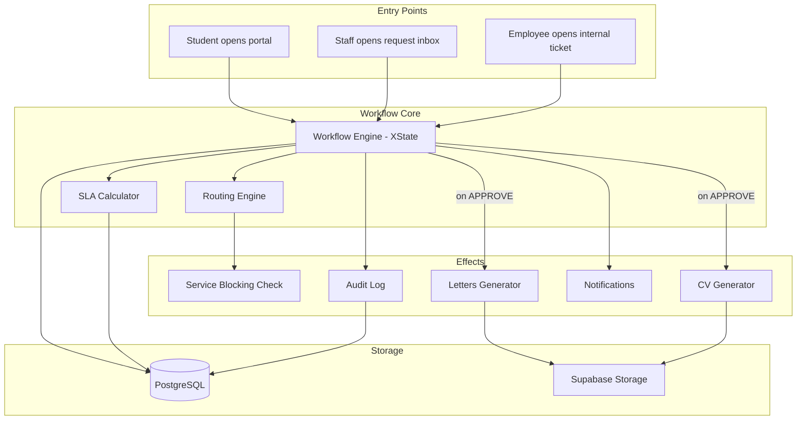
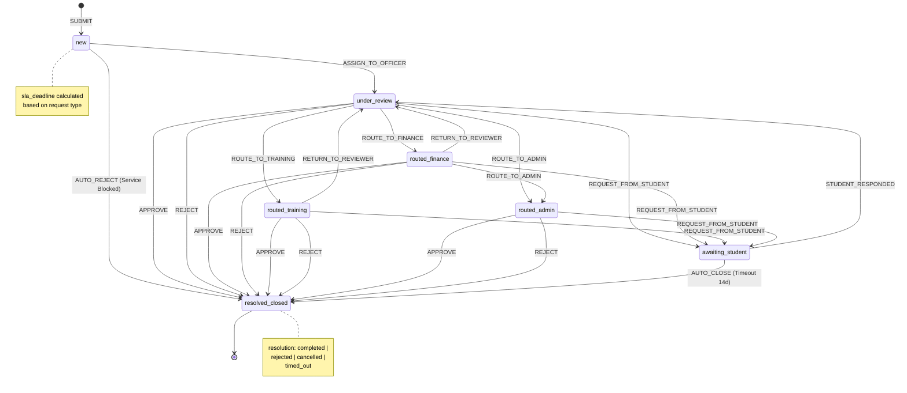
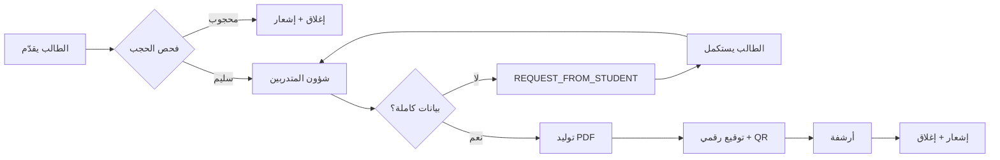
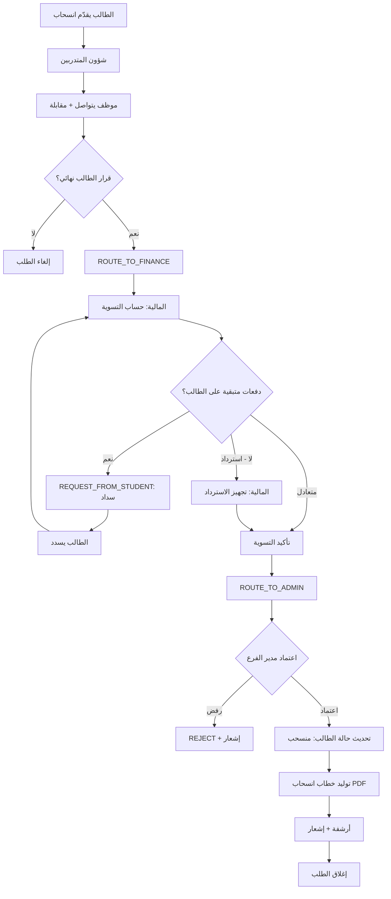
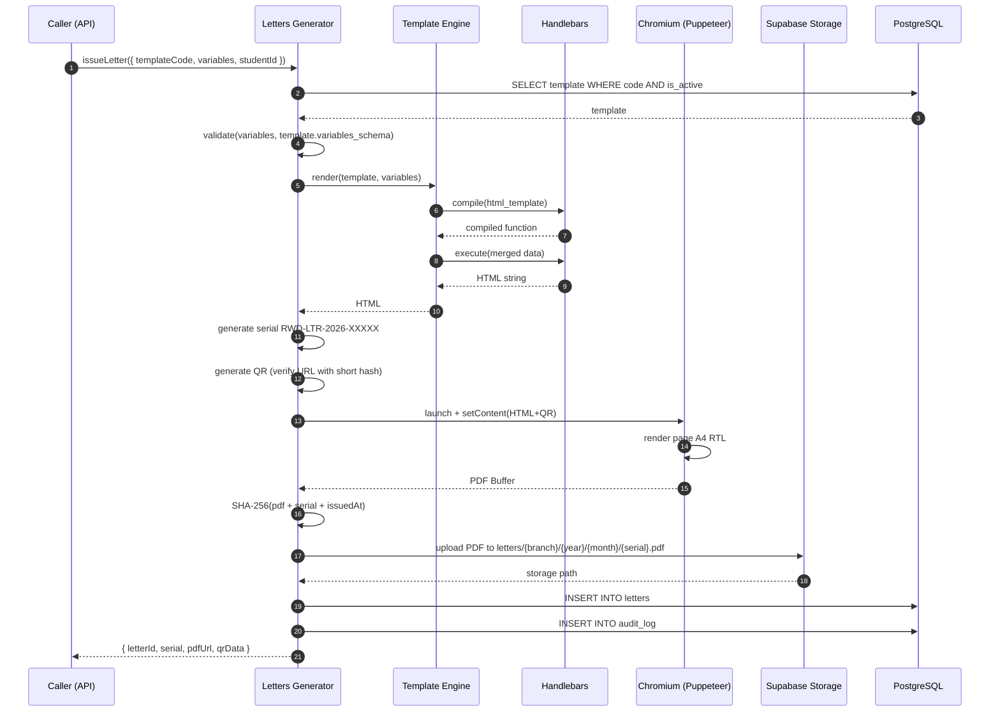
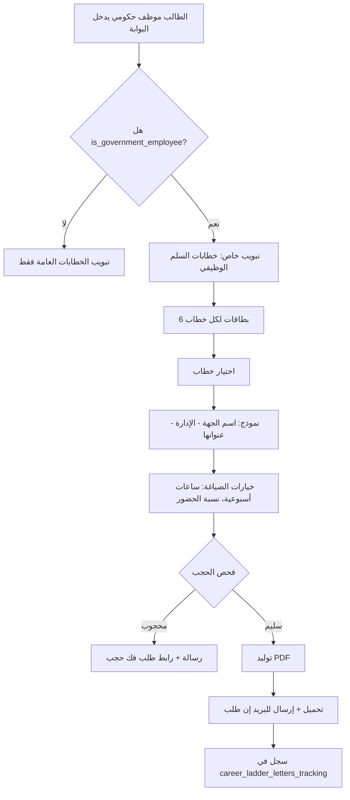
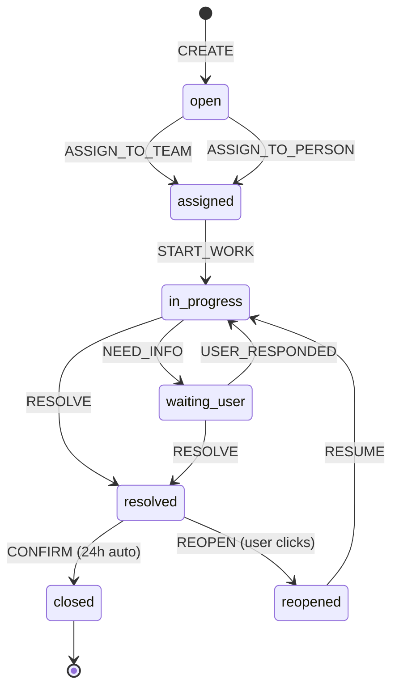

# خطة المرحلة 5 — الطلبات والخطابات + Help Desk الداخلي

> **مشروع:** النظام — نظام إدارة المعهد التدريبي
> **التاريخ:** 2026-05-13
> **الإصدار:** 1.0
> **الحالة:** Draft للمراجعة الفنية والاعتماد
> **المؤلف:** مدير المشروع + مهندس تحليل الأنظمة
> **التبعيات الحرجة:** المرحلة 1 (الأساس + Audit Log) — المرحلة 3 (Student State Machine) — **المرحلة 4 (Service Blocking Engine)**.

---

## 0. ملخص تنفيذي (Executive Summary)

المرحلة 5 هي **القلب التشغيلي اليومي** لالمعهد. هنا نُحوّل الفوضى الحالية — حيث "تضيع الطلبات بين محادثات الواتساب، وتُطبع الخطابات يدوياً على Word، ويتشاجر الموظفون داخلياً على من يفعل ماذا" — إلى **خط إنتاج رقمي مُؤتمت** بأربعة محاور:

1. **محرك الطلبات (Workflow Engine):** 14 نوع طلب × 7 حالات × توجيه ذكي بين الأقسام × SLA مع تصعيد تلقائي. State Machine قوي مبني على XState يمنع الأخطاء البشرية.
2. **مولّد الخطابات (Letters Generator):** PDF عربي RTL باحترافية مكاتب الاستشارة، مع توقيع رقمي + QR للتحقق العام. 12 خطاب أساسي + **6 خطابات سلم وظيفي مخصصة** للموظفين الحكوميين (التطوير #3).
3. **السيرة الذاتية التلقائية (Auto CV Generator):** يولّد CV عربي/إنجليزي من بيانات الطالب مع 3 قوالب (التطوير #11).
4. **Help Desk داخلي:** نظام تذاكر للموظفين أنفسهم بنفس Workflow Engine — IT، إداري، صيانة، HR (التطوير #10).

### 0.1 الأرقام الرئيسية

| البند | القيمة |
|------|--------|
| الجهد الإجمالي | 4.5–5.5 أسبوع |
| عدد الـ Migrations | 11 (انظر القسم 5) |
| عدد جداول قاعدة البيانات الجديدة | 13 |
| عدد API Endpoints | 38 |
| عدد الشاشات | 22 |
| عدد القوالب القابلة للتعديل | 18 (12 خطاب + 6 سلم وظيفي) + 3 قوالب CV |
| عدد TypeScript Types الجديدة | ~45 |
| تغطية الاختبارات المستهدفة | ≥ 80% للـ Workflow Engine، ≥ 70% للباقي |
| الـ Performance Target | إصدار خطاب < 4 ثوانٍ (P95)، تحميل قائمة طلبات (100 صف) < 800ms |

### 0.2 ما يحلّ بعد هذه المرحلة من أوجاع العميل

- **"الطلبات تضيع":** كل طلب له `serial`، حالة، مالك، SLA، وسجل أحداث. مستحيل أن يضيع.
- **"الخطابات على Word":** تنتهي الكتابة اليدوية. القالب يُعدَّل مرة من الإدارة → كل خطاب لاحق يستخدمه.
- **"التزوير ممكن":** كل خطاب يُختم بـ SHA-256 + QR لصفحة تحقق عامة `/letters/verify/{serial}`.
- **"الموظف الحكومي يعاني":** ست خطابات مصممة خصيصاً للسلم الوظيفي تُسلَّم له بضغطة زر.
- **"الموظفون الداخليون يتشاجرون على IT والصيانة":** Help Desk يوحّد تذاكرهم في نفس النظام بنفس صرامة الـ SLA.
- **"السير الذاتية مهجورة":** Auto CV يحوّل ملف الطالب الكامل لـ PDF احترافي في 5 ثوانٍ.

### 0.3 المخاطر الخمسة الأولى وردّها المختصر

| المخاطرة | الردّ |
|---------|------|
| Puppeteer ثقيل على Serverless (Vercel Functions) | استخدام `@sparticuz/chromium` + Cold-Start mitigation عبر Warmup Cron. خيار B: Edge Function منفصل على VPS سعودي للخطابات الكثيفة. |
| تعقيد State Machine ينمو بسرعة | XState مع **machine واحد قاعدي** + 14 overrides. اختبارات Property-Based تغطي كل الانتقالات. |
| SLA مع الـ Business Hours + الجمعة/السبت | مكتبة `date-fns` + جدول `working_calendar` قابل للتحرير من الإدارة. |
| تزوير الخطابات بعد التحميل | SHA-256 + QR + سجل ثابت في `letters` لا يُحذف. صفحة `/letters/verify/{serial}` تكشف الأصل. |
| تذاكر Help Desk تتداخل مع طلبات الطلاب | **جدول منفصل تماماً** `internal_tickets` + RLS صارمة + UI منفصلة. لا أحد يخلط. |

---

## 1. السياق والهدف (Context & Goal)

### 1.1 الوضع الراهن (Pain Points من مقابلات العميل)

#### 1.1.1 على جانب الطلبات الإدارية

> "الطالب يرسل الواتساب لشؤون المتدربين، الشؤون تحوّل للمالية، المالية تطلب من الطالب يدفع، الطالب يدفع لكن لا أحد يبلّغ المالية، المالية تنسى، الطالب يعود بعد أسبوع غاضباً." — موظف شؤون متدربين، فرع الرياض

الأعراض الفعلية المرصودة:
- **لا serial موحّد للطلب** — كل قسم يفتح ملفه الخاص بمسمى مختلف.
- **لا SLA** — قد تستغرق إفادة دراسة 5 ساعات أو 5 أيام، عشوائياً.
- **لا audit trail** — إن وقع خلاف "من أوقف الطلب؟" لا أحد يعرف.
- **التحويل اليدوي بين الأقسام** عبر المجموعات أو الزيارات الشخصية.
- **لا قياس لأداء كل قسم** — لا تعرف الإدارة أن المالية أبطأ من شؤون المتدربين.

#### 1.1.2 على جانب الخطابات

> "عندنا 12 خطاب في Word منذ 2018. كل موظف عنده نسخته. النسخة الأخيرة لمدير شؤون المتدربين بها أخطاء إملائية، والنسخة عند المحاسب فيها رقم تليفون قديم." — مدير فرع، الدمام

الأعراض:
- **خطابات في Word** تُعدّل يدوياً، تُحفظ بأسماء عشوائية، تُطبع وتُختم بختم مطاطي.
- **لا تحقّق رقمي** — جهة العمل تستطيع تزوير أي خطاب بسهولة.
- **لا أرشيف موحّد** — بعد سنة لا تستطيع البحث عن خطاب صدر لطالب معين.
- **خطابات السلم الوظيفي تُكتب من الصفر** كل مرة — كل خطاب يأخذ 30 دقيقة من شؤون المتدربين، والصياغة غير معتمدة دائماً.

#### 1.1.3 على جانب الموظفين الداخليين (Pain للموظفين أنفسهم)

> "الكمبيوتر تعطّل لي صباحاً. اتصلت بـ IT في الإدارة العامة، قالوا 'سنرد عليك'. مرّت يومان. نسيت الموضوع. الآن أعمل من تلفوني." — موظف مالية، فرع جدة

الأعراض:
- **لا نظام تذاكر داخلي** — كل شيء بالواتساب أو الاتصال.
- **IT في الإدارة العامة فقط** — الفروع تنتظر.
- **طلبات الإجازات والصيانة تضيع** كذلك.
- **لا KPIs** عن أداء فريق الدعم الداخلي.

### 1.2 الأهداف الإستراتيجية للمرحلة 5

#### الهدف 1 — صفر طلبات ضائعة (Zero Lost Requests)
كل طلب يدخل النظام يخرج منه بحالة نهائية مع توقيع رقمي. الـ KPI المستهدف: **0 طلب "مفقود"** خلال 6 أشهر من الإطلاق.

#### الهدف 2 — أتمتة 100% للخطابات
لا خطاب يُكتب يدوياً على Word بعد التشغيل. الـ KPI المستهدف: **≥ 95%** من الخطابات تصدر من القوالب (الـ 5% المتبقية حالات استثنائية).

#### الهدف 3 — تجربة موظف حكومي ممتازة
الطالب الموظف الحكومي يُكمل دورة "طلب خطاب سلم وظيفي" في **أقل من 90 ثانية** من الجوال. الخطاب يصل لجهة عمله بصياغة معتمدة من TVTC.

#### الهدف 4 — Help Desk داخلي بـ SLA
كل تذكرة داخلية تحصل على ردّ خلال SLA محدّد. الـ KPI المستهدف: **≥ 85%** من التذاكر تُحل ضمن الـ SLA.

#### الهدف 5 — تحقّق عام للخطابات
أي جهة خارجية (وزارة، شركة، بنك) تتحقق من أصالة الخطاب بمسح QR. الـ KPI المستهدف: **100%** من الخطابات لها صفحة تحقق فعّالة.

### 1.3 الـ Scope (داخل النطاق)

✅ Workflow Engine للطلبات (14 نوع، 7 حالات، XState).
✅ Routing Engine قابل للتخصيص (افتراضي + يدوي).
✅ SLA Engine مع Business Hours + Escalation Cron.
✅ Letters Generator (محرك القوالب + Puppeteer).
✅ 12 خطاب أساسي + **6 خطابات سلم وظيفي** + **3 قوالب CV**.
✅ Help Desk داخلي للموظفين.
✅ تكامل صارم مع Service Blocking (المرحلة 4).
✅ الأرشفة الرقمية في ملف الطالب.
✅ Audit Log كامل لكل حدث.
✅ شاشات الطالب + الموظف + الإدارة.
✅ صفحات التحقق العامة.
✅ التقارير الأساسية للمرحلة (SLA، Letters Issued، Tickets).

### 1.4 الـ Out of Scope (خارج النطاق)

❌ **تكامل واتساب / Email** — مؤجل للمرحلة 8 (التكاملات الخارجية). الإشعارات الآن: داخل النظام فقط.
❌ **توقيع إلكتروني معتمد قانونياً (نفاذ / Saudi Trust)** — مؤجل. التوقيع الرقمي الحالي = SHA-256 + QR للتحقق فقط.
❌ **التقارير المتقدمة المرئية (Dashboards)** — للمرحلة 7 (التقارير).
❌ **اختبار الخطابات على بيئة TVTC الفعلية** — يتم في المرحلة 8 (تكامل TVTC).
❌ **تحرير محرّر قوالب WYSIWYG** — في v1 نُعدّل HTML مباشرة. WYSIWYG مؤجل لـ v2.
❌ **إصدار خطابات بلغات أخرى غير العربية/الإنجليزية** — لا فرنسي/أوردو الآن.
❌ **AI لتوليد ملاحظات الموظف على الطلب** — في المرحلة 10 (الذكاء).

### 1.5 افتراضات (Assumptions)

| # | الافتراض | المخاطرة إن لم يصدق |
|---|---------|----------------------|
| A1 | المرحلة 4 (Service Blocking) منتهية ومُختبرة | كل تكامل "فحص حجب قبل إصدار خطاب" يتعطّل |
| A2 | جدول `students` يحتوي حقول الموظف الحكومي (job_title, employer_name, job_grade) | خطابات السلم الوظيفي تحتاج Migration إضافية |
| A3 | شعار المعهد + الختم + توقيع المدير متاحة بصيغة SVG/PNG عالية الجودة | جودة الخطابات المُصدرة تتأثر |
| A4 | الإدارة جاهزة لاعتماد الـ 12 قالب الأساسي قبل الإطلاق | تأخير في قبول التسليم |
| A5 | اتفاق مسبق على جدول العطل الرسمية السعودية + Working Days | حسابات SLA خاطئة |

### 1.6 معايير القبول (Acceptance Criteria) — مختصر

- [ ] قائد الجودة يفتح طلب خطاب تدريب ويستلمه PDF خلال **< 60 ثانية** من اعتماد شؤون المتدربين.
- [ ] جهة عمل خارجية تمسح QR بهاتفها → تظهر صفحة تحقق عامة بثوانٍ.
- [ ] محاولة إصدار خطاب لطالب محجوب مالياً → النظام يرفض ويُظهر السبب + رابط لطلب فك حجب.
- [ ] طلب SLA متجاوز يُصعَّد تلقائياً لمدير القسم خلال أقل من ساعة من التجاوز.
- [ ] موظف يفتح تذكرة IT → IT يستلمها في لوحته خلال ثوانٍ.
- [ ] CV عربي + إنجليزي للطالب يُولَّد في < 8 ثوانٍ.
- [ ] كل عمل Audit Log له `actor_id` + `at` + `before/after`.

---

## 2. المخرجات التفصيلية (Deliverables)

### 2.1 المخرجات البرمجية

#### 2.1.1 الحزم البرمجية الجديدة

| الحزمة | الإصدار | الغرض |
|--------|--------|------|
| `xstate` | ^5.18.0 | State Machine للطلبات والتذاكر |
| `@xstate/react` | ^4.1.3 | Hook للـ React |
| `handlebars` | ^4.7.8 | محرك القوالب |
| `puppeteer-core` | ^23.6.0 | تحويل HTML → PDF |
| `@sparticuz/chromium` | ^131.0.0 | Chromium خفيف للـ Serverless |
| `qrcode` | ^1.5.4 | توليد QR |
| `date-fns` + `date-fns-tz` | ^4.1.0 / ^3.2.0 | تواريخ Hijri/Gregorian + Business Hours |
| `node-cron` | ^3.0.3 | Escalation Cron (محلياً) أو Supabase pg_cron (للإنتاج) |
| `react-hook-form` + `zod` | ^7.53 / ^3.23 | نماذج الطلبات الديناميكية |
| `@tanstack/react-table` | ^8.20 | جداول الطلبات والتذاكر |
| `@tanstack/react-query` | (موجود من المرحلة 1) | استعلامات + Caching |

#### 2.1.2 الـ Modules

| الـ Module | المسار | المسؤولية |
|-----------|--------|----------|
| `workflow-engine` | `src/modules/workflow-engine/` | تشغيل XState + Routing + SLA |
| `letters-generator` | `src/modules/letters-generator/` | القوالب + Puppeteer + التوقيع |
| `cv-generator` | `src/modules/cv-generator/` | بناء PDF السيرة الذاتية |
| `help-desk` | `src/modules/help-desk/` | التذاكر الداخلية |
| `requests-portal` | `src/app/(student)/requests/` | شاشات الطالب |
| `requests-staff` | `src/app/(staff)/requests/` | شاشات الموظف |
| `requests-admin` | `src/app/(admin)/requests/` | لوحة الإدارة |
| `verify-public` | `src/app/letters/verify/[serial]/` | صفحة التحقق العامة |

#### 2.1.3 المهام المجدولة (Cron Jobs)

| الـ Job | الجدولة | الوظيفة |
|--------|---------|---------|
| `escalation-tick` | كل 15 دقيقة | فحص الـ SLA المتجاوز وتصعيده |
| `puppeteer-warmup` | كل 5 دقائق (إنتاج) | إبقاء Chromium دافئاً |
| `archive-old-requests` | يومياً 2:00 صباحاً | نقل الطلبات المغلقة > 90 يوم لأرشيف بارد |
| `letters-storage-cleanup` | أسبوعياً | فحص تطابق DB مع Supabase Storage |
| `cv-cache-refresh` | يومياً 1:00 صباحاً | تحديث الـ CVs المُخزَّنة للطلاب الذين تغيّرت بياناتهم |

### 2.2 المخرجات الوثائقية

| الوثيقة | المسار |
|---------|-------|
| دليل القوالب للإدارة | `docs/templates-guide.md` |
| دليل State Machines | `docs/state-machines.md` |
| API Reference | `docs/api/requests.md`, `docs/api/letters.md` |
| Test Plan + Scenarios | `docs/tests/phase-5.md` |
| Deployment Notes (Puppeteer) | `docs/deployment/puppeteer.md` |
| User Guide (Student / Staff / Admin) | `docs/user-guides/` |

### 2.3 المخرجات التشغيلية (Operational Artifacts)

- 12 قالب خطاب جاهز بـ HTML/CSS احترافي.
- 6 قوالب خطاب سلم وظيفي معتمدة من الإدارة.
- 3 قوالب CV (Modern, Classic, Government).
- 14 XState Machine لكل نوع طلب.
- 4 XState Machines لأنواع التذاكر الداخلية.
- 8 شاشات للطالب + 9 شاشات للموظف + 5 شاشات للإدارة.
- 38 API Route (Next.js Route Handlers).

---

## 3. السياق المعماري وفلسفة التصميم (Architecture & Design Philosophy)

### 3.1 المبادئ الحاكمة (Design Principles)

#### مبدأ 1 — Single Source of Truth للحالة
الحالة الحقيقية للطلب في **PostgreSQL** (`requests.status`). XState يُستخدم للـ **Validation + Routing** فقط، لا يُحتفظ بحالة في الذاكرة. عند كل تحوّل: نُحدث DB → ثم نُحدث الـ UI من DB.

#### مبدأ 2 — Server-Authoritative
كل تحوّل حالة يُوقَّع على السيرفر (Route Handler) عبر:
1. فحص الصلاحية (Permission Check).
2. تشغيل XState Validation.
3. كتابة `requests` + `request_events` بـ Transaction.
4. تشغيل Effects (إشعار، تصعيد، توليد خطاب).
5. كتابة `audit_log`.

العميل لا يستطيع تخطّي هذا حتى لو حاول.

#### مبدأ 3 — Idempotency في كل API
كل POST تحتوي `Idempotency-Key` في الـ Header. السيرفر يحفظها في `idempotency_keys` لمدة 24 ساعة. إعادة الإرسال = نفس النتيجة.

#### مبدأ 4 — RLS أولاً (RLS-First Security)
كل جدول جديد في هذه المرحلة يحصل على Policy صريحة قبل أي endpoint. الـ Service Role لا يُستخدم إلا في 3 حالات:
- Cron Jobs (Escalation, Cleanup).
- Public Verification page (قراءة محدودة جداً).
- توليد PDF (يحتاج صلاحية أعلى من الطالب).

#### مبدأ 5 — قوالب قابلة للتعديل بدون نشر
كل قالب خطاب في DB (`letter_templates`). الإدارة تعدّل HTML/CSS/Variables من واجهة الإدارة. الإصدار الجديد يُخزن مع `version + 1` ولا يحذف الإصدارات السابقة (للأرشيف).

#### مبدأ 6 — لا تكرار للمنطق (DRY) عبر Workflow Engine
نفس الـ Engine يخدم:
- طلبات الطلاب (14 نوع).
- تذاكر الموظفين الداخلية (4 أنواع).
- لاحقاً: طلبات التسجيل، طلبات الإجازات، إلخ.

الفرق بين الأنواع = **Configuration** فقط، ليس كود.

#### مبدأ 7 — أرشفة دائمة (Immutable Archive)
الخطاب بعد إصداره **لا يُعدَّل أبداً**. إن أراد المستخدم تعديل → يُلغى وتُصدر نسخة جديدة. سجل الإلغاء + النسخة الجديدة كله محفوظ. هذا للحماية القانونية.

### 3.2 الموقع في الـ Stack

```
┌─────────────────────────────────────────────────────────────────┐
│            Student Portal / Staff Portal / Admin Portal        │
│         (Next.js Pages + Server Components + Forms)            │
└─────────────┬───────────────────────────────────────────────────┘
              │
              ▼
┌─────────────────────────────────────────────────────────────────┐
│              Phase 5 Layer — Workflow + Letters + HelpDesk     │
│                                                                 │
│  ┌────────────────┐  ┌────────────────┐  ┌────────────────┐   │
│  │ Workflow Engine│  │Letters Generator│  │   Help Desk    │   │
│  │   (XState)     │  │  (Puppeteer)    │  │  (Tickets)     │   │
│  └────────┬───────┘  └────────┬────────┘  └────────┬───────┘   │
│           │                   │                    │            │
│  ┌────────▼───────────────────▼────────────────────▼───────┐  │
│  │           Shared: SLA Engine + Audit + Storage          │  │
│  └─────────────────────┬───────────────────────────────────┘  │
└────────────────────────┼─────────────────────────────────────────┘
                         │
                         ▼
┌─────────────────────────────────────────────────────────────────┐
│         Phase 4: Service Blocking Engine (تبعية حرجة)          │
└────────────────────────┬─────────────────────────────────────────┘
                         │
                         ▼
┌─────────────────────────────────────────────────────────────────┐
│      Phase 1: Foundation (Auth, RLS, Audit Log, Multi-Branch)  │
└─────────────────────────────────────────────────────────────────┘
                         │
                         ▼
┌─────────────────────────────────────────────────────────────────┐
│           Supabase (PostgreSQL + Storage + Auth)               │
└─────────────────────────────────────────────────────────────────┘
```

### 3.3 خريطة التدفق العامة (High-Level Flow)



### 3.4 قرارات معمارية محورية (ADRs — Architecture Decisions)

#### ADR-501: XState 5 بدلاً من State Machine يدوي
**القرار:** نستخدم XState 5 كمحرك الـ State Machine.
**البديل المرفوض:** كتابة State Machine يدوي بـ TypeScript + Map.
**الأسباب:**
- XState يوفر **Statecharts** (hierarchical + parallel states) — نحتاجها لـ Help Desk.
- Visualization من `@xstate/inspect` يوفر debugging قوي.
- Test utilities جاهزة (Model-Based Testing).
- مجتمع كبير + موثوق.
**التكلفة:** ~80KB إضافية (Bundle مقبول).

#### ADR-502: Puppeteer بدلاً من PDFKit / jsPDF
**القرار:** نستخدم Puppeteer + `@sparticuz/chromium`.
**البدائل المرفوضة:**
- `PDFKit`: لا يدعم RTL بشكل صحيح، خطوط عربية معقدة.
- `jsPDF`: نفس المشكلة + جودة منخفضة.
- `wkhtmltopdf`: قديم، صعب على Serverless.
**الأسباب:**
- Chromium يدعم RTL ممتاز + كل الخطوط العربية.
- تحكم كامل بـ CSS (Print media queries، @page).
- إخراج identical للـ Browser preview.
**التكلفة:** Cold start ~3-5 ثوانٍ على Vercel. الحل: Warmup Cron + Edge Function منفصل.

#### ADR-503: قوالب في DB بدلاً من ملفات في Repo
**القرار:** القوالب تُخزَّن في `letter_templates` جدول DB.
**البديل المرفوض:** ملفات `.hbs` في `templates/` داخل الـ Repo.
**الأسباب:**
- الإدارة تستطيع التعديل بدون deploy.
- Versioning مدمج بـ DB.
- Multi-Branch override ممكن (لكل فرع قالب مختلف للسنة 2 لاحقاً).
**التكلفة:** نحتاج Caching ذكي على الـ Server (Redis أو Postgres-side).

#### ADR-504: Help Desk جدول منفصل
**القرار:** `internal_tickets` جدول مستقل عن `requests`.
**البديل المرفوض:** `requests` بحقل `category: 'student' | 'internal'`.
**الأسباب:**
- RLS مختلفة جداً (الموظفون فقط vs. الطلاب).
- بيانات Internal أحياناً سرية (HR، شكاوى).
- Reporting منفصل أوضح.
- يتشارك في XState Machine الأساسية فقط.

#### ADR-505: Audit Log موحّد (لا جدول مخصص)
**القرار:** كل أحداث المرحلة 5 تُكتب في `audit_log` العام من المرحلة 1.
**البديل المرفوض:** جداول `requests_audit`, `letters_audit` منفصلة.
**الأسباب:**
- مصدر واحد للحقيقة (Single Audit Truth).
- استعلامات شاملة أسهل ("ماذا فعل المستخدم X اليوم؟").
- جدول `request_events` يبقى للـ Workflow Events فقط (تحوّلات الحالة)، أما العمليات (تسجيل دخول، تحميل PDF، فك حجب) فتذهب لـ `audit_log`.

#### ADR-506: التوقيع الرقمي = SHA-256 + QR (ليس PKI كامل)
**القرار:** نستخدم SHA-256 hash + QR للتحقق العام.
**البديل المرفوض:** PKI كامل بشهادة X.509 + توقيع رقمي معتمد.
**الأسباب:**
- PKI معتمد قانونياً = نفاذ / Saudi Trust — مؤجل للمرحلة 8.
- SHA-256 + QR يوفر **توثيق العين البشرية** لأي جهة (مسح QR → صفحة التحقق).
- إن غيّر شخص PDF بعد التحميل → الـ hash يفشل عند المسح → الجهة تكشف التزوير.
**التكلفة:** غير معترف به قانونياً في المحاكم. لكن مقبول إدارياً.

---

## 4. State Machine للطلبات + التذاكر (Workflow Engine)

### 4.1 المخطط الكامل لحالات الطلب (Master State Machine)



### 4.2 أنواع الطلبات الـ14 ومسارات Routing الافتراضية

#### الجدول الكامل

| # | الكود | الاسم | القسم الأولي | يحتاج اعتماد | SLA (ساعة عمل) | إخراج |
|---|------|------|------------|--------------|----------------|------|
| 1 | `intro_letter` | خطاب تعريف | شؤون المتدربين | لا | 24 | PDF |
| 2 | `study_proof` | إفادة دراسة | شؤون المتدربين | لا | 24 | PDF |
| 3 | `training_letter` | خطاب تدريب | شؤون المتدربين | لا | 48 | PDF |
| 4 | `completion_cert` | شهادة إتمام | شؤون → مدير الفرع | نعم | 72 | PDF |
| 5 | `financial_voucher` | سند مالي | المالية | نعم | 48 | PDF |
| 6 | `discount_request` | طلب خصم | المالية → الإدارة | نعم | 120 | قرار + خطاب |
| 7 | `withdrawal` | انسحاب | شؤون → مالية → إدارة | نعم | 168 | خطاب انسحاب |
| 8 | `temp_suspension` | إيقاف مؤقت | شؤون → مدير الفرع | نعم | 72 | خطاب |
| 9 | `resume_studies` | استكمال دراسة | شؤون → مالية | نعم | 72 | خطاب + جدول جديد |
| 10 | `data_amendment` | تعديل بيانات | شؤون المتدربين | لا (نعم لـ ID) | 24 | تحديث + خطاب تأكيد |
| 11 | `grade_review` | مراجعة درجة | شؤون → التدريب | نعم | 120 | قرار + تحديث |
| 12 | `exam_retake` | إعادة اختبار | التدريب → مالية | نعم | 96 | جدولة |
| 13 | `complaint` | شكوى | شؤون → الإدارة | حسب الموضوع | 96 (24 critical) | ردّ موثق |
| 14 | `inquiry` | استفسار | شؤون المتدربين | لا | 48 | ردّ |

#### مثال 1: مسار خطاب التعريف (intro_letter) — الأبسط



#### مثال 2: مسار الانسحاب (withdrawal) — الأكثر تعقيداً



### 4.3 جدول Routing Rules

كل نوع طلب له **مسار افتراضي** + **إمكانية تخصيص يدوي**:

```sql
CREATE TABLE routing_rules (
    id              UUID PRIMARY KEY DEFAULT gen_random_uuid(),
    request_type    TEXT NOT NULL,
    step_order      INT NOT NULL,
    from_status     TEXT NOT NULL,
    to_status       TEXT NOT NULL,
    target_role     TEXT NOT NULL,         -- 'student_affairs', 'finance', 'training', 'branch_manager', 'admin'
    target_branch_scope TEXT NOT NULL,     -- 'same_branch', 'central_admin'
    auto_trigger    BOOLEAN DEFAULT TRUE,  -- هل ينتقل تلقائياً؟ أو يحتاج فعل بشري؟
    condition_jsonb JSONB,                 -- شروط إضافية (مثل: financial_blocked = false)
    sla_hours_override INT,                -- في حال أردنا SLA مختلفة لخطوة معينة
    created_at      TIMESTAMPTZ DEFAULT NOW(),
    updated_at      TIMESTAMPTZ DEFAULT NOW(),
    UNIQUE(request_type, step_order)
);

-- مثال: مسار withdrawal
INSERT INTO routing_rules (request_type, step_order, from_status, to_status, target_role, target_branch_scope) VALUES
('withdrawal', 1, 'new',            'under_review',    'student_affairs', 'same_branch'),
('withdrawal', 2, 'under_review',   'routed_finance',  'finance',         'same_branch'),
('withdrawal', 3, 'routed_finance', 'routed_admin',    'branch_manager',  'same_branch'),
('withdrawal', 4, 'routed_admin',   'resolved_closed', 'branch_manager',  'same_branch');
```

### 4.4 SLA Engine المتقدم

#### 4.4.1 الجدول

```sql
CREATE TABLE sla_rules (
    id                  UUID PRIMARY KEY DEFAULT gen_random_uuid(),
    request_type        TEXT NOT NULL,
    priority            TEXT NOT NULL DEFAULT 'normal' CHECK (priority IN ('low','normal','high','critical')),
    sla_hours           INT NOT NULL,
    warning_at_percent  INT NOT NULL DEFAULT 75,    -- تحذير عند 75% من الوقت
    escalation_role     TEXT NOT NULL,              -- الدور الذي يُصعَّد له
    escalation_levels   JSONB DEFAULT '[]'::jsonb,  -- مستويات تصعيد متعددة
    business_hours_only BOOLEAN DEFAULT TRUE,
    created_at          TIMESTAMPTZ DEFAULT NOW(),
    UNIQUE(request_type, priority)
);

CREATE TABLE working_calendar (
    branch_id   UUID REFERENCES branches(id),  -- NULL = جميع الفروع
    day_of_week INT CHECK (day_of_week BETWEEN 0 AND 6), -- 0=الأحد (محلياً) ... 6=السبت
    start_time  TIME NOT NULL DEFAULT '08:00',
    end_time    TIME NOT NULL DEFAULT '17:00',
    is_working  BOOLEAN NOT NULL DEFAULT TRUE,
    PRIMARY KEY (branch_id, day_of_week)
);

CREATE TABLE working_holidays (
    id          UUID PRIMARY KEY DEFAULT gen_random_uuid(),
    branch_id   UUID REFERENCES branches(id),  -- NULL = على الجميع
    holiday_date DATE NOT NULL,
    label_ar    TEXT NOT NULL,
    is_full_day BOOLEAN DEFAULT TRUE
);
```

#### 4.4.2 الـ Algorithm

```typescript
// src/modules/workflow-engine/sla/calculator.ts
import { addMinutes, isWeekend, addDays, setHours, setMinutes, isSameDay } from 'date-fns';

export interface SLAConfig {
  branchId: string;
  workingDays: number[];            // [0,1,2,3,4]  (الأحد-الخميس عادة)
  startHour: number;                // 8
  endHour: number;                  // 17
  holidays: Date[];
  slaHours: number;                 // مثلاً 24 ساعة عمل
  warningAtPercent: number;         // 75
}

export interface SLAResult {
  deadline: Date;
  warningAt: Date;
  totalBusinessMinutes: number;
}

/**
 * يحسب deadline زمني حقيقي بناءً على ساعات العمل فقط.
 * مثال: طلب صدر الخميس 4 عصراً بـ SLA 8 ساعات
 *  → ساعة عمل الخميس + 7 ساعات الأحد → الأحد 3 عصراً
 */
export function calculateSLADeadline(
  createdAt: Date,
  config: SLAConfig
): SLAResult {
  const totalMinutes = config.slaHours * 60;
  let remaining = totalMinutes;
  let cursor = new Date(createdAt);

  while (remaining > 0) {
    // 1. هل الوقت الحالي في business hours؟
    if (isBusinessMoment(cursor, config)) {
      // قدّم دقيقة واحدة
      cursor = addMinutes(cursor, 1);
      remaining -= 1;
    } else {
      // اقفز للـ next business moment
      cursor = nextBusinessMoment(cursor, config);
    }
  }

  return {
    deadline: cursor,
    warningAt: calculateWarning(createdAt, cursor, config.warningAtPercent),
    totalBusinessMinutes: totalMinutes,
  };
}

function isBusinessMoment(d: Date, config: SLAConfig): boolean {
  if (!config.workingDays.includes(d.getDay())) return false;
  if (config.holidays.some(h => isSameDay(h, d))) return false;
  const h = d.getHours();
  return h >= config.startHour && h < config.endHour;
}

function nextBusinessMoment(d: Date, config: SLAConfig): Date {
  let candidate = new Date(d);
  // إن كنا في يوم عمل لكن قبل البداية
  if (config.workingDays.includes(candidate.getDay()) && candidate.getHours() < config.startHour) {
    return setMinutes(setHours(candidate, config.startHour), 0);
  }
  // وإلا اقفز ليوم العمل التالي
  do {
    candidate = addDays(candidate, 1);
    candidate = setMinutes(setHours(candidate, config.startHour), 0);
  } while (!config.workingDays.includes(candidate.getDay()) || 
           config.holidays.some(h => isSameDay(h, candidate)));
  return candidate;
}

function calculateWarning(createdAt: Date, deadline: Date, percent: number): Date {
  const totalMs = deadline.getTime() - createdAt.getTime();
  const warningOffset = (totalMs * percent) / 100;
  return new Date(createdAt.getTime() + warningOffset);
}
```

#### 4.4.3 Escalation Cron

```typescript
// src/modules/workflow-engine/sla/escalation-cron.ts
import { supabaseAdmin } from '@/lib/supabase/admin';
import { addToAuditLog } from '@/modules/audit';
import { sendNotification } from '@/modules/notifications';

const TICK_INTERVAL_MS = 15 * 60 * 1000; // كل 15 دقيقة

export async function runEscalationTick(): Promise<{ checked: number; escalated: number }> {
  const now = new Date();

  // 1. اجلب كل الطلبات المتجاوزة SLA وغير المُصعّدة بعد
  const { data: overdue, error } = await supabaseAdmin
    .from('requests')
    .select('id, serial, type, priority, sla_deadline, assigned_to, branch_id, escalated_at, escalation_level')
    .lt('sla_deadline', now.toISOString())
    .in('status', ['new', 'under_review', 'routed_finance', 'routed_training', 'routed_admin'])
    .or('escalated_at.is.null,escalation_level.lt.3');  // حتى 3 مستويات تصعيد

  if (error) throw error;
  if (!overdue || overdue.length === 0) return { checked: 0, escalated: 0 };

  let escalatedCount = 0;

  for (const req of overdue) {
    const nextLevel = (req.escalation_level ?? 0) + 1;
    const slaRule = await fetchSLARule(req.type, req.priority);
    const levels = slaRule.escalation_levels as Array<{ level: number; role: string; delay_minutes: number }>;

    const levelConfig = levels.find(l => l.level === nextLevel);
    if (!levelConfig) continue;

    // فحص أن مضى delay_minutes منذ آخر تصعيد
    const lastEscalation = req.escalated_at ? new Date(req.escalated_at) : new Date(req.sla_deadline);
    const minutesSince = (now.getTime() - lastEscalation.getTime()) / 60000;
    if (minutesSince < levelConfig.delay_minutes) continue;

    // نفّذ التصعيد
    await supabaseAdmin.rpc('escalate_request', {
      p_request_id: req.id,
      p_new_level: nextLevel,
      p_target_role: levelConfig.role,
      p_branch_id: req.branch_id,
    });

    // إشعار
    await sendNotification({
      to_role: levelConfig.role,
      to_branch: req.branch_id,
      title: `طلب متأخر مستوى ${nextLevel}: ${req.serial}`,
      body: `الطلب يتجاوز SLA بـ ${minutesSince.toFixed(0)} دقيقة. مستوى التصعيد ${nextLevel}.`,
      severity: nextLevel >= 2 ? 'critical' : 'high',
      action_url: `/requests/${req.id}`,
    });

    // Audit Log
    await addToAuditLog({
      action: 'REQUEST_ESCALATED',
      resource_type: 'request',
      resource_id: req.id,
      metadata: {
        new_level: nextLevel,
        target_role: levelConfig.role,
        sla_overrun_minutes: minutesSince,
      },
    });

    escalatedCount++;
  }

  return { checked: overdue.length, escalated: escalatedCount };
}
```

### 4.5 XState Implementation الكامل

```typescript
// src/modules/workflow-engine/machines/base-request.machine.ts
import { setup, assign, fromPromise } from 'xstate';

export type RequestStatus =
  | 'new'
  | 'under_review'
  | 'routed_finance'
  | 'routed_training'
  | 'routed_admin'
  | 'awaiting_student'
  | 'resolved_closed';

export interface RequestContext {
  requestId: string;
  serial: string;
  type: RequestType;
  studentId: string;
  branchId: string;
  priority: 'low' | 'normal' | 'high' | 'critical';
  status: RequestStatus;
  assignedTo: string | null;
  
  // Fields populated during workflow
  data: Record<string, unknown>;
  attachments: string[];
  
  // Computed
  serviceBlocked: boolean;
  financialBlocked: boolean;
  
  // Outcomes
  resolution?: 'completed' | 'rejected' | 'cancelled' | 'timed_out';
  rejectionReason?: string;
  generatedLetterId?: string;
}

export type RequestEvent =
  | { type: 'SUBMIT' }
  | { type: 'ASSIGN_TO_OFFICER'; officerId: string }
  | { type: 'ROUTE_TO_FINANCE'; note?: string }
  | { type: 'ROUTE_TO_TRAINING'; note?: string }
  | { type: 'ROUTE_TO_ADMIN'; note?: string }
  | { type: 'RETURN_TO_REVIEWER'; note?: string }
  | { type: 'REQUEST_FROM_STUDENT'; what: string }
  | { type: 'STUDENT_RESPONDED'; attachments?: string[] }
  | { type: 'APPROVE'; output?: Record<string, unknown> }
  | { type: 'REJECT'; reason: string }
  | { type: 'AUTO_REJECT'; reason: 'service_blocked' | 'financial_blocked' }
  | { type: 'AUTO_CLOSE'; reason: 'timeout' };

export const baseRequestMachine = setup({
  types: {} as {
    context: RequestContext;
    events: RequestEvent;
  },
  guards: {
    canIssueWithoutApproval: ({ context }) => {
      // أنواع لا تحتاج اعتماد
      return ['intro_letter', 'study_proof', 'training_letter', 'inquiry', 'data_amendment'].includes(context.type);
    },
    isServiceBlocked: ({ context }) => context.serviceBlocked === true,
    isFinancialBlocked: ({ context }) => context.financialBlocked === true,
    requiresFinanceStep: ({ context }) => 
      ['withdrawal', 'discount_request', 'exam_retake', 'resume_studies', 'financial_voucher'].includes(context.type),
    requiresTrainingStep: ({ context }) => 
      ['grade_review', 'exam_retake'].includes(context.type),
    requiresAdminApproval: ({ context }) => 
      ['withdrawal', 'discount_request', 'completion_cert', 'temp_suspension'].includes(context.type),
  },
  actions: {
    logEvent: ({ context, event }) => {
      // يُستدعى من خادم: يكتب في request_events
      console.log(`[${context.serial}] ${event.type}`);
    },
    persistStatus: ({ context }, params: { newStatus: RequestStatus }) => {
      // يُحدث requests.status في DB
    },
    notifyParticipants: ({ context }, params: { roleScope: string }) => {
      // إشعار حسب القسم
    },
    triggerLetterGeneration: async ({ context }) => {
      // استدعاء Letters Generator
    },
  },
  actors: {
    checkServiceBlocking: fromPromise<{ blocked: boolean; reason?: string }, { studentId: string; service: string }>(
      async ({ input }) => {
        // ينادي Service Blocking Engine (Phase 4)
        const res = await fetch(`/api/internal/blocking/check?studentId=${input.studentId}&service=${input.service}`);
        return res.json();
      }
    ),
  },
}).createMachine({
  id: 'request',
  initial: 'new',
  context: ({ input }) => input as RequestContext,
  states: {
    new: {
      invoke: {
        src: 'checkServiceBlocking',
        input: ({ context }) => ({ studentId: context.studentId, service: getServiceForType(context.type) }),
        onDone: [
          {
            target: 'resolved_closed',
            guard: ({ event }) => event.output.blocked === true,
            actions: assign({
              resolution: 'rejected',
              rejectionReason: ({ event }) => `Service blocked: ${event.output.reason}`,
            }),
          },
          { target: 'under_review' },
        ],
      },
      on: {
        AUTO_REJECT: {
          target: 'resolved_closed',
          actions: assign({
            resolution: 'rejected',
            rejectionReason: ({ event }) => `Auto-rejected: ${event.reason}`,
          }),
        },
      },
    },

    under_review: {
      entry: { type: 'logEvent' },
      on: {
        ROUTE_TO_FINANCE: {
          target: 'routed_finance',
          actions: { type: 'persistStatus', params: { newStatus: 'routed_finance' } },
        },
        ROUTE_TO_TRAINING: {
          target: 'routed_training',
          actions: { type: 'persistStatus', params: { newStatus: 'routed_training' } },
        },
        ROUTE_TO_ADMIN: {
          target: 'routed_admin',
          actions: { type: 'persistStatus', params: { newStatus: 'routed_admin' } },
        },
        REQUEST_FROM_STUDENT: {
          target: 'awaiting_student',
          actions: { type: 'notifyParticipants', params: { roleScope: 'student' } },
        },
        APPROVE: [
          {
            target: 'resolved_closed',
            guard: 'canIssueWithoutApproval',
            actions: [
              assign({ resolution: 'completed' }),
              { type: 'triggerLetterGeneration' },
            ],
          },
          {
            target: 'routed_admin',
            guard: 'requiresAdminApproval',
            actions: { type: 'persistStatus', params: { newStatus: 'routed_admin' } },
          },
          {
            target: 'resolved_closed',
            actions: assign({ resolution: 'completed' }),
          },
        ],
        REJECT: {
          target: 'resolved_closed',
          actions: assign({
            resolution: 'rejected',
            rejectionReason: ({ event }) => event.reason,
          }),
        },
      },
    },

    routed_finance: {
      entry: { type: 'logEvent' },
      on: {
        RETURN_TO_REVIEWER: 'under_review',
        ROUTE_TO_ADMIN: 'routed_admin',
        REQUEST_FROM_STUDENT: 'awaiting_student',
        APPROVE: [
          { target: 'routed_admin', guard: 'requiresAdminApproval' },
          { target: 'resolved_closed', actions: assign({ resolution: 'completed' }) },
        ],
        REJECT: {
          target: 'resolved_closed',
          actions: assign({
            resolution: 'rejected',
            rejectionReason: ({ event }) => event.reason,
          }),
        },
      },
    },

    routed_training: {
      entry: { type: 'logEvent' },
      on: {
        RETURN_TO_REVIEWER: 'under_review',
        REQUEST_FROM_STUDENT: 'awaiting_student',
        APPROVE: {
          target: 'resolved_closed',
          actions: assign({ resolution: 'completed' }),
        },
        REJECT: {
          target: 'resolved_closed',
          actions: assign({
            resolution: 'rejected',
            rejectionReason: ({ event }) => event.reason,
          }),
        },
      },
    },

    routed_admin: {
      entry: { type: 'logEvent' },
      on: {
        REQUEST_FROM_STUDENT: 'awaiting_student',
        APPROVE: {
          target: 'resolved_closed',
          actions: [
            assign({ resolution: 'completed' }),
            { type: 'triggerLetterGeneration' },
          ],
        },
        REJECT: {
          target: 'resolved_closed',
          actions: assign({
            resolution: 'rejected',
            rejectionReason: ({ event }) => event.reason,
          }),
        },
      },
    },

    awaiting_student: {
      after: {
        // 14 يوم timeout
        '1209600000': {
          target: 'resolved_closed',
          actions: assign({
            resolution: 'timed_out',
            rejectionReason: () => 'Student did not respond within 14 days',
          }),
        },
      },
      on: {
        STUDENT_RESPONDED: {
          target: 'under_review',
          actions: assign({
            data: ({ context, event }) => ({
              ...context.data,
              latestResponse: event,
            }),
          }),
        },
      },
    },

    resolved_closed: {
      type: 'final',
      entry: [
        { type: 'logEvent' },
        { type: 'persistStatus', params: { newStatus: 'resolved_closed' } },
      ],
    },
  },
});

function getServiceForType(type: RequestType): string {
  const map: Record<string, string> = {
    intro_letter: 'letter_issuance',
    study_proof: 'letter_issuance',
    training_letter: 'letter_issuance',
    completion_cert: 'certificate_issuance',
    transcript: 'transcript_request',
    // ... باقي الأنواع
  };
  return map[type] || 'letter_issuance';
}
```

### 4.6 Idempotency في تحوّلات الحالة

كل تحوّل من واجهة المستخدم يحمل `Idempotency-Key` في الـ Header:

```typescript
// src/app/api/requests/[id]/transition/route.ts
import { NextRequest, NextResponse } from 'next/server';
import { createClient } from '@/lib/supabase/server';
import { transitionRequest } from '@/modules/workflow-engine';

export async function POST(req: NextRequest, { params }: { params: { id: string } }) {
  const idempotencyKey = req.headers.get('Idempotency-Key');
  if (!idempotencyKey) {
    return NextResponse.json({ error: 'Missing Idempotency-Key' }, { status: 400 });
  }

  const supabase = createClient();

  // 1. تحقق من الـ Idempotency
  const { data: existing } = await supabase
    .from('idempotency_keys')
    .select('response_body, status_code')
    .eq('key', idempotencyKey)
    .gte('expires_at', new Date().toISOString())
    .maybeSingle();

  if (existing) {
    return NextResponse.json(JSON.parse(existing.response_body), { status: existing.status_code });
  }

  // 2. نفّذ التحوّل
  const body = await req.json();
  const result = await transitionRequest({
    requestId: params.id,
    event: body.event,
    actorId: body.actorId,
  });

  // 3. خزّن الاستجابة لـ 24 ساعة
  await supabase.from('idempotency_keys').insert({
    key: idempotencyKey,
    response_body: JSON.stringify(result),
    status_code: 200,
    expires_at: new Date(Date.now() + 24 * 60 * 60 * 1000).toISOString(),
  });

  return NextResponse.json(result);
}
```

---

## 5. مخطط قاعدة البيانات الكامل (Database Schema)

### 5.1 الجداول الأساسية

#### 5.1.1 `requests` — جدول الطلبات الرئيسي

```sql
CREATE TABLE requests (
    id              UUID PRIMARY KEY DEFAULT gen_random_uuid(),
    serial          TEXT UNIQUE NOT NULL,
    type            TEXT NOT NULL CHECK (type IN (
                        'intro_letter','study_proof','training_letter','completion_cert',
                        'financial_voucher','discount_request','withdrawal','temp_suspension',
                        'resume_studies','data_amendment','grade_review','exam_retake',
                        'complaint','inquiry'
                    )),
    status          TEXT NOT NULL DEFAULT 'new' CHECK (status IN (
                        'new','under_review','routed_finance','routed_training',
                        'routed_admin','awaiting_student','resolved_closed'
                    )),
    priority        TEXT NOT NULL DEFAULT 'normal' CHECK (priority IN ('low','normal','high','critical')),
    
    -- Subjects
    student_id      UUID NOT NULL REFERENCES students(id),
    branch_id       UUID NOT NULL REFERENCES branches(id),
    
    -- Routing
    current_department TEXT NOT NULL CHECK (current_department IN (
                        'student_affairs','finance','training','admin','student'
                    )),
    assigned_to     UUID REFERENCES users(id),
    
    -- Payload
    title           TEXT NOT NULL,
    description     TEXT,
    form_data       JSONB NOT NULL DEFAULT '{}'::jsonb,
    attachments     JSONB NOT NULL DEFAULT '[]'::jsonb,
    
    -- SLA & Escalation
    sla_deadline    TIMESTAMPTZ,
    warning_at      TIMESTAMPTZ,
    escalated_at    TIMESTAMPTZ,
    escalation_level INT NOT NULL DEFAULT 0,
    
    -- Resolution
    resolution      TEXT CHECK (resolution IN ('completed','rejected','cancelled','timed_out')),
    rejection_reason TEXT,
    generated_letter_id UUID,
    
    -- Audit
    created_by      UUID NOT NULL REFERENCES users(id),
    created_at      TIMESTAMPTZ NOT NULL DEFAULT NOW(),
    updated_at      TIMESTAMPTZ NOT NULL DEFAULT NOW(),
    closed_at       TIMESTAMPTZ,
    
    -- Indexing helpers
    fts             TSVECTOR GENERATED ALWAYS AS (
                        to_tsvector('arabic', coalesce(title, '') || ' ' || coalesce(description, ''))
                    ) STORED
);

CREATE INDEX idx_requests_student     ON requests(student_id);
CREATE INDEX idx_requests_branch      ON requests(branch_id);
CREATE INDEX idx_requests_status      ON requests(status);
CREATE INDEX idx_requests_dept        ON requests(current_department);
CREATE INDEX idx_requests_sla         ON requests(sla_deadline) WHERE status NOT IN ('resolved_closed');
CREATE INDEX idx_requests_assigned    ON requests(assigned_to) WHERE status NOT IN ('resolved_closed');
CREATE INDEX idx_requests_serial      ON requests(serial);
CREATE INDEX idx_requests_open_dept   ON requests(branch_id, current_department) WHERE closed_at IS NULL;
CREATE INDEX idx_requests_fts         ON requests USING GIN(fts);
CREATE INDEX idx_requests_overdue     ON requests(sla_deadline, escalation_level) 
    WHERE status NOT IN ('resolved_closed','awaiting_student');

-- Trigger للـ serial التلقائي
CREATE OR REPLACE FUNCTION generate_request_serial()
RETURNS TRIGGER AS $$
DECLARE
    year_str TEXT := TO_CHAR(NEW.created_at, 'YYYY');
    next_num INT;
BEGIN
    IF NEW.serial IS NULL THEN
        SELECT COALESCE(MAX(CAST(SPLIT_PART(serial, '-', 3) AS INT)), 0) + 1
        INTO next_num
        FROM requests
        WHERE serial LIKE 'REQ-' || year_str || '-%';
        
        NEW.serial := 'REQ-' || year_str || '-' || LPAD(next_num::TEXT, 5, '0');
    END IF;
    RETURN NEW;
END;
$$ LANGUAGE plpgsql;

CREATE TRIGGER trg_requests_serial
BEFORE INSERT ON requests
FOR EACH ROW EXECUTE FUNCTION generate_request_serial();

CREATE TRIGGER trg_requests_updated_at
BEFORE UPDATE ON requests
FOR EACH ROW EXECUTE FUNCTION update_updated_at_column();
```

#### 5.1.2 `request_events` — سجل أحداث الطلب

```sql
CREATE TABLE request_events (
    id          UUID PRIMARY KEY DEFAULT gen_random_uuid(),
    request_id  UUID NOT NULL REFERENCES requests(id) ON DELETE CASCADE,
    event_type  TEXT NOT NULL,
    from_status TEXT,
    to_status   TEXT,
    from_dept   TEXT,
    to_dept     TEXT,
    actor_id    UUID NOT NULL REFERENCES users(id),
    actor_role  TEXT NOT NULL,
    note        TEXT,
    payload     JSONB,
    created_at  TIMESTAMPTZ NOT NULL DEFAULT NOW()
);

CREATE INDEX idx_req_events_request ON request_events(request_id, created_at DESC);
CREATE INDEX idx_req_events_actor   ON request_events(actor_id, created_at DESC);
CREATE INDEX idx_req_events_type    ON request_events(event_type);
```

#### 5.1.3 `request_attachments` — مرفقات تفصيلية

```sql
CREATE TABLE request_attachments (
    id              UUID PRIMARY KEY DEFAULT gen_random_uuid(),
    request_id      UUID NOT NULL REFERENCES requests(id) ON DELETE CASCADE,
    uploaded_by     UUID NOT NULL REFERENCES users(id),
    file_name       TEXT NOT NULL,
    storage_path    TEXT NOT NULL,    -- supabase storage key
    mime_type       TEXT NOT NULL,
    size_bytes      BIGINT NOT NULL,
    is_response     BOOLEAN DEFAULT FALSE,   -- مرفق من الطالب رداً على طلب استكمال
    category        TEXT,                    -- 'id_proof', 'transcript_proof', 'medical', etc.
    created_at      TIMESTAMPTZ NOT NULL DEFAULT NOW()
);

CREATE INDEX idx_req_attach_request ON request_attachments(request_id);
```

### 5.2 جداول الخطابات

#### 5.2.1 `letter_templates` — قوالب الخطابات

```sql
CREATE TABLE letter_templates (
    id                      UUID PRIMARY KEY DEFAULT gen_random_uuid(),
    code                    TEXT NOT NULL,   -- 'INTRO_LETTER', 'CAREER_LADDER_STUDY_PROOF', etc.
    name_ar                 TEXT NOT NULL,
    name_en                 TEXT,
    description_ar          TEXT,
    category                TEXT NOT NULL CHECK (category IN (
                                'general','training','academic','financial',
                                'disciplinary','career_ladder','cv'
                            )),
    
    -- Template content
    html_template           TEXT NOT NULL,           -- Handlebars HTML
    css_style               TEXT,
    
    -- Variables & sections
    variables_schema        JSONB NOT NULL,          -- { var_key: { type, required, label_ar } }
    optional_sections       JSONB DEFAULT '[]'::jsonb,
    
    -- Assets
    letterhead_url          TEXT,
    footer_html             TEXT,
    
    -- Signature & Stamp
    requires_signature      BOOLEAN DEFAULT TRUE,
    requires_stamp          BOOLEAN DEFAULT TRUE,
    requires_qr             BOOLEAN DEFAULT TRUE,
    
    -- Approval
    approval_role           TEXT NOT NULL CHECK (approval_role IN (
                                'student_affairs','branch_manager','finance','admin','training_manager'
                            )),
    
    -- Lifecycle
    version                 INT NOT NULL DEFAULT 1,
    parent_version_id       UUID REFERENCES letter_templates(id),   -- للنسخ السابقة
    is_active               BOOLEAN NOT NULL DEFAULT TRUE,
    retention_years         INT DEFAULT 7,
    
    -- Branding overrides
    branch_id               UUID REFERENCES branches(id),   -- NULL = جميع الفروع
    
    -- Audit
    created_by              UUID REFERENCES users(id),
    created_at              TIMESTAMPTZ NOT NULL DEFAULT NOW(),
    updated_at              TIMESTAMPTZ NOT NULL DEFAULT NOW(),
    
    UNIQUE(code, version, branch_id)
);

CREATE INDEX idx_templates_code   ON letter_templates(code) WHERE is_active = TRUE;
CREATE INDEX idx_templates_cat    ON letter_templates(category);
```

#### 5.2.2 `letters` — الخطابات الصادرة

```sql
CREATE TABLE letters (
    id              UUID PRIMARY KEY DEFAULT gen_random_uuid(),
    serial          TEXT UNIQUE NOT NULL,   -- 'RWD-LTR-2026-00234'
    
    -- Source
    template_id     UUID NOT NULL REFERENCES letter_templates(id),
    template_code   TEXT NOT NULL,
    template_version INT NOT NULL,
    request_id      UUID REFERENCES requests(id),   -- مصدر الخطاب
    student_id      UUID NOT NULL REFERENCES students(id),
    branch_id       UUID NOT NULL REFERENCES branches(id),
    
    -- Content snapshot
    variables       JSONB NOT NULL,          -- القيم الفعلية المستخدمة
    optional_sections_used TEXT[] DEFAULT ARRAY[]::TEXT[],
    rendered_html_snapshot TEXT,             -- HTML النهائي (للأرشيف)
    
    -- File
    pdf_storage_path TEXT NOT NULL,          -- letters/{branch}/{year}/{month}/{serial}.pdf
    pdf_size_bytes  BIGINT,
    
    -- Integrity
    integrity_hash  TEXT NOT NULL,           -- SHA-256 hex
    qr_data         TEXT,                    -- URL المخزن في QR
    qr_short_hash   TEXT,                    -- مختصر للـ URL
    
    -- Workflow
    status          TEXT NOT NULL DEFAULT 'issued' CHECK (status IN (
                        'draft','pending_approval','issued','cancelled'
                    )),
    
    -- Approvers
    issued_by       UUID NOT NULL REFERENCES users(id),
    approved_by     UUID REFERENCES users(id),
    cancelled_by    UUID REFERENCES users(id),
    cancellation_reason TEXT,
    
    -- Timestamps
    issued_at       TIMESTAMPTZ NOT NULL DEFAULT NOW(),
    cancelled_at    TIMESTAMPTZ,
    expires_at      TIMESTAMPTZ,
    
    -- Search
    fts             TSVECTOR GENERATED ALWAYS AS (
                        to_tsvector('arabic', coalesce(template_code, '') || ' ' || coalesce(serial, ''))
                    ) STORED
);

CREATE INDEX idx_letters_student  ON letters(student_id, issued_at DESC);
CREATE INDEX idx_letters_branch   ON letters(branch_id, issued_at DESC);
CREATE INDEX idx_letters_template ON letters(template_id);
CREATE INDEX idx_letters_status   ON letters(status);
CREATE INDEX idx_letters_serial   ON letters(serial);
CREATE INDEX idx_letters_request  ON letters(request_id);
CREATE INDEX idx_letters_fts      ON letters USING GIN(fts);

-- لا يُحذف خطاب
CREATE POLICY letters_no_delete ON letters FOR DELETE USING (FALSE);
```

#### 5.2.3 `letter_verifications` — سجل التحقق العام

```sql
CREATE TABLE letter_verifications (
    id              UUID PRIMARY KEY DEFAULT gen_random_uuid(),
    letter_id       UUID NOT NULL REFERENCES letters(id),
    serial          TEXT NOT NULL,
    verifier_ip     INET,
    verifier_ua     TEXT,
    verifier_country TEXT,
    verification_result TEXT NOT NULL CHECK (verification_result IN ('valid','cancelled','not_found','tampered')),
    verified_at     TIMESTAMPTZ NOT NULL DEFAULT NOW()
);

CREATE INDEX idx_verif_letter ON letter_verifications(letter_id);
CREATE INDEX idx_verif_serial ON letter_verifications(serial, verified_at DESC);

-- Rate limiting helper
CREATE INDEX idx_verif_rate ON letter_verifications(verifier_ip, verified_at);
```

### 5.3 جداول السلم الوظيفي

#### 5.3.1 `government_employee_info` — معلومات الموظف الحكومي

```sql
-- Extension لجدول students الموجود
ALTER TABLE students ADD COLUMN IF NOT EXISTS is_government_employee BOOLEAN DEFAULT FALSE;
ALTER TABLE students ADD COLUMN IF NOT EXISTS employer_name TEXT;
ALTER TABLE students ADD COLUMN IF NOT EXISTS employer_address TEXT;
ALTER TABLE students ADD COLUMN IF NOT EXISTS job_title TEXT;
ALTER TABLE students ADD COLUMN IF NOT EXISTS job_grade TEXT;       -- 'الدرجة السادسة', etc.
ALTER TABLE students ADD COLUMN IF NOT EXISTS job_serial_number TEXT;  -- الرقم الوظيفي
ALTER TABLE students ADD COLUMN IF NOT EXISTS hr_email TEXT;
ALTER TABLE students ADD COLUMN IF NOT EXISTS direct_manager TEXT;

CREATE INDEX idx_students_gov_emp ON students(is_government_employee) WHERE is_government_employee = TRUE;
```

#### 5.3.2 `career_ladder_letters_tracking` — تتبع إصدار خطابات السلم

```sql
CREATE TABLE career_ladder_letters_tracking (
    id              UUID PRIMARY KEY DEFAULT gen_random_uuid(),
    student_id      UUID NOT NULL REFERENCES students(id),
    letter_id       UUID NOT NULL REFERENCES letters(id),
    letter_type     TEXT NOT NULL CHECK (letter_type IN (
                        'CAREER_LADDER_STUDY_PROOF',
                        'CAREER_LADDER_DETAILED_CERT',
                        'PARTIAL_LEAVE_REQUEST',
                        'OFFICIAL_TRANSCRIPT_CAREER',
                        'PROGRAM_COMPLETION_PROMOTION',
                        'STUDY_LEAVE_REQUEST'
                    )),
    employer_recipient TEXT,
    employer_email  TEXT,
    delivery_method TEXT,
    delivery_at     TIMESTAMPTZ,
    created_at      TIMESTAMPTZ NOT NULL DEFAULT NOW()
);
```

### 5.4 جداول CV

#### 5.4.1 `cv_templates` — قوالب السيرة الذاتية

```sql
CREATE TABLE cv_templates (
    id              UUID PRIMARY KEY DEFAULT gen_random_uuid(),
    code            TEXT UNIQUE NOT NULL CHECK (code IN ('MODERN','CLASSIC','GOVERNMENT')),
    name_ar         TEXT NOT NULL,
    name_en         TEXT NOT NULL,
    html_template_ar TEXT NOT NULL,
    html_template_en TEXT NOT NULL,
    css_style       TEXT NOT NULL,
    preview_url     TEXT,
    is_active       BOOLEAN DEFAULT TRUE,
    created_at      TIMESTAMPTZ DEFAULT NOW()
);
```

#### 5.4.2 `student_cvs` — السير الذاتية المُولَّدة

```sql
CREATE TABLE student_cvs (
    id              UUID PRIMARY KEY DEFAULT gen_random_uuid(),
    student_id      UUID NOT NULL REFERENCES students(id),
    template_code   TEXT NOT NULL,
    language        TEXT NOT NULL CHECK (language IN ('ar','en','both')),
    
    pdf_storage_path TEXT NOT NULL,
    integrity_hash  TEXT NOT NULL,
    qr_data         TEXT,
    
    -- Snapshot of source data
    data_snapshot   JSONB NOT NULL,
    
    generated_at    TIMESTAMPTZ NOT NULL DEFAULT NOW(),
    expires_at      TIMESTAMPTZ,             -- بعد 90 يوم نعتبره قديم
    is_current      BOOLEAN DEFAULT TRUE,
    
    UNIQUE(student_id, template_code, language) DEFERRABLE INITIALLY DEFERRED
);

CREATE INDEX idx_cvs_student ON student_cvs(student_id) WHERE is_current = TRUE;
```

### 5.5 جداول Help Desk

#### 5.5.1 `internal_tickets` — تذاكر الموظفين

```sql
CREATE TABLE internal_tickets (
    id                  UUID PRIMARY KEY DEFAULT gen_random_uuid(),
    serial              TEXT UNIQUE NOT NULL,   -- 'TKT-2026-00045'
    
    type                TEXT NOT NULL CHECK (type IN ('it','admin','maintenance','hr')),
    subcategory         TEXT,                   -- 'hardware', 'software', 'access', 'electricity', etc.
    
    status              TEXT NOT NULL DEFAULT 'open' CHECK (status IN (
                            'open','assigned','in_progress','waiting_user','resolved','closed','reopened'
                        )),
    priority            TEXT NOT NULL DEFAULT 'normal' CHECK (priority IN ('low','normal','high','critical')),
    
    -- Subjects
    requester_id        UUID NOT NULL REFERENCES users(id),
    requester_branch_id UUID REFERENCES branches(id),
    assigned_to         UUID REFERENCES users(id),
    assigned_team       TEXT,                   -- 'it_team', 'maintenance_team', 'hr_team'
    
    -- Content
    title               TEXT NOT NULL,
    description         TEXT NOT NULL,
    attachments         JSONB DEFAULT '[]'::jsonb,
    
    -- SLA
    sla_deadline        TIMESTAMPTZ,
    response_due_at     TIMESTAMPTZ,
    first_response_at   TIMESTAMPTZ,
    
    -- Resolution
    resolution          TEXT,
    resolved_by         UUID REFERENCES users(id),
    resolved_at         TIMESTAMPTZ,
    closed_at           TIMESTAMPTZ,
    satisfaction_score  INT CHECK (satisfaction_score BETWEEN 1 AND 5),
    
    -- Audit
    created_at          TIMESTAMPTZ NOT NULL DEFAULT NOW(),
    updated_at          TIMESTAMPTZ NOT NULL DEFAULT NOW()
);

CREATE INDEX idx_tickets_requester    ON internal_tickets(requester_id, status);
CREATE INDEX idx_tickets_assigned     ON internal_tickets(assigned_to) WHERE status NOT IN ('closed','resolved');
CREATE INDEX idx_tickets_team         ON internal_tickets(assigned_team) WHERE status NOT IN ('closed','resolved');
CREATE INDEX idx_tickets_sla          ON internal_tickets(sla_deadline) WHERE status NOT IN ('closed','resolved');
CREATE INDEX idx_tickets_serial       ON internal_tickets(serial);

-- Same serial trigger pattern
CREATE OR REPLACE FUNCTION generate_ticket_serial()
RETURNS TRIGGER AS $$
DECLARE
    year_str TEXT := TO_CHAR(NEW.created_at, 'YYYY');
    next_num INT;
BEGIN
    IF NEW.serial IS NULL THEN
        SELECT COALESCE(MAX(CAST(SPLIT_PART(serial, '-', 3) AS INT)), 0) + 1
        INTO next_num
        FROM internal_tickets
        WHERE serial LIKE 'TKT-' || year_str || '-%';
        
        NEW.serial := 'TKT-' || year_str || '-' || LPAD(next_num::TEXT, 5, '0');
    END IF;
    RETURN NEW;
END;
$$ LANGUAGE plpgsql;

CREATE TRIGGER trg_tickets_serial
BEFORE INSERT ON internal_tickets
FOR EACH ROW EXECUTE FUNCTION generate_ticket_serial();
```

#### 5.5.2 `ticket_comments` — تعليقات/ردود التذاكر

```sql
CREATE TABLE ticket_comments (
    id          UUID PRIMARY KEY DEFAULT gen_random_uuid(),
    ticket_id   UUID NOT NULL REFERENCES internal_tickets(id) ON DELETE CASCADE,
    author_id   UUID NOT NULL REFERENCES users(id),
    body        TEXT NOT NULL,
    is_internal BOOLEAN DEFAULT FALSE,      -- ملاحظة داخلية لفريق الدعم فقط
    attachments JSONB DEFAULT '[]'::jsonb,
    created_at  TIMESTAMPTZ NOT NULL DEFAULT NOW()
);

CREATE INDEX idx_tcomments_ticket ON ticket_comments(ticket_id, created_at);
```

#### 5.5.3 `knowledge_base_articles` — قاعدة معرفة بسيطة

```sql
CREATE TABLE knowledge_base_articles (
    id          UUID PRIMARY KEY DEFAULT gen_random_uuid(),
    slug        TEXT UNIQUE NOT NULL,
    title_ar    TEXT NOT NULL,
    body_ar     TEXT NOT NULL,              -- Markdown
    category    TEXT NOT NULL,              -- 'it_basics', 'forms', 'policies'
    tags        TEXT[] DEFAULT ARRAY[]::TEXT[],
    
    view_count  INT NOT NULL DEFAULT 0,
    helpful_count INT NOT NULL DEFAULT 0,
    not_helpful_count INT NOT NULL DEFAULT 0,
    
    author_id   UUID REFERENCES users(id),
    is_published BOOLEAN DEFAULT FALSE,
    
    fts         TSVECTOR GENERATED ALWAYS AS (
                    to_tsvector('arabic', coalesce(title_ar, '') || ' ' || coalesce(body_ar, ''))
                ) STORED,
    
    created_at  TIMESTAMPTZ NOT NULL DEFAULT NOW(),
    updated_at  TIMESTAMPTZ NOT NULL DEFAULT NOW()
);

CREATE INDEX idx_kb_fts        ON knowledge_base_articles USING GIN(fts);
CREATE INDEX idx_kb_category   ON knowledge_base_articles(category) WHERE is_published = TRUE;
CREATE INDEX idx_kb_tags       ON knowledge_base_articles USING GIN(tags);
```

### 5.6 جداول Helper

#### 5.6.1 `idempotency_keys` — منع التكرار

```sql
CREATE TABLE idempotency_keys (
    key             TEXT PRIMARY KEY,
    actor_id        UUID NOT NULL REFERENCES users(id),
    response_body   TEXT,
    status_code     INT,
    expires_at      TIMESTAMPTZ NOT NULL,
    created_at      TIMESTAMPTZ NOT NULL DEFAULT NOW()
);

CREATE INDEX idx_idemp_expires ON idempotency_keys(expires_at);
```

#### 5.6.2 `notifications` (إن لم تكن موجودة من المرحلة 1)

```sql
CREATE TABLE IF NOT EXISTS notifications (
    id              UUID PRIMARY KEY DEFAULT gen_random_uuid(),
    recipient_id    UUID REFERENCES users(id),
    recipient_role  TEXT,                       -- بديل للـ user_id (broadcasts للأدوار)
    branch_id       UUID REFERENCES branches(id),
    
    title           TEXT NOT NULL,
    body            TEXT NOT NULL,
    severity        TEXT NOT NULL DEFAULT 'info' CHECK (severity IN ('info','warning','high','critical')),
    
    action_url      TEXT,
    related_type    TEXT,                       -- 'request', 'letter', 'ticket'
    related_id      UUID,
    
    is_read         BOOLEAN NOT NULL DEFAULT FALSE,
    read_at         TIMESTAMPTZ,
    
    created_at      TIMESTAMPTZ NOT NULL DEFAULT NOW()
);

CREATE INDEX idx_notif_recipient ON notifications(recipient_id, is_read, created_at DESC);
CREATE INDEX idx_notif_role      ON notifications(recipient_role, branch_id, created_at DESC) WHERE is_read = FALSE;
```

### 5.7 RLS Policies

```sql
-- requests
ALTER TABLE requests ENABLE ROW LEVEL SECURITY;

CREATE POLICY requests_select_student ON requests FOR SELECT
USING (
    student_id IN (SELECT id FROM students WHERE user_id = auth.uid())
);

CREATE POLICY requests_select_staff ON requests FOR SELECT
USING (
    EXISTS (
        SELECT 1 FROM users u
        WHERE u.id = auth.uid()
          AND u.role IN ('student_affairs','finance','training','branch_manager')
          AND (u.branch_id IS NULL OR u.branch_id = requests.branch_id)
    )
);

CREATE POLICY requests_select_admin ON requests FOR SELECT
USING (
    EXISTS (SELECT 1 FROM users WHERE id = auth.uid() AND role = 'super_admin')
);

CREATE POLICY requests_insert_self ON requests FOR INSERT
WITH CHECK (
    student_id IN (SELECT id FROM students WHERE user_id = auth.uid())
    OR EXISTS (SELECT 1 FROM users WHERE id = auth.uid() AND role IN ('student_affairs','super_admin'))
);

CREATE POLICY requests_update_assigned ON requests FOR UPDATE
USING (
    assigned_to = auth.uid()
    OR EXISTS (
        SELECT 1 FROM users u
        WHERE u.id = auth.uid()
          AND u.role IN ('student_affairs','finance','training','branch_manager','super_admin')
          AND (u.branch_id IS NULL OR u.branch_id = requests.branch_id)
    )
);

-- letters: قراءة للطالب فقط لخطاباته، للموظفين لفرعهم
ALTER TABLE letters ENABLE ROW LEVEL SECURITY;

CREATE POLICY letters_student_own ON letters FOR SELECT
USING (
    student_id IN (SELECT id FROM students WHERE user_id = auth.uid())
);

CREATE POLICY letters_staff_branch ON letters FOR SELECT
USING (
    EXISTS (
        SELECT 1 FROM users u
        WHERE u.id = auth.uid()
          AND u.role IN ('student_affairs','branch_manager','training','finance','super_admin')
          AND (u.branch_id IS NULL OR u.branch_id = letters.branch_id)
    )
);

-- letter_verifications: قراءة للجميع (Public verification page)
ALTER TABLE letter_verifications ENABLE ROW LEVEL SECURITY;
CREATE POLICY verif_public_read ON letter_verifications FOR SELECT USING (TRUE);
CREATE POLICY verif_insert_anyone ON letter_verifications FOR INSERT WITH CHECK (TRUE);

-- internal_tickets: للموظف صاحب التذكرة + الـ team المعين + الإدارة
ALTER TABLE internal_tickets ENABLE ROW LEVEL SECURITY;

CREATE POLICY tickets_requester ON internal_tickets FOR SELECT
USING (requester_id = auth.uid());

CREATE POLICY tickets_assigned ON internal_tickets FOR SELECT
USING (
    assigned_to = auth.uid()
    OR EXISTS (
        SELECT 1 FROM user_teams ut
        WHERE ut.user_id = auth.uid() AND ut.team = internal_tickets.assigned_team
    )
);

CREATE POLICY tickets_admin ON internal_tickets FOR SELECT
USING (
    EXISTS (SELECT 1 FROM users WHERE id = auth.uid() AND role IN ('super_admin','admin_helpdesk'))
);
```

---

## 6. Letters Generator — التفاصيل الكاملة

### 6.1 المعمارية



### 6.2 الواجهة البرمجية (Service Interface)

```typescript
// src/modules/letters-generator/index.ts
export interface IssueLetterInput {
  templateCode: string;
  studentId: string;
  variables: Record<string, unknown>;
  optionalSectionsUsed?: string[];
  requestId?: string;
  issuedBy: string;
  approvedBy?: string;
  language?: 'ar' | 'en';
  branchId: string;
}

export interface IssuedLetter {
  id: string;
  serial: string;
  pdfUrl: string;
  pdfPath: string;
  integrityHash: string;
  qrData: string;
  qrShortHash: string;
  issuedAt: Date;
}

export class LettersGenerator {
  constructor(
    private supabase: SupabaseClient,
    private storage: StorageClient,
    private logger: Logger,
  ) {}

  async issue(input: IssueLetterInput): Promise<IssuedLetter> {
    // 1. Pre-flight checks
    await this.checkServiceBlocking(input.studentId);
    
    // 2. Load template
    const template = await this.loadTemplate(input.templateCode, input.branchId);
    
    // 3. Validate variables
    this.validateVariables(input.variables, template.variables_schema);
    
    // 4. Enrich with student + institute data
    const enriched = await this.enrichVariables(input.studentId, input.variables);
    
    // 5. Generate serial
    const serial = await this.generateSerial();
    
    // 6. Generate short hash for QR
    const shortHash = this.generateShortHash(serial);
    const qrData = `${process.env.NEXT_PUBLIC_APP_URL}/letters/verify/${serial}?h=${shortHash}`;
    const qrPng = await this.renderQR(qrData);
    
    // 7. Compose final HTML
    const html = await this.renderHtml(template, enriched, {
      qrData: qrPng,
      stampUrl: await this.getStampUrl(input.branchId),
      letterheadUrl: template.letterhead_url ?? await this.getDefaultLetterhead(input.branchId),
      issuerSignature: await this.getIssuerSignature(input.issuedBy),
      serial,
      issueDateHijri: this.formatHijriDate(new Date()),
      issueDateGregorian: this.formatGregorianDate(new Date()),
    });
    
    // 8. Render PDF
    const pdf = await this.renderPdf(html);
    
    // 9. Compute integrity hash
    const issuedAt = new Date();
    const integrityHash = this.computeHash(pdf, serial, issuedAt);
    
    // 10. Upload PDF
    const pdfPath = this.buildStoragePath(input.branchId, serial);
    await this.storage.upload(pdfPath, pdf);
    
    // 11. Persist
    const { data: letter } = await this.supabase
      .from('letters')
      .insert({
        serial,
        template_id: template.id,
        template_code: template.code,
        template_version: template.version,
        request_id: input.requestId,
        student_id: input.studentId,
        branch_id: input.branchId,
        variables: enriched,
        optional_sections_used: input.optionalSectionsUsed ?? [],
        rendered_html_snapshot: html,
        pdf_storage_path: pdfPath,
        pdf_size_bytes: pdf.length,
        integrity_hash: integrityHash,
        qr_data: qrData,
        qr_short_hash: shortHash,
        status: 'issued',
        issued_by: input.issuedBy,
        approved_by: input.approvedBy,
        issued_at: issuedAt.toISOString(),
      })
      .select()
      .single();
    
    // 12. Audit
    await this.logger.audit({
      action: 'LETTER_ISSUED',
      resource_type: 'letter',
      resource_id: letter.id,
      metadata: {
        template_code: template.code,
        student_id: input.studentId,
        serial,
      },
    });
    
    // 13. Generate signed URL
    const pdfUrl = await this.storage.signedUrl(pdfPath, 3600);
    
    return {
      id: letter.id,
      serial,
      pdfUrl,
      pdfPath,
      integrityHash,
      qrData,
      qrShortHash: shortHash,
      issuedAt,
    };
  }

  async cancel(letterId: string, reason: string, actorId: string): Promise<void> {
    await this.supabase
      .from('letters')
      .update({
        status: 'cancelled',
        cancelled_at: new Date().toISOString(),
        cancelled_by: actorId,
        cancellation_reason: reason,
      })
      .eq('id', letterId);
    
    await this.logger.audit({
      action: 'LETTER_CANCELLED',
      resource_type: 'letter',
      resource_id: letterId,
      metadata: { reason },
    });
  }

  private async renderPdf(html: string): Promise<Buffer> {
    const browser = await this.launchChromium();
    try {
      const page = await browser.newPage();
      await page.setContent(html, { waitUntil: 'networkidle0', timeout: 30000 });
      await page.emulateMediaType('print');
      const pdf = await page.pdf({
        format: 'A4',
        printBackground: true,
        preferCSSPageSize: true,
        margin: { top: '25mm', right: '20mm', bottom: '25mm', left: '20mm' },
      });
      return Buffer.from(pdf);
    } finally {
      await browser.close();
    }
  }

  private async launchChromium() {
    if (process.env.VERCEL || process.env.AWS_LAMBDA_FUNCTION_NAME) {
      const chromium = await import('@sparticuz/chromium');
      const puppeteer = await import('puppeteer-core');
      return puppeteer.launch({
        args: chromium.default.args,
        executablePath: await chromium.default.executablePath(),
        headless: chromium.default.headless,
      });
    } else {
      const puppeteer = await import('puppeteer-core');
      return puppeteer.launch({
        headless: 'new',
        args: ['--no-sandbox', '--disable-setuid-sandbox', '--lang=ar-SA'],
      });
    }
  }

  private computeHash(pdf: Buffer, serial: string, issuedAt: Date): string {
    const { createHash } = require('crypto');
    const h = createHash('sha256');
    h.update(pdf);
    h.update(serial);
    h.update(issuedAt.toISOString());
    return h.digest('hex');
  }

  private generateShortHash(serial: string): string {
    const { createHash } = require('crypto');
    return createHash('sha256')
      .update(serial + process.env.LETTER_HASH_SECRET!)
      .digest('hex')
      .substring(0, 8);
  }

  private async renderQR(data: string): Promise<string> {
    const QRCode = await import('qrcode');
    return QRCode.toDataURL(data, {
      errorCorrectionLevel: 'M',
      width: 300,
      margin: 1,
    });
  }

  private buildStoragePath(branchId: string, serial: string): string {
    const now = new Date();
    const year = now.getFullYear();
    const month = String(now.getMonth() + 1).padStart(2, '0');
    return `letters/${branchId}/${year}/${month}/${serial}.pdf`;
  }
}
```

### 6.3 قالب خطاب تعريف نموذجي (HTML/CSS كامل RTL)

```html
<!DOCTYPE html>
<html lang="ar" dir="rtl">
<head>
  <meta charset="UTF-8" />
  <title>{{template.name_ar}} - {{serial}}</title>
  
  <link href="https://fonts.googleapis.com/css2?family=IBM+Plex+Sans+Arabic:wght@300;400;500;600;700&family=Cairo:wght@400;600;700&family=Tajawal:wght@400;500;700&display=swap" rel="stylesheet" />
  
  <style>
    /* ============ Print Setup ============ */
    @page {
      size: A4;
      margin: 25mm 20mm 25mm 20mm;
    }

    * {
      margin: 0;
      padding: 0;
      box-sizing: border-box;
    }

    html, body {
      direction: rtl;
      text-align: right;
      font-family: 'IBM Plex Sans Arabic', 'Cairo', 'Tajawal', Arial, sans-serif;
      color: #1E2C3F;
      line-height: 1.9;
      font-size: 12pt;
      background: #ffffff;
      -webkit-print-color-adjust: exact;
      print-color-adjust: exact;
    }

    /* ============ Letterhead ============ */
    .letterhead {
      display: flex;
      justify-content: space-between;
      align-items: center;
      border-bottom: 2px solid #4296CD;
      padding-bottom: 14px;
      margin-bottom: 28px;
    }

    .letterhead .logo-block {
      display: flex;
      align-items: center;
      gap: 16px;
    }

    .letterhead .logo {
      height: 70px;
      width: auto;
    }

    .letterhead .institute-info h1 {
      font-size: 18pt;
      font-weight: 700;
      color: #1E2C3F;
      margin: 0;
    }

    .letterhead .institute-info p {
      font-size: 10pt;
      color: #6b7280;
      margin: 4px 0 0;
    }

    .letterhead .meta {
      text-align: left;
      font-size: 10pt;
      color: #4b5563;
      line-height: 1.7;
    }

    .letterhead .meta .label {
      font-weight: 600;
      color: #1E2C3F;
    }

    /* ============ Title ============ */
    .title {
      text-align: center;
      font-size: 20pt;
      font-weight: 700;
      color: #1E2C3F;
      margin: 26px 0 20px;
      letter-spacing: 0;
      padding: 14px 0;
      border-top: 1px solid #e5e7eb;
      border-bottom: 1px solid #e5e7eb;
    }

    /* ============ Recipient ============ */
    .recipient-block {
      margin-bottom: 22px;
    }

    .recipient-block .label {
      font-weight: 600;
      font-size: 12pt;
      color: #374151;
    }

    .recipient-block .name {
      font-weight: 700;
      font-size: 13pt;
      color: #1E2C3F;
      margin-top: 4px;
    }

    /* ============ Salutation ============ */
    .salutation {
      font-weight: 500;
      font-size: 12pt;
      margin: 18px 0;
      color: #1E2C3F;
    }

    /* ============ Body ============ */
    .body {
      font-size: 12pt;
      line-height: 2.0;
      text-align: justify;
    }

    .body p {
      margin-bottom: 14px;
      text-indent: 0;
    }

    .body p strong {
      color: #1E2C3F;
      font-weight: 700;
    }

    .data-table {
      width: 100%;
      margin: 18px 0;
      border-collapse: collapse;
      font-size: 11pt;
    }

    .data-table td {
      padding: 8px 12px;
      border: 1px solid #e5e7eb;
    }

    .data-table .label-col {
      background: #f9fafb;
      width: 35%;
      font-weight: 600;
      color: #374151;
    }

    /* ============ Closing ============ */
    .closing {
      margin-top: 28px;
      font-size: 12pt;
      line-height: 2;
    }

    /* ============ Signature ============ */
    .signature-block {
      margin-top: 64px;
      display: flex;
      justify-content: space-between;
      align-items: flex-end;
    }

    .signature-block .signature {
      width: 45%;
      text-align: center;
    }

    .signature-block .signature .title-text {
      font-size: 11pt;
      color: #4b5563;
      margin-bottom: 36px;
    }

    .signature-block .signature .name {
      font-size: 12pt;
      font-weight: 700;
      color: #1E2C3F;
      border-top: 1px solid #1E2C3F;
      padding-top: 6px;
    }

    .signature-block .signature .position {
      font-size: 10pt;
      color: #6b7280;
      margin-top: 4px;
    }

    .signature-block img.sig-image {
      max-height: 60px;
      margin-bottom: -10px;
    }

    /* ============ Stamp ============ */
    .stamp {
      position: absolute;
      bottom: 130mm;
      right: 35mm;
      opacity: 0.85;
      transform: rotate(-8deg);
      width: 140px;
      height: auto;
    }

    /* ============ QR & Verification ============ */
    .verification-block {
      position: absolute;
      bottom: 25mm;
      left: 20mm;
      display: flex;
      align-items: center;
      gap: 12px;
      padding: 10px 14px;
      background: #f8fafc;
      border: 1px dashed #cbd5e1;
      border-radius: 6px;
    }

    .verification-block img.qr {
      width: 80px;
      height: 80px;
    }

    .verification-block .verify-text {
      font-size: 9pt;
      color: #475569;
      line-height: 1.5;
    }

    .verification-block .verify-text strong {
      color: #1E2C3F;
      font-weight: 700;
    }

    .verification-block .verify-text .url {
      font-family: monospace;
      font-size: 8pt;
      color: #4296CD;
      direction: ltr;
      unicode-bidi: embed;
    }

    /* ============ Footer ============ */
    .footer {
      position: fixed;
      bottom: 8mm;
      left: 20mm;
      right: 20mm;
      text-align: center;
      font-size: 8pt;
      color: #94a3b8;
      border-top: 1px solid #e5e7eb;
      padding-top: 6px;
    }

    .footer .contact {
      display: flex;
      justify-content: center;
      gap: 18px;
      flex-wrap: wrap;
    }

    /* ============ Helpers ============ */
    .text-muted { color: #6b7280; }
    .text-emphasis { color: #4296CD; font-weight: 700; }
    .badge {
      display: inline-block;
      padding: 2px 8px;
      background: #ecfdf5;
      color: #047857;
      border-radius: 4px;
      font-size: 10pt;
      font-weight: 600;
    }

    /* ============ Print-only ============ */
    @media print {
      .verification-block,
      .stamp,
      .footer {
        position: fixed;
      }
    }
  </style>
</head>
<body>

  <!-- Letterhead -->
  <header class="letterhead">
    <div class="logo-block">
      
      <div class="institute-info">
        <h1>{{institute.name_ar}}</h1>
        <p>{{institute.tagline_ar}} | المركز الرئيسي - {{institute.head_office_city}}</p>
      </div>
    </div>
    <div class="meta">
      <div><span class="label">الرقم:</span> {{serial}}</div>
      <div><span class="label">التاريخ الهجري:</span> {{issue_date_hijri}} هـ</div>
      <div><span class="label">التاريخ الميلادي:</span> {{issue_date_gregorian}} م</div>
      <div><span class="label">الفرع:</span> {{student.branch_name}}</div>
    </div>
  </header>

  <!-- Title -->
  <h2 class="title">{{title_ar}}</h2>

  <!-- Recipient (Optional) -->
  {{#if recipient.name}}
  <div class="recipient-block">
    <div class="label">إلى:</div>
    <div class="name">{{recipient.name}}</div>
    {{#if recipient.title}}<div class="text-muted">{{recipient.title}}</div>{{/if}}
    {{#if recipient.address}}<div class="text-muted">{{recipient.address}}</div>{{/if}}
  </div>
  {{else}}
  <div class="recipient-block">
    <div class="name">إلى من يهمه الأمر</div>
  </div>
  {{/if}}

  <!-- Salutation -->
  <p class="salutation">السلام عليكم ورحمة الله وبركاته،،،</p>

  <!-- Body -->
  <section class="body">
    <p>
      نُفيد سعادتكم بأن المتدرّب/ <strong>{{student.full_name}}</strong>،
      حامل رقم الهوية الوطنية/الإقامة <strong>{{student.id_number}}</strong>،
      مُسجَّل لدينا في
      <strong>{{institute.name_ar}}</strong> -
      فرع <strong>{{student.branch_name}}</strong>،
      ضمن برنامج <strong class="text-emphasis">{{student.program_name}}</strong>،
      اعتباراً من تاريخ <strong>{{student.enrollment_date_hijri}} هـ</strong>
      الموافق <strong>{{student.enrollment_date_gregorian}} م</strong>،
      وحالته الدراسية الحالية: <span class="badge">{{student.status_label_ar}}</span>.
    </p>

    {{#if include_program_details}}
    <table class="data-table">
      <tr><td class="label-col">رقم المتدرّب</td><td>{{student.student_number}}</td></tr>
      <tr><td class="label-col">البرنامج التدريبي</td><td>{{student.program_name}}</td></tr>
      <tr><td class="label-col">المدة الإجمالية</td><td>{{student.program_duration}}</td></tr>
      <tr><td class="label-col">عدد الساعات التدريبية</td><td>{{student.total_hours}} ساعة</td></tr>
      {{#if student.expected_graduation_date}}
      <tr><td class="label-col">تاريخ التخرج المتوقع</td><td>{{student.expected_graduation_date}}</td></tr>
      {{/if}}
    </table>
    {{/if}}

    {{#if purpose}}
    <p>
      وقد صدر هذا الخطاب بناءً على طلبه؛ ليُقدَّم إلى:
      <strong>{{purpose}}</strong>{{#if recipient.organization}} - <strong>{{recipient.organization}}</strong>{{/if}}.
    </p>
    {{/if}}

    {{#if include_attendance_note}}
    <p>
      نُفيد كذلك بأن المتدرّب منتظم في الحضور بنسبة <strong>{{student.attendance_rate}}%</strong>
      وفقاً لما هو مسجّل في نظامنا حتى تاريخ هذا الخطاب.
    </p>
    {{/if}}

    {{#if custom_note}}
    <p>{{custom_note}}</p>
    {{/if}}

    <p>وقد صدر هذا الخطاب لمن يهمه الأمر، ولا يُستخدم لأغراض أخرى دون موافقة المعهد.</p>
  </section>

  <!-- Closing -->
  <p class="closing">وتفضّلوا بقبول فائق الاحترام والتقدير،،،</p>

  <!-- Signature -->
  <div class="signature-block">
    <div class="signature">
      <p class="title-text">المدير/المسؤول المُصدِر</p>
      {{#if issuer.signature_url}}
      
      {{/if}}
      <p class="name">{{issuer.full_name}}</p>
      <p class="position">{{issuer.position}}</p>
    </div>
  </div>

  <!-- Stamp -->
  {{#if stamp_url}}
  
  {{/if}}

  <!-- Verification QR -->
  <div class="verification-block">
    
    <div class="verify-text">
      <strong>للتحقق من أصالة هذا الخطاب</strong><br />
      امسح الرمز أعلاه، أو زر:<br />
      <span class="url">{{verification_url}}</span><br />
      <small>رمز التحقق: {{qr_short_hash}}</small>
    </div>
  </div>

  <!-- Footer -->
  <footer class="footer">
    <div class="contact">
      <span>{{institute.phone}}</span>
      <span>{{institute.email}}</span>
      <span>{{institute.website}}</span>
      <span>الرقم الضريبي: {{institute.tax_number}}</span>
    </div>
    <div style="margin-top: 4px;">
      {{institute.address}}
    </div>
  </footer>

</body>
</html>
```

### 6.4 صفحة التحقق العامة `/letters/verify/[serial]`

```typescript
// src/app/letters/verify/[serial]/page.tsx
import { notFound } from 'next/navigation';
import { createPublicClient } from '@/lib/supabase/public';
import { headers } from 'next/headers';

interface PageProps {
  params: { serial: string };
  searchParams: { h?: string };
}

export default async function VerifyLetterPage({ params, searchParams }: PageProps) {
  const supabase = createPublicClient();

  // 1. Rate limit per IP
  const ip = headers().get('x-forwarded-for') ?? 'unknown';
  await assertRateLimit(`verify:${ip}`, { max: 30, windowSeconds: 60 });

  // 2. Lookup letter
  const { data: letter } = await supabase
    .from('letters')
    .select(`
      id, serial, template_code, status, issued_at,
      qr_short_hash, integrity_hash,
      students!inner(full_name, branch_id),
      branches!inner(name_ar)
    `)
    .eq('serial', params.serial)
    .maybeSingle();

  // 3. Log verification attempt
  const result = !letter
    ? 'not_found'
    : letter.status === 'cancelled'
    ? 'cancelled'
    : letter.qr_short_hash !== searchParams.h
    ? 'tampered'
    : 'valid';

  await supabase.from('letter_verifications').insert({
    letter_id: letter?.id ?? null,
    serial: params.serial,
    verifier_ip: ip,
    verifier_ua: headers().get('user-agent') ?? '',
    verification_result: result,
  });

  if (result === 'not_found') notFound();

  // 4. Render result
  return (
    <main className="min-h-screen bg-gradient-to-b from-slate-50 to-white py-12 px-4">
      <div className="max-w-2xl mx-auto bg-white shadow-lg rounded-xl border border-slate-200 overflow-hidden">
        <header className="bg-slate-900 text-white px-8 py-6">
          <h1 className="text-2xl font-bold">صفحة التحقق الرسمية</h1>
          <p className="text-slate-300 mt-1">المعهد</p>
        </header>

        <div className="p-8">
          {result === 'valid' && (
            <div className="space-y-6">
              <div className="flex items-center gap-3 text-emerald-700">
                <CheckIcon /> <span className="text-xl font-bold">خطاب أصلي ساري</span>
              </div>
              <dl className="grid grid-cols-2 gap-y-4 gap-x-6 text-sm">
                <dt className="text-slate-500">الرقم</dt>
                <dd className="font-mono">{letter.serial}</dd>
                <dt className="text-slate-500">نوع الخطاب</dt>
                <dd>{getTemplateNameAr(letter.template_code)}</dd>
                <dt className="text-slate-500">تاريخ الإصدار</dt>
                <dd>{formatHijriDate(letter.issued_at)}</dd>
                <dt className="text-slate-500">الطالب</dt>
                <dd>{redactName(letter.students.full_name)}</dd>
                <dt className="text-slate-500">الفرع</dt>
                <dd>{letter.branches.name_ar}</dd>
              </dl>
            </div>
          )}

          {result === 'cancelled' && (
            <div className="text-red-700 space-y-4">
              <div className="flex items-center gap-3">
                <XIcon /> <span className="text-xl font-bold">خطاب ملغى</span>
              </div>
              <p>هذا الخطاب أُلغي بتاريخ {formatHijriDate(letter.cancelled_at)} ولا يجب الاعتداد به.</p>
            </div>
          )}

          {result === 'tampered' && (
            <div className="text-orange-700 space-y-4">
              <div className="flex items-center gap-3">
                <WarningIcon /> <span className="text-xl font-bold">رمز التحقق غير صحيح</span>
              </div>
              <p>الرقم موجود لكن رمز التحقق المرفق لا يطابق المُسجل لدينا. قد يكون النص تم تعديله.</p>
            </div>
          )}
        </div>

        <footer className="bg-slate-50 px-8 py-4 text-xs text-slate-500 border-t">
          هذه الصفحة عامة للتحقق من أصالة الخطابات الصادرة من المعهد.
          الحماية الكاملة عبر SHA-256 + QR + لوغ التحقق.
        </footer>
      </div>
    </main>
  );
}

function redactName(name: string): string {
  const parts = name.split(' ');
  return parts.map((p, i) => (i === 0 || i === parts.length - 1 ? p : '*'.repeat(p.length))).join(' ');
}
```

### 6.5 خطابات السلم الوظيفي — التفصيل الكامل (التطوير #3)

#### 6.5.1 سياق الخطابات

طلاب النظام كثير منهم **موظفون حكوميون** يدرسون لـ:
- ترقية على السلم الوظيفي.
- الحصول على درجة أعلى.
- إكمال متطلبات إدارة الموارد البشرية.

جهة عمل الموظف تحتاج خطاباً **بصياغة رسمية موحّدة** تتضمّن:
- معادلة المؤهل لما هو معتمد في السلم الوظيفي.
- المستوى التدريبي (Level 5 / 6 / etc).
- ساعات التدريب الإجمالية.
- رقم اعتماد TVTC للبرنامج.
- التزام المتدرّب بالحضور.

#### 6.5.2 الست خطابات + متغيراتها

##### الخطاب #1: `CAREER_LADDER_STUDY_PROOF` — إفادة دراسة موجّهة لجهة العمل

**الغرض:** يضعها الموظف في ملف الترقية لإثبات أنه في دورة معتمدة.

```typescript
interface CareerLadderStudyProofVars {
  // معلومات الموظف
  employee: {
    full_name: string;
    id_number: string;
    employer_name: string;
    job_title: string;
    job_grade: string;
    job_serial_number: string;
    direct_manager: string;
  };
  // معلومات البرنامج
  program: {
    name: string;
    tvtc_accreditation_number: string;
    level: 'Level 4' | 'Level 5' | 'Level 6';
    total_hours: number;
    weekly_hours: number;
    start_date_hijri: string;
    end_date_hijri: string;
    teaching_mode: 'حضوري' | 'مدمج' | 'عن بُعد';
  };
  // معلومات الالتزام
  commitment: {
    attendance_rate_so_far: number;
    completed_hours: number;
    remaining_hours: number;
    expected_completion_date_hijri: string;
  };
  // الجهة المستلِمة
  recipient: {
    organization: string;
    department: string;
    address: string;
  };
}
```

##### الخطاب #2: `CAREER_LADDER_DETAILED_CERT` — شهادة تفصيلية للسلم الوظيفي

**الغرض:** بعد التخرج، شهادة تفصيلية لإرفاقها بملف الترقية.

```typescript
interface CareerLadderDetailedCertVars {
  employee: { /* same as above */ };
  program: {
    name: string;
    tvtc_accreditation_number: string;
    level: string;
    total_hours: number;
    duration_months: number;
    completion_date_hijri: string;
  };
  // معادلة المؤهل
  qualification_equivalence: {
    equivalent_to: 'دبلوم متوسط' | 'دبلوم عالٍ' | 'بكالوريوس';
    civil_service_grade_eligible: string;        // الدرجة الوظيفية المؤهَّل لها
    sector_relevance: string[];                  // قطاعات العمل المؤهَّل فيها
  };
  // النتائج
  results: {
    gpa: number;
    rank: 'مرتبة الشرف الأولى' | 'ممتاز' | 'جيد جداً' | 'جيد' | 'مقبول';
    courses_passed: number;
    courses_total: number;
  };
  // اعتماد TVTC
  tvtc_certification: {
    diploma_serial: string;
    accreditation_authority: string;
    issuance_date: string;
  };
}
```

##### الخطاب #3: `PARTIAL_LEAVE_REQUEST` — طلب تفريغ جزئي للدراسة

**الغرض:** الموظف يقدّمه لجهة عمله ليطلب تفريغاً جزئياً (مثل: غياب ساعتين يومياً).

```typescript
interface PartialLeaveRequestVars {
  employee: { /* same as above */ };
  program: { /* same as above */ };
  requested_arrangement: {
    leave_pattern: 'يوميان أسبوعياً' | 'ساعتان يومياً' | 'نصف يوم أسبوعياً';
    schedule_details: string;
    start_date_hijri: string;
    end_date_hijri: string;
    weekly_leave_hours: number;
  };
  benefits_to_employer: string[];   // المنافع لجهة العمل من تأهيل الموظف
  commitment_clause: string;        // التزام الموظف بالعودة + الحضور
}
```

##### الخطاب #4: `OFFICIAL_TRANSCRIPT_CAREER` — بيان درجات معتمد للسلم الوظيفي

**الغرض:** بيان درجات بصياغة معتمدة من TVTC + الإدارة.

```typescript
interface OfficialTranscriptCareerVars {
  employee: { /* same */ };
  program: { /* same */ };
  courses: Array<{
    code: string;
    name_ar: string;
    name_en: string;
    credit_hours: number;
    grade: string;
    grade_points: number;
    semester: string;
  }>;
  overall_gpa: number;
  total_credit_hours: number;
  certification_statement: string;   // عبارة رسمية أن هذا البيان معتمد
  tvtc_seal_text: string;            // النص المرافق لختم TVTC
}
```

##### الخطاب #5: `PROGRAM_COMPLETION_PROMOTION` — شهادة إكمال للترقية

**الغرض:** شهادة موجزة موجهة لجهة العمل تثبت إتمام البرنامج + رقم اعتماد TVTC.

```typescript
interface ProgramCompletionPromotionVars {
  employee: { /* same */ };
  program: {
    name: string;
    tvtc_accreditation_number: string;
    completion_date_hijri: string;
    diploma_serial: string;
  };
  promotion_eligibility_statement: string;   // عبارة جاهزة عن أهلية الموظف للترقية
}
```

##### الخطاب #6: `STUDY_LEAVE_REQUEST` — طلب إجازة دراسية

**الغرض:** إن لزم الأمر (لبرامج مكثفة)، طلب إجازة دراسية كاملة.

```typescript
interface StudyLeaveRequestVars {
  employee: { /* same */ };
  program: { /* same */ };
  leave_period: {
    start_date_hijri: string;
    end_date_hijri: string;
    total_days: number;
    is_paid: boolean;
  };
  justification: string;
  return_commitment: string;
}
```

#### 6.5.3 شاشة "خطابات السلم الوظيفي" في بوابة الطالب



---

## 7. Auto CV Generator — التطوير #11

### 7.1 الرؤية

> "كل طالب عند تخرجه يجب أن يكون له CV جاهز عربي + إنجليزي. لا يحتاج Microsoft Word ولا يدفع لمصمم."

النظام يبني CV تلقائياً من:
- البيانات الشخصية (موجودة).
- الدبلوم + الدورات المُكتملة (من المرحلة 1).
- الدرجات والـ GPA (من المرحلة 6 لاحقاً، حالياً من المرحلة 1).
- المهارات (نستخرجها من المواد التي درسها).
- الشهادات الإضافية من المعهد.
- خبرات تطوعية إن سجّلها.

### 7.2 الثلاث قوالب

| القالب | الجمهور المستهدف | السمات |
|--------|------------------|--------|
| **MODERN** | القطاع الخاص + شركات التقنية | عمود جانبي ملوّن، أيقونات، تصميم Two-Column |
| **CLASSIC** | المؤسسات التقليدية + البنوك | تصميم نظيف بأبيض/أسود، خط عربي محترم |
| **GOVERNMENT** | الجهات الحكومية + الترقيات | بصياغة رسمية، يتضمن الرقم الوظيفي، أرقام TVTC |

### 7.3 الواجهة البرمجية

```typescript
// src/modules/cv-generator/index.ts
export interface CVGenerationInput {
  studentId: string;
  template: 'MODERN' | 'CLASSIC' | 'GOVERNMENT';
  language: 'ar' | 'en' | 'both';   // 'both' يولّد ملفين
  includeOptional?: {
    photo?: boolean;
    references?: boolean;
    hobbies?: boolean;
    languages?: boolean;
    socialLinks?: boolean;
  };
}

export interface GeneratedCV {
  id: string;
  studentId: string;
  pdfUrlAr?: string;
  pdfUrlEn?: string;
  integrityHash: string;
  expiresAt: Date;
}

export class CVGenerator {
  async generate(input: CVGenerationInput): Promise<GeneratedCV> {
    // 1. اجمع كل البيانات
    const profile = await this.buildProfile(input.studentId);
    
    // 2. ابنِ بيانات CV
    const cvData = await this.composeCVData(profile, input.includeOptional);
    
    // 3. أنشئ ملفين (إن طلب both)
    const files: { ar?: Buffer; en?: Buffer } = {};
    if (input.language === 'ar' || input.language === 'both') {
      files.ar = await this.renderCV(cvData, input.template, 'ar');
    }
    if (input.language === 'en' || input.language === 'both') {
      files.en = await this.renderCV(cvData, input.template, 'en');
    }
    
    // 4. خزّن + سجل
    return await this.persistCV(input.studentId, files, input.template, cvData);
  }

  private async buildProfile(studentId: string): Promise<StudentProfile> {
    const supabase = createClient();
    const { data: student } = await supabase
      .from('students')
      .select(`
        full_name, full_name_en, id_number, dob, nationality,
        email, phone, address, photo_url,
        program:programs(name_ar, name_en, tvtc_accreditation_number, level),
        branch:branches(name_ar, name_en),
        enrollment_date, expected_graduation_date,
        is_government_employee, employer_name, job_title, job_grade,
        enrolled_courses:student_courses(
          course:courses(code, name_ar, name_en, skills_keywords),
          grade, gpa_points, completed_at
        ),
        additional_certifications(name_ar, name_en, issuer, date, certificate_url)
      `)
      .eq('id', studentId)
      .single();

    return {
      personal: { /* من student */ },
      education: this.computeEducation(student),
      skills: this.extractSkills(student.enrolled_courses),
      certifications: student.additional_certifications,
      languages: ['Arabic (Native)', 'English (Intermediate)'],   // افتراضي قابل للتعديل
    };
  }

  private extractSkills(courses: any[]): Skill[] {
    // كل course له skills_keywords في DB (مدخلة من إدارة البرامج)
    const skillCounts = new Map<string, number>();
    for (const c of courses) {
      if (c.course.skills_keywords) {
        for (const sk of c.course.skills_keywords) {
          skillCounts.set(sk, (skillCounts.get(sk) ?? 0) + 1);
        }
      }
    }
    return [...skillCounts.entries()]
      .map(([name, count]) => ({ name, level: count >= 3 ? 'متقدم' : count >= 2 ? 'متوسط' : 'مبتدئ' }))
      .sort((a, b) => b.level.localeCompare(a.level))
      .slice(0, 12);
  }

  private async renderCV(data: CVData, template: string, lang: 'ar'|'en'): Promise<Buffer> {
    const tpl = await this.loadCVTemplate(template, lang);
    const html = compileHandlebars(tpl.html_template, data);
    return await this.renderPdf(html);
  }
}
```

### 7.4 شاشة "السيرة الذاتية" في بوابة الطالب

- عرض 3 معاينات (Thumbnail) للقوالب.
- خيار اللغة (عربي / إنجليزي / كلاهما).
- خيارات اختيارية: تضمين الصورة، اللغات، الهوايات.
- زر "توليد" → بعد 5-8 ثوانٍ يعرض PDF + تحميل + تحديث.
- زر "إعادة توليد بعد التحديث" — يولّد CV جديد إن تغيّرت البيانات.

---

## 8. Help Desk الداخلي — التطوير #10

### 8.1 الفلسفة

> Help Desk = نفس Workflow Engine، لكن:
> - **جدول منفصل** (`internal_tickets`) لأسباب RLS وسرية.
> - **State Machine أبسط** (7 حالات بدل 7).
> - **UI منفصلة** عن طلبات الطلاب.
> - **يتشارك الـ SLA Engine + Audit + Notifications**.

### 8.2 State Machine للتذاكر



### 8.3 أنواع التذاكر الـ4

| النوع | فريق المسؤولية | SLA افتراضي | المدير |
|------|----------------|--------------|-------|
| `it` | فريق IT (في الإدارة + فرع لكل فرع كبير) | 4 ساعات عمل (Normal) / 1 ساعة (Critical) | مدير IT |
| `admin` | الإدارة العامة | 24 ساعة | الإدارة العامة |
| `maintenance` | فريق الصيانة (لكل فرع) | 8 ساعات (Normal) / 2 ساعة (Critical) | مدير الصيانة |
| `hr` | شؤون الموظفين (للسياق فقط، يدوي بالكامل) | 72 ساعة | مدير الموارد البشرية |

### 8.4 قاعدة المعرفة (Knowledge Base)

نسخة بسيطة لكنها مفيدة:
- مقالات مكتوبة بـ Markdown + Stored في DB.
- بحث Full-Text Search عربي عبر `to_tsvector('arabic', ...)`.
- تصنيفات: `it_basics`, `forms`, `policies`, `tools`.
- عند فتح تذكرة جديدة → يقترح مقالات ذات صلة (يفلتر بـ `tags` + FTS).
- إحصائيات "هل ساعدتك هذه المقالة؟ نعم/لا".

### 8.5 شاشات الـ Help Desk

| الشاشة | الوصف |
|--------|------|
| `/helpdesk/my-tickets` | تذاكري (جميع تذاكر الموظف، مع الحالة + SLA المتبقي) |
| `/helpdesk/new` | فتح تذكرة جديدة (Wizard: النوع → التصنيف الفرعي → الوصف → المرفقات) |
| `/helpdesk/[id]` | تفاصيل تذكرة + Timeline + التعليقات |
| `/helpdesk/team/inbox` | (للفريق) صندوق التذاكر المعينة لفريقك |
| `/helpdesk/admin` | (للإدارة) لوحة كل التذاكر + KPIs + الإسناد اليدوي |
| `/helpdesk/kb` | تصفح قاعدة المعرفة |
| `/helpdesk/kb/[slug]` | عرض مقالة |
| `/helpdesk/kb/manage` | (للإدارة) إدارة المقالات |

---

## 9. مخطط تدفق طلب خطاب مع فحص حجب (Sequence Diagram الإلزامي)

```mermaid
sequenceDiagram
    autonumber
    actor STU as الطالب
    participant POR as بوابة الطالب
    participant API as Requests API
    participant WE as Workflow Engine (XState)
    participant SBE as Service Blocking Engine (Phase 4)
    participant DB as PostgreSQL
    participant NOT as Notifications
    participant OFF as موظف شؤون المتدربين
    participant STAFF as Staff Inbox
    participant LG as Letters Generator
    participant PUP as Puppeteer
    participant ST as Supabase Storage
    participant AUD as Audit Log

    %% --- الطالب يقدم الطلب ---
    STU->>POR: يفتح "طلباتي" → "خطاب جديد"
    POR->>STU: يعرض نموذج (نوع: خطاب تدريب، شركة، فترة، غرض)
    STU->>POR: يملأ النموذج + يضغط "إرسال"
    POR->>API: POST /api/requests<br/>{ type: training_letter, data, Idempotency-Key }
    
    %% --- الـ API يفحص الحجب أولاً ---
    API->>SBE: GET /internal/blocking/check<br/>{ student_id, service: letter_issuance }
    SBE->>DB: SELECT FROM service_blocks WHERE student_id AND is_active
    DB-->>SBE: active_blocks[]
    SBE->>SBE: merge_blocks + check_for_service
    SBE-->>API: { blocked: true, reason: "overdue_30d", services: [letter_issuance] }
    
    %% --- مسار محجوب ---
    alt الطالب محجوب
        API->>DB: INSERT requests (status=new) + INSERT request_events (AUTO_REJECT)
        API->>AUD: log REQUEST_AUTO_REJECTED + reason
        API->>NOT: notify(student, "لا يمكن إصدار الخطاب حالياً", high)
        API-->>POR: 200 { status: rejected, reason, unblock_request_url }
        POR-->>STU: شاشة تشرح السبب + زر "تقديم طلب فك حجب"
    else الطالب سليم
        %% --- إنشاء الطلب ---
        API->>WE: validate.SUBMIT(context)
        WE-->>API: ok, next_status=new
        API->>DB: INSERT requests<br/>(status=new, sla_deadline=calc(48h, business_hrs))
        API->>DB: INSERT request_events (event=SUBMIT)
        API->>AUD: log REQUEST_CREATED
        API->>NOT: notify(role=student_affairs, branch=X, severity=info)
        API-->>POR: 200 { requestId, serial, status: new }
        POR-->>STU: "تم استلام طلبك. الرقم: REQ-2026-00123"

        %% --- موظف الشؤون يستلم ---
        Note over OFF,STAFF: لاحقاً (دقائق إلى ساعات)
        OFF->>STAFF: يفتح "صندوقي"
        STAFF->>API: GET /api/requests?assigned_or_dept=student_affairs&status=new
        API->>DB: SELECT * FROM requests
        DB-->>API: requests[]
        STAFF-->>OFF: قائمة الطلبات الجديدة
        OFF->>STAFF: يضغط على الطلب → "استلام"
        STAFF->>API: POST /api/requests/{id}/transition<br/>{ event: ASSIGN_TO_OFFICER }
        API->>WE: validate.ASSIGN_TO_OFFICER
        WE-->>API: ok, next_status=under_review
        API->>DB: UPDATE requests SET status, assigned_to
        API->>DB: INSERT request_events
        API->>AUD: log REQUEST_ASSIGNED

        %% --- المراجعة + اتخاذ القرار ---
        OFF->>STAFF: يراجع البيانات
        alt البيانات ناقصة
            OFF->>STAFF: "طلب استكمال"
            STAFF->>API: POST /transition { event: REQUEST_FROM_STUDENT, what: "صورة الهوية" }
            API->>WE: validate
            API->>DB: UPDATE status=awaiting_student
            API->>NOT: notify(student, "نحتاج معلومة إضافية", action_url)
            NOT-->>STU: إشعار
            STU->>POR: يرفع الناقص
            POR->>API: POST /transition { event: STUDENT_RESPONDED, attachments }
            API->>WE: validate
            API->>DB: UPDATE status=under_review
        end
        
        OFF->>STAFF: يضغط "اعتماد + إصدار"
        STAFF->>API: POST /transition { event: APPROVE }
        API->>WE: validate.APPROVE
        WE-->>API: guard canIssueWithoutApproval=true (training_letter)<br/>→ next_status=resolved_closed
        API->>DB: UPDATE status, resolution=completed, closed_at
        
        %% --- توليد الخطاب ---
        API->>LG: issueLetter({ templateCode: TRAINING_LETTER, ... })
        LG->>DB: SELECT template
        DB-->>LG: template
        LG->>LG: enrichVariables + generate serial
        LG->>LG: generate QR (verify URL + hash)
        LG->>PUP: launch + setContent(html) + page.pdf()
        PUP-->>LG: PDF Buffer
        LG->>LG: SHA-256(pdf + serial + issued_at)
        LG->>ST: upload to letters/{branch}/2026/05/RWD-LTR-2026-00789.pdf
        ST-->>LG: storage_path
        LG->>DB: INSERT letters (status=issued, integrity_hash, qr_data)
        LG->>AUD: log LETTER_ISSUED
        LG-->>API: { letterId, serial, pdfUrl }
        
        API->>DB: UPDATE requests SET generated_letter_id
        API->>NOT: notify(student, "خطابك جاهز", action_url=letter_pdf)
        NOT-->>STU: إشعار + بريد لاحقاً
        STU->>POR: يضغط على الإشعار
        POR->>API: GET /api/letters/{id}/download
        API->>ST: createSignedUrl(path, 1h)
        ST-->>API: signed_url
        API-->>POR: 302 → signed_url
        POR-->>STU: PDF يفتح في تبويب جديد
    end
    
    %% --- جهة العمل تتحقق ---
    Note over STU,DB: لاحقاً: يقدم الخطاب لجهة العمل
    Note over OFF,POR: جهة العمل تمسح الـ QR
    Note over API,DB: → /letters/verify/RWD-LTR-2026-00789?h=abc123<br/>→ صفحة عامة + INSERT في letter_verifications
```

---

## 10. API Routes الكاملة (Next.js Route Handlers)

### 10.1 Requests APIs

| Method | Path | الوصف | الـ Auth |
|--------|------|------|--------|
| `POST` | `/api/requests` | إنشاء طلب جديد | Student / Staff |
| `GET` | `/api/requests` | قائمة (مع فلترة) | Auth |
| `GET` | `/api/requests/[id]` | تفاصيل طلب | Auth + RLS |
| `POST` | `/api/requests/[id]/transition` | تنفيذ حدث حالة | Staff |
| `POST` | `/api/requests/[id]/attachments` | رفع مرفق | Auth + RLS |
| `GET` | `/api/requests/[id]/events` | سجل أحداث | Auth + RLS |
| `POST` | `/api/requests/[id]/comments` | تعليق داخلي | Staff |
| `GET` | `/api/requests/inbox` | صندوق وارد للموظف | Staff |
| `GET` | `/api/requests/dashboard` | لوحة الإدارة | Admin |

### 10.2 Letters APIs

| Method | Path | الوصف | الـ Auth |
|--------|------|------|--------|
| `POST` | `/api/letters/issue` | إصدار خطاب | Staff (issuance permission) |
| `GET` | `/api/letters` | قائمة الخطابات | Auth + RLS |
| `GET` | `/api/letters/[id]` | تفاصيل + signed URL | Auth + RLS |
| `GET` | `/api/letters/[id]/download` | تحميل PDF (signed redirect) | Auth + RLS |
| `POST` | `/api/letters/[id]/cancel` | إلغاء خطاب | Staff (with reason) |
| `GET` | `/letters/verify/[serial]` | صفحة تحقق عامة | Public (rate limited) |

### 10.3 Templates APIs (لإدارة القوالب)

| Method | Path | الوصف | الـ Auth |
|--------|------|------|--------|
| `GET` | `/api/admin/letter-templates` | قائمة القوالب | Admin |
| `GET` | `/api/admin/letter-templates/[code]` | محتوى قالب | Admin |
| `POST` | `/api/admin/letter-templates/[code]/preview` | معاينة بـ variables تجريبية | Admin |
| `POST` | `/api/admin/letter-templates/[code]/save` | حفظ نسخة جديدة | Admin |
| `POST` | `/api/admin/letter-templates/[code]/activate/[version]` | تفعيل نسخة | Admin |

### 10.4 CV APIs

| Method | Path | الوصف | الـ Auth |
|--------|------|------|--------|
| `POST` | `/api/cv/generate` | توليد CV | Student (own) / Staff |
| `GET` | `/api/cv` | السير المُخزَّنة للطالب | Auth + RLS |
| `POST` | `/api/cv/regenerate` | إعادة توليد بعد تحديث | Student |

### 10.5 Help Desk APIs

| Method | Path | الوصف | الـ Auth |
|--------|------|------|--------|
| `POST` | `/api/helpdesk/tickets` | فتح تذكرة | Employee |
| `GET` | `/api/helpdesk/tickets` | قائمة (mine / assigned / all) | Employee / Admin |
| `GET` | `/api/helpdesk/tickets/[id]` | تفاصيل | Auth + RLS |
| `POST` | `/api/helpdesk/tickets/[id]/transition` | تحوّل حالة | Employee / Team |
| `POST` | `/api/helpdesk/tickets/[id]/comments` | إضافة تعليق | Auth |
| `GET` | `/api/helpdesk/kb` | قائمة مقالات | Auth |
| `GET` | `/api/helpdesk/kb/[slug]` | مقالة | Auth |
| `POST` | `/api/helpdesk/kb/[slug]/feedback` | تقييم مفيد/غير مفيد | Auth |

---

## 11. الشاشات (UI Screens) — التفصيل

### 11.1 شاشات بوابة الطالب (Student Portal)

#### 11.1.1 `/portal/requests` — طلباتي

العناصر:
- زر **"تقديم طلب جديد"** (Primary CTA).
- فلتر سريع: الكل / المفتوحة / المغلقة.
- جدول الطلبات:
  - رقم الطلب، النوع، تاريخ التقديم، الحالة، السلا متبقي/متجاوز.
- كل صف قابل للنقر → التفاصيل.

#### 11.1.2 `/portal/requests/new` — نموذج ديناميكي

- **Step 1:** اختيار نوع الطلب (14 بطاقة بأيقونات).
- **Step 2:** نموذج ديناميكي يتشكّل من `variables_schema` للنوع.
- **Step 3:** مراجعة + إرفاق ملفات.
- **Step 4:** تأكيد + إرسال.

#### 11.1.3 `/portal/requests/[id]` — تفاصيل الطلب

- ترويسة: الرقم + الحالة الحالية + SLA متبقي.
- **Timeline** (Vertical) لكل حدث حصل.
- محتوى الطلب الأصلي.
- إن كان `awaiting_student` → نموذج للرد + رفع.
- زر "إلغاء الطلب" (إن مازال مفتوحاً).

#### 11.1.4 `/portal/letters` — خطاباتي

- كل الخطابات الصادرة + روابط تحميل.
- البحث + الفلترة.

#### 11.1.5 `/portal/career-ladder` — السلم الوظيفي (للموظفين الحكوميين فقط)

- 6 بطاقات لكل خطاب من خطابات السلم.
- إحصائيات: "أصدرت 3 خطابات هذا العام".

#### 11.1.6 `/portal/cv` — السيرة الذاتية

- 3 قوالب بمعاينات.
- خيار اللغة.
- زر "توليد" + "تحميل".

#### 11.1.7 `/portal/notifications` — إشعاراتي

#### 11.1.8 `/portal/profile` — الملف الشخصي

### 11.2 شاشات بوابة الموظف (Staff Portal)

#### 11.2.1 `/staff/inbox` — صندوقي

- **Tabs:** كل القسم / مُسند لي / متجاوز SLA.
- جدول مع Sorting + Filtering.
- **Bulk Actions:** استلام، تحويل لشخص آخر.

#### 11.2.2 `/staff/requests/[id]` — تفاصيل + إجراءات

- Timeline + كل المعلومات.
- **Action Bar:**
  - استلام
  - تحويل (مع dropdown للقسم/الشخص)
  - طلب استكمال (مع textarea: ماذا تطلب)
  - اعتماد
  - رفض (مع reason إلزامي)
- زر "إصدار خطاب" يظهر إن النوع يحتمل خطاباً.

#### 11.2.3 `/staff/letters/issued` — خطابات صادرة عني

#### 11.2.4 `/staff/letters/preview/[code]` — معاينة قالب

#### 11.2.5 `/staff/templates` — تحرير القوالب (للأدوار المخوّلة)

#### 11.2.6 `/staff/sla-dashboard` — لوحة SLA

#### 11.2.7 `/staff/students/[id]` — بطاقة طالب (الطلبات + الخطابات)

#### 11.2.8 `/staff/helpdesk/team/inbox` — صندوق فريق Help Desk

### 11.3 شاشات الإدارة (Admin Portal)

#### 11.3.1 `/admin/requests/board` — لوحة Kanban

- أعمدة: New / Under Review / Routed (3 sub-cols) / Awaiting Student / Closed.
- Drag-and-Drop يحرّك الحالة (مع permission check).
- فلترة بـ Type / Branch / Priority.

#### 11.3.2 `/admin/requests/reports` — تقارير الطلبات

- تقرير #1: SLA Compliance Rate (per type, per branch).
- تقرير #2: Bottleneck Analysis (أين تتوقف الطلبات أطول؟).
- تقرير #3: Volume Trends.
- تقرير #4: Top Rejection Reasons.

#### 11.3.3 `/admin/letters/reports` — تقارير الخطابات

#### 11.3.4 `/admin/templates` — إدارة القوالب

#### 11.3.5 `/admin/helpdesk/dashboard` — لوحة Help Desk

---

## 12. الاختبارات (Testing Plan)

### 12.1 الاختبارات بالأرقام

| النوع | العدد المستهدف | التغطية المستهدفة |
|-------|----------------|---------------------|
| Unit Tests | ~250 | 80% للـ Workflow Engine، 70% للباقي |
| Integration Tests (DB) | ~80 | كل الـ RLS + Triggers |
| E2E Tests (Playwright) | ~25 | الـ Happy Paths لكل نوع طلب رئيسي |
| Visual Regression (Letters) | 18 قالب × 3 صور | تطابق بصري بنسبة 99% |
| Load Tests | 4 سيناريوهات | 100 طلب متزامن، 50 خطاب في الدقيقة |

### 12.2 Test Scenarios الحرجة

#### السيناريو 1: Workflow Engine — الطلب الكامل

```typescript
// tests/integration/request-lifecycle.test.ts
describe('Request Lifecycle: training_letter (happy path)', () => {
  it('يكمل دورة كاملة من SUBMIT إلى LETTER_ISSUED', async () => {
    // Setup
    const student = await createTestStudent({ blocks: [] });
    
    // 1. الطالب يقدم
    const req = await api.post('/api/requests', {
      type: 'training_letter',
      data: { company: 'شركة الاتصالات', purpose: 'تدريب صيفي' },
    }, { studentToken: student.token });
    expect(req.status).toBe(200);
    expect(req.body.status).toBe('new');

    // 2. موظف الشؤون يستلم
    const transition1 = await api.post(`/api/requests/${req.body.id}/transition`, {
      event: { type: 'ASSIGN_TO_OFFICER' },
    }, { staffToken: officerToken });
    expect(transition1.body.status).toBe('under_review');

    // 3. اعتماد
    const transition2 = await api.post(`/api/requests/${req.body.id}/transition`, {
      event: { type: 'APPROVE' },
    }, { staffToken: officerToken });
    expect(transition2.body.status).toBe('resolved_closed');
    expect(transition2.body.generated_letter_id).toBeTruthy();

    // 4. تحقق من الخطاب
    const letter = await db.from('letters').select().eq('id', transition2.body.generated_letter_id).single();
    expect(letter.data.status).toBe('issued');
    expect(letter.data.integrity_hash).toMatch(/^[a-f0-9]{64}$/);
  });
});
```

#### السيناريو 2: Service Blocking يمنع الإصدار

```typescript
it('يرفض طلب خطاب لطالب محجوب مالياً', async () => {
  const student = await createTestStudent({
    blocks: [{ type: 'automatic', services: ['letter_issuance'], reason: 'overdue_30d' }],
  });
  
  const req = await api.post('/api/requests', {
    type: 'training_letter',
    data: { /* ... */ },
  }, { studentToken: student.token });

  expect(req.status).toBe(200);
  expect(req.body.status).toBe('resolved_closed');
  expect(req.body.resolution).toBe('rejected');
  expect(req.body.rejectionReason).toContain('overdue_30d');
});
```

#### السيناريو 3: SLA Escalation

```typescript
it('يصعّد طلب متجاوز SLA إلى المدير', async () => {
  // اصنع طلب مع sla_deadline في الماضي
  const req = await createTestRequest({
    type: 'intro_letter',
    sla_deadline: new Date(Date.now() - 60 * 60 * 1000),  // قبل ساعة
    escalation_level: 0,
  });

  // شغّل الـ cron يدوياً
  const result = await runEscalationTick();
  expect(result.escalated).toBeGreaterThan(0);

  // تأكد من المستوى
  const updated = await db.from('requests').select().eq('id', req.id).single();
  expect(updated.data.escalation_level).toBe(1);
  expect(updated.data.escalated_at).toBeTruthy();

  // تأكد من إنشاء notification
  const notif = await db.from('notifications').select().eq('related_id', req.id);
  expect(notif.data.length).toBeGreaterThan(0);
});
```

#### السيناريو 4: Verification page — Tampering

```typescript
it('يكتشف QR محرّف في صفحة التحقق', async () => {
  const letter = await createTestLetter();
  
  // صفحة التحقق مع hash خاطئ
  const res = await fetch(`/letters/verify/${letter.serial}?h=wrong_hash`);
  const html = await res.text();
  
  expect(html).toContain('رمز التحقق غير صحيح');
  
  // تأكد من تسجيل المحاولة
  const verif = await db.from('letter_verifications').select()
    .eq('serial', letter.serial)
    .order('verified_at', { ascending: false })
    .limit(1)
    .single();
  expect(verif.data.verification_result).toBe('tampered');
});
```

#### السيناريو 5: Visual Regression للقوالب

```typescript
// tests/visual/templates.test.ts
import { test, expect } from '@playwright/test';

const TEMPLATES = [
  'INTRO_LETTER', 'STUDY_PROOF', 'TRAINING_LETTER',
  'CAREER_LADDER_STUDY_PROOF', 'CAREER_LADDER_DETAILED_CERT',
  // ... 18 قالب
];

for (const code of TEMPLATES) {
  test(`Letter Template Visual: ${code}`, async ({ page }) => {
    await page.goto(`/staff/templates/preview/${code}?sample=true`);
    await expect(page).toHaveScreenshot(`${code}.png`, {
      maxDiffPixelRatio: 0.01,  // 1% tolerance
    });
  });
}
```

### 12.3 Property-Based Testing للـ XState

```typescript
import { fc, testProp } from '@fast-check/jest';
import { createActor } from 'xstate';

testProp('أي سلسلة من الأحداث الصالحة تنتهي بحالة نهائية أو متوقفة', [
  fc.array(fc.oneof(
    fc.constant({ type: 'ASSIGN_TO_OFFICER' }),
    fc.constant({ type: 'ROUTE_TO_FINANCE' }),
    fc.constant({ type: 'APPROVE' }),
    fc.constant({ type: 'REJECT', reason: 'test' }),
    // ...
  ), { maxLength: 10 })
], (events) => {
  const actor = createActor(baseRequestMachine, { input: testContext() }).start();
  for (const event of events) {
    if (actor.getSnapshot().can(event)) {
      actor.send(event);
    }
  }
  const final = actor.getSnapshot();
  expect(['new','under_review','routed_finance','routed_training','routed_admin','awaiting_student','resolved_closed'])
    .toContain(final.value);
});
```

### 12.4 Load Tests

```typescript
// tests/load/letters-throughput.k6.ts
import http from 'k6/http';
import { check, sleep } from 'k6';

export const options = {
  stages: [
    { duration: '30s', target: 10 },
    { duration: '1m', target: 50 },
    { duration: '30s', target: 0 },
  ],
  thresholds: {
    'http_req_duration{type:letter}': ['p(95)<4000'],
    'http_req_failed{type:letter}': ['rate<0.01'],
  },
};

export default function () {
  const res = http.post(
    `${__ENV.BASE_URL}/api/letters/issue`,
    JSON.stringify({
      templateCode: 'INTRO_LETTER',
      studentId: __ENV.TEST_STUDENT_ID,
      variables: { /* ... */ },
    }),
    { headers: { 'Authorization': `Bearer ${__ENV.STAFF_TOKEN}` }, tags: { type: 'letter' } }
  );
  check(res, { 'letter issued': (r) => r.status === 200 });
  sleep(1);
}
```

---

## 13. الأمن والامتثال (Security & Compliance)

### 13.1 PDPL Compliance

| المتطلب | التطبيق في المرحلة 5 |
|---------|----------------------|
| **Right to Access** | الطالب يرى كل طلباته وخطاباته في `/portal/requests` + `/portal/letters` |
| **Right to Rectification** | `data_amendment` request type يصحح البيانات |
| **Right to be Forgotten** | محدود — الخطابات الرسمية تبقى للأرشيف القانوني (7 سنوات). البيانات الشخصية في `students` تُماثل بـ pseudonymization عند الطلب |
| **Data Minimization** | عرض الاسم في صفحة التحقق `redacted` (الأحرف الأولى + الأخيرة فقط) |
| **Retention** | كل قالب له `retention_years`. Cron سنوي يحدد ما يُؤرشف بارداً |
| **Audit Trail** | كل عملية في `audit_log` غير قابلة للحذف |

### 13.2 Access Control Matrix

| الدور | إنشاء طلب | عرض طلبات | تعديل حالة | إصدار خطاب | إلغاء خطاب | إدارة قوالب |
|------|-----------|-----------|------------|------------|------------|--------------|
| Student | لنفسه | لنفسه | إلغاء طلبه | ❌ | ❌ | ❌ |
| Student Affairs | نيابة عن الطالب | لفرعه | لطلباته | لأنواع محددة | بإذن | ❌ |
| Finance | نيابة عن الطالب | لفرعه | لطلبات مالية | financial_voucher فقط | ❌ | ❌ |
| Training Manager | ❌ | لفرعه | grade_review, exam_retake | ❌ | ❌ | ❌ |
| Branch Manager | ❌ | لفرعه | الكل في فرعه | الخطابات الكبرى | نعم | ❌ |
| Super Admin | ❌ | الكل | الكل | الكل | الكل | ✅ |

### 13.3 Rate Limiting

| الـ Endpoint | الحد | Window |
|--------------|------|--------|
| `/letters/verify/[serial]` (public) | 30 طلب | 60 ثانية لكل IP |
| `/api/requests` (POST) | 10 طلبات | ساعة لكل user |
| `/api/letters/issue` | 20 طلب | ساعة لكل موظف |
| `/api/cv/generate` | 5 | ساعة لكل طالب |

### 13.4 Storage Security

- Supabase Storage Bucket `letters` بـ `private` mode.
- التحميل عبر **Signed URL** فقط (TTL 1 ساعة).
- Cron يومي يفحص Orphan Files (موجودة في Storage لكن ليس في DB).
- نسخ احتياطية يومية لـ DB + Storage.

### 13.5 PDF Security

- لا يحتوي الخطاب على `metadata` حساسة (Author, Creator يُمسحان).
- `print: true, copy: true` (الـ PDF عادي قابل للطباعة والنسخ).
- لا حماية بكلمة سر (لأنها تُفقد عند المسح).
- الحماية الأصلية: SHA-256 + QR + DB.

---

## 14. الأداء (Performance Targets & Optimizations)

### 14.1 الأهداف

| العملية | P50 | P95 | P99 |
|---------|-----|-----|-----|
| إنشاء طلب جديد | 300ms | 800ms | 1.5s |
| تنفيذ Transition | 200ms | 600ms | 1.2s |
| إصدار خطاب (Puppeteer) | 1.8s | 4s | 7s |
| تحميل قائمة 100 طلب | 250ms | 800ms | 1.5s |
| Verification Page Load | 200ms | 500ms | 1s |
| Auto CV Generation | 3s | 8s | 15s |
| Escalation Cron Tick | 5s | 15s | 30s |

### 14.2 Optimizations

#### 14.2.1 Puppeteer Cold-Start Mitigation

- **Warmup Cron:** كل 5 دقائق يستدعي endpoint داخلي يولّد PDF تجريبي → يبقي الـ Lambda دافئاً.
- **Pool of Browsers:** لاحقاً (مرحلة 2) — Pool من 3 instances جاهزة.
- **Heavy Letters Edge Function:** الخطابات الكثيفة (مثل Transcript بـ 30 صف) في Edge Function منفصل على VPS سعودي.

#### 14.2.2 Caching

- `letter_templates` في **Redis** أو **Postgres pg_cache** (TTL 5 دقائق).
- `sla_rules` في الذاكرة (يُعاد تحميل عند تغيير).
- `working_calendar` في الذاكرة.
- `cv_templates` مماثل.

#### 14.2.3 Indexing

(انظر قسم 5 — كل الـ Indexes المُحددة.)

#### 14.2.4 Pagination

كل قوائم الطلبات والخطابات والتذاكر **مُجبرة على Pagination** (مع `cursor-based` للأداء على الجداول الكبيرة).

---

## 15. خطة التنفيذ (Implementation Plan)

### 15.1 التقسيم الأسبوعي

| الأسبوع | المهام الرئيسية | المخرجات |
|---------|----------------|---------|
| **أسبوع 1** | Migrations + Routing + SLA Engine + XState base machine | DB schema جاهز، Workflow Engine يعمل أساسياً |
| **أسبوع 2** | API Routes الكاملة + Letters Generator + Templates DB | إصدار خطاب يعمل End-to-End، 6 قوالب من الـ12 |
| **أسبوع 3** | باقي القوالب + 6 خطابات السلم الوظيفي + Verification Page | 18 قالب جاهز + صفحة التحقق العامة |
| **أسبوع 4** | شاشات الطالب + الموظف + الإدارة + Auto CV Generator | كل الـ UI الرئيسي |
| **أسبوع 5** | Help Desk الكامل + Knowledge Base + Tests + Polish + Docs | المرحلة جاهزة للتسليم |

### 15.2 معالم رئيسية (Milestones)

| المعلم | الأسبوع | معيار النجاح |
|--------|---------|--------------|
| M1: DB Ready | نهاية الأسبوع 1 | كل الـ Migrations تنجح، RLS فعّالة |
| M2: First Letter Issued | منتصف الأسبوع 2 | خطاب تعريف يُصدر PDF كامل |
| M3: All Templates Done | نهاية الأسبوع 3 | 18 قالب + 3 CV قوالب |
| M4: All Screens Functional | نهاية الأسبوع 4 | الطالب يكمل دورة كاملة من البوابة |
| M5: Help Desk Live | منتصف الأسبوع 5 | تذاكر داخلية تعمل |
| M6: All Tests Pass | نهاية الأسبوع 5 | 80% coverage + كل E2E ناجح |

### 15.3 الفريق المقترح

| الدور | عدد الأشخاص | الأسابيع | المهام |
|------|--------------|----------|--------|
| Lead Engineer | 1 | 5 | Architecture + Code Review + Difficult parts |
| Full-Stack Dev | 1 | 5 | Workflow Engine + API + Screens |
| Front-End Dev | 1 | 4 (W2-W5) | Forms + Inbox + Kanban + Polish |
| QA Engineer | 0.5 | 3 (W3-W5) | Test design + Execution |
| Designer (part-time) | 0.25 | 2 | قوالب HTML/CSS + شاشات Refinement |

### 15.4 Risks & Mitigations

| المخاطر | الاحتمال | التأثير | التخفيف |
|---------|---------|--------|---------|
| Puppeteer cold-start مزعج | متوسط | متوسط | Warmup cron + Edge function للخطابات الكثيفة |
| SLA business hours معقدة | عالٍ | متوسط | استخدام `date-fns-tz` + اختبارات شاملة + جدول قابل للتحرير |
| Templates RTL تكسر | منخفض | عالٍ | Visual regression tests + Manual QA |
| RLS تتعطل تحت الضغط | منخفض | عالٍ | Load tests مع RLS + استعراض كل Policy |
| الإدارة تطلب تعديلات على القوالب لحظة الإطلاق | عالٍ | منخفض | إدخال "محرر القوالب" مبكراً + موافقة مكتوبة قبل الإطلاق |

### 15.5 معايير القبول النهائية (Definition of Done)

- [ ] كل الـ Migrations في `supabase/migrations/` ومُختبرة على بيئة dev.
- [ ] كل API Routes موجودة + موثقة في OpenAPI.
- [ ] كل الشاشات تعمل على Desktop + Mobile + RTL.
- [ ] 18 قالب + 3 قوالب CV مُجازة بصرياً.
- [ ] Verification Page تعمل بدون login.
- [ ] Cron Escalation يعمل في الإنتاج.
- [ ] 80% Coverage للـ Workflow Engine.
- [ ] جميع E2E Tests خضراء.
- [ ] Load Test يثبت 50 خطاب/دقيقة بـ p95 < 4s.
- [ ] الـ RLS Policies تمر اختبارات Cross-Branch.
- [ ] Audit Log يحتوي على كل العمليات.
- [ ] الـ Documentation كاملة (templates guide + API + user guide).
- [ ] العميل + مدير الفرع جربوا 3 أنواع طلبات على الأقل End-to-End ووافقوا.
- [ ] Smoke test على الـ Staging يمر بدون أخطاء حرجة.

### 15.6 ما بعد التسليم (Post-Launch Backlog)

العناصر التي **خرجت من نطاق هذه المرحلة** ولكن تُضاف لاحقاً:

1. **WYSIWYG Editor للقوالب** — في v2.
2. **AI لاقتراح الردود** — في المرحلة 10.
3. **WhatsApp / Email للإشعارات** — في المرحلة 8.
4. **Mobile App** — مستبعد نهائياً.
5. **توقيع نفاذ معتمد** — في المرحلة 8.
6. **محرّر القوالب التعاوني** (Multi-user editing) — v3.
7. **AI Letter Quality Check** — مراجعة Spelling/Grammar قبل الإصدار، v2.
8. **Templates Marketplace** — قوالب مُجتمعية بين معاهد عدة، استراتيجي طويل المدى.

---

## ملحقات (Appendices)

### A. قائمة الـ Migrations (سيقت ترتيبية)

```
20260520_001_create_requests_table.sql
20260520_002_create_request_events_attachments.sql
20260521_003_create_letter_templates.sql
20260521_004_create_letters_verifications.sql
20260522_005_create_routing_sla_rules.sql
20260522_006_create_working_calendar_holidays.sql
20260523_007_extend_students_government_employee.sql
20260523_008_create_career_ladder_tracking.sql
20260524_009_create_cv_templates_and_records.sql
20260525_010_create_internal_tickets_kb.sql
20260526_011_create_idempotency_keys.sql
20260527_012_rls_policies_phase5.sql
20260528_013_seed_letter_templates_18.sql
20260528_014_seed_cv_templates_3.sql
```

### B. متغيرات بيئة جديدة (.env.example)

```bash
# Letters Generator
LETTER_HASH_SECRET=...                    # SHA-256 salt
LETTERS_STORAGE_BUCKET=letters

# Puppeteer
CHROMIUM_PATH=/usr/bin/chromium           # local dev only
PUPPETEER_TIMEOUT_MS=30000

# SLA
SLA_TICK_INTERVAL_MINUTES=15
SLA_DEFAULT_WORKING_HOURS_START=08:00
SLA_DEFAULT_WORKING_HOURS_END=17:00

# Help Desk
HELPDESK_DEFAULT_SLA_HOURS_IT=4
HELPDESK_DEFAULT_SLA_HOURS_MAINTENANCE=8

# Public Verification
PUBLIC_VERIFY_RATE_LIMIT_PER_MINUTE=30
```

### C. خارطة الملفات (Folder Structure)

```
src/
├── modules/
│   ├── workflow-engine/
│   │   ├── machines/
│   │   │   ├── base-request.machine.ts
│   │   │   ├── ticket.machine.ts
│   │   │   └── overrides/{14 files}.ts
│   │   ├── sla/
│   │   │   ├── calculator.ts
│   │   │   ├── escalation-cron.ts
│   │   │   └── working-calendar.ts
│   │   ├── routing/
│   │   │   ├── rules.ts
│   │   │   └── engine.ts
│   │   ├── transitions.ts
│   │   └── index.ts
│   ├── letters-generator/
│   │   ├── generator.ts
│   │   ├── template-engine.ts
│   │   ├── puppeteer-launcher.ts
│   │   ├── qr-builder.ts
│   │   ├── hash-utils.ts
│   │   ├── storage.ts
│   │   └── index.ts
│   ├── cv-generator/
│   │   ├── profile-builder.ts
│   │   ├── skill-extractor.ts
│   │   ├── generator.ts
│   │   └── index.ts
│   └── help-desk/
│       ├── ticket-machine.ts
│       ├── kb-search.ts
│       └── index.ts
├── app/
│   ├── (student)/portal/
│   │   ├── requests/
│   │   ├── letters/
│   │   ├── career-ladder/
│   │   ├── cv/
│   │   └── notifications/
│   ├── (staff)/staff/
│   │   ├── inbox/
│   │   ├── requests/
│   │   ├── letters/
│   │   ├── templates/
│   │   ├── helpdesk/
│   │   └── sla-dashboard/
│   ├── (admin)/admin/
│   │   ├── requests/
│   │   ├── letters/
│   │   ├── templates/
│   │   └── helpdesk/
│   ├── letters/verify/[serial]/
│   └── api/
│       ├── requests/
│       ├── letters/
│       ├── cv/
│       ├── helpdesk/
│       └── admin/
└── lib/
    ├── supabase/
    ├── audit/
    ├── notifications/
    └── rate-limit/
```

### D. مرجع الأنواع TypeScript الرئيسية

```typescript
// types/requests.ts
export type RequestType =
  | 'intro_letter' | 'study_proof' | 'training_letter' | 'completion_cert'
  | 'financial_voucher' | 'discount_request' | 'withdrawal' | 'temp_suspension'
  | 'resume_studies' | 'data_amendment' | 'grade_review' | 'exam_retake'
  | 'complaint' | 'inquiry';

export type RequestStatus =
  | 'new' | 'under_review' | 'routed_finance' | 'routed_training'
  | 'routed_admin' | 'awaiting_student' | 'resolved_closed';

export type RequestPriority = 'low' | 'normal' | 'high' | 'critical';

export type RequestDepartment =
  | 'student_affairs' | 'finance' | 'training' | 'admin' | 'student';

export type RequestResolution =
  | 'completed' | 'rejected' | 'cancelled' | 'timed_out';

export type LetterTemplateCategory =
  | 'general' | 'training' | 'academic' | 'financial'
  | 'disciplinary' | 'career_ladder' | 'cv';

export type LetterStatus = 'draft' | 'pending_approval' | 'issued' | 'cancelled';

export type CVTemplateCode = 'MODERN' | 'CLASSIC' | 'GOVERNMENT';

export type TicketType = 'it' | 'admin' | 'maintenance' | 'hr';

export type TicketStatus =
  | 'open' | 'assigned' | 'in_progress' | 'waiting_user'
  | 'resolved' | 'closed' | 'reopened';

export type VerificationResult =
  | 'valid' | 'cancelled' | 'not_found' | 'tampered';

export interface Request {
  id: string;
  serial: string;
  type: RequestType;
  status: RequestStatus;
  priority: RequestPriority;
  student_id: string;
  branch_id: string;
  current_department: RequestDepartment;
  assigned_to: string | null;
  title: string;
  description: string | null;
  form_data: Record<string, unknown>;
  attachments: Array<{ name: string; path: string }>;
  sla_deadline: string | null;
  warning_at: string | null;
  escalated_at: string | null;
  escalation_level: number;
  resolution: RequestResolution | null;
  rejection_reason: string | null;
  generated_letter_id: string | null;
  created_by: string;
  created_at: string;
  updated_at: string;
  closed_at: string | null;
}

// ... باقي الأنواع
```

### E. الأسئلة المعلّقة للعميل قبل البدء

> هذه أسئلة يجب أن تُجاب قبل بدء التنفيذ:

1. **SLA Defaults:** هل القيم المقترحة (24 ساعة لخطاب التعريف، 168 ساعة للانسحاب) مقبولة؟
2. **Business Hours:** ما الأيام الفعلية للعمل في كل فرع؟ (يبدو أن الفروع قد تختلف.)
3. **Escalation Targets:** من المدير الفعلي الذي يُصعَّد له طلب متجاوز؟ (مدير قسم؟ مدير فرع؟ الإدارة العامة؟)
4. **التوقيع الرقمي:** هل سيكتفي العميل بـ SHA-256 + QR؟ أم يريد PKI معتمد (يفتح نقاش مع نفاذ في المرحلة 8)؟
5. **القوالب المُقترحة للسلم الوظيفي:** هل الـ6 خطابات المُقترحة تكفي؟ هل هناك أنواع أخرى محددة؟
6. **معادلة المؤهل:** ما المعادلة الفعلية لبرامج المعهد على السلم الوظيفي السعودي؟ (Level 4 = الدرجة كذا، Level 5 = الدرجة كذا...)
7. **رقم اعتماد TVTC:** هل لكل برنامج رقم اعتماد TVTC منفصل؟ أم رقم اعتماد عام للمعهد؟
8. **شعارات وأختام:** الإدارة تزود ملفات SVG/PNG عالية الجودة؟
9. **القوالب المُجازة:** هل لدى العميل قوالب Word الحالية ليجاز التصميم منها؟
10. **Help Desk:** هل العميل لديه فريق IT موجود؟ هل هو مركزي أم لكل فرع؟ كم عددهم؟
11. **CV Templates:** هل يفضل العميل قوالب محددة (موديل + كلاسيك + حكومي)، أم يقترح أنواعاً أخرى؟
12. **التذاكر HR:** هل سيُعطى موظفو HR صلاحية كاملة في النظام؟ أم فقط رؤية محدودة (للحماية)؟

---

**نهاية وثيقة المرحلة 5.**

> **التوقيع:**
> - **مُعدّ الوثيقة:** مدير المشروع + مهندس تحليل الأنظمة
> - **المراجعون المطلوبون:** مدير العميل + مدير الفرع + شؤون المتدربين
> - **الحالة:** Draft للمراجعة الفنية
> - **التاريخ:** 2026-05-13
> - **رقم الإصدار:** 1.0

---
