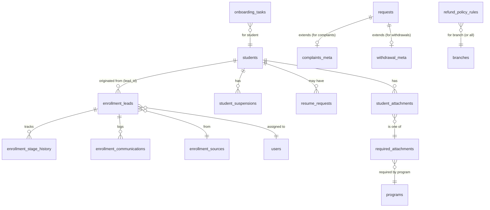
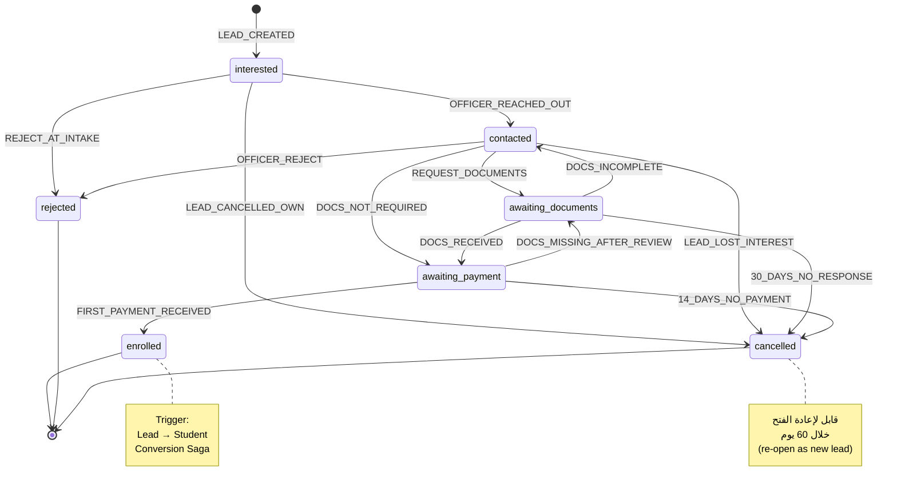
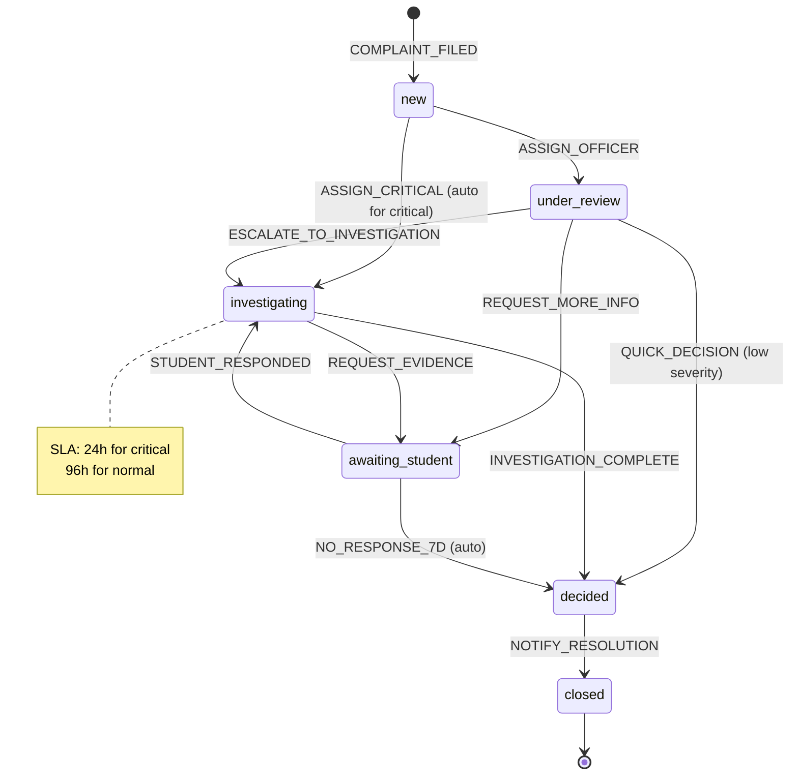
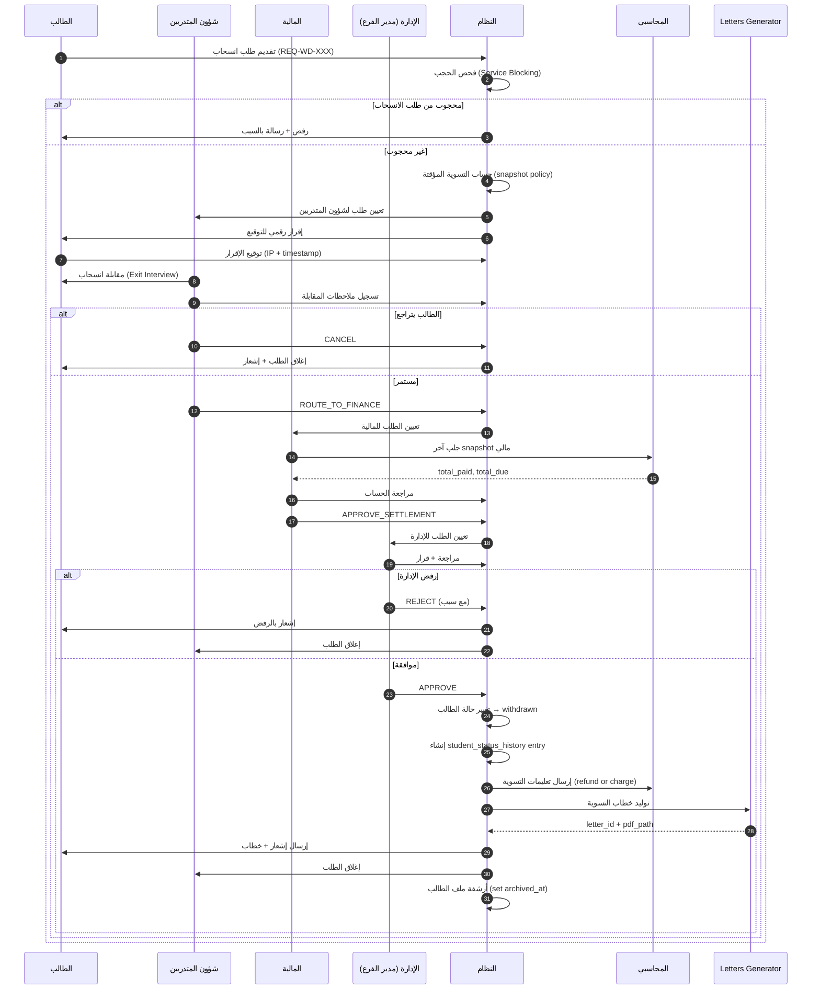
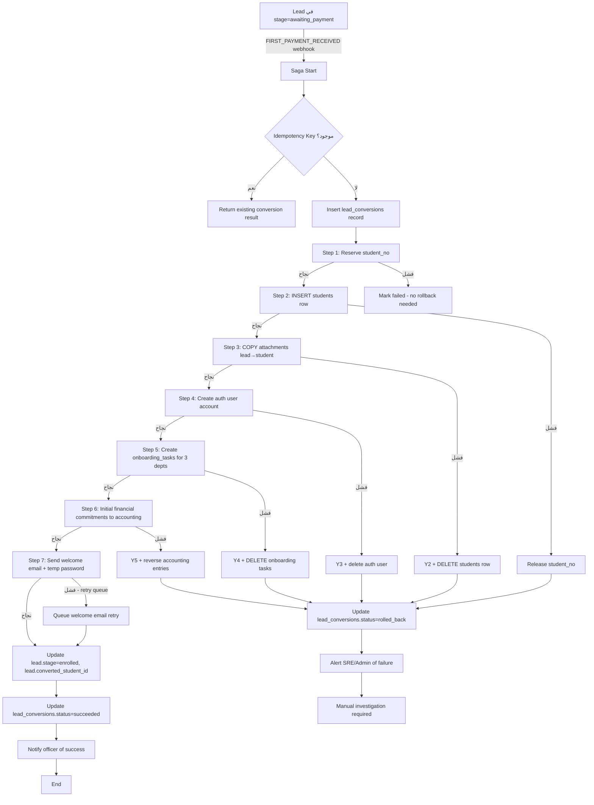
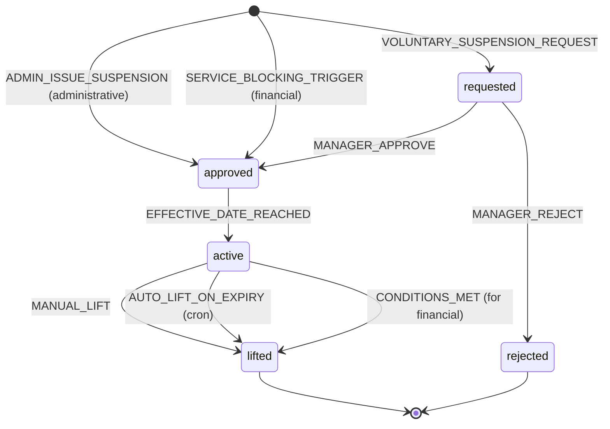

# المرحلة 6: شؤون المتدربين والتسجيل (Student Affairs & Enrollment)

> **النوع:** مرحلة وظيفية أعمال (Business Functional Phase)
> **المدة المُقدّرة:** 4.5 – 5.5 أسابيع (22-28 يوم عمل) — قابلة للتمديد ثلاثة أيام إن طُلب تعديل سياسة الاسترداد أو الـ Pipeline.
> **التبعيات السابقة:** المرحلة 1 (التأسيس) · المرحلة 3 (الطلاب والفروع) · المرحلة 4 (المالية والحجب) · المرحلة 5 (الطلبات والخطابات)
> **التبعيات اللاحقة:** المرحلة 7 (الأكاديمي اليومي — تستهلك `students` والـ Schedules)، المرحلة 9 (التقارير — تستهلك Funnel ومُؤشرات التسجيل).
> **الإصدار:** 1.0
> **التاريخ:** 2026-05-13
> **معدّ الخطة:** Senior Project Manager + Senior Systems Architect
> **الجمهور:** المبرمج الرئيسي (Full-Stack) + قائد المنتج + ممثل العميل (شؤون المتدربين + التسجيل)

---

## فهرس الأقسام

1. الملخص التنفيذي (Executive Summary)
2. الأهداف والمخرجات (Objectives & Deliverables)
3. المتطلبات السابقة والافتراضات (Prerequisites & Assumptions)
4. الموديولات الفرعية (Sub-Modules)
5. تعديلات نموذج البيانات (Data Model Changes)
6. State Machines (Lead + Complaint + Withdrawal)
7. مواصفات الواجهة (UI/UX Specifications)
8. الـ APIs والـ Endpoints
9. التكاملات (Integrations)
10. الأمان والصلاحيات (Security & RLS)
11. خطة الاختبار (Testing Plan)
12. تقسيم الـ Sprints (Sprint Breakdown)
13. معايير القبول (Acceptance Criteria)
14. المخاطر والتخفيف (Risks & Mitigations)
15. الانتقال للمرحلة القادمة + ملاحق

---

## 1. الملخص التنفيذي (Executive Summary)

المرحلة السادسة — **شؤون المتدربين والتسجيل (Student Affairs & Enrollment)** — هي المرحلة التي تكتمل فيها **دورة حياة الطالب** من الطرف إلى الطرف. قبل هذه المرحلة كان لدينا (أ) **طلاب جاهزون** في قاعدة البيانات (المرحلة 3)، و(ب) **محرك حجب وقواعد مالية** يحكم خدماتهم (المرحلة 4)، و(ج) **محرك طلبات** يُدير الـ 14 نوع طلب الأساسي (المرحلة 5). الفجوة المتبقية كانت في طرفي الخط: **كيف يدخل الطالب** أصلاً إلى النظام (Lead → Student)، و**كيف يخرج** منه (Withdrawal/Graduation/Suspension)، وكيف نُدير **القناة الإنسانية** بينهما (الشكاوى، المرفقات الناقصة، رحلة الطالب الكاملة كما يراها موظف شؤون المتدربين). هذه المرحلة تُغلق هذه الفجوة بـ **بوابتين متكاملتين** هما العمود الفقري للأعمال اليومية لإدارة المعهد.

**البوابة الأولى — بوابة شؤون المتدربين (Student Affairs Portal):** لوحة تشغيلية موحّدة لموظف شؤون المتدربين تُمكّنه من رؤية كل الطلاب المُوكَّلين إليه (في فرعه فقط بـ RLS صارمة)، تتبع حالاتهم الثمانية (registered → active → late_financial → suspended_financial → deprived_fees → deprived_attendance → deferred → graduated/withdrawn)، فتح **بطاقة الطالب الموحّدة** بسبعة تبويبات تجمع كل المعلومات في مكان واحد قابل للطباعة، إدارة الشكاوى/الاستفسارات/البلاغات بـ Workflow مخصص يستند على محرك الطلبات لكنه يُضيف خصوصيات (severity, anonymity, SLA معجَّل للـ critical)، ومعالجة طلبات الانسحاب الكاملة مع تسوية مالية تلقائية وفق جدول استرداد قابل للتحرير، والإيقافات المؤقتة بأنواعها الثلاثة (طوعي/إداري/مالي)، والاستكمال (Resume Studies)، وقائمة المرفقات الناقصة مع تنبيهات Cron تصاعدية (7 أيام → 14 → 30 → تصعيد للإدارة).

**البوابة الثانية — بوابة التسجيل والقبول (Mini CRM):** ميني-CRM يحوّل العمل اليومي للقسم من فوضى Excel وWhatsApp إلى **خط أنابيب (Pipeline) منظَّم بـ 7 مراحل**: مهتم → تم التواصل → بانتظار مستندات → بانتظار دفعة → تم التسجيل → مرفوض/ملغي. كل lead يحصل على serial فريد، مصدر مُسجَّل (Instagram/Walk-in/Referral...)، موظف تسجيل مسؤول، وKPIs لسرعة الاستجابة. **نموذج التسجيل العام (Public-facing)** بصفحة بلا تسجيل دخول، Laravel Validation (Form Requests) كاملة (هوية سعودية + جوال سعودي + رفع مرفقات + CAPTCHA + Rate Limiting)، إشعار فوري للموظف، وتأكيد استلام للـ lead. عند الوصول للمرحلة الخامسة (تم التسجيل) يحدث **التحويل التلقائي (Lead → Student Conversion)**: إنشاء سجل في `students`، تخصيص رقم طالب، إنشاء حساب login، إرسال welcome email مع كلمة مرور مؤقتة، تشغيل Onboarding Tasks للأقسام الثلاثة (شؤون → التدريب → المالية).

في نهاية الأسابيع الأربعة والنصف إلى الخمسة ونصف، سنُسلّم **بوابتين كاملتين بـ 18 شاشة، 12 جدول بيانات جديد، 32 API Endpoint، 4 State Machines (Lead + Complaint + Withdrawal + Suspension)، 6 Cron Jobs**، وتقارير التسجيل الأساسية (Funnel Conversion، مصادر التسجيل، أداء موظفي التسجيل، KPI سرعة الاستجابة، الـ Leads المفقودة). الأمر الأهم من ذلك: ستُغلَق "الحلقة" المؤسسية للمرة الأولى — لن يدخل طالب إلى النظام عبر مكالمة هاتف وExcel، ولن يخرج منه دون توثيق وتسوية. هذا ليس تحسيناً تشغيلياً فحسب؛ بل هو **تحوّل إداري كامل** يُحوّل قسم التسجيل من "مكتب استقبال" إلى **محرك نمو مُقاس** يعرف بدقة من أين يأتي الطلاب وكم يستغرقون في كل مرحلة وأين يفقدون اهتمامهم.

### 1.1 الأرقام الرئيسية للمرحلة

| البند | القيمة |
|------|--------|
| الجهد الإجمالي | 4.5–5.5 أسبوع (≈ 22-28 يوم عمل) |
| عدد الـ Migrations | 13 |
| عدد الجداول الجديدة | 12 |
| عدد API Endpoints | 32 |
| عدد الشاشات | 18 (8 شؤون متدربين + 6 تسجيل + 3 لوحات إدارة + 1 صفحة عامة) |
| State Machines | 4 (Lead, Complaint, Withdrawal, Suspension) |
| Cron Jobs | 6 |
| Reports | 5 تقارير قياسية |
| Coverage Target | ≥ 75% (≥ 85% للـ State Machines والـ Conversion Logic) |
| Performance | فتح بطاقة طالب < 600ms (P95)، تقديم Lead < 2s، تحويل Lead → Student < 5s |

### 1.2 الأوجاع التي تُحَلّ في هذه المرحلة

- **"الـ Leads تضيع في WhatsApp":** كل lead له `serial` + موظف مسؤول + مرحلة + ملاحظات + تاريخ آخر تواصل. **0 leads مفقودة**.
- **"التسجيل يستغرق 3 أيام":** الـ Lead يدخل النموذج العام، يصل لموظف، يُرفع مستندات، تأتي الدفعة من المحاسبي → تتحوّل تلقائياً لطالب في < 24 ساعة من الدفع.
- **"الشكاوى تروح للمدير شفهياً":** كل شكوى موثقة بـ serial + severity + SLA. الشكاوى الحرجة تُصعَّد للإدارة بـ 24 ساعة.
- **"الانسحاب فوضى":** Workflow صريح بثلاث محطات (شؤون → مالية → إدارة) مع تسوية مالية محسوبة آلياً وخطاب تلقائي.
- **"لا أحد يعرف من رفع هويته":** قائمة مرفقات إلزامية لكل برنامج + تنبيهات تصاعدية + حظر خدمات مرتبط (شعور حقيقي بالعواقب).
- **"الإدارة لا تعرف ROI من Instagram":** Funnel Conversion يعرض بالضبط: 100 lead من Instagram → 60 contacted → 35 awaiting_payment → 22 enrolled = 22% conversion. بيانات تُغني عن التخمين.

### 1.3 المخاطر الخمسة الأولى وردّها المختصر

| المخاطرة | الردّ |
|---------|------|
| Lead → Student Conversion يفشل في منتصف الطريق (Distributed Transaction) | Saga Pattern + Idempotency Keys + جدول `conversion_attempts` مع retry آلي. اختبارات Chaos تثبت الاستقرار. |
| نموذج التسجيل العام مُعرَّض لـ Spam/Bot | CAPTCHA (hCaptcha) + Rate Limiting بـ IP/الجوال + جدول `enrollment_blacklist` + Honey-pot fields. |
| شكوى مجهولة تُكشف بـ SQL Query | تشفير `student_id` في `complaint_anonymous` + RLS صارمة + اختبار اختراق محدود. |
| سياسة استرداد الرسوم تتغيّر بعد الإطلاق | جدول `refund_policy_rules` قابل للتحرير من الإدارة + Audit Log لكل تغيير + الحسابات تستخدم نسخة سياسة وقت الانسحاب (Snapshot). |
| التنبيهات التلقائية تُغرق الطلاب | Throttling + قنوات اختيارية + إيقاف لكل طالب فردي + تسلسل تصاعدي (لا 5 تنبيهات في يوم واحد). |

---

## 2. الأهداف والمخرجات (Objectives & Deliverables)

### 2.1 الأهداف الاستراتيجية

| # | الهدف | المؤشر القابل للقياس |
|---|------|----------------------|
| O1 | إغلاق حلقة دورة حياة الطالب (Lead → Graduate) | 100% من الطلاب لديهم مسار موثق من الـ Lead حتى الحالة النهائية |
| O2 | أتمتة 90% من قسم التسجيل | متوسط زمن "Lead إلى Enrollment" ينخفض من 5 أيام إلى ≤ 2 أيام |
| O3 | تقليل فقدان الـ Leads | معدل الـ Leads "المفقودة" (> 14 يوم بلا تواصل) ينخفض إلى < 8% |
| O4 | شفافية كاملة في الشكاوى | 100% من الشكاوى الحرجة (critical) تُغلق خلال 96 ساعة |
| O5 | إنهاء الانسحاب اليدوي | 100% من طلبات الانسحاب تمر على الـ Workflow الثلاثي مع تسوية محسوبة |
| O6 | مرفقات كاملة للطلاب المنتظمين | ≥ 95% من الطلاب النشطين لديهم مرفقات كاملة (id + photo + contract + certificate) |
| O7 | بيانات تسويقية موثوقة | تقرير "مصادر التسجيل" يُولَّد يومياً بدقة 100% للمصادر المُعلَنة |
| O8 | تجربة موظف شؤون متدربين سلسة | يفتح بطاقة طالب → يرى كل المعلومات (مالي + أكاديمي + طلبات + مرفقات) خلال < 2 ثانية |

### 2.2 المخرجات التقنية المحددة

| # | المُخرَج | الموقع التقني | معيار القبول |
|---|----------|--------------|--------------|
| D1 | بوابة شؤون المتدربين | `src/resources/views/livewire/staff/student-affairs/` | 8 شاشات تعمل + RLS صحيحة |
| D2 | بطاقة الطالب الموحّدة (7 تبويبات) | `src/components/student-card/` | كل التبويبات تعمل + تطبع PDF |
| D3 | بوابة التسجيل (Mini CRM) | `src/resources/views/livewire/staff/enrollment/` | Kanban + Pipeline + Detail يعمل |
| D4 | نموذج التسجيل العام | `app/Http/Controllers/Public/RegisterController.php` + `resources/views/public/register.blade.php` | Laravel Validation + CAPTCHA + Rate Limiting |
| D5 | محرك Lead → Student | `src/modules/enrollment/conversion/` | Saga مع 4 خطوات + Rollback |
| D6 | Workflow الشكوى | `src/modules/complaints/` | يبني على Phase 5 + خصوصيات |
| D7 | Workflow الانسحاب | `src/modules/withdrawal/` | 3 محطات + تسوية + خطاب |
| D8 | إدارة الإيقاف المؤقت | `src/modules/suspension/` | 3 أنواع + شروط الرفع |
| D9 | الاستكمال (Resume) | `src/modules/resume-studies/` | يربط الانسحاب بإعادة التفعيل |
| D10 | تتبع المرفقات الناقصة | `src/modules/attachments-tracker/` | قائمة + تنبيهات Cron + حظر خدمات |
| D11 | تقارير التسجيل (5 تقارير) | `app/Filament/Admin/Resources/EnrollmentReportResource.php` | تقارير قابلة للتصدير CSV/PDF |
| D12 | 6 Cron Jobs | `app/Jobs/Scheduled/cron/` | تعمل في الإنتاج |
| D13 | 13 Migration | `database/migrations/` | تنجح + Rollback مختبر |
| D14 | E2E Tests كاملة | `tests/e2e/phase-6/` | كل سيناريوهات القبول خضراء |
| D15 | RLS Policies | في الـ Migrations | اختبارات Cross-Branch تنجح |
| D16 | User Documentation | `docs/user-guides/phase-6/` | 3 أدلة (شؤون + تسجيل + إدارة) |
| D17 | Onboarding Email Templates | `src/lib/email-templates/` | 4 قوالب (welcome, reminder, conversion, withdrawal) |

### 2.3 ما هو خارج نطاق هذه المرحلة (Out-of-Scope)

- ❌ **تكامل WhatsApp Business API** — للإشعارات. مؤجل للمرحلة 10 (التكاملات والذكاء).
- ❌ **تكامل SMS Gateway** — Local SMS Stub فقط الآن. الفعلي في المرحلة 10.
- ❌ **AI Lead Scoring** — تقييم الـ Leads بـ AI. للمرحلة 10.
- ❌ **توقيع رقمي معتمد بـ OTP/SMS للانسحاب** — التوقيع الحالي = إقرار رقمي + IP + timestamp. PKI في مراحل لاحقة.
- ❌ **Mobile App للطالب** — مستبعد نهائياً (قرار معماري ثابت).
- ❌ **WYSIWYG لتحرير القوالب** — نُعدّل HTML مباشرة. WYSIWYG في v2.
- ❌ **التوقعات بـ ML للتسجيل القادم** — تحليل وصفي فقط. التنبؤي في المرحلة 9 أو 10.
- ❌ **إعدادات Pipeline قابلة للتخصيص لكل فرع** — Pipeline موحَّد. التخصيص في v2 إن طلب.

---

## 3. المتطلبات السابقة والافتراضات (Prerequisites & Assumptions)

### 3.1 المتطلبات السابقة من المراحل الأخرى

| # | المرحلة | المُخرَج المُستَلَم | ما نستخدمه منه |
|---|---------|-------------------|-----------------|
| P1 | المرحلة 1 | RBAC + Branch Isolation + Audit Log | كل العمليات تمر على هذه الطبقات |
| P2 | المرحلة 3 | جدول `students` + `student_status_history` + State Machine للطالب | نُغذي الـ FSM ونوسع `students` |
| P3 | المرحلة 3 | جدول `student_attachments` (موجود من قبل) | نوسعه + نُضيف `required_attachments` |
| P4 | المرحلة 4 | Service Blocking Engine + Blocking Matrix | تحقق الحجب قبل قبول الانسحاب/الاستكمال |
| P5 | المرحلة 5 | محرك الطلبات (Workflow Engine) + 14 نوع طلب | بناء الشكاوى/الانسحاب فوقه |
| P6 | المرحلة 5 | Letters Generator + 18 قالب | توليد خطابات الانسحاب/الاستكمال/الإيقاف |
| P7 | المرحلة 5 | SLA Engine + Escalation Cron | استخدام نفس البنية للشكاوى |
| P8 | المرحلة 1 | Notifications skeleton | إرسال إشعارات الـ Leads والطلاب |

### 3.2 الافتراضات المعتمَدة

| # | الافتراض | الـ Risk إن لم يتحقق |
|---|---------|------------------------|
| A1 | الـ FSM للطالب من المرحلة 3 مستقر ومُختبر | تعديلات الحالة (suspended/active) ستفشل |
| A2 | محرك الطلبات يدعم إضافة `request_type='complaint'` بلا تعديل جوهري | نحتاج إعادة هيكلة Phase 5 |
| A3 | Service Blocking يستجيب لـ `service='request_withdrawal'` | الطلاب المحجوبون ينسحبون رغم الحجب — خطر |
| A4 | البريد الإلكتروني (Resend أو SendGrid) متاح كإشعار للـ Leads | نعتمد على Notifications داخلية فقط (تجربة أضعف) |
| A5 | hCaptcha API key متاح | استبدال بـ Cloudflare Turnstile أو reCAPTCHA |
| A6 | الإدارة وافقت على الـ 7 مراحل المُقترحة للـ Pipeline | إعادة هيكلة الـ State Machine |
| A7 | جدول استرداد الرسوم المُقترَح (100% / 80% / 50% / 25% / 0%) مقبول مبدئياً | نعتمد جدول مؤقت قابل للتعديل من واجهة الإدارة |

### 3.3 الأسئلة المعلَّقة للعميل (تُجاب قبل البدء)

> **⚠️ هذه الأسئلة يجب أن تُحسم في أول جلسة Kickoff (اليوم 0).**

1. **سياسة الاسترداد:** هل النسب المُقترحة (100/80/50/25/0) صحيحة؟ أم تختلف بحسب البرنامج/الفصل/الفرع؟
2. **مَن يعتمد الانسحاب نهائياً؟** مدير الفرع أم الإدارة المركزية أم كلاهما؟ (يحدد عدد محطات الـ Workflow.)
3. **هل الشكوى المجهولة مسموحة فعلاً؟** بعض المعاهد تمنعها لاحتمالات إساءة الاستخدام.
4. **مدة الـ "lead unresponsive":** بعد كم يوم نعتبر الـ Lead "مفقوداً"؟ (المقترح 14 يوم لتنبيه و30 يوم للاقتراح بالإلغاء.)
5. **معلومات الفرع المفضّل:** هل الطالب يلتزم بالفرع المُفضّل، أم يمكن للإدارة إعادة توجيهه لفرع آخر؟
6. **رقم اعتماد البرنامج TVTC:** هل لكل برنامج اعتماد منفصل، أم اعتماد عام للمعهد؟ (يُذكر في خطاب الانسحاب.)
7. **حسابات المستخدمين للـ Students:** عند `LEAD_CONVERTED`، هل يُنشأ حساب login تلقائياً؟ أم يحتاج إجراء يدوي؟ (المقترَح: تلقائي.)
8. **سياسة الـ Walk-in:** هل يستطيع موظف التسجيل إدخال Lead مباشرة بدون نموذج عام؟ (المقترَح: نعم، عبر "Internal Lead Form".)
9. **اللغة الافتراضية للـ Welcome Email:** عربي فقط، أم عربي + إنجليزي حسب اختيار الطالب؟
10. **شروط الاستكمال (Resume Studies):** هل تشترط دفع رسوم تجديد ثابتة، أم نسبة من الباقي، أم تُحتسب حسب الفترة الغائبة؟

---

## 4. الموديولات الفرعية (Sub-Modules)

### 4.1 موديول بوابة شؤون المتدربين (`student-affairs-portal`)

#### 4.1.1 لوحة شؤون المتدربين الرئيسية

**المسار:** `/staff/student-affairs/dashboard`
**الصلاحية:** `student_affairs_officer`, `student_affairs_supervisor`, `branch_manager`

**المكوّنات:**
- **بطاقات KPI علوية (4 بطاقات):**
  - الطلاب المُوكَّلون لي (مع تنبيه إن > 50)
  - الطلبات النشطة في قسمي (Open + Routed To Me)
  - الشكاوى الحرجة (severity = critical)
  - المرفقات الناقصة (لطلاب فرعي)
- **جدول الطلاب المُوكَّلون:** مع فلاتر سريعة:
  - "متأخر مالياً" (`status='late_financial'`)
  - "اقتراب حرمان غياب" (absence_rate > 20%)
  - "ناقصو مرفقات" (missing_attachments > 0)
  - "جدد هذا الأسبوع" (registered_at > NOW() - 7 days)
- **التذكيرات اليومية:** Cron يُولّد Tasks للموظف صباحاً:
  - "اتصل بطالب X — متأخر 22 يوم"
  - "راجع شكوى Y — قاربت SLA"

#### 4.1.2 بطاقة الطالب الموحّدة (Unified Student Card)

**المسار:** `/staff/student-affairs/students/[student_id]`

**التبويبات السبعة:**

| Tab | الاسم | المحتوى الرئيسي | المصدر |
|-----|------|------------------|--------|
| 1 | **الملف الشخصي** | بيانات شخصية، ولي الأمر، العنوان، الفرع، البرنامج، التوظيف | `students`, `student_emergency_contacts` |
| 2 | **الحالة الأكاديمية** | الفصل، GPA، المواد المسجلة، الحضور، الاختبارات السابقة | `enrollments`, `attendance` (المرحلة 7) — الآن stub |
| 3 | **الحالة المالية** | الرصيد، آخر دفعة، الدفعات المتأخرة، الـ blocks الفعّالة | `student_financial_snapshots` (المرحلة 4) |
| 4 | **الطلبات** | كل الطلبات (مفتوحة + مغلقة) + الـ SLA + رابط لكل طلب | `requests` (المرحلة 5) |
| 5 | **الشكاوى والاستفسارات** | فلتر خاص على `requests` بـ `type IN ('complaint','inquiry','suggestion','report')` | `requests` + `complaints_meta` |
| 6 | **المرفقات** | كل مرفق + الحالة (verified/pending/rejected/missing) | `student_attachments`, `required_attachments` |
| 7 | **التاريخ (Audit Log)** | كل عمليات الطالب: انتقالات الحالة + كل تعديل بياناتي + خطابات | `audit_log` + `student_status_history` |

**ميزات إضافية في البطاقة:**
- **زر "طباعة ملف الطالب الكامل"** → ينتج PDF بكل التبويبات (مفيد للأرشيف الورقي).
- **زر "تصدير CSV"** → جدول مفلطح من كل البيانات.
- **شريط الإجراءات السريعة:** "تغيير الحالة"، "إصدار خطاب"، "فتح طلب نيابة عنه"، "إضافة ملاحظة داخلية".

#### 4.1.3 إدارة المرفقات الناقصة

**المسار:** `/staff/student-affairs/missing-attachments`

**الشاشة تعرض:**
- جدول الطلاب الذين تنقصهم مرفقات إلزامية.
- لكل طالب: اسم، فرع، تاريخ التسجيل، عدد المرفقات الناقصة، عمر النقص (بالأيام)، آخر تنبيه مُرسَل.
- زر "إرسال تذكير الآن" (manual override للـ Cron).
- زر "تطبيق حظر خدمات" (لطلاب نقصهم > 30 يوم وقرار شؤون المتدربين).

### 4.2 موديول الشكاوى والاستفسارات (`complaints-management`)

#### 4.2.1 الفلسفة التصميمية

نبني الشكاوى **فوق محرك الطلبات** من المرحلة 5 (لا نُنشئ Workflow Engine منفصل). نُضيف جدول `complaints_meta` (1:1 مع `requests`) يحمل البيانات الخاصة بالشكاوى.

**سبب القرار:** الاتساق + إعادة استخدام الـ SLA Engine + الـ Escalation Cron + الـ UI الموحَّد.

#### 4.2.2 الأنواع الأربعة

| النوع | `request_type` | الفرق |
|------|---------------|------|
| شكوى (Complaint) | `complaint` | تستوجب تحقيق وقرار. ممكن أن تكون مجهولة. |
| استفسار (Inquiry) | `inquiry` | سؤال + ردّ. لا تحقيق. |
| مقترح (Suggestion) | `suggestion` | اقتراح تحسين. تذهب لمجلس الإدارة. |
| بلاغ (Report) | `report` | بلاغ عن مخالفة (لا يستوجب رد للطالب). |

> **ملاحظة:** المرحلة 5 أضافت `complaint` و`inquiry` فقط. هذه المرحلة **تُوسّع** الـ CHECK constraint ليشمل `suggestion` و`report`.

#### 4.2.3 الحقول الخاصة بالشكاوى

```typescript
interface ComplaintMeta {
  request_id: string;             // FK to requests
  severity: 'low' | 'medium' | 'high' | 'critical';
  category: 'academic' | 'financial' | 'behavioral' | 'service' | 'staff_conduct' | 'facility' | 'other';
  is_anonymous: boolean;
  anonymous_token: string | null; // hash لإخفاء الـ student_id
  involves_staff_id: string | null;
  resolution_deadline: string;    // يُحسب بـ SLA Engine + escalation أسرع للـ critical
  investigation_notes: string | null;
  decision: 'upheld' | 'partially_upheld' | 'dismissed' | null;
  decision_reason: string | null;
  decided_by: string | null;
  decided_at: string | null;
}
```

#### 4.2.4 Workflow الشكوى

```
NEW → UNDER_REVIEW (شؤون المتدربين) → INVESTIGATING → DECIDED → CLOSED
```

- إذا كانت الشكوى **critical** أو ضد موظف → تُصعَّد تلقائياً للإدارة (`branch_manager` أو `admin` حسب الموضوع) بعد ساعتين من الفتح.
- إذا كانت **مجهولة** → الـ `student_id` يُخفى عبر RLS عن غير الإدارة، لكن يبقى محفوظاً مشفّراً للمراجعة القضائية إن لزم.
- الشكوى تظهر في **تبويب الشكاوى داخل بطاقة الطالب** (للموظفين المُصرَّح لهم).

#### 4.2.5 تقارير الشكاوى

| التقرير | الأبعاد |
|---------|---------|
| Heat Map | category × branch (شدّة المشاكل في كل فرع لكل فئة) |
| SLA Performance | severity × resolved_within_sla% |
| تكرار الشكاوى | student_id × عدد الشكاوى السنوية (لكشف نمط الشكاية المُفرطة) |
| المُتورطون من الموظفين | staff_id × عدد الشكاوى ضدّه |

### 4.3 موديول الانسحاب (`withdrawal-flow`)

#### 4.3.1 الفكرة

الانسحاب ليس مجرد تغيير حالة الطالب من `active` إلى `withdrawn`. هو **عملية متعددة الأطراف**:
1. الطالب يقدم طلب الانسحاب مع توقيع إقرار.
2. شؤون المتدربين يجري **مقابلة الانسحاب** (Exit Interview) — تسجيل أسباب حقيقية (للتحليل).
3. المالية تحسب **التسوية المالية** (استرداد أو التزام بالباقي).
4. الإدارة تعتمد القرار النهائي.
5. النظام يُغيّر حالة الطالب، يولّد خطاب التسوية، يُنشئ سجلات الأرشيف، يُرسل الإشعارات.

#### 4.3.2 جدول استرداد الرسوم القابل للتحرير

```sql
CREATE TABLE refund_policy_rules (
  id              UUID PRIMARY KEY DEFAULT gen_random_uuid(),
  effective_from  DATE NOT NULL,
  effective_to    DATE,                          -- NULL = سارٍ
  min_days_from_start INT NOT NULL,              -- 0 = من اليوم الأول
  max_days_from_start INT NOT NULL,
  refund_percentage NUMERIC(5,2) NOT NULL CHECK (refund_percentage BETWEEN 0 AND 100),
  description_ar  TEXT NOT NULL,
  branch_id       UUID REFERENCES branches(id),  -- NULL = كل الفروع
  program_id      UUID,                          -- NULL = كل البرامج
  created_by      UUID REFERENCES users(id),
  created_at      TIMESTAMPTZ DEFAULT NOW(),
  UNIQUE(effective_from, min_days_from_start, branch_id, program_id)
);

-- Seed الافتراضي (يحتاج اعتماد العميل):
INSERT INTO refund_policy_rules
  (effective_from, min_days_from_start, max_days_from_start, refund_percentage, description_ar) VALUES
  ('2026-01-01', 0,   7,   100.00, 'استرداد كامل خلال أسبوع من التسجيل'),
  ('2026-01-01', 8,   14,  80.00,  'استرداد 80% خلال الأسبوع الثاني'),
  ('2026-01-01', 15,  30,  50.00,  'استرداد 50% خلال الشهر الأول'),
  ('2026-01-01', 31,  60,  25.00,  'استرداد 25% خلال الشهر الثاني'),
  ('2026-01-01', 61,  9999, 0.00,  'لا استرداد بعد شهرين');
```

> **مبدأ Snapshot:** عند تقديم طلب الانسحاب، نقرأ القاعدة المُطبَّقة وقت التقديم ونحفظها في `withdrawal_meta.policy_snapshot`. أي تغيير لاحق في السياسة **لا يُؤثر** على الطلبات المفتوحة (Audit + عدل).

#### 4.3.3 جدول `withdrawal_meta`

```sql
CREATE TABLE withdrawal_meta (
  request_id          UUID PRIMARY KEY REFERENCES requests(id) ON DELETE CASCADE,
  primary_reason      TEXT NOT NULL CHECK (primary_reason IN (
    'financial', 'academic', 'family', 'health', 'work', 'transfer_to_other_institute',
    'dissatisfaction_with_service', 'dissatisfaction_with_program', 'other'
  )),
  secondary_reasons   TEXT[] DEFAULT '{}',
  detailed_explanation TEXT,
  exit_interview_notes TEXT,                       -- يُكتب من شؤون المتدربين
  exit_interview_by   UUID REFERENCES users(id),
  exit_interview_at   TIMESTAMPTZ,
  pledge_acknowledged BOOLEAN DEFAULT FALSE,       -- توقيع إقرار رقمي
  pledge_ip           INET,
  pledge_at           TIMESTAMPTZ,
  policy_snapshot     JSONB NOT NULL,              -- نسخة قاعدة الاسترداد
  days_from_start     INT NOT NULL,                -- عدد الأيام منذ بداية الفصل
  total_paid          NUMERIC(12,2) NOT NULL,
  total_due           NUMERIC(12,2) NOT NULL,
  refund_percentage   NUMERIC(5,2) NOT NULL,
  refund_amount       NUMERIC(12,2) NOT NULL,
  outstanding_amount  NUMERIC(12,2) NOT NULL,      -- ما يجب على الطالب دفعه
  net_settlement      NUMERIC(12,2) NOT NULL,      -- موجب = استرداد، سالب = استحقاق
  finance_approved_by UUID REFERENCES users(id),
  finance_approved_at TIMESTAMPTZ,
  admin_approved_by   UUID REFERENCES users(id),
  admin_approved_at   TIMESTAMPTZ,
  withdrawal_effective_date DATE,
  letter_id           UUID REFERENCES letters(id),
  created_at          TIMESTAMPTZ DEFAULT NOW()
);
```

#### 4.3.4 خوارزمية احتساب التسوية

```typescript
// src/modules/withdrawal/sEttlementCalculator.php
export async function calculateWithdrawalSettlement(
  studentId: string,
  withdrawalDate: Date
): Promise<SettlementResult> {
  const student = await db.students.byId(studentId);
  const program = await db.programs.byId(student.program_id);
  const termStart = student.enrolled_at ?? program.term_start_date;
  const daysFromStart = differenceInDays(withdrawalDate, termStart);

  // جلب القاعدة الفعّالة وقت التقديم
  const policyRule = await db.refund_policy_rules.findOne({
    effective_from: { lte: withdrawalDate },
    effective_to: { gte: withdrawalDate, or: null },
    min_days_from_start: { lte: daysFromStart },
    max_days_from_start: { gte: daysFromStart },
    branch_id: { eq: student.branch_id, or: null },     // فرع محدد أو شامل
    program_id: { eq: student.program_id, or: null },
  });

  if (!policyRule) {
    throw new Error('لا توجد قاعدة استرداد سارية. يُرجى اعتماد سياسة من الإدارة.');
  }

  // جلب البيانات المالية الحالية (Snapshot من المرحلة 4)
  const snapshot = await accounting.getFinancialSnapshot(studentId);
  const totalPaid = snapshot.total_paid;
  const totalDue = snapshot.total_due;
  const expectedRefund = (totalPaid * policyRule.refund_percentage) / 100;
  const outstanding = Math.max(0, totalDue - totalPaid);
  const netSettlement = expectedRefund - outstanding;

  return {
    policyRule,
    daysFromStart,
    totalPaid,
    totalDue,
    refundPercentage: policyRule.refund_percentage,
    refundAmount: expectedRefund,
    outstandingAmount: outstanding,
    netSettlement,
    direction: netSettlement >= 0 ? 'refund_to_student' : 'student_owes',
  };
}
```

#### 4.3.5 Workflow الـ Mermaid (المختصر)

> **سيتم الإسهاب فيه في القسم 6 (State Machines).**

### 4.4 موديول الإيقاف المؤقت (`suspension-management`)

#### 4.4.1 الأنواع الثلاثة

| النوع | `suspension_type` | المُطلِق | الـ Workflow |
|------|------------------|---------|-------------|
| طوعي | `voluntary` | الطالب | شؤون → مدير الفرع → اعتماد |
| إداري | `administrative` | الإدارة | قرار مباشر بدون workflow طويل |
| مالي | `financial` | تابع للمرحلة 4 | تلقائي عبر Service Blocking |

#### 4.4.2 الجدول

```sql
CREATE TABLE student_suspensions (
  id                  UUID PRIMARY KEY DEFAULT gen_random_uuid(),
  student_id          UUID NOT NULL REFERENCES students(id),
  branch_id           UUID NOT NULL REFERENCES branches(id),
  suspension_type     TEXT NOT NULL CHECK (suspension_type IN ('voluntary','administrative','financial')),
  reason              TEXT NOT NULL,
  starts_at           DATE NOT NULL,
  ends_at             DATE NOT NULL,
  conditions_to_resume TEXT,                   -- شروط رفع الإيقاف (نص)
  request_id          UUID REFERENCES requests(id),   -- في حالة الطوعي
  initiated_by        UUID REFERENCES users(id),
  approved_by         UUID REFERENCES users(id),
  approved_at         TIMESTAMPTZ,
  is_active           BOOLEAN DEFAULT TRUE,
  lifted_at           TIMESTAMPTZ,
  lifted_by           UUID REFERENCES users(id),
  lift_reason         TEXT,
  created_at          TIMESTAMPTZ DEFAULT NOW()
);

CREATE INDEX idx_suspensions_active ON student_suspensions(student_id, is_active) WHERE is_active = TRUE;
CREATE INDEX idx_suspensions_ends_at ON student_suspensions(ends_at) WHERE is_active = TRUE;
```

#### 4.4.3 Cron لإشعارات قُرب انتهاء الإيقاف

```typescript
// app/Jobs/Scheduled/cron/sUspensionExpiryNotifications.php
// يعمل يومياً في 9:00 صباحاً
export async function notifyUpcomingSuspensionExpiry() {
  const today = startOfDay(new Date());
  const in7Days = addDays(today, 7);
  const in1Day = addDays(today, 1);

  // إشعار قبل 7 أيام
  const expiringIn7 = await db.student_suspensions.find({
    is_active: true,
    ends_at: { gte: in7Days, lt: addDays(in7Days, 1) },
  });
  for (const s of expiringIn7) {
    await notify(s.student_id, 'suspension_ending_7d', { ends_at: s.ends_at, type: s.suspension_type });
    await notify(s.branch_id, 'staff_suspension_ending_7d', { student_id: s.student_id });
  }

  // إشعار قبل يوم واحد
  const expiringIn1 = await db.student_suspensions.find({
    is_active: true,
    ends_at: { gte: in1Day, lt: addDays(in1Day, 1) },
  });
  for (const s of expiringIn1) {
    await notify(s.student_id, 'suspension_ending_1d', { ends_at: s.ends_at });
  }

  // إيقاف انتهى دون رفع
  const expired = await db.student_suspensions.find({
    is_active: true,
    ends_at: { lt: today },
  });
  for (const s of expired) {
    await db.student_suspensions.update(s.id, {
      is_active: false,
      lifted_at: today,
      lift_reason: 'auto_lift_on_expiry',
    });
    await transitionStudent(s.student_id, 'RESUME_AFTER_SUSPENSION_EXPIRY', {
      reason: 'انتهاء فترة الإيقاف تلقائياً',
    });
    await notify(s.student_id, 'suspension_expired_resumed', {});
  }
}
```

### 4.5 موديول الاستكمال (Resume Studies)

#### 4.5.1 السيناريوهات

| السيناريو | المتطلَّبات |
|----------|--------------|
| استكمال بعد إيقاف طوعي منتهٍ | لا شروط — تلقائي |
| استكمال بعد إيقاف إداري | اعتماد الإدارة + قد يكون مع شروط |
| استكمال بعد انسحاب | إعادة تسجيل + رسوم تجديد (يحتاج اعتماد الإدارة) |
| استكمال بعد حرمان مالي | تسديد كامل + رسوم تجديد |
| استكمال بعد حرمان غياب | اعتذار + خطة حضور + توقيع تعهد |

#### 4.5.2 جدول `resume_requests`

```sql
CREATE TABLE resume_requests (
  id              UUID PRIMARY KEY DEFAULT gen_random_uuid(),
  request_id      UUID NOT NULL REFERENCES requests(id) UNIQUE,
  student_id      UUID NOT NULL REFERENCES students(id),
  former_status   TEXT NOT NULL,                    -- 'suspended_*', 'withdrawn', 'deprived_*'
  desired_program_id UUID,                          -- قد يطلب تغيير برنامج (يحتاج اعتماد)
  renewal_fee     NUMERIC(12,2),
  conditions_to_meet TEXT,
  pledge_text     TEXT,                              -- نص التعهد المطلوب
  pledge_signed   BOOLEAN DEFAULT FALSE,
  pledge_signed_at TIMESTAMPTZ,
  approved_by     UUID REFERENCES users(id),
  approved_at     TIMESTAMPTZ,
  new_term_start_date DATE,
  created_at      TIMESTAMPTZ DEFAULT NOW()
);
```

### 4.6 موديول التسجيل والقبول (Mini CRM)

#### 4.6.1 المراحل السبع

```typescript
export type EnrollmentStage =
  | 'interested'             // مهتم: سجل بياناته الأولية
  | 'contacted'              // تم التواصل: تواصلت معه إدارة التسجيل
  | 'awaiting_documents'     // بانتظار مستندات: يحتاج رفع مرفقات
  | 'awaiting_payment'       // بانتظار دفعة: جاهز للدفع
  | 'enrolled'               // تم التسجيل: أصبح طالباً رسمياً
  | 'rejected'               // مرفوض
  | 'cancelled';             // ملغي
```

#### 4.6.2 الـ Pipeline (Kanban View)

**المسار:** `/staff/enrollment/pipeline`

كل مرحلة عمود في Kanban:
- بطاقة Lead: الاسم، الجوال، البرنامج المرغوب، الفرع، المصدر، الموظف المسؤول، عمر المرحلة.
- Drag-and-drop لتغيير المرحلة (مع نموذج تأكيد + ملاحظة).
- فلاتر علوية: حسب الفرع، المصدر، الموظف، الفترة الزمنية، البرنامج.

#### 4.6.3 شاشة Lead التفصيلية

**المسار:** `/staff/enrollment/leads/[lead_id]`

**التبويبات:**
- ملف الـ Lead (البيانات الأساسية).
- تاريخ التواصل (Communication Log) — كل اتصال/رسالة موثق يدوياً.
- المستندات المرفوعة.
- ملاحظات الموظف.
- تاريخ المراحل (`enrollment_stage_history`).

### 4.7 موديول نموذج التسجيل العام (`public-enrollment-form`)

#### 4.7.1 الصفحة العامة

**المسار:** `/register` (بدون تسجيل دخول)

**التركيب:**
- Hero عُلوي مع لوغو المعهد + عنوان "سجل في النظام".
- نموذج مكوّن من 4 خطوات (Step Wizard):
  1. **البيانات الأساسية** (اسم، هوية، جوال، بريد، تاريخ ميلاد).
  2. **الاهتمام الأكاديمي** (البرنامج، الفرع المُفضّل، تاريخ البدء المرغوب).
  3. **معلومات التوظيف (اختياري)** (مُفعَّل بسؤال: هل أنت موظف حكومي؟).
  4. **رفع المستندات** (صورة هوية، شهادة سابقة) — اختياري في هذه المرحلة.
- CAPTCHA (hCaptcha) في الخطوة النهائية.
- شرط الموافقة على سياسة الخصوصية (PDPL).
- زر "إرسال الطلب".

#### 4.7.2 التحقق (Validation)

```typescript
import { z } from 'zod';

const PhoneSchemaKSA = z.string().regex(/^(05|\+9665|9665)[0-9]{8}$/, 'رقم جوال سعودي غير صالح');
const NationalIdSchema = z.string().regex(/^[12][0-9]{9}$/, 'رقم هوية/إقامة غير صالح');

export const PublicEnrollmentSchema = z.object({
  // الخطوة 1
  full_name: z.string().min(5, 'الاسم قصير جداً').max(100),
  id_number: NationalIdSchema,
  phone: PhoneSchemaKSA,
  email: z.string().email('بريد إلكتروني غير صالح').optional().or(z.literal('')),
  birth_date: z.coerce.date().refine(
    (d) => differenceInYears(new Date(), d) >= 16,
    { message: 'العمر يجب ألا يقل عن 16 سنة' }
  ),
  gender: z.enum(['male', 'female']),
  city: z.string().min(2),

  // الخطوة 2
  preferred_branch_id: z.string().uuid(),
  interested_program_id: z.string().uuid(),
  desired_shift: z.enum(['morning', 'evening', 'weekend']),
  preferred_start_term: z.string().optional(),

  // الخطوة 3 (شرطي)
  is_government_employee: z.boolean().default(false),
  employment_info: z.object({
    employer_name: z.string().min(2),
    job_title: z.string().min(2),
    employee_number: z.string().optional(),
    rank_grade: z.string().optional(),
    supervisor_name: z.string().optional(),
    supervisor_phone: PhoneSchemaKSA.optional(),
  }).optional(),

  // الخطوة 4
  attachments: z.array(z.object({
    type: z.enum(['id_front', 'id_back', 'prior_certificate', 'other']),
    file_path: z.string(),
    file_size: z.number().max(5 * 1024 * 1024, 'حجم الملف أكبر من 5 MB'),
    mime_type: z.enum(['image/jpeg', 'image/png', 'application/pdf']),
  })).default([]),

  // المصدر
  source: z.enum([
    'website', 'instagram', 'tiktok', 'twitter', 'snapchat',
    'walk_in', 'referral', 'google_ads', 'whatsapp', 'other',
  ]),
  source_details: z.string().max(255).optional(),
  referrer_name: z.string().optional(),
  referrer_phone: PhoneSchemaKSA.optional(),

  // الموافقات
  consent_pdpl: z.literal(true, {
    errorMap: () => ({ message: 'يجب الموافقة على سياسة البيانات' }),
  }),
  consent_contact: z.literal(true, {
    errorMap: () => ({ message: 'يجب الموافقة على التواصل' }),
  }),
  captcha_token: z.string().min(10, 'CAPTCHA مطلوب'),
});

export type PublicEnrollmentInput = z.infer<typeof PublicEnrollmentSchema>;
```

#### 4.7.3 Rate Limiting + CAPTCHA + Honey-pot

**ثلاث طبقات حماية:**

1. **CAPTCHA (hCaptcha):**
   - تظهر فقط بعد المحاولة الأولى أو إن كان IP مشبوهاً.
   - Server-side verification في الـ API.

2. **Rate Limiting (Redis (Laravel)):**
   - 5 محاولات / 15 دقيقة / IP.
   - 3 محاولات / 15 دقيقة / phone-number.
   - بعد الحد → رد 429 مع زمن الانتظار.

3. **Honey-pot Field:**
   - حقل مخفي `website` (CSS `display:none`) — إن مُلئ، يُرفض الطلب فوراً (بوت).

4. **Black-list:**
   - جدول `enrollment_blacklist` (هوية/جوال) — لمنع المتقدمين المؤذيين.

#### 4.7.4 ما يحدث بعد التقديم

1. إنشاء صف في `enrollment_leads` بـ `stage='interested'`.
2. تعيين موظف تسجيل (Round-robin أو حسب الفرع).
3. إشعار للموظف عبر:
   - Notification داخل النظام (Realtime).
   - بريد إلكتروني (Resend).
4. إشعار للـ Lead عبر:
   - SMS (Stub في هذه المرحلة، فعلي في المرحلة 10).
   - بريد إلكتروني تأكيد استلام.
5. عرض صفحة شكر مع رقم الطلب (lead serial).

### 4.8 موديول إدارة الـ Leads

#### 4.8.1 الإجراءات السريعة

- **انتقال للمرحلة التالية:** زر "التالي" → نموذج تأكيد + ملاحظة.
- **إضافة ملاحظة:** Note مع timestamp وactor.
- **تعيين موظف:** Drag إلى موظف آخر في القائمة.
- **تسجيل تواصل:** فتح نموذج "اتصلت اليوم — لم يرد".
- **رفض أو إلغاء:** سبب إلزامي + Audit.

#### 4.8.2 KPI سرعة الاستجابة

- متوسط الزمن من `interested → contacted`: المستهدف < 4 ساعات عمل.
- متوسط الزمن من `contacted → awaiting_documents`: < 24 ساعة.
- معدل الـ leads المُهجَرة (> 14 يوم بلا تواصل): < 8%.

### 4.9 موديول تحويل Lead → Student (Conversion Saga)

سيُفصّل في القسم 6.4. الفكرة المختصرة: عمليّة ذات 6 خطوات تستخدم Saga Pattern مع Compensation Actions في حالة الفشل.

### 4.10 موديول تقارير التسجيل

#### 4.10.1 التقارير الخمسة

| التقرير | الـ Query الجوهري | الاستخدام |
|---------|------------------|-----------|
| Funnel Conversion | عدد الـ leads في كل مرحلة × المعدل بينهما | تحديد المرحلة التي يفقد الـ leads فيها اهتمامهم |
| مصادر التسجيل | `source × total_leads × converted × conversion_rate%` | قرار توزيع ميزانية الإعلان |
| أداء موظفي التسجيل | `assigned_to × leads_count × conversion_rate × avg_response_hours` | تقييم الموظفين |
| متوسط زمن المرحلة | `from_stage → to_stage × avg_time_hours` | كشف الاختناقات |
| الـ Leads المفقودة | leads في pipeline > 14 يوم بدون آخر تواصل | متابعة عملية فورية |

---

## 5. تعديلات نموذج البيانات (Data Model Changes)

### 5.1 ER Diagram



### 5.2 الجداول الجديدة

#### 5.2.1 `enrollment_leads`

```sql
CREATE TABLE enrollment_leads (
  id                  UUID PRIMARY KEY DEFAULT gen_random_uuid(),
  serial              TEXT UNIQUE NOT NULL,             -- 'LEAD-2026-00001'

  -- بيانات شخصية
  full_name           TEXT NOT NULL,
  id_number           TEXT,
  phone               TEXT NOT NULL,
  email               TEXT,
  birth_date          DATE,
  gender              TEXT CHECK (gender IN ('male','female')),
  city                TEXT,
  district            TEXT,

  -- التوظيف
  is_government_employee BOOLEAN DEFAULT FALSE,
  employment_info     JSONB,                            -- نفس بنية students.employment_info

  -- الاهتمام
  preferred_branch_id UUID REFERENCES branches(id),
  interested_program_id UUID,                           -- FK يُربط في المرحلة 7
  desired_shift       TEXT CHECK (desired_shift IN ('morning','evening','weekend')),
  preferred_start_term TEXT,

  -- المصدر
  source              TEXT NOT NULL CHECK (source IN (
    'website','instagram','tiktok','twitter','snapchat',
    'walk_in','referral','google_ads','whatsapp','other'
  )),
  source_details      TEXT,
  referrer_name       TEXT,
  referrer_phone      TEXT,
  utm_campaign        TEXT,
  utm_medium          TEXT,
  utm_source          TEXT,

  -- المرحلة
  stage               TEXT NOT NULL DEFAULT 'interested' CHECK (stage IN (
    'interested','contacted','awaiting_documents','awaiting_payment',
    'enrolled','rejected','cancelled'
  )),
  assigned_to         UUID REFERENCES users(id),
  rejected_reason     TEXT,
  cancellation_reason TEXT,

  -- متابعة
  last_contact_at     TIMESTAMPTZ,
  contact_attempts    INT DEFAULT 0,
  notes               TEXT,

  -- التحويل
  converted_student_id UUID REFERENCES students(id),
  converted_at        TIMESTAMPTZ,
  conversion_id       UUID,                             -- FK to lead_conversions

  -- Audit
  ip_address          INET,
  user_agent          TEXT,
  consent_pdpl        BOOLEAN NOT NULL DEFAULT FALSE,
  consent_contact     BOOLEAN NOT NULL DEFAULT FALSE,
  created_at          TIMESTAMPTZ DEFAULT NOW(),
  updated_at          TIMESTAMPTZ DEFAULT NOW(),
  deleted_at          TIMESTAMPTZ,

  -- Search
  fts                 TSVECTOR GENERATED ALWAYS AS (
    to_tsvector('arabic',
      coalesce(full_name, '') || ' ' || coalesce(phone, '') || ' ' || coalesce(id_number, '')
    )
  ) STORED
);

CREATE INDEX idx_leads_stage_branch    ON enrollment_leads(stage, preferred_branch_id) WHERE deleted_at IS NULL;
CREATE INDEX idx_leads_assigned        ON enrollment_leads(assigned_to) WHERE deleted_at IS NULL;
CREATE INDEX idx_leads_phone           ON enrollment_leads(phone);
CREATE INDEX idx_leads_id_number       ON enrollment_leads(id_number) WHERE id_number IS NOT NULL;
CREATE INDEX idx_leads_source          ON enrollment_leads(source, created_at DESC);
CREATE INDEX idx_leads_fts             ON enrollment_leads USING GIN(fts);
CREATE INDEX idx_leads_last_contact    ON enrollment_leads(last_contact_at) WHERE stage NOT IN ('enrolled','rejected','cancelled');

-- منع تسجيل نفس الهوية مرتين كـ active lead
CREATE UNIQUE INDEX uq_leads_active_id_number
  ON enrollment_leads(id_number)
  WHERE deleted_at IS NULL AND stage NOT IN ('enrolled','rejected','cancelled') AND id_number IS NOT NULL;

-- Trigger للـ serial
CREATE OR REPLACE FUNCTION generate_lead_serial()
RETURNS TRIGGER AS $$
DECLARE
  year_str TEXT := TO_CHAR(NEW.created_at, 'YYYY');
  next_num INT;
BEGIN
  IF NEW.serial IS NULL THEN
    SELECT COALESCE(MAX(CAST(SPLIT_PART(serial, '-', 3) AS INT)), 0) + 1
    INTO next_num
    FROM enrollment_leads
    WHERE serial LIKE 'LEAD-' || year_str || '-%';

    NEW.serial := 'LEAD-' || year_str || '-' || LPAD(next_num::TEXT, 5, '0');
  END IF;
  RETURN NEW;
END;
$$ LANGUAGE plpgsql;

CREATE TRIGGER trg_leads_serial
BEFORE INSERT ON enrollment_leads
FOR EACH ROW EXECUTE FUNCTION generate_lead_serial();
```

#### 5.2.2 `enrollment_stage_history`

```sql
CREATE TABLE enrollment_stage_history (
  id                  UUID PRIMARY KEY DEFAULT gen_random_uuid(),
  lead_id             UUID NOT NULL REFERENCES enrollment_leads(id) ON DELETE CASCADE,
  from_stage          TEXT,
  to_stage            TEXT NOT NULL,
  transition_event    TEXT NOT NULL,                   -- 'MANUAL_ADVANCE','AUTO_DOCS_COMPLETE',...
  reason              TEXT,
  changed_by          UUID REFERENCES users(id),
  changed_at          TIMESTAMPTZ NOT NULL DEFAULT NOW(),
  duration_in_prev_stage_hours INT,                    -- محسوب من last entry
  metadata            JSONB DEFAULT '{}'::jsonb
);

CREATE INDEX idx_stage_history_lead    ON enrollment_stage_history(lead_id, changed_at DESC);
CREATE INDEX idx_stage_history_to      ON enrollment_stage_history(to_stage, changed_at DESC);

-- منع الحذف
CREATE POLICY stage_history_no_delete ON enrollment_stage_history FOR DELETE USING (FALSE);
```

#### 5.2.3 `enrollment_communications`

```sql
CREATE TABLE enrollment_communications (
  id                  UUID PRIMARY KEY DEFAULT gen_random_uuid(),
  lead_id             UUID NOT NULL REFERENCES enrollment_leads(id) ON DELETE CASCADE,
  channel             TEXT NOT NULL CHECK (channel IN (
    'phone_call','whatsapp','sms','email','in_person','other'
  )),
  direction           TEXT NOT NULL CHECK (direction IN ('inbound','outbound')),
  status              TEXT NOT NULL CHECK (status IN (
    'answered','no_answer','left_message','sent','failed','completed'
  )),
  duration_seconds    INT,                              -- للمكالمات
  summary             TEXT NOT NULL,
  next_action         TEXT,                             -- "إعادة الاتصال غداً 10 صباحاً"
  next_action_at      TIMESTAMPTZ,
  by_user_id          UUID REFERENCES users(id),
  created_at          TIMESTAMPTZ DEFAULT NOW()
);

CREATE INDEX idx_comm_lead     ON enrollment_communications(lead_id, created_at DESC);
CREATE INDEX idx_comm_next     ON enrollment_communications(next_action_at) WHERE next_action_at > NOW();
```

#### 5.2.4 `lead_conversions` (Saga Tracking)

```sql
CREATE TABLE lead_conversions (
  id                  UUID PRIMARY KEY DEFAULT gen_random_uuid(),
  lead_id             UUID NOT NULL REFERENCES enrollment_leads(id),
  student_id          UUID REFERENCES students(id),
  idempotency_key     TEXT UNIQUE NOT NULL,             -- لمنع double-conversion
  status              TEXT NOT NULL DEFAULT 'pending' CHECK (status IN (
    'pending','in_progress','succeeded','failed','rolled_back'
  )),
  steps_completed     JSONB NOT NULL DEFAULT '[]'::jsonb,
  error_at_step       TEXT,
  error_message       TEXT,
  rollback_log        JSONB DEFAULT '[]'::jsonb,
  initiated_by        UUID REFERENCES users(id),
  started_at          TIMESTAMPTZ DEFAULT NOW(),
  completed_at        TIMESTAMPTZ,
  duration_ms         INT
);

CREATE INDEX idx_conv_lead ON lead_conversions(lead_id);
CREATE INDEX idx_conv_status ON lead_conversions(status, started_at DESC);
```

#### 5.2.5 `required_attachments`

```sql
CREATE TABLE required_attachments (
  id                  UUID PRIMARY KEY DEFAULT gen_random_uuid(),
  attachment_key      TEXT UNIQUE NOT NULL,             -- 'id_front','id_back','prior_certificate'
  label_ar            TEXT NOT NULL,
  description_ar      TEXT,
  is_required         BOOLEAN DEFAULT TRUE,
  is_required_for_lead BOOLEAN DEFAULT FALSE,           -- مطلوب وقت التسجيل؟ أم بعد؟
  is_required_for_student BOOLEAN DEFAULT TRUE,
  max_size_mb         INT DEFAULT 5,
  accepted_mime_types TEXT[] DEFAULT ARRAY['image/jpeg','image/png','application/pdf'],
  applies_to_program_id UUID,                           -- NULL = لكل البرامج
  applies_to_branch_id UUID REFERENCES branches(id),    -- NULL = لكل الفروع
  display_order       INT NOT NULL DEFAULT 99,
  created_at          TIMESTAMPTZ DEFAULT NOW(),
  updated_at          TIMESTAMPTZ DEFAULT NOW()
);

-- Seed افتراضي:
INSERT INTO required_attachments (attachment_key, label_ar, is_required, is_required_for_lead, is_required_for_student, display_order) VALUES
  ('id_front',          'صورة الهوية الوطنية (الوجه)',          TRUE,  TRUE,  TRUE, 1),
  ('id_back',           'صورة الهوية الوطنية (الخلف)',          TRUE,  FALSE, TRUE, 2),
  ('personal_photo',    'صورة شخصية حديثة',                     TRUE,  FALSE, TRUE, 3),
  ('prior_certificate', 'الشهادة السابقة (الثانوية أو ما يعادلها)', TRUE,  FALSE, TRUE, 4),
  ('contract',          'العقد الموقع',                         TRUE,  FALSE, TRUE, 5),
  ('employer_letter',   'خطاب جهة العمل (للموظفين)',            FALSE, FALSE, FALSE, 6),
  ('medical_report',    'تقرير طبي (إن وُجد)',                  FALSE, FALSE, FALSE, 7);
```

#### 5.2.6 `complaints_meta`

```sql
CREATE TABLE complaints_meta (
  request_id          UUID PRIMARY KEY REFERENCES requests(id) ON DELETE CASCADE,
  severity            TEXT NOT NULL DEFAULT 'medium' CHECK (severity IN ('low','medium','high','critical')),
  category            TEXT NOT NULL CHECK (category IN (
    'academic','financial','behavioral','service','staff_conduct','facility','other'
  )),
  is_anonymous        BOOLEAN DEFAULT FALSE,
  anonymous_token     TEXT,                             -- hash للـ student_id
  involves_staff_id   UUID REFERENCES users(id),
  resolution_deadline TIMESTAMPTZ NOT NULL,
  investigation_notes TEXT,
  decision            TEXT CHECK (decision IN ('upheld','partially_upheld','dismissed')),
  decision_reason     TEXT,
  decided_by          UUID REFERENCES users(id),
  decided_at          TIMESTAMPTZ,
  created_at          TIMESTAMPTZ DEFAULT NOW()
);

CREATE INDEX idx_complaints_severity ON complaints_meta(severity);
CREATE INDEX idx_complaints_category ON complaints_meta(category);
CREATE INDEX idx_complaints_staff    ON complaints_meta(involves_staff_id) WHERE involves_staff_id IS NOT NULL;
```

#### 5.2.7 `withdrawal_meta` (موضح في 4.3.3)

#### 5.2.8 `student_suspensions` (موضح في 4.4.2)

#### 5.2.9 `resume_requests` (موضح في 4.5.2)

#### 5.2.10 `refund_policy_rules` (موضح في 4.3.2)

#### 5.2.11 `onboarding_tasks`

```sql
CREATE TABLE onboarding_tasks (
  id                  UUID PRIMARY KEY DEFAULT gen_random_uuid(),
  student_id          UUID NOT NULL REFERENCES students(id) ON DELETE CASCADE,
  department          TEXT NOT NULL CHECK (department IN (
    'student_affairs','training','finance','it'
  )),
  task_key            TEXT NOT NULL,                    -- 'verify_attachments','assign_schedule','confirm_installments'
  task_label_ar       TEXT NOT NULL,
  description         TEXT,
  status              TEXT NOT NULL DEFAULT 'pending' CHECK (status IN (
    'pending','in_progress','completed','skipped'
  )),
  assigned_to         UUID REFERENCES users(id),
  completed_by        UUID REFERENCES users(id),
  completed_at        TIMESTAMPTZ,
  due_date            DATE,
  created_at          TIMESTAMPTZ DEFAULT NOW()
);

CREATE INDEX idx_onboarding_student ON onboarding_tasks(student_id);
CREATE INDEX idx_onboarding_open    ON onboarding_tasks(department, status) WHERE status IN ('pending','in_progress');
```

#### 5.2.12 `enrollment_blacklist`

```sql
CREATE TABLE enrollment_blacklist (
  id                  UUID PRIMARY KEY DEFAULT gen_random_uuid(),
  block_type          TEXT NOT NULL CHECK (block_type IN ('id_number','phone','email','ip','device')),
  block_value         TEXT NOT NULL,
  reason              TEXT NOT NULL,
  blocked_until       TIMESTAMPTZ,                      -- NULL = دائم
  blocked_by          UUID REFERENCES users(id),
  created_at          TIMESTAMPTZ DEFAULT NOW(),
  UNIQUE(block_type, block_value)
);

CREATE INDEX idx_blacklist_lookup ON enrollment_blacklist(block_type, block_value, blocked_until);
```

### 5.3 تعديلات على جداول موجودة

#### 5.3.1 توسيع `requests` (من المرحلة 5)

```sql
-- إضافة الأنواع الجديدة لـ CHECK constraint
ALTER TABLE requests DROP CONSTRAINT IF EXISTS requests_type_check;
ALTER TABLE requests ADD CONSTRAINT requests_type_check CHECK (type IN (
  'intro_letter','study_proof','training_letter','completion_cert',
  'financial_voucher','discount_request','withdrawal','temp_suspension',
  'resume_studies','data_amendment','grade_review','exam_retake',
  'complaint','inquiry',
  -- أنواع جديدة من المرحلة 6:
  'suggestion','report'
));
```

#### 5.3.2 توسيع `students` (FK للـ Lead)

```sql
ALTER TABLE students ADD COLUMN IF NOT EXISTS lead_id UUID REFERENCES enrollment_leads(id);
ALTER TABLE students ADD COLUMN IF NOT EXISTS enrollment_source TEXT;     -- copy من lead
ALTER TABLE students ADD COLUMN IF NOT EXISTS enrolled_at TIMESTAMPTZ;
ALTER TABLE students ADD COLUMN IF NOT EXISTS welcome_email_sent_at TIMESTAMPTZ;
ALTER TABLE students ADD COLUMN IF NOT EXISTS temp_password_changed BOOLEAN DEFAULT FALSE;

CREATE INDEX IF NOT EXISTS idx_students_lead ON students(lead_id) WHERE lead_id IS NOT NULL;
```

#### 5.3.3 توسيع `student_status_history`

```sql
-- إضافة Transition Events جديدة (تحديث الـ CHECK في `transition_event`)
-- في الواقع، الحقل غير مقيد بـ CHECK، لكن نضيف الأحداث المُعتمَدة:
COMMENT ON COLUMN student_status_history.transition_event IS 'Events from FSM: LEAD_TO_STUDENT, ENROLL_FIRST_PAYMENT, WITHDRAW_APPROVED, SUSPEND_VOLUNTARY, SUSPEND_ADMIN, SUSPEND_FINANCIAL, RESUME_AFTER_SUSPENSION_EXPIRY, RESUME_APPROVED, MANUAL_OVERRIDE';
```

### 5.4 ملخص الـ Migrations

```
20260620_001_create_enrollment_leads.sql
20260620_002_create_enrollment_stage_history.sql
20260620_003_create_enrollment_communications.sql
20260620_004_create_lead_conversions.sql
20260621_005_create_required_attachments.sql
20260621_006_create_complaints_meta.sql
20260622_007_create_withdrawal_meta.sql
20260622_008_create_student_suspensions.sql
20260623_009_create_resume_requests.sql
20260623_010_create_refund_policy_rules.sql
20260624_011_create_onboarding_tasks.sql
20260624_012_create_enrollment_blacklist.sql
20260625_013_alter_students_lead_link.sql
20260625_014_alter_requests_add_types.sql
20260626_015_rls_policies_phase6.sql
20260626_016_seed_required_attachments.sql
20260626_017_seed_refund_policy_default.sql
```

---

## 6. State Machines (Lead + Complaint + Withdrawal + Suspension)

### 6.1 الـ Lead State Machine (الـ Pipeline السباعي)

#### 6.1.1 المخطط الرسمي



#### 6.1.2 جدول الـ Transitions

| # | من | إلى | الـ Event | Guard | Action | المُطلِق |
|---|----|----|----------|-------|--------|---------|
| L01 | (initial) | `interested` | `LEAD_CREATED` | `validInputData`, `notBlacklisted` | `assignOfficer`, `notifyOfficer`, `sendThankYouSMS` | نموذج عام أو موظف |
| L02 | `interested` | `contacted` | `OFFICER_REACHED_OUT` | `hasContactLog` | `updateLastContact`, `incrementAttempts` | موظف التسجيل |
| L03 | `contacted` | `awaiting_documents` | `REQUEST_DOCUMENTS` | `hasRequiredDocList` | `sendDocsRequest`, `setReminderIn7d` | موظف التسجيل |
| L04 | `contacted` | `awaiting_payment` | `DOCS_NOT_REQUIRED` | `allDocsAlreadyUploaded` | `sendPaymentLink` | موظف التسجيل |
| L05 | `awaiting_documents` | `awaiting_payment` | `DOCS_RECEIVED` | `requiredDocsComplete` | `verifyDocs`, `sendPaymentLink` | موظف التسجيل/Cron |
| L06 | `awaiting_documents` | `contacted` | `DOCS_INCOMPLETE` | `someDocsRejected` | `notifyLeadOfRejection` | موظف التسجيل |
| L07 | `awaiting_payment` | `enrolled` | `FIRST_PAYMENT_RECEIVED` | `paymentConfirmedFromAccounting`, `docsComplete` | `triggerConversionSaga` | Webhook المحاسبي |
| L08 | `awaiting_payment` | `awaiting_documents` | `DOCS_MISSING_AFTER_REVIEW` | `additionalDocsRequired` | `requestAdditionalDocs` | موظف التسجيل |
| L09 | `*` (إلا terminal) | `cancelled` | `LEAD_CANCELLED_OWN` | `leadInitiated` | `recordCancellationReason` | الـ Lead أو الموظف |
| L10 | `*` (إلا terminal) | `cancelled` | `30_DAYS_NO_RESPONSE` / `14_DAYS_NO_PAYMENT` | `inactivityThresholdReached` | `autoCancel`, `notifyOfficer` | Cron |
| L11 | `*` (إلا terminal) | `rejected` | `OFFICER_REJECT` | `hasRejectReason`, `hasSupervisorApproval` | `recordRejection`, `notifyLead` | موظف التسجيل |
| L12 | `cancelled`/`rejected` | `interested` | `REOPEN_LEAD` | `within60Days`, `noActiveLeadForSameId` | `reopenAsNewVersion` | موظف التسجيل + اعتماد |

#### 6.1.3 Guards الـ Lead

```typescript
// src/modules/enrollment/state-machine/gUards.php
export const leadGuards = {
  validInputData: ({ event }) => {
    return PublicEnrollmentSchema.safeParse(event.data).success;
  },

  notBlacklisted: async ({ event }) => {
    const { id_number, phone } = event.data;
    const blocks = await db.enrollment_blacklist.find({
      where: {
        OR: [
          { block_type: 'id_number', block_value: id_number },
          { block_type: 'phone', block_value: phone },
        ],
        blocked_until: { gte: new Date(), or: null },
      },
    });
    return blocks.length === 0;
  },

  requiredDocsComplete: async ({ context }) => {
    const required = await db.required_attachments.find({ is_required_for_lead: true });
    const uploaded = await db.lead_attachments.find({ lead_id: context.lead_id, status: 'verified' });
    return required.every(r => uploaded.some(u => u.attachment_key === r.attachment_key));
  },

  paymentConfirmedFromAccounting: async ({ context }) => {
    return await accounting.hasFirstPayment(context.id_number);
  },

  inactivityThresholdReached: ({ context }) => {
    const lastEvent = context.last_contact_at ?? context.created_at;
    const daysSince = differenceInDays(new Date(), new Date(lastEvent));
    if (context.stage === 'awaiting_documents') return daysSince >= 30;
    if (context.stage === 'awaiting_payment') return daysSince >= 14;
    if (context.stage === 'interested') return daysSince >= 7;
    return false;
  },

  within60Days: ({ context }) => {
    return differenceInDays(new Date(), new Date(context.updated_at)) <= 60;
  },
};
```

### 6.2 State Machine للشكوى

#### 6.2.1 المخطط



#### 6.2.2 خصائص الشكوى مقارنة بالطلب العادي

| الخاصية | الطلب العادي | الشكوى |
|---------|--------------|--------|
| SLA الافتراضي | حسب النوع | 96 ساعة (24 لـ critical) |
| السرّية | علنية بين الأطراف | يمكن أن تكون مجهولة |
| الـ Escalation | لمدير القسم | للإدارة مباشرة (للـ critical) |
| الإخفاء (PII) | لا | نعم (للـ student_id إن مجهول) |
| الإلزام بالرد | اختياري | إلزامي ومُوثَّق |

### 6.3 State Machine للانسحاب — Sequence Diagram

#### 6.3.1 المخطط التسلسلي الكامل



### 6.4 Lead → Student Conversion Saga (Flowchart)

#### 6.4.1 لماذا Saga؟

تحويل Lead → Student عملية متعددة الخطوات (6 خطوات) لكل منها side-effect غير قابل للتراجع (إنشاء حساب login، إرسال welcome email). إذا فشلت الخطوة الرابعة، يجب أن نتراجع عن الخطوات 1-3. Saga Pattern يُوفّر Compensation Actions لكل خطوة.

#### 6.4.2 الـ Flowchart الكامل



#### 6.4.3 الكود المُجرَّد للـ Saga

```typescript
// src/modules/enrollment/conversion/sAga.php
import { Saga, Step } from '@/lib/saga';

export const leadToStudentSaga = new Saga<LeadConversionContext>('lead-to-student')
  .addStep(
    'reserve_student_number',
    async (ctx) => {
      const studentNo = await generateStudentNumber(ctx.lead.preferred_branch_id);
      ctx.studentNo = studentNo;
      return { ok: true };
    },
    async (ctx) => {
      // No compensation needed: counter is shared, not blocking
    }
  )
  .addStep(
    'create_student_record',
    async (ctx) => {
      const student = await db.students.insert({
        student_no: ctx.studentNo,
        full_name: ctx.lead.full_name,
        id_number: ctx.lead.id_number,
        phone: ctx.lead.phone,
        email: ctx.lead.email,
        birth_date: ctx.lead.birth_date,
        gender: ctx.lead.gender,
        city: ctx.lead.city,
        branch_id: ctx.lead.preferred_branch_id,
        program_id: ctx.lead.interested_program_id,
        shift_type: ctx.lead.desired_shift,
        employment_info: ctx.lead.employment_info,
        is_government_employee: ctx.lead.is_government_employee,
        status: 'registered',
        enrollment_source: ctx.lead.source,
        enrolled_at: new Date(),
        lead_id: ctx.lead.id,
      });
      ctx.studentId = student.id;
      return { ok: true };
    },
    async (ctx) => {
      if (ctx.studentId) {
        await db.students.delete(ctx.studentId);
      }
    }
  )
  .addStep(
    'copy_attachments',
    async (ctx) => {
      const leadAttachments = await db.lead_attachments.find({ lead_id: ctx.lead.id });
      for (const a of leadAttachments) {
        await db.student_attachments.insert({
          student_id: ctx.studentId,
          attachment_key: a.attachment_key,
          file_url: a.file_url,
          file_path: a.file_path,
          uploaded_by: ctx.actor.id,
          uploaded_at: a.uploaded_at,
          is_verified: a.status === 'verified',
        });
      }
      return { ok: true };
    },
    async (ctx) => {
      await db.student_attachments.deleteWhere({ student_id: ctx.studentId });
    }
  )
  .addStep(
    'create_auth_user',
    async (ctx) => {
      const tempPassword = generateSecurePassword(12);
      const authUser = await Auth::createUser({
        email: ctx.lead.email ?? `student_${ctx.studentNo}@iims.internal`,
        password: tempPassword,
        user_metadata: {
          student_id: ctx.studentId,
          full_name: ctx.lead.full_name,
          role: 'student',
        },
        email_confirm: true,
      });
      ctx.authUserId = authUser.data.user.id;
      ctx.tempPassword = tempPassword;
      // ربط students.user_id
      await db.students.update(ctx.studentId, { user_id: authUser.data.user.id });
      return { ok: true };
    },
    async (ctx) => {
      if (ctx.authUserId) {
        await Auth::deleteUser(ctx.authUserId);
      }
    }
  )
  .addStep(
    'create_onboarding_tasks',
    async (ctx) => {
      const tasks = [
        { dept: 'student_affairs', key: 'verify_attachments', label: 'التحقق من المرفقات' },
        { dept: 'training', key: 'assign_schedule', label: 'تعيين الجدول الدراسي' },
        { dept: 'finance', key: 'confirm_installments', label: 'تأكيد جدول الأقساط' },
      ];
      for (const t of tasks) {
        await db.onboarding_tasks.insert({
          student_id: ctx.studentId,
          department: t.dept,
          task_key: t.key,
          task_label_ar: t.label,
          status: 'pending',
          due_date: addDays(new Date(), 7),
        });
      }
      return { ok: true };
    },
    async (ctx) => {
      await db.onboarding_tasks.deleteWhere({ student_id: ctx.studentId });
    }
  )
  .addStep(
    'init_financial_commitments',
    async (ctx) => {
      const program = await db.programs.byId(ctx.lead.interested_program_id);
      await accounting.createStudentAccount({
        student_id: ctx.studentId,
        external_id: ctx.lead.id_number,
        program_code: program.code,
        total_fees: program.total_fees,
        installment_plan: program.default_installment_plan,
      });
      return { ok: true };
    },
    async (ctx) => {
      await accounting.deleteStudentAccount(ctx.studentId);
    }
  )
  .addStep(
    'send_welcome_email',
    async (ctx) => {
      // Non-blocking — failure doesn't roll back, but goes to retry queue
      try {
        await emailService.send({
          to: ctx.lead.email,
          template: 'student_welcome',
          variables: {
            full_name: ctx.lead.full_name,
            student_no: ctx.studentNo,
            temp_password: ctx.tempPassword,
            login_url: `${env.APP_URL}/login`,
          },
        });
        await db.students.update(ctx.studentId, { welcome_email_sent_at: new Date() });
      } catch (e) {
        // Push to retry queue
        await emailRetryQueue.enqueue({
          type: 'student_welcome',
          student_id: ctx.studentId,
          retries: 0,
        });
      }
      return { ok: true };
    },
    async (ctx) => {
      // No compensation
    }
  );
```

### 6.5 State Machine للإيقاف المؤقت



---

## 7. مواصفات الواجهة (UI/UX Specifications)

### 7.1 صفحة التسجيل العامة `/register` — نموذج HTML/CSS

#### 7.1.1 الـ Mockup الكامل

```html
<!DOCTYPE html>
<html lang="ar" dir="rtl">
<head>
  <meta charset="UTF-8" />
  <meta name="viewport" content="width=device-width, initial-scale=1.0" />
  <title>التسجيل في المعهد</title>
  <link href="https://fonts.googleapis.com/css2?family=Cairo:wght@400;600;700&display=swap" rel="stylesheet" />
  <style>
    :root {
      --primary: #0a6e8c;
      --primary-dark: #074d62;
      --accent: #f4a261;
      --bg: #f8fafc;
      --border: #e2e8f0;
      --text: #1e293b;
      --text-soft: #64748b;
      --success: #10b981;
      --error: #ef4444;
      --radius: 12px;
    }
    * { box-sizing: border-box; margin: 0; padding: 0; }
    body {
      font-family: 'Cairo', sans-serif;
      background: var(--bg);
      color: var(--text);
      min-height: 100vh;
    }
    .container { max-width: 720px; margin: 0 auto; padding: 2rem 1rem; }
    .header { text-align: center; margin-bottom: 2rem; }
    .header img { width: 120px; margin-bottom: 1rem; }
    .header h1 { font-size: 1.875rem; color: var(--primary); margin-bottom: 0.5rem; }
    .header p { color: var(--text-soft); font-size: 1rem; }
    .stepper {
      display: flex; justify-content: space-between; margin-bottom: 2rem;
      counter-reset: step;
    }
    .step {
      flex: 1; text-align: center; position: relative;
      padding-top: 2.5rem; color: var(--text-soft); font-size: 0.85rem;
    }
    .step::before {
      counter-increment: step; content: counter(step);
      position: absolute; top: 0; right: 50%; transform: translateX(50%);
      width: 2rem; height: 2rem; border-radius: 50%;
      background: var(--border); color: var(--text-soft);
      display: flex; align-items: center; justify-content: center;
      font-weight: 700; transition: 0.3s;
    }
    .step.active::before { background: var(--primary); color: white; }
    .step.complete::before { background: var(--success); color: white; content: '✓'; }
    .step:not(:last-child)::after {
      content: ''; position: absolute; top: 1rem; right: -50%; width: 100%;
      height: 2px; background: var(--border); z-index: -1;
    }
    .form-card {
      background: white; border-radius: var(--radius);
      box-shadow: 0 4px 12px rgba(0,0,0,0.05);
      padding: 2rem; border: 1px solid var(--border);
    }
    .form-group { margin-bottom: 1.25rem; }
    label { display: block; font-weight: 600; margin-bottom: 0.5rem; font-size: 0.9rem; }
    .required::after { content: ' *'; color: var(--error); }
    input, select, textarea {
      width: 100%; padding: 0.75rem 1rem; border: 1px solid var(--border);
      border-radius: 8px; font-family: inherit; font-size: 1rem;
      transition: border-color 0.2s;
    }
    input:focus, select:focus, textarea:focus {
      outline: none; border-color: var(--primary);
      box-shadow: 0 0 0 3px rgba(10, 110, 140, 0.1);
    }
    .helper { font-size: 0.8rem; color: var(--text-soft); margin-top: 0.25rem; }
    .error-msg { color: var(--error); font-size: 0.85rem; margin-top: 0.25rem; }
    .grid-2 { display: grid; grid-template-columns: 1fr 1fr; gap: 1rem; }
    @media (max-width: 600px) { .grid-2 { grid-template-columns: 1fr; } }
    .file-upload {
      border: 2px dashed var(--border); border-radius: 8px;
      padding: 1.5rem; text-align: center; cursor: pointer;
      transition: background 0.2s;
    }
    .file-upload:hover { background: var(--bg); }
    .actions {
      display: flex; justify-content: space-between; margin-top: 2rem;
      padding-top: 1.5rem; border-top: 1px solid var(--border);
    }
    button {
      padding: 0.875rem 2rem; border-radius: 8px; font-family: inherit;
      font-size: 1rem; font-weight: 600; cursor: pointer; border: none;
      transition: 0.2s; min-width: 120px;
    }
    .btn-primary { background: var(--primary); color: white; }
    .btn-primary:hover { background: var(--primary-dark); }
    .btn-secondary {
      background: white; color: var(--text);
      border: 1px solid var(--border);
    }
    .btn-secondary:hover { background: var(--bg); }
    .checkbox-row {
      display: flex; align-items: start; gap: 0.5rem; margin: 1rem 0;
      font-size: 0.9rem;
    }
    .checkbox-row input { width: auto; }
    /* Honey-pot */
    .hp-trap { position: absolute; left: -9999px; height: 0; width: 0; opacity: 0; }
    .footer-note {
      text-align: center; font-size: 0.85rem;
      color: var(--text-soft); margin-top: 1.5rem;
    }
    .footer-note a { color: var(--primary); text-decoration: none; }
  </style>
</head>
<body>
  <div class="container">
    <header class="header">
      
      <h1>التسجيل في المعهد</h1>
      <p>أكمل النموذج التالي وسيتواصل معك أحد موظفي التسجيل خلال 24 ساعة</p>
    </header>

    <div class="stepper">
      <div class="step active">البيانات الأساسية</div>
      <div class="step">الاهتمام الأكاديمي</div>
      <div class="step">معلومات التوظيف</div>
      <div class="step">المرفقات والإرسال</div>
    </div>

    <form id="enroll-form" class="form-card" novalidate>
      <!-- Honey-pot -->
      <input type="text" name="website" class="hp-trap" tabindex="-1" autocomplete="off" />

      <!-- الخطوة 1 -->
      <div class="step-content" data-step="1">
        <h2 style="margin-bottom:1.5rem;">البيانات الأساسية</h2>

        <div class="form-group">
          <label for="full_name" class="required">الاسم الرباعي</label>
          <input id="full_name" name="full_name" type="text" placeholder="مثال: أحمد محمد العتيبي الشمري" required />
          <div class="helper">يجب إدخال الاسم كما في الهوية الوطنية</div>
        </div>

        <div class="grid-2">
          <div class="form-group">
            <label for="id_number" class="required">رقم الهوية الوطنية / الإقامة</label>
            <input id="id_number" name="id_number" type="text" pattern="[12][0-9]{9}" maxlength="10" required />
          </div>
          <div class="form-group">
            <label for="phone" class="required">رقم الجوال</label>
            <input id="phone" name="phone" type="tel" placeholder="05XXXXXXXX" pattern="(05|\+9665|9665)[0-9]{8}" required />
          </div>
        </div>

        <div class="form-group">
          <label for="email">البريد الإلكتروني (اختياري)</label>
          <input id="email" name="email" type="email" />
        </div>

        <div class="grid-2">
          <div class="form-group">
            <label for="birth_date" class="required">تاريخ الميلاد</label>
            <input id="birth_date" name="birth_date" type="date" required />
          </div>
          <div class="form-group">
            <label class="required">الجنس</label>
            <select name="gender" required>
              <option value="">اختر</option>
              <option value="male">ذكر</option>
              <option value="female">أنثى</option>
            </select>
          </div>
        </div>

        <div class="form-group">
          <label for="city" class="required">المدينة</label>
          <input id="city" name="city" type="text" required />
        </div>
      </div>

      <!-- ... باقي الخطوات بنفس النمط ... -->

      <div class="actions">
        <button type="button" class="btn-secondary" id="prev-btn" disabled>السابق</button>
        <button type="button" class="btn-primary" id="next-btn">التالي</button>
      </div>
    </form>

    <p class="footer-note">
      بالضغط على "إرسال" فإنك توافق على
      <a href="/privacy-policy" target="_blank">سياسة الخصوصية</a> و
      <a href="/terms" target="_blank">شروط الاستخدام</a>.
    </p>
  </div>

  <script src="https://js.hcaptcha.com/1/api.js" async defer></script>
</body>
</html>
```

### 7.2 لوحة شؤون المتدربين الرئيسية — Wireframe وصفي

```
┌──────────────────────────────────────────────────────────────────────┐
│ ☰  النظام — شؤون المتدربين            البحث 🔍    🔔 (3)  👤  │
├──────────────────────────────────────────────────────────────────────┤
│ [الفرع: الرياض ▾]                                                    │
│                                                                       │
│ ┌─────────┬─────────┬─────────┬─────────┐                            │
│ │ 248     │ 14      │ 3       │ 27      │                            │
│ │ طلابي   │ طلبات   │ شكاوى   │ مرفقات  │                            │
│ │         │ مفتوحة  │ حرجة 🔴 │ ناقصة   │                            │
│ └─────────┴─────────┴─────────┴─────────┘                            │
│                                                                       │
│ 📋 تذكيرات اليوم (5)                                                  │
│  • اتصل بأحمد العتيبي — متأخر 22 يوم                                  │
│  • راجع شكوى REQ-2026-00456 — تبقى 4 ساعات على SLA                   │
│  • ...                                                                │
│                                                                       │
│ 👥 الطلاب                                                             │
│ [بحث...] [الفلتر ▾] [+ ملاحظة] [+ طلب]                              │
│                                                                       │
│ ┌────────┬──────────────┬────────┬───────────┬─────────┬─────────┐   │
│ │ الرقم  │ الاسم        │ البرنامج│ الحالة    │ المرفقات│ آخر طلب │   │
│ ├────────┼──────────────┼────────┼───────────┼─────────┼─────────┤   │
│ │ 24-001 │ أحمد العتيبي │ HR     │ متأخر 🟡 │ 4/5     │ خطاب... │   │
│ │ 24-002 │ نورة السبيعي │ MBA    │ منتظم 🟢 │ 5/5 ✓   │ —      │   │
│ │ ...                                                              │   │
│ └────────┴──────────────┴────────┴───────────┴─────────┴─────────┘   │
└──────────────────────────────────────────────────────────────────────┘
```

### 7.3 بطاقة الطالب الموحّدة — Wireframe التبويبات

```
┌─────────────────────────────────────────────────────────────────────┐
│ ← العودة  |  أحمد محمد العتيبي  |  24-001  |  🖨 طباعة كاملة  ⋮     │
├─────────────────────────────────────────────────────────────────────┤
│ [ملف] [أكاديمي] [مالي] [طلبات] [شكاوى] [مرفقات] [تاريخ]              │
├─────────────────────────────────────────────────────────────────────┤
│ تبويب: الملف الشخصي                                                  │
│                                                                      │
│  📷  أحمد محمد العتيبي                    حالة: 🟢 منتظم            │
│      رقم الهوية: 1xxxxxxxx                  الفرع: الرياض            │
│      الجوال: 05xxxxxxxx                     البرنامج: HR Diploma     │
│      البريد: a***@example.com               الفترة: صباحي           │
│                                                                      │
│  معلومات التوظيف                                                     │
│  جهة العمل: وزارة الموارد البشرية                                   │
│  المسمى:    أخصائي أول                                              │
│  الدرجة:    السادسة                                                  │
│                                                                      │
│  ولي الأمر / جهة الاتصال                                            │
│  الاسم: محمد العتيبي (الأب)                                          │
│  الجوال: 05xxxxxxxx                                                  │
│                                                                      │
│  [تعديل البيانات] [إضافة ملاحظة] [تغيير الحالة]                     │
└─────────────────────────────────────────────────────────────────────┘
```

### 7.4 صفحة Kanban الـ Pipeline

```
┌─────────────────────────────────────────────────────────────────────────┐
│ Pipeline التسجيل   [الفرع ▾] [المصدر ▾] [الموظف ▾] [الفترة ▾]  +Lead│
├──────────┬──────────┬────────────┬──────────┬──────────┬──────────┬─────┤
│ مهتم(34) │ تواصل(28)│ مستندات(15)│ دفعة(12) │ مسجل(8)  │ مرفوض(4) │ ملغي│
├──────────┼──────────┼────────────┼──────────┼──────────┼──────────┼─────┤
│┌────────┐│┌────────┐│┌──────────┐│┌────────┐│┌────────┐│          │     │
││ سامي    ││ خالد    ││ منى       ││ هند     ││ محمد    ││          │     │
││ HR     ││ MBA    ││ IT         ││ HR     ││ HR     ││          │     │
││ Insta  ││ Walk-in ││ Referral   ││ Tiktok ││ Web    ││          │     │
││ يوم 2 ●││ يوم 5 ●● ││ يوم 8 ●●● ││ يوم 11 ││ ✓      ││          │     │
│└────────┘│└────────┘│└──────────┘│└────────┘│└────────┘│          │     │
│┌────────┐│ ...                                                              │
│└────────┘│                                                                  │
└──────────┴──────────────────────────────────────────────────────────────────┘
```

### 7.5 شاشة طلب الانسحاب

```
┌────────────────────────────────────────────────────────────────────┐
│  طلب الانسحاب — REQ-WD-2026-00123                                  │
│  الطالب: أحمد العتيبي  |  24-001  |  مقدم في: 12 مايو 2026         │
│  الحالة: 🟠 routed_finance — تبقى 14 ساعة على SLA                  │
├────────────────────────────────────────────────────────────────────┤
│ Step 1: السبب والملاحظات                                            │
│  السبب الرئيسي:    تعارض مع العمل                                  │
│  أسباب فرعية:      ضغط العمل، طول المدة                           │
│  تفاصيل:           بسبب نقل وظيفي للدمام...                       │
│  تاريخ بداية الفصل: 1 فبراير 2026                                 │
│  تاريخ الانسحاب:   12 مايو 2026 (الأيام: 101 يوم)                 │
│                                                                     │
│ Step 2: التسوية المالية (محسوبة آلياً)                              │
│  إجمالي المُسدَّد:       12,000.00 SAR                              │
│  إجمالي المستحق:        15,000.00 SAR                              │
│  نسبة الاسترداد:        0% (بعد 60 يوم)                            │
│  المبلغ المستحق:        3,000.00 SAR (على الطالب)                  │
│  صافي التسوية:          -3,000.00 SAR (يدفع الطالب)                │
│                                                                     │
│ Step 3: مقابلة الانسحاب                                             │
│  أجراها: نورة السبيعي                                              │
│  ملاحظات: الطالب مقتنع، لا مجال للاستبقاء                          │
│                                                                     │
│ Step 4: التوقيعات                                                   │
│  ✅ الطالب — وقّع 12 مايو                                           │
│  ✅ شؤون المتدربين — اعتمد 13 مايو                                  │
│  ⏳ المالية — قيد المراجعة                                           │
│  ⬜ الإدارة — لم يصل بعد                                             │
│                                                                     │
│  [اعتماد التسوية]  [إعادة للطالب]  [رفض]                            │
└────────────────────────────────────────────────────────────────────┘
```

---

## 8. الـ APIs والـ Endpoints

### 8.1 الـ Public APIs (بدون مصادقة)

| Method | المسار | الغرض |
|--------|--------|------|
| `POST` | `/api/public/enrollment` | تقديم نموذج التسجيل العام |
| `POST` | `/api/public/enrollment/captcha-verify` | تحقق CAPTCHA |
| `GET`  | `/api/public/programs` | قائمة البرامج المتاحة للتسجيل |
| `GET`  | `/api/public/branches` | قائمة الفروع |
| `GET`  | `/api/public/enrollment/[serial]/status` | حالة طلب تسجيل عام (بـ phone OTP) |

### 8.2 Enrollment APIs (للموظفين)

| Method | المسار | الصلاحية |
|--------|--------|---------|
| `GET`  | `/api/enrollment/leads` | `enrollment_officer`+ |
| `GET`  | `/api/enrollment/leads/[id]` | `enrollment_officer`+ |
| `POST` | `/api/enrollment/leads` | `enrollment_officer`+ (Internal Lead Form) |
| `PATCH`| `/api/enrollment/leads/[id]` | `enrollment_officer`+ |
| `POST` | `/api/enrollment/leads/[id]/advance` | `enrollment_officer`+ |
| `POST` | `/api/enrollment/leads/[id]/reject` | `enrollment_supervisor`+ |
| `POST` | `/api/enrollment/leads/[id]/communications` | `enrollment_officer`+ |
| `POST` | `/api/enrollment/leads/[id]/convert` | `enrollment_supervisor`+ |
| `GET`  | `/api/enrollment/pipeline` | `enrollment_officer`+ |
| `GET`  | `/api/enrollment/reports/funnel` | `enrollment_supervisor`+ |
| `GET`  | `/api/enrollment/reports/sources` | `enrollment_supervisor`+ |

### 8.3 Student Affairs APIs

| Method | المسار | الصلاحية |
|--------|--------|---------|
| `GET`  | `/api/student-affairs/dashboard` | `student_affairs_officer`+ |
| `GET`  | `/api/student-affairs/students` | `student_affairs_officer`+ |
| `GET`  | `/api/student-affairs/students/[id]/full-card` | `student_affairs_officer`+ |
| `POST` | `/api/student-affairs/students/[id]/notes` | `student_affairs_officer`+ |
| `GET`  | `/api/student-affairs/missing-attachments` | `student_affairs_officer`+ |
| `POST` | `/api/student-affairs/missing-attachments/[student_id]/remind` | `student_affairs_officer`+ |

### 8.4 Complaints APIs

| Method | المسار | الصلاحية |
|--------|--------|---------|
| `POST` | `/api/complaints` | `student`, `student_affairs_officer`+ |
| `GET`  | `/api/complaints` | `student_affairs_officer`+ |
| `GET`  | `/api/complaints/[id]` | `student_affairs_officer`+ (المالك للـ student) |
| `PATCH`| `/api/complaints/[id]/investigate` | `student_affairs_officer`+ |
| `POST` | `/api/complaints/[id]/decide` | `student_affairs_supervisor`+ |
| `GET`  | `/api/complaints/reports/heatmap` | `branch_manager`+ |

### 8.5 Withdrawal/Suspension/Resume APIs

| Method | المسار | الصلاحية |
|--------|--------|---------|
| `POST` | `/api/withdrawal` | `student` (own) أو `student_affairs_officer`+ |
| `POST` | `/api/withdrawal/[id]/exit-interview` | `student_affairs_officer`+ |
| `POST` | `/api/withdrawal/[id]/finance-approve` | `finance_officer`+ |
| `POST` | `/api/withdrawal/[id]/admin-approve` | `branch_manager`+ |
| `POST` | `/api/suspension` | `student` (voluntary) أو `branch_manager`+ (admin) |
| `POST` | `/api/suspension/[id]/lift` | `branch_manager`+ |
| `POST` | `/api/resume-studies` | `student` (own) |
| `POST` | `/api/resume-studies/[id]/approve` | `branch_manager`+ |

### 8.6 Cron Webhooks

| Method | المسار | المُطلِق |
|--------|--------|---------|
| `POST` | `/api/cron/missing-attachments-notify` | Daily 9:00 AM |
| `POST` | `/api/cron/lead-inactivity-check` | Daily 10:00 AM |
| `POST` | `/api/cron/suspension-expiry-check` | Daily 9:00 AM |
| `POST` | `/api/cron/auto-cancel-stale-leads` | Daily 11:00 PM |
| `POST` | `/api/cron/welcome-email-retry` | Every 30 minutes |
| `POST` | `/api/cron/onboarding-tasks-overdue` | Daily 8:00 AM |

---

## 9. التكاملات (Integrations)

### 9.1 تكامل مع المرحلة 4 (Service Blocking)

قبل قبول طلب الانسحاب أو الاستكمال، يُستدعى Service Blocking:

```typescript
// src/modules/withdrawal/hAndler.php
import { checkServiceBlocking } from '@/modules/service-blocking';

export async function handleWithdrawalRequest(input: WithdrawalInput, actor: User) {
  // فحص الحجب قبل القبول
  const blocking = await checkServiceBlocking({
    student_id: input.student_id,
    service: 'request_withdrawal',
  });

  if (blocking.is_blocked) {
    throw new ServiceBlockedError(
      `لا يمكن تقديم طلب الانسحاب: ${blocking.reason}`,
      blocking.unblock_url
    );
  }

  // ... متابعة المعالجة
}
```

### 9.2 تكامل مع المرحلة 5 (Workflow Engine)

كل من الشكوى والانسحاب والاستكمال **يستخدم محرك الطلبات**. نُضيف:

- إدخال `routing_rules` للأنواع الجديدة (suggestion, report).
- `sla_rules` خاصة بـ severity للشكاوى.
- استخدام نفس Letters Generator لتوليد:
  - `withdrawal_letter` — خطاب التسوية والانسحاب.
  - `suspension_letter` — خطاب الإيقاف المؤقت.
  - `resume_letter` — خطاب الاستكمال.

### 9.3 تكامل مع المحاسبي (Accounting Adapter)

عند Lead → Student Conversion:
- استدعاء `accounting.createStudentAccount()`.
- في الانسحاب: استدعاء `accounting.processSettlement()` (refund أو charge).

```typescript
// src/lib/accounting/aDapter.php
export interface AccountingAdapter {
  createStudentAccount(input: CreateStudentInput): Promise<{ external_account_id: string }>;
  getFinancialSnapshot(student_id: string): Promise<FinancialSnapshot>;
  processSettlement(input: SettlementInput): Promise<{ settlement_id: string }>;
  hasFirstPayment(id_number: string): Promise<boolean>;
}
```

### 9.4 تكامل مع البريد (Resend)

```typescript
// src/lib/email/tEmplates.php
export const emailTemplates = {
  student_welcome: { subject: 'مرحباً بك في النظام — رقم الطالب: {{student_no}}', ... },
  lead_thank_you: { subject: 'شكراً لتسجيلك — رقم الطلب: {{serial}}', ... },
  withdrawal_letter: { subject: 'خطاب تسوية الانسحاب — {{serial}}', ... },
  docs_reminder: { subject: 'مستندات ناقصة لاستكمال تسجيلك', ... },
  conversion_success: { subject: 'تم تسجيلك بنجاح — كلمة المرور المؤقتة', ... },
};
```

### 9.5 تكامل مع SMS (Stub في هذه المرحلة)

```typescript
// src/lib/sms/sTub.php
export class SmsServiceStub {
  async send(input: SmsInput) {
    // في الإنتاج: Unifonic عبر Laravel HTTP Client
    await db.notifications_outbox.insert({
      channel: 'sms',
      to: input.phone,
      body: input.body,
      status: 'pending_provider',  // ينتظر المرحلة 10
    });
    return { id: crypto.randomUUID(), status: 'queued' };
  }
}
```

### 9.6 تكامل مع hCaptcha

```typescript
// src/lib/captcha/hCaptcha.php
export async function verifyHCaptcha(token: string, ip: string): Promise<boolean> {
  const res = await fetch('https://hcaptcha.com/siteverify', {
    method: 'POST',
    headers: { 'Content-Type': 'application/x-www-form-urlencoded' },
    body: new URLSearchParams({
      secret: env.HCAPTCHA_SECRET,
      response: token,
      remoteip: ip,
    }),
  });
  const data = await res.json();
  return data.success === true;
}
```

---

## 10. الأمان والصلاحيات (Security & RLS)

### 10.1 الأدوار الجديدة

نُضيف دورين جديدين إلى نظام RBAC:

```sql
INSERT INTO roles (code, name_ar, name_en, description_ar) VALUES
  ('enrollment_officer',     'موظف تسجيل',         'Enrollment Officer',     'مسؤول عن متابعة الـ Leads وتحويلهم لطلاب'),
  ('enrollment_supervisor',  'مشرف تسجيل',          'Enrollment Supervisor',  'يعتمد القرارات النهائية وله صلاحية كاملة على Pipeline');
```

| الدور | الصلاحيات الجوهرية |
|------|---------------------|
| `enrollment_officer` | قراءة + تحديث leads فرعه، إضافة ملاحظات، نقل بين المراحل، رفع مستندات |
| `enrollment_supervisor` | كل ما سبق + اعتماد التحويل + إعادة فتح leads مرفوضة + قراءة كل التقارير |
| `student_affairs_officer` | (من المرحلة 3) + قراءة الشكاوى الموكلة + إدارة المرفقات الناقصة |
| `student_affairs_supervisor` | كل ما سبق + اعتماد الانسحاب والاستكمال + اتخاذ قرارات الشكاوى |

### 10.2 سياسات RLS الجديدة

#### 10.2.1 RLS على `enrollment_leads`

```sql
ALTER TABLE enrollment_leads ENABLE ROW LEVEL SECURITY;

-- 1. القراءة: الموظف يرى Leads فرعه فقط (إلا الإدارة)
CREATE POLICY leads_select ON enrollment_leads
FOR SELECT
USING (
  -- super_admin يرى كل شيء
  (auth.jwt() ->> 'role')::text = 'super_admin'
  OR
  -- admin/branch_manager: يرى فرعه
  (
    (auth.jwt() ->> 'role')::text IN ('admin','branch_manager')
    AND preferred_branch_id = (auth.jwt() ->> 'branch_id')::uuid
  )
  OR
  -- enrollment_officer: يرى المُوكلة له فقط
  (
    (auth.jwt() ->> 'role')::text = 'enrollment_officer'
    AND assigned_to = (auth.jwt() ->> 'user_id')::uuid
  )
  OR
  -- enrollment_supervisor: يرى كل Leads فرعه
  (
    (auth.jwt() ->> 'role')::text = 'enrollment_supervisor'
    AND preferred_branch_id = (auth.jwt() ->> 'branch_id')::uuid
  )
);

-- 2. الإدراج: موظف التسجيل أو نموذج عام
CREATE POLICY leads_insert ON enrollment_leads
FOR INSERT
WITH CHECK (
  (auth.jwt() ->> 'role')::text IN (
    'enrollment_officer','enrollment_supervisor','branch_manager','admin','super_admin'
  )
  OR
  -- النموذج العام يستخدم service-role من الـ API
  current_setting('role') = 'service_role'
);

-- 3. التحديث: فقط المُوكَّل أو المشرف
CREATE POLICY leads_update ON enrollment_leads
FOR UPDATE
USING (
  (auth.jwt() ->> 'role')::text IN ('admin','super_admin','branch_manager','enrollment_supervisor')
  OR
  (assigned_to = (auth.jwt() ->> 'user_id')::uuid)
);

-- 4. لا حذف (Soft delete فقط)
CREATE POLICY leads_no_delete ON enrollment_leads FOR DELETE USING (FALSE);
```

#### 10.2.2 RLS على `complaints_meta` — حماية الشكاوى المجهولة

```sql
ALTER TABLE complaints_meta ENABLE ROW LEVEL SECURITY;

CREATE POLICY complaints_select ON complaints_meta
FOR SELECT
USING (
  -- super_admin + admin يرون كل شيء (لتسوية الشكاوى المجهولة)
  (auth.jwt() ->> 'role')::text IN ('super_admin','admin')
  OR
  -- student_affairs_supervisor يرى الشكاوى المجهولة
  (auth.jwt() ->> 'role')::text = 'student_affairs_supervisor'
  OR
  -- student_affairs_officer: لا يرى المجهولة (يرى فقط ما هو موكل له، وكون الشكوى مجهولة يُخفي الـ student_id)
  (
    (auth.jwt() ->> 'role')::text = 'student_affairs_officer'
    AND is_anonymous = FALSE
    AND request_id IN (
      SELECT id FROM requests
      WHERE assigned_to = (auth.jwt() ->> 'user_id')::uuid
        AND branch_id = (auth.jwt() ->> 'branch_id')::uuid
    )
  )
);
```

#### 10.2.3 RLS على `withdrawal_meta`

```sql
ALTER TABLE withdrawal_meta ENABLE ROW LEVEL SECURITY;

-- الطالب يرى انسحابه فقط
CREATE POLICY wd_meta_student_select ON withdrawal_meta
FOR SELECT
USING (
  request_id IN (
    SELECT id FROM requests
    WHERE created_by = (auth.jwt() ->> 'user_id')::uuid
  )
);

-- الموظفون يرون انسحاب الفرع
CREATE POLICY wd_meta_staff_select ON withdrawal_meta
FOR SELECT
USING (
  request_id IN (
    SELECT id FROM requests
    WHERE branch_id = (auth.jwt() ->> 'branch_id')::uuid
      AND (auth.jwt() ->> 'role')::text IN (
        'student_affairs_officer','student_affairs_supervisor',
        'finance_officer','branch_manager','admin','super_admin'
      )
  )
);
```

### 10.3 حماية النموذج العام

| الحماية | الآلية |
|---------|--------|
| Rate Limiting | Redis (Laravel): 5/15min/IP, 3/15min/phone |
| CAPTCHA | hCaptcha — verify server-side |
| Honey-pot | حقل `website` مخفي — إن مُلئ، رفض فوري |
| Blacklist | جدول `enrollment_blacklist` يُفحص قبل القبول |
| Input Sanitization | Laravel Validation + DOMPurify لأي نص |
| File Upload | تحقق MIME + magic bytes + AV scan (Stub في هذه المرحلة) |
| PDPL Consent | إلزامي — مخزَّن مع IP + timestamp |

### 10.4 منع الـ Double Conversion

```typescript
// كل عملية Lead → Student تحمل Idempotency-Key
// عند تكرار الطلب بنفس الـ key، يُعيد النتيجة المخزَّنة دون إعادة التنفيذ

const idempotencyKey = `convert-${leadId}-${payment.transaction_id}`;
const existing = await db.lead_conversions.findOne({ idempotency_key: idempotencyKey });
if (existing) {
  if (existing.status === 'succeeded') {
    return { student_id: existing.student_id, idempotent: true };
  }
  if (existing.status === 'failed' || existing.status === 'rolled_back') {
    throw new Error('سبق وفشلت محاولة التحويل. يجب التدخل اليدوي.');
  }
}
```

---

## 11. خطة الاختبار (Testing Plan)

### 11.1 الـ Test Pyramid

| الطبقة | العدد المُستهدف | الأدوات |
|--------|-----------------|---------|
| Unit Tests | ≥ 120 اختبار | Pest |
| Integration Tests | ≥ 40 اختبار | Pest + Laravel + PostgreSQL Test Helpers |
| E2E Tests | ≥ 18 سيناريو | Laravel Dusk |
| RLS Tests | ≥ 25 اختبار | Custom (pg-tap-like) |
| Property-Based | ≥ 8 اختبار | fast-check |

### 11.2 Unit Tests الجوهرية

```typescript
// tests/unit/enrollment/state-machine.Test.php
describe('Lead State Machine', () => {
  it('transitions interested → contacted on OFFICER_REACHED_OUT', () => {
    const actor = createActor(leadMachine, { input: { stage: 'interested', ... } });
    actor.start();
    actor.send({ type: 'OFFICER_REACHED_OUT', payload: { note: 'اتصلت' } });
    expect(actor.getSnapshot().value).toBe('contacted');
  });

  it('blocks transition if blacklisted', async () => {
    // ...
  });

  it('auto-cancels after 30 days in awaiting_documents', () => { ... });
});

// tests/unit/withdrawal/settlement-calculator.Test.php
describe('Withdrawal Settlement Calculator', () => {
  it('returns 100% refund within 7 days', async () => { ... });
  it('returns 0% refund after 60 days', async () => { ... });
  it('snapshots policy at request time', async () => { ... });
});
```

### 11.3 Integration Tests

```typescript
// tests/integration/lead-conversion-saga.Test.php
describe('Lead → Student Conversion Saga', () => {
  it('completes all 7 steps successfully', async () => {
    const lead = await createTestLead({ stage: 'awaiting_payment' });
    await mockAccounting.confirmFirstPayment(lead.id_number);

    const result = await convertLeadToStudent(lead.id, testActor);
    expect(result.student_id).toBeDefined();

    const conversion = await db.lead_conversions.findOne({ lead_id: lead.id });
    expect(conversion.status).toBe('succeeded');
    expect(conversion.steps_completed).toHaveLength(7);
  });

  it('rolls back on step 4 failure (auth user creation)', async () => {
    const lead = await createTestLead({ stage: 'awaiting_payment' });
    mockLaravelAuth.createUser.mockRejectedValue(new Error('Email exists'));

    await expect(convertLeadToStudent(lead.id, testActor)).rejects.toThrow();

    // التحقق من أنه تم Rollback
    const student = await db.students.findOne({ lead_id: lead.id });
    expect(student).toBeNull();

    const conversion = await db.lead_conversions.findOne({ lead_id: lead.id });
    expect(conversion.status).toBe('rolled_back');
    expect(conversion.rollback_log).toHaveLength(3);
  });

  it('is idempotent on retry with same key', async () => {
    // أول استدعاء
    const r1 = await convertLeadToStudent(lead.id, testActor, { idempotencyKey: 'key-1' });
    // ثاني استدعاء بنفس الـ key
    const r2 = await convertLeadToStudent(lead.id, testActor, { idempotencyKey: 'key-1' });
    expect(r2.student_id).toBe(r1.student_id);
    expect(r2.idempotent).toBe(true);
  });
});
```

### 11.4 E2E Tests (Laravel Dusk)

```typescript
// tests/e2e/phase-6/public-enrollment.Spec.php
test('lead can submit public enrollment form end-to-end', async ({ page }) => {
  await page.goto('/register');
  await page.fill('[name=full_name]', 'أحمد محمد العتيبي');
  await page.fill('[name=id_number]', '1234567890');
  await page.fill('[name=phone]', '0501234567');
  // ... ملء كل الحقول
  await page.click('text=التالي'); // step 1 → 2
  // ... باقي الخطوات
  await page.click('text=إرسال');
  await expect(page.locator('text=تم استلام طلبك')).toBeVisible();
  await expect(page.locator('text=LEAD-2026-')).toBeVisible();
});

// tests/e2e/phase-6/withdrawal-flow.Spec.php
test('student withdrawal goes through 3 approvals', async ({ page, context }) => {
  // 1. الطالب يقدم
  await loginAs(page, 'student@test.com');
  await page.goto('/portal/requests/new');
  // ... ملء النموذج
  await page.click('text=تقديم طلب الانسحاب');

  // 2. شؤون المتدربين تعتمد
  const sa = await context.newPage();
  await loginAs(sa, 'sa-officer@test.com');
  // ... approve

  // 3. المالية تعتمد
  // 4. الإدارة تعتمد
  // 5. التحقق من تغيير حالة الطالب
});
```

### 11.5 RLS Tests

```typescript
// tests/rls/enrollment-isolation.Test.php
describe('Enrollment Leads RLS — Cross-branch isolation', () => {
  it('officer of branch A cannot read leads of branch B', async () => {
    const officerA = await loginAsRole('enrollment_officer', 'branch-A');
    const result = await officerA.from('enrollment_leads')
      .select('*')
      .eq('preferred_branch_id', 'branch-B-uuid');
    expect(result.data).toHaveLength(0);
  });

  it('anonymous complaints hidden from regular officers', async () => {
    // ...
  });
});
```

### 11.6 سيناريوهات القبول (Acceptance Test Cases)

| # | السيناريو | المتطلبات |
|---|----------|-----------|
| AT1 | Lead جديد عبر النموذج العام → موظف يستقبل خلال 5 دقائق | NotifyService + Realtime |
| AT2 | Lead يدفع → يتحول لطالب خلال 60 ثانية (Saga كاملة) | Conversion Saga + welcome email |
| AT3 | شكوى critical → تصل للإدارة خلال 30 دقيقة | SLA Escalation |
| AT4 | طلب انسحاب → تسوية محسوبة آلياً بدقة 100% | Settlement Calculator |
| AT5 | إيقاف طالب لـ 30 يوم → يُرفع تلقائياً عند انتهاء المدة | Suspension Expiry Cron |
| AT6 | طالب ينقصه مرفقات > 30 يوم → يُحظر إصدار خطابات | Missing Attachments + Service Blocking |
| AT7 | محاولة تسجيل بهوية موجودة كـ active lead → رفض | Unique Index + Validation |
| AT8 | محاولة Bot مع 10 تقديمات في دقيقة → Rate Limit 429 | Redis (Laravel) |
| AT9 | تقرير Funnel يعرض conversion بدقة | Reports Module |
| AT10 | استكمال طالب منسحب → Resume Saga ينشئ طالب جديد بنفس الرقم | Resume Module |

---

## 12. تقسيم الـ Sprints (Sprint Breakdown)

### 12.1 الخطة الأسبوعية

| الأسبوع | المحاور الرئيسية | المخرجات النهائية |
|---------|-----------------|--------------------|
| **W1: الأساس + النموذج العام** | Migrations 1-9 + نموذج التسجيل العام + Lead StateMachine | DB كامل + `/register` يعمل + Lead يدخل في `interested` |
| **W2: Pipeline + Conversion** | Pipeline UI + شاشة Lead التفصيلية + Conversion Saga كاملة | موظف يحرك الـ Lead بين المراحل + التحويل يعمل end-to-end |
| **W3: شؤون المتدربين** | لوحة شؤون + بطاقة الطالب الموحَّدة (7 تبويبات) + المرفقات الناقصة | بوابة شؤون المتدربين الأساسية تعمل |
| **W4: الشكاوى + الانسحاب + الإيقاف** | Complaints Workflow + Withdrawal Flow + Suspension Module + Resume | جميع الـ Workflows الإدارية تعمل |
| **W5: التقارير + الاختبار + Polish** | 5 تقارير + Cron Jobs + كل الاختبارات + الوثائق | المرحلة جاهزة للتسليم |

### 12.2 تفصيل الـ Tickets (Sample)

#### W1 — Sprint 1

| التذكرة | الوصف | التقدير | المسؤول |
|---------|------|---------|---------|
| PH6-001 | Migration: `enrollment_leads` + `enrollment_stage_history` + indexes | 4h | Lead Eng |
| PH6-002 | Migration: `enrollment_communications` + `lead_conversions` | 3h | Lead Eng |
| PH6-003 | Migration: `required_attachments` + seed | 2h | Lead Eng |
| PH6-004 | Migration: `complaints_meta` + `withdrawal_meta` + `student_suspensions` | 4h | Lead Eng |
| PH6-005 | Migration: `resume_requests` + `refund_policy_rules` + seed | 3h | Lead Eng |
| PH6-006 | Migration: `onboarding_tasks` + `enrollment_blacklist` | 2h | Lead Eng |
| PH6-007 | Migration: `alter students` (lead_id) + `alter requests` (new types) | 2h | Lead Eng |
| PH6-008 | RLS policies + tests | 8h | Lead Eng |
| PH6-009 | Lead State Machine (Spatie Laravel Model States) + guards + actions | 10h | Lead Eng |
| PH6-010 | `POST /api/public/enrollment` + Form Request + Validation | 6h | Full-Stack |
| PH6-011 | hCaptcha + Rate Limiting + Blacklist check | 6h | Full-Stack |
| PH6-012 | صفحة `/register` (4 steps wizard) HTML+CSS+JS | 12h | Front-End |
| PH6-013 | تقديم نموذج → Lead في DB + إشعار للموظف | 4h | Full-Stack |
| PH6-014 | E2E test: تقديم نموذج التسجيل العام | 3h | QA |

> **إجمالي W1: ≈ 69 ساعة (≈ 8.5 أيام)** للـ Lead Eng + Full-Stack + Front-End.

### 12.3 الفريق المقترح

| الدور | عدد الأشخاص | الأسابيع | المهام الجوهرية |
|------|-------------|---------|------------------|
| Lead Engineer | 1 | 5 | معمارية + Code Review + الأجزاء الصعبة (Saga, RLS, State Machines) |
| Full-Stack Dev | 1 | 5 | API + Conversion Logic + Withdrawal Workflow |
| Front-End Dev | 1 | 4 (W2-W5) | Pipeline UI + Student Card + Reports + Public Form |
| QA Engineer | 0.5 | 3 (W3-W5) | E2E + RLS + Acceptance Tests |
| Designer (part-time) | 0.25 | 2 | UI Polish للنموذج العام + بطاقة الطالب |

### 12.4 المعالم الرئيسية (Milestones)

| المعلم | الأسبوع | معيار النجاح |
|--------|---------|--------------|
| M1: DB Ready + Public Form Live | نهاية W1 | تقديم Lead عبر `/register` ينتج صف في DB |
| M2: Pipeline + First Conversion | نهاية W2 | Lead يتحوّل لطالب End-to-End |
| M3: Student Affairs Portal Live | نهاية W3 | بطاقة الطالب الموحَّدة تعمل بكل التبويبات |
| M4: All Workflows Live | نهاية W4 | الانسحاب + الإيقاف + الاستكمال + الشكاوى تعمل |
| M5: Tests Pass + Reports Live | نهاية W5 | ≥ 75% Coverage + كل E2E خضراء + 5 تقارير |

---

## 13. معايير القبول (Acceptance Criteria)

### 13.1 معايير القبول الوظيفية الأساسية

| # | المعيار | كيف يُقاس |
|---|--------|-----------|
| AC1 | Lead جديد يدخل عبر النموذج العام ويتحول عبر 5 مراحل ليصبح طالباً | E2E سيناريو AT2 |
| AC2 | شكوى من طالب → تُتَبَّع للحل خلال SLA | E2E سيناريو AT3 |
| AC3 | طلب انسحاب يمر على الأقسام الثلاثة (شؤون → مالية → إدارة) | E2E سيناريو AT4 |
| AC4 | المرفقات الناقصة تُكتشف وتُذكَّر تلقائياً | Cron + E2E سيناريو AT6 |
| AC5 | تقرير معدل تحويل الـ Leads يُولَّد يومياً | UI + Cron |
| AC6 | إيقاف الطالب الطوعي يعمل بكل أنواعه الثلاثة | E2E سيناريو AT5 |
| AC7 | الاستكمال بعد الانسحاب يعمل (مع رسوم تجديد) | E2E + Manual |
| AC8 | RLS تمنع موظف فرع A من رؤية leads فرع B | RLS test |
| AC9 | Lead → Student conversion idempotent (لا يحدث مرتين) | Integration test |
| AC10 | شكوى مجهولة لا يُكشف صاحبها للموظف العادي | RLS test |

### 13.2 معايير الأداء (Performance)

| المقياس | الهدف | الأداة |
|---------|------|--------|
| فتح بطاقة طالب (P95) | < 600ms | Laravel Pulse / Telescope |
| تقديم Lead عبر النموذج العام (P95) | < 2s | API timing |
| Lead → Student Conversion (الكامل) | < 5s | Saga duration |
| تحميل قائمة Leads (100 صف) | < 1s | API + DB |
| تقرير Funnel (سنة كاملة) | < 3s | Materialized View |

### 13.3 معايير الجودة (Quality)

- [ ] Coverage ≥ 75% عام، ≥ 85% للـ State Machines والـ Saga.
- [ ] 0 vulnerability من مستوى High في `composer audit`.
- [ ] Lighthouse score ≥ 90 للصفحة العامة `/register`.
- [ ] WCAG AA لصفحة `/register` (Contrast + Keyboard nav + ARIA).
- [ ] جميع الـ Migrations لها Rollback مختبر.
- [ ] جميع الـ RLS Policies لها اختبار Cross-branch.

### 13.4 Definition of Done النهائي

- [ ] كل الـ 17 Migration تعمل + Rollback مختبر.
- [ ] 18 شاشة تعمل على Desktop + Mobile + RTL.
- [ ] 32 API Endpoint موثقة في OpenAPI.
- [ ] 6 Cron Jobs تعمل في الإنتاج.
- [ ] 5 تقارير تُولَّد بدقة 100%.
- [ ] 18+ E2E سيناريو خضراء.
- [ ] Saga الـ Conversion مختبرة لـ 7 حالات فشل.
- [ ] نموذج التسجيل العام مع CAPTCHA + Rate Limit + Honey-pot يعمل.
- [ ] العميل + موظف شؤون متدربين + موظف تسجيل + مدير فرع جربوا 5 سيناريوهات على الأقل ووافقوا.
- [ ] Documentation كاملة (3 أدلة مستخدم + State Machines + API Reference).

---

## 14. المخاطر والتخفيف (Risks & Mitigations)

| # | المخاطرة | الاحتمال | التأثير | التخفيف |
|---|---------|---------|--------|---------|
| R1 | Saga الـ Conversion يفشل في الإنتاج → طلاب بحالات غير متسقة | متوسط | عالٍ | Compensation Actions + Idempotency + Monitoring + Manual Recovery Tool + Daily Reconciliation Cron |
| R2 | النموذج العام يتعرض لـ Bot Attack | عالٍ | متوسط | CAPTCHA + Rate Limit + Honey-pot + Blacklist + Cloudflare protection |
| R3 | شكوى مجهولة تُكشف بـ SQL Injection | منخفض | عالٍ | RLS صارمة + Parameterized queries + اختبار اختراق |
| R4 | سياسة الاسترداد تتغيّر بعد إصدار طلبات بنسبة قديمة | متوسط | متوسط | Snapshot في `withdrawal_meta.policy_snapshot` + Audit Log |
| R5 | الإدارة ترفض الـ 7 مراحل المقترحة وتطلب تعديل | متوسط | عالٍ | اعتماد مكتوب قبل بدء التطوير (Kickoff Meeting) + Pipeline قابل لتعديل أسماء المراحل |
| R6 | Welcome email لا يصل (بسبب Resend deliverability) | متوسط | متوسط | Retry Queue + Fallback إلى Notification داخل النظام + Logging |
| R7 | تنبيهات المرفقات الناقصة تُزعج الطلاب وتزيد الشكاوى | متوسط | منخفض | Throttling + اختياري للطالب إيقافها + إشعارات مُلطَّفة |
| R8 | البريد الإلكتروني المجاني المُولَّد (`student_X@iims.internal`) يُربك الطالب | متوسط | منخفض | شاشة "تحديث البريد" في أول login إجبارية |
| R9 | تكامل المحاسبي يفشل أثناء الـ Conversion → الطالب يُنشأ بلا حساب مالي | منخفض | عالٍ | Saga يتراجع عن الخطوات السابقة + Alert فوري لـ SRE |
| R10 | RLS تتعطل تحت الضغط (1000+ lead) | منخفض | متوسط | Load tests مع RLS مُفعَّلة + Indexes + Materialized views للتقارير |

---

## 15. الانتقال للمرحلة القادمة + ملاحق

### 15.1 ما يفتحه إنجاز المرحلة 6

بإنجاز هذه المرحلة، تكون **حلقة دورة حياة الطالب الكاملة** مغلَقة:

```
[نموذج عام] → [Lead] → [Pipeline] → [Conversion Saga] → [Student]
                                                            ↓
                                        [الحياة الأكاديمية اليومية]
                                                            ↓
                       [Suspension] ← [Active] ← → [Late/Deprived]
                                                            ↓
                                                       [Graduate / Withdrawal]
```

### 15.2 ما تستهلكه المراحل القادمة

- **المرحلة 7 (الأكاديمي اليومي):** تستهلك `students` المُنشأة + `onboarding_tasks` لتوزيع الطلاب على الشُعَب.
- **المرحلة 8 (TVTC):** تستهلك بيانات الـ Lead الكاملة لتغذية TVTC API.
- **المرحلة 9 (التقارير):** تستهلك Funnel + Conversion + Withdrawal Reports لـ Dashboards.
- **المرحلة 10 (الذكاء):** تستهلك Lead history لـ Lead Scoring + Prediction.

### 15.3 Post-Launch Backlog

العناصر التي **خرجت من نطاق هذه المرحلة** ولكن تُضاف لاحقاً:

1. **AI Lead Scoring** — تقييم الـ Leads بـ ML.
2. **WhatsApp Business API** — للإشعارات التلقائية.
3. **Lead Source Marketing Attribution** — UTM tracking كامل + تكامل GA4.
4. **Customizable Pipeline لكل فرع** — كل فرع يضبط مراحله.
5. **WYSIWYG لتحرير سياسة الاسترداد** — حالياً JSON يدوي.
6. **Mobile App للطالب** — مستبعد نهائياً.
7. **Multi-language enrollment form** — حالياً عربي فقط.
8. **Auto-detect duplicate leads بـ Fuzzy match** — حالياً exact ID/phone فقط.

### 15.4 ملحق A — قائمة الملفات المطلوب إنشاؤها

```
database/migrations/
├── 20260620_001_create_enrollment_leads.sql
├── 20260620_002_create_enrollment_stage_history.sql
├── 20260620_003_create_enrollment_communications.sql
├── 20260620_004_create_lead_conversions.sql
├── 20260621_005_create_required_attachments.sql
├── 20260621_006_create_complaints_meta.sql
├── 20260622_007_create_withdrawal_meta.sql
├── 20260622_008_create_student_suspensions.sql
├── 20260623_009_create_resume_requests.sql
├── 20260623_010_create_refund_policy_rules.sql
├── 20260624_011_create_onboarding_tasks.sql
├── 20260624_012_create_enrollment_blacklist.sql
├── 20260625_013_alter_students_lead_link.sql
├── 20260625_014_alter_requests_add_types.sql
├── 20260626_015_rls_policies_phase6.sql
├── 20260626_016_seed_required_attachments.sql
└── 20260626_017_seed_refund_policy_default.sql

src/modules/enrollment/
├── conversion/
│   ├── Saga.php
│   ├── Steps.php
│   ├── Compensation.php
│   └── Index.php
├── state-machine/
│   ├── LeadMachine.php
│   ├── Guards.php
│   ├── Actions.php
│   └── Types.php
├── api/
│   ├── Public.php
│   ├── Officers.php
│   └── Reports.php
└── Index.php

src/modules/student-affairs/
├── Dashboard.php
├── StudentCard.php
├── MissingAttachments.php
└── Index.php

src/modules/complaints/
├── Workflow.php
├── Meta.php
├── Anonymity.php
└── Index.php

src/modules/withdrawal/
├── SettlementCalculator.php
├── Workflow.php
├── PolicyResolver.php
└── Index.php

src/modules/suspension/
├── Manager.php
├── ExpiryCron.php
└── Index.php

src/modules/resume-studies/
├── Workflow.php
├── EligibilityChecker.php
└── Index.php

src/modules/attachments-tracker/
├── Tracker.php
├── ReminderCron.php
└── Index.php

app/Http/Controllers/Public/RegisterController.php + resources/views/public/register.blade.php
├── page.blade.php (Livewire view)
├── Actions.php
├── steps/
│   ├── step-1-basic.blade.php (Livewire view)
│   ├── step-2-academic.blade.php (Livewire view)
│   ├── step-3-employment.blade.php (Livewire view)
│   └── step-4-attachments.blade.php (Livewire view)
├── components/
│   ├── stepper.blade.php (Livewire view)
│   ├── captcha.blade.php (Livewire view)
│   └── consent-checkboxes.blade.php (Livewire view)
└── styles.module.css

src/resources/views/livewire/staff/enrollment/
├── pipeline/page.blade.php (Livewire view)
├── pipeline/components/
│   ├── kanban-board.blade.php (Livewire view)
│   ├── lead-card.blade.php (Livewire view)
│   └── filters.blade.php (Livewire view)
├── leads/[id]/page.blade.php (Livewire view)
├── leads/[id]/tabs/
│   ├── profile.blade.php (Livewire view)
│   ├── communications.blade.php (Livewire view)
│   ├── attachments.blade.php (Livewire view)
│   ├── notes.blade.php (Livewire view)
│   └── history.blade.php (Livewire view)
└── reports/
    ├── funnel/page.blade.php (Livewire view)
    ├── sources/page.blade.php (Livewire view)
    └── officers/page.blade.php (Livewire view)

src/resources/views/livewire/staff/student-affairs/
├── dashboard/page.blade.php (Livewire view)
├── students/[id]/page.blade.php (Livewire view)
├── students/[id]/tabs/
│   ├── profile.blade.php (Livewire view)
│   ├── academic.blade.php (Livewire view)
│   ├── financial.blade.php (Livewire view)
│   ├── requests.blade.php (Livewire view)
│   ├── complaints.blade.php (Livewire view)
│   ├── attachments.blade.php (Livewire view)
│   └── history.blade.php (Livewire view)
├── missing-attachments/page.blade.php (Livewire view)
├── complaints/page.blade.php (Livewire view)
├── withdrawals/page.blade.php (Livewire view)
└── suspensions/page.blade.php (Livewire view)

app/Http/Controllers/Api/
├── public/enrollment/rOute.php
├── public/enrollment/captcha-verify/rOute.php
├── enrollment/leads/rOute.php
├── enrollment/leads/[id]/rOute.php
├── enrollment/leads/[id]/advance/rOute.php
├── enrollment/leads/[id]/convert/rOute.php
├── student-affairs/dashboard/rOute.php
├── student-affairs/students/[id]/full-card/rOute.php
├── complaints/rOute.php
├── complaints/[id]/decide/rOute.php
├── withdrawal/rOute.php
├── withdrawal/[id]/finance-approve/rOute.php
├── withdrawal/[id]/admin-approve/rOute.php
├── suspension/rOute.php
├── suspension/[id]/lift/rOute.php
├── resume-studies/rOute.php
└── cron/
    ├── missing-attachments-notify/rOute.php
    ├── lead-inactivity-check/rOute.php
    ├── suspension-expiry-check/rOute.php
    ├── auto-cancel-stale-leads/rOute.php
    ├── welcome-email-retry/rOute.php
    └── onboarding-tasks-overdue/rOute.php

tests/unit/enrollment/
├── state-machine.Test.php
├── conversion-saga.Test.php
└── validation.Test.php

tests/unit/withdrawal/
└── settlement-calculator.Test.php

tests/integration/
├── lead-conversion-saga.Test.php
├── withdrawal-flow.Test.php
├── complaint-workflow.Test.php
└── suspension-lifecycle.Test.php

tests/e2e/phase-6/
├── public-enrollment.Spec.php
├── pipeline-management.Spec.php
├── lead-to-student.Spec.php
├── student-card.Spec.php
├── withdrawal-flow.Spec.php
├── complaint-flow.Spec.php
├── suspension-lifecycle.Spec.php
├── missing-attachments.Spec.php
└── reports.Spec.php

tests/rls/
├── enrollment-isolation.Test.php
├── complaints-anonymity.Test.php
└── withdrawal-isolation.Test.php

docs/phases/06-student-affairs-enrollment/
├── README.md
├── lead-state-machine.md
├── conversion-saga.md
├── withdrawal-policy.md
├── complaints-handling.md
└── user-guides/
    ├── enrollment-officer.md
    ├── student-affairs-officer.md
    └── admin.md
```

### 15.5 ملحق B — Environment Variables الجديدة

```bash
# Public Form Protection
HCAPTCHA_SECRET=...
HCAPTCHA_SITE_KEY=...
UPSTASH_REDIS_REST_URL=...
UPSTASH_REDIS_REST_TOKEN=...

# Email (Resend)
RESEND_API_KEY=...
RESEND_FROM_EMAIL=no-reply@iims.sa
RESEND_FROM_NAME=النظام

# Conversion
CONVERSION_IDEMPOTENCY_TTL_HOURS=72
CONVERSION_TIMEOUT_SECONDS=30

# Cron
CRON_SECRET=...                                # لتأمين Cron endpoints
LEAD_INACTIVITY_FIRST_REMINDER_DAYS=7
LEAD_INACTIVITY_AUTO_CANCEL_DAYS=30

# Attachments Reminders
ATTACHMENTS_REMINDER_INTERVALS_DAYS=7,14,30   # تسلسلي
ATTACHMENTS_BLOCK_AFTER_DAYS=30
```

### 15.6 ملحق C — NPM Packages الجديدة

```json
{
  "dependencies": {
    "@hcaptcha/react-hcaptcha": "^1.x",
    "@upstash/redis": "^1.x",
    "@upstash/ratelimit": "^2.x",
    "resend": "^4.x",
    "react-dropzone": "^14.x"
  },
  "devDependencies": {
    "fast-check": "^3.x"
  }
}
```

### 15.7 ملحق D — أسئلة Kickoff للعميل

> هذه الأسئلة تُجاب في **اليوم 0 (Kickoff Meeting)** قبل بدء الـ Sprint 1. كل سؤال يجب توقيع جواب نهائي عليه.

1. **مراحل الـ Pipeline:** هل المراحل السبع المُقترحة (interested → contacted → awaiting_documents → awaiting_payment → enrolled / rejected / cancelled) مقبولة؟ أم تريد تعديل التسميات أو إضافة مرحلة؟
2. **سياسة الاسترداد:** هل النسب المُقترحة (100/80/50/25/0 على فترات 7/14/30/60/+) صحيحة؟ هل تختلف بحسب البرنامج؟
3. **مَن يعتمد الانسحاب نهائياً؟** مدير الفرع، الإدارة، أم كلاهما؟
4. **الشكاوى المجهولة:** هل مسموحة؟ أم تتطلب هوية الطالب دائماً؟
5. **مدة "lead unresponsive":** بعد كم يوم نعتبره مفقوداً؟
6. **توزيع الموظفين على Leads:** Round-robin، حسب الفرع، حسب المصدر، أم اختيار يدوي؟
7. **اعتماد الإدارة للحساب الجديد:** هل تريد طبقة موافقة قبل إنشاء حساب الطالب؟ أم تلقائي بمجرد الدفع؟
8. **الـ Welcome Email:** هل تريد كلمة مرور مؤقتة، أم رابط "تعيين كلمة المرور"؟
9. **الإيقاف الإداري:** هل يحتاج موافقة الإدارة المركزية، أم مدير الفرع كافٍ؟
10. **رسوم الاستكمال:** ثابتة، نسبة من الباقي، أم بحسب الفترة الغائبة؟
11. **تصدير التقارير:** PDF فقط، CSV فقط، أم كلاهما؟ هل تحتاج Excel `.xlsx`؟
12. **اللغة:** هل النموذج العام عربي فقط، أم نوفر إنجليزي لمراجع المعلمين الدوليين؟

---

**نهاية وثيقة المرحلة 6.**

> **التوقيع:**
> - **مُعدّ الوثيقة:** Senior Project Manager + Senior Systems Architect
> - **المراجعون المطلوبون:** مدير العميل + مدير شؤون المتدربين + مشرف التسجيل + Lead Engineer
> - **الحالة:** Draft للمراجعة الفنية
> - **التاريخ:** 2026-05-13
> - **رقم الإصدار:** 1.0
> - **التبعيات:** المراحل 1، 3، 4، 5 (مُكتمَلة)
> - **تفتح الطريق إلى:** المرحلة 7 (الأكاديمي اليومي) والمرحلة 9 (التقارير)

---
