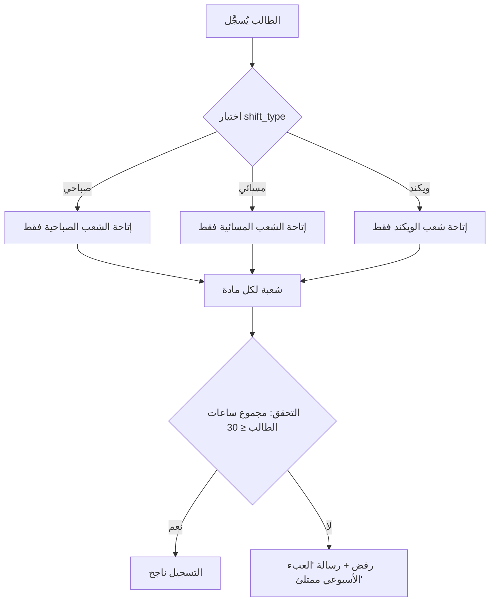
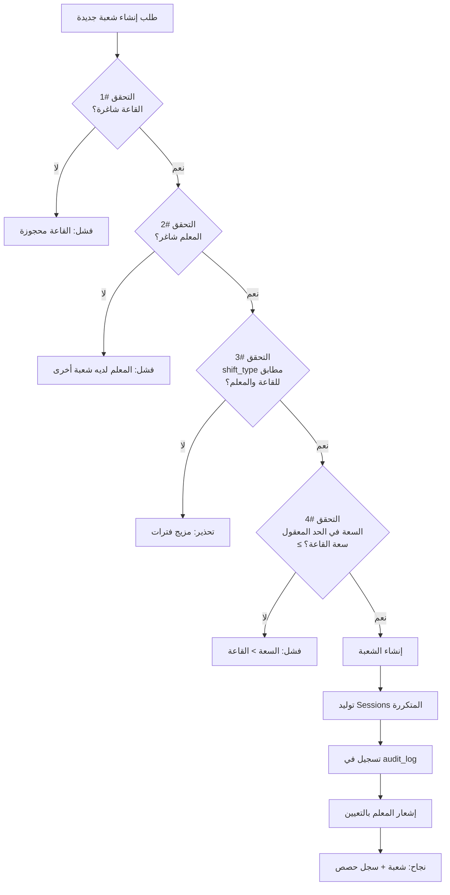
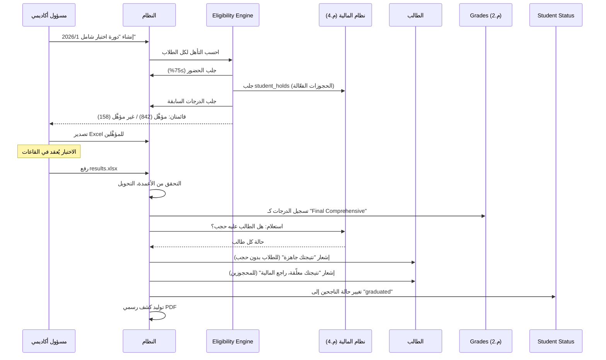
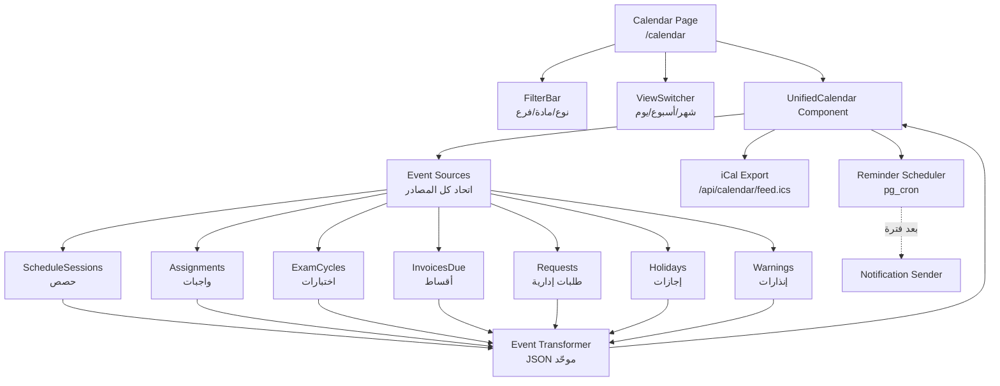
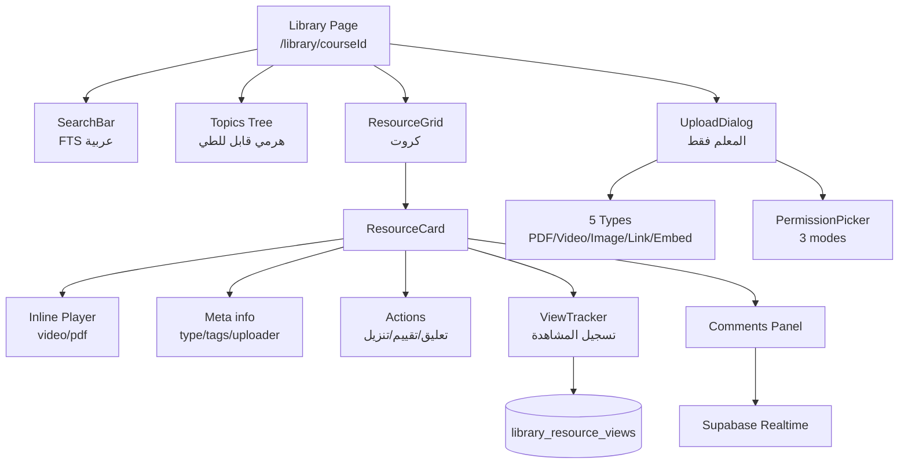
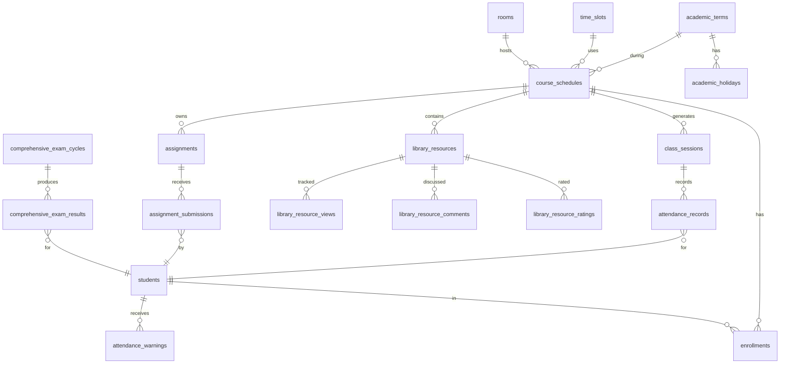
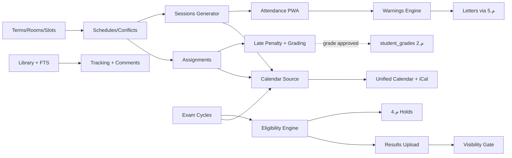

# المرحلة 7: الأكاديمي اليومي (Daily Academic Operations)

> **النوع:** مرحلة وظيفية أساسية — العمليات اليومية للمعهد
> **المدة المُقدّرة:** 6 أسابيع (30 يوم عمل) — قابلة للتمديد أسبوعاً عند ظهور تعقيدات في مهام الـ Eligibility Engine أو في كاش التقويم
> **التبعيات السابقة:** المرحلة 1 (التأسيس) + المرحلة 2 (الاختبارات + PWA الأساس + ملف المعلم) + المرحلة 3 (الطلاب والفروع) + المرحلة 4 (المالية والحجب) + المرحلة 5 (الطلبات والخطابات) + المرحلة 6 (شؤون المتدربين)
> **التبعيات اللاحقة:** المرحلة 8 (تكامل TVTC) — تستهلك بيانات الحضور والدرجات النهائية. المرحلة 9 (التقارير والأرشيف) — تحلّل كل مخرجات هذه المرحلة. المرحلة 10 (التكاملات الذكية) — تبني على المكتبة والتقويم.
> **الإصدار:** 1.0
> **التاريخ:** 2026-05-13
> **معدّ الخطة:** Senior Project Manager + Senior Solutions Architect
> **الجمهور:** المبرمج الرئيسي (Full-Stack Senior) + قائد المنتج + المعلمون كمراجعين وظيفيين

---

## 1. الملخص التنفيذي (Executive Summary)

المرحلة السابعة — **الأكاديمي اليومي (Daily Academic Operations)** — هي **القلب التشغيلي اليومي** لالنظام IIMS. بينما بنت المراحل السابقة الأساس (1)، آلة الاختبارات (2)، سجل الطلاب (3)، الحجب المالي (4)، الطلبات الإدارية (5)، وشؤون المتدربين (6) — تأتي هذه المرحلة لتُغطّي ما يحدث **كل يوم في كل قاعة**: الجدول، الحضور، الواجب، الموعد، المرجع التعليمي. هي المرحلة التي يلمسها المعلم 8 مرات يومياً، ويلمسها الطالب الموظف الحكومي 3 مرات يومياً (قبل الذهاب للدوام صباحاً، في استراحة الظهر، قبل النوم)، ويلمسها مدير الفرع كلما أراد أن يعرف "ما يجري في القاعات الآن".

المرحلة تُنفّذ **11 موديولاً فرعياً** و**4 تطويرات رئيسية** متفق عليها مع العميل: الجداول المرنة (#4) التي تستوعب الموظف الحكومي الذي يدرس بعد الدوام أو في الويكند، التقويم الموحّد (#7) الذي يجمع كل الحركة الأكاديمية والإدارية في شاشة واحدة قابلة للتصدير لـ Google Calendar، مكتبة الموارد التعليمية (#8) التي تُحوّل الفصل من ساعة قاعة إلى متعة تعلّم ذاتي (والفائدة الكبرى للطالب الموظف الذي لا يحضر كل المحاضرات)، وسجل المعلم التشغيلي (#6 جزء 3) الذي يُكمل ملف المعلم المؤسَّس في المرحلة 2.

السمة الفارقة لهذه المرحلة هي **التكامل التشعّبي**: لا يوجد موديول مستقل هنا — الجدول يُغذّي الحضور، الحضور يُغذّي الإنذارات، الإنذارات تُغذّي الحرمان، الحرمان يُغذّي حالة الطالب، حالة الطالب تتقاطع مع المالية (هل سدّد؟)، نتيجة الاختبار الشامل تتعطّل عند الحجب المالي، الواجب يدخل في الدرجات، الدرجات تدخل في التقويم، التقويم يُذكّر بالواجب، والمكتبة تُغذّي ما قبل الحصة وما بعدها. هذا التشعّب ليس صدفة — هو ما يجعل النظام **يعيش** في يوم المعلم وفي يوم الطالب بدلاً من أن يكون نموذجاً يُدخل فيه البيانات مرة في الشهر.

**التحدي الجوهري** الذي تعالجه هذه المرحلة هو **مفارقة الطالب الموظف**: نحن نخدم 1000 طالب أغلبهم موظفون حكوميون يدرسون **بعد** دوامهم. هذا يعني: (أ) لا يقدرون على حضور كل المحاضرات → نحتاج "غياب بمهمة عمل رسمية" يُسجَّل برفع خطاب من جهة العمل لا يُحسب من نسبة الحرمان؛ (ب) يحتاجون للدراسة في ساعات متأخرة → نحتاج مكتبة موارد تعمل offline على الجوال؛ (ج) جدولهم الزمني محدود → نحتاج 3 فترات (صباحي/مسائي/ويكند) كل واحدة تعمل كمسار مستقل؛ (د) قد ينسى الموظف موعد التسليم بسبب ضغط العمل → نحتاج تقويماً موحّداً يُصدّر لـ Outlook ويُرسل تذكيرات قبل ساعة.

في نهاية الأسابيع الستة، سنُسلّم نظاماً يستطيع المعلم فيه إنشاء حصة في ثلاث نقرات، أن يُحضّر 30 طالباً في 90 ثانية على الجوال offline، أن يرفع واجباً مع 5 ملفات لشُعبتين في نقرة، وأن يرى الإدارة على لوحة واحدة كل التعارضات والإنذارات والمحرومين. وسيستطيع الطالب أن يفتح تطبيقه قبل صلاة الفجر فيرى "حصة الإحصاء 4 عصراً + موعد تسليم بحث الإدارة الإثنين + اختبار نصفي الخميس + الفاتورة مستحقة بعد 5 أيام"، وأن يحفظ شرحاً لمحاضرة فاتته في مكتبة المادة لمشاهدته بعد العشاء.

هذه المرحلة هي **أكبر مرحلة وظيفية** في المشروع كله من حيث عدد الجداول الجديدة (≈ 15 جدول) وعدد الشاشات (≈ 30 شاشة) وعدد الـ Workflows (≈ 12 workflow) وعدد الـ Edge Functions (≈ 8 functions). كل تطوير في النظام بعدها — التقارير، الأرشيف، التكامل مع TVTC، الذكاء الاصطناعي — سيستند على ما نُنتجه هنا.

---

## 2. الأهداف والمخرجات (Objectives & Deliverables)

### 2.1 الأهداف الاستراتيجية

| # | الهدف | المؤشر القابل للقياس |
|---|------|----------------------|
| O1 | إدارة جدولة كاملة لـ4 فروع × 3 فترات بدون تعارضات | صفر تعارض في القاعات والمعلمين والطلاب على بيئة الـStaging بعد إدخال 1000 حصة |
| O2 | تحضير 30 طالباً في ≤ 90 ثانية على الجوال offline | اختبار آلي يُحضّر 30 طالباً بشبكة مقطوعة ويُنفّذ Sync ناجح خلال 30 ثانية بعد العودة |
| O3 | تفعيل نظام الإنذارات والحرمان التلقائي | إنذار يُولَّد خلال 5 دقائق من تجاوز نسبة الغياب، خطاب رسمي يُصدر تلقائياً عند الحرمان |
| O4 | تشغيل تدفق الواجبات الكامل (إنشاء → تسليم → تصحيح → اعتماد → ظهور) | 100% من الواجبات تظهر في التقويم وفي درجات الطالب بعد الاعتماد |
| O5 | تشغيل الاختبار الشامل النهائي مع Eligibility Engine | حساب التأهل لـ 1000 طالب يُنفَّذ في ≤ 60 ثانية ويُولّد قائمتي مؤهَّل وغير مؤهَّل |
| O6 | تشغيل التقويم الموحّد لـ4 أدوار + تصدير iCal | كل دور يرى تقويمه فقط (RLS)، تصدير iCal يُفتح في Google Calendar وOutlook ويُحدَّث live |
| O7 | تشغيل مكتبة الموارد لكل مادة مع Permissions دقيقة | المعلم يرفع ملفاً بـ 3 صلاحيات (عام/شعبة/طلاب محددين)، Tracking يُسجّل كل مشاهدة |
| O8 | استكمال ملف المعلم بسجل تشغيلي معتمد | كل معلم يرى دوره الفعلي: ساعات، حضور سجّله، واجبات صحّحها، زمن استجابته للتصحيح |
| O9 | تكامل تلقائي مع الحجب المالي (المرحلة 4) | اختبار شامل ينجح لكنه لا يظهر للطالب إذا عليه أي رصيد متأخر |
| O10 | امتثال PDPL لكل ملفات الموارد والتسليمات | تشفير at-rest، انتهاء Signed URLs خلال 5 دقائق، Audit لكل تنزيل |

### 2.2 المخرجات التقنية المحددة (Deliverables)

| # | المُخرَج | الموقع التقني | معيار القبول |
|---|----------|--------------|--------------|
| D1 | جداول الإطار الأكاديمي | Migrations `0070_*` إلى `0080_*` | كل الجداول تعمل + Constraints + Indexes |
| D2 | API كامل لإدارة الجداول | `src/server/actions/schedules/` | منع تعارضات على 3 مستويات (قاعة/معلم/طالب) |
| D3 | 3 فترات (صباحي/مسائي/ويكند) محقّقة | `time_slots` Seeded | كل فرع لديه 3 فترات بأوقات قابلة للتعديل |
| D4 | شاشة التحضير الميدانية (PWA) | `/m/attendance/[sessionId]` | تعمل offline، تُحضّر 30 طالب في ≤ 90 ثانية، Sync تلقائي |
| D5 | محرّك الإنذارات والحرمان | Edge Function `attendance-warnings` | يعمل كل ساعة، يُولّد إنذارات بثلاث عتبات (5%/10%/15%) + حرمان عند 25% |
| D6 | شاشة الواجبات الكاملة | `/teacher/assignments/*` + `/student/assignments/*` | الإنشاء→التسليم→التصحيح→الاعتماد + Late Penalty |
| D7 | الاختبار الشامل + Eligibility Engine | `/admin/comprehensive-exam/*` | حساب 1000 طالب ≤ 60s، تكامل مع المالية للحجب |
| D8 | التقويم الموحّد متعدد الأدوار | `/calendar` + Component `<UnifiedCalendar />` | 3 views، Filters، تصدير iCal، إشعارات قبل المواعيد |
| D9 | مكتبة الموارد التعليمية | `/library/[courseId]` + Storage Bucket `course-materials` | رفع 5 أنواع، 3 صلاحيات، Tracking، Comments، Rating، FTS |
| D10 | سجل المعلم التشغيلي | `/teacher/profile/operations` | يعرض ساعات + حضور + تصحيح + زمن استجابة |
| D11 | Edge Functions | `supabase/functions/{eligibility,warnings,calendar-export,response-time}` | 4 functions تعمل في الإنتاج |
| D12 | Background Jobs (pg_cron) | `cron.schedule(...)` | 5 جدولات (warning-check، reminder، archive، etc.) |
| D13 | E2E Tests | `e2e/phase7/*.spec.ts` | 25 سيناريو تغطي كل التدفقات الحرجة |
| D14 | تحديث ملف المعلم من المرحلة 2 | ALTER teacher_profiles + جداول مرتبطة | يُحسب زمن الاستجابة تلقائياً |
| D15 | iCal Feed لكل مستخدم | `/api/calendar/[userId]/feed.ics` | URL ثابت + Token، صلاحية مدى الحياة قابلة للإلغاء |
| D16 | إشعارات أكاديمية (10 أنواع) | extension of `notifications` from Phase 1 | 10 templates عربية/إنجليزية |
| D17 | Documentation تشغيلية | `docs/phase7/runbook.md` | يغطي rollback، re-run eligibility، إعادة حساب الغياب |

### 2.3 ما هو خارج نطاق هذه المرحلة (Out-of-Scope)

- ❌ **التحضير عبر GPS Geofencing** و **Photo verification** — مُؤجّل للمرحلة 10 (تحسين دقة الحضور، يتطلب اتفاقات إضافية مع العميل حول الخصوصية).
- ❌ **Smart Reschedule** (إعادة جدولة تلقائية عند تعارض) — خارج النطاق، يدوي فقط.
- ❌ **AI Auto-grading للواجبات المقالية** — التصحيح اليدوي فقط في هذه المرحلة (يُدرَس في المرحلة 10).
- ❌ **Live Video Streaming للحصص** — خارج النطاق نهائياً (المعهد حضوري).
- ❌ **Plagiarism Detection** للواجبات المسلَّمة — خارج النطاق، يُمكن إضافته في المرحلة 10.
- ❌ **التقويم المُشارك بين الطلاب (Social Calendar)** — التقويم شخصي فقط، لا مشاركة public.
- ❌ **Push Notifications على الجوال** — الإشعارات داخل التطبيق + Email فقط، Push يُؤجَّل (يتطلب توقيع تطبيق).
- ❌ **Mobile Native Apps** — قرار معماري ثابت: PWA فقط.
- ❌ **استيراد جداول من Excel** — الإدخال اليدوي + Bulk via JSON API فقط في هذه المرحلة.

---

## 3. المتطلبات السابقة (Prerequisites)

قبل بدء يوم العمل الأول، يجب أن تكون البنود التالية **متوفّرة ومُعتَمدة**:

### 3.1 المخرجات الفنية المُطلوبة من المراحل السابقة

| البند | المرحلة المنتجة | الحالة المطلوبة |
|------|-----------------|------------------|
| جدول `branches` كامل مع `working_hours` | المرحلة 3 | يحدد ساعات الفرع |
| جدول `users` + `roles` + `permissions` | المرحلة 1 | 6 أدوار قاعدية على الأقل |
| جدول `students` مع `program_id`, `shift_type`, `employment_info` | المرحلة 3 | حقول الطالب الموظف موجودة |
| جدول `teacher_profiles` (Foundation) | المرحلة 2 | الملف الأساسي للمعلم |
| نظام الحجب المالي + `student_holds` | المرحلة 4 | API `getActiveHolds(studentId)` متاحة |
| نظام الطلبات + Templates | المرحلة 5 | يمكن استدعاء `issueDocument()` لإنذار رسمي |
| PWA Foundation + IndexedDB + Service Worker | المرحلة 2 | `/m/attendance` skeleton موجود |
| `audit_log` + Triggers | المرحلة 1 | كل تغيير حساس يُسجَّل |
| `notifications` table + Realtime channel | المرحلة 1 | يمكن إرسال إشعار من Edge Function |
| Storage Buckets + Signed URLs (5 دقائق) | المرحلة 1 | بنية تحميل/تنزيل آمنة |

### 3.2 القرارات التجارية المطلوبة من العميل قبل البدء

| البند | الأولوية | المُقرِّر | الموعد المطلوب |
|------|----------|-----------|-----------------|
| **نسب الإنذار النهائية** (5/10/15%) | 🔴 حرجة | مدير الشؤون الأكاديمية | اليوم 1 |
| **نسبة الحرمان** (25%) | 🔴 حرجة | إدارة المعهد | اليوم 1 |
| **هل "الاعتذار" يُحسب من الغياب أم لا** | 🟠 عالية | اللائحة الأكاديمية | اليوم 2 |
| **شروط التأهل للاختبار الشامل** | 🔴 حرجة | إدارة المعهد + TVTC | اليوم 3 |
| **سياسة Late Penalty** (نسبة الخصم لكل يوم تأخير) | 🟠 عالية | الأكاديمية | اليوم 5 |
| **أسماء القاعات لكل فرع وسعتها** | 🟠 عالية | مدراء الفروع | اليوم 4 |
| **قائمة المواد والـ Programs الكاملة** | 🔴 حرجة | الأكاديمية | اليوم 2 |
| **توقيتات الفترات الفعلية** (هل صباحي يبدأ 8 أو 9؟) | 🟠 عالية | إدارة المعهد | اليوم 3 |
| **اعتماد تصنيف "غياب بمهمة عمل رسمية"** | 🔴 حرجة | الأكاديمية (لأنه خروج عن اللائحة) | اليوم 2 |
| **مزوّد البريد** (هل Resend متاح للإشعارات؟) | 🟡 متوسطة | فريق IT | اليوم 7 |
| **حدود حجم الملفات للمكتبة** (مثال: 500MB للفيديو؟) | 🟡 متوسطة | فريق IT | اليوم 10 |

### 3.3 الأدوات والاشتراكات الإضافية لهذه المرحلة

| الأداة | الغرض | الإصدار/الإعداد |
|--------|------|------------------|
| `node-ical` | توليد ملفات iCal بمواصفة RFC 5545 | 0.18+ |
| `pdfkit` (موجود من المرحلة 5) | لتوليد خطاب الإنذار | استخدام Template موحّد |
| `rrule` | لتمثيل التكرار الأسبوعي للحصص | 2.8+ |
| `@radix-ui/react-popover` | لـ Calendar Event Popover | latest |
| `react-big-calendar` أو بناء مخصص | للـ Calendar UI | TBD في يوم 1 |
| `pg_cron` (Supabase Extension) | جدولة الـ Background Jobs | تفعيل في Supabase Dashboard |
| `pg_trgm` + `tsvector` | للبحث في المكتبة | تفعيل في Migration |
| `ffprobe` (server-side) | استخراج بيانات الفيديو للمكتبة | عبر Edge Function أو خارج |
| Resend / SendGrid API Key | إرسال إشعارات البريد | يُكمل المرحلة 1 |

### 3.4 المعارف الإلزامية للمبرمج قبل البدء

> هذه ليست خيارات — هي **شروط مسبقة معرفية** لتجنّب إعادة العمل:

- **PostgreSQL Triggers + Generated Columns** — للزمن المنقضي والإنذارات.
- **PostgreSQL Exclusion Constraints** (`btree_gist`) — لمنع تعارض الحجوزات (essential!).
- **Row-Level Security مع `using` و `with check`** بكفاءة — لعزل البيانات بين المعلمين.
- **IndexedDB + Background Sync** — للحضور offline (موجود من المرحلة 2 لكن نُكمله).
- **iCalendar RFC 5545** — VEVENT, VTIMEZONE, RRULE, EXDATE, METHOD:PUBLISH.
- **Supabase Edge Functions Cold Start optimization** — للـ Eligibility Engine.
- **React Server Components + Suspense Streaming** — لـ Calendar اللي قد يعرض 200 حدث.
- **PostgreSQL FTS بالعربية** (`arabic` config أو `simple` مع `unaccent`) — للمكتبة.

---

## 4. الموديولات الفرعية (Sub-Modules)

تنقسم هذه المرحلة إلى **11 موديول فرعي** متسلسل ومترابط. كل موديول يستند إلى ما قبله ويُمهّد لما بعده.

### 4.1 إدارة الفصول الدراسية والإطار الزمني (Academic Terms & Time Frame)

#### 4.1.1 الوصف

الإطار الزمني هو **الجذر** الذي تتفرّع منه كل الجداول والحصص والاختبارات والإجازات. كل عمل أكاديمي في النظام مرتبط بفصل دراسي محدد (Term). الفصل قد يكون "الفصل الأول 1447" أو "الفصل الصيفي 2026" — ويحدد بدقة بداية ونهاية كل نشاط أكاديمي.

#### 4.1.2 User Stories

- **US-7.1.1** كمدير شؤون أكاديمية، أريد إنشاء فصل دراسي جديد بتاريخ بداية ونهاية ومدة الإجازات، لأبني عليه باقي الجداول.
- **US-7.1.2** كمدير، أريد قفل فصل قديم بعد انتهائه، فلا يُمكن إنشاء حصص فيه أو تعديل بيانات حضور تاريخية بدون موافقة Super Admin.
- **US-7.1.3** كنظام، أريد رفض إنشاء حصة في تاريخ خارج نطاق فصل دراسي مفتوح.
- **US-7.1.4** كطالب، أريد رؤية بياناتي مفصولة حسب الفصل الدراسي.

#### 4.1.3 المتطلبات التقنية

| البند | المواصفة |
|------|----------|
| دعم الفصول المتداخلة | فصل مسائي قد يبدأ في منتصف الفصل الصباحي ← مسموح بشرط عدم التعارض بنفس الطالب |
| الإجازات الرسمية | تُحفظ في جدول `academic_holidays` مرتبط بـ Term — لا تُنشأ فيها حصص |
| الفصول السابقة | تظل في DB قابلة للقراءة، مرفوضة الكتابة |

#### 4.1.4 الـ APIs / Server Actions

```typescript
// src/server/actions/academic-terms/create-term.ts
'use server';
export async function createTerm(input: CreateTermInput): Promise<Term> {
  await assertPermission('academic_terms:create');
  // 1) منع التداخل في نفس الفرع ونفس shift_type
  // 2) إنشاء academic_holidays الموحّدة (رمضان، عيد، يوم وطني...)
  // 3) audit_log
}
```

#### 4.1.5 الاختبارات

- إنشاء فصل صباحي وفصل مسائي بنفس التاريخ → ينجح.
- إنشاء فصلين متداخلين بنفس shift في نفس الفرع → يفشل.
- محاولة إضافة حصة في تاريخ خارج Term → 400.

---

### 4.2 الفترات الزمنية والقاعات (Time Slots & Rooms)

#### 4.2.1 الوصف

النواة العملية للجدولة. يحدد كل فرع **القاعات المتاحة** (سعة، نوع، تجهيزات) و**الفترات الزمنية القياسية** (Slots) التي ستتكرر أسبوعياً. الفترة الواحدة هي قطعة زمنية موحّدة (مثلاً: السبت 8:00-9:30) قابلة لحجز قاعة + معلم + طلاب فيها.

#### 4.2.2 User Stories

- **US-7.2.1** كمدير فرع، أريد تسجيل 12 قاعة بأرقامها وسعاتها (15-40 طالب) وتجهيزاتها (سبورة ذكية، حاسبات، مختبر).
- **US-7.2.2** كمدير، أريد تعريف 3 فترات يومية:
  - **صباحي:** 8:00 AM - 12:00 PM (4 ساعات، حصتان × 90 دقيقة + استراحة)
  - **مسائي:** 4:00 PM - 10:00 PM (6 ساعات، 3 حصص × 90 دقيقة + استراحتان)
  - **ويكند (جمعة/سبت):** 9:00 AM - 9:00 PM (مرونة عالية، تركيز على الموظفين)
- **US-7.2.3** كنظام، أريد منع حجز قاعة لحصتين في نفس الوقت (Exclusion Constraint على مستوى DB).
- **US-7.2.4** كنظام، أريد عرض إشغال القاعات في تقرير لإيجاد قاعات شاغرة سريعاً.

#### 4.2.3 المتطلبات التقنية الخاصة

- **`btree_gist` extension** ضروري لـ Exclusion Constraints (تمنع حجز نفس القاعة في فترة متداخلة).
- **`tstzrange`** بدلاً من `start_time` و `end_time` المنفصلين — يُسهّل التداخل.

#### 4.2.4 الاختبارات

- محاولة حجز "قاعة A" يوم الأحد 8:00-9:30 وحصة أخرى 9:00-10:30 → ترفض على مستوى DB.
- استعلام "ما القاعات الشاغرة في فرع 1 يوم الإثنين 4:00-5:30؟" → يعود في < 50ms.

---

### 4.3 جداول المواد والشُعَب (Course Schedules & Sections)

#### 4.3.1 الوصف

ربط ثلاثي بين **مادة + شعبة + معلم + قاعة + سلسلة من Time Slots**. الشعبة هي نسخة من المادة لمجموعة طلاب محددة. مثلاً: "الإحصاء 101 — شعبة A1 الصباحي" مقابل "الإحصاء 101 — شعبة B2 المسائي".

#### 4.3.2 الجداول المرنة (التطوير #4) ⭐

هذه نقطة محورية: الطالب يُسجَّل في **شعبة واحدة فقط لكل مادة**، والشعبة لها `shift_type` ثابت. هذا يضمن أن طالب صباحي لا يجد نفسه فجأة في حصة مسائية. لكن **المعلم** قد يكون مرناً (يدرّس صباحي + مسائي).



#### 4.3.3 User Stories

- **US-7.3.1** كمدير شؤون أكاديمية، أريد إنشاء "شعبة" بربط (مادة + معلم + قاعة + slot المتكرر + سعة قصوى).
- **US-7.3.2** كنظام، أريد **منع تعارض المعلم** (نفس المعلم لا يدرّس شعبتين في نفس الوقت ولو في فرعين مختلفين).
- **US-7.3.3** كنظام، أريد **منع تعارض الطالب** (طالب لا يُسجَّل في شعبتين متداخلتين في الوقت).
- **US-7.3.4** كنظام، أريد **منع تعارض القاعة** (تحت سيطرة Exclusion Constraint).
- **US-7.3.5** كمدير، أريد توليد **الحصص الفعلية (Sessions)** تلقائياً من الشعبة + الفصل: لو الشعبة "السبت 8:00-9:30" والفصل 16 أسبوعاً، يُولَّد 16 جلسة بتواريخ محددة (مع استثناء الإجازات).

#### 4.3.4 مخطط تدفق منع التعارض



---

### 4.4 الحضور المتقدم (Advanced Attendance) — يبني على PWA من المرحلة 2

#### 4.4.1 الوصف

في المرحلة 2 بُنيت **بُنية الحضور Offline** (IndexedDB + Service Worker + شاشة `/m/attendance` skeleton). هنا نُكمل: **القاعدة الفعلية للحضور** في DB، **الأنواع التفصيلية** (حاضر/غائب/متأخر/معتذر/مهمة رسمية)، **الحساب التلقائي للنِسَب**، **محاكاة المُحاضرة** (المعلم يضغط زر "ابدأ الحصة" → الـ Session تُفتح للتحضير لمدة 15 دقيقة قبل وبعد الموعد).

#### 4.4.2 User Stories

- **US-7.4.1** كمعلم، أريد فتح Session على الجوال ورؤية قائمة الطلاب المسجلين، فأنقر بجانب اسم كل واحد على (✔ حاضر / ✖ غائب / ⏰ متأخر / 📝 معتذر / 🏛 مهمة عمل).
- **US-7.4.2** كموظف حكومي طالب، أريد رفع خطاب رسمي PDF من جهة عملي يثبت غيابي بمهمة رسمية، فلا يُحسب من نسبة الحرمان.
- **US-7.4.3** كمعلم، أريد التحضير حتى وأنا offline (المعهد به مناطق تغطية ضعيفة في الطوابق العلوية)، ثم Sync تلقائي عند العودة للشبكة.
- **US-7.4.4** كمدير، أريد تعديل سجل حضور خاطئ مع تسجيل السبب في Audit Log.
- **US-7.4.5** كنظام، أريد قفل التحضير بعد 48 ساعة من انتهاء الحصة (لتجنّب تعديلات متأخرة بدون مبرر).

#### 4.4.3 التطوير الخاص بالموظفين الحكوميين

> **تصنيف "غياب بمهمة عمل رسمية" (`work_assignment`)** — هذا تصنيف أُضيف خصيصاً لـ 1000 طالب موظف:
> - يحتاج **رفع PDF** كخطاب رسمي من جهة العمل.
> - **لا يُحسب** من نسبة الحرمان (إذا اعتمده المسؤول الأكاديمي).
> - يُسجَّل في حالة "pending_approval" حتى يعتمده المسؤول.
> - الحد الأقصى: 30% من جلسات المادة (إذا تجاوز، يُحوَّل تلقائياً للأكاديمي للمراجعة الفردية).

#### 4.4.4 الاختبارات

- محاكاة شبكة مقطوعة + تحضير 30 طالب → نجاح في 90s + Sync ناجح بعد العودة.
- محاكاة Sync Conflict (طالب حضّره معلمان) → الأحدث يفوز + إشعار للأدمن.
- رفع PDF "غياب مهمة" → ينتظر اعتماد → يُحتسب فقط بعد الاعتماد.

---

### 4.5 نظام الإنذارات والحرمان (Warnings & Deprivation)

#### 4.5.1 الوصف

محرّك ذكي يعمل **كل ساعة** (pg_cron) يحسب نسبة الغياب لكل طالب في كل مادة ويُولّد إنذارات + يُغيّر حالة الطالب تلقائياً عند تجاوز عتبة الحرمان.

#### 4.5.2 العتبات الافتراضية (قابلة للتعديل في `app_settings`)

| العتبة | النسبة | الإجراء التلقائي |
|--------|--------|------------------|
| تنبيه ودي (Friendly) | 5% غياب | إشعار in-app فقط |
| إنذار أول (Warning 1) | 10% | إشعار + Email + خطاب PDF رسمي |
| إنذار ثاني (Warning 2) | 15% | إشعار + Email + خطاب PDF + إشعار جهة العمل (إن مفعّل) |
| إنذار ثالث وأخير (Warning 3) | 20% | إشعار + Email + خطاب PDF + استدعاء لمقابلة |
| الحرمان (Deprivation) | 25% | تغيير الحالة إلى `deprived_attendance` + خطاب رسمي + منع دخول الاختبار |

#### 4.5.3 User Stories

- **US-7.5.1** كنظام، أريد حساب نسبة الغياب لكل (طالب × مادة) كل ساعة، فإذا تجاوزت عتبة، أُصدر إنذاراً.
- **US-7.5.2** كنظام، أريد توليد **خطاب إنذار رسمي PDF** عبر Template من المرحلة 5، يحتوي: اسم الطالب، المادة، نسبة الغياب، أيام الغياب التفصيلية، إجراءات التصحيح، تاريخ المراجعة الأخير.
- **US-7.5.3** كمسؤول أكاديمي، أريد تجميد إنذار يدوياً (مثلاً اعتذار قبلته) فلا يُحسب من العتبة.
- **US-7.5.4** كنظام، أريد عند الحرمان (25%): تغيير `students.status = deprived_attendance` + إضافة Hold في `student_holds` (المرحلة 4) فيمنع الطالب من دخول الاختبار الشامل + إصدار خطاب رسمي.

#### 4.5.4 Edge Function: `attendance-warnings`

```typescript
// supabase/functions/attendance-warnings/index.ts
import { serve } from 'std/server';
import { createClient } from '@supabase/supabase-js';

serve(async () => {
  const sb = createClient(/* service role */);
  const now = new Date().toISOString();
  // 1) Calculate absence ratio per (student, course) for active term
  const { data: stats } = await sb.rpc('calc_absence_ratios', { for_term_id: 'auto' });
  // 2) For each above threshold without prior warning at this level → emit
  for (const s of stats || []) {
    const newLevel = determineLevel(s.ratio); // 'friendly'|'w1'|'w2'|'w3'|'deprived'
    const prev = await fetchLastWarning(sb, s.student_id, s.course_id);
    if (newLevel === prev?.level) continue;
    await emitWarning(sb, s, newLevel);
    if (newLevel === 'deprived') {
      await deprive(sb, s.student_id, s.course_id);
    }
  }
});
```

---

### 4.6 الواجبات (Assignments)

#### 4.6.1 الوصف

تدفق دائري: **المعلم يُنشئ** الواجب → **يرفع ملفات** و**يحدد موعد التسليم** → **الطالب يرى** الواجب في تقويمه → **يُسلّم** قبل الموعد أو بعده (Late Penalty) → **المعلم يصحح** ويُضيف ملاحظات → **يعتمد** الدرجة → **تظهر** للطالب في درجاته (المرحلة 2 وهي درجات).

#### 4.6.2 User Stories

- **US-7.6.1** كمعلم، أريد إنشاء واجب من شاشة المادة (عنوان، وصف، عدد الدرجات، موعد التسليم، ملفات مرفقة، Rubric اختياري).
- **US-7.6.2** كمعلم، أريد رفع 5 ملفات بأنواع مختلفة (PDF، DOCX، صور، فيديو، روابط YouTube).
- **US-7.6.3** كطالب، أريد رؤية الواجبات النشطة مرتّبة بـ moest urgent (الأقرب للموعد أولاً).
- **US-7.6.4** كطالب، أريد رفع تسليمي (ملف أو ملفات) + كتابة تعليق + إرسال.
- **US-7.6.5** كنظام، أريد تطبيق Late Penalty تلقائياً عند التسليم بعد الموعد:
  - 1-3 ساعات تأخير → خصم 10%
  - 3-24 ساعة → خصم 25%
  - 1-3 أيام → خصم 50%
  - > 3 أيام → غير مقبول (إلا بقرار يدوي)
- **US-7.6.6** كمعلم، أريد فتح تسليم، رؤية الملفات، كتابة درجة + ملاحظات + اعتماد.
- **US-7.6.7** كنظام، عند الاعتماد، أُسجّل الدرجة في `student_grades` (المرحلة 2) لتظهر للطالب في تقريره.

#### 4.6.3 سياسة الملفات

- الحد الأقصى لحجم الملف الواحد: 50MB
- الحد الأقصى لمجموع تسليم طالب: 100MB
- أنواع مسموحة: PDF, DOCX, XLSX, PPTX, ZIP, JPG, PNG, MP4 (< 100MB)
- Storage Bucket مخصص: `assignment-submissions` (private)
- Signed URL: 5 دقائق

---

### 4.7 الاختبار الشامل النهائي (Comprehensive Final Exam)

#### 4.7.1 الوصف

موديول مستقل **منفصل تماماً** عن منصة الاختبارات في المرحلة 2 (التي تختبر بشكل دوري). الاختبار الشامل هو الذي يحدد التخرج: يُعقد **خارج النظام** (في القاعات بمراقبين)، وتُرفع نتائجه بـ Excel. الميزة الذكية هي **Eligibility Engine** الذي يحدد قبل الاختبار من له حق الدخول.

#### 4.7.2 User Stories

- **US-7.7.1** كمدير شؤون أكاديمية، أريد إنشاء "دورة اختبار شامل" بتاريخ ومادة (أو مواد متعددة) وفروع المشاركة.
- **US-7.7.2** كـ Eligibility Engine، أريد إنتاج قائمتين: (أ) **المؤهَّلون**: الطلاب الذين يستوفون [حضور ≥ 75% في كل المواد] AND [سداد كامل] AND [اجتياز كل المتطلبات السابقة]. (ب) **غير المؤهَّلين**: مع سبب التعطّل لكل طالب.
- **US-7.7.3** كمدير، أريد تصدير قائمة المؤهَّلين كـ Excel لإرسالها للقاعات.
- **US-7.7.4** كمدير، أريد رفع ملف نتائج Excel (رقم الطالب → الدرجة) بعد إجراء الاختبار.
- **US-7.7.5** كنظام، أريد ربط الدرجة المرفوعة بـ `student_grades` كـ "Final Comprehensive".
- **US-7.7.6** كنظام، إذا الطالب **نجح** (≥ 60%) + **لا حجوزات مالية** → تغيير الحالة إلى `graduated` تلقائياً.
- **US-7.7.7** كنظام، إذا عليه حجب مالي → **منع ظهور النتيجة** له (يرى رسالة "نتيجتك متوفرة بعد تسوية الرصيد").

#### 4.7.3 Sequence Diagram للاختبار الشامل



#### 4.7.4 Eligibility Engine — TypeScript

```typescript
// src/server/eligibility/comprehensive-exam.ts
type EligibilityReason =
  | { ok: true }
  | { ok: false; code: 'low_attendance'; details: { course_id: string; ratio: number } }
  | { ok: false; code: 'financial_hold'; details: { hold_id: string; amount: number } }
  | { ok: false; code: 'missing_grades'; details: { courses: string[] } }
  | { ok: false; code: 'deprived'; details: { since: string } }
  | { ok: false; code: 'withdrawn' };

export async function checkEligibility(
  studentId: string,
  examCycleId: string
): Promise<EligibilityReason> {
  const student = await getStudent(studentId);
  if (student.status === 'withdrawn') return { ok: false, code: 'withdrawn' };
  if (student.status === 'deprived_attendance') {
    return { ok: false, code: 'deprived', details: { since: student.status_changed_at } };
  }
  // 1) Financial holds
  const holds = await getActiveHolds(studentId);
  if (holds.length > 0) {
    return { ok: false, code: 'financial_hold', details: holds[0] };
  }
  // 2) Attendance ratio per course (must be ≥ 75% for ALL)
  const ratios = await getAttendanceRatiosPerCourse(studentId, examCycleId);
  const lowCourse = ratios.find(r => r.ratio < 0.75);
  if (lowCourse) {
    return { ok: false, code: 'low_attendance', details: lowCourse };
  }
  // 3) All previous courses must have passing grade
  const missingGrades = await getMissingPassingGrades(studentId, examCycleId);
  if (missingGrades.length > 0) {
    return { ok: false, code: 'missing_grades', details: { courses: missingGrades } };
  }
  return { ok: true };
}

// Bulk: 1000 students in < 60s
export async function runEligibilityBatch(
  examCycleId: string
): Promise<{ eligible: string[]; ineligible: Array<{ student_id: string; reason: EligibilityReason }> }> {
  const allStudents = await getAllActiveStudentsInCycle(examCycleId);
  const eligible: string[] = [];
  const ineligible: Array<any> = [];
  // Process in chunks of 100 with parallel SQL queries
  for (const chunk of chunks(allStudents, 100)) {
    const results = await Promise.all(chunk.map(s => checkEligibility(s.id, examCycleId)));
    chunk.forEach((s, i) => {
      const r = results[i];
      if (r.ok) eligible.push(s.id);
      else ineligible.push({ student_id: s.id, reason: r });
    });
  }
  return { eligible, ineligible };
}
```

---

### 4.8 التقويم الموحّد (Unified Calendar) — التطوير #7 ⭐

#### 4.8.1 الوصف

شاشة **واحدة** تجمع كل ما له تاريخ ووقت في حياة الطالب أو المعلم أو الإداري:
- حصص الجدول
- مواعيد الاختبارات (دورية + شامل)
- مواعيد تسليم الواجبات
- مواعيد الطلبات الإدارية (مقابلات، تسجيل)
- الإجازات الرسمية
- مواعيد الدفع (المرحلة 4)
- الإنذارات والحرمان (المرحلة 4 + 7)

#### 4.8.2 User Stories

- **US-7.8.1** كطالب، أريد فتح شاشة `/calendar` فأرى كل الأحداث الخاصة بي في view شهري بألوان مختلفة حسب النوع.
- **US-7.8.2** كطالب، أريد تبديل عرض إلى **أسبوع** أو **يوم** بنقرة واحدة.
- **US-7.8.3** كطالب، أريد Filter حسب النوع (أُخفي مثلاً "الواجبات" وأُبقي "الحصص").
- **US-7.8.4** كمعلم، أريد رؤية حصصي + اختبارات مادتي + الواجبات التي وزّعتها.
- **US-7.8.5** كإداري، أريد رؤية كل شيء.
- **US-7.8.6** كأي مستخدم، أريد رابط iCal ثابت أضعه في Google Calendar فيُحدَّث تلقائياً.
- **US-7.8.7** كأي مستخدم، أريد تذكيرات قبل المواعيد بأوقات قابلة للضبط (يوم/ساعة/15 دقيقة).

#### 4.8.3 Component Diagram للتقويم



#### 4.8.4 React Component (مختصر)

```tsx
// src/features/calendar/components/UnifiedCalendar.tsx
'use client';

import { useState, useMemo } from 'react';
import { useCalendarEvents } from '../hooks/use-calendar-events';

type EventType =
  | 'session' | 'assignment' | 'exam' | 'invoice'
  | 'request' | 'holiday' | 'warning';

type CalendarEvent = {
  id: string;
  type: EventType;
  title: string;
  start: Date;
  end: Date;
  color: string;
  meta: Record<string, unknown>;
};

export function UnifiedCalendar({ userId, role }: Props) {
  const [view, setView] = useState<'month' | 'week' | 'day'>('week');
  const [filters, setFilters] = useState<Set<EventType>>(
    new Set(['session', 'assignment', 'exam', 'invoice'])
  );
  const { events, isLoading } = useCalendarEvents({ userId, role });

  const visibleEvents = useMemo(
    () => events.filter(e => filters.has(e.type)),
    [events, filters]
  );

  if (isLoading) return <CalendarSkeleton />;

  return (
    <div className="flex flex-col gap-3" dir="rtl">
      <header className="flex justify-between items-center">
        <ViewSwitcher value={view} onChange={setView} />
        <FilterBar filters={filters} onChange={setFilters} />
        <ExportButton userId={userId} />
      </header>

      {view === 'month' && <MonthView events={visibleEvents} />}
      {view === 'week' && <WeekView events={visibleEvents} />}
      {view === 'day' && <DayView events={visibleEvents} />}

      <EventLegend />
    </div>
  );
}
```

#### 4.8.5 iCal Feed Endpoint

```typescript
// src/app/api/calendar/[token]/feed.ics/route.ts
import ical from 'node-ical';
import { createEvents } from 'ics';

export async function GET(req: Request, { params }: { params: { token: string } }) {
  const userId = await verifyCalendarToken(params.token);
  if (!userId) return new Response('Forbidden', { status: 403 });
  const events = await fetchAllCalendarEvents(userId);
  const icsEvents = events.map(e => ({
    start: [e.start.getFullYear(), e.start.getMonth() + 1, e.start.getDate(), e.start.getHours(), e.start.getMinutes()],
    duration: { hours: Math.round((e.end.getTime() - e.start.getTime()) / 3600000) },
    title: e.title,
    description: e.description ?? '',
    location: e.location ?? '',
    uid: `${e.type}-${e.id}@ruwwadattaa.sa`,
    categories: [e.type],
  }));
  const { value, error } = createEvents(icsEvents);
  if (error) return new Response('Error', { status: 500 });
  return new Response(value, {
    headers: { 'Content-Type': 'text/calendar; charset=utf-8' },
  });
}
```

---

### 4.9 مكتبة الموارد التعليمية (Course Library) — التطوير #8 ⭐

#### 4.9.1 الوصف

مكتبة لكل **مادة** يرفع فيها المعلم: PDF، فيديوهات، روابط، صور، تنظيم بمواضيع وtags، صلاحيات دقيقة، tracking، تعليقات، تقييم، بحث Full Text بالعربية. هذه أكبر فائدة للطالب الموظف الذي يدرس بعد الدوام.

#### 4.9.2 User Stories

- **US-7.9.1** كمعلم، أريد رفع ملف PDF لمحاضرة، تصنيفه بـ "الموضوع: الإحصاء الوصفي"، إضافة وسوم `["إحصاء", "وصفي", "أمثلة"]`.
- **US-7.9.2** كمعلم، أريد لصق رابط YouTube، فيُظهر النظام معاينة (Thumbnail + العنوان).
- **US-7.9.3** كمعلم، أريد تحديد صلاحية:
  - **عام**: كل طلاب المادة في كل الشُعَب يرونه.
  - **شعبة**: طلاب شعبة واحدة فقط (مثلاً ملخص يخص شعبة بعينها).
  - **طلاب محددون**: لطلاب 3-5 معدوين فقط (موارد تقوية).
- **US-7.9.4** كطالب، أريد فتح المكتبة، البحث عن "الانحراف المعياري"، فيظهر كل المواد التي تحتوي على هذا المصطلح.
- **US-7.9.5** كطالب، أريد إضافة تعليق أو سؤال على المورد، والمعلم يرد.
- **US-7.9.6** كطالب، أريد تقييم المورد (👍 / 👎) ليعرف المعلم أيهم مفيد.
- **US-7.9.7** كمعلم، أريد تقرير: من شاهد ماذا، كم مرة، متى آخر مشاهدة؟
- **US-7.9.8** كنظام، أريد البحث Full Text بالعربية (إزالة التشكيل + التطبيع) في عناوين وأوصاف الموارد.

#### 4.9.3 Component Diagram للمكتبة



#### 4.9.4 سياسة الـ Storage

- Bucket: `course-materials` (private)
- Path: `{branch_id}/{course_id}/{resource_id}/{filename}`
- Signed URL: 5 دقائق (الفيديوهات الكبيرة → Streaming Range Headers)
- الحدود:
  - PDF: 50MB
  - Image: 10MB
  - Video: 500MB (أو رابط YouTube/خارجي)
  - Audio: 100MB
- Audit: كل **رفع** يُسجَّل، كل **تنزيل** يُسجَّل (لـ PDPL وتقارير الاستخدام).

---

### 4.10 سجل المعلم التشغيلي — التطوير #6 جزء 3

#### 4.10.1 الوصف

يُكمل ملف المعلم المُؤسَّس في المرحلة 2. يُضيف **البيانات التشغيلية المُحسوبة تلقائياً**:
- إجمالي الساعات المُدرَّسة في الفصل/المسيرة
- عدد الجلسات التي حضّرها (وعدد التحضيرات المتأخرة)
- عدد الواجبات الموزَّعة + المُصحَّحة
- **زمن الاستجابة للتصحيح** (متوسط الزمن بين تسليم الطالب واعتماد المعلم) — مؤشر جودة
- الإنذارات التي أصدرها
- التقييم المتوسط من الطلاب (إن مفعّل)

#### 4.10.2 User Stories

- **US-7.10.1** كمعلم، أريد لوحتي الشخصية تعرض إحصائياتي الحالية: 47 جلسة منذ بداية الفصل، 12 واجباً وزّعتُ، متوسط زمن تصحيحي 2.3 يوم.
- **US-7.10.2** كمدير، أريد ترتيب المعلمين حسب زمن الاستجابة لتحديد من يحتاج دعماً.
- **US-7.10.3** كنظام، أريد حساب زمن الاستجابة كل ليلة عبر pg_cron.

#### 4.10.3 منطق زمن الاستجابة

```sql
-- في view مادي (Materialized View) يُحدَّث ليلاً
CREATE MATERIALIZED VIEW teacher_response_metrics AS
SELECT
  a.teacher_id,
  COUNT(asu.id) AS submissions_graded,
  AVG(EXTRACT(EPOCH FROM (asu.graded_at - asu.submitted_at)) / 3600) AS avg_response_hours,
  PERCENTILE_CONT(0.5) WITHIN GROUP (ORDER BY EXTRACT(EPOCH FROM (asu.graded_at - asu.submitted_at))/3600) AS p50_response_hours
FROM assignments a
JOIN assignment_submissions asu ON asu.assignment_id = a.id
WHERE asu.graded_at IS NOT NULL
  AND asu.submitted_at > NOW() - INTERVAL '6 months'
GROUP BY a.teacher_id;
```

---

### 4.11 الإشعارات الأكاديمية والاندماج

#### 4.11.1 الأنواع العشرة من الإشعارات

| # | نوع الإشعار | المُحفِّز | المُستلِم | التوقيت |
|---|------------|----------|----------|---------|
| 1 | حصة قريبة | session.start بعد ساعة | الطالب + المعلم | -60 min |
| 2 | تسجيل غياب | attendance_record.status='absent' | الطالب | فور التسجيل |
| 3 | اقتراب الحرمان | absence_ratio >= 20% | الطالب + ولي الأمر إن مفعّل | فوري |
| 4 | إصدار إنذار رسمي | warning issued | الطالب | فوري + Email |
| 5 | واجب جديد | assignment published | كل طلاب الشعبة | فوري |
| 6 | اقتراب موعد تسليم | assignment.due_at بعد 24h | الطلاب الذين لم يسلّموا | -24h, -1h |
| 7 | درجة معتمدة | grade.status='approved' | الطالب | فوري |
| 8 | تسليم جديد للمعلم | submission received | المعلم | فوري |
| 9 | تصحيح متراكم | > 5 submissions ungraded | المعلم | يومياً 8 ص |
| 10 | نتيجة شامل جاهزة | comprehensive_result | الطالب (إن بلا حجب) | فوري |

#### 4.11.2 الاندماج مع المراحل السابقة

| التدفق | المرحلة المُورِّدة | الواجهة |
|--------|-------------------|---------|
| الجداول → التقويم | 7 → 7 | داخلي |
| الواجبات → الدرجات → الاعتماد → ظهور | 7 → 2 | `student_grades` |
| نتائج الشامل → الحجب → منع ظهور | 7 → 4 | `getActiveHolds` |
| الإنذارات → خطابات PDF | 7 → 5 | `issueDocument` |
| الحرمان → حالة الطالب | 7 → 3 | State Machine |
| بيانات الحضور → تقارير | 7 → 9 (لاحقاً) | views |
| المكتبة → السجل الإلكتروني → AI Search | 7 → 10 (لاحقاً) | preview |

---

## 5. تعديلات نموذج البيانات (Data Model Changes)

### 5.1 المخطط العلائقي (ER Diagram)



### 5.2 جدول `academic_terms`

```sql
CREATE TABLE academic_terms (
    id              UUID PRIMARY KEY DEFAULT gen_random_uuid(),
    branch_id       UUID NOT NULL REFERENCES branches(id) ON DELETE RESTRICT,
    code            TEXT NOT NULL, -- "2026-T1-MORN" etc
    name_ar         TEXT NOT NULL,
    name_en         TEXT,
    start_date      DATE NOT NULL,
    end_date        DATE NOT NULL,
    shift_type      TEXT NOT NULL CHECK (shift_type IN ('morning','evening','weekend','mixed')),
    status          TEXT NOT NULL DEFAULT 'planned'
                    CHECK (status IN ('planned','active','closed','archived')),
    locked_at       TIMESTAMPTZ,
    created_by      UUID REFERENCES users(id),
    created_at      TIMESTAMPTZ NOT NULL DEFAULT NOW(),
    UNIQUE (branch_id, code),
    CHECK (end_date > start_date)
);

CREATE INDEX idx_academic_terms_branch_active ON academic_terms(branch_id) WHERE status = 'active';
```

### 5.3 جدول `academic_holidays`

```sql
CREATE TABLE academic_holidays (
    id              UUID PRIMARY KEY DEFAULT gen_random_uuid(),
    term_id         UUID NOT NULL REFERENCES academic_terms(id) ON DELETE CASCADE,
    name_ar         TEXT NOT NULL,
    name_en         TEXT,
    holiday_type    TEXT NOT NULL DEFAULT 'official'
                    CHECK (holiday_type IN ('official','religious','semester_break','custom')),
    date_range      DATERANGE NOT NULL,
    affects_attendance BOOLEAN NOT NULL DEFAULT FALSE,
    created_at      TIMESTAMPTZ NOT NULL DEFAULT NOW(),
    EXCLUDE USING gist (term_id WITH =, date_range WITH &&)
);

CREATE INDEX idx_holidays_term ON academic_holidays(term_id);
```

### 5.4 جدول `time_slots`

```sql
CREATE TABLE time_slots (
    id              UUID PRIMARY KEY DEFAULT gen_random_uuid(),
    branch_id       UUID NOT NULL REFERENCES branches(id),
    shift_type      TEXT NOT NULL CHECK (shift_type IN ('morning','evening','weekend')),
    day_of_week     SMALLINT NOT NULL CHECK (day_of_week BETWEEN 0 AND 6), -- 0=Sun
    start_time      TIME NOT NULL,
    end_time        TIME NOT NULL,
    is_break        BOOLEAN NOT NULL DEFAULT FALSE,
    label_ar        TEXT,
    sort_order      SMALLINT NOT NULL,
    created_at      TIMESTAMPTZ NOT NULL DEFAULT NOW(),
    CHECK (end_time > start_time),
    UNIQUE (branch_id, shift_type, day_of_week, start_time)
);

CREATE INDEX idx_time_slots_branch_shift ON time_slots(branch_id, shift_type);
```

### 5.5 جدول `rooms`

```sql
CREATE TABLE rooms (
    id              UUID PRIMARY KEY DEFAULT gen_random_uuid(),
    branch_id       UUID NOT NULL REFERENCES branches(id) ON DELETE RESTRICT,
    code            TEXT NOT NULL,
    name_ar         TEXT NOT NULL,
    name_en         TEXT,
    capacity        SMALLINT NOT NULL CHECK (capacity > 0),
    room_type       TEXT NOT NULL DEFAULT 'classroom'
                    CHECK (room_type IN ('classroom','lab','workshop','exam_hall','meeting')),
    equipment       JSONB NOT NULL DEFAULT '[]'::jsonb,
    floor           SMALLINT,
    is_active       BOOLEAN NOT NULL DEFAULT TRUE,
    created_at      TIMESTAMPTZ NOT NULL DEFAULT NOW(),
    UNIQUE (branch_id, code)
);

CREATE INDEX idx_rooms_branch_active ON rooms(branch_id) WHERE is_active = TRUE;
```

### 5.6 جدول `courses`

```sql
CREATE TABLE courses (
    id              UUID PRIMARY KEY DEFAULT gen_random_uuid(),
    code            TEXT NOT NULL UNIQUE, -- "STAT101"
    name_ar         TEXT NOT NULL,
    name_en         TEXT,
    program_id      UUID, -- FK to programs (created in stage 6 or inline)
    credit_hours    NUMERIC(3,1) NOT NULL,
    weekly_hours    NUMERIC(3,1) NOT NULL,
    prerequisites   UUID[] DEFAULT '{}',
    description     TEXT,
    is_active       BOOLEAN NOT NULL DEFAULT TRUE,
    created_at      TIMESTAMPTZ NOT NULL DEFAULT NOW()
);
```

### 5.7 جدول `course_schedules` (الشُعَب)

```sql
CREATE TABLE course_schedules (
    id              UUID PRIMARY KEY DEFAULT gen_random_uuid(),
    branch_id       UUID NOT NULL REFERENCES branches(id),
    term_id         UUID NOT NULL REFERENCES academic_terms(id) ON DELETE CASCADE,
    course_id       UUID NOT NULL REFERENCES courses(id),
    teacher_id      UUID NOT NULL REFERENCES users(id),
    room_id         UUID NOT NULL REFERENCES rooms(id),
    section_code    TEXT NOT NULL, -- "A1","B2" etc
    shift_type      TEXT NOT NULL CHECK (shift_type IN ('morning','evening','weekend')),
    capacity        SMALLINT NOT NULL CHECK (capacity > 0),

    -- weekly recurrence (RRULE-like)
    days_of_week    SMALLINT[] NOT NULL, -- [0,2,4] = Sun,Tue,Thu
    start_time      TIME NOT NULL,
    end_time        TIME NOT NULL,

    -- computed range for exclusion
    schedule_range  TSRANGE GENERATED ALWAYS AS (
        TSRANGE(
            CAST((CURRENT_DATE + start_time) AS TIMESTAMP),
            CAST((CURRENT_DATE + end_time) AS TIMESTAMP)
        )
    ) STORED, -- approximate, exact uniqueness enforced via sessions

    status          TEXT NOT NULL DEFAULT 'active'
                    CHECK (status IN ('draft','active','suspended','closed')),
    created_at      TIMESTAMPTZ NOT NULL DEFAULT NOW(),
    UNIQUE (term_id, course_id, section_code, shift_type),
    CHECK (end_time > start_time)
);

CREATE INDEX idx_course_schedules_teacher ON course_schedules(teacher_id);
CREATE INDEX idx_course_schedules_term ON course_schedules(term_id);
CREATE INDEX idx_course_schedules_room ON course_schedules(room_id);
```

### 5.8 جدول `class_sessions` (الحصص الفعلية المُولَّدة)

```sql
CREATE TABLE class_sessions (
    id              UUID PRIMARY KEY DEFAULT gen_random_uuid(),
    schedule_id     UUID NOT NULL REFERENCES course_schedules(id) ON DELETE CASCADE,
    session_date    DATE NOT NULL,
    starts_at       TIMESTAMPTZ NOT NULL,
    ends_at         TIMESTAMPTZ NOT NULL,
    actual_room_id  UUID REFERENCES rooms(id), -- قد يتغير بشكل طارئ
    status          TEXT NOT NULL DEFAULT 'scheduled'
                    CHECK (status IN ('scheduled','in_progress','completed','cancelled','rescheduled')),
    cancellation_reason TEXT,
    rescheduled_to  UUID REFERENCES class_sessions(id),
    created_at      TIMESTAMPTZ NOT NULL DEFAULT NOW(),
    UNIQUE (schedule_id, session_date),
    -- Exclusion: same room can't host two sessions overlapping
    EXCLUDE USING gist (
        actual_room_id WITH =,
        tstzrange(starts_at, ends_at) WITH &&
    ) WHERE (status NOT IN ('cancelled'))
);

CREATE INDEX idx_class_sessions_date ON class_sessions(session_date);
CREATE INDEX idx_class_sessions_schedule_date ON class_sessions(schedule_id, session_date);
```

### 5.9 جدول `enrollments`

```sql
CREATE TABLE enrollments (
    id              UUID PRIMARY KEY DEFAULT gen_random_uuid(),
    student_id      UUID NOT NULL REFERENCES students(id) ON DELETE CASCADE,
    schedule_id     UUID NOT NULL REFERENCES course_schedules(id) ON DELETE RESTRICT,
    enrolled_at     TIMESTAMPTZ NOT NULL DEFAULT NOW(),
    enrolled_by     UUID REFERENCES users(id),
    status          TEXT NOT NULL DEFAULT 'active'
                    CHECK (status IN ('active','withdrawn','deprived_attendance','passed','failed')),
    UNIQUE (student_id, schedule_id)
);

CREATE INDEX idx_enrollments_schedule ON enrollments(schedule_id) WHERE status = 'active';
CREATE INDEX idx_enrollments_student_active ON enrollments(student_id) WHERE status = 'active';
```

### 5.10 جدول `attendance_records`

```sql
CREATE TABLE attendance_records (
    id              UUID PRIMARY KEY DEFAULT gen_random_uuid(),
    session_id      UUID NOT NULL REFERENCES class_sessions(id) ON DELETE CASCADE,
    student_id      UUID NOT NULL REFERENCES students(id),
    status          TEXT NOT NULL CHECK (status IN (
        'present','absent','late','excused','work_assignment'
    )),
    minutes_late    SMALLINT, -- only for 'late'
    excuse_document_url TEXT, -- for excused / work_assignment
    excuse_approved BOOLEAN, -- NULL=pending, FALSE=rejected, TRUE=approved
    excuse_approved_by UUID REFERENCES users(id),
    recorded_at     TIMESTAMPTZ NOT NULL DEFAULT NOW(),
    recorded_by     UUID NOT NULL REFERENCES users(id),
    last_edited_at  TIMESTAMPTZ,
    last_edited_by  UUID REFERENCES users(id),
    edit_reason     TEXT,
    UNIQUE (session_id, student_id)
);

CREATE INDEX idx_attendance_session ON attendance_records(session_id);
CREATE INDEX idx_attendance_student ON attendance_records(student_id);
CREATE INDEX idx_attendance_pending_excuse ON attendance_records(excuse_approved)
    WHERE excuse_approved IS NULL AND status IN ('excused','work_assignment');
```

### 5.11 جدول `attendance_warnings`

```sql
CREATE TABLE attendance_warnings (
    id              UUID PRIMARY KEY DEFAULT gen_random_uuid(),
    student_id      UUID NOT NULL REFERENCES students(id),
    schedule_id     UUID NOT NULL REFERENCES course_schedules(id),
    level           TEXT NOT NULL CHECK (level IN ('friendly','w1','w2','w3','deprived')),
    absence_ratio   NUMERIC(5,4) NOT NULL,
    threshold_at    NUMERIC(5,4) NOT NULL,
    issued_at       TIMESTAMPTZ NOT NULL DEFAULT NOW(),
    issued_by       TEXT NOT NULL DEFAULT 'system', -- or user uuid
    document_url    TEXT, -- PDF رسمي
    notification_sent BOOLEAN NOT NULL DEFAULT FALSE,
    frozen          BOOLEAN NOT NULL DEFAULT FALSE, -- يدوي من المسؤول
    frozen_by       UUID REFERENCES users(id),
    frozen_reason   TEXT,
    UNIQUE (student_id, schedule_id, level)
);

CREATE INDEX idx_warnings_student ON attendance_warnings(student_id);
CREATE INDEX idx_warnings_unprocessed ON attendance_warnings(notification_sent) WHERE NOT notification_sent;
```

### 5.12 جدولا `assignments` و `assignment_submissions`

```sql
CREATE TABLE assignments (
    id              UUID PRIMARY KEY DEFAULT gen_random_uuid(),
    schedule_id     UUID NOT NULL REFERENCES course_schedules(id) ON DELETE CASCADE,
    teacher_id      UUID NOT NULL REFERENCES users(id),
    title_ar        TEXT NOT NULL,
    title_en        TEXT,
    description     TEXT,
    max_score       NUMERIC(5,2) NOT NULL CHECK (max_score > 0),
    rubric          JSONB,
    attachments     JSONB DEFAULT '[]', -- [{url, name, type, size}]
    due_at          TIMESTAMPTZ NOT NULL,
    late_policy     JSONB NOT NULL DEFAULT '{"penalties":[{"hours":3,"deduct":0.10},{"hours":24,"deduct":0.25},{"hours":72,"deduct":0.50}],"reject_after_hours":72}'::jsonb,
    status          TEXT NOT NULL DEFAULT 'published'
                    CHECK (status IN ('draft','published','closed','archived')),
    published_at    TIMESTAMPTZ,
    created_at      TIMESTAMPTZ NOT NULL DEFAULT NOW()
);

CREATE TABLE assignment_submissions (
    id              UUID PRIMARY KEY DEFAULT gen_random_uuid(),
    assignment_id   UUID NOT NULL REFERENCES assignments(id) ON DELETE CASCADE,
    student_id      UUID NOT NULL REFERENCES students(id),
    submitted_at    TIMESTAMPTZ NOT NULL DEFAULT NOW(),
    files           JSONB NOT NULL DEFAULT '[]',
    student_comment TEXT,
    is_late         BOOLEAN NOT NULL DEFAULT FALSE,
    late_hours      NUMERIC(5,2),
    raw_score       NUMERIC(5,2),
    final_score     NUMERIC(5,2), -- after Late Penalty
    teacher_feedback TEXT,
    rubric_scores   JSONB,
    grading_status  TEXT NOT NULL DEFAULT 'submitted'
                    CHECK (grading_status IN ('submitted','grading','graded','approved','rejected')),
    graded_at       TIMESTAMPTZ,
    graded_by       UUID REFERENCES users(id),
    approved_at     TIMESTAMPTZ,
    approved_by     UUID REFERENCES users(id),
    UNIQUE (assignment_id, student_id)
);

CREATE INDEX idx_submissions_assignment ON assignment_submissions(assignment_id);
CREATE INDEX idx_submissions_student ON assignment_submissions(student_id);
CREATE INDEX idx_submissions_pending_grade ON assignment_submissions(grading_status)
    WHERE grading_status IN ('submitted','grading');
```

### 5.13 جداول الاختبار الشامل

```sql
CREATE TABLE comprehensive_exam_cycles (
    id              UUID PRIMARY KEY DEFAULT gen_random_uuid(),
    code            TEXT NOT NULL UNIQUE,
    name_ar         TEXT NOT NULL,
    name_en         TEXT,
    term_ids        UUID[] NOT NULL, -- multi-term cycle
    exam_date       DATE NOT NULL,
    exam_time       TIME NOT NULL,
    branches        UUID[] NOT NULL,
    pass_threshold  NUMERIC(5,2) NOT NULL DEFAULT 60.0,
    status          TEXT NOT NULL DEFAULT 'planned'
                    CHECK (status IN ('planned','eligibility_run','registration_open',
                                      'in_progress','results_pending','published','archived')),
    eligibility_run_at TIMESTAMPTZ,
    results_published_at TIMESTAMPTZ,
    created_at      TIMESTAMPTZ NOT NULL DEFAULT NOW()
);

CREATE TABLE comprehensive_exam_eligibility (
    id              UUID PRIMARY KEY DEFAULT gen_random_uuid(),
    cycle_id        UUID NOT NULL REFERENCES comprehensive_exam_cycles(id) ON DELETE CASCADE,
    student_id      UUID NOT NULL REFERENCES students(id),
    is_eligible     BOOLEAN NOT NULL,
    reason_code     TEXT,
    reason_details  JSONB,
    computed_at     TIMESTAMPTZ NOT NULL DEFAULT NOW(),
    UNIQUE (cycle_id, student_id)
);

CREATE TABLE comprehensive_exam_results (
    id              UUID PRIMARY KEY DEFAULT gen_random_uuid(),
    cycle_id        UUID NOT NULL REFERENCES comprehensive_exam_cycles(id),
    student_id      UUID NOT NULL REFERENCES students(id),
    raw_score       NUMERIC(5,2),
    final_score     NUMERIC(5,2),
    grade_letter    TEXT, -- A,B,C,D,F
    result_status   TEXT NOT NULL CHECK (result_status IN (
        'passed','failed','absent','postponed','not_eligible_financial','not_eligible_attendance'
    )),
    visible_to_student BOOLEAN NOT NULL DEFAULT FALSE,
    visibility_blocked_reason TEXT,
    uploaded_at     TIMESTAMPTZ NOT NULL DEFAULT NOW(),
    uploaded_by     UUID REFERENCES users(id),
    UNIQUE (cycle_id, student_id)
);

CREATE INDEX idx_results_visibility ON comprehensive_exam_results(visible_to_student);
```

### 5.14 جداول التقويم والتذكير

```sql
CREATE TABLE calendar_tokens (
    id              UUID PRIMARY KEY DEFAULT gen_random_uuid(),
    user_id         UUID NOT NULL REFERENCES users(id) ON DELETE CASCADE,
    token_hash      TEXT NOT NULL UNIQUE, -- bcrypt hash
    label           TEXT,
    revoked_at      TIMESTAMPTZ,
    last_accessed_at TIMESTAMPTZ,
    created_at      TIMESTAMPTZ NOT NULL DEFAULT NOW()
);

CREATE TABLE reminder_preferences (
    id              UUID PRIMARY KEY DEFAULT gen_random_uuid(),
    user_id         UUID UNIQUE NOT NULL REFERENCES users(id) ON DELETE CASCADE,
    session_remind  JSONB NOT NULL DEFAULT '["1h"]'::jsonb,
    assignment_remind JSONB NOT NULL DEFAULT '["24h","1h"]'::jsonb,
    invoice_remind  JSONB NOT NULL DEFAULT '["7d","1d"]'::jsonb,
    channels        JSONB NOT NULL DEFAULT '["in_app","email"]'::jsonb,
    quiet_hours     INT4RANGE -- e.g. [22,7) suppress notifications
);
```

### 5.15 جداول مكتبة الموارد

```sql
CREATE TABLE library_topics (
    id              UUID PRIMARY KEY DEFAULT gen_random_uuid(),
    course_id       UUID NOT NULL REFERENCES courses(id) ON DELETE CASCADE,
    parent_id       UUID REFERENCES library_topics(id) ON DELETE CASCADE,
    name_ar         TEXT NOT NULL,
    name_en         TEXT,
    sort_order      SMALLINT NOT NULL DEFAULT 0
);

CREATE TABLE library_resources (
    id              UUID PRIMARY KEY DEFAULT gen_random_uuid(),
    course_id       UUID NOT NULL REFERENCES courses(id) ON DELETE CASCADE,
    topic_id        UUID REFERENCES library_topics(id) ON DELETE SET NULL,
    uploaded_by     UUID NOT NULL REFERENCES users(id),
    resource_type   TEXT NOT NULL CHECK (resource_type IN ('pdf','video_file','video_link','image','audio','document','link')),
    title_ar        TEXT NOT NULL,
    title_en        TEXT,
    description     TEXT,
    file_url        TEXT, -- Storage path or external
    external_url    TEXT, -- e.g. YouTube
    file_size       BIGINT,
    mime_type       TEXT,
    duration_seconds INT, -- for videos/audio
    tags            TEXT[] NOT NULL DEFAULT '{}',
    permission_mode TEXT NOT NULL DEFAULT 'public_course'
                    CHECK (permission_mode IN ('public_course','section_only','custom_students')),
    section_ids     UUID[] DEFAULT '{}',
    student_ids     UUID[] DEFAULT '{}',
    search_vector   tsvector,
    is_published    BOOLEAN NOT NULL DEFAULT TRUE,
    created_at      TIMESTAMPTZ NOT NULL DEFAULT NOW()
);

CREATE INDEX idx_library_search ON library_resources USING GIN(search_vector);
CREATE INDEX idx_library_tags ON library_resources USING GIN(tags);
CREATE INDEX idx_library_course ON library_resources(course_id);

-- trigger to update search_vector
CREATE OR REPLACE FUNCTION update_library_search() RETURNS trigger AS $$
BEGIN
  NEW.search_vector :=
    setweight(to_tsvector('simple', unaccent(coalesce(NEW.title_ar, ''))), 'A') ||
    setweight(to_tsvector('simple', unaccent(coalesce(NEW.title_en, ''))), 'A') ||
    setweight(to_tsvector('simple', unaccent(coalesce(NEW.description, ''))), 'B') ||
    setweight(to_tsvector('simple', array_to_string(NEW.tags, ' ')), 'C');
  RETURN NEW;
END;
$$ LANGUAGE plpgsql;

CREATE TRIGGER trg_library_search
BEFORE INSERT OR UPDATE ON library_resources
FOR EACH ROW EXECUTE FUNCTION update_library_search();

CREATE TABLE library_resource_views (
    id              UUID PRIMARY KEY DEFAULT gen_random_uuid(),
    resource_id     UUID NOT NULL REFERENCES library_resources(id) ON DELETE CASCADE,
    user_id         UUID NOT NULL REFERENCES users(id),
    viewed_at       TIMESTAMPTZ NOT NULL DEFAULT NOW(),
    duration_seconds INT,
    completion_ratio NUMERIC(3,2) -- 0.0-1.0
);

CREATE INDEX idx_views_resource ON library_resource_views(resource_id);
CREATE INDEX idx_views_user ON library_resource_views(user_id);

CREATE TABLE library_resource_comments (
    id              UUID PRIMARY KEY DEFAULT gen_random_uuid(),
    resource_id     UUID NOT NULL REFERENCES library_resources(id) ON DELETE CASCADE,
    user_id         UUID NOT NULL REFERENCES users(id),
    parent_comment_id UUID REFERENCES library_resource_comments(id) ON DELETE CASCADE,
    body            TEXT NOT NULL,
    created_at      TIMESTAMPTZ NOT NULL DEFAULT NOW()
);

CREATE TABLE library_resource_ratings (
    resource_id     UUID NOT NULL REFERENCES library_resources(id) ON DELETE CASCADE,
    user_id         UUID NOT NULL REFERENCES users(id),
    rating          SMALLINT CHECK (rating IN (1,-1)), -- thumbs up/down
    rated_at        TIMESTAMPTZ NOT NULL DEFAULT NOW(),
    PRIMARY KEY (resource_id, user_id)
);
```

### 5.16 امتداد ملف المعلم (سجل تشغيلي)

```sql
-- المرحلة 2 أنشأت teacher_profiles. هنا نُضيف:
ALTER TABLE teacher_profiles ADD COLUMN IF NOT EXISTS hire_date DATE;
ALTER TABLE teacher_profiles ADD COLUMN IF NOT EXISTS max_weekly_hours NUMERIC(3,1) DEFAULT 25.0;

-- Materialized View للمقاييس التشغيلية
CREATE MATERIALIZED VIEW teacher_operational_metrics AS
SELECT
  cs.teacher_id,
  COUNT(DISTINCT cls.id) FILTER (WHERE cls.status='completed') AS sessions_taught,
  COUNT(DISTINCT a.id) AS assignments_created,
  COUNT(DISTINCT asu.id) FILTER (WHERE asu.grading_status='approved') AS submissions_graded,
  AVG(EXTRACT(EPOCH FROM (asu.graded_at - asu.submitted_at))/3600)
    FILTER (WHERE asu.graded_at IS NOT NULL) AS avg_response_hours,
  COUNT(DISTINCT aw.id) AS warnings_issued
FROM course_schedules cs
LEFT JOIN class_sessions cls ON cls.schedule_id = cs.id
LEFT JOIN assignments a ON a.schedule_id = cs.id
LEFT JOIN assignment_submissions asu ON asu.assignment_id = a.id
LEFT JOIN attendance_warnings aw ON aw.schedule_id = cs.id
GROUP BY cs.teacher_id;

CREATE UNIQUE INDEX idx_teacher_metrics ON teacher_operational_metrics(teacher_id);
```

### 5.17 الـ Triggers الحرجة

```sql
-- بعد grading.approved → تسجيل في student_grades (المرحلة 2)
CREATE OR REPLACE FUNCTION sync_submission_grade_to_grades() RETURNS trigger AS $$
BEGIN
  IF NEW.grading_status = 'approved' AND OLD.grading_status <> 'approved' THEN
    INSERT INTO student_grades (student_id, source_type, source_id, score, max_score, recorded_at, approved_at, approved_by)
    VALUES (NEW.student_id, 'assignment', NEW.assignment_id, NEW.final_score,
            (SELECT max_score FROM assignments WHERE id=NEW.assignment_id),
            NEW.submitted_at, NEW.approved_at, NEW.approved_by)
    ON CONFLICT (student_id, source_type, source_id) DO UPDATE
    SET score = EXCLUDED.score, approved_at = EXCLUDED.approved_at;
  END IF;
  RETURN NEW;
END;
$$ LANGUAGE plpgsql;

CREATE TRIGGER trg_submission_grade_sync
AFTER UPDATE ON assignment_submissions
FOR EACH ROW EXECUTE FUNCTION sync_submission_grade_to_grades();

-- عند الحرمان → تغيير حالة الطالب + إنشاء hold
CREATE OR REPLACE FUNCTION on_deprivation() RETURNS trigger AS $$
BEGIN
  IF NEW.level = 'deprived' AND OLD.level IS DISTINCT FROM 'deprived' THEN
    UPDATE students
      SET status = 'deprived_attendance', status_changed_at = NOW()
    WHERE id = NEW.student_id;
    INSERT INTO student_holds (student_id, hold_type, reason, created_at)
    VALUES (NEW.student_id, 'attendance_deprivation', 'حُرم لتجاوز نسبة الغياب 25%', NOW());
  END IF;
  RETURN NEW;
END;
$$ LANGUAGE plpgsql;

CREATE TRIGGER trg_on_deprivation
AFTER INSERT OR UPDATE ON attendance_warnings
FOR EACH ROW EXECUTE FUNCTION on_deprivation();
```

### 5.18 جدولة pg_cron

```sql
-- كل ساعة: حساب الإنذارات
SELECT cron.schedule('attendance-warnings', '0 * * * *',
  $$ SELECT net.http_post('https://<project>.supabase.co/functions/v1/attendance-warnings',
                          headers := jsonb_build_object('Authorization', 'Bearer '||current_setting('app.cron_token'))); $$);

-- كل 15 دقيقة: إشعار الحصص القادمة
SELECT cron.schedule('session-reminders', '*/15 * * * *',
  $$ CALL send_session_reminders(); $$);

-- يومياً 8 ص: تذكير الواجبات + مهام التصحيح
SELECT cron.schedule('daily-reminders', '0 8 * * *',
  $$ CALL send_daily_reminders(); $$);

-- ليلياً: تحديث teacher_operational_metrics
SELECT cron.schedule('teacher-metrics-refresh', '0 2 * * *',
  $$ REFRESH MATERIALIZED VIEW CONCURRENTLY teacher_operational_metrics; $$);

-- ليلياً: قفل التحضير القديم
SELECT cron.schedule('attendance-lock', '0 3 * * *',
  $$ UPDATE class_sessions SET status = CASE WHEN status = 'completed' THEN 'archived' ELSE status END
     WHERE ends_at < NOW() - INTERVAL '48 hours'; $$);
```

---

## 6. مواصفات الواجهة (UI/UX Specifications)

### 6.1 خريطة الشاشات الإجمالية

| # | المسار | المستخدم | الوصف |
|---|--------|---------|-------|
| 1 | `/admin/academic-terms` | admin | إدارة الفصول الدراسية |
| 2 | `/admin/rooms` | admin | إدارة القاعات |
| 3 | `/admin/courses` | admin | إدارة المواد |
| 4 | `/admin/schedules` | admin | إدارة الجداول الدراسية (إنشاء شعب) |
| 5 | `/admin/schedules/[id]/conflicts` | admin | اكتشاف التعارضات |
| 6 | `/admin/attendance/edit/[recordId]` | admin | تعديل سجل حضور |
| 7 | `/admin/warnings` | admin | عرض كل الإنذارات |
| 8 | `/admin/comprehensive-exam` | admin | دورات الاختبار الشامل |
| 9 | `/admin/comprehensive-exam/[id]/eligibility` | admin | تشغيل + عرض Eligibility |
| 10 | `/admin/comprehensive-exam/[id]/upload-results` | admin | رفع نتائج Excel |
| 11 | `/teacher/dashboard` | teacher | لوحة المعلم |
| 12 | `/teacher/sessions/[id]` | teacher | شاشة الحصة (Desktop) |
| 13 | `/m/attendance/[sessionId]` | teacher (mobile) | شاشة التحضير على الجوال |
| 14 | `/teacher/assignments` | teacher | إدارة الواجبات |
| 15 | `/teacher/assignments/[id]/grade` | teacher | شاشة التصحيح |
| 16 | `/teacher/library/[courseId]` | teacher | إدارة مكتبة المادة |
| 17 | `/teacher/profile/operations` | teacher | السجل التشغيلي |
| 18 | `/student/dashboard` | student | لوحة الطالب |
| 19 | `/student/schedule` | student | جدوله الدراسي |
| 20 | `/student/attendance` | student | تاريخ حضوره |
| 21 | `/student/attendance/excuse/new` | student | رفع عذر |
| 22 | `/student/assignments` | student | واجباته |
| 23 | `/student/assignments/[id]/submit` | student | تسليم الواجب |
| 24 | `/student/library/[courseId]` | student | مكتبة المادة |
| 25 | `/student/exam-results` | student | نتائج الاختبارات |
| 26 | `/calendar` | كل الأدوار | التقويم الموحّد |
| 27 | `/settings/reminders` | كل الأدوار | تفضيلات الإشعارات |
| 28 | `/settings/calendar-token` | كل الأدوار | إصدار/إلغاء رابط iCal |
| 29 | `/branch-manager/dashboard` | branch_manager | لوحة الفرع (تعارضات + إنذارات) |
| 30 | `/branch-manager/occupancy` | branch_manager | تقرير إشغال القاعات |

### 6.2 المبادئ التصميمية لهذه المرحلة

**مبدأ 1: السرعة على الجوال للمعلم.** كل عملية تحضير يجب أن تتم في أقل عدد من النقرات. زر واحد لكل طالب، استجابة < 100ms.

**مبدأ 2: شاشة الطالب الخاطفة (Glance Screen).** يفتح الطالب التطبيق صباحاً وفي 5 ثوانٍ يفهم: ماذا اليوم؟ ما المتأخر؟ ما المرفوض؟

**مبدأ 3: التقويم كنقطة بدء وحيدة.** كل المسارات تُؤدي إلى التقويم وتعود منه — لا نُجبر المستخدم على فتح 7 شاشات.

**مبدأ 4: مكتبة كـ Netflix للمادة.** صور غلاف، تصنيف بالموضوعات، إكمال نسبة المشاهدة، أحدث المضاف، الأكثر تقييماً.

**مبدأ 5: الإنذارات لطيفة لكن واضحة.** اللون البرتقالي للتنبيه، الأحمر للحرمان، لا نهيج لكن لا نخفي.

### 6.3 شاشات حرجة (تفصيل)

#### 6.3.1 شاشة `/m/attendance/[sessionId]` — التحضير الميداني

- شريط علوي ثابت: اسم المادة، الشعبة، الوقت، عداد "حُضّر X/Y".
- قائمة الطلاب بصور (إن وُجدت) + اسم.
- 5 أزرار أفقية لكل طالب (✔ ✖ ⏰ 📝 🏛) — حجم ≥ 44×44 px.
- شريط سفلي: "حفظ الكل" أو "أنهي الحصة".
- مؤشر شبكة: 🟢 متصل / 🟡 يُزامن / 🔴 offline.
- زر "Bulk Mark Present" لتعليم الكل حاضراً ثم تعديل الاستثناءات.

#### 6.3.2 شاشة `/teacher/assignments/[id]/grade` — التصحيح

- قائمة جانبية: كل الطلاب + حالتهم (لم يُسلِّم / تحت التصحيح / مصحَّح).
- مركز الشاشة: ملفات التسليم (PDF Inline، صور Inline، روابط فقط).
- شريط جانبي: نموذج الدرجة + الملاحظات + Rubric (إن وُجد).
- زر "اعتماد" + "حفظ كمسودة".
- اختصارات لوحة المفاتيح: J = طالب تالي، K = طالب سابق، Cmd+S = حفظ.

#### 6.3.3 شاشة `/calendar` — التقويم الموحّد

- Mobile-first: في الجوال نُظهر **اليوم فقط**، في الـDesktop view ثلاثي.
- ألوان موحّدة: أزرق للحصص، برتقالي للواجبات، أحمر للاختبارات، أخضر للأقساط.
- نقرة على حدث → Popover مع الإجراءات (افتح، تذكير، تجاهل).
- زر "تصدير لـGoogle/Outlook" يفتح Modal بشرح + الرابط.

#### 6.3.4 شاشة `/student/library/[courseId]` — المكتبة

- Hero في الأعلى: غلاف المادة + ملخص.
- Tabs: "الأحدث" "الأكثر مشاهدة" "حسب الموضوع".
- Grid Cards مع Thumbnail + المدة + التقييم.
- زر "متابعة" يفتح المشغّل الـ Inline.
- يحفظ آخر نقطة مشاهدة للفيديو ويُعيدها عند الفتح التالي.

---

## 7. التكاملات (Integrations)

### 7.1 الاندماج الداخلي مع المراحل السابقة

| الواجهة | المرحلة المُورِّدة | الاستخدام في المرحلة 7 |
|---------|-------------------|-------------------------|
| `getActiveHolds(studentId)` | المرحلة 4 | Eligibility Engine + منع ظهور النتيجة |
| `issueDocument(templateCode, params)` | المرحلة 5 | خطابات الإنذار والحرمان |
| `recordGrade(studentId, source, score)` | المرحلة 2 | بعد اعتماد الواجب |
| `setStudentStatus(studentId, newStatus, reason)` | المرحلة 3 | عند الحرمان + التخرج |
| `notify(userId, type, payload)` | المرحلة 1 | كل الإشعارات الـ10 |
| `auditLog.write(...)` | المرحلة 1 | كل عملية حساسة |
| `enqueueEmail(template, to, data)` | المرحلة 1 | بريد الإنذار |
| `signedUrl(bucket, path, ttl)` | المرحلة 1 | فتح ملفات الواجبات والمكتبة |

### 7.2 التكاملات الخارجية (في حدود هذه المرحلة)

| الخدمة | الغرض | البروتوكول |
|--------|------|-------------|
| **Resend / SendGrid** | بريد الإنذارات | HTTPS API |
| **WhatsApp Cloud API** (المرحلة 8) | إشعارات حرجة | webhook (إعداد فقط هنا) |
| **YouTube oEmbed API** | معاينة فيديوهات المكتبة | HTTPS GET |
| **Google Calendar / Outlook** | استهلاك iCal Feed (لا تعديل) | iCal pull |

### 7.3 ما لا يُغطّى في هذه المرحلة (يأتي لاحقاً)

- TVTC SIS API (المرحلة 8) — لكن **نُجهّز** بيانات الحضور والدرجات بصيغة جاهزة للتصدير.
- Nafath SSO (المرحلة 9).
- AI Insights على المكتبة (المرحلة 10).

---

## 8. الأمان والصلاحيات (Security & RLS)

### 8.1 الأدوار المُستخدمة

| الدور | الصلاحيات الجوهرية في هذه المرحلة |
|------|--------------------------------------|
| `super_admin` | كل شيء بدون قيود |
| `admin` (مركزي) | إدارة Terms, Courses, Schedules، رؤية كل البيانات |
| `branch_manager` | إدارة Rooms، Schedules لفرعه، تعارضات فرعه |
| `academic_officer` | إنذارات + Eligibility + رفع نتائج |
| `teacher` | شعبه فقط + الحضور + الواجبات + مكتبة موادّه |
| `student` | بياناته فقط + Library الذي يرى |
| `student_affairs` | قراءة فقط + توقيف الإنذار يدوياً |
| `finance_officer` | قراءة الحجوزات + التحقق منها (الحجب) |

### 8.2 سياسات RLS الحرجة (نماذج)

```sql
-- attendance_records: المعلم يكتب في حصصه فقط، الطالب يقرأ سجلاته فقط
CREATE POLICY attendance_teacher_write ON attendance_records
  FOR INSERT TO authenticated
  WITH CHECK (
    EXISTS (
      SELECT 1 FROM class_sessions cs
      JOIN course_schedules sch ON sch.id = cs.schedule_id
      WHERE cs.id = attendance_records.session_id
        AND sch.teacher_id = auth.uid()
    )
  );

CREATE POLICY attendance_student_read ON attendance_records
  FOR SELECT TO authenticated
  USING (student_id IN (SELECT id FROM students WHERE user_id = auth.uid()));

-- comprehensive_exam_results: الطالب يرى نتيجته فقط إذا visible_to_student=TRUE
CREATE POLICY exam_results_student_visibility ON comprehensive_exam_results
  FOR SELECT TO authenticated
  USING (
    student_id IN (SELECT id FROM students WHERE user_id = auth.uid())
    AND visible_to_student = TRUE
  );

-- library_resources: حسب permission_mode
CREATE POLICY library_view_policy ON library_resources
  FOR SELECT TO authenticated
  USING (
    is_published = TRUE
    AND (
      permission_mode = 'public_course'
        AND EXISTS (SELECT 1 FROM enrollments e
                    JOIN course_schedules sch ON sch.id = e.schedule_id
                    JOIN students s ON s.id = e.student_id
                    WHERE sch.course_id = library_resources.course_id
                      AND s.user_id = auth.uid())
      OR permission_mode = 'section_only'
        AND EXISTS (SELECT 1 FROM enrollments e
                    JOIN students s ON s.id = e.student_id
                    WHERE e.schedule_id = ANY(library_resources.section_ids)
                      AND s.user_id = auth.uid())
      OR permission_mode = 'custom_students'
        AND EXISTS (SELECT 1 FROM students s
                    WHERE s.user_id = auth.uid()
                      AND s.id = ANY(library_resources.student_ids))
    )
  );
```

### 8.3 ضوابط PDPL لهذه المرحلة

- **ملفات الواجبات والمكتبة**: مشفّرة at-rest (Supabase Storage default + Server-Side AES-256).
- **Signed URLs**: مدتها 5 دقائق فقط، لا قابلة للتجديد بدون auth.
- **سجل المشاهدات**: قابل للحذف يدوياً عند طلب الطالب (PDPL Right to Erasure)، لكن نحفظ Hash + Timestamp فقط (anonymization).
- **خطابات الإنذار PDF**: يُحفظ Hash SHA-256 في `audit_log` للتأكد من عدم التزوير.
- **iCal Feed Tokens**: bcrypt hash، قابلة للإلغاء فردياً، اللحظة التي تُلغى فيها تتوقف عن العمل.

### 8.4 منع الإفراط في الوصول

- محاولة معلم قراءة مكتبة مادة لا يدرّسها → 403.
- محاولة طالب رؤية واجب مادة لم يُسجَّل فيها → 403 + audit.
- محاولة Bulk Download لمكتبة كاملة → rate limit (10 ملفات / دقيقة).

---

## 9. خطة الاختبار (Testing Plan)

### 9.1 طبقات الاختبار

| الطبقة | الأداة | التغطية المطلوبة |
|--------|------|-------------------|
| Unit | Vitest | ≥ 80% للـ Eligibility Engine + Late Penalty + Warning Levels |
| Integration | Vitest + Test DB | كل Server Actions + Edge Functions |
| E2E | Playwright | 25 سيناريو رئيسي |
| Load | k6 | 1000 طالب × eligibility في < 60s |
| Offline | Playwright + Network Throttling | Sync بعد قطع شبكة |

### 9.2 السيناريوهات الحرجة (E2E)

| # | السيناريو | الدور | الزمن المتوقع |
|---|-----------|------|-----------------|
| 1 | إنشاء فصل + قاعات + مواد + شعبة + طلاب → جلسة → تحضير | admin → teacher | 8 min |
| 2 | تحضير 30 طالب على الجوال offline → Sync ناجح | teacher | 4 min |
| 3 | محاكاة 3 أيام غياب + إصدار إنذار 1 تلقائي | system + student | 3 min |
| 4 | تجاوز 25% → حرمان + خطاب + تغيير حالة | system | 3 min |
| 5 | رفع عذر "مهمة عمل" + اعتماد + استثناء من الحساب | student + officer | 3 min |
| 6 | إنشاء واجب + تسليم في الموعد + تصحيح + اعتماد → ظهور في الدرجات | teacher + student | 5 min |
| 7 | تسليم متأخر 4 ساعات → Late Penalty 25% | student + teacher | 3 min |
| 8 | تسليم بعد 4 أيام → رفض تلقائي | student | 2 min |
| 9 | إنشاء دورة شامل + Eligibility لـ 1000 طالب < 60s | admin + engine | 2 min |
| 10 | رفع نتائج Excel + ربط بالطلاب + تأخير ظهور للمحجوبين مالياً | admin | 4 min |
| 11 | نجاح الشامل + تخرج تلقائي + شهادة جاهزة | system | 3 min |
| 12 | فتح التقويم → 3 views → Filters → تصدير iCal → فتح Google Calendar | student | 5 min |
| 13 | تذكير قبل ساعة من حصة → notification + email | system | 1 min |
| 14 | رفع PDF + Video + Link في المكتبة + 3 صلاحيات مختلفة | teacher | 5 min |
| 15 | بحث FTS عربي + تعليق + رد المعلم + Rating | teacher + student | 4 min |
| 16 | محاولة طالب رؤية مكتبة مادة غير مسجَّل فيها → 403 + audit | student | 1 min |
| 17 | منع حجز قاعة في فترة محجوزة → خطأ DB | admin | 1 min |
| 18 | تعارض معلم بشعبتين في وقت واحد → رفض | admin | 1 min |
| 19 | تعديل سجل حضور تاريخي > 48 ساعة → رفض | teacher | 1 min |
| 20 | تعديل من admin بسبب موثَّق → نجاح + audit | admin | 2 min |
| 21 | إلغاء iCal token → الـ Feed يتوقف فوراً | user | 1 min |
| 22 | مدير فرع B يحاول قراءة جدول فرع A → 403 (RLS) | branch_manager | 1 min |
| 23 | معلم يحاول تحضير حصة معلم آخر → 403 | teacher | 1 min |
| 24 | حساب زمن استجابة معلم بعد إنشاء + تصحيح 10 واجبات | system | 3 min |
| 25 | Network sync conflict (طالب حُضّر مرتين بـ statuses مختلفة) → الأحدث يفوز | system | 2 min |

### 9.3 اختبارات الأداء

- Eligibility Engine لـ 1000 طالب: ≤ 60 ثانية.
- توليد class_sessions لفصل 16 أسبوعاً × 100 شعبة: ≤ 5 ثوانٍ.
- استعلام التقويم لطالب لـ شهر كامل (50 حدث): ≤ 200ms.
- رفع PDF 50MB في المكتبة: ≤ 30 ثانية على 10Mbps.
- Sync 30 سجل حضور بعد offline: ≤ 5 ثوانٍ.

### 9.4 اختبارات الأمان

- محاولة SQL Injection في حقول الواجب والتعليق → فشل.
- محاولة XSS في وصف المورد → escaped في React.
- محاولة استخدام Signed URL منتهية → 403.
- محاولة استخدام Calendar token مُلغى → 403.
- محاولة Bulk Insert لـ 10000 attendance → rate limit.

---

## 10. تقسيم الـ Sprints (Sprint Breakdown)

تنقسم الـ6 أسابيع إلى **3 Sprints** كل sprint أسبوعان.

### 10.1 Sprint 1 — الأسبوعان 1-2: البنية والجدولة

**الأهداف:** Schema كامل، إدارة الفصول والقاعات والمواد والشعب، منع تعارضات، Seeds للفترات.

| اليوم | المهمة | مالك | المخرج |
|------|--------|------|---------|
| 1 | كتابة Migrations 0070_terms, 0071_holidays, 0072_slots, 0073_rooms | Senior | DDL مُطبَّق |
| 2 | كتابة Migrations 0074_courses, 0075_schedules, 0076_sessions, 0077_enrollments | Senior | DDL مُطبَّق + EXCLUDE constraints تختبر |
| 3 | Server Actions للـ Terms + Holidays | Senior | tests نجاح |
| 4 | Server Actions للـ Rooms + Time Slots | Senior | + Seeds |
| 5 | Server Actions للـ Courses + Schedules | Senior | + منع تعارض المعلم |
| 6 | Procedure `generate_class_sessions(schedule_id)` | Senior | اختبار: فصل 16 أسبوع → 16 جلسة |
| 7 | UI: `/admin/academic-terms`, `/admin/rooms`, `/admin/courses` | Mid + Senior | 3 شاشات CRUD |
| 8 | UI: `/admin/schedules` + شاشة التعارضات | Mid + Senior | إنشاء شعبة مع تحقق live |
| 9 | UI: شاشة Enrollment Bulk من ملف JSON | Mid | + تحقق shift_type compatibility |
| 10 | Sprint Review + Demo + Bugfix | الفريق | Demo: إدارة معهد كامل في Sprint واحد |

### 10.2 Sprint 2 — الأسبوعان 3-4: الحضور والإنذارات والواجبات

**الأهداف:** PWA حضور كامل، Edge Function للإنذارات، Workflow الواجبات.

| اليوم | المهمة | مالك | المخرج |
|------|--------|------|---------|
| 11 | Migrations 0078_attendance_records, 0079_warnings | Senior | DDL + Indexes |
| 12 | Server Actions للحضور + Bulk Mark + Edit | Senior | يعمل في 100ms |
| 13 | تطوير `/m/attendance/[sessionId]` الكامل + IndexedDB sync | Senior | tests offline |
| 14 | شاشة `/admin/attendance/edit/[id]` + audit_log | Mid | + سبب التعديل إلزامي |
| 15 | Server Actions للأعذار + الموافقة | Mid | + رفع PDF |
| 16 | Edge Function `attendance-warnings` كامل | Senior | يعمل كل ساعة في staging |
| 17 | ربط بإصدار الخطاب الرسمي (المرحلة 5) | Senior | PDF يُصدر تلقائياً |
| 18 | Migrations 0080_assignments, 0081_submissions | Senior | DDL |
| 19 | Server Actions للواجبات + Late Penalty engine | Senior | + tests للسياسات الثلاث |
| 20 | UI: `/teacher/assignments` + `/student/assignments/...` | Mid + Senior | تدفق كامل |

### 10.3 Sprint 3 — الأسبوعان 5-6: الشامل + التقويم + المكتبة

**الأهداف:** Eligibility Engine، التقويم الموحّد، المكتبة، السجل التشغيلي، التسليم.

| اليوم | المهمة | مالك | المخرج |
|------|--------|------|---------|
| 21 | Migrations 0082_exam_cycles, 0083_eligibility, 0084_results | Senior | DDL |
| 22 | Eligibility Engine TypeScript + Edge Function | Senior | 1000 طالب < 60s |
| 23 | UI: `/admin/comprehensive-exam` + workflow | Mid + Senior | إنشاء دورة + run eligibility |
| 24 | استيراد Excel + ربط + Visibility blocking | Senior | tests للحجب المالي |
| 25 | Migrations 0085_calendar_tokens, 0086_reminders | Senior | DDL |
| 26 | React Component `<UnifiedCalendar />` + Hooks | Senior | 3 views + Filters |
| 27 | iCal Feed Endpoint + Token Management | Mid | فتح في Google Calendar |
| 28 | Migrations 0087-0089: Library tables + FTS triggers | Senior | DDL + tsvector |
| 29 | UI: مكتبة المعلم + الطالب + Player + Comments | Mid + Senior | كامل + Tracking |
| 30 | تكامل Materialized View + Sprint Review + UAT | الفريق | Demo شامل + توقيع |

### 10.4 خريطة التبعيات داخل الـ Sprints



---

## 11. معايير القبول (Acceptance Criteria)

### 11.1 معايير الموديولات (Module-Level)

| # | المعيار | كيفية التحقق |
|---|---------|---------------|
| AC-1 | إنشاء فصل يفشل إذا تداخل مع فصل آخر بنفس shift في نفس الفرع | اختبار آلي |
| AC-2 | حجز نفس القاعة لشعبتين في وقت متداخل → فشل من DB | اختبار آلي |
| AC-3 | تحضير 30 طالباً offline ثم Sync بعد 5 دقائق → كل السجلات في DB | E2E |
| AC-4 | تجاوز الطالب نسبة 25% → الحالة تتغير وخطاب يصدر | اختبار آلي |
| AC-5 | الإنذار يصدر خلال 5 دقائق من تجاوز العتبة | اختبار من log |
| AC-6 | تسليم متأخر 5 ساعات → final_score = raw_score × 0.75 | اختبار |
| AC-7 | Eligibility لـ 1000 طالب ≤ 60s | اختبار حِمل |
| AC-8 | طالب نجح + لا حجب → graduated تلقائياً | اختبار |
| AC-9 | طالب نجح + عليه حجب مالي → النتيجة لا تظهر له | اختبار |
| AC-10 | iCal Feed يُفتح في Google Calendar ويعرض كل الأحداث | اختبار يدوي + آلي |
| AC-11 | بحث "إحصاء" في المكتبة بالعربية يعطي 0-200ms | اختبار |
| AC-12 | طالب يرى المكتبة العامة + الشعبة + الموجّهة فقط | اختبار RLS |
| AC-13 | المعلم يرى زمن استجابته المحسوب + إجمالي ساعاته | اختبار |
| AC-14 | تعديل حضور بعد 48 ساعة من قبل المعلم → 403 | اختبار |
| AC-15 | إصدار + إلغاء iCal Token → الـ feed يستجيب فوراً | اختبار |

### 11.2 معايير القبول من العميل (UAT)

| # | المعيار | المُختبِر |
|---|---------|-----------|
| UAT-1 | مسؤول أكاديمي يُنشئ شعبة جديدة بأقل من 90 ثانية | المسؤول الأكاديمي |
| UAT-2 | معلم يُحضّر 25 طالباً في ≤ 60 ثانية | 3 معلمين عشوائيون |
| UAT-3 | طالب موظف يرفع خطاب جهة عمل + يُعتمد + لا يُحسب | طالب موظف فعلي |
| UAT-4 | طالب يرى تقويمه على Outlook بعد إضافة الرابط | طالب |
| UAT-5 | معلم يرفع 10 ملفات لمكتبة في < 5 دقائق | معلم |
| UAT-6 | الأدمن يرفع نتائج Excel لـ 200 طالب + الكل في DB صحيح | المسؤول |
| UAT-7 | مدير فرع B لا يستطيع رؤية أي بيانات فرع A | مدير فرع |
| UAT-8 | الإنذار يصل كـ Email + Notification + PDF متاح للتحميل | طالب |
| UAT-9 | تعطّل الإنترنت في القاعة → التحضير يكمل + يُزامن | معلم |
| UAT-10 | الإدارة ترى تقرير إشغال القاعات (الفارغة/الممتلئة) | مدير |

---

## 12. المخاطر والتخفيف (Risks & Mitigations)

| # | المخاطرة | الأثر | الاحتمال | التخفيف |
|---|----------|------|-----------|---------|
| R1 | **رفض العميل لـنسب الإنذار** بعد التطبيق | متوسط | متوسط | جعل النسب قابلة للتعديل من `app_settings` بدون إعادة Deploy |
| R2 | **تعقيد الجداول المرنة** (طالب صباحي مع شعبة مسائي بالخطأ) | عالٍ | متوسط | Validation متعدد + Visual cue (لون مختلف) + تأكيد |
| R3 | **حِمل Eligibility على 1000 طالب** يتجاوز 60s | عالٍ | متوسط | Indexes + Materialized View + Parallel chunks + Cache |
| R4 | **حِمل تخزين المكتبة** (1000 طالب × 10 فيديو × 200MB = 2TB) | عالٍ | عالٍ | استخدام YouTube/Vimeo للفيديوهات الكبيرة + ضغط فيديو محلي + Quota |
| R5 | **Sync Conflicts في PWA** (طالبان معلِّمان حُضِّروا نفس الحصة) | متوسط | منخفض | Last-Write-Wins + Audit + إشعار للمنسق |
| R6 | **سوء استخدام "غياب مهمة عمل رسمية"** | متوسط | عالٍ | اشتراط PDF + سقف 30% + مراجعة بشرية إلزامية |
| R7 | **Lighthouse PWA Score يهبط** بعد إضافة المكتبة | منخفض | متوسط | Code splitting + Lazy load Player + Optimize images |
| R8 | **iCal feed يكشف بيانات حساسة** عبر URL | عالٍ | منخفض | Token bcrypt + إمكانية الإلغاء + sanitize event description |
| R9 | **Time zone issues** (طالب يفتح من خارج السعودية) | متوسط | متوسط | كل التواريخ UTC في DB + تحويل client-side لـ Asia/Riyadh |
| R10 | **اختلاف لائحة الحرمان** بين الفروع (تتأثر بـ TVTC) | متوسط | متوسط | جعل العتبات قابلة للضبط لكل فرع وليس global فقط |
| R11 | **تأخر العميل** في تقديم اللوائح الرسمية | عالٍ | متوسط | البدء بنسب افتراضية معتمدة من TVTC وقابلة للضبط |
| R12 | **خطأ في حساب الـ Late Penalty** يؤذي طلاباً | متوسط | منخفض | Unit tests شاملة + Dry-run قبل Apply في الإنتاج |

---

## 13. تقدير الجهد (Effort Estimation)

### 13.1 الجهد الإجمالي بـ Story Points + ساعات تقديرية

| Sprint | Story Points | الساعات | المسؤول الرئيسي |
|--------|--------------|---------|-------------------|
| Sprint 1 (البنية والجدولة) | 55 | 110h | Senior + Mid |
| Sprint 2 (الحضور والإنذارات والواجبات) | 65 | 130h | Senior + Mid |
| Sprint 3 (الشامل والتقويم والمكتبة) | 70 | 140h | Senior + Mid + 1 Frontend |
| **المجموع** | **190 SP** | **380 ساعة** | فريق 3 أشخاص |

### 13.2 توزيع الجهد بالأقسام

| القسم | الجهد التقديري | النسبة |
|------|-----------------|--------|
| DB Schema + Migrations | 35h | 9% |
| Server Actions + Edge Functions | 80h | 21% |
| Frontend (شاشات Desktop) | 90h | 24% |
| Frontend (Mobile PWA) | 30h | 8% |
| التقويم الموحّد (مكوّن مركب) | 45h | 12% |
| المكتبة (مع FTS + Tracking) | 40h | 10% |
| Eligibility Engine + Excel | 20h | 5% |
| Tests + E2E | 30h | 8% |
| Documentation + Polish + UAT | 10h | 3% |

### 13.3 الميزانية المالية التقديرية (للمرجع)

- متوسط ساعة Senior: 200 ر.س
- متوسط ساعة Mid: 120 ر.س
- متوسط ساعة Frontend: 150 ر.س
- **التقدير الإجمالي:** 60,000 - 75,000 ر.س لهذه المرحلة فقط (يعتمد على mix الفريق)

---

## 14. مخرجات التسليم (Deliverables Checklist)

### 14.1 الكود

- [ ] Migrations من 0070 إلى 0089 — مُطبَّقة في Staging و Production.
- [ ] 4 Edge Functions: `attendance-warnings`, `eligibility-engine`, `calendar-feed`, `notify-batch`.
- [ ] 5 pg_cron jobs مُجدوَلة.
- [ ] 30 شاشة UI كاملة (Desktop + Mobile).
- [ ] React Component `<UnifiedCalendar />` معاد استخدامه.
- [ ] React Component `<LibraryGrid />` معاد استخدامه.
- [ ] Hook `useCalendarEvents` + `useAttendanceSync` + `useLibrarySearch`.
- [ ] TypeScript types مولّدة من DB schema.
- [ ] كل Server Action مغطّى بـ Validation Schema (Zod).
- [ ] كل ملف storage بـ Signed URL TTL = 5 min.

### 14.2 الاختبارات

- [ ] Unit tests للـ Eligibility Engine بتغطية ≥ 90%.
- [ ] Unit tests للـ Late Penalty بتغطية 100%.
- [ ] Unit tests للـ Warning Levels Logic.
- [ ] Integration tests لكل Server Action.
- [ ] E2E: 25 سيناريو يعمل.
- [ ] Load test: 1000 طالب eligibility في ≤ 60s.
- [ ] PWA Lighthouse Score ≥ 90 (مُحافَظ عليه من المرحلة 2).

### 14.3 الأمان

- [ ] RLS مُفعَّل على كل الجداول الجديدة (15 جدولاً).
- [ ] سياسات RLS مكتوبة + مختبرة بـ unit tests.
- [ ] لا حقل حساس يخرج لـ JSON الكلاينت دون فحص دور.
- [ ] iCal Tokens hashed bcrypt + قابلة للإلغاء.
- [ ] كل ملف في Storage encrypted at-rest.

### 14.4 الوثائق

- [ ] `docs/phase7/runbook.md` — يغطي: re-run eligibility، fix sync conflict، rotate token.
- [ ] `docs/phase7/data-model.md` — ER Diagram + Tables description.
- [ ] `docs/phase7/api.md` — كل Server Action مع شرحه.
- [ ] `docs/phase7/known-limitations.md`.

### 14.5 وثيقة UAT

- [ ] جلسة UAT مع 3 معلمين + 5 طلاب + 2 مدراء.
- [ ] محضر UAT موقَّع.
- [ ] قائمة Issues مُصنَّفة (Blocker / Critical / Nice-to-have).
- [ ] إغلاق كل Blocker قبل القبول النهائي.

---

## 15. الانتقال للمرحلة القادمة (Transition to Phase 8)

### 15.1 ما الذي تُسلّمه هذه المرحلة للمرحلة 8 (تكامل TVTC والوزارة)

- بيانات الحضور لكل طالب بصيغة قابلة للتصدير (CSV / API).
- نتائج الاختبار الشامل بصيغة TVTC القياسية.
- ملف المعلم التشغيلي (للتقارير الحكومية).
- ساعات المواد المُدرَّسة فعلياً (للموافقات).
- قائمة المتخرّجين الجدد (للتسجيل في قاعدة TVTC الوطنية).

### 15.2 نقاط الاتصال المتوقعة

- API Endpoints جاهزة في المرحلة 7 ستُصبح المصدر لـTVTC SIS:
  - `GET /api/exports/attendance/{term_id}` → CSV
  - `GET /api/exports/comprehensive-results/{cycle_id}` → CSV
  - `GET /api/exports/graduates/{term_id}` → JSON

### 15.3 ما الذي تُسلّمه هذه المرحلة للمرحلة 9 (التقارير والأرشيف)

- جدول `attendance_records` بأحجام كبيرة (يحتاج تقارير aggregation).
- جدول `library_resource_views` لتحليل أنماط الاستخدام.
- جدول `teacher_operational_metrics` كمصدر لتقييم الأداء.
- خطابات الإنذار المؤرشفة (للأرشيف الإلكتروني).

### 15.4 ما الذي تُسلّمه للمرحلة 10 (الذكاء الاصطناعي)

- المكتبة → Embeddings جاهزة للبحث الدلالي.
- التعليقات والأسئلة → مادة تدريب لـ FAQ AI.
- زمن استجابة المعلمين → مادة لـ Predictive Insights.
- أنماط الحضور → نموذج التنبؤ بالحرمان.

---

## 16. ملاحظات ختامية للمبرمج

### 16.1 ترتيب البدء الموصى به

1. **اليوم 1 صباحاً**: اجلس مع العميل لاعتماد العتبات (نسب الإنذار) وقائمة المواد. لا تبدأ قبل ذلك.
2. **اليوم 1 ظهراً**: اكتب 4 Migrations الأساسية (terms, holidays, slots, rooms).
3. **اليوم 2 صباحاً**: Seeds للفترات الزمنية الثلاث + 12 قاعة لكل فرع.
4. **اليوم 2 ظهراً**: ابدأ شعبة واحدة فقط، tests للتعارض. لا تنتقل قبل تأكيد منع التعارض على 3 مستويات.

### 16.2 الفخاخ الكامنة التي يجب الانتباه إليها

- **TimeZone**: كل التخزين UTC، كل العرض Asia/Riyadh. لا تخلط.
- **Exclusion Constraints لا تعمل مع `tstzrange` و `tsrange` خلطاً**: استعمل واحداً فقط.
- **`pg_cron` على Supabase Cloud** يستدعي Edge Functions عبر `net.http_post` لا داخل SQL.
- **Materialized Views** على Supabase تحتاج REFRESH يدوي عبر cron — لا تتحدث تلقائياً.
- **IndexedDB في iOS Safari** له quota منخفضة (50MB) — لا تخزّن صور كاملة، استعمل URLs فقط.
- **FTS بالعربية** يحتاج `unaccent` extension + `simple` config — لا `arabic` (غير موجود في PostgreSQL الافتراضي).
- **PDF Generation** للمرة 1000 يستهلك ذاكرة — استعمل Edge Function منفصلة + Stream، لا Server Action.

### 16.3 ما لا تفعله

- ❌ لا تربط الـ Calendar مباشرة بـ Realtime لكل event — مكلف. استعمل polling كل 60s + invalidate on user action.
- ❌ لا تخزّن فيديوهات الواجبات في Supabase Storage (مكلف). اطلب من الطالب رفع لـ YouTube/Google Drive + لصق الرابط.
- ❌ لا تُولّد class_sessions لكل المراحل دفعة واحدة — قسّم على chunks بالـ background.
- ❌ لا تنسَ Index على `attendance_records (student_id, recorded_at)` — هو الـ Hot path.

### 16.4 معايير الانتهاء (Definition of Done)

- ✅ كل feature في فرع git مدموج بعد Code Review من Senior.
- ✅ كل Migration مختبرة على Staging + قابلة للـ Rollback.
- ✅ كل Server Action له test + Zod schema + audit_log.
- ✅ كل شاشة Mobile + Desktop + RTL تمت مراجعتها.
- ✅ كل سيناريو من الـ25 يمر في CI.
- ✅ UAT موقَّع.

---

## 17. التواقيع (Sign-offs)

| الدور | الاسم | التاريخ | التوقيع |
|------|------|---------|---------|
| قائد المشروع | _____________ | _____ | _____ |
| المهندس المعماري الرئيسي | _____________ | _____ | _____ |
| مدير المنتج | _____________ | _____ | _____ |
| ممثل العميل (الأكاديمي) | _____________ | _____ | _____ |
| ممثل العميل (المالي) | _____________ | _____ | _____ |
| مسؤول الأمن والامتثال | _____________ | _____ | _____ |
| مهندس الجودة | _____________ | _____ | _____ |

> **ملاحظة:** هذه الخطة تُعتبر **معتمدة** عند توقيع جميع الأطراف المذكورة. أي تعديل لاحق يحتاج اجتماعاً رسمياً بـ change request + موافقة قائد المشروع + المهندس المعماري.

---

**انتهت خطة المرحلة 7 — الأكاديمي اليومي.**

> الإصدار 1.0 | 2026-05-13 | معدّ الخطة: Senior PM + Senior Solutions Architect | المرحلة القادمة: 8 — تكامل TVTC والوزارة.
