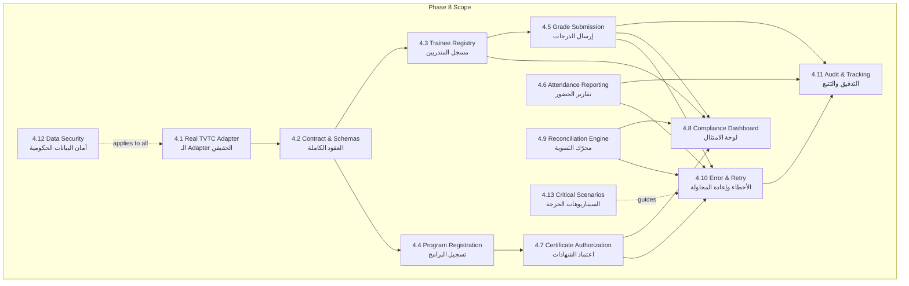
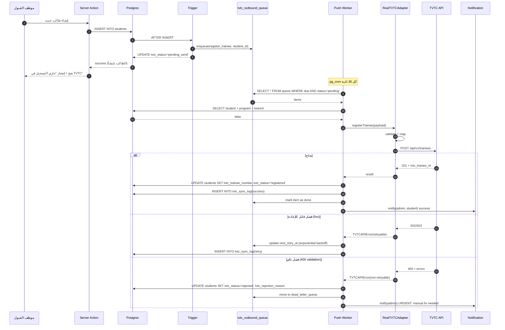
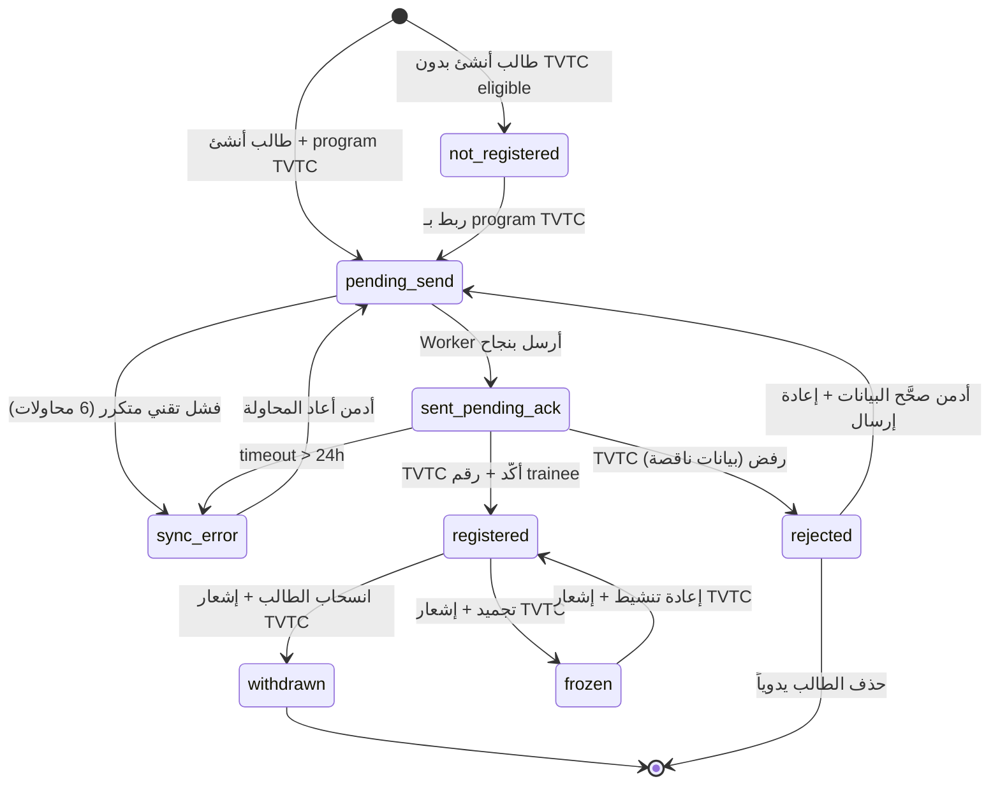
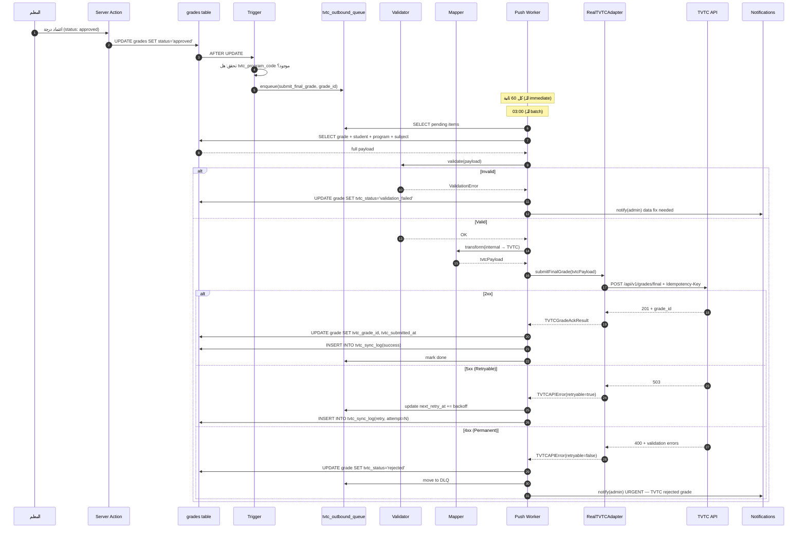
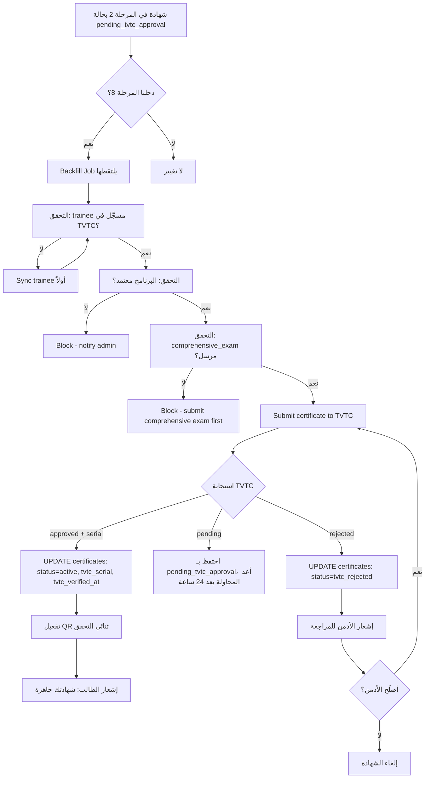
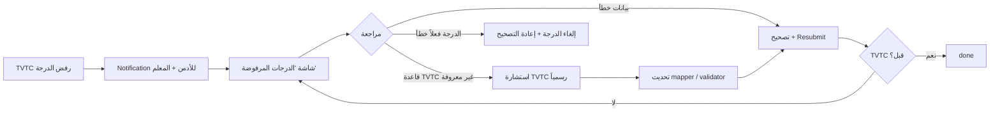
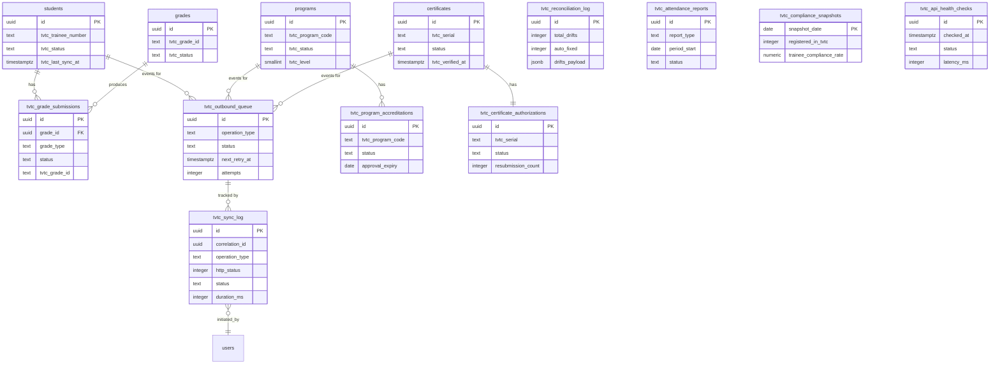

# خطة المرحلة 8 — تكامل TVTC والوزارة (Government Integration: TVTC Real Adapter)

> **المشروع:** نظام إدارة المعهد التدريبي (IIMS).
> **المرحلة:** 8 من 10 — التكامل الفعلي مع المؤسسة العامة للتدريب التقني والمهني (TVTC) والوزارة.
> **النوع:** مرحلة **امتثال حكومي حرج** — استبدال Mock Adapter (المرحلة 2) بـ Real Adapter رسمي.
> **التاريخ:** 2026-05-13.
> **الإصدار:** 1.0 (مسوّدة قابلة للتعديل بعد استلام وثيقة TVTC API الرسمية).
> **معدّ الخطة:** Senior Project Manager + Senior Government Integrations Engineer.
> **الجمهور:** المبرمج الرئيسي + قائد المنتج + ممثل المعهد لدى TVTC.
> **حالة المرحلة:** ⚠️ **حرجة جداً** — بدون اكتمالها، المعهد معرّض لفقدان اعتماد TVTC، وكل الشهادات الصادرة من المرحلة 2 تبقى في حالة `pending_tvtc_approval` بشكل دائم.

---

## فهرس الأقسام

1. [الملخص التنفيذي](#1-الملخص-التنفيذي)
2. [الأهداف وتعريف النجاح](#2-الأهداف-وتعريف-النجاح)
3. [المتطلبات السابقة (Prerequisites)](#3-المتطلبات-السابقة-prerequisites)
4. [الموديولات الفرعية (Sub-Modules)](#4-الموديولات-الفرعية-sub-modules)
5. [نموذج البيانات (Data Model)](#5-نموذج-البيانات-data-model)
6. [مواصفات الواجهة (UI/UX)](#6-مواصفات-الواجهة-uiux)
7. [التكاملات الخارجية (External Integrations)](#7-التكاملات-الخارجية-external-integrations)
8. [الأمان والامتثال (Security & Compliance)](#8-الأمان-والامتثال-security--compliance)
9. [خطة الاختبار (Testing Plan)](#9-خطة-الاختبار-testing-plan)
10. [تقسيم الـ Sprints](#10-تقسيم-الـ-sprints)
11. [معايير القبول (Acceptance Criteria)](#11-معايير-القبول-acceptance-criteria)
12. [المخاطر وخطط التخفيف (Risks & Mitigation)](#12-المخاطر-وخطط-التخفيف-risks--mitigation)
13. [تقدير الجهد والكلفة](#13-تقدير-الجهد-والكلفة)
14. [مخرجات التسليم (Deliverables Checklist)](#14-مخرجات-التسليم-deliverables-checklist)
15. [الانتقال للمرحلة التالية (Transition to Phase 9)](#15-الانتقال-للمرحلة-التالية-transition-to-phase-9)
16. [ملحق أ — قائمة الأسئلة التشغيلية لـ TVTC (25 سؤال)](#ملحق-أ--قائمة-الأسئلة-التشغيلية-لـ-tvtc-25-سؤال)

---

## 1. الملخص التنفيذي

### 1.1 لماذا هذه المرحلة الآن؟

المعهد **معتمد رسمياً من TVTC** (المؤسسة العامة للتدريب التقني والمهني)، ويُسلِّم خرّيجي برامج تدريبية تُعادَل على السلم الوظيفي السعودي. هذا الاعتماد ليس "علامة شرف" تسويقية، بل **التزام تشغيلي مستمر** يتطلّب من المعهد:

1. **تسجيل كل متدرب** في نظام TVTC المركزي خلال فترة محددة من قبوله.
2. **رفع نتائج الاختبارات والدرجات** بصيغة مقبولة لتدقيق الوزارة.
3. **تقارير حضور دورية** تثبت أن المتدربين فعلياً يحضرون الساعات المعتمدة.
4. **اعتماد كل شهادة قبل إصدارها** بحيث تُطبع برقم تسلسلي رسمي من TVTC.
5. **مزامنة فورية لأي تغيير في حالة المتدرب** (انسحاب، فصل، تجميد، تخرّج).

في المراحل السابقة (2-7) بنينا النظام بحيث يتعامل مع TVTC عبر **Mock Adapter** — طبقة محاكاة محلية تنتج معرّفات مزيفة (`TVTC-MOCK-...`) وتسمح بإكمال التطوير دون الاعتماد على وصول حقيقي. الآن، في المرحلة 8، ننتقل من المحاكاة إلى **التكامل الحقيقي** بحيث:

- يتم استبدال `MockTVTCAdapter` بـ `RealTVTCAdapter` يتحدث مع API الرسمي.
- تُحوَّل كل شهادة `pending_tvtc_approval` (التي تراكمت من المرحلة 2) إلى `active` بعد اعتماد TVTC.
- يُفعَّل QR Code الثنائي على الشهادات ليقرأ من TVTC المركزي + الموقع المحلي.
- تُرسَل كل الدرجات المعتمَدة منذ المرحلة 2 إلى TVTC في **حملة Backfill** آمنة.

### 1.2 الخطورة الاستراتيجية

> **بدون هذه المرحلة، المعهد يعرّض اعتماده للسحب.**

TVTC تُجري **تدقيقاً سنوياً** على المعاهد المعتمَدة. إن وجدت أن المعهد لا يُرسل بيانات تشغيلية بشكل دوري، أو أن شهاداته غير مرتبطة بالنظام المركزي، فإنّ النتائج المحتملة:

| النتيجة | الخطورة | الاحتمال إذا تأخّرت المرحلة 8 |
|---------|---------|-------------------------------|
| تنبيه رسمي | 🟢 منخفض | عالٍ (يحدث في أول 6 أشهر) |
| تعليق قبول دفعات جديدة | 🟠 متوسط | متوسط (بعد 9-12 شهر) |
| سحب الاعتماد كلياً | 🔴 حرج | منخفض لكنه كارثي |
| رفض شهادات الخرّيجين عند الترقية الوظيفية | 🔴 حرج | عالٍ (يحدث للفوج الأول لو لم نسجّلهم) |

لأن المعهد يخدم **موظفين حكوميين** تستخدم شهاداتهم فعلياً للترقية على السلم الوظيفي، فإن **نقطة الفشل الأكثر إيلاماً** هي الرفض الفردي للشهادات عند تقديمها لجهة عمل المتدرّب. هذا ليس مخاطرة افتراضية بل سيناريو حدث في معاهد منافسة، وقد كلّفها سمعتها.

### 1.3 ما الذي يُسلَّم في هذه المرحلة؟

| المكوّن | الوصف الموجز | حالة التسليم |
|---------|--------------|---------------|
| **Real TVTC Adapter** | يحلّ محل Mock، يُحقّق نفس `ITVTCAdapter` interface | كامل |
| **HTTP Client حكومي** | TLS 1.3 + Mutual TLS + Certificate Pinning + Retry + Circuit Breaker | كامل |
| **مسجِّل المتدربين الآلي** | Sync تلقائي عند إنشاء/تحديث/انسحاب متدرب | كامل |
| **مسجِّل البرامج للاعتماد** | شاشة لتسجيل برنامج جديد + متابعة حالة الاعتماد | كامل |
| **Grade Submission Pipeline** | Queue → Validate → Transform → Send → Acknowledge → Audit | كامل |
| **Attendance Reporting** | تقارير حضور يومية/أسبوعية/شهرية | كامل |
| **Certificate Authorization** | اعتماد TVTC للشهادات قبل إصدارها للطالب | كامل |
| **Compliance Dashboard** | لوحة مراقبة كاملة لحالة الامتثال + الإنذارات | كامل |
| **Reconciliation Engine** | Job يومي 4:00 ص يكشف Data Drift ويُصحّح | كامل |
| **Dead Letter Queue + Retry** | معالجة فشل ذكية مع Exponential Backoff | كامل |
| **TVTC Sync Audit Log** | جدول `tvtc_sync_log` يحفظ كل عملية لمدة سنتين | كامل |
| **Backfill Tool** | أداة لإرسال البيانات المتراكمة من المرحلة 2 لـ TVTC | كامل (One-shot) |

### 1.4 ما الذي **لا** يدخل في هذه المرحلة (Out-of-Scope)

- ❌ **بناء API بديل لو رفضت TVTC الوصول** — حال الرفض، المرحلة تتحول إلى "Manual Submission with TVTC Sync Tracker" (سيناريو احتياطي موثَّق في القسم 12).
- ❌ **التكامل مع Nafath SSO** — مؤجَّل للمرحلة 9 (مكمّل لكن منفصل).
- ❌ **التكامل مع وزارة الموارد البشرية (HRSD)** — لم يُطلب من العميل، خارج نطاق.
- ❌ **التكامل مع نظام التأمينات الاجتماعية (GOSI)** — خارج نطاق.
- ❌ **إعادة تصميم قالب الشهادة** — تم في المرحلة 2 بمواصفات TVTC الكاملة.
- ❌ **إصدار شهادات لخريجين قدامى لم يكونوا في النظام** — حالة استثنائية تُعالج يدوياً.

### 1.5 الفلسفة التصميمية لهذه المرحلة

> **"Government-Grade Reliability with Mock-Grade Developer Experience"**

ثلاث مبادئ توجيهية:

1. **Interface هو نفسه، التطبيق هو ما يتغيّر:** نحن لا نلمس أي ملف خارج `src/server/integrations/tvtc/adapters/real.ts` (أو ما يقاربه). كل الموديولات الأخرى (Certificates, Students, Grades) تستهلك `ITVTCAdapter` ولا تعرف إن كان Mock أو Real. هذا يضمن أن **تبديل البيئات** بين التطوير والإنتاج لا يكسر شيئاً.

2. **Queue Everything, Sync Nothing:** لا يُرسَل أي شيء إلى TVTC **بشكل متزامن** (synchronously). كل عملية تذهب إلى Queue → Background Worker → TVTC. هذا يعني أن:
   - تجربة المستخدم لا تتأثر بتأخّر API الحكومي (المعروف ببطئه).
   - يمكننا إعادة المحاولة بأمان.
   - لو سقطت TVTC API لساعتين، نظامنا يستمر بقبول العمليات وتخزينها للإرسال لاحقاً.

3. **Audit Everything, Trust Nothing:** كل عملية إرسال تُسجَّل قبل وبعد، بطلبها واستجابتها، وبتوقيع رقمي للـ payload. عند نزاع مع TVTC، نحتاج أن نُثبت أننا أرسلنا، ومتى، وبأي محتوى. الـ Audit Log هو **الدفاع القانوني** للمعهد.

### 1.6 المخرجات الكميّة المتوقعة بنهاية المرحلة

- **9 جداول قاعدة بيانات جديدة** (انظر القسم 5).
- **6 توسعات على جداول قائمة** (`students`, `programs`, `certificates`, `grades`, `attendance`, `audit_log`).
- **18 RPC/Edge Function** (مزامنة، اعتماد، تحقق، Reconciliation).
- **14 شاشة UI** جديدة (12 للأدمن + 2 عامة).
- **5 Background Jobs** (Sync Worker، Reconciliation Cron، Retry Worker، Backfill، Health Check).
- **120+ Unit Tests + 25 E2E Tests + 8 Contract Tests** ضد Mock Server.
- **مستند Operational Runbook** لـ 12 سيناريو تشغيلي.

---

## 2. الأهداف وتعريف النجاح

### 2.1 الأهداف الاستراتيجية

| # | الهدف | المؤشر القابل للقياس (KPI) | الهدف الكمي بنهاية المرحلة |
|---|------|------------------------------|-----------------------------|
| G1 | **كل المتدربين الفعّالين مسجّلون في TVTC** | عدد الطلاب بـ `tvtc_trainee_number IS NULL` | 0 (صفر) |
| G2 | **كل الشهادات المُصدَرة معتمدة من TVTC** | عدد الشهادات `pending_tvtc_approval` التي تراكمت من المرحلة 2 | 0 (بعد Backfill) |
| G3 | **زمن من اعتماد الدرجة إلى وصولها لـ TVTC** | متوسط `submitted_at - approved_at` | ≤ 60 دقيقة (P95) |
| G4 | **زمن من إنشاء طالب إلى تسجيله في TVTC** | متوسط `tvtc_registered_at - created_at` | ≤ 5 دقائق (P95) |
| G5 | **نسبة نجاح إرسال البيانات لـ TVTC** | success_rate في `tvtc_sync_log` | ≥ 99.0% |
| G6 | **زمن الاكتشاف عند Outage في TVTC** | Health Check يكشف خلال | ≤ 2 دقيقة |
| G7 | **اكتشاف Data Drift اليومي** | Reconciliation يلتقط التفاوتات | 100% خلال 24 ساعة |
| G8 | **استمرارية العمل عند سقوط TVTC** | عدد العمليات المفقودة وقت الـoutage | 0 (مُحفوظة في Queue) |

### 2.2 معايير "Done" للمرحلة

تُعتبر المرحلة منتهية عند تحقق **كل** ما يلي مجتمعاً:

- [x] جميع المكوّنات الـ13 في القسم 4 منفَّذة + مختبَرة.
- [x] **اختبار قبول العميل (UAT)** على Sandbox TVTC الرسمي يجري مع 10 طلاب تجريبيين و 3 شهادات و 50 درجة، ويُجاز.
- [x] **0 مشاكل أمنية حرجة (Critical/High)** في تقرير Security Review المخصّص للتكاملات الحكومية.
- [x] **0 Migration Errors** في قاعدة البيانات (التعديلات على `students`, `programs`, `certificates`).
- [x] **Code Coverage ≥ 80%** للوحدات الجوهرية (Adapter, Queue Worker, Reconciliation, Retry).
- [x] **Contract Tests:** كل endpoint في `ITVTCAdapter` لديه عقد JSON Schema موثّق ومختبَر.
- [x] **Operational Runbook** مكتمل لـ 12 سيناريو (انظر القسم 14).
- [x] **Disaster Recovery Test:** محاكاة سقوط TVTC API لـ 24 ساعة، النظام يستمر، الـ Queue يحفظ، عند العودة يُفرَّغ في < 30 دقيقة.
- [x] **Performance Benchmark:** 500 درجة تُرسَل في < 5 دقائق (تشمل التحقق + التحويل + الإرسال + الاعتماد).
- [x] **اعتماد TVTC الرسمي:** خطاب من TVTC يؤكد أن النظام يستوفي متطلبات التكامل.

### 2.3 ما يُقاس بعد الإطلاق (Post-Launch Metrics)

تُقاس خلال 4 أسابيع بعد الإطلاق:

| المقياس | الحد الأدنى المقبول | الهدف الطموح |
|---------|---------------------|----------------|
| Uptime TVTC Integration | 99.0% (يعتمد على TVTC) | 99.5% |
| متوسط زمن استجابة TVTC API (P95) | < 5 ثوان | < 2 ثانية |
| نسبة الإرسالات الناجحة من المحاولة الأولى | ≥ 95% | ≥ 99% |
| نسبة Reconciliation Successes | ≥ 99% | 100% |
| متوسط زمن اعتماد الشهادة من TVTC | < 24 ساعة | < 4 ساعات |
| Dead Letter Queue Size في أي لحظة | < 10 عناصر | < 3 عناصر |

---

## 3. المتطلبات السابقة (Prerequisites)

### 3.1 من المراحل السابقة — إلزامي

> ⚠️ **لا يبدأ Sprint 1 من المرحلة 8 إلا بعد تأكيد اكتمال كل هذه البنود.**

| البند | المصدر | حالة التحقق |
|------|--------|-------------|
| `ITVTCAdapter` interface مع Mock تطبيق كامل | المرحلة 2 (4.10) | ✅ — اختبار Mock يعمل |
| جدول `students` بـحقول tvtc placeholders جاهزة | المرحلة 2/6 | ✅ — راجع 5.1 |
| جدول `certificates` بـحالة `pending_tvtc_approval` | المرحلة 2 (4.8) | ✅ — راجع 5.2 |
| جدول `mock_tvtc_state` (للتوثيق فقط، لا يُحذف) | المرحلة 2 | ✅ — للتاريخ |
| جدول `audit_log` يعمل ويلتقط tvtc events | المرحلة 1 | ✅ — Triggers مفعّلة |
| Background Jobs Infrastructure (pg_cron أو Inngest) | المرحلة 4 | ✅ — مُستخدَم للمالية |
| Supabase Vault لحفظ الـsecrets | المرحلة 1 | ✅ — للـ ACCOUNTING_API_KEY |
| Service Blocking Engine | المرحلة 4 | ✅ — يستخدم نمط Pull |
| `programs` جدول مع `tvtc_program_code` (إن وُجد) | المرحلة 2 (4.7) | ⚠️ — قد يحتاج توسعة |
| Comprehensive Exam جداول | المرحلة 7 | ✅ — لو وجدت |
| Realtime Notifications | المرحلة 1 | ✅ — للتنبيهات |

### 3.2 المتطلبات الخارجية (من العميل و TVTC)

> 📋 **هذه نقاط تحتاج إجابات قاطعة قبل Sprint 1.** القائمة الكاملة (25 سؤال) في الملحق أ.

| البند | الأولوية | الجهة | تأخّره يُعطّل |
|------|----------|------|---------------|
| **وثيقة API TVTC الرسمية** (PDF + Swagger/OpenAPI) | 🔴 حرجة | TVTC + العميل | المرحلة كلها |
| **Sandbox URL + Credentials** | 🔴 حرجة | TVTC | كل التطوير الفعلي |
| **Production URL + Credentials** | 🔴 حرجة | TVTC | الإطلاق فقط |
| **Authentication Method** (OAuth2 / API Key / mTLS؟) | 🔴 حرجة | TVTC | Sprint 1 |
| **الشهادة الرقمية الحكومية** (إن طُلبت) | 🟠 عالية | TVTC | mTLS |
| **رقم اعتماد المعهد في TVTC** | 🔴 حرجة | العميل | كل الـ requests |
| **معرّف المعهد (Institute Code) لـ TVTC API** | 🔴 حرجة | TVTC | Headers |
| **رقم اعتماد كل برنامج** (إن وُجد سابقاً) | 🟠 عالية | العميل + TVTC | المرحلة 2 + Backfill |
| **Mapping السلم الوظيفي** (المستوى 1-7 لكل برنامج) | 🟠 عالية | TVTC | الشهادات |
| **Rate Limits السماح بها** | 🟠 عالية | TVTC | Throttling |
| **IP Whitelisting المطلوب** | 🟠 عالية | TVTC | Production |
| **Webhook URL إن طلبه TVTC منا** | 🟡 متوسطة | TVTC | بعد الاتفاق |
| **نموذج البيانات المتوقَّع لكل endpoint** (Field-level mapping) | 🔴 حرجة | TVTC | Sprint 1 |
| **Test Data Reset Policy في Sandbox** | 🟡 متوسطة | TVTC | الاختبارات |
| **SLA المتوقَّع للاستجابة** | 🟡 متوسطة | TVTC | التوقعات |

> **استراتيجية الاحتياط:** إذا تأخّرت وثائق TVTC الرسمية، نواصل العمل على Mock TVTC Mock V2 (محسَّن) يحاكي الـ "Educated Guess" Contract في القسم 7.1، ونؤجّل التبديل النهائي حتى وصول الوثائق. **لا تُجمَّد المرحلة بانتظار TVTC**.

### 3.3 المتطلبات التقنية

```yaml
required_services:
  - name: TVTC API (Sandbox)
    type: external_government
    auth: TBD (OAuth2 likely)
    sla: TBD
    rate_limit: TBD

  - name: TVTC API (Production)
    type: external_government
    auth: TBD + IP whitelist
    sla: TBD
    rate_limit: TBD

  - name: Supabase
    plan: Pro (نحتاج Background Jobs)
    features: [Postgres, Edge Functions, Vault, pg_cron, pg_net]

  - name: Sentry
    plan: Pro
    features: [Error Tracking, Performance, Alerts]
    note: "Custom alerts for TVTC integration failures"

  - name: PagerDuty / Better Stack (اختياري)
    plan: Free Tier
    features: [On-call alerts for TVTC outage]

required_libraries:
  - "@supabase/supabase-js": "^2.45.0"
  - "@supabase/ssr": "^0.5.0"
  - "axios": "^1.7.0"
  - "axios-retry": "^4.5.0"
  - "opossum": "^8.1.0"          # Circuit Breaker
  - "node-forge": "^1.3.1"        # PKI / Certificate parsing
  - "https": "^1.0.0"             # Mutual TLS
  - "zod": "^3.23.0"              # Schema validation
  - "ajv": "^8.17.0"              # JSON Schema validation (للـ contract)
  - "p-queue": "^8.0.0"           # Concurrent control
  - "p-retry": "^6.2.0"           # Retry logic
  - "@types/jsonwebtoken": "^9.0.0" # إن استُخدم JWT
  - "jsonwebtoken": "^9.0.2"      # إن استُخدم JWT
  - "uuid": "^10.0.0"             # Correlation IDs
  - "date-fns": "^3.6.0"          # تحويلات التاريخ
  - "date-fns-jalali": "^2.21.0"  # إن طلبت TVTC هجري
```

### 3.4 القرارات المعمارية المُعتمَدة مسبقاً

> هذه القرارات **محسومة** ولا يجوز تغييرها في هذه المرحلة دون اجتماع رسمي:

- **Adapter Pattern صارم:** يبقى المرجع الوحيد `ITVTCAdapter`. لا تسرّب أنواع HTTP خارج طبقة `tvtc/`.
- **Queue-First دائماً:** لا syncronous calls إلى TVTC من Server Actions. كل شيء يمرّ بـ Queue.
- **Idempotency إلزامية:** كل request له `idempotency_key` مبني على `sha256(correlation_id + payload)`. التكرار آمن.
- **Pull > Push عند الشك:** إن كان TVTC يدعم استعلام بدل Webhook، نختار الاستعلام (أبسط، أكثر تحكماً).
- **Audit Log غير قابل للحذف:** سجل العمليات يبقى **سنتين على الأقل**، وحذفه يحتاج توقيع super_admin + سبب.
- **Sandbox first, دائماً:** Production لا يُلمَس إلا بعد 14 يوماً من اختبار ناجح متواصل على Sandbox.

---

## 4. الموديولات الفرعية (Sub-Modules)

تنقسم هذه المرحلة إلى **13 موديول فرعي** متسلسلة ومترابطة.

### 4.1 خريطة الموديولات (Module Map)



### 4.2 — Real TVTC Adapter (4.1)

#### 4.2.1 الموقع والتنظيم

```
src/server/integrations/tvtc/
├── types.ts                    # كل الـtypes (موجود من المرحلة 2، نوسّعه)
├── interface.ts                # ITVTCAdapter (موجود، نوسّعه)
├── adapters/
│   ├── mock.ts                 # MockTVTCAdapter (يبقى للاختبار + Local Dev)
│   ├── mock-v2.ts              # محاكي محسَّن للـ Sandbox-like behavior
│   └── real.ts                 # RealTVTCAdapter ⭐ الجديد
├── http-client.ts              # axios + mTLS + Retry + CB
├── resilience.ts               # CircuitBreaker + Retry + DLQ (مشترك مع المحاسبي)
├── auth/
│   ├── oauth2-strategy.ts      # إن استُخدم OAuth2
│   ├── api-key-strategy.ts     # إن استُخدم API Key
│   └── mtls-strategy.ts        # إن استُخدم Mutual TLS
├── mappers/
│   ├── trainee.mapper.ts       # نظام → TVTC payload
│   ├── grade.mapper.ts
│   ├── attendance.mapper.ts
│   ├── certificate.mapper.ts
│   └── program.mapper.ts
├── validators/
│   ├── trainee.schema.ts       # Zod schemas للـ outbound
│   ├── grade.schema.ts
│   └── ...
├── workers/
│   ├── sync-worker.ts          # Pull data من TVTC
│   ├── push-worker.ts          # Push المعلَّق
│   ├── reconciliation.ts       # Daily 04:00
│   ├── backfill.ts             # One-shot للبيانات القديمة
│   └── health-check.ts         # كل دقيقتين
├── queue.ts                    # Queue manager (يستخدم tvtc_outbound_queue)
├── di.ts                       # Dependency injection container
└── README.md                   # دليل المطوّر
```

#### 4.2.2 التوسعة على Interface

```typescript
// src/server/integrations/tvtc/interface.ts
export interface ITVTCAdapter {
  // === من المرحلة 2 (نحافظ على التوقيع) ===
  registerTrainee(payload: TVTCTraineePayload): Promise<TVTCRegistrationResult>;
  submitGrades(payload: TVTCGradesPayload): Promise<TVTCGradesResult>;
  verifyCertificate(serial: string): Promise<TVTCVerificationResult>;

  // === جديد في المرحلة 8 ===

  // المتدربون
  getTrainee(tvtcId: string): Promise<TVTCTraineeRecord>;
  updateTrainee(tvtcId: string, payload: TVTCTraineeUpdatePayload): Promise<TVTCUpdateResult>;
  withdrawTrainee(tvtcId: string, reason: TVTCWithdrawalReason): Promise<TVTCWithdrawResult>;

  // البرامج
  registerProgram(payload: TVTCProgramPayload): Promise<TVTCProgramResult>;
  getProgram(programCode: string): Promise<TVTCProgramRecord>;

  // الدرجات
  submitFinalGrade(payload: TVTCFinalGradePayload): Promise<TVTCGradeAckResult>;
  submitComprehensiveExam(payload: TVTCComprehensiveExamPayload): Promise<TVTCGradeAckResult>;

  // الحضور
  submitMonthlyAttendance(payload: TVTCMonthlyAttendancePayload): Promise<TVTCAttendanceAckResult>;
  submitWeeklyAttendance(payload: TVTCWeeklyAttendancePayload): Promise<TVTCAttendanceAckResult>;

  // الشهادات
  requestCertificateAuthorization(payload: TVTCCertificateRequestPayload): Promise<TVTCCertificateAuthResult>;

  // الصحة
  health(): Promise<TVTCHealthCheckResult>;
}
```

#### 4.2.3 تطبيق `RealTVTCAdapter`

```typescript
// src/server/integrations/tvtc/adapters/real.ts
import { AxiosInstance } from 'axios';
import {
  ITVTCAdapter,
  TVTCTraineePayload, TVTCRegistrationResult,
  TVTCGradesPayload, TVTCGradesResult,
  TVTCCertificateRequestPayload, TVTCCertificateAuthResult,
  TVTCAPIError, TVTCContractViolation
} from '../types';
import { withCircuitBreaker, withRetry } from '../resilience';
import { TraineeMapper } from '../mappers/trainee.mapper';
import { traineePayloadSchema } from '../validators/trainee.schema';
import { logTVTCSync } from '../audit';

export class RealTVTCAdapter implements ITVTCAdapter {
  constructor(
    private readonly http: AxiosInstance,
    private readonly mapper: TraineeMapper,
    private readonly instituteCode: string,
  ) {}

  async registerTrainee(payload: TVTCTraineePayload): Promise<TVTCRegistrationResult> {
    // 1. التحقق المسبق (قبل الذهاب للشبكة)
    const validation = traineePayloadSchema.safeParse(payload);
    if (!validation.success) {
      throw new TVTCContractViolation('Invalid trainee payload', validation.error.issues);
    }

    // 2. التحويل لصيغة TVTC
    const tvtcPayload = this.mapper.toTVTCFormat(payload);

    // 3. توليد Idempotency Key
    const idempotencyKey = generateIdempotencyKey(payload.correlation_id, tvtcPayload);

    // 4. الإرسال محمياً بـ CB + Retry
    const correlationId = crypto.randomUUID();

    const response = await withCircuitBreaker('tvtc-trainees', () =>
      withRetry(async () => {
        const startTime = Date.now();
        const res = await this.http.post('/api/v1/trainees', tvtcPayload, {
          headers: {
            'X-Institute-ID': this.instituteCode,
            'X-Idempotency-Key': idempotencyKey,
            'X-Correlation-ID': correlationId,
          },
        });
        const duration = Date.now() - startTime;

        // 5. التحقق من العقد للاستجابة
        if (!res.data?.tvtc_trainee_id) {
          throw new TVTCContractViolation('Missing tvtc_trainee_id in response', res.data);
        }

        await logTVTCSync({
          operation: 'register_trainee',
          correlation_id: correlationId,
          idempotency_key: idempotencyKey,
          request_payload: tvtcPayload,
          response_payload: res.data,
          status: 'success',
          duration_ms: duration,
          http_status: res.status,
        });

        return res.data;
      }, { retries: 3, exponentialBackoff: true })
    );

    return this.mapper.fromTVTCResponse(response);
  }

  async submitFinalGrade(payload: TVTCFinalGradePayload): Promise<TVTCGradeAckResult> {
    const correlationId = crypto.randomUUID();
    const idempotencyKey = generateIdempotencyKey(
      `${payload.trainee_tvtc_id}:${payload.program_code}:final`,
      payload
    );

    const res = await withCircuitBreaker('tvtc-grades', () =>
      withRetry(() =>
        this.http.post('/api/v1/grades/final', this.mapper.gradeToTVTC(payload), {
          headers: {
            'X-Institute-ID': this.instituteCode,
            'X-Idempotency-Key': idempotencyKey,
            'X-Correlation-ID': correlationId,
          },
        }), { retries: 5, exponentialBackoff: true }
      )
    );

    return {
      acknowledged: true,
      tvtc_grade_id: res.data.grade_id,
      timestamp: res.data.received_at,
      correlation_id: correlationId,
    };
  }

  async requestCertificateAuthorization(
    payload: TVTCCertificateRequestPayload
  ): Promise<TVTCCertificateAuthResult> {
    const correlationId = crypto.randomUUID();
    const idempotencyKey = generateIdempotencyKey(payload.certificate_local_id, payload);

    const res = await withCircuitBreaker('tvtc-certificates', () =>
      withRetry(() =>
        this.http.post('/api/v1/certificates/request', this.mapper.certificateToTVTC(payload), {
          headers: {
            'X-Institute-ID': this.instituteCode,
            'X-Idempotency-Key': idempotencyKey,
            'X-Correlation-ID': correlationId,
          },
        }), { retries: 3 }
      )
    );

    return {
      status: res.data.status, // 'approved' | 'pending' | 'rejected'
      tvtc_serial: res.data.tvtc_serial ?? null,
      verification_url: res.data.verification_url ?? null,
      rejection_reason: res.data.rejection_reason ?? null,
      authorized_at: res.data.authorized_at ?? null,
      correlation_id: correlationId,
    };
  }

  async health(): Promise<TVTCHealthCheckResult> {
    try {
      const start = Date.now();
      const res = await this.http.get('/api/v1/health', { timeout: 3000 });
      return {
        status: 'healthy',
        latency_ms: Date.now() - start,
        last_check_at: new Date().toISOString(),
        tvtc_api_version: res.data?.version ?? 'unknown',
      };
    } catch (err: any) {
      return {
        status: err.code === 'ECONNABORTED' ? 'degraded' : 'down',
        latency_ms: null,
        last_check_at: new Date().toISOString(),
        error: err.message,
      };
    }
  }

  // ... باقي الـ methods بنفس النمط
}
```

#### 4.2.4 الـ Factory (Dependency Injection)

```typescript
// src/server/integrations/tvtc/di.ts
import { ITVTCAdapter } from './interface';
import { MockTVTCAdapter } from './adapters/mock';
import { MockTVTCAdapterV2 } from './adapters/mock-v2';
import { RealTVTCAdapter } from './adapters/real';
import { buildTVTCHttpClient } from './http-client';
import { TraineeMapper, GradeMapper, /* ... */ } from './mappers';

let instance: ITVTCAdapter | null = null;

export function getTVTCAdapter(): ITVTCAdapter {
  if (instance) return instance;

  const mode = process.env.TVTC_MODE; // 'mock' | 'mock_v2' | 'sandbox' | 'production'

  switch (mode) {
    case 'mock':
      instance = new MockTVTCAdapter();
      break;

    case 'mock_v2':
      instance = new MockTVTCAdapterV2();
      break;

    case 'sandbox':
    case 'production':
      const http = buildTVTCHttpClient({
        baseURL: process.env.TVTC_API_BASE_URL!,
        apiKey: process.env.TVTC_API_KEY,
        clientCert: process.env.TVTC_CLIENT_CERT_PATH,
        clientKey: process.env.TVTC_CLIENT_KEY_PATH,
        timeout: 30_000, // الحكومي بطيء
      });
      instance = new RealTVTCAdapter(http, new TraineeMapper(), process.env.TVTC_INSTITUTE_CODE!);
      break;

    default:
      throw new Error(`Unknown TVTC_MODE: ${mode}. Use mock|mock_v2|sandbox|production`);
  }

  return instance;
}

// لاختبارات الوحدة
export function setTVTCAdapter(adapter: ITVTCAdapter) {
  if (process.env.NODE_ENV === 'production') {
    throw new Error('Cannot override adapter in production');
  }
  instance = adapter;
}

export function resetTVTCAdapter() {
  instance = null;
}
```

#### 4.2.5 HTTP Client مع Mutual TLS

```typescript
// src/server/integrations/tvtc/http-client.ts
import axios, { AxiosInstance } from 'axios';
import https from 'https';
import fs from 'fs';

export interface TVTCHttpClientOptions {
  baseURL: string;
  apiKey?: string;
  clientCert?: string;     // مسار شهادة العميل (PEM)
  clientKey?: string;      // مسار المفتاح الخاص (PEM)
  caCert?: string;         // مسار شهادة CA الحكومية (PEM)
  timeout?: number;
}

export function buildTVTCHttpClient(opts: TVTCHttpClientOptions): AxiosInstance {
  let httpsAgent: https.Agent | undefined;

  if (opts.clientCert && opts.clientKey) {
    httpsAgent = new https.Agent({
      cert: fs.readFileSync(opts.clientCert),
      key: fs.readFileSync(opts.clientKey),
      ca: opts.caCert ? fs.readFileSync(opts.caCert) : undefined,
      rejectUnauthorized: true,
      // Certificate Pinning (اختياري لأمان أعلى)
      checkServerIdentity: (host, cert) => {
        // verify against pinned fingerprint
        const expectedFingerprint = process.env.TVTC_SERVER_CERT_FINGERPRINT;
        if (expectedFingerprint && cert.fingerprint256 !== expectedFingerprint) {
          return new Error(`Server certificate fingerprint mismatch`);
        }
        return undefined;
      },
      minVersion: 'TLSv1.2',
      maxVersion: 'TLSv1.3',
    });
  }

  const client = axios.create({
    baseURL: opts.baseURL,
    timeout: opts.timeout ?? 30_000,
    httpsAgent,
    headers: {
      Accept: 'application/json',
      'Content-Type': 'application/json',
      'User-Agent': 'RuwaadAlAtaa-IIMS/1.0',
      ...(opts.apiKey && { Authorization: `Bearer ${opts.apiKey}` }),
    },
  });

  // Request Interceptor
  client.interceptors.request.use((cfg) => {
    cfg.metadata = { startTime: Date.now() };
    return cfg;
  });

  // Response Interceptor
  client.interceptors.response.use(
    (res) => {
      const duration = Date.now() - res.config.metadata!.startTime;
      observeTVTCLatency(res.config.url ?? '', duration, res.status);
      return res;
    },
    (err) => {
      if (err.response?.status >= 500) {
        recordTVTCError({
          endpoint: err.config?.url ?? 'unknown',
          status: err.response.status,
          message: err.message,
          payload_sample: stringify(err.config?.data).slice(0, 500),
        });
      }
      return Promise.reject(err);
    }
  );

  return client;
}
```

### 4.3 — العقد الكامل والـ Schemas (4.2)

#### 4.3.1 لماذا "Educated Guess Contract"؟

نظراً لأن وثيقة TVTC الرسمية لم تصل بعد، نبني **عقداً افتراضياً مبنياً على**:

- الممارسات المعيارية في APIs الحكومية السعودية (نفاذ، يقين، أبشر، GOSI).
- المتطلبات الوظيفية المعروفة من سياق المعهد.
- عقود مماثلة من معاهد أخرى (مفتوحة المصدر أو منشورة).

العقد يُعدَّل حين تصل الوثيقة الحقيقية. لكن البنية الكامنة تبقى تقريباً نفسها (Resources, Verbs, Errors).

#### 4.3.2 جدول الـ Endpoints المتوقَّعة

| # | Endpoint | Method | الغرض | الـ Auth | Cache TTL |
|---|----------|--------|------|---------|------------|
| 1 | `/api/v1/trainees` | POST | تسجيل متدرب جديد | API Key + mTLS | — |
| 2 | `/api/v1/trainees/{tvtc_id}` | GET | استعلام عن متدرب | API Key | 1h |
| 3 | `/api/v1/trainees/{tvtc_id}` | PUT | تحديث بيانات متدرب | API Key | — |
| 4 | `/api/v1/trainees/{tvtc_id}/withdraw` | POST | إشعار انسحاب | API Key | — |
| 5 | `/api/v1/trainees/{tvtc_id}/freeze` | POST | تجميد قيد المتدرب | API Key | — |
| 6 | `/api/v1/trainees/{tvtc_id}/reactivate` | POST | إلغاء التجميد | API Key | — |
| 7 | `/api/v1/programs/register` | POST | تسجيل برنامج تدريبي | API Key + Admin Role | — |
| 8 | `/api/v1/programs/{tvtc_code}` | GET | استعلام عن برنامج | API Key | 24h |
| 9 | `/api/v1/programs/{tvtc_code}/accreditation` | GET | حالة الاعتماد | API Key | 1h |
| 10 | `/api/v1/grades` | POST | إرسال درجة (مفردة أو دفعة) | API Key | — |
| 11 | `/api/v1/grades/final` | POST | إرسال الدرجة النهائية | API Key | — |
| 12 | `/api/v1/comprehensive-exam` | POST | نتيجة الاختبار الشامل | API Key | — |
| 13 | `/api/v1/attendance/monthly` | POST | تقرير حضور شهري | API Key | — |
| 14 | `/api/v1/attendance/weekly` | POST | تقرير حضور أسبوعي | API Key | — |
| 15 | `/api/v1/attendance/daily` | POST | تقرير حضور يومي (اختياري) | API Key | — |
| 16 | `/api/v1/certificates/request` | POST | طلب اعتماد شهادة | API Key | — |
| 17 | `/api/v1/certificates/{serial}/verify` | GET | تحقق من شهادة | Public (Rate-limited) | 5min |
| 18 | `/api/v1/certificates/{serial}/revoke` | POST | إلغاء شهادة | API Key + Reason | — |
| 19 | `/api/v1/health` | GET | فحص صحة API | — | 0 |
| 20 | `/api/v1/institutes/{code}/reports` | GET | تقارير المعهد | API Key | 1h |

#### 4.3.3 JSON Schemas المتوقَّعة (عيّنات)

**Trainee Registration Request:**

```json
{
  "$schema": "https://json-schema.org/draft/2020-12/schema",
  "$id": "tvtc/trainee_registration_request.json",
  "type": "object",
  "required": [
    "institute_code", "national_id", "full_name_ar",
    "gender", "date_of_birth", "program_code", "branch_code",
    "enrollment_date", "contact"
  ],
  "properties": {
    "institute_code": {
      "type": "string",
      "pattern": "^TVTC-INST-[0-9]{6}$",
      "description": "كود المعهد المعتمَد في TVTC"
    },
    "national_id": {
      "type": "string",
      "pattern": "^[12][0-9]{9}$",
      "description": "الهوية الوطنية السعودية أو الإقامة"
    },
    "full_name_ar": {
      "type": "string",
      "minLength": 5,
      "maxLength": 200
    },
    "full_name_en": {
      "type": "string",
      "minLength": 5,
      "maxLength": 200
    },
    "gender": {
      "type": "string",
      "enum": ["male", "female"]
    },
    "date_of_birth": {
      "type": "string",
      "format": "date"
    },
    "nationality": {
      "type": "string",
      "minLength": 2,
      "maxLength": 3,
      "default": "SA"
    },
    "program_code": {
      "type": "string",
      "pattern": "^TVTC-PRG-[0-9]{8}$"
    },
    "branch_code": {
      "type": "string"
    },
    "enrollment_date": {
      "type": "string",
      "format": "date"
    },
    "contact": {
      "type": "object",
      "required": ["mobile"],
      "properties": {
        "mobile": {
          "type": "string",
          "pattern": "^(\\+9665|05)[0-9]{8}$"
        },
        "email": {
          "type": "string",
          "format": "email"
        },
        "address_ar": { "type": "string" }
      }
    },
    "academic_background": {
      "type": "object",
      "properties": {
        "highest_degree": {
          "enum": ["high_school", "diploma", "bachelors", "masters", "phd"]
        },
        "graduation_year": {
          "type": "integer",
          "minimum": 1960,
          "maximum": 2100
        }
      }
    },
    "employment": {
      "type": "object",
      "properties": {
        "is_employed": { "type": "boolean" },
        "employer_name": { "type": "string" },
        "position": { "type": "string" },
        "ministry": { "type": "string" }
      }
    }
  },
  "additionalProperties": false
}
```

**Trainee Registration Response:**

```json
{
  "$schema": "https://json-schema.org/draft/2020-12/schema",
  "$id": "tvtc/trainee_registration_response.json",
  "type": "object",
  "required": ["tvtc_trainee_id", "status", "registered_at"],
  "properties": {
    "tvtc_trainee_id": {
      "type": "string",
      "pattern": "^TVTC-TRN-[0-9]{10}$"
    },
    "status": {
      "enum": ["registered", "pending_review", "rejected"]
    },
    "registered_at": {
      "type": "string",
      "format": "date-time"
    },
    "verification_url": {
      "type": "string",
      "format": "uri"
    },
    "rejection_reason": {
      "type": "string"
    },
    "warnings": {
      "type": "array",
      "items": { "type": "string" }
    }
  }
}
```

**Final Grade Submission:**

```json
{
  "$schema": "https://json-schema.org/draft/2020-12/schema",
  "$id": "tvtc/final_grade_request.json",
  "type": "object",
  "required": [
    "institute_code", "trainee_tvtc_id", "program_code",
    "final_score", "grade_letter", "passing_status",
    "academic_year", "semester"
  ],
  "properties": {
    "institute_code": { "type": "string" },
    "trainee_tvtc_id": { "type": "string" },
    "program_code": { "type": "string" },
    "subject_code": { "type": "string" },
    "final_score": {
      "type": "number",
      "minimum": 0,
      "maximum": 100
    },
    "grade_letter": {
      "enum": ["A+", "A", "B+", "B", "C+", "C", "D+", "D", "F"]
    },
    "passing_status": {
      "enum": ["passed", "failed", "withdrew", "incomplete"]
    },
    "academic_year": {
      "type": "string",
      "pattern": "^[0-9]{4}/[0-9]{4}$"
    },
    "semester": {
      "enum": ["1", "2", "3", "summer"]
    },
    "exam_date": {
      "type": "string",
      "format": "date"
    },
    "comprehensive_exam_score": {
      "type": "number",
      "minimum": 0,
      "maximum": 100
    },
    "attendance_percentage": {
      "type": "number",
      "minimum": 0,
      "maximum": 100
    },
    "instructor_tvtc_id": { "type": "string" },
    "verified_by": { "type": "string" },
    "submission_metadata": {
      "type": "object",
      "properties": {
        "submitted_at": { "type": "string", "format": "date-time" },
        "submitted_by": { "type": "string" },
        "local_grade_id": { "type": "string", "format": "uuid" }
      }
    }
  }
}
```

**Certificate Authorization Request:**

```json
{
  "$schema": "https://json-schema.org/draft/2020-12/schema",
  "$id": "tvtc/certificate_request.json",
  "type": "object",
  "required": [
    "institute_code", "trainee_tvtc_id", "program_code",
    "graduation_date", "gpa", "passing_status",
    "comprehensive_exam_passed"
  ],
  "properties": {
    "institute_code": { "type": "string" },
    "trainee_tvtc_id": { "type": "string" },
    "program_code": { "type": "string" },
    "graduation_date": {
      "type": "string",
      "format": "date"
    },
    "gpa": {
      "type": "number",
      "minimum": 0,
      "maximum": 4
    },
    "total_credit_hours": {
      "type": "integer",
      "minimum": 1
    },
    "tvtc_level": {
      "type": "integer",
      "minimum": 1,
      "maximum": 7
    },
    "passing_status": {
      "enum": ["passed", "with_honor", "with_distinction"]
    },
    "comprehensive_exam_passed": { "type": "boolean" },
    "comprehensive_exam_score": {
      "type": "number",
      "minimum": 0,
      "maximum": 100
    },
    "local_certificate_id": {
      "type": "string",
      "format": "uuid"
    },
    "local_serial": {
      "type": "string"
    },
    "verification_qr_payload": {
      "type": "string"
    }
  }
}
```

#### 4.3.4 خريطة التحويل (Internal Model → TVTC)

```typescript
// src/server/integrations/tvtc/mappers/trainee.mapper.ts
import { Student } from '@/types/student';
import { Branch } from '@/types/branch';
import { Program } from '@/types/program';

export class TraineeMapper {
  toTVTCFormat(input: {
    student: Student;
    branch: Branch;
    program: Program;
  }): TVTCTraineeRegistrationRequest {
    const { student, branch, program } = input;

    // التحقق من البيانات المطلوبة
    if (!student.national_id) throw new ValidationError('national_id required for TVTC');
    if (!program.tvtc_program_code) throw new ValidationError('Program not registered with TVTC');
    if (!branch.tvtc_branch_code) throw new ValidationError('Branch missing tvtc_branch_code');

    return {
      institute_code: process.env.TVTC_INSTITUTE_CODE!,
      national_id: student.national_id,
      full_name_ar: this.composeArabicFullName(student),
      full_name_en: student.full_name_en ?? null,
      gender: this.mapGender(student.gender),
      date_of_birth: student.date_of_birth_gregorian, // ISO date
      nationality: student.nationality ?? 'SA',
      program_code: program.tvtc_program_code,
      branch_code: branch.tvtc_branch_code,
      enrollment_date: student.enrolled_at.split('T')[0],
      contact: {
        mobile: this.normalizeSaudiPhone(student.mobile),
        email: student.email,
        address_ar: student.address ?? undefined,
      },
      academic_background: student.education ? {
        highest_degree: this.mapDegree(student.education.highest_degree),
        graduation_year: student.education.graduation_year,
      } : undefined,
      employment: student.employment ? {
        is_employed: student.employment.is_employed,
        employer_name: student.employment.employer_name,
        position: student.employment.position,
        ministry: student.employment.ministry,
      } : undefined,
    };
  }

  private composeArabicFullName(s: Student): string {
    return [s.first_name_ar, s.father_name_ar, s.grandfather_name_ar, s.family_name_ar]
      .filter(Boolean).join(' ');
  }

  private mapGender(g: string): 'male' | 'female' {
    if (g === 'ذكر' || g === 'M' || g === 'male') return 'male';
    if (g === 'أنثى' || g === 'F' || g === 'female') return 'female';
    throw new ValidationError(`Invalid gender: ${g}`);
  }

  private normalizeSaudiPhone(phone: string): string {
    const cleaned = phone.replace(/\s+/g, '').replace(/-/g, '');
    if (cleaned.startsWith('+966')) return cleaned;
    if (cleaned.startsWith('966')) return `+${cleaned}`;
    if (cleaned.startsWith('05')) return `+966${cleaned.slice(1)}`;
    if (cleaned.startsWith('5')) return `+966${cleaned}`;
    throw new ValidationError(`Invalid Saudi phone: ${phone}`);
  }

  // ... باقي الـ helpers
}
```

### 4.4 — مسجِّل المتدربين TVTC (Trainee Registry) (4.3)

#### 4.4.1 توسعة جدول `students`

```sql
-- supabase/migrations/0080_tvtc_students_extensions.sql

ALTER TABLE students
  ADD COLUMN IF NOT EXISTS tvtc_trainee_number TEXT UNIQUE,
  ADD COLUMN IF NOT EXISTS tvtc_registration_date DATE,
  ADD COLUMN IF NOT EXISTS tvtc_registration_attempted_at TIMESTAMPTZ,
  ADD COLUMN IF NOT EXISTS tvtc_registration_failed_attempts INTEGER DEFAULT 0,
  ADD COLUMN IF NOT EXISTS tvtc_status TEXT
    CHECK (tvtc_status IN (
      'not_registered',     -- لم يُرسَل بعد
      'pending_send',       -- في الـQueue
      'sent_pending_ack',   -- أُرسل، ننتظر اعتماد TVTC
      'registered',         -- مسجَّل بنجاح
      'rejected',           -- رفضه TVTC
      'withdrawn',          -- مُنسحَب من المعهد + من TVTC
      'frozen',             -- مجمَّد
      'sync_error'          -- فشل تقني
    )) DEFAULT 'not_registered',
  ADD COLUMN IF NOT EXISTS tvtc_last_sync_at TIMESTAMPTZ,
  ADD COLUMN IF NOT EXISTS tvtc_rejection_reason TEXT,
  ADD COLUMN IF NOT EXISTS tvtc_correlation_id UUID;

CREATE INDEX idx_students_tvtc_status ON students(tvtc_status)
  WHERE tvtc_status NOT IN ('registered', 'withdrawn');

CREATE INDEX idx_students_tvtc_number ON students(tvtc_trainee_number)
  WHERE tvtc_trainee_number IS NOT NULL;

-- Trigger للـ Sync التلقائي عند الإنشاء
CREATE OR REPLACE FUNCTION trigger_tvtc_trainee_sync_on_insert()
RETURNS TRIGGER AS $$
BEGIN
  -- إذا الطالب جاهز ولديه national_id + program تابع لـ TVTC
  IF NEW.national_id IS NOT NULL
     AND NEW.program_id IS NOT NULL
     AND EXISTS (
       SELECT 1 FROM programs p
       WHERE p.id = NEW.program_id
         AND p.tvtc_program_code IS NOT NULL
         AND p.tvtc_status = 'approved'
     )
  THEN
    INSERT INTO tvtc_outbound_queue (
      operation_type, payload_ref, priority, scheduled_at
    ) VALUES (
      'register_trainee',
      jsonb_build_object('student_id', NEW.id),
      'high',
      NOW()
    );

    UPDATE students SET tvtc_status = 'pending_send' WHERE id = NEW.id;
  END IF;

  RETURN NEW;
END;
$$ LANGUAGE plpgsql;

CREATE TRIGGER students_tvtc_sync_on_insert
AFTER INSERT ON students
FOR EACH ROW EXECUTE FUNCTION trigger_tvtc_trainee_sync_on_insert();
```

#### 4.4.2 Sequence Diagram لإرسال متدرب



#### 4.4.3 الـ State Machine لـ Trainee Sync Status



### 4.5 — تسجيل البرامج للاعتماد (4.4)

#### 4.5.1 توسعة جدول `programs`

```sql
ALTER TABLE programs
  ADD COLUMN IF NOT EXISTS tvtc_program_code TEXT UNIQUE,
  ADD COLUMN IF NOT EXISTS tvtc_accreditation_number TEXT,
  ADD COLUMN IF NOT EXISTS tvtc_accreditation_date DATE,
  ADD COLUMN IF NOT EXISTS tvtc_accreditation_expiry DATE,
  ADD COLUMN IF NOT EXISTS tvtc_level SMALLINT
    CHECK (tvtc_level BETWEEN 1 AND 7),
  ADD COLUMN IF NOT EXISTS tvtc_status TEXT
    CHECK (tvtc_status IN ('not_submitted','pending','approved','rejected','expired','suspended'))
    DEFAULT 'not_submitted',
  ADD COLUMN IF NOT EXISTS tvtc_credit_hours INTEGER,
  ADD COLUMN IF NOT EXISTS tvtc_equivalence TEXT,
  ADD COLUMN IF NOT EXISTS tvtc_submission_payload JSONB;

-- ترقية للبرامج القائمة (يدوياً عبر شاشة الأدمن)

-- Notification trigger: قبل 60 يوم من الانتهاء
CREATE OR REPLACE FUNCTION notify_program_accreditation_expiry()
RETURNS void AS $$
DECLARE
  prog RECORD;
BEGIN
  FOR prog IN
    SELECT id, name_ar, tvtc_accreditation_expiry
    FROM programs
    WHERE tvtc_status = 'approved'
      AND tvtc_accreditation_expiry BETWEEN NOW()::DATE AND (NOW() + INTERVAL '60 days')::DATE
  LOOP
    INSERT INTO notifications (target_role, title, body, severity, link)
    VALUES (
      'admin',
      'تنبيه: قارب انتهاء اعتماد TVTC',
      format('برنامج "%s" ينتهي اعتماده في %s. ابدأ إجراءات التجديد.', prog.name_ar, prog.tvtc_accreditation_expiry),
      'warning',
      format('/admin/programs/%s/tvtc', prog.id)
    );
  END LOOP;
END;
$$ LANGUAGE plpgsql;

-- يُجدوَل عبر pg_cron يومياً
SELECT cron.schedule(
  'tvtc-accreditation-expiry-check',
  '0 8 * * *',
  $$SELECT notify_program_accreditation_expiry();$$
);
```

#### 4.5.2 شاشة تسجيل البرنامج

`/admin/integrations/tvtc/programs/[id]/register`

- نموذج: اسم البرنامج، ساعات معتمدة، المستوى المقترح على السلم، الـcurriculum (PDF upload)، معلومات المعهد.
- زر "إرسال للاعتماد" → Queue → TVTC `/programs/register`.
- تتبع: الحالة (Pending / Approved / Rejected) + الوقت المتوقع للاستجابة.

### 4.6 — إرسال الدرجات (Grade Submission) ⭐ (4.5)

#### 4.6.1 أنواع البيانات المُرسَلة

| النوع | المصدر في النظام | متى يُرسَل | الحجم المتوقع |
|------|-------------------|------------|----------------|
| درجة اختبار نصفي | `exam_attempts` (المرحلة 2) | عند الاعتماد | فردي |
| درجة اختبار نهائي | `exam_attempts` + تصحيح يدوي | عند الاعتماد | فردي |
| نتيجة الاختبار الشامل | `comprehensive_exam_results` | عند الاعتماد + موافقة الأدمن | فردي |
| الدرجة النهائية للمادة | حساب من كل الدرجات | نهاية الفصل | دفعة |
| الدرجة النهائية للبرنامج | حساب من كل المواد | عند التخرج | فردي |

#### 4.6.2 توقيت الإرسال (Decision Logic)

```typescript
// src/server/integrations/tvtc/workers/grade-dispatch-decision.ts

export type DispatchStrategy =
  | { mode: 'immediate' }                       // فور الاعتماد
  | { mode: 'daily_batch'; time: string }       // دفعة يومية الساعة 03:00
  | { mode: 'weekly_batch'; day: string; time: string }; // أسبوعية

export const GRADE_DISPATCH_RULES: Record<GradeType, DispatchStrategy> = {
  final_grade: { mode: 'immediate' },                   // فوري — حاسم
  comprehensive_exam: { mode: 'immediate' },            // فوري — شرط للشهادة
  midterm: { mode: 'daily_batch', time: '03:00' },     // يومي
  quiz: { mode: 'weekly_batch', day: 'sunday', time: '03:00' }, // أسبوعي
};
```

#### 4.6.3 الـ Pipeline الكامل (Sequence Diagram)



#### 4.6.4 Queue Schema

```sql
CREATE TABLE tvtc_outbound_queue (
  id                  UUID PRIMARY KEY DEFAULT gen_random_uuid(),
  operation_type      TEXT NOT NULL CHECK (operation_type IN (
    'register_trainee', 'update_trainee', 'withdraw_trainee',
    'register_program',
    'submit_grade', 'submit_final_grade', 'submit_comprehensive_exam',
    'submit_attendance_daily', 'submit_attendance_weekly', 'submit_attendance_monthly',
    'request_certificate'
  )),
  payload_ref         JSONB NOT NULL,  -- {student_id, grade_id, ...} - معرّفات لا بيانات
  priority            TEXT DEFAULT 'normal' CHECK (priority IN ('low','normal','high','critical')),
  status              TEXT DEFAULT 'pending' CHECK (status IN (
    'pending','in_progress','done','failed','dead_letter'
  )),
  scheduled_at        TIMESTAMPTZ DEFAULT NOW(),
  next_retry_at       TIMESTAMPTZ,
  attempts            INTEGER DEFAULT 0,
  max_attempts        INTEGER DEFAULT 6,
  last_error          TEXT,
  last_error_code     TEXT,
  correlation_id      UUID DEFAULT gen_random_uuid(),
  locked_until        TIMESTAMPTZ,
  locked_by           TEXT,
  completed_at        TIMESTAMPTZ,
  created_at          TIMESTAMPTZ DEFAULT NOW(),
  updated_at          TIMESTAMPTZ DEFAULT NOW()
);

CREATE INDEX idx_tvtc_queue_pending_priority ON tvtc_outbound_queue (status, priority, scheduled_at)
  WHERE status = 'pending';

CREATE INDEX idx_tvtc_queue_retry ON tvtc_outbound_queue (next_retry_at)
  WHERE status = 'pending' AND next_retry_at IS NOT NULL;

CREATE INDEX idx_tvtc_queue_dlq ON tvtc_outbound_queue (created_at)
  WHERE status = 'dead_letter';
```

### 4.7 — تقارير الحضور (Attendance Reporting) (4.6)

#### 4.7.1 الـ Aggregation

```sql
-- View يحسب الحضور الشهري لكل متدرب
CREATE OR REPLACE VIEW v_trainee_attendance_monthly AS
SELECT
  s.id AS student_id,
  s.tvtc_trainee_number,
  p.tvtc_program_code,
  EXTRACT(YEAR FROM a.session_date) AS year,
  EXTRACT(MONTH FROM a.session_date) AS month,
  COUNT(*) FILTER (WHERE a.status = 'present') AS present_count,
  COUNT(*) FILTER (WHERE a.status = 'absent') AS absent_count,
  COUNT(*) FILTER (WHERE a.status = 'late') AS late_count,
  COUNT(*) FILTER (WHERE a.status = 'excused') AS excused_count,
  COUNT(*) AS total_sessions,
  ROUND(
    (COUNT(*) FILTER (WHERE a.status IN ('present', 'late'))::NUMERIC / NULLIF(COUNT(*), 0)) * 100,
    2
  ) AS attendance_percentage
FROM students s
JOIN attendance_records a ON a.student_id = s.id
JOIN programs p ON p.id = s.program_id
WHERE s.tvtc_status = 'registered'
  AND p.tvtc_program_code IS NOT NULL
GROUP BY s.id, s.tvtc_trainee_number, p.tvtc_program_code, year, month;
```

#### 4.7.2 جدولة الإرسال

```sql
-- Cron Job: شهرياً في اليوم الأول الساعة 02:00
SELECT cron.schedule(
  'tvtc-monthly-attendance',
  '0 2 1 * *',
  $$
    INSERT INTO tvtc_outbound_queue (operation_type, payload_ref, priority)
    SELECT
      'submit_attendance_monthly',
      jsonb_build_object(
        'student_id', student_id,
        'year', year,
        'month', month
      ),
      'normal'
    FROM v_trainee_attendance_monthly
    WHERE year = EXTRACT(YEAR FROM (NOW() - INTERVAL '1 month'))
      AND month = EXTRACT(MONTH FROM (NOW() - INTERVAL '1 month'));
  $$
);

-- أسبوعياً (لمن يطلب)
SELECT cron.schedule(
  'tvtc-weekly-attendance',
  '0 3 * * 0',  -- كل أحد 03:00
  $$
    INSERT INTO tvtc_outbound_queue (operation_type, payload_ref, priority)
    SELECT
      'submit_attendance_weekly',
      jsonb_build_object(
        'student_id', s.id,
        'week_start', date_trunc('week', NOW() - INTERVAL '1 week'),
        'week_end', date_trunc('week', NOW()) - INTERVAL '1 day'
      ),
      'low'
    FROM students s
    JOIN programs p ON p.id = s.program_id
    WHERE s.tvtc_status = 'registered'
      AND p.tvtc_reporting_frequency = 'weekly';
  $$
);
```

### 4.8 — اعتماد الشهادات (Certificate Authorization) ⭐ (4.7)

#### 4.8.1 الانتقال من Pending إلى Active



#### 4.8.2 توسعة جدول `certificates`

```sql
ALTER TABLE certificates
  ADD COLUMN IF NOT EXISTS tvtc_serial TEXT UNIQUE,
  ADD COLUMN IF NOT EXISTS tvtc_verification_url TEXT,
  ADD COLUMN IF NOT EXISTS tvtc_verified_at TIMESTAMPTZ,
  ADD COLUMN IF NOT EXISTS tvtc_submission_attempted_at TIMESTAMPTZ,
  ADD COLUMN IF NOT EXISTS tvtc_correlation_id UUID,
  ADD COLUMN IF NOT EXISTS tvtc_rejection_reason TEXT,
  ADD COLUMN IF NOT EXISTS tvtc_revoked_at TIMESTAMPTZ,
  ADD COLUMN IF NOT EXISTS tvtc_revocation_reason TEXT;

-- توسعة الحالات (راجع المرحلة 2)
ALTER TABLE certificates DROP CONSTRAINT IF EXISTS certificates_status_check;
ALTER TABLE certificates ADD CONSTRAINT certificates_status_check CHECK (status IN (
  'draft',
  'pending_tvtc_approval',
  'pending_tvtc_resubmission',
  'tvtc_rejected',
  'active',
  'revoked',
  'expired'
));

CREATE INDEX idx_certificates_tvtc_serial ON certificates(tvtc_serial)
  WHERE tvtc_serial IS NOT NULL;

CREATE INDEX idx_certificates_pending_tvtc ON certificates(status, tvtc_submission_attempted_at)
  WHERE status = 'pending_tvtc_approval';
```

#### 4.8.3 QR Code ثنائي التحقق

عند إصدار شهادة:

- **Local QR Payload:**
```json
{
  "v": 1,
  "type": "local",
  "serial": "RUW-2026-001234",
  "verify_url": "https://ruwwadattaa.sa/verify/RUW-2026-001234"
}
```

- **TVTC QR Payload (بعد الاعتماد):**
```json
{
  "v": 1,
  "type": "tvtc",
  "tvtc_serial": "TVTC-CERT-9876543210",
  "verify_url": "https://verify.tvtc.gov.sa/cert/TVTC-CERT-9876543210"
}
```

نضع كلا الـ QRs على الشهادة (واحد يمين الترويسة، واحد يسار).

### 4.9 — لوحة الامتثال (Compliance Dashboard) (4.8)

#### 4.9.1 المقاييس الرئيسية (KPIs)

```typescript
// app/admin/integrations/tvtc/dashboard/page.tsx
interface ComplianceDashboardData {
  // إحصاءات المتدربين
  trainees: {
    total_active: number;
    registered_in_tvtc: number;
    pending_send: number;
    rejected: number;
    sync_errors: number;
    compliance_rate: number; // (registered / total_active) * 100
  };

  // إحصاءات البرامج
  programs: {
    total: number;
    approved_by_tvtc: number;
    pending: number;
    expiring_within_60_days: number;
    expired: number;
  };

  // إحصاءات الدرجات
  grades: {
    total_submitted_24h: number;
    failed_24h: number;
    success_rate_24h: number;
    pending_in_queue: number;
  };

  // إحصاءات الشهادات
  certificates: {
    total_active: number;
    pending_tvtc_approval: number;
    tvtc_rejected: number;
    revoked: number;
  };

  // الحضور
  attendance: {
    last_monthly_report_at: string | null;
    last_monthly_report_status: 'success' | 'partial' | 'failed';
    students_missing_in_last_report: number;
  };

  // الصحة العامة
  api_health: {
    status: 'healthy' | 'degraded' | 'down';
    last_check_at: string;
    avg_latency_24h_ms: number;
    success_rate_24h: number;
  };

  // التنبيهات النشطة
  active_alerts: ComplianceAlert[];
}
```

#### 4.9.2 التنبيهات الـ Real-Time

```typescript
// src/server/integrations/tvtc/alerts.ts
export const TVTC_ALERT_RULES = [
  {
    id: 'tvtc_api_down_15min',
    severity: 'critical',
    condition: 'API_health.status === "down" for ≥ 15 minutes',
    action: 'notify_oncall + log + create_incident',
  },
  {
    id: 'queue_backlog_high',
    severity: 'warning',
    condition: 'tvtc_outbound_queue.pending > 100',
    action: 'notify_admin',
  },
  {
    id: 'queue_dlq_nonzero',
    severity: 'high',
    condition: 'tvtc_outbound_queue.dead_letter > 0',
    action: 'notify_admin_urgent',
  },
  {
    id: 'no_sync_24h',
    severity: 'high',
    condition: 'last_successful_sync < NOW() - 24h',
    action: 'notify_admin_urgent + check_credentials',
  },
  {
    id: 'students_missing_tvtc',
    severity: 'medium',
    condition: 'students WHERE tvtc_status IN (sync_error) > 5',
    action: 'notify_admin',
  },
  {
    id: 'certificate_rejection_spike',
    severity: 'high',
    condition: 'certificates with status=tvtc_rejected created in last 1h > 3',
    action: 'notify_admin_urgent + pause_certificate_workflow',
  },
  {
    id: 'program_accreditation_expiring',
    severity: 'medium',
    condition: 'programs.tvtc_accreditation_expiry within 60 days',
    action: 'notify_admin_weekly',
  },
];
```

### 4.10 — محرّك التسوية (Reconciliation Engine) (4.9)

#### 4.10.1 الـ Job اليومي

```sql
-- Cron: 04:00 يومياً
SELECT cron.schedule(
  'tvtc-daily-reconciliation',
  '0 4 * * *',
  $$SELECT supabase_functions.invoke('tvtc-reconciliation');$$
);
```

```typescript
// supabase/functions/tvtc-reconciliation/index.ts
import { createClient } from '@supabase/supabase-js';
import { getTVTCAdapter } from '@/lib/integrations/tvtc/di';

Deno.serve(async () => {
  const supabase = createClient(/* ... */);
  const tvtc = getTVTCAdapter();
  const reconciliationId = crypto.randomUUID();

  await supabase.from('tvtc_reconciliation_log').insert({
    id: reconciliationId,
    started_at: new Date().toISOString(),
    status: 'in_progress',
  });

  const drifts: DataDrift[] = [];

  // 1. المتدربون: قارن tvtc_trainee_number بين نظامنا و TVTC
  const { data: trainees } = await supabase
    .from('students')
    .select('id, tvtc_trainee_number, full_name_ar')
    .eq('tvtc_status', 'registered');

  for (const t of trainees ?? []) {
    if (!t.tvtc_trainee_number) continue;
    try {
      const tvtcRec = await tvtc.getTrainee(t.tvtc_trainee_number);
      if (tvtcRec.full_name_ar !== t.full_name_ar) {
        drifts.push({
          entity: 'trainee',
          local_id: t.id,
          tvtc_id: t.tvtc_trainee_number,
          field: 'full_name_ar',
          local_value: t.full_name_ar,
          tvtc_value: tvtcRec.full_name_ar,
          severity: 'medium',
          auto_fixable: false,
        });
      }
    } catch (err) {
      drifts.push({
        entity: 'trainee',
        local_id: t.id,
        tvtc_id: t.tvtc_trainee_number,
        field: '_entire_record',
        local_value: '',
        tvtc_value: '',
        severity: 'high',
        auto_fixable: false,
        error: err.message,
      });
    }
  }

  // 2. الدرجات النهائية: تحقق أن كل grade مع status=approved لديه tvtc_grade_id
  const { data: missingGrades } = await supabase
    .from('grades')
    .select('id, student_id, subject_id')
    .eq('status', 'approved')
    .is('tvtc_grade_id', null)
    .lt('created_at', new Date(Date.now() - 24 * 3600 * 1000).toISOString());

  for (const g of missingGrades ?? []) {
    drifts.push({
      entity: 'grade',
      local_id: g.id,
      tvtc_id: null,
      field: 'tvtc_grade_id',
      local_value: 'missing',
      tvtc_value: 'unknown',
      severity: 'high',
      auto_fixable: true,
      auto_fix_action: 'enqueue_grade_submission',
    });
  }

  // 3. الشهادات: تحقق من أن pending_tvtc_approval لا تبقى > 7 أيام
  // ... المزيد من الفحوصات

  // الإصلاح التلقائي
  let autoFixed = 0;
  for (const drift of drifts.filter(d => d.auto_fixable)) {
    try {
      await autoFixDrift(drift);
      autoFixed++;
    } catch (err) {
      // log + continue
    }
  }

  await supabase.from('tvtc_reconciliation_log').update({
    status: 'completed',
    completed_at: new Date().toISOString(),
    total_drifts: drifts.length,
    auto_fixed: autoFixed,
    manual_needed: drifts.length - autoFixed,
    drifts_payload: drifts,
  }).eq('id', reconciliationId);

  // تنبيه الأدمن لو هناك حالات تحتاج تدخّل
  if (drifts.length - autoFixed > 0) {
    await supabase.from('notifications').insert({
      target_role: 'admin',
      title: `Reconciliation: ${drifts.length - autoFixed} حالة تحتاج تدخّل`,
      body: `اكتشف Reconciliation اليوم ${drifts.length} اختلاف، أُصلح ${autoFixed} تلقائياً.`,
      severity: 'warning',
      link: `/admin/integrations/tvtc/reconciliation/${reconciliationId}`,
    });
  }

  return new Response(JSON.stringify({ drifts: drifts.length, auto_fixed: autoFixed }));
});
```

#### 4.10.2 جدول `tvtc_reconciliation_log`

```sql
CREATE TABLE tvtc_reconciliation_log (
  id              UUID PRIMARY KEY DEFAULT gen_random_uuid(),
  started_at      TIMESTAMPTZ NOT NULL DEFAULT NOW(),
  completed_at    TIMESTAMPTZ,
  status          TEXT NOT NULL CHECK (status IN ('in_progress','completed','failed')),
  total_drifts    INTEGER DEFAULT 0,
  auto_fixed      INTEGER DEFAULT 0,
  manual_needed   INTEGER DEFAULT 0,
  drifts_payload  JSONB,
  error_details   TEXT,
  created_at      TIMESTAMPTZ DEFAULT NOW()
);

CREATE INDEX idx_tvtc_reconciliation_status ON tvtc_reconciliation_log(status, started_at DESC);
```

### 4.11 — إدارة الأخطاء وإعادة المحاولة (Retry) (4.10)

#### 4.11.1 سياسة الـ Exponential Backoff

```typescript
// src/server/integrations/tvtc/retry-policy.ts
export const TVTC_RETRY_POLICY = {
  max_attempts: 6,
  backoff_schedule_seconds: [
    60,        // 1 minute
    300,       // 5 minutes
    900,       // 15 minutes
    3600,      // 1 hour
    14400,     // 4 hours
    86400,     // 24 hours
  ],
  retryable_status_codes: [408, 429, 500, 502, 503, 504],
  non_retryable_status_codes: [400, 401, 403, 404, 422],
  jitter_factor: 0.2, // 20% عشوائية لمنع تكدّس الـ workers
};

export function calculateNextRetry(attempt: number): Date {
  const base = TVTC_RETRY_POLICY.backoff_schedule_seconds[attempt - 1] ?? 86400;
  const jitter = base * TVTC_RETRY_POLICY.jitter_factor * (Math.random() - 0.5);
  return new Date(Date.now() + (base + jitter) * 1000);
}
```

#### 4.11.2 Dead Letter Queue

```typescript
// عند وصول الـ attempts للحد الأقصى
async function moveToDLQ(queueItem: TVTCQueueItem, lastError: TVTCAPIError) {
  await supabase
    .from('tvtc_outbound_queue')
    .update({
      status: 'dead_letter',
      last_error: lastError.message,
      last_error_code: lastError.code,
    })
    .eq('id', queueItem.id);

  await supabase.from('notifications').insert({
    target_role: 'admin',
    title: `🚨 فشل دائم في إرسال ${queueItem.operation_type}`,
    body: `العنصر ${queueItem.id} وصل للحد الأقصى من المحاولات (${queueItem.max_attempts}). يحتاج تدخّل يدوي.\n\nآخر خطأ: ${lastError.message}`,
    severity: 'critical',
    link: `/admin/integrations/tvtc/dlq/${queueItem.id}`,
  });
}
```

#### 4.11.3 لوحة "الإرسالات المعلَّقة"

`/admin/integrations/tvtc/queue` تعرض:
- قائمة الـ pending مع scheduled_at و attempts.
- قائمة الـ dead_letter مع زر "إعادة المحاولة يدوياً".
- زر "حذف من DLQ" (مع تأكيد + سبب).
- إحصائيات: حجم الـ queue، متوسط زمن الإرسال، نسبة النجاح.

### 4.12 — Audit + التتبع (4.11)

#### 4.12.1 جدول `tvtc_sync_log`

```sql
CREATE TABLE tvtc_sync_log (
  id                  UUID PRIMARY KEY DEFAULT gen_random_uuid(),
  operation_type      TEXT NOT NULL,
  correlation_id      UUID NOT NULL,
  idempotency_key     TEXT NOT NULL,
  related_entity_type TEXT,           -- 'student', 'grade', 'certificate', ...
  related_entity_id   UUID,

  -- الطلب
  request_method      TEXT,
  request_url         TEXT,
  request_headers     JSONB,           -- مع تشفير الـsecrets
  request_payload     JSONB,
  request_size_bytes  INTEGER,

  -- الاستجابة
  http_status         INTEGER,
  response_payload    JSONB,
  response_size_bytes INTEGER,
  duration_ms         INTEGER,

  -- الحالة
  status              TEXT NOT NULL CHECK (status IN (
    'success', 'retry', 'failure', 'circuit_open', 'validation_failed'
  )),
  attempt_number      INTEGER NOT NULL DEFAULT 1,
  error_code          TEXT,
  error_message       TEXT,

  -- التتبع
  initiated_by        UUID REFERENCES users(id),
  worker_id           TEXT,
  environment         TEXT,            -- 'sandbox' or 'production'

  created_at          TIMESTAMPTZ DEFAULT NOW()
);

-- Indexes
CREATE INDEX idx_tvtc_log_correlation ON tvtc_sync_log(correlation_id);
CREATE INDEX idx_tvtc_log_entity ON tvtc_sync_log(related_entity_type, related_entity_id);
CREATE INDEX idx_tvtc_log_status_created ON tvtc_sync_log(status, created_at DESC);
CREATE INDEX idx_tvtc_log_operation_created ON tvtc_sync_log(operation_type, created_at DESC);

-- Retention Policy: سنتين
CREATE OR REPLACE FUNCTION cleanup_old_tvtc_logs()
RETURNS void AS $$
BEGIN
  DELETE FROM tvtc_sync_log
  WHERE created_at < NOW() - INTERVAL '24 months';
END;
$$ LANGUAGE plpgsql;

SELECT cron.schedule('tvtc-log-cleanup', '0 5 1 * *', $$SELECT cleanup_old_tvtc_logs();$$);
```

#### 4.12.2 شاشة "تتبع الإرسالات"

`/admin/integrations/tvtc/audit` — يمكن البحث:
- بـ correlation_id (لتتبع عملية كاملة عبر retries).
- بـ student_id / grade_id / certificate_id.
- بـ date range.
- بـ status (success/failure).
- بـ operation_type.

عرض تفاصيل الـ payload الكامل (مع تخفية الـ secrets في headers).

### 4.13 — أمان البيانات الحكومية (4.12)

#### 4.13.1 الـ Checklist الأمني

| # | المتطلب | التطبيق |
|---|---------|---------|
| 1 | TLS 1.3 إلزامي للاتصال بـ TVTC | في `https.Agent.minVersion = 'TLSv1.2', maxVersion = 'TLSv1.3'` |
| 2 | Mutual TLS (إن طلبه TVTC) | شهادة عميل + مفتاح خاص في Supabase Vault |
| 3 | Certificate Pinning | فحص fingerprint السيرفر في `checkServerIdentity` |
| 4 | API Keys في Vault لا في env files | استخدام `supabase.rpc('vault.get_secret')` |
| 5 | تشفير الـ payload في `tvtc_sync_log` | تشفير حقول الـheaders الحساسة |
| 6 | عدم تخزين بيانات أكثر من اللازم | لا نسخ كاملة للـpayload، فقط المعرّفات |
| 7 | Audit immutable | منع UPDATE/DELETE على `tvtc_sync_log` (RLS + Trigger) |
| 8 | PDPL: حق الاطلاع + الحذف | لا نُرسل بيانات لـ TVTC بدون موافقة المتدرّب في عقد القبول |
| 9 | Rotation للـ secrets كل 90 يوم | Calendar reminder + script آلي للتدوير |
| 10 | Rate Limiting على واجهة التحقق العامة | Cloudflare + edge function (100 req/min/IP) |

#### 4.13.2 منع التعديل على `tvtc_sync_log`

```sql
-- لا UPDATE / DELETE إلا من super_admin
CREATE POLICY tvtc_sync_log_immutable ON tvtc_sync_log
FOR UPDATE USING (false);

CREATE POLICY tvtc_sync_log_no_delete ON tvtc_sync_log
FOR DELETE USING (
  EXISTS (SELECT 1 FROM users WHERE id = auth.uid() AND role = 'super_admin')
);
```

### 4.14 — السيناريوهات الحرجة (4.13)

#### 4.14.1 السيناريو: TVTC API down ليوم كامل

**المؤشرات:** Health Check يفشل أكثر من 60 دقيقة متواصلة.

**الإجراءات الآلية:**

1. Circuit Breaker يفتح → كل المحاولات تفشل فوراً (لا تأخير).
2. الـ Queue يستمر بقبول إدراجات جديدة (لا fail user-facing).
3. تنبيه فوري للأدمن (Email + Notification + WhatsApp إن متاح).
4. صفحة Compliance Dashboard تعرض شريطاً أحمر "TVTC غير متصل منذ 1h:23m".
5. الأنشطة الحساسة (إصدار شهادة جديدة) تظهر للطالب: "شهادتك جاهزة لكن بانتظار اعتماد TVTC".

**الإجراءات اليدوية:**

1. الأدمن يتصل بـ TVTC للاستفسار.
2. إن طالت المدة > 24 ساعة، يُحدِّث صفحة الحالة بإشعار للمستخدمين.
3. عند عودة الخدمة: Circuit Breaker يدخل half-open → 1 request اختبار → إن نجح يفتح → Queue يبدأ التصريف.

#### 4.14.2 السيناريو: طالب موجود عندنا لكن غير مسجَّل في TVTC

**السبب الشائع:**
- بياناته ناقصة (لا national_id).
- البرنامج غير معتمَد TVTC.
- فشلت كل المحاولات (DLQ).

**الإجراء:**
- شاشة "المتدربون غير المتزامنين" في الـ Compliance Dashboard.
- لكل طالب: زر "أكمل البيانات + أعد المحاولة" أو "علِّم كـnon-TVTC trainee".

#### 4.14.3 السيناريو: درجة معتمَدة عندنا لكن TVTC رفضها

**الإجراء (Workflow استئناف):**



#### 4.14.4 السيناريو: شهادة صدرت لكن TVTC ألغى الاعتماد لاحقاً

> هذا سيناريو نادر لكن خطر. مثال: TVTC اكتشف لاحقاً أن البرنامج لم يكن مكتمل المتطلبات وألغى اعتماد كل الشهادات المُصدَرة تحته.

**الإجراء:**

1. استلام إشعار من TVTC (Webhook أو دوري).
2. UPDATE certificates SET status='revoked', tvtc_revoked_at, tvtc_revocation_reason.
3. صفحة التحقق العامة `/verify/:serial` تعرض: **"هذه الشهادة ألغيت بقرار من TVTC في {date} للسبب: {reason}"**.
4. إشعار الطالب (مع نص رسمي + جهة الاتصال للاعتراض).
5. تعطيل تحميل PDF الأصل + استبداله بنسخة عليها watermark "ملغاة".
6. Audit Log كامل + إشعار super_admin بنسخة منفصلة.

---

## 5. نموذج البيانات (Data Model)

### 5.1 الجداول الجديدة (9 جداول)

#### 5.1.1 `tvtc_outbound_queue`

(تم تعريفه في 4.6.4)

#### 5.1.2 `tvtc_sync_log`

(تم تعريفه في 4.12.1)

#### 5.1.3 `tvtc_reconciliation_log`

(تم تعريفه في 4.10.2)

#### 5.1.4 `tvtc_api_health_checks`

```sql
CREATE TABLE tvtc_api_health_checks (
  id              UUID PRIMARY KEY DEFAULT gen_random_uuid(),
  checked_at      TIMESTAMPTZ DEFAULT NOW(),
  status          TEXT CHECK (status IN ('healthy','degraded','down')),
  latency_ms      INTEGER,
  api_version     TEXT,
  error_message   TEXT,
  environment     TEXT,           -- sandbox|production
  created_at      TIMESTAMPTZ DEFAULT NOW()
);

CREATE INDEX idx_tvtc_health_recent ON tvtc_api_health_checks(checked_at DESC);

-- Cron: كل دقيقتين
SELECT cron.schedule(
  'tvtc-health-check',
  '*/2 * * * *',
  $$SELECT supabase_functions.invoke('tvtc-health-check');$$
);

-- Retention: 90 يوم
CREATE OR REPLACE FUNCTION cleanup_tvtc_health() RETURNS void AS $$
BEGIN
  DELETE FROM tvtc_api_health_checks WHERE checked_at < NOW() - INTERVAL '90 days';
END;
$$ LANGUAGE plpgsql;

SELECT cron.schedule('tvtc-health-cleanup', '0 5 * * *', $$SELECT cleanup_tvtc_health();$$);
```

#### 5.1.5 `tvtc_program_accreditations`

```sql
CREATE TABLE tvtc_program_accreditations (
  id                       UUID PRIMARY KEY DEFAULT gen_random_uuid(),
  program_id               UUID NOT NULL REFERENCES programs(id) ON DELETE CASCADE,
  submission_correlation_id UUID,
  submitted_at             TIMESTAMPTZ,
  submitted_payload        JSONB,
  tvtc_program_code        TEXT UNIQUE,
  status                   TEXT NOT NULL DEFAULT 'pending' CHECK (status IN (
    'pending', 'approved', 'rejected', 'expired', 'suspended'
  )),
  approved_at              TIMESTAMPTZ,
  approval_expiry          DATE,
  rejection_reason         TEXT,
  tvtc_level               SMALLINT CHECK (tvtc_level BETWEEN 1 AND 7),
  tvtc_credit_hours        INTEGER,
  tvtc_equivalence         TEXT,
  reviewed_by_tvtc         TEXT,           -- اسم المراجِع في TVTC
  notes                    TEXT,
  created_at               TIMESTAMPTZ DEFAULT NOW(),
  updated_at               TIMESTAMPTZ DEFAULT NOW()
);

CREATE INDEX idx_tvtc_prog_acc_status ON tvtc_program_accreditations(status, approval_expiry);
```

#### 5.1.6 `tvtc_certificate_authorizations`

```sql
CREATE TABLE tvtc_certificate_authorizations (
  id                    UUID PRIMARY KEY DEFAULT gen_random_uuid(),
  certificate_id        UUID NOT NULL REFERENCES certificates(id) ON DELETE CASCADE,
  correlation_id        UUID,
  submitted_at          TIMESTAMPTZ,
  request_payload       JSONB,
  status                TEXT NOT NULL DEFAULT 'pending' CHECK (status IN (
    'pending', 'approved', 'rejected', 'revoked'
  )),
  tvtc_serial           TEXT,
  tvtc_verification_url TEXT,
  authorized_at         TIMESTAMPTZ,
  rejection_reason      TEXT,
  rejection_details     JSONB,
  revoked_at            TIMESTAMPTZ,
  revocation_reason     TEXT,
  resubmission_count    INTEGER DEFAULT 0,
  last_resubmitted_at   TIMESTAMPTZ,
  created_at            TIMESTAMPTZ DEFAULT NOW(),
  updated_at            TIMESTAMPTZ DEFAULT NOW()
);

CREATE INDEX idx_tvtc_cert_auth_cert ON tvtc_certificate_authorizations(certificate_id);
CREATE INDEX idx_tvtc_cert_auth_status ON tvtc_certificate_authorizations(status);
```

#### 5.1.7 `tvtc_grade_submissions`

```sql
CREATE TABLE tvtc_grade_submissions (
  id                  UUID PRIMARY KEY DEFAULT gen_random_uuid(),
  grade_id            UUID REFERENCES grades(id) ON DELETE SET NULL,
  comprehensive_exam_id UUID,        -- nullable
  student_id          UUID NOT NULL REFERENCES students(id),
  program_id          UUID REFERENCES programs(id),
  grade_type          TEXT NOT NULL CHECK (grade_type IN (
    'midterm', 'final', 'final_subject', 'final_program', 'comprehensive_exam'
  )),
  correlation_id      UUID,
  submitted_at        TIMESTAMPTZ,
  status              TEXT NOT NULL DEFAULT 'pending' CHECK (status IN (
    'pending','submitted','acknowledged','rejected'
  )),
  tvtc_grade_id       TEXT,
  rejection_reason    TEXT,
  request_payload     JSONB,
  response_payload    JSONB,
  created_at          TIMESTAMPTZ DEFAULT NOW(),
  updated_at          TIMESTAMPTZ DEFAULT NOW(),

  UNIQUE (grade_id, grade_type)
);

CREATE INDEX idx_tvtc_grades_status ON tvtc_grade_submissions(status, submitted_at DESC);
CREATE INDEX idx_tvtc_grades_student ON tvtc_grade_submissions(student_id);
```

#### 5.1.8 `tvtc_attendance_reports`

```sql
CREATE TABLE tvtc_attendance_reports (
  id                  UUID PRIMARY KEY DEFAULT gen_random_uuid(),
  report_type         TEXT NOT NULL CHECK (report_type IN ('daily','weekly','monthly')),
  period_start        DATE NOT NULL,
  period_end          DATE NOT NULL,
  total_records       INTEGER NOT NULL,
  successful_records  INTEGER DEFAULT 0,
  failed_records      INTEGER DEFAULT 0,
  correlation_id      UUID,
  status              TEXT NOT NULL DEFAULT 'pending' CHECK (status IN (
    'pending','in_progress','completed','partial','failed'
  )),
  request_payload     JSONB,
  response_payload    JSONB,
  submitted_at        TIMESTAMPTZ,
  completed_at        TIMESTAMPTZ,
  error_details       TEXT,
  created_at          TIMESTAMPTZ DEFAULT NOW(),
  updated_at          TIMESTAMPTZ DEFAULT NOW(),

  UNIQUE (report_type, period_start, period_end)
);

CREATE INDEX idx_tvtc_attendance_period ON tvtc_attendance_reports(period_start DESC);
```

#### 5.1.9 `tvtc_compliance_snapshots`

```sql
-- Snapshot يومي للمقاييس (لرسم اتجاهات تاريخية)
CREATE TABLE tvtc_compliance_snapshots (
  snapshot_date              DATE PRIMARY KEY,
  total_active_trainees      INTEGER,
  registered_in_tvtc         INTEGER,
  pending_send               INTEGER,
  sync_errors                INTEGER,
  trainee_compliance_rate    NUMERIC(5,2),

  total_programs             INTEGER,
  approved_programs          INTEGER,
  expiring_within_60d        INTEGER,

  grades_submitted_today     INTEGER,
  grades_failed_today        INTEGER,

  certs_pending_tvtc         INTEGER,
  certs_active               INTEGER,
  certs_tvtc_rejected        INTEGER,

  api_uptime_percentage      NUMERIC(5,2),
  avg_api_latency_ms         INTEGER,

  created_at                 TIMESTAMPTZ DEFAULT NOW()
);

-- يومياً 23:55
SELECT cron.schedule(
  'tvtc-compliance-snapshot',
  '55 23 * * *',
  $$SELECT supabase_functions.invoke('tvtc-compliance-snapshot');$$
);
```

### 5.2 توسعات على الجداول القائمة

```sql
-- students (تم في 4.4.1)
-- programs (تم في 4.5.1)
-- certificates (تم في 4.8.2)

-- grades
ALTER TABLE grades
  ADD COLUMN IF NOT EXISTS tvtc_grade_id TEXT,
  ADD COLUMN IF NOT EXISTS tvtc_submitted_at TIMESTAMPTZ,
  ADD COLUMN IF NOT EXISTS tvtc_status TEXT
    CHECK (tvtc_status IN ('not_eligible','pending','sent','acknowledged','rejected'))
    DEFAULT 'not_eligible',
  ADD COLUMN IF NOT EXISTS tvtc_rejection_reason TEXT;

CREATE INDEX idx_grades_tvtc_pending ON grades(tvtc_status)
  WHERE tvtc_status IN ('pending','sent');

-- attendance_records (إن لم يوجد عمود aggregation)
-- نُبقي الجدول كما هو، الـ aggregation عبر views

-- audit_log: نضمن أن tvtc events تُسجَّل
-- موجود من المرحلة 1 — لا حاجة لتعديل
```

### 5.3 الـ ER Diagram



### 5.4 RLS Policies

```sql
-- tvtc_sync_log: للأدمن فقط (Read-only)
ALTER TABLE tvtc_sync_log ENABLE ROW LEVEL SECURITY;
CREATE POLICY tvtc_log_admin_read ON tvtc_sync_log FOR SELECT
USING (EXISTS (SELECT 1 FROM users WHERE id = auth.uid() AND role IN ('admin','super_admin')));

CREATE POLICY tvtc_log_no_modify ON tvtc_sync_log FOR ALL USING (false) WITH CHECK (false);

-- tvtc_outbound_queue: للأدمن
ALTER TABLE tvtc_outbound_queue ENABLE ROW LEVEL SECURITY;
CREATE POLICY tvtc_queue_admin_all ON tvtc_outbound_queue FOR ALL
USING (EXISTS (SELECT 1 FROM users WHERE id = auth.uid() AND role IN ('admin','super_admin')));

-- البقية بنفس النمط
```

---

## 6. مواصفات الواجهة (UI/UX)

### 6.1 الشاشات الجديدة (14 شاشة)

| # | المسار | الجمهور | الوصف |
|---|--------|---------|------|
| 1 | `/admin/integrations/tvtc/dashboard` | Admin / Super Admin | لوحة الامتثال الرئيسية (KPIs + Health + Alerts) |
| 2 | `/admin/integrations/tvtc/trainees` | Admin | قائمة المتدربين مع حالة TVTC + فلاتر |
| 3 | `/admin/integrations/tvtc/trainees/[id]/sync-history` | Admin | تاريخ مزامنة متدرّب واحد |
| 4 | `/admin/integrations/tvtc/programs` | Admin | حالة الاعتماد لكل برنامج |
| 5 | `/admin/integrations/tvtc/programs/[id]/register` | Admin | نموذج تسجيل برنامج لـ TVTC |
| 6 | `/admin/integrations/tvtc/grades` | Admin | شاشة الدرجات المرسلة + المرفوضة |
| 7 | `/admin/integrations/tvtc/attendance` | Admin | تقارير الحضور المرسلة |
| 8 | `/admin/integrations/tvtc/certificates` | Admin | الشهادات قيد الاعتماد + المعتمدة |
| 9 | `/admin/integrations/tvtc/queue` | Admin | إدارة الـ outbound queue + DLQ |
| 10 | `/admin/integrations/tvtc/audit` | Admin / Super Admin | شاشة بحث الـ sync log |
| 11 | `/admin/integrations/tvtc/reconciliation` | Admin | نتائج Reconciliation اليومي |
| 12 | `/admin/integrations/tvtc/health` | Admin | تاريخ health checks + uptime |
| 13 | `/verify/[serial]` | عام (بدون login) | صفحة التحقق العامة (مع TVTC + Local) |
| 14 | `/admin/integrations/tvtc/settings` | Super Admin | إعدادات الـ adapter (Mode, Credentials, إلخ) |

### 6.2 وايرفريم: لوحة الامتثال

```
┌─────────────────────────────────────────────────────────────────────────┐
│ 🏛️ لوحة الامتثال لـ TVTC                              [Last Updated: 14:23] │
├─────────────────────────────────────────────────────────────────────────┤
│                                                                          │
│  حالة API:  ✅ Healthy   |   آخر فحص: قبل دقيقة   |   Uptime 24h: 99.8% │
│                                                                          │
│  ┌───────────────────────┬───────────────────────┬───────────────────────┐ │
│  │   المتدربون          │   البرامج            │   الشهادات           │ │
│  │   985 / 1,002        │   12 / 14            │   34 active          │ │
│  │   98.3% compliance   │   2 pending          │   3 pending TVTC     │ │
│  │   ⚠️ 5 sync_error    │   ⚠️ 1 expires 45d   │   1 rejected         │ │
│  └───────────────────────┴───────────────────────┴───────────────────────┘ │
│                                                                          │
│  📊 الدرجات آخر 24 ساعة                                                 │
│  ┌────────────────────────────────────────────────────────────────────┐ │
│  │  أُرسل: 147   |   نجح: 145   |   فشل: 2   |   في Queue: 0          │ │
│  │  [Bar chart of grades by hour]                                       │ │
│  └────────────────────────────────────────────────────────────────────┘ │
│                                                                          │
│  🚨 التنبيهات النشطة (3)                                                │
│  ┌────────────────────────────────────────────────────────────────────┐ │
│  │ 🔴 [HIGH] شهادة #3421 رفضها TVTC قبل 2h    → [مراجعة]              │ │
│  │ 🟠 [MED] برنامج "تدريب القيادة" ينتهي خلال 45 يوم    → [تجديد]      │ │
│  │ 🟠 [MED] 5 متدربين فشل تسجيلهم    → [مراجعة الأخطاء]                │ │
│  └────────────────────────────────────────────────────────────────────┘ │
│                                                                          │
│  📋 آخر Reconciliation                                                  │
│  ┌────────────────────────────────────────────────────────────────────┐ │
│  │  اليوم 04:00:23   |   اكتشف 8   |   أُصلح آلياً 7   |   يدوي 1     │ │
│  │  [عرض التفاصيل]                                                       │ │
│  └────────────────────────────────────────────────────────────────────┘ │
└─────────────────────────────────────────────────────────────────────────┘
```

### 6.3 وايرفريم: إدارة الـ Queue

```
┌─────────────────────────────────────────────────────────────────────────┐
│ ⏳ إدارة Queue الإرسالات لـ TVTC                                          │
├─────────────────────────────────────────────────────────────────────────┤
│                                                                          │
│  Tabs: [Pending (12)] [In Progress (1)] [Failed (0)] [Dead Letter (2)]  │
│                                                                          │
│  ┌──────────────┬──────────┬────────────────┬─────────┬──────────────┐  │
│  │ ID           │ النوع    │ مرّ على المحاولة│ المحاولة│ الإجراءات    │  │
│  ├──────────────┼──────────┼────────────────┼─────────┼──────────────┤  │
│  │ abc...123    │ trainee  │ منذ 3 د       │ 1/6     │ [Details]    │  │
│  │ def...456    │ grade    │ مجدول 14:25   │ 2/6     │ [Details][⚙]│  │
│  │ ghi...789    │ cert     │ مجدول 18:00   │ 3/6     │ [Details]    │  │
│  └──────────────┴──────────┴────────────────┴─────────┴──────────────┘  │
│                                                                          │
│  Dead Letter Queue (2)                                                  │
│  ┌──────────────┬──────────┬────────────┬───────────────────────────┐  │
│  │ ID           │ النوع    │ آخر فشل    │ الإجراءات                  │  │
│  ├──────────────┼──────────┼────────────┼───────────────────────────┤  │
│  │ xyz...111    │ grade    │ قبل 4h    │ [مراجعة][إعادة][حذف]      │  │
│  │ uvw...222    │ cert     │ قبل 6h    │ [مراجعة][إعادة][حذف]      │  │
│  └──────────────┴──────────┴────────────┴───────────────────────────┘  │
└─────────────────────────────────────────────────────────────────────────┘
```

### 6.4 وايرفريم: صفحة التحقق العامة `/verify/:serial`

```
┌─────────────────────────────────────────────────────────────────────────┐
│ 🎓 المعهد — التحقق من شهادة                                   │
├─────────────────────────────────────────────────────────────────────────┤
│                                                                          │
│  Serial: RUW-2026-001234                                                 │
│                                                                          │
│  ┌────────────────────────────────────────────────────────────────────┐ │
│  │  ✅ شهادة سارية المفعول                                              │ │
│  │  ✅ معتمدة من TVTC (الرقم التسلسلي: TVTC-CERT-9876543210)            │ │
│  │                                                                      │ │
│  │  الاسم:           محمد بن عبدالله الأحمد                              │ │
│  │  الهوية:          1xxxxx234                                          │ │
│  │  البرنامج:        دبلوم القيادة الإدارية                             │ │
│  │  ساعات معتمدة:    120 ساعة                                            │ │
│  │  المستوى:         المستوى الرابع على السلم الوظيفي                   │ │
│  │  المعدّل:          3.85 / 4.00 (ممتاز)                                │ │
│  │  تاريخ الإصدار:   2026-04-12                                          │ │
│  │  الفرع المُصدِر:  الفرع الأول                                          │ │
│  │                                                                      │ │
│  │  [التحقق المتقاطع من TVTC ↗]   [تحميل نسخة PDF ↓]                     │ │
│  └────────────────────────────────────────────────────────────────────┘ │
│                                                                          │
│  Rate Limit: 100 تحقق / IP / دقيقة                                      │
└─────────────────────────────────────────────────────────────────────────┘
```

### 6.5 ضوابط الواجهة العامة

- كل الصفحات بالعربي + RTL.
- استخدام نفس مكتبة المكوّنات (shadcn/ui).
- ألوان الحالات:
  - أخضر: `registered` / `active` / `healthy`.
  - أصفر: `pending` / `degraded`.
  - أحمر: `rejected` / `down` / `dead_letter`.
- إشعارات realtime على شاشة الأدمن عبر Supabase Realtime.

---

## 7. التكاملات الخارجية (External Integrations)

### 7.1 جدول الـ APIs الكامل

(تم في 4.3.2 — 20 endpoint)

### 7.2 استراتيجية المصادقة (Authentication Strategy)

#### 7.2.1 OAuth 2.0 Client Credentials (الأرجح)

```typescript
// src/server/integrations/tvtc/auth/oauth2-strategy.ts
import { AxiosInstance } from 'axios';

export class TVTCOAuthStrategy {
  private accessToken: string | null = null;
  private tokenExpiresAt: Date | null = null;

  constructor(
    private readonly http: AxiosInstance,
    private readonly clientId: string,
    private readonly clientSecret: string,
    private readonly tokenUrl: string,
  ) {}

  async getValidToken(): Promise<string> {
    if (this.accessToken && this.tokenExpiresAt && this.tokenExpiresAt > new Date(Date.now() + 60_000)) {
      return this.accessToken;
    }
    return this.refresh();
  }

  private async refresh(): Promise<string> {
    const res = await this.http.post(this.tokenUrl, {
      grant_type: 'client_credentials',
      client_id: this.clientId,
      client_secret: this.clientSecret,
      scope: 'trainees grades certificates attendance',
    });
    this.accessToken = res.data.access_token;
    this.tokenExpiresAt = new Date(Date.now() + (res.data.expires_in * 1000));
    return this.accessToken!;
  }

  applyToRequest(config: any) {
    return this.getValidToken().then(token => ({
      ...config,
      headers: {
        ...config.headers,
        Authorization: `Bearer ${token}`,
      },
    }));
  }
}
```

#### 7.2.2 API Key + IP Whitelist (بديل)

```typescript
// src/server/integrations/tvtc/auth/api-key-strategy.ts
export class TVTCAPIKeyStrategy {
  constructor(private readonly apiKey: string) {}

  applyToRequest(config: any) {
    return {
      ...config,
      headers: {
        ...config.headers,
        'X-API-Key': this.apiKey,
        'X-Institute-ID': process.env.TVTC_INSTITUTE_CODE,
      },
    };
  }
}
```

### 7.3 Webhooks الواردة من TVTC (إن دعمها)

```typescript
// app/api/webhooks/tvtc/route.ts
import { NextRequest, NextResponse } from 'next/server';
import { createHmac, timingSafeEqual } from 'crypto';

export async function POST(req: NextRequest) {
  const signature = req.headers.get('x-tvtc-signature');
  if (!signature) {
    return NextResponse.json({ error: 'Missing signature' }, { status: 401 });
  }

  const rawBody = await req.text();
  const expectedSig = createHmac('sha256', process.env.TVTC_WEBHOOK_SECRET!)
    .update(rawBody)
    .digest('hex');

  const provided = signature.replace(/^sha256=/, '');
  if (!timingSafeEqual(Buffer.from(expectedSig), Buffer.from(provided))) {
    return NextResponse.json({ error: 'Invalid signature' }, { status: 401 });
  }

  const event = JSON.parse(rawBody);

  // Idempotency
  const idempotencyKey = req.headers.get('x-event-id') ?? event.event_id;
  if (await isAlreadyProcessed(idempotencyKey)) {
    return NextResponse.json({ status: 'already_processed' });
  }

  // Enqueue
  await enqueueInboundEvent(event, idempotencyKey);

  return NextResponse.json({ status: 'queued' }, { status: 202 });
}
```

أنواع الـ events المتوقَّعة من TVTC:
- `trainee.registered_confirmed` — تأكيد تسجيل متدرّب.
- `program.accreditation.approved` — موافقة على برنامج.
- `program.accreditation.expiring_soon` — تنبيه قبل الانتهاء.
- `certificate.authorized` — اعتماد شهادة.
- `certificate.revoked` — إلغاء شهادة.

### 7.4 الـ Sandbox vs Production

| المعيار | Sandbox | Production |
|---------|---------|------------|
| URL | `https://sandbox-api.tvtc.gov.sa` | `https://api.tvtc.gov.sa` |
| Credentials | منفصلة، مفتاحان للاختبار | منفصلة، مع IP Whitelist |
| Rate Limit | أعلى (للاختبار) | محدود |
| Reset Policy | كل 30 يوم تُمسح | لا reset |
| Notifications | معطّلة | فعّالة |
| Audit | اختياري | إجباري |
| Mutual TLS | اختياري | إجباري (إن طُلب) |

> **القاعدة:** كل feature جديد يُختبَر في Sandbox لـ 14 يوماً على الأقل قبل الترقية للـ Production.

---

## 8. الأمان والامتثال (Security & Compliance)

### 8.1 PDPL Compliance

| البند | التطبيق |
|------|---------|
| الموافقة الصريحة | بند في عقد القبول: "أوافق على إرسال بياناتي لـ TVTC للاعتماد التدريبي" |
| حق المحو | إن انسحب الطالب: `withdrawTrainee` + يُحذَف من tvtc_sync_log حسب طلبه |
| حق الوصول | شاشة "بياناتي" تعرض ما أُرسل لـ TVTC (الـ payloads) |
| Minimization | لا نُرسل بيانات أكثر من اللازم (لا أرقام بنكية، لا أمراض) |
| Audit | كل عملية تُسجَّل لسنتين |

### 8.2 شهادة رقمية حكومية (إن طُلبت)

- الحصول عليها من **مزوّد PKI معتمَد سعودي** (Tahaqquq / يقين).
- تخزين في **Supabase Vault** (مشفّر at-rest).
- تدوير سنوي.
- نسخة احتياطية مشفّرة في خزينة آمنة عند super_admin.

### 8.3 Threat Model

| التهديد | الاحتمال | الخطورة | التخفيف |
|--------|---------|---------|---------|
| تسرّب API Key | متوسط | عالٍ | Vault + Rotation + Alerts on suspicious use |
| MitM attack | منخفض | عالٍ | TLS 1.3 + Certificate Pinning |
| Replay attack | منخفض | متوسط | Idempotency-Key + nonce |
| رفض الخدمة (DoS) | متوسط | منخفض (نحن client) | Rate limiting داخلياً + Circuit Breaker |
| Data Poisoning | منخفض | عالٍ | Schema validation قبل الإرسال + Audit |
| التلاعب بـ audit log | منخفض | حرج | Immutable RLS + Append-only |

### 8.4 RBAC للموديول

| الصلاحية | super_admin | admin | branch_manager | finance | student_affairs | teacher | student |
|---------|--------------|-------|-----------------|---------|------------------|---------|---------|
| View TVTC Dashboard | ✅ | ✅ | Branch | ❌ | ❌ | ❌ | ❌ |
| Configure TVTC settings | ✅ | ❌ | ❌ | ❌ | ❌ | ❌ | ❌ |
| Trigger manual sync | ✅ | ✅ | ❌ | ❌ | ❌ | ❌ | ❌ |
| View sync logs | ✅ | ✅ | ❌ | ❌ | ❌ | ❌ | ❌ |
| Reprocess DLQ | ✅ | ✅ | ❌ | ❌ | ❌ | ❌ | ❌ |
| Delete from DLQ | ✅ | ❌ | ❌ | ❌ | ❌ | ❌ | ❌ |
| Register program with TVTC | ✅ | ✅ | ❌ | ❌ | ❌ | ❌ | ❌ |
| View own TVTC data | — | — | — | — | — | — | ✅ (self) |

---

## 9. خطة الاختبار (Testing Plan)

### 9.1 الـ Test Pyramid

```
                  ┌─────────────────┐
                  │ E2E (10%)        │   ← 25 سيناريو
                  │  Playwright      │
                  └─────────────────┘
              ┌─────────────────────────┐
              │ Integration (30%)        │  ← 60+ test
              │  Adapter ↔ Mock Server   │
              └─────────────────────────┘
        ┌───────────────────────────────────┐
        │ Contract Tests (10%)              │   ← 8 schemas
        │ Pact-style: validate JSON Schemas │
        └───────────────────────────────────┘
    ┌───────────────────────────────────────────┐
    │ Unit (50%)                                 │   ← 120+ tests
    │ Mappers, Validators, Queue, Retry, etc.    │
    └───────────────────────────────────────────┘
```

### 9.2 Unit Tests الرئيسية

```typescript
// tests/integrations/tvtc/trainee.mapper.test.ts
describe('TraineeMapper', () => {
  it('converts internal student to TVTC payload', () => {
    const mapper = new TraineeMapper();
    const result = mapper.toTVTCFormat({
      student: fixtureStudent(),
      branch: fixtureBranch(),
      program: fixtureProgram(),
    });

    expect(result).toMatchObject({
      institute_code: expect.stringMatching(/^TVTC-INST-/),
      national_id: expect.stringMatching(/^[12][0-9]{9}$/),
      gender: 'male',
      contact: { mobile: expect.stringMatching(/^\+9665/) },
    });
  });

  it('throws if national_id missing', () => {
    expect(() => mapper.toTVTCFormat({
      student: { ...fixtureStudent(), national_id: null },
      ...
    })).toThrow(/national_id required/);
  });

  it('normalizes Saudi phone formats', () => {
    // 05X, +9665X, 9665X, 5X → all become +9665XXXXXXXX
  });
});
```

```typescript
// tests/integrations/tvtc/retry-policy.test.ts
describe('Retry Policy', () => {
  it('uses exponential backoff', () => {
    const next = calculateNextRetry(1);
    expect(next.getTime() - Date.now()).toBeGreaterThan(50_000); // ~60s
    expect(next.getTime() - Date.now()).toBeLessThan(80_000);
  });

  it('after 6 attempts moves to DLQ', async () => {
    const queueItem = await createQueueItem({ attempts: 6 });
    await processQueueItem(queueItem);
    const updated = await getQueueItem(queueItem.id);
    expect(updated.status).toBe('dead_letter');
  });
});
```

### 9.3 Contract Tests

```typescript
// tests/integrations/tvtc/contracts/trainee-registration.test.ts
import Ajv from 'ajv';
import schema from '@/schemas/tvtc/trainee_registration_request.json';

describe('TVTC Trainee Registration Contract', () => {
  const ajv = new Ajv();
  const validate = ajv.compile(schema);

  it('rejects payload missing required fields', () => {
    const payload = { national_id: '1234567890' };
    expect(validate(payload)).toBe(false);
    expect(validate.errors).toContainEqual(
      expect.objectContaining({ keyword: 'required' })
    );
  });

  it('accepts valid payload', () => {
    const payload = fixtureValidTraineePayload();
    expect(validate(payload)).toBe(true);
  });
});
```

### 9.4 Integration Tests مع Mock Server

```typescript
// tests/integrations/tvtc/real-adapter.integration.test.ts
import { RealTVTCAdapter } from '@/server/integrations/tvtc/adapters/real';
import { setupMockTVTCServer, tearDownMockServer } from './mock-server';

describe('RealTVTCAdapter (integration)', () => {
  let mockServer: MockTVTCServer;

  beforeAll(async () => {
    mockServer = await setupMockTVTCServer({ port: 9999 });
  });

  afterAll(() => tearDownMockServer(mockServer));

  it('registers trainee successfully', async () => {
    mockServer.expect('POST', '/api/v1/trainees', { status: 201, body: { tvtc_trainee_id: 'TVTC-TRN-1234567890' } });

    const adapter = new RealTVTCAdapter(
      buildTVTCHttpClient({ baseURL: 'http://localhost:9999' }),
      new TraineeMapper(),
      'TVTC-INST-123456'
    );

    const result = await adapter.registerTrainee(fixtureTraineePayload());
    expect(result.tvtc_trainee_id).toBe('TVTC-TRN-1234567890');
  });

  it('retries on 503', async () => {
    mockServer.expectSequence('POST', '/api/v1/trainees', [
      { status: 503 },
      { status: 503 },
      { status: 201, body: { tvtc_trainee_id: 'TVTC-TRN-9999999999' } },
    ]);

    const result = await adapter.registerTrainee(fixtureTraineePayload());
    expect(result.tvtc_trainee_id).toBe('TVTC-TRN-9999999999');
  });

  it('opens circuit after threshold failures', async () => {
    for (let i = 0; i < 10; i++) {
      mockServer.expect('POST', '/api/v1/trainees', { status: 500 });
    }

    for (let i = 0; i < 6; i++) {
      await expect(adapter.registerTrainee(fixtureTraineePayload())).rejects.toThrow();
    }

    // الآن الـ circuit يجب أن يكون مفتوحاً
    await expect(adapter.registerTrainee(fixtureTraineePayload()))
      .rejects.toThrow(/circuit open/i);
  });
});
```

### 9.5 E2E Tests

| # | السيناريو | الوصف |
|---|------------|------|
| 1 | تسجيل متدرّب جديد ينعكس في TVTC | إنشاء طالب → check queue → wait worker → verify tvtc_trainee_number |
| 2 | اعتماد درجة يُرسلها لـ TVTC خلال 60 د | UI → approve → wait → check tvtc_grade_id |
| 3 | إصدار شهادة تطلب اعتماد TVTC | issue cert → check pending → mock approval → verify QR ثنائي |
| 4 | فشل TVTC API → Circuit Breaker يفتح | inject failures → verify circuit opens → wait → recovery |
| 5 | Reconciliation يكتشف drift | manually corrupt data → run reconciliation → verify alert |
| 6 | DLQ يستقبل عناصر فاشلة | force 6 failures → verify in DLQ → admin retries |
| 7 | تجديد اعتماد برنامج قبل الانتهاء | program expiry in 60d → notification appears |
| 8 | إلغاء شهادة من TVTC ينعكس | mock webhook revoke → certificate marked revoked → verify page |
| ... | (المزيد) | ... |

### 9.6 Performance Tests

| السيناريو | الهدف |
|-----------|------|
| 500 درجة في 5 دقائق | ✅ |
| 100 طالب جديد متزامن | ✅ |
| 1000 health check / دقيقة | ✅ |
| Queue يستوعب 10,000 item بدون تدهور | ✅ |
| استعادة من 24h outage في < 30 د | ✅ |

---

## 10. تقسيم الـ Sprints

### 10.1 الجدول الزمني

**المدة الكلية:** 8 أسابيع (4 Sprints × أسبوعين) + أسبوع تسليم = **9 أسابيع** = 45 يوم عمل.

| Sprint | الأسابيع | الموضوع | المخرجات الرئيسية |
|--------|-----------|---------|---------------------|
| 1 | 1-2 | البنية التحتية + Real Adapter (V1) | Adapter + HTTP Client + Auth + DI + Schemas |
| 2 | 3-4 | Trainee + Program + Grade Submission | 3 موديولات أساسية + Workers |
| 3 | 5-6 | Attendance + Certificates + Dashboard | الإكمال الوظيفي + UI |
| 4 | 7-8 | Reconciliation + Backfill + Hardening | الجودة + DR + Backfill |
| - | 9 | UAT + Sandbox→Production + Sign-off | الإطلاق |

### 10.2 Sprint 1 — البنية التحتية والـ Adapter (الأسبوعين 1-2)

**الأهداف:**
- بناء `RealTVTCAdapter` يُحقّق `ITVTCAdapter` بالكامل.
- HTTP Client مع TLS, Auth, Retry, CB.
- DI Factory للتبديل بين Mock / Sandbox / Production.
- 8 JSON Schemas للعقد.

**المهام التفصيلية:**

| اليوم | المهمة | المُسلَّم |
|------|--------|----------|
| 1-2 | اعتماد وثيقة TVTC الرسمية (لو وصلت) أو تأكيد العقد التخميني | Doc revised |
| 2-3 | بناء `http-client.ts` مع mTLS + Pinning | Module + tests |
| 3-4 | بناء `auth/oauth2-strategy.ts` و `auth/api-key-strategy.ts` | Modules + tests |
| 4-5 | كتابة 8 JSON Schemas + AJV validators | Files committed |
| 5-7 | بناء `RealTVTCAdapter` (8 methods الأساسية) | Class + unit tests |
| 7-9 | بناء `MockTVTCAdapterV2` (Sandbox-like) | Class + tests |
| 9-10 | DI + Factory + Configuration | `di.ts` + ENV docs |

**Definition of Done:**
- Mock Server يستجيب لـ 8 endpoints.
- `RealTVTCAdapter` يجتاز 60 unit + 8 contract test.
- `pnpm test` يمرّ بـ 100%.

### 10.3 Sprint 2 — المتدربون والبرامج والدرجات (الأسبوعين 3-4)

| اليوم | المهمة | المُسلَّم |
|------|--------|----------|
| 1-2 | Migrations للـ tables التسعة | SQL applied |
| 2-3 | Toggers لـ students + grades للـ enqueue | Triggers + tests |
| 3-5 | Workers: sync-worker, push-worker | Code + tests |
| 5-7 | Mappers: trainee, grade, program | 3 mappers + tests |
| 7-9 | شاشات: trainees, programs, programs/register | 3 pages |
| 9-10 | E2E: تسجيل طالب → ينعكس في TVTC | 5 E2E tests |

### 10.4 Sprint 3 — الحضور والشهادات واللوحة (الأسبوعين 5-6)

| اليوم | المهمة | المُسلَّم |
|------|--------|----------|
| 1-2 | Aggregation views للحضور | Views + tests |
| 2-3 | Cron jobs (daily/weekly/monthly attendance) | Crons configured |
| 3-5 | Certificate Authorization workflow | Code + tests |
| 5-6 | شاشة Compliance Dashboard | Page + components |
| 6-8 | شاشة Queue + DLQ Management | Pages + actions |
| 8-9 | شاشة Audit / Sync Log | Page + search |
| 9-10 | E2E: شهادة جديدة → اعتماد TVTC → QR ثنائي | E2E tests |

### 10.5 Sprint 4 — Reconciliation + Backfill + Hardening (الأسبوعين 7-8)

| اليوم | المهمة | المُسلَّم |
|------|--------|----------|
| 1-3 | Reconciliation Engine + Cron | Edge function + tests |
| 3-4 | Health Check + Alerts | Cron + alert rules |
| 4-6 | Backfill Tool (one-shot) | CLI tool + UAT |
| 6-8 | Performance + Load Testing | Reports |
| 8-9 | Disaster Recovery Drill | DR doc + drill log |
| 9-10 | Security Review + Penetration Test | Report + fixes |

### 10.6 Sprint 5 — UAT + Production Cutover (الأسبوع 9)

| اليوم | المهمة |
|------|--------|
| 1-2 | UAT على Sandbox مع 10 طلاب |
| 3 | إصلاح ملاحظات UAT |
| 4 | إعداد Production credentials + IP whitelist |
| 5 | Migration للـ Production + monitoring |

---

## 11. معايير القبول (Acceptance Criteria)

### 11.1 الـ Functional Acceptance

- [x] AC-1: متدرب جديد يحصل على tvtc_trainee_number خلال 5 دقائق من إنشائه (P95).
- [x] AC-2: درجة معتمَدة تصل لـ TVTC خلال 60 دقيقة (P95).
- [x] AC-3: شهادة جديدة تحصل على اعتماد TVTC قبل إصدارها للطالب.
- [x] AC-4: تقرير الحضور الشهري يُرسَل في اليوم الأول من الشهر التالي تلقائياً.
- [x] AC-5: Reconciliation يومي يكشف 100% من الـ drifts.
- [x] AC-6: عند سقوط TVTC، النظام يستمر بقبول العمليات (Queue).
- [x] AC-7: عند العودة، Queue يُفرَّغ في < 30 دقيقة (مهما كان حجمه < 1000).
- [x] AC-8: DLQ يستوعب الفشل الدائم + إشعار الأدمن.
- [x] AC-9: لوحة الامتثال تعرض الحالة الحقيقية بدقة (refreshed every 1 min).
- [x] AC-10: صفحة `/verify/:serial` تعرض **معلومات TVTC الحقيقية** بعد المرحلة 8.

### 11.2 الـ Non-Functional Acceptance

- [x] NFR-1: P95 latency لإرسال طلب = TVTC API latency + 200ms (overhead نظامنا).
- [x] NFR-2: Throughput: 100 trainee registrations / دقيقة.
- [x] NFR-3: Uptime: 99% (متعلق بـ TVTC).
- [x] NFR-4: Audit Log retention: ≥ 24 شهر.
- [x] NFR-5: 0 critical security findings.
- [x] NFR-6: PDPL compliant.

### 11.3 Sign-off Checklist

- [ ] Tech Lead: كل الـ tests خضراء + code review.
- [ ] Security Officer: security review موقَّع.
- [ ] العميل: UAT موقَّع.
- [ ] ممثل TVTC: خطاب اعتماد رسمي للنظام.

---

## 12. المخاطر وخطط التخفيف (Risks & Mitigation)

| ID | المخاطرة | الاحتمال | الأثر | التخفيف |
|----|---------|----------|------|---------|
| R1 | 🔴 وثيقة API TVTC لا تصل | High | High | استمرار التطوير على Mock V2 + اجتماعات أسبوعية مع TVTC |
| R2 | 🔴 Sandbox غير متاح | High | High | Mock Server محلي + Contract tests + اختبار يدوي عند توفر Sandbox |
| R3 | 🔴 تغيير في API بدون إنذار | Medium | Critical | Contract tests يومية + Sentry alerts على schema mismatch |
| R4 | 🟠 أداء بطيء يؤثر على UX | Medium | Medium | Queue-first + UI نقول "جاري الإرسال لـ TVTC" |
| R5 | 🟠 رفض TVTC لطلبات بسبب بيانات | High | Medium | Validation مكثَّف قبل الإرسال + شاشة "البيانات الناقصة" |
| R6 | 🟠 صعوبة الـ Authentication الحكومية | Medium | High | اختبار 3 استراتيجيات (OAuth, API Key, mTLS) في Sandbox |
| R7 | 🟡 Mutual TLS معقّد التطبيق | Medium | Medium | تجربة مبكرة + توثيق + شهادة من PKI سعودي |
| R8 | 🟡 Rate Limits أقل من المتوقع | Low | Medium | Throttling داخلي + Queue يمتص الانفجارات |
| R9 | 🟠 تأخّر TVTC في الاعتماد > 30 يوم | Medium | Medium | حدّ زمني + تنبيه أوتوماتيكي + تواصل بشري |
| R10 | 🔴 سحب الاعتماد المؤسسي للمعهد | Low | Catastrophic | علاقة قوية + تقارير دورية + خطة طوارئ مع جهة قانونية |

### 12.1 الـ Contingency Plan: إذا فشل التكامل تماماً

**سيناريو:** بعد 30 يوم من Sprint 1، لم نحصل على وصول لـ TVTC API.

**Plan B — "Manual Submission with TVTC Sync Tracker":**

1. النظام يبني الـ payloads ويحفظها في `tvtc_outbound_queue` لكن لا يُرسلها.
2. لوحة إدارية تُصدِّر الـ payloads بصيغ Excel (يومي/أسبوعي/شهري).
3. موظف يدوي يدخل بياناتها في TVTC Portal الويب.
4. عند الإدخال، يدخل tvtc_trainee_id يدوياً في النظام.
5. الـ Reconciliation يقارن.

هذا حلّ ليس مثالياً لكنه **يضمن استمرارية الاعتماد**، ويتحوّل لتلقائي حين يتوفر API.

---

## 13. تقدير الجهد والكلفة

### 13.1 جهد الفريق

| الدور | الأسابيع | الأيام (5/أسبوع) |
|------|-----------|--------------------|
| Senior Full-Stack Engineer (1) | 8 | 40 |
| Backend / Integrations Engineer (1) | 8 | 40 |
| QA Engineer (0.5) | 8 | 20 |
| DevOps (0.25) | 6 | 7.5 |
| Tech Lead (0.25) | 9 | 11.25 |
| Project Manager (0.25) | 9 | 11.25 |
| **الإجمالي** | — | **~130 يوم/شخص** |

### 13.2 كلفة البنية التحتية

| البند | الكلفة الشهرية |
|------|-------------------|
| Supabase Pro (مشترك) | $25 |
| Sentry Pro (مشترك) | $26 |
| Background Workers (Vercel Pro) | $20 (موجود) |
| شهادة PKI حكومية (إن طُلبت) | $200/سنة |
| **الإجمالي للمرحلة** | $200 + شهادة |

### 13.3 الـ Buffer للمخاطر

- 15% buffer إذا تأخّرت وثائق TVTC.
- 10% buffer للـ security fixes بعد الـ review.

---

## 14. مخرجات التسليم (Deliverables Checklist)

### 14.1 الكود

- [ ] `src/server/integrations/tvtc/` (كامل)
- [ ] `src/app/admin/integrations/tvtc/` (14 شاشة)
- [ ] `src/app/api/webhooks/tvtc/route.ts`
- [ ] `supabase/migrations/0080_*.sql` → `0089_*.sql` (10 migrations)
- [ ] `supabase/functions/tvtc-*.ts` (5 edge functions)
- [ ] `tests/integrations/tvtc/` (200+ tests)

### 14.2 الوثائق

- [ ] `docs/tvtc/README.md` — دليل المطوّر
- [ ] `docs/tvtc/architecture.md` — المخططات الكاملة
- [ ] `docs/tvtc/runbook.md` — 12 سيناريو تشغيلي:
  1. كيف أعيد إرسال طالب فشل تسجيله؟
  2. كيف أراجع شهادة رفضها TVTC؟
  3. كيف أتعامل مع outage في TVTC؟
  4. كيف أُدوِّر API Key؟
  5. كيف أُحدِّث شهادة PKI؟
  6. كيف أنفذ Backfill يدوي؟
  7. كيف أُغير من Sandbox إلى Production؟
  8. كيف أفسِّر سجل Reconciliation؟
  9. كيف أستجيب لتنبيه DLQ?
  10. كيف أُلغي شهادة بعد إصدارها؟
  11. كيف أتعامل مع تغيير في API TVTC؟
  12. كيف أُجري DR Test؟
- [ ] `docs/tvtc/api-contracts.md` — كل الـ JSON Schemas + Examples
- [ ] `docs/tvtc/operational-metrics.md` — KPIs + Dashboards
- [ ] `docs/tvtc/security-considerations.md` — Threat model + Mitigations

### 14.3 وثائق العميل

- [ ] دليل الأدمن لإدارة تكامل TVTC (PDF عربي)
- [ ] فيديو 10 دقائق يشرح الـ Compliance Dashboard
- [ ] خطاب من المطوّر للعميل يثبت أن النظام يستوفي متطلبات TVTC

---

## 15. الانتقال للمرحلة التالية (Transition to Phase 9)

### 15.1 ما تستفيده المرحلة 9 (التقارير والأرشيف)

- بيانات `tvtc_sync_log` تُستخدم في تقارير الامتثال السنوية.
- `tvtc_compliance_snapshots` يوفّر سلاسل زمنية للوحات KPI.
- تقارير TVTC تُدمَج مع تقارير الأداء الأكاديمي.

### 15.2 ما تستفيده المرحلة 10 (التكاملات والذكاء)

- WhatsApp يستخدم بيانات TVTC (مثلاً "شهادتك اعتُمدت من TVTC! ✅").
- Email Templates تُخصَّص حسب حالة TVTC للمتدرب.
- Claude AI يقترح إصلاحات للـ rejections بناءً على أنماط متكررة.

### 15.3 ما لا يجب تعديله بعد التسليم

- `ITVTCAdapter` interface (موثَّق، أي تغيير يكسر العقد).
- `tvtc_sync_log` schema (Audit immutability).
- Backfill code (one-shot، لا يُعاد تشغيله).

---

## ملحق أ — قائمة الأسئلة التشغيلية لـ TVTC (25 سؤال)

> هذه القائمة تُرسَل لـ TVTC + العميل قبل Sprint 1.
> كل إجابة "غير معروف" أو "يجب السؤال" تُؤجّل المهام المرتبطة.

### القسم 1: الوصول التقني (Technical Access)

1. **هل توفّر TVTC API رسمي مستندي للمعاهد المعتمَدة؟** (نعم/لا، URL/PDF).
2. **ما عنوان Sandbox URL؟** (مثال: `https://sandbox-api.tvtc.gov.sa`).
3. **ما عنوان Production URL؟**
4. **كيف نحصل على credentials للـ Sandbox؟** (Web portal / Email / موعد).
5. **هل هناك ضوابط IP Whitelist للـ Production؟** (نعم/لا، عملية الإضافة).

### القسم 2: المصادقة (Authentication)

6. **ما طريقة المصادقة المعتمَدة؟** (OAuth 2.0 / API Key / Mutual TLS / كل ما سبق).
7. **إذا OAuth 2.0: ما scopes المتاحة؟** (مثلاً: `trainees:read trainees:write grades:write certificates:request`).
8. **إذا API Key: ما سياسة التدوير؟** (يدوي / آلي / فترة).
9. **هل يتطلب Mutual TLS شهادة من CA سعودي معتمَد؟** (إن نعم: من؟).
10. **كم مدة صلاحية الـ access token (إن وُجد)؟**

### القسم 3: العقود (Contracts)

11. **هل لديكم Swagger / OpenAPI Spec؟** (يُحبَّذ تحميل الملف).
12. **ما الـ Endpoints الفعّالة حالياً للمعاهد؟** (قائمة كاملة).
13. **ما إصدار الـ API الحالي؟** (v1 / v2 / إلخ).
14. **هل هناك خطة لإصدار v2 خلال 12 شهر؟** (لتجهيز الـ versioning).
15. **هل تُدعَم الـ Idempotency-Key headers؟** (وإن نعم، ما اسم الـ header؟).

### القسم 4: البيانات والـ Schemas

16. **ما الحقول الإلزامية لتسجيل متدرّب؟** (national_id, name_ar, ...).
17. **ما تنسيق التاريخ المتوقَّع؟** (ISO 8601 / هجري / كلاهما).
18. **هل تُقبَل الإقامة بدل الهوية الوطنية؟** (للمقيمين).
19. **ما اسم المعهد لدى TVTC؟** (Institute Code المعتمد).
20. **ما code لكل برنامج تدريبي يقدّمه المعهد لدى TVTC؟**

### القسم 5: العمليات التشغيلية

21. **ما SLA المتوقَّع لاستجابة طلب تسجيل متدرّب؟** (ثوانٍ / دقائق / ساعات).
22. **ما الـ Rate Limits المسموح بها للمعاهد؟** (مثلاً: 100 req/min).
23. **هل يدعم TVTC إرسال webhook لإشعارنا بـ events؟** (مثل اعتماد شهادة).
24. **ما إجراء التعامل مع رفض طلب؟** (نعرف السبب من الـ response؟).
25. **هل يقبل النظام إرسال دفعي (Batch) للدرجات؟** (لو نعم، ما الحجم الأقصى؟).

---

## خاتمة

هذه المرحلة الأكثر **حساسية تنظيمية** في المشروع كله. نجاحها يضمن للمعهد:

1. الاحتفاظ بـ اعتماد TVTC.
2. أن شهادات الخرّيجين مقبولة في كل جهات الدولة.
3. تواصل بياناتي شفّاف مع الوزارة.

فشل أو تأخير هذه المرحلة قد يكلّف المعهد سمعته بل وجوده. لذلك صُمِّمت الخطة بـ:

- **Queue-first** لضمان الاستمرارية.
- **Audit immutable** للحماية القانونية.
- **Reconciliation** لكشف الانحرافات قبل أن تُكلّف.
- **Contingency Plan** لو فشل التكامل التقني.

نوصي ببدء Sprint 1 فور وصول وثيقة TVTC الرسمية، أو خلال 7 أيام من إرسال قائمة الأسئلة الـ25 (الملحق أ) للعميل و TVTC، أيهما أبكر.

---

**نهاية خطة المرحلة 8.**

*ملاحظة للمراجع: هذه الخطة مسوّدة (v1.0) وتتوقع مراجعتها فور وصول وثيقة TVTC API الرسمية. التحديث الجوهري المتوقع: ضبط الـ JSON Schemas + endpoints + auth strategy.*
