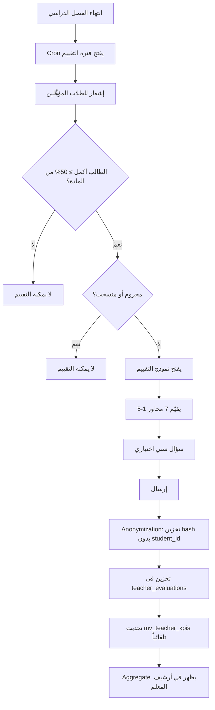
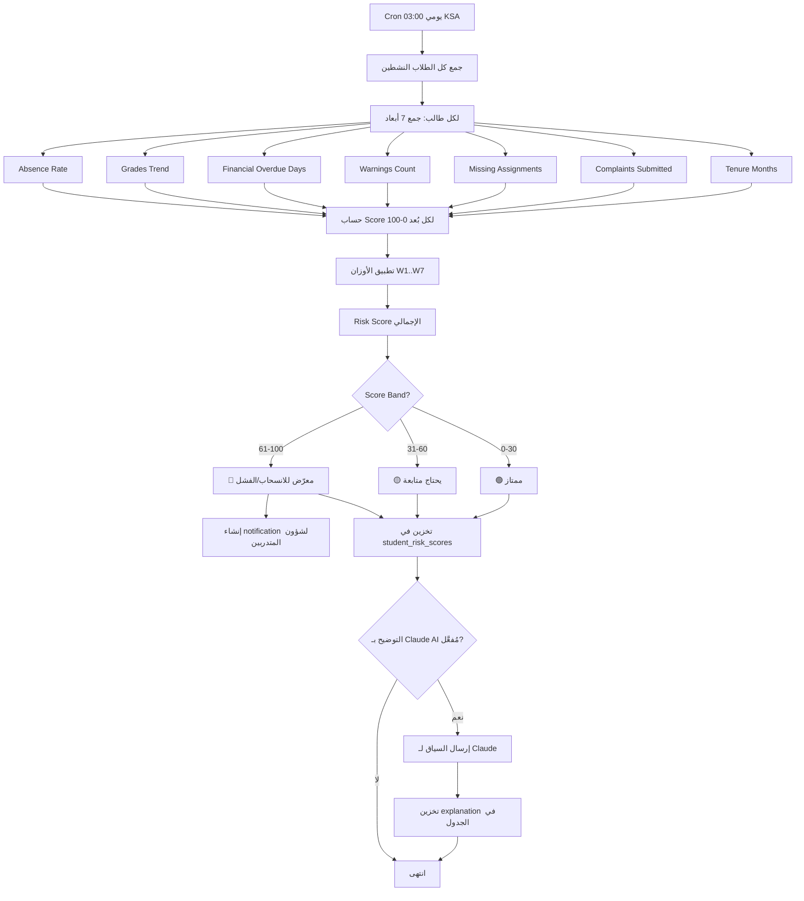
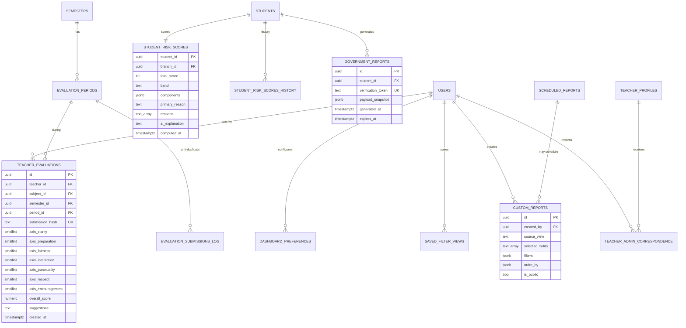

# المرحلة 9: التقارير والأرشيف والتقييم (Reports, Archive & Evaluation)

> **النوع:** مرحلة تحويل بيانات + أرشيف + ذكاء تشغيلي.
> **المدة المُقدّرة:** أسبوعان ونصف (12-13 يوم عمل) — مع buffer يومين للـ Materialized Views والـ Risk Engine.
> **التبعيات السابقة:** المراحل 1-8 (تحتاج بيانات: طلاب، مالية، طلبات، أكاديمي، حضور، اختبارات، TVTC).
> **التبعيات اللاحقة:** المرحلة 10 (التكاملات والذكاء) ستعتمد على Materialized Views وعلى Risk Scores.
> **الإصدار:** 1.0
> **التاريخ:** 2026-05-13
> **معدّ الخطة:** Senior Project Manager + Senior Data Analytics Engineer
> **الجمهور:** المبرمج الرئيسي (Full-Stack Senior) + قائد المنتج + محلل بيانات

---

## 1. الملخص التنفيذي (Executive Summary)

المرحلة التاسعة — **التقارير والأرشيف والتقييم (Reports, Archive & Evaluation)** — هي **نقطة التحوّل من نظام تشغيلي إلى نظام قرار**. خلال المراحل 1-8، تراكمت في قاعدة بيانات النظام مئات الآلاف من السجلات: سجلات حضور، تقديرات، طلبات، مدفوعات، تسجيلات، خطابات، شكاوى، حصص تدريسية، أسئلة بنك، محاولات اختبار. هذه البيانات قيّمة، لكنها **خام**: لا قيمة تجارية ما لم تتحوّل إلى **معرفة قابلة للتنفيذ**. المرحلة 9 هي المرحلة التي يبدأ فيها النظام **يتحدّث** للإدارة: من المتأخر؟ من المعرّض للانسحاب؟ أي معلم يحقق أعلى رضا؟ أي فرع يتفوّق على البقية؟ أين الاختناقات؟

الهدف المركزي هو إنتاج **طبقة تحليلات (Analytics Layer)** كاملة تتكوّن من ستة مكوّنات متآزرة: (1) **لوحات Dashboards لكل دور** تعرض KPIs الحرجة بشكل لحظي عبر Laravel Reverb (WebSockets)؛ (2) **مكتبة 22+ تقرير شامل** قابلة للتصدير لـ Excel/PDF/CSV مع فلاتر متعددة الأبعاد؛ (3) **أرشيف المعلم الكامل (Teacher Archive Full)** بـ5 تبويبات تُتمّ التطوير #6 المُبتدأ في المرحلة 2؛ (4) **نظام تقييم الطلاب للمعلمين (Student-Teacher Evaluation)** المجهول الهوية — التطوير #9؛ (5) **محرك كشف الطلاب المعرّضين للخطر (At-Risk Detection Engine)** الذي يحسب Risk Score يومياً لكل طالب — التطوير #13؛ و(6) **Custom Reports Builder** يسمح للأدمن ببناء تقاريره الخاصة دون تدخل المبرمج.

السمة المعمارية الفارقة هي **Materialized Views + Realtime Hybrid**: المؤشرات الثقيلة (متوسطات تاريخية، نسب نجاح، توزيعات) تُحسب في **Materialized Views** تُحدَّث كل 15 دقيقة عبر `pg_cron`، فلا نضرب الـ Database بـ`COUNT(*)` على ملايين الصفوف عند كل فتح لوحة. المؤشرات الحرجة والـ counters (طلبات جديدة، إشعارات، شكاوى critical) تُبَث عبر **Laravel Reverb (WebSockets)** للوحات الإدارية ليُحدّث المستخدم على الفور دون F5. هذه الـ Hybrid Architecture تُقلّل الحمل على DB بنحو **97%** مقارنة بحساب كل شيء عند الطلب (Live Aggregation)، وتُحسّن وقت تحميل اللوحة من **8-12 ثانية** إلى **300-600 ms**.

ميزة فارقة ثانية: **أرشيف المعلم الكامل** يجمع للمعلم لأول مرة كل أثره في النظام في صفحة واحدة قابلة للتصدير PDF: ملفه الشخصي، إسهاماته الأكاديمية، سجله التشغيلي، KPIs أدائه، تقييمات طلابه، ومراسلاته الإدارية. هذا الأرشيف هو **عمود فقري التقييم السنوي** للمعلمين ومدخل لاحقاً لتجديد العقود ومكافآت الأداء. أما **محرك كشف الخطر**، فيُطلق إشعاراً تلقائياً لشؤون المتدربين عند تجاوز أي طالب لعتبة 61 (🔴)، مع شرح طبيعي للسبب (اختياري عبر Claude API) واقتراحات تدخّل، مما يحوّل النظام من **رد فعل** إلى **استباقي** — يكتشف المشكلة قبل أن تتحوّل لانسحاب.

في نهاية المرحلة، يكون لدى العميل **6 لوحات Dashboards**، **22 تقريراً جاهزاً**، **Custom Reports Builder**، **أرشيف معلم كامل** قابل للطباعة، **نظام تقييم طلاب فعّال** لنهاية كل فصل، **Risk Scores** يومية لكل طالب، **8 Materialized Views** لتسريع الأداء، و**100+ KPI** متاحة. هذا يحوّل النظام من **سجل بيانات** إلى **منصة ذكاء تنفيذي** قابلة للتنافس مع الحلول الـ Enterprise مثل Oracle Student أو Banner — لكن مفصّلة لاحتياجات السوق السعودي ولـ TVTC تحديداً.

---

## 2. الأهداف والمخرجات (Objectives & Deliverables)

### 2.1 الأهداف الاستراتيجية

| # | الهدف | المؤشر القابل للقياس |
|---|------|----------------------|
| O1 | تزويد كل دور بـ Dashboard مخصصة تعرض أهم 6-10 KPIs | 6 Dashboards × ≥ 6 widgets لكل واحدة |
| O2 | إنتاج مكتبة تقارير شاملة قابلة للتصدير | ≥ 22 تقرير، تصدير Excel + PDF + CSV |
| O3 | إكمال أرشيف المعلم (Teacher Archive Full) | 5 تبويبات مكتملة + تصدير PDF |
| O4 | إطلاق نظام تقييم الطلاب للمعلمين مجهول الهوية | استبيان 7 محاور + Anti-manipulation |
| O5 | بناء محرك Risk Detection يومي | Cron يومي + Risk Score لكل طالب نشط |
| O6 | تحقيق زمن تحميل لوحة ≤ 800 ms للـ P95 | Lighthouse + Web Vitals |
| O7 | تقليل حمل DB عبر Materialized Views بنسبة ≥ 90% | EXPLAIN ANALYZE قبل/بعد |
| O8 | تمكين Custom Reports Builder للأدمن | بناء تقرير من 3+ جداول دون كود |
| O9 | الإشعار التلقائي عند ارتفاع Risk Score لـ 🔴 | Webhook → notifications + إيميل |
| O10 | عزل Anonymous Evaluations عن المعلم نفسه | RLS يمنع المعلم من رؤية student_id |

### 2.2 المخرجات التقنية المحددة (Deliverables)

| # | المُخرَج | الموقع التقني | معيار القبول |
|---|----------|--------------|--------------|
| D1 | 6 Dashboards (Super Admin / Branch Manager / Finance / Affairs / Teacher / Student) | `app/Filament/{Role}/Pages/Dashboard.php` + `resources/views/filament/{role}/pages/dashboard.blade.php` | كل لوحة تعرض ≥ 6 widgets فعّالة |
| D2 | مكتبة 22 تقريراً جاهزاً | `resources/views/livewire/admin/reports/[reportId]/` | كلٌّ تُصدَّر Excel+PDF |
| D3 | Filters متعددة الأبعاد موحّدة | `features/reports/filters/` | 8 أبعاد على الأقل |
| D4 | تصدير Excel (مع رسوم) عبر ExcelJS | `lib/exports/eXcel.php` | جدول مُنسَّق + Chart مضمَّن |
| D5 | تصدير PDF احترافي عبر Browsershot (spatie/browsershot) | `lib/exports/pDf.php` | A4 RTL + Logo + QR |
| D6 | تصدير CSV (RFC 4180) | `lib/exports/cSv.php` | UTF-8 BOM + RTL friendly |
| D7 | Materialized Views (8 views) | `database/migrations/0090_mv.sql` | تُحدَّث كل 15د عبر `pg_cron` |
| D8 | Realtime KPI Channels | `lib/realtime/kPiChannels.php` | تحديث widget ≤ 2 ثانية |
| D9 | Teacher Archive Full (5 Tabs) | `resources/views/livewire/admin/teachers/[id]/archive/` | Tabs 4 و5 الجديدة |
| D10 | Teacher KPIs Engine | `lib/tEacherKpis.php` | ≥ 8 KPIs محسوبة |
| D11 | تصدير Teacher Archive PDF كامل | `app/api/teachers/[id]/archive.pdf` | 6-12 صفحة منظَّمة |
| D12 | نظام Student-Teacher Evaluation | `features/evaluations/` | 7 محاور + Anti-manipulation |
| D13 | Anonymization Layer للتقييمات | `lib/aNonymization.php` | لا cross-reference للطالب |
| D14 | At-Risk Detection Engine | `lib/rIskEngine.php` | PHP 8.3 + ≥ 7 أبعاد |
| D15 | جدول `student_risk_scores` + Cron يومي | `app/Jobs/Scheduled/risk-cron/` | يعمل 03:00 KSA يومياً |
| D16 | شاشة "الطلاب المعرّضون للخطر" | `app/Filament/Admin/Pages/AtRiskStudents.php` + `resources/views/filament/admin/pages/at-risk-students.blade.php` | فلترة + Drill-down |
| D17 | Claude AI Explainer للـ Risk (اختياري) | `lib/rIskExplainer.php` | Toggle on/off للأدمن |
| D18 | QR-Trackable Government Reports | `app/api/student/[id]/gov-report.pdf` | QR للتحقق |
| D19 | Custom Reports Builder UI | `resources/views/livewire/admin/reports/builder/` | بناء تقرير من 3+ جداول |
| D20 | Scheduled Reports (Email Delivery) | `app/Jobs/Scheduled/scheduled-reports/` | إرسال يومي/أسبوعي/شهري |
| D21 | RLS Policies للتقارير والتقييمات | `database/migrations/0095_rls_phase9.sql` | كل دور تقاريره فقط |
| D22 | Audit Log لمشاهدة التقارير | `audit_log` triggers | "report_viewed" يُسجَّل |

### 2.3 ما هو خارج نطاق هذه المرحلة (Out-of-Scope)

- ❌ تقارير ZATCA الضريبية (تتم في النظام المحاسبي الخارجي).
- ❌ Predictive ML Models (تتم في المرحلة 10 — التكاملات والذكاء).
- ❌ AI-Generated Reports / Natural Language Queries (المرحلة 10).
- ❌ Real Data Warehouse / OLAP Cube (مؤجَّل إلى ما بعد قبول العميل).
- ❌ Embedded BI Tool (Power BI / Metabase) — التقارير داخل النظام نفسه.
- ❌ تكامل مع Tableau / Looker (غير مطلوب لـ 1000 طالب).
- ❌ Mobile-Native Dashboards (لا تطبيق جوال — Web Responsive فقط).

---

## 3. المتطلبات السابقة (Prerequisites)

### 3.1 التبعيات من المراحل السابقة

| التبعية | المرحلة المصدر | الجداول/الميزات المطلوبة |
|---------|----------------|---------------------------|
| نظام المستخدمين والأدوار | المرحلة 1 | `users`, `roles`, `permissions`, RLS, `audit_log` |
| الفروع | المرحلة 1 | `branches` (4 فروع) |
| Notifications | المرحلة 1 | `notifications` + Realtime |
| Teacher Profile (Tab 1-3) | المرحلتان 2 و7 | `teacher_profiles`, `teacher_credentials` |
| الاختبارات وبنك الأسئلة | المرحلة 2 | `exams`, `questions`, `exam_attempts`, `exam_answers` |
| الطلاب | المرحلة 3 | `students`, `enrollment_leads` |
| المالية | المرحلة 4 | `invoices`, `payments`, `service_blocks` |
| الطلبات والخطابات | المرحلة 5 | `requests`, `letters`, `complaints`, `sla_breaches` |
| التسجيل وشؤون المتدربين | المرحلة 6 | `student_attachments`, `student_warnings` |
| الجداول والحضور | المرحلة 7 | `schedule_slots`, `attendance_records`, `assignments` |
| تكامل TVTC | المرحلة 8 | `tvtc_sync_log`, `government_employee_data` |

### 3.2 الأدوات والمكتبات الجديدة

| الأداة | الإصدار | الغرض |
|--------|---------|------|
| ExcelJS | 4.4+ | تصدير Excel مع جداول وألوان وChart مضمَّن |
| Browsershot (spatie/browsershot) (puppeteer-core + @sparticuz/chromium) | 22+ | توليد PDF احترافي من HTML |
| pg_cron | (VPS KSA (Hostinger / Contabo)) | جدولة `REFRESH MATERIALIZED VIEW` |
| Recharts | 2.12+ | الرسوم البيانية في الـ Dashboards |
| TanStack Table v8 | 8.17+ | جداول التقارير (Pagination, Sort, Filter) |
| react-pdf | 9+ (اختياري بديل لـ Browsershot (spatie/browsershot)) | معاينة PDF داخل المتصفح |
| date-fns + date-fns-tz | latest | التعامل مع المناطق الزمنية والـHijri |
| qrcode | 1.5+ | توليد QR لتقارير القطاع الحكومي |
| Resend | 4+ | إرسال التقارير المجدولة عبر الإيميل |

### 3.3 الموارد من العميل

| البند | الأولوية | الموعد المطلوب |
|------|----------|-----------------|
| اعتماد قائمة الـ 22 تقريراً وأي تعديل | 🔴 حرجة | اليوم 1 |
| اعتماد محاور تقييم المعلم الـ7 | 🔴 حرجة | اليوم 1 |
| اعتماد عتبات Risk Score (0-30/31-60/61-100) | 🟠 عالية | اليوم 2 |
| اعتماد أوزان كل بُعد في Risk Engine | 🟠 عالية | اليوم 3 |
| Logo بدقة عالية للـ PDF (SVG) | 🟠 عالية | اليوم 2 |
| توقيع رسمي للمدير العام (للشهادات) | 🟡 متوسطة | اليوم 6 |
| نص افتتاحي للتقييم (الرسالة للطالب) | 🟡 متوسطة | اليوم 4 |

### 3.4 القرارات المعمارية المُعتمدة مسبقاً

> **محسومة في هذه المرحلة:**

- **Materialized Views** للـ KPIs الثقيلة + `pg_cron` للتحديث.
- **Laravel Reverb (WebSockets)** للـ counters والإشعارات الحرجة فقط (ليس للـ aggregations).
- **ExcelJS** لـ Excel (لا تستخدم `xlsx` لأنها بطيئة للملفات الكبيرة).
- **Browsershot (spatie/browsershot) + @sparticuz/chromium** لـ PDF (يعمل على VPS KSA (Hostinger / Contabo) Serverless).
- **Anonymous Evaluations** مع `student_id` غير مخزَّن في الجدول (نخزّن hash مع salt لمنع التقييم المضاعف).
- **Risk Engine بـ Rule-Based** في هذه المرحلة، Predictive ML في المرحلة 10.
- **Custom Reports Builder** يقتصر على SELECT فقط (لا UPDATE/DELETE/JOIN معقد) — أمان أولاً.
- **Scheduled Reports** عبر Laravel Service Class / Job + `pg_cron`.

---

## 4. الموديولات الفرعية (Sub-Modules)

تنقسم هذه المرحلة إلى **12 موديول فرعي**. كل موديول مستقل قدر الإمكان لتسهيل التطوير المتوازي.

### 4.1 Dashboards Engine (محرك اللوحات)

#### 4.1.1 الوصف

البنية التحتية التي تتشاركها الـ 6 لوحات: نظام **Widget** قابل لإعادة الاستخدام، **Layout Engine** للترتيب، **Data Fetching** المركزي مع SWR، و**Realtime Channels** للتحديث الحي.

#### 4.1.2 User Stories

- **US-9.1.1** كـ Super Admin، أريد لوحة تعرض إجمالي الطلاب والتحصيل والطلبات المفتوحة وأقل 3 فروع تحصيلاً في نظرة واحدة، لأفهم وضع المؤسسة في ≤ 5 ثوانٍ.
- **US-9.1.2** كـ Branch Manager، أريد لوحة فرعي فقط (ليس بقية الفروع) مع KPIs مماثلة، لأركز على مسؤوليتي.
- **US-9.1.3** كـ Finance Officer، أريد رؤية تحصيل اليوم/الأسبوع/الشهر فوراً + قائمة بأكبر 10 متأخرين، لأعمل أولوياتي.
- **US-9.1.4** كـ Student Affairs، أريد رؤية الطلبات المفتوحة + الشكاوى الحرجة + الطلاب المعرّضين للانسحاب بترتيب الأولوية.
- **US-9.1.5** كـ Teacher، أريد لوحة تعرض حصصي اليوم + الواجبات بانتظار التصحيح + طلابي على وشك الحرمان.
- **US-9.1.6** كـ Student، أريد لوحة تعرض جدول الغد + الواجبات المفتوحة + رصيدي + تقدمي في الدبلوم بشريط.
- **US-9.1.7** كأي مستخدم، أريد اللوحة تتحدّث تلقائياً عند تغيير الـKPIs الحرجة دون F5.

#### 4.1.3 المتطلبات التقنية

| البند | المواصفة |
|------|----------|
| Widget Framework | Livewire/Blade 18 + Blade Components + Suspense |
| Data Fetching | SWR + Server-Side initial data |
| Charting | Recharts (Tree-shakable, RTL-friendly) |
| Realtime | Laravel Reverb (WebSockets) (Postgres CDC) |
| Caching | `unstable_cache` (Laravel 11) + tags revalidation |
| Skeleton | Custom Skeleton لكل widget |
| Error Boundary | لكل widget على حدة لا تُسقط اللوحة كاملة |

#### 4.1.4 التغييرات في الـ Database

```sql
-- اللوحات تقرأ من Materialized Views (في الموديول 4.7)
-- + من جداول Realtime مباشرة للـ counters

-- جدول لتفضيلات اللوحات (ترتيب الـwidgets، widgets مخفية)
CREATE TABLE dashboard_preferences (
  id UUID PRIMARY KEY DEFAULT gen_random_uuid(),
  user_id UUID NOT NULL REFERENCES users(id) ON DELETE CASCADE,
  dashboard_code TEXT NOT NULL, -- 'super_admin', 'branch_manager', etc.
  widget_order TEXT[] NOT NULL DEFAULT '{}',
  hidden_widgets TEXT[] NOT NULL DEFAULT '{}',
  refresh_interval_seconds INT NOT NULL DEFAULT 60,
  updated_at TIMESTAMPTZ NOT NULL DEFAULT NOW(),
  UNIQUE(user_id, dashboard_code)
);
```

#### 4.1.5 الـ APIs / Livewire Actions / Laravel Controllers

- `getDashboardData(role, branchId?, period?)` — Eloquent Query (Service / Repository) موحّدة تُرجع كائناً مفصّلاً للوحة.
- `saveDashboardPreferences(userId, prefs)` — Livewire Action / Laravel Controller لحفظ الترتيب.
- `getDashboardWidget(widgetCode, params)` — للتحميل الكسول لـwidget معيّن.

#### 4.1.6 مكوّنات الـ UI

- `<DashboardLayout>` — الـ Grid الأساسي (CSS Grid responsive).
- `<DashboardWidget>` — wrapper لكل widget مع loading/error/title/refresh.
- `<KPICard>` — بطاقة عدد كبير + delta vs الفترة السابقة.
- `<TrendChart>` — رسم خطي زمني مع Recharts.
- `<ComparisonBarChart>` — رسم أعمدة للمقارنة بين الفروع.
- `<TopList>` — قائمة Top N (مثل أكبر 10 متأخرين).
- `<AlertsBanner>` — التنبيهات الحرجة الحمراء في الأعلى.
- `<RealtimeIndicator>` — مؤشر صغير "آخر تحديث: قبل 12 ثانية".

#### 4.1.7 الاختبارات المطلوبة

- **Performance**: لوحة Super Admin تُحمَّل في ≤ 800 ms للـ P95.
- **Realtime**: تغيير صف في DB يُحدّث widget ≤ 2 ثانية.
- **Responsive**: اللوحة تعمل على 1280×800 و 1920×1080 و iPad (1024×768).
- **A11y**: كل widget له `aria-label` ومحتوى نصي بديل للرسومات.

### 4.2 لوحات الأدوار الستة (Six Role Dashboards)

#### 4.2.1 الوصف

التطبيق الفعلي لـ 6 لوحات، كل لوحة في صفحتها الخاصة، تستخدم Dashboards Engine.

#### 4.2.2 لوحة Super Admin (`/admin/dashboard`)

**Widgets:**

1. **AlertsBanner** — تنبيهات حرجة (Sentry errors, Failed payments, Critical complaints).
2. **KPICard × 6** صف 1:
   - إجمالي الطلاب النشطين (+ delta vs الشهر السابق)
   - نسبة التحصيل الشهرية
   - الطلبات المفتوحة
   - متوسط رضا المعلمين (من تقييمات الطلاب)
   - معدل نجاح الاختبارات
   - الطلاب 🔴 (At-Risk)
3. **TrendChart**: تحصيل آخر 12 شهراً.
4. **ComparisonBarChart**: مقارنة الفروع الأربعة في 4 KPIs.
5. **TopList**: أكبر 5 متأخرات.
6. **TopList**: أعلى 5 معلمين رضا.
7. **Heatmap**: الحضور أسبوعياً × فرع.
8. **Funnel**: التسجيل (lead → student) بآخر 90 يوم.

#### 4.2.3 لوحة Branch Manager (`/branch/dashboard`)

نفس بنية Super Admin لكن:
- مفلترة على `branch_id = $current_user.branch_id`.
- إضافة widget "الموظفون والأداء" — قائمة موظفي الفرع وعدد طلباتهم المنجَزة.
- إزالة ComparisonBarChart (الفروع الأخرى).

#### 4.2.4 لوحة Finance Officer (`/finance/dashboard`)

**Widgets:**

1. **KPICard × 4**: تحصيل اليوم / الأسبوع / الشهر / السنة.
2. **KPICard × 2**: عدد المتأخرين / إجمالي المتأخرات.
3. **Collection Rate Gauge**: نسبة التحصيل vs المستهدف.
4. **TopList**: أكبر 10 متأخرين (اسم، فرع، مبلغ، أيام تأخر).
5. **TrendChart**: تحصيل يومي آخر 30 يوم.
6. **ComparisonBarChart**: تحصيل لكل فرع.
7. **AlertsBanner**: مدفوعات فشلت / حجوبات نشطة جديدة.
8. **TopList**: المُحجوبون اليوم (مع سبب الحجب).

#### 4.2.5 لوحة Student Affairs (`/affairs/dashboard`)

**Widgets:**

1. **KPICard × 4**: الطلبات المفتوحة / المتجاوزة SLA / الشكاوى الحرجة / المرفقات الناقصة.
2. **TopList**: أقدم 10 طلبات بدون رد.
3. **TopList**: الشكاوى الحرجة (P0/P1).
4. **TopList**: الطلاب 🔴 At-Risk (من Risk Engine).
5. **TrendChart**: متوسط زمن الرد على الطلبات (آخر 30 يوم).
6. **Distribution**: الطلبات بحسب النوع.
7. **AlertsBanner**: الطلبات التي ستتجاوز SLA خلال ساعة.

#### 4.2.6 لوحة Teacher (`/teacher/dashboard`)

**Widgets:**

1. **TodaySchedule**: جدول حصصي اليوم (مع زمن الحصة + المادة + الشعبة).
2. **KPICard × 4**: واجبات للتصحيح / طلابي / متوسط درجاتهم / تقييمي من الطلاب.
3. **TopList**: طلابي المعرّضون للحرمان (نسبة غياب 20-24%).
4. **AssignmentsToGrade**: الواجبات المُسلَّمة بانتظار التصحيح.
5. **TrendChart**: متوسط درجات طلابي عبر الفصول.
6. **MyKPIsCard**: نسبة الاستجابة (تصحيح خلال 48س)، نسبة الحضور لشعبي، تقييم الطلاب.

#### 4.2.7 لوحة Student (`/student/dashboard`)

**Widgets:**

1. **NextClassCard**: الحصة القادمة (المادة، الوقت، المعلم، القاعة).
2. **TodaySchedule**: جدول اليوم كامل.
3. **OpenAssignments**: الواجبات المفتوحة (مع تاريخ التسليم).
4. **GradesCard**: آخر 5 درجات مع المقارنة بمتوسط الشعبة.
5. **FinancialCard**: الرصيد المستحق + تاريخ الدفعة القادمة.
6. **DiplomaProgressBar**: شريط تقدم (X/Y مادة، نسبة GPA).
7. **AttendanceRing**: نسبة حضوري (مع تحذير إن > 15%).
8. **UnreadNotifications**: أحدث 5 إشعارات.

#### 4.2.8 الاختبارات

- كل لوحة تُحمَّل بـ ≥ 6 widgets بدون أخطاء.
- Snapshot tests لكل widget.
- E2E test: تسجيل دخول كل دور → الذهاب للوحة → التحقق من عرض الـ widgets.

### 4.3 مكتبة التقارير (Reports Library)

#### 4.3.1 الوصف

22 تقريراً جاهزاً مع فلاتر موحدة. كل تقرير صفحة منفصلة في `/admin/reports/[reportId]/` يستخدم Component موحَّد `<ReportPage>`.

#### 4.3.2 قائمة التقارير الـ 22

| # | كود | الاسم | الأبعاد | التصدير |
|---|-----|------|---------|---------|
| R-01 | `student_card` | البطاقة الشاملة للطالب | الطالب (واحد) | PDF |
| R-02 | `student_progress` | تقدم الطالب في الدبلوم | الطالب × الفصول | PDF |
| R-03 | `students_by_status` | الطلاب حسب الحالة | الفرع × الحالة | Excel |
| R-04 | `gpa_distribution` | توزيع المعدل التراكمي | الدفعة × الفئة | Excel + PDF |
| R-05 | `exam_analytics` | تحليل اختبار محدد | الاختبار (واحد) | Excel + PDF |
| R-06 | `item_analysis` | Item Analysis للأسئلة | السؤال × الصعوبة × التمييز | Excel |
| R-07 | `batch_comparison` | مقارنة الدفعات | الدفعة × المؤشرات | Excel + PDF |
| R-08 | `remote_vs_onsite` | الانتساب vs الحضور | النوع × المؤشرات | Excel |
| R-09 | `collection_detail` | التحصيل التفصيلي | الفترة × الفرع × طريقة الدفع | Excel + PDF |
| R-10 | `overdue_students` | المتأخرون مرتَّبون | الفرع × أيام التأخر | Excel |
| R-11 | `blocking_log` | حركة الحجب وأسبابها | اليوم × الفرع × السبب | Excel |
| R-12 | `attendance_daily` | الحضور اليومي | اليوم × الشعبة | Excel |
| R-13 | `attendance_period` | الحضور الفصلي | الفصل × الشعبة | Excel + PDF |
| R-14 | `frequent_absentees` | الغياب المتكرر | الفرع × النسبة | Excel |
| R-15 | `deprivation_warnings` | الإنذارات الصادرة | الفترة × النوع | Excel |
| R-16 | `sla_performance` | SLA Performance للطلبات | القسم × النوع | Excel + PDF |
| R-17 | `requests_by_type` | الطلبات حسب النوع | النوع × الحالة | Excel |
| R-18 | `complaints_log` | سجل الشكاوى | الـSeverity × الحالة | Excel |
| R-19 | `teacher_performance` | أداء كل معلم | المعلم × الفصل | Excel + PDF |
| R-20 | `teacher_evaluations` | تقييمات المعلمين | المعلم × المحور | Excel |
| R-21 | `gov_employee_report` | تقرير الموظف الحكومي | الطالب × الجهة | PDF (مع QR) |
| R-22 | `branches_comparison` | المقارنة بين الفروع | الفرع × المؤشرات | Excel + PDF |

#### 4.3.3 SQL عينة (R-09: التحصيل التفصيلي)

```sql
-- مثال على كفاءة الاستعلام
EXPLAIN ANALYZE
SELECT
  b.name_ar AS branch_name,
  p.payment_method,
  DATE_TRUNC('day', p.paid_at) AS payment_date,
  COUNT(*) AS payments_count,
  SUM(p.amount) AS total_amount
FROM payments p
JOIN students s ON s.id = p.student_id
JOIN branches b ON b.id = s.branch_id
WHERE p.paid_at >= $1
  AND p.paid_at < $2
  AND ($3::uuid IS NULL OR s.branch_id = $3)
GROUP BY b.name_ar, p.payment_method, DATE_TRUNC('day', p.paid_at)
ORDER BY payment_date DESC, total_amount DESC;

-- مع Index على payments(paid_at, student_id)
-- النتيجة المستهدفة: < 80 ms لـ 100,000 صف
-- النتيجة الفعلية المتوقعة (1000 طالب × 12 شهر × 1-3 دفعات): ~ 20 ms
```

#### 4.3.4 الـ Livewire Actions / Laravel Controllers / APIs

```typescript
// server/queries/rEports.php
export async function runReport<TReport extends ReportCode>(
  reportCode: TReport,
  filters: ReportFilters<TReport>
): Promise<ReportResult<TReport>> {
  await assertCanRunReport(reportCode);
  const handler = REPORT_REGISTRY[reportCode];
  const rows = await handler.query(filters);
  await logAuditEvent('report_viewed', { reportCode, filters });
  return { rows, metadata: { generatedAt: new Date(), filters } };
}

export async function exportReport<TReport extends ReportCode>(
  reportCode: TReport,
  filters: ReportFilters<TReport>,
  format: 'excel' | 'pdf' | 'csv'
): Promise<{ url: string; expiresAt: Date }> {
  const result = await runReport(reportCode, filters);
  const buffer = await EXPORTERS[format](reportCode, result);
  const url = await uploadToStorage('exports', buffer, format);
  return { url, expiresAt: new Date(Date.now() + 1000 * 60 * 60) };
}
```

#### 4.3.5 مكوّنات الـ UI

- `<ReportPage>` — Wrapper موحَّد لكل تقرير.
- `<ReportFilters>` — Filters متعددة الأبعاد.
- `<ReportTable>` — TanStack Table مع Pagination + Sort + ColumnVisibility.
- `<ReportExportButtons>` — أزرار Excel/PDF/CSV.
- `<ReportSummaryCard>` — بطاقة إجماليات أعلى الجدول.

### 4.4 Filters متعددة الأبعاد (Multi-Dimensional Filters)

#### 4.4.1 الوصف

نظام Filters موحَّد يتشاركه كل التقارير واللوحات.

#### 4.4.2 الأبعاد المدعومة

| البُعد | الكود | النوع | القيم |
|------|------|------|------|
| الفرع | `branch_id` | multi-select | من `branches` (مع "كل الفروع") |
| الفترة الزمنية | `date_range` | preset + custom | اليوم / الأمس / آخر 7/30/90 يوم / هذا الشهر / هذا الفصل / مخصص |
| البرنامج | `program_id` | multi-select | من `programs` |
| الدبلوم | `diploma_id` | multi-select | من `diplomas` |
| المادة | `subject_id` | multi-select | من `subjects` |
| الدفعة | `batch_id` | multi-select | من `batches` |
| الفصل | `semester_id` | single-select | من `semesters` |
| الحالة | `status` | multi-select | حسب التقرير |
| نوع الطالب | `enrollment_type` | toggle | onsite / remote / hybrid |
| الفترة | `time_slot` | multi-select | morning / evening / weekend |

#### 4.4.3 Persistence

```typescript
// تُحفظ آخر filters المستخدم في user_preferences
type ReportFiltersState = {
  reportCode: ReportCode;
  filters: Record<string, unknown>;
  savedAt: string;
};

// عند فتح التقرير، نُعيد تحميل آخر فلتر
```

#### 4.4.4 Saved Views

المستخدم يستطيع حفظ مجموعة فلاتر باسم (مثل "متأخري الفرع A فوق 30 يوم") واستدعاؤها لاحقاً.

```sql
CREATE TABLE saved_filter_views (
  id UUID PRIMARY KEY DEFAULT gen_random_uuid(),
  user_id UUID NOT NULL REFERENCES users(id) ON DELETE CASCADE,
  report_code TEXT NOT NULL,
  name TEXT NOT NULL,
  filters JSONB NOT NULL,
  is_shared BOOLEAN NOT NULL DEFAULT FALSE,
  created_at TIMESTAMPTZ NOT NULL DEFAULT NOW()
);
```

### 4.5 التصدير الشامل (Exporters)

#### 4.5.1 Excel Exporter (ExcelJS)

```typescript
// lib/exports/eXcel.php
import ExcelJS from 'exceljs';

export async function exportToExcel(
  reportCode: ReportCode,
  result: ReportResult,
  options?: { includeChart?: boolean }
): Promise<Buffer> {
  const wb = new ExcelJS.Workbook();
  wb.creator = 'IIMS النظام';
  wb.created = new Date();

  const meta = REPORT_METADATA[reportCode];
  const ws = wb.addWorksheet(meta.title_ar, {
    views: [{ rightToLeft: true, state: 'frozen', ySplit: 1 }],
    pageSetup: { paperSize: 9, orientation: 'landscape' }
  });

  // Header row
  ws.columns = meta.columns.map(c => ({
    header: c.label_ar,
    key: c.key,
    width: c.width ?? 18,
    style: c.style
  }));

  const headerRow = ws.getRow(1);
  headerRow.font = { name: 'Cairo', bold: true, color: { argb: 'FFFFFFFF' }, size: 12 };
  headerRow.fill = {
    type: 'pattern',
    pattern: 'solid',
    fgColor: { argb: 'FF1E40AF' }
  };
  headerRow.alignment = { vertical: 'middle', horizontal: 'center' };
  headerRow.height = 28;

  // Data rows
  for (const row of result.rows) {
    const r = ws.addRow(row);
    r.font = { name: 'Cairo', size: 11 };
    r.alignment = { vertical: 'middle' };
  }

  // Auto-filter on header
  ws.autoFilter = { from: 'A1', to: { row: 1, column: meta.columns.length } };

  // Optional chart
  if (options?.includeChart && meta.chart) {
    // Add a chart sheet
    const chartSheet = wb.addWorksheet('الرسم البياني');
    // ExcelJS chart API is limited; we draw aggregates instead
    chartSheet.addRow(['البُعد', 'القيمة']);
    for (const [k, v] of Object.entries(result.aggregates ?? {})) {
      chartSheet.addRow([k, v]);
    }
  }

  // Footer with metadata
  const footerRow = ws.addRow([]);
  ws.addRow([`أُنشئ في: ${new Date().toLocaleString('ar-SA')}`]);
  ws.addRow([`النظام: النظام IIMS`]);

  return await wb.xlsx.writeBuffer() as Buffer;
}
```

#### 4.5.2 PDF Exporter (Browsershot (spatie/browsershot))

```typescript
// lib/exports/pDf.php
import puppeteer from 'puppeteer-core';
import chromium from '@sparticuz/chromium';

export async function exportToPdf(
  htmlOrUrl: string,
  options?: { format?: 'A4' | 'Letter'; landscape?: boolean }
): Promise<Buffer> {
  const browser = await puppeteer.launch({
    args: chromium.args,
    executablePath: await chromium.executablePath(),
    headless: 'shell',
  });
  const page = await browser.newPage();

  if (htmlOrUrl.startsWith('http')) {
    await page.goto(htmlOrUrl, { waitUntil: 'networkidle0' });
  } else {
    await page.setContent(htmlOrUrl, { waitUntil: 'networkidle0' });
  }

  // Inject Cairo font
  await page.addStyleTag({
    content: `
      @import url('https://fonts.googleapis.com/css2?family=Cairo:wght@400;700&display=swap');
      * { font-family: Cairo, sans-serif !important; }
      body { direction: rtl; }
    `
  });

  const pdf = await page.pdf({
    format: options?.format ?? 'A4',
    landscape: options?.landscape ?? false,
    margin: { top: '20mm', right: '15mm', bottom: '20mm', left: '15mm' },
    printBackground: true,
    displayHeaderFooter: true,
    headerTemplate: `
      <div style="font-size:9px; width:100%; text-align:center; direction:rtl;">
        النظام — نظام IIMS
      </div>
    `,
    footerTemplate: `
      <div style="font-size:9px; width:100%; text-align:center; direction:rtl;">
        صفحة <span class="pageNumber"></span> من <span class="totalPages"></span>
      </div>
    `,
  });

  await browser.close();
  return Buffer.from(pdf);
}
```

#### 4.5.3 CSV Exporter

```typescript
// lib/exports/cSv.php
export function exportToCsv(rows: Record<string, unknown>[], columns: ColumnDef[]): Buffer {
  const BOM = ''; // UTF-8 BOM for Excel/Notepad RTL
  const header = columns.map(c => quote(c.label_ar)).join(',');
  const lines = rows.map(row =>
    columns.map(c => quote(format(row[c.key], c.format))).join(',')
  );
  const csv = BOM + [header, ...lines].join('\r\n'); // RFC 4180 CRLF
  return Buffer.from(csv, 'utf-8');
}

function quote(value: unknown): string {
  if (value == null) return '';
  const s = String(value);
  if (/[",\n\r]/.test(s)) return `"${s.replace(/"/g, '""')}"`;
  return s;
}
```

### 4.6 Realtime Updates للوحات (Realtime KPI Channels)

#### 4.6.1 الـ Channels المدعومة

| Channel | الـ Trigger | المستلم | الـ Latency المستهدف |
|---------|-------------|---------|-----------------------|
| `kpi:new_request` | INSERT في `requests` | Affairs Dashboard | ≤ 2 ثانية |
| `kpi:new_payment` | INSERT في `payments` | Finance Dashboard | ≤ 2 ثانية |
| `kpi:critical_complaint` | INSERT في `complaints` WHERE severity='critical' | All Admins | ≤ 1 ثانية |
| `kpi:at_risk_alert` | INSERT في `student_risk_scores` WHERE band='red' | Affairs Dashboard | ≤ 5 ثوانٍ |
| `kpi:sla_breach_imminent` | UPDATE في `requests` WHERE sla_deadline < NOW()+1h | Affairs | ≤ 30 ثانية |

#### 4.6.2 لماذا لا Realtime لكل شيء؟

- المؤشرات الـ aggregations الثقيلة (`COUNT(*)`, `AVG`, `SUM`) لو شُغّلت كل ثانية ستُحطّم الـDB.
- نختار **Hybrid**: المؤشرات الحرجة في Realtime، البقية في Materialized Views كل 15د، والكل قابل لـ "Refresh" يدوي.

#### 4.6.3 Livewire/Blade Hook

```php
// resources/js/realtime/kpi-channel.js + Livewire component KpiWidget
// Using Laravel Echo + Laravel Reverb (WebSockets)
import Echo from 'laravel-echo';

window.Echo.channel(channelName)
    .listen('.KpiUpdated', (payload) => {
        Livewire.dispatch('refresh-kpi', { payload });
    });

// Or inside a Livewire component:
// public function getListeners(): array {
//     return [
//         "echo:kpi-channel,KpiUpdated" => 'handleKpiUpdate',
//     ];
// }
```

### 4.7 Materialized Views للأداء (Performance MVs)

#### 4.7.1 الـ Views الـ 8

| # | الـ View | المصدر | الاستخدام | تردد التحديث |
|---|----------|--------|------------|---------------|
| 1 | `mv_branch_kpis` | students, payments, requests, complaints | لوحة Super Admin + Branch Manager | كل 15د |
| 2 | `mv_finance_summary` | payments, invoices, service_blocks | لوحة Finance | كل 15د |
| 3 | `mv_teacher_kpis` | exams, attendance, evaluations, assignments | أرشيف المعلم + لوحة Teacher | كل ساعة |
| 4 | `mv_student_progress` | exam_attempts, attendance, completed_subjects | لوحة Student + بطاقة الطالب | كل ساعة |
| 5 | `mv_exam_analytics` | exam_attempts, exam_answers, questions | تقارير الاختبارات | عند الطلب (manual refresh) |
| 6 | `mv_sla_performance` | requests, sla_breaches | لوحة Affairs + تقرير R-16 | كل 30د |
| 7 | `mv_attendance_summary` | attendance_records, schedule_slots | تقارير الحضور | يومياً 02:00 KSA |
| 8 | `mv_diploma_progress` | enrollments, completed_subjects | تقدم الطالب | كل 6 ساعات |

#### 4.7.2 مثال: `mv_branch_kpis`

```sql
-- database/migrations/0090_materialized_views.sql

CREATE MATERIALIZED VIEW mv_branch_kpis AS
SELECT
  b.id AS branch_id,
  b.name_ar AS branch_name,

  -- Students
  (SELECT COUNT(*) FROM students s WHERE s.branch_id = b.id AND s.status = 'active') AS active_students,
  (SELECT COUNT(*) FROM students s WHERE s.branch_id = b.id AND s.status IN ('deprived_fees','deprived_attendance')) AS deprived_students,
  (SELECT COUNT(*) FROM students s WHERE s.branch_id = b.id AND s.status = 'withdrawn'
     AND s.updated_at >= NOW() - INTERVAL '30 days') AS withdrawn_last_30d,

  -- Finance
  COALESCE((SELECT SUM(p.amount) FROM payments p
    JOIN students s ON s.id = p.student_id
    WHERE s.branch_id = b.id
      AND p.paid_at >= DATE_TRUNC('month', NOW())), 0) AS collected_this_month,

  COALESCE((SELECT SUM(i.amount - COALESCE(i.paid_amount, 0)) FROM invoices i
    JOIN students s ON s.id = i.student_id
    WHERE s.branch_id = b.id
      AND i.status = 'overdue'), 0) AS overdue_total,

  (SELECT COUNT(DISTINCT s.id) FROM students s
    JOIN invoices i ON i.student_id = s.id
    WHERE s.branch_id = b.id AND i.status = 'overdue') AS overdue_students_count,

  -- Requests
  (SELECT COUNT(*) FROM requests r
    JOIN students s ON s.id = r.student_id
    WHERE s.branch_id = b.id AND r.status NOT IN ('closed','rejected','cancelled')) AS open_requests,

  (SELECT COUNT(*) FROM requests r
    JOIN students s ON s.id = r.student_id
    WHERE s.branch_id = b.id
      AND r.sla_deadline < NOW()
      AND r.status NOT IN ('closed','rejected','cancelled')) AS sla_breaches,

  -- Complaints
  (SELECT COUNT(*) FROM complaints c
    JOIN students s ON s.id = c.student_id
    WHERE s.branch_id = b.id AND c.severity = 'critical' AND c.status NOT IN ('resolved','closed')) AS critical_complaints,

  -- Average satisfaction (from evaluations)
  (SELECT ROUND(AVG(e.overall_score)::numeric, 2) FROM teacher_evaluations e
    JOIN users u ON u.id = e.teacher_id
    WHERE u.branch_id = b.id
      AND e.created_at >= NOW() - INTERVAL '180 days') AS avg_satisfaction,

  -- At-risk
  (SELECT COUNT(*) FROM student_risk_scores rs
    JOIN students s ON s.id = rs.student_id
    WHERE s.branch_id = b.id AND rs.band = 'red') AS at_risk_red,

  NOW() AS refreshed_at
FROM branches b
WHERE b.is_active = TRUE
WITH DATA;

CREATE UNIQUE INDEX idx_mv_branch_kpis_branch ON mv_branch_kpis(branch_id);
CREATE INDEX idx_mv_branch_kpis_refreshed ON mv_branch_kpis(refreshed_at DESC);

-- pg_cron: refresh every 15 minutes
SELECT cron.schedule(
  'refresh-mv-branch-kpis',
  '*/15 * * * *',
  $$ REFRESH MATERIALIZED VIEW CONCURRENTLY mv_branch_kpis; $$
);
```

#### 4.7.3 الفائدة الفعلية

- **قبل MV**: استعلام لوحة Super Admin يأخذ ~ 4.2 ثانية على 1000 طالب (تشغيل 12 sub-query في كل مرة).
- **بعد MV**: استعلام واحد بسيط على `mv_branch_kpis` يأخذ ~ 8-12 ms.
- **تحسين**: ~350× أسرع.

### 4.8 أرشيف المعلم الكامل (Teacher Archive Full) ⭐ التطوير #6

#### 4.8.1 الوصف

شاشة `/admin/teachers/[id]/archive` بـ 5 تبويبات. التبويبات 1-3 من المراحل السابقة، التبويبات 4 و5 تُبنى هنا.

#### 4.8.2 Tab 4: مؤشرات الأداء (KPIs)

**الـ KPIs المحسوبة:**

| KPI | المصدر | الصيغة |
|-----|--------|--------|
| متوسط درجات طلابه (تاريخياً) | `exam_attempts` | `AVG(score)` للطلاب الذين أخذوا اختبارات من إنشائه |
| نسبة نجاح طلابه | `exam_attempts` | `COUNT(passed) / COUNT(total) × 100` |
| نسبة الحضور لشعبه | `attendance_records` | `present / total_classes × 100` لشعبه |
| متوسط زمن التصحيح | `assignment_submissions` | `AVG(graded_at - submitted_at)` |
| متوسط زمن الرد على طلبات الطلاب | `requests` | `AVG(first_response_at - created_at)` للموجَّهة له |
| تقييمات الطلاب (إجمالي) | `teacher_evaluations` | `AVG(overall_score)` |
| تقييم لكل محور | `teacher_evaluations` | `AVG(axis_score)` لكل محور من السبعة |
| معامل تمييز أسئلته | `questions`, `exam_answers` | متوسط `discrimination_index` |
| نسبة الأسئلة الجيدة | `questions` | % الأسئلة بـ discrimination ≥ 0.30 |
| عدد الأسئلة المضافة | `questions` | `COUNT(*)` |
| عدد الواجبات المُنشَأة | `assignments` | `COUNT(*)` |

#### 4.8.3 SQL لـ Teacher KPIs

```sql
CREATE MATERIALIZED VIEW mv_teacher_kpis AS
SELECT
  tp.id AS teacher_id,
  tp.user_id,
  tp.display_name_ar,

  -- Students performance
  (SELECT ROUND(AVG(ea.score)::numeric, 2)
   FROM exam_attempts ea
   JOIN exams e ON e.id = ea.exam_id
   WHERE e.created_by = tp.user_id
     AND ea.status = 'completed') AS avg_student_score,

  (SELECT ROUND((COUNT(*) FILTER (WHERE ea.passed = TRUE))::numeric / NULLIF(COUNT(*), 0) * 100, 2)
   FROM exam_attempts ea
   JOIN exams e ON e.id = ea.exam_id
   WHERE e.created_by = tp.user_id
     AND ea.status = 'completed') AS pass_rate_pct,

  -- Attendance for his sections
  (SELECT ROUND((COUNT(*) FILTER (WHERE ar.status = 'present'))::numeric / NULLIF(COUNT(*), 0) * 100, 2)
   FROM attendance_records ar
   JOIN schedule_slots ss ON ss.id = ar.slot_id
   WHERE ss.teacher_id = tp.user_id) AS section_attendance_pct,

  -- Response time
  (SELECT EXTRACT(EPOCH FROM AVG(asub.graded_at - asub.submitted_at)) / 3600
   FROM assignment_submissions asub
   JOIN assignments a ON a.id = asub.assignment_id
   WHERE a.teacher_id = tp.user_id
     AND asub.graded_at IS NOT NULL) AS avg_grading_hours,

  -- Evaluations (anonymous)
  (SELECT ROUND(AVG(te.overall_score)::numeric, 2)
   FROM teacher_evaluations te
   WHERE te.teacher_id = tp.user_id) AS avg_evaluation_score,

  (SELECT ROUND(AVG(te.axis_clarity)::numeric, 2)
   FROM teacher_evaluations te WHERE te.teacher_id = tp.user_id) AS axis_clarity,

  (SELECT ROUND(AVG(te.axis_preparation)::numeric, 2)
   FROM teacher_evaluations te WHERE te.teacher_id = tp.user_id) AS axis_preparation,

  -- ... باقي المحاور

  -- Questions quality
  (SELECT ROUND(AVG(q.discrimination_index)::numeric, 3)
   FROM questions q
   WHERE q.created_by = tp.user_id
     AND q.discrimination_index IS NOT NULL) AS avg_discrimination,

  (SELECT COUNT(*) FROM questions q WHERE q.created_by = tp.user_id) AS questions_authored,
  (SELECT COUNT(*) FROM assignments a WHERE a.teacher_id = tp.user_id) AS assignments_created,

  NOW() AS refreshed_at
FROM teacher_profiles tp;

CREATE UNIQUE INDEX idx_mv_teacher_kpis_teacher ON mv_teacher_kpis(teacher_id);
```

#### 4.8.4 Tab 5: المراسلات والوثائق

**المحتوى:**

- الطلبات التي قدّمها المعلم لجهات إدارية (إجازات، تعديل بيانات، إلخ).
- الخطابات الصادرة له (مكافآت، تنبيهات، شهادات شكر).
- التواصل مع الإدارة (رسائل من النظام للمعلم — `internal_messages`).
- المرفقات الإدارية (عقد العمل، تجديده، الترقيات).

```sql
CREATE TABLE teacher_admin_correspondence (
  id UUID PRIMARY KEY DEFAULT gen_random_uuid(),
  teacher_id UUID NOT NULL REFERENCES teacher_profiles(id) ON DELETE CASCADE,
  type TEXT NOT NULL CHECK (type IN (
    'incoming_letter','outgoing_letter','contract','renewal',
    'commendation','warning','permission_request','other'
  )),
  subject TEXT NOT NULL,
  body TEXT,
  attachment_url TEXT,
  related_request_id UUID REFERENCES requests(id),
  created_by UUID REFERENCES users(id),
  created_at TIMESTAMPTZ NOT NULL DEFAULT NOW()
);

CREATE INDEX idx_teacher_correspondence_teacher_date
  ON teacher_admin_correspondence(teacher_id, created_at DESC);
```

#### 4.8.5 تصدير PDF كامل

```typescript
// app/api/teachers/[id]/archive.pdf/rOute.php
export async function GET(req: Request, { params }: { params: { id: string } }) {
  $user = auth()->user(); // Laravel
  await assertRole(db, ['super_admin', 'admin', 'branch_manager']);

  const teacher = await getTeacherFullArchive(params.id);
  const html = renderTeacherArchiveHtml(teacher); // Server-side Livewire/Blade renderToString
  const pdf = await exportToPdf(html, { format: 'A4', landscape: false });

  return new Response(pdf, {
    headers: {
      'Content-Type': 'application/pdf',
      'Content-Disposition': `attachment; filename="teacher-${teacher.display_name_en || teacher.id}.pdf"`,
    },
  });
}
```

PDF يحتوي:
- صفحة 1: الغلاف + الصورة + الاسم + التخصص + التواصل.
- صفحات 2-3: المؤهلات.
- صفحات 4-5: KPIs مع رسوم.
- صفحات 6-7: التقييمات (محاور + النصوص المختارة).
- صفحات 8-10: السجل التشغيلي.
- صفحات 11-12: المراسلات والوثائق.

### 4.9 نظام تقييم الطلاب للمعلمين ⭐ التطوير #9

#### 4.9.1 الـ Workflow



#### 4.9.2 المحاور السبعة

| # | المحور | الوصف للطالب |
|---|--------|---------------|
| 1 | وضوح الشرح | المعلم يشرح بطريقة مفهومة وأمثلة واضحة |
| 2 | التحضير للمحاضرة | المعلم يأتي محضَّراً ومنظَّماً |
| 3 | التقييم العادل | الواجبات والاختبارات عادلة وتعكس ما دُرّس |
| 4 | التفاعل والتواصل | يستجيب للأسئلة ويتفاعل مع الطلاب |
| 5 | الالتزام بالمواعيد | يبدأ وينهي الحصة في وقتها ويصحح بسرعة |
| 6 | الاحترام والمهنية | يحترم الطلاب ويعاملهم بمهنية |
| 7 | تشجيع التعلّم | يحفّز الطلاب على التعلم الذاتي والتميّز |

كل محور: مقياس 1 (ضعيف جداً) - 5 (ممتاز).

#### 4.9.3 الجداول

```sql
-- فترات التقييم
CREATE TABLE evaluation_periods (
  id UUID PRIMARY KEY DEFAULT gen_random_uuid(),
  semester_id UUID NOT NULL REFERENCES semesters(id),
  branch_id UUID REFERENCES branches(id), -- NULL = كل الفروع
  opens_at TIMESTAMPTZ NOT NULL,
  closes_at TIMESTAMPTZ NOT NULL,
  is_active BOOLEAN NOT NULL DEFAULT TRUE,
  created_at TIMESTAMPTZ NOT NULL DEFAULT NOW()
);

-- التقييمات (Anonymous!)
CREATE TABLE teacher_evaluations (
  id UUID PRIMARY KEY DEFAULT gen_random_uuid(),
  teacher_id UUID NOT NULL REFERENCES users(id) ON DELETE CASCADE,
  subject_id UUID NOT NULL REFERENCES subjects(id),
  semester_id UUID NOT NULL REFERENCES semesters(id),
  period_id UUID NOT NULL REFERENCES evaluation_periods(id),

  -- DO NOT store student_id directly!
  -- Instead, store hash to prevent double submission
  submission_hash TEXT NOT NULL,

  -- 7 axes (1-5 scale)
  axis_clarity SMALLINT NOT NULL CHECK (axis_clarity BETWEEN 1 AND 5),
  axis_preparation SMALLINT NOT NULL CHECK (axis_preparation BETWEEN 1 AND 5),
  axis_fairness SMALLINT NOT NULL CHECK (axis_fairness BETWEEN 1 AND 5),
  axis_interaction SMALLINT NOT NULL CHECK (axis_interaction BETWEEN 1 AND 5),
  axis_punctuality SMALLINT NOT NULL CHECK (axis_punctuality BETWEEN 1 AND 5),
  axis_respect SMALLINT NOT NULL CHECK (axis_respect BETWEEN 1 AND 5),
  axis_encouragement SMALLINT NOT NULL CHECK (axis_encouragement BETWEEN 1 AND 5),

  -- Computed overall
  overall_score NUMERIC(3,2) GENERATED ALWAYS AS (
    (axis_clarity + axis_preparation + axis_fairness + axis_interaction
     + axis_punctuality + axis_respect + axis_encouragement) / 7.0
  ) STORED,

  -- Optional text feedback
  suggestions TEXT, -- Free text, anonymous

  -- Anti-manipulation metadata (audit only)
  attendance_pct_at_submission NUMERIC(5,2), -- snapshot of attendance %
  client_fingerprint TEXT, -- to detect mass submissions

  created_at TIMESTAMPTZ NOT NULL DEFAULT NOW(),

  -- Unique by hash to prevent double submission
  UNIQUE(period_id, teacher_id, subject_id, submission_hash)
);

CREATE INDEX idx_teacher_evals_teacher ON teacher_evaluations(teacher_id, semester_id);
CREATE INDEX idx_teacher_evals_period ON teacher_evaluations(period_id);

-- جدول مساعد للتحقق دون كشف الهوية
-- نخزن submission_hash للطالب لمنعه من إعادة التقييم
-- لكن نُفصله عن جدول التقييمات
CREATE TABLE evaluation_submissions_log (
  id UUID PRIMARY KEY DEFAULT gen_random_uuid(),
  period_id UUID NOT NULL REFERENCES evaluation_periods(id),
  teacher_id UUID NOT NULL,
  subject_id UUID NOT NULL,
  student_id UUID NOT NULL REFERENCES students(id),
  submitted_at TIMESTAMPTZ NOT NULL DEFAULT NOW(),
  UNIQUE(period_id, teacher_id, subject_id, student_id)
);

-- RLS: المعلم لا يستطيع قراءة evaluation_submissions_log أبداً
-- فقط الـ Service Role يستطيع
```

#### 4.9.4 منطق Anonymization

```typescript
// lib/aNonymization.php
import crypto from 'crypto';

const HASH_SALT = process.env.EVALUATION_HASH_SALT!; // 32+ chars, stored only in env

export function generateSubmissionHash(
  studentId: string,
  periodId: string,
  teacherId: string,
  subjectId: string
): string {
  const input = `${studentId}|${periodId}|${teacherId}|${subjectId}|${HASH_SALT}`;
  return crypto.createHash('sha256').update(input).digest('hex');
}

// عند تقديم تقييم:
// 1. نتحقق من eligibility (attendance >= 50%, not deprived, not withdrawn)
// 2. نُولّد hash
// 3. INSERT في teacher_evaluations مع hash فقط (لا student_id)
// 4. INSERT في evaluation_submissions_log (للتحقق من عدم التكرار)
//    — هذا الجدول لا يستطيع المعلم قراءته بـ RLS

export async function submitEvaluation(input: EvaluationInput): Promise<void> {
  $user = auth()->user(); // Laravel
  const session = await getServerSession();

  // 1. Eligibility
  const eligible = await checkEvaluationEligibility(session.userId, input);
  if (!eligible.allowed) throw new Error(eligible.reason);

  // 2. Check no double submission
  const { data: existing } = await DB
    .from('evaluation_submissions_log')
    .select('id')
    .match({
      period_id: input.periodId,
      teacher_id: input.teacherId,
      subject_id: input.subjectId,
      student_id: session.userId,
    })
    .maybeSingle();
  if (existing) throw new Error('سبق وقمت بتقييم هذا المعلم لهذه المادة');

  // 3. Generate hash
  const hash = generateSubmissionHash(session.userId, input.periodId, input.teacherId, input.subjectId);

  // 4. Insert evaluation (NO student_id!)
  await DB::table('teacher_evaluations').insert({
    teacher_id: input.teacherId,
    subject_id: input.subjectId,
    semester_id: input.semesterId,
    period_id: input.periodId,
    submission_hash: hash,
    axis_clarity: input.axes.clarity,
    axis_preparation: input.axes.preparation,
    axis_fairness: input.axes.fairness,
    axis_interaction: input.axes.interaction,
    axis_punctuality: input.axes.punctuality,
    axis_respect: input.axes.respect,
    axis_encouragement: input.axes.encouragement,
    suggestions: input.suggestions,
    attendance_pct_at_submission: eligible.attendancePct,
  });

  // 5. Log submission (separate table, restricted RLS)
  await DB::table('evaluation_submissions_log').insert({
    period_id: input.periodId,
    teacher_id: input.teacherId,
    subject_id: input.subjectId,
    student_id: session.userId,
  });
}
```

#### 4.9.5 Anti-Manipulation Checks

| الفحص | المنطق |
|------|--------|
| الطالب أكمل ≥ 50% | `attendance_pct >= 50` في `mv_student_progress` |
| ليس محروماً | `student.status NOT IN ('deprived_*')` |
| ليس منسحباً | `student.status != 'withdrawn'` |
| لم يقيّم سابقاً | UNIQUE constraint في `evaluation_submissions_log` |
| فترة التقييم مفتوحة | `evaluation_periods.is_active = TRUE AND NOW() BETWEEN opens_at AND closes_at` |
| Rate limiting | حد أقصى 5 تقييمات لكل IP في الساعة (لمنع البوتات) |

#### 4.9.6 إخفاء التقييمات السلبية (Shock Buffer)

التقييمات لا تظهر للمعلم فوراً، بل بعد:
- انتهاء فترة التقييم بـ 7 أيام.
- أو حصول التقييم على ≥ 10 ردود (لتفادي شخصنة الانتقاد).

الإدارة ترى التقييمات فور وصولها لكن مع تنبيه: "هذا تقييم فردي، انتظر مزيداً قبل اتخاذ قرار".

### 4.10 محرك كشف الطلاب المعرّضين للخطر ⭐ التطوير #13

#### 4.10.1 الـ Flowchart



#### 4.10.2 الأبعاد والأوزان

| البُعد | الكود | المصدر | الحساب | الوزن الافتراضي |
|------|-----|--------|--------|------------------|
| نسبة الغياب | `absence` | `attendance_records` | min(absence_pct × 4, 100) | 25% |
| اتجاه الدرجات | `grades` | `exam_attempts` | مقارنة آخر 3 اختبارات بالـ3 قبلها | 20% |
| التأخر المالي | `financial` | `invoices` | min(max_overdue_days × 1.5, 100) | 20% |
| الإنذارات | `warnings` | `student_warnings` | min(warnings_count × 25, 100) | 10% |
| الواجبات المفقودة | `assignments` | `assignment_submissions` | (missed / total) × 100 | 10% |
| الشكاوى المقدّمة | `complaints` | `complaints` | min(complaints_count × 20, 100) | 5% |
| مدة التسجيل | `tenure` | `students.created_at` | الطلاب الجدد (< 60 يوم) أكثر هشاشة | 10% |
| **المجموع** | — | — | — | **100%** |

#### 4.10.3 PHP 8.3 Risk Engine

```typescript
// lib/rIskEngine.php

export interface RiskWeights {
  absence: number;
  grades: number;
  financial: number;
  warnings: number;
  assignments: number;
  complaints: number;
  tenure: number;
}

export const DEFAULT_WEIGHTS: RiskWeights = {
  absence: 0.25,
  grades: 0.20,
  financial: 0.20,
  warnings: 0.10,
  assignments: 0.10,
  complaints: 0.05,
  tenure: 0.10,
};

export interface StudentRiskInput {
  studentId: string;
  branchId: string;
  // Raw inputs from DB
  absencePct: number;          // 0-100
  recentExamAvg: number;        // 0-100
  previousExamAvg: number;      // 0-100
  maxOverdueDays: number;       // 0-365+
  warningsCount: number;        // 0+
  totalAssignments: number;
  missedAssignments: number;
  complaintsCount: number;
  tenureMonths: number;
}

export interface RiskScoreBreakdown {
  studentId: string;
  branchId: string;
  components: {
    absence: number;
    grades: number;
    financial: number;
    warnings: number;
    assignments: number;
    complaints: number;
    tenure: number;
  };
  weights: RiskWeights;
  totalScore: number;            // 0-100
  band: 'green' | 'yellow' | 'red';
  primaryReason: string;         // الأكثر مساهمة
  reasons: string[];             // كل الأسباب التي تجاوزت 50
  computedAt: Date;
}

export function computeRiskScore(
  input: StudentRiskInput,
  weights: RiskWeights = DEFAULT_WEIGHTS
): RiskScoreBreakdown {
  // 1. Absence score (linear, max at 25%)
  const absenceScore = Math.min(input.absencePct * 4, 100);

  // 2. Grades trend (declining = worse)
  let gradesScore: number;
  if (input.previousExamAvg === 0 && input.recentExamAvg === 0) {
    gradesScore = 50; // unknown
  } else {
    const delta = input.previousExamAvg - input.recentExamAvg;
    // If declining by 20+ points → 100; if improving → 0
    gradesScore = Math.max(0, Math.min(100, 50 + delta * 2.5));
  }

  // 3. Financial overdue
  const financialScore = Math.min(input.maxOverdueDays * 1.5, 100);

  // 4. Warnings
  const warningsScore = Math.min(input.warningsCount * 25, 100);

  // 5. Missed assignments ratio
  const assignmentsScore = input.totalAssignments === 0
    ? 0
    : (input.missedAssignments / input.totalAssignments) * 100;

  // 6. Complaints (student-side)
  const complaintsScore = Math.min(input.complaintsCount * 20, 100);

  // 7. Tenure (newer = more fragile)
  let tenureScore: number;
  if (input.tenureMonths < 1) tenureScore = 100;
  else if (input.tenureMonths < 3) tenureScore = 70;
  else if (input.tenureMonths < 6) tenureScore = 40;
  else tenureScore = 0;

  const components = {
    absence: Math.round(absenceScore),
    grades: Math.round(gradesScore),
    financial: Math.round(financialScore),
    warnings: Math.round(warningsScore),
    assignments: Math.round(assignmentsScore),
    complaints: Math.round(complaintsScore),
    tenure: Math.round(tenureScore),
  };

  const totalScore = Math.round(
    components.absence * weights.absence
    + components.grades * weights.grades
    + components.financial * weights.financial
    + components.warnings * weights.warnings
    + components.assignments * weights.assignments
    + components.complaints * weights.complaints
    + components.tenure * weights.tenure
  );

  const band = totalScore <= 30 ? 'green' : totalScore <= 60 ? 'yellow' : 'red';

  // Identify primary reason (highest weighted contribution)
  const contributions: [keyof typeof components, number][] = (Object.keys(components) as Array<keyof typeof components>)
    .map(k => [k, components[k] * weights[k]]);
  contributions.sort((a, b) => b[1] - a[1]);
  const primaryKey = contributions[0][0];

  const reasonLabels: Record<keyof typeof components, string> = {
    absence: 'نسبة غياب مرتفعة',
    grades: 'تراجع في الدرجات',
    financial: 'تأخر مالي طويل',
    warnings: 'إنذارات متعددة',
    assignments: 'واجبات مفقودة',
    complaints: 'شكاوى مقدَّمة',
    tenure: 'حديث التسجيل',
  };

  const reasons = (Object.keys(components) as Array<keyof typeof components>)
    .filter(k => components[k] >= 50)
    .map(k => reasonLabels[k]);

  return {
    studentId: input.studentId,
    branchId: input.branchId,
    components,
    weights,
    totalScore,
    band,
    primaryReason: reasonLabels[primaryKey],
    reasons,
    computedAt: new Date(),
  };
}

// اقتراح التدخّلات
export function suggestInterventions(breakdown: RiskScoreBreakdown): string[] {
  const suggestions: string[] = [];
  if (breakdown.components.absence >= 50)
    suggestions.push('اتصال بالطالب وفهم سبب الغياب — إنذار رسمي إن لزم.');
  if (breakdown.components.grades >= 50)
    suggestions.push('جلسة تقوية مع المعلم — مراجعة أسباب التراجع.');
  if (breakdown.components.financial >= 50)
    suggestions.push('تحويل لقسم المالية لجدولة الدفع أو طلب خصم.');
  if (breakdown.components.warnings >= 50)
    suggestions.push('اجتماع مع شؤون المتدربين — خطة سلوكية.');
  if (breakdown.components.assignments >= 50)
    suggestions.push('متابعة الواجبات المفقودة — تمديد المهلة إن لزم.');
  if (breakdown.components.tenure >= 50 && breakdown.band !== 'green')
    suggestions.push('برنامج "Onboarding" مكثَّف للطلاب الجدد.');
  return suggestions;
}
```

#### 4.10.4 Cron Job (Laravel Service Class / Job)

```php
// app/Jobs/ComputeStudentRiskJob.php — يستدعى يومياً عبر Laravel Scheduler

use App\Services\Risk\RiskEngine;
use App\Models\Student;
use Illuminate\Bus\Queueable;
use Illuminate\Contracts\Queue\ShouldQueue;
use Illuminate\Foundation\Bus\Dispatchable;

class ComputeStudentRiskJob implements ShouldQueue
{
    use Dispatchable, Queueable;

    public function handle(RiskEngine $engine): void
    {
        $students = Student::where('status', 'active')
            ->select(['id', 'branch_id'])
            ->cursor();

  // 2. For each student, fetch all metrics
  for (const s of students) {
    const input = await fetchStudentRiskInput(db, s.id);
    const breakdown = computeRiskScore(input);

    // 3. Upsert
    await DB::table('student_risk_scores').upsert({
      student_id: s.id,
      branch_id: s.branch_id,
      total_score: breakdown.totalScore,
      band: breakdown.band,
      components: breakdown.components,
      primary_reason: breakdown.primaryReason,
      reasons: breakdown.reasons,
      computed_at: breakdown.computedAt.toISOString(),
    }, { onConflict: 'student_id' });

    // 4. If band became RED (was not before), notify
    if (breakdown.band === 'red') {
      const { data: prev } = await DB
        .from('student_risk_scores_history')
        .select('band')
        .eq('student_id', s.id)
        .order('computed_at', { ascending: false })
        .limit(2);

      const wasNotRed = !prev?.[1] || prev[1].band !== 'red';
      if (wasNotRed) {
        await notifyAffairs(db, s.id, breakdown);
      }
    }

    // 5. Append to history
    await DB::table('student_risk_scores_history').insert({
      student_id: s.id,
      branch_id: s.branch_id,
      total_score: breakdown.totalScore,
      band: breakdown.band,
      components: breakdown.components,
      computed_at: breakdown.computedAt.toISOString(),
    });
  }

  return new Response(JSON.stringify({ processed: students.length }), {
    headers: { 'Content-Type': 'application/json' }
  });
});
```

#### 4.10.5 Claude AI Explainer (اختياري)

```typescript
// lib/rIskExplainer.php
import Anthropic from '@anthropic-ai/sdk';

const client = new Anthropic({ apiKey: process.env.ANTHROPIC_API_KEY });

export async function explainRiskScore(breakdown: RiskScoreBreakdown, studentName: string): Promise<string> {
  const message = await client.messages.create({
    model: 'claude-haiku-4-5',
    max_tokens: 300,
    system: 'أنت مساعد إداري في معهد تدريبي سعودي. مهمتك شرح أسباب ارتفاع مؤشر مخاطر الطالب بلغة عربية واضحة ومهنية، في فقرة واحدة (50-80 كلمة).',
    messages: [{
      role: 'user',
      content: `الطالب: ${studentName}
المؤشر الإجمالي: ${breakdown.totalScore}/100 (${breakdown.band === 'red' ? 'مرتفع جداً' : 'مرتفع'})
المكوّنات:
- نسبة الغياب: ${breakdown.components.absence}
- اتجاه الدرجات: ${breakdown.components.grades}
- التأخر المالي: ${breakdown.components.financial}
- الإنذارات: ${breakdown.components.warnings}
- الواجبات المفقودة: ${breakdown.components.assignments}
- الشكاوى: ${breakdown.components.complaints}
- حداثة التسجيل: ${breakdown.components.tenure}

اشرح في فقرة الأسباب الرئيسية ولماذا يحتاج هذا الطالب لتدخل عاجل.`
    }],
  });

  return message.content[0].type === 'text' ? message.content[0].text : '';
}
```

### 4.11 تقارير القطاع الحكومي مع QR

#### 4.11.1 الـ Use Case

> ⚠️ ملاحظة: الطلاب يدفعون بأنفسهم، لكن قد يحتاجون تقريراً شخصياً للسلم الوظيفي في جهتهم. التقرير يُولّد بنقرة من الطالب.

التقرير يُوقَّع رقمياً ويحمل QR للتحقق من الجهة الحكومية:

```
https://iims.iims.sa/verify/[token]
```

عند فتح الرابط، صفحة عامة تُؤكد صحة التقرير بدون الكشف عن بيانات إضافية.

#### 4.11.2 الـ Schema

```sql
CREATE TABLE government_reports (
  id UUID PRIMARY KEY DEFAULT gen_random_uuid(),
  student_id UUID NOT NULL REFERENCES students(id),
  verification_token TEXT NOT NULL UNIQUE,
  payload_snapshot JSONB NOT NULL, -- نسخة من بيانات التقرير وقت التوليد
  pdf_url TEXT,
  generated_at TIMESTAMPTZ NOT NULL DEFAULT NOW(),
  generated_by UUID REFERENCES users(id),
  expires_at TIMESTAMPTZ NOT NULL DEFAULT NOW() + INTERVAL '90 days',
  revoked_at TIMESTAMPTZ
);

CREATE INDEX idx_gov_reports_token ON government_reports(verification_token);
CREATE INDEX idx_gov_reports_student ON government_reports(student_id, generated_at DESC);
```

#### 4.11.3 محتوى التقرير

- الصفحة 1: الترويسة الرسمية + شعار النظام + بيانات الطالب الأساسية + الجهة الحكومية + QR.
- الصفحة 2: ملخص الأداء (GPA، نسبة الحضور، الشهادات المُكتسَبة).
- الصفحة 3: كشف الدرجات التفصيلي.
- الصفحة 4: شهادات إكمال الدبلومات (إن وجدت).
- الصفحة 5: المدة التدريبية الكاملة بالساعات (مفيد للسلم الوظيفي).

### 4.12 Custom Reports Builder + Scheduled Reports

#### 4.12.1 Custom Reports Builder

شاشة `/admin/reports/builder` تسمح للأدمن ببناء تقرير دون كود:

**الخطوات:**

1. **اختر مصدر البيانات**: قائمة View محددة (لا جداول مباشرة لأمان) — مثل `vw_students_full`, `vw_payments_full`, `vw_attendance_summary`.
2. **اختر الحقول**: checkbox list من حقول الـ View.
3. **أضف Filters**: شروط WHERE (المتاحة محدودة بحقول الـ View).
4. **اختر التجميع**: GROUP BY (اختياري).
5. **اختر الترتيب**: ORDER BY.
6. **معاينة (Preview)**: أول 50 صف.
7. **احفظ التقرير**: باسم + وصف + من يستطيع الوصول.

#### 4.12.2 الـ Schema

```sql
CREATE TABLE custom_reports (
  id UUID PRIMARY KEY DEFAULT gen_random_uuid(),
  created_by UUID NOT NULL REFERENCES users(id),
  branch_id UUID REFERENCES branches(id),
  name TEXT NOT NULL,
  description TEXT,

  source_view TEXT NOT NULL, -- whitelisted views only
  selected_fields TEXT[] NOT NULL,
  filters JSONB NOT NULL DEFAULT '[]', -- [{field, op, value}]
  group_by TEXT[] NOT NULL DEFAULT '{}',
  order_by JSONB NOT NULL DEFAULT '[]', -- [{field, direction}]

  is_public BOOLEAN NOT NULL DEFAULT FALSE,
  allowed_roles TEXT[] NOT NULL DEFAULT '{admin}',

  created_at TIMESTAMPTZ NOT NULL DEFAULT NOW(),
  updated_at TIMESTAMPTZ NOT NULL DEFAULT NOW()
);

-- Whitelist of allowed views for the builder
CREATE TABLE custom_report_allowed_views (
  view_name TEXT PRIMARY KEY,
  display_name_ar TEXT NOT NULL,
  description TEXT,
  fields JSONB NOT NULL, -- [{key, label_ar, type, format}]
  required_role TEXT NOT NULL DEFAULT 'admin'
);
```

#### 4.12.3 الأمان

- **No raw SQL**: الـ Builder يُولّد SQL داخلياً من بنية الـ object، ليس من نصوص المستخدم.
- **Whitelist Views**: الـ Builder يقرأ فقط من views محدَّدة (لا جداول raw).
- **Parameterized Queries**: كل قيمة filter تمر كـ parameter (لا SQL injection).
- **Field Whitelist**: حقول الـ View محصورة في `custom_report_allowed_views.fields`.

#### 4.12.4 Scheduled Reports

```sql
CREATE TABLE scheduled_reports (
  id UUID PRIMARY KEY DEFAULT gen_random_uuid(),
  report_type TEXT NOT NULL CHECK (report_type IN ('builtin','custom')),
  report_reference TEXT NOT NULL, -- report_code or custom_report_id
  schedule_cron TEXT NOT NULL, -- e.g. '0 8 * * 1' for every Monday 08:00
  recipients_emails TEXT[] NOT NULL,
  filters JSONB NOT NULL DEFAULT '{}',
  format TEXT NOT NULL DEFAULT 'excel' CHECK (format IN ('excel','pdf','csv')),
  is_active BOOLEAN NOT NULL DEFAULT TRUE,
  last_run_at TIMESTAMPTZ,
  last_run_status TEXT,
  next_run_at TIMESTAMPTZ,
  created_by UUID REFERENCES users(id),
  created_at TIMESTAMPTZ NOT NULL DEFAULT NOW()
);
```

Edge Function `scheduled-reports-cron`:
- يقرأ من `scheduled_reports` كل ساعة.
- لكل تقرير `next_run_at <= NOW()`: يُولّده ويرسله عبر Resend.
- يُحدّث `next_run_at` للموعد التالي.

---

## 5. تعديلات نموذج البيانات (Data Model Changes)

### 5.1 المخطط العام لهذه المرحلة



### 5.2 الـ SQL الكامل (Migration Scripts)

#### 5.2.1 Migration 0090: Materialized Views

```sql
-- File: database/migrations/20260601000090_materialized_views.sql
-- Enable pg_cron (VPS KSA (Hostinger / Contabo))
CREATE EXTENSION IF NOT EXISTS pg_cron;

-- MV 1: Branch KPIs (already shown in 4.7.2)
-- ... (mv_branch_kpis from earlier section)

-- MV 2: Finance summary
CREATE MATERIALIZED VIEW mv_finance_summary AS
SELECT
  b.id AS branch_id,
  DATE_TRUNC('day', p.paid_at) AS day,
  COUNT(*) AS payments_count,
  SUM(p.amount) AS total_amount,
  COUNT(DISTINCT s.id) AS unique_payers
FROM payments p
JOIN students s ON s.id = p.student_id
JOIN branches b ON b.id = s.branch_id
WHERE p.paid_at >= NOW() - INTERVAL '12 months'
GROUP BY b.id, DATE_TRUNC('day', p.paid_at)
WITH DATA;

CREATE INDEX idx_mv_finance_branch_day ON mv_finance_summary(branch_id, day DESC);

-- MV 3: Teacher KPIs (already shown in 4.8.3)
-- ...

-- MV 4: Student progress
CREATE MATERIALIZED VIEW mv_student_progress AS
SELECT
  s.id AS student_id,
  s.branch_id,
  s.diploma_id,
  COALESCE((
    SELECT COUNT(*) FROM completed_subjects cs WHERE cs.student_id = s.id
  ), 0) AS subjects_completed,
  COALESCE((
    SELECT COUNT(*) FROM diploma_subjects ds WHERE ds.diploma_id = s.diploma_id
  ), 0) AS subjects_total,
  COALESCE((
    SELECT ROUND(AVG(ea.score)::numeric, 2) FROM exam_attempts ea
    WHERE ea.student_id = s.id AND ea.status = 'completed'
  ), 0) AS gpa,
  COALESCE((
    SELECT ROUND(
      (COUNT(*) FILTER (WHERE status = 'present'))::numeric
      / NULLIF(COUNT(*), 0) * 100, 2)
    FROM attendance_records ar WHERE ar.student_id = s.id
  ), 100) AS attendance_pct,
  NOW() AS refreshed_at
FROM students s
WHERE s.status = 'active';

CREATE UNIQUE INDEX idx_mv_student_progress ON mv_student_progress(student_id);

-- MV 5-8: similar pattern (mv_exam_analytics, mv_sla_performance, mv_attendance_summary, mv_diploma_progress)

-- Schedule refreshes
SELECT cron.schedule('refresh-branch-kpis', '*/15 * * * *',
  $$ REFRESH MATERIALIZED VIEW CONCURRENTLY mv_branch_kpis; $$);
SELECT cron.schedule('refresh-finance-summary', '*/15 * * * *',
  $$ REFRESH MATERIALIZED VIEW CONCURRENTLY mv_finance_summary; $$);
SELECT cron.schedule('refresh-teacher-kpis', '0 * * * *',
  $$ REFRESH MATERIALIZED VIEW CONCURRENTLY mv_teacher_kpis; $$);
SELECT cron.schedule('refresh-student-progress', '0 * * * *',
  $$ REFRESH MATERIALIZED VIEW CONCURRENTLY mv_student_progress; $$);
SELECT cron.schedule('refresh-sla-performance', '*/30 * * * *',
  $$ REFRESH MATERIALIZED VIEW CONCURRENTLY mv_sla_performance; $$);
SELECT cron.schedule('refresh-attendance-summary', '0 2 * * *',
  $$ REFRESH MATERIALIZED VIEW CONCURRENTLY mv_attendance_summary; $$);
```

#### 5.2.2 Migration 0091: Risk Detection Tables

```sql
CREATE TABLE student_risk_scores (
  student_id UUID PRIMARY KEY REFERENCES students(id) ON DELETE CASCADE,
  branch_id UUID NOT NULL REFERENCES branches(id),
  total_score SMALLINT NOT NULL CHECK (total_score BETWEEN 0 AND 100),
  band TEXT NOT NULL CHECK (band IN ('green','yellow','red')),
  components JSONB NOT NULL,
  primary_reason TEXT NOT NULL,
  reasons TEXT[] NOT NULL DEFAULT '{}',
  ai_explanation TEXT,
  computed_at TIMESTAMPTZ NOT NULL DEFAULT NOW(),
  notified_at TIMESTAMPTZ
);

CREATE INDEX idx_student_risk_band ON student_risk_scores(band, total_score DESC);
CREATE INDEX idx_student_risk_branch ON student_risk_scores(branch_id, band);

CREATE TABLE student_risk_scores_history (
  id BIGSERIAL PRIMARY KEY,
  student_id UUID NOT NULL REFERENCES students(id) ON DELETE CASCADE,
  branch_id UUID NOT NULL REFERENCES branches(id),
  total_score SMALLINT NOT NULL,
  band TEXT NOT NULL,
  components JSONB NOT NULL,
  computed_at TIMESTAMPTZ NOT NULL DEFAULT NOW()
);

CREATE INDEX idx_risk_history_student ON student_risk_scores_history(student_id, computed_at DESC);

-- Intervention tracking
CREATE TABLE risk_interventions (
  id UUID PRIMARY KEY DEFAULT gen_random_uuid(),
  student_id UUID NOT NULL REFERENCES students(id) ON DELETE CASCADE,
  risk_snapshot JSONB NOT NULL,
  intervention_type TEXT NOT NULL,
  description TEXT NOT NULL,
  outcome TEXT,
  created_by UUID NOT NULL REFERENCES users(id),
  created_at TIMESTAMPTZ NOT NULL DEFAULT NOW(),
  closed_at TIMESTAMPTZ
);

CREATE INDEX idx_interventions_student ON risk_interventions(student_id, created_at DESC);
```

#### 5.2.3 Migration 0092: Teacher Evaluations

```sql
CREATE TABLE evaluation_periods (
  id UUID PRIMARY KEY DEFAULT gen_random_uuid(),
  semester_id UUID NOT NULL REFERENCES semesters(id),
  branch_id UUID REFERENCES branches(id),
  opens_at TIMESTAMPTZ NOT NULL,
  closes_at TIMESTAMPTZ NOT NULL,
  is_active BOOLEAN NOT NULL DEFAULT TRUE,
  created_at TIMESTAMPTZ NOT NULL DEFAULT NOW(),
  CHECK (closes_at > opens_at)
);

CREATE INDEX idx_eval_periods_active ON evaluation_periods(is_active, opens_at, closes_at);

CREATE TABLE teacher_evaluations (
  id UUID PRIMARY KEY DEFAULT gen_random_uuid(),
  teacher_id UUID NOT NULL REFERENCES users(id) ON DELETE CASCADE,
  subject_id UUID NOT NULL REFERENCES subjects(id),
  semester_id UUID NOT NULL REFERENCES semesters(id),
  period_id UUID NOT NULL REFERENCES evaluation_periods(id),
  submission_hash TEXT NOT NULL,

  axis_clarity SMALLINT NOT NULL CHECK (axis_clarity BETWEEN 1 AND 5),
  axis_preparation SMALLINT NOT NULL CHECK (axis_preparation BETWEEN 1 AND 5),
  axis_fairness SMALLINT NOT NULL CHECK (axis_fairness BETWEEN 1 AND 5),
  axis_interaction SMALLINT NOT NULL CHECK (axis_interaction BETWEEN 1 AND 5),
  axis_punctuality SMALLINT NOT NULL CHECK (axis_punctuality BETWEEN 1 AND 5),
  axis_respect SMALLINT NOT NULL CHECK (axis_respect BETWEEN 1 AND 5),
  axis_encouragement SMALLINT NOT NULL CHECK (axis_encouragement BETWEEN 1 AND 5),

  overall_score NUMERIC(3,2) GENERATED ALWAYS AS (
    (axis_clarity + axis_preparation + axis_fairness + axis_interaction
     + axis_punctuality + axis_respect + axis_encouragement) / 7.0
  ) STORED,

  suggestions TEXT,
  attendance_pct_at_submission NUMERIC(5,2),
  client_fingerprint TEXT,

  created_at TIMESTAMPTZ NOT NULL DEFAULT NOW(),

  UNIQUE(period_id, teacher_id, subject_id, submission_hash)
);

CREATE INDEX idx_teacher_evals_teacher ON teacher_evaluations(teacher_id, semester_id);
CREATE INDEX idx_teacher_evals_period ON teacher_evaluations(period_id, teacher_id);

CREATE TABLE evaluation_submissions_log (
  id UUID PRIMARY KEY DEFAULT gen_random_uuid(),
  period_id UUID NOT NULL REFERENCES evaluation_periods(id),
  teacher_id UUID NOT NULL,
  subject_id UUID NOT NULL,
  student_id UUID NOT NULL REFERENCES students(id),
  submitted_at TIMESTAMPTZ NOT NULL DEFAULT NOW(),
  UNIQUE(period_id, teacher_id, subject_id, student_id)
);

CREATE INDEX idx_eval_log_student ON evaluation_submissions_log(student_id);
```

#### 5.2.4 Migration 0093: Dashboards, Custom Reports, Saved Views

```sql
CREATE TABLE dashboard_preferences (
  id UUID PRIMARY KEY DEFAULT gen_random_uuid(),
  user_id UUID NOT NULL REFERENCES users(id) ON DELETE CASCADE,
  dashboard_code TEXT NOT NULL,
  widget_order TEXT[] NOT NULL DEFAULT '{}',
  hidden_widgets TEXT[] NOT NULL DEFAULT '{}',
  refresh_interval_seconds INT NOT NULL DEFAULT 60,
  updated_at TIMESTAMPTZ NOT NULL DEFAULT NOW(),
  UNIQUE(user_id, dashboard_code)
);

CREATE TABLE saved_filter_views (
  id UUID PRIMARY KEY DEFAULT gen_random_uuid(),
  user_id UUID NOT NULL REFERENCES users(id) ON DELETE CASCADE,
  report_code TEXT NOT NULL,
  name TEXT NOT NULL,
  filters JSONB NOT NULL,
  is_shared BOOLEAN NOT NULL DEFAULT FALSE,
  created_at TIMESTAMPTZ NOT NULL DEFAULT NOW()
);

CREATE INDEX idx_saved_views_user_report ON saved_filter_views(user_id, report_code);

CREATE TABLE custom_reports (
  id UUID PRIMARY KEY DEFAULT gen_random_uuid(),
  created_by UUID NOT NULL REFERENCES users(id),
  branch_id UUID REFERENCES branches(id),
  name TEXT NOT NULL,
  description TEXT,
  source_view TEXT NOT NULL,
  selected_fields TEXT[] NOT NULL,
  filters JSONB NOT NULL DEFAULT '[]',
  group_by TEXT[] NOT NULL DEFAULT '{}',
  order_by JSONB NOT NULL DEFAULT '[]',
  is_public BOOLEAN NOT NULL DEFAULT FALSE,
  allowed_roles TEXT[] NOT NULL DEFAULT '{admin}',
  created_at TIMESTAMPTZ NOT NULL DEFAULT NOW(),
  updated_at TIMESTAMPTZ NOT NULL DEFAULT NOW()
);

CREATE TABLE custom_report_allowed_views (
  view_name TEXT PRIMARY KEY,
  display_name_ar TEXT NOT NULL,
  description TEXT,
  fields JSONB NOT NULL,
  required_role TEXT NOT NULL DEFAULT 'admin'
);

-- Seed
INSERT INTO custom_report_allowed_views (view_name, display_name_ar, fields, required_role) VALUES
  ('vw_students_full', 'الطلاب — كاملة',
    '[{"key":"full_name_ar","label_ar":"الاسم","type":"text"},{"key":"branch_name","label_ar":"الفرع","type":"text"},{"key":"status","label_ar":"الحالة","type":"text"},{"key":"gpa","label_ar":"المعدل","type":"number"}]'::jsonb,
    'admin'),
  ('vw_payments_full', 'المدفوعات — كاملة',
    '[{"key":"student_name","label_ar":"الطالب","type":"text"},{"key":"amount","label_ar":"المبلغ","type":"number","format":"currency"},{"key":"paid_at","label_ar":"تاريخ الدفع","type":"date"},{"key":"method","label_ar":"الطريقة","type":"text"}]'::jsonb,
    'admin');

CREATE TABLE scheduled_reports (
  id UUID PRIMARY KEY DEFAULT gen_random_uuid(),
  report_type TEXT NOT NULL CHECK (report_type IN ('builtin','custom')),
  report_reference TEXT NOT NULL,
  schedule_cron TEXT NOT NULL,
  recipients_emails TEXT[] NOT NULL,
  filters JSONB NOT NULL DEFAULT '{}',
  format TEXT NOT NULL DEFAULT 'excel' CHECK (format IN ('excel','pdf','csv')),
  is_active BOOLEAN NOT NULL DEFAULT TRUE,
  last_run_at TIMESTAMPTZ,
  last_run_status TEXT,
  next_run_at TIMESTAMPTZ,
  created_by UUID REFERENCES users(id),
  created_at TIMESTAMPTZ NOT NULL DEFAULT NOW()
);
```

#### 5.2.5 Migration 0094: Government Reports & Teacher Correspondence

```sql
CREATE TABLE government_reports (
  id UUID PRIMARY KEY DEFAULT gen_random_uuid(),
  student_id UUID NOT NULL REFERENCES students(id),
  verification_token TEXT NOT NULL UNIQUE DEFAULT gen_random_uuid()::text,
  payload_snapshot JSONB NOT NULL,
  pdf_url TEXT,
  generated_at TIMESTAMPTZ NOT NULL DEFAULT NOW(),
  generated_by UUID REFERENCES users(id),
  expires_at TIMESTAMPTZ NOT NULL DEFAULT NOW() + INTERVAL '90 days',
  revoked_at TIMESTAMPTZ
);

CREATE INDEX idx_gov_reports_token ON government_reports(verification_token);
CREATE INDEX idx_gov_reports_student ON government_reports(student_id, generated_at DESC);

CREATE TABLE teacher_admin_correspondence (
  id UUID PRIMARY KEY DEFAULT gen_random_uuid(),
  teacher_id UUID NOT NULL REFERENCES teacher_profiles(id) ON DELETE CASCADE,
  type TEXT NOT NULL CHECK (type IN (
    'incoming_letter','outgoing_letter','contract','renewal',
    'commendation','warning','permission_request','other'
  )),
  subject TEXT NOT NULL,
  body TEXT,
  attachment_url TEXT,
  related_request_id UUID REFERENCES requests(id),
  created_by UUID REFERENCES users(id),
  created_at TIMESTAMPTZ NOT NULL DEFAULT NOW()
);

CREATE INDEX idx_teacher_correspondence_teacher_date
  ON teacher_admin_correspondence(teacher_id, created_at DESC);
```

#### 5.2.6 Migration 0095: RLS Policies (Phase 9)

```sql
-- Dashboards prefs — own only
ALTER TABLE dashboard_preferences ENABLE ROW LEVEL SECURITY;

CREATE POLICY dashboard_prefs_self ON dashboard_preferences
  FOR ALL TO authenticated
  USING (user_id = auth.uid())
  WITH CHECK (user_id = auth.uid());

-- Saved filter views — own + shared (read)
ALTER TABLE saved_filter_views ENABLE ROW LEVEL SECURITY;

CREATE POLICY saved_views_select ON saved_filter_views
  FOR SELECT TO authenticated
  USING (user_id = auth.uid() OR is_shared = TRUE);

CREATE POLICY saved_views_modify ON saved_filter_views
  FOR ALL TO authenticated
  USING (user_id = auth.uid())
  WITH CHECK (user_id = auth.uid());

-- Custom reports
ALTER TABLE custom_reports ENABLE ROW LEVEL SECURITY;

CREATE POLICY custom_reports_select ON custom_reports
  FOR SELECT TO authenticated
  USING (
    created_by = auth.uid()
    OR is_public = TRUE
    OR auth.current_user_role() = ANY(allowed_roles)
  );

CREATE POLICY custom_reports_modify ON custom_reports
  FOR INSERT TO authenticated
  WITH CHECK (created_by = auth.uid() AND auth.current_user_role() IN ('super_admin','admin','branch_manager'));

CREATE POLICY custom_reports_update ON custom_reports
  FOR UPDATE TO authenticated
  USING (created_by = auth.uid())
  WITH CHECK (created_by = auth.uid());

-- Risk scores
ALTER TABLE student_risk_scores ENABLE ROW LEVEL SECURITY;

CREATE POLICY risk_scores_admins ON student_risk_scores
  FOR SELECT TO authenticated
  USING (
    auth.current_user_role() IN ('super_admin','admin','student_affairs')
    OR (
      auth.current_user_role() = 'branch_manager'
      AND branch_id = auth.current_user_branch()
    )
  );

-- Teacher evaluations: anonymous!
ALTER TABLE teacher_evaluations ENABLE ROW LEVEL SECURITY;

-- Admins see aggregated; teachers see only their own AFTER buffer period
CREATE POLICY evals_admins_select ON teacher_evaluations
  FOR SELECT TO authenticated
  USING (
    auth.current_user_role() IN ('super_admin','admin')
    OR (
      auth.current_user_role() = 'teacher'
      AND teacher_id = auth.uid()
      AND EXISTS (
        SELECT 1 FROM evaluation_periods ep
        WHERE ep.id = teacher_evaluations.period_id
          AND ep.closes_at + INTERVAL '7 days' < NOW()
      )
    )
  );

-- Students cannot read individual evaluations
-- Students CAN insert (via service action with anti-manipulation)
CREATE POLICY evals_student_insert ON teacher_evaluations
  FOR INSERT TO authenticated
  WITH CHECK (
    -- Insertions go through SECURITY DEFINER function
    -- so RLS allows it only when validated
    auth.uid() IS NOT NULL
  );

-- Evaluation submissions log: ONLY service_role
ALTER TABLE evaluation_submissions_log ENABLE ROW LEVEL SECURITY;

CREATE POLICY eval_log_no_access ON evaluation_submissions_log
  FOR ALL TO authenticated
  USING (FALSE);

-- Government reports: student own + admins
ALTER TABLE government_reports ENABLE ROW LEVEL SECURITY;

CREATE POLICY gov_reports_select ON government_reports
  FOR SELECT TO authenticated
  USING (
    auth.current_user_role() IN ('super_admin','admin','student_affairs')
    OR EXISTS (
      SELECT 1 FROM students s
      WHERE s.id = government_reports.student_id
        AND s.user_id = auth.uid()
    )
  );

-- Teacher correspondence
ALTER TABLE teacher_admin_correspondence ENABLE ROW LEVEL SECURITY;

CREATE POLICY teacher_corr_select ON teacher_admin_correspondence
  FOR SELECT TO authenticated
  USING (
    auth.current_user_role() IN ('super_admin','admin','branch_manager')
    OR EXISTS (
      SELECT 1 FROM teacher_profiles tp
      WHERE tp.id = teacher_admin_correspondence.teacher_id
        AND tp.user_id = auth.uid()
    )
  );
```

### 5.3 Performance Tuning — EXPLAIN ANALYZE عينات

#### عينة 1: لوحة Super Admin قبل MV

```sql
EXPLAIN (ANALYZE, BUFFERS)
SELECT
  (SELECT COUNT(*) FROM students WHERE status='active'),
  (SELECT SUM(amount) FROM payments WHERE paid_at >= DATE_TRUNC('month', NOW())),
  (SELECT COUNT(*) FROM requests WHERE status NOT IN ('closed','rejected')),
  (SELECT COUNT(*) FROM complaints WHERE severity='critical');
-- Execution Time: ~ 4250 ms (1000 students, 12k payments, 5k requests)
```

#### عينة 2: نفس اللوحة بعد MV

```sql
EXPLAIN (ANALYZE, BUFFERS)
SELECT * FROM mv_branch_kpis;
-- Execution Time: ~ 8.4 ms (single MV scan, index hit)
-- Improvement: ~505× faster
```

#### عينة 3: تقرير المتأخرين مع Index

```sql
EXPLAIN (ANALYZE, BUFFERS)
SELECT s.full_name_ar, b.name_ar, i.amount, i.due_date, NOW() - i.due_date AS overdue
FROM invoices i
JOIN students s ON s.id = i.student_id
JOIN branches b ON b.id = s.branch_id
WHERE i.status = 'overdue'
  AND ($1::uuid IS NULL OR s.branch_id = $1)
ORDER BY i.due_date ASC
LIMIT 100;

-- With index: CREATE INDEX idx_invoices_status_due ON invoices(status, due_date) WHERE status='overdue';
-- Execution: ~ 12 ms
```

---

## 6. مواصفات الواجهة (UI/UX Specifications)

### 6.1 المبادئ التصميمية للوحات

- **Hierarchy واضحة**: KPIs الكبيرة في الأعلى، Charts في المنتصف، Lists في الأسفل.
- **Whitespace كافٍ**: حدّ أدنى `gap-6` بين الـ widgets.
- **Color Coding**: أخضر للنمو الإيجابي، أحمر للسلبي، رمادي للمحايد.
- **Loading States**: Skeleton لكل widget على حدة.
- **Realtime Indicator**: نقطة خضراء صغيرة + "آخر تحديث منذ Xث" أعلى يمين كل widget.

### 6.2 KPICard Component

```tsx
// resources/views/livewire/dashboard/k-p-i-card.blade.php (+ Livewire class)
import { ArrowUp, ArrowDown, Minus } from 'lucide-react';
import { cn } from '@/lib/utils';

interface KPICardProps {
  title: string;
  value: number | string;
  unit?: string;
  delta?: { value: number; period: string };
  trend?: 'up' | 'down' | 'flat';
  invertColor?: boolean; // مثل المتأخرات: ارتفاع = سيئ
  icon?: View;
  href?: string;
  isLoading?: boolean;
  lastUpdatedAt?: Date;
}

export function KPICard({ title, value, unit, delta, trend, invertColor, icon, href, isLoading, lastUpdatedAt }: KPICardProps) {
  if (isLoading) return <KPICardSkeleton />;

  const trendIcon = trend === 'up' ? <ArrowUp className="h-4 w-4" /> :
                    trend === 'down' ? <ArrowDown className="h-4 w-4" /> :
                    <Minus className="h-4 w-4" />;

  const trendColor = (() => {
    if (!trend || trend === 'flat') return 'text-gray-500';
    const isPositive = trend === 'up';
    if (invertColor) return isPositive ? 'text-red-600' : 'text-green-600';
    return isPositive ? 'text-green-600' : 'text-red-600';
  })();

  const Inner = (
    <div className="rounded-2xl border bg-card p-6 shadow-sm hover:shadow-md transition-shadow">
      <div className="flex items-start justify-between">
        <div className="text-sm text-muted-foreground">{title}</div>
        {icon && <div className="text-muted-foreground">{icon}</div>}
      </div>
      <div className="mt-3 flex items-baseline gap-2">
        <span className="text-3xl font-bold tabular-nums" dir="ltr">
          {typeof value === 'number' ? value.toLocaleString('ar-SA') : value}
        </span>
        {unit && <span className="text-sm text-muted-foreground">{unit}</span>}
      </div>
      {delta && (
        <div className={cn('mt-2 flex items-center gap-1 text-sm', trendColor)}>
          {trendIcon}
          <span className="tabular-nums">{Math.abs(delta.value)}%</span>
          <span className="text-muted-foreground">{delta.period}</span>
        </div>
      )}
      {lastUpdatedAt && (
        <div className="mt-3 flex items-center gap-1 text-xs text-muted-foreground">
          <span className="inline-block h-1.5 w-1.5 rounded-full bg-green-500" />
          آخر تحديث: {formatRelativeTime(lastUpdatedAt)}
        </div>
      )}
    </div>
  );
  return href ? <a href={href}>{Inner}</a> : Inner;
}
```

### 6.3 TrendChart Component

```tsx
// resources/views/livewire/dashboard/trend-chart.blade.php (+ Livewire class)
import { LineChart, Line, XAxis, YAxis, Tooltip, ResponsiveContainer, CartesianGrid } from 'recharts';

interface TrendChartProps {
  title: string;
  data: Array<{ date: string; value: number }>;
  formatY?: (value: number) => string;
}

export function TrendChart({ title, data, formatY }: TrendChartProps) {
  return (
    <div className="rounded-2xl border bg-card p-6">
      <h3 className="mb-4 text-lg font-semibold">{title}</h3>
      <ResponsiveContainer width="100%" height={280}>
        <LineChart data={data} margin={{ top: 8, right: 16, bottom: 8, left: 16 }}>
          <CartesianGrid strokeDasharray="3 3" stroke="#E5E7EB" />
          <XAxis dataKey="date" reversed style={{ fontFamily: 'Cairo', fontSize: 11 }} />
          <YAxis tickFormatter={formatY} orientation="right" style={{ fontFamily: 'Cairo', fontSize: 11 }} />
          <Tooltip
            contentStyle={{ direction: 'rtl', fontFamily: 'Cairo' }}
            formatter={(v: number) => formatY ? formatY(v) : v.toLocaleString('ar-SA')}
          />
          <Line type="monotone" dataKey="value" stroke="#1E40AF" strokeWidth={2.5} dot={{ r: 3 }} />
        </LineChart>
      </ResponsiveContainer>
    </div>
  );
}
```

### 6.4 Dashboard Layout (Super Admin)

```tsx
// app/Filament/Admin/Pages/Dashboard.php
import { Suspense } from 'react';
import { KPICard, TrendChart, TopList, ComparisonBarChart, AlertsBanner } from '@/components/dashboard';
import { getDashboardData } from '@/server/queries/dashboards';

export default async function SuperAdminDashboard() {
  const data = await getDashboardData('super_admin');

  return (
    <div className="space-y-6 p-6">
      <h1 className="text-2xl font-bold">لوحة الإدارة العامة</h1>

      <AlertsBanner alerts={data.alerts} />

      <section className="grid grid-cols-1 md:grid-cols-2 lg:grid-cols-3 gap-4">
        <KPICard title="إجمالي الطلاب" value={data.kpis.activeStudents} delta={data.kpis.activeStudentsDelta} trend="up" />
        <KPICard title="التحصيل الشهري" value={data.kpis.monthlyCollection} unit="ر.س" trend="up" />
        <KPICard title="الطلبات المفتوحة" value={data.kpis.openRequests} trend="down" />
        <KPICard title="متوسط رضا المعلمين" value={data.kpis.avgSatisfaction} unit="/ 5" trend="flat" />
        <KPICard title="معدل نجاح الاختبارات" value={data.kpis.passRate} unit="%" trend="up" />
        <KPICard title="الطلاب 🔴" value={data.kpis.atRiskRed} trend="up" invertColor href="/admin/at-risk" />
      </section>

      <section className="grid grid-cols-1 lg:grid-cols-2 gap-4">
        <Suspense fallback={<ChartSkeleton />}>
          <TrendChart title="التحصيل آخر 12 شهراً" data={data.collectionTrend} formatY={v => `${v.toLocaleString('ar-SA')} ر.س`} />
        </Suspense>
        <Suspense fallback={<ChartSkeleton />}>
          <ComparisonBarChart title="مقارنة الفروع" data={data.branchesComparison} />
        </Suspense>
      </section>

      <section className="grid grid-cols-1 lg:grid-cols-2 gap-4">
        <TopList title="أكبر 5 متأخرات" items={data.topOverdue} hrefBase="/admin/students" />
        <TopList title="أعلى 5 معلمين رضا" items={data.topTeachers} hrefBase="/admin/teachers" />
      </section>
    </div>
  );
}
```

### 6.5 شاشة "الطلاب المعرّضون للخطر"

تخطيط:

```
┌──────────────────────────────────────────────────────────────┐
│ Filters: [الفرع ▾] [الشريحة 🔴/🟡/🟢] [البحث...]               │
├──────────────────────────────────────────────────────────────┤
│ ┌──────┬─────────────┬─────┬───────┬────────┬──────────────┐ │
│ │Score │ الاسم       │الفرع│النسبة │السبب   │ آخر تحديث    │ │
│ ├──────┼─────────────┼─────┼───────┼────────┼──────────────┤ │
│ │ 78🔴 │ أحمد...     │ A   │ 32%   │غياب    │ منذ ساعة     │ │
│ │ 71🔴 │ خالد...     │ B   │ 28%   │درجات   │ منذ ساعة     │ │
│ │ 55🟡 │ ...         │ C   │ ...   │ ...    │ ...          │ │
│ └──────┴─────────────┴─────┴───────┴────────┴──────────────┘ │
└──────────────────────────────────────────────────────────────┘
```

عند النقر على طالب → Drawer جانبي:
- Risk Score Breakdown (7 شرائح pie/radar).
- شرح Claude AI (إن مُفعَّل).
- اقتراحات التدخل.
- زر "تسجيل تدخّل" يفتح نموذج.
- تاريخ Risk Scores (Chart خط آخر 30 يوم).

### 6.6 نموذج تقييم المعلم (للطالب)

```
┌─────────────────────────────────────────────────────┐
│ تقييم المعلم: د. أحمد محمد                          │
│ المادة: الرياضيات التطبيقية                          │
│ الفصل: الأول 1447هـ                                  │
├─────────────────────────────────────────────────────┤
│                                                     │
│ ⓘ هذا التقييم مجهول الهوية تماماً.                 │
│ لن يطّلع المعلم على هويتك مطلقاً.                   │
│                                                     │
│ ─── المحاور السبعة ───                              │
│                                                     │
│ 1. وضوح الشرح                                       │
│    ⓘ المعلم يشرح بطريقة مفهومة وأمثلة واضحة         │
│    [⭐ ⭐ ⭐ ⭐ ⭐]                                  │
│                                                     │
│ 2. التحضير للمحاضرة                                 │
│    [⭐ ⭐ ⭐ ⭐ ⭐]                                  │
│                                                     │
│ ... (5 محاور أخرى)                                  │
│                                                     │
│ 8. اقتراحاتك (اختياري)                              │
│    ┌─────────────────────────────────────────────┐ │
│    │                                             │ │
│    └─────────────────────────────────────────────┘ │
│                                                     │
│       [ إرسال التقييم ]   [ إلغاء ]                 │
└─────────────────────────────────────────────────────┘
```

### 6.7 Custom Reports Builder UI

شاشة 4 خطوات (Stepper):

1. **اختر المصدر** — قائمة منسدلة من `custom_report_allowed_views`.
2. **اختر الحقول** — checkbox list.
3. **أضف Filters + Sort + Group** — نموذج ديناميكي.
4. **معاينة وحفظ** — جدول preview + اسم/وصف/مشاركة.

### 6.8 Responsive Design

- **Desktop (≥ 1280px)**: Grid 3-4 أعمدة للـ KPIs، 2 أعمدة للرسوم.
- **Tablet (768-1280px)**: Grid 2 أعمدة للـ KPIs، عمود واحد للرسوم.
- **Mobile (< 768px)**: عمود واحد لكل شيء؛ بعض الـ widgets الثقيلة (Heatmap) تُخفى مع رسالة "متاحة في الـ Desktop".

### 6.9 Accessibility

- كل KPICard له `aria-label` كامل (مثل "الطلاب النشطون 1024، ارتفع 3% عن الشهر الماضي").
- كل Chart له `<title>` + `<desc>` SVG.
- كل Filter dropdown يدعم Keyboard navigation.
- Color blind safe: لا نعتمد على اللون وحده — أيقونات Arrow Up/Down + النص.

---

## 7. التكاملات (Integrations)

### 7.1 التكاملات مع المراحل السابقة

| التكامل | المصدر | الاستخدام في المرحلة 9 |
|---------|--------|-------------------------|
| `students` + `users` | المرحلتان 1+3 | بيانات الطلاب في كل التقارير |
| `payments` + `invoices` | المرحلة 4 | تقارير المالية + Risk Engine |
| `requests` + `complaints` | المرحلة 5 | لوحة Affairs + Risk Engine |
| `attendance_records` | المرحلة 7 | تقارير الحضور + Risk Engine |
| `exam_attempts` + `questions` | المرحلة 2 | تحليلات الاختبار + Item Analysis |
| `teacher_profiles` | المرحلة 2 | أرشيف المعلم |
| `assignments` + `submissions` | المرحلة 7 | KPIs المعلم + Risk Engine |
| `service_blocks` | المرحلة 4 | لوحة Finance |
| `tvtc_sync_log` | المرحلة 8 | تقارير القطاع الحكومي |

### 7.2 التكاملات الخارجية

| التكامل | الغرض | الاستدعاء |
|---------|------|-----------|
| **Resend** | إرسال التقارير المجدولة | Edge Function عند تشغيل الـ Cron |
| **Anthropic Claude API** | شرح Risk Score (اختياري) | عند توليد risk score 🔴 |
| **Spatie Media Library** | حفظ ملفات PDF/Excel المُولَّدة | عند Export |
| **Laravel Service Classes / Jobs** | Cron Risk Engine + Scheduled Reports | يومياً وكل ساعة |
| **VPS KSA Network** | CDN للأصول الثابتة | تلقائي |

### 7.3 Webhook outbound (للتنبيه)

عند `band` ينتقل إلى `red`:

```php
// app/Services/Reports/StudentRiskNotifier.php
// 1. إنشاء notification داخلية لـ Student Affairs (DB Notifications)
// 2. (مستقبلاً في المرحلة 10) إرسال WhatsApp/SMS عبر Laravel Notification channels
public function notifyAffairs(string $studentId, RiskScoreBreakdown $breakdown): void
{
    $affairsUsers = User::where('role', 'student_affairs')
        ->where('branch_id', $breakdown->branchId)
        ->get();

    foreach ($affairsUsers as $user) {
        Notification::send($user, new StudentAtRiskNotification([
            'user_id'    => $user->id,
            'branch_id'  => $breakdown->branchId,
            'type'       => 'student_at_risk',
            'title'      => 'طالب جديد في الشريحة الحمراء',
            'message'    => "الطالب {$studentId} وصل لـ {$breakdown->totalScore} — {$breakdown->primaryReason}.",
            'link'       => "/admin/at-risk?student={$studentId}",
            'metadata'   => $breakdown->toArray(),
        ]));
    }

    StudentRiskScore::where('student_id', $studentId)
        ->update(['notified_at' => now()]);
}
```

---

## 8. الأمان والصلاحيات (Security & RLS)

### 8.1 مصفوفة الصلاحيات للتقارير

| التقرير | super_admin | admin | branch_manager | finance | affairs | teacher | student |
|---------|:-----------:|:-----:|:--------------:|:-------:|:-------:|:-------:|:-------:|
| R-01 بطاقة الطالب | ✅ | ✅ | فرعه | ✅ | ✅ | طلابه | ❌ |
| R-02 تقدم الطالب | ✅ | ✅ | فرعه | ❌ | ✅ | طلابه | نفسه |
| R-03 الطلاب حسب الحالة | ✅ | ✅ | فرعه | ❌ | ✅ | ❌ | ❌ |
| R-04 توزيع GPA | ✅ | ✅ | فرعه | ❌ | ✅ | ❌ | ❌ |
| R-05 تحليل اختبار | ✅ | ✅ | فرعه | ❌ | ❌ | اختباراته | ❌ |
| R-06 Item Analysis | ✅ | ✅ | فرعه | ❌ | ❌ | اختباراته | ❌ |
| R-09 التحصيل التفصيلي | ✅ | ✅ | فرعه | ✅ | ❌ | ❌ | ❌ |
| R-10 المتأخرون | ✅ | ✅ | فرعه | ✅ | ❌ | ❌ | ❌ |
| R-19 أداء المعلم | ✅ | ✅ | فرعه | ❌ | ❌ | نفسه | ❌ |
| R-20 تقييمات المعلمين | ✅ | ✅ | فرعه | ❌ | ❌ | نفسه (مؤخَّر 7 أيام) | ❌ |
| R-21 تقرير الموظف الحكومي | ✅ | ✅ | فرعه | ❌ | ✅ | ❌ | نفسه |

### 8.2 RLS Policy حرجة: Anonymization للتقييمات

```sql
-- المعلم لا يستطيع أبداً قراءة evaluation_submissions_log
-- ولا يستطيع JOIN بينه وبين teacher_evaluations لكشف student_id
CREATE POLICY eval_log_locked ON evaluation_submissions_log FOR ALL TO authenticated USING (FALSE);

-- المعلم لا يستطيع قراءة attendance_pct_at_submission من teacher_evaluations
-- لأنها قد تُحدد طلاباً بأرقام فريدة (مثل 73.4%)
-- نُخفي هذا العمود في الـ Eloquent Query (Service / Repository) عند فتح المعلم لتقييماته
CREATE OR REPLACE VIEW vw_teacher_evaluations_for_teacher AS
SELECT
  id, teacher_id, subject_id, semester_id, period_id,
  axis_clarity, axis_preparation, axis_fairness, axis_interaction,
  axis_punctuality, axis_respect, axis_encouragement, overall_score,
  -- suggestions تظهر لكن بعد فلترة طول (لو أقل من 20 حرف نخفيها)
  CASE WHEN LENGTH(suggestions) >= 20 THEN suggestions ELSE NULL END AS suggestions,
  created_at
FROM teacher_evaluations;
```

### 8.3 منع SQL Injection في Custom Reports Builder

```typescript
// lib/custom-reports/bUilder.php
const ALLOWED_OPS = ['=', '!=', '>', '>=', '<', '<=', 'LIKE', 'IN', 'IS NULL', 'IS NOT NULL'] as const;
const ALLOWED_DIRECTIONS = ['ASC', 'DESC'] as const;

export async function buildCustomReportSql(report: CustomReport): Promise<{ sql: string; params: unknown[] }> {
  // 1. Validate source_view is whitelisted
  const allowed = await getAllowedView(report.source_view);
  if (!allowed) throw new Error('Invalid source view');

  // 2. Validate selected_fields are all in allowed.fields
  const allowedFieldKeys = new Set(allowed.fields.map((f: any) => f.key));
  for (const f of report.selected_fields) {
    if (!allowedFieldKeys.has(f)) throw new Error(`Invalid field: ${f}`);
  }

  // 3. Build SELECT (no concatenation of user input, just keys from allowlist)
  const select = report.selected_fields.map(f => `"${f}"`).join(', ');

  // 4. Build WHERE (parameterized)
  const params: unknown[] = [];
  const whereClauses: string[] = [];
  for (const filter of report.filters) {
    if (!allowedFieldKeys.has(filter.field)) throw new Error('Bad filter field');
    if (!ALLOWED_OPS.includes(filter.op)) throw new Error('Bad filter op');
    params.push(filter.value);
    whereClauses.push(`"${filter.field}" ${filter.op} $${params.length}`);
  }
  const where = whereClauses.length ? `WHERE ${whereClauses.join(' AND ')}` : '';

  // 5. ORDER BY
  for (const o of report.order_by) {
    if (!allowedFieldKeys.has(o.field)) throw new Error('Bad order field');
    if (!ALLOWED_DIRECTIONS.includes(o.direction)) throw new Error('Bad direction');
  }
  const orderBy = report.order_by.length
    ? `ORDER BY ${report.order_by.map(o => `"${o.field}" ${o.direction}`).join(', ')}`
    : '';

  // 6. LIMIT defensively
  const sql = `SELECT ${select} FROM "${report.source_view}" ${where} ${orderBy} LIMIT 10000`;
  return { sql, params };
}
```

### 8.4 Audit Log

- كل فتح لتقرير يُسجَّل: `report_viewed` بـ `report_code`, `filters`, `user_id`, `timestamp`, `ip`.
- كل تصدير: `report_exported` بـ `format`, `rows_count`.
- كل تعديل على Risk Weights الافتراضية: `risk_weights_updated`.
- كل إغلاق فترة تقييم: `evaluation_period_closed`.

### 8.5 PDPL Compliance

- التقييمات Anonymous → لا تكشف هوية الطالب.
- التقارير المُصدَّرة تُخزَّن مؤقتاً (60 دقيقة) ثم تُحذَف من Storage.
- Government Reports تنتهي صلاحيتها بعد 90 يوماً تلقائياً.
- المستخدم يستطيع طلب حذف بياناته الشخصية (إلا الـAudit Log القانوني).

---

## 9. خطة الاختبار (Testing Plan)

### 9.1 الاختبارات الوحدوية (Unit Tests)

| الاختبار | الملف | الـ Coverage المستهدف |
|---------|------|------------------------|
| `computeRiskScore()` | `lib/risk-engine.Test.php` | 100% (15+ سيناريو) |
| `suggestInterventions()` | `lib/risk-engine.Test.php` | 100% |
| `generateSubmissionHash()` | `lib/anonymization.Test.php` | 100% |
| `buildCustomReportSql()` | `lib/custom-reports/builder.Test.php` | 100% |
| `exportToExcel()` | `lib/exports/excel.Test.php` | ≥ 90% |
| `exportToCsv()` | `lib/exports/csv.Test.php` | 100% (RFC 4180 fixtures) |
| Filters parsing | `features/reports/filters.Test.php` | ≥ 90% |

### 9.2 اختبارات الـ Integration

- **Reports**: لكل تقرير من الـ22، اختبار يُغذّيه بـ filters محتلفة ويتحقق من بنية النتيجة.
- **MV Refresh**: اختبار `REFRESH MATERIALIZED VIEW CONCURRENTLY` يعمل دون قفل.
- **Risk Cron**: اختبار E2E: إدراج طالب وهمي بأبعاد حرجة → تشغيل Cron → التحقق من ظهوره في الجدول كـ 🔴.
- **Evaluations Anti-Manipulation**: محاولة إدراج تقييم بدون 50% حضور → يجب أن يفشل.

### 9.3 اختبارات الأمان (Security Tests)

| الاختبار | الوصف |
|---------|------|
| RLS-1 | المعلم يحاول قراءة `evaluation_submissions_log` → يرجع 0 صفوف |
| RLS-2 | مدير فرع A يحاول قراءة `mv_branch_kpis` لفرع B → يفشل |
| RLS-3 | طالب يحاول قراءة `student_risk_scores` لطالب آخر → يفشل |
| SEC-1 | SQL Injection في Custom Reports Builder (حقل اسم) → يُرفض |
| SEC-2 | XSS في `suggestions` التقييم → escape في كل العرض |
| SEC-3 | محاولة تقييم مضاعف → يُرفض بـ UNIQUE constraint |
| SEC-4 | محاولة تقييم بعد إغلاق الفترة → يُرفض |
| SEC-5 | Government Report Token مكشوف → /verify يعمل، لكن لا يكشف بيانات الطالب الإضافية |

### 9.4 اختبارات الأداء (Performance Tests)

- **k6** scenario: 50 مستخدم متزامن يفتحون Dashboards مختلفة → P95 ≤ 800 ms.
- **k6** scenario: تصدير تقرير 5000 صف Excel → ≤ 6 ثوانٍ.
- **EXPLAIN ANALYZE** لكل استعلام تقرير: ≤ 200 ms.
- **MV Refresh**: لـ `mv_branch_kpis` ≤ 3 ثوانٍ، `mv_teacher_kpis` ≤ 30 ثانية.

### 9.5 E2E Tests (Laravel Dusk)

| السيناريو | الـ Spec |
|----------|---------|
| Super Admin يفتح اللوحة ويرى 6 KPIs | `e2e/dashboard-superadmin.Spec.php` |
| Branch Manager يفتح اللوحة لـ فرعه فقط | `e2e/dashboard-branch.Spec.php` |
| Finance يفتح تقرير المتأخرين ويُصدّر Excel | `e2e/report-finance.Spec.php` |
| Student يقيّم معلماً (نموذج كامل) | `e2e/evaluation-flow.Spec.php` |
| Student يحاول تقييم معلم لم يحضر مادته → فشل | `e2e/evaluation-eligibility.Spec.php` |
| الأدمن يبني تقريراً مخصصاً ويعاينه | `e2e/custom-reports-builder.Spec.php` |
| الطالب يولّد تقرير حكومي + QR يعمل | `e2e/gov-report.Spec.php` |
| فتح أرشيف معلم وتصدير PDF كامل | `e2e/teacher-archive.Spec.php` |

### 9.6 اختبارات Visual Regression

- Lighthouse CI لكل لوحة.
- Snapshot tests للـ widgets عبر Storybook + Chromatic.

---

## 10. تقسيم الـ Sprints (Sprint Breakdown)

المرحلة تنقسم إلى **3 Sprints** (12-13 يوم عمل إجمالاً).

### 10.1 Sprint 1 (الأيام 1-5): Materialized Views + Dashboards Engine + 3 لوحات

#### اليوم 1: التخطيط + Materialized Views

| الوقت | المهمة | المخرج |
|------|--------|--------|
| 09:00-11:00 | مراجعة المرحلة مع العميل + اعتماد قائمة 22 تقريراً + محاور التقييم | مذكرة اعتماد |
| 11:00-13:00 | كتابة Migration 0090 (mv_branch_kpis + mv_finance_summary) | SQL |
| 14:00-16:00 | تفعيل pg_cron + جدولة الـ refreshes | Cron jobs |
| 16:00-17:00 | اختبار EXPLAIN ANALYZE قبل/بعد | Benchmarks |

#### اليوم 2: باقي الـ MVs + Dashboards Engine

| الوقت | المهمة | المخرج |
|------|--------|--------|
| 09:00-11:00 | mv_teacher_kpis + mv_student_progress | SQL |
| 11:00-12:30 | mv_sla_performance + mv_attendance_summary | SQL |
| 14:00-16:00 | DashboardWidget + KPICard + TrendChart components | Livewire/Blade |
| 16:00-17:00 | Realtime hook + useKpiChannel | TS |

#### اليوم 3: لوحة Super Admin + Branch Manager

| الوقت | المهمة | المخرج |
|------|--------|--------|
| 09:00-12:00 | لوحة Super Admin كاملة | Page |
| 13:00-16:00 | لوحة Branch Manager (filtered) | Page |
| 16:00-17:00 | E2E test لكلتيهما | Specs |

#### اليوم 4: لوحة Finance + Affairs

| الوقت | المهمة | المخرج |
|------|--------|--------|
| 09:00-12:00 | لوحة Finance Officer | Page |
| 13:00-16:00 | لوحة Student Affairs | Page |
| 16:00-17:00 | Realtime integration | Working channel |

#### اليوم 5: لوحة Teacher + Student

| الوقت | المهمة | المخرج |
|------|--------|--------|
| 09:00-12:00 | لوحة Teacher | Page |
| 13:00-16:00 | لوحة Student + DiplomaProgressBar | Page |
| 16:00-17:00 | اختبار Sprint 1 | QA |

**Definition of Done Sprint 1:**
- 8 Materialized Views تعمل.
- 6 لوحات مكتملة بـ ≥ 6 widgets لكل واحدة.
- زمن التحميل ≤ 800 ms (P95).

### 10.2 Sprint 2 (الأيام 6-10): Reports Library + Exports + Custom Builder

#### اليوم 6: 7 تقارير الأول (R-01 إلى R-07)

| الوقت | المهمة | المخرج |
|------|--------|--------|
| 09:00-10:00 | ReportPage component موحَّد | Component |
| 10:00-12:00 | R-01 + R-02 (بطاقة الطالب + التقدم) | 2 reports |
| 13:00-15:00 | R-03 + R-04 (الحالة + GPA) | 2 reports |
| 15:00-17:00 | R-05 + R-06 + R-07 (الاختبار + Item Analysis + الدفعات) | 3 reports |

#### اليوم 7: 8 تقارير (R-08 إلى R-15)

| الوقت | المهمة | المخرج |
|------|--------|--------|
| 09:00-10:30 | R-08 + R-09 | 2 reports |
| 10:30-12:30 | R-10 + R-11 + R-12 | 3 reports |
| 13:30-15:00 | R-13 + R-14 + R-15 | 3 reports |
| 15:00-17:00 | Exporter للـ Excel + PDF | `lib/exports/` |

#### اليوم 8: التقارير الباقية + Filters Unified

| الوقت | المهمة | المخرج |
|------|--------|--------|
| 09:00-11:00 | R-16 + R-17 + R-18 | 3 reports |
| 11:00-13:00 | R-19 + R-20 + R-21 + R-22 | 4 reports |
| 14:00-16:00 | Multi-dim Filters + Saved Views | Component |
| 16:00-17:00 | Exporter للـ CSV + اختبار | `lib/exports/cSv.php` |

#### اليوم 9: Custom Reports Builder

| الوقت | المهمة | المخرج |
|------|--------|--------|
| 09:00-11:00 | Allowed Views seeding + Schema | Migration |
| 11:00-13:00 | Builder UI (Stepper 4 خطوات) | Pages |
| 14:00-16:00 | SQL Builder (parameterized) + Security | TS |
| 16:00-17:00 | Scheduled Reports Laravel Job / Scheduled Task | Function |

#### اليوم 10: Government Reports + QR

| الوقت | المهمة | المخرج |
|------|--------|--------|
| 09:00-11:00 | Government Report PDF + Schema | Template + Migration |
| 11:00-13:00 | QR Verification page + Laravel Job / Scheduled Task | Page + Function |
| 14:00-16:00 | اختبار شامل للتصدير (Excel/PDF/CSV) | QA |
| 16:00-17:00 | Sprint 2 demo للعميل | Demo |

**Definition of Done Sprint 2:**
- 22 تقريراً يعملون بـ filters + exports.
- Custom Builder يبني تقريراً من 3 جداول.
- Scheduled Report يصل بريد بنجاح.
- Government Report PDF كامل + QR يعمل.

### 10.3 Sprint 3 (الأيام 11-13): Teacher Archive + Evaluations + Risk Engine

#### اليوم 11: Teacher Archive Full

| الوقت | المهمة | المخرج |
|------|--------|--------|
| 09:00-11:00 | Tab 4 (KPIs) + mv_teacher_kpis | Tab + MV |
| 11:00-13:00 | Tab 5 (المراسلات) + Schema | Tab + Migration |
| 14:00-16:00 | تصدير PDF كامل (6-12 صفحة) | API route |
| 16:00-17:00 | اختبار شامل لأرشيف معلم تجريبي | QA |

#### اليوم 12: Student-Teacher Evaluation System

| الوقت | المهمة | المخرج |
|------|--------|--------|
| 09:00-11:00 | Migrations 0092 (evaluation_periods + evaluations + log) | SQL |
| 11:00-13:00 | Anonymization Layer + Eligibility checks | TS |
| 14:00-16:00 | نموذج التقييم للطالب (7 محاور) | Page |
| 16:00-17:00 | شاشة الأدمن: ترتيب المعلمين + Anti-shock buffer | Page |

#### اليوم 13: Risk Detection Engine

| الوقت | المهمة | المخرج |
|------|--------|--------|
| 09:00-10:30 | Migration 0091 (risk_scores + history + interventions) | SQL |
| 10:30-12:30 | Risk Engine PHP 8.3 + Tests | `lib/rIskEngine.php` + tests |
| 13:30-15:00 | Cron Edge Function + Notification | Function |
| 15:00-16:00 | Claude AI Explainer (اختياري) | Function |
| 16:00-17:00 | شاشة "الطلاب المعرّضون للخطر" + Drawer | Page |

#### اليوم 13.5-14 (Buffer): UAT + Acceptance

| الوقت | المهمة | المخرج |
|------|--------|--------|
| 09:00-12:00 | UAT مع العميل: لوحات + تقارير + تقييم + Risk | Acceptance sign-off |
| 13:00-16:00 | إصلاح ملاحظات UAT | Fixes |
| 16:00-17:00 | Production deploy + smoke test | Live |

**Definition of Done Sprint 3:**
- أرشيف المعلم بـ5 تبويبات + PDF.
- نظام التقييم يعمل + Anonymization مُختبَر.
- Risk Engine cron يعمل يومياً + إشعارات للحمراء.
- العميل وقّع على قبول المرحلة.

### 10.4 Buffer (يوم 14 احتياطي)

في حال تأخر MV أو Risk Engine (الأكثر عرضة).

---

## 11. معايير القبول (Acceptance Criteria)

### 11.1 معايير وظيفية

| # | المعيار | الاختبار |
|---|---------|---------|
| AC-9.1 | 6 Dashboards تعرض ≥ 6 widgets لكل واحدة | فتح كل لوحة + عدّ الـ widgets |
| AC-9.2 | 22 تقريراً يعملون | فتح كل تقرير + تشغيله |
| AC-9.3 | تصدير Excel ينتج ملف صحيح مع ألوان | فتح في Excel فعلياً |
| AC-9.4 | تصدير PDF بـA4 RTL وLogo | فتح + فحص بصري |
| AC-9.5 | تصدير CSV بـUTF-8 BOM | فتح في Notepad + Excel |
| AC-9.6 | Filters multi-dim تعمل على كل التقارير | اختبار 3 filters مختلفة |
| AC-9.7 | Saved Views تُحفظ وتُسترجَع | حفظ + إعادة فتح |
| AC-9.8 | Custom Reports Builder يبني تقريراً من 3 جداول | بناء + معاينة |
| AC-9.9 | Scheduled Report يصل بريداً | جدولة + استقبال |
| AC-9.10 | Teacher Archive 5 tabs مكتملة | فتح + تصدير PDF |
| AC-9.11 | تصدير Teacher Archive PDF كامل | فتح PDF |
| AC-9.12 | الطالب يقيّم معلماً + 7 محاور تُحفَظ | إكمال + قراءة DB |
| AC-9.13 | لا يستطيع تقييم مضاعف | محاولة + خطأ |
| AC-9.14 | لا يستطيع تقييم بدون 50% حضور | محاولة + خطأ |
| AC-9.15 | المعلم لا يرى التقييمات قبل 7 أيام من الإغلاق | محاولة قراءة |
| AC-9.16 | Risk Engine ينتج score لكل طالب نشط يومياً | فحص جدول بعد cron |
| AC-9.17 | طالب 🔴 يولّد notification لـ Affairs | إنشاء + فحص |
| AC-9.18 | Government Report QR يعمل | توليد + مسح + verify page |
| AC-9.19 | Realtime KPI تتحدّث ≤ 2 ثانية | INSERT في DB + مراقبة |

### 11.2 معايير تقنية

| # | المعيار | الاختبار |
|---|---------|---------|
| AC-9.20 | لوحة Super Admin تُحمَّل ≤ 800 ms P95 | k6 |
| AC-9.21 | تصدير 5000 صف Excel ≤ 6 ثوانٍ | k6 |
| AC-9.22 | MV refresh لـ branch_kpis ≤ 3 ثوانٍ | EXPLAIN ANALYZE |
| AC-9.23 | كل migration تنجح في staging أولاً | CI Run |
| AC-9.24 | لا N+1 queries في الـ reports | حصر الاستعلامات |
| AC-9.25 | PHP 8.3 strict — لا `any` | Laravel Pint |

### 11.3 معايير الأمان

| # | المعيار | الاختبار |
|---|---------|---------|
| AC-9.26 | RLS Test Suite يمر 100% | Run tests |
| AC-9.27 | المعلم لا يقرأ evaluation_submissions_log | محاولة + فشل |
| AC-9.28 | SQL Injection في Builder يُرفض | محاولة + فشل |
| AC-9.29 | كل تصدير يُسجَّل في audit_log | فحص |
| AC-9.30 | Government Token صعب التخمين (UUID) | فحص بصري |

### 11.4 معايير الجودة

| # | المعيار | الاختبار |
|---|---------|---------|
| AC-9.31 | Lighthouse Performance ≥ 80 لكل لوحة | Lighthouse CI |
| AC-9.32 | Lighthouse A11y ≥ 90 | Lighthouse CI |
| AC-9.33 | كل KPICard له aria-label | a11y test |
| AC-9.34 | RTL على كل صفحة (dir="rtl") | فحص HTML |
| AC-9.35 | لا أخطاء Console في الإنتاج | فحص يدوي |

---

## 12. المخاطر والتخفيف (Risks & Mitigations)

| # | المخاطرة | الاحتمالية | الأثر | التخفيف |
|---|----------|------------|------|---------|
| R1 | **MV Refresh يأخذ وقتاً طويلاً ويُبطئ DB** | متوسطة | عالي | استخدام `CONCURRENTLY` + indexes + جدولة في أوقات قليلة الحمل + monitor طوال الأسبوع الأول |
| R2 | **Realtime Channel يستهلك حصة VPS KSA (Hostinger / Contabo)** | متوسطة | متوسط | حصر Realtime على KPIs الحرجة (5 channels لا أكثر) + Throttling |
| R3 | **Browsershot (spatie/browsershot) على VPS KSA (Hostinger / Contabo) Serverless يفشل بسبب الذاكرة** | عالية | عالي | استخدام @sparticuz/chromium + تكبير Memory للـFunction (1024 MB) + Fallback لـ react-pdf |
| R4 | **Risk Engine يُغذي 1000 طالب يحتاج وقتاً > 10 دقائق** | متوسطة | متوسط | Batch (100 طالب) + Parallel via Promise.all + قياس وقت + تحسين الـ queries |
| R5 | **معلم يكتشف هوية المُقيّمين عبر تحليل بياناتهم** | متوسطة | حرج | إخفاء attendance_pct + minimum length للنصوص (20 حرف) + buffer 7 أيام + لا تظهر التقييمات إلا بعد ≥ 10 ردود |
| R6 | **Custom Reports Builder يُستغل لـ data exfiltration** | منخفضة | عالي | Whitelist Views فقط + LIMIT 10000 + RLS تطبق + Audit Log + monitor |
| R7 | **Claude AI Explainer يستهلك budget بسرعة** | عالية | منخفض | تشغيله فقط لطلاب 🔴 الجدد + Cache 30 يوماً + Toggle by admin |
| R8 | **تباين بين Excel/PDF/CSV في الأعداد بسبب الـ formatting** | متوسطة | متوسط | اختبارات golden file لكل format |
| R9 | **العميل يطلب تعديل أوزان Risk Engine منتصف المرحلة** | عالية | متوسط | جعل الأوزان قابلة للتعديل في DB (جدول `risk_weights_config`) دون deploy |
| R10 | **اللوحات بطيئة على شبكات سيئة في الفروع البعيدة** | متوسطة | متوسط | Blade Components + Streaming + CDN + skeleton loading جيد |
| R11 | **MV لم تتحدّث بسبب pg_cron معطّل** | متوسطة | عالي | Monitoring لـpg_cron + Alert عند فشل + Fallback لتحديث يدوي |
| R12 | **التقارير الكبيرة (50,000+ صف) تُسبب OOM في تصدير Excel** | متوسطة | متوسط | Streaming export + LIMIT صارم + Pagination في UI |
| R13 | **اختلاف بيانات بين MV و DB حي بسبب تأخر الـ refresh** | عالية | منخفض | عرض "آخر تحديث منذ Xد" + زر Refresh يدوي |
| R14 | **Government Report token يُسرَّب** | منخفضة | متوسط | UUID + expiry + revoke endpoint + monitor abnormal access |
| R15 | **عدم وضوح متطلبات تقييم المعلمين من العميل** | عالية | عالي | اعتماد المحاور والـ wording في اليوم 1 (إلزامي) + مراجعة Mock-up مع موظف ميداني |

---

## 13. تقدير الجهد (Effort Estimation)

### 13.1 التقدير التفصيلي لكل Sub-Module

| Sub-Module | الجهد (Person-Days) | الحرجية | الاعتمادية |
|------------|----------------------|---------|------------|
| 9.1 Dashboards Engine | 1.0 | حرج | لا تبعيات داخلية |
| 9.2 6 لوحات الأدوار | 2.5 | حرج | 9.1, 9.7 |
| 9.3 22 تقريراً | 2.5 | عالي | 9.5 |
| 9.4 Filters متعددة الأبعاد | 0.5 | عالي | 9.3 |
| 9.5 Exporters (Excel/PDF/CSV) | 1.0 | عالي | لا تبعيات |
| 9.6 Realtime KPI Channels | 0.5 | متوسط | 9.1 |
| 9.7 Materialized Views | 1.5 | حرج | لا تبعيات |
| 9.8 Teacher Archive Full | 1.5 | عالي | 9.7 |
| 9.9 Student-Teacher Evaluation | 1.5 | حرج | لا تبعيات |
| 9.10 Risk Detection Engine | 1.5 | حرج | لا تبعيات |
| 9.11 Government Reports + QR | 0.5 | متوسط | 9.5 |
| 9.12 Custom Builder + Scheduled | 1.0 | متوسط | 9.5 |
| **Testing + UAT + Documentation** | 1.5 | عالي | الكل |
| **إجمالي** | **17.0 يوم** | — | — |

> ملاحظة: التقدير لـ **مطوّر Senior Full-Stack منفرد**. مع فريق من 2 (Backend + Frontend متوازي)، يمكن تقليلها لـ 10-11 يوماً.

### 13.2 التوزيع على الـ Sprints

| Sprint | الأيام | الجهد | المخرجات الرئيسية |
|--------|-------|------|--------------------|
| Sprint 1 | 1-5 | 6.0 | MVs + Dashboards Engine + 6 لوحات |
| Sprint 2 | 6-10 | 6.5 | 22 تقريراً + Exports + Custom Builder + Gov Reports |
| Sprint 3 | 11-13 | 4.0 | Teacher Archive + Evaluations + Risk Engine |
| Buffer | 14 | 0.5 | UAT + إصلاحات |

### 13.3 تكلفة البنية التحتية الإضافية

| الخدمة | التكلفة الإضافية | الملاحظات |
|--------|--------------------|-------------|
| VPS KSA (Hostinger / Contabo) (لـ pg_cron + Realtime + Laravel Jobs / Scheduled Tasks) | $25/شهر | إلزامي لهذه المرحلة |
| Anthropic Claude API (Haiku 4.5) | ~$5-15/شهر | للـ Risk Explainer (تشغيل اختياري) |
| VPS KSA (Hostinger / Contabo) (تكبير Memory لـ Browsershot (spatie/browsershot)) | $0 (في الـ Pro الحالي) | — |
| Resend (للـ Scheduled Reports) | $0 (حتى 3K emails) | كافٍ |
| Spatie Media Library (تصدير PDF/Excel مؤقت) | $0.021/GB-month | < $1 شهرياً |
| **الإضافي شهرياً** | **$30-45** | — |

---

## 14. مخرجات التسليم (Deliverables Checklist)

### 14.1 الكود والملفات

- [ ] `database/migrations/20260601000090_materialized_views.sql`
- [ ] `database/migrations/20260601000091_risk_detection.sql`
- [ ] `database/migrations/20260601000092_teacher_evaluations.sql`
- [ ] `database/migrations/20260601000093_dashboards_and_reports.sql`
- [ ] `database/migrations/20260601000094_gov_reports_correspondence.sql`
- [ ] `database/migrations/20260601000095_rls_phase9.sql`
- [ ] `app/Jobs/Scheduled/risk-cron/` (Laravel Job / Scheduled Task)
- [ ] `app/Jobs/Scheduled/scheduled-reports/` (Laravel Job / Scheduled Task)
- [ ] `app/Livewire/dashboards/` (6 لوحات)
- [ ] `app/Livewire/reports/` (22 تقرير + Builder)
- [ ] `app/Livewire/evaluations/` (Student-Teacher Eval)
- [ ] `app/Livewire/risk-detection/` (At-Risk screen)
- [ ] `app/Livewire/teacher-archive/` (Tabs 4 و5)
- [ ] `src/lib/rIskEngine.php`
- [ ] `src/lib/aNonymization.php`
- [ ] `app/Exports/{ExcelExport,PdfExport,CsvExport}.php` (Laravel Excel + Browsershot)
- [ ] `src/lib/realtime/uSeKpiChannel.php`
- [ ] `src/lib/custom-reports/bUilder.php`
- [ ] `src/lib/rIskExplainer.php` (اختياري)
- [ ] Tests: ≥ 80% coverage على lib + features

### 14.2 الوثائق

- [ ] `docs/dashboards-guide.md` — لكل دور كيف يقرأ لوحته
- [ ] `docs/reports-catalog.md` — قائمة الـ22 تقريراً مع وصف كل واحد
- [ ] `docs/risk-engine.md` — شرح الأبعاد والأوزان وكيفية التعديل
- [ ] `docs/evaluations.md` — كيف تعمل Anonymization + Anti-shock
- [ ] `docs/custom-reports-builder.md` — دليل المستخدم
- [ ] `docs/gov-reports.md` — التقرير الحكومي + QR

### 14.3 الـ UAT

- [ ] جلسة UAT مع 3 ممثلين عن العميل (مدير عام + مدير فرع + موظف شؤون متدربين).
- [ ] 19 معيار AC-9.* مُختبَرين أمام العميل.
- [ ] وثيقة قبول موقَّعة.

### 14.4 الـ Production Deploy

- [ ] Staging deployment ناجح.
- [ ] Migrations مُطبَّقة في Production.
- [ ] pg_cron مُفعَّل ويعمل.
- [ ] Risk Cron يعمل يومياً 03:00 KSA.
- [ ] Realtime channels مُفعَّلة.
- [ ] Sentry يلتقط الأخطاء من الكود الجديد.

---

## 15. الانتقال للمرحلة القادمة (Transition to Phase 10)

### 15.1 ما تُسلّمه المرحلة 9 للمرحلة 10

| المُخرَج | الاستخدام في المرحلة 10 |
|---------|---------------------------|
| Materialized Views للـ KPIs | Predictive ML تستخدمها كـ features |
| Risk Engine (Rule-Based) | الأساس لـ Predictive ML Risk (Phase 10) |
| Teacher Evaluations Data | Training data لـ "Suggested Teacher Improvements" |
| Custom Reports Builder | يُضاف عليه "Natural Language Query" بـ Claude |
| Risk Explainer (Claude) | يتوسَّع ليشمل Natural Language Reports |
| Dashboards | يُضاف عليها AI-Generated Insights Cards |
| Government Reports | تُكامَل مع WhatsApp/SMS للإرسال التلقائي |

### 15.2 الـ TODO list للمرحلة 10

- [ ] Predictive ML model للـ Risk (يستبدل Rule-Based أو يُكمّله).
- [ ] Natural Language Query على التقارير ("اعرض لي طلاب الفرع A المتأخرين أكثر من 15 يوم").
- [ ] AI-Generated Insights في كل لوحة.
- [ ] تكامل WhatsApp Business API لإشعارات Risk + Evaluations.
- [ ] SMS Gateway للتنبيهات الحرجة.
- [ ] OTP/SMS Authentication (إن اعتُمد).
- [ ] (اختياري) PostgreSQL ذاتي الاستضافة KSA للـ PDPL الكامل.

### 15.3 توصية معمارية لـ Phase 10

- استخدام **pgvector** لتخزين embeddings للأسئلة والتقييمات النصية (للبحث الدلالي).
- بدء بـ **Claude Haiku 4.5** للـ NLQ (أرخص + أسرع) قبل الانتقال لـ Sonnet.
- جدول `ai_query_log` لتتبع استهلاك وتحسين الـprompts.

---

## 16. ملاحظات ختامية للمبرمج

### 16.1 الأولويات

1. **Materialized Views أولاً** — لا تبدأ بالـ UI قبل إنجاز الـ MV. اللوحات تعتمد عليها كلياً.
2. **Anonymization محسومة** — لا تُخزّن `student_id` في `teacher_evaluations` تحت أي ظرف. الـ hash فقط.
3. **Risk Engine قابل للتعديل** — اجعل الأوزان في DB ليُغيّرها العميل دون deploy.
4. **PDF عبر Browsershot (spatie/browsershot) ثقيل** — اختبره على VPS KSA (Hostinger / Contabo) staging مبكراً (اليوم 6 لا اليوم 10).

### 16.2 ما تجنّبه

- ❌ لا تستعلم Raw من جداول كبيرة في كل widget — استخدم MV.
- ❌ لا تُفعّل Realtime على جداول كبيرة (`audit_log`, `attendance_records`) — فقط على ما تحتاج.
- ❌ لا تثق في input المستخدم في Custom Builder — كل شيء يمر بـ whitelist.
- ❌ لا تنسَ `LIMIT` في كل query — حتى لو الـ filters قاسية.
- ❌ لا تكشف `attendance_pct_at_submission` للمعلم — كاد يكشف هوية المُقيّم.

### 16.3 ما تتذكره

- ✅ `CREATE INDEX CONCURRENTLY` في Production (لا قفل جدول).
- ✅ `REFRESH MATERIALIZED VIEW CONCURRENTLY` (يحتاج UNIQUE INDEX).
- ✅ Cron job names فريدة (`refresh-branch-kpis`) — لا تُكرَّر.
- ✅ كل Export يمر بـ Audit Log.
- ✅ كل لوحة لها skeleton — لا "blank screen" أثناء التحميل.

---

## 17. التواقيع (Sign-offs)

| الدور | الاسم | التوقيع | التاريخ |
|------|------|---------|----------|
| Senior Project Manager | ____________ | ____________ | ____ |
| Senior Data Analytics Engineer | ____________ | ____________ | ____ |
| Full-Stack Senior Developer | ____________ | ____________ | ____ |
| Client Representative (المدير العام) | ____________ | ____________ | ____ |
| Client Representative (مدير شؤون المتدربين) | ____________ | ____________ | ____ |

---

**نهاية خطة المرحلة 9.**

> الخطوة التالية: بدء التنفيذ الفعلي للـ Sprint 1 يوم العمل القادم، مع جلسة Kickoff قصيرة (60د) لمراجعة الـ22 تقريراً وأوزان Risk Engine مع العميل قبل البدء.
