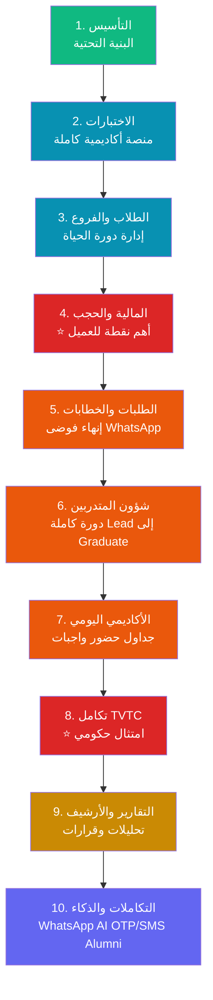

# 📋 المراحل التنفيذية — IIMS

> **نظام إدارة المعهد التدريبي المتكامل (IIMS)**
> خطط تنفيذية تفصيلية لـ **10 مراحل** متسلسلة منطقياً

---

## 🛠 الحزمة التقنية (Tech Stack)

| الطبقة | التقنية |
|--------|---------|
| **Backend Framework** | Laravel 11 + PHP 8.3 |
| **Admin Panel** | Filament 3 (Forms, Tables, Resources, Actions, Shield) |
| **UI Reactivity** | Livewire 3 + Alpine.js |
| **Templating** | Blade Components |
| **Database** | PostgreSQL 15 |
| **ORM** | Eloquent ORM |
| **Authentication & RBAC** | Laravel Auth + Spatie Permission + Filament Shield |
| **Authorization** | Laravel Policies + Spatie Permission + Multi-Tenancy |
| **File Storage** | Spatie Media Library |
| **Realtime (WebSockets)** | Laravel Reverb |
| **Background Jobs** | Laravel Horizon (Redis) |
| **Scheduled Tasks** | Laravel Scheduler |
| **State Machines** | Spatie Laravel Model States |
| **PDF Generation** | Browsershot (spatie/browsershot) |
| **Mail** | Laravel Mail + resend/resend-laravel |
| **SMS/WhatsApp** | Unifonic عبر Laravel HTTP Client |
| **AI** | Claude API عبر Laravel HTTP Client |
| **Audit Trail** | Spatie Activity Log |
| **Backup** | Spatie Laravel Backup |
| **2FA** | Spatie Google2FA + bacon/bacon-qr-code |
| **Excel** | maatwebsite/excel |
| **Biometric** | rats/zkteco |
| **XML Signing** | phpseclib/phpseclib |
| **Search** | Laravel Scout |
| **Performance** | Laravel Octane (اختياري) |
| **Testing (Unit/Feature)** | Pest / PHPUnit |
| **Testing (E2E)** | Laravel Dusk |
| **Code Style** | Laravel Pint |
| **Static Analysis** | PHPStan / Larastan (Level 8) |
| **Containerization** | Laravel Sail (Docker) |
| **Hosting** | VPS سعودي (Hostinger KSA / Contabo KSA) |
| **Deployment** | Laravel Forge / Envoyer |
| **Error Tracking** | Sentry (sentry/sentry-laravel) |
| **Build Tool (Assets)** | Vite + Tailwind CSS + tailwindcss-rtl |

> **ملاحظة:** ZATCA (الفوترة الإلكترونية) خارج النطاق — يُعالج عبر برنامج محاسبي خارجي بـAPI.
> **خارج النطاق أيضاً:** تطبيق جوّال.

---

## 🗺 خارطة المراحل

| # | المرحلة | الأهمية | المدة | الحجم |
|---|---------|---------|------|------|
| **1** | [التأسيس](01-التأسيس/خطة-المرحلة.md) | 🟢 إلزامي | 2 أسبوع | 15.7K كلمة |
| **2** | [الاختبارات](02-الاختبارات/خطة-المرحلة.md) | 🔴 جوهري | 8 أسابيع | 16.4K كلمة |
| **3** | [الطلاب والفروع](03-الطلاب-والفروع/خطة-المرحلة.md) | 🔴 جوهري | 4 أسابيع | 12K كلمة |
| **4** | [المالية والحجب](04-المالية-والحجب/خطة-المرحلة.md) ⭐ | 🔴 الأهم | 4 أسابيع | 11.2K كلمة |
| **5** | [الطلبات والخطابات](05-الطلبات-والخطابات/خطة-المرحلة.md) | 🟠 عالٍ | 5 أسابيع | 15.3K كلمة |
| **6** | [شؤون المتدربين والتسجيل](06-شؤون-المتدربين-والتسجيل/خطة-المرحلة.md) | 🟠 عالٍ | 5 أسابيع | 13.6K كلمة |
| **7** | [الأكاديمي اليومي](07-الأكاديمي-اليومي/خطة-المرحلة.md) | 🟠 عالٍ | 6 أسابيع | 12.7K كلمة |
| **8** | [تكامل TVTC والوزارة](08-تكامل-TVTC-والوزارة/خطة-المرحلة.md) ⭐ | 🔴 امتثال | 4 أسابيع | 13.9K كلمة |
| **9** | [التقارير والأرشيف](09-التقارير-والأرشيف/خطة-المرحلة.md) | 🟡 قيمة | 5 أسابيع | 15.6K كلمة |
| **10** | [التكاملات والذكاء](10-التكاملات-والذكاء/خطة-المرحلة.md) | 🟢 إضافي | 6 أسابيع | 14.3K كلمة |
| **الإجمالي** | | | **~49 أسبوع** | **~140K كلمة** |

---

## 🎯 منطق الترتيب (الأهم في الأهم)

### مبدأ التسلسل
كل مرحلة تبني على ما قبلها وتُهيّئ لما بعدها. لا قفز.

---

## 📐 هيكل كل خطة مرحلة (15 قسماً)

كل ملف `خطة-المرحلة.md` يحتوي على:

1. **الملخص التنفيذي** — السياق والقيمة
2. **الأهداف والمخرجات** — قابلة للقياس
3. **المتطلبات السابقة** — ما يجب توفّره قبل البدء
4. **الموديولات الفرعية** — مفصّلة مع User Stories
5. **تعديلات نموذج البيانات** — SQL DDL كامل
6. **مواصفات الواجهة** — الشاشات والتدفقات
7. **التكاملات** — APIs الخارجية
8. **الأمان والصلاحيات** — RLS + Audit
9. **خطة الاختبار** — Unit + Integration + E2E
10. **تقسيم الـSprints** — مهام يومية
11. **معايير القبول** — قابلة للاختبار
12. **المخاطر والتخفيف** — Risk Matrix
13. **تقدير الجهد** — للموديول
14. **مخرجات التسليم** — Checklist
15. **الانتقال للمرحلة القادمة** — Exit Criteria

---

## 🌟 التطويرات المُدمجة (16 تطويراً)

| # | التطوير | المرحلة |
|---|----------|---------|
| 1 | تكامل TVTC الكامل | 8 |
| 2 | شهادات TVTC رسمية | 2 |
| 3 | خطابات السلم الوظيفي | 5 |
| 4 | جداول مرنة (صباحي/مسائي/ويكند) | 7 |
| 5 | حقول التوظيف الاختيارية | 3 |
| 6 | أرشيف المعلم (متعدد المراحل) | 2 + 7 + 9 |
| 7 | التقويم الموحّد | 7 |
| 8 | مكتبة الموارد التعليمية | 7 |
| 9 | تقييم الطلاب للمعلمين | 9 |
| 10 | Help Desk الداخلي | 5 |
| 11 | السيرة الذاتية التلقائية | 5 |
| 12 | AI Chatbot للطلاب | 10 |
| 13 | كشف الطلاب المعرّضين للخطر | 9 |
| 14 | بوابة الخريجين | 10 |
| 15 | الدورات التطويرية المستمرة | 10 |
| 17 | Mock Adapter لـTVTC مبكراً | 2 |

> **التطوير #16** (تكامل دروب) — مؤجّل لمرحلة لاحقة بناءً على قرار العميل.

---

## 📊 إحصائيات

| القياس | القيمة |
|--------|--------|
| **إجمالي المراحل** | 10 |
| **إجمالي الكلمات** | ~140,000 |
| **إجمالي الأسطر** | ~28,500 |
| **مخططات Mermaid** | 50+ |
| **جداول SQL DDL** | 100+ |
| **شاشات UI** | 200+ |
| **اختبارات E2E** | 150+ |
| **المخاطر المُرصودة** | 120+ |
| **المدة الإجمالية** | ~49 أسبوع |

---

## 🚀 كيفية الاستخدام

### للمبرمج المشارك
1. ابدأ بـ [خطة المرحلة 1](01-التأسيس/خطة-المرحلة.md).
2. أكمل **معايير القبول** قبل الانتقال للتالية.
3. كل مرحلة لها **مرفقات تسليم** (Deliverables Checklist).

### لمدير المشروع
1. استخدم **تقسيم الـSprints** للتخطيط.
2. تابع **المخاطر** بشكل دوري.
3. اعقد جلسة UAT بعد كل مرحلة.

### للعميل
1. راجع **معايير القبول** قبل الاعتماد.
2. أجب على **الأسئلة المعلّقة** المُحدّدة لكل مرحلة.
3. ادعم **التدريب** و**UAT**.

---

## 📚 المراجع

- [وثيقة التحليل الشامل (HTML)](../02-وثيقة-تسليم-المبرمج/index.html)
- [الخطة التنفيذية والتسعير](../01-الخطة-التنفيذية-والتسعير.md)
- مجلد المسودات الأصلية (`02-وثيقة-تسليم-المبرمج/مسودات-الوكلاء/`)

---

**الإصدار:** 1.0
**التاريخ:** 2026-05-12
**الحالة:** ✅ جاهز للتسليم
