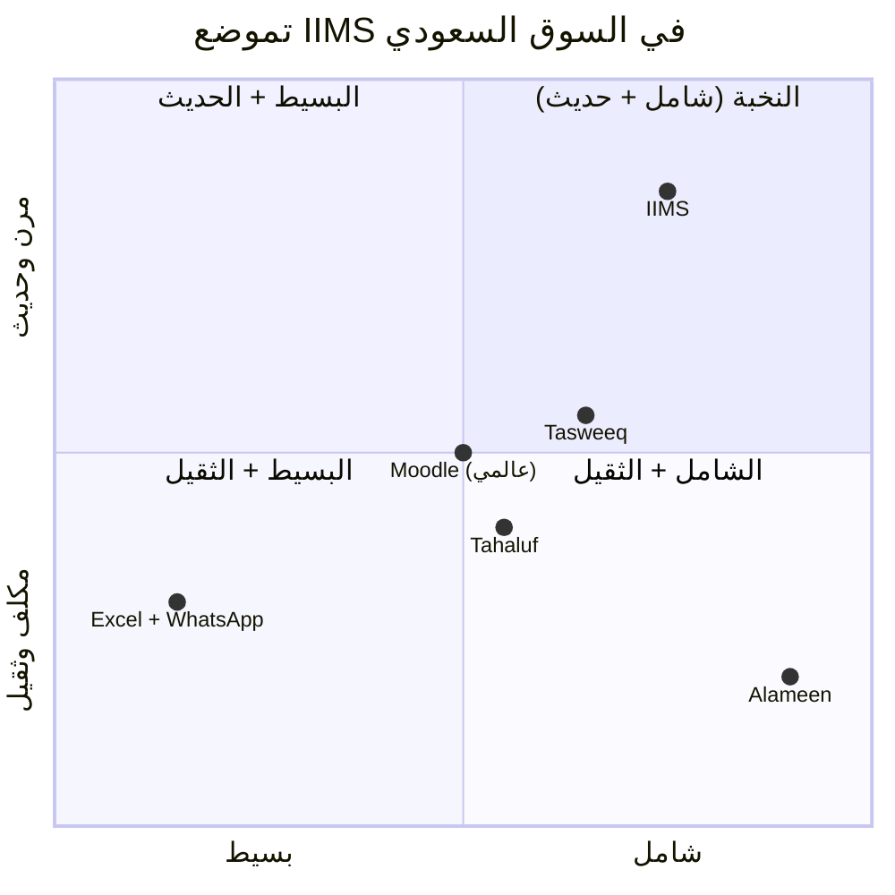
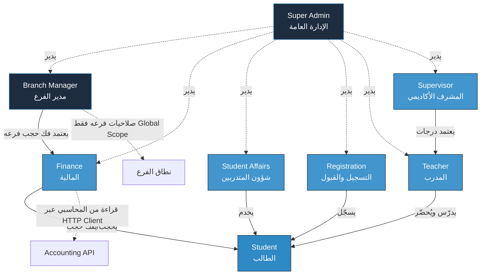
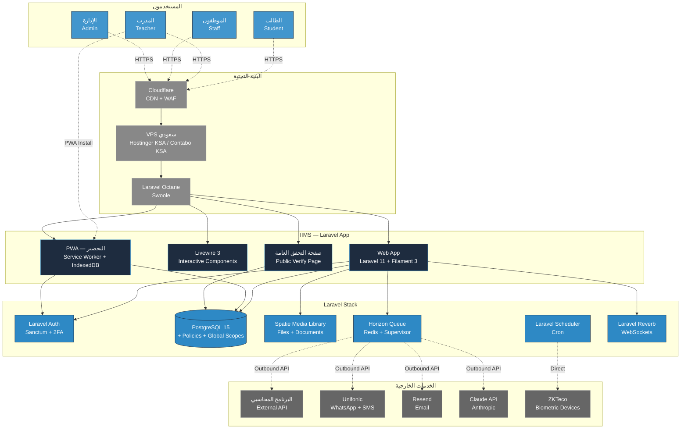
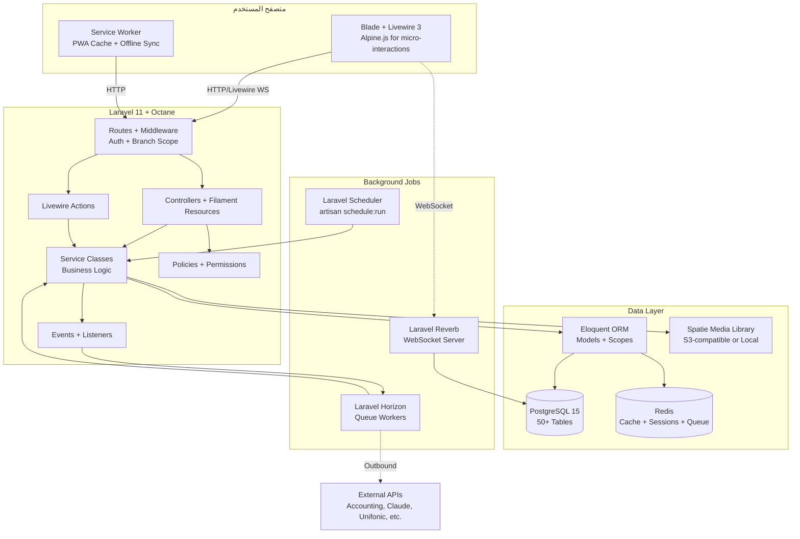
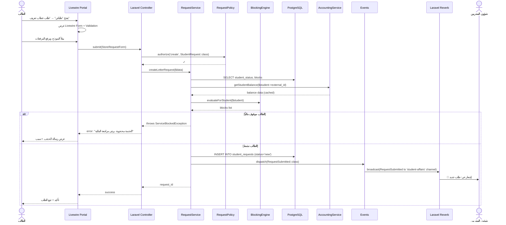
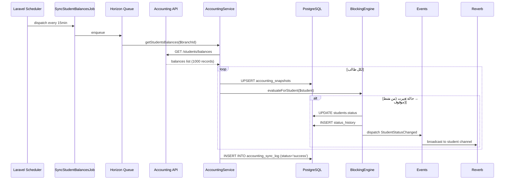
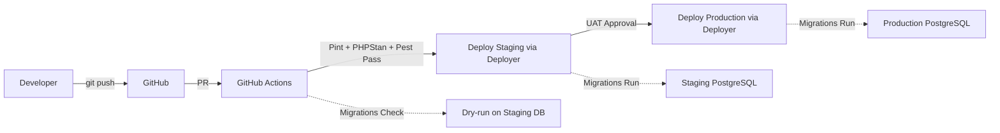

# الجزء الأول: السياق والمعمارية

> **وثيقة تسليم تقنية رسمية**
> **المشروع:** نظام إدارة المعهد التدريبي المتكامل (IIMS)
> **Stack:** Laravel 11 + Filament 3 + Livewire 3 + PostgreSQL 15
> **الإصدار:** 2.0
> **التاريخ:** 2026-05-15
> **الجمهور:** المبرمج المشارك (Senior Laravel/PHP Engineer)
> **معدّ الوثيقة:** Senior Solutions Architect
> **الحالة:** مسودة جاهزة للمراجعة (Stack v2)

---

## 1. الملخص التنفيذي (Executive Summary)

### 1.1 نبذة عن المنتج

**IIMS** (Integrated Institutional Management System) هو نظام معلومات إداري وأكاديمي متكامل مبني خصيصاً للمعاهد التدريبية متعددة الفروع في المملكة العربية السعودية، مع تركيز جوهري على ربط الحالة الأكاديمية بالحالة المالية للطالب، وأتمتة الطلبات الإدارية بين الأقسام، وإصدار الوثائق الرسمية بصياغة قانونية معتمدة. النظام ليس "موقعاً للمعهد" ولا "قاعدة بيانات للطلاب" — بل بنية تشغيلية كاملة تستبدل ثلاثة أنماط عمل غير متسقة (Excel + الأوراق + WhatsApp) بمنصة موحّدة تخدم 7 أدوار مختلفة في وقت واحد.

النظام مبني على **Laravel 11 + Filament 3 + Livewire 3 + PostgreSQL 15** بدعم عربي أصلي من اليوم الأول، ويعمل في المتصفح وعلى الجوال عبر PWA دون الحاجة لتطبيقات Native في متاجر التطبيقات. يضم النظام موديولاً أكاديمياً متقدماً (بنك أسئلة بـ14 نوع سؤال + اقتراح ذكي عبر Claude API + شهادات بـ QR قابلة للتحقق العام)، ومحركاً مالياً يتكامل مع برنامج محاسبي خارجي عبر API بحيث يبقى النظام طبقة عرض وحجب خدمات لا طبقة محاسبة (يبقى الامتثال الضريبي و ZATCA E-Invoicing مسؤولية البرنامج المحاسبي للعميل)، ومحرك Workflow ديناميكي يستوعب 14 نوع طلب وسبع حالات إدارية مع مسارات بين الأقسام (شؤون المتدربين، المالية، الإدارة، التدريب).

السمة المعمارية الأهم هي **Multi-Branch من اليوم الأول**: المعهد يبدأ بأربعة فروع، لكن قاعدة البيانات وLaravel Policies + Global Scopes تستوعب إضافة فروع جديدة دون أي Migration. كذلك، النظام مصمم ليكون **Multi-Tenant-Ready**: نواة `tenants → branches → users` تسمح بتحويله مستقبلاً لمنتج SaaS يخدم معاهد متعددة. هذا قرار معماري حاسم اتُّخذ من البداية لتجنب إعادة الكتابة لاحقاً.

أخيراً، **التزام النظام بـ PDPL** (نظام حماية البيانات الشخصية السعودي) إلزامي وليس اختيارياً، ويظهر في كل قرار تصميمي: تشفير at-rest عبر PostgreSQL + Laravel encrypted casts، تشفير in-transit عبر TLS 1.3، Activity Log كامل لا يُحذف (spatie/laravel-activitylog)، حق المحو والوصول والتصدير للطالب، استضافة على VPS سعودي منذ البداية (Hostinger KSA / Contabo KSA / Aramco Cloud).

### 1.2 لمن، لماذا، ما الذي يحل

**لمن** — معاهد تدريبية سعودية مرخّصة (TVTC أو مستقلة) تدير ما بين 500 و 5,000 طالب موزعين على فرع واحد إلى عشرة فروع، مع 50-200 موظف يعملون في 6-8 أدوار وظيفية (إدارة عامة، مدير فرع، مالية، شؤون متدربين، تسجيل وقبول، مدربين، طلاب). الحجم المستهدف الأولي لمشروعنا — **المعهد بـ 1,000 طالب و 4 فروع** — يقع في المنتصف بدقة.

**لماذا** — لأن الأنظمة العالمية (Moodle، Canvas، Blackboard) لا تفهم سياق المعاهد السعودية: لا تدعم RTL أصلياً بشكل لائق، لا تربط الأكاديمي بالمالي بسلاسة، لا تدعم سير العمل الإداري الرسمي السعودي (خطابات تعريف، إفادات، تعهدات)، ولا تتكامل مع البنية المحاسبية المحلية. الأنظمة السعودية المنافسة إما عامة جداً أو مكلفة جداً ولا تتيح ملكية البيانات. **IIMS يملأ الفجوة:** نظام مفصّل سعودياً + ملكية كاملة للبيانات + قابل للتشغيل المحلي على VPS سعودي.

**ما الذي يحل** — أربع مشاكل تشغيلية حقيقية:

1. **ضياع الطلبات بين المحادثات** — الطالب يطلب خطاب إفادة عبر WhatsApp، يحوّل لشؤون المتدربين، يضيع، يعود الطالب يسأل، تبدأ السلسلة من جديد. النظام يحل هذا عبر **Workflow Engine** مع SLA لكل طلب.

2. **التحصيل المالي غير مرتبط بالخدمات** — طالب عليه متأخرات يحصل على شهادة، يستلم خطابات، يدخل اختبارات، ثم تتفاجأ المالية بعد التخرج. النظام يحل هذا عبر **Service Blocking Engine** المربوط مباشرة ببيانات البرنامج المحاسبي.

3. **عدم تطابق الأكاديمي والإداري** — درجات في Excel على جهاز مدرب، حضور على ورق في قاعة، حالة الطالب في رأس موظف شؤون المتدربين. النظام يوحّد هذه في **ملف طالب واحد** مع تاريخ كامل (Activity Log).

4. **العمل اليدوي على الوثائق الرسمية** — كل خطاب تعريف يُكتب يدوياً في Word، يُطبع، يُختم، يُسلَّم. النظام يحل هذا عبر **Letters Generator** يولّد PDF عربي RTL احترافي (Browsershot) مع توقيع وختم وأرشفة تلقائية (Spatie Media Library).

### 1.3 نقاط البيع الفريدة (Unique Selling Propositions — USPs)

| # | نقطة البيع | الفائدة المباشرة للعميل |
|---|------------|--------------------------|
| 1 | **ملكية كاملة للبيانات وحق التصدير** | إذا انتهى العقد، يحصل المعهد على نسخة PostgreSQL كاملة + Excel لكل الجداول. لا حبس بيانات. |
| 2 | **معماري Multi-Branch من اليوم الأول** | إضافة فرع جديد = إدراج صف في جدول `branches` لا Migration. |
| 3 | **Service Blocking Engine قابل للتعديل** | مدير الإدارة يضبط بنفسه أي خدمة تُحجب لأي حالة دون عودة للمطوّر (Filament Resource). |
| 4 | **شهادات بـ QR وصفحة تحقق عامة** | يرفع مصداقية شهادات المعهد لدى أصحاب العمل والجامعات. |
| 5 | **بنك أسئلة بـ Claude AI + موافقة المعلم** | المعهد يبني أصلاً معرفياً يخصه — لا يعتمد على بنوك خارجية. |
| 6 | **تكامل API مع البرنامج المحاسبي بدلاً من بناء محاسبة موازية** | لا تكرار للجهد، الالتزام الضريبي على البرنامج المحاسبي، نظامنا يبقى خفيفاً. |
| 7 | **PWA للتحضير على الجوال دون متجر تطبيقات** | المدرب يفتح الرابط، يثبّت أيقونة، يستخدم الحضور حتى بلا إنترنت. |
| 8 | **بنية API-first** | Laravel API Resources + Sanctum — كل ميزة لها endpoint قابل للاستدعاء من خارج النظام. |
| 9 | **PDPL-by-Design** | تشفير، Activity Log، حق المحو، حق التصدير، استضافة سعودية — مبنية في الـ Schema لا مضافة لاحقاً. |
| 10 | **عربي RTL أصلي + خط Cairo/IBM Plex Sans Arabic** | تجربة قراءة احترافية، Filament + Tailwind RTL-ready. |

### 1.4 شعار مقترح (Tagline)

**الشعار التجاري المقترح:**

> **منصة تُديرُ المعهد من التسجيل حتى التخرج**

**شعارات بديلة للاختيار:**

- "نظامٌ واحد، كل أقسام معهدك" — يركز على التوحيد.
- "من الطالب إلى الشهادة، خطوة واحدة" — يركز على دورة الحياة.
- "إدارة معهدك الذكية بالعربية الأصيلة" — يركز على الهوية المحلية.
- "تعليمٌ منظّم، إدارةٌ موثّقة" — يركز على الجانب التشغيلي.

> **توصية المعمارية:** اعتماد الشعار الأول لأنه يصف **النطاق الزمني الكامل** (التسجيل → التخرج) وهو مطابق للمسار الوظيفي للنظام.

---

## 2. سياق العميل والمشكلة التجارية

### 2.1 الوضع الحالي قبل النظام (As-Is State)

يعمل المعهد حالياً عبر **منظومة مفككة من ثلاث أدوات تقليدية** لا يجمع بينها رابط رقمي موحّد:

#### أ) Excel: قاعدة البيانات الفعلية

يستخدم المعهد ملفات Excel كقاعدة بيانات أساسية تشمل:

- **ملف بيانات الطلاب الكامل** (لكل فرع ملف مستقل) — اسم، هوية، جوال، برنامج، تاريخ التحاق، حالة، ملاحظات.
- **ملفات الدرجات** — لكل دورة/فصل ملف Excel مستقل بأعمدة الطلاب والمواد والدرجات.
- **ملف التحصيل المالي** — صف لكل طالب، أعمدة للأقساط، تواريخ السداد، المتبقي.
- **ملف الحضور** — أوراق ورقية يومية يدوّن المدرب عليها، تُجمَّع شهرياً في Excel.
- **ملف الاختبار الشامل** — كشوفات Excel للمؤهلين، النتائج، الشهادات.

**أوجاع Excel:**

- ملفات بنفس الاسم بإصدارات متضاربة على عدة أجهزة.
- **لا توجد نسخة موحّدة Authoritative** — أي تعارض يحتاج تدخلاً يدوياً.
- لا توجد قواعد عمل (مثلاً: إذا كان الطالب موقوفاً مالياً، فلا يستطيع طباعة شهادة) — كل قاعدة في رأس الموظف.
- صعوبة شديدة في إعداد التقارير الإدارية المجمّعة من 4 فروع.
- فقدان البيانات عند انتقال موظف أو تلف جهاز.
- **لا Audit Log** — تعديل الدرجة لا يُتعقّب، فك الحجب لا يُسجَّل من قام به.

#### ب) الأوراق: الوثائق الرسمية

- **خطابات التعريف** و **الإفادات** و **شهادات الحضور** تُكتب يدوياً في Word، تُطبع، تُختم، تُسلَّم.
- **مرفقات الطلاب** (الهوية، الشهادات السابقة، صور شخصية) موجودة في ملفات ورقية في الأرشيف.
- **سندات القبض** (إيصالات الدفع) ورقية في 4 فروع، يُجمّعها المحاسب أسبوعياً.

**أوجاع الأوراق:**

- ضياع المستندات عند الانتقال بين الموظفين.
- صعوبة البحث في الأرشيف.
- لا يمكن مشاركتها رقمياً مع طالب يحتاجها عاجلاً.
- التوقيع والختم يحتاجان حضور شخص معتمد (يتعطّل العمل في غياب المدير).

#### ج) WhatsApp: قناة التواصل والطلبات

- الطالب يطلب خطاباً عبر WhatsApp من رقم شؤون المتدربين.
- الموظف يحوّل الطلب يدوياً للمالية لفحص الحالة، ثم للإدارة للاعتماد، ثم يُعيد للطالب.
- لا توجد حالة موحّدة للطلب — كل طرف يعرف ما عنده فقط.
- المحادثات تختلط بين الشخصي والعمل.
- **لا يوجد SLA** — طلب قد يبقى أسبوعاً دون رد.
- لا توجد إحصاءات (كم طلب شهرياً، متوسط الإغلاق، الذي يتأخر أكثر).

### 2.2 الأوجاع الكبرى (Pain Points) — مرتبة حسب الأولوية

| # | الوجع | الأثر التشغيلي | الأولوية |
|---|-------|---------------|----------|
| **P1** | **المتأخرات المالية لا تُحجَب الخدمات تلقائياً** | طلاب يستلمون شهادات وخطابات وهم مدينون → خسائر تحصيل مباشرة | 🔴 حرجة |
| **P2** | **فقدان الطلبات في WhatsApp** | طلبات تضيع، شكاوى من الطلاب، فقدان ثقة | 🔴 حرجة |
| **P3** | **عدم وجود سجل موحّد لحالة الطالب** | الإدارة لا تعرف بدقة عدد المنتظمين/المتعثرين/المنسحبين | 🔴 حرجة |
| **P4** | **التقارير الإدارية تأخذ أياماً يدوياً** | اتخاذ قرارات بأرقام قديمة | 🟠 عالية |
| **P5** | **عدم اعتماد الدرجات قبل النشر** | درجات تظهر للطلاب بأخطاء، يحدث جدل، تُعاد المراجعة | 🟠 عالية |
| **P6** | **الاختبار الشامل النهائي يُدار بـ Excel فقط** | الكشوفات الورقية تضيع، صعوبة التحقق من المؤهلين | 🟠 عالية |
| **P7** | **خطابات رسمية تُكتب يدوياً** | بطء، عرضة للأخطاء الإملائية، صياغات غير موحّدة | 🟡 متوسطة |
| **P8** | **لا توجد بوابة للطالب** | الطالب يسأل دائماً بدلاً من أن يجد المعلومة بنفسه | 🟡 متوسطة |
| **P9** | **مرفقات الطلاب على الأرشيف الورقي** | ضياع، صعوبة المشاركة، خطر التلف | 🟡 متوسطة |
| **P10** | **عدم وجود تحضير رقمي للمدربين** | الحضور على ورق ينتقل لـ Excel متأخراً | 🟢 منخفضة |

> **اقتباس حرفي من العميل (وثيقة الاحتياجات):** "أهم نقطة لدينا أن تكون خدمات الطالب مرتبطة بحالته المالية والأكاديمية، مثل حجب الخطابات أو الاختبارات أو النتائج عند وجود مستحقات، مع إمكانية فك الحجب من الإدارة بصلاحية واضحة."

هذه الجملة تحدد بوضوح **P1 كأولوية رقم 1**، وهي السبب في تخصيص جزء كامل (3.2 Service Blocking Engine) من خارطة الطريق لها.

### 2.3 الأهداف الاستراتيجية (Business Goals)

#### الأهداف قصيرة المدى (6-12 شهر)

| الهدف | المؤشر القابل للقياس (KPI) | الفائدة |
|------|------------------------------|---------|
| تقليل المتأخرات بنسبة 30% | قيمة المتأخرات الإجمالية / إجمالي الإيرادات | تحسين التدفق النقدي |
| إغلاق 80% من الطلبات خلال SLA | عدد الطلبات المنتهية في الوقت / الإجمالي | رفع رضا الطلاب |
| تقليل الأخطاء الإدارية 50% | عدد المشاكل المسجّلة / إجمالي العمليات | ثقة العملاء |
| رقمنة 100% من الخطابات والشهادات | عدد الوثائق المُولَّدة رقمياً | السرعة والشفافية |
| تقليل وقت إعداد التقارير من ساعات لدقائق | متوسط وقت إعداد تقرير شهري | اتخاذ قرارات سريعة |

#### الأهداف متوسطة المدى (1-2 سنة)

- **التوسع لـ 6-8 فروع** دون تغيير في النظام.
- **خفض تكلفة الموظفين الإداريين** عبر الأتمتة (نقل موظفين لأدوار ذات قيمة أعلى).
- **رفع نسبة استرداد المتأخرات** عبر الإشعارات الآلية والحجب الذكي.
- **بناء بنك أسئلة شامل** يخدم 50+ مادة و 10+ دبلوم.
- **الحصول على شهادة Cyber Security** عبر الالتزام بـ PDPL.

#### الأهداف بعيدة المدى (3-5 سنوات)

- **تحويل النظام لمنتج SaaS** يُباع لمعاهد أخرى (Multi-Tenant عبر `stancl/tenancy`).
- **التكامل مع منصات حكومية** (TVTC، ETEC، دروب) عبر Adapters مخصصة.
- **بناء نماذج تنبؤية AI** للطلاب المعرّضين للتسرب.
- **التوسع الجغرافي** لمدن أخرى في المملكة وربما الخليج.

### 2.4 تحليل المنافسين السعوديين (Competitive Analysis)

> **تنبيه:** هذا التحليل مبني على معلومات سوقية عامة. الأرقام والميزات الدقيقة **تحتاج تأكيد** من العميل أو دراسة سوق متخصصة.

#### 2.4.1 Tasweeq (نظام إدارة معاهد سعودي)

| البند | التقييم |
|------|--------|
| **التركيز** | إدارة عامة للمعاهد + التسجيل + المالية |
| **القوة** | حضور سوقي قوي، تكامل ZATCA، RTL ممتاز |
| **الضعف** | غير مرن في الـ Workflows المخصصة، الواجهة كلاسيكية، صلاحيات أقل دقة |
| **نموذج التسعير** | اشتراك شهري حسب عدد الطلاب |
| **الجمهور المستهدف** | معاهد متوسطة وكبيرة (1,000-10,000 طالب) |
| **منافستنا له** | نتفوق في: Workflow Engine، الاختبارات الإلكترونية، شهادات QR، PWA. نتأخر في: النضج السوقي، السمعة. |

#### 2.4.2 Alameen (نظام مؤسسي تعليمي)

| البند | التقييم |
|------|--------|
| **التركيز** | نظام شامل للجامعات والمعاهد الكبيرة |
| **القوة** | شامل جداً، شركة كبيرة |
| **الضعف** | معقد جداً للمعاهد الصغيرة، باهظ، التخصيص صعب، الواجهة قديمة |
| **نموذج التسعير** | رخصة مؤسسية كبيرة + رسوم تنفيذ ضخمة |
| **منافستنا له** | نتفوق في: المرونة، السرعة، الواجهة الحديثة (Filament 3)، التكلفة. لا ننافسه أصلاً في السوق المؤسسي الكبير. |

#### 2.4.3 Tahaluf (نظام إداري للمعاهد التدريبية)

| البند | التقييم |
|------|--------|
| **التركيز** | المعاهد التدريبية المعتمدة من TVTC |
| **القوة** | تكامل مع TVTC، خبرة بمتطلبات الجهات المنظمة |
| **الضعف** | تحت السحابة المغلقة، لا ملكية بيانات، تخصيص محدود |
| **منافستنا له** | نتفوق في: ملكية البيانات، التخصيص، الاختبارات الإلكترونية، Claude AI. نتأخر في: التكامل المباشر مع TVTC (يحتاج جهد لاحق). |

#### 2.4.4 خلاصة التموضع السوقي



**التموضع الموصى به للنظام:**
- **حداثة** أعلى من الجميع (Laravel 11 + Filament 3 + Livewire 3 + AI + PWA + QR).
- **شمولية** أعلى من Tahaluf، أقل من Alameen، مكافئة لـ Tasweeq.
- **تكلفة** أقل بكثير من Alameen وTahaluf، مكافئة أو أقل من Tasweeq.
- **مرونة التخصيص** هي أكبر USP حقيقي مقابل المنافسين السحابيين.

---

## 3. أصحاب المصلحة والأدوار (Stakeholders & Roles)

النظام يدعم **7 أدوار وظيفية صريحة + دور ضمني واحد** (المشرف الأكاديمي الذي يعتمد الدرجات). الجدول أدناه يفصّل كل دور بدقة كاملة. التطبيق التقني عبر **Spatie Laravel Permission** + **Filament Shield**.

### 3.1 جدول الأدوار الشامل

| # | الاسم (عربي) | الاسم (إنجليزي / Code) | الوصف الموجز |
|---|---------------|------------------------|---------------|
| 1 | الإدارة العامة | `super_admin` | صلاحيات كاملة على النظام عبر جميع الفروع |
| 2 | مدير الفرع | `branch_manager` | إدارة الفرع المسؤول عنه فقط |
| 3 | موظف المالية والتحصيل | `finance` | إدارة الملف المالي والتحصيل والحجب |
| 4 | موظف شؤون المتدربين | `student_affairs` | إدارة طلبات الطلاب والخطابات والاختبار الشامل |
| 5 | موظف التسجيل والقبول | `registration` | إدارة دورة التسجيل والقبول (CRM) |
| 6 | المدرب/المعلم | `teacher` | إدارة المواد المسندة + الحضور + الدرجات |
| 7 | الطالب | `student` | عرض ملفه الخاص + تقديم الطلبات |
| (ضمني) | المشرف الأكاديمي | `supervisor` | اعتماد الدرجات قبل النشر |

### 3.2 التفصيل العميق لكل دور

---

#### 3.2.1 الإدارة العامة (Super Admin)

**الوصف:** الدور الأعلى صلاحياً في النظام. يمثّل صاحب المعهد أو المدير العام. لديه رؤية كاملة عبر جميع الفروع، وقدرة على تعديل أي شيء، واعتماد العمليات الحساسة، وإدارة المستخدمين والصلاحيات.

**الصلاحيات (Permissions):**

| الصلاحية | المستوى |
|---------|---------|
| إنشاء/تعديل/أرشفة جميع الكيانات (طلاب، موظفين، فروع، دبلومات، مواد) | كامل عبر كل الفروع |
| اعتماد أو رفض **فك الحجب المالي** (مع توثيق إلزامي للسبب) | كامل |
| اعتماد **الخصومات والإعفاءات والمنح** | كامل |
| اعتماد **الانسحاب الكامل** للطلاب | كامل |
| تعديل **مصفوفة الحجب** (أي خدمة تُحجب لأي حالة) عبر Filament Resource | كامل |
| تعديل **قواعد العمل** (نسبة الحرمان بالغياب، عدد الإنذارات، SLA الطلبات) عبر Config Editor | كامل |
| إدارة المستخدمين (إضافة، تعديل، تعطيل، إعادة تعيين كلمة المرور) عبر Filament Shield | كامل |
| إدارة الأدوار والصلاحيات (Spatie Permission) | كامل |
| الوصول لـ **Activity Log** كاملاً (spatie/laravel-activitylog) | كامل |
| الوصول لجميع **التقارير عبر جميع الفروع** | كامل |
| **التعديل اليدوي للدرجات** (مع توثيق السبب — Activity Log إلزامي) | كامل (استثناء) |
| تصدير قاعدة البيانات الكاملة (PDPL — حق الملكية) عبر Artisan Command | كامل |
| إعدادات النظام العامة (الشعار، الألوان، القوالب) | كامل |
| تعديل **حالة الطالب يدوياً** (حالات استثنائية) | كامل |

**القيود (Constraints) — ما لا يستطيع:**

- ❌ **لا يمكنه حذف Activity Log** — هذا قيد قانوني (PDPL) ومعماري (Migration بدون DELETE policy).
- ❌ **لا يمكنه تجاوز التوقيع الإلكتروني للاعتمادات** بدون توثيق سبب.
- ❌ **لا يمكنه الدخول بدور آخر** — لكل دور حساب منفصل (لكن يمكنه فتح حسابات إضافية للمحاكاة).
- ❌ **لا يمكنه تعديل بيانات محاسبية** — تأتي فقط من البرنامج المحاسبي (للقراءة فقط).
- ❌ **لا يمكنه تجاوز الـ 2FA** على عمليات الاعتماد الحساسة.

**الواجهة الرئيسية (Primary Interface):**

`/admin` (Filament Panel) — لوحة قيادة شاملة تعرض:
- ملخص KPIs لكل الفروع عبر Filament Widgets (طلاب نشطين، متأخرات إجمالية، طلبات مفتوحة، أداء مالي).
- قائمة الموافقات المعلقة (Pending Approvals) — فك حجب، خصومات، انسحابات.
- خريطة الفروع مع لون لكل فرع حسب الأداء.
- آخر الأحداث الهامة (Activity Stream — قراءة فقط).

**أمثلة على المستخدمين (Sample Users):**

- **[العميل]** — صاحب المعهد (مذكور في وثيقة الاحتياجات Author).
- **مدير العمليات العام** الذي يدير كل الفروع.
- **مدير التطوير والاستراتيجية** الذي يحتاج رؤية كاملة للتقارير.

**ملاحظات تقنية للمبرمج:**
- هذا الدور يجب أن يكون **محمياً بـ 2FA إلزامي** (Spatie Google2FA أو Filament 2FA Plugin).
- جميع العمليات الحساسة (فك حجب، تعديل درجة) تحتاج **حقل سبب إلزامي ≥ 20 حرف** عبر Form Request.
- جميع عملياته **تُسجَّل في `activity_log` بأعلى مستوى تفصيل** عبر spatie/laravel-activitylog.

---

#### 3.2.2 مدير الفرع (Branch Manager)

**الوصف:** المسؤول التشغيلي عن فرع واحد محدد. لديه صلاحيات إدارية شاملة لكن **مقيّدة بفرعه فقط** عبر Global Scope + Laravel Policy.

**الصلاحيات:**

| الصلاحية | المستوى |
|---------|---------|
| إدارة طلاب فرعه (إضافة، تعديل، عرض الملفات) | كامل ضمن الفرع |
| إدارة موظفي فرعه (لكن **لا يضيف/يحذف** موظفين — الإدارة العامة فقط) | عرض وتعديل بسيط |
| اعتماد فك الحجب المالي لطلاب فرعه (حسب الإعدادات) | محدود (قابل للضبط) |
| الموافقة على الطلبات في فرعه | كامل ضمن الفرع |
| الوصول لتقارير فرعه | كامل |
| رؤية أكواد الاختبارات في فرعه | كامل |
| الموافقة على إصدار الخطابات الرسمية | كامل |

**القيود:**

- ❌ **لا يرى بيانات الفروع الأخرى** (تنفيذ صارم عبر Global Scope `BranchScope`).
- ❌ **لا يضيف/يحذف مستخدمين** — يطلب من الإدارة العامة.
- ❌ **لا يعدّل قواعد العمل الموحّدة** (نسب الحرمان، SLA).
- ❌ **لا يصدر قرارات الانسحاب الكامل** — يحوّل للإدارة العامة.
- ❌ **لا يعدّل مصفوفة الحجب** (إعداد عام).

**الواجهة الرئيسية:**

Filament Panel `/admin/branch/{branch_id}/dashboard` — لوحة قيادة الفرع تعرض:
- KPIs الفرع (طلاب نشطين، التحصيل، الطلبات المعلقة).
- قائمة الموافقات المعلقة في فرعه.
- جدول الفصول الدراسية الحالية.
- إنذارات (طلاب على وشك الحرمان، طلبات متأخرة).

**ملاحظات تقنية:**
- Global Scope صارم: `WHERE branch_id = auth()->user()->branch_id`.
- 2FA موصى به لكن غير إلزامي.

---

#### 3.2.3 موظف المالية والتحصيل (Finance Officer)

**الوصف:** المسؤول عن إدارة الجانب المالي للطلاب — الأقساط، المتأخرات، التعهدات، الإيصالات، تطبيق الحجب الآلي ومتابعة فك الحجب. هذا الدور **يقرأ من البرنامج المحاسبي عبر API (Laravel HTTP Client)** ولا يدخل فواتير أصلية في نظامنا.

**الصلاحيات:**

| الصلاحية | المستوى |
|---------|---------|
| عرض الملف المالي لأي طالب في الفروع المسؤول عنها | كامل |
| تسجيل **تعهد سداد** (Promise to Pay) من الطالب | كامل |
| رفع **الإيصالات يدوياً** (للأرشفة) عبر Media Library | كامل |
| **طلب فك حجب** (يحتاج اعتماد المدير) | كامل |
| إنشاء **خصم/إعفاء جزئي** (يحتاج اعتماد) | كامل |
| إعداد **تقارير التحصيل** (مسددين، متأخرين، تعهدات) عبر Filament Widgets | كامل |
| إرسال **إشعارات السداد** للطلاب (يدوياً + تلقائياً عبر Laravel Notification) | كامل |
| استخراج تقارير Excel عبر `maatwebsite/excel` | كامل |

**القيود:**

- ❌ **لا يعدّل الأرصدة المالية مباشرة** — التعديل يأتي فقط من البرنامج المحاسبي (Read-Only للقيود الأساسية).
- ❌ **لا يفك حجباً تلقائياً** — كل فك حجب يحتاج توثيق سبب + اعتماد المدير في كثير من الحالات.
- ❌ **لا يطّلع على بيانات أكاديمية** (الدرجات، الاختبارات).
- ❌ **لا يصدر فواتير ضريبية ZATCA** — يتم في البرنامج المحاسبي.

**الواجهة الرئيسية:**

Filament Panel `/finance` — تعرض:
- ملخص التحصيل (مسددين، متأخرين، قيد الانتظار).
- قائمة المتأخرات مرتبة بالمبلغ + المدة.
- التعهدات النشطة وتواريخ استحقاقها.
- طلبات فك الحجب المعلقة.

**ملاحظات تقنية:**
- البيانات المالية الأصلية تأتي من **`accounting_snapshots`** الذي يستدعي API البرنامج المحاسبي عبر Service class.
- التزامن دوري (Laravel Scheduler كل 15 دقيقة) + on-demand عند الطلب.
- يجب أن يكون **Idempotent** — تكرار التزامن لا يُكرر القيود.

---

#### 3.2.4 موظف شؤون المتدربين (Student Affairs)

**الوصف:** المسؤول عن متابعة دورة حياة الطالب من ناحية إدارية وخدمية — طلبات الخطابات، الانسحاب، الإيقاف المؤقت، الشكاوى، المرفقات الناقصة، والاختبار الشامل النهائي. هو الواجهة الرئيسية للطالب بعد التسجيل.

**الصلاحيات:**

| الصلاحية | المستوى |
|---------|---------|
| عرض ملف الطالب كاملاً (شخصي + أكاديمي + مالي عرض فقط) | كامل |
| استلام الطلبات وتوزيعها على الأقسام عبر Filament Actions | كامل |
| توليد الخطابات الرسمية (Browsershot) | كامل |
| إدارة الشكاوى والاستفسارات والمقترحات | كامل |
| إدارة طلبات الانسحاب والإيقاف المؤقت (تحت إشراف المدير) | كامل |
| متابعة المرفقات الناقصة وإشعار الطلاب (Laravel Notification) | كامل |
| إدارة الاختبار الشامل النهائي (المؤهلين، رفع النتائج عبر maatwebsite/excel) | كامل |
| تعديل حالة الطالب (بعض الحالات: ناقص مرفقات، تحت المراجعة) | محدود |

**القيود:**

- ❌ **لا يصدر الخطاب نهائياً** إن كان الطالب موقوفاً مالياً (حتى فك الحجب).
- ❌ **لا يعدّل الدرجات الأكاديمية**.
- ❌ **لا يفك حجباً مالياً**.
- ❌ **لا يعتمد الانسحاب الكامل** — يحوّل للإدارة.

**الواجهة الرئيسية:**

Filament Panel `/student-affairs` — تعرض:
- قائمة الطلبات المفتوحة مع أعمارها (للتنبيه على SLA).
- المؤهلين/غير المؤهلين للاختبار الشامل (Filterable).
- الشكاوى المفتوحة.
- المرفقات الناقصة لكل طالب.

---

#### 3.2.5 موظف التسجيل والقبول (Registration Officer)

**الوصف:** يدير دورة التسجيل من اللحظة الأولى (مهتم) حتى تحويل الطالب لحساب نشط في النظام. يعمل كـ Mini-CRM للمعهد.

**الصلاحيات:**

| الصلاحية | المستوى |
|---------|---------|
| إنشاء طالب جديد بحالة "مهتم" | كامل |
| تحريك الطالب عبر 7 مراحل التسجيل (spatie/laravel-model-states) | كامل |
| رفع المرفقات (الهوية، الشهادات، صورة شخصية) عبر Media Library | كامل |
| إنشاء **رقم طالب** فريد للمعهد (Service class) | كامل (تلقائي) |
| تحويل الطالب للمالية لدفع رسوم القبول | كامل |
| تحويل الطالب لشؤون المتدربين بعد اكتمال التسجيل | كامل |
| إعداد تقارير التسجيل (مصادر التسجيل، نسبة التحويل) | كامل |
| إدارة قائمة الانتظار (Waitlist) للبرامج الممتلئة | كامل |

**القيود:**

- ❌ **لا يصدر قرارات قبول نهائية** قبل دفع رسوم القبول.
- ❌ **لا يعدّل بيانات طالب نشط** (يحوّل لشؤون المتدربين).
- ❌ **لا يطّلع على البيانات الأكاديمية**.

**الواجهة الرئيسية:**

Filament Panel `/registration` — Kanban Board (Filament Kanban Plugin) بـ 7 أعمدة:
- مهتم → تم التواصل → بانتظار مستندات → بانتظار دفعة → تم التسجيل → مرفوض → ملغي

---

#### 3.2.6 المدرب/المعلم (Instructor / Teacher)

**الوصف:** المعلم المسؤول عن مواد دراسية محددة. لديه صلاحية على **مواده فقط** — لا يرى مواد المدربين الآخرين. مسؤول عن الحضور، الدرجات، الواجبات، إدخال الأسئلة في البنك، إنشاء الاختبارات.

**الصلاحيات:**

| الصلاحية | المستوى |
|---------|---------|
| عرض جدوله الأسبوعي (المواد المسندة إليه) | كامل |
| تسجيل الحضور للجلسات (عبر PWA من الجوال أو الويب) | كامل |
| إدخال الدرجات يدوياً أو عبر Excel | كامل (تخضع للاعتماد) |
| إنشاء واجبات وتقييم التسليمات | كامل |
| إنشاء اختبارات (تلقائي/يدوي من بنك الأسئلة) | كامل في مواده فقط |
| إضافة أسئلة في بنك المعهد (يدوي / Excel / Claude AI) | كامل |
| تصحيح الأسئلة المقالية عبر Livewire Component | كامل |
| متابعة أداء طلابه (تقارير) | كامل |
| رؤية كود الاختبار لمواده فقط | كامل |

**القيود:**

- ❌ **لا يرى أسئلة مواد المدربين الآخرين** (Policy صارم).
- ❌ **درجاته لا تظهر للطالب** قبل اعتماد المشرف الأكاديمي.
- ❌ **لا يضيف درجات تشجيعية** — هذا حق الإدارة فقط.
- ❌ **لا يفتح/يغلق الاختبارات في القاعة** بمفرده — يتبع نظام كود الاختبار.
- ❌ **لا يرى الملف المالي للطالب**.

**الواجهة الرئيسية:**

Filament Panel `/teacher` — تعرض:
- الجلسات اليوم (وقت، مادة، قاعة، رابط محاضرة إن أونلاين).
- الواجبات المنتظرة للتقييم.
- الاختبارات المنشأة وحالتها.
- طلاب يحتاجون متابعة (غياب متكرر، درجات منخفضة).

**واجهة PWA منفصلة:**

Livewire Component `/pwa/attendance` — تطبيق ويب على الجوال يعمل Offline:
- تحضير سريع: بطاقة لكل طالب، نقرة واحدة لتغيير الحالة.
- التزامن التلقائي عند رجوع الإنترنت عبر IndexedDB.

---

#### 3.2.7 الطالب (Student)

**الوصف:** المستفيد النهائي. لديه نوعان من التسجيل:
- **عن بُعد (Remote)** — يدرس أونلاين، يدخل الاختبارات من المنزل.
- **حضوري (Onsite)** — يحضر في القاعات، يدخل الاختبارات بكود قاعة.

تسجيل الدخول للطلاب عبر **OTP عبر SMS** (Unifonic) لتسهيل التجربة.

**الصلاحيات:**

| الصلاحية | المستوى |
|---------|---------|
| عرض ملفه الشخصي (بياناته، البرنامج، حالته) | كامل (للقراءة) |
| عرض جدوله الأسبوعي | كامل (للقراءة) |
| عرض حضوره وغيابه | كامل (للقراءة) |
| عرض درجاته (بعد اعتمادها) | كامل (للقراءة) |
| عرض ملفه المالي (المدفوع، المتبقي، الأقساط القادمة) | كامل (للقراءة) |
| تقديم 14 نوع طلب عبر Livewire Forms (خطابات، انسحاب، شكوى...) | كامل |
| متابعة حالة طلباته (Real-Time عبر Laravel Reverb) | كامل |
| أداء الاختبارات (حسب نوع تسجيله) | كامل |
| تحميل شهاداته بعد إكمال الدبلوم | كامل |
| تعديل بياناته الشخصية (الجوال، البريد، العنوان) | محدود (يحتاج اعتماد للتحديثات الرسمية) |

**القيود:**

- ❌ **لا يرى درجات قبل الاعتماد**.
- ❌ **لا يرى نتيجة إذا كان موقوفاً مالياً** وفقاً للسياسة.
- ❌ **لا يحمّل خطابات إذا كان عليه متأخرات** (يظهر له تنبيه).
- ❌ **لا يدخل اختبارات حضورية بدون الكود من المدرب**.
- ❌ **لا يعدّل اسمه أو هويته أو فرعه** — يحتاج طلب رسمي.

**الواجهة الرئيسية:**

Livewire Portal `/student` — تعرض:
- بطاقة "حالتي" — حالة الطالب + التنبيهات الحالية (متأخرات، حرمان، إنذارات).
- الجدول هذا الأسبوع.
- الاختبارات والواجبات القادمة.
- آخر الإشعارات (Laravel Notification database channel).
- زر "تقديم طلب جديد".

**ملاحظات تقنية:**
- الطالب **مستخدم نهائي حساس** — تجربة الواجهة (UX) لها أولوية أعلى.
- يجب دعم اللغة العربية الفصحى البسيطة (تجنب المصطلحات التقنية).
- إشعارات Push عبر PWA + WhatsApp (Unifonic) + SMS (OTP عبر SMS).

---

#### 3.2.8 المشرف الأكاديمي (Academic Supervisor) — دور ضمني

**الوصف:** دور ضمني مُستنبط من وثيقة الاحتياجات. قد يكون هذا الدور **مدير الفرع نفسه** أو **شخصاً مخصصاً**. القرار التشغيلي يحتاج توضيحاً من العميل.

**الصلاحيات:**

| الصلاحية | المستوى |
|---------|---------|
| مراجعة الدرجات المُدخلة من المدربين | كامل |
| الموافقة أو رفض الدرجات (مع سبب الرفض) | كامل |
| تعديل الدرجات بعد التشاور مع المدرب | كامل |
| إعداد تقارير الأداء الأكاديمي | كامل |

> **سؤال للعميل (يحتاج توضيح):** هل هذا دور مستقل في النظام، أم نسلّم الصلاحية لمدير الفرع؟ افتراضياً، **نقترح دمجه مع مدير الفرع كصلاحية إضافية** ما لم يحدد العميل خلاف ذلك.

---

### 3.3 خريطة الأدوار والصلاحيات (Permission Matrix Summary)



### 3.4 ملخص العمليات الحساسة لكل دور (Quick Reference)

| العملية الحساسة | الدور المخوّل | الموافقة المطلوبة | Activity Log |
|------------------|---------------|-------------------|-----------|
| فك حجب مالي | Finance (يطلب) → Super Admin / Branch Manager (يعتمد) | إلزامي | إلزامي + حقل سبب |
| إصدار خصم/إعفاء | Finance (يقترح) → Super Admin (يعتمد) | إلزامي | إلزامي |
| اعتماد درجات | Teacher (يدخل) → Academic Supervisor (يعتمد) | إلزامي | إلزامي |
| إصدار خطاب رسمي | Student Affairs (يولّد) → Branch Manager (يوقّع) | حسب نوع الخطاب | إلزامي |
| تعديل حالة الطالب | Super Admin / Branch Manager | حسب الحالة | إلزامي |
| الانسحاب الكامل | Student (يطلب) → Student Affairs (يجهّز) → Finance (يصفّي) → Super Admin (يعتمد) | إلزامي 3 مستويات | إلزامي |
| تعديل مصفوفة الحجب | Super Admin فقط | لا (لكن مع سبب) | إلزامي |
| تصدير قاعدة البيانات الكاملة | Super Admin فقط عبر Artisan | لا | إلزامي + إشعار للعميل |

---

## 4. نطاق المشروع وحدوده (Project Scope & Boundaries)

### 4.1 ما يدخل في النطاق (In-Scope)

#### 4.1.1 الموديولات الوظيفية الأساسية

| # | الموديول | المرحلة | الوصف الموجز |
|---|----------|---------|---------------|
| M01 | الهوية والمصادقة (IAM) | 0 | Laravel Auth + 2FA (Google2FA) + OTP عبر SMS للطلاب |
| M02 | إدارة الأدوار والصلاحيات (RBAC) | 0 | 7 أدوار + Spatie Permission + Filament Shield |
| M03 | إدارة الفروع (Multi-Branch) | 0 | 4 فروع + قابلية الإضافة + Global Scope |
| M04 | بنك الأسئلة المركزي | 1 | 14 نوع سؤال + استيراد + Claude AI |
| M05 | محرك الاختبارات | 1 | توليد + كود الاختبار + التصحيح (Grader Services + Queue) |
| M06 | الدبلومات والشهادات | 1 | تسلسل + QR (bacon/bacon-qr-code) + صفحة تحقق |
| M07 | التحضير عبر PWA | 1 | جوال + Offline (IndexedDB + Service Worker) |
| M08 | إدارة الطلاب (State Machine) | 2 | 8 حالات + ملف كامل (spatie/laravel-model-states) |
| M09 | تكامل المحاسبي (Read-Only) | 3 | Laravel HTTP Client + caching (Redis) |
| M10 | Service Blocking Engine | 3 | مصفوفة قواعد + فك يدوي |
| M11 | لوحات المالية للقراءة | 3 | عرض البيانات المالية (Filament Widgets) |
| M12 | Workflow Engine + الطلبات | 4 | 14 نوع طلب + 7 حالات |
| M13 | Letters Generator (PDF) | 4 | قوالب Blade + Browsershot + RTL |
| M14 | شؤون المتدربين | 5 | الحالات + الشكاوى |
| M15 | التسجيل والقبول (CRM) | 5 | 7 مراحل + Kanban |
| M16 | إدارة الجداول | 6 | جدول + قاعات + روابط |
| M17 | الحضور والإنذارات | 6 | PWA + الحرمان + Biometric (rats/zkteco) |
| M18 | الواجبات الكاملة | 6 | رفع + تقييم |
| M19 | الاختبار الشامل النهائي | 6 | المؤهلين + Excel (maatwebsite/excel) |
| M20 | لوحات الإدارة (Dashboards) | 7 | KPIs + فلاتر (Filament Widgets) |
| M21 | التقارير الشاملة | 7 | Excel + PDF |
| M22 | الإشعارات الداخلية | 0 + 4 + 6 | Laravel Notification (Mail + Database + Reverb) |
| M23 | الأرشفة الرقمية | 4 + 5 | spatie/laravel-medialibrary |
| M24 | Activity Log | 0 | spatie/laravel-activitylog لكل العمليات الحساسة |

#### 4.1.2 التكاملات الخارجية ضمن النطاق

| التكامل | المرحلة | الحالة |
|---------|---------|--------|
| البرنامج المحاسبي للمعهد (عبر API) | 3 | داخل النطاق |
| Unifonic (WhatsApp Business) | 8 | داخل النطاق (Notification Channel) |
| Unifonic (SMS) | 8 | داخل النطاق (للـ OTP وللإشعارات الحرجة) |
| Resend (Email) | 8 | داخل النطاق (resend/resend-laravel) |
| أجهزة البصمة (ZKTeco) | 6 | داخل النطاق (rats/zkteco) |

#### 4.1.3 المتطلبات غير الوظيفية ضمن النطاق

- **PDPL Compliance** كامل (تشفير، حق المحو، حق التصدير، استضافة سعودية).
- **RTL أصلي** + خطوط عربية احترافية (Filament + Tailwind RTL).
- **Multi-Branch** من اليوم الأول.
- **2FA** للأدوار الإدارية والمالية (Google2FA).
- **Activity Log** شامل لا يُحذف.
- **النسخ الاحتياطي اليومي** المشفر (spatie/laravel-backup).
- **Backup & Disaster Recovery** بخطة موثقة.
- **TLS 1.3** لجميع الاتصالات.
- **API-first** — Laravel API Resources + Sanctum.
- **PWA** للتحضير على الجوال.
- **التصدير الشامل لـ Excel** من كل التقارير عبر maatwebsite/excel.
- **توليد PDF عربي** للخطابات والشهادات (Browsershot).

### 4.2 ما يخرج من النطاق (Out-of-Scope)

> ⚠️ **هذه القائمة حاسمة لتجنب توسعة النطاق غير المتفق عليها (Scope Creep). أي بند هنا يحتاج عقداً جديداً.**

#### 4.2.1 الجوانب المالية والمحاسبية

| البند | السبب |
|------|------|
| ❌ **إصدار الفواتير الضريبية ZATCA E-Invoicing** | يتم في البرنامج المحاسبي للمعهد |
| ❌ **بوابات الدفع الإلكترونية (Mada، STC Pay، PayTabs)** | يديرها البرنامج المحاسبي أو حل منفصل |
| ❌ **المحاسبة الفعلية (دفاتر، قيود، ميزانية)** | كلها في البرنامج المحاسبي |
| ❌ **إصدار سندات القبض الأصلية** | مسؤولية البرنامج المحاسبي |
| ❌ **التقارير الضريبية والإقرارات** | مسؤولية البرنامج المحاسبي |
| ❌ **إدارة الميزانية والمصاريف الإدارية** | خارج النطاق التشغيلي للطالب |

> **النموذج المعتمد:** النظام يكون "**Reader وBlocker**" — يقرأ الحالة المالية من البرنامج المحاسبي ويحجب الخدمات بناءً عليها، **دون كتابة قيود أو إصدار فواتير**.

#### 4.2.2 الجوانب التقنية

| البند | السبب |
|------|------|
| ❌ **تطبيقات Native للجوال (iOS / Android)** | قرار العميل: PWA كافٍ |
| ❌ **تطبيق Desktop** | غير مطلوب |
| ❌ **منصة فيديو لايف (Zoom/Teams البديل)** | نُدمج روابط زوم/تيمز فقط |
| ❌ **نظام شات/منتدى داخلي** | غير مذكور في المتطلبات |
| ❌ **التعرف الضوئي على الحروف (OCR) للوثائق** | غير مذكور |
| ❌ **التوقيع الإلكتروني المعتمد** | مؤجّل (للمراحل المتقدمة) |
| ❌ **بناء AI Models مخصصة (تدريب نماذج)** | نستخدم Claude API فقط |
| ❌ **Mobile Device Management (MDM)** | غير مطلوب |

#### 4.2.3 الجوانب الإدارية والتعليمية

| البند | السبب |
|------|------|
| ❌ **إدارة الموارد البشرية للموظفين** (رواتب، إجازات) | نظام HR منفصل |
| ❌ **إدارة المخزون والمستلزمات** | خارج نطاق المعهد التعليمي |
| ❌ **تكامل مع TVTC المباشر** | مؤجّل (يحتاج اعتماد منفصل) |
| ❌ **تكامل مع منصة دروب** | غير مذكور |
| ❌ **تكامل مع منصة ETEC** | غير مذكور |
| ❌ **إدارة المكتبة الإلكترونية** | غير مذكور |
| ❌ **منصة LMS كاملة (Video Lectures, SCORM)** | المنصة أكاديمية للاختبارات، ليست LMS |
| ❌ **التسويق والإعلانات (Marketing Automation)** | غير مذكور |

### 4.3 الافتراضات (Assumptions)

> هذه الافتراضات **حاسمة**. إذا تبيّن أحدها غير صحيح، يجب إعادة تقييم النطاق والتسعير.

#### 4.3.1 افتراضات تقنية

| # | الافتراض | الأثر إن لم يتحقق |
|---|----------|-------------------|
| A01 | البرنامج المحاسبي للمعهد يوفّر **API REST موثّق** | إعادة تقييم المرحلة 3 جذرياً |
| A02 | API البرنامج المحاسبي يستجيب خلال **< 2 ثانية** ويدعم **Rate Limit معقول (≥ 60 req/min)** | تأثر تجربة الاستخدام |
| A03 | البرنامج المحاسبي يوفّر **Sandbox / بيئة اختبار** | تأخر في التطوير |
| A04 | VPS سعودي متاح بـ PostgreSQL 15 + Redis + Nginx + PHP 8.3 (Hostinger KSA / Contabo KSA / Aramco Cloud) | الحاجة لمزود بديل |
| A05 | شبكة الإنترنت في الفروع **مستقرة ≥ 10 Mbps** | تجربة استخدام سيئة |
| A06 | الموظفون يستخدمون **متصفحات حديثة** (Chrome/Edge/Safari ≥ 2024) | عدم دعم ميزات حديثة |
| A07 | الطلاب يملكون **هواتف ذكية حديثة** للوصول للنظام | استبعاد شريحة من الطلاب |

#### 4.3.2 افتراضات تشغيلية

| # | الافتراض | الأثر إن لم يتحقق |
|---|----------|-------------------|
| A08 | حجم الطلاب الفعلي ≈ **1,000 طالب** | إعادة تقييم خطة VPS والأداء |
| A09 | المعهد سيوفّر **Discovery Session** لتجميد قواعد العمل | تأخر في التطوير وقرارات معمارية خاطئة |
| A10 | المعهد سيوفّر **محتوى الخطابات الـ 10+** بالصياغة الرسمية | محتوى مكرر أو غير ملائم |
| A11 | المعهد سيوفّر **شعاره الرسمي وألوانه** | تأخر في التصميم |
| A12 | المعهد سيوفّر **أسماء الموظفين والأدوار الفعلية** | صعوبة في إعداد الحسابات |
| A13 | المعهد سيوفّر **بيانات الطلاب الحاليين** بصيغة Excel نظيفة للترحيل | جهد إضافي للتحويل |
| A14 | المعهد يلتزم بـ **اعتمادات سريعة (≤ 5 أيام عمل)** على المخرجات | تأخر السلسلة كاملة |

#### 4.3.3 افتراضات قانونية

| # | الافتراض | الأثر إن لم يتحقق |
|---|----------|-------------------|
| A15 | المعهد **مرخّص** من الجهات السعودية المختصة | مشاكل قانونية |
| A16 | المعهد سيوفر **سياسة الخصوصية** وموافقات الطلاب على PDPL | عدم امتثال |
| A17 | المعهد يحتفظ **بحقوق محتوى الأسئلة والمواد** التي يُدخلها في النظام | نزاعات ملكية فكرية |

### 4.4 القيود (Constraints)

#### 4.4.1 قيود تقنية إلزامية

| القيد | الوصف | الأثر على التصميم |
|------|------|--------------------|
| **PDPL** | نظام حماية البيانات الشخصية السعودي | تشفير، Activity Log، حق المحو، استضافة في السعودية |
| **PostgreSQL 15** كقاعدة البيانات | معتمدة من العميل | استفادة من JSONB، GIN، Partitioning |
| **Laravel 11 + PHP 8.3** | معتمد من العميل | معمارية Eloquent + Service classes |
| **Filament 3** كـ Admin Panel | معتمد من العميل | Resources, Pages, Widgets |
| **Livewire 3** للتفاعلات | معتمد من العميل | UI تفاعلي بدون JS framework خارجي |
| **لا تطبيق جوال Native** | قرار العميل | PWA فقط للتحضير |
| **عربي RTL أصلي** | قيد الجمهور المستهدف | Filament RTL + Tailwind + Logical Properties |

#### 4.4.2 قيود مالية وزمنية

| القيد | الوصف |
|------|------|
| **الميزانية** | محددة حسب الخطة التسعيرية (ملف `01-الخطة-التنفيذية-والتسعير.md`) — راجع ملف التسعير |
| **الجدول الزمني** | 33-43 أسبوعاً للنظام الكامل، مع تسليم تدريجي مرحلة بمرحلة |
| **عدد المطورين** | غير محدد رسمياً — الافتراض: مطوّر Laravel محترف منفرد (مع إمكانية فريق صغير) |

#### 4.4.3 قيود تجارية

| القيد | الوصف |
|------|------|
| **ملكية الكود** | تنتقل للمعهد بعد السداد الكامل لكل مرحلة |
| **ملكية البيانات** | للمعهد بالكامل من اليوم الأول |
| **Open Source** | غير محدد — يحتاج توضيح من العميل |

### 4.5 التبعيات على العميل (Client Dependencies)

> هذه القائمة **يجب أن يكتمل بنودها** قبل بدء المرحلة المرتبطة بها، وإلا تتعطل.

| التبعية | المرحلة | الأولوية | التأثير عند التأخر |
|---------|---------|----------|---------------------|
| **توثيق API البرنامج المحاسبي** | قبل المرحلة 3 | 🔴 حرجة | إيقاف كامل للمرحلة 3 |
| **بيانات Sandbox للمحاسبي** | قبل المرحلة 3 | 🔴 حرجة | عدم القدرة على الاختبار |
| **Discovery Session لقواعد العمل** | قبل المرحلة 0 | 🔴 حرجة | قرارات معمارية خاطئة |
| **مصفوفة الحجب التفصيلية** | قبل المرحلة 3 | 🔴 حرجة | إعادة بناء الـ Engine |
| **صياغة الـ 14 طلب** ومستلزماتها | قبل المرحلة 4 | 🟠 عالية | تأخر تطوير الـ Workflow |
| **صياغة الـ 10+ خطاب** بالعربي الرسمي | قبل المرحلة 4 | 🟠 عالية | تأخر Letters Generator |
| **هوية المعهد البصرية** (شعار، ألوان، خطوط) | قبل المرحلة 0 | 🟡 متوسطة | يبدأ بـ Placeholder ويُحدّث لاحقاً |
| **بيانات الطلاب الحاليين** (Excel) | قبل بدء الإنتاج | 🟠 عالية | لا يمكن الترحيل |
| **أسماء وأدوار الموظفين** | قبل الاختبار | 🟡 متوسطة | اختبار بحسابات وهمية |
| **الموافقة على سياسة الخصوصية** | قبل الإنتاج | 🔴 حرجة | عدم القدرة على الإطلاق |
| **اعتماد العميل لكل مرحلة (UAT)** | بعد كل مرحلة | 🟠 عالية | تعطّل المراحل التالية |
| **توفير حسابات للاختبار** على البرنامج المحاسبي وبيئة التشغيل | قبل المرحلة 3 | 🔴 حرجة | عدم القدرة على الاختبار الفعلي |

---

## 5. معمارية النظام عالية المستوى (High-Level Architecture)

### 5.1 مخطط C4 المستوى الأول (System Context)



### 5.2 مخطط C4 المستوى الثاني (Container Diagram)



### 5.3 شرح المكوّنات الرئيسية

#### 5.3.1 Application Layer (طبقة التطبيق)

**Laravel 11** يعمل بنمط MVC + Service Classes + Events:

1. **Routes + Middleware** — التوجيه، فحص المصادقة، إضافة Branch Scope تلقائياً.
2. **Controllers + Form Requests** — استقبال الطلبات والتحقق عبر Validation Rules.
3. **Filament Resources** — لوحات الإدارة لكل Model (CRUD + Filters + Actions تلقائياً).
4. **Livewire Components** — التفاعلات الديناميكية (نماذج، حوارات، Tables).
5. **Service Classes** — كل المنطق التجاري (Business Logic) معزول هنا.
6. **Events + Listeners** — اقتران مرن بين الموديولات.
7. **Policies** — صلاحيات على مستوى Model.

**مكتبات الواجهة الأساسية:**

- **TailwindCSS 3.x** — يأتي مع Filament، مع تكوين RTL.
- **Filament 3** — Admin Panel + Forms + Tables + Widgets.
- **Livewire 3** — تفاعلات بـ PHP فقط.
- **Alpine.js** — micro-interactions في الـ frontend (يأتي مع Filament).
- **Heroicons / Lucide** — أيقونات.

**إدارة الحالة:**

- **Livewire State** — حالة الـ component على السيرفر، مرسلة للعميل عبر WebSocket/AJAX.
- **Laravel Sessions** (Redis) — حالة المستخدم بين الطلبات.
- **Laravel Cache** (Redis) — caching للبيانات الباهظة.
- **Computed Properties** في Livewire — للقيم المشتقة مع cache.

#### 5.3.2 PWA Layer

**Service Worker + IndexedDB + Web App Manifest** يُفعّل التحضير على الجوال:

- **Service Worker** يخزن صفحة `/pwa/attendance` كاملة + آخر البيانات.
- **IndexedDB** يحفظ التحضيرات المُدخلة Offline.
- **Background Sync** يُرسل التحضيرات للسيرفر عند رجوع الإنترنت.
- **Web App Manifest** يسمح بـ "إضافة للشاشة الرئيسية".

> **مهم:** PWA للتحضير فقط. باقي النظام يعمل كـ Web Standard مع Livewire.

#### 5.3.3 Backend Layer

**Laravel + PostgreSQL + Redis** يشكّلون نواة الـ Backend:

- **PostgreSQL 15** قاعدة البيانات الأساسية مع 50+ جدول.
- **Policies + Global Scopes + Filament Shield** — يضمن العزل بين الفروع والأدوار.
- **Laravel Auth** للمصادقة (Email + Password + OTP عبر SMS للطلاب، 2FA للموظفين).
- **Spatie Media Library** لتخزين الملفات (collections منفصلة حسب الوظيفة).
- **Laravel Reverb** للإشعارات الحية والـ Dashboards (WebSocket).
- **Service Classes** لـ:
  - استدعاء API البرنامج المحاسبي (`AccountingService`).
  - استدعاء Claude API لاقتراح الأسئلة (`ClaudeQuestionSuggester`).
  - إرسال WhatsApp/SMS/Email (Laravel Notification Channels).
  - توليد PDF عبر Browsershot.

#### 5.3.4 Background Jobs

- **Laravel Scheduler** للجداول الزمنية (`artisan schedule:run` كل دقيقة):
  - تزامن المحاسبي كل 15 دقيقة.
  - تذكيرات الأقساط يومياً.
  - escalation الطلبات المتأخرة كل ساعة.
- **Laravel Horizon** (Redis + Supervisor) لـ:
  - معالجة Webhooks.
  - إرسال الإشعارات.
  - توليد PDF كبير.
  - تصدير تقارير ضخمة.

### 5.4 تدفق البيانات الرئيسي

#### مثال 1: طالب يقدم طلب خطاب تعريف



#### مثال 2: تزامن البيانات المالية مع البرنامج المحاسبي



### 5.5 استراتيجية النشر (Deployment Strategy)

#### 5.5.1 البيئات

| البيئة | الغرض | الموقع |
|--------|------|--------|
| **Development (local)** | تطوير محلي | Laravel Sail (Docker) — PostgreSQL + Redis + Laravel + Reverb |
| **Staging** | اختبار قبل الإنتاج | VPS سعودي مصغر (Hostinger KSA / Contabo KSA) |
| **Production** | الإنتاج الفعلي | VPS سعودي + Octane + Cloudflare |

#### 5.5.2 خط الـ CI/CD



**خطوات CI (GitHub Actions):**

1. **Laravel Pint** — تنسيق الكود (PSR-12).
2. **PHPStan / Larastan** — تحليل ثابت (Level 6+).
3. **Pest Unit + Feature Tests** — لتغطية ≥ 80%.
4. **Laravel Dusk** (اختياري للسيناريوهات الحرجة).
5. **`composer audit`** — فحص الثغرات.
6. **Build assets** عبر Vite.
7. **Deploy** عبر Deployer (deployer.org) إلى Staging تلقائياً، Production بعد UAT.

#### 5.5.3 خطة النشر التدريجية

- **يوم الإطلاق:** فرع واحد (أي فرع كمثال) كـ Pilot.
- **بعد أسبوعين:** فرعان إضافيان.
- **بعد شهر:** كل الفروع.
- **بعد 3 أشهر:** تفعيل الميزات المتقدمة (WhatsApp، التقارير المتقدمة).

#### 5.5.4 تشغيل Octane + Horizon + Reverb في الإنتاج

كل عملية تُدار عبر Supervisor:

```ini
; /etc/supervisor/conf.d/iims-octane.conf
[program:iims-octane]
command=php /var/www/iims/artisan octane:start --server=swoole --workers=8 --task-workers=4 --port=8000
autostart=true
autorestart=true
user=www-data

[program:iims-horizon]
command=php /var/www/iims/artisan horizon
autostart=true
autorestart=true
user=www-data

[program:iims-reverb]
command=php /var/www/iims/artisan reverb:start
autostart=true
autorestart=true
user=www-data
```

Nginx يعمل كـ reverse proxy إلى Octane على Port 8000.

### 5.6 معمارية Multi-Branch (Branch Isolation via Global Scopes + Policies)

هذا هو **القرار المعماري الحاسم** للنظام. التصميم يدعم 4 فروع اليوم و∞ فرعاً مستقبلاً، دون أي Migration.

#### 5.6.1 الهيكل الأساسي

```php
// Migration: branches
Schema::create('branches', function (Blueprint $table) {
    $table->uuid('id')->primary();
    $table->string('code', 50)->unique();   // مثلاً: 'BRANCH_A'
    $table->string('name_ar');
    $table->string('name_en')->nullable();
    $table->text('address_ar')->nullable();
    $table->string('phone', 20)->nullable();
    $table->boolean('is_active')->default(true);
    $table->timestamps();
    $table->softDeletes();
});

// Migration: students يحتوي على branch_id
Schema::create('students', function (Blueprint $table) {
    $table->uuid('id')->primary();
    $table->foreignUuid('branch_id')->constrained();  // مفهرس + إلزامي
    // ...
});

// Migration: users يحتوي على branch_id (NULL للأدوار العامة)
Schema::table('users', function (Blueprint $table) {
    $table->foreignUuid('branch_id')->nullable()->constrained();
});
```

#### 5.6.2 Global Scope لعزل الفرع

```php
<?php
// app/Models/Scopes/BranchScope.php
namespace App\Models\Scopes;

use Illuminate\Database\Eloquent\{Builder, Model, Scope};
use Illuminate\Support\Facades\Auth;

class BranchScope implements Scope
{
    public function apply(Builder $builder, Model $model): void
    {
        $user = Auth::user();
        if (! $user) return;

        // Super Admin يرى كل الفروع
        if ($user->hasRole('super_admin')) {
            return;
        }

        // باقي الأدوار يُقيدون بفرعهم
        if ($user->branch_id) {
            $builder->where("{$model->getTable()}.branch_id", $user->branch_id);
        }
    }
}

// app/Models/Student.php
class Student extends Model
{
    protected static function booted(): void
    {
        static::addGlobalScope(new BranchScope);
    }
}
```

#### 5.6.3 Laravel Policy

```php
<?php
// app/Policies/StudentPolicy.php
class StudentPolicy
{
    public function view(User $user, Student $student): bool
    {
        if ($user->hasRole('super_admin')) return true;

        if ($user->hasRole(['admin', 'branch_manager', 'finance', 'student_affairs', 'registration'])) {
            return $student->branch_id === $user->branch_id;
        }

        if ($user->hasRole('student')) {
            return $student->user_id === $user->id;
        }

        if ($user->hasRole('teacher')) {
            return $student->courses()
                ->whereIn('id', $user->taughtCourseIds())
                ->exists();
        }

        return false;
    }

    public function delete(User $user, Student $student): bool
    {
        return $user->hasRole('super_admin');
    }
}
```

#### 5.6.4 الفائدة المعمارية

- **عزل تام:** مدير الفرع الأول لا يستطيع تقنياً قراءة بيانات الفرع الرابع.
- **توسعة بلا تعقيد:** إضافة فرع = INSERT صف واحد + توزيع المستخدمين.
- **تحضير للـ Multi-Tenant:** استخدام `stancl/tenancy` لاحقاً = جهد بسيط.

---

## 6. التكدس التقني (Tech Stack Recommendation)

### 6.1 جدول التكدس الكامل بمستوياته

| الطبقة | التقنية | الإصدار | السبب الرئيسي للاختيار |
|--------|---------|---------|------------------------|
| **Backend Framework** | Laravel | 11.x | إطار PHP الأكثر نضجاً، مجتمع ضخم، توثيق ممتاز |
| **Language** | PHP | 8.3+ | Type-Safety محسّن، Readonly properties، Enums، attributes |
| **Admin Panel** | Filament | 3.x | لوحة إدارة احترافية فوق Laravel + Livewire + Tailwind |
| **Interactive UI** | Livewire | 3.x | تفاعلات بـ PHP فقط، يتكامل مع Filament بسلاسة |
| **CSS Framework** | TailwindCSS | 3.4+ | يأتي مع Filament، دعم RTL ممتاز |
| **JS Micro-interactions** | Alpine.js | 3.x | يأتي مع Filament/Livewire، خفيف، declarative |
| **State Machines** | spatie/laravel-model-states | latest | لإدارة دورة حياة الطالب + الطلبات + Lead |
| **Database** | PostgreSQL | 15+ | JSONB، Indexes متقدمة، Triggers، Extensions، Partitioning |
| **Database ORM** | Eloquent | Laravel 11 | يأتي مع Laravel، Active Record، علاقات قوية |
| **Cache + Queue + Sessions** | Redis | 7+ | سريع، يخزن كل ما هو ephemeral |
| **Queue Manager** | Laravel Horizon | latest | لوحة قيادة + monitoring + retries |
| **WebSockets** | Laravel Reverb | latest | حزمة WebSockets الرسمية من Laravel |
| **Authentication** | Laravel Auth + Sanctum | latest | Built-in + Token-based للـ API |
| **2FA** | spatie/laravel-google2fa | latest | TOTP عبر Google Authenticator / Authy |
| **RBAC** | spatie/laravel-permission + bezhansalleh/filament-shield | latest | الأكثر شعبية في Laravel ecosystem |
| **File Storage** | spatie/laravel-medialibrary | latest | إدارة media + conversions + collections |
| **Activity Log** | spatie/laravel-activitylog | latest | trait بسيط، JSON متغيرات، Causer + Subject |
| **Backups** | spatie/laravel-backup | latest | DB + Files → S3/Local، يتكامل مع Scheduler |
| **PDF Generation** | spatie/browsershot | latest | Puppeteer wrapper، جودة عالية، RTL ممتاز |
| **Excel Import/Export** | maatwebsite/excel | 3.x | Best-in-class، يدعم RTL، Validation |
| **QR Code** | bacon/bacon-qr-code | latest | يولّد PNG/SVG/EPS، سريع |
| **DTOs** | spatie/laravel-data | latest | Type-safe DTOs مع validation تلقائية |
| **Search** | Laravel Scout + Meilisearch | latest | اختياري — للبحث المتقدم |
| **Biometric Devices** | rats/zkteco | latest | تكامل مع أجهزة بصمة ZKTeco |
| **Performance** | Laravel Octane (Swoole) | latest | 3x-5x أسرع من PHP-FPM التقليدي |
| **Static Analysis** | Larastan (PHPStan) | latest | Level 6+ في الإنتاج |
| **Code Formatter** | Laravel Pint | latest | PSR-12 + Laravel conventions |
| **Testing (Unit + Feature)** | Pest | 3.x | مبني فوق PHPUnit، syntax أنيق |
| **Testing (Browser E2E)** | Laravel Dusk | latest | Selenium-based، اختبار end-to-end |
| **Dev Environment** | Laravel Sail (Docker) | latest | يأتي مع Laravel — PostgreSQL + Redis + Mailpit + Selenium |
| **Hosting** | VPS سعودي | — | Hostinger KSA / Contabo KSA / Aramco Cloud |
| **Web Server** | Nginx | latest | reverse proxy إلى Octane |
| **Process Manager** | Supervisor | latest | إدارة Octane + Horizon + Reverb |
| **Deployment** | Deployer | latest | Zero-downtime deployments |
| **CDN + WAF** | Cloudflare | latest | حماية DDoS، Rate Limiting، Bot Protection |
| **Error Tracking** | Sentry Laravel | latest | Error Tracking + Performance |
| **APM** | Laravel Pulse | latest | Built-in real-time metrics |
| **Mail** | resend/resend-laravel | latest | API بسيط، حديث، 100 رسالة/يوم مجاناً |
| **SMS + WhatsApp** | Unifonic (HTTP Client) | — | سعودي، فاتورة بالريال |
| **AI** | Anthropic Claude API (HTTP Client) | claude-opus-4-7 / sonnet | اقتراح الأسئلة بدقة عالية، دعم العربية ممتاز |

### 6.2 جدول البدائل المرفوضة (وأسباب الرفض)

| التقنية المرفوضة | كان مرشحاً بدلاً من | سبب الرفض |
|------------------|---------------------|----------|
| **Next.js + React** | Laravel + Filament | Filament + Livewire أسرع للتطوير لفريق PHP، لا حاجة لـ frontend منفصل |
| **Symfony** | Laravel | Laravel أبسط للفريق، مجتمع أكبر، Filament موجود |
| **Yii / CodeIgniter** | Laravel | أقل نضجاً، مجتمع أصغر |
| **Firebase / Firestore** | PostgreSQL | لا يدعم SQL، البيانات في Google Cloud (مشاكل PDPL) |
| **MongoDB** | PostgreSQL | لا علاقات قوية، البيانات الإدارية تحتاج SQL |
| **MySQL / MariaDB** | PostgreSQL | RLS أقوى في Postgres، JSONB، Indexes متقدمة |
| **Material-UI / Bootstrap** | Filament + Tailwind | Filament يوفّر CRUD جاهز، Tailwind أسرع |
| **Vue / Inertia** | Livewire | Livewire لا يحتاج TypeScript، أسرع للـ MVP |
| **AlpineJS بدون Livewire** | Livewire | Livewire يدمج server-side state |
| **Doctrine ORM** | Eloquent | Eloquent يأتي مع Laravel، أبسط |
| **Custom Auth** | Laravel Auth + Sanctum | Built-in + battle-tested |
| **Custom RBAC** | Spatie Permission | الأكثر شعبية، يتكامل مع Filament Shield |
| **DomPDF / mPDF** | Browsershot | جودة العربي RTL ضعيفة، صعوبة التحكم في التصميم |
| **wkhtmltopdf** | Browsershot | قديم، lack of modern CSS support |
| **PHPUnit Native** | Pest | Pest syntax أنيق، نفس الإمكانيات |
| **Cypress** | Laravel Dusk | Dusk يتكامل مع Laravel app context |
| **Selenium مباشر** | Laravel Dusk | Dusk wrapper أبسط |
| **OpenAI GPT-4** | Claude | جودة العربية في Claude أعلى + Prompt Caching |
| **Bootstrap 5** | Tailwind 3 | Utility-first أسرع للتطوير |
| **Inertia.js** | Livewire | Livewire لا يحتاج build step + JS framework خارجي |

### 6.3 قائمة Composer Packages الأساسية

#### 6.3.1 Production Dependencies (`composer.json` require)

```json
{
    "require": {
        "php": "^8.3",
        "laravel/framework": "^11.0",
        "laravel/sanctum": "^4.0",
        "laravel/horizon": "^5.0",
        "laravel/reverb": "^1.0",
        "laravel/octane": "^2.0",
        "laravel/scout": "^10.0",

        "filament/filament": "^3.2",
        "filament/spatie-laravel-media-library-plugin": "^3.2",
        "filament/spatie-laravel-tags-plugin": "^3.2",
        "filament/spatie-laravel-translatable-plugin": "^3.2",
        "bezhansalleh/filament-shield": "^3.0",
        "awcodes/filament-tiptap-editor": "^3.0",

        "livewire/livewire": "^3.4",

        "spatie/laravel-permission": "^6.0",
        "spatie/laravel-medialibrary": "^11.0",
        "spatie/laravel-activitylog": "^4.7",
        "spatie/laravel-backup": "^9.0",
        "spatie/laravel-model-states": "^2.4",
        "spatie/laravel-data": "^4.0",
        "spatie/browsershot": "^4.0",
        "spatie/laravel-tags": "^4.5",
        "spatie/laravel-query-builder": "^5.5",
        "spatie/laravel-google2fa": "^1.0",

        "maatwebsite/excel": "^3.1",
        "bacon/bacon-qr-code": "^3.0",
        "pragmarx/google2fa-laravel": "^2.1",
        "rats/zkteco": "^1.0",
        "resend/resend-laravel": "^0.10",
        "phpseclib/phpseclib": "^3.0",

        "predis/predis": "^2.2",

        "sentry/sentry-laravel": "^4.0"
    }
}
```

#### 6.3.2 Development Dependencies

```json
{
    "require-dev": {
        "barryvdh/laravel-debugbar": "^3.10",
        "barryvdh/laravel-ide-helper": "^3.0",
        "fakerphp/faker": "^1.23",
        "laravel/dusk": "^8.0",
        "laravel/pail": "^1.1",
        "laravel/pint": "^1.13",
        "laravel/sail": "^1.26",
        "laravel/telescope": "^5.0",
        "larastan/larastan": "^2.9",
        "mockery/mockery": "^1.6",
        "nunomaduro/collision": "^8.0",
        "pestphp/pest": "^3.0",
        "pestphp/pest-plugin-laravel": "^3.0",
        "pestphp/pest-plugin-livewire": "^3.0",
        "spatie/laravel-ignition": "^2.4"
    }
}
```

#### 6.3.3 Frontend npm packages

```json
{
    "devDependencies": {
        "axios": "^1.7",
        "laravel-vite-plugin": "^1.0",
        "tailwindcss": "^3.4",
        "postcss": "^8.4",
        "autoprefixer": "^10.4",
        "vite": "^5.0",
        "@tailwindcss/forms": "^0.5",
        "@tailwindcss/typography": "^0.5",
        "alpinejs": "^3.13",
        "@alpinejs/persist": "^3.13"
    },
    "dependencies": {
        "laravel-echo": "^1.16",
        "@laravel/reverb-client": "^1.0"
    }
}
```

#### 6.3.4 وصف الحزم المحورية

| الحزمة | الدور |
|--------|------|
| `filament/filament` | لوحة الإدارة بأكملها (Forms + Tables + Resources + Widgets) |
| `livewire/livewire` | تفاعلات الواجهة بـ PHP |
| `spatie/laravel-permission` | Roles + Permissions في PostgreSQL |
| `bezhansalleh/filament-shield` | يُولّد Filament Resources للأذونات تلقائياً |
| `spatie/laravel-medialibrary` | إدارة الملفات (هويات، شهادات، صور) |
| `spatie/laravel-activitylog` | تسجيل كل تغيير في الـ Models الحساسة |
| `spatie/laravel-model-states` | State Machines لـ Student / Request / Lead |
| `spatie/browsershot` | توليد PDF عربي RTL ممتاز |
| `maatwebsite/excel` | استيراد + تصدير Excel |
| `bacon/bacon-qr-code` | QR codes للشهادات والخطابات |
| `rats/zkteco` | تكامل مع أجهزة البصمة |
| `laravel/horizon` | إدارة Queue + Dashboard |
| `laravel/reverb` | WebSockets للـ realtime |
| `laravel/octane` | تسريع 3x-5x عبر Swoole |
| `pestphp/pest` | اختبارات أنيقة |
| `larastan/larastan` | تحليل ثابت PHPStan |

### 6.4 متطلبات بيئة التطوير

#### 6.4.1 الأدوات المطلوبة على جهاز المطوّر

| الأداة | الإصدار | الغرض |
|--------|---------|------|
| **PHP** | 8.3+ مع extensions (pdo_pgsql, redis, bcmath, gd, intl, zip, openssl, mbstring) | تشغيل Laravel |
| **Composer** | 2.x | مدير الحزم |
| **Node.js** | ≥ 20.10 LTS | Vite + frontend assets |
| **npm / pnpm** | latest | مدير npm packages |
| **Git** | ≥ 2.40 | التحكم بالإصدارات |
| **Docker Desktop** | ≥ 4.30 | تشغيل Laravel Sail |
| **Laravel Sail** | latest | بيئة محلية (PostgreSQL + Redis + Mailpit + Selenium) |
| **PostgreSQL Client** | 15+ | للاتصال المباشر بالـ DB (اختياري) |
| **PHPStorm أو VS Code** | latest | محرر مع الـ Extensions أدناه |
| **Postman أو Insomnia** | latest | اختبار API البرنامج المحاسبي |

#### 6.4.2 إضافات VS Code الموصى بها

- `bmewburn.vscode-intelephense-client` (PHP IntelliSense)
- `onecentlin.laravel-blade` (Blade syntax)
- `cjhowe7.laravel-blade-spacer`
- `amiralizadeh9480.laravel-extra-intellisense`
- `ryannaddy.laravel-artisan`
- `mehedidracula.php-namespace-resolver`
- `bradlc.vscode-tailwindcss`
- `austenc.tailwind-docs`
- `christian-kohler.path-intellisense`
- `dbaeumer.vscode-eslint` (للـ frontend assets)
- `ms-azuretools.vscode-docker`
- `mtxr.sqltools` + `mtxr.sqltools-driver-pg` (لاستعراض PostgreSQL)

PHPStorm مع plugins:
- Laravel Idea
- PHP Annotations
- Php Inspections
- .env files support

#### 6.4.3 متطلبات نظام التشغيل

- **Windows 10/11** + WSL2 (موصى به للأداء مع Docker).
- **macOS** ≥ 13.
- **Linux** (Ubuntu 22.04+ أو Debian 12+).

#### 6.4.4 إعداد بيئة التطوير الأول

```bash
# 1. كلون المشروع
git clone <repo-url>
cd iims

# 2. نسخ متغيرات البيئة
cp .env.example .env

# 3. تثبيت حزم Composer
composer install

# 4. تثبيت Laravel Sail
php artisan sail:install --with=pgsql,redis,mailpit,selenium,meilisearch

# 5. تشغيل Sail
./vendor/bin/sail up -d

# 6. توليد APP_KEY
./vendor/bin/sail artisan key:generate

# 7. تشغيل Migrations
./vendor/bin/sail artisan migrate --seed

# 8. إنشاء أدوار Spatie + Filament Shield
./vendor/bin/sail artisan db:seed --class=RolePermissionSeeder
./vendor/bin/sail artisan shield:generate --all

# 9. تثبيت npm packages + build assets
./vendor/bin/sail npm install
./vendor/bin/sail npm run dev   # أو npm run build للإنتاج

# 10. (اختياري) Storage link
./vendor/bin/sail artisan storage:link

# 11. تشغيل Reverb (في نافذة منفصلة)
./vendor/bin/sail artisan reverb:start

# 12. تشغيل Horizon (في نافذة منفصلة)
./vendor/bin/sail artisan horizon

# 13. تشغيل الاختبارات
./vendor/bin/sail artisan test
# أو
./vendor/bin/sail pest
```

#### 6.4.5 إعدادات Git Hooks (composer scripts)

```json
// composer.json
{
    "scripts": {
        "lint": "vendor/bin/pint",
        "lint:check": "vendor/bin/pint --test",
        "stan": "vendor/bin/phpstan analyse --memory-limit=2G",
        "test": "vendor/bin/pest",
        "test:coverage": "vendor/bin/pest --coverage --min=80",
        "pre-commit": [
            "@lint",
            "@stan",
            "@test"
        ]
    }
}
```

Hook ينفذ pre-commit (عبر `captainhook/captainhook` أو manual `.git/hooks/pre-commit`):

```sh
#!/bin/sh
composer pre-commit
```

---

## 7. نموذج البيانات (Data Model / ERD)

> **ملاحظة:** هذا النموذج **عالي المستوى ومخصص للتسليم**. أثناء التطوير، ستُضاف حقول وجداول مساعدة (lookup tables، translation tables، إلخ).

### 7.1 مخطط ERD الرئيسي

```mermaid
erDiagram
    BRANCHES ||--o{ USERS : "has"
    BRANCHES ||--o{ STUDENTS : "enrolls"
    BRANCHES ||--o{ COURSES : "offers"

    USERS ||--o{ ACTIVITY_LOG : "performs"
    USERS ||--o{ NOTIFICATIONS : "receives"
    USERS }o--|| ROLES : "has (via spatie/permission)"
    ROLES ||--o{ ROLE_HAS_PERMISSIONS : "has"
    ROLE_HAS_PERMISSIONS }o--|| PERMISSIONS : "grants"

    STUDENTS ||--o{ STUDENT_STATUS_HISTORY : "tracked"
    STUDENTS ||--o{ ENROLLMENTS : "enrolled"
    STUDENTS ||--o{ EXAM_ATTEMPTS : "attempts"
    STUDENTS ||--o{ CERTIFICATES : "earns"
    STUDENTS ||--o{ STUDENT_REQUESTS : "submits"
    STUDENTS ||--o{ LETTER_ISSUANCES : "issued"
    STUDENTS ||--o{ ATTENDANCE_RECORDS : "marked"
    STUDENTS ||--o{ SERVICE_BLOCKS : "blocked"
    STUDENTS ||--o{ ASSIGNMENT_SUBMISSIONS : "submits"
    STUDENTS ||--o{ COMPREHENSIVE_EXAM_RESULTS : "completes"
    STUDENTS ||--|| USERS : "is"

    PROGRAMS ||--o{ COURSES : "contains"
    COURSES ||--o{ ENROLLMENTS : "registered"
    COURSES ||--o{ EXAMS : "has"
    COURSES ||--o{ SCHEDULE_SLOTS : "scheduled"
    COURSES ||--o{ ASSIGNMENTS : "has"

    QUESTIONS ||--o{ EXAM_QUESTIONS : "used in"
    EXAMS ||--o{ EXAM_QUESTIONS : "has"
    EXAMS ||--o{ EXAM_ATTEMPTS : "attempted"
    EXAM_ATTEMPTS ||--o{ EXAM_RESPONSES : "contains"

    STUDENT_REQUESTS ||--o{ REQUEST_EVENTS : "tracked"
    STUDENT_REQUESTS ||--o| LETTER_ISSUANCES : "may produce"

    ACCOUNTING_SNAPSHOTS ||--o{ STUDENTS : "syncs"
    SERVICE_BLOCKS ||--o{ UNBLOCK_LOGS : "tracked"

    BRANCHES {
        uuid id PK
        string code UK
        string name_ar
        string name_en
        text address_ar
        string phone
        boolean is_active
        timestamptz created_at
        timestamptz updated_at
        timestamptz deleted_at
    }

    USERS {
        uuid id PK
        uuid branch_id FK
        string email UK
        string phone
        string name
        string password
        string two_factor_secret
        boolean is_active
        timestamptz email_verified_at
        timestamptz last_login_at
        timestamptz created_at
        timestamptz updated_at
        timestamptz deleted_at
    }

    ROLES {
        bigint id PK
        string name UK
        string guard_name
        timestamps
    }

    PERMISSIONS {
        bigint id PK
        string name UK
        string guard_name
        timestamps
    }

    ROLE_HAS_PERMISSIONS {
        bigint role_id FK
        bigint permission_id FK
    }

    STUDENTS {
        uuid id PK
        uuid user_id FK
        uuid branch_id FK
        string student_number UK
        string national_id UK
        string national_id_hash
        string full_name_ar
        string full_name_en
        date birth_date
        string gender
        string phone
        string email
        string status
        string enrollment_type
        date enrolled_at
        date graduated_at
        jsonb metadata
        timestamps
        timestamptz deleted_at
    }

    STUDENT_STATUS_HISTORY {
        uuid id PK
        uuid student_id FK
        string from_status
        string to_status
        text reason
        uuid changed_by FK
        timestamptz changed_at
    }

    PROGRAMS {
        uuid id PK
        string code UK
        string name_ar
        text description
        smallint duration_months
        decimal total_fees
        boolean is_active
        timestamps
    }

    COURSES {
        uuid id PK
        uuid program_id FK
        uuid branch_id FK
        string code
        string name_ar
        smallint order_index
        smallint credit_hours
        smallint passing_score
        smallint max_attempts
        boolean is_active
        timestamps
    }

    ENROLLMENTS {
        uuid id PK
        uuid student_id FK
        uuid course_id FK
        date start_date
        date end_date
        string status
        decimal final_score
        string grade
        timestamps
    }

    QUESTIONS {
        uuid id PK
        string type
        uuid category_id FK
        string difficulty
        decimal weight
        jsonb question_data
        jsonb answer_data
        jsonb tags
        text learning_outcome
        uuid created_by FK
        string status
        integer usage_count
        decimal avg_correct_rate
        decimal discrimination_index
        timestamps
    }

    EXAMS {
        uuid id PK
        uuid course_id FK
        uuid created_by FK
        string code UK
        string title
        integer duration_seconds
        timestamptz starts_at
        timestamptz ends_at
        smallint max_attempts
        boolean shuffle_questions
        boolean shuffle_options
        jsonb visibility_rule
        string security_level
        string access_mode
        boolean published
        timestamps
    }

    EXAM_QUESTIONS {
        uuid exam_id FK
        uuid question_id FK
        smallint order_index
        decimal points
    }

    EXAM_ATTEMPTS {
        uuid id PK
        uuid exam_id FK
        uuid student_id FK
        timestamptz started_at
        timestamptz submitted_at
        decimal auto_score
        decimal final_score
        string status
        jsonb proctoring_data
        inet ip_address
        string user_agent
    }

    EXAM_RESPONSES {
        uuid id PK
        uuid attempt_id FK
        uuid question_id FK
        jsonb payload
        decimal auto_score
        decimal manual_score
        boolean is_correct
        string grading_status
        uuid graded_by FK
        text grader_notes
    }

    CERTIFICATES {
        uuid id PK
        uuid student_id FK
        uuid program_id FK
        string serial UK
        string integrity_hash
        date issued_at
        decimal final_gpa
        string status
        timestamps
    }

    STUDENT_REQUESTS {
        uuid id PK
        string serial UK
        uuid student_id FK
        uuid branch_id FK
        string type
        string status
        uuid assigned_to FK
        jsonb data
        jsonb attachments
        timestamptz sla_deadline
        timestamptz escalated_at
        string priority
        string resolution
        text resolution_note
        timestamps
        timestamptz closed_at
    }

    REQUEST_EVENTS {
        uuid id PK
        uuid request_id FK
        string event_type
        string from_status
        string to_status
        uuid actor_id FK
        jsonb payload
        timestamptz occurred_at
    }

    LETTER_ISSUANCES {
        uuid id PK
        uuid template_id FK
        uuid student_id FK
        string serial UK
        jsonb variables
        uuid issued_by FK
        uuid approved_by FK
        timestamptz signed_at
        string integrity_hash
        timestamptz issued_at
        string status
        timestamps
    }

    ACCOUNTING_SNAPSHOTS {
        uuid student_id PK
        string external_id
        decimal total_fees
        decimal total_paid
        decimal total_due
        decimal overdue_amount
        integer overdue_days
        date next_due_date
        string installment_status
        jsonb raw_response
        timestamptz fetched_at
        string source
    }

    SERVICE_BLOCKS {
        uuid id PK
        uuid student_id FK
        string block_type
        text reason
        jsonb affects
        boolean is_active
        uuid rule_id FK
        timestamptz blocked_at
        timestamptz unblocked_at
        uuid blocked_by FK
        uuid unblocked_by FK
        text unblock_reason
    }

    UNBLOCK_LOGS {
        uuid id PK
        uuid block_id FK
        uuid unblocked_by FK
        text reason
        timestamptz unblock_until
        jsonb services
        string actor_role
        inet actor_ip
        timestamptz created_at
    }

    ATTENDANCE_RECORDS {
        uuid id PK
        uuid slot_id FK
        date session_date
        uuid student_id FK
        string status
        uuid marked_by FK
        timestamptz marked_at
        string source
        string excuse_doc_url
    }

    SCHEDULE_SLOTS {
        uuid id PK
        uuid term_id FK
        uuid subject_id FK
        uuid section_id FK
        uuid teacher_id FK
        uuid room_id FK
        tinyint day_of_week
        time start_time
        time end_time
        string online_link
        string status
    }

    ASSIGNMENTS {
        uuid id PK
        uuid subject_id FK
        uuid section_id FK
        uuid teacher_id FK
        string title_ar
        text description
        timestamptz due_at
        decimal max_points
        boolean allow_late
        jsonb rubric
    }

    ASSIGNMENT_SUBMISSIONS {
        uuid id PK
        uuid assignment_id FK
        uuid student_id FK
        jsonb files
        text text_response
        timestamptz submitted_at
        boolean is_late
        decimal grade
        text feedback
        uuid graded_by FK
        timestamptz graded_at
    }

    COMPREHENSIVE_EXAM_RESULTS {
        uuid id PK
        uuid student_id FK
        uuid program_id FK
        date exam_date
        decimal score
        string result
        string disqualification_reason
        uuid uploaded_by FK
        timestamptz uploaded_at
    }

    NOTIFICATIONS {
        uuid id PK
        string type
        string notifiable_type
        uuid notifiable_id
        jsonb data
        timestamptz read_at
        timestamps
    }

    ACTIVITY_LOG {
        bigint id PK
        string log_name
        text description
        string subject_type
        uuid subject_id
        string event
        string causer_type
        uuid causer_id
        jsonb properties
        uuid batch_uuid
        timestamps
    }
```

### 7.2 تفصيل الجداول الأساسية

#### 7.2.1 `branches` — الفروع

```php
Schema::create('branches', function (Blueprint $table) {
    $table->uuid('id')->primary();
    $table->string('code', 50)->unique();
    $table->string('name_ar');
    $table->string('name_en')->nullable();
    $table->text('address_ar')->nullable();
    $table->text('address_en')->nullable();
    $table->string('phone', 20)->nullable();
    $table->string('email')->nullable();
    $table->boolean('is_active')->default(true);
    $table->timestamps();
    $table->softDeletes();

    $table->index('code', 'idx_branches_code');
    $table->index('is_active', 'idx_branches_active');
});
```

**ملاحظات Policy:** يقرأ منه الجميع. التعديل لـ `super_admin` فقط (BranchPolicy).

**البيانات الأولية (Seeder):**

```php
// database/seeders/BranchSeeder.php
foreach ([
    ['code' => 'BRANCH_A', 'name_ar' => 'الفرع الأول'],
    ['code' => 'BRANCH_B', 'name_ar' => 'الفرع الثاني'],
    ['code' => 'BRANCH_C', 'name_ar' => 'الفرع الثالث'],
    ['code' => 'BRANCH_D', 'name_ar' => 'الفرع الرابع'],
] as $branch) {
    Branch::firstOrCreate(['code' => $branch['code']], $branch);
}
```

#### 7.2.2 `users` — المستخدمون

```php
Schema::create('users', function (Blueprint $table) {
    $table->uuid('id')->primary();
    $table->foreignUuid('branch_id')->nullable()->constrained();
    $table->string('email')->unique();
    $table->string('phone', 20)->nullable();
    $table->string('name');
    $table->string('password');
    $table->text('two_factor_secret')->nullable();   // مشفّر
    $table->text('two_factor_recovery_codes')->nullable();
    $table->boolean('is_active')->default(true);
    $table->timestamp('email_verified_at')->nullable();
    $table->timestamp('last_login_at')->nullable();
    $table->rememberToken();
    $table->timestamps();
    $table->softDeletes();

    $table->index('branch_id', 'idx_users_branch');
    $table->index('is_active', 'idx_users_active');
});
```

أدوار المستخدمين تُدار عبر `model_has_roles` من spatie/laravel-permission.

#### 7.2.3 `students` — الطلاب

```php
Schema::create('students', function (Blueprint $table) {
    $table->uuid('id')->primary();
    $table->foreignUuid('user_id')->unique()->constrained();
    $table->foreignUuid('branch_id')->constrained();
    $table->string('student_number')->unique();
    $table->string('national_id_hash', 64);  // SHA-256 for lookup
    $table->text('national_id_encrypted');   // encrypted cast
    $table->string('full_name_ar');
    $table->string('full_name_en')->nullable();
    $table->date('birth_date')->nullable();
    $table->enum('gender', ['male', 'female'])->nullable();
    $table->string('phone', 20);
    $table->string('email')->nullable();
    $table->text('address_ar')->nullable();
    $table->string('guardian_name')->nullable();
    $table->string('guardian_phone', 20)->nullable();
    $table->string('guardian_relation')->nullable();
    $table->string('status', 30)->default('registered');
    $table->enum('enrollment_type', ['onsite', 'remote', 'hybrid']);
    $table->date('enrolled_at');
    $table->date('graduated_at')->nullable();
    $table->jsonb('metadata')->default('{}');
    $table->timestamps();
    $table->softDeletes();

    $table->index('branch_id', 'idx_students_branch');
    $table->index('status', 'idx_students_status');
    $table->index('student_number', 'idx_students_number');
    $table->index('national_id_hash', 'idx_students_national_id');
});

DB::statement("
    CREATE INDEX idx_students_search ON students
    USING gin (to_tsvector('arabic', full_name_ar || ' ' || coalesce(full_name_en, '')))
");
```

Model:

```php
<?php
// app/Models/Student.php
namespace App\Models;

use App\Models\Scopes\BranchScope;
use Illuminate\Database\Eloquent\Concerns\HasUuids;
use Illuminate\Database\Eloquent\Model;
use Illuminate\Database\Eloquent\SoftDeletes;
use Spatie\Activitylog\Traits\LogsActivity;
use Spatie\Activitylog\LogOptions;
use Spatie\MediaLibrary\HasMedia;
use Spatie\MediaLibrary\InteractsWithMedia;
use Spatie\ModelStates\HasStates;

class Student extends Model implements HasMedia
{
    use HasUuids, SoftDeletes, LogsActivity, InteractsWithMedia, HasStates;

    protected $guarded = [];

    protected $casts = [
        'birth_date' => 'date',
        'enrolled_at' => 'date',
        'graduated_at' => 'date',
        'national_id_encrypted' => 'encrypted',
        'metadata' => 'array',
        'status' => \App\States\StudentStatus\StudentStatus::class,
    ];

    protected static function booted(): void
    {
        static::addGlobalScope(new BranchScope);
    }

    public function getActivitylogOptions(): LogOptions
    {
        return LogOptions::defaults()
            ->logOnly(['status', 'branch_id', 'enrollment_type', 'full_name_ar'])
            ->logOnlyDirty();
    }
}
```

#### 7.2.4 `student_status_history` — تاريخ تغير حالة الطالب

```php
Schema::create('student_status_history', function (Blueprint $table) {
    $table->uuid('id')->primary();
    $table->foreignUuid('student_id')->constrained()->cascadeOnDelete();
    $table->string('from_status', 30)->nullable();
    $table->string('to_status', 30);
    $table->text('reason');
    $table->foreignUuid('changed_by')->constrained('users');
    $table->timestampTz('changed_at')->useCurrent();

    $table->index(['student_id', 'changed_at'], 'idx_status_history_student');
});
```

> **هذا الجدول مهم جداً لأن الـ State Machine يحتاج تاريخاً كاملاً.** كل انتقال يُسجَّل عبر StateTransition listener.

#### 7.2.5 `questions` — بنك الأسئلة

```php
Schema::create('questions', function (Blueprint $table) {
    $table->uuid('id')->primary();
    $table->string('type', 30);
    $table->foreignUuid('category_id')->nullable()->constrained('question_categories');
    $table->enum('difficulty', ['easy', 'medium', 'hard'])->nullable();
    $table->decimal('weight', 5, 2)->default(1.0);
    $table->jsonb('question_data');
    $table->jsonb('answer_data');
    $table->jsonb('tags')->default('[]');
    $table->text('learning_outcome')->nullable();
    $table->foreignUuid('created_by')->nullable()->constrained('users');
    $table->string('status', 20)->default('active');
    $table->unsignedInteger('usage_count')->default(0);
    $table->decimal('avg_correct_rate', 5, 2)->nullable();
    $table->decimal('discrimination_index', 5, 2)->nullable();
    $table->timestamps();

    $table->index('category_id', 'idx_questions_category');
    $table->index('type', 'idx_questions_type');
    $table->index('difficulty', 'idx_questions_difficulty');
});

DB::statement('CREATE INDEX idx_questions_tags ON questions USING GIN(tags jsonb_path_ops)');
```

#### 7.2.6 `exams` — الاختبارات

```php
Schema::create('exams', function (Blueprint $table) {
    $table->uuid('id')->primary();
    $table->foreignUuid('course_id')->nullable()->constrained();
    $table->foreignUuid('created_by')->constrained('users');
    $table->string('code', 30)->unique();
    $table->string('title');
    $table->enum('type', ['quiz', 'midterm', 'final', 'practice', 'comprehensive']);
    $table->unsignedInteger('duration_seconds');
    $table->timestampTz('starts_at');
    $table->timestampTz('ends_at');
    $table->unsignedSmallInteger('max_attempts')->default(1);
    $table->boolean('shuffle_questions')->default(true);
    $table->boolean('shuffle_options')->default(true);
    $table->jsonb('visibility_rule');
    $table->enum('security_level', ['basic', 'standard', 'advanced'])->default('basic');
    $table->enum('access_mode', ['default', 'code_for_all', 'open_for_all'])->default('default');
    $table->boolean('published')->default(false);
    $table->timestamps();

    $table->index('code', 'idx_exams_code');
    $table->index('course_id', 'idx_exams_course');
});
```

#### 7.2.7 `student_requests` — الطلبات الإدارية

```php
Schema::create('student_requests', function (Blueprint $table) {
    $table->uuid('id')->primary();
    $table->string('serial')->unique();
    $table->foreignUuid('student_id')->constrained();
    $table->foreignUuid('branch_id')->constrained();
    $table->string('type', 30);
    $table->string('status', 30)->default('new');
    $table->foreignUuid('assigned_to')->nullable()->constrained('users');
    $table->jsonb('data')->default('{}');
    $table->jsonb('attachments')->default('[]');
    $table->timestampTz('sla_deadline')->nullable();
    $table->timestampTz('escalated_at')->nullable();
    $table->enum('priority', ['low', 'normal', 'high', 'urgent'])->default('normal');
    $table->string('resolution', 30)->nullable();
    $table->text('resolution_note')->nullable();
    $table->timestamps();
    $table->timestampTz('closed_at')->nullable();

    $table->index('student_id');
    $table->index('status');
});

DB::statement("CREATE INDEX idx_req_sla ON student_requests(sla_deadline) WHERE status != 'resolved_closed'");
```

#### 7.2.8 `service_blocks` — حجب الخدمات

```php
Schema::create('service_blocks', function (Blueprint $table) {
    $table->uuid('id')->primary();
    $table->foreignUuid('student_id')->constrained();
    $table->enum('block_type', ['automatic', 'manual']);
    $table->text('reason');
    $table->jsonb('affects');   // ['letter_issuance', 'certificate_issuance', ...]
    $table->boolean('is_active')->default(true);
    $table->foreignUuid('rule_id')->nullable()->constrained('blocking_rules');
    $table->timestampTz('blocked_at')->useCurrent();
    $table->timestampTz('unblocked_at')->nullable();
    $table->foreignUuid('blocked_by')->nullable()->constrained('users');
    $table->foreignUuid('unblocked_by')->nullable()->constrained('users');
    $table->text('unblock_reason')->nullable();
    $table->jsonb('metadata')->default('{}');
});

DB::statement('CREATE INDEX idx_blocks_student_active ON service_blocks(student_id) WHERE is_active = TRUE');
```

#### 7.2.9 `accounting_sync_log` — سجل تزامن المحاسبي

```php
Schema::create('accounting_sync_log', function (Blueprint $table) {
    $table->uuid('id')->primary();
    $table->enum('sync_type', ['full', 'incremental', 'student_specific']);
    $table->enum('triggered_by', ['scheduler', 'manual', 'webhook']);
    $table->enum('status', ['started', 'success', 'partial', 'failed']);
    $table->unsignedInteger('records_processed')->default(0);
    $table->unsignedInteger('records_succeeded')->default(0);
    $table->unsignedInteger('records_failed')->default(0);
    $table->text('error_message')->nullable();
    $table->jsonb('request_metadata')->nullable();
    $table->jsonb('response_metadata')->nullable();
    $table->timestampTz('started_at')->useCurrent();
    $table->timestampTz('completed_at')->nullable();
    $table->unsignedInteger('duration_ms')->nullable();

    $table->index(['status', 'started_at'], 'idx_sync_log_status');
});
```

#### 7.2.10 `activity_log` — سجل التدقيق الشامل (spatie/laravel-activitylog)

Migration جاهزة من spatie:

```bash
php artisan vendor:publish --provider="Spatie\Activitylog\ActivitylogServiceProvider" --tag="activitylog-migrations"
php artisan migrate
```

أعمدة الجدول الافتراضية: `id, log_name, description, subject_type, subject_id, causer_type, causer_id, properties (jsonb), event, batch_uuid, created_at, updated_at`.

**حماية إضافية (PDPL): لا يُحذف منه أبداً.**

```php
// app/Providers/AppServiceProvider.php
use Spatie\Activitylog\Models\Activity;

Activity::deleting(function (Activity $activity) {
    if (! auth()->user()?->hasRole('super_admin') || ! request()->has('compliance_purge')) {
        throw new \LogicException('Activity log deletion is forbidden');
    }
});
```

التخزين الطويل الأمد عبر Partitioning شهري لاحقاً (راجع الجزء الثالث).

### 7.3 استراتيجية الـ Timestamps

كل جدول رئيسي يحتوي على:

| الحقل | الغرض |
|------|------|
| `created_at` | وقت الإنشاء — تلقائي عبر Eloquent |
| `updated_at` | آخر تعديل — تلقائي عبر Eloquent |
| `deleted_at` | للـ Soft Delete — NULL إذا غير محذوف |

**Soft Delete:**

- Eloquent SoftDeletes trait على Models الحساسة.
- كل الـ Queries تستثني `deleted_at IS NOT NULL` تلقائياً.
- الـ Hard Delete متاح للـ `super_admin` فقط في حالات استثنائية (`->forceDelete()` مع توثيق Activity).

### 7.4 نمذجة المعاملات المالية

> **مبدأ تصميمي حاسم:** النظام **لا يحتفظ بالقيود المحاسبية الأصلية**. المصدر الموثوق (Source of Truth) هو **البرنامج المحاسبي للمعهد**.

#### 7.4.1 ما نحتفظ به محلياً

| الجدول | الغرض |
|--------|------|
| `accounting_snapshots` | لقطة محدّثة من حالة الطالب المالية (مع TTL في Redis Cache) |
| `accounting_sync_log` | سجل عمليات التزامن مع البرنامج المحاسبي |
| `service_blocks` | قرارات الحجب وفك الحجب (محلية بالكامل) |
| `payment_promises` | تعهدات السداد (Promise to Pay) — محلية |
| `manual_receipts` | إيصالات يدوية مرفوعة كمرفقات (للأرشفة عبر Media Library) |

#### 7.4.2 ما لا نحتفظ به

- ❌ القيود المحاسبية الأصلية (Journal Entries).
- ❌ الفواتير الضريبية (ZATCA).
- ❌ سندات القبض الرسمية.
- ❌ تقارير الميزانية والربح/الخسارة.

#### 7.4.3 جدول `accounting_snapshots`

```php
Schema::create('accounting_snapshots', function (Blueprint $table) {
    $table->foreignUuid('student_id')->primary()->constrained();
    $table->string('external_id');
    $table->decimal('total_fees', 12, 2)->default(0);
    $table->decimal('total_paid', 12, 2)->default(0);
    $table->decimal('total_due', 12, 2)->virtualAs('total_fees - total_paid');
    $table->decimal('next_installment_amount', 12, 2)->nullable();
    $table->date('next_installment_due_date')->nullable();
    $table->date('last_payment_date')->nullable();
    $table->decimal('overdue_amount', 12, 2)->default(0);
    $table->integer('overdue_days')->default(0);
    $table->enum('installment_status', ['current', 'late', 'critical', 'suspended', 'cleared'])->default('current');
    $table->string('source_system')->default('accounting_api');
    $table->timestampTz('last_synced_at')->useCurrent();
    $table->jsonb('sync_metadata')->default('{}');
});

DB::statement('CREATE INDEX idx_fin_snapshot_overdue ON accounting_snapshots(overdue_days) WHERE overdue_days > 0');
```

### 7.5 ملاحظات أداء أساسية

#### 7.5.1 Indexes الإلزامية

- على كل **Foreign Key** (PostgreSQL لا يفهرسها تلقائياً).
- على كل عمود يدخل في **WHERE** بشكل متكرر.
- على أعمدة **ORDER BY** الشائعة.
- **GIN Indexes** على JSONB columns + Arrays + Full-Text Search.
- **Partial Indexes** على `WHERE deleted_at IS NULL` للجداول الكبيرة.

#### 7.5.2 Partitioning

- جدول `activity_log` يجب أن يُقسَّم حسب الشهر (Time-based Partitioning) لأنه سيكبر بسرعة.
- جدول `notifications` كذلك بعد سنة من التشغيل.
- جدول `exam_responses` سنوياً.

#### 7.5.3 Performance Best Practices

- استخدام **Eager Loading** لمنع N+1 (`Model::preventLazyLoading()` في dev).
- **Caching** عبر Redis للقوائم الباهظة (Branch KPIs, Reports).
- **Materialized Views** للـ Dashboards المعقدة.
- **Octane** لأداء 3x-5x.
- **Read Replicas** عند الحاجة (Laravel يدعم `read/write` config).

---

## 8. هيكل المجلدات المقترح (Laravel Folder Structure)

### 8.1 الفلسفة العامة: Laravel Standard + Modular Services

نلتزم بـ **Laravel Standard Structure** ولكن نضيف طبقة Services + Actions لفصل المنطق التجاري عن Controllers/Livewire Components.

**اخترنا هذا الهيكل لأن:**

1. **مألوف لأي مطوّر Laravel** — يقلل منحنى التعلم.
2. **يدعم Filament Resources** بشكل أصلي.
3. **يفصل المنطق التجاري** عبر Service Classes + Action Classes.
4. **يسهّل الاختبارات** عبر Pest.

### 8.2 الشجرة الكاملة

```
iims/
├── .github/
│   └── workflows/
│       ├── ci.yml                          # Pint + PHPStan + Pest
│       ├── deploy-staging.yml              # Deployer to staging
│       └── deploy-production.yml           # Deployer to production
│
├── app/
│   ├── Console/
│   │   └── Commands/                       # Artisan Commands
│   │       ├── EscalateOverdueRequestsCommand.php
│   │       ├── EvaluateAbsenceWarningsCommand.php
│   │       ├── SyncStudentBalancesCommand.php
│   │       ├── ReconcileAccountingCommand.php
│   │       └── NotifyMissingAttachmentsCommand.php
│   │
│   ├── Data/                               # spatie/laravel-data DTOs
│   │   ├── Accounting/
│   │   │   ├── BalanceSnapshotData.php
│   │   │   └── PaymentData.php
│   │   ├── Exams/
│   │   │   └── ExamAutoSpecData.php
│   │   └── Requests/
│   │       └── CreateRequestData.php
│   │
│   ├── Enums/                              # PHP 8.1+ Enums
│   │   ├── StudentStatus.php
│   │   ├── RequestType.php
│   │   ├── ServiceKey.php
│   │   └── QuestionType.php
│   │
│   ├── Events/                             # Laravel Events
│   │   ├── Accounting/
│   │   │   ├── PaymentReceived.php
│   │   │   └── InvoiceIssued.php
│   │   ├── Students/
│   │   │   ├── StudentEnrolled.php
│   │   │   └── StudentStatusChanged.php
│   │   └── Exams/
│   │       └── ExamAttemptUpdated.php
│   │
│   ├── Exceptions/
│   │   ├── IntegrationException.php
│   │   ├── ServiceBlockedException.php
│   │   └── InsufficientQuestionsException.php
│   │
│   ├── Exports/                            # maatwebsite/excel exports
│   │   ├── CollectionReportExport.php
│   │   ├── OverdueStudentsExport.php
│   │   └── ComprehensiveExamResultsExport.php
│   │
│   ├── Filament/                           # Filament Resources, Pages, Widgets
│   │   ├── Admin/
│   │   │   ├── Resources/
│   │   │   │   ├── StudentResource.php
│   │   │   │   ├── BranchResource.php
│   │   │   │   ├── UserResource.php
│   │   │   │   ├── ExamResource.php
│   │   │   │   ├── StudentRequestResource.php
│   │   │   │   ├── BlockingRuleResource.php
│   │   │   │   └── ActivityLogResource.php
│   │   │   ├── Pages/
│   │   │   │   └── Dashboard.php
│   │   │   └── Widgets/
│   │   │       ├── ActiveStudentsWidget.php
│   │   │       ├── CollectionRateWidget.php
│   │   │       └── PendingRequestsWidget.php
│   │   ├── Finance/
│   │   │   ├── Resources/
│   │   │   ├── Pages/
│   │   │   └── Widgets/
│   │   ├── StudentAffairs/
│   │   ├── Registration/
│   │   └── Teacher/
│   │
│   ├── Http/
│   │   ├── Controllers/
│   │   │   ├── Api/                        # API Controllers (Sanctum)
│   │   │   │   ├── StudentController.php
│   │   │   │   └── AttendanceController.php
│   │   │   ├── Auth/
│   │   │   │   ├── LoginController.php
│   │   │   │   ├── OtpLoginController.php  # OTP عبر SMS للطلاب
│   │   │   │   └── TwoFactorController.php
│   │   │   ├── Webhooks/
│   │   │   │   ├── AccountingWebhookController.php
│   │   │   │   └── IncomingWebhookController.php
│   │   │   └── VerifyLetterController.php  # صفحة التحقق العامة
│   │   ├── Middleware/
│   │   │   ├── SecurityHeaders.php
│   │   │   ├── EnforceBranchScope.php
│   │   │   └── EnsureTwoFactorAuthenticated.php
│   │   ├── Requests/                       # Form Requests
│   │   │   ├── Auth/
│   │   │   │   ├── LoginRequest.php
│   │   │   │   ├── SendOtpRequest.php
│   │   │   │   └── VerifyOtpRequest.php
│   │   │   ├── Students/
│   │   │   │   ├── StoreStudentRequest.php
│   │   │   │   └── UpdateStudentRequest.php
│   │   │   ├── Questions/
│   │   │   │   ├── StoreMcqSingleRequest.php
│   │   │   │   └── StoreMcqMultiRequest.php
│   │   │   └── Requests/
│   │   │       └── SubmitRequestRequest.php
│   │   └── Resources/                      # API Resources
│   │       ├── StudentResource.php
│   │       └── ExamResource.php
│   │
│   ├── Imports/                            # maatwebsite/excel imports
│   │   ├── QuestionsImport.php
│   │   ├── StudentsImport.php
│   │   └── ComprehensiveExamResultsImport.php
│   │
│   ├── Jobs/                               # Queue Jobs (Horizon)
│   │   ├── Accounting/
│   │   │   ├── SyncStudentBalancesJob.php
│   │   │   └── ReconcileAccountingJob.php
│   │   ├── Exams/
│   │   │   ├── AutoGradeAttemptJob.php
│   │   │   └── ForceSubmitAttemptJob.php
│   │   ├── Letters/
│   │   │   └── GenerateLetterJob.php
│   │   ├── Notifications/
│   │   │   └── SendWhatsappNotificationJob.php
│   │   └── Webhooks/
│   │       └── ProcessWebhookJob.php
│   │
│   ├── Listeners/                          # Event Listeners
│   │   ├── Accounting/
│   │   │   ├── ReevaluateBlockingListener.php
│   │   │   └── UpdateSnapshotListener.php
│   │   └── Students/
│   │       └── LogStatusChangeListener.php
│   │
│   ├── Livewire/                           # Livewire Components
│   │   ├── Student/
│   │   │   ├── Portal.php
│   │   │   ├── RequestForm.php
│   │   │   └── ExamSession.php
│   │   ├── Teacher/
│   │   │   ├── AttendancePwa.php
│   │   │   └── EssayGrader.php
│   │   └── Forms/
│   │       └── EnrollmentForm.php
│   │
│   ├── Mail/                               # Mailables
│   │   ├── PaymentReminderMail.php
│   │   ├── LetterReadyMail.php
│   │   └── PasswordResetMail.php
│   │
│   ├── Models/
│   │   ├── Branch.php
│   │   ├── User.php
│   │   ├── Student.php
│   │   ├── Course.php
│   │   ├── Program.php
│   │   ├── Question.php
│   │   ├── Exam.php
│   │   ├── ExamAttempt.php
│   │   ├── ExamResponse.php
│   │   ├── StudentRequest.php
│   │   ├── LetterTemplate.php
│   │   ├── LetterIssuance.php
│   │   ├── AccountingSnapshot.php
│   │   ├── ServiceBlock.php
│   │   ├── BlockingRule.php
│   │   ├── AttendanceRecord.php
│   │   ├── Certificate.php
│   │   ├── EnrollmentLead.php
│   │   └── Scopes/
│   │       └── BranchScope.php
│   │
│   ├── Notifications/                      # Laravel Notifications
│   │   ├── PaymentReminderNotification.php
│   │   ├── ServiceUnblockedNotification.php
│   │   ├── RequestOverdueEscalation.php
│   │   ├── MissingAttachmentsNotification.php
│   │   └── Channels/
│   │       └── UnifonicWhatsappChannel.php
│   │
│   ├── Observers/                          # Model Observers
│   │   ├── StudentObserver.php
│   │   └── StudentRequestObserver.php
│   │
│   ├── Policies/                           # Authorization Policies
│   │   ├── StudentPolicy.php
│   │   ├── ExamPolicy.php
│   │   ├── StudentRequestPolicy.php
│   │   ├── GradePolicy.php
│   │   └── BlockingRulePolicy.php
│   │
│   ├── Providers/
│   │   ├── AppServiceProvider.php
│   │   ├── AuthServiceProvider.php
│   │   ├── EventServiceProvider.php
│   │   ├── BroadcastServiceProvider.php
│   │   └── Filament/
│   │       ├── AdminPanelProvider.php
│   │       ├── FinancePanelProvider.php
│   │       └── StudentAffairsPanelProvider.php
│   │
│   ├── Services/                           # ⭐ Business Logic Services
│   │   ├── Accounting/
│   │   │   ├── Contracts/
│   │   │   │   └── AccountingServiceInterface.php
│   │   │   ├── ExternalAccountingService.php
│   │   │   ├── MockAccountingService.php
│   │   │   └── AccountingCircuitBreaker.php
│   │   ├── Blocking/
│   │   │   ├── BlockingEngine.php
│   │   │   ├── ConditionEvaluator.php
│   │   │   └── ManualUnblockService.php
│   │   ├── Exams/
│   │   │   ├── ExamGenerator.php
│   │   │   ├── ExamCodeGenerator.php
│   │   │   └── AccessPolicy.php
│   │   ├── Grading/
│   │   │   ├── Contracts/
│   │   │   │   └── QuestionGraderInterface.php
│   │   │   ├── GraderFactory.php
│   │   │   └── Graders/
│   │   │       ├── McqSingleGrader.php
│   │   │       ├── McqMultiGrader.php
│   │   │       ├── TrueFalseGrader.php
│   │   │       ├── FillBlankGrader.php
│   │   │       ├── OrderingGrader.php
│   │   │       ├── MatchingGrader.php
│   │   │       ├── DragDropGrader.php
│   │   │       ├── HotspotGrader.php
│   │   │       ├── ShortAnswerGrader.php
│   │   │       ├── MathLatexGrader.php
│   │   │       ├── CodeGrader.php
│   │   │       ├── MediaQuestionGrader.php
│   │   │       └── CaseStudyGrader.php
│   │   ├── Letters/
│   │   │   └── LetterRenderer.php          # Browsershot wrapper
│   │   ├── Certificates/
│   │   │   └── CertificateIssuer.php
│   │   ├── Diplomas/
│   │   │   ├── UnlockService.php
│   │   │   └── GpaCalculator.php
│   │   ├── Attendance/
│   │   │   ├── AttendanceCalculator.php
│   │   │   └── BiometricSync.php
│   │   ├── Requests/
│   │   │   ├── SlaCalculator.php
│   │   │   └── RequestRouter.php
│   │   ├── ComprehensiveExam/
│   │   │   └── EligibilityChecker.php
│   │   ├── Schedule/
│   │   │   └── ConflictDetector.php
│   │   ├── Webhooks/
│   │   │   ├── HmacVerifier.php
│   │   │   └── WebhookAdapterRegistry.php
│   │   ├── Whatsapp/
│   │   │   └── WhatsappSender.php
│   │   ├── Sms/
│   │   │   └── SmsSender.php
│   │   └── Ai/
│   │       └── ClaudeQuestionSuggester.php
│   │
│   ├── Actions/                            # ⭐ Single-purpose Action classes
│   │   ├── Enrollment/
│   │   │   └── ConvertLeadToStudentAction.php
│   │   ├── Requests/
│   │   │   ├── RouteToFinanceAction.php
│   │   │   ├── RouteToTrainingAction.php
│   │   │   ├── RouteToAdminAction.php
│   │   │   └── ApproveRequestAction.php
│   │   ├── Students/
│   │   │   ├── ChangeStudentStatusAction.php
│   │   │   └── TransferToAnotherBranchAction.php
│   │   └── Blocking/
│   │       └── ManualUnblockAction.php
│   │
│   ├── States/                             # spatie/laravel-model-states
│   │   ├── StudentStatus/
│   │   │   ├── StudentStatus.php
│   │   │   ├── ActiveState.php
│   │   │   ├── LateFinancialState.php
│   │   │   ├── SuspendedFinancialState.php
│   │   │   ├── DeprivedFeesState.php
│   │   │   ├── DeprivedAttendanceState.php
│   │   │   ├── DeferredState.php
│   │   │   ├── WithdrawnState.php
│   │   │   └── GraduatedState.php
│   │   ├── RequestStatus/
│   │   │   ├── RequestStatus.php
│   │   │   ├── NewState.php
│   │   │   ├── UnderReviewState.php
│   │   │   ├── RoutedFinanceState.php
│   │   │   ├── RoutedTrainingState.php
│   │   │   ├── RoutedAdminState.php
│   │   │   ├── AwaitingStudentState.php
│   │   │   └── ResolvedClosedState.php
│   │   └── EnrollmentStage/
│   │       ├── EnrollmentStage.php
│   │       ├── InterestedState.php
│   │       ├── ContactedState.php
│   │       ├── AwaitingDocumentsState.php
│   │       ├── AwaitingFirstPaymentState.php
│   │       ├── EnrolledState.php
│   │       ├── RejectedState.php
│   │       └── CancelledState.php
│   │
│   └── Support/                            # Utility helpers
│       ├── Metrics.php
│       └── ArabicNormalizer.php
│
├── bootstrap/
│   ├── app.php                             # Laravel 11 entry (middleware, routing, exceptions)
│   ├── cache/
│   └── providers.php
│
├── config/
│   ├── app.php
│   ├── auth.php
│   ├── broadcasting.php                    # Reverb config
│   ├── cache.php                           # Redis driver
│   ├── database.php                        # PostgreSQL + Read replicas
│   ├── filesystems.php                     # Local + S3
│   ├── horizon.php
│   ├── logging.php
│   ├── mail.php                            # Resend driver
│   ├── permission.php                      # Spatie Permission
│   ├── medialibrary.php
│   ├── activitylog.php
│   ├── backup.php
│   ├── octane.php
│   ├── requests.php                        # SLA + Escalation config
│   ├── withdrawal.php                      # Refund tiers
│   ├── attendance.php                      # Warning thresholds
│   └── services.php                        # External APIs (accounting, claude, unifonic, resend)
│
├── database/
│   ├── factories/                          # Model Factories
│   │   ├── StudentFactory.php
│   │   ├── UserFactory.php
│   │   └── ExamFactory.php
│   ├── migrations/                         # ⭐ Laravel Migrations
│   │   ├── 0001_01_01_000000_create_users_table.php
│   │   ├── 2026_05_15_000001_create_branches_table.php
│   │   ├── 2026_05_15_000002_create_students_table.php
│   │   ├── 2026_05_15_000003_create_courses_table.php
│   │   ├── 2026_05_15_000004_create_question_categories_table.php
│   │   ├── 2026_05_15_000005_create_questions_table.php
│   │   ├── 2026_05_15_000006_create_exams_table.php
│   │   ├── 2026_05_15_000007_create_exam_attempts_table.php
│   │   ├── 2026_05_15_000008_create_student_requests_table.php
│   │   ├── 2026_05_15_000009_create_letter_templates_table.php
│   │   ├── 2026_05_15_000010_create_accounting_snapshots_table.php
│   │   ├── 2026_05_15_000011_create_service_blocks_table.php
│   │   ├── 2026_05_15_000012_create_blocking_rules_table.php
│   │   └── ... (Spatie packages migrations published)
│   └── seeders/
│       ├── DatabaseSeeder.php
│       ├── BranchSeeder.php
│       ├── RolePermissionSeeder.php
│       ├── BlockingRulesSeeder.php
│       └── LetterTemplatesSeeder.php
│
├── lang/                                   # Laravel translations
│   ├── ar/
│   │   ├── auth.php
│   │   ├── validation.php
│   │   └── filament.php
│   └── en/
│
├── public/
│   ├── index.php
│   ├── manifest.json                       # PWA Manifest
│   ├── sw.js                               # Service Worker
│   ├── robots.txt
│   └── assets/                             # Vite build output
│
├── resources/
│   ├── css/
│   │   └── app.css                         # Tailwind entry
│   ├── js/
│   │   ├── app.js                          # Alpine + Echo
│   │   ├── attendance-pwa.js
│   │   └── reverb-echo.js
│   ├── views/
│   │   ├── components/                     # Blade Components
│   │   ├── emails/
│   │   │   ├── payment-reminder.blade.php
│   │   │   └── letter-ready.blade.php
│   │   ├── letters/                        # Letter templates (Browsershot)
│   │   │   ├── intro-letter.blade.php
│   │   │   ├── study-proof.blade.php
│   │   │   ├── training-letter.blade.php
│   │   │   └── ... (10+ قوالب)
│   │   ├── certificates/
│   │   │   └── template.blade.php
│   │   ├── layouts/
│   │   │   ├── app.blade.php
│   │   │   └── public.blade.php
│   │   ├── student/
│   │   │   ├── portal.blade.php
│   │   │   └── exam-session.blade.php
│   │   ├── verify-letter.blade.php         # صفحة التحقق العامة
│   │   └── verify-certificate.blade.php
│   └── lang/
│
├── routes/
│   ├── web.php
│   ├── api.php
│   ├── channels.php                        # Reverb broadcast channels
│   └── console.php                         # Scheduler
│
├── storage/
│   ├── app/
│   │   ├── public/
│   │   └── private/
│   ├── framework/
│   └── logs/
│
├── tests/                                  # ⭐ Pest Tests
│   ├── Feature/
│   │   ├── Auth/
│   │   ├── Students/
│   │   ├── Exams/
│   │   ├── Requests/
│   │   ├── Accounting/
│   │   ├── Security/
│   │   │   ├── RbacTest.php
│   │   │   └── BranchIsolationTest.php
│   │   └── Webhooks/
│   ├── Unit/
│   │   ├── Services/
│   │   │   ├── Grading/
│   │   │   ├── Blocking/
│   │   │   └── Letters/
│   │   └── Actions/
│   ├── Browser/                            # Laravel Dusk E2E
│   │   ├── StudentFlowTest.php
│   │   ├── ExamFlowTest.php
│   │   └── RequestFlowTest.php
│   ├── Pest.php
│   └── TestCase.php
│
├── docker-compose.yml                      # Laravel Sail
├── .env.example
├── .env.testing
├── .gitignore
├── composer.json
├── composer.lock
├── package.json
├── pnpm-lock.yaml / package-lock.json
├── phpstan.neon                            # Larastan config
├── pint.json                               # Laravel Pint
├── phpunit.xml                             # Pest/PHPUnit config
├── tailwind.config.js
├── vite.config.js
├── artisan
└── README.md
```

### 8.3 شرح المجلدات الرئيسية

| المجلد | الدور | متى أعدّل فيه |
|--------|------|----------------|
| `/app/Models` | Eloquent Models | عند إضافة Model جديد |
| `/app/Filament` | Filament Resources, Pages, Widgets | عند إضافة CRUD للوحة Admin |
| `/app/Livewire` | Livewire Components | عند بناء UI تفاعلي |
| `/app/Services` | Business Logic Services | عند إضافة منطق تجاري |
| `/app/Actions` | Single-purpose Action classes | عند تغليف عملية معقدة |
| `/app/Http/Controllers` | HTTP Controllers (API + Web) | عند إضافة endpoint |
| `/app/Http/Requests` | Form Request validation | عند إضافة نموذج بحاجة validation |
| `/app/Http/Middleware` | Middleware | عند إضافة معالج طلبات |
| `/app/Jobs` | Queue Jobs | عند إضافة مهمة async |
| `/app/Events` و `/app/Listeners` | Events + Listeners | عند فصل وحدات |
| `/app/Policies` | Authorization Policies | عند إضافة صلاحيات على Model |
| `/app/States` | State Machines (spatie) | عند تعريف حالات جديدة |
| `/app/Data` | DTOs (spatie/laravel-data) | عند نقل بيانات معقدة |
| `/app/Enums` | PHP Enums | للقيم الثابتة |
| `/database/migrations` | Migrations | عند تعديل schema |
| `/database/seeders` | Seeders | للبيانات الأولية |
| `/resources/views` | Blade templates | للصفحات + قوالب الخطابات |
| `/routes` | Routes | تعريف URLs |
| `/tests` | Pest Tests | عند كتابة اختبار |
| `/config` | Configuration files | تكوين الـ packages |

### 8.4 لماذا هذا الهيكل هو الخيار الأمثل لـ Laravel؟

| الميزة | Laravel Standard | Modular (Domain-Driven) |
|--------|------------------|--------------------------|
| **مألوفية المطورين** | عالية جداً | متوسطة |
| **التكامل مع Filament** | ممتاز (هيكل Filament متوقع) | يحتاج تخصيص |
| **سرعة التطوير الأولي** | عالية | متوسطة |
| **التعقيد** | منخفض | عالي |
| **مناسبة للفرق الصغيرة** | ممتازة (1-5 مطورين) | overkill |
| **توافق مع Spatie packages** | ممتاز | يحتاج تخصيص |

**الاستثناءات (نضيف Modular layer داخل Laravel Standard):**

- `app/Services` و `app/Actions` — لفصل المنطق التجاري عن Controllers.
- `app/States` — لـ state machines.
- `app/Data` — لـ DTOs.
- `app/Enums` — للقيم الثابتة.

### 8.5 مثال على بنية موديول كامل: موديول الاختبارات

```
app/
├── Models/
│   ├── Question.php
│   ├── Exam.php
│   ├── ExamAttempt.php
│   ├── ExamResponse.php
│   └── ExamQuestion.php  (pivot)
│
├── Filament/Admin/Resources/
│   ├── QuestionResource.php                # CRUD للأسئلة
│   ├── ExamResource.php                    # CRUD للاختبارات
│   └── ExamResource/
│       ├── Pages/
│       │   ├── CreateExam.php
│       │   ├── EditExam.php
│       │   └── ListExams.php
│       └── RelationManagers/
│           └── AttemptsRelationManager.php
│
├── Livewire/
│   ├── Teacher/
│   │   ├── ExamBuilder.php                 # واجهة بناء الاختبار
│   │   ├── EssayGrader.php                 # التصحيح اليدوي
│   │   └── ProjectorMode.php               # عرض الكود
│   └── Student/
│       ├── ExamSession.php                 # واجهة أداء الاختبار
│       └── ExamCodeEntry.php
│
├── Http/
│   ├── Controllers/
│   │   └── ExamController.php
│   └── Requests/
│       ├── Exams/
│       │   ├── CreateExamRequest.php
│       │   └── SubmitAttemptRequest.php
│       └── Questions/
│           ├── StoreMcqSingleRequest.php
│           └── ... (لكل نوع)
│
├── Services/
│   ├── Exams/
│   │   ├── ExamGenerator.php               # خوارزمية التوليد التلقائي
│   │   ├── ExamCodeGenerator.php           # توليد الأكواد
│   │   ├── AccessPolicy.php                # Remote vs Onsite
│   │   └── CheatDetection.php
│   └── Grading/
│       ├── Contracts/
│       │   └── QuestionGraderInterface.php
│       ├── GraderFactory.php
│       └── Graders/
│           ├── McqSingleGrader.php
│           ├── McqMultiGrader.php
│           └── ... (12 grader للأنواع الـ12 الآلية)
│
├── Jobs/Exams/
│   ├── AutoGradeAttemptJob.php
│   └── ForceSubmitAttemptJob.php
│
├── Events/Exams/
│   ├── ExamAttemptSubmitted.php
│   └── ExamAttemptUpdated.php
│
├── Listeners/Exams/
│   └── NotifyTeacherOnSubmission.php
│
├── Policies/
│   └── ExamPolicy.php                      # who can view/create/regenerate code
│
├── Data/Exams/
│   ├── ExamAutoSpecData.php
│   └── ExamSettingsData.php
│
├── Enums/
│   ├── QuestionType.php                    # 14 cases
│   └── ExamAccessMode.php
│
├── Notifications/
│   ├── ExamWarning.php
│   └── ExamResultPublished.php
│
└── Console/Commands/
    └── PublishScheduledExamResultsCommand.php
```

#### 8.5.1 ملاحظات على البنية

- **Question Graders كـ Strategy Pattern** — كل نوع له class مستقل يطبّق `QuestionGraderInterface`.
- **GraderFactory** نقطة دخول واحدة — تستقبل نوع السؤال وتُرجع الـ grader المناسب.
- **AutoGradeAttemptJob** يُشغّل عبر Horizon Queue بعد التسليم — لا يبطّئ تجربة الطالب.
- **Filament Resources** للـ CRUD الإداري + **Livewire Components** للتجربة التفاعلية.
- **Policies** لكل عملية حساسة.

#### 8.5.2 مثال على Service class

```php
<?php
// app/Services/Exams/ExamGenerator.php
namespace App\Services\Exams;

use App\Data\Exams\ExamAutoSpecData;
use App\Exceptions\InsufficientQuestionsException;
use App\Models\Question;
use Illuminate\Support\Collection;

class ExamGenerator
{
    /**
     * @return Collection<Question>
     */
    public function generateAuto(ExamAutoSpecData $spec): Collection
    {
        $pool = collect();

        foreach ($spec->typeDistribution as $td) {
            $easyCount = (int) round($td['count'] * $spec->difficultyDistribution['easy'] / 100);
            $medCount = (int) round($td['count'] * $spec->difficultyDistribution['medium'] / 100);
            $hardCount = $td['count'] - $easyCount - $medCount;

            foreach ([['easy', $easyCount], ['medium', $medCount], ['hard', $hardCount]] as [$diff, $n]) {
                if ($n <= 0) continue;

                $candidates = Question::query()
                    ->where('type', $td['type'])
                    ->where('difficulty', $diff)
                    ->whereIn('category_id', $spec->categoryIds)
                    ->where('status', 'active')
                    ->when($spec->excludeUsedInLastDays, fn ($q, $days) =>
                        $q->whereDoesntHave('attempts', fn ($q2) =>
                            $q2->where('created_at', '>=', now()->subDays($days))
                        )
                    )
                    ->inRandomOrder()
                    ->limit($n)
                    ->get();

                if ($candidates->count() < $n) {
                    throw new InsufficientQuestionsException(
                        type: $td['type'],
                        difficulty: $diff,
                        need: $n,
                        have: $candidates->count(),
                    );
                }

                $pool = $pool->merge($candidates);
            }
        }

        return $pool->shuffle();
    }
}
```

#### 8.5.3 مثال على Filament Resource

```php
<?php
// app/Filament/Admin/Resources/ExamResource.php
namespace App\Filament\Admin\Resources;

use App\Models\Exam;
use Filament\Forms;
use Filament\Forms\Form;
use Filament\Resources\Resource;
use Filament\Tables;
use Filament\Tables\Table;

class ExamResource extends Resource
{
    protected static ?string $model = Exam::class;
    protected static ?string $navigationIcon = 'heroicon-o-clipboard-document-check';
    protected static ?string $label = 'اختبار';
    protected static ?string $pluralLabel = 'الاختبارات';

    public static function form(Form $form): Form
    {
        return $form->schema([
            Forms\Components\TextInput::make('title')
                ->label('عنوان الاختبار')
                ->required()
                ->maxLength(255),

            Forms\Components\Select::make('course_id')
                ->label('المادة')
                ->relationship('course', 'name_ar')
                ->required(),

            Forms\Components\Select::make('access_mode')
                ->label('نمط الوصول')
                ->options([
                    'default' => 'افتراضي (حسب نوع التسجيل)',
                    'code_for_all' => 'كود إلزامي للجميع',
                    'open_for_all' => 'مفتوح للجميع',
                ])
                ->required(),

            Forms\Components\TextInput::make('duration_seconds')
                ->label('المدة (ثانية)')
                ->numeric()
                ->required(),

            Forms\Components\DateTimePicker::make('starts_at')->required(),
            Forms\Components\DateTimePicker::make('ends_at')->required(),

            Forms\Components\Toggle::make('shuffle_questions')->default(true),
            Forms\Components\Toggle::make('shuffle_options')->default(true),
            Forms\Components\Toggle::make('published')->default(false),
        ]);
    }

    public static function table(Table $table): Table
    {
        return $table
            ->columns([
                Tables\Columns\TextColumn::make('title')->searchable(),
                Tables\Columns\TextColumn::make('code')->copyable(),
                Tables\Columns\TextColumn::make('course.name_ar'),
                Tables\Columns\TextColumn::make('starts_at')->dateTime(),
                Tables\Columns\IconColumn::make('published')->boolean(),
            ])
            ->filters([
                Tables\Filters\TernaryFilter::make('published'),
                Tables\Filters\SelectFilter::make('course')->relationship('course', 'name_ar'),
            ])
            ->actions([
                Tables\Actions\EditAction::make(),
                Tables\Actions\Action::make('regenerate_code')
                    ->label('تجديد الكود')
                    ->requiresConfirmation()
                    ->action(fn (Exam $exam) =>
                        $exam->update(['code' => app(\App\Services\Exams\ExamCodeGenerator::class)
                            ->generate($exam->course->code)])
                    )
                    ->visible(fn () => auth()->user()->can('regenerateCode', Exam::class)),
            ]);
    }
}
```

هذا النمط يُكرَّر في كل الموديولات — Filament Resource للـ CRUD، Service class للمنطق التجاري، Livewire Component للتفاعلات الخاصة، Policy للصلاحيات، Pest tests للتأكيد.

---

> **انتهى الجزء الأول من وثيقة التسليم (الأقسام 1-8).**
> **الأجزاء التالية** ستغطي الأقسام 9-22 (المتطلبات الوظيفية التفصيلية، RBAC، API، الأمن، الاختبارات، النشر، إلخ).
