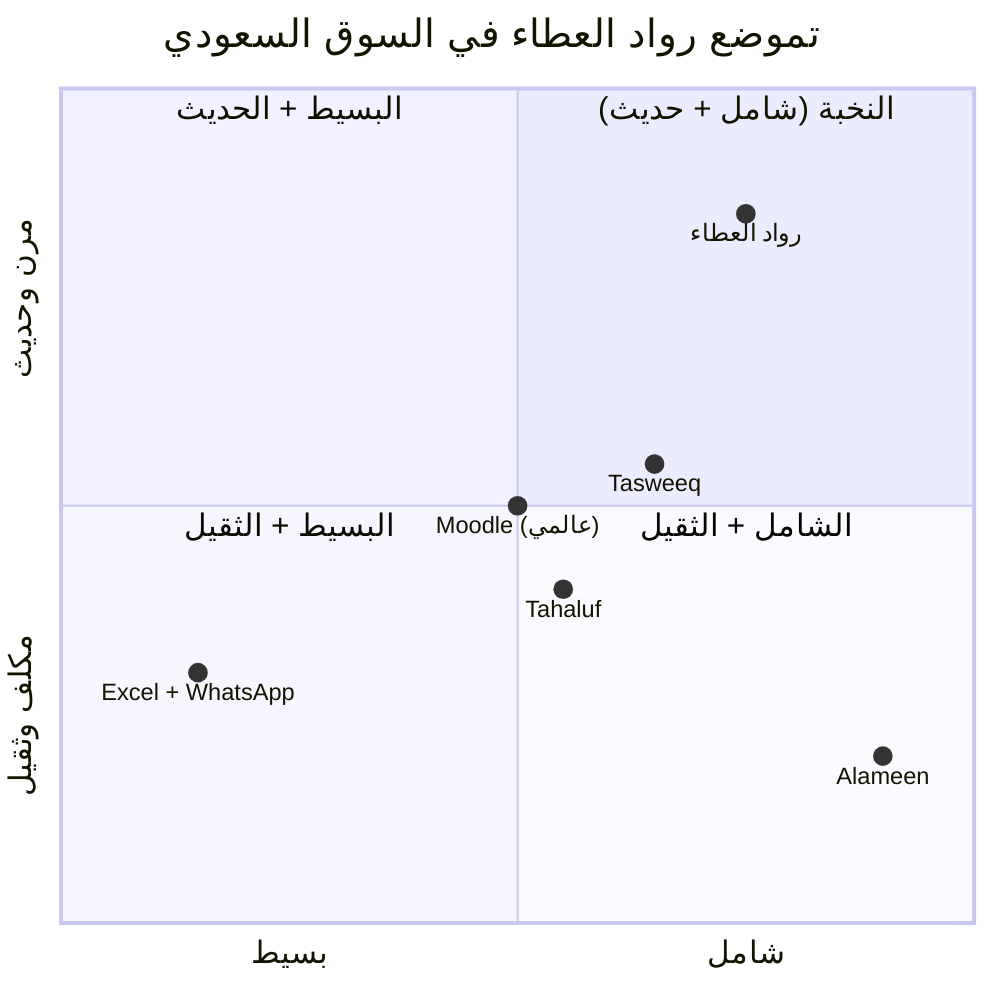
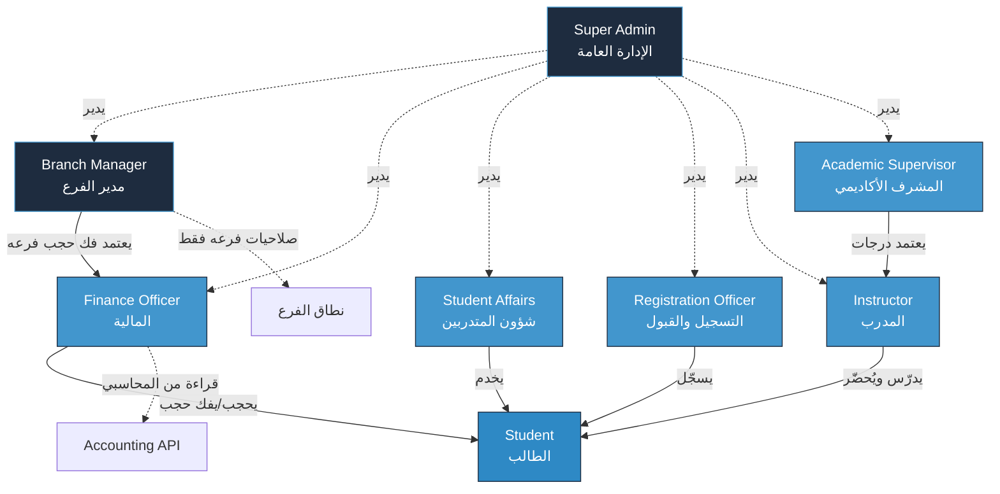
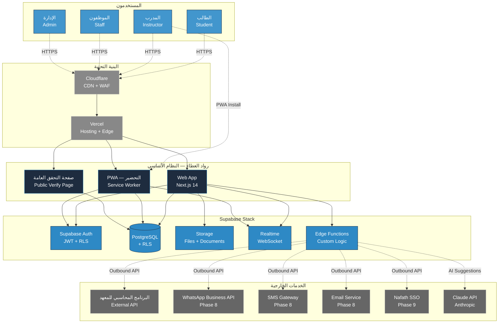
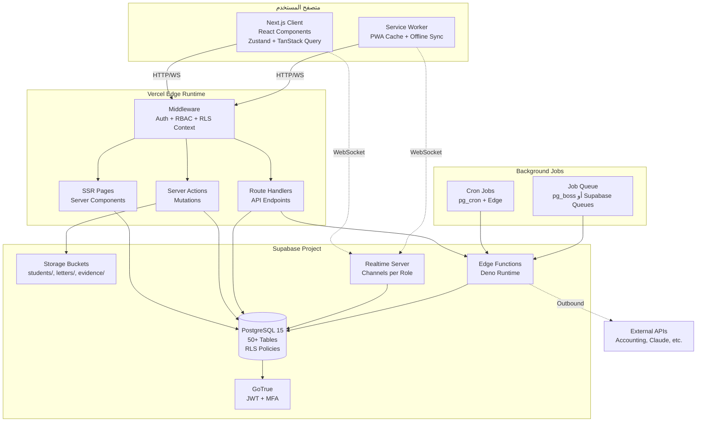
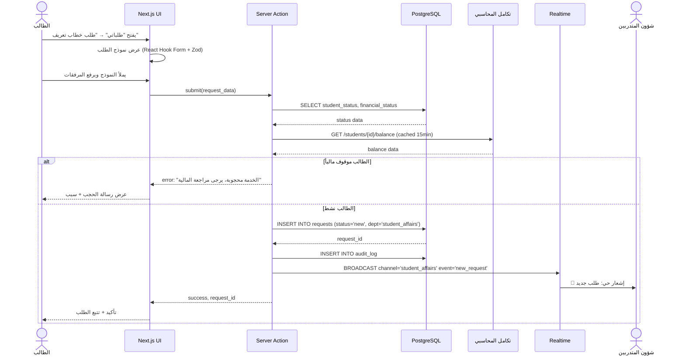
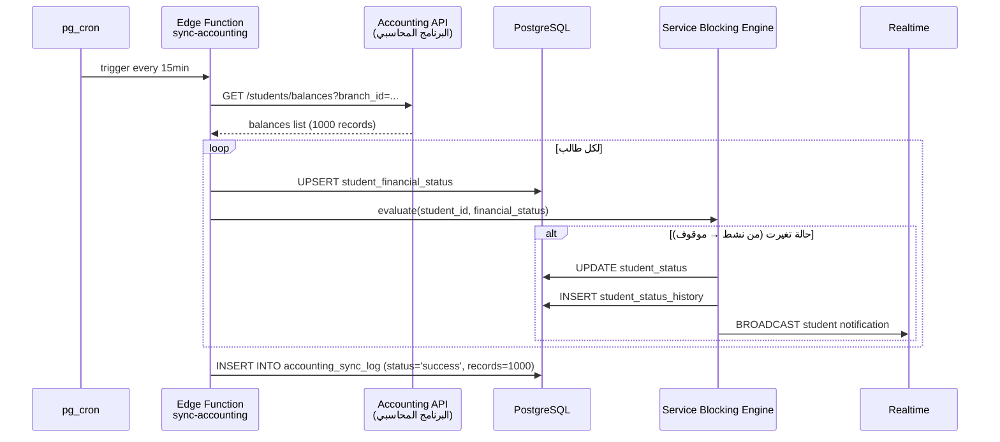
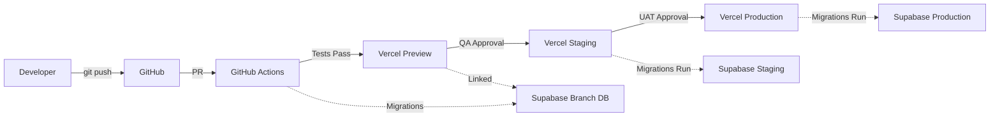

# الجزء الأول: السياق والمعمارية

> **وثيقة تسليم تقنية رسمية**
> **المشروع:** رواد العطاء — نظام إدارة المعهد التدريبي المتكامل
> **الإصدار:** 1.0
> **التاريخ:** 2026-05-12
> **الجمهور:** المبرمج المشارك (Senior Full-Stack Engineer)
> **معدّ الوثيقة:** Senior Solutions Architect
> **الحالة:** مسودة جاهزة للمراجعة

---

## 1. الملخص التنفيذي (Executive Summary)

### 1.1 نبذة عن المنتج

**رواد العطاء** هو نظام معلومات إداري وأكاديمي متكامل (Integrated Institutional Management System — IIMS) مبني خصيصاً للمعاهد التدريبية متعددة الفروع في المملكة العربية السعودية، مع تركيز جوهري على ربط الحالة الأكاديمية بالحالة المالية للطالب، وأتمتة الطلبات الإدارية بين الأقسام، وإصدار الوثائق الرسمية بصياغة قانونية معتمدة. النظام ليس "موقعاً للمعهد" ولا "قاعدة بيانات للطلاب" — بل بنية تشغيلية كاملة تستبدل ثلاثة أنماط عمل غير متسقة (Excel + الأوراق + WhatsApp) بمنصة موحّدة تخدم 7 أدوار مختلفة في وقت واحد.

النظام مبني على معمارية حديثة (Next.js 14 + Supabase) بدعم عربي أصلي من اليوم الأول، ويعمل في المتصفح وعلى الجوال عبر PWA دون الحاجة لتطبيقات Native في متاجر التطبيقات. يضم النظام موديولاً أكاديمياً متقدماً (بنك أسئلة بـ14 نوع سؤال + اقتراح ذكي عبر Claude AI + شهادات بـ QR قابلة للتحقق العام)، ومحركاً مالياً يتكامل مع برنامج محاسبي خارجي عبر API بحيث يبقى نظام رواد العطاء طبقة عرض وحجب خدمات لا طبقة محاسبة (يبقى الامتثال الضريبي و ZATCA E-Invoicing مسؤولية البرنامج المحاسبي للعميل)، ومحرك Workflow ديناميكي يستوعب 14 نوع طلب وسبع حالات إدارية مع مسارات بين الأقسام (شؤون المتدربين، المالية، الإدارة، التدريب).

السمة المعمارية الأهم هي **Multi-Branch من اليوم الأول**: المعهد يبدأ بأربعة فروع (الفرع الأول، الثاني، الثالث، الرابع)، لكن قاعدة البيانات والـ Row-Level Security تستوعب إضافة فروع جديدة دون أي Migration. كذلك، النظام مصمم ليكون **Multi-Tenant-Ready**: نواة `tenants → branches → users` تسمح بتحويله مستقبلاً لمنتج SaaS يخدم معاهد متعددة. هذا قرار معماري حاسم اتُّخذ من البداية لتجنب إعادة الكتابة لاحقاً.

أخيراً، **التزام النظام بـ PDPL** (نظام حماية البيانات الشخصية السعودي) إلزامي وليس اختيارياً، ويظهر في كل قرار تصميمي: تشفير at-rest عبر Postgres، تشفير in-transit عبر TLS 1.3، Audit Log كامل لا يُحذف، حق المحو والوصول والتصدير للطالب، استضافة قابلة للنقل لخادم سعودي (Self-Hosted KSA) فور تحقق المنتج تجارياً.

### 1.2 لمن، لماذا، ما الذي يحل

**لمن** — معاهد تدريبية سعودية مرخّصة (TVTC أو مستقلة) تدير ما بين 500 و 5,000 طالب موزعين على فرع واحد إلى عشرة فروع، مع 50-200 موظف يعملون في 6-8 أدوار وظيفية (إدارة عامة، مدير فرع، مالية، شؤون متدربين، تسجيل وقبول، مدربين، طلاب). الحجم المستهدف الأولي لمشروعنا — **المعهد بـ 1,000 طالب و 4 فروع** — يقع في المنتصف بدقة.

**لماذا** — لأن الأنظمة العالمية (Moodle، Canvas، Blackboard) لا تفهم سياق المعاهد السعودية: لا تدعم RTL أصلياً بشكل لائق، لا تربط الأكاديمي بالمالي بسلاسة، لا تدعم سير العمل الإداري الرسمي السعودي (خطابات تعريف، إفادات، تعهدات)، ولا تتكامل مع البنية المحاسبية المحلية (ZATCA، البرامج المحاسبية المحلية). الأنظمة السعودية المنافسة إما عامة جداً (Tasweeq كنظام CRM للمدارس) أو مكلفة جداً ولا تتيح ملكية البيانات (Alameen، Tahaluf). **رواد العطاء يملأ الفجوة:** نظام مفصّل سعودياً + ملكية كاملة للبيانات + قابل للتشغيل المحلي.

**ما الذي يحل** — أربع مشاكل تشغيلية حقيقية:

1. **ضياع الطلبات بين المحادثات** — الطالب يطلب خطاب إفادة عبر WhatsApp، يحوّل لشؤون المتدربين، يضيع، يعود الطالب يسأل، تبدأ السلسلة من جديد. النظام يحل هذا عبر **Workflow Engine** مع SLA لكل طلب.

2. **التحصيل المالي غير مرتبط بالخدمات** — طالب عليه متأخرات يحصل على شهادة، يستلم خطابات، يدخل اختبارات، ثم تتفاجأ المالية بعد التخرج. النظام يحل هذا عبر **Service Blocking Engine** المربوط مباشرة ببيانات البرنامج المحاسبي.

3. **عدم تطابق الأكاديمي والإداري** — درجات في Excel على جهاز مدرب، حضور على ورق في قاعة، حالة الطالب في رأس موظف شؤون المتدربين. النظام يوحّد هذه في **ملف طالب واحد** مع تاريخ كامل (Audit Log).

4. **العمل اليدوي على الوثائق الرسمية** — كل خطاب تعريف يُكتب يدوياً في Word، يُطبع، يُختم، يُسلَّم. النظام يحل هذا عبر **Letters Generator** يولّد PDF عربي RTL احترافي مع توقيع وختم وأرشفة تلقائية.

### 1.3 نقاط البيع الفريدة (Unique Selling Propositions — USPs)

| # | نقطة البيع | الفائدة المباشرة للعميل |
|---|------------|--------------------------|
| 1 | **ملكية كاملة للبيانات وحق التصدير** | إذا انتهى العقد، يحصل المعهد على نسخة Postgres كاملة + Excel لكل الجداول. لا حبس بيانات. |
| 2 | **معماري Multi-Branch من اليوم الأول** | إضافة فرع جديد = إدراج صف في جدول `branches` لا Migration. |
| 3 | **Service Blocking Engine قابل للتعديل** | مدير الإدارة يضبط بنفسه أي خدمة تُحجب لأي حالة دون عودة للمطوّر. |
| 4 | **شهادات بـ QR وصفحة تحقق عامة** | يرفع مصداقية شهادات المعهد لدى أصحاب العمل والجامعات. |
| 5 | **بنك أسئلة بـ Claude AI + موافقة المعلم** | المعهد يبني أصلاً معرفياً يخصه — لا يعتمد على بنوك خارجية. |
| 6 | **تكامل API مع البرنامج المحاسبي بدلاً من بناء محاسبة موازية** | لا تكرار للجهد، الالتزام الضريبي على البرنامج المحاسبي، نظامنا يبقى خفيفاً. |
| 7 | **PWA للتحضير على الجوال دون متجر تطبيقات** | المدرب يفتح الرابط، يثبّت أيقونة، يستخدم الحضور حتى بلا إنترنت. |
| 8 | **بنية API-first** | كل ميزة لها endpoint قابل للاستدعاء من خارج النظام (تكاملات مستقبلية). |
| 9 | **PDPL-by-Design** | تشفير، Audit Log، حق المحو، حق التصدير — مبنية في الـ Schema لا مضافة لاحقاً. |
| 10 | **عربي RTL أصلي + خط Cairo/IBM Plex Sans Arabic** | تجربة قراءة احترافية، ليست Bootstrap معكوس. |

### 1.4 شعار مقترح (Tagline)

**الشعار التجاري المقترح:**

> **رواد العطاء — منصة تُديرُ معهدك من التسجيل حتى التخرج**

**شعارات بديلة للاختيار:**

- "نظامٌ واحد، كل أقسام معهدك" — يركز على التوحيد.
- "من الطالب إلى الشهادة، خطوة واحدة" — يركز على دورة الحياة.
- "إدارة معهدك الذكية بالعربية الأصيلة" — يركز على الهوية المحلية.
- "تعليمٌ منظّم، إدارةٌ موثّقة" — يركز على الجانب التشغيلي.

> **توصية المعمارية:** اعتماد الشعار الأول لأنه يصف **النطاق الزمني الكامل** (التسجيل → التخرج) وهو مطابق للمسار الوظيفي للنظام (الموديولات 2 → 6 → 7 من خارطة الطريق).

---

## 2. سياق العميل والمشكلة التجارية

### 2.1 الوضع الحالي قبل النظام (As-Is State)

يعمل المعهد حالياً عبر **منظومة مفككة من ثلاث أدوات تقليدية** لا يجمع بينها رابط رقمي موحّد:

#### أ) Excel: قاعدة البيانات الفعلية

يستخدم المعهد ملفات Excel كقاعدة بيانات أساسية تشمل:

- **ملف بيانات الطلاب الكامل** (لكل فرع ملف مستقل) — اسم، هوية، جوال، برنامج، تاريخ التحاق، حالة، ملاحظات.
- **ملفات الدرجات** — لكل دورة/فصل ملف Excel مستقل بأعمدة الطلاب والمواد والدرجات.
- **ملف التحصيل المالي** — صف لكل طالب، أعمدة للأقساط، تواريخ السداد، المتبقي.
- **ملف الحضور** — أوراق ورقية يومية يدوّن المدرب عليها، تُجمَّع شهرياً في Excel.
- **ملف الاختبار الشامل** — كشوفات Excel للمؤهلين، النتائج، الشهادات.

**أوجاع Excel:**

- ملفات بنفس الاسم بإصدارات متضاربة على عدة أجهزة.
- **لا توجد نسخة موحّدة Authoritative** — أي تعارض يحتاج تدخلاً يدوياً.
- لا توجد قواعد عمل (مثلاً: إذا كان الطالب موقوفاً مالياً، فلا يستطيع طباعة شهادة) — كل قاعدة في رأس الموظف.
- صعوبة شديدة في إعداد التقارير الإدارية المجمّعة من 4 فروع.
- فقدان البيانات عند انتقال موظف أو تلف جهاز.
- **لا Audit Log** — تعديل الدرجة لا يُتعقّب، فك الحجب لا يُسجَّل من قام به.

#### ب) الأوراق: الوثائق الرسمية

- **خطابات التعريف** و **الإفادات** و **شهادات الحضور** تُكتب يدوياً في Word، تُطبع، تُختم، تُسلَّم.
- **مرفقات الطلاب** (الهوية، الشهادات السابقة، صور شخصية) موجودة في ملفات ورقية في الأرشيف.
- **سندات القبض** (إيصالات الدفع) ورقية في 4 فروع، يُجمّعها المحاسب أسبوعياً.

**أوجاع الأوراق:**

- ضياع المستندات عند الانتقال بين الموظفين.
- صعوبة البحث في الأرشيف.
- لا يمكن مشاركتها رقمياً مع طالب يحتاجها عاجلاً.
- التوقيع والختم يحتاجان حضور شخص معتمد (يتعطّل العمل في غياب المدير).

#### ج) WhatsApp: قناة التواصل والطلبات

- الطالب يطلب خطاباً عبر WhatsApp من رقم شؤون المتدربين.
- الموظف يحوّل الطلب يدوياً للمالية لفحص الحالة، ثم للإدارة للاعتماد، ثم يُعيد للطالب.
- لا توجد حالة موحّدة للطلب — كل طرف يعرف ما عنده فقط.
- المحادثات تختلط بين الشخصي والعمل.
- **لا يوجد SLA** — طلب قد يبقى أسبوعاً دون رد.
- لا توجد إحصاءات (كم طلب شهرياً، متوسط الإغلاق، الذي يتأخر أكثر).

### 2.2 الأوجاع الكبرى (Pain Points) — مرتبة حسب الأولوية

| # | الوجع | الأثر التشغيلي | الأولوية |
|---|-------|---------------|----------|
| **P1** | **المتأخرات المالية لا تُحجَب الخدمات تلقائياً** | طلاب يستلمون شهادات وخطابات وهم مدينون → خسائر تحصيل مباشرة | 🔴 حرجة |
| **P2** | **فقدان الطلبات في WhatsApp** | طلبات تضيع، شكاوى من الطلاب، فقدان ثقة | 🔴 حرجة |
| **P3** | **عدم وجود سجل موحّد لحالة الطالب** | الإدارة لا تعرف بدقة عدد المنتظمين/المتعثرين/المنسحبين | 🔴 حرجة |
| **P4** | **التقارير الإدارية تأخذ أياماً يدوياً** | اتخاذ قرارات بأرقام قديمة | 🟠 عالية |
| **P5** | **عدم اعتماد الدرجات قبل النشر** | درجات تظهر للطلاب بأخطاء، يحدث جدل، تُعاد المراجعة | 🟠 عالية |
| **P6** | **الاختبار الشامل النهائي يُدار بـ Excel فقط** | الكشوفات الورقية تضيع، صعوبة التحقق من المؤهلين | 🟠 عالية |
| **P7** | **خطابات رسمية تُكتب يدوياً** | بطء، عرضة للأخطاء الإملائية، صياغات غير موحّدة | 🟡 متوسطة |
| **P8** | **لا توجد بوابة للطالب** | الطالب يسأل دائماً بدلاً من أن يجد المعلومة بنفسه | 🟡 متوسطة |
| **P9** | **مرفقات الطلاب على الأرشيف الورقي** | ضياع، صعوبة المشاركة، خطر التلف | 🟡 متوسطة |
| **P10** | **عدم وجود تحضير رقمي للمدربين** | الحضور على ورق ينتقل لـ Excel متأخراً | 🟢 منخفضة |

> **اقتباس حرفي من العميل (وثيقة الاحتياجات):** "أهم نقطة لدينا أن تكون خدمات الطالب مرتبطة بحالته المالية والأكاديمية، مثل حجب الخطابات أو الاختبارات أو النتائج عند وجود مستحقات، مع إمكانية فك الحجب من الإدارة بصلاحية واضحة."

هذه الجملة تحدد بوضوح **P1 كأولوية رقم 1**، وهي السبب في تخصيص جزء كامل (3.2 Service Blocking Engine) من خارطة الطريق لها.

### 2.3 الأهداف الاستراتيجية (Business Goals)

#### الأهداف قصيرة المدى (6-12 شهر)

| الهدف | المؤشر القابل للقياس (KPI) | الفائدة |
|------|------------------------------|---------|
| تقليل المتأخرات بنسبة 30% | قيمة المتأخرات الإجمالية / إجمالي الإيرادات | تحسين التدفق النقدي |
| إغلاق 80% من الطلبات خلال SLA | عدد الطلبات المنتهية في الوقت / الإجمالي | رفع رضا الطلاب |
| تقليل الأخطاء الإدارية 50% | عدد المشاكل المسجّلة / إجمالي العمليات | ثقة العملاء |
| رقمنة 100% من الخطابات والشهادات | عدد الوثائق المُولَّدة رقمياً | السرعة والشفافية |
| تقليل وقت إعداد التقارير من ساعات لدقائق | متوسط وقت إعداد تقرير شهري | اتخاذ قرارات سريعة |

#### الأهداف متوسطة المدى (1-2 سنة)

- **التوسع لـ 6-8 فروع** دون تغيير في النظام.
- **خفض تكلفة الموظفين الإداريين** عبر الأتمتة (نقل موظفين لأدوار ذات قيمة أعلى).
- **رفع نسبة استرداد المتأخرات** عبر الإشعارات الآلية والحجب الذكي.
- **بناء بنك أسئلة شامل** يخدم 50+ مادة و 10+ دبلوم.
- **الحصول على شهادة Cyber Security** عبر الالتزام بـ PDPL.

#### الأهداف بعيدة المدى (3-5 سنوات)

- **تحويل النظام لمنتج SaaS** يُباع لمعاهد أخرى (Multi-Tenant).
- **التكامل مع منصات حكومية** (Nafath، ETEC، دروب).
- **بناء نماذج تنبؤية AI** للطلاب المعرّضين للتسرب.
- **التوسع الجغرافي** لمدن أخرى في المملكة وربما الخليج.

### 2.4 تحليل المنافسين السعوديين (Competitive Analysis)

> **تنبيه:** هذا التحليل مبني على معلومات سوقية عامة. الأرقام والميزات الدقيقة **تحتاج تأكيد** من العميل أو دراسة سوق متخصصة.

#### 2.4.1 Tasweeq (نظام إدارة معاهد سعودي)

| البند | التقييم |
|------|--------|
| **التركيز** | إدارة عامة للمعاهد + التسجيل + المالية |
| **القوة** | حضور سوقي قوي، تكامل ZATCA، RTL ممتاز |
| **الضعف** | غير مرن في الـ Workflows المخصصة، الواجهة كلاسيكية، صلاحيات أقل دقة |
| **نموذج التسعير** | اشتراك شهري حسب عدد الطلاب |
| **الجمهور المستهدف** | معاهد متوسطة وكبيرة (1,000-10,000 طالب) |
| **منافستنا له** | نتفوق في: Workflow Engine، الاختبارات الإلكترونية، شهادات QR، PWA. نتأخر في: النضج السوقي، السمعة، التكامل المباشر مع ZATCA. |

#### 2.4.2 Alameen (نظام مؤسسي تعليمي)

| البند | التقييم |
|------|--------|
| **التركيز** | نظام شامل للجامعات والمعاهد الكبيرة |
| **القوة** | شامل جداً، يدعم كل شيء، شركة كبيرة |
| **الضعف** | معقد جداً للمعاهد الصغيرة، باهظ، التخصيص صعب، الواجهة قديمة |
| **نموذج التسعير** | رخصة مؤسسية كبيرة + رسوم تنفيذ ضخمة |
| **الجمهور المستهدف** | الجامعات والمعاهد الكبرى الحكومية |
| **منافستنا له** | نتفوق في: المرونة، السرعة، الواجهة الحديثة، التكلفة. لا ننافسه أصلاً في السوق المؤسسي الكبير. |

#### 2.4.3 Tahaluf (نظام إداري للمعاهد التدريبية)

| البند | التقييم |
|------|--------|
| **التركيز** | المعاهد التدريبية المعتمدة من TVTC |
| **القوة** | تكامل مع TVTC، خبرة بمتطلبات الجهات المنظمة |
| **الضعف** | تحت السحابة المغلقة، لا ملكية بيانات، تخصيص محدود |
| **نموذج التسعير** | اشتراك سنوي + رسوم تنفيذ |
| **الجمهور المستهدف** | معاهد TVTC المرخّصة |
| **منافستنا له** | نتفوق في: ملكية البيانات، التخصيص، الاختبارات الإلكترونية، Claude AI. نتأخر في: التكامل المباشر مع TVTC (يحتاج جهد لاحق). |

#### 2.4.4 خلاصة التموضع السوقي



**التموضع الموصى به للنظام:**
- **حداثة** أعلى من الجميع (Next.js 14 + AI + PWA + QR).
- **شمولية** أعلى من Tahaluf، أقل من Alameen، مكافئة لـ Tasweeq.
- **تكلفة** أقل بكثير من Alameen وTahaluf، مكافئة أو أقل من Tasweeq.
- **مرونة التخصيص** هي أكبر USP حقيقي مقابل المنافسين السحابيين.

---

## 3. أصحاب المصلحة والأدوار (Stakeholders & Roles)

النظام يدعم **7 أدوار وظيفية صريحة + دور ضمني واحد** (المشرف الأكاديمي الذي يعتمد الدرجات). الجدول أدناه يفصّل كل دور بدقة كاملة.

### 3.1 جدول الأدوار الشامل

| # | الاسم (عربي) | الاسم (إنجليزي / Code) | الوصف الموجز |
|---|---------------|------------------------|---------------|
| 1 | الإدارة العامة | `super_admin` | صلاحيات كاملة على النظام عبر جميع الفروع |
| 2 | مدير الفرع | `branch_manager` | إدارة الفرع المسؤول عنه فقط |
| 3 | موظف المالية والتحصيل | `finance_officer` | إدارة الملف المالي والتحصيل والحجب |
| 4 | موظف شؤون المتدربين | `student_affairs` | إدارة طلبات الطلاب والخطابات والاختبار الشامل |
| 5 | موظف التسجيل والقبول | `registration_officer` | إدارة دورة التسجيل والقبول (CRM) |
| 6 | المدرب/المعلم | `instructor` | إدارة المواد المسندة + الحضور + الدرجات |
| 7 | الطالب | `student` | عرض ملفه الخاص + تقديم الطلبات |
| (ضمني) | المشرف الأكاديمي | `academic_supervisor` | اعتماد الدرجات قبل النشر |

### 3.2 التفصيل العميق لكل دور

---

#### 3.2.1 الإدارة العامة (Super Admin)

**الوصف:** الدور الأعلى صلاحياً في النظام. يمثّل صاحب المعهد أو المدير العام. لديه رؤية كاملة عبر جميع الفروع، وقدرة على تعديل أي شيء، واعتماد العمليات الحساسة، وإدارة المستخدمين والصلاحيات.

**الصلاحيات (Permissions):**

| الصلاحية | المستوى |
|---------|---------|
| إنشاء/تعديل/أرشفة جميع الكيانات (طلاب، موظفين، فروع، دبلومات، مواد) | كامل عبر كل الفروع |
| اعتماد أو رفض **فك الحجب المالي** (مع توثيق إلزامي للسبب) | كامل |
| اعتماد **الخصومات والإعفاءات والمنح** | كامل |
| اعتماد **الانسحاب الكامل** للطلاب | كامل |
| تعديل **مصفوفة الحجب** (أي خدمة تُحجب لأي حالة) | كامل |
| تعديل **قواعد العمل** (نسبة الحرمان بالغياب، عدد الإنذارات، SLA الطلبات) | كامل |
| إدارة المستخدمين (إضافة، تعديل، تعطيل، إعادة تعيين كلمة المرور) | كامل |
| إدارة الأدوار والصلاحيات (RBAC) | كامل |
| الوصول لـ **Audit Log** كاملاً | كامل |
| الوصول لجميع **التقارير عبر جميع الفروع** | كامل |
| **التعديل اليدوي للدرجات** (مع توثيق السبب — Audit Log إلزامي) | كامل (استثناء) |
| تصدير قاعدة البيانات الكاملة (PDPL — حق الملكية) | كامل |
| إعدادات النظام العامة (الشعار، الألوان، القوالب) | كامل |
| تعديل **حالة الطالب يدوياً** (حالات استثنائية) | كامل |

**القيود (Constraints) — ما لا يستطيع:**

- ❌ **لا يمكنه حذف Audit Log** — هذا قيد قانوني (PDPL) ومعماري.
- ❌ **لا يمكنه تجاوز التوقيع الإلكتروني للاعتمادات** بدون توثيق سبب.
- ❌ **لا يمكنه الدخول بدور آخر** — لكل دور حساب منفصل (لكن يمكنه فتح حسابات إضافية للمحاكاة).
- ❌ **لا يمكنه تعديل بيانات محاسبية** — تأتي فقط من البرنامج المحاسبي (للقراءة فقط).
- ❌ **لا يمكنه تجاوز الـ MFA / 2FA** على عمليات الاعتماد الحساسة.

**الواجهة الرئيسية (Primary Interface):**

`/admin/dashboard` — لوحة قيادة شاملة تعرض:
- ملخص KPIs لكل الفروع (طلاب نشطين، متأخرات إجمالية، طلبات مفتوحة، أداء مالي).
- قائمة الموافقات المعلقة (Pending Approvals) — فك حجب، خصومات، انسحابات.
- خريطة الفروع مع لون لكل فرع حسب الأداء.
- آخر الأحداث الهامة (Audit Stream — قراءة فقط).

**أمثلة على المستخدمين (Sample Users):**

- **[العميل]** — صاحب المعهد (مذكور في وثيقة الاحتياجات Author).
- **مدير العمليات العام** الذي يدير كل الفروع.
- **مدير التطوير والاستراتيجية** الذي يحتاج رؤية كاملة للتقارير.

**ملاحظات تقنية للمبرمج:**
- هذا الدور يجب أن يكون **محمياً بـ 2FA إلزامي** (Supabase Auth + TOTP).
- جميع العمليات الحساسة (فك حجب، تعديل درجة) تحتاج **حقل سبب إلزامي ≥ 20 حرف**.
- جميع عملياته **تُسجَّل في `audit_log` بأعلى مستوى تفصيل**.

---

#### 3.2.2 مدير الفرع (Branch Manager)

**الوصف:** المسؤول التشغيلي عن فرع واحد محدد. لديه صلاحيات إدارية شاملة لكن **مقيّدة بفرعه فقط**. هو نقطة التواصل الإدارية بين الإدارة العامة والموظفين في الفرع.

**الصلاحيات:**

| الصلاحية | المستوى |
|---------|---------|
| إدارة طلاب فرعه (إضافة، تعديل، عرض الملفات) | كامل ضمن الفرع |
| إدارة موظفي فرعه (لكن **لا يضيف/يحذف** موظفين — الإدارة العامة فقط) | عرض وتعديل بسيط |
| اعتماد فك الحجب المالي لطلاب فرعه (حسب الإعدادات) | محدود (قابل للضبط) |
| الموافقة على الطلبات في فرعه | كامل ضمن الفرع |
| الوصول لتقارير فرعه | كامل |
| رؤية أكواد الاختبارات في فرعه | كامل |
| الموافقة على إصدار الخطابات الرسمية | كامل |

**القيود:**

- ❌ **لا يرى بيانات الفروع الأخرى** (تنفيذ صارم عبر RLS).
- ❌ **لا يضيف/يحذف مستخدمين** — يطلب من الإدارة العامة.
- ❌ **لا يعدّل قواعد العمل الموحّدة** (نسب الحرمان، SLA).
- ❌ **لا يصدر قرارات الانسحاب الكامل** — يحوّل للإدارة العامة.
- ❌ **لا يعدّل مصفوفة الحجب** (إعداد عام).

**الواجهة الرئيسية:**

`/admin/branch/{branch_id}/dashboard` — لوحة قيادة الفرع تعرض:
- KPIs الفرع (طلاب نشطين، التحصيل، الطلبات المعلقة).
- قائمة الموافقات المعلقة في فرعه.
- جدول الفصول الدراسية الحالية.
- إنذارات (طلاب على وشك الحرمان، طلبات متأخرة).

**أمثلة:**

- **مدير الفرع الأول**.
- **مدير الفرع الثاني**.
- **مدير الفرع الثالث**.
- **مدير الفرع الرابع**.

**ملاحظات تقنية:**
- RLS صارم: `WHERE branch_id = auth.jwt() -> branch_id`.
- كل استعلام يجب أن يمر بفلتر `branch_id` تلقائياً (View Wrappers).
- 2FA موصى به لكن غير إلزامي.

---

#### 3.2.3 موظف المالية والتحصيل (Finance Officer)

**الوصف:** المسؤول عن إدارة الجانب المالي للطلاب — الأقساط، المتأخرات، التعهدات، الإيصالات، تطبيق الحجب الآلي ومتابعة فك الحجب. هذا الدور **يقرأ من البرنامج المحاسبي عبر API** ولا يدخل فواتير أصلية في نظامنا.

**الصلاحيات:**

| الصلاحية | المستوى |
|---------|---------|
| عرض الملف المالي لأي طالب في الفروع المسؤول عنها | كامل |
| تسجيل **تعهد سداد** (Promise to Pay) من الطالب | كامل |
| رفع **الإيصالات يدوياً** (للأرشفة) | كامل |
| **طلب فك حجب** (يحتاج اعتماد المدير) | كامل |
| إنشاء **خصم/إعفاء جزئي** (يحتاج اعتماد) | كامل |
| إعداد **تقارير التحصيل** (مسددين، متأخرين، تعهدات) | كامل |
| إرسال **إشعارات السداد** للطلاب (يدوياً + تلقائياً) | كامل |
| استخراج تقارير Excel (المتأخرات، الإيرادات، الأقساط القادمة) | كامل |

**القيود:**

- ❌ **لا يعدّل الأرصدة المالية مباشرة** — التعديل يأتي فقط من البرنامج المحاسبي (Read-Only للقيود الأساسية).
- ❌ **لا يفك حجباً تلقائياً** — كل فك حجب يحتاج توثيق سبب + اعتماد المدير في كثير من الحالات.
- ❌ **لا يطّلع على بيانات أكاديمية** (الدرجات، الاختبارات).
- ❌ **لا يصدر فواتير ضريبية ZATCA** — يتم في البرنامج المحاسبي.

**الواجهة الرئيسية:**

`/finance/dashboard` — تعرض:
- ملخص التحصيل (مسددين، متأخرين، قيد الانتظار).
- قائمة المتأخرات مرتبة بالمبلغ + المدة.
- التعهدات النشطة وتواريخ استحقاقها.
- طلبات فك الحجب المعلقة.

**أمثلة:**

- موظف تحصيل في الفرع الأول.
- محاسب رئيسي للمعهد (يعمل عبر كل الفروع — يحتاج صلاحية Cross-Branch).

**ملاحظات تقنية:**
- البيانات المالية الأصلية تأتي من **`accounting_sync_log`** الذي يستدعي API البرنامج المحاسبي.
- التزامن دوري (cron job كل 15-30 دقيقة) + on-demand عند الطلب.
- يجب أن يكون **Idempotent** — تكرار التزامن لا يُكرر القيود.

---

#### 3.2.4 موظف شؤون المتدربين (Student Affairs)

**الوصف:** المسؤول عن متابعة دورة حياة الطالب من ناحية إدارية وخدمية — طلبات الخطابات، الانسحاب، الإيقاف المؤقت، الشكاوى، المرفقات الناقصة، والاختبار الشامل النهائي. هو الواجهة الرئيسية للطالب بعد التسجيل.

**الصلاحيات:**

| الصلاحية | المستوى |
|---------|---------|
| عرض ملف الطالب كاملاً (شخصي + أكاديمي + مالي عرض فقط) | كامل |
| استلام الطلبات وتوزيعها على الأقسام | كامل |
| توليد الخطابات الرسمية (تعريف، إفادة، تدريب، شهادة...) | كامل |
| إدارة الشكاوى والاستفسارات والمقترحات | كامل |
| إدارة طلبات الانسحاب والإيقاف المؤقت (تحت إشراف المدير) | كامل |
| متابعة المرفقات الناقصة وإشعار الطلاب | كامل |
| إدارة الاختبار الشامل النهائي (المؤهلين، رفع النتائج، الكشوفات) | كامل |
| تعديل حالة الطالب (بعض الحالات: ناقص مرفقات، تحت المراجعة) | محدود |

**القيود:**

- ❌ **لا يصدر الخطاب نهائياً** إن كان الطالب موقوفاً مالياً (حتى فك الحجب).
- ❌ **لا يعدّل الدرجات الأكاديمية**.
- ❌ **لا يفك حجباً مالياً**.
- ❌ **لا يعتمد الانسحاب الكامل** — يحوّل للإدارة.

**الواجهة الرئيسية:**

`/student-affairs/dashboard` — تعرض:
- قائمة الطلبات المفتوحة مع أعمارها (للتنبيه على SLA).
- المؤهلين/غير المؤهلين للاختبار الشامل (Filterable).
- الشكاوى المفتوحة.
- المرفقات الناقصة لكل طالب.

**أمثلة:**

- موظف شؤون المتدربين في كل فرع.
- منسّق شؤون المتدربين على مستوى المعهد كله (يحتاج Cross-Branch).

---

#### 3.2.5 موظف التسجيل والقبول (Registration Officer)

**الوصف:** يدير دورة التسجيل من اللحظة الأولى (مهتم) حتى تحويل الطالب لحساب نشط في النظام. يعمل كـ Mini-CRM للمعهد.

**الصلاحيات:**

| الصلاحية | المستوى |
|---------|---------|
| إنشاء طالب جديد بحالة "مهتم" | كامل |
| تحريك الطالب عبر 7 مراحل التسجيل | كامل |
| رفع المرفقات (الهوية، الشهادات، صورة شخصية) | كامل |
| إنشاء **رقم طالب** فريد للمعهد | كامل (تلقائي) |
| تحويل الطالب للمالية لدفع رسوم القبول | كامل |
| تحويل الطالب لشؤون المتدربين بعد اكتمال التسجيل | كامل |
| إعداد تقارير التسجيل (مصادر التسجيل، نسبة التحويل) | كامل |
| إدارة قائمة الانتظار (Waitlist) للبرامج الممتلئة | كامل |

**القيود:**

- ❌ **لا يصدر قرارات قبول نهائية** قبل دفع رسوم القبول.
- ❌ **لا يعدّل بيانات طالب نشط** (يحوّل لشؤون المتدربين).
- ❌ **لا يطّلع على البيانات الأكاديمية**.

**الواجهة الرئيسية:**

`/registration/dashboard` — Kanban Board بـ 7 أعمدة:
- مهتم → تم التواصل → بانتظار مستندات → بانتظار دفعة → تم التسجيل → مرفوض → ملغي

**أمثلة:**

- موظف استقبال يجمع البيانات الأولية من الزائرين.
- موظف Inside Sales يتابع الاهتمامات من القنوات الإلكترونية.

---

#### 3.2.6 المدرب/المعلم (Instructor)

**الوصف:** المعلم المسؤول عن مواد دراسية محددة. لديه صلاحية على **مواده فقط** — لا يرى مواد المدربين الآخرين. مسؤول عن الحضور، الدرجات، الواجبات، إدخال الأسئلة في البنك، إنشاء الاختبارات.

**الصلاحيات:**

| الصلاحية | المستوى |
|---------|---------|
| عرض جدوله الأسبوعي (المواد المسندة إليه) | كامل |
| تسجيل الحضور للجلسات (عبر PWA من الجوال أو الويب) | كامل |
| إدخال الدرجات يدوياً أو عبر Excel | كامل (تخضع للاعتماد) |
| إنشاء واجبات وتقييم التسليمات | كامل |
| إنشاء اختبارات (تلقائي/يدوي من بنك الأسئلة) | كامل في مواده فقط |
| إضافة أسئلة في بنك المعهد (يدوي / Excel / Claude AI) | كامل |
| تصحيح الأسئلة المقالية | كامل |
| متابعة أداء طلابه (تقارير) | كامل |
| رؤية كود الاختبار لمواده فقط | كامل |

**القيود:**

- ❌ **لا يرى أسئلة مواد المدربين الآخرين** (RLS صارم).
- ❌ **درجاته لا تظهر للطالب** قبل اعتماد المشرف الأكاديمي.
- ❌ **لا يضيف درجات تشجيعية** — هذا حق الإدارة فقط.
- ❌ **لا يفتح/يغلق الاختبارات في القاعة** بمفرده — يتبع نظام كود الاختبار.
- ❌ **لا يرى الملف المالي للطالب**.

**الواجهة الرئيسية:**

`/instructor/dashboard` — تعرض:
- الجلسات اليوم (وقت، مادة، قاعة، رابط محاضرة إن أونلاين).
- الواجبات المنتظرة للتقييم.
- الاختبارات المنشأة وحالتها.
- طلاب يحتاجون متابعة (غياب متكرر، درجات منخفضة).

**واجهة PWA منفصلة:**

`/pwa/attendance` — تطبيق ويب على الجوال يعمل Offline:
- تحضير سريع: بطاقة لكل طالب، نقرة واحدة لتغيير الحالة.
- التزامن التلقائي عند رجوع الإنترنت.

**أمثلة:**

- مدرب اللغة الإنجليزية.
- مدرب الحاسب الآلي.
- مدرب التسويق الرقمي.

---

#### 3.2.7 الطالب (Student)

**الوصف:** المستفيد النهائي. لديه نوعان من التسجيل:
- **عن بُعد (Remote)** — يدرس أونلاين، يدخل الاختبارات من المنزل.
- **حضوري (Onsite)** — يحضر في القاعات، يدخل الاختبارات بكود قاعة.

**الصلاحيات:**

| الصلاحية | المستوى |
|---------|---------|
| عرض ملفه الشخصي (بياناته، البرنامج، حالته) | كامل (للقراءة) |
| عرض جدوله الأسبوعي | كامل (للقراءة) |
| عرض حضوره وغيابه | كامل (للقراءة) |
| عرض درجاته (بعد اعتمادها) | كامل (للقراءة) |
| عرض ملفه المالي (المدفوع، المتبقي، الأقساط القادمة) | كامل (للقراءة) |
| تقديم 14 نوع طلب (خطابات، انسحاب، شكوى...) | كامل |
| متابعة حالة طلباته (Real-Time) | كامل |
| أداء الاختبارات (حسب نوع تسجيله) | كامل |
| تحميل شهاداته بعد إكمال الدبلوم | كامل |
| تعديل بياناته الشخصية (الجوال، البريد، العنوان) | محدود (يحتاج اعتماد للتحديثات الرسمية) |

**القيود:**

- ❌ **لا يرى درجات قبل الاعتماد**.
- ❌ **لا يرى نتيجة إذا كان موقوفاً مالياً** وفقاً للسياسة.
- ❌ **لا يحمّل خطابات إذا كان عليه متأخرات** (يظهر له تنبيه).
- ❌ **لا يدخل اختبارات حضورية بدون الكود من المدرب**.
- ❌ **لا يعدّل اسمه أو هويته أو فرعه** — يحتاج طلب رسمي.

**الواجهة الرئيسية:**

`/student/dashboard` — تعرض:
- بطاقة "حالتي" — حالة الطالب + التنبيهات الحالية (متأخرات، حرمان، إنذارات).
- الجدول هذا الأسبوع.
- الاختبارات والواجبات القادمة.
- آخر الإشعارات.
- زر "تقديم طلب جديد".

**أمثلة:**

- **طالب عن بُعد:** يسكن في مدينة أخرى ويدرس دبلوماً من المعهد بالفرع الأول.
- **طالب حضوري:** يحضر يومياً لالفرع الثاني.

**ملاحظات تقنية:**
- الطالب **مستخدم نهائي حساس** — تجربة الواجهة (UX) لها أولوية أعلى.
- يجب دعم اللغة العربية الفصحى البسيطة (تجنب المصطلحات التقنية).
- إشعارات Push عبر PWA + (لاحقاً) WhatsApp + SMS.

---

#### 3.2.8 المشرف الأكاديمي (Academic Supervisor) — دور ضمني

**الوصف:** دور ضمني مُستنبط من وثيقة الاحتياجات (الفصل 5 — "الدرجات تحتاج اعتماد المشرف أو الإدارة"). قد يكون هذا الدور **مدير الفرع نفسه** أو **شخصاً مخصصاً**. القرار التشغيلي يحتاج توضيحاً من العميل.

**الصلاحيات:**

| الصلاحية | المستوى |
|---------|---------|
| مراجعة الدرجات المُدخلة من المدربين | كامل |
| الموافقة أو رفض الدرجات (مع سبب الرفض) | كامل |
| تعديل الدرجات بعد التشاور مع المدرب | كامل |
| إعداد تقارير الأداء الأكاديمي | كامل |

**القيود:**
- ❌ **لا يدخل درجات أصلية** — فقط يعتمد ما أدخله المدرب.

> **سؤال للعميل (يحتاج توضيح):** هل هذا دور مستقل في النظام، أم نسلّم الصلاحية لمدير الفرع؟ افتراضياً، **نقترح دمجه مع مدير الفرع كصلاحية إضافية** ما لم يحدد العميل خلاف ذلك.

---

### 3.3 خريطة الأدوار والصلاحيات (Permission Matrix Summary)



### 3.4 ملخص العمليات الحساسة لكل دور (Quick Reference)

| العملية الحساسة | الدور المخوّل | الموافقة المطلوبة | Audit Log |
|------------------|---------------|-------------------|-----------|
| فك حجب مالي | Finance Officer (يطلب) → Super Admin / Branch Manager (يعتمد) | إلزامي | إلزامي + حقل سبب |
| إصدار خصم/إعفاء | Finance Officer (يقترح) → Super Admin (يعتمد) | إلزامي | إلزامي |
| اعتماد درجات | Instructor (يدخل) → Academic Supervisor (يعتمد) | إلزامي | إلزامي |
| إصدار خطاب رسمي | Student Affairs (يولّد) → Branch Manager (يوقّع) | حسب نوع الخطاب | إلزامي |
| تعديل حالة الطالب | Super Admin / Branch Manager | حسب الحالة | إلزامي |
| الانسحاب الكامل | Student (يطلب) → Student Affairs (يجهّز) → Finance (يصفّي) → Super Admin (يعتمد) | إلزامي 3 مستويات | إلزامي |
| تعديل مصفوفة الحجب | Super Admin فقط | لا (لكن مع سبب) | إلزامي |
| تصدير قاعدة البيانات الكاملة | Super Admin فقط | لا | إلزامي + إشعار للعميل |

---

## 4. نطاق المشروع وحدوده (Project Scope & Boundaries)

### 4.1 ما يدخل في النطاق (In-Scope)

#### 4.1.1 الموديولات الوظيفية الأساسية

| # | الموديول | المرحلة | الوصف الموجز |
|---|----------|---------|---------------|
| M01 | الهوية والمصادقة (IAM) | 0 | تسجيل الدخول، 2FA، إدارة الجلسات |
| M02 | إدارة الأدوار والصلاحيات (RBAC) | 0 | 7 أدوار + الصلاحيات الدقيقة |
| M03 | إدارة الفروع (Multi-Branch) | 0 | 4 فروع + قابلية الإضافة + RLS |
| M04 | بنك الأسئلة المركزي | 1 | 14 نوع سؤال + استيراد + Claude AI |
| M05 | محرك الاختبارات | 1 | توليد + كود الاختبار + التصحيح |
| M06 | الدبلومات والشهادات | 1 | تسلسل + QR + صفحة تحقق |
| M07 | التحضير عبر PWA | 1 | جوال + Offline |
| M08 | إدارة الطلاب (State Machine) | 2 | 8 حالات + ملف كامل |
| M09 | تكامل المحاسبي (Read-Only) | 3 | API call + caching |
| M10 | Service Blocking Engine | 3 | مصفوفة قواعد + فك يدوي |
| M11 | لوحات المالية للقراءة | 3 | عرض البيانات المالية |
| M12 | Workflow Engine + الطلبات | 4 | 14 نوع طلب + 7 حالات |
| M13 | Letters Generator (PDF) | 4 | قوالب + RTL |
| M14 | شؤون المتدربين | 5 | الحالات + الشكاوى |
| M15 | التسجيل والقبول (CRM) | 5 | 7 مراحل + Kanban |
| M16 | إدارة الجداول | 6 | جدول + قاعات + روابط |
| M17 | الحضور والإنذارات | 6 | PWA + الحرمان |
| M18 | الواجبات الكاملة | 6 | رفع + تقييم |
| M19 | الاختبار الشامل النهائي | 6 | المؤهلين + Excel |
| M20 | لوحات الإدارة (Dashboards) | 7 | KPIs + فلاتر |
| M21 | التقارير الشاملة | 7 | Excel + PDF |
| M22 | الإشعارات الداخلية | 0 + 4 + 6 | داخل النظام + Realtime |
| M23 | الأرشفة الرقمية | 4 + 5 | ملف رقمي للطالب |
| M24 | Audit Log | 0 | تسجيل كل العمليات الحساسة |

#### 4.1.2 التكاملات الخارجية ضمن النطاق

| التكامل | المرحلة | الحالة |
|---------|---------|--------|
| البرنامج المحاسبي للمعهد (عبر API) | 3 | داخل النطاق |
| WhatsApp Business API | 8 | داخل النطاق (اختياري) |
| SMS Gateway | 8 | داخل النطاق (اختياري) |
| Email Service | 8 | داخل النطاق (اختياري) |
| Nafath SSO | 9 | داخل النطاق (اختياري) |

#### 4.1.3 المتطلبات غير الوظيفية ضمن النطاق

- **PDPL Compliance** كامل (تشفير، حق المحو، حق التصدير).
- **RTL أصلي** + خطوط عربية احترافية.
- **Multi-Branch** من اليوم الأول.
- **2FA** للأدوار الإدارية والمالية.
- **Audit Log** شامل لا يُحذف.
- **النسخ الاحتياطي اليومي** المشفر.
- **Backup & Disaster Recovery** بخطة موثقة.
- **TLS 1.3** لجميع الاتصالات.
- **API-first** — كل ميزة لها endpoint.
- **PWA** للتحضير على الجوال.
- **التصدير الشامل لـ Excel** من كل التقارير.
- **توليد PDF عربي** للخطابات والشهادات.

### 4.2 ما يخرج من النطاق (Out-of-Scope)

> ⚠️ **هذه القائمة حاسمة لتجنب توسعة النطاق غير المتفق عليها (Scope Creep). أي بند هنا يحتاج عقداً جديداً.**

#### 4.2.1 الجوانب المالية والمحاسبية

| البند | السبب |
|------|------|
| ❌ **إصدار الفواتير الضريبية ZATCA E-Invoicing** | يتم في البرنامج المحاسبي للمعهد |
| ❌ **بوابات الدفع الإلكترونية (Mada، STC Pay، PayTabs)** | يديرها البرنامج المحاسبي أو حل منفصل |
| ❌ **المحاسبة الفعلية (دفاتر، قيود، ميزانية)** | كلها في البرنامج المحاسبي |
| ❌ **إصدار سندات القبض الأصلية** | مسؤولية البرنامج المحاسبي |
| ❌ **التقارير الضريبية والإقرارات** | مسؤولية البرنامج المحاسبي |
| ❌ **إدارة الميزانية والمصاريف الإدارية** | خارج النطاق التشغيلي للطالب |

> **النموذج المعتمد:** نظام رواد العطاء يكون "**Reader وBlocker**" — يقرأ الحالة المالية من البرنامج المحاسبي ويحجب الخدمات بناءً عليها، **دون كتابة قيود أو إصدار فواتير**.

#### 4.2.2 الجوانب التقنية

| البند | السبب |
|------|------|
| ❌ **تطبيقات Native للجوال (iOS / Android)** | قرار العميل: PWA كافٍ |
| ❌ **تطبيق Desktop** | غير مطلوب |
| ❌ **منصة فيديو لايف (Zoom/Teams البديل)** | نُدمج روابط زوم/تيمز فقط |
| ❌ **نظام شات/منتدى داخلي** | غير مذكور في المتطلبات |
| ❌ **التعرف الضوئي على الحروف (OCR) للوثائق** | غير مذكور |
| ❌ **التوقيع الإلكتروني المعتمد (نفاذ/وثق)** | مؤجّل (المرحلة 9+) |
| ❌ **بناء AI Models مخصصة (تدريب نماذج)** | نستخدم Claude API فقط |
| ❌ **Mobile Device Management (MDM)** | غير مطلوب |

#### 4.2.3 الجوانب الإدارية والتعليمية

| البند | السبب |
|------|------|
| ❌ **إدارة الموارد البشرية للموظفين** (رواتب، إجازات) | نظام HR منفصل |
| ❌ **إدارة المخزون والمستلزمات** | خارج نطاق المعهد التعليمي |
| ❌ **تكامل مع TVTC المباشر** | مؤجّل (يحتاج اعتماد منفصل) |
| ❌ **تكامل مع منصة دروب** | غير مذكور |
| ❌ **تكامل مع منصة ETEC** | غير مذكور |
| ❌ **إدارة المكتبة الإلكترونية** | غير مذكور |
| ❌ **منصة LMS كاملة (Video Lectures, SCORM)** | المنصة أكاديمية للاختبارات، ليست LMS |
| ❌ **التسويق والإعلانات (Marketing Automation)** | غير مذكور |

### 4.3 الافتراضات (Assumptions)

> هذه الافتراضات **حاسمة**. إذا تبيّن أحدها غير صحيح، يجب إعادة تقييم النطاق والتسعير.

#### 4.3.1 افتراضات تقنية

| # | الافتراض | الأثر إن لم يتحقق |
|---|----------|-------------------|
| A01 | البرنامج المحاسبي للمعهد يوفّر **API REST/SOAP موثّق** | إعادة تقييم المرحلة 3 جذرياً |
| A02 | API البرنامج المحاسبي يستجيب خلال **< 2 ثانية** ويدعم **Rate Limit معقول (≥ 60 req/min)** | تأثر تجربة الاستخدام |
| A03 | البرنامج المحاسبي يوفّر **Sandbox / بيئة اختبار** | تأخر في التطوير |
| A04 | Supabase يدعم **منطقة قريبة من المملكة** (فرانكفورت كحد أدنى) | بطء + مشاكل PDPL محتملة |
| A05 | شبكة الإنترنت في الفروع **مستقرة ≥ 10 Mbps** | تجربة استخدام سيئة |
| A06 | الموظفون يستخدمون **متصفحات حديثة** (Chrome/Edge/Safari ≥ 2024) | عدم دعم ميزات حديثة |
| A07 | الطلاب يملكون **هواتف ذكية حديثة** للوصول للنظام | استبعاد شريحة من الطلاب |

#### 4.3.2 افتراضات تشغيلية

| # | الافتراض | الأثر إن لم يتحقق |
|---|----------|-------------------|
| A08 | حجم الطلاب الفعلي ≈ **1,000 طالب** | إعادة تقييم خطة Supabase والأداء |
| A09 | المعهد سيوفّر **Discovery Session** لتجميد قواعد العمل (مصفوفة الحجب، نسب الحرمان، SLA) | تأخر في التطوير وقرارات معمارية خاطئة |
| A10 | المعهد سيوفّر **محتوى الخطابات الـ 10+** بالصياغة الرسمية | محتوى مكرر أو غير ملائم |
| A11 | المعهد سيوفّر **شعاره الرسمي وألوانه** | تأخر في التصميم |
| A12 | المعهد سيوفّر **أسماء الموظفين والأدوار الفعلية** | صعوبة في إعداد الحسابات |
| A13 | المعهد سيوفّر **بيانات الطلاب الحاليين** بصيغة Excel نظيفة للترحيل | جهد إضافي للتحويل |
| A14 | المعهد يلتزم بـ **اعتمادات سريعة (≤ 5 أيام عمل)** على المخرجات | تأخر السلسلة كاملة |

#### 4.3.3 افتراضات قانونية

| # | الافتراض | الأثر إن لم يتحقق |
|---|----------|-------------------|
| A15 | المعهد **مرخّص** من الجهات السعودية المختصة | مشاكل قانونية |
| A16 | المعهد سيوفر **سياسة الخصوصية** وموافقات الطلاب على PDPL | عدم امتثال |
| A17 | المعهد يحتفظ **بحقوق محتوى الأسئلة والمواد** التي يُدخلها في النظام | نزاعات ملكية فكرية |

### 4.4 القيود (Constraints)

#### 4.4.1 قيود تقنية إلزامية

| القيد | الوصف | الأثر على التصميم |
|------|------|--------------------|
| **PDPL** | نظام حماية البيانات الشخصية السعودي | تشفير، Audit Log، حق المحو، استضافة في السعودية مستقبلاً |
| **Supabase كقاعدة البيانات** | معتمدة من العميل | كل التصميم حول Postgres + RLS |
| **Next.js 14 App Router** | معتمد من العميل | معمارية Server Components + Server Actions |
| **لا تطبيق جوال Native** | قرار العميل | PWA فقط للتحضير |
| **TypeScript إلزامي** | جودة الكود | Strict mode + Zod للـ Validation |
| **عربي RTL أصلي** | قيد الجمهور المستهدف | Tailwind RTL + خطوط عربية + Logical Properties |

#### 4.4.2 قيود مالية وزمنية

| القيد | الوصف |
|------|------|
| **الميزانية** | محددة حسب الخطة التسعيرية (ملف `01-الخطة-التنفيذية-والتسعير.md`) — راجع ملف التسعير |
| **الجدول الزمني** | 33-43 أسبوعاً للنظام الكامل، مع تسليم تدريجي مرحلة بمرحلة |
| **عدد المطورين** | غير محدد رسمياً — الافتراض: مطوّر Full-Stack محترف منفرد (مع إمكانية فريق صغير) |

#### 4.4.3 قيود تجارية

| القيد | الوصف |
|------|------|
| **ملكية الكود** | تنتقل للمعهد بعد السداد الكامل لكل مرحلة |
| **ملكية البيانات** | للمعهد بالكامل من اليوم الأول |
| **Open Source** | غير محدد — يحتاج توضيح من العميل |

### 4.5 التبعيات على العميل (Client Dependencies)

> هذه القائمة **يجب أن يكتمل بنودها** قبل بدء المرحلة المرتبطة بها، وإلا تتعطل.

| التبعية | المرحلة | الأولوية | التأثير عند التأخر |
|---------|---------|----------|---------------------|
| **توثيق API البرنامج المحاسبي** | قبل المرحلة 3 | 🔴 حرجة | إيقاف كامل للمرحلة 3 |
| **بيانات Sandbox للمحاسبي** | قبل المرحلة 3 | 🔴 حرجة | عدم القدرة على الاختبار |
| **Discovery Session لقواعد العمل** | قبل المرحلة 0 | 🔴 حرجة | قرارات معمارية خاطئة |
| **مصفوفة الحجب التفصيلية** | قبل المرحلة 3 | 🔴 حرجة | إعادة بناء الـ Engine |
| **صياغة الـ 14 طلب** ومستلزماتها | قبل المرحلة 4 | 🟠 عالية | تأخر تطوير الـ Workflow |
| **صياغة الـ 10+ خطاب** بالعربي الرسمي | قبل المرحلة 4 | 🟠 عالية | تأخر Letters Generator |
| **هوية المعهد البصرية** (شعار، ألوان، خطوط) | قبل المرحلة 0 | 🟡 متوسطة | يبدأ بـ Placeholder ويُحدّث لاحقاً |
| **بيانات الطلاب الحاليين** (Excel) | قبل بدء الإنتاج | 🟠 عالية | لا يمكن الترحيل |
| **أسماء وأدوار الموظفين** | قبل الاختبار | 🟡 متوسطة | اختبار بحسابات وهمية |
| **الموافقة على سياسة الخصوصية** | قبل الإنتاج | 🔴 حرجة | عدم القدرة على الإطلاق |
| **اعتماد العميل لكل مرحلة (UAT)** | بعد كل مرحلة | 🟠 عالية | تعطّل المراحل التالية |
| **توفير حسابات للاختبار** على البرنامج المحاسبي وبيئة التشغيل | قبل المرحلة 3 | 🔴 حرجة | عدم القدرة على الاختبار الفعلي |

---

## 5. معمارية النظام عالية المستوى (High-Level Architecture)

### 5.1 مخطط C4 المستوى الأول (System Context)



### 5.2 مخطط C4 المستوى الثاني (Container Diagram)



### 5.3 شرح المكوّنات الرئيسية

#### 5.3.1 Frontend Layer (طبقة العرض)

**Next.js 14 App Router** يعمل بثلاث أوضاع تشغيل:

1. **Server Components (افتراضياً)** — كل صفحة تُرندر على السيرفر، تستفيد من الـ Streaming، تُقلّل JS المرسل للعميل.
2. **Client Components** — للتفاعلات المعقدة (نماذج، حوارات، Drag & Drop). تُحدد بـ `'use client'`.
3. **Server Actions** — للـ Mutations (إنشاء، تعديل، حذف). تُقدّم Type-Safety كاملة بين Client و Server.

**مكتبات الواجهة الأساسية:**

- **TailwindCSS 3.x** — مع تكوين RTL وplugin خصيصاً للعربية.
- **shadcn/ui** — مكونات قابلة للتخصيص (Radix UI + Tailwind).
- **lucide-react** — أيقونات.
- **Framer Motion** — انتقالات (بحذر — استخدام محدود لتجنّب الإفراط).

**إدارة الحالة:**

- **Zustand** — للحالة العامة المشتركة (المستخدم الحالي، الفرع، الإشعارات).
- **TanStack Query** — للبيانات من السيرفر (Caching + Refetching + Optimistic Updates).
- **React Hook Form + Zod** — للنماذج (Validation + Type-Safe).

#### 5.3.2 PWA Layer

**next-pwa + Workbox** يُفعّل التحضير على الجوال:

- **Service Worker** يخزن صفحة `/pwa/attendance` كاملة + آخر البيانات.
- **IndexedDB** يحفظ التحضيرات المُدخلة Offline.
- **Background Sync** يُرسل التحضيرات للسيرفر عند رجوع الإنترنت.
- **Web App Manifest** يسمح بـ "إضافة للشاشة الرئيسية".

> **مهم:** PWA للتحضير فقط. باقي النظام يعمل كـ Web Standard.

#### 5.3.3 Backend Layer

**Supabase** يُغنينا عن بناء Backend منفصل:

- **PostgreSQL 15** قاعدة البيانات الأساسية مع 50+ جدول.
- **Row Level Security (RLS)** على كل جدول — يضمن العزل بين الفروع والأدوار.
- **Supabase Auth (GoTrue)** للمصادقة (Email + Password ابتداءً، Nafath لاحقاً).
- **Storage** لتخزين الملفات (Buckets منفصلة حسب الوظيفة).
- **Realtime** للإشعارات الحية والـ Dashboards (WebSocket).
- **Edge Functions** بـ Deno لـ:
  - استدعاء API البرنامج المحاسبي.
  - استدعاء Claude API لاقتراح الأسئلة.
  - إرسال WhatsApp/SMS/Email.
  - توليد PDF عبر Puppeteer (يُستدعى من Edge Function أو Background Worker).

#### 5.3.4 Background Jobs

- **pg_cron** للجداول الزمنية (تزامن المحاسبي كل 15 دقيقة، تذكيرات الأقساط يومياً).
- **Job Queue** (pg_boss أو Supabase Queues) للمهام الطويلة (توليد PDF كبير، تصدير تقرير ضخم).

### 5.4 تدفق البيانات الرئيسي

#### مثال 1: طالب يقدم طلب خطاب تعريف



#### مثال 2: تزامن البيانات المالية مع البرنامج المحاسبي



### 5.5 استراتيجية النشر (Deployment Strategy)

#### 5.5.1 البيئات

| البيئة | الغرض | الموقع |
|--------|------|--------|
| **Development (local)** | تطوير محلي | localhost + Supabase Local |
| **Preview** | كل PR يحصل على بيئة معاينة | Vercel Preview + Supabase Branch |
| **Staging** | اختبار قبل الإنتاج | Vercel + Supabase Staging Project |
| **Production** | الإنتاج الفعلي | Vercel + Supabase Production |

#### 5.5.2 خط الـ CI/CD



**خطوات CI:**

1. **Lint + TypeCheck** — ESLint + tsc.
2. **Unit Tests** — Vitest.
3. **Integration Tests** — Vitest + Supabase Local.
4. **E2E Tests** — Playwright (سيناريوهات أساسية).
5. **Build** — Next.js Build.
6. **Deploy Preview** — Vercel Preview تلقائياً.
7. **Migration Check** — Supabase Migration validates against Branch DB.

#### 5.5.3 خطة النشر التدريجية

- **يوم الإطلاق:** فرع واحد (أي فرع كمثال) كـ Pilot.
- **بعد أسبوعين:** فرعان إضافيان.
- **بعد شهر:** كل الفروع.
- **بعد 3 أشهر:** تفعيل الميزات المتقدمة (WhatsApp، التقارير المتقدمة).

#### 5.5.4 خطة النقل لـ Self-Hosted KSA

عند تحقّق المنتج تجارياً (بعد 6-12 شهراً):

1. **VPS سعودي** (Aramco Cloud، Mobily Cloud، STC Cloud، Hostinger KSA).
2. **Self-Hosted Supabase** عبر Docker Compose.
3. **نقل البيانات** عبر `pg_dump` ثم `pg_restore`.
4. **اختبار شامل** على البيئة الجديدة.
5. **تحويل الـ DNS** بدون انقطاع.
6. **مزايا:** PDPL ✅ + تكلفة أقل + تحكم كامل.

### 5.6 معمارية Multi-Branch (Branch Isolation via RLS)

هذا هو **القرار المعماري الحاسم** للنظام. التصميم يدعم 4 فروع اليوم و∞ فرعاً مستقبلاً، دون أي Migration.

#### 5.6.1 الهيكل الأساسي

```sql
-- جدول الفروع
CREATE TABLE branches (
    id UUID PRIMARY KEY DEFAULT gen_random_uuid(),
    code TEXT UNIQUE NOT NULL,           -- مثلاً: 'BRANCH_A', 'BRANCH_B'
    name_ar TEXT NOT NULL,
    name_en TEXT,
    address_ar TEXT,
    phone TEXT,
    is_active BOOLEAN DEFAULT TRUE,
    created_at TIMESTAMPTZ DEFAULT NOW(),
    updated_at TIMESTAMPTZ DEFAULT NOW()
);

-- كل جدول يحتوي على branch_id
ALTER TABLE students ADD COLUMN branch_id UUID NOT NULL REFERENCES branches(id);
CREATE INDEX idx_students_branch ON students(branch_id);

-- المستخدم يحتوي على branch_id (للأدوار المحلية) أو NULL (للأدوار العامة)
ALTER TABLE users ADD COLUMN branch_id UUID REFERENCES branches(id);
```

#### 5.6.2 سياسات RLS

```sql
-- تفعيل RLS على students
ALTER TABLE students ENABLE ROW LEVEL SECURITY;

-- Super Admin يرى كل الفروع
CREATE POLICY students_super_admin_all
ON students FOR ALL
TO authenticated
USING (
    EXISTS (
        SELECT 1 FROM users
        WHERE users.id = auth.uid()
        AND users.role = 'super_admin'
    )
);

-- Branch Manager يرى طلاب فرعه فقط
CREATE POLICY students_branch_manager_scoped
ON students FOR ALL
TO authenticated
USING (
    students.branch_id = (
        SELECT branch_id FROM users
        WHERE users.id = auth.uid()
        AND users.role = 'branch_manager'
    )
);

-- الطالب يرى ملفه فقط
CREATE POLICY students_self_read
ON students FOR SELECT
TO authenticated
USING (
    students.user_id = auth.uid()
);
```

#### 5.6.3 الفائدة المعمارية

- **عزل تام:** مدير الفرع الأول لا يستطيع تقنياً قراءة بيانات الفرع الرابع.
- **توسعة بلا تعقيد:** إضافة فرع = INSERT صف واحد + توزيع المستخدمين.
- **تحضير للـ Multi-Tenant:** إضافة جدول `tenants` والربط مع `branches.tenant_id` لاحقاً = جهد بسيط.

---

## 6. التكدس التقني (Tech Stack Recommendation)

### 6.1 جدول التكدس الكامل بمستوياته

| الطبقة | التقنية | الإصدار | السبب الرئيسي للاختيار |
|--------|---------|---------|------------------------|
| **Frontend Framework** | Next.js | 14.2+ (App Router) | معماري SSR + Server Components، Edge Runtime، توافق RTL، نضج النظام البيئي |
| **Language** | TypeScript | 5.4+ | Type-Safety كاملة، تقليل أخطاء الإنتاج، توافق مع React + Server Actions |
| **UI Library** | TailwindCSS | 3.4+ | Utility-First، دعم RTL ممتاز عبر `dir-rtl:` و `logical properties`، أداء build سريع |
| **Component Kit** | shadcn/ui | latest | مكونات قابلة للنسخ والتخصيص، مبنية على Radix UI، Accessibility ممتازة |
| **Primitives** | Radix UI | latest | A11y standards، إدارة keyboard، RTL-ready |
| **Icons** | lucide-react | latest | بسيطة، خفيفة، Tree-shakable |
| **Animations** | Framer Motion | 11.x | استخدام محدود فقط (overlays + transitions) |
| **State (Global)** | Zustand | 4.5+ | بسيط، بدون Boilerplate، يتكامل مع TS بسلاسة |
| **State (Server)** | TanStack Query | 5.x | Caching ذكي، Optimistic Updates، Background Refetching |
| **Forms** | React Hook Form | 7.x | أداء عالٍ، تكامل مع Zod، تجربة المطور ممتازة |
| **Validation** | Zod | 3.23+ | Schema-First، Type Inference، تكامل مع RHF و Server Actions |
| **State Machine** | XState | 5.x | لإدارة دورة حياة الطالب + الطلبات (8 حالات + 7 حالات) |
| **Backend (BaaS)** | Supabase | latest (Cloud → Self-Hosted) | PostgreSQL + Auth + Storage + Realtime + Edge في حزمة واحدة |
| **Database** | PostgreSQL | 15+ | RLS، JSONB، Indexes متقدمة، Triggers، Extensions |
| **Auth** | Supabase Auth (GoTrue) | latest | JWT + MFA/TOTP، تكامل مع RLS، دعم Email + (Nafath لاحقاً) |
| **Storage** | Supabase Storage | latest | S3-Compatible، Signed URLs، Buckets منفصلة |
| **Realtime** | Supabase Realtime | latest | WebSocket على PG Changes + Broadcast |
| **Edge Functions** | Supabase Edge Functions (Deno) | latest | Cold Start سريع، TypeScript، أمان sandbox |
| **PDF Generation** | Puppeteer | 22.x | جودة عالية، دعم HTML + CSS + RTL، Chromium-based |
| **PDF Templates** | HTML + Tailwind | — | قوالب قابلة للتعديل بسهولة من المعهد |
| **Excel** | ExcelJS | 4.x | استيراد + تصدير، صور + رسوم بيانية، RTL |
| **QR Code** | qrcode (npm) | 1.5+ | بسيط، يولّد PNG/SVG، يعمل في Edge Function |
| **Testing (Unit)** | Vitest | 1.x | سريع، توافق مع Vite، يحاكي Jest API |
| **Testing (E2E)** | Playwright | 1.45+ | متعدد المتصفحات، أداء، Trace Viewer |
| **Hosting** | Vercel | latest | تكامل أصلي مع Next.js، Preview Deploys، Edge Network |
| **CDN + WAF** | Cloudflare | latest | حماية DDoS، Rate Limiting، Bot Protection |
| **Monitoring** | Vercel Analytics + Sentry | latest | Error Tracking، Performance Insights |
| **Logging** | Pino + Supabase Logs | latest | JSON-structured logs |
| **AI** | Anthropic Claude API | claude-opus-4.7 / sonnet-4.6 | اقتراح الأسئلة بدقة عالية، دعم العربية ممتاز |

### 6.2 جدول البدائل المرفوضة (وأسباب الرفض)

| التقنية المرفوضة | كان مرشحاً بدلاً من | سبب الرفض |
|------------------|---------------------|----------|
| **Vue/Nuxt** | Next.js | نظام Next.js البيئي أنضج للمشاريع المؤسسية + Server Components |
| **Firebase / Firestore** | Supabase | لا يدعم SQL، RLS أضعف، البيانات في Google Cloud (مشاكل PDPL) |
| **MongoDB** | PostgreSQL | لا علاقات قوية، RLS غير موجود، البيانات الإدارية تحتاج SQL |
| **Material-UI / MUI** | shadcn/ui | حجم ضخم، صعوبة التخصيص، RTL غير مثالي |
| **Chakra UI** | shadcn/ui | runtime overhead، أبطأ من Tailwind |
| **Redux / Redux Toolkit** | Zustand | Boilerplate ضخم، overkill للمشروع |
| **Formik** | React Hook Form | أبطأ، API أكثر تعقيداً |
| **Yup** | Zod | Type Inference أضعف |
| **Express.js + Custom Backend** | Supabase | جهد تطوير إضافي 3-4 أسابيع، إعادة بناء ما هو موجود |
| **AWS Amplify** | Supabase | تكلفة أعلى، تعقيد أكبر، Lock-in أقوى |
| **Hasura** | Supabase | جيد لكن RLS في Supabase أبسط للفريق |
| **Prisma (مع Supabase)** | Supabase Client | Type Generation كافٍ من Supabase + RLS مدمج |
| **jsPDF** | Puppeteer | جودة العربي RTL ضعيفة، صعوبة التحكم في التصميم |
| **react-pdf** | Puppeteer + HTML | حدود RTL، تخصيص أصعب من HTML |
| **Auth0** | Supabase Auth | تكلفة عالية، تكامل أضعف مع PG |
| **Clerk** | Supabase Auth | تكلفة، Lock-in، تكامل أضعف مع RLS |
| **Jest** | Vitest | أبطأ، إعداد أعقد مع TypeScript + Vite |
| **Cypress** | Playwright | أبطأ، دعم متصفحات أقل، Trace Viewer أضعف |
| **OpenAI GPT-4** | Claude | جودة العربية في Claude أعلى + Prompt Caching |
| **Tailwind v4 (Beta)** | Tailwind v3.4 | لم ينضج بعد + breaking changes |

### 6.3 قائمة الـ npm packages الأساسية

#### 6.3.1 Production Dependencies

```json
{
  "dependencies": {
    "next": "^14.2.0",
    "react": "^18.3.0",
    "react-dom": "^18.3.0",
    "typescript": "^5.4.0",

    "@supabase/supabase-js": "^2.45.0",
    "@supabase/ssr": "^0.5.0",

    "tailwindcss": "^3.4.0",
    "tailwindcss-rtl": "^0.9.0",
    "@tailwindcss/forms": "^0.5.7",
    "@tailwindcss/typography": "^0.5.13",
    "tailwind-merge": "^2.5.0",
    "class-variance-authority": "^0.7.0",
    "clsx": "^2.1.0",

    "@radix-ui/react-dialog": "^1.1.0",
    "@radix-ui/react-dropdown-menu": "^2.1.0",
    "@radix-ui/react-tabs": "^1.1.0",
    "@radix-ui/react-toast": "^1.2.0",
    "@radix-ui/react-tooltip": "^1.1.0",
    "@radix-ui/react-select": "^2.1.0",
    "@radix-ui/react-popover": "^1.1.0",
    "@radix-ui/react-checkbox": "^1.1.0",
    "@radix-ui/react-radio-group": "^1.2.0",
    "@radix-ui/react-switch": "^1.1.0",

    "lucide-react": "^0.445.0",
    "framer-motion": "^11.5.0",

    "zustand": "^4.5.0",
    "@tanstack/react-query": "^5.56.0",

    "react-hook-form": "^7.53.0",
    "@hookform/resolvers": "^3.9.0",
    "zod": "^3.23.0",

    "xstate": "^5.18.0",
    "@xstate/react": "^4.1.0",

    "exceljs": "^4.4.0",
    "qrcode": "^1.5.4",
    "puppeteer": "^22.13.0",
    "puppeteer-core": "^22.13.0",
    "@sparticuz/chromium": "^126.0.0",

    "date-fns": "^3.6.0",
    "date-fns-tz": "^3.1.0",

    "next-pwa": "^5.6.0",

    "@anthropic-ai/sdk": "^0.28.0",

    "sonner": "^1.5.0",
    "react-hot-toast": "^2.4.1",

    "recharts": "^2.12.0",
    "@tanstack/react-table": "^8.20.0",

    "pino": "^9.4.0",
    "pino-pretty": "^11.2.0",

    "nanoid": "^5.0.0",
    "uuid": "^10.0.0",

    "@sentry/nextjs": "^8.0.0"
  }
}
```

#### 6.3.2 Development Dependencies

```json
{
  "devDependencies": {
    "@types/node": "^20.0.0",
    "@types/react": "^18.3.0",
    "@types/react-dom": "^18.3.0",
    "@types/qrcode": "^1.5.5",
    "@types/uuid": "^10.0.0",

    "eslint": "^8.57.0",
    "eslint-config-next": "^14.2.0",
    "@typescript-eslint/eslint-plugin": "^7.0.0",
    "@typescript-eslint/parser": "^7.0.0",
    "eslint-plugin-tailwindcss": "^3.17.0",
    "eslint-plugin-jsx-a11y": "^6.10.0",

    "prettier": "^3.3.0",
    "prettier-plugin-tailwindcss": "^0.6.0",

    "vitest": "^2.1.0",
    "@vitest/ui": "^2.1.0",
    "@testing-library/react": "^16.0.0",
    "@testing-library/jest-dom": "^6.5.0",
    "@testing-library/user-event": "^14.5.0",
    "happy-dom": "^15.0.0",

    "@playwright/test": "^1.47.0",

    "husky": "^9.1.0",
    "lint-staged": "^15.2.0",

    "supabase": "^1.190.0",

    "@commitlint/cli": "^19.5.0",
    "@commitlint/config-conventional": "^19.5.0"
  }
}
```

#### 6.3.3 وصف الحزم المحورية

| الحزمة | الدور |
|--------|------|
| `@supabase/ssr` | تكامل Supabase مع Next.js Server Components + Middleware (الإصدار الجديد الموصى به بدلاً من `auth-helpers-nextjs`) |
| `tailwindcss-rtl` | Plugin لـ Tailwind يضيف utilities خاصة بـ RTL (`me-` / `ms-` بدلاً من `mr-` / `ml-`) |
| `@sparticuz/chromium` | إصدار Chromium محسّن للـ Serverless (Vercel Functions، Supabase Edge) |
| `xstate` + `@xstate/react` | State Machine لإدارة دورة حياة الطالب والطلبات |
| `next-pwa` | تحويل Next.js إلى PWA بـ Workbox |
| `recharts` | الرسوم البيانية للـ Dashboards |
| `@tanstack/react-table` | جداول معقدة (Pagination، Sorting، Filtering، Virtualization) |
| `sonner` | إشعارات Toast — أنيقة وأخف من react-hot-toast |
| `nanoid` | توليد IDs قصيرة فريدة (لأكواد الاختبارات مثلاً) |
| `@sentry/nextjs` | Error Tracking في الإنتاج |

### 6.4 متطلبات بيئة التطوير

#### 6.4.1 الأدوات المطلوبة على جهاز المطوّر

| الأداة | الإصدار | الغرض |
|--------|---------|------|
| **Node.js** | ≥ 20.10 LTS | تشغيل Next.js + npm |
| **pnpm** (موصى به) أو npm | pnpm 9.x / npm 10.x | مدير الحزم |
| **Git** | ≥ 2.40 | التحكم بالإصدارات |
| **Docker Desktop** | ≥ 4.30 | تشغيل Supabase Local |
| **Supabase CLI** | ≥ 1.190 | إدارة المشروع + Migrations |
| **VS Code** (موصى به) | latest | محرر مع الـ Extensions أدناه |
| **Postman أو Insomnia** | latest | اختبار API البرنامج المحاسبي |

#### 6.4.2 إضافات VS Code الموصى بها

- `dbaeumer.vscode-eslint`
- `esbenp.prettier-vscode`
- `bradlc.vscode-tailwindcss`
- `Prisma.prisma` (لاحقاً إن لزم)
- `denoland.vscode-deno` (لـ Edge Functions)
- `ms-azuretools.vscode-docker`
- `mtxr.sqltools` (لاستعراض PostgreSQL)
- `aaron-bond.better-comments` (تنظيم التعليقات)
- `christian-kohler.path-intellisense`

#### 6.4.3 متطلبات نظام التشغيل

- **Windows 10/11** + WSL2 (موصى به).
- **macOS** ≥ 13 (مطابق للإنتاج Linux).
- **Linux** (Ubuntu 22.04+).

#### 6.4.4 إعداد بيئة التطوير الأول

```bash
# 1. كلون المشروع
git clone <repo-url>
cd ruwwad-attaa

# 2. تثبيت الحزم
pnpm install

# 3. تشغيل Supabase Local
supabase init
supabase start

# 4. تشغيل Migrations
supabase db reset

# 5. نسخ متغيرات البيئة
cp .env.example .env.local
# (املأ القيم من Supabase Local)

# 6. تشغيل التطبيق
pnpm dev

# 7. (اختياري) تشغيل الاختبارات
pnpm test
pnpm test:e2e
```

#### 6.4.5 إعدادات Git Hooks

- **pre-commit:** lint + typecheck + prettier.
- **commit-msg:** التحقق من Conventional Commits.
- **pre-push:** تشغيل Unit Tests السريعة.

---

## 7. نموذج البيانات (Data Model / ERD)

> **ملاحظة:** هذا النموذج **عالي المستوى ومخصص للتسليم**. أثناء التطوير، ستُضاف حقول وجداول مساعدة (lookup tables، translation tables، إلخ).

### 7.1 مخطط ERD الرئيسي

```mermaid
erDiagram
    BRANCHES ||--o{ USERS : "has"
    BRANCHES ||--o{ STUDENTS : "enrolls"
    BRANCHES ||--o{ COURSES : "offers"

    USERS ||--o{ AUDIT_LOG : "performs"
    USERS ||--o{ NOTIFICATIONS : "receives"
    USERS }o--|| ROLES : "has"
    ROLES ||--o{ ROLE_PERMISSIONS : "has"
    ROLE_PERMISSIONS }o--|| PERMISSIONS : "grants"

    STUDENTS ||--o{ STUDENT_STATUS_HISTORY : "tracked"
    STUDENTS ||--o{ ENROLLMENTS : "enrolled"
    STUDENTS ||--o{ EXAM_ATTEMPTS : "attempts"
    STUDENTS ||--o{ CERTIFICATES : "earns"
    STUDENTS ||--o{ REQUESTS : "submits"
    STUDENTS ||--o{ LETTERS : "issued"
    STUDENTS ||--o{ ATTENDANCE : "marked"
    STUDENTS ||--o{ SERVICE_BLOCKS : "blocked"
    STUDENTS ||--o{ ASSIGNMENTS_SUBMISSIONS : "submits"
    STUDENTS ||--o{ COMPREHENSIVE_EXAM_RESULTS : "completes"
    STUDENTS ||--|| USERS : "is"

    PROGRAMS ||--o{ COURSES : "contains"
    COURSES ||--o{ ENROLLMENTS : "registered"
    COURSES ||--o{ EXAMS : "has"
    COURSES ||--o{ SCHEDULES : "scheduled"
    COURSES ||--o{ ASSIGNMENTS : "has"

    QUESTION_BANK ||--o{ QUESTIONS : "contains"
    QUESTIONS ||--o{ EXAM_QUESTIONS : "used in"
    EXAMS ||--o{ EXAM_QUESTIONS : "has"
    EXAMS ||--o{ EXAM_ATTEMPTS : "attempted"
    EXAM_ATTEMPTS ||--o{ EXAM_ANSWERS : "contains"

    REQUESTS ||--o{ REQUEST_STATUS_HISTORY : "tracked"
    REQUESTS ||--o| LETTERS : "may produce"

    ACCOUNTING_SYNC_LOG ||--o{ STUDENTS : "syncs"
    SERVICE_BLOCKS ||--o{ SERVICE_BLOCK_HISTORY : "tracked"

    BRANCHES {
        uuid id PK
        text code UK
        text name_ar
        text name_en
        text address_ar
        text phone
        boolean is_active
        timestamptz created_at
        timestamptz updated_at
        timestamptz deleted_at
    }

    USERS {
        uuid id PK
        uuid auth_user_id FK
        uuid branch_id FK
        text email UK
        text phone
        text full_name_ar
        text full_name_en
        text role
        boolean is_active
        boolean mfa_enabled
        timestamptz last_login_at
        timestamptz created_at
        timestamptz updated_at
        timestamptz deleted_at
    }

    ROLES {
        uuid id PK
        text code UK
        text name_ar
        text name_en
        text description
        boolean is_system_role
    }

    PERMISSIONS {
        uuid id PK
        text code UK
        text resource
        text action
        text description
    }

    ROLE_PERMISSIONS {
        uuid role_id FK
        uuid permission_id FK
    }

    STUDENTS {
        uuid id PK
        uuid user_id FK
        uuid branch_id FK
        text student_number UK
        text national_id UK
        text full_name_ar
        text full_name_en
        date birth_date
        text gender
        text phone
        text email
        text address_ar
        text guardian_name
        text guardian_phone
        text status
        text enrollment_type
        date enrollment_date
        date graduation_date
        jsonb metadata
        timestamptz created_at
        timestamptz updated_at
        timestamptz deleted_at
    }

    STUDENT_STATUS_HISTORY {
        uuid id PK
        uuid student_id FK
        text from_status
        text to_status
        text reason
        uuid changed_by FK
        timestamptz changed_at
    }

    PROGRAMS {
        uuid id PK
        text code UK
        text name_ar
        text name_en
        text description
        int duration_months
        numeric total_fees
        boolean is_active
        jsonb metadata
        timestamptz created_at
        timestamptz updated_at
    }

    COURSES {
        uuid id PK
        uuid program_id FK
        uuid branch_id FK
        text code
        text name_ar
        int order_index
        int credit_hours
        int passing_score
        int max_attempts
        boolean is_active
        timestamptz created_at
        timestamptz updated_at
    }

    ENROLLMENTS {
        uuid id PK
        uuid student_id FK
        uuid course_id FK
        date start_date
        date end_date
        text status
        numeric final_score
        text grade
        timestamptz created_at
    }

    QUESTION_BANK {
        uuid id PK
        uuid branch_id FK
        uuid course_id FK
        text name_ar
        text description
        boolean is_active
        timestamptz created_at
    }

    QUESTIONS {
        uuid id PK
        uuid bank_id FK
        uuid created_by FK
        text question_type
        text difficulty
        text subject_topic
        text question_text
        jsonb question_data
        jsonb correct_answer
        numeric default_points
        text_array tags
        boolean is_ai_suggested
        boolean is_active
        timestamptz created_at
        timestamptz updated_at
    }

    EXAMS {
        uuid id PK
        uuid course_id FK
        uuid created_by FK
        text title
        text exam_type
        text exam_code UK
        text access_mode
        int duration_minutes
        timestamptz starts_at
        timestamptz ends_at
        int max_attempts
        boolean shuffle_questions
        boolean shuffle_answers
        text result_display_mode
        jsonb security_settings
        text status
        timestamptz created_at
    }

    EXAM_QUESTIONS {
        uuid exam_id FK
        uuid question_id FK
        int order_index
        numeric points
    }

    EXAM_ATTEMPTS {
        uuid id PK
        uuid exam_id FK
        uuid student_id FK
        timestamptz started_at
        timestamptz submitted_at
        numeric total_score
        text status
        jsonb proctoring_data
        inet ip_address
        text user_agent
    }

    EXAM_ANSWERS {
        uuid id PK
        uuid attempt_id FK
        uuid question_id FK
        jsonb answer_data
        numeric points_earned
        boolean is_correct
        text grading_status
        uuid graded_by FK
        text grader_notes
    }

    CERTIFICATES {
        uuid id PK
        uuid student_id FK
        uuid program_id FK
        text certificate_number UK
        text qr_code_token UK
        date issued_date
        numeric final_gpa
        text grade
        text pdf_url
        text status
        timestamptz created_at
    }

    REQUESTS {
        uuid id PK
        uuid student_id FK
        uuid branch_id FK
        text request_type
        text current_status
        text current_department
        text title
        text description
        jsonb form_data
        text_array attachments
        timestamptz sla_due_at
        uuid assigned_to FK
        timestamptz created_at
        timestamptz updated_at
        timestamptz closed_at
    }

    REQUEST_STATUS_HISTORY {
        uuid id PK
        uuid request_id FK
        text from_status
        text to_status
        text from_department
        text to_department
        text note
        uuid changed_by FK
        timestamptz changed_at
    }

    LETTERS {
        uuid id PK
        uuid request_id FK
        uuid student_id FK
        text letter_type
        text letter_number UK
        text title
        jsonb template_data
        text pdf_url
        text status
        uuid issued_by FK
        uuid signed_by FK
        timestamptz issued_at
    }

    ACCOUNTING_SYNC_LOG {
        uuid id PK
        text sync_type
        text status
        int records_processed
        text error_message
        jsonb response_metadata
        timestamptz started_at
        timestamptz completed_at
    }

    SERVICE_BLOCKS {
        uuid id PK
        uuid student_id FK
        text block_type
        text reason
        text_array blocked_services
        boolean is_active
        timestamptz blocked_at
        timestamptz unblocked_at
        uuid blocked_by FK
        uuid unblocked_by FK
        text unblock_reason
    }

    SERVICE_BLOCK_HISTORY {
        uuid id PK
        uuid block_id FK
        text action
        text reason
        uuid performed_by FK
        timestamptz performed_at
    }

    ATTENDANCE {
        uuid id PK
        uuid student_id FK
        uuid schedule_id FK
        date attendance_date
        text status
        text note
        uuid marked_by FK
        timestamptz marked_at
    }

    SCHEDULES {
        uuid id PK
        uuid course_id FK
        uuid instructor_id FK
        text day_of_week
        time start_time
        time end_time
        text room
        text meeting_url
        date valid_from
        date valid_to
        boolean is_active
    }

    ASSIGNMENTS {
        uuid id PK
        uuid course_id FK
        uuid created_by FK
        text title
        text description
        text_array attachments
        timestamptz due_at
        numeric max_score
        timestamptz created_at
    }

    ASSIGNMENTS_SUBMISSIONS {
        uuid id PK
        uuid assignment_id FK
        uuid student_id FK
        text_array submission_files
        text submission_text
        timestamptz submitted_at
        numeric score
        text feedback
        text status
        uuid graded_by FK
        timestamptz graded_at
    }

    COMPREHENSIVE_EXAM_RESULTS {
        uuid id PK
        uuid student_id FK
        uuid program_id FK
        date exam_date
        numeric score
        text result
        text disqualification_reason
        text uploaded_from
        uuid uploaded_by FK
        timestamptz uploaded_at
    }

    NOTIFICATIONS {
        uuid id PK
        uuid user_id FK
        text channel
        text type
        text title
        text body
        jsonb data
        text status
        timestamptz sent_at
        timestamptz read_at
        timestamptz created_at
    }

    AUDIT_LOG {
        uuid id PK
        uuid user_id FK
        text action
        text resource_type
        text resource_id
        jsonb old_values
        jsonb new_values
        inet ip_address
        text user_agent
        text reason
        timestamptz created_at
    }
```



### 7.2 تفصيل الجداول الأساسية

#### 7.2.1 `branches` — الفروع

```sql
CREATE TABLE branches (
    id UUID PRIMARY KEY DEFAULT gen_random_uuid(),
    code TEXT UNIQUE NOT NULL,
    name_ar TEXT NOT NULL,
    name_en TEXT,
    address_ar TEXT,
    address_en TEXT,
    phone TEXT,
    email TEXT,
    is_active BOOLEAN NOT NULL DEFAULT TRUE,
    created_at TIMESTAMPTZ NOT NULL DEFAULT NOW(),
    updated_at TIMESTAMPTZ NOT NULL DEFAULT NOW(),
    deleted_at TIMESTAMPTZ
);

CREATE INDEX idx_branches_code ON branches(code) WHERE deleted_at IS NULL;
CREATE INDEX idx_branches_active ON branches(is_active) WHERE deleted_at IS NULL;
```

**ملاحظات RLS:** يقرأ منه الجميع. التعديل لـ `super_admin` فقط.

**البيانات الأولية (Seed):**

| code | name_ar |
|------|---------|
| BRANCH_A | الفرع الأول |
| BRANCH_B | الفرع الثاني |
| BRANCH_C | الفرع الثالث |
| BRANCH_D | الفرع الرابع |

#### 7.2.2 `users` — المستخدمون

```sql
CREATE TABLE users (
    id UUID PRIMARY KEY DEFAULT gen_random_uuid(),
    auth_user_id UUID UNIQUE NOT NULL,  -- ربط مع auth.users
    branch_id UUID REFERENCES branches(id),  -- NULL للأدوار العامة
    email TEXT UNIQUE NOT NULL,
    phone TEXT,
    full_name_ar TEXT NOT NULL,
    full_name_en TEXT,
    role TEXT NOT NULL CHECK (role IN (
        'super_admin', 'branch_manager', 'finance_officer',
        'student_affairs', 'registration_officer', 'instructor',
        'student', 'academic_supervisor'
    )),
    is_active BOOLEAN NOT NULL DEFAULT TRUE,
    mfa_enabled BOOLEAN NOT NULL DEFAULT FALSE,
    last_login_at TIMESTAMPTZ,
    created_at TIMESTAMPTZ NOT NULL DEFAULT NOW(),
    updated_at TIMESTAMPTZ NOT NULL DEFAULT NOW(),
    deleted_at TIMESTAMPTZ
);

CREATE INDEX idx_users_auth_id ON users(auth_user_id);
CREATE INDEX idx_users_role ON users(role) WHERE deleted_at IS NULL;
CREATE INDEX idx_users_branch ON users(branch_id) WHERE deleted_at IS NULL;
CREATE INDEX idx_users_email ON users(lower(email)) WHERE deleted_at IS NULL;
```

**ملاحظات RLS:**
- `super_admin` يرى الجميع.
- `branch_manager` يرى مستخدمي فرعه فقط.
- كل مستخدم يرى ملفه الشخصي.

#### 7.2.3 `students` — الطلاب

```sql
CREATE TABLE students (
    id UUID PRIMARY KEY DEFAULT gen_random_uuid(),
    user_id UUID UNIQUE NOT NULL REFERENCES users(id),
    branch_id UUID NOT NULL REFERENCES branches(id),
    student_number TEXT UNIQUE NOT NULL,
    national_id TEXT UNIQUE NOT NULL,
    full_name_ar TEXT NOT NULL,
    full_name_en TEXT,
    birth_date DATE,
    gender TEXT CHECK (gender IN ('male', 'female')),
    phone TEXT NOT NULL,
    email TEXT,
    address_ar TEXT,
    guardian_name TEXT,
    guardian_phone TEXT,
    guardian_relation TEXT,
    status TEXT NOT NULL DEFAULT 'registered' CHECK (status IN (
        'registered',           -- مسجل جديد
        'active',               -- منتظم
        'financially_late',     -- متأخر مالياً
        'financially_suspended',-- موقوف مالياً
        'deprived_fees',        -- محروم بسبب الرسوم
        'deprived_absence',     -- محروم بسبب الغياب
        'withdrawn',            -- منسحب
        'deferred',             -- مؤجل
        'graduated'             -- متخرج
    )),
    enrollment_type TEXT NOT NULL CHECK (enrollment_type IN ('onsite', 'remote', 'hybrid')),
    enrollment_date DATE NOT NULL,
    graduation_date DATE,
    metadata JSONB DEFAULT '{}'::jsonb,
    created_at TIMESTAMPTZ NOT NULL DEFAULT NOW(),
    updated_at TIMESTAMPTZ NOT NULL DEFAULT NOW(),
    deleted_at TIMESTAMPTZ
);

CREATE INDEX idx_students_branch ON students(branch_id) WHERE deleted_at IS NULL;
CREATE INDEX idx_students_status ON students(status) WHERE deleted_at IS NULL;
CREATE INDEX idx_students_number ON students(student_number) WHERE deleted_at IS NULL;
CREATE INDEX idx_students_national_id ON students(national_id) WHERE deleted_at IS NULL;
CREATE INDEX idx_students_search ON students USING gin (
    to_tsvector('arabic', full_name_ar || ' ' || coalesce(full_name_en, ''))
);
```

**ملاحظات RLS:**
- الطالب يرى ملفه فقط.
- `branch_manager` و `student_affairs` و `finance_officer` و `registration_officer` يرون طلاب فرعهم.
- `super_admin` يرى الجميع.

#### 7.2.4 `student_status_history` — تاريخ تغير حالة الطالب

```sql
CREATE TABLE student_status_history (
    id UUID PRIMARY KEY DEFAULT gen_random_uuid(),
    student_id UUID NOT NULL REFERENCES students(id),
    from_status TEXT,
    to_status TEXT NOT NULL,
    reason TEXT NOT NULL,
    changed_by UUID NOT NULL REFERENCES users(id),
    changed_at TIMESTAMPTZ NOT NULL DEFAULT NOW()
);

CREATE INDEX idx_status_history_student ON student_status_history(student_id, changed_at DESC);
```

> **هذا الجدول مهم جداً لأن الـ State Machine يحتاج تاريخاً كاملاً.** كل انتقال يُسجَّل.

#### 7.2.5 `questions` و `question_bank` — بنك الأسئلة

```sql
CREATE TABLE question_bank (
    id UUID PRIMARY KEY DEFAULT gen_random_uuid(),
    branch_id UUID REFERENCES branches(id),  -- NULL = بنك عام للمعهد
    course_id UUID REFERENCES courses(id),
    name_ar TEXT NOT NULL,
    description TEXT,
    is_active BOOLEAN NOT NULL DEFAULT TRUE,
    created_at TIMESTAMPTZ NOT NULL DEFAULT NOW()
);

CREATE TABLE questions (
    id UUID PRIMARY KEY DEFAULT gen_random_uuid(),
    bank_id UUID NOT NULL REFERENCES question_bank(id),
    created_by UUID NOT NULL REFERENCES users(id),
    question_type TEXT NOT NULL CHECK (question_type IN (
        'mcq_single', 'mcq_multiple', 'true_false', 'fill_blank',
        'ordering', 'matching', 'drag_drop', 'hotspot',
        'short_answer', 'essay', 'math_latex', 'code',
        'media_question', 'case_study'
    )),
    difficulty TEXT NOT NULL CHECK (difficulty IN ('easy', 'medium', 'hard')),
    subject_topic TEXT,
    question_text TEXT NOT NULL,
    question_data JSONB NOT NULL DEFAULT '{}'::jsonb,  -- خيارات، صور، إلخ
    correct_answer JSONB NOT NULL,                      -- شكل الإجابة الصحيحة
    explanation TEXT,
    default_points NUMERIC(5,2) NOT NULL DEFAULT 1.0,
    tags TEXT[] DEFAULT ARRAY[]::TEXT[],
    is_ai_suggested BOOLEAN NOT NULL DEFAULT FALSE,
    is_active BOOLEAN NOT NULL DEFAULT TRUE,
    created_at TIMESTAMPTZ NOT NULL DEFAULT NOW(),
    updated_at TIMESTAMPTZ NOT NULL DEFAULT NOW()
);

CREATE INDEX idx_questions_bank ON questions(bank_id);
CREATE INDEX idx_questions_type ON questions(question_type);
CREATE INDEX idx_questions_difficulty ON questions(difficulty);
CREATE INDEX idx_questions_topic ON questions(subject_topic);
CREATE INDEX idx_questions_tags ON questions USING GIN(tags);
CREATE INDEX idx_questions_search ON questions USING gin (to_tsvector('arabic', question_text));
```

**ملاحظات RLS:**
- المدرب يرى أسئلة المواد التي يدرّسها فقط.
- `super_admin` و `branch_manager` يرون الجميع.

#### 7.2.6 `exams` — الاختبارات

```sql
CREATE TABLE exams (
    id UUID PRIMARY KEY DEFAULT gen_random_uuid(),
    course_id UUID NOT NULL REFERENCES courses(id),
    created_by UUID NOT NULL REFERENCES users(id),
    title TEXT NOT NULL,
    exam_type TEXT NOT NULL CHECK (exam_type IN ('quiz', 'midterm', 'final', 'practice', 'comprehensive')),
    exam_code TEXT UNIQUE NOT NULL,  -- مثلاً: '2026-PROG-K7M2X9'
    access_mode TEXT NOT NULL CHECK (access_mode IN ('default', 'code_for_all', 'open_for_all')),
    duration_minutes INT NOT NULL,
    starts_at TIMESTAMPTZ,
    ends_at TIMESTAMPTZ,
    max_attempts INT NOT NULL DEFAULT 1,
    shuffle_questions BOOLEAN NOT NULL DEFAULT TRUE,
    shuffle_answers BOOLEAN NOT NULL DEFAULT TRUE,
    result_display_mode TEXT NOT NULL DEFAULT 'after_grading' CHECK (result_display_mode IN (
        'instant', 'after_grading', 'after_date', 'hidden_admin_only', 'score_only'
    )),
    security_settings JSONB NOT NULL DEFAULT '{
        "fullscreen": false,
        "tab_switch_detection": false,
        "prevent_copy": false,
        "ip_lock": false,
        "browser_fingerprint": false
    }'::jsonb,
    status TEXT NOT NULL DEFAULT 'draft' CHECK (status IN ('draft', 'published', 'active', 'closed', 'archived')),
    created_at TIMESTAMPTZ NOT NULL DEFAULT NOW(),
    updated_at TIMESTAMPTZ NOT NULL DEFAULT NOW()
);

CREATE UNIQUE INDEX idx_exams_code ON exams(exam_code);
CREATE INDEX idx_exams_course ON exams(course_id);
CREATE INDEX idx_exams_status ON exams(status);
```

#### 7.2.7 `requests` — الطلبات الإدارية

```sql
CREATE TABLE requests (
    id UUID PRIMARY KEY DEFAULT gen_random_uuid(),
    student_id UUID NOT NULL REFERENCES students(id),
    branch_id UUID NOT NULL REFERENCES branches(id),
    request_type TEXT NOT NULL CHECK (request_type IN (
        'letter_introduction', 'study_proof', 'training_letter',
        'certificate', 'payment_voucher', 'discount', 'withdrawal',
        'temporary_suspension', 'study_continuation', 'data_update',
        'grade_review', 'exam_retake', 'complaint', 'inquiry'
    )),
    current_status TEXT NOT NULL DEFAULT 'new' CHECK (current_status IN (
        'new', 'under_review', 'forwarded_finance',
        'forwarded_training', 'forwarded_admin',
        'waiting_student', 'resolved_closed'
    )),
    current_department TEXT NOT NULL CHECK (current_department IN (
        'student_affairs', 'finance', 'training', 'admin', 'student'
    )),
    title TEXT NOT NULL,
    description TEXT,
    form_data JSONB DEFAULT '{}'::jsonb,
    attachments TEXT[] DEFAULT ARRAY[]::TEXT[],
    sla_due_at TIMESTAMPTZ,
    assigned_to UUID REFERENCES users(id),
    priority TEXT NOT NULL DEFAULT 'normal' CHECK (priority IN ('low', 'normal', 'high', 'urgent')),
    created_at TIMESTAMPTZ NOT NULL DEFAULT NOW(),
    updated_at TIMESTAMPTZ NOT NULL DEFAULT NOW(),
    closed_at TIMESTAMPTZ
);

CREATE INDEX idx_requests_student ON requests(student_id);
CREATE INDEX idx_requests_branch ON requests(branch_id);
CREATE INDEX idx_requests_status ON requests(current_status);
CREATE INDEX idx_requests_dept ON requests(current_department);
CREATE INDEX idx_requests_sla ON requests(sla_due_at) WHERE current_status NOT IN ('resolved_closed');
CREATE INDEX idx_requests_open ON requests(branch_id, current_department) WHERE closed_at IS NULL;
```

#### 7.2.8 `service_blocks` — حجب الخدمات

```sql
CREATE TABLE service_blocks (
    id UUID PRIMARY KEY DEFAULT gen_random_uuid(),
    student_id UUID NOT NULL REFERENCES students(id),
    block_type TEXT NOT NULL CHECK (block_type IN ('automatic', 'manual')),
    reason TEXT NOT NULL,
    blocked_services TEXT[] NOT NULL,  -- ['letters', 'exams', 'results', 'certificates']
    is_active BOOLEAN NOT NULL DEFAULT TRUE,
    blocked_at TIMESTAMPTZ NOT NULL DEFAULT NOW(),
    unblocked_at TIMESTAMPTZ,
    blocked_by UUID REFERENCES users(id),  -- NULL إذا كان تلقائياً
    unblocked_by UUID REFERENCES users(id),
    unblock_reason TEXT,
    metadata JSONB DEFAULT '{}'::jsonb
);

CREATE INDEX idx_blocks_student_active ON service_blocks(student_id) WHERE is_active = TRUE;
CREATE INDEX idx_blocks_type ON service_blocks(block_type);
```

#### 7.2.9 `accounting_sync_log` — سجل تزامن المحاسبي

```sql
CREATE TABLE accounting_sync_log (
    id UUID PRIMARY KEY DEFAULT gen_random_uuid(),
    sync_type TEXT NOT NULL CHECK (sync_type IN ('full', 'incremental', 'student_specific')),
    triggered_by TEXT NOT NULL CHECK (triggered_by IN ('cron', 'manual', 'on_demand')),
    status TEXT NOT NULL CHECK (status IN ('started', 'success', 'partial', 'failed')),
    records_processed INT DEFAULT 0,
    records_succeeded INT DEFAULT 0,
    records_failed INT DEFAULT 0,
    error_message TEXT,
    request_metadata JSONB,
    response_metadata JSONB,
    started_at TIMESTAMPTZ NOT NULL DEFAULT NOW(),
    completed_at TIMESTAMPTZ,
    duration_ms INT
);

CREATE INDEX idx_sync_log_status ON accounting_sync_log(status, started_at DESC);
CREATE INDEX idx_sync_log_date ON accounting_sync_log(started_at DESC);
```

#### 7.2.10 `audit_log` — سجل التدقيق الشامل

```sql
CREATE TABLE audit_log (
    id UUID PRIMARY KEY DEFAULT gen_random_uuid(),
    user_id UUID REFERENCES users(id),
    action TEXT NOT NULL,  -- 'create', 'update', 'delete', 'login', 'unblock', etc.
    resource_type TEXT NOT NULL,  -- 'student', 'exam', 'grade', 'block', etc.
    resource_id TEXT,
    old_values JSONB,
    new_values JSONB,
    ip_address INET,
    user_agent TEXT,
    reason TEXT,  -- إلزامي للعمليات الحساسة
    metadata JSONB DEFAULT '{}'::jsonb,
    created_at TIMESTAMPTZ NOT NULL DEFAULT NOW()
);

CREATE INDEX idx_audit_user ON audit_log(user_id, created_at DESC);
CREATE INDEX idx_audit_resource ON audit_log(resource_type, resource_id);
CREATE INDEX idx_audit_action ON audit_log(action);
CREATE INDEX idx_audit_date ON audit_log(created_at DESC);

-- حماية إضافية: عدم السماح بالحذف
CREATE POLICY audit_no_delete ON audit_log FOR DELETE USING (FALSE);
```

> **هام (PDPL):** هذا الجدول **لا يُحذف منه أبداً**. الـ DELETE policy ممنوع. التخزين الطويل الأمد عبر Partitioning لاحقاً.

### 7.3 استراتيجية الـ Timestamps

كل جدول رئيسي يحتوي على:

| الحقل | الغرض |
|------|------|
| `created_at` | وقت الإنشاء — إلزامي |
| `updated_at` | آخر تعديل — يُحدّث عبر Trigger |
| `deleted_at` | للـ Soft Delete — NULL إذا غير محذوف |

**Trigger لتحديث `updated_at`:**

```sql
CREATE OR REPLACE FUNCTION update_updated_at_column()
RETURNS TRIGGER AS $$
BEGIN
    NEW.updated_at = NOW();
    RETURN NEW;
END;
$$ LANGUAGE plpgsql;

-- نطبّقه على كل جدول
CREATE TRIGGER set_updated_at
BEFORE UPDATE ON students
FOR EACH ROW EXECUTE FUNCTION update_updated_at_column();
-- (يُكرر لكل جدول)
```

**Soft Delete:**

- لا نستخدم `DELETE` على الجداول المحورية. نضع `deleted_at = NOW()`.
- كل الـ Queries والـ RLS تضيف `WHERE deleted_at IS NULL`.
- الـ Hard Delete متاح للـ `super_admin` فقط في حالات استثنائية (مع توثيق Audit).

### 7.4 نمذجة المعاملات المالية

> **مبدأ تصميمي حاسم:** نظام رواد العطاء **لا يحتفظ بالقيود المحاسبية الأصلية**. المصدر الموثوق (Source of Truth) هو **البرنامج المحاسبي للمعهد**.

#### 7.4.1 ما نحتفظ به محلياً

| الجدول | الغرض |
|--------|------|
| `student_financial_snapshot` | لقطة محدّثة من حالة الطالب المالية (مع TTL 15 دقيقة) |
| `accounting_sync_log` | سجل عمليات التزامن مع البرنامج المحاسبي |
| `service_blocks` | قرارات الحجب وفك الحجب (محلية بالكامل) |
| `payment_promises` | تعهدات السداد (Promise to Pay) — محلية |
| `manual_receipts` | إيصالات يدوية مرفوعة كمرفقات (للأرشفة) |

#### 7.4.2 ما لا نحتفظ به

- ❌ القيود المحاسبية الأصلية (Journal Entries).
- ❌ الفواتير الضريبية (ZATCA).
- ❌ سندات القبض الرسمية.
- ❌ تقارير الميزانية والربح/الخسارة.

#### 7.4.3 جدول `student_financial_snapshot`

```sql
CREATE TABLE student_financial_snapshot (
    student_id UUID PRIMARY KEY REFERENCES students(id),
    total_fees NUMERIC(12,2) NOT NULL DEFAULT 0,
    total_paid NUMERIC(12,2) NOT NULL DEFAULT 0,
    total_remaining NUMERIC(12,2) GENERATED ALWAYS AS (total_fees - total_paid) STORED,
    next_installment_amount NUMERIC(12,2),
    next_installment_due_date DATE,
    last_payment_date DATE,
    overdue_amount NUMERIC(12,2) NOT NULL DEFAULT 0,
    overdue_months INT NOT NULL DEFAULT 0,
    status TEXT NOT NULL DEFAULT 'current' CHECK (status IN ('current', 'late', 'suspended', 'cleared')),
    source_system TEXT NOT NULL DEFAULT 'accounting_api',
    last_synced_at TIMESTAMPTZ NOT NULL DEFAULT NOW(),
    sync_metadata JSONB DEFAULT '{}'::jsonb
);

CREATE INDEX idx_fin_snapshot_status ON student_financial_snapshot(status);
CREATE INDEX idx_fin_snapshot_overdue ON student_financial_snapshot(overdue_amount) WHERE overdue_amount > 0;
```

### 7.5 ملاحظات أداء أساسية

#### 7.5.1 Indexes الإلزامية

- على كل **Foreign Key** (Postgres لا يفهرسها تلقائياً).
- على كل عمود يدخل في **WHERE** بشكل متكرر.
- على أعمدة **ORDER BY** الشائعة.
- **GIN Indexes** على JSONB columns + Arrays + Full-Text Search.
- **Partial Indexes** على `WHERE deleted_at IS NULL` للجداول الكبيرة.

#### 7.5.2 Partitioning

- جدول `audit_log` يجب أن يُقسَّم حسب الشهر (Time-based Partitioning) لأنه سيكبر بسرعة.
- جدول `notifications` كذلك بعد سنة من التشغيل.

#### 7.5.3 RLS Performance

- RLS Policies بسيطة (تجنّب JOINs معقدة داخل USING).
- استخدام `SECURITY DEFINER` functions للعمليات المعقدة بدلاً من RLS مباشر.
- Caching على مستوى التطبيق (TanStack Query).

---

## 8. هيكل المجلدات المقترح (Folder Structure)

### 8.1 الفلسفة العامة: Feature-Based + Layer-Based Hybrid

**اخترنا Feature-Based** لأن:

1. **الموديولات في مشروعنا واضحة ومستقلة** (الاختبارات، المالية، الطلبات، إلخ).
2. **سهولة العمل المتوازي** — مطوّر يعمل على موديول كامل دون الدخول في مجلدات الآخرين.
3. **سهولة الحذف/الاستبدال** — يمكن إزالة موديول كامل دون أثر.
4. **يتماشى مع Next.js App Router** — كل feature لها route segment خاص.

**لكن نُضيف Layer-Based** للطبقات المشتركة (UI components، utilities، database client) لأنها تخدم كل المشروع.

### 8.2 الشجرة الكاملة

```
ruwwad-attaa/
├── .github/
│   └── workflows/
│       ├── ci.yml                          # Lint + Test + Build
│       ├── deploy-staging.yml
│       └── deploy-production.yml
│
├── .husky/
│   ├── pre-commit                          # lint-staged
│   ├── commit-msg                          # commitlint
│   └── pre-push                            # quick tests
│
├── .vscode/
│   ├── settings.json                       # workspace settings
│   ├── extensions.json                     # recommended extensions
│   └── launch.json                         # debugger config
│
├── public/
│   ├── fonts/
│   │   ├── Cairo/                          # خط Cairo
│   │   └── IBMPlexSansArabic/              # IBM Plex Arabic
│   ├── images/
│   │   ├── logo.svg                        # شعار رواد العطاء
│   │   ├── logo-dark.svg
│   │   └── favicons/
│   ├── icons/
│   │   └── pwa/                            # أيقونات PWA
│   ├── manifest.json                       # PWA Manifest
│   ├── robots.txt
│   └── sitemap.xml
│
├── src/
│   ├── app/                                # ============ Next.js App Router ============
│   │   ├── (public)/                       # routes عامة (لا تحتاج تسجيل)
│   │   │   ├── layout.tsx
│   │   │   ├── page.tsx                    # الصفحة الرئيسية
│   │   │   ├── verify/
│   │   │   │   └── [token]/
│   │   │   │       └── page.tsx            # صفحة التحقق من الشهادة
│   │   │   └── about/
│   │   │       └── page.tsx
│   │   │
│   │   ├── (auth)/                         # routes التسجيل
│   │   │   ├── layout.tsx
│   │   │   ├── login/
│   │   │   │   └── page.tsx
│   │   │   ├── forgot-password/
│   │   │   │   └── page.tsx
│   │   │   ├── reset-password/
│   │   │   │   └── page.tsx
│   │   │   └── mfa/
│   │   │       └── page.tsx
│   │   │
│   │   ├── (admin)/                        # routes الإدارة
│   │   │   ├── layout.tsx                  # AdminLayout (sidebar + header)
│   │   │   ├── dashboard/
│   │   │   │   └── page.tsx
│   │   │   ├── branches/
│   │   │   │   ├── page.tsx
│   │   │   │   └── [id]/
│   │   │   │       ├── page.tsx
│   │   │   │       └── settings/
│   │   │   │           └── page.tsx
│   │   │   ├── users/
│   │   │   │   ├── page.tsx
│   │   │   │   └── [id]/
│   │   │   │       └── page.tsx
│   │   │   ├── students/
│   │   │   │   ├── page.tsx                # قائمة الطلاب
│   │   │   │   └── [id]/
│   │   │   │       ├── page.tsx            # ملف الطالب
│   │   │   │       ├── financial/
│   │   │   │       │   └── page.tsx
│   │   │   │       ├── academic/
│   │   │   │       │   └── page.tsx
│   │   │   │       └── requests/
│   │   │   │           └── page.tsx
│   │   │   ├── requests/
│   │   │   │   ├── page.tsx                # كل الطلبات
│   │   │   │   └── [id]/
│   │   │   │       └── page.tsx
│   │   │   ├── audit-log/
│   │   │   │   └── page.tsx
│   │   │   └── settings/
│   │   │       ├── roles/
│   │   │       │   └── page.tsx
│   │   │       ├── blocking-rules/
│   │   │       │   └── page.tsx
│   │   │       └── system/
│   │   │           └── page.tsx
│   │   │
│   │   ├── (finance)/                      # routes المالية
│   │   │   ├── layout.tsx
│   │   │   ├── dashboard/
│   │   │   │   └── page.tsx
│   │   │   ├── collections/
│   │   │   │   └── page.tsx
│   │   │   ├── overdue/
│   │   │   │   └── page.tsx
│   │   │   ├── promises/
│   │   │   │   └── page.tsx
│   │   │   ├── blocks/
│   │   │   │   └── page.tsx
│   │   │   └── reports/
│   │   │       └── page.tsx
│   │   │
│   │   ├── (student-affairs)/              # routes شؤون المتدربين
│   │   │   ├── layout.tsx
│   │   │   ├── dashboard/
│   │   │   ├── requests/
│   │   │   ├── letters/
│   │   │   ├── complaints/
│   │   │   ├── comprehensive-exam/
│   │   │   └── reports/
│   │   │
│   │   ├── (registration)/                 # routes التسجيل والقبول
│   │   │   ├── layout.tsx
│   │   │   ├── dashboard/
│   │   │   ├── leads/
│   │   │   ├── applications/
│   │   │   └── reports/
│   │   │
│   │   ├── (instructor)/                   # routes المدرب
│   │   │   ├── layout.tsx
│   │   │   ├── dashboard/
│   │   │   ├── courses/
│   │   │   │   └── [id]/
│   │   │   │       ├── students/
│   │   │   │       ├── grades/
│   │   │   │       └── attendance/
│   │   │   ├── question-bank/
│   │   │   ├── exams/
│   │   │   │   └── [id]/
│   │   │   ├── assignments/
│   │   │   └── reports/
│   │   │
│   │   ├── (student)/                      # routes الطالب
│   │   │   ├── layout.tsx
│   │   │   ├── dashboard/
│   │   │   ├── profile/
│   │   │   ├── schedule/
│   │   │   ├── attendance/
│   │   │   ├── grades/
│   │   │   ├── financial/
│   │   │   ├── requests/
│   │   │   │   ├── page.tsx
│   │   │   │   ├── new/
│   │   │   │   └── [id]/
│   │   │   ├── exams/
│   │   │   │   └── [id]/
│   │   │   ├── assignments/
│   │   │   ├── certificates/
│   │   │   └── notifications/
│   │   │
│   │   ├── pwa/                            # routes PWA للتحضير
│   │   │   ├── layout.tsx
│   │   │   └── attendance/
│   │   │       ├── page.tsx
│   │   │       └── [session_id]/
│   │   │           └── page.tsx
│   │   │
│   │   ├── api/                            # Route Handlers
│   │   │   ├── webhooks/
│   │   │   │   └── accounting/
│   │   │   │       └── route.ts
│   │   │   ├── cron/
│   │   │   │   ├── sync-accounting/
│   │   │   │   │   └── route.ts
│   │   │   │   └── send-reminders/
│   │   │   │       └── route.ts
│   │   │   ├── exports/
│   │   │   │   ├── students/
│   │   │   │   └── reports/
│   │   │   ├── files/
│   │   │   │   ├── upload/
│   │   │   │   └── download/
│   │   │   └── health/
│   │   │       └── route.ts
│   │   │
│   │   ├── layout.tsx                      # Root Layout (HTML + dir="rtl" + lang="ar")
│   │   ├── error.tsx                       # Global Error Boundary
│   │   ├── not-found.tsx
│   │   ├── loading.tsx
│   │   └── globals.css                     # Tailwind + Custom CSS
│   │
│   ├── features/                           # ============ Feature Modules ============
│   │   ├── auth/
│   │   │   ├── components/
│   │   │   │   ├── LoginForm.tsx
│   │   │   │   ├── MFASetup.tsx
│   │   │   │   └── PasswordResetForm.tsx
│   │   │   ├── hooks/
│   │   │   │   ├── useCurrentUser.ts
│   │   │   │   └── useSignOut.ts
│   │   │   ├── actions/
│   │   │   │   ├── login.ts                # Server Action
│   │   │   │   ├── logout.ts
│   │   │   │   └── reset-password.ts
│   │   │   ├── schemas/
│   │   │   │   └── auth.schema.ts          # Zod
│   │   │   ├── types/
│   │   │   │   └── auth.types.ts
│   │   │   └── utils/
│   │   │       └── permissions.ts
│   │   │
│   │   ├── students/
│   │   │   ├── components/
│   │   │   │   ├── StudentCard.tsx
│   │   │   │   ├── StudentForm.tsx
│   │   │   │   ├── StudentList.tsx
│   │   │   │   ├── StudentStatusBadge.tsx
│   │   │   │   └── StudentFinancialPanel.tsx
│   │   │   ├── hooks/
│   │   │   │   ├── useStudents.ts
│   │   │   │   ├── useStudent.ts
│   │   │   │   └── useStudentStatusChange.ts
│   │   │   ├── actions/
│   │   │   │   ├── create-student.ts
│   │   │   │   ├── update-student.ts
│   │   │   │   └── change-status.ts
│   │   │   ├── state-machine/
│   │   │   │   └── student.machine.ts      # XState
│   │   │   ├── schemas/
│   │   │   │   └── student.schema.ts
│   │   │   ├── types/
│   │   │   │   └── student.types.ts
│   │   │   └── queries/
│   │   │       └── student.queries.ts      # Supabase Queries
│   │   │
│   │   ├── exams/                          # ============ موديول الاختبارات ============
│   │   │   ├── components/
│   │   │   │   ├── builder/
│   │   │   │   │   ├── ExamBuilder.tsx     # واجهة بناء الاختبار
│   │   │   │   │   ├── QuestionPicker.tsx
│   │   │   │   │   └── AutoGenerationDialog.tsx
│   │   │   │   ├── taking/
│   │   │   │   │   ├── ExamSession.tsx     # واجهة أداء الاختبار
│   │   │   │   │   ├── QuestionRenderer.tsx
│   │   │   │   │   ├── Timer.tsx
│   │   │   │   │   └── ProgressBar.tsx
│   │   │   │   ├── grading/
│   │   │   │   │   ├── EssayGrader.tsx
│   │   │   │   │   └── GradingPanel.tsx
│   │   │   │   ├── results/
│   │   │   │   │   ├── ExamResults.tsx
│   │   │   │   │   └── ItemAnalysis.tsx
│   │   │   │   ├── question-types/         # ============ 14 نوع سؤال ============
│   │   │   │   │   ├── MCQSingle.tsx
│   │   │   │   │   ├── MCQMultiple.tsx
│   │   │   │   │   ├── TrueFalse.tsx
│   │   │   │   │   ├── FillBlank.tsx
│   │   │   │   │   ├── Ordering.tsx
│   │   │   │   │   ├── Matching.tsx
│   │   │   │   │   ├── DragDrop.tsx
│   │   │   │   │   ├── Hotspot.tsx
│   │   │   │   │   ├── ShortAnswer.tsx
│   │   │   │   │   ├── Essay.tsx
│   │   │   │   │   ├── MathLatex.tsx
│   │   │   │   │   ├── CodeQuestion.tsx
│   │   │   │   │   ├── MediaQuestion.tsx
│   │   │   │   │   └── CaseStudy.tsx
│   │   │   │   └── code/
│   │   │   │       ├── CodeDisplay.tsx
│   │   │   │       └── ProjectorMode.tsx
│   │   │   ├── hooks/
│   │   │   │   ├── useExam.ts
│   │   │   │   ├── useExamAttempt.ts
│   │   │   │   └── useAutoSave.ts
│   │   │   ├── actions/
│   │   │   │   ├── create-exam.ts
│   │   │   │   ├── submit-attempt.ts
│   │   │   │   ├── grade-essay.ts
│   │   │   │   └── regenerate-code.ts
│   │   │   ├── lib/
│   │   │   │   ├── auto-grader.ts          # محرك التصحيح الآلي
│   │   │   │   ├── code-generator.ts       # توليد كود الاختبار
│   │   │   │   ├── question-shuffler.ts
│   │   │   │   └── security-checker.ts
│   │   │   ├── schemas/
│   │   │   │   ├── exam.schema.ts
│   │   │   │   └── question.schema.ts
│   │   │   ├── types/
│   │   │   │   ├── exam.types.ts
│   │   │   │   └── question.types.ts
│   │   │   └── queries/
│   │   │       └── exam.queries.ts
│   │   │
│   │   ├── question-bank/
│   │   │   ├── components/
│   │   │   │   ├── QuestionBankList.tsx
│   │   │   │   ├── QuestionForm.tsx
│   │   │   │   ├── ExcelImporter.tsx
│   │   │   │   └── AIAssistant.tsx         # تكامل Claude
│   │   │   ├── lib/
│   │   │   │   ├── excel-parser.ts
│   │   │   │   └── claude-suggester.ts
│   │   │   └── ...
│   │   │
│   │   ├── certificates/
│   │   │   ├── components/
│   │   │   │   ├── CertificateGenerator.tsx
│   │   │   │   ├── CertificateTemplate.tsx
│   │   │   │   └── VerificationPage.tsx
│   │   │   ├── lib/
│   │   │   │   ├── qr-generator.ts
│   │   │   │   └── pdf-generator.ts
│   │   │   └── ...
│   │   │
│   │   ├── attendance/
│   │   │   ├── components/
│   │   │   │   ├── AttendanceMarker.tsx    # Web
│   │   │   │   ├── PWAAttendance.tsx       # PWA
│   │   │   │   └── AttendanceReport.tsx
│   │   │   ├── lib/
│   │   │   │   └── offline-sync.ts         # IndexedDB sync
│   │   │   └── ...
│   │   │
│   │   ├── financial/
│   │   │   ├── components/
│   │   │   │   ├── FinancialProfile.tsx
│   │   │   │   ├── PromisesList.tsx
│   │   │   │   ├── ReceiptUploader.tsx
│   │   │   │   └── CollectionsReport.tsx
│   │   │   ├── lib/
│   │   │   │   ├── accounting-api-client.ts  # ⭐ تكامل المحاسبي
│   │   │   │   └── sync-engine.ts
│   │   │   └── ...
│   │   │
│   │   ├── blocking/                       # ============ Service Blocking Engine ============
│   │   │   ├── components/
│   │   │   │   ├── BlockingMatrix.tsx      # واجهة مصفوفة الحجب
│   │   │   │   ├── UnblockDialog.tsx
│   │   │   │   └── BlockingHistory.tsx
│   │   │   ├── engine/
│   │   │   │   ├── rules-engine.ts         # ⭐⭐ المحرك الأساسي
│   │   │   │   ├── rules-evaluator.ts
│   │   │   │   └── blocking-types.ts
│   │   │   ├── actions/
│   │   │   │   ├── evaluate-blocking.ts
│   │   │   │   ├── manual-unblock.ts
│   │   │   │   └── update-rules.ts
│   │   │   └── ...
│   │   │
│   │   ├── requests/                       # ============ Workflow Engine ============
│   │   │   ├── components/
│   │   │   │   ├── RequestForm.tsx
│   │   │   │   ├── RequestKanban.tsx
│   │   │   │   ├── RequestDetail.tsx
│   │   │   │   └── StatusTimeline.tsx
│   │   │   ├── workflows/
│   │   │   │   ├── letter-introduction.workflow.ts
│   │   │   │   ├── withdrawal.workflow.ts
│   │   │   │   ├── complaint.workflow.ts
│   │   │   │   └── ...                      # 14 workflow
│   │   │   ├── state-machine/
│   │   │   │   └── request.machine.ts      # XState
│   │   │   └── ...
│   │   │
│   │   ├── letters/                        # ============ Letters Generator ============
│   │   │   ├── components/
│   │   │   │   ├── LetterGenerator.tsx
│   │   │   │   ├── TemplatePreview.tsx
│   │   │   │   └── LetterArchive.tsx
│   │   │   ├── templates/
│   │   │   │   ├── introduction.template.tsx
│   │   │   │   ├── study-proof.template.tsx
│   │   │   │   ├── training.template.tsx
│   │   │   │   └── ...                      # 10+ قالب
│   │   │   ├── lib/
│   │   │   │   └── pdf-generator.ts        # Puppeteer
│   │   │   └── ...
│   │   │
│   │   ├── notifications/
│   │   │   ├── components/
│   │   │   │   ├── NotificationBell.tsx
│   │   │   │   ├── NotificationList.tsx
│   │   │   │   └── Toast.tsx
│   │   │   ├── hooks/
│   │   │   │   └── useRealtimeNotifications.ts
│   │   │   └── ...
│   │   │
│   │   ├── reports/
│   │   │   ├── components/
│   │   │   │   ├── ReportBuilder.tsx
│   │   │   │   ├── DashboardCard.tsx
│   │   │   │   └── ExcelExporter.tsx
│   │   │   ├── lib/
│   │   │   │   └── excel-generator.ts      # ExcelJS
│   │   │   └── ...
│   │   │
│   │   └── audit/
│   │       ├── components/
│   │       │   └── AuditLogViewer.tsx
│   │       └── ...
│   │
│   ├── components/                         # ============ مكونات UI مشتركة ============
│   │   ├── ui/                             # shadcn/ui base components
│   │   │   ├── button.tsx
│   │   │   ├── input.tsx
│   │   │   ├── select.tsx
│   │   │   ├── dialog.tsx
│   │   │   ├── dropdown-menu.tsx
│   │   │   ├── tabs.tsx
│   │   │   ├── toast.tsx
│   │   │   ├── table.tsx
│   │   │   └── ...
│   │   ├── layout/
│   │   │   ├── AppShell.tsx
│   │   │   ├── Sidebar.tsx
│   │   │   ├── Header.tsx
│   │   │   ├── Breadcrumbs.tsx
│   │   │   └── Footer.tsx
│   │   ├── data/
│   │   │   ├── DataTable.tsx               # TanStack Table wrapper
│   │   │   ├── DataPagination.tsx
│   │   │   ├── DataFilters.tsx
│   │   │   └── EmptyState.tsx
│   │   ├── feedback/
│   │   │   ├── ErrorBoundary.tsx
│   │   │   ├── LoadingSpinner.tsx
│   │   │   └── ConfirmDialog.tsx
│   │   ├── arabic/
│   │   │   ├── ArabicDatePicker.tsx        # Hijri + Gregorian
│   │   │   └── ArabicNumber.tsx
│   │   └── shared/
│   │       ├── PageHeader.tsx
│   │       ├── StatusBadge.tsx
│   │       └── FileUploader.tsx
│   │
│   ├── lib/                                # ============ Utilities & Shared ============
│   │   ├── supabase/
│   │   │   ├── client.ts                   # Browser client
│   │   │   ├── server.ts                   # Server-side client
│   │   │   ├── middleware.ts               # Auth middleware
│   │   │   └── admin.ts                    # Service role (Edge only)
│   │   ├── api/
│   │   │   ├── accounting/
│   │   │   │   ├── client.ts               # ⭐ HTTP client للمحاسبي
│   │   │   │   ├── types.ts
│   │   │   │   └── adapters.ts
│   │   │   ├── claude/
│   │   │   │   └── client.ts
│   │   │   ├── whatsapp/
│   │   │   └── nafath/
│   │   ├── pdf/
│   │   │   ├── puppeteer.ts                # PDF generator
│   │   │   └── templates-renderer.ts
│   │   ├── excel/
│   │   │   ├── importer.ts                 # ExcelJS importer
│   │   │   └── exporter.ts
│   │   ├── qr/
│   │   │   └── generator.ts
│   │   ├── auth/
│   │   │   ├── jwt.ts
│   │   │   └── permissions.ts
│   │   ├── i18n/
│   │   │   ├── ar.ts                       # Arabic strings
│   │   │   └── format.ts
│   │   ├── validations/                    # Zod schemas مشتركة
│   │   │   ├── common.ts
│   │   │   └── saudi.ts                    # National ID, Phone validation
│   │   ├── constants/
│   │   │   ├── roles.ts
│   │   │   ├── statuses.ts
│   │   │   └── request-types.ts
│   │   └── utils/
│   │       ├── cn.ts                       # className helper
│   │       ├── date.ts                     # date-fns wrappers
│   │       ├── number.ts                   # formatting
│   │       └── slugify.ts
│   │
│   ├── server/                             # ============ Server-Only Logic ============
│   │   ├── actions/                        # Shared Server Actions
│   │   │   └── upload-file.ts
│   │   ├── services/                       # Business logic services
│   │   │   ├── student.service.ts
│   │   │   ├── exam.service.ts
│   │   │   ├── blocking.service.ts
│   │   │   ├── workflow.service.ts
│   │   │   └── notification.service.ts
│   │   ├── repositories/                   # DB access layer
│   │   │   ├── student.repo.ts
│   │   │   └── exam.repo.ts
│   │   └── jobs/                           # Background jobs
│   │       ├── sync-accounting.job.ts
│   │       ├── send-reminders.job.ts
│   │       └── archive-old-logs.job.ts
│   │
│   ├── db/                                 # ============ Database Layer ============
│   │   ├── migrations/                     # Supabase migrations
│   │   │   ├── 20260512000001_init.sql
│   │   │   ├── 20260512000002_rls_policies.sql
│   │   │   └── ...
│   │   ├── seeds/
│   │   │   ├── branches.sql
│   │   │   ├── roles.sql
│   │   │   └── permissions.sql
│   │   ├── types.ts                        # Auto-generated من Supabase
│   │   └── README.md
│   │
│   ├── types/                              # ============ Global Types ============
│   │   ├── database.types.ts               # Auto-generated
│   │   ├── api.types.ts
│   │   ├── shared.types.ts
│   │   └── global.d.ts
│   │
│   ├── hooks/                              # ============ Shared Hooks ============
│   │   ├── useDebounce.ts
│   │   ├── useMediaQuery.ts
│   │   ├── useLocalStorage.ts
│   │   ├── usePermissions.ts
│   │   └── useToast.ts
│   │
│   ├── utils/                              # ============ Generic Helpers ============
│   │   ├── array.ts
│   │   ├── object.ts
│   │   ├── string.ts
│   │   └── async.ts
│   │
│   ├── styles/                             # ============ Styling ============
│   │   ├── globals.css
│   │   └── fonts.css
│   │
│   ├── stores/                             # ============ Zustand Stores ============
│   │   ├── auth.store.ts
│   │   ├── ui.store.ts
│   │   ├── notifications.store.ts
│   │   └── branch.store.ts
│   │
│   └── middleware.ts                       # Next.js middleware (root)
│
├── supabase/                               # ============ Supabase Config ============
│   ├── config.toml
│   ├── functions/                          # Edge Functions
│   │   ├── sync-accounting/
│   │   │   ├── index.ts
│   │   │   └── deno.json
│   │   ├── generate-pdf/
│   │   │   └── index.ts
│   │   ├── send-whatsapp/
│   │   └── claude-suggest-questions/
│   ├── migrations/                         # (linked to src/db/migrations)
│   └── seed.sql
│
├── tests/                                  # ============ Tests ============
│   ├── unit/
│   │   ├── lib/
│   │   ├── features/
│   │   └── utils/
│   ├── integration/
│   │   ├── auth.test.ts
│   │   ├── students.test.ts
│   │   └── blocking-engine.test.ts
│   ├── e2e/
│   │   ├── student-flow.spec.ts
│   │   ├── exam-flow.spec.ts
│   │   ├── financial-flow.spec.ts
│   │   ├── request-flow.spec.ts
│   │   └── fixtures/
│   │       └── test-data.ts
│   ├── setup.ts
│   └── playwright.config.ts
│
├── scripts/                                # ============ Utility Scripts ============
│   ├── migrate-from-excel.ts               # ترحيل البيانات القديمة
│   ├── generate-types.sh                   # Supabase types generation
│   ├── seed-dev.ts
│   └── backup-db.sh
│
├── docs/                                   # ============ Documentation ============
│   ├── architecture/
│   │   ├── overview.md
│   │   ├── data-model.md
│   │   └── security.md
│   ├── api/
│   │   └── accounting-api.md               # توثيق تكامل المحاسبي
│   ├── runbooks/
│   │   ├── deployment.md
│   │   └── incident-response.md
│   └── README.md
│
├── .env.example                            # متغيرات البيئة (sample)
├── .env.local                              # (gitignored)
├── .gitignore
├── .nvmrc                                  # Node version
├── .prettierrc
├── .eslintrc.json
├── commitlint.config.js
├── lint-staged.config.js
├── next.config.mjs                         # Next.js config
├── tailwind.config.ts
├── postcss.config.js
├── tsconfig.json
├── vitest.config.ts
├── playwright.config.ts
├── package.json
├── pnpm-lock.yaml
└── README.md
```

### 8.3 شرح المجلدات الرئيسية

| المجلد | الدور | متى أعدّل فيه |
|--------|------|----------------|
| `/src/app` | Next.js Routes — صفحات وlayouts | عند إضافة صفحة جديدة |
| `/src/features` | الموديولات الوظيفية المستقلة (Feature-Based) | عند تطوير منطق موديول |
| `/src/components` | مكونات UI **مشتركة** بين أكثر من feature | عند بناء component يستخدمه >1 feature |
| `/src/lib` | المكتبات والـ utilities المشتركة | تكامل خارجي، wrappers، helpers |
| `/src/server` | منطق **سيرفر فقط** (لا يُرسل للعميل) | services، repositories، jobs |
| `/src/db` | Migrations + Seeds + Types | تعديل schema |
| `/src/types` | Types عامة على مستوى المشروع | عند تعريف types مشتركة |
| `/src/hooks` | React Hooks **مشتركة** | عند بناء hook عام |
| `/src/utils` | helpers خفيفة (لا تعتمد على framework) | string/array/date helpers |
| `/src/styles` | CSS عام + إعدادات الخطوط | تعديل التصميم العام |
| `/src/stores` | Zustand Stores | إدارة حالة عامة |
| `/public` | Assets ثابتة (صور، خطوط، manifest) | إضافة شعار/أيقونة |
| `/tests` | الاختبارات (unit + integration + E2E) | عند كتابة اختبار |
| `/scripts` | سكريبتات DevOps + Migration | مهام إدارية |
| `/docs` | التوثيق التقني | عند توثيق قرار معماري |
| `/supabase` | إعدادات Supabase + Edge Functions | عند إضافة Edge Function |

### 8.4 لماذا Feature-Based هو الخيار الأمثل لهذا المشروع؟

| الميزة | Feature-Based | Layer-Based فقط |
|--------|---------------|------------------|
| **استقلالية الموديولات** | عالية — كل feature في مجلد واحد | ضعيفة — كل feature موزعة على 5+ مجلدات |
| **سرعة العمل** | عالية — تجد كل شيء في مكان واحد | بطيئة — تتنقل بين المجلدات |
| **إعادة الاستخدام** | محدودة (داخل الموديول) | عالية لكن مشتتة |
| **الحذف/الاستبدال** | سهل — احذف مجلد الـ feature | صعب — تتبع كل الملفات |
| **سهولة الاختبار** | عالية — اختبار feature معزولاً | متوسطة |
| **مقياس الفريق** | يدعم 5-10 مطورين بسهولة | جيد للأعداد الصغيرة فقط |
| **مناسبة لـ App Router** | ممتازة — تتوافق مع Route Segments | متوسطة |

**الاستثناءات (ما يبقى Layer-Based):**

- `components/ui` — مكونات UI أساسية مشتركة بين كل الـ features.
- `lib/` — utilities و wrappers مشتركة.
- `db/` — كل ما يتعلق بقاعدة البيانات.
- `types/` — types عامة.

### 8.5 مثال على بنية موديول كامل: موديول الاختبارات

```
src/features/exams/
│
├── components/
│   ├── builder/                        # واجهة بناء الاختبار (للمدرب/الأدمن)
│   │   ├── ExamBuilder.tsx             # Main component
│   │   ├── ExamMetaForm.tsx            # العنوان، النوع، الزمن، التواريخ
│   │   ├── QuestionPicker.tsx          # اختيار الأسئلة يدوياً
│   │   ├── AutoGenerationDialog.tsx    # نموذج التوليد التلقائي
│   │   ├── SettingsPanel.tsx           # خلط الأسئلة، الحماية، نمط العرض
│   │   └── PreviewPane.tsx             # معاينة الاختبار قبل الإصدار
│   │
│   ├── taking/                         # واجهة أداء الاختبار (للطالب)
│   │   ├── ExamSession.tsx             # المُغلِّف العام
│   │   ├── QuestionRenderer.tsx        # توجيه السؤال لمكوّن النوع المناسب
│   │   ├── Timer.tsx                   # العداد التنازلي
│   │   ├── ProgressBar.tsx
│   │   ├── NavigationPanel.tsx         # التنقل بين الأسئلة
│   │   ├── AutoSaveIndicator.tsx
│   │   └── SubmitDialog.tsx
│   │
│   ├── grading/                        # واجهة التصحيح اليدوي (للمدرب)
│   │   ├── GradingPanel.tsx
│   │   ├── EssayGrader.tsx
│   │   ├── ShortAnswerGrader.tsx
│   │   └── BulkGrader.tsx
│   │
│   ├── results/                        # عرض النتائج
│   │   ├── ExamResults.tsx
│   │   ├── StudentResultCard.tsx
│   │   ├── ItemAnalysis.tsx
│   │   ├── ScoreHistogram.tsx
│   │   └── ExportResultsButton.tsx
│   │
│   ├── question-types/                 # 14 نوع سؤال
│   │   ├── _base/
│   │   │   ├── QuestionWrapper.tsx     # غلاف مشترك
│   │   │   └── question-types.ts       # Types المشتركة
│   │   ├── MCQSingle.tsx
│   │   ├── MCQMultiple.tsx
│   │   ├── TrueFalse.tsx
│   │   ├── FillBlank.tsx
│   │   ├── Ordering.tsx
│   │   ├── Matching.tsx
│   │   ├── DragDrop.tsx
│   │   ├── Hotspot.tsx
│   │   ├── ShortAnswer.tsx
│   │   ├── Essay.tsx
│   │   ├── MathLatex.tsx
│   │   ├── CodeQuestion.tsx
│   │   ├── MediaQuestion.tsx
│   │   └── CaseStudy.tsx
│   │
│   └── code/                           # كود الاختبار
│       ├── CodeDisplay.tsx             # عرض الكود للمدرب
│       ├── CodeInput.tsx               # إدخال الكود من الطالب
│       ├── ProjectorMode.tsx           # وضع العرض على شاشة
│       └── CodeCard.tsx                # بطاقة قابلة للطباعة
│
├── hooks/
│   ├── useExam.ts                      # جلب اختبار محدد
│   ├── useExams.ts                     # قائمة الاختبارات (مع filters)
│   ├── useExamAttempt.ts               # محاولة الطالب الحالية
│   ├── useAutoSave.ts                  # الحفظ التلقائي كل 15-30 ثانية
│   ├── useExamSecurity.ts              # كشف تبديل التابات، ملء الشاشة
│   └── useExamResults.ts
│
├── actions/                            # Server Actions
│   ├── create-exam.ts                  # إنشاء اختبار
│   ├── update-exam.ts
│   ├── publish-exam.ts                 # نقل draft → published
│   ├── close-exam.ts
│   ├── regenerate-code.ts              # توليد كود جديد
│   ├── start-attempt.ts                # بدء محاولة طالب
│   ├── save-answer.ts                  # حفظ إجابة (Auto-save)
│   ├── submit-attempt.ts               # تسليم نهائي
│   ├── grade-essay.ts                  # تصحيح يدوي
│   └── export-results.ts
│
├── lib/
│   ├── auto-grader.ts                  # ⭐ محرك التصحيح الآلي
│   │   # يأخذ question_type + correct_answer + student_answer
│   │   # ويرجع { isCorrect, pointsEarned }
│   ├── code-generator.ts               # توليد كود فريد (مثلاً 2026-PROG-K7M2X9)
│   ├── question-shuffler.ts            # خلط الأسئلة والإجابات (Seeded random)
│   ├── security-checker.ts             # كشف الغش
│   ├── exam-validator.ts               # التحقق من صحة الاختبار قبل النشر
│   └── question-selector.ts            # ⭐ خوارزمية الاختيار التلقائي حسب المواصفات
│
├── state-machine/
│   └── exam-attempt.machine.ts         # XState
│   # States: not_started → in_progress → paused → submitted → graded → returned
│
├── schemas/                            # Zod
│   ├── exam.schema.ts                  # شكل الاختبار
│   ├── question.schema.ts              # شكل السؤال (مع كل الأنواع)
│   └── attempt.schema.ts               # شكل المحاولة
│
├── types/
│   ├── exam.types.ts                   # types المشتقة من Zod schemas
│   ├── question.types.ts
│   ├── attempt.types.ts
│   └── grading.types.ts
│
├── queries/                            # Supabase Queries (للقراءة)
│   ├── exam.queries.ts                 # SELECT queries مع التايب
│   └── attempt.queries.ts
│
├── constants/
│   ├── exam-types.ts
│   ├── question-types.ts
│   └── result-display-modes.ts
│
└── README.md                           # توثيق الموديول (لماذا تم تصميمه كذلك)
```

#### 8.5.1 ملاحظات على البنية

- **`question-types/` يحتوي كل نوع سؤال كمكوّن مستقل** — يضمن قابلية التوسعة بسهولة (نوع 15 = ملف جديد فقط).
- **`auto-grader.ts` نقطة دخول واحدة** للتصحيح — يستقبل أي نوع سؤال ويُرجع النتيجة.
- **`question-selector.ts` خوارزمية ذكية** تختار الأسئلة من البنك حسب التوزيع (نوع، صعوبة، موضوع).
- **`state-machine/exam-attempt.machine.ts` يضبط الانتقالات** بين حالات محاولة الطالب.
- **README.md داخل كل موديول** يفسر لماذا تم تصميمه كذلك — مهم للصيانة لاحقاً.

#### 8.5.2 مثال على ملف Server Action داخل الموديول

```typescript
// src/features/exams/actions/submit-attempt.ts
'use server';

import { z } from 'zod';
import { createServerSupabaseClient } from '@/lib/supabase/server';
import { autoGrade } from '../lib/auto-grader';
import { revalidatePath } from 'next/cache';
import { SubmitAttemptSchema } from '../schemas/attempt.schema';

export async function submitExamAttempt(input: z.infer<typeof SubmitAttemptSchema>) {
    const validated = SubmitAttemptSchema.parse(input);
    const supabase = createServerSupabaseClient();

    // 1. تحقق من الـ Auth
    const { data: { user } } = await supabase.auth.getUser();
    if (!user) throw new Error('Unauthorized');

    // 2. اقرأ المحاولة + الأسئلة + الإجابات الصحيحة
    const { data: attempt } = await supabase
        .from('exam_attempts')
        .select('*, exam:exams(*, exam_questions(*, question:questions(*)))')
        .eq('id', validated.attemptId)
        .single();

    if (!attempt) throw new Error('Attempt not found');

    // 3. صحّح كل إجابة آلياً (للأسئلة الموضوعية)
    const gradingResults = await Promise.all(
        validated.answers.map(async (answer) => {
            const question = attempt.exam.exam_questions.find(eq => eq.question_id === answer.questionId)?.question;
            if (!question) return null;

            // المقالي يبقى للتصحيح اليدوي
            if (question.question_type === 'essay') {
                return {
                    questionId: answer.questionId,
                    answerData: answer.answerData,
                    pointsEarned: 0,
                    gradingStatus: 'pending_manual',
                };
            }

            const { isCorrect, pointsEarned } = autoGrade(question, answer.answerData);
            return {
                questionId: answer.questionId,
                answerData: answer.answerData,
                pointsEarned,
                isCorrect,
                gradingStatus: 'auto_graded',
            };
        })
    );

    // 4. احفظ الإجابات
    const { error: answersError } = await supabase
        .from('exam_answers')
        .insert(gradingResults.filter(Boolean).map(r => ({
            attempt_id: validated.attemptId,
            question_id: r!.questionId,
            answer_data: r!.answerData,
            points_earned: r!.pointsEarned,
            is_correct: r!.isCorrect ?? null,
            grading_status: r!.gradingStatus,
        })));

    if (answersError) throw answersError;

    // 5. حدّث المحاولة
    const totalScore = gradingResults.reduce((sum, r) => sum + (r?.pointsEarned ?? 0), 0);
    const hasPendingManual = gradingResults.some(r => r?.gradingStatus === 'pending_manual');

    await supabase
        .from('exam_attempts')
        .update({
            submitted_at: new Date().toISOString(),
            total_score: totalScore,
            status: hasPendingManual ? 'pending_grading' : 'graded',
        })
        .eq('id', validated.attemptId);

    // 6. سجّل في Audit Log
    await supabase.from('audit_log').insert({
        user_id: user.id,
        action: 'exam_submitted',
        resource_type: 'exam_attempt',
        resource_id: validated.attemptId,
        new_values: { totalScore, status: hasPendingManual ? 'pending_grading' : 'graded' },
    });

    // 7. revalidate الصفحات المتأثرة
    revalidatePath(`/student/exams/${attempt.exam.id}`);

    return { success: true, totalScore, hasPendingManual };
}
```

هذا النمط يُكرَّر في كل الموديولات — Server Action واحدة لكل عملية، مع Zod validation، RBAC check، Audit Log، و Revalidation.

---

> **انتهى الجزء الأول من وثيقة التسليم (الأقسام 1-8).**
> **الأجزاء التالية** ستغطي الأقسام 9-22 (المتطلبات الوظيفية التفصيلية، RBAC، API، الأمن، الاختبارات، النشر، إلخ).

---
