# الجزء الثاني: الموديولات الوظيفية والمنطق التجاري

> **المشروع:** نظام إدارة معهد IIMS (Laravel 11 + Filament 3 + Livewire 3 + PostgreSQL 15)
> **الجزء:** 02 من 22 — الأقسام 9 إلى 12
> **التاريخ:** 2026-05-15
> **الجمهور:** المبرمج المسؤول عن التنفيذ
> **الحالة:** مسودة فنية للمراجعة (Stack v2)

---

## مقدمة هذا الجزء

هذا الجزء هو **القلب الوظيفي للوثيقة كلها**. يأخذ المتطلبات الـ87 الواردة من العميل ويُحوّلها إلى **مواصفات هندسية قابلة للتنفيذ المباشر** على ستاك Laravel 11 + Filament 3 + Livewire 3 + PostgreSQL 15. ينقسم إلى أربعة أقسام:

1. **القسم 9 — الموديولات الوظيفية بالتفصيل:** تشريح كل موديول من الموديولات الـ8 الرئيسية بمستوى حقل/حقل، مع أمثلة كود PHP و Eloquent Models و Migrations وآليات التصحيح والقواعد الفنية.
2. **القسم 10 — قواعد العمل والسياسات:** كل القرارات الإدارية المُكوْدنة (مصفوفة الحجب، SLAs، شروط الحرمان، اعتماد الدرجات…)، مع تمييز ما يحتاج تأكيداً من العميل.
3. **القسم 11 — مخططات الحالات (State Machines):** خمس آلات حالة بمخططات Mermaid + جداول Triggers/Guards/Actions جاهزة للنقل إلى `spatie/laravel-model-states` مباشرة.
4. **القسم 12 — التدفقات والـWorkflows:** ثمانية تدفقات أساسية بمخططات تسلسلية (sequenceDiagram + flowchart) تُغطي السيناريوهات الحرجة.

> **ملاحظة منهجية:** كل بند تجاري لم يُحسم نهائياً من العميل يُعلَّم بـ `[يحتاج تأكيد من العميل]` — لا تستنبط افتراضات من عندك في الإنتاج.

---

## 9. الموديولات الوظيفية بالتفصيل (Functional Modules Deep Dive)

### 9.1 منصة الاختبارات (Examinations Platform)

منصة الاختبارات هي العمود الفقري الأكاديمي وقد بُنيت أساساً قبل ضم بقية الموديولات، لذا فهي **الأنضج** ومرجع التصميم الذي يجب أن تتبعه بقية الموديولات. تنقسم وظائفها إلى تسعة مكونات متصلة.

#### 9.1.1 بنك الأسئلة المركزي (Question Bank)

##### الفكرة التجارية

بنك الأسئلة هو **أصل معرفي مملوك للمعهد**، يبقى عابراً للمعلمين والدورات والسنوات. يجب أن:
- يكون قابلاً للإعادة في عدة اختبارات.
- يخضع لتصنيف هرمي (مادة → موضوع → موضوع فرعي).
- يدعم البحث المتقدم بالوسوم والصعوبة والمستوى.
- يحافظ على تاريخ الاستخدام والإحصائيات.

##### نموذج البيانات الجوهري (Migrations)

```php
<?php
// database/migrations/xxxx_create_question_categories_table.php
return new class extends Migration {
    public function up(): void
    {
        Schema::create('question_categories', function (Blueprint $table) {
            $table->uuid('id')->primary();
            $table->foreignUuid('parent_id')->nullable()
                ->constrained('question_categories')->cascadeOnDelete();
            $table->foreignUuid('branch_id')->nullable()->constrained();  // null = شامل
            $table->string('name_ar');
            $table->string('name_en')->nullable();
            $table->unsignedSmallInteger('level');  // 1=قسم 2=مادة 3=موضوع 4=فرعي
            $table->string('slug');
            $table->timestamps();

            $table->index(['parent_id', 'level']);
        });
    }
};

// database/migrations/xxxx_create_questions_table.php
return new class extends Migration {
    public function up(): void
    {
        Schema::create('questions', function (Blueprint $table) {
            $table->uuid('id')->primary();
            $table->string('type', 30);
            $table->foreignUuid('category_id')->nullable()->constrained('question_categories');
            $table->enum('difficulty', ['easy', 'medium', 'hard'])->nullable();
            $table->decimal('weight', 5, 2)->default(1.0);
            $table->jsonb('question_data');   // يتنوع حسب النوع
            $table->jsonb('answer_data');     // نموذج الإجابة الصحيحة
            $table->jsonb('tags')->default('[]');
            $table->text('learning_outcome')->nullable();
            $table->foreignUuid('created_by')->nullable()->constrained('users');
            $table->string('status', 20)->default('active');
            $table->unsignedInteger('usage_count')->default(0);
            $table->decimal('avg_correct_rate', 5, 2)->nullable();
            $table->decimal('discrimination_index', 5, 2)->nullable();
            $table->timestamps();

            $table->index('category_id', 'idx_questions_category');
            $table->index('type', 'idx_questions_type');
            $table->index('difficulty', 'idx_questions_difficulty');
        });

        // GIN index على tags
        DB::statement('CREATE INDEX idx_questions_tags ON questions USING GIN(tags jsonb_path_ops)');
    }
};
```

Eloquent Model:

```php
<?php
// app/Models/Question.php
namespace App\Models;

use Illuminate\Database\Eloquent\Model;
use Illuminate\Database\Eloquent\Concerns\HasUuids;
use Spatie\Activitylog\Traits\LogsActivity;

class Question extends Model
{
    use HasUuids, LogsActivity;

    protected $guarded = [];

    protected $casts = [
        'question_data' => 'array',
        'answer_data' => 'array',
        'tags' => 'array',
        'weight' => 'decimal:2',
        'avg_correct_rate' => 'decimal:2',
    ];

    public function category()
    {
        return $this->belongsTo(QuestionCategory::class);
    }

    public function creator()
    {
        return $this->belongsTo(User::class, 'created_by');
    }
}
```

##### قنوات الإدخال الثلاث

| القناة | الاستخدام | الـValidation |
|--------|------------|----------------|
| **يدوي عبر Filament Form** | إضافة سؤال أو سؤالين | Form Request + Validation Rules لحظي |
| **استيراد Excel** عبر `maatwebsite/excel` | إضافة 50+ سؤالاً دفعة واحدة | فحص شامل + تقرير أخطاء |
| **اقتراح Claude AI** عبر HTTP Client | الإلهام / التنوع | بشري إلزامي قبل الحفظ |

#### 9.1.2 الأنواع الأربعة عشر للأسئلة

هنا نُفصّل كل نوع بـ: التعريف، شكل الـ JSON، نوع البيانات في PHP، وآلية التصحيح.

##### النوع 1 — اختيار من متعدد (إجابة واحدة) `mcq_single`

**شكل `question_data`:**
```json
{
  "stem": "ما عاصمة المملكة العربية السعودية؟",
  "options": [
    { "id": "a", "text": "جدة" },
    { "id": "b", "text": "الرياض" },
    { "id": "c", "text": "الدمام" }
  ]
}
```

**Validation عبر Form Request:**

```php
<?php
// app/Http/Requests/Questions/StoreMcqSingleRequest.php
class StoreMcqSingleRequest extends FormRequest
{
    public function rules(): array
    {
        return [
            'question_data.stem' => ['required', 'string', 'min:5'],
            'question_data.options' => ['required', 'array', 'min:2', 'max:6'],
            'question_data.options.*.id' => ['required', 'string'],
            'question_data.options.*.text' => ['required', 'string'],
            'answer_data.correct_option_id' => ['required', 'string'],
            'answer_data.explanation' => ['nullable', 'string'],
        ];
    }
}
```

**Grader Service:**

```php
<?php
// app/Services/Grading/Graders/McqSingleGrader.php
namespace App\Services\Grading\Graders;

use App\Models\Question;

class McqSingleGrader implements QuestionGraderInterface
{
    public function grade(Question $q, array $response): float
    {
        $selectedId = $response['selected_option_id'] ?? null;
        $correctId = $q->answer_data['correct_option_id'] ?? null;
        return $selectedId === $correctId ? (float) $q->weight : 0.0;
    }
}
```

##### النوع 2 — اختيار من متعدد (إجابات متعددة) `mcq_multi`

**Grader (ثلاث طرق):**

```php
<?php
// app/Services/Grading/Graders/McqMultiGrader.php
class McqMultiGrader implements QuestionGraderInterface
{
    public function grade(Question $q, array $response): float
    {
        $correct = collect($q->answer_data['correct_option_ids']);
        $selected = collect($response['selected_ids'] ?? []);
        $totalCorrect = $correct->count();
        $correctSelected = $selected->intersect($correct)->count();
        $wrongSelected = $selected->diff($correct)->count();

        return match ($q->answer_data['scoring_method']) {
            'all_or_nothing' => ($correctSelected === $totalCorrect && $wrongSelected === 0)
                ? (float) $q->weight
                : 0.0,
            'partial' => max(0, ($correctSelected / $totalCorrect) * (float) $q->weight),
            'penalty' => max(0, (($correctSelected - $wrongSelected) / $totalCorrect) * (float) $q->weight),
        };
    }
}
```

##### النوع 3 — صح / خطأ `true_false`

```php
class TrueFalseGrader implements QuestionGraderInterface
{
    public function grade(Question $q, array $response): float
    {
        $isTrue = $q->answer_data['is_true'];
        return ($response['answer'] ?? null) === $isTrue ? (float) $q->weight : 0.0;
    }
}
```

##### النوع 4 — ملء الفراغ (مع مرادفات) `fill_blank`

```php
<?php
class FillBlankGrader implements QuestionGraderInterface
{
    public function grade(Question $q, array $response): float
    {
        $blanks = $q->question_data['blanks'];
        $perBlank = (float) $q->weight / count($blanks);
        $score = 0.0;

        foreach ($blanks as $blank) {
            $userAnswer = $response[$blank['id']] ?? '';
            if ($this->matchesAnyAccepted($userAnswer, $blank)) {
                $score += $perBlank;
            }
        }

        return $score;
    }

    private function matchesAnyAccepted(string $answer, array $blank): bool
    {
        $normalized = $blank['case_sensitive'] ? $answer : mb_strtolower($answer);
        if ($blank['normalize_arabic'] ?? false) {
            $normalized = $this->normalizeArabic($normalized);
        }

        foreach ($blank['accepted_answers'] as $accepted) {
            $accN = $blank['normalize_arabic'] ?? false
                ? $this->normalizeArabic($accepted)
                : $accepted;
            if ($blank['case_sensitive']) {
                if ($accN === $normalized) return true;
            } else {
                if (mb_strtolower($accN) === $normalized) return true;
            }
        }
        return false;
    }

    private function normalizeArabic(string $text): string
    {
        // إزالة التشكيل + تطبيع الألف والياء
        $text = preg_replace('/[\x{064B}-\x{065F}\x{0670}]/u', '', $text);
        $text = str_replace(['أ', 'إ', 'آ', 'ى', 'ة'], ['ا', 'ا', 'ا', 'ي', 'ه'], $text);
        return $text;
    }
}
```

##### النوع 5 — ترتيب العناصر `ordering`

```php
class OrderingGrader implements QuestionGraderInterface
{
    public function grade(Question $q, array $response): float
    {
        $correctOrder = $q->answer_data['correct_order'];
        $userOrder = $response['order'] ?? [];

        if ($q->answer_data['scoring_method'] === 'all_or_nothing') {
            return $correctOrder === $userOrder ? (float) $q->weight : 0.0;
        }

        // positional
        $per = (float) $q->weight / count($correctOrder);
        $score = 0.0;
        foreach ($correctOrder as $idx => $id) {
            if (($userOrder[$idx] ?? null) === $id) $score += $per;
        }
        return $score;
    }
}
```

##### النوع 6 — التوصيل والمطابقة `matching`

```php
class MatchingGrader implements QuestionGraderInterface
{
    public function grade(Question $q, array $response): float
    {
        $pairs = $q->answer_data['correct_pairs'];
        $per = (float) $q->weight / count($pairs);
        $correctSet = collect($pairs)
            ->map(fn ($p) => "{$p['left_id']}::{$p['right_id']}")
            ->all();

        $score = 0.0;
        foreach ($response['pairs'] ?? [] as $p) {
            if (in_array("{$p['left_id']}::{$p['right_id']}", $correctSet, true)) {
                $score += $per;
            }
        }
        return $score;
    }
}
```

##### النوع 7 — السحب والإفلات `drag_drop`

مشابه لـ matching؛ كل عنصر يُسحب لمنطقة محدّدة.

##### النوع 8 — النقر على نقطة (Hotspot) `hotspot`

```php
class HotspotGrader implements QuestionGraderInterface
{
    public function grade(Question $q, array $response): float
    {
        $regions = $q->answer_data['correct_regions'];
        $tolerance = $q->answer_data['tolerance_pixels'] ?? 5;
        $click = $response['click'];

        foreach ($regions as $region) {
            if ($this->isInside($click, $region, $tolerance)) {
                return (float) $q->weight;
            }
        }
        return 0.0;
    }

    private function isInside(array $click, array $region, int $tol): bool
    {
        if ($region['shape'] === 'circle') {
            $dx = $click['x'] - $region['cx'];
            $dy = $click['y'] - $region['cy'];
            return sqrt($dx * $dx + $dy * $dy) <= $region['r'] + $tol;
        }
        return $click['x'] >= $region['x'] - $tol
            && $click['x'] <= $region['x'] + $region['w'] + $tol
            && $click['y'] >= $region['y'] - $tol
            && $click['y'] <= $region['y'] + $region['h'] + $tol;
    }
}
```

##### النوع 9 — إجابة قصيرة بكلمات مفتاحية `short_answer`

```php
class ShortAnswerGrader implements QuestionGraderInterface
{
    public function grade(Question $q, array $response): float
    {
        $norm = mb_strtolower($this->normalizeArabic($response['text'] ?? ''));
        $ans = $q->answer_data;

        return match ($ans['grading_mode']) {
            'exact' => collect($ans['exact_answers'] ?? [])
                ->map(fn ($a) => mb_strtolower($this->normalizeArabic($a)))
                ->contains($norm) ? (float) $q->weight : 0.0,
            'regex' => preg_match('/' . $ans['regex_pattern'] . '/iu', $response['text']) === 1
                ? (float) $q->weight : 0.0,
            'keywords' => $this->gradeKeywords($q, $norm),
        };
    }

    private function gradeKeywords(Question $q, string $norm): float
    {
        $required = collect($q->answer_data['keywords']['required'])
            ->map(fn ($k) => mb_strtolower($this->normalizeArabic($k)));
        $matched = $required->filter(fn ($k) => str_contains($norm, $k))->count();
        $ratio = $matched / $required->count();
        $threshold = ($q->answer_data['min_keyword_match'] ?? 100) / 100;
        return $ratio >= $threshold ? (float) $q->weight * $ratio : 0.0;
    }
}
```

##### النوع 10 — إجابة مقالية `essay`

**آلية التصحيح:** **يدوية إلزامياً** عبر Filament Resource مخصّص أو Livewire Component. النظام يفتح واجهة Rubric Grading:
- كل معيار يحصل على درجة من max_points.
- مجموع الدرجات = درجة السؤال.
- توقيع المصحح + الزمن يُحفظان في Activity Log.
- في حالة طلب الطالب لـ"مراجعة درجة" (نوع طلب رقم 11)، يفتح طلب Workflow ينتهي بإعادة التصحيح من معلم آخر إن أُقرّ.

##### النوع 11 — أسئلة رياضية بـLaTeX `math_latex`

**Grader:** للوضع العددي مقارنة مع `tolerance`؛ للرمزي تكامل مع `mossfinch/mathparser` أو خدمة خارجية SymPy عبر HTTP.

##### النوع 12 — أسئلة برمجية `code_editor`

**Grader:** يُرسل الكود لـ Judge0 / Piston عبر `Http::post()` ويقرأ النتيجة:

```php
class CodeGrader implements QuestionGraderInterface
{
    public function grade(Question $q, array $response): float
    {
        $testCases = $q->answer_data['test_cases'];
        $totalScore = 0.0;

        foreach ($testCases as $test) {
            $result = Http::timeout(30)->post(config('services.judge0.url') . '/submissions?wait=true', [
                'source_code' => base64_encode($response['code']),
                'language_id' => $this->mapLanguage($q->question_data['language']),
                'stdin' => base64_encode((string) $test['input']),
                'expected_output' => base64_encode((string) $test['expected_output']),
            ])->json();

            if (($result['status']['id'] ?? 0) === 3) { // Accepted
                $totalScore += (float) $q->weight * $test['weight'];
            }
        }

        return $totalScore;
    }
}
```

##### النوع 13 — أسئلة مع وسائط (فيديو/صوت) `media_question`

التصحيح يُفوّض إلى grader السؤال الفرعي.

##### النوع 14 — دراسة حالة متعددة الفروع `case_study`

```php
class CaseStudyGrader implements QuestionGraderInterface
{
    public function __construct(private GraderFactory $factory) {}

    public function grade(Question $q, array $response): float
    {
        $total = 0.0;
        foreach ($q->question_data['sub_questions'] as $i => $subData) {
            $subQ = (new Question)->fill($subData);
            $subResponse = $response['sub_responses'][$i] ?? [];
            $grader = $this->factory->for($subQ->type);
            $total += $grader->grade($subQ, $subResponse);
        }
        return $total;
    }
}
```

##### Grader Factory + Service Provider

```php
<?php
// app/Services/Grading/GraderFactory.php
namespace App\Services\Grading;

class GraderFactory
{
    /** @var array<string, class-string<QuestionGraderInterface>> */
    private const MAP = [
        'mcq_single' => Graders\McqSingleGrader::class,
        'mcq_multi' => Graders\McqMultiGrader::class,
        'true_false' => Graders\TrueFalseGrader::class,
        'fill_blank' => Graders\FillBlankGrader::class,
        'ordering' => Graders\OrderingGrader::class,
        'matching' => Graders\MatchingGrader::class,
        'drag_drop' => Graders\DragDropGrader::class,
        'hotspot' => Graders\HotspotGrader::class,
        'short_answer' => Graders\ShortAnswerGrader::class,
        'math_latex' => Graders\MathLatexGrader::class,
        'code_editor' => Graders\CodeGrader::class,
        'media_question' => Graders\MediaQuestionGrader::class,
        'case_study' => Graders\CaseStudyGrader::class,
    ];

    public function for(string $type): QuestionGraderInterface
    {
        if ($type === 'essay') {
            throw new \LogicException('Essay grading is manual only');
        }
        return app(self::MAP[$type] ?? throw new \InvalidArgumentException("No grader for {$type}"));
    }
}
```

##### جدول مرجعي شامل للأنواع الـ14

| # | النوع | المفتاح | التصحيح | يدعم RTL | يدعم وسائط |
|---|------|--------|---------|----------|------------|
| 1 | اختيار من متعدد (واحد) | `mcq_single` | آلي | ✓ | الخيارات |
| 2 | اختيار من متعدد (متعدد) | `mcq_multi` | آلي (3 طرق) | ✓ | الخيارات |
| 3 | صح / خطأ | `true_false` | آلي | ✓ | لا |
| 4 | ملء الفراغ | `fill_blank` | آلي (مرادفات + تطبيع) | ✓ | لا |
| 5 | ترتيب | `ordering` | آلي (2 طرق) | ✓ | لا |
| 6 | مطابقة | `matching` | آلي | ✓ | لا |
| 7 | سحب وإفلات | `drag_drop` | آلي | ✓ | الخلفية |
| 8 | Hotspot | `hotspot` | آلي (هندسي) | n/a | إلزامي |
| 9 | إجابة قصيرة | `short_answer` | آلي (3 أوضاع) | ✓ | لا |
| 10 | مقالية | `essay` | **يدوي** (Rubric) | ✓ | اختياري |
| 11 | رياضي LaTeX | `math_latex` | آلي رمزي/عددي | n/a | الصيغ |
| 12 | برمجي | `code_editor` | آلي (Runner) | n/a | لا |
| 13 | بوسائط | `media_question` | حسب الفرعي | ✓ | إلزامي |
| 14 | دراسة حالة | `case_study` | مجموع الفرعية | ✓ | اختياري |

#### 9.1.3 محرك توليد الاختبارات

##### الوضعان

```php
<?php
// app/Data/ExamGenerationData.php
use Spatie\LaravelData\Data;

class ExamGenerationData extends Data
{
    public function __construct(
        public string $mode,            // 'manual' | 'auto'
        public ?array $questionIds = null,
        public ?ExamAutoSpecData $spec = null,
    ) {}
}

class ExamAutoSpecData extends Data
{
    public function __construct(
        public int $totalQuestions,
        public array $categoryIds,
        public array $typeDistribution,     // [['type' => 'mcq_single', 'count' => 10], ...]
        public array $difficultyDistribution, // ['easy' => 30, 'medium' => 50, 'hard' => 20]
        public ?array $mustIncludeTags = null,
        public ?int $excludeUsedInLastDays = null,
    ) {}
}
```

##### خوارزمية التوليد التلقائي (Service Class)

```php
<?php
// app/Services/Exams/ExamGenerator.php
namespace App\Services\Exams;

use App\Data\ExamAutoSpecData;
use App\Models\Question;
use App\Exceptions\InsufficientQuestionsException;

class ExamGenerator
{
    public function generateAuto(ExamAutoSpecData $spec): array
    {
        $pool = collect();

        foreach ($spec->typeDistribution as $td) {
            $easyCount = (int) round($td['count'] * $spec->difficultyDistribution['easy'] / 100);
            $medCount = (int) round($td['count'] * $spec->difficultyDistribution['medium'] / 100);
            $hardCount = $td['count'] - $easyCount - $medCount;

            foreach ([['easy', $easyCount], ['medium', $medCount], ['hard', $hardCount]] as [$diff, $n]) {
                if ($n <= 0) continue;

                $candidates = Question::query()
                    ->where('type', $td['type'])
                    ->where('difficulty', $diff)
                    ->whereIn('category_id', $spec->categoryIds)
                    ->where('status', 'active')
                    ->when($spec->excludeUsedInLastDays, fn ($q, $days) =>
                        $q->whereDoesntHave('attempts', fn ($q2) =>
                            $q2->where('created_at', '>=', now()->subDays($days))
                        )
                    )
                    ->inRandomOrder()
                    ->limit($n)
                    ->get();

                if ($candidates->count() < $n) {
                    throw new InsufficientQuestionsException(
                        type: $td['type'],
                        difficulty: $diff,
                        need: $n,
                        have: $candidates->count(),
                    );
                }

                $pool = $pool->merge($candidates);
            }
        }

        return $pool->shuffle()->all();
    }
}
```

##### إعدادات الاختبار

Migration:

```php
Schema::create('exams', function (Blueprint $table) {
    $table->uuid('id')->primary();
    $table->string('code', 30)->unique();
    $table->foreignUuid('course_id')->nullable()->constrained();
    $table->foreignUuid('created_by')->constrained('users');
    $table->string('title');
    $table->unsignedInteger('duration_seconds');
    $table->unsignedInteger('per_question_seconds')->nullable();
    $table->timestampTz('starts_at');
    $table->timestampTz('ends_at');
    $table->unsignedSmallInteger('max_attempts')->default(1);
    $table->boolean('shuffle_questions')->default(true);
    $table->boolean('shuffle_options')->default(true);
    $table->jsonb('visibility_rule');
    $table->enum('security_level', ['basic', 'standard', 'advanced'])->default('basic');
    $table->enum('access_mode', ['default', 'code_for_all', 'open_for_all'])->default('default');
    $table->boolean('published')->default(false);
    $table->timestamps();
});
```

#### 9.1.4 آلية كود الاختبار (Remote vs Onsite Logic)

##### القاعدة الجوهرية

> **نوع تسجيل الطالب يحدد سلوك الدخول الافتراضي. منشئ الاختبار يستطيع الـoverride.**

```php
<?php
// app/Services/Exams/AccessPolicy.php
class AccessPolicy
{
    public function requiresCode(string $examMode, string $studentType): bool
    {
        return match ($examMode) {
            'open_for_all' => false,
            'code_for_all' => true,
            'default' => $studentType === 'onsite',
        };
    }
}
```

##### توليد الكود

```php
<?php
// app/Services/Exams/ExamCodeGenerator.php
class ExamCodeGenerator
{
    public function generate(string $subjectSlug): string
    {
        $year = now()->year;
        $subject = strtoupper(substr($subjectSlug, 0, 4));
        $suffix = strtoupper(substr(str_replace('-', '', (string) Str::uuid()), 0, 6));
        return "{$year}-{$subject}-{$suffix}";
    }
}
```

مثال: `2026-PROG-K7M2X9`.

##### قواعد الكشف عن الكود (Policy)

| الدور | يرى أكواد |
|------|-----------|
| Super Admin | كل الأكواد |
| Admin | كل أكواد فرعه |
| Teacher | أكواد اختباراته فقط |
| Student | **أبداً** |

تُنفذ عبر `ExamPolicy::viewCode(User $user, Exam $exam)`.

##### Projector Mode

Livewire Page `/exam/{id}/projector` تعرض:
- اسم الاختبار وأيقونة المعهد بحجم كبير.
- الكود بخط عريض (QR + رقمي عبر `bacon/bacon-qr-code`).
- عدد المسجلين الذين دخلوا حالياً (live عبر Laravel Reverb).
- زر "تجديد الكود" بصلاحية المعلم/الأدمن (Filament Action مع تأكيد).

#### 9.1.5 التصحيح الآلي + اليدوي

##### Pipeline تصحيح المحاولة

```mermaid
flowchart LR
    A[Student submits attempt] --> B{For each answer}
    B --> C{Question type}
    C -->|Auto-gradable| D[Run Grader Service]
    C -->|Essay| E[Mark for manual]
    D --> F[Save response_grade]
    E --> G[Notify teacher via Laravel Notification]
    F --> H{All graded?}
    G --> H
    H -->|All auto| I[Compute total]
    H -->|Has essay| J[State = pending_manual_review]
    I --> K[Apply visibility rule]
    J --> L[Teacher grades manually via Livewire]
    L --> K
    K --> M{Approval required?}
    M -->|Yes| N[Send to supervisor]
    M -->|No| O[Result published]
    N -->|Approved| O
    N -->|Rejected| P[Back to teacher with notes]
```

##### Auto-Grade Job

```php
<?php
// app/Jobs/Exams/AutoGradeAttemptJob.php
namespace App\Jobs\Exams;

use App\Models\ExamAttempt;
use App\Services\Grading\GraderFactory;
use Illuminate\Bus\Queueable;
use Illuminate\Contracts\Queue\ShouldQueue;
use Illuminate\Foundation\Queue\Queueable as QueueableTrait;

class AutoGradeAttemptJob implements ShouldQueue
{
    use Queueable, QueueableTrait;

    public function __construct(public string $attemptId) {}

    public function handle(GraderFactory $factory): void
    {
        $attempt = ExamAttempt::with('responses.question')->findOrFail($this->attemptId);
        $total = 0.0;
        $hasEssay = false;

        foreach ($attempt->responses as $response) {
            $question = $response->question;
            if ($question->type === 'essay') {
                $hasEssay = true;
                continue;
            }
            $grader = $factory->for($question->type);
            $score = $grader->grade($question, $response->payload);
            $response->update(['auto_score' => $score]);
            $total += $score;
        }

        $attempt->update([
            'auto_score' => $total,
            'status' => $hasEssay ? 'pending_manual_review' : 'pending_approval',
        ]);
    }
}
```

##### واجهة التصحيح اليدوي (Livewire Component)

- يفتح المعلم قائمة "محاولات بانتظار التصحيح" مفلترة حسب الاختبار (Filament Resource).
- لكل محاولة: السؤال + إجابة الطالب + نموذج Rubric.
- يدخل درجة لكل معيار + ملاحظات عبر Livewire Form.
- زر "حفظ ومتابعة" يفتح المحاولة التالية مباشرة (UX سريع).
- بعد كل المحاولات → عرض إحصائيات (متوسط، أقل، أعلى) قبل الاعتماد.

#### 9.1.6 نظام الدبلومات

##### الهيكل (Migrations)

```php
Schema::create('diplomas', function (Blueprint $table) {
    $table->uuid('id')->primary();
    $table->foreignUuid('branch_id')->nullable()->constrained();
    $table->string('name_ar');
    $table->unsignedSmallInteger('duration_months')->nullable();
    $table->decimal('passing_grade', 5, 2)->default(60);
    $table->string('status', 20)->default('active');
    $table->timestamps();
});

Schema::create('diploma_subjects', function (Blueprint $table) {
    $table->uuid('id')->primary();
    $table->foreignUuid('diploma_id')->constrained()->cascadeOnDelete();
    $table->string('name_ar');
    $table->unsignedSmallInteger('sequence');
    $table->foreignUuid('prerequisite_subject_id')->nullable()->constrained('diploma_subjects');
    $table->decimal('passing_grade', 5, 2)->nullable();
    $table->unsignedSmallInteger('max_retakes')->default(2);
    $table->decimal('weight_in_gpa', 5, 2)->default(1.0);
    $table->timestamps();

    $table->unique(['diploma_id', 'sequence']);
});
```

##### قواعد التسلسل (Unlock Engine)

```php
<?php
// app/Services/Diplomas/UnlockService.php
class UnlockService
{
    public function getAvailableSubjects(string $studentId, string $diplomaId): Collection
    {
        $subjects = DiplomaSubject::where('diploma_id', $diplomaId)
            ->orderBy('sequence')
            ->get();

        $passedIds = StudentSubjectResult::where('student_id', $studentId)
            ->where('status', 'passed')
            ->pluck('subject_id');

        return $subjects->filter(function ($s) use ($passedIds) {
            if (! $s->prerequisite_subject_id) return true;
            return $passedIds->contains($s->prerequisite_subject_id);
        });
    }
}
```

##### حساب المعدل التراكمي (GPA)

```php
<?php
// app/Services/Diplomas/GpaCalculator.php
class GpaCalculator
{
    /** @param Collection<StudentSubjectResult> $grades */
    public function calculate(Collection $grades): float
    {
        $totalWeight = $grades->sum(fn ($g) => (float) $g->subject->weight_in_gpa);
        if ($totalWeight === 0.0) return 0.0;

        $weightedSum = $grades->sum(fn ($g) =>
            (float) $g->final_grade * (float) $g->subject->weight_in_gpa
        );

        return round($weightedSum / $totalWeight, 2);
    }
}
```

#### 9.1.7 الشهادات بـQR وصفحة التحقق

##### توليد الشهادة (Service)

```php
<?php
// app/Services/Certificates/CertificateIssuer.php
namespace App\Services\Certificates;

use App\Models\{Student, Diploma, Certificate};
use App\Services\Diplomas\GpaCalculator;
use App\Services\Blocking\BlockingEngine;
use App\Exceptions\ServiceBlockedException;
use BaconQrCode\Renderer\ImageRenderer;
use BaconQrCode\Renderer\Image\ImagickImageBackEnd;
use BaconQrCode\Renderer\RendererStyle\RendererStyle;
use BaconQrCode\Writer;
use Spatie\Browsershot\Browsershot;

class CertificateIssuer
{
    public function __construct(
        private readonly GpaCalculator $gpa,
        private readonly BlockingEngine $blocking,
    ) {}

    public function issue(Student $student, Diploma $diploma): Certificate
    {
        // 1. تأكد من اكتمال جميع المواد
        if (! $this->hasCompletedAll($student, $diploma)) {
            throw new \DomainException('Cannot issue: subjects incomplete');
        }

        // 2. تأكد من عدم وجود حجب يمنع الإصدار
        $blocks = $this->blocking->activeBlocksFor($student);
        if ($blocks->contains(fn ($b) => in_array('certificate', $b->affects, true))) {
            throw new ServiceBlockedException('certificate', $blocks);
        }

        // 3. توليد رقم تسلسلي فريد
        $serial = $this->generateSerial($diploma);  // IIMS-2026-DIP-AR-00342

        // 4. حساب GPA
        $gpa = $this->gpa->calculate($student->subjectResults);

        // 5. توليد QR
        $verifyUrl = url("/verify/{$serial}");
        $qrPng = $this->renderQr($verifyUrl);

        // 6. توليد PDF بقالب Blade (Browsershot)
        $pdf = Browsershot::html(view('certificates.template', [
                'student' => $student,
                'diploma' => $diploma,
                'gpa' => $gpa,
                'serial' => $serial,
                'qr_data_url' => 'data:image/png;base64,' . base64_encode($qrPng),
            ])->render())
            ->setOption('args', ['--lang=ar-SA'])
            ->emulateMedia('print')
            ->format('A4')
            ->showBackground()
            ->pdf();

        // 7. حفظ Hash للتحقق
        $hash = hash('sha256', $pdf);

        // 8. حفظ السجل
        $cert = Certificate::create([
            'serial' => $serial,
            'student_id' => $student->id,
            'diploma_id' => $diploma->id,
            'gpa' => $gpa,
            'integrity_hash' => $hash,
            'status' => 'valid',
            'issued_at' => now(),
        ]);

        $cert->addMediaFromString($pdf)
            ->usingFileName("{$serial}.pdf")
            ->toMediaCollection('certificate');

        return $cert;
    }

    private function renderQr(string $url): string
    {
        $writer = new Writer(new ImageRenderer(
            new RendererStyle(300),
            new ImagickImageBackEnd(),
        ));
        return $writer->writeString($url);
    }
}
```

##### صفحة التحقق العامة `/verify/{serial}`

- لا تتطلب تسجيل دخول.
- Route عام في `routes/web.php`.
- تعرض: اسم الطالب، اسم الدبلوم، تاريخ الإصدار، GPA، **حالة الشهادة** (سارية / ملغاة / موقوفة).
- لا تكشف رقم الهوية أو الجوال.
- Rate limiting: `Route::middleware('throttle:30,1')` (30 طلب/IP/دقيقة).
- تسجيل كل عملية تحقق في `verification_logs` عبر Activity Log.

#### 9.1.8 PWA للتحضير الميداني

##### المعمارية

- Service Worker + Manifest عبر `silviolleite/laravelpwa` أو حلول مخصصة.
- Livewire Component مع Alpine.js لإدارة الحالة المحلية.
- مسار `/m/attendance` مخصص للجوال (UI مُكيّف عبر Tailwind responsive).
- **Offline-First** عبر IndexedDB + Service Worker.

##### تدفق العمل (JavaScript داخل Livewire)

```js
// resources/js/attendance-pwa.js
document.addEventListener('alpine:init', () => {
    Alpine.data('attendancePwa', () => ({
        async startSession(slotId) {
            const session = await fetch(`/api/attendance/session/${slotId}/start`, {
                method: 'POST',
                headers: { 'X-CSRF-TOKEN': window.Laravel.csrfToken },
            }).then(r => r.json());
            await idbPut('active_session', session);
            await idbPut('roster', session.students);
        },

        async markAttendance(studentId, status) {
            const record = { studentId, status, at: Date.now(), sessionId: this.session.id };
            await idbAdd('pending_attendance', record);
            this.updateUi(studentId, status);
        },

        async syncOnline() {
            if (! navigator.onLine) return;
            const pending = await idbGetAll('pending_attendance');
            for (const r of pending) {
                try {
                    await fetch('/api/attendance/mark', {
                        method: 'POST',
                        body: JSON.stringify(r),
                        headers: {
                            'Content-Type': 'application/json',
                            'X-CSRF-TOKEN': window.Laravel.csrfToken,
                        },
                    });
                    await idbDelete('pending_attendance', r.id);
                } catch (e) { /* retry later */ }
            }
        },
    }));
});

window.addEventListener('online', () => {
    Livewire.dispatch('attendance-sync');
});
```

من جهة الـ backend (Laravel Controller):

```php
<?php
// app/Http/Controllers/Api/AttendanceController.php
class AttendanceController extends Controller
{
    public function mark(MarkAttendanceRequest $request): Response
    {
        AttendanceRecord::updateOrCreate(
            [
                'slot_id' => $request->slot_id,
                'session_date' => today(),
                'student_id' => $request->student_id,
            ],
            [
                'status' => $request->status,
                'marked_by' => auth()->id(),
                'source' => 'pwa',
            ],
        );

        return response()->noContent();
    }
}
```

#### 9.1.9 طبقات الحماية الثلاث

| الطبقة | الميزات | متى تُفعَّل |
|--------|--------|-----------|
| 🟢 **أساسي** (دائم) | خلط الأسئلة والإجابات، حفظ تلقائي 15-30 ث عبر Livewire wire:poll، تسجيل IP/جهاز | كل الاختبارات |
| 🟡 **متوسط** (اختياري للمنشئ) | ملء شاشة (JS)، كشف تبديل التابات، منع نسخ/لصق، منع كليك يمين، قفل بنطاق IP عبر Middleware، بصمة المتصفح | الاختبارات النهائية / الشاملة |
| 🔴 **متقدم** | مراقبة حية للمعلم عبر Laravel Reverb (من يؤدي، من أنهى) | اختبارات الانتساب الحساسة |

##### آلية كشف الغش

```php
<?php
// تسجيل أحداث محاولة في جدول
Schema::create('attempt_events', function (Blueprint $table) {
    $table->uuid('id')->primary();
    $table->foreignUuid('attempt_id')->constrained('exam_attempts')->cascadeOnDelete();
    $table->enum('kind', ['tab_blur', 'copy_attempt', 'fullscreen_exit', 'paste_blocked']);
    $table->jsonb('payload')->nullable();
    $table->timestampTz('occurred_at')->useCurrent();
});

// app/Services/Exams/CheatDetection.php
class CheatDetection
{
    private const RULES = [
        'tab_blur_warn_threshold' => 3,
        'tab_blur_force_submit_threshold' => 5,
        'copy_attempts_warn' => 2,
    ];

    public function recordEvent(ExamAttempt $attempt, string $kind, array $payload = []): void
    {
        $attempt->events()->create([
            'kind' => $kind,
            'payload' => $payload,
        ]);

        $blurCount = $attempt->events()->where('kind', 'tab_blur')->count();
        if ($blurCount >= self::RULES['tab_blur_force_submit_threshold']) {
            ForceSubmitAttemptJob::dispatch($attempt->id, reason: 'tab_blur_limit');
        } elseif ($blurCount >= self::RULES['tab_blur_warn_threshold']) {
            $attempt->student->notify(new ExamWarning('tab_blur'));
        }
    }
}
```

---

### 9.2 موديول التكامل المحاسبي و Service Blocking Engine

> هذا هو **القلب التجاري للنظام** بنص العميل: "أهم نقطة لدينا أن تكون خدمات الطالب مرتبطة بحالته المالية." التغيير الكبير في الخطة 2.0 أن النظام **لا يدير المالية بنفسه**، بل يتكامل مع البرنامج المحاسبي الخارجي للعميل.

#### 9.2.1 طبقة التكامل (Integration Layer)

##### المعمارية العامة

```
[Laravel App] ←──(REST/HTTPS)──→ [Adapter Service] ←──→ [البرنامج المحاسبي]
                                            ↓
                                   [Cache (Redis) + PostgreSQL snapshot]
```

نُجرّد البرنامج المحاسبي خلف **Adapter Pattern** (Interface + Service classes):

```php
<?php
// app/Services/Accounting/Contracts/AccountingServiceInterface.php
interface AccountingServiceInterface
{
    public function getStudentBalance(string $externalId): BalanceSnapshotData;
    public function getPayments(string $externalId, ?PaymentFilters $filters = null): array;
    public function getBranchCollection(string $branchId, DateRange $period): CollectionReportData;
    public function getPaymentStatus(string $invoiceId): string;
    public function createInvoice(NewInvoiceData $payload): ?InvoiceData;  // اختياري
}

// التطبيقات الملموسة
class OnyxAccountingService implements AccountingServiceInterface { /* ... */ }
class DaftraAccountingService implements AccountingServiceInterface { /* ... */ }
class GenericRestAccountingService implements AccountingServiceInterface { /* للأنظمة المخصصة */ }
class MockAccountingService implements AccountingServiceInterface { /* للتطوير المحلي */ }
```

التسجيل في Service Provider:

```php
// app/Providers/AppServiceProvider.php
$this->app->bind(AccountingServiceInterface::class, function () {
    return match (config('services.accounting.driver')) {
        'onyx' => new OnyxAccountingService(config('services.accounting.onyx')),
        'daftra' => new DaftraAccountingService(config('services.accounting.daftra')),
        'mock' => new MockAccountingService(),
        default => new GenericRestAccountingService(config('services.accounting.generic')),
    };
});
```

##### Mock Contract — Endpoints المفترضة

> **مهم:** هذه الأسماء افتراضية حتى يُكشف عن الـAPI الحقيقي. مع ذلك، أي API محاسبي سيكون قريباً من هذا الشكل.

| Endpoint | Method | الإدخال | الإخراج | TTL Cache |
|----------|--------|---------|---------|-----------|
| `GET /students/:id/balance` | GET | `studentExternalId` | `{ total, paid, due, overdue_days, next_due }` | 5 دقائق |
| `GET /students/:id/payments` | GET | `?from=&to=&page=` | `Payment[]` paginated | 15 دقيقة |
| `GET /students/:id/installments` | GET | `studentExternalId` | `Installment[]` | 15 دقيقة |
| `GET /branches/:id/collection` | GET | `period` | `CollectionReport` | 30 دقيقة |
| `GET /invoices/:invoiceId/status` | GET | — | `'paid' \| 'partial' \| 'unpaid' \| 'overdue'` | 2 دقيقة |
| `POST /webhooks/payment-received` | POST | `WebhookPayload` | — | Invalidate cache |

##### Data Objects (spatie/laravel-data)

```php
<?php
// app/Data/Accounting/BalanceSnapshotData.php
use Spatie\LaravelData\Data;
use Carbon\CarbonImmutable;

class BalanceSnapshotData extends Data
{
    public function __construct(
        public string $studentExternalId,
        public float $totalFees,
        public float $totalPaid,
        public float $totalDue,
        public float $overdueAmount,
        public int $overdueDays,
        public ?CarbonImmutable $nextDueDate,
        public string $installmentStatus,  // 'on_track' | 'late' | 'critical'
        public bool $hasPendingPromise,
        public CarbonImmutable $snapshotAt,
    ) {}
}
```

##### استراتيجية الـCaching

| الجدول | TTL | استراتيجية الإبطال |
|--------|-----|--------------------|
| `balance_snapshot` (Redis) | 5 دقائق | Webhook عند الدفع + `Cache::forget` يدوي |
| `payments_list` (Redis) | 15 دقيقة | Webhook |
| `collection_report` (Redis) | 30 دقيقة | Laravel Scheduler nightly + on-demand |
| `payment_status` (Redis) | 2 دقيقة | Webhook |

نُحتفظ بنسخة في PostgreSQL (وليس Redis فقط) لـ:
- **استعلامات التقارير**: لا نضرب الـAPI الخارجي 1000 مرة لتقرير شامل.
- **Failover**: لو فشل المحاسبي، نعرض آخر snapshot معروف مع تنبيه "غير محدّث منذ HH:MM".

```php
// Migration
Schema::create('accounting_snapshots', function (Blueprint $table) {
    $table->foreignUuid('student_id')->primary()->constrained();
    $table->string('external_id');
    $table->decimal('total_fees', 12, 2);
    $table->decimal('total_paid', 12, 2);
    $table->decimal('total_due', 12, 2);
    $table->decimal('overdue_amount', 12, 2);
    $table->integer('overdue_days');
    $table->date('next_due_date')->nullable();
    $table->string('installment_status', 20);
    $table->jsonb('raw_response')->nullable();
    $table->timestampTz('fetched_at');
    $table->string('source', 50)->default('accounting_api');
});

DB::statement('CREATE INDEX idx_acct_overdue ON accounting_snapshots(overdue_days) WHERE overdue_days > 0');
```

##### Webhooks للأحداث المالية

البرنامج المحاسبي **يجب أن يُرسل** لنا webhook عند:
- `payment.received` — تحديث الرصيد فوراً.
- `invoice.issued` — تحديث المستحقات.
- `installment.overdue` — تشغيل قواعد الحجب.

```php
<?php
// app/Http/Controllers/Webhooks/AccountingWebhookController.php
namespace App\Http\Controllers\Webhooks;

use App\Events\Accounting\PaymentReceived;
use App\Events\Accounting\InvoiceIssued;
use App\Events\Accounting\InstallmentOverdue;
use App\Services\Webhooks\HmacVerifier;
use Illuminate\Http\Request;

class AccountingWebhookController extends Controller
{
    public function __invoke(Request $request, HmacVerifier $verifier): \Illuminate\Http\Response
    {
        $signature = $request->header('X-Accounting-Signature', '');
        $raw = $request->getContent();

        if (! $verifier->verify($signature, $raw, config('services.accounting.webhook_secret'))) {
            return response('Invalid signature', 401);
        }

        $event = $request->json()->all();

        match ($event['type']) {
            'payment.received' => PaymentReceived::dispatch($event['student_external_id'], $event['payment']),
            'invoice.issued' => InvoiceIssued::dispatch($event['student_external_id'], $event['invoice']),
            'installment.overdue' => InstallmentOverdue::dispatch($event['student_external_id'], $event['installment']),
            default => null,
        };

        return response('ok');
    }
}
```

Event Listeners تستدعي `BlockingEngine::evaluateFor($studentExternalId)`.

#### 9.2.2 Service Blocking Engine

##### الفلسفة

> **حجب تلقائي بقواعد. فك حجب يدوي بصلاحية + توثيق.**

##### بنية القواعد (Eloquent Models + Config)

```php
<?php
// app/Models/BlockingRule.php
class BlockingRule extends Model
{
    protected $casts = [
        'condition' => 'array',
        'affects' => 'array',
        'required_actions' => 'array',
        'is_active' => 'boolean',
    ];
}

// Migration
Schema::create('blocking_rules', function (Blueprint $table) {
    $table->uuid('id')->primary();
    $table->string('name_ar');
    $table->boolean('is_active')->default(true);
    $table->unsignedSmallInteger('priority')->default(10);
    $table->jsonb('condition');
    $table->jsonb('affects');          // array of service keys
    $table->jsonb('required_actions');
    $table->string('notification_template', 100)->nullable();
    $table->timestamps();
});
```

##### Service Keys

```php
<?php
// app/Enums/ServiceKey.php
enum ServiceKey: string
{
    case LetterIssuance = 'letter_issuance';
    case CertificateIssuance = 'certificate_issuance';
    case ViewGrades = 'view_grades';
    case SitExam = 'sit_exam';
    case ComprehensiveExam = 'comprehensive_exam';
    case ViewSchedule = 'view_schedule';
    case AttendanceMarking = 'attendance_marking';
    case EnrollmentNextTerm = 'enrollment_next_term';
    case TranscriptRequest = 'transcript_request';
    case DocumentArchiveAccess = 'document_archive_access';
}
```

##### مثال على قاعدة (Seeder)

```json
{
  "id": "rule-financial-30d",
  "name_ar": "حجب الخطابات للمتأخرين أكثر من 30 يوم",
  "is_active": true,
  "priority": 10,
  "condition": {
    "kind": "and",
    "rules": [
      { "kind": "overdue_days_gt", "value": 30 },
      { "kind": "overdue_amount_gt", "value": 500 }
    ]
  },
  "affects": ["letter_issuance", "certificate_issuance", "transcript_request"],
  "required_actions": ["notify_student", "log_event"],
  "notification_template": "block_due_to_overdue_30d"
}
```

##### محرّك التشغيل (Service Class)

```php
<?php
// app/Services/Blocking/BlockingEngine.php
namespace App\Services\Blocking;

use App\Models\{Student, BlockingRule, ServiceBlock};
use Illuminate\Support\Collection;

class BlockingEngine
{
    public function __construct(
        private readonly ConditionEvaluator $evaluator,
    ) {}

    public function evaluateForStudent(Student $student): Collection
    {
        $ctx = $this->buildContext($student);
        $activeRules = BlockingRule::where('is_active', true)
            ->orderByDesc('priority')
            ->get();

        $matched = $activeRules->filter(fn ($rule) =>
            $this->evaluator->evaluate($rule->condition, $ctx)
        );

        $newBlocks = $this->mergeBlocks($matched);

        $currentBlocks = $student->activeBlocks()->get();
        $diff = $this->diffBlocks($currentBlocks, $newBlocks);

        $this->applyDiff($student, $diff);

        return $newBlocks;
    }

    private function buildContext(Student $student): array
    {
        return [
            'overdue_days' => $student->accountingSnapshot?->overdue_days ?? 0,
            'overdue_amount' => $student->accountingSnapshot?->overdue_amount ?? 0,
            'status' => $student->status,
            'absence_rate' => $student->absence_rate ?? 0,
        ];
    }
}

// app/Services/Blocking/ConditionEvaluator.php
class ConditionEvaluator
{
    public function evaluate(array $condition, array $ctx): bool
    {
        return match ($condition['kind']) {
            'overdue_days_gt' => $ctx['overdue_days'] > $condition['value'],
            'overdue_amount_gt' => $ctx['overdue_amount'] > $condition['value'],
            'student_status_in' => in_array($ctx['status'], $condition['values'], true),
            'absence_rate_gt' => $ctx['absence_rate'] > $condition['value'],
            'and' => collect($condition['rules'])->every(fn ($r) => $this->evaluate($r, $ctx)),
            'or' => collect($condition['rules'])->contains(fn ($r) => $this->evaluate($r, $ctx)),
            'not' => ! $this->evaluate($condition['rule'], $ctx),
        };
    }
}
```

##### مصفوفة الحجب الافتراضية المقترحة

> **⚠️ يحتاج توحيد كامل مع العميل قبل التفعيل.** هذا اقتراح أوّلي مبني على الممارسات الشائعة:

| الحالة المالية / الحالة | خطاب | شهادة | درجات | اختبار عادي | اختبار شامل | تسجيل ترم |
|--------------------------|------|-------|-------|-------------|--------------|------------|
| متأخر 1-15 يوم | ✓ متاح | ✓ متاح | ✓ متاح | ✓ متاح | ✓ متاح | تحذير |
| متأخر 16-30 يوم | تحذير | تحذير | ✓ | ✓ | تحذير | حجب |
| متأخر 31-60 يوم | **حجب** | **حجب** | تحذير | ✓ | **حجب** | **حجب** |
| متأخر 61+ يوم / موقوف مالياً | **حجب** | **حجب** | **حجب** | ✓ | **حجب** | **حجب** |
| محروم بسبب الرسوم | **حجب** | **حجب** | **حجب** | **حجب** | **حجب** | **حجب** |
| محروم بسبب الغياب | ✓ | **حجب** | ✓ | ✓ | **حجب** | حجب |
| منسحب | **حجب** | لا ينطبق | للقراءة | لا ينطبق | لا ينطبق | لا ينطبق |
| موقوف إدارياً | **حجب** | **حجب** | للقراءة | **حجب** | **حجب** | **حجب** |

> **[يحتاج تأكيد من العميل]:** الأرقام (15/30/60) + ما إذا كانت "تحذير" تظهر للطالب كرسالة قبل الحجب.

##### واجهة فك الحجب اليدوي (Filament Action + Form Request)

```php
<?php
// app/Http/Requests/Blocking/UnblockRequest.php
class UnblockRequest extends FormRequest
{
    public function authorize(): bool
    {
        return $this->user()->can('finance.unblock') || $this->user()->can('admin.unblock');
    }

    public function rules(): array
    {
        return [
            'block_id' => ['required', 'uuid', 'exists:service_blocks,id'],
            'reason_ar' => ['required', 'string', 'min:20'],
            'unblock_until' => ['nullable', 'date', 'after:now'],
            'services_to_unblock' => ['required', 'array', 'min:1'],
            'services_to_unblock.*' => ['string', new Enum(ServiceKey::class)],
            'attachments' => ['nullable', 'array'],
        ];
    }
}

// app/Services/Blocking/ManualUnblockService.php
class ManualUnblockService
{
    public function unblock(UnblockData $data, User $actor): void
    {
        $block = ServiceBlock::findOrFail($data->blockId);

        // 1. سجل فك الحجب
        $log = UnblockLog::create([
            'block_id' => $block->id,
            'unblocked_by' => $actor->id,
            'reason' => $data->reason,
            'unblock_until' => $data->unblockUntil,
            'services' => $data->servicesToUnblock,
            'actor_role' => $actor->roles->pluck('name')->implode(','),
            'actor_ip' => request()->ip(),
        ]);

        // 2. Override للقاعدة
        RuleOverride::create([
            'student_id' => $block->student_id,
            'rule_id' => $block->rule_id,
            'services_overridden' => $data->servicesToUnblock,
            'expires_at' => $data->unblockUntil,
            'created_by' => $actor->id,
        ]);

        // 3. Activity Log
        activity('service_blocking')
            ->performedOn($block->student)
            ->causedBy($actor)
            ->withProperties($log->toArray())
            ->log('manual_unblock');

        // 4. إشعار الطالب
        $block->student->notify(new ServiceUnblockedNotification($log));
    }
}
```

##### قواعد إعادة الحجب التلقائي

- فك الحجب اليدوي **مؤقت** إن وُضع `unblock_until`.
- Laravel Scheduler يعمل كل ساعة لإعادة التقييم للـ overrides المنتهية.
- إن دفع الطالب → Webhook يُطلق `evaluateForStudent` → القاعدة لم تعد منطبقة → الحجب يُرفع تلقائياً.

##### Activity Log

كل عملية حجب أو فك حجب تُسجَّل تلقائياً عبر `spatie/laravel-activitylog` مع:
- `causer` (المستخدم)، `causer_ip` (Custom property).
- `subject` (الطالب)، `description`.
- `properties`: `services`, `reason`, `accounting_snapshot_at`, etc.

---

### 9.3 موديول Workflow Engine للطلبات

> 14 نوع طلب × 7 حالات × مسارات متشعبة بين الأقسام. هذا أعقد موديول من حيث المنطق التجاري.

#### 9.3.1 الأنواع الـ14 للطلبات

| # | الكود | الاسم العربي | القسم المسؤول الأولي | يحتاج اعتماد إداري |
|---|------|-------------|----------------------|---------------------|
| 1 | `intro_letter` | خطاب تعريف | شؤون المتدربين | لا |
| 2 | `study_proof` | إفادة دراسة | شؤون المتدربين | لا |
| 3 | `training_letter` | خطاب تدريب | شؤون المتدربين | لا |
| 4 | `completion_cert` | شهادة إتمام / إفادة تخرج | شؤون المتدربين | نعم |
| 5 | `financial_voucher` | سند مالي | المالية | نعم |
| 6 | `discount_request` | طلب خصم | المالية → الإدارة | نعم |
| 7 | `withdrawal` | انسحاب | شؤون المتدربين → المالية → الإدارة | نعم |
| 8 | `temp_suspension` | إيقاف مؤقت | شؤون المتدربين → الإدارة | نعم |
| 9 | `resume_studies` | استكمال دراسة | شؤون المتدربين → المالية | نعم |
| 10 | `data_amendment` | تعديل بيانات شخصية | شؤون المتدربين | لا |
| 11 | `grade_review` | مراجعة درجة | شؤون المتدربين → التدريب | نعم |
| 12 | `exam_retake` | إعادة اختبار | التدريب → المالية | نعم |
| 13 | `complaint` | شكوى | شؤون المتدربين → الإدارة | حسب الموضوع |
| 14 | `inquiry` | استفسار | شؤون المتدربين | لا |

#### 9.3.2 الحالات السبع للطلب (Request State Machine)

عبر `spatie/laravel-model-states`:

```php
<?php
// app/States/RequestStatus/RequestStatus.php
namespace App\States\RequestStatus;

use Spatie\ModelStates\State;
use Spatie\ModelStates\StateConfig;

abstract class RequestStatus extends State
{
    public static function config(): StateConfig
    {
        return parent::config()
            ->default(NewState::class)
            ->allowTransition(NewState::class, UnderReviewState::class)
            ->allowTransition(UnderReviewState::class, RoutedFinanceState::class)
            ->allowTransition(UnderReviewState::class, RoutedTrainingState::class)
            ->allowTransition(UnderReviewState::class, RoutedAdminState::class)
            ->allowTransition(UnderReviewState::class, AwaitingStudentState::class)
            ->allowTransition(UnderReviewState::class, ResolvedClosedState::class)
            ->allowTransition(RoutedFinanceState::class, UnderReviewState::class)
            ->allowTransition(RoutedFinanceState::class, RoutedAdminState::class)
            ->allowTransition(RoutedFinanceState::class, AwaitingStudentState::class)
            ->allowTransition(RoutedFinanceState::class, ResolvedClosedState::class)
            ->allowTransition(RoutedTrainingState::class, UnderReviewState::class)
            ->allowTransition(RoutedTrainingState::class, AwaitingStudentState::class)
            ->allowTransition(RoutedTrainingState::class, ResolvedClosedState::class)
            ->allowTransition(RoutedAdminState::class, ResolvedClosedState::class)
            ->allowTransition(RoutedAdminState::class, AwaitingStudentState::class)
            ->allowTransition(AwaitingStudentState::class, UnderReviewState::class);
    }
}

class NewState extends RequestStatus { public static $name = 'new'; }
class UnderReviewState extends RequestStatus { public static $name = 'under_review'; }
class RoutedFinanceState extends RequestStatus { public static $name = 'routed_finance'; }
class RoutedTrainingState extends RequestStatus { public static $name = 'routed_training'; }
class RoutedAdminState extends RequestStatus { public static $name = 'routed_admin'; }
class AwaitingStudentState extends RequestStatus { public static $name = 'awaiting_student'; }
class ResolvedClosedState extends RequestStatus { public static $name = 'resolved_closed'; }
```

في Model:

```php
<?php
// app/Models/StudentRequest.php
use Spatie\ModelStates\HasStates;

class StudentRequest extends Model
{
    use HasStates;

    protected $casts = [
        'status' => RequestStatus::class,
        'data' => 'array',
        'attachments' => 'array',
    ];
}
```

#### 9.3.3 SLA لكل نوع طلب (Config + قابل للتعديل)

> **⚠️ [يحتاج تأكيد من العميل].** هذه القيم اقتراحات أولية.

```php
// config/requests.php
return [
    'sla' => [
        'intro_letter' => ['hours' => 24, 'escalate_to' => 'student_affairs_manager'],
        'study_proof' => ['hours' => 24, 'escalate_to' => 'student_affairs_manager'],
        'training_letter' => ['hours' => 48, 'escalate_to' => 'student_affairs_manager'],
        'completion_cert' => ['hours' => 72, 'escalate_to' => 'branch_manager'],
        'financial_voucher' => ['hours' => 48, 'escalate_to' => 'finance_manager'],
        'discount_request' => ['hours' => 120, 'escalate_to' => 'super_admin'],
        'withdrawal' => ['hours' => 168, 'escalate_to' => 'super_admin'],
        'temp_suspension' => ['hours' => 72, 'escalate_to' => 'branch_manager'],
        'resume_studies' => ['hours' => 72, 'escalate_to' => 'student_affairs_manager'],
        'data_amendment' => ['hours' => 24, 'escalate_to' => 'student_affairs_manager'],
        'grade_review' => ['hours' => 120, 'escalate_to' => 'academic_supervisor'],
        'exam_retake' => ['hours' => 96, 'escalate_to' => 'training_manager'],
        'complaint' => ['hours' => 96, 'escalate_to' => 'super_admin'],
        'inquiry' => ['hours' => 48, 'escalate_to' => 'student_affairs_manager'],
    ],
];
```

##### حساب SLA الذكي

```php
<?php
// app/Services/Requests/SlaCalculator.php
class SlaCalculator
{
    public function __construct(
        private readonly array $businessHours = ['start' => '08:00', 'end' => '17:00'],
        private readonly array $workingDays = [0, 1, 2, 3, 4],  // Sun-Thu
        private readonly array $holidays = [],
    ) {}

    public function deadline(\Carbon\CarbonInterface $createdAt, int $slaHours): \Carbon\CarbonImmutable
    {
        $remaining = $slaHours;
        $cursor = $createdAt->copy()->toImmutable();

        while ($remaining > 0) {
            if ($this->isWorkingMoment($cursor)) {
                $cursor = $cursor->addHour();
                $remaining--;
            } else {
                $cursor = $this->nextWorkingMoment($cursor);
            }
        }

        return $cursor;
    }
}
```

#### 9.3.4 Routing Rules بين الأقسام

##### مثال 1: مسار خطاب التدريب (training_letter)

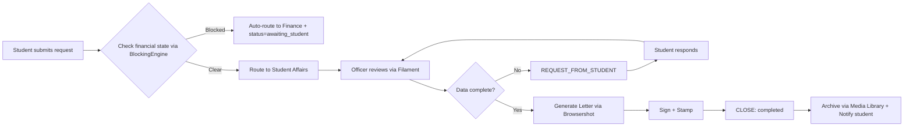

##### مثال 2: مسار الانسحاب (withdrawal)

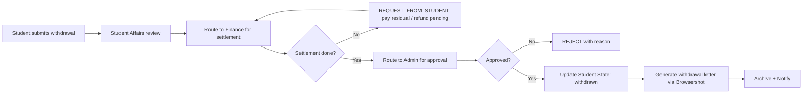

#### 9.3.5 Action Classes للانتقالات

```php
<?php
// app/Actions/Requests/RouteToFinanceAction.php
namespace App\Actions\Requests;

use App\Models\StudentRequest;
use App\States\RequestStatus\RoutedFinanceState;

class RouteToFinanceAction
{
    public function execute(StudentRequest $request, ?string $note = null): void
    {
        $request->status->transitionTo(RoutedFinanceState::class);

        $request->events()->create([
            'event_type' => 'ROUTE_TO_FINANCE',
            'from_status' => $request->getOriginal('status'),
            'to_status' => 'routed_finance',
            'actor_id' => auth()->id(),
            'payload' => ['note' => $note],
        ]);

        // إشعار الفريق المالي
        \App\Models\User::role('finance')
            ->where('branch_id', $request->branch_id)
            ->each->notify(new \App\Notifications\RequestRoutedToFinance($request));
    }
}
```

##### مخطط State Machine للطلب

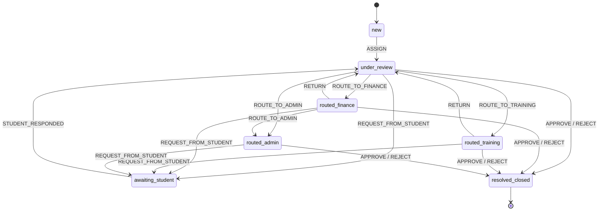

#### 9.3.6 Escalation التلقائي (Laravel Scheduler)

```php
<?php
// app/Console/Commands/EscalateOverdueRequests.php
class EscalateOverdueRequests extends Command
{
    protected $signature = 'requests:escalate-overdue';

    public function handle(): int
    {
        $overdue = StudentRequest::query()
            ->where('sla_deadline', '<', now())
            ->whereNotIn('status', ['resolved_closed', 'awaiting_student'])
            ->whereNull('escalated_at')
            ->get();

        foreach ($overdue as $request) {
            $escalateRole = config("requests.sla.{$request->type}.escalate_to");
            $hours = now()->diffInHours($request->sla_deadline);

            \App\Models\User::role($escalateRole)
                ->where('branch_id', $request->branch_id)
                ->each
                ->notify(new \App\Notifications\RequestOverdueEscalation($request, $hours));

            $request->update(['escalated_at' => now()]);

            activity('requests')
                ->performedOn($request)
                ->log('escalated');
        }

        return self::SUCCESS;
    }
}

// routes/console.php
Schedule::command('requests:escalate-overdue')->hourly();
```

#### 9.3.7 جدول الطلبات في قاعدة البيانات

```php
Schema::create('student_requests', function (Blueprint $table) {
    $table->uuid('id')->primary();
    $table->string('serial')->unique();  // REQ-2026-00001
    $table->string('type', 30);
    $table->string('status', 30)->default('new');
    $table->foreignUuid('student_id')->constrained();
    $table->foreignUuid('branch_id')->constrained();
    $table->foreignUuid('created_by')->nullable()->constrained('users');
    $table->foreignUuid('assigned_to')->nullable()->constrained('users');
    $table->jsonb('data')->default('{}');
    $table->jsonb('attachments')->default('[]');
    $table->timestampTz('sla_deadline')->nullable();
    $table->timestampTz('escalated_at')->nullable();
    $table->enum('priority', ['low', 'normal', 'high', 'critical'])->default('normal');
    $table->string('resolution', 30)->nullable();
    $table->text('resolution_note')->nullable();
    $table->timestamps();
    $table->timestampTz('closed_at')->nullable();

    $table->index('student_id');
    $table->index('status');
});

DB::statement("CREATE INDEX idx_req_sla ON student_requests(sla_deadline) WHERE status != 'resolved_closed'");

Schema::create('request_events', function (Blueprint $table) {
    $table->uuid('id')->primary();
    $table->foreignUuid('request_id')->constrained('student_requests')->cascadeOnDelete();
    $table->string('event_type', 50);
    $table->string('from_status', 30)->nullable();
    $table->string('to_status', 30)->nullable();
    $table->foreignUuid('actor_id')->nullable()->constrained('users');
    $table->jsonb('payload')->nullable();
    $table->timestampTz('occurred_at')->useCurrent();
});
```

---

### 9.4 موديول Letters Generator (توليد الخطابات الرسمية)

> الانتقال من الخطابات المكتوبة بـWord/Excel إلى توليد PDF آلي عربي RTL بختم وتوقيع رقمي.

#### 9.4.1 محرك القوالب (Blade + Browsershot)

##### المفهوم

كل خطاب = **قالب Blade** + **مجموعة متغيرات** + **شروط ظهور أقسام**. نستخدم Blade لتعبئة المتغيرات (يدعم `@if/@foreach` natively). ثم نُحوّل الـHTML إلى PDF عبر **Browsershot** (spatie/browsershot) الذي يستخدم Puppeteer داخلياً ويدعم RTL ممتاز.

```php
<?php
// app/Models/LetterTemplate.php
class LetterTemplate extends Model
{
    protected $casts = [
        'variables_schema' => 'array',
        'optional_sections' => 'array',
        'requires_signature' => 'boolean',
        'requires_stamp' => 'boolean',
        'requires_qr' => 'boolean',
        'is_active' => 'boolean',
    ];

    public const APPROVAL_LEVELS = ['student_affairs', 'branch_manager', 'admin'];
}

// app/Models/LetterIssuance.php
class LetterIssuance extends Model implements \Spatie\MediaLibrary\HasMedia
{
    use \Spatie\MediaLibrary\InteractsWithMedia;

    protected $casts = [
        'variables' => 'array',
        'optional_sections_used' => 'array',
        'issued_at' => 'datetime',
        'signed_at' => 'datetime',
    ];

    public function registerMediaCollections(): void
    {
        $this->addMediaCollection('letter_pdf')->singleFile();
    }
}
```

Migrations:

```php
Schema::create('letter_templates', function (Blueprint $table) {
    $table->uuid('id')->primary();
    $table->string('code', 50)->unique();   // INTRO_LETTER
    $table->string('name_ar');
    $table->unsignedSmallInteger('version')->default(1);
    $table->text('html_template');           // Blade markup or HTML
    $table->text('css_style')->nullable();
    $table->jsonb('variables_schema');
    $table->jsonb('optional_sections')->nullable();
    $table->text('default_letterhead')->nullable();
    $table->text('default_footer')->nullable();
    $table->boolean('requires_signature')->default(true);
    $table->boolean('requires_stamp')->default(true);
    $table->boolean('requires_qr')->default(true);
    $table->string('approval_level', 30);
    $table->unsignedSmallInteger('retention_years')->default(7);
    $table->boolean('is_active')->default(true);
    $table->timestamps();
});

Schema::create('letter_issuances', function (Blueprint $table) {
    $table->uuid('id')->primary();
    $table->foreignUuid('template_id')->constrained('letter_templates');
    $table->string('serial')->unique();
    $table->foreignUuid('student_id')->constrained();
    $table->jsonb('variables');
    $table->jsonb('optional_sections_used')->default('[]');
    $table->foreignUuid('issued_by')->constrained('users');
    $table->foreignUuid('approved_by')->nullable()->constrained('users');
    $table->timestampTz('signed_at')->nullable();
    $table->string('integrity_hash', 64);
    $table->text('qr_data')->nullable();
    $table->timestampTz('issued_at');
    $table->string('status', 30)->default('draft');
    $table->timestamps();
});
```

#### 9.4.2 قائمة الخطابات الأساسية

| # | الكود | الاسم | المتغيرات الأساسية | الأقسام الاختيارية | الجهة المعتمِدة |
|---|------|------|-------------------|---------------------|------------------|
| 1 | `INTRO_LETTER` | خطاب تعريف | اسم الطالب، رقم الهوية، الفرع، البرنامج، تاريخ البداية | الغرض، الجهة الموجَّه إليها | شؤون المتدربين |
| 2 | `STUDY_PROOF` | إفادة دراسة | البرنامج، السنة، الفصل، نسبة الإنجاز | حالة الانتظام، فترة الدراسة | شؤون المتدربين |
| 3 | `TRAINING_LETTER` | خطاب تدريب | الشركة، فترة التدريب، التخصص، اسم المشرف | متطلبات الشركة | شؤون المتدربين |
| 4 | `COMPLETION_CERT` | إفادة تخرج | الدبلوم، GPA، تاريخ التخرج | المرتبة | مدير الفرع |
| 5 | `FINANCIAL_VOUCHER` | سند مالي (تأكيد دفع) | المبلغ، التاريخ، طريقة الدفع، رقم الإيصال | البند | المالية |
| 6 | `PLEDGE_LETTER` | تعهد | نوع التعهد، التاريخ، الشروط | شهود | شؤون المتدربين |
| 7 | `WARNING_LETTER` | إنذار | نوع الإنذار، رقم الإنذار (1/2/3)، السبب، الجزاء | فترة معالجة | مدير الفرع |
| 8 | `CONDUCT_CERT` | شهادة حسن سلوك | فترة الدراسة، ملاحظات السلوك | إنجازات | مدير الفرع |
| 9 | `WITHDRAWAL_LETTER` | خطاب انسحاب | تاريخ الانسحاب، السبب، التسوية المالية | التزامات متبقية | مدير الفرع |
| 10 | `SUSPENSION_LETTER` | خطاب إيقاف مؤقت | فترة الإيقاف، السبب، شروط العودة | — | شؤون المتدربين |
| 11 | `TRANSCRIPT` | كشف درجات | جميع المواد، الدرجات، GPA | الترم | مدير الفرع |
| 12 | `RESUME_STUDIES` | خطاب استكمال دراسة | فترة الاستكمال، المتطلبات، الأقساط المتبقية | — | شؤون المتدربين |

#### 9.4.3 مثال على قالب Blade (خطاب التعريف)

```blade
{{-- resources/views/letters/intro-letter.blade.php --}}
<!DOCTYPE html>
<html lang="ar" dir="rtl">
<head>
    <meta charset="UTF-8" />
    <style>
        @page { size: A4; margin: 25mm 20mm; }
        body {
            font-family: 'IBM Plex Sans Arabic', 'Cairo', 'Tajawal', Arial, sans-serif;
            direction: rtl;
            color: #1E2C3F;
            line-height: 1.8;
        }
        .letterhead {
            display: flex; justify-content: space-between;
            align-items: center; border-bottom: 2px solid #4296CD;
            padding-bottom: 12px;
        }
        .logo { height: 60px; }
        .serial { font-size: 12px; color: #555; }
        .title { text-align: center; font-size: 20pt; font-weight: 700; margin: 24px 0; }
        .body p { text-align: justify; }
        .signature-block { margin-top: 60px; }
        .qr-block { position: absolute; bottom: 30mm; left: 20mm; }
        .stamp { position: absolute; bottom: 50mm; right: 50mm; opacity: 0.8; }
    </style>
</head>
<body>
    <div class="letterhead">
        
        <div class="serial">
            الرقم: {{ $serial }}<br />
            التاريخ: {{ $issue_date_hijri }} هـ — {{ $issue_date_gregorian }} م
        </div>
    </div>

    <h1 class="title">{{ $title ?? 'إلى من يهمه الأمر' }}</h1>

    <div class="body">
        <p>السلام عليكم ورحمة الله وبركاته،،،</p>

        <p>
            نُفيد بأن المتدرب/ <strong>{{ $student->full_name }}</strong>،
            حامل رقم الهوية/الإقامة <strong>{{ $student->id_number }}</strong>،
            مسجّل لدينا في معهد <strong>{{ $institute->name }}</strong>
            فرع <strong>{{ $student->branch->name }}</strong>،
            في برنامج <strong>{{ $student->program->name }}</strong>،
            اعتباراً من تاريخ <strong>{{ $student->enrolled_at->format('Y-m-d') }}</strong>،
            وحالته الدراسية حالياً: <strong>{{ $student->status_label }}</strong>.
        </p>

        @if(! empty($purpose))
            <p>وقد صدر هذا الخطاب بناءً على طلبه؛ ليُقدَّم إلى: <strong>{{ $purpose }}</strong>.</p>
        @endif

        <p>وتفضلوا بقبول فائق التحية والتقدير.</p>
    </div>

    <div class="signature-block">
        <p>المُصدِر: <strong>{{ $issuer->name }}</strong></p>
        <p>المنصب: {{ $issuer->title }}</p>
    </div>

    @if(! empty($qr_data_url))
        <div class="qr-block">
            
            <p style="font-size:9px;">للتحقق من الخطاب امسح الرمز</p>
        </div>
    @endif

    @if(! empty($stamp_url))
        
    @endif
</body>
</html>
```

#### 9.4.4 توليد PDF باستخدام Browsershot

```php
<?php
// app/Services/Letters/LetterRenderer.php
namespace App\Services\Letters;

use App\Models\LetterTemplate;
use Spatie\Browsershot\Browsershot;

class LetterRenderer
{
    public function render(LetterTemplate $template, array $variables, array $ctx): string
    {
        $viewName = "letters.{$template->code}";

        $html = view($viewName, array_merge($variables, $ctx))->render();

        return Browsershot::html($html)
            ->setOption('args', ['--no-sandbox', '--disable-setuid-sandbox', '--lang=ar-SA'])
            ->emulateMedia('print')
            ->format('A4')
            ->showBackground()
            ->margins(25, 20, 25, 20)  // top, right, bottom, left in mm
            ->pdf();
    }
}
```

> **ملاحظة:** Browsershot يتطلب Node.js + Chromium مثبتاً على الخادم. على VPS سعودي، نُثبّتهما عبر `apt install chromium-browser` + npm. يدعم RTL بشكل ممتاز.

#### 9.4.5 التوقيع الرقمي والـQR

##### Hash للسلامة (Integrity)

```php
function computeIntegrityHash(string $pdf, string $serial, \Carbon\CarbonInterface $issuedAt): string
{
    return hash('sha256', $pdf . $serial . $issuedAt->toIso8601String());
}
```

##### بناء QR

```php
<?php
use BaconQrCode\Renderer\GDLibRenderer;
use BaconQrCode\Writer;

function buildQr(string $verifyUrl): string
{
    $writer = new Writer(new GDLibRenderer(300));
    return $writer->writeString($verifyUrl);  // PNG binary
}

$qrDataUrl = 'data:image/png;base64,' . base64_encode(
    buildQr(route('letters.verify', ['serial' => $serial]))
);
```

##### صفحة التحقق `/verify-letter/{serial}`

```php
// routes/web.php
Route::get('/verify-letter/{serial}', VerifyLetterController::class)
    ->name('letters.verify')
    ->middleware('throttle:60,1');
```

- تعرض: نوع الخطاب، الرقم، التاريخ، اسم الطالب (مُختصر للحماية)، الجهة المُصدِرة، حالة الخطاب (ساري / ملغي).
- بدون تسجيل دخول.
- Rate limited عبر Laravel RateLimiter.

#### 9.4.6 الأرشفة التلقائية

عند إصدار أي خطاب:
1. يُحفظ الـPDF عبر spatie/laravel-medialibrary تحت `letters/{branch_id}/{year}/{month}/{serial}.pdf`.
2. يُسجَّل في جدول `letter_issuances`.
3. يُربط تلقائياً في **ملف الطالب الإلكتروني** عبر علاقة Eloquent.
4. يُرسل للطالب عبر Laravel Notification (Database + Mail + WhatsApp via Unifonic channel).

---

### 9.5 موديول شؤون المتدربين

#### 9.5.1 إدارة حالات الطلاب

شؤون المتدربين هي الجهة **المسؤولة عن تتبع** حالة الطالب من خلال دورة حياته. تعرض في Filament Panel:

- لوحة الحالة (Status Dashboard) حسب الفرع عبر Filament Widgets.
- قائمة طلاب مع فلاتر سريعة: "متأخر مالياً"، "ناقصو مرفقات"، "اقتراب حرمان غياب".
- بطاقة الطالب الموحّدة (Filament Page `/students/{id}`) تجمع كل المعلومات في صفحة واحدة قابلة للطباعة.

##### بطاقة الطالب الموحّدة — التبويبات

| التبويب | المحتوى |
|---------|---------|
| **عام** | البيانات الشخصية، ولي الأمر، الفرع، البرنامج، الحالة، تاريخ البداية |
| **المالي** | البيانات المالية المسحوبة من المحاسبي + الـblocks الفعّالة |
| **الأكاديمي** | الدبلوم، المواد، الدرجات، GPA، الحضور، الاختبارات |
| **الطلبات** | كل الطلبات (مفتوحة + مغلقة) + الـSLA |
| **الخطابات** | كل خطاب صدر له (مع رابط PDF) |
| **المرفقات** | الهوية، الشهادات السابقة، صور إضافية عبر Media Library |
| **السجل** | Activity Log لكل عمليات الحساب |
| **الملاحظات** | ملاحظات داخلية من الموظفين (غير ظاهرة للطالب) |

تُنفّذ عبر Filament Tabs داخل Resource Page.

#### 9.5.2 الشكاوى والاستفسارات

نوع منفصل من الـrequests (`complaint`, `inquiry`)، لكن بمعالجة خاصة:

```php
<?php
// app/Data/ComplaintData.php
use Spatie\LaravelData\Data;

class ComplaintData extends Data
{
    public function __construct(
        public string $category,       // academic|financial|service|staff_conduct|facility|other
        public string $severity,       // low|medium|high|critical
        public string $description,
        public ?string $involvesStaffId = null,
        public bool $anonymous = false,
        public array $evidence = [],
    ) {}
}
```

- **شكوى critical** أو ضد موظف → تظهر تلقائياً للإدارة العامة (Bypass الفرع) عبر Filament Notification.
- **شكوى مجهولة** → يُخفى الـstudent_id عن غير الإدارة، لكن يُحفظ مشفّراً (`encrypted` cast) للمراجعة.
- **رد إلزامي خلال 24 ساعة** لأي شكوى critical (SLA Cron).

#### 9.5.3 الانسحاب والإيقاف المؤقت

##### تدفق الانسحاب

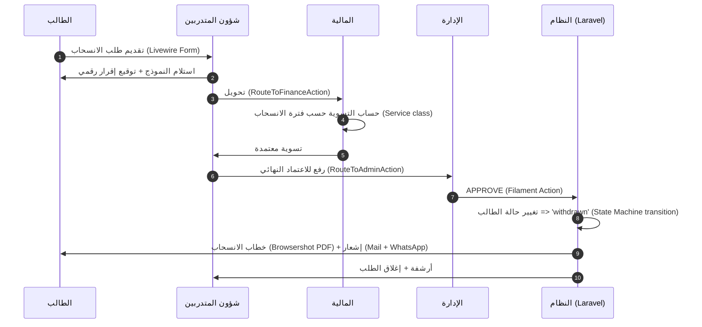

##### قواعد التسوية المالية للانسحاب

> **⚠️ [يحتاج تأكيد من العميل].** اقتراح أولي:

| فترة الانسحاب من بداية الفصل | نسبة الاسترداد |
|---------------------------------|------------------|
| خلال أول 7 أيام | 100% |
| من 8 إلى 14 يوم | 80% |
| من 15 إلى 30 يوم | 50% |
| من 31 إلى 60 يوم | 25% |
| بعد 60 يوماً | 0% (مع التزام بالباقي حسب البند) |

تُكوْدن في `config/withdrawal.php`:

```php
return [
    'refund_tiers' => [
        ['max_days' => 7, 'percentage' => 100],
        ['max_days' => 14, 'percentage' => 80],
        ['max_days' => 30, 'percentage' => 50],
        ['max_days' => 60, 'percentage' => 25],
        ['max_days' => null, 'percentage' => 0],
    ],
];
```

##### الإيقاف المؤقت

- فترة محدّدة (مثلاً فصل دراسي).
- الطالب لا تُحجب خدماته الأرشيفية، لكن يتعذّر عليه التسجيل في مواد جديدة.
- عند انتهاء الفترة → الطالب يُقدّم طلب `resume_studies` لإعادة التنشيط.

#### 9.5.4 تتبع المرفقات الناقصة

```php
Schema::create('required_attachments', function (Blueprint $table) {
    $table->uuid('id')->primary();
    $table->string('attachment_key', 50)->unique();  // national_id, photo, prev_cert
    $table->string('label_ar');
    $table->boolean('is_required')->default(true);
    $table->unsignedSmallInteger('max_size_mb')->default(5);
    $table->jsonb('accepted_mime');  // ['image/jpeg', 'application/pdf']
});

Schema::create('student_attachments', function (Blueprint $table) {
    $table->uuid('id')->primary();
    $table->foreignUuid('student_id')->constrained();
    $table->string('attachment_key', 50);
    $table->timestampTz('uploaded_at')->nullable();
    $table->timestampTz('verified_at')->nullable();
    $table->foreignUuid('verified_by')->nullable()->constrained('users');
    $table->string('status', 20)->default('pending');  // pending|verified|rejected|missing
});
```

الملفات الفعلية تُخزَّن عبر spatie/laravel-medialibrary مع `collection = 'attachments'`.

##### تنبيهات تلقائية للناقص (Laravel Scheduler)

```php
<?php
// app/Console/Commands/NotifyMissingAttachments.php
class NotifyMissingAttachments extends Command
{
    protected $signature = 'attachments:notify-missing';

    public function handle(): int
    {
        $students = DB::select("
            SELECT s.id, s.full_name, array_agg(ra.label_ar) AS missing
            FROM students s
            CROSS JOIN required_attachments ra
            LEFT JOIN student_attachments sa
              ON sa.student_id = s.id AND sa.attachment_key = ra.attachment_key
            WHERE ra.is_required = true
              AND (sa.id IS NULL OR sa.status = 'missing')
              AND s.status NOT IN ('withdrawn', 'graduated')
            GROUP BY s.id, s.full_name
        ");

        foreach ($students as $s) {
            $student = Student::find($s->id);
            $student->notify(new MissingAttachmentsNotification($s->missing));
        }

        return self::SUCCESS;
    }
}

Schedule::command('attachments:notify-missing')->dailyAt('09:00');
```

---

### 9.6 موديول التسجيل والقبول (Mini CRM)

> الانتقال من قوائم Excel وWhatsApp إلى تتبع منظَّم بـ7 مراحل + مصادر التسجيل + أداء موظفي التسجيل.

#### 9.6.1 المراحل السبع

عبر `spatie/laravel-model-states`:

```php
<?php
// app/States/EnrollmentStage/EnrollmentStage.php
abstract class EnrollmentStage extends State
{
    public static function config(): StateConfig
    {
        return parent::config()
            ->default(InterestedState::class)
            ->allowTransition(InterestedState::class, ContactedState::class)
            ->allowTransition(ContactedState::class, AwaitingDocumentsState::class)
            ->allowTransition(ContactedState::class, RejectedState::class)
            ->allowTransition(ContactedState::class, CancelledState::class)
            ->allowTransition(AwaitingDocumentsState::class, AwaitingFirstPaymentState::class)
            ->allowTransition(AwaitingDocumentsState::class, CancelledState::class)
            ->allowTransition(AwaitingFirstPaymentState::class, EnrolledState::class)
            ->allowTransition(AwaitingFirstPaymentState::class, CancelledState::class);
    }
}
```

##### الـlead قبل التحول إلى طالب (Migration)

```php
Schema::create('enrollment_leads', function (Blueprint $table) {
    $table->uuid('id')->primary();
    $table->string('serial')->unique();
    $table->string('full_name');
    $table->string('phone', 20);
    $table->string('email')->nullable();
    $table->string('id_number', 20)->nullable();
    $table->foreignUuid('preferred_branch_id')->nullable()->constrained('branches');
    $table->foreignUuid('interested_program_id')->nullable()->constrained('programs');
    $table->string('source', 30);
    $table->jsonb('source_details')->nullable();
    $table->string('stage', 30)->default('interested');
    $table->foreignUuid('assigned_to')->nullable()->constrained('users');
    $table->text('rejected_reason')->nullable();
    $table->text('notes')->nullable();
    $table->foreignUuid('converted_student_id')->nullable()->constrained('students');
    $table->timestampTz('last_contact_at')->nullable();
    $table->timestamps();
});

Schema::create('enrollment_stage_history', function (Blueprint $table) {
    $table->uuid('id')->primary();
    $table->foreignUuid('lead_id')->constrained('enrollment_leads')->cascadeOnDelete();
    $table->string('from_stage', 30)->nullable();
    $table->string('to_stage', 30);
    $table->foreignUuid('by')->nullable()->constrained('users');
    $table->text('note')->nullable();
    $table->timestampTz('at')->useCurrent();
});
```

#### 9.6.2 نموذج التسجيل (Form Request Validation)

```php
<?php
// app/Http/Requests/Enrollment/SubmitLeadRequest.php
namespace App\Http\Requests\Enrollment;

use Illuminate\Foundation\Http\FormRequest;

class SubmitLeadRequest extends FormRequest
{
    public function rules(): array
    {
        return [
            'full_name' => ['required', 'string', 'min:5', 'max:100'],
            'id_number' => ['required', 'regex:/^[12][0-9]{9}$/'],
            'phone' => ['required', 'regex:/^(05|\+9665|9665)[0-9]{8}$/'],
            'email' => ['nullable', 'email'],
            'birth_date' => ['required', 'date', 'before:' . now()->subYears(16)->toDateString()],
            'gender' => ['required', 'in:male,female'],
            'city' => ['required', 'string', 'min:2'],
            'preferred_branch_id' => ['required', 'uuid', 'exists:branches,id'],
            'interested_program_id' => ['required', 'uuid', 'exists:programs,id'],
            'guardian.name' => ['nullable', 'string', 'min:3'],
            'guardian.relation' => ['nullable', 'in:father,mother,brother,sister,spouse,other'],
            'guardian.phone' => ['nullable', 'regex:/^(05|\+9665|9665)[0-9]{8}$/'],
            'source' => ['required', 'in:website,instagram,tiktok,walk_in,referral,google_ads,whatsapp,other'],
            'source_details' => ['nullable', 'string'],
            'consent_pdpl' => ['required', 'accepted'],
        ];
    }

    public function messages(): array
    {
        return [
            'id_number.regex' => 'رقم هوية/إقامة غير صالح',
            'phone.regex' => 'رقم جوال سعودي غير صالح',
            'birth_date.before' => 'العمر يجب ألا يقل عن 16 سنة',
            'consent_pdpl.accepted' => 'يجب الموافقة على سياسة البيانات',
        ];
    }
}
```

#### 9.6.3 الانتقال بين المراحل

##### Manual Transitions (افتراضي)

- موظف التسجيل ينقل الـlead يدوياً عبر Filament Action "المرحلة التالية".
- كل انتقال يطلب ملاحظة (اختياري).
- يُسجَّل في `enrollment_stage_history` + Activity Log.

##### Automated Triggers (Events + Listeners)

| الحدث | الانتقال التلقائي |
|------|---------------------|
| رفع كل المستندات المطلوبة | `awaiting_documents` ← `awaiting_first_payment` |
| تسجيل أول دفعة في المحاسبي (Webhook) | `awaiting_first_payment` ← `enrolled` (مع إنشاء `students` row) |
| 14 يوم بلا تواصل من الـlead | تنبيه للموظف عبر Notification |
| 30 يوم بلا تواصل (Scheduler) | يُقترح التحويل إلى `cancelled` |

#### 9.6.4 إنشاء الطالب من الـlead (Action class)

```php
<?php
// app/Actions/Enrollment/ConvertLeadToStudentAction.php
namespace App\Actions\Enrollment;

use App\Models\{EnrollmentLead, Student};
use App\Services\Accounting\Contracts\AccountingServiceInterface;
use App\Exceptions\InvalidStageException;
use Illuminate\Support\Facades\DB;

class ConvertLeadToStudentAction
{
    public function __construct(
        private readonly AccountingServiceInterface $accounting,
    ) {}

    public function execute(EnrollmentLead $lead, User $actor): Student
    {
        if ($lead->stage !== 'awaiting_first_payment') {
            throw new InvalidStageException('يجب أن تكون الدفعة الأولى مكتملة');
        }

        // 1. تحقق من وصول الدفعة عبر المحاسبي
        $balance = $this->accounting->getStudentBalance($lead->id_number);
        if ($balance->totalPaid <= 0) {
            throw new \DomainException('لا توجد دفعة مسجلة في المحاسبي بعد');
        }

        return DB::transaction(function () use ($lead, $actor) {
            // 2. أنشئ student
            $student = Student::create([
                'student_no' => $this->generateStudentNo($lead->preferred_branch_id),
                'full_name' => $lead->full_name,
                'id_number' => $lead->id_number,
                'phone' => $lead->phone,
                'email' => $lead->email,
                'branch_id' => $lead->preferred_branch_id,
                'program_id' => $lead->interested_program_id,
                'status' => 'active',
                'enrolled_at' => now(),
                'lead_id' => $lead->id,
                'external_id' => $lead->id_number,
            ]);

            // 3. حدّث الـlead
            $lead->update([
                'stage' => 'enrolled',
                'converted_student_id' => $student->id,
            ]);

            // 4. أنشئ tasks تلقائية للأقسام
            $this->createOnboardingTasks($student);

            activity('enrollment')
                ->performedOn($student)
                ->causedBy($actor)
                ->withProperties(['lead_id' => $lead->id])
                ->log('lead_converted');

            return $student;
        });
    }

    private function generateStudentNo(string $branchId): string
    {
        $branch = \App\Models\Branch::find($branchId);
        $year = now()->format('y');
        $sequence = Student::where('branch_id', $branchId)
            ->whereYear('enrolled_at', now()->year)
            ->count() + 1;
        return sprintf('%s-%s-%05d', $branch->code, $year, $sequence);
    }

    private function createOnboardingTasks(Student $student): void
    {
        // إنشاء tasks في جدول `student_onboarding_tasks` أو dispatch events
    }
}
```

#### 9.6.5 تقارير التسجيل (Filament Widgets)

| التقرير | الأبعاد | الاستخدام |
|---------|---------|-----------|
| Funnel Conversion | المرحلة × الفترة × الفرع | فقدان الـleads في أي مرحلة |
| مصادر التسجيل | source × عدد leads × عدد converted × معدل التحويل % | تحديد القنوات الفعّالة |
| أداء موظفي التسجيل | الموظف × leads مسؤول عنها × معدل التحويل × متوسط وقت المرحلة | تقييم الموظفين |
| Cohort الناقصة بياناتهم | الـleads في `awaiting_documents` > 7 أيام | متابعة عملية |

---

### 9.7 موديول الأكاديمي اليومي

#### 9.7.1 إدارة الجداول

##### نموذج البيانات

```php
Schema::create('academic_terms', function (Blueprint $table) {
    $table->uuid('id')->primary();
    $table->string('name_ar');
    $table->date('start_date');
    $table->date('end_date');
    $table->boolean('is_active')->default(true);
    $table->timestamps();
});

Schema::create('rooms', function (Blueprint $table) {
    $table->uuid('id')->primary();
    $table->foreignUuid('branch_id')->constrained();
    $table->string('name');
    $table->unsignedSmallInteger('capacity')->nullable();
    $table->enum('type', ['classroom', 'lab', 'online', 'hybrid']);
    $table->timestamps();
});

Schema::create('schedule_slots', function (Blueprint $table) {
    $table->uuid('id')->primary();
    $table->foreignUuid('term_id')->constrained('academic_terms');
    $table->foreignUuid('subject_id')->constrained('diploma_subjects');
    $table->foreignUuid('section_id')->constrained();
    $table->foreignUuid('teacher_id')->constrained('users');
    $table->foreignUuid('room_id')->nullable()->constrained();
    $table->unsignedTinyInteger('day_of_week');  // 0=أحد
    $table->time('start_time');
    $table->time('end_time');
    $table->string('online_link')->nullable();
    $table->string('status', 20)->default('active');
    $table->timestamps();

    $table->unique(['section_id', 'day_of_week', 'start_time']);
    $table->index(['teacher_id', 'day_of_week'], 'idx_slots_teacher');
    $table->index(['room_id', 'day_of_week'], 'idx_slots_room');
});
```

##### كشف التضاربات (Service Class)

```php
<?php
// app/Services/Schedule/ConflictDetector.php
class ConflictDetector
{
    public function detect(ScheduleSlot $slot): array
    {
        $conflicts = [];

        // 1. المعلم لا يكون في مكانين
        $teacherClash = ScheduleSlot::query()
            ->where('teacher_id', $slot->teacher_id)
            ->where('day_of_week', $slot->day_of_week)
            ->where('id', '!=', $slot->id)
            ->whereRaw('(start_time, end_time) OVERLAPS (?, ?)', [$slot->start_time, $slot->end_time])
            ->get();

        if ($teacherClash->isNotEmpty()) {
            $conflicts[] = ['type' => 'teacher_overlap', 'details' => $teacherClash];
        }

        // 2. القاعة
        $roomClash = ScheduleSlot::query()
            ->where('room_id', $slot->room_id)
            ->where('day_of_week', $slot->day_of_week)
            ->where('id', '!=', $slot->id)
            ->whereRaw('(start_time, end_time) OVERLAPS (?, ?)', [$slot->start_time, $slot->end_time])
            ->get();

        if ($roomClash->isNotEmpty()) {
            $conflicts[] = ['type' => 'room_overlap', 'details' => $roomClash];
        }

        // 3. الشعبة لا تأخذ مادتين في نفس الوقت
        // ... مشابه

        return $conflicts;
    }
}
```

#### 9.7.2 الحضور المتقدم

##### النموذج

```php
Schema::create('attendance_records', function (Blueprint $table) {
    $table->uuid('id')->primary();
    $table->foreignUuid('slot_id')->constrained('schedule_slots');
    $table->date('session_date');
    $table->foreignUuid('student_id')->constrained();
    $table->enum('status', ['present', 'absent', 'late', 'excused']);
    $table->foreignUuid('marked_by')->constrained('users');
    $table->timestampTz('marked_at')->useCurrent();
    $table->enum('source', ['manual', 'pwa', 'bulk_import', 'biometric'])->default('manual');
    $table->string('excuse_doc_url')->nullable();
    $table->timestamps();

    $table->unique(['slot_id', 'session_date', 'student_id']);
    $table->index(['student_id', 'session_date'], 'idx_att_student_date');
});
```

##### تكامل مع نظام البصمة (Biometric)

عبر مكتبة `rats/zkteco` للتواصل مع أجهزة ZKTeco المثبتة في الفروع:

```php
<?php
// app/Services/Attendance/BiometricSync.php
namespace App\Services\Attendance;

use Rats\Zkteco\Lib\ZKTeco;

class BiometricSync
{
    public function syncFromDevice(string $ip, string $port = '4370'): int
    {
        $zk = new ZKTeco($ip, $port);
        if (! $zk->connect()) {
            throw new \RuntimeException("لا يمكن الاتصال بجهاز البصمة على {$ip}");
        }

        $attendance = $zk->getAttendance();
        $count = 0;

        foreach ($attendance as $log) {
            $this->processLog($log);
            $count++;
        }

        $zk->disconnect();
        return $count;
    }

    private function processLog(array $log): void
    {
        // mapping من user_id في الجهاز إلى students.biometric_id
        // ثم إنشاء AttendanceRecord مع source='biometric'
    }
}
```

##### حساب نسبة الحضور

```php
<?php
// app/Services/Attendance/AttendanceCalculator.php
class AttendanceCalculator
{
    public function getRate(string $studentId, string $subjectId): float
    {
        $result = DB::selectOne(
            "
            SELECT
              COUNT(*) FILTER (WHERE ar.status IN ('present', 'late', 'excused')) AS attended,
              COUNT(*) AS total
            FROM attendance_records ar
            JOIN schedule_slots ss ON ar.slot_id = ss.id
            WHERE ar.student_id = ? AND ss.subject_id = ?
            ",
            [$studentId, $subjectId],
        );

        return $result->total === 0 ? 100.0 : ($result->attended / $result->total) * 100;
    }
}
```

#### 9.7.3 الإنذارات والحرمان

##### القواعد الافتراضية

> **⚠️ [يحتاج تأكيد من العميل].** اقتراح:

| الإجراء | نسبة الغياب |
|---------|--------------|
| إنذار أول (Warning 1) | عند 10% غياب |
| إنذار ثانٍ (Warning 2) | عند 15% |
| إنذار نهائي (Final) | عند 20% |
| حرمان (Deprived) | عند 25% |

##### Laravel Scheduler Command

```php
<?php
// app/Console/Commands/EvaluateAbsenceWarnings.php
class EvaluateAbsenceWarnings extends Command
{
    protected $signature = 'attendance:evaluate-warnings';

    public function handle(AttendanceCalculator $calc): int
    {
        $enrollments = Enrollment::where('status', 'active')->get();

        foreach ($enrollments as $enrollment) {
            $absenceRate = 100 - $calc->getRate($enrollment->student_id, $enrollment->subject_id);
            $currentLevel = $this->getCurrentWarningLevel($enrollment);
            $newLevel = $this->computeWarningLevel($absenceRate);

            if ($newLevel > $currentLevel) {
                $this->issueWarning($enrollment, $newLevel);
                if ($newLevel === 4) {
                    $enrollment->student->update(['status' => 'deprived_attendance']);
                    BlockingEngine::evaluateForStudent($enrollment->student);
                }
            }
        }

        return self::SUCCESS;
    }
}

Schedule::command('attendance:evaluate-warnings')->dailyAt('22:00');
```

#### 9.7.4 الواجبات

```php
Schema::create('assignments', function (Blueprint $table) {
    $table->uuid('id')->primary();
    $table->foreignUuid('subject_id')->constrained('diploma_subjects');
    $table->foreignUuid('section_id')->constrained();
    $table->foreignUuid('teacher_id')->constrained('users');
    $table->string('title_ar');
    $table->text('description')->nullable();
    $table->jsonb('attachments')->default('[]');
    $table->decimal('max_points', 5, 2)->default(100);
    $table->timestampTz('due_at');
    $table->boolean('allow_late')->default(false);
    $table->decimal('late_penalty_per_day', 5, 2)->default(5);
    $table->jsonb('rubric')->nullable();
    $table->timestamps();
});

Schema::create('assignment_submissions', function (Blueprint $table) {
    $table->uuid('id')->primary();
    $table->foreignUuid('assignment_id')->constrained()->cascadeOnDelete();
    $table->foreignUuid('student_id')->constrained();
    $table->jsonb('files')->default('[]');
    $table->text('text_response')->nullable();
    $table->timestampTz('submitted_at')->useCurrent();
    $table->boolean('is_late')->default(false);  // يُحسب في Observer
    $table->decimal('grade', 5, 2)->nullable();
    $table->jsonb('rubric_scores')->nullable();
    $table->text('feedback')->nullable();
    $table->foreignUuid('graded_by')->nullable()->constrained('users');
    $table->timestampTz('graded_at')->nullable();
    $table->string('approval_status', 30)->default('graded_pending_approval');

    $table->unique(['assignment_id', 'student_id']);
});
```

#### 9.7.5 الاختبار الشامل النهائي

##### Eligibility Service

```php
<?php
// app/Services/ComprehensiveExam/EligibilityChecker.php
namespace App\Services\ComprehensiveExam;

use App\Models\{Student, Diploma};
use App\Services\Blocking\BlockingEngine;

class EligibilityChecker
{
    public function __construct(
        private readonly BlockingEngine $blocking,
    ) {}

    public function check(Student $student, Diploma $diploma): EligibilityResult
    {
        $reasons = [];

        // 1. حالة مالية
        $blocks = $this->blocking->activeBlocksFor($student);
        if ($blocks->contains(fn ($b) => in_array('comprehensive_exam', $b->affects, true))) {
            $reasons[] = ['code' => 'financial_block', 'detail' => 'يوجد حجب نشط على الاختبار الشامل'];
        }

        // 2. حرمان غياب
        if ($student->status === 'deprived_attendance') {
            $reasons[] = ['code' => 'attendance_deprived', 'detail' => 'الطالب محروم بسبب نسبة الغياب'];
        }

        // 3. اكتمال المواد
        $remaining = $this->getRemainingSubjects($student, $diploma);
        if ($remaining->isNotEmpty()) {
            $reasons[] = [
                'code' => 'missing_subjects',
                'detail' => "بقي {$remaining->count()} مادة لإكمال الدبلوم",
            ];
        }

        // 4. GPA الأدنى [يحتاج تأكيد من العميل]

        return new EligibilityResult(
            isEligible: empty($reasons),
            reasons: $reasons,
        );
    }
}
```

##### رفع النتائج من Excel (maatwebsite/excel)

```php
<?php
// app/Imports/ComprehensiveExamResultsImport.php
namespace App\Imports;

use App\Models\ComprehensiveExamResult;
use Maatwebsite\Excel\Concerns\{ToCollection, WithHeadingRow, WithValidation};
use Illuminate\Support\Collection;

class ComprehensiveExamResultsImport implements ToCollection, WithHeadingRow, WithValidation
{
    public function __construct(
        public readonly string $examId,
        public readonly string $uploadedBy,
    ) {}

    public function collection(Collection $rows): void
    {
        foreach ($rows as $row) {
            ComprehensiveExamResult::updateOrCreate(
                [
                    'exam_id' => $this->examId,
                    'student_no' => $row['student_no'],
                ],
                [
                    'score' => $row['score'],
                    'status' => $row['status'],
                    'uploaded_by' => $this->uploadedBy,
                    'uploaded_at' => now(),
                ],
            );

            if ($row['status'] === 'passed') {
                MaybeGraduateJob::dispatch($row['student_no']);
            }
        }
    }

    public function rules(): array
    {
        return [
            'student_no' => ['required', 'string'],
            'full_name' => ['required', 'string'],
            'id_number' => ['required', 'string'],
            'score' => ['required', 'numeric', 'between:0,100'],
            'status' => ['required', 'in:passed,failed'],
        ];
    }
}

// الاستخدام في Controller / Filament Action
Excel::import(new ComprehensiveExamResultsImport($examId, auth()->id()), $file);
```

##### تصدير الكشوفات الرسمية

كشف PDF بنفس محرك Letters Generator (Browsershot) لكن بقالب `COMPREHENSIVE_EXAM_REPORT`.

---

### 9.8 موديول التقارير والـDashboards

#### 9.8.1 KPI Dashboards لكل دور (Filament Widgets)

##### Dashboard الإدارة العامة (Super Admin)

| البطاقة | المؤشر | المصدر |
|---------|--------|--------|
| إجمالي الطلاب النشطين | `count` | `students` where `status='active'` |
| نسبة التحصيل الشهري | `%` | المحاسبي API + Cache |
| الطلبات المفتوحة | `count` | `student_requests` not in `resolved_closed` |
| الطلبات المتجاوزة SLA | `count` | `sla_deadline < now()` |
| معدل النجاح في الاختبارات | `%` | `exam_attempts` |
| الطلاب المحرومون | `count` | `students` where `status in deprived_*` |
| Funnel التسجيل | `chart` | `enrollment_leads` (ApexCharts) |
| Heatmap الحضور أسبوعياً | `chart` | `attendance_records` |

Filament Widget:

```php
<?php
// app/Filament/Widgets/ActiveStudentsStatWidget.php
namespace App\Filament\Widgets;

use App\Models\Student;
use Filament\Widgets\StatsOverviewWidget as BaseWidget;
use Filament\Widgets\StatsOverviewWidget\Stat;
use Illuminate\Support\Facades\Cache;

class ActiveStudentsStatWidget extends BaseWidget
{
    protected function getStats(): array
    {
        return [
            Stat::make(
                label: 'الطلاب النشطون',
                value: Cache::remember('stats.active_students', 300,
                    fn () => Student::where('status', 'active')->count(),
                ),
            )->description('نشطون حالياً')
              ->color('success'),
        ];
    }
}
```

##### Dashboard مدير الفرع

نفس الـmetrics لكن مفلترة على `branch_id = $current_branch` (Global Scope تلقائياً).

##### Dashboard المالية / شؤون المتدربين

كل دور له Filament Panel منفصل أو نفس Panel مع Widgets مختلفة حسب الصلاحيات.

#### 9.8.2 التقارير الجاهزة (20+ تقرير)

| # | اسم التقرير | الأبعاد | التصدير |
|---|------------|---------|---------|
| 1 | تقرير التحصيل اليومي | الفرع × الفترة | Excel + PDF |
| 2 | تقرير المتأخرات | الفرع × عدد أيام التأخر | Excel |
| 3 | كشف المسددين | الفرع × طريقة الدفع | Excel |
| 4 | كشف غير المسددين | الفرع × المبلغ | Excel |
| 5 | تقرير الانسحابات | الفترة × السبب | Excel + PDF |
| 6 | تقرير الحضور الفصلي | الشعبة × المادة | Excel |
| 7 | الطلاب المحرومون بالغياب | الفرع × النسبة | Excel |
| 8 | تقرير اعتماد الدرجات المعلّق | المعلم × المادة | Excel |
| 9 | كشف درجات الطالب | الطالب (واحد) | PDF (Browsershot) |
| 10 | كشف الاختبار الشامل | الفترة | Excel + PDF |
| 11 | المتخرجون | الفترة × الدبلوم | Excel + PDF |
| 12 | مصادر التسجيل | الفترة | Excel |
| 13 | أداء موظفي التسجيل | الموظف × الفترة | Excel |
| 14 | الطلبات حسب النوع | النوع × الحالة | Excel |
| 15 | الطلبات المتجاوزة SLA | القسم × الفترة | Excel |
| 16 | الشكاوى المفتوحة | الفئة × الـseverity | Excel |
| 17 | تقرير المعلمين (الأسئلة المضافة) | المعلم × الفترة | Excel |
| 18 | Item Analysis لاختبار محدد | السؤال × النجاح % × التمييز | Excel |
| 19 | تقرير الفروع المقارن | الفرع × المؤشرات | Excel + PDF |
| 20 | الخطابات الصادرة | النوع × الفترة | Excel |
| 21 | حركة الحجب/فك الحجب | اليوم × الفرع | Excel |
| 22 | Activity Log Export | المستخدم × الفترة × النوع | Excel |

#### 9.8.3 Filters الموحّدة

كل تقرير يدعم على الأقل (عبر Filament Filters):
- الفرع (مع متعدد).
- الفترة (تاريخ من ← إلى، أو preset: اليوم/الأسبوع/الشهر/الفصل).
- البرنامج/الدبلوم.
- الحالة.

تُحفظ آخر فلاتر المستخدم في `user_preferences` (Cache) لراحة الاستخدام.

#### 9.8.4 التصدير (maatwebsite/excel + Browsershot)

```php
<?php
// app/Exports/CollectionReportExport.php
namespace App\Exports;

use Maatwebsite\Excel\Concerns\{FromCollection, WithHeadings, WithStyles, WithMapping};
use Maatwebsite\Excel\Concerns\Exportable;
use PhpOffice\PhpSpreadsheet\Worksheet\Worksheet;
use PhpOffice\PhpSpreadsheet\Style\{Fill, Font};

class CollectionReportExport implements FromCollection, WithHeadings, WithStyles, WithMapping
{
    use Exportable;

    public function __construct(private readonly array $filters) {}

    public function collection(): \Illuminate\Support\Collection
    {
        return CollectionData::query()
            ->when($this->filters['branch_id'] ?? null, fn ($q, $v) => $q->where('branch_id', $v))
            ->whereBetween('date', [$this->filters['from'], $this->filters['to']])
            ->get();
    }

    public function headings(): array
    {
        return ['التاريخ', 'الفرع', 'إجمالي التحصيل', 'عدد الدفعات', 'الطلاب'];
    }

    public function map($row): array
    {
        return [$row->date, $row->branch_name, $row->total, $row->count, $row->students];
    }

    public function styles(Worksheet $sheet): array
    {
        $sheet->setRightToLeft(true);
        return [
            1 => [
                'font' => ['bold' => true, 'color' => ['argb' => 'FFFFFFFF']],
                'fill' => [
                    'fillType' => Fill::FILL_SOLID,
                    'startColor' => ['argb' => 'FF4296CD'],
                ],
            ],
        ];
    }
}

// الاستخدام
return Excel::download(new CollectionReportExport($filters), 'collection-report.xlsx');
```

---

## 10. قواعد العمل والسياسات (Business Rules & Policies)

> هذا القسم يُجمّع **كل القرارات الإدارية المُكوْدنة**. كثير منها يحتاج توحيداً مع العميل قبل التنفيذ — مُعلَّمة بـ `[يحتاج تأكيد]`.

### 10.1 مصفوفة الحجب الكاملة (Service Blocking Matrix)

> **⚠️ [يحتاج تأكيد من العميل بالكامل].** الاقتراح أدناه نموذج عمل.

#### الأبعاد:
- **الأعمدة:** 10 خدمات.
- **الصفوف:** 8 حالات/سيناريوهات.
- **الرموز:** متاح / تحذير / محجوب / لا ينطبق.

| السيناريو ↓ / الخدمة → | إصدار خطاب | شهادة | كشف درجات | رؤية الدرجات | اختبار عادي | اختبار شامل | تسجيل ترم | جدول | حضور | أرشيف |
|-------------------------|------------|-------|------------|----------------|--------------|---------------|------------|------|------|--------|
| **منتظم — لا متأخرات** | متاح | متاح | متاح | متاح | متاح | متاح | متاح | متاح | متاح | متاح |
| **متأخر مالياً 1-15 يوم** | متاح | متاح | متاح | متاح | متاح | متاح | تحذير | متاح | متاح | متاح |
| **متأخر 16-30 يوم** | تحذير | تحذير | تحذير | متاح | متاح | تحذير | محجوب | متاح | متاح | متاح |
| **متأخر 31-60 يوم (موقوف مالياً)** | محجوب | محجوب | محجوب | محجوب | متاح | محجوب | محجوب | متاح | متاح | متاح |
| **محروم بسبب الرسوم** | محجوب | محجوب | محجوب | محجوب | محجوب | محجوب | محجوب | متاح | متاح | للقراءة |
| **محروم بسبب الغياب** | متاح | محجوب | متاح | متاح | متاح | محجوب | محجوب | متاح | متاح | متاح |
| **منسحب** | محجوب | لا ينطبق | للقراءة | للقراءة | لا ينطبق | لا ينطبق | لا ينطبق | لا ينطبق | لا ينطبق | للقراءة |
| **موقوف إدارياً** | محجوب | محجوب | محجوب | محجوب | محجوب | محجوب | محجوب | محجوب | محجوب | للقراءة |

#### ملاحظات على القراءة
- "تحذير" يعني الخدمة متاحة لكن مع رسالة بارزة للطالب أن الحالة المالية على وشك أن تحجبها.
- "للقراءة" تعني الطالب يستطيع رؤية ما كان موجوداً مسبقاً، لكن لا يستطيع طلب جديد.
- خطاب المالية (سند مالي) يبقى متاحاً دائماً حتى للمحجوب لأنه يخدم عملية الدفع.

#### أسئلة جوهرية للعميل
1. هل أيام التأخر (15/30/60) مناسبة؟
2. هل "موقوف مالياً" حالة منفصلة أم نتيجة آلية لتأخر معين؟
3. حالة "محروم بسبب الغياب" — هل تمنع الاختبار النهائي العادي أم الشامل فقط؟
4. هل لمدير الفرع صلاحية تحفيز محدودة (مثلاً فك الحجب لإصدار خطاب لا أكثر) أم الإدارة العامة فقط؟

### 10.2 SLA لكل نوع طلب (جدول كامل قابل للتعديل)

> **⚠️ [يحتاج تأكيد من العميل].** الأرقام أدناه افتراضية.

| # | الكود | المدة (ساعات عمل) | جهة Escalation |
|---|-------|---------------------|-------------------|
| 1 | `intro_letter` | 24 | مدير شؤون المتدربين |
| 2 | `study_proof` | 24 | مدير شؤون المتدربين |
| 3 | `training_letter` | 48 | مدير شؤون المتدربين |
| 4 | `completion_cert` | 72 | مدير الفرع |
| 5 | `financial_voucher` | 48 | مدير المالية |
| 6 | `discount_request` | 120 | الإدارة العامة |
| 7 | `withdrawal` | 168 | الإدارة العامة |
| 8 | `temp_suspension` | 72 | مدير الفرع |
| 9 | `resume_studies` | 72 | شؤون المتدربين |
| 10 | `data_amendment` | 24 | شؤون المتدربين |
| 11 | `grade_review` | 120 | المشرف الأكاديمي |
| 12 | `exam_retake` | 96 | مدير التدريب |
| 13 | `complaint` (عادية) | 96 | الإدارة العامة |
| 13b | `complaint` (Critical) | 24 | الإدارة العامة فوراً |
| 14 | `inquiry` | 48 | شؤون المتدربين |

#### معايير حساب SLA
- يبدأ العد من **استلام الطلب** (status = `under_review`)، لا من تقديمه.
- يتوقف خلال:
  - حالة `awaiting_student`.
  - أيام العطل الرسمية.
- يُستأنف عند `STUDENT_RESPONDED`.

### 10.3 شروط الحرمان بالغياب

> **⚠️ [يحتاج تأكيد من العميل].**

| المستوى | نسبة الغياب | الإجراء | نموذج الإشعار |
|---------|--------------|---------|-----------------|
| إنذار أول | 10% | إشعار للطالب + ولي الأمر (إن وُجد) | "ABSENCE_W1" |
| إنذار ثانٍ | 15% | إشعار + استدعاء ولي الأمر | "ABSENCE_W2" |
| إنذار نهائي | 20% | خطاب رسمي + ملاحظة في الملف | "ABSENCE_FINAL" |
| **حرمان** | 25% | تغيير الحالة + حجب الاختبار النهائي والشامل | "DEPRIVED" |

#### قواعد إضافية
- **الغياب المعتذر عنه**: يدخل في نسبة الحضور (مفترض) — أو لا، حسب سياسة العميل.
- **استئناف العذر**: يقدم الطالب مستنداً (تقرير طبي) خلال 7 أيام، شؤون المتدربين تراجعه وتُحوّل الغياب إلى `excused` يدوياً.
- **استئناف الحرمان**: الطالب يستطيع طلب مراجعة (نوع طلب جديد `appeal_deprivation`) — إن قُبل، يُرفع الحرمان مع تحذير نهائي.

### 10.4 مستويات اعتماد الدرجات

#### السلسلة الكاملة

```
المعلم/المدرب => إدخال الدرجة (status: 'graded_pending_approval')
              =>
المشرف الأكاديمي => مراجعة => اعتماد (status: 'approved') / رفض (status: 'rejected')
              =>
(اختياري في الاختبارات النهائية) الإدارة => اعتماد نهائي
              =>
يصبح مرئياً للطالب (إن لم يكن هناك حجب)
```

#### الأدوار والمسؤوليات

| الدور | يدخل | يعتمد | يلغي |
|------|------|--------|------|
| المعلم | درجاته فقط | لا | لا |
| المشرف الأكاديمي | أي مادة | المستوى الأول | نعم (مع سبب) |
| مدير الفرع | لا | المستوى الثاني (للنهائي) | نعم |
| الإدارة العامة | لا | في الاختبار الشامل | نعم |

#### آلية الاعتراض (Grade Review)
- يستطيع الطالب طلب مراجعة درجة خلال **14 يوماً** من ظهورها له.
- الطلب من نوع `grade_review`.
- يُحوّل إلى المشرف الأكاديمي، الذي يُكلّف معلماً آخر بإعادة التصحيح (anonymous).
- النتيجة الأعلى تُعتمد (افتراض — يحتاج تأكيد).

### 10.5 شروط الاختبار الشامل

| الشرط | القاعدة |
|------|---------|
| **إكمال المواد** | اجتياز جميع مواد الدبلوم بنجاح |
| **الحضور** | عدم الحرمان بالغياب |
| **المالية** | عدم وجود حجب نشط على `comprehensive_exam` |
| **GPA الأدنى** | [يحتاج تأكيد من العميل] |
| **المرفقات** | اكتمال مرفقات الملف الرئيسية (هوية، صورة) |

#### إعادة الاختبار الشامل
- الطالب الراسب: محاولتان إضافيتان [يحتاج تأكيد].
- الفترة بين المحاولات: 3 أشهر [يحتاج تأكيد].
- رسوم الإعادة: [يحتاج تأكيد] — يتولاها المحاسبي.

#### التأجيل
- الطالب يستطيع تأجيل الاختبار قبل موعده بـ7 أيام مع سبب مقبول.
- الحالة تنتقل لـ `deferred` مؤقتاً، وعند الفصل التالي تعود `active`.

### 10.6 سياسة الانسحاب

#### الفترات والاسترداد

> **⚠️ [يحتاج تأكيد من العميل].**

| الفترة من بداية الفصل | استرداد الرسوم | يعتبر فاشلاً في المواد؟ |
|------------------------|------------------|--------------------------|
| 0-7 أيام | 100% | لا |
| 8-14 يوماً | 80% | لا |
| 15-30 يوماً | 50% | يُسجَّل "منسحب" بلا فشل |
| 31-60 يوماً | 25% | لا |
| > 60 يوماً | 0% | يلتزم بباقي الرسوم |

#### التوثيق المطلوب
- نموذج طلب الانسحاب (Livewire Form إلكتروني).
- سبب الانسحاب (اختياري لكن مفيد للتحليل).
- توقيع الطالب رقمياً على الإقرار.
- تسوية مالية من المحاسبي.
- اعتماد إداري نهائي.
- خطاب انسحاب يُصدر بشكل تلقائي (Browsershot).

### 10.7 سياسة إعادة الاختبار

> **⚠️ [يحتاج تأكيد من العميل].**

| البند | القيمة المقترحة |
|------|------------------|
| عدد محاولات الإعادة للاختبار العادي | 2 |
| الفترة بين المحاولات | 7 أيام كحد أدنى |
| رسوم الإعادة | [يحتاج تأكيد] |
| الدرجة المعتمدة | الأعلى — أو آخر محاولة |
| الاختبار الشامل: محاولات | 2 إضافيتان |

### 10.8 سياسة الخصومات والإعفاءات

> **⚠️ [يحتاج تأكيد من العميل بالكامل].**

#### الفئات المقترحة

| الفئة | نسبة الخصم | المعتمِد |
|------|--------------|-----------|
| أبناء الموظفين | 50% | الإدارة العامة |
| الأخوة (تسجيل أكثر من أخ) | 15% للثاني، 25% للثالث | مدير الفرع |
| تسجيل مبكر (Early Bird) | 10% | تلقائي |
| دفع كامل مقدماً | 5% | تلقائي |
| إعفاء كامل (حالات إنسانية) | 100% | الإدارة العامة فقط + لجنة |

#### مسار طلب الخصم
1. الطالب يفتح طلب `discount_request` بمستندات داعمة (Filament Form + Media Library).
2. المالية تراجع وتُحقّق من معايير الفئة.
3. الإدارة المختصة تعتمد/ترفض (Filament Action).
4. إن اعتُمد: المالية تُسجّله في المحاسبي (يدوياً أو عبر API لاحقاً).

---

## 11. مخططات الحالات (State Machines)

كل آلة حالة تُنفّذ عبر `spatie/laravel-model-states` (راجع الأمثلة في القسم 9).

### 11.1 State Machine للطالب

#### المخطط

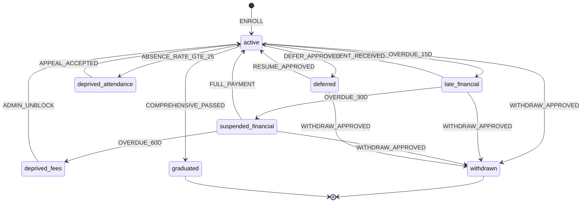

#### Triggers

| Event | الوصف | المُطلِق |
|------|------|---------|
| `ENROLL` | تحويل lead إلى طالب نشط | `ConvertLeadToStudentAction` |
| `PAYMENT_OVERDUE_15D` | اكتشاف تأخر 15 يوم | Laravel Scheduler |
| `OVERDUE_30D` / `OVERDUE_60D` | تصعيد التأخر | Laravel Scheduler |
| `PAYMENT_RECEIVED` | Webhook من المحاسبي | Accounting Webhook Controller |
| `FULL_PAYMENT` | تسديد كامل المتأخرات | Accounting Event Listener |
| `ADMIN_UNBLOCK` | فك حجب يدوي للحالة | `ManualUnblockService` |
| `ABSENCE_RATE_GTE_25` | نسبة غياب ≥ 25% | `EvaluateAbsenceWarnings` Command |
| `APPEAL_ACCEPTED` | قبول طلب رفع الحرمان | شؤون المتدربين (Filament Action) |
| `DEFER_APPROVED` | اعتماد طلب تأجيل | الإدارة |
| `RESUME_APPROVED` | اعتماد طلب استكمال | شؤون المتدربين |
| `WITHDRAW_APPROVED` | اعتماد انسحاب | الإدارة |
| `COMPREHENSIVE_PASSED` | نجاح في الاختبار الشامل | `MaybeGraduateJob` |

#### Guards (Methods على State classes)

| Guard | الشرط |
|------|------|
| `canEnroll` | الـlead في `awaiting_first_payment` + الدفعة الأولى موجودة في المحاسبي |
| `canResume` | الطالب في `deferred` + المالية تسمح |
| `canWithdraw` | الطالب ليس `graduated` ولا `withdrawn` |
| `canMarkGraduated` | اجتاز كل المواد + الاختبار الشامل + لا توجد حجوبات |

#### Actions (Event Listeners)

| Action | ما يحدث |
|--------|---------|
| `RunBlockingRulesListener` | تشغيل `BlockingEngine::evaluateForStudent` |
| `NotifyStudentListener` | إشعار داخلي + WhatsApp/SMS عبر Laravel Notification |
| `IssueLetterListener` | توليد خطاب الانسحاب/التخرج الآلي (Browsershot) |
| `ArchiveProfileListener` | نقل ملف الطالب لقسم "المؤرشف" |
| `RecalcGpaListener` | إعادة حساب المعدل التراكمي |

### 11.2 State Machine للطلب (سبق في 9.3)

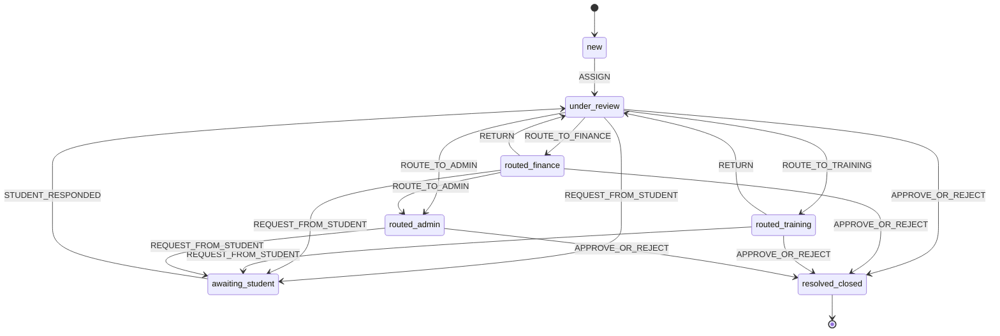

#### Triggers / Guards / Actions

| Event | Guard | Action |
|------|------|--------|
| `ASSIGN` | لدى assignee الصلاحية على هذا النوع (Policy) | يبدأ احتساب SLA (`SlaCalculator`) |
| `ROUTE_TO_FINANCE` | الطلب من نوع يحتاج المالية | `RouteToFinanceAction` |
| `ROUTE_TO_TRAINING` | يحتاج التدريب | `RouteToTrainingAction` |
| `ROUTE_TO_ADMIN` | يحتاج اعتماد إداري | `RouteToAdminAction` |
| `REQUEST_FROM_STUDENT` | لا يوجد طلب نشط للطالب نفسه | Notification + توقف SLA |
| `STUDENT_RESPONDED` | الطالب رفع المطلوب | استئناف SLA |
| `APPROVE` | تمت كل المتطلبات | تنفيذ النتيجة (خطاب/تحديث حالة/...) |
| `REJECT` | أُعطي سبب | Notification رفض + أرشفة |

### 11.3 State Machine للتسجيل (Mini CRM)

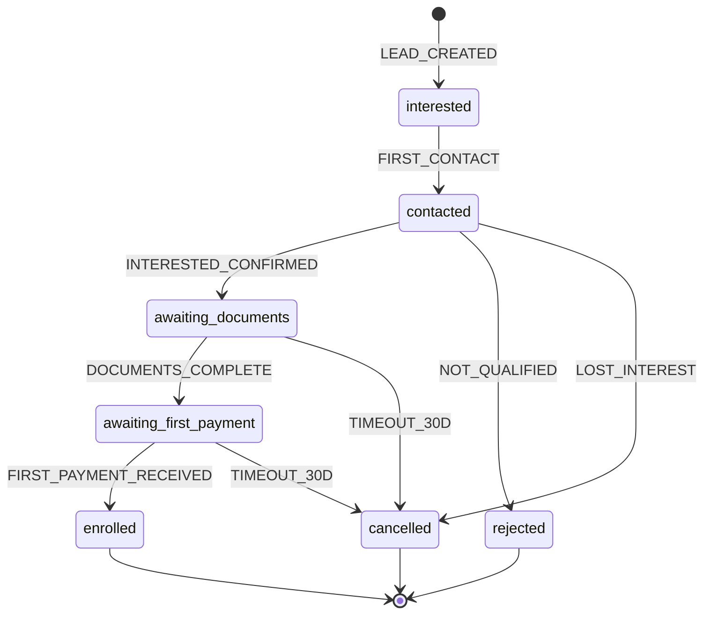

#### Triggers

| Event | المُطلِك |
|------|---------|
| `LEAD_CREATED` | نموذج التسجيل عبر الموقع / إدخال يدوي من موظف |
| `FIRST_CONTACT` | تسجيل أول مكالمة/رسالة من الموظف |
| `INTERESTED_CONFIRMED` | الموظف يحدّد "مهتم جاد" |
| `NOT_QUALIFIED` | لا تنطبق الشروط (عمر، تخصص...) |
| `LOST_INTEREST` | الـlead لم يعد مهتماً |
| `DOCUMENTS_COMPLETE` | كل المستندات المطلوبة مرفوعة + موافق عليها (Observer) |
| `FIRST_PAYMENT_RECEIVED` | Webhook من المحاسبي |
| `TIMEOUT_30D` | 30 يوم بلا حركة (Scheduler) |

#### Guards

| Guard | الشرط |
|------|------|
| `canCreateLead` | لا يوجد lead نشط بنفس رقم الهوية + رقم الجوال |
| `canConfirmInterest` | تواصل مسجل >= 1 |
| `canCompleteDocs` | كل المرفقات الإلزامية uploaded + verified |
| `canEnroll` | الدفعة الأولى وصلت + بيانات شاملة |

#### Actions

| Action | ما يحدث |
|--------|---------|
| `AssignToOfficerListener` | تعيين موظف تسجيل تلقائياً بـRound Robin |
| `SendWelcomePackListener` | إرسال معلومات البرنامج (Laravel Mail) |
| `CreateStudentListener` | استدعاء `ConvertLeadToStudentAction` |
| `NotifyDepartmentsListener` | تنبيه شؤون المتدربين والمالية والتدريب |

### 11.4 State Machine لمحاولة اختبار (Exam Attempt)

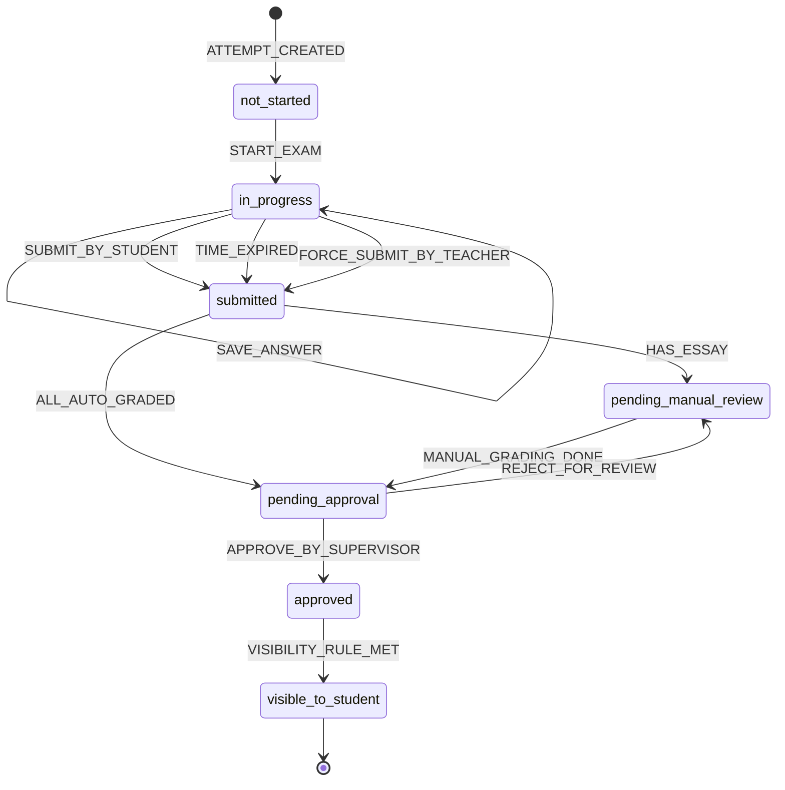

#### Triggers / Guards / Actions

| Event | Guard | Action |
|------|------|--------|
| `START_EXAM` | الكود صحيح (إن مطلوب) + النافذة الزمنية نشطة + الطالب لم يستنفد المحاولات | بدء عداد الوقت (Livewire) |
| `SAVE_ANSWER` | المحاولة `in_progress` | حفظ في `attempt_responses` |
| `SUBMIT_BY_STUDENT` | المحاولة `in_progress` | dispatch `AutoGradeAttemptJob` |
| `TIME_EXPIRED` | عداد الوقت = 0 | تسليم إجباري |
| `FORCE_SUBMIT_BY_TEACHER` | المعلم/الأدمن مع سبب | تسليم + Activity Log |
| `HAS_ESSAY` | يوجد سؤال essay | فتح واجهة Livewire التصحيح |
| `MANUAL_GRADING_DONE` | كل essay تم تصحيحه | حساب المجموع |
| `APPROVE_BY_SUPERVISOR` | المشرف وقّع | تطبيق visibility rule |
| `VISIBILITY_RULE_MET` | حسب `visibility_rule` (فوري / مجدول / يدوي) | عرض النتيجة للطالب |

### 11.5 State Machine للدرجة (Grade)

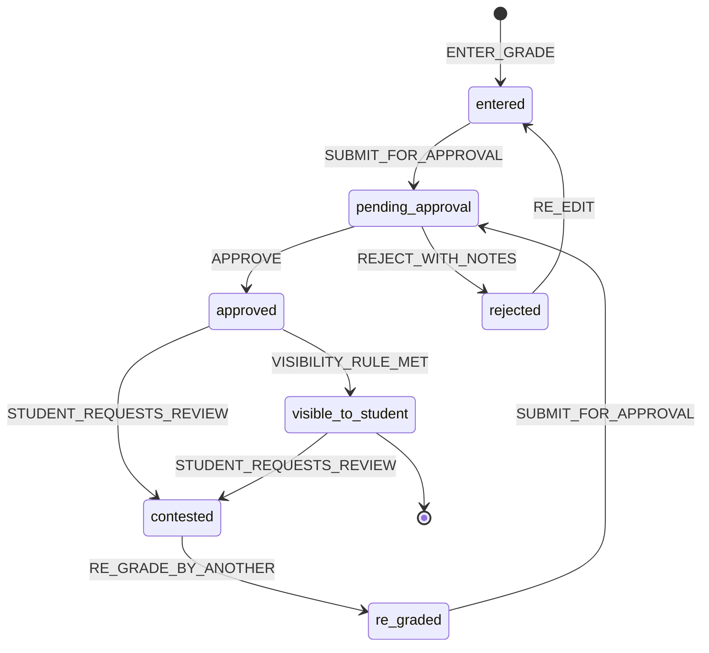

#### Triggers / Guards / Actions

| Event | Guard | Action |
|------|------|--------|
| `ENTER_GRADE` | المعلم يدخل درجة طالب | حفظ + state `entered` |
| `SUBMIT_FOR_APPROVAL` | المعلم انتهى من كل طلابه | إشعار المشرف (Notification) |
| `APPROVE` | المشرف وافق | تطبيق visibility |
| `REJECT_WITH_NOTES` | ملاحظات إلزامية | إعادة للمعلم |
| `RE_EDIT` | المعلم يعدّل | حفظ نسخة جديدة (Activity Log) |
| `STUDENT_REQUESTS_REVIEW` | خلال 14 يوماً من الظهور | فتح طلب `grade_review` |
| `RE_GRADE_BY_ANOTHER` | معلم مختلف، Anonymized | درجة جديدة |

---

## 12. التدفقات والـ Workflows (User & Business Flows)

### 12.1 تدفق اعتماد الدرجات (Grade Approval Flow)

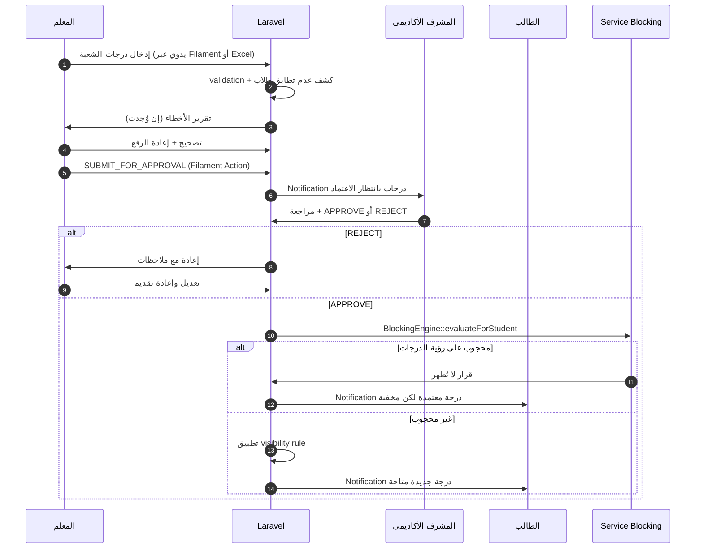

### 12.2 تدفق الحجب وفك الحجب

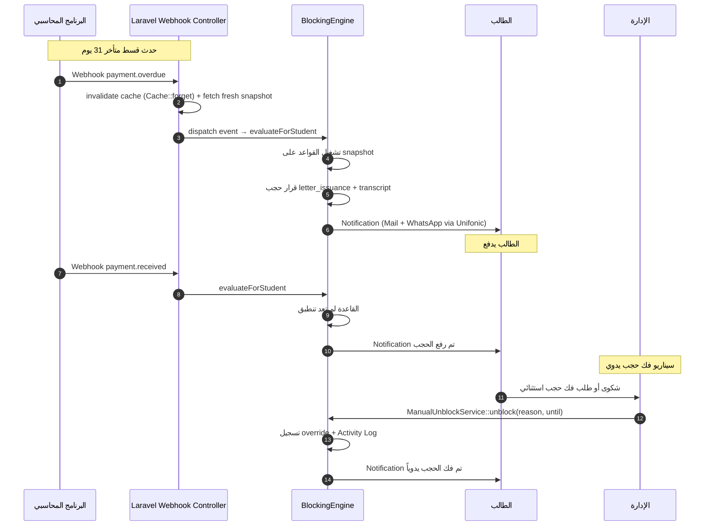

### 12.3 تدفق طلب خطاب (مع الحجب)

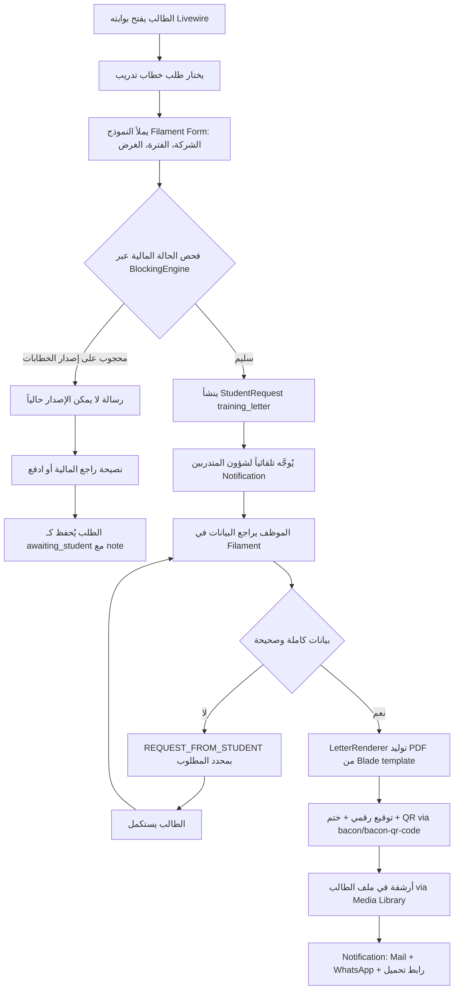

### 12.4 تدفق الانسحاب الكامل

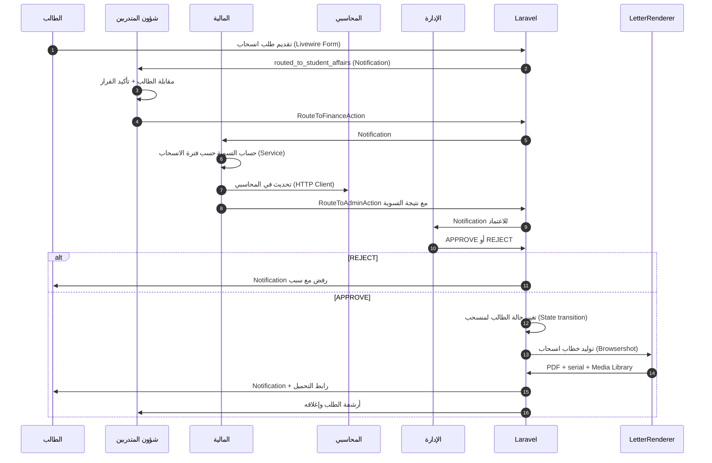

### 12.5 تدفق الاختبار الشامل

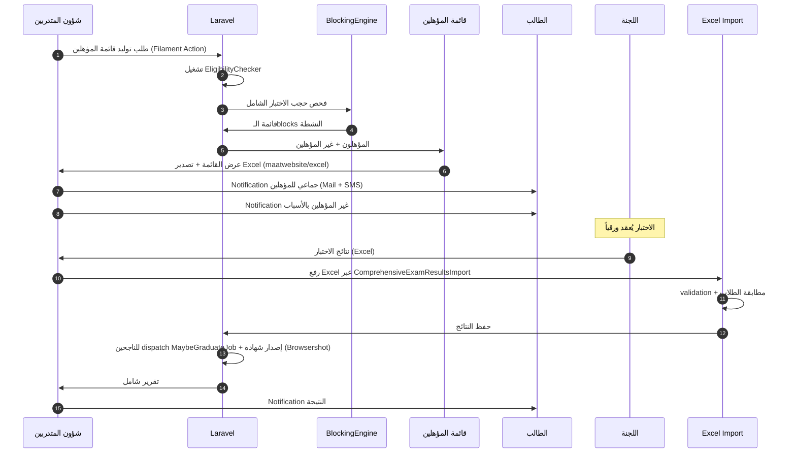

### 12.6 تدفق التسجيل من البداية

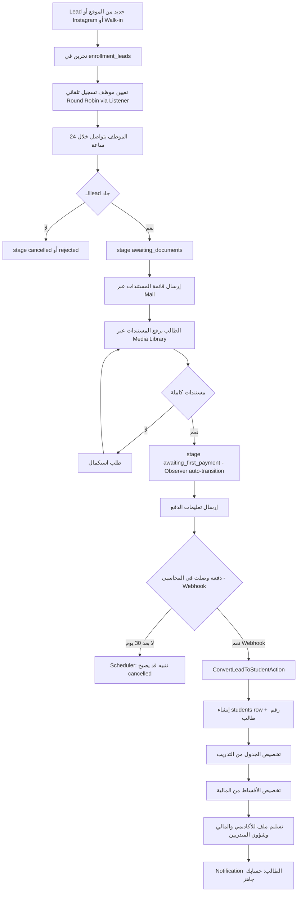

### 12.7 تدفق إجراء الاختبار الإلكتروني (Student Experience)

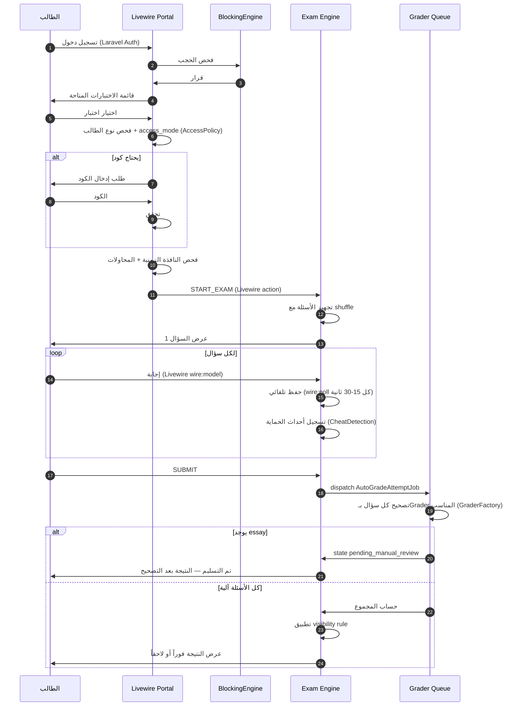

### 12.8 تدفق إنشاء سؤال بـClaude AI

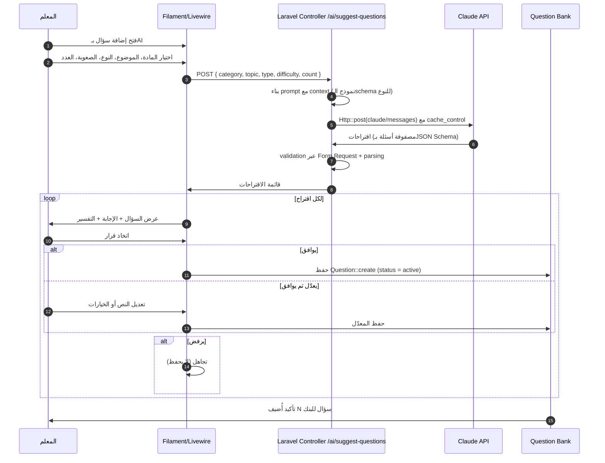

---

## خاتمة الجزء الثاني

غطّى هذا الجزء **الأقسام 9 إلى 12** من وثيقة التسليم:

- **القسم 9 (الموديولات):** 8 موديولات بأمثلة كود PHP/Laravel و Migrations و Eloquent Models وآليات تصحيح وقواعد فنية.
- **القسم 10 (قواعد العمل):** 8 مجموعات سياسات، مع تمييز ما يحتاج تأكيداً من العميل بشكل واضح.
- **القسم 11 (State Machines):** 5 آلات حالة مع triggers/guards/actions جاهزة للتنفيذ عبر `spatie/laravel-model-states`.
- **القسم 12 (Workflows):** 8 تدفقات بمخططات Mermaid (sequenceDiagram + flowchart).

### نقاط حرجة تستوجب جلسة Discovery قبل البدء

1. **مصفوفة الحجب الكاملة** (10.1) — أهم قرار تجاري.
2. **SLAs لكل طلب** (10.2) — يؤثر على إعدادات الـescalation.
3. **شروط الحرمان بالغياب** (10.3) — نسب الإنذار.
4. **سياسة الانسحاب وفترات الاسترداد** (10.6).
5. **سياسة الخصومات** (10.8).
6. **API البرنامج المحاسبي** — توثيقه، حدوده، حقول الـwebhook.
7. **GPA الأدنى للتأهل للاختبار الشامل** (10.5).
8. **هل لمدير الفرع صلاحية فك حجب محدودة** (9.2.2)؟

### الموديولات المرتبطة في الأجزاء التالية

- نموذج بيانات PostgreSQL الكامل + Policies + Filament Shield — الجزء 1 و 3.
- معمارية الـAPI Resources وSanctum Endpoints التفصيلية — الجزء 4.
- خطة الاختبارات (Pest: Unit + Feature + Dusk) — الجزء 4.

---

**نهاية الجزء الثاني.**
