# الجزء الثاني: الموديولات الوظيفية والمنطق التجاري

> **المشروع:** نظام إدارة معهد "رواد العطاء"
> **الجزء:** 02 من 22 — الأقسام 9 إلى 12
> **التاريخ:** 2026-05-12
> **الجمهور:** المبرمج المسؤول عن التنفيذ
> **الحالة:** مسودة فنية للمراجعة

---

## مقدمة هذا الجزء

هذا الجزء هو **القلب الوظيفي للوثيقة كلها**. يأخذ المتطلبات الـ87 الواردة من العميل ويُحوّلها إلى **مواصفات هندسية قابلة للتنفيذ المباشر** بلا غموض. ينقسم إلى أربعة أقسام:

1. **القسم 9 — الموديولات الوظيفية بالتفصيل:** تشريح كل موديول من الموديولات الـ8 الرئيسية بمستوى حقل/حقل، مع أمثلة كود TypeScript و JSON Schema و SQL وآليات التصحيح والقواعد الفنية.
2. **القسم 10 — قواعد العمل والسياسات:** كل القرارات الإدارية المُكوْدنة (مصفوفة الحجب، SLAs، شروط الحرمان، اعتماد الدرجات…)، مع تمييز ما يحتاج تأكيداً من العميل.
3. **القسم 11 — مخططات الحالات (State Machines):** خمس آلات حالة بمخططات Mermaid + جداول Triggers/Guards/Actions جاهزة للنقل إلى XState مباشرة.
4. **القسم 12 — التدفقات والـWorkflows:** ثمانية تدفقات أساسية بمخططات تسلسلية (sequenceDiagram + flowchart) تُغطي السيناريوهات الحرجة.

> **ملاحظة منهجية:** كل بند تجاري لم يُحسم نهائياً من العميل يُعلَّم بـ `[يحتاج تأكيد من العميل]` — لا تستنبط افتراضات من عندك في الإنتاج.

---

## 9. الموديولات الوظيفية بالتفصيل (Functional Modules Deep Dive)

### 9.1 منصة الاختبارات (Examinations Platform)

منصة الاختبارات هي العمود الفقري الأكاديمي وقد بُنيت أساساً قبل ضم بقية الموديولات، لذا فهي **الأنضج** ومرجع التصميم الذي يجب أن تتبعه بقية الموديولات. تنقسم وظائفها إلى تسعة مكونات متصلة.

#### 9.1.1 بنك الأسئلة المركزي (Question Bank)

##### الفكرة التجارية

بنك الأسئلة هو **أصل معرفي مملوك للمعهد**، يبقى عابراً للمعلمين والدورات والسنوات. يجب أن:
- يكون قابلاً للإعادة في عدة اختبارات.
- يخضع لتصنيف هرمي (مادة → موضوع → موضوع فرعي).
- يدعم البحث المتقدم بالوسوم والصعوبة والمستوى.
- يحافظ على تاريخ الاستخدام والإحصائيات.

##### نموذج البيانات الجوهري

```sql
-- جدول التصنيفات الهرمي
CREATE TABLE question_categories (
  id          UUID PRIMARY KEY DEFAULT gen_random_uuid(),
  parent_id   UUID REFERENCES question_categories(id) ON DELETE CASCADE,
  branch_id   UUID REFERENCES branches(id), -- NULL = شامل للمعهد
  name_ar     TEXT NOT NULL,
  name_en     TEXT,
  level       SMALLINT NOT NULL CHECK (level BETWEEN 1 AND 4),
  -- 1=قسم، 2=مادة، 3=موضوع، 4=موضوع فرعي
  slug        TEXT NOT NULL,
  created_at  TIMESTAMPTZ DEFAULT NOW()
);

-- جدول الأسئلة المركزي
CREATE TABLE questions (
  id                UUID PRIMARY KEY DEFAULT gen_random_uuid(),
  type              TEXT NOT NULL CHECK (type IN (
    'mcq_single', 'mcq_multi', 'true_false', 'fill_blank',
    'ordering', 'matching', 'drag_drop', 'hotspot',
    'short_answer', 'essay', 'math_latex', 'code_editor',
    'media_question', 'case_study'
  )),
  category_id       UUID REFERENCES question_categories(id),
  difficulty        TEXT CHECK (difficulty IN ('easy', 'medium', 'hard')),
  weight            NUMERIC(5,2) DEFAULT 1.0,
  question_data     JSONB NOT NULL,    -- يتنوع حسب النوع (انظر أدناه)
  answer_data       JSONB NOT NULL,    -- نموذج الإجابة الصحيحة
  tags              TEXT[] DEFAULT '{}',
  learning_outcome  TEXT,
  created_by        UUID REFERENCES users(id),
  status            TEXT DEFAULT 'active'
    CHECK (status IN ('draft', 'pending_review', 'active', 'archived', 'rejected')),
  usage_count       INTEGER DEFAULT 0,
  avg_correct_rate  NUMERIC(5,2), -- يُحدَّث بعد كل اختبار
  discrimination_index NUMERIC(5,2), -- معامل التمييز
  created_at        TIMESTAMPTZ DEFAULT NOW(),
  updated_at        TIMESTAMPTZ DEFAULT NOW()
);

CREATE INDEX idx_questions_category ON questions(category_id);
CREATE INDEX idx_questions_type ON questions(type);
CREATE INDEX idx_questions_tags ON questions USING GIN(tags);
CREATE INDEX idx_questions_difficulty ON questions(difficulty);
```

##### قنوات الإدخال الثلاث

| القناة | الاستخدام | الـValidation |
|--------|------------|----------------|
| **يدوي عبر النموذج** | إضافة سؤال أو سؤالين | فحص لحظي (Client + Server) |
| **استيراد Excel** | إضافة 50+ سؤالاً دفعة واحدة | فحص شامل + تقرير أخطاء |
| **اقتراح Claude AI** | الإلهام / التنوع | بشري إلزامي قبل الحفظ |

#### 9.1.2 الأنواع الأربعة عشر للأسئلة

هنا نُفصّل كل نوع بـ: التعريف، JSON Schema للحقول، نوع TypeScript، وآلية التصحيح.

##### النوع 1 — اختيار من متعدد (إجابة واحدة) `mcq_single`

**JSON Schema للحقول:**
```json
{
  "type": "object",
  "required": ["stem", "options"],
  "properties": {
    "stem": { "type": "string", "minLength": 5 },
    "options": {
      "type": "array",
      "minItems": 2, "maxItems": 6,
      "items": {
        "type": "object",
        "required": ["id", "text"],
        "properties": {
          "id": { "type": "string" },
          "text": { "type": "string" },
          "image_url": { "type": "string", "format": "uri" }
        }
      }
    }
  }
}
```

**TypeScript Type:**
```typescript
export type MCQSingleQuestion = {
  type: 'mcq_single';
  question_data: {
    stem: string;
    options: Array<{ id: string; text: string; image_url?: string }>;
  };
  answer_data: {
    correct_option_id: string;
    explanation?: string;
  };
};

export type MCQSingleResponse = {
  selected_option_id: string;
};
```

**آلية التصحيح:**
```typescript
function gradeMCQSingle(
  q: MCQSingleQuestion,
  response: MCQSingleResponse
): number {
  return response.selected_option_id === q.answer_data.correct_option_id
    ? q.weight
    : 0;
}
```

##### النوع 2 — اختيار من متعدد (إجابات متعددة) `mcq_multi`

**TypeScript Type:**
```typescript
export type MCQMultiQuestion = {
  type: 'mcq_multi';
  question_data: {
    stem: string;
    options: Array<{ id: string; text: string }>;
  };
  answer_data: {
    correct_option_ids: string[];
    scoring_method: 'all_or_nothing' | 'partial' | 'penalty';
  };
};
```

**آلية التصحيح (ثلاث طرق):**
```typescript
function gradeMCQMulti(q: MCQMultiQuestion, resp: { selected_ids: string[] }): number {
  const correct = new Set(q.answer_data.correct_option_ids);
  const selected = new Set(resp.selected_ids);
  const totalCorrect = correct.size;
  const correctSelected = [...selected].filter(id => correct.has(id)).length;
  const wrongSelected   = [...selected].filter(id => !correct.has(id)).length;

  switch (q.answer_data.scoring_method) {
    case 'all_or_nothing':
      return (correctSelected === totalCorrect && wrongSelected === 0)
        ? q.weight : 0;
    case 'partial':
      return Math.max(0, (correctSelected / totalCorrect) * q.weight);
    case 'penalty':
      const ratio = (correctSelected - wrongSelected) / totalCorrect;
      return Math.max(0, ratio * q.weight);
  }
}
```

##### النوع 3 — صح / خطأ `true_false`

```typescript
export type TrueFalseQuestion = {
  type: 'true_false';
  question_data: { statement: string };
  answer_data: { is_true: boolean; explanation?: string };
};
// التصحيح: مقارنة بوليانية مباشرة. كاملة عند المطابقة، صفر بخلاف ذلك.
```

##### النوع 4 — ملء الفراغ (مع مرادفات) `fill_blank`

```typescript
export type FillBlankQuestion = {
  type: 'fill_blank';
  question_data: {
    template: string; // مثال: "عاصمة السعودية هي {{blank_1}} وعدد سكانها {{blank_2}}"
    blanks: Array<{
      id: string;
      accepted_answers: string[]; // ["الرياض","رياض"]
      case_sensitive: boolean;
      normalize_arabic: boolean;  // إزالة التشكيل والتطبيع
    }>;
  };
  answer_data: { /* داخل blanks */ };
};

function gradeFillBlank(q: FillBlankQuestion, resp: Record<string, string>): number {
  const perBlank = q.weight / q.question_data.blanks.length;
  let score = 0;
  for (const blank of q.question_data.blanks) {
    const userAnswer = resp[blank.id] ?? '';
    if (matchesAnyAccepted(userAnswer, blank)) score += perBlank;
  }
  return score;
}

function matchesAnyAccepted(answer: string, blank: FillBlankQuestion['question_data']['blanks'][0]): boolean {
  let normalized = blank.case_sensitive ? answer : answer.toLowerCase();
  if (blank.normalize_arabic) normalized = normalizeArabic(normalized);
  return blank.accepted_answers.some(acc => {
    const accN = blank.normalize_arabic ? normalizeArabic(acc) : acc;
    return blank.case_sensitive ? accN === normalized : accN.toLowerCase() === normalized;
  });
}
```

##### النوع 5 — ترتيب العناصر `ordering`

```typescript
export type OrderingQuestion = {
  type: 'ordering';
  question_data: {
    stem: string;
    items: Array<{ id: string; text: string }>;
  };
  answer_data: {
    correct_order: string[]; // مصفوفة IDs بالترتيب الصحيح
    scoring_method: 'all_or_nothing' | 'positional';
  };
};

function gradeOrdering(q: OrderingQuestion, resp: { order: string[] }): number {
  if (q.answer_data.scoring_method === 'all_or_nothing') {
    return arraysEqual(q.answer_data.correct_order, resp.order) ? q.weight : 0;
  }
  // positional: نقطة لكل عنصر في موقعه الصحيح
  const per = q.weight / q.answer_data.correct_order.length;
  let score = 0;
  q.answer_data.correct_order.forEach((id, idx) => {
    if (resp.order[idx] === id) score += per;
  });
  return score;
}
```

##### النوع 6 — التوصيل والمطابقة `matching`

```typescript
export type MatchingQuestion = {
  type: 'matching';
  question_data: {
    left_items: Array<{ id: string; text: string }>;
    right_items: Array<{ id: string; text: string }>;
  };
  answer_data: {
    correct_pairs: Array<{ left_id: string; right_id: string }>;
  };
};

function gradeMatching(q: MatchingQuestion, resp: { pairs: Array<{left_id: string; right_id: string}> }): number {
  const per = q.weight / q.answer_data.correct_pairs.length;
  const correctSet = new Set(
    q.answer_data.correct_pairs.map(p => `${p.left_id}::${p.right_id}`)
  );
  let score = 0;
  for (const p of resp.pairs) {
    if (correctSet.has(`${p.left_id}::${p.right_id}`)) score += per;
  }
  return score;
}
```

##### النوع 7 — السحب والإفلات `drag_drop`

```typescript
export type DragDropQuestion = {
  type: 'drag_drop';
  question_data: {
    background_image_url?: string;
    drop_zones: Array<{ id: string; label: string; x: number; y: number; w: number; h: number }>;
    draggable_items: Array<{ id: string; text?: string; image_url?: string }>;
  };
  answer_data: {
    correct_placements: Array<{ item_id: string; zone_id: string }>;
  };
};
// التصحيح: مماثل لـ matching بفارق أن كل العنصر يُسحب لمنطقة (1-to-1 أو many-to-1).
```

##### النوع 8 — النقر على نقطة (Hotspot) `hotspot`

```typescript
export type HotspotQuestion = {
  type: 'hotspot';
  question_data: {
    image_url: string;
    image_w: number;
    image_h: number;
  };
  answer_data: {
    // مناطق صحيحة (دائرة أو مستطيل) — مقبول النقر داخل أي منها
    correct_regions: Array<
      | { shape: 'circle'; cx: number; cy: number; r: number }
      | { shape: 'rect'; x: number; y: number; w: number; h: number }
    >;
    tolerance_pixels?: number; // افتراضي 5
  };
};

function isInsideRegion(click: {x: number; y: number}, region: HotspotQuestion['answer_data']['correct_regions'][0], tol = 5): boolean {
  if (region.shape === 'circle') {
    const dx = click.x - region.cx, dy = click.y - region.cy;
    return Math.sqrt(dx*dx + dy*dy) <= region.r + tol;
  }
  return (
    click.x >= region.x - tol && click.x <= region.x + region.w + tol &&
    click.y >= region.y - tol && click.y <= region.y + region.h + tol
  );
}
```

##### النوع 9 — إجابة قصيرة بكلمات مفتاحية `short_answer`

```typescript
export type ShortAnswerQuestion = {
  type: 'short_answer';
  question_data: { prompt: string; max_length: number };
  answer_data: {
    grading_mode: 'keywords' | 'exact' | 'regex';
    keywords?: { required: string[]; bonus?: string[] };
    exact_answers?: string[];
    regex_pattern?: string;
    min_keyword_match?: number; // نسبة % مطلوبة من الكلمات
  };
};

function gradeShortAnswer(q: ShortAnswerQuestion, resp: { text: string }): number {
  const norm = normalizeArabic(resp.text).toLowerCase();
  const a = q.answer_data;
  if (a.grading_mode === 'exact') {
    return (a.exact_answers ?? []).some(ans => normalizeArabic(ans).toLowerCase() === norm)
      ? q.weight : 0;
  }
  if (a.grading_mode === 'regex') {
    return new RegExp(a.regex_pattern!, 'iu').test(resp.text) ? q.weight : 0;
  }
  // keywords mode
  const req = a.keywords!.required.map(k => normalizeArabic(k).toLowerCase());
  const matched = req.filter(k => norm.includes(k)).length;
  const ratio = matched / req.length;
  const threshold = (a.min_keyword_match ?? 100) / 100;
  return ratio >= threshold ? q.weight * ratio : 0;
}
```

##### النوع 10 — إجابة مقالية `essay`

```typescript
export type EssayQuestion = {
  type: 'essay';
  question_data: {
    prompt: string;
    min_words?: number;
    max_words?: number;
    rubric?: Array<{ criterion: string; max_points: number; description: string }>;
  };
  answer_data: { sample_answer?: string; auto_grade_hints?: never };
};
```

**آلية التصحيح:** **يدوية إلزامياً** من المعلم/المصحح. النظام يفتح واجهة Rubric Grading:
- كل معيار يحصل على درجة من max_points.
- مجموع الدرجات = درجة السؤال.
- توقيع المصحح + الزمن يُحفظان للـAudit Log.
- في حالة طلب الطالب لـ"مراجعة درجة" (نوع طلب رقم 11)، يفتح طلب Workflow ينتهي بإعادة التصحيح من معلم آخر إن أُقرّ.

##### النوع 11 — أسئلة رياضية بـLaTeX `math_latex`

```typescript
export type MathLatexQuestion = {
  type: 'math_latex';
  question_data: {
    stem_latex: string; // "$$\frac{a+b}{2}$$"
    input_mode: 'latex_input' | 'numeric' | 'symbolic';
  };
  answer_data: {
    correct_latex?: string;
    correct_numeric?: { value: number; tolerance: number };
    accepted_equivalents?: string[]; // ["x^2+2x+1", "(x+1)^2"]
    eval_engine: 'math.js' | 'sympy';
  };
};
```

**آلية التصحيح:**
- `numeric`: مقارنة عددية مع `tolerance`.
- `latex_input`: تحويل LaTeX إلى تعبير ثم مقارنة رمزية عبر `math.js` (تكافؤ معادلتين رياضياً).
- إن فشلت المقارنة الرمزية، نسقط لمقارنة نصية مع `accepted_equivalents`.

##### النوع 12 — أسئلة برمجية `code_editor`

```typescript
export type CodeQuestion = {
  type: 'code_editor';
  question_data: {
    prompt: string;
    language: 'javascript' | 'python' | 'sql' | 'html';
    starter_code?: string;
    time_limit_ms?: number;
  };
  answer_data: {
    test_cases: Array<{
      name: string;
      input: unknown;
      expected_output: unknown;
      weight: number; // مجموعها = 1
      hidden?: boolean; // مخفي عن الطالب
    }>;
    runner: 'judge0' | 'piston' | 'isolated_vm';
  };
};
```

**آلية التصحيح:**
- يُرسل الكود إلى Runner معزول (Judge0 / Piston / isolated-vm للـJS).
- يُشغَّل لكل test_case؛ كل حالة ناجحة تُضاف نسبتها من weight.
- timeout / runtime error / wrong output → 0 لتلك الحالة.
- يُحفظ الـStdout/Stderr في `attempt_artifacts` للمراجعة اليدوية إن طلبها المعلم.

##### النوع 13 — أسئلة مع وسائط (فيديو/صوت) `media_question`

```typescript
export type MediaQuestion = {
  type: 'media_question';
  question_data: {
    media_url: string;
    media_type: 'video' | 'audio' | 'image';
    minimum_view_seconds?: number; // الطالب لا يجيب قبل مشاهدة X ثانية
    sub_question: Omit<AnyQuestion, 'media_question'>; // أي نوع آخر
  };
  // التصحيح: عبر sub_question (delegation).
};
```

##### النوع 14 — دراسة حالة متعددة الفروع `case_study`

```typescript
export type CaseStudyQuestion = {
  type: 'case_study';
  question_data: {
    scenario: string; // النص العام (سيناريو طويل)
    attachments?: Array<{ url: string; label: string }>;
    sub_questions: Array<AnyQuestion>; // مجموعة أسئلة فرعية
  };
  answer_data: { /* تأتي من الفرعية */ };
};
```

**آلية التصحيح:** كل سؤال فرعي يُصحَّح بآليته، والدرجة الكلية = مجموع الفرعية × weight الأصلي.

##### جدول مرجعي شامل للأنواع الـ14

| # | النوع | المفتاح | التصحيح | يدعم RTL | يدعم وسائط |
|---|------|--------|---------|----------|------------|
| 1 | اختيار من متعدد (واحد) | `mcq_single` | آلي | ✓ | الخيارات |
| 2 | اختيار من متعدد (متعدد) | `mcq_multi` | آلي (3 طرق) | ✓ | الخيارات |
| 3 | صح / خطأ | `true_false` | آلي | ✓ | لا |
| 4 | ملء الفراغ | `fill_blank` | آلي (مرادفات + تطبيع) | ✓ | لا |
| 5 | ترتيب | `ordering` | آلي (2 طرق) | ✓ | لا |
| 6 | مطابقة | `matching` | آلي | ✓ | لا |
| 7 | سحب وإفلات | `drag_drop` | آلي | ✓ | الخلفية |
| 8 | Hotspot | `hotspot` | آلي (هندسي) | n/a | إلزامي |
| 9 | إجابة قصيرة | `short_answer` | آلي (3 أوضاع) | ✓ | لا |
| 10 | مقالية | `essay` | **يدوي** (Rubric) | ✓ | اختياري |
| 11 | رياضي LaTeX | `math_latex` | آلي رمزي/عددي | n/a | الصيغ |
| 12 | برمجي | `code_editor` | آلي (Runner) | n/a | لا |
| 13 | بوسائط | `media_question` | حسب الفرعي | ✓ | إلزامي |
| 14 | دراسة حالة | `case_study` | مجموع الفرعية | ✓ | اختياري |

#### 9.1.3 محرك توليد الاختبارات

##### الوضعان

```typescript
type ExamGenerationRequest =
  | { mode: 'manual'; question_ids: string[] }
  | { mode: 'auto'; spec: ExamAutoSpec };

interface ExamAutoSpec {
  total_questions: number;
  category_ids: string[];     // المواد/المواضيع المسموحة
  type_distribution: Array<{ type: QuestionType; count: number; weight?: number }>;
  difficulty_distribution: { easy: number; medium: number; hard: number }; // % تجمع 100
  must_include_tags?: string[];
  exclude_used_in_last_days?: number; // تفادي تكرار قريب
}
```

##### خوارزمية التوليد التلقائي (Pseudo-Code)

```typescript
async function generateExam(spec: ExamAutoSpec): Promise<Question[]> {
  const pool: Question[] = [];
  for (const td of spec.type_distribution) {
    // قسّم العدد حسب نسب الصعوبة
    const easyCount = Math.round(td.count * spec.difficulty_distribution.easy / 100);
    const medCount  = Math.round(td.count * spec.difficulty_distribution.medium / 100);
    const hardCount = td.count - easyCount - medCount;
    for (const [diff, n] of [['easy', easyCount], ['medium', medCount], ['hard', hardCount]] as const) {
      const candidates = await fetchCandidates({
        type: td.type,
        difficulty: diff,
        categories: spec.category_ids,
        excludeRecentDays: spec.exclude_used_in_last_days
      });
      if (candidates.length < n) {
        throw new InsufficientQuestionsError({ type: td.type, difficulty: diff, need: n, have: candidates.length });
      }
      pool.push(...weightedRandomPick(candidates, n));
    }
  }
  return shuffleIfRequested(pool);
}
```

##### إعدادات الاختبار

```typescript
interface ExamSettings {
  duration_seconds: number;
  per_question_time_seconds?: number; // اختياري — يلغي duration
  attempt_window: { start: Date; end: Date };
  max_attempts: number;
  shuffle_questions: boolean;
  shuffle_options: boolean;
  result_visibility: ResultVisibilityRule;
  security_level: 'basic' | 'standard' | 'advanced';
  access_mode: ExamAccessMode;
}

type ResultVisibilityRule =
  | { type: 'immediate'; show_answers: boolean }
  | { type: 'scheduled'; reveal_at: Date; show_answers: boolean }
  | { type: 'manual'; admin_only: boolean }
  | { type: 'after_window_close'; show_answers: true };
```

#### 9.1.4 آلية كود الاختبار (Remote vs Onsite Logic)

##### القاعدة الجوهرية

> **نوع تسجيل الطالب يحدد سلوك الدخول الافتراضي. منشئ الاختبار يقدر يـoverride.**

```typescript
type StudentEnrollmentType = 'remote' | 'onsite';
type ExamAccessMode = 'default' | 'code_for_all' | 'open_for_all';

function requiresCode(
  examMode: ExamAccessMode,
  studentType: StudentEnrollmentType
): boolean {
  if (examMode === 'open_for_all') return false;
  if (examMode === 'code_for_all') return true;
  // default mode
  return studentType === 'onsite';
}
```

##### توليد الكود

```sql
-- عند إنشاء الاختبار
INSERT INTO exams (id, code, ...) VALUES (
  $1,
  -- الصيغة: <year>-<subject-slug>-<6 alphanumeric uppercase>
  CONCAT(
    EXTRACT(YEAR FROM NOW())::TEXT, '-',
    UPPER(SUBSTRING($subject_slug, 1, 4)), '-',
    SUBSTRING(REPLACE(gen_random_uuid()::TEXT, '-', '') FROM 1 FOR 6)
  ),
  ...
);
```

مثال: `2026-PROG-K7M2X9`.

##### قواعد الكشف عن الكود

| الدور | يرى أكواد |
|------|-----------|
| Super Admin | كل الأكواد |
| Admin | كل أكواد فرعه |
| Teacher | أكواد اختباراته فقط |
| Student | **أبداً** |

##### Projector Mode

شاشة `/exam/:id/projector` تعرض:
- اسم الاختبار وأيقونة المعهد بحجم كبير.
- الكود بخط عريض (QR + رقمي).
- عدد المسجلين الذين دخلوا حالياً (live).
- زر "تجديد الكود" بصلاحية المعلم/الأدمن (مع تأكيد).

#### 9.1.5 التصحيح الآلي + اليدوي

##### Pipeline تصحيح المحاولة

```mermaid
flowchart LR
    A[Student submits attempt] --> B{For each answer}
    B --> C{Question type}
    C -->|Auto-gradable| D[Run grader]
    C -->|Essay| E[Mark for manual]
    D --> F[Save response_grade]
    E --> G[Notify teacher: pending review]
    F --> H{All graded?}
    G --> H
    H -->|All auto| I[Compute total]
    H -->|Has essay| J[State = pending_manual_review]
    I --> K[Apply visibility rule]
    J --> L[Teacher grades manually]
    L --> K
    K --> M{Approval required?}
    M -->|Yes| N[Send to supervisor]
    M -->|No| O[Result published]
    N -->|Approved| O
    N -->|Rejected| P[Back to teacher with notes]
```

##### واجهة التصحيح اليدوي (Essay)

- يفتح المعلم قائمة "محاولات بانتظار التصحيح" مفلترة حسب الاختبار.
- لكل محاولة: السؤال + إجابة الطالب + نموذج Rubric.
- يدخل درجة لكل معيار + ملاحظات.
- زر "حفظ ومتابعة" يفتح المحاولة التالية مباشرة (UX سريع).
- بعد كل المحاولات → عرض إحصائيات (متوسط، أقل، أعلى) قبل الاعتماد.

#### 9.1.6 نظام الدبلومات

##### الهيكل

```sql
CREATE TABLE diplomas (
  id              UUID PRIMARY KEY DEFAULT gen_random_uuid(),
  branch_id       UUID REFERENCES branches(id),
  name_ar         TEXT NOT NULL,
  duration_months SMALLINT,
  passing_grade   NUMERIC(5,2) DEFAULT 60,
  status          TEXT DEFAULT 'active'
);

CREATE TABLE diploma_subjects (
  id            UUID PRIMARY KEY DEFAULT gen_random_uuid(),
  diploma_id    UUID REFERENCES diplomas(id) ON DELETE CASCADE,
  name_ar       TEXT NOT NULL,
  sequence      SMALLINT NOT NULL, -- 1, 2, 3...
  prerequisite_subject_id UUID REFERENCES diploma_subjects(id),
  passing_grade NUMERIC(5,2),
  max_retakes   SMALLINT DEFAULT 2,
  weight_in_gpa NUMERIC(5,2) DEFAULT 1.0,
  UNIQUE(diploma_id, sequence)
);
```

##### قواعد التسلسل (Unlock Engine)

```typescript
async function getAvailableSubjects(studentId: string, diplomaId: string): Promise<Subject[]> {
  const subjects = await fetchSubjects(diplomaId);
  const passed = await fetchPassedSubjects(studentId, diplomaId);
  const passedIds = new Set(passed.map(p => p.subject_id));

  return subjects.filter(s => {
    // المادة الأولى متاحة دائماً
    if (!s.prerequisite_subject_id) return true;
    // المادة التالية متاحة إن اجتاز السابقة
    return passedIds.has(s.prerequisite_subject_id);
  });
}
```

##### حساب المعدل التراكمي (GPA)

```typescript
function calculateGPA(grades: Array<{ subject_id: string; final_grade: number; weight: number }>): number {
  const totalWeight = grades.reduce((s, g) => s + g.weight, 0);
  const weightedSum = grades.reduce((s, g) => s + g.final_grade * g.weight, 0);
  return Math.round((weightedSum / totalWeight) * 100) / 100;
}
```

#### 9.1.7 الشهادات بـQR وصفحة التحقق

##### توليد الشهادة

```typescript
async function issueCertificate(studentId: string, diplomaId: string): Promise<Certificate> {
  // 1. تأكد من اكتمال جميع المواد
  if (!await hasCompletedAllSubjects(studentId, diplomaId)) {
    throw new Error('Cannot issue: subjects incomplete');
  }

  // 2. تأكد من عدم وجود حجب يمنع الإصدار
  const blocks = await getActiveBlocks(studentId);
  if (blocks.some(b => b.affects.includes('certificate'))) {
    throw new ServiceBlockedError('certificate', blocks);
  }

  // 3. توليد رقم تسلسلي فريد
  const serial = await generateCertSerial(diplomaId); // مثال: RWD-2026-DIP-AR-00342

  // 4. حساب GPA
  const gpa = await calculateGPA(await fetchAllGrades(studentId, diplomaId));

  // 5. توليد QR
  const verifyUrl = `${PUBLIC_URL}/verify/${serial}`;
  const qrPng = await QRCode.toBuffer(verifyUrl, { width: 300 });

  // 6. توليد PDF بقالب HTML
  const pdf = await renderCertificatePdf({ student, diploma, gpa, serial, qrPng });

  // 7. حفظ Hash للتحقق
  const hash = sha256(pdf);

  // 8. حفظ السجل
  return await db.certificates.insert({
    serial,
    student_id: studentId,
    diploma_id: diplomaId,
    gpa,
    issued_at: new Date(),
    pdf_url: await storage.upload(pdf),
    integrity_hash: hash,
    status: 'valid'
  });
}
```

##### صفحة التحقق العامة `/verify/:serial`

- لا تتطلب تسجيل دخول.
- تعرض: اسم الطالب، اسم الدبلوم، تاريخ الإصدار، GPA، **حالة الشهادة** (سارية / ملغاة / موقوفة).
- لا تكشف رقم الهوية أو الجوال.
- Rate limiting: 30 طلب/IP/دقيقة (لمنع scraping).
- تسجيل كل عملية تحقق في `verification_logs` (مفيد لمعرفة الجهات الباحثة).

#### 9.1.8 PWA للتحضير الميداني

##### المعمارية

- بُنية `next-pwa` على نفس مشروع Next.js.
- مسار `/m/attendance` مخصص للجوال (UI مُكيّف).
- **Offline-First** عبر IndexedDB + Service Worker.

##### تدفق العمل

```typescript
// 1. عند فتح الجلسة (online)
const session = await api.startSession({ scheduleSlotId });
await idb.put('active_session', session);
await idb.put('roster', session.students); // قائمة الطلاب

// 2. التحضير (يعمل offline)
function markAttendance(studentId: string, status: 'present' | 'absent' | 'late' | 'excused') {
  const record = { studentId, status, at: Date.now() };
  await idb.add('pending_attendance', record);
  // تحديث الواجهة فوراً
}

// 3. المزامنة عند الاتصال
window.addEventListener('online', async () => {
  const pending = await idb.getAll('pending_attendance');
  for (const r of pending) {
    try {
      await api.submitAttendance(r);
      await idb.delete('pending_attendance', r.id);
    } catch (e) { /* أعد المحاولة لاحقاً */ }
  }
});
```

#### 9.1.9 طبقات الحماية الثلاث

| الطبقة | الميزات | متى تُفعَّل |
|--------|--------|-----------|
| 🟢 **أساسي** (دائم) | خلط الأسئلة والإجابات، حفظ تلقائي 15-30 ث، تسجيل IP/جهاز | كل الاختبارات |
| 🟡 **متوسط** (اختياري للمنشئ) | ملء شاشة، كشف تبديل التابات، منع نسخ/لصق، منع كليك يمين، قفل بنطاق IP، بصمة المتصفح | الاختبارات النهائية / الشاملة |
| 🔴 **متقدم** | مراقبة حية للمعلم (من يؤدي، من أنهى) | اختبارات الانتساب الحساسة |

##### آلية كشف الغش

```typescript
// تسجيل أحداث محاولة
type AttemptEvent =
  | { kind: 'tab_blur'; count: number; at: Date }
  | { kind: 'copy_attempt'; at: Date }
  | { kind: 'fullscreen_exit'; at: Date }
  | { kind: 'paste_blocked'; at: Date };

// قواعد الإنذار
const RULES = {
  tab_blur_warn_threshold: 3,
  tab_blur_force_submit_threshold: 5,
  copy_attempts_warn: 2,
};

// عند تجاوز الحد → إنذار للطالب + تنبيه للمعلم. عند force threshold → تسليم إجباري.
```

---

### 9.2 موديول التكامل المحاسبي و Service Blocking Engine

> هذا هو **القلب التجاري للنظام** بنص العميل: "أهم نقطة لدينا أن تكون خدمات الطالب مرتبطة بحالته المالية." التغيير الكبير في الخطة 2.0 أن النظام **لا يدير المالية بنفسه**، بل يتكامل مع البرنامج المحاسبي الخارجي للعميل.

#### 9.2.1 طبقة التكامل (Integration Layer)

##### المعمارية العامة

```
[نظام رواد العطاء] ←──(REST/HTTPS)──→ [Adapter Service] ←──→ [البرنامج المحاسبي]
                                            ↓
                                  [Cache (Redis/Postgres)]
```

نُجرّد البرنامج المحاسبي خلف **Adapter Pattern** بحيث:
- لو تغيّر البرنامج المحاسبي مستقبلاً، نُبدّل الـAdapter فقط.
- الباقي من النظام يتعامل مع واجهة مجرّدة `IAccountingService`.

```typescript
// واجهة مجرّدة
export interface IAccountingService {
  getStudentBalance(studentId: ExternalStudentId): Promise<BalanceSnapshot>;
  getPayments(studentId: ExternalStudentId, filters?: PaymentFilters): Promise<Payment[]>;
  getBranchCollection(branchId: string, period: DateRange): Promise<CollectionReport>;
  getPaymentStatus(invoiceId: string): Promise<PaymentStatus>;
  // قابلية مستقبلية:
  createInvoice?(payload: NewInvoice): Promise<Invoice>;
}

// تطبيق ملموس لكل برنامج
export class OnyxAccountingAdapter implements IAccountingService { /* ... */ }
export class DaftraAccountingAdapter implements IAccountingService { /* ... */ }
export class GenericRestAdapter implements IAccountingService { /* للأنظمة المخصصة */ }
```

##### Mock Contract — Endpoints المفترضة

> **مهم:** هذه الأسماء افتراضية حتى يُكشف عن الـAPI الحقيقي. مع ذلك، أي API محاسبي سيكون قريباً من هذا الشكل.

| Endpoint | Method | الإدخال | الإخراج | TTL Cache |
|----------|--------|---------|---------|-----------|
| `GET /students/:id/balance` | GET | `studentExternalId` | `{ total, paid, due, overdue_days, next_due }` | 5 دقائق |
| `GET /students/:id/payments` | GET | `?from=&to=&page=` | `Payment[]` paginated | 15 دقيقة |
| `GET /students/:id/installments` | GET | `studentExternalId` | `Installment[]` | 15 دقيقة |
| `GET /branches/:id/collection` | GET | `period` | `CollectionReport` | 30 دقيقة |
| `GET /invoices/:invoiceId/status` | GET | — | `'paid' \| 'partial' \| 'unpaid' \| 'overdue'` | 2 دقيقة |
| `POST /webhooks/payment-received` | POST | `WebhookPayload` | — | Invalidate cache |

##### Schemas

```typescript
type BalanceSnapshot = {
  student_external_id: string;
  total_fees: number;          // إجمالي رسوم البرنامج
  total_paid: number;
  total_due: number;           // المتبقي
  overdue_amount: number;      // مبلغ متأخر فقط
  overdue_days: number;        // أكبر عدد أيام تأخر
  next_due_date: string | null;
  installment_status: 'on_track' | 'late' | 'critical';
  has_pending_promise: boolean;
  snapshot_at: string;         // ISO datetime من المحاسبي
};

type Payment = {
  id: string;
  invoice_id: string;
  amount: number;
  paid_at: string;
  method: 'cash' | 'card' | 'transfer' | 'pos' | 'online';
  branch_id: string;
  receipt_no: string;
};
```

##### استراتيجية الـCaching

| الجدول | TTL | استراتيجية الإبطال |
|--------|-----|--------------------|
| `balance_snapshot` | 5 دقائق | Webhook عند الدفع + Invalidate يدوي |
| `payments_list` | 15 دقيقة | Webhook |
| `collection_report` | 30 دقيقة | Cron nightly + on-demand |
| `payment_status` | 2 دقيقة | Webhook |

نُحتفظ بنسخة في PostgreSQL (وليس Redis فقط) لـ:
- **استعلامات التقارير**: لا نضرب الـAPI الخارجي 1000 مرة لتقرير شامل.
- **Failover**: لو فشل المحاسبي، نعرض آخر snapshot معروف مع تنبيه "غير محدّث منذ HH:MM".

```sql
CREATE TABLE accounting_snapshots (
  student_id          UUID PRIMARY KEY REFERENCES students(id),
  external_id         TEXT NOT NULL,
  total_fees          NUMERIC(12,2),
  total_paid          NUMERIC(12,2),
  total_due           NUMERIC(12,2),
  overdue_amount      NUMERIC(12,2),
  overdue_days        INTEGER,
  next_due_date       DATE,
  installment_status  TEXT,
  raw_response        JSONB,
  fetched_at          TIMESTAMPTZ NOT NULL,
  source              TEXT NOT NULL DEFAULT 'accounting_api'
);

CREATE INDEX idx_acct_overdue ON accounting_snapshots(overdue_days)
  WHERE overdue_days > 0;
```

##### Webhooks للأحداث المالية

البرنامج المحاسبي **يجب أن يُرسل** لنا webhook عند:
- `payment.received` — تحديث الرصيد فوراً.
- `invoice.issued` — تحديث المستحقات.
- `installment.overdue` — تشغيل قواعد الحجب.

```typescript
// POST /api/webhooks/accounting
export async function POST(req: Request) {
  const sig = req.headers.get('x-accounting-signature');
  if (!verifyHmac(sig, await req.text(), ENV.WEBHOOK_SECRET)) {
    return new Response('Invalid signature', { status: 401 });
  }
  const event = await req.json();
  switch (event.type) {
    case 'payment.received':
      await invalidateCache(event.student_external_id);
      await runBlockingRulesAgainst(event.student_external_id);
      break;
    // ...
  }
  return new Response('ok');
}
```

#### 9.2.2 Service Blocking Engine

##### الفلسفة

> **حجب تلقائي بقواعد. فك حجب يدوي بصلاحية + توثيق.**

##### بنية القواعد

```typescript
type BlockingRule = {
  id: string;
  name_ar: string;
  is_active: boolean;
  priority: number; // ترتيب التطبيق
  condition: BlockingCondition; // التعبير المنطقي
  affects: ServiceKey[];        // ما يُحجب
  required_actions: BlockingAction[];
  notification_template?: string;
};

type ServiceKey =
  | 'letter_issuance'      // إصدار خطاب
  | 'certificate_issuance' // إصدار شهادة
  | 'view_grades'          // رؤية الدرجات
  | 'sit_exam'             // أداء الاختبارات
  | 'comprehensive_exam'   // الاختبار الشامل
  | 'view_schedule'        // الجدول
  | 'attendance_marking'   // التحضير
  | 'enrollment_next_term' // التسجيل للترم القادم
  | 'transcript_request'   // كشف الدرجات
  | 'document_archive_access'; // الأرشيف

type BlockingCondition =
  | { kind: 'overdue_days_gt'; value: number }
  | { kind: 'overdue_amount_gt'; value: number }
  | { kind: 'student_status_in'; values: StudentStatus[] }
  | { kind: 'absence_rate_gt'; value: number }
  | { kind: 'and'; rules: BlockingCondition[] }
  | { kind: 'or'; rules: BlockingCondition[] }
  | { kind: 'not'; rule: BlockingCondition };
```

##### مثال على قاعدة

```json
{
  "id": "rule-financial-30d",
  "name_ar": "حجب الخطابات للمتأخرين أكثر من 30 يوم",
  "is_active": true,
  "priority": 10,
  "condition": {
    "kind": "and",
    "rules": [
      { "kind": "overdue_days_gt", "value": 30 },
      { "kind": "overdue_amount_gt", "value": 500 }
    ]
  },
  "affects": ["letter_issuance", "certificate_issuance", "transcript_request"],
  "required_actions": ["notify_student", "log_event"],
  "notification_template": "block_due_to_overdue_30d"
}
```

##### محرّك التشغيل

```typescript
async function evaluateBlockingForStudent(studentId: string): Promise<ActiveBlock[]> {
  const ctx = await buildEvaluationContext(studentId); // balance + status + absence
  const rules = await getActiveRules();
  const matched = rules.filter(r => evaluateCondition(r.condition, ctx));
  // اجمع جميع الـ affects من القواعد المُطابقة
  const blocks = mergeBlocks(matched);

  // قارن بالـ blocks الحالية لتحديد الإضافات والإزالات
  const current = await fetchActiveBlocks(studentId);
  const diff = diffBlocks(current, blocks);

  await applyDiff(studentId, diff);
  // إن أُضيف حجب جديد → إشعار الطالب
  // إن رُفع حجب (لم يعد ينطبق) → تنبيه إيجابي
  return blocks;
}
```

##### مصفوفة الحجب الافتراضية المقترحة

> **⚠️ يحتاج توحيد كامل مع العميل قبل التفعيل.** هذا اقتراح أوّلي مبني على الممارسات الشائعة:

| الحالة المالية / الحالة | خطاب | شهادة | درجات | اختبار عادي | اختبار شامل | تسجيل ترم |
|--------------------------|------|-------|-------|-------------|--------------|------------|
| متأخر 1-15 يوم | ✓ متاح | ✓ متاح | ✓ متاح | ✓ متاح | ✓ متاح | تحذير |
| متأخر 16-30 يوم | تحذير | تحذير | ✓ | ✓ | تحذير | حجب |
| متأخر 31-60 يوم | **حجب** | **حجب** | تحذير | ✓ | **حجب** | **حجب** |
| متأخر 61+ يوم / موقوف مالياً | **حجب** | **حجب** | **حجب** | ✓ | **حجب** | **حجب** |
| محروم بسبب الرسوم | **حجب** | **حجب** | **حجب** | **حجب** | **حجب** | **حجب** |
| محروم بسبب الغياب | ✓ | **حجب** | ✓ | ✓ | **حجب** | حجب |
| منسحب | **حجب** | لا ينطبق | للقراءة | لا ينطبق | لا ينطبق | لا ينطبق |
| موقوف إدارياً | **حجب** | **حجب** | للقراءة | **حجب** | **حجب** | **حجب** |

> **[يحتاج تأكيد من العميل]:** الأرقام (15/30/60) + ما إذا كانت "تحذير" تظهر للطالب كرسالة قبل الحجب.

##### واجهة فك الحجب اليدوي

ضرورية ومحاطة بضوابط:

```typescript
interface UnblockRequest {
  block_id: string;
  reason_ar: string;          // إلزامي ≥ 20 حرفاً
  unblock_until?: Date;       // فترة مؤقتة (اختياري)
  services_to_unblock: ServiceKey[]; // قد يفك جزئياً
  attachments?: string[];     // مستندات داعمة
}

async function unblockManually(req: UnblockRequest, actor: User): Promise<void> {
  // 1. فحص الصلاحية
  if (!actor.permissions.includes('finance.unblock') &&
      !actor.permissions.includes('admin.unblock')) {
    throw new ForbiddenError();
  }
  // 2. فحص حد المبلغ (إن وُجد)
  // [يحتاج تأكيد من العميل]: هل لمدير الفرع حد معين قبل الرفع لمستوى أعلى؟

  // 3. إنشاء سجل فك الحجب
  await db.unblock_logs.insert({
    block_id: req.block_id,
    unblocked_by: actor.id,
    reason: req.reason_ar,
    unblock_until: req.unblock_until,
    services: req.services_to_unblock,
    attachments: req.attachments,
    actor_role: actor.role,
    actor_ip: actor.ip,
    at: new Date()
  });

  // 4. تعليق القاعدة لهذا الطالب (override)
  await db.rule_overrides.insert({
    student_id: getBlock(req.block_id).student_id,
    rule_id: getBlock(req.block_id).rule_id,
    services_overridden: req.services_to_unblock,
    expires_at: req.unblock_until,
    by: actor.id
  });

  // 5. إشعار الطالب + الإدارة
  await notify(...);
}
```

##### قواعد إعادة الحجب التلقائي

- فك الحجب اليدوي **مؤقت** إن وُضع `unblock_until`.
- عند انتهاء الفترة → يُعاد التقييم تلقائياً.
- إن دفع الطالب → الحجب يُرفع تلقائياً (لأن القاعدة لم تعد منطبقة) ولا يحتاج تدخل يدوي.

##### Audit Log

كل عملية حجب أو فك حجب تُسجَّل في `audit_log` مع:
- `actor_id`, `actor_role`, `actor_ip`.
- `action_type`, `target_student_id`, `services`, `reason`, `at`.
- لقطة من سياق المالي وقت اتخاذ القرار (`accounting_snapshot_at`).

---

### 9.3 موديول Workflow Engine للطلبات

> 14 نوع طلب × 7 حالات × مسارات متشعبة بين الأقسام. هذا أعقد موديول من حيث المنطق التجاري.

#### 9.3.1 الأنواع الـ14 للطلبات

| # | الكود | الاسم العربي | القسم المسؤول الأولي | يحتاج اعتماد إداري |
|---|------|-------------|----------------------|---------------------|
| 1 | `intro_letter` | خطاب تعريف | شؤون المتدربين | لا |
| 2 | `study_proof` | إفادة دراسة | شؤون المتدربين | لا |
| 3 | `training_letter` | خطاب تدريب | شؤون المتدربين | لا |
| 4 | `completion_cert` | شهادة إتمام / إفادة تخرج | شؤون المتدربين | نعم |
| 5 | `financial_voucher` | سند مالي | المالية | نعم |
| 6 | `discount_request` | طلب خصم | المالية → الإدارة | نعم |
| 7 | `withdrawal` | انسحاب | شؤون المتدربين → المالية → الإدارة | نعم |
| 8 | `temp_suspension` | إيقاف مؤقت | شؤون المتدربين → الإدارة | نعم |
| 9 | `resume_studies` | استكمال دراسة | شؤون المتدربين → المالية | نعم |
| 10 | `data_amendment` | تعديل بيانات شخصية | شؤون المتدربين | لا |
| 11 | `grade_review` | مراجعة درجة | شؤون المتدربين → التدريب | نعم |
| 12 | `exam_retake` | إعادة اختبار | التدريب → المالية | نعم |
| 13 | `complaint` | شكوى | شؤون المتدربين → الإدارة | حسب الموضوع |
| 14 | `inquiry` | استفسار | شؤون المتدربين | لا |

#### 9.3.2 الحالات السبع للطلب (Request State Machine)

```typescript
type RequestStatus =
  | 'new'              // جديد — لم يُلتقط بعد
  | 'under_review'     // تحت المراجعة
  | 'routed_finance'   // محوّل للمالية
  | 'routed_training'  // محوّل للتدريب
  | 'routed_admin'     // محوّل للإدارة
  | 'awaiting_student' // بانتظار الطالب (مستند ناقص، إجابة...)
  | 'resolved_closed'; // تم الحل / مغلق

type RequestEvent =
  | { type: 'ASSIGN'; assignee_id: string }
  | { type: 'ROUTE_TO_FINANCE'; note?: string }
  | { type: 'ROUTE_TO_TRAINING'; note?: string }
  | { type: 'ROUTE_TO_ADMIN'; note?: string }
  | { type: 'REQUEST_FROM_STUDENT'; what: string }
  | { type: 'STUDENT_RESPONDED'; attachments?: string[] }
  | { type: 'APPROVE'; output?: unknown }
  | { type: 'REJECT'; reason: string }
  | { type: 'CLOSE'; resolution: 'completed' | 'rejected' | 'cancelled' };
```

#### 9.3.3 SLA لكل نوع طلب (افتراضي قابل للتعديل)

> **⚠️ [يحتاج تأكيد من العميل].** هذه القيم اقتراحات أولية.

| نوع الطلب | SLA الافتراضي (ساعات عمل) | Escalation عند تجاوز |
|-----------|----------------------------|-----------------------|
| خطاب تعريف | 24 | مدير شؤون المتدربين |
| إفادة دراسة | 24 | مدير شؤون المتدربين |
| خطاب تدريب | 48 | مدير شؤون المتدربين |
| شهادة إتمام | 72 | مدير الفرع |
| سند مالي | 48 | مدير المالية |
| طلب خصم | 120 (5 أيام) | الإدارة العامة |
| انسحاب | 168 (7 أيام) | الإدارة العامة |
| إيقاف مؤقت | 72 | مدير الفرع |
| استكمال دراسة | 72 | شؤون المتدربين |
| تعديل بيانات | 24 | شؤون المتدربين |
| مراجعة درجة | 120 | المشرف الأكاديمي → مدير التدريب |
| إعادة اختبار | 96 | مدير التدريب |
| شكوى | 96 (Critical 24) | الإدارة العامة |
| استفسار | 48 | شؤون المتدربين |

##### حساب SLA الذكي

```typescript
interface SLAConfig {
  business_hours: { start: '08:00'; end: '17:00' };
  working_days: ('sun'|'mon'|'tue'|'wed'|'thu'|'fri'|'sat')[]; // الافتراضي: سبت-أربعاء
  holidays: string[]; // تواريخ ISO
}

function calculateSLADeadline(
  createdAt: Date,
  slaHours: number,
  config: SLAConfig
): Date {
  let remaining = slaHours;
  let cursor = new Date(createdAt);
  while (remaining > 0) {
    if (isWorkingMoment(cursor, config)) {
      cursor = addHours(cursor, 1);
      remaining -= 1;
    } else {
      cursor = nextWorkingMoment(cursor, config);
    }
  }
  return cursor;
}
```

#### 9.3.4 Routing Rules بين الأقسام

##### مثال 1: مسار خطاب التدريب (training_letter)

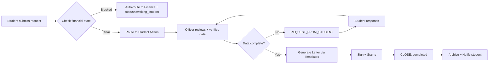

##### مثال 2: مسار الانسحاب (withdrawal)

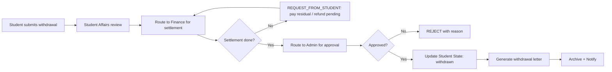

#### 9.3.5 استخدام XState

نضع كل نوع طلب كـ machine مستقلة لكنها ترث من قاعدة:

```typescript
import { setup } from 'xstate';

export const requestBaseMachine = setup({
  types: {} as {
    context: RequestContext;
    events: RequestEvent;
  },
  guards: {
    hasFinancialBlock: ({ context }) => context.financial_state === 'blocked',
    isDataComplete: ({ context }) => context.required_fields.every(f => context.data[f] != null),
  },
  actions: {
    notifyStudent: ({ context }, params: { template: string }) => {
      // dispatch notification
    },
    routeTo: ({ context }, params: { dept: string }) => {
      // update DB + audit
    },
  }
}).createMachine({
  id: 'request',
  initial: 'new',
  states: {
    new: {
      on: { ASSIGN: 'under_review' }
    },
    under_review: {
      on: {
        ROUTE_TO_FINANCE: { target: 'routed_finance', actions: { type: 'routeTo', params: { dept: 'finance' }}},
        ROUTE_TO_TRAINING: { target: 'routed_training', actions: { type: 'routeTo', params: { dept: 'training' }}},
        ROUTE_TO_ADMIN: { target: 'routed_admin', actions: { type: 'routeTo', params: { dept: 'admin' }}},
        REQUEST_FROM_STUDENT: 'awaiting_student',
        APPROVE: 'resolved_closed',
        REJECT: 'resolved_closed',
      }
    },
    routed_finance: { on: { /* same transitions */ } },
    routed_training: { on: { /* ... */ } },
    routed_admin: { on: { /* ... */ } },
    awaiting_student: {
      on: { STUDENT_RESPONDED: 'under_review' }
    },
    resolved_closed: { type: 'final' }
  }
});
```

##### مخطط State Machine للطلب

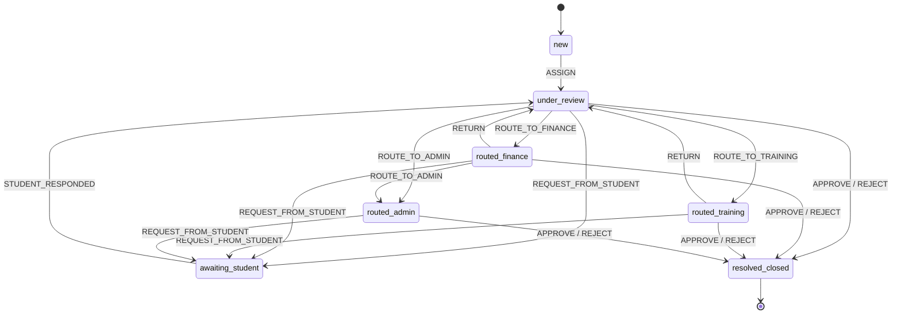

#### 9.3.6 Escalation التلقائي

```typescript
// Cron يعمل كل ساعة
async function escalationCron() {
  const overdueRequests = await db.requests.where('sla_deadline', '<', new Date())
    .where('status', 'NOT IN', ['resolved_closed', 'awaiting_student'])
    .where('escalated_at', 'IS NULL');

  for (const r of overdueRequests) {
    const escalateTo = SLA_CONFIG[r.type].escalation_role;
    await db.notifications.insert({
      to_role: escalateTo,
      to_branch: r.branch_id,
      title: `طلب متأخر: ${r.type} #${r.serial}`,
      body: `الطلب يتجاوز SLA بـ ${diffHours(r.sla_deadline, new Date())} ساعة.`,
      severity: 'high',
      action_url: `/requests/${r.id}`
    });
    await db.requests.update(r.id, { escalated_at: new Date() });
    await audit('REQUEST_ESCALATED', { request_id: r.id });
  }
}
```

#### 9.3.7 جدول الطلبات في قاعدة البيانات

```sql
CREATE TABLE requests (
  id              UUID PRIMARY KEY DEFAULT gen_random_uuid(),
  serial          TEXT UNIQUE NOT NULL, -- REQ-2026-00001
  type            TEXT NOT NULL,
  status          TEXT NOT NULL DEFAULT 'new',
  student_id      UUID REFERENCES students(id),
  branch_id       UUID REFERENCES branches(id),
  created_by      UUID REFERENCES users(id),
  assigned_to     UUID REFERENCES users(id),
  data            JSONB NOT NULL DEFAULT '{}',
  attachments     JSONB DEFAULT '[]',
  sla_deadline    TIMESTAMPTZ,
  escalated_at    TIMESTAMPTZ,
  priority        TEXT DEFAULT 'normal' CHECK (priority IN ('low','normal','high','critical')),
  resolution      TEXT,
  resolution_note TEXT,
  created_at      TIMESTAMPTZ DEFAULT NOW(),
  updated_at      TIMESTAMPTZ DEFAULT NOW(),
  closed_at       TIMESTAMPTZ
);

CREATE TABLE request_events (
  id          UUID PRIMARY KEY DEFAULT gen_random_uuid(),
  request_id  UUID REFERENCES requests(id) ON DELETE CASCADE,
  event_type  TEXT NOT NULL,
  from_status TEXT,
  to_status   TEXT,
  actor_id    UUID REFERENCES users(id),
  payload     JSONB,
  at          TIMESTAMPTZ DEFAULT NOW()
);

CREATE INDEX idx_req_student ON requests(student_id);
CREATE INDEX idx_req_status ON requests(status);
CREATE INDEX idx_req_sla ON requests(sla_deadline) WHERE status NOT IN ('resolved_closed');
```

---


### 9.4 موديول Letters Generator (توليد الخطابات الرسمية)

> الانتقال من الخطابات المكتوبة بـWord/Excel إلى توليد PDF آلي عربي RTL بختم وتوقيع رقمي.

#### 9.4.1 محرك القوالب (Template Engine)

##### المفهوم

كل خطاب = **قالب HTML/CSS** + **مجموعة متغيرات** + **شروط ظهور أقسام**. نستخدم محرك Handlebars-like (مثل `handlebars` أو `mustache`) لتعبئة المتغيرات. ثم نُحوّل الـHTML إلى PDF عبر **Puppeteer** (يضمن إخراج RTL ممتاز).

```typescript
interface LetterTemplate {
  id: string;
  code: string;            // مثال: 'INTRO_LETTER'
  name_ar: string;
  version: number;
  html_template: string;   // قالب Handlebars
  css_style: string;
  variables_schema: {
    [key: string]: { type: 'string'|'number'|'date'; required: boolean; label_ar: string };
  };
  optional_sections?: Array<{ key: string; label_ar: string }>;
  default_letterhead: string; // ترويسة المعهد
  default_footer: string;
  requires_signature: boolean;
  requires_stamp: boolean;
  requires_qr: boolean;
  approval_level: 'student_affairs' | 'branch_manager' | 'admin';
  retention_years: number; // مدة الحفظ
  is_active: boolean;
}

interface LetterIssuance {
  id: string;
  template_id: string;
  serial: string;          // RWD-LTR-2026-00234
  student_id: string;
  variables: Record<string, unknown>;
  optional_sections_used: string[];
  issued_by: string;
  approved_by?: string;
  signed_at?: Date;
  pdf_url: string;
  integrity_hash: string;
  qr_data?: string;
  issued_at: Date;
  status: 'draft' | 'pending_approval' | 'issued' | 'cancelled';
}
```

#### 9.4.2 قائمة الخطابات الأساسية

| # | الكود | الاسم | المتغيرات الأساسية | الأقسام الاختيارية | الجهة المعتمِدة |
|---|------|------|-------------------|---------------------|------------------|
| 1 | `INTRO_LETTER` | خطاب تعريف | اسم الطالب، رقم الهوية، الفرع، البرنامج، تاريخ البداية | الغرض، الجهة الموجَّه إليها | شؤون المتدربين |
| 2 | `STUDY_PROOF` | إفادة دراسة | البرنامج، السنة، الفصل، نسبة الإنجاز | حالة الانتظام، فترة الدراسة | شؤون المتدربين |
| 3 | `TRAINING_LETTER` | خطاب تدريب | الشركة، فترة التدريب، التخصص، اسم المشرف | متطلبات الشركة | شؤون المتدربين |
| 4 | `COMPLETION_CERT` | إفادة تخرج | الدبلوم، GPA، تاريخ التخرج | المرتبة | مدير الفرع |
| 5 | `FINANCIAL_VOUCHER` | سند مالي (تأكيد دفع) | المبلغ، التاريخ، طريقة الدفع، رقم الإيصال | البند | المالية |
| 6 | `PLEDGE_LETTER` | تعهد | نوع التعهد، التاريخ، الشروط | شهود | شؤون المتدربين |
| 7 | `WARNING_LETTER` | إنذار | نوع الإنذار، رقم الإنذار (1/2/3)، السبب، الجزاء | فترة معالجة | مدير الفرع |
| 8 | `CONDUCT_CERT` | شهادة حسن سلوك | فترة الدراسة، ملاحظات السلوك | إنجازات | مدير الفرع |
| 9 | `WITHDRAWAL_LETTER` | خطاب انسحاب | تاريخ الانسحاب، السبب، التسوية المالية | التزامات متبقية | مدير الفرع |
| 10 | `SUSPENSION_LETTER` | خطاب إيقاف مؤقت | فترة الإيقاف، السبب، شروط العودة | — | شؤون المتدربين |
| 11 | `TRANSCRIPT` | كشف درجات | جميع المواد، الدرجات، GPA | الترم | مدير الفرع |
| 12 | `RESUME_STUDIES` | خطاب استكمال دراسة | فترة الاستكمال، المتطلبات، الأقساط المتبقية | — | شؤون المتدربين |

#### 9.4.3 مثال على قالب HTML (خطاب التعريف)

```html
<!DOCTYPE html>
<html lang="ar" dir="rtl">
<head>
  <meta charset="UTF-8" />
  <style>
    @page { size: A4; margin: 25mm 20mm; }
    body {
      font-family: 'IBM Plex Sans Arabic', 'Cairo', 'Tajawal', Arial, sans-serif;
      direction: rtl;
      color: #1E2C3F;
      line-height: 1.8;
    }
    .letterhead { display: flex; justify-content: space-between; align-items: center; border-bottom: 2px solid #4296CD; padding-bottom: 12px; }
    .logo { height: 60px; }
    .serial { font-size: 12px; color: #555; }
    .title { text-align: center; font-size: 20pt; font-weight: 700; margin: 24px 0; }
    .body p { text-align: justify; }
    .signature-block { margin-top: 60px; }
    .qr-block { position: absolute; bottom: 30mm; left: 20mm; }
    .stamp { position: absolute; bottom: 50mm; right: 50mm; opacity: 0.8; }
  </style>
</head>
<body>
  <div class="letterhead">
    
    <div class="serial">
      الرقم: {{serial}}<br />
      التاريخ: {{issue_date_hijri}} هـ — {{issue_date_gregorian}} م
    </div>
  </div>

  <h1 class="title">{{title|default:'إلى من يهمه الأمر'}}</h1>

  <div class="body">
    <p>السلام عليكم ورحمة الله وبركاته،،،</p>

    <p>
      نُفيد بأن المتدرب/ <strong>{{student.full_name}}</strong>،
      حامل رقم الهوية/الإقامة <strong>{{student.id_number}}</strong>،
      مسجّل لدينا في معهد <strong>{{institute.name}}</strong> فرع <strong>{{student.branch_name}}</strong>،
      في برنامج <strong>{{student.program_name}}</strong>،
      اعتباراً من تاريخ <strong>{{student.enrollment_date}}</strong>،
      وحالته الدراسية حالياً: <strong>{{student.status_label}}</strong>.
    </p>

    {{#if purpose}}
      <p>وقد صدر هذا الخطاب بناءً على طلبه؛ ليُقدَّم إلى: <strong>{{purpose}}</strong>.</p>
    {{/if}}

    <p>وتفضلوا بقبول فائق التحية والتقدير.</p>
  </div>

  <div class="signature-block">
    <p>المُصدِر: <strong>{{issuer.name}}</strong></p>
    <p>المنصب: {{issuer.title}}</p>
  </div>

  {{#if qr_url}}
  <div class="qr-block">
    
    <p style="font-size:9px;">للتحقق من الخطاب امسح الرمز</p>
  </div>
  {{/if}}

  
</body>
</html>
```

#### 9.4.4 توليد PDF باستخدام Puppeteer

```typescript
import puppeteer from 'puppeteer';
import Handlebars from 'handlebars';

export async function renderLetterPdf(
  template: LetterTemplate,
  vars: Record<string, unknown>,
  ctx: { letterhead: any; stamp_url: string; qr_url?: string }
): Promise<Buffer> {
  const compiled = Handlebars.compile(template.html_template);
  const html = compiled({ ...vars, ...ctx });

  const browser = await puppeteer.launch({
    headless: 'new',
    args: ['--no-sandbox', '--disable-setuid-sandbox', '--lang=ar-SA']
  });
  try {
    const page = await browser.newPage();
    await page.setContent(html, { waitUntil: 'networkidle0' });
    await page.emulateMediaType('print');
    const pdf = await page.pdf({
      format: 'A4',
      printBackground: true,
      preferCSSPageSize: true,
      margin: { top: '25mm', right: '20mm', bottom: '25mm', left: '20mm' }
    });
    return pdf;
  } finally {
    await browser.close();
  }
}
```

> **بدائل Puppeteer للسيرفرلس:** على Vercel functions، استخدم `@sparticuz/chromium` لتشغيل Chromium في بيئة Lambda. أو Edge Function منفصل على Supabase / VPS بسيط مخصص لتوليد PDF.

#### 9.4.5 التوقيع الرقمي والـQR

##### Hash للسلامة (Integrity)

```typescript
import { createHash } from 'crypto';

function computeIntegrityHash(pdf: Buffer, serial: string, issuedAt: Date): string {
  const h = createHash('sha256');
  h.update(pdf);
  h.update(serial);
  h.update(issuedAt.toISOString());
  return h.digest('hex');
}
```

##### بناء QR

```typescript
const verifyUrl = `${PUBLIC_URL}/verify-letter/${serial}?h=${shortHash}`;
const qrPng = await QRCode.toDataURL(verifyUrl, {
  errorCorrectionLevel: 'M',
  width: 300,
  margin: 1
});
// نُمرّر qrPng إلى القالب كـbase64 data URL.
```

##### صفحة التحقق `/verify-letter/:serial`

- تعرض: نوع الخطاب، الرقم، التاريخ، اسم الطالب (مُختصر للحماية)، الجهة المُصدِرة، حالة الخطاب (ساري / ملغي).
- بدون تسجيل دخول.
- Rate limited.

#### 9.4.6 الأرشفة التلقائية

عند إصدار أي خطاب:
1. يُحفظ الـPDF في Supabase Storage تحت `letters/{branch_id}/{year}/{month}/{serial}.pdf`.
2. يُسجَّل في جدول `letter_issuances` (انظر 9.4.1).
3. يُربط تلقائياً في **ملف الطالب الإلكتروني** ضمن قسم "الخطابات الصادرة".
4. يُرسل للطالب عبر:
   - الإشعار داخل النظام (افتراضي).
   - لاحقاً: واتساب / Email عند تفعيل المرحلة 8.

---

### 9.5 موديول شؤون المتدربين

#### 9.5.1 إدارة حالات الطلاب

شؤون المتدربين هي الجهة **المسؤولة عن تتبع** حالة الطالب من خلال دورة حياته. تعرض:

- لوحة الحالة (Status Dashboard) حسب الفرع.
- قائمة طلاب مع فلاتر سريعة: "متأخر مالياً"، "ناقصو مرفقات"، "اقتراب حرمان غياب".
- بطاقة الطالب الموحّدة (`/students/:id`) تجمع كل المعلومات في صفحة واحدة قابلة للطباعة.

##### بطاقة الطالب الموحّدة — التبويبات

| التبويب | المحتوى |
|---------|---------|
| **عام** | البيانات الشخصية، ولي الأمر، الفرع، البرنامج، الحالة، تاريخ البداية |
| **المالي** | البيانات المالية المسحوبة من المحاسبي + الـblocks الفعّالة |
| **الأكاديمي** | الدبلوم، المواد، الدرجات، GPA، الحضور، الاختبارات |
| **الطلبات** | كل الطلبات (مفتوحة + مغلقة) + الـSLA |
| **الخطابات** | كل خطاب صدر له (مع رابط PDF) |
| **المرفقات** | الهوية، الشهادات السابقة، صور إضافية |
| **السجل** | Audit Log لكل عمليات الحساب |
| **الملاحظات** | ملاحظات داخلية من الموظفين (غير ظاهرة للطالب) |

#### 9.5.2 الشكاوى والاستفسارات

نوع منفصل من الـrequests (`complaint`, `inquiry`)، لكن بمعالجة خاصة:

```typescript
interface ComplaintData {
  category: 'academic' | 'financial' | 'service' | 'staff_conduct' | 'facility' | 'other';
  severity: 'low' | 'medium' | 'high' | 'critical';
  description: string;
  involves_staff_id?: string;
  anonymous: boolean; // الطالب يستطيع إرسال شكوى مجهولة
  evidence: Array<{ url: string; type: 'photo'|'doc'|'audio' }>;
}
```

- **شكوى critical** أو ضد موظف → تظهر تلقائياً للإدارة العامة (Bypass الفرع).
- **شكوى مجهولة** → يُخفى الـstudent_id عن غير الإدارة، لكن يُحفظ مشفّراً للمراجعة.
- **رد إلزامي خلال 24 ساعة** لأي شكوى critical.

#### 9.5.3 الانسحاب والإيقاف المؤقت

##### تدفق الانسحاب

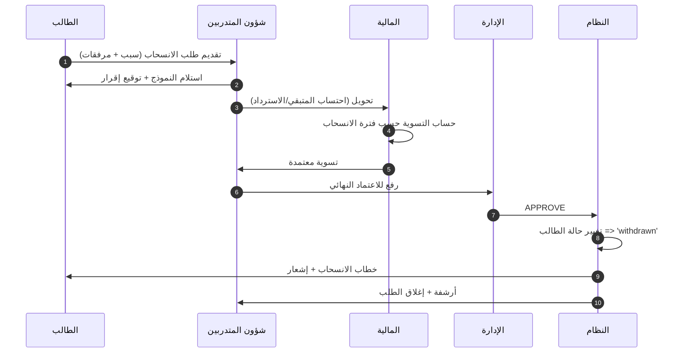

##### قواعد التسوية المالية للانسحاب

> **⚠️ [يحتاج تأكيد من العميل].** اقتراح أولي:

| فترة الانسحاب من بداية الفصل | نسبة الاسترداد |
|---------------------------------|------------------|
| خلال أول 7 أيام | 100% |
| من 8 إلى 14 يوم | 80% |
| من 15 إلى 30 يوم | 50% |
| من 31 إلى 60 يوم | 25% |
| بعد 60 يوماً | 0% (مع التزام بالباقي حسب البند) |

##### الإيقاف المؤقت

- فترة محدّدة (مثلاً فصل دراسي).
- الطالب لا تُحجب خدماته الأرشيفية، لكن يتعذّر عليه التسجيل في مواد جديدة.
- عند انتهاء الفترة → الطالب يُقدّم طلب `resume_studies` لإعادة التنشيط.

#### 9.5.4 تتبع المرفقات الناقصة

```sql
CREATE TABLE required_attachments (
  id            UUID PRIMARY KEY DEFAULT gen_random_uuid(),
  attachment_key TEXT UNIQUE NOT NULL, -- 'national_id', 'photo', 'prev_cert'
  label_ar      TEXT NOT NULL,
  is_required   BOOLEAN DEFAULT true,
  max_size_mb   INTEGER DEFAULT 5,
  accepted_mime TEXT[] -- ['image/jpeg','application/pdf']
);

CREATE TABLE student_attachments (
  id                UUID PRIMARY KEY DEFAULT gen_random_uuid(),
  student_id        UUID REFERENCES students(id),
  attachment_key    TEXT REFERENCES required_attachments(attachment_key),
  file_url          TEXT,
  uploaded_at       TIMESTAMPTZ,
  verified_at       TIMESTAMPTZ,
  verified_by       UUID REFERENCES users(id),
  status            TEXT DEFAULT 'pending' CHECK (status IN ('pending','verified','rejected','missing'))
);
```

##### تنبيهات تلقائية للناقص

```typescript
// Cron يومي يفحص الطلاب ذوي مرفقات ناقصة منذ > N يوم
async function notifyMissingAttachments() {
  const students = await db.query(`
    SELECT s.id, s.full_name, array_agg(ra.label_ar) as missing
    FROM students s
    CROSS JOIN required_attachments ra
    LEFT JOIN student_attachments sa
      ON sa.student_id = s.id AND sa.attachment_key = ra.attachment_key
    WHERE ra.is_required = true
      AND (sa.id IS NULL OR sa.status = 'missing')
      AND s.status NOT IN ('withdrawn','graduated')
    GROUP BY s.id, s.full_name
  `);
  for (const s of students) {
    await notify(s.id, 'missing_attachments', { items: s.missing });
  }
}
```

---

### 9.6 موديول التسجيل والقبول (Mini CRM)

> الانتقال من قوائم Excel وWhatsApp إلى تتبع منظَّم بـ7 مراحل + مصادر التسجيل + أداء موظفي التسجيل.

#### 9.6.1 المراحل السبع

```typescript
type EnrollmentStage =
  | 'interested'              // مهتم (دخل lead)
  | 'contacted'               // تم التواصل
  | 'awaiting_documents'      // بانتظار مستندات
  | 'awaiting_first_payment'  // بانتظار الدفعة الأولى
  | 'enrolled'                // تم التسجيل ← يُنشَأ student
  | 'rejected'                // مرفوض
  | 'cancelled';              // ملغي
```

##### الـlead قبل التحول إلى طالب

```sql
CREATE TABLE enrollment_leads (
  id              UUID PRIMARY KEY DEFAULT gen_random_uuid(),
  serial          TEXT UNIQUE NOT NULL,
  full_name       TEXT NOT NULL,
  phone           TEXT NOT NULL,
  email           TEXT,
  id_number       TEXT,
  preferred_branch_id UUID REFERENCES branches(id),
  interested_program  TEXT,
  source          TEXT, -- 'website','instagram','tiktok','walk_in','referral','google_ads'
  source_details  JSONB,
  stage           TEXT NOT NULL DEFAULT 'interested',
  assigned_to     UUID REFERENCES users(id), -- موظف التسجيل المسؤول
  rejected_reason TEXT,
  notes           TEXT,
  converted_student_id UUID REFERENCES students(id),
  created_at      TIMESTAMPTZ DEFAULT NOW(),
  updated_at      TIMESTAMPTZ DEFAULT NOW(),
  last_contact_at TIMESTAMPTZ
);

CREATE TABLE enrollment_stage_history (
  id       UUID PRIMARY KEY DEFAULT gen_random_uuid(),
  lead_id  UUID REFERENCES enrollment_leads(id),
  from_stage TEXT,
  to_stage   TEXT,
  by       UUID REFERENCES users(id),
  note     TEXT,
  at       TIMESTAMPTZ DEFAULT NOW()
);
```

#### 9.6.2 نموذج التسجيل (Validation)

```typescript
import { z } from 'zod';

const PhoneSchemaKSA = z.string().regex(/^(05|\+9665|9665)[0-9]{8}$/, 'رقم جوال سعودي غير صالح');
const NationalIdSchema = z.string().regex(/^[12][0-9]{9}$/, 'رقم هوية/إقامة غير صالح');

export const EnrollmentFormSchema = z.object({
  full_name: z.string().min(5, 'الاسم قصير جداً').max(100),
  id_number: NationalIdSchema,
  phone: PhoneSchemaKSA,
  email: z.string().email().optional(),
  birth_date: z.coerce.date().refine(d => yearsBetween(d, new Date()) >= 16, {
    message: 'العمر يجب ألا يقل عن 16 سنة'
  }),
  gender: z.enum(['male','female']),
  city: z.string().min(2),
  preferred_branch_id: z.string().uuid(),
  interested_program_id: z.string().uuid(),
  guardian: z.object({
    name: z.string().min(3),
    relation: z.enum(['father','mother','brother','sister','spouse','other']),
    phone: PhoneSchemaKSA
  }).optional(),
  source: z.enum(['website','instagram','tiktok','walk_in','referral','google_ads','whatsapp','other']),
  source_details: z.string().optional(),
  consent_pdpl: z.literal(true, { errorMap: () => ({ message: 'يجب الموافقة على سياسة البيانات' }) })
});
```

#### 9.6.3 الانتقال بين المراحل

##### Manual Transitions (افتراضي)

- موظف التسجيل ينقل الـlead يدوياً عبر زر "المرحلة التالية" في الواجهة.
- كل انتقال يطلب ملاحظة (اختياري).
- يُسجَّل في `enrollment_stage_history`.

##### Automated Triggers (اختياري — لاحقاً)

| الحدث | الانتقال التلقائي |
|------|---------------------|
| رفع كل المستندات المطلوبة | `awaiting_documents` ← `awaiting_first_payment` |
| تسجيل أول دفعة في المحاسبي | `awaiting_first_payment` ← `enrolled` (مع إنشاء `students` row) |
| 14 يوم بلا تواصل من الـlead | تنبيه للموظف (ليس تحويلاً تلقائياً) |
| 30 يوم بلا تواصل | يُقترح التحويل إلى `cancelled` (يحتاج إقرار) |

#### 9.6.4 إنشاء الطالب من الـlead

```typescript
async function convertLeadToStudent(leadId: string, actor: User): Promise<Student> {
  const lead = await db.enrollment_leads.byId(leadId);
  if (lead.stage !== 'awaiting_first_payment') {
    throw new InvalidStageError('يجب أن تكون الدفعة الأولى مكتملة');
  }

  // 1. تحقق من وصول الدفعة عبر المحاسبي
  const paymentExists = await accounting.hasFirstPayment(lead.id_number);
  if (!paymentExists) {
    throw new Error('لا توجد دفعة مسجلة في المحاسبي بعد');
  }

  // 2. أنشئ student row
  const student = await db.students.insert({
    student_no: await generateStudentNo(lead.preferred_branch_id),
    full_name: lead.full_name,
    id_number: lead.id_number,
    phone: lead.phone,
    email: lead.email,
    branch_id: lead.preferred_branch_id,
    program_id: lead.interested_program_id,
    status: 'active', // 'منتظم'
    enrolled_at: new Date(),
    lead_id: lead.id,
    external_id: lead.id_number // مطابق مع المحاسبي
  });

  // 3. حدّث الـlead
  await db.enrollment_leads.update(leadId, {
    stage: 'enrolled',
    converted_student_id: student.id
  });

  // 4. أنشئ tasks تلقائية للأقسام
  await createOnboardingTasks(student.id, [
    { dept: 'student_affairs', task: 'verify_attachments' },
    { dept: 'training', task: 'assign_schedule' },
    { dept: 'finance', task: 'confirm_installments' }
  ]);

  await audit('LEAD_CONVERTED', { lead_id: leadId, student_id: student.id, by: actor.id });
  return student;
}
```

#### 9.6.5 تقارير التسجيل

| التقرير | الأبعاد | الاستخدام |
|---------|---------|-----------|
| Funnel Conversion | المرحلة × الفترة × الفرع | فقدان الـleads في أي مرحلة |
| مصادر التسجيل | source × عدد leads × عدد converted × معدل التحويل % | تحديد القنوات الفعّالة |
| أداء موظفي التسجيل | الموظف × leads مسؤول عنها × معدل التحويل × متوسط وقت المرحلة | تقييم الموظفين |
| Cohort الناقصة بياناتهم | الـleads في `awaiting_documents` > 7 أيام | متابعة عملية |

---

### 9.7 موديول الأكاديمي اليومي

#### 9.7.1 إدارة الجداول

##### نموذج البيانات

```sql
CREATE TABLE academic_terms (
  id        UUID PRIMARY KEY DEFAULT gen_random_uuid(),
  name_ar   TEXT NOT NULL,
  start_date DATE NOT NULL,
  end_date  DATE NOT NULL,
  is_active BOOLEAN DEFAULT true
);

CREATE TABLE rooms (
  id        UUID PRIMARY KEY DEFAULT gen_random_uuid(),
  branch_id UUID REFERENCES branches(id),
  name      TEXT NOT NULL,
  capacity  INTEGER,
  type      TEXT CHECK (type IN ('classroom','lab','online','hybrid'))
);

CREATE TABLE schedule_slots (
  id          UUID PRIMARY KEY DEFAULT gen_random_uuid(),
  term_id     UUID REFERENCES academic_terms(id),
  subject_id  UUID REFERENCES diploma_subjects(id),
  section_id  UUID REFERENCES sections(id), -- شعبة
  teacher_id  UUID REFERENCES users(id),
  room_id     UUID REFERENCES rooms(id),
  day_of_week SMALLINT CHECK (day_of_week BETWEEN 0 AND 6), -- 0=أحد
  start_time  TIME NOT NULL,
  end_time    TIME NOT NULL,
  online_link TEXT,
  status      TEXT DEFAULT 'active',
  UNIQUE(section_id, day_of_week, start_time)
);

CREATE INDEX idx_slots_teacher ON schedule_slots(teacher_id, day_of_week);
CREATE INDEX idx_slots_room ON schedule_slots(room_id, day_of_week);
```

##### كشف التضاربات

```typescript
async function detectConflicts(slot: ScheduleSlot): Promise<Conflict[]> {
  const conflicts: Conflict[] = [];
  // 1. المعلم لا يكون في مكانين
  const teacherClash = await db.query(`
    SELECT * FROM schedule_slots
    WHERE teacher_id = $1 AND day_of_week = $2
      AND (start_time, end_time) OVERLAPS ($3, $4)
      AND id != $5
  `, [slot.teacher_id, slot.day_of_week, slot.start_time, slot.end_time, slot.id]);
  if (teacherClash.rows.length) conflicts.push({ type: 'teacher_overlap', details: teacherClash.rows });

  // 2. القاعة لا تُحجز مرتين
  const roomClash = await db.query(`SELECT * FROM schedule_slots WHERE room_id = ...`);
  if (roomClash.rows.length) conflicts.push({ type: 'room_overlap' });

  // 3. الشعبة لا تأخذ مادتين في نفس الوقت
  return conflicts;
}
```

#### 9.7.2 الحضور المتقدم

##### النموذج

```sql
CREATE TABLE attendance_records (
  id            UUID PRIMARY KEY DEFAULT gen_random_uuid(),
  slot_id       UUID REFERENCES schedule_slots(id),
  session_date  DATE NOT NULL,
  student_id    UUID REFERENCES students(id),
  status        TEXT NOT NULL CHECK (status IN ('present','absent','late','excused')),
  marked_by     UUID REFERENCES users(id),
  marked_at     TIMESTAMPTZ DEFAULT NOW(),
  source        TEXT DEFAULT 'manual' CHECK (source IN ('manual','pwa','bulk_import')),
  excuse_doc_url TEXT,
  UNIQUE(slot_id, session_date, student_id)
);

CREATE INDEX idx_att_student_date ON attendance_records(student_id, session_date);
```

##### حساب نسبة الحضور

```typescript
async function getAttendanceRate(studentId: string, subjectId: string): Promise<number> {
  const result = await db.query(`
    SELECT
      COUNT(*) FILTER (WHERE ar.status IN ('present','late','excused')) AS attended,
      COUNT(*) AS total
    FROM attendance_records ar
    JOIN schedule_slots ss ON ar.slot_id = ss.id
    WHERE ar.student_id = $1 AND ss.subject_id = $2
  `, [studentId, subjectId]);
  const { attended, total } = result.rows[0];
  return total === 0 ? 100 : (attended / total) * 100;
}
```

#### 9.7.3 الإنذارات والحرمان

##### القواعد الافتراضية

> **⚠️ [يحتاج تأكيد من العميل].** اقتراح:

| الإجراء | نسبة الغياب |
|---------|--------------|
| إنذار أول (Warning 1) | عند 10% غياب |
| إنذار ثانٍ (Warning 2) | عند 15% |
| إنذار نهائي (Final) | عند 20% |
| حرمان (Deprived) | عند 25% |

##### Cron يومي

```typescript
async function evaluateAbsenceWarnings() {
  const enrollments = await db.query(`SELECT student_id, subject_id FROM enrollments WHERE status='active'`);
  for (const { student_id, subject_id } of enrollments) {
    const rate = 100 - await getAttendanceRate(student_id, subject_id);
    const currentLevel = await getCurrentWarningLevel(student_id, subject_id);
    const newLevel = computeWarningLevel(rate); // returns 0-4

    if (newLevel > currentLevel) {
      await issueWarning(student_id, subject_id, newLevel);
      if (newLevel === 4) {
        await updateStudentStatus(student_id, 'deprived_attendance');
        await createBlockingEvent(student_id, 'absence_25');
      }
    }
  }
}
```

#### 9.7.4 الواجبات

##### النموذج

```sql
CREATE TABLE assignments (
  id           UUID PRIMARY KEY DEFAULT gen_random_uuid(),
  subject_id   UUID REFERENCES diploma_subjects(id),
  section_id   UUID REFERENCES sections(id),
  teacher_id   UUID REFERENCES users(id),
  title_ar     TEXT NOT NULL,
  description  TEXT,
  attachments  JSONB DEFAULT '[]',
  max_points   NUMERIC(5,2) DEFAULT 100,
  due_at       TIMESTAMPTZ NOT NULL,
  allow_late   BOOLEAN DEFAULT false,
  late_penalty_per_day NUMERIC(5,2) DEFAULT 5,
  rubric       JSONB,
  created_at   TIMESTAMPTZ DEFAULT NOW()
);

CREATE TABLE assignment_submissions (
  id            UUID PRIMARY KEY DEFAULT gen_random_uuid(),
  assignment_id UUID REFERENCES assignments(id),
  student_id    UUID REFERENCES students(id),
  files         JSONB DEFAULT '[]',
  text_response TEXT,
  submitted_at  TIMESTAMPTZ DEFAULT NOW(),
  is_late       BOOLEAN GENERATED ALWAYS AS (submitted_at > (
    SELECT due_at FROM assignments WHERE id = assignment_id
  )) STORED,
  grade         NUMERIC(5,2),
  rubric_scores JSONB,
  feedback      TEXT,
  graded_by     UUID REFERENCES users(id),
  graded_at     TIMESTAMPTZ,
  approval_status TEXT DEFAULT 'graded_pending_approval'
    CHECK (approval_status IN ('not_graded','graded_pending_approval','approved','rejected')),
  UNIQUE(assignment_id, student_id)
);
```

#### 9.7.5 الاختبار الشامل النهائي

##### Eligibility Engine

```typescript
interface ComprehensiveExamEligibility {
  is_eligible: boolean;
  reasons_if_not: Array<{
    code: 'financial_block' | 'attendance_deprived' | 'missing_subjects' | 'low_gpa' | 'incomplete_attachments';
    detail: string;
  }>;
}

async function checkComprehensiveExamEligibility(
  studentId: string,
  diplomaId: string
): Promise<ComprehensiveExamEligibility> {
  const reasons: ComprehensiveExamEligibility['reasons_if_not'] = [];

  // 1. حالة مالية
  const blocks = await getActiveBlocks(studentId);
  if (blocks.some(b => b.affects.includes('comprehensive_exam'))) {
    reasons.push({ code: 'financial_block', detail: blocks.find(b => b.affects.includes('comprehensive_exam'))!.reason });
  }

  // 2. حرمان غياب
  const status = await getStudentStatus(studentId);
  if (status === 'deprived_attendance') {
    reasons.push({ code: 'attendance_deprived', detail: 'الطالب محروم بسبب نسبة الغياب' });
  }

  // 3. اكتمال المواد
  const remaining = await getRemainingSubjects(studentId, diplomaId);
  if (remaining.length > 0) {
    reasons.push({ code: 'missing_subjects', detail: `بقي ${remaining.length} مادة لإكمال الدبلوم` });
  }

  // 4. GPA الأدنى (إن وُجد)
  // [يحتاج تأكيد من العميل]: هل هناك حد أدنى للـGPA للتأهل؟

  return { is_eligible: reasons.length === 0, reasons_if_not: reasons };
}
```

##### رفع النتائج من Excel

```typescript
// قالب Excel متفق عليه: student_no | full_name | id_number | score | status (passed/failed)
async function importComprehensiveExamResults(file: Buffer, examId: string, actor: User) {
  const wb = new ExcelJS.Workbook();
  await wb.xlsx.load(file);
  const ws = wb.getWorksheet(1);
  const errors: ImportError[] = [];
  const ok: any[] = [];

  ws.eachRow({ includeEmpty: false }, (row, idx) => {
    if (idx === 1) return; // header
    const [, studentNo, fullName, idNumber, score, status] = row.values as any[];

    if (typeof score !== 'number' || score < 0 || score > 100) {
      errors.push({ row: idx, field: 'score', message: 'الدرجة يجب أن تكون 0-100' });
      return;
    }
    ok.push({ studentNo, score, status });
  });

  if (errors.length) return { ok: [], errors };

  for (const r of ok) {
    await db.comprehensive_exam_results.upsert({
      exam_id: examId,
      student_no: r.studentNo,
      score: r.score,
      status: r.status,
      uploaded_by: actor.id,
      uploaded_at: new Date()
    });
    if (r.status === 'passed') await maybeGraduate(r.studentNo);
  }
  return { ok, errors: [] };
}
```

##### تصدير الكشوفات الرسمية

كشف PDF بنفس محرك Letters Generator لكن بقالب `COMPREHENSIVE_EXAM_REPORT`.

---

### 9.8 موديول التقارير والـDashboards

#### 9.8.1 KPI Dashboards لكل دور

##### Dashboard الإدارة العامة (Super Admin)

| البطاقة | المؤشر | المصدر |
|---------|--------|--------|
| إجمالي الطلاب النشطين | `count` | `students.status='active'` |
| نسبة التحصيل الشهري | `%` | المحاسبي API |
| الطلبات المفتوحة | `count` | `requests.status NOT IN closed` |
| الطلبات المتجاوزة SLA | `count` | `requests.sla_deadline < NOW()` |
| معدل النجاح في الاختبارات | `%` | `exam_attempts` |
| الطلاب المحرومون | `count` | `students.status IN deprived_*` |
| Funnel التسجيل | `chart` | `enrollment_leads` |
| Heatmap الحضور أسبوعياً | `chart` | `attendance_records` |

##### Dashboard مدير الفرع

نفس الـmetrics لكن مفلترة على `branch_id = $current_branch`.

##### Dashboard المالية

| البطاقة | المؤشر |
|---------|--------|
| إجمالي المتأخرات | المبلغ + عدد الطلاب |
| تحصيل اليوم/الأسبوع/الشهر | مع رسم بياني |
| الطلاب المحجوبة خدماتهم | عدد + توزيع حسب السبب |
| التعهدات المعلّقة | عدد + قيمة |

##### Dashboard شؤون المتدربين

| البطاقة | المؤشر |
|---------|--------|
| الطلبات في صندوقي | عدد |
| متوسط وقت معالجة الطلبات | ساعات |
| الشكاوى الـcritical | عدد + حالاتها |
| طلاب ناقصو مرفقات | عدد |

#### 9.8.2 التقارير الجاهزة (20+ تقرير)

| # | اسم التقرير | الأبعاد | التصدير |
|---|------------|---------|---------|
| 1 | تقرير التحصيل اليومي | الفرع × الفترة | Excel + PDF |
| 2 | تقرير المتأخرات | الفرع × عدد أيام التأخر | Excel |
| 3 | كشف المسددين | الفرع × طريقة الدفع | Excel |
| 4 | كشف غير المسددين | الفرع × المبلغ | Excel |
| 5 | تقرير الانسحابات | الفترة × السبب | Excel + PDF |
| 6 | تقرير الحضور الفصلي | الشعبة × المادة | Excel |
| 7 | الطلاب المحرومون بالغياب | الفرع × النسبة | Excel |
| 8 | تقرير اعتماد الدرجات المعلّق | المعلم × المادة | Excel |
| 9 | كشف درجات الطالب | الطالب (واحد) | PDF |
| 10 | كشف الاختبار الشامل | الفترة | Excel + PDF |
| 11 | المتخرجون | الفترة × الدبلوم | Excel + PDF |
| 12 | مصادر التسجيل | الفترة | Excel |
| 13 | أداء موظفي التسجيل | الموظف × الفترة | Excel |
| 14 | الطلبات حسب النوع | النوع × الحالة | Excel |
| 15 | الطلبات المتجاوزة SLA | القسم × الفترة | Excel |
| 16 | الشكاوى المفتوحة | الفئة × الـseverity | Excel |
| 17 | تقرير المعلمين (الأسئلة المضافة) | المعلم × الفترة | Excel |
| 18 | Item Analysis لاختبار محدد | السؤال × النجاح % × التمييز | Excel |
| 19 | تقرير الفروع المقارن | الفرع × المؤشرات | Excel + PDF |
| 20 | الخطابات الصادرة | النوع × الفترة | Excel |
| 21 | حركة الحجب/فك الحجب | اليوم × الفرع | Excel |
| 22 | Audit Log Export | المستخدم × الفترة × النوع | Excel |

#### 9.8.3 Filters الموحّدة

كل تقرير يدعم على الأقل:
- الفرع (مع متعدد).
- الفترة (تاريخ من ← إلى، أو preset: اليوم/الأسبوع/الشهر/الفصل).
- البرنامج/الدبلوم.
- الحالة.

تُحفظ آخر فلاتر المستخدم في `user_preferences` لراحة الاستخدام.

#### 9.8.4 التصدير

```typescript
async function exportToExcel(reportId: string, rows: any[], schema: ExcelColumnSchema[]): Promise<Buffer> {
  const wb = new ExcelJS.Workbook();
  wb.creator = 'رواد العطاء';
  wb.created = new Date();
  const ws = wb.addWorksheet('التقرير', { views: [{ rightToLeft: true }] });
  ws.columns = schema.map(c => ({ header: c.label_ar, key: c.key, width: c.width || 20 }));
  ws.getRow(1).font = { bold: true, color: { argb: 'FFFFFFFF' } };
  ws.getRow(1).fill = { type: 'pattern', pattern: 'solid', fgColor: { argb: 'FF4296CD' } };
  for (const r of rows) ws.addRow(r);
  return await wb.xlsx.writeBuffer() as Buffer;
}
```

---

## 10. قواعد العمل والسياسات (Business Rules & Policies)

> هذا القسم يُجمّع **كل القرارات الإدارية المُكوْدنة**. كثير منها يحتاج توحيداً مع العميل قبل التنفيذ — مُعلَّمة بـ `[يحتاج تأكيد]`.

### 10.1 مصفوفة الحجب الكاملة (Service Blocking Matrix)

> **⚠️ [يحتاج تأكيد من العميل بالكامل].** الاقتراح أدناه نموذج عمل.

#### الأبعاد:
- **الأعمدة:** 10 خدمات.
- **الصفوف:** 8 حالات/سيناريوهات.
- **الرموز:** متاح / تحذير / محجوب / لا ينطبق.

| السيناريو ↓ / الخدمة → | إصدار خطاب | شهادة | كشف درجات | رؤية الدرجات | اختبار عادي | اختبار شامل | تسجيل ترم | جدول | حضور | أرشيف |
|-------------------------|------------|-------|------------|----------------|--------------|---------------|------------|------|------|--------|
| **منتظم — لا متأخرات** | متاح | متاح | متاح | متاح | متاح | متاح | متاح | متاح | متاح | متاح |
| **متأخر مالياً 1-15 يوم** | متاح | متاح | متاح | متاح | متاح | متاح | تحذير | متاح | متاح | متاح |
| **متأخر 16-30 يوم** | تحذير | تحذير | تحذير | متاح | متاح | تحذير | محجوب | متاح | متاح | متاح |
| **متأخر 31-60 يوم (موقوف مالياً)** | محجوب | محجوب | محجوب | محجوب | متاح | محجوب | محجوب | متاح | متاح | متاح |
| **محروم بسبب الرسوم** | محجوب | محجوب | محجوب | محجوب | محجوب | محجوب | محجوب | متاح | متاح | للقراءة |
| **محروم بسبب الغياب** | متاح | محجوب | متاح | متاح | متاح | محجوب | محجوب | متاح | متاح | متاح |
| **منسحب** | محجوب | لا ينطبق | للقراءة | للقراءة | لا ينطبق | لا ينطبق | لا ينطبق | لا ينطبق | لا ينطبق | للقراءة |
| **موقوف إدارياً** | محجوب | محجوب | محجوب | محجوب | محجوب | محجوب | محجوب | محجوب | محجوب | للقراءة |

#### ملاحظات على القراءة
- "تحذير" يعني الخدمة متاحة لكن مع رسالة بارزة للطالب أن الحالة المالية على وشك أن تحجبها.
- "للقراءة" تعني الطالب يستطيع رؤية ما كان موجوداً مسبقاً، لكن لا يستطيع طلب جديد.
- خطاب المالية (سند مالي) يبقى متاحاً دائماً حتى للمحجوب لأنه يخدم عملية الدفع.

#### أسئلة جوهرية للعميل
1. هل أيام التأخر (15/30/60) مناسبة؟
2. هل "موقوف مالياً" حالة منفصلة أم نتيجة آلية لتأخر معين؟
3. حالة "محروم بسبب الغياب" — هل تمنع الاختبار النهائي العادي أم الشامل فقط؟
4. هل لمدير الفرع صلاحية تحفيز محدودة (مثلاً فك الحجب لإصدار خطاب لا أكثر) أم الإدارة العامة فقط؟

### 10.2 SLA لكل نوع طلب (جدول كامل قابل للتعديل)

> **⚠️ [يحتاج تأكيد من العميل].** الأرقام أدناه افتراضية.

| # | الكود | المدة (ساعات عمل) | جهة Escalation |
|---|-------|---------------------|-------------------|
| 1 | `intro_letter` | 24 | مدير شؤون المتدربين |
| 2 | `study_proof` | 24 | مدير شؤون المتدربين |
| 3 | `training_letter` | 48 | مدير شؤون المتدربين |
| 4 | `completion_cert` | 72 | مدير الفرع |
| 5 | `financial_voucher` | 48 | مدير المالية |
| 6 | `discount_request` | 120 | الإدارة العامة |
| 7 | `withdrawal` | 168 | الإدارة العامة |
| 8 | `temp_suspension` | 72 | مدير الفرع |
| 9 | `resume_studies` | 72 | شؤون المتدربين |
| 10 | `data_amendment` | 24 | شؤون المتدربين |
| 11 | `grade_review` | 120 | المشرف الأكاديمي |
| 12 | `exam_retake` | 96 | مدير التدريب |
| 13 | `complaint` (عادية) | 96 | الإدارة العامة |
| 13b | `complaint` (Critical) | 24 | الإدارة العامة فوراً |
| 14 | `inquiry` | 48 | شؤون المتدربين |

#### معايير حساب SLA
- يبدأ العد من **استلام الطلب** (status = `under_review`)، لا من تقديمه.
- يتوقف خلال:
  - حالة `awaiting_student`.
  - أيام العطل الرسمية.
- يُستأنف عند `STUDENT_RESPONDED`.

### 10.3 شروط الحرمان بالغياب

> **⚠️ [يحتاج تأكيد من العميل].**

| المستوى | نسبة الغياب | الإجراء | نموذج الإشعار |
|---------|--------------|---------|-----------------|
| إنذار أول | 10% | إشعار للطالب + ولي الأمر (إن وُجد) | "ABSENCE_W1" |
| إنذار ثانٍ | 15% | إشعار + استدعاء ولي الأمر | "ABSENCE_W2" |
| إنذار نهائي | 20% | خطاب رسمي + ملاحظة في الملف | "ABSENCE_FINAL" |
| **حرمان** | 25% | تغيير الحالة + حجب الاختبار النهائي والشامل | "DEPRIVED" |

#### قواعد إضافية
- **الغياب المعتذر عنه**: يدخل في نسبة الحضور (مفترض) — أو لا، حسب سياسة العميل.
- **استئناف العذر**: يقدم الطالب مستنداً (تقرير طبي) خلال 7 أيام، شؤون المتدربين تراجعه وتُحوّل الغياب إلى `excused` يدوياً.
- **استئناف الحرمان**: الطالب يقدر يطلب مراجعة (نوع طلب جديد `appeal_deprivation`) — إن قُبل، يُرفع الحرمان مع تحذير نهائي.

### 10.4 مستويات اعتماد الدرجات

#### السلسلة الكاملة

```
المعلم/المدرب => إدخال الدرجة (status: 'graded_pending_approval')
              =>
المشرف الأكاديمي => مراجعة => اعتماد (status: 'approved') / رفض (status: 'rejected')
              =>
(اختياري في الاختبارات النهائية) الإدارة => اعتماد نهائي
              =>
يصبح مرئياً للطالب (إن لم يكن هناك حجب)
```

#### الأدوار والمسؤوليات

| الدور | يدخل | يعتمد | يلغي |
|------|------|--------|------|
| المعلم | درجاته فقط | لا | لا |
| المشرف الأكاديمي | أي مادة | المستوى الأول | نعم (مع سبب) |
| مدير الفرع | لا | المستوى الثاني (للنهائي) | نعم |
| الإدارة العامة | لا | في الاختبار الشامل | نعم |

#### آلية الاعتراض (Grade Review)
- يستطيع الطالب طلب مراجعة درجة خلال **14 يوماً** من ظهورها له.
- الطلب من نوع `grade_review`.
- يُحوّل إلى المشرف الأكاديمي، الذي يُكلّف معلماً آخر بإعادة التصحيح (anonymous).
- النتيجة الأعلى تُعتمد (افتراض — يحتاج تأكيد).

### 10.5 شروط الاختبار الشامل

| الشرط | القاعدة |
|------|---------|
| **إكمال المواد** | اجتياز جميع مواد الدبلوم بنجاح |
| **الحضور** | عدم الحرمان بالغياب |
| **المالية** | عدم وجود حجب نشط على `comprehensive_exam` |
| **GPA الأدنى** | [يحتاج تأكيد من العميل] |
| **المرفقات** | اكتمال مرفقات الملف الرئيسية (هوية، صورة) |

#### إعادة الاختبار الشامل
- الطالب الراسب: محاولتان إضافيتان [يحتاج تأكيد].
- الفترة بين المحاولات: 3 أشهر [يحتاج تأكيد].
- رسوم الإعادة: [يحتاج تأكيد] — يتولاها المحاسبي.

#### التأجيل
- الطالب يستطيع تأجيل الاختبار قبل موعده بـ7 أيام مع سبب مقبول.
- الحالة تنتقل لـ `deferred` مؤقتاً، وعند الفصل التالي تعود `active`.

### 10.6 سياسة الانسحاب

#### الفترات والاسترداد

> **⚠️ [يحتاج تأكيد من العميل].**

| الفترة من بداية الفصل | استرداد الرسوم | يعتبر فاشلاً في المواد؟ |
|------------------------|------------------|--------------------------|
| 0-7 أيام | 100% | لا |
| 8-14 يوماً | 80% | لا |
| 15-30 يوماً | 50% | يُسجَّل "منسحب" بلا فشل |
| 31-60 يوماً | 25% | لا |
| > 60 يوماً | 0% | يلتزم بباقي الرسوم |

#### التوثيق المطلوب
- نموذج طلب الانسحاب (إلكتروني).
- سبب الانسحاب (اختياري لكن مفيد للتحليل).
- توقيع الطالب رقمياً على الإقرار.
- تسوية مالية من المحاسبي.
- اعتماد إداري نهائي.
- خطاب انسحاب يُصدر بشكل تلقائي.

### 10.7 سياسة إعادة الاختبار

> **⚠️ [يحتاج تأكيد من العميل].**

| البند | القيمة المقترحة |
|------|------------------|
| عدد محاولات الإعادة للاختبار العادي | 2 |
| الفترة بين المحاولات | 7 أيام كحد أدنى |
| رسوم الإعادة | [يحتاج تأكيد] |
| الدرجة المعتمدة | الأعلى — أو آخر محاولة |
| الاختبار الشامل: محاولات | 2 إضافيتان |

### 10.8 سياسة الخصومات والإعفاءات

> **⚠️ [يحتاج تأكيد من العميل بالكامل].**

#### الفئات المقترحة

| الفئة | نسبة الخصم | المعتمِد |
|------|--------------|-----------|
| أبناء الموظفين | 50% | الإدارة العامة |
| الأخوة (تسجيل أكثر من أخ) | 15% للثاني، 25% للثالث | مدير الفرع |
| تسجيل مبكر (Early Bird) | 10% | تلقائي |
| دفع كامل مقدماً | 5% | تلقائي |
| إعفاء كامل (حالات إنسانية) | 100% | الإدارة العامة فقط + لجنة |

#### مسار طلب الخصم
1. الطالب يفتح طلب `discount_request` بمستندات داعمة.
2. المالية تراجع وتُحقّق من معايير الفئة.
3. الإدارة المختصة تعتمد/ترفض.
4. إن اعتُمد: المالية تُسجّله في المحاسبي (يدوياً أو عبر API لاحقاً).

---

## 11. مخططات الحالات (State Machines)

### 11.1 State Machine للطالب

#### المخطط

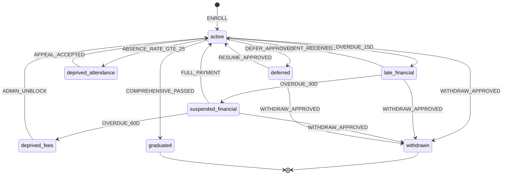

#### Triggers

| Event | الوصف | المُطلِق |
|------|------|---------|
| `ENROLL` | تحويل lead إلى طالب نشط | موظف التسجيل + دفعة أولى |
| `PAYMENT_OVERDUE_15D` | اكتشاف تأخر 15 يوم | Cron يومي |
| `OVERDUE_30D` / `OVERDUE_60D` | تصعيد التأخر | Cron يومي |
| `PAYMENT_RECEIVED` | Webhook من المحاسبي | محاسبي API |
| `FULL_PAYMENT` | تسديد كامل المتأخرات | محاسبي API |
| `ADMIN_UNBLOCK` | فك حجب يدوي للحالة | إدارة |
| `ABSENCE_RATE_GTE_25` | نسبة غياب ≥ 25% | Cron يومي |
| `APPEAL_ACCEPTED` | قبول طلب رفع الحرمان | شؤون المتدربين |
| `DEFER_APPROVED` | اعتماد طلب تأجيل | الإدارة |
| `RESUME_APPROVED` | اعتماد طلب استكمال | شؤون المتدربين |
| `WITHDRAW_APPROVED` | اعتماد انسحاب | الإدارة |
| `COMPREHENSIVE_PASSED` | نجاح في الاختبار الشامل | شؤون المتدربين |

#### Guards

| Guard | الشرط |
|------|------|
| `canEnroll` | الـlead في `awaiting_first_payment` + الدفعة الأولى موجودة في المحاسبي |
| `canResume` | الطالب في `deferred` + المالية تسمح |
| `canWithdraw` | الطالب ليس `graduated` ولا `withdrawn` |
| `canMarkGraduated` | اجتاز كل المواد + الاختبار الشامل + لا توجد حجوبات |

#### Actions

| Action | ما يحدث |
|--------|---------|
| `runBlockingRules` | تشغيل Service Blocking Engine |
| `notifyStudent` | إشعار داخلي + (لاحقاً) WhatsApp/SMS |
| `issueLetter` | توليد خطاب الانسحاب/التخرج الآلي |
| `archiveProfile` | نقل ملف الطالب لقسم "المؤرشف" |
| `recalcGPA` | إعادة حساب المعدل التراكمي |

### 11.2 State Machine للطلب (سبق في 9.3)

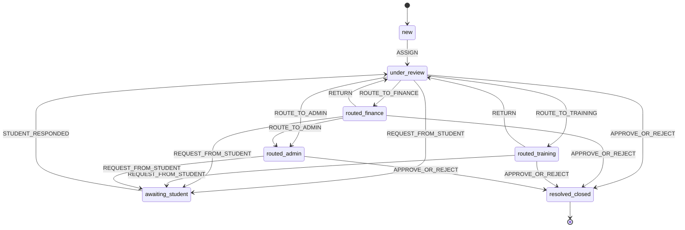

#### Triggers / Guards / Actions

| Event | Guard | Action |
|------|------|--------|
| `ASSIGN` | لدى assignee الصلاحية على هذا النوع | يبدأ احتساب SLA |
| `ROUTE_TO_FINANCE` | الطلب من نوع يحتاج المالية | يُحفظ سجل التحويل + إشعار |
| `ROUTE_TO_TRAINING` | يحتاج التدريب | كذلك |
| `ROUTE_TO_ADMIN` | يحتاج اعتماد إداري | كذلك |
| `REQUEST_FROM_STUDENT` | لا يوجد طلب نشط للطالب نفسه | إشعار + توقف SLA |
| `STUDENT_RESPONDED` | الطالب رفع المطلوب | استئناف SLA |
| `APPROVE` | تمت كل المتطلبات | تنفيذ النتيجة (خطاب/تحديث حالة/...) |
| `REJECT` | أُعطي سبب | إشعار رفض + أرشفة |

### 11.3 State Machine للتسجيل (Mini CRM)

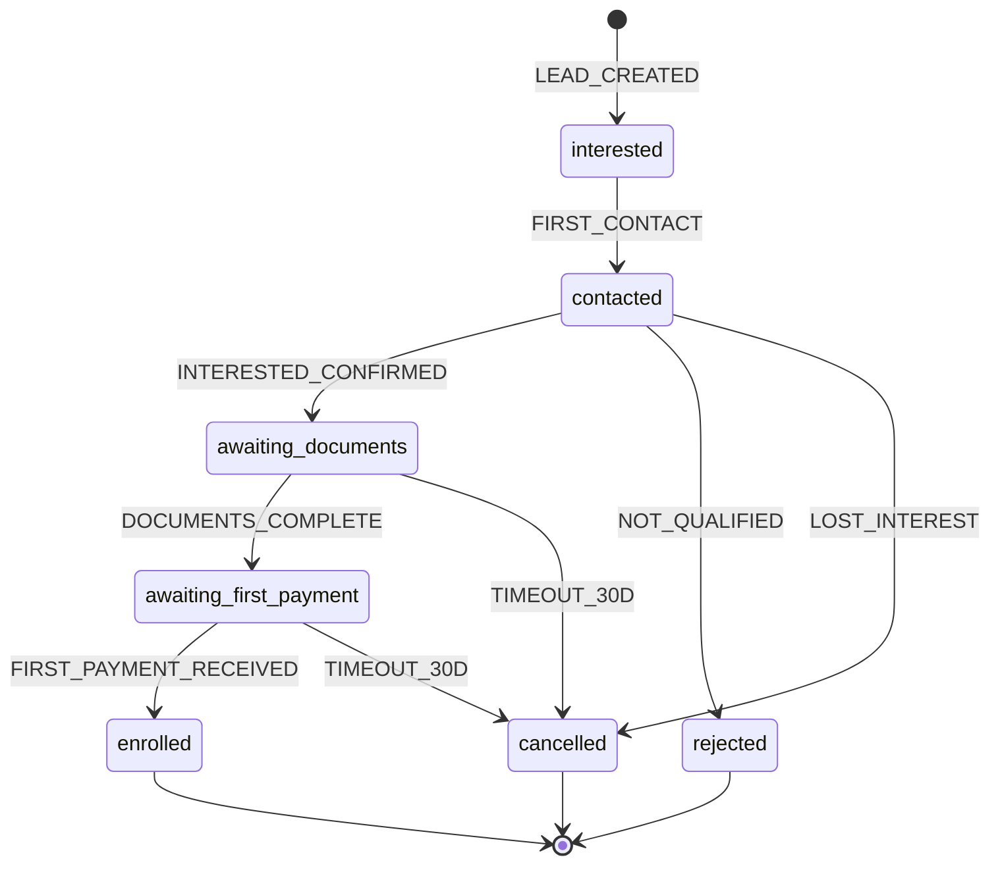

#### Triggers

| Event | المُطلِق |
|------|---------|
| `LEAD_CREATED` | نموذج التسجيل عبر الموقع / إدخال يدوي من موظف |
| `FIRST_CONTACT` | تسجيل أول مكالمة/رسالة من الموظف |
| `INTERESTED_CONFIRMED` | الموظف يحدّد "مهتم جاد" |
| `NOT_QUALIFIED` | لا تنطبق الشروط (عمر، تخصص...) |
| `LOST_INTEREST` | الـlead لم يعد مهتماً |
| `DOCUMENTS_COMPLETE` | كل المستندات المطلوبة مرفوعة + موافق عليها |
| `FIRST_PAYMENT_RECEIVED` | Webhook من المحاسبي |
| `TIMEOUT_30D` | 30 يوم بلا حركة |

#### Guards

| Guard | الشرط |
|------|------|
| `canCreateLead` | لا يوجد lead نشط بنفس رقم الهوية + رقم الجوال |
| `canConfirmInterest` | تواصل مسجل >= 1 |
| `canCompleteDocs` | كل المرفقات الإلزامية uploaded + verified |
| `canEnroll` | الدفعة الأولى وصلت + بيانات شاملة |

#### Actions

| Action | ما يحدث |
|--------|---------|
| `assignToOfficer` | تعيين موظف تسجيل تلقائياً بـRound Robin |
| `sendWelcomePack` | إرسال معلومات البرنامج |
| `createStudent` | إنشاء سجل في `students` + الانتقال للأكاديمي |
| `notifyDepartments` | تنبيه شؤون المتدربين والمالية والتدريب |

### 11.4 State Machine لمحاولة اختبار (Exam Attempt)

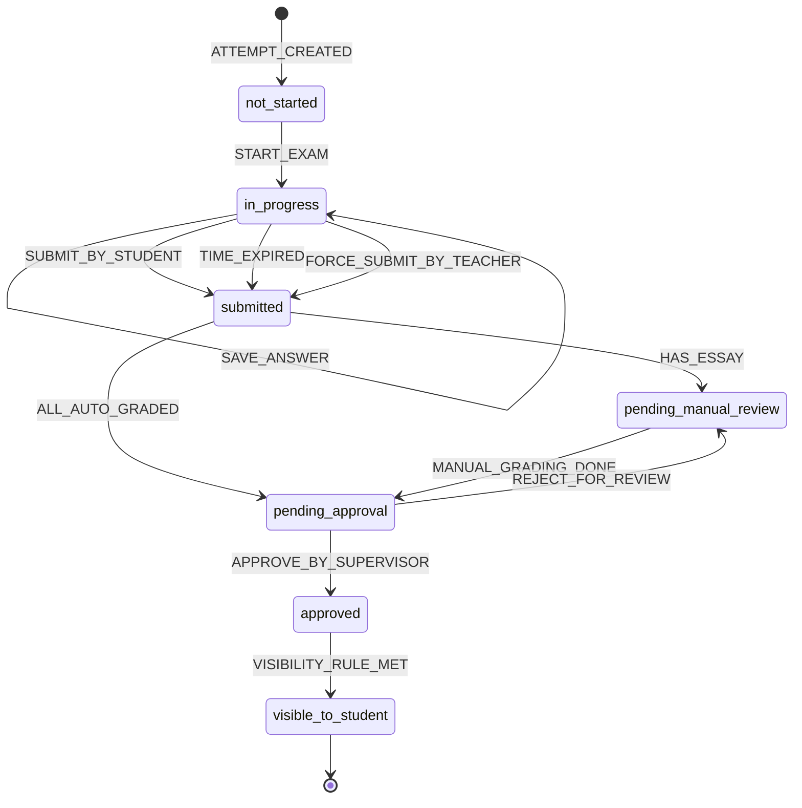

#### Triggers / Guards / Actions

| Event | Guard | Action |
|------|------|--------|
| `START_EXAM` | الكود صحيح (إن مطلوب) + النافذة الزمنية نشطة + الطالب لم يستنفد المحاولات | بدء عداد الوقت |
| `SAVE_ANSWER` | المحاولة `in_progress` | حفظ في `attempt_responses` |
| `SUBMIT_BY_STUDENT` | المحاولة `in_progress` | تشغيل auto-grading |
| `TIME_EXPIRED` | عداد الوقت = 0 | تسليم إجباري |
| `FORCE_SUBMIT_BY_TEACHER` | المعلم/الأدمن مع سبب | تسليم + سجل في Audit |
| `HAS_ESSAY` | يوجد سؤال essay | فتح واجهة التصحيح |
| `MANUAL_GRADING_DONE` | كل essay تم تصحيحه | حساب المجموع |
| `APPROVE_BY_SUPERVISOR` | المشرف وقّع | تطبيق visibility rule |
| `VISIBILITY_RULE_MET` | حسب `result_visibility` (فوري / مجدول / يدوي) | عرض النتيجة للطالب |

### 11.5 State Machine للدرجة (Grade)

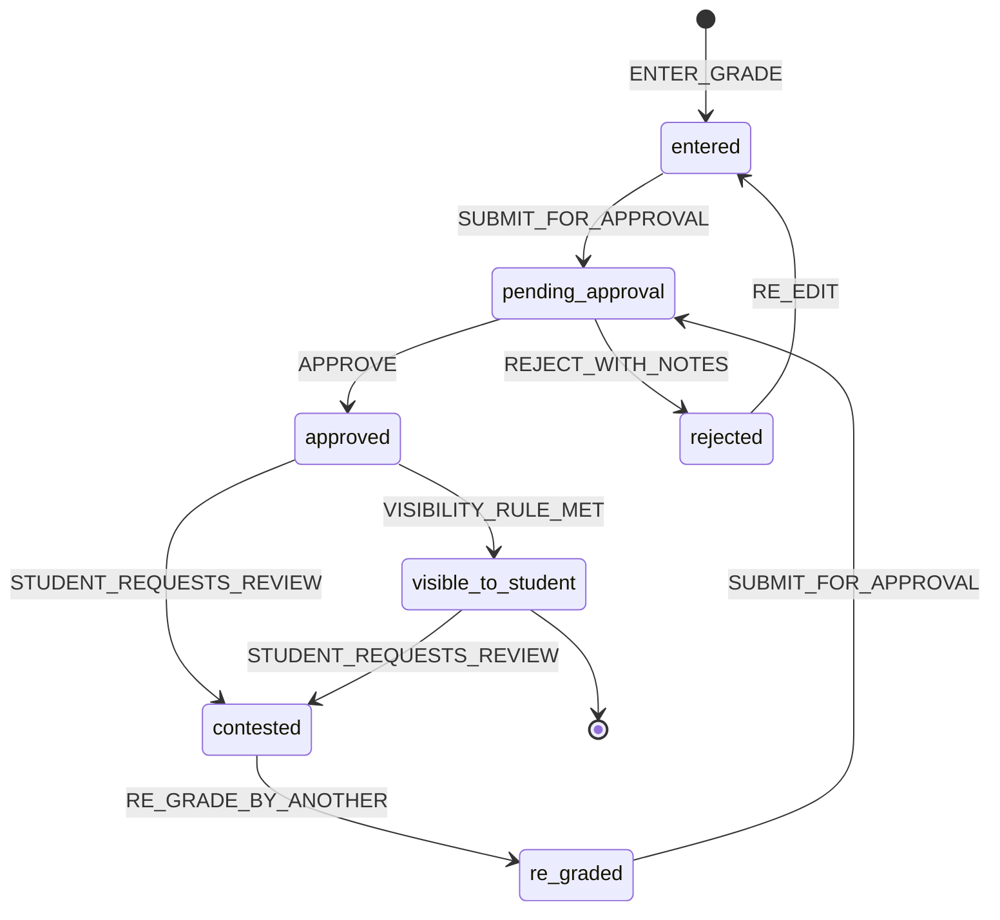

#### Triggers / Guards / Actions

| Event | Guard | Action |
|------|------|--------|
| `ENTER_GRADE` | المعلم يدخل درجة طالب | حفظ + state `entered` |
| `SUBMIT_FOR_APPROVAL` | المعلم انتهى من كل طلابه | تنبيه المشرف |
| `APPROVE` | المشرف وافق | تطبيق visibility |
| `REJECT_WITH_NOTES` | ملاحظات إلزامية | إعادة للمعلم |
| `RE_EDIT` | المعلم يعدّل | حفظ نسخة جديدة |
| `STUDENT_REQUESTS_REVIEW` | خلال 14 يوماً من الظهور | فتح طلب `grade_review` |
| `RE_GRADE_BY_ANOTHER` | معلم مختلف، Anonymized | درجة جديدة |

---

## 12. التدفقات والـ Workflows (User & Business Flows)

### 12.1 تدفق اعتماد الدرجات (Grade Approval Flow)

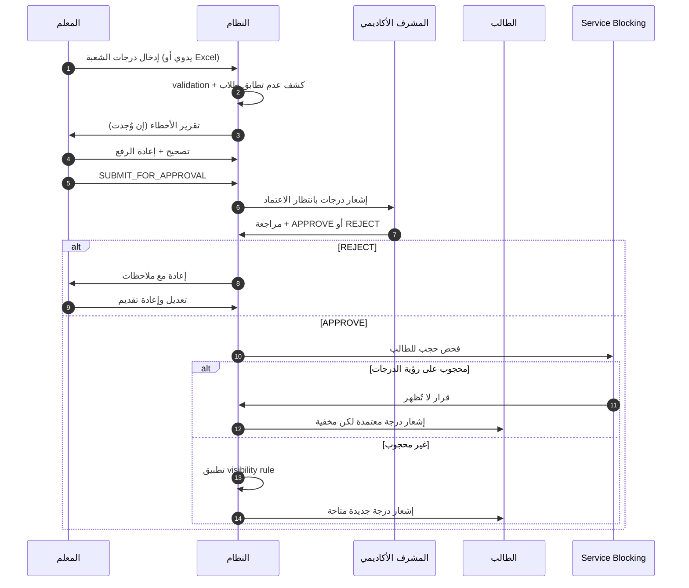

### 12.2 تدفق الحجب وفك الحجب

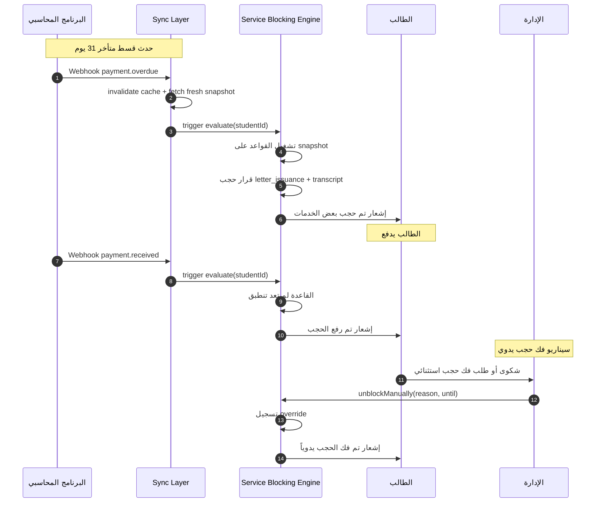

### 12.3 تدفق طلب خطاب (مع الحجب)

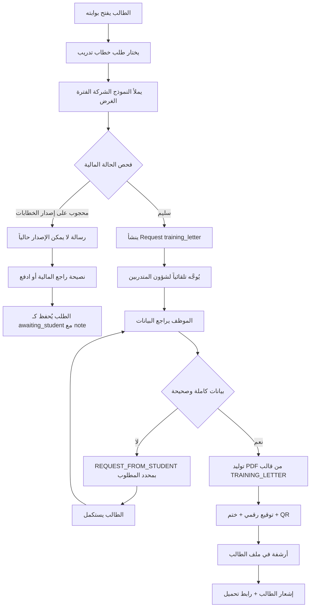

### 12.4 تدفق الانسحاب الكامل

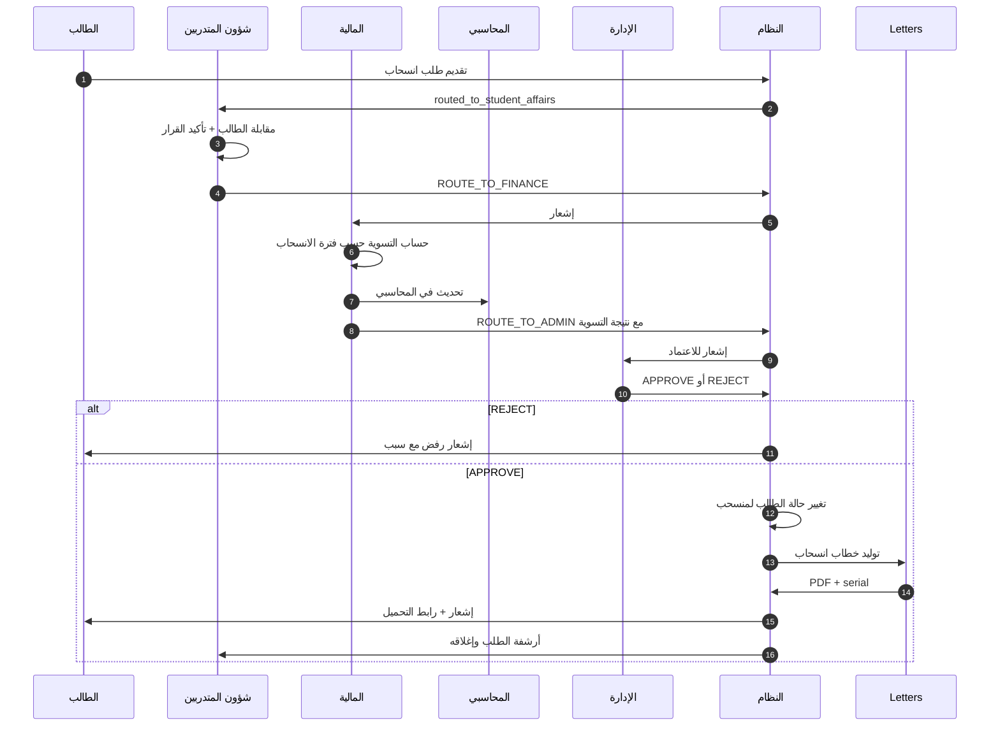

### 12.5 تدفق الاختبار الشامل

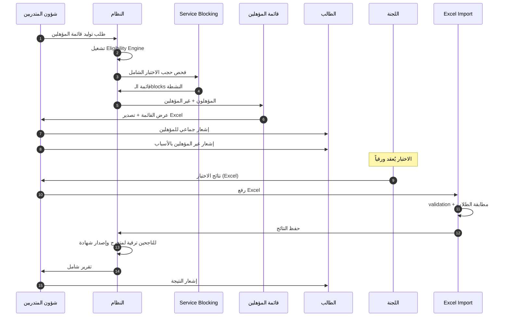

### 12.6 تدفق التسجيل من البداية

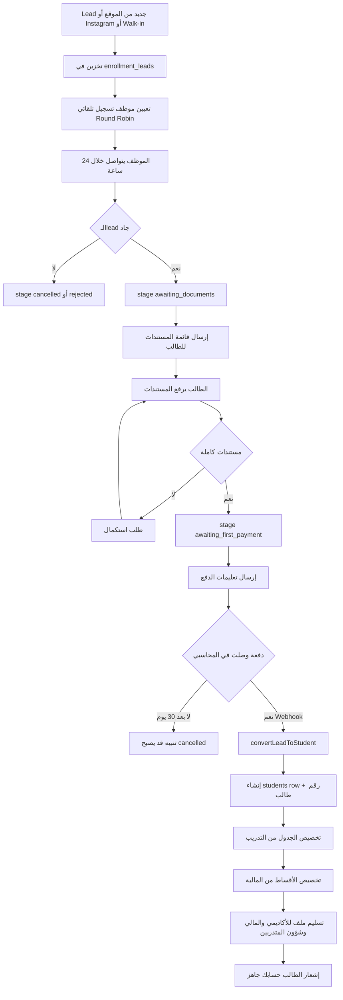

### 12.7 تدفق إجراء الاختبار الإلكتروني (Student Experience)

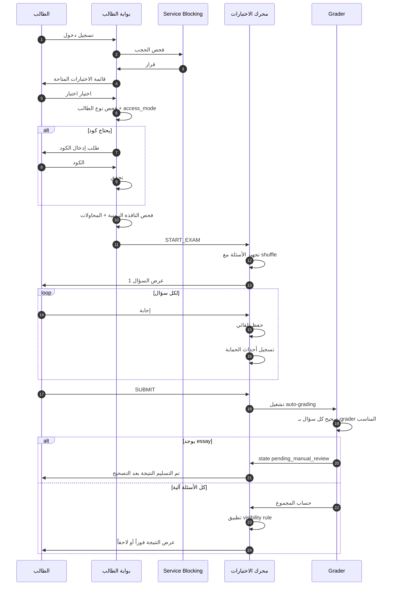

### 12.8 تدفق إنشاء سؤال بـClaude AI

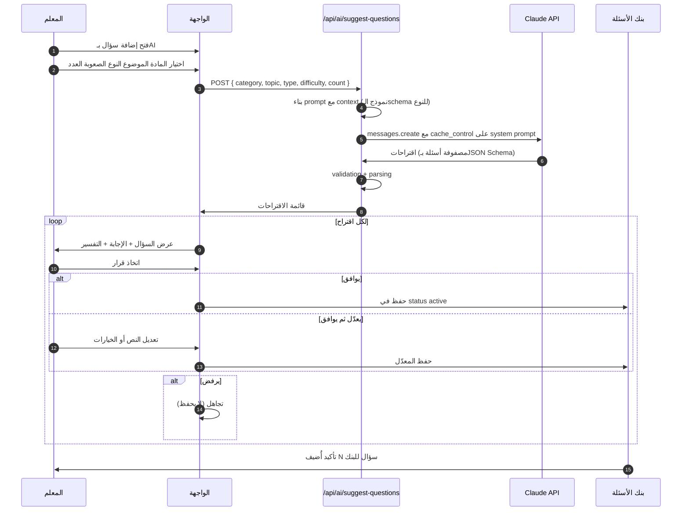

---

## خاتمة الجزء الثاني

غطّى هذا الجزء **الأقسام 9 إلى 12** من وثيقة التسليم:

- **القسم 9 (الموديولات):** 8 موديولات بأمثلة كود وSchemas وآليات تصحيح وقواعد فنية.
- **القسم 10 (قواعد العمل):** 8 مجموعات سياسات، مع تمييز ما يحتاج تأكيداً من العميل بشكل واضح.
- **القسم 11 (State Machines):** 5 آلات حالة مع triggers/guards/actions جاهزة للنقل إلى XState.
- **القسم 12 (Workflows):** 8 تدفقات بمخططات Mermaid (sequenceDiagram + flowchart).

### نقاط حرجة تستوجب جلسة Discovery قبل البدء

1. **مصفوفة الحجب الكاملة** (10.1) — أهم قرار تجاري.
2. **SLAs لكل طلب** (10.2) — يؤثر على إعدادات الـescalation.
3. **شروط الحرمان بالغياب** (10.3) — نسب الإنذار.
4. **سياسة الانسحاب وفترات الاسترداد** (10.6).
5. **سياسة الخصومات** (10.8).
6. **API البرنامج المحاسبي** — توثيقه، حدوده، حقول الـwebhook.
7. **GPA الأدنى للتأهل للاختبار الشامل** (10.5).
8. **هل لمدير الفرع صلاحية فك حجب محدودة** (9.2.2)؟

### الموديولات المرتبطة في الأجزاء التالية

- نموذج بيانات Postgres الكامل + RLS Policies — الجزء 3.
- معمارية الـAPI وEndpoints التفصيلية — الجزء 4.
- خطة الاختبارات (UAT + E2E + Unit) — الجزء 5.

---

**نهاية الجزء الثاني.**

