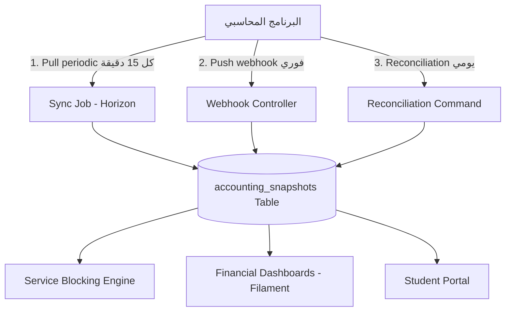
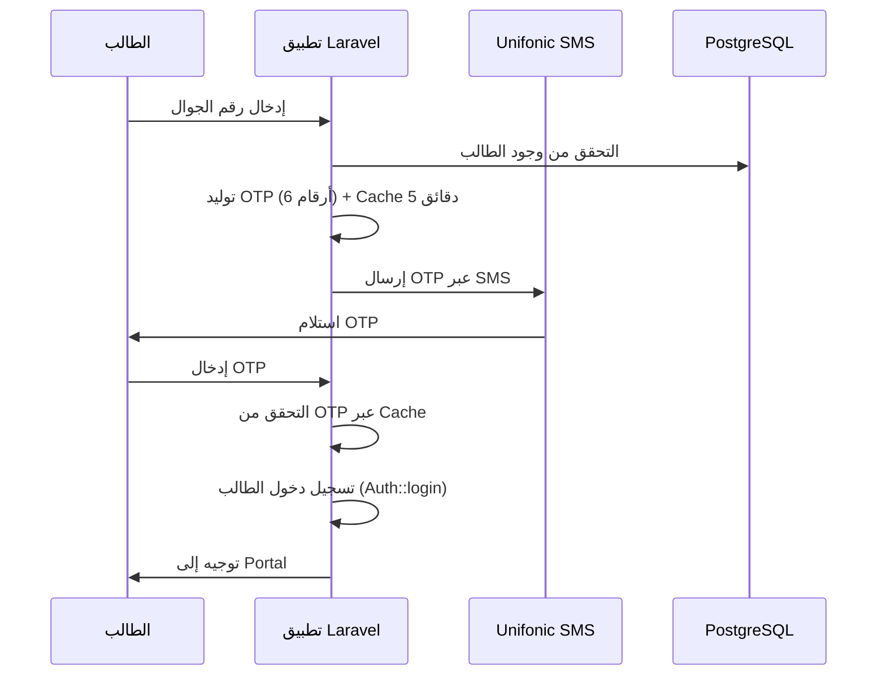
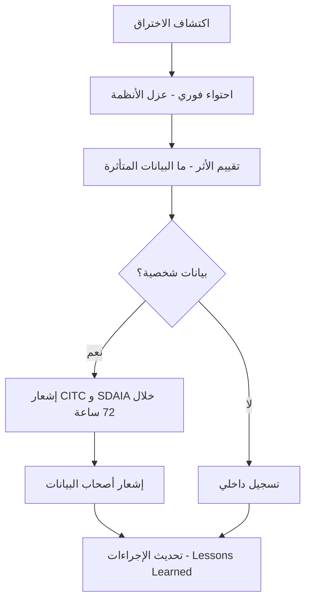
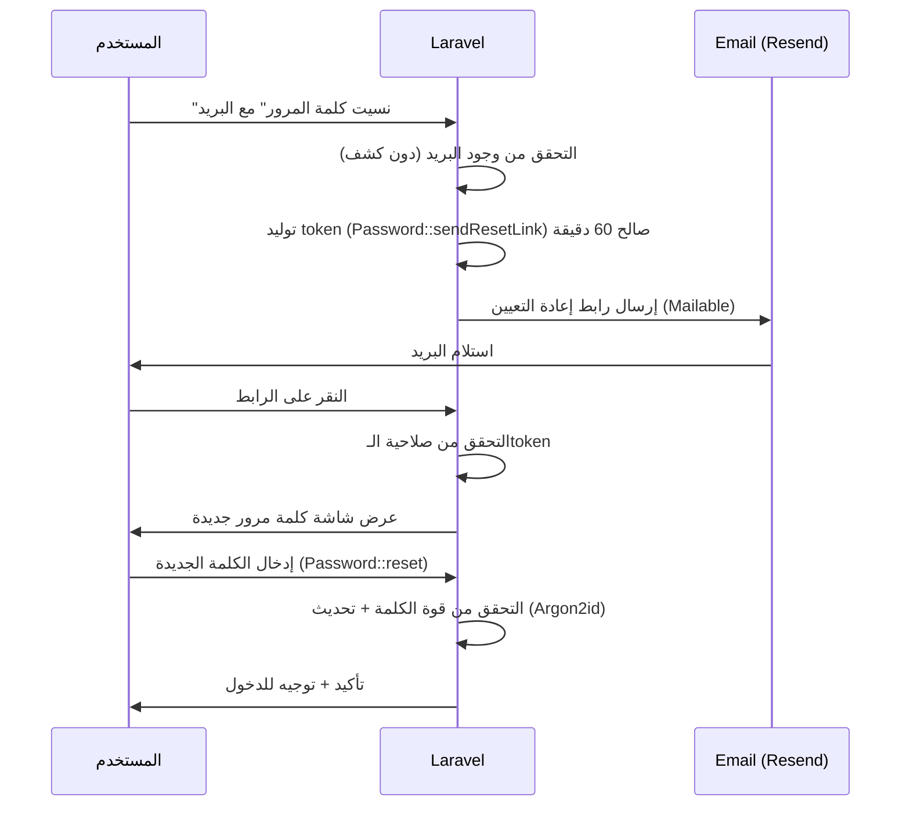
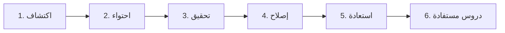
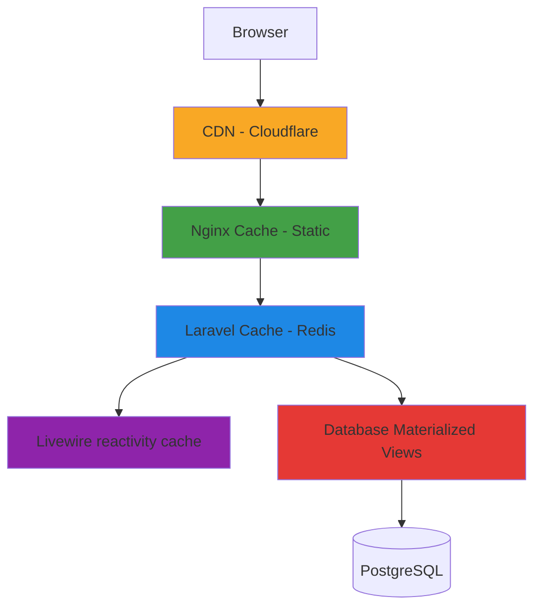
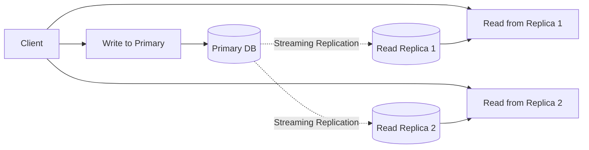

# الجزء الثالث: التكاملات والأمان والأداء

## 13. التكاملات الخارجية (External Integrations)

### 13.1 تكامل البرنامج المحاسبي ⭐

#### 13.1.1 نمط Adapter

البرنامج المحاسبي للمعهد يوفّر API للبيانات المالية. نتعامل معه عبر طبقة **Adapter** معزولة (Service class تنفّذ Interface) حتى يمكن تبديل البرنامج لاحقاً بدون تعديل المنطق التجاري.

```php
<?php
// app/Services/Accounting/Contracts/AccountingServiceInterface.php
namespace App\Services\Accounting\Contracts;

use App\Data\StudentBalanceData;
use App\Data\PaymentData;
use App\Data\BranchRevenueData;
use Carbon\CarbonInterface;

interface AccountingServiceInterface
{
    public function getStudentBalance(string $studentId): StudentBalanceData;

    /** @return array<PaymentData> */
    public function getStudentPayments(string $studentId, ?CarbonInterface $since = null): array;

    public function getBranchRevenue(
        string $branchId,
        CarbonInterface $from,
        CarbonInterface $to,
    ): BranchRevenueData;

    public function verifyWebhookSignature(string $signature, string $body): bool;
}
```

DTO عبر spatie/laravel-data:

```php
<?php
// app/Data/StudentBalanceData.php
namespace App\Data;

use Spatie\LaravelData\Data;
use Carbon\CarbonImmutable;

class StudentBalanceData extends Data
{
    public function __construct(
        public string $studentId,
        public float $totalFees,
        public float $paidAmount,
        public float $remainingAmount,
        public int $overdueDays,
        public ?CarbonImmutable $lastPaymentDate,
        public ?CarbonImmutable $nextDueDate,
        public string $currency = 'SAR',
    ) {}
}
```

التنفيذ الفعلي:

```php
<?php
// app/Services/Accounting/ExternalAccountingService.php
namespace App\Services\Accounting;

use App\Data\StudentBalanceData;
use App\Services\Accounting\Contracts\AccountingServiceInterface;
use Illuminate\Support\Facades\Cache;
use Illuminate\Support\Facades\Http;

class ExternalAccountingService implements AccountingServiceInterface
{
    public function __construct(
        private readonly string $baseUrl,
        private readonly string $apiKey,
    ) {}

    public function getStudentBalance(string $studentId): StudentBalanceData
    {
        return Cache::remember(
            key: "accounting.balance.{$studentId}",
            ttl: now()->addMinutes(15),
            callback: function () use ($studentId): StudentBalanceData {
                $response = Http::withToken($this->apiKey)
                    ->timeout(5)
                    ->retry(3, 200, throw: false)
                    ->baseUrl($this->baseUrl)
                    ->get("/students/{$studentId}/balance")
                    ->throw()
                    ->json();

                return StudentBalanceData::from($response);
            },
        );
    }

    // ...
}
```

#### 13.1.2 الـ Contract المتوقّع من البرنامج المحاسبي (OpenAPI-like)

| Endpoint | Method | الغرض | Cache TTL |
|----------|--------|------|-----------|
| `/students/{id}/balance` | GET | رصيد الطالب الحالي | 15 دقيقة |
| `/students/{id}/payments?since=` | GET | دفعات الطالب | 30 دقيقة |
| `/students/{id}/installments` | GET | جدول الأقساط | 1 ساعة |
| `/branches/{id}/revenue?from=&to=` | GET | تحصيل الفرع لفترة | 1 ساعة |
| `/branches/{id}/outstanding` | GET | المتأخرات | 30 دقيقة |
| `/webhooks/payment` | POST | webhook عند دفعة جديدة | — |
| `/webhooks/refund` | POST | webhook عند استرجاع | — |
| `/health` | GET | فحص الاتصال | — |

#### 13.1.3 استراتيجية التزامن (Sync Strategy)

**ثلاث طبقات للتزامن:**



**1. Pull Periodic (كل 15 دقيقة) عبر Laravel Scheduler:**

```php
<?php
// routes/console.php
use Illuminate\Support\Facades\Schedule;
use App\Jobs\Accounting\SyncStudentBalancesJob;

Schedule::job(new SyncStudentBalancesJob)
    ->everyFifteenMinutes()
    ->withoutOverlapping()
    ->onOneServer();
```

**2. Push via Webhook (فوري):**
- البرنامج المحاسبي يرسل webhook عند كل دفعة.
- نتحقق من التوقيع، نحدّث الـsnapshot، نُطلق Event يعيد تقييم الحجب.

**3. Reconciliation Job (يومي):**
- Artisan Command (`accounting:reconcile`) يُجدول يومياً.
- مقارنة كاملة بين الـsnapshot المحلي وبيانات البرنامج المحاسبي.
- إشعار الأدمن عبر Laravel Notification عند الفروقات.

#### 13.1.4 معالجة الأخطاء + Circuit Breaker

```php
<?php
// app/Services/Accounting/AccountingCircuitBreaker.php
namespace App\Services\Accounting;

use Illuminate\Support\Facades\Cache;
use App\Exceptions\IntegrationException;
use Closure;

class AccountingCircuitBreaker
{
    private const FAILURE_THRESHOLD = 5;
    private const OPEN_DURATION_SECONDS = 60;

    public function execute(string $key, Closure $callback): mixed
    {
        if ($this->isOpen($key)) {
            throw new IntegrationException(
                provider: 'accounting',
                message: 'Circuit is open',
            );
        }

        try {
            $result = $callback();
            $this->reset($key);
            return $result;
        } catch (\Throwable $e) {
            $this->recordFailure($key);
            // إرسال للـ failed_jobs بدلاً من إسقاط العملية
            throw new IntegrationException('accounting', $e->getMessage(), previous: $e);
        }
    }

    private function isOpen(string $key): bool
    {
        return (int) Cache::get("circuit.{$key}.failures", 0) >= self::FAILURE_THRESHOLD;
    }

    private function recordFailure(string $key): void
    {
        Cache::increment("circuit.{$key}.failures");
        Cache::put("circuit.{$key}.failures", (int) Cache::get("circuit.{$key}.failures"), self::OPEN_DURATION_SECONDS);
    }

    private function reset(string $key): void
    {
        Cache::forget("circuit.{$key}.failures");
    }
}
```

عمليات Queue الفاشلة تُرسل تلقائياً لجدول `failed_jobs` ويمكن إعادة تشغيلها عبر Horizon dashboard.

#### 13.1.5 جدول الـ Snapshot في PostgreSQL

Migration:

```php
<?php
// database/migrations/xxxx_create_accounting_snapshots_table.php
use Illuminate\Database\Migrations\Migration;
use Illuminate\Database\Schema\Blueprint;
use Illuminate\Support\Facades\Schema;

return new class extends Migration {
    public function up(): void
    {
        Schema::create('accounting_snapshots', function (Blueprint $table) {
            $table->foreignUuid('student_id')->primary()->constrained();
            $table->decimal('total_fees', 12, 2);
            $table->decimal('paid_amount', 12, 2);
            $table->decimal('remaining_amount', 12, 2);
            $table->integer('overdue_days')->default(0);
            $table->timestampTz('last_payment_date')->nullable();
            $table->timestampTz('next_due_date')->nullable();
            $table->timestampTz('last_synced_at')->useCurrent();
            $table->string('source_version', 50)->nullable();

            $table->index('overdue_days', 'idx_snapshot_overdue');
            $table->index('last_synced_at', 'idx_snapshot_synced');
        });
    }
};
```

#### 13.1.6 اختبارات الـ Integration

- **MockAccountingService** للتطوير المحلي (يطبّق نفس Interface).
- **Pest Contract Tests** على شكل الـ JSON والـ Status codes.
- **Recorded HTTP Tests** عبر `Http::fake()` للسيناريوهات الواقعية.

```php
<?php
// tests/Feature/Accounting/SyncStudentBalanceTest.php
use Illuminate\Support\Facades\Http;

it('syncs student balance from accounting API', function () {
    Http::fake([
        '*/students/*/balance' => Http::response([
            'studentId' => 'abc-123',
            'totalFees' => 12000,
            'paidAmount' => 4000,
            'remainingAmount' => 8000,
            'overdueDays' => 5,
            'lastPaymentDate' => '2026-04-10T10:00:00Z',
            'nextDueDate' => '2026-05-10T00:00:00Z',
        ], 200),
    ]);

    $service = app(\App\Services\Accounting\Contracts\AccountingServiceInterface::class);
    $balance = $service->getStudentBalance('abc-123');

    expect($balance->overdueDays)->toBe(5)
        ->and($balance->remainingAmount)->toBe(8000.0);
});
```

---

### 13.2 WhatsApp Business API

#### 13.2.1 اختيار المزوّد

| المزوّد | المميزات | العيوب | السعر التقريبي |
|---------|---------|--------|------------------|
| **Unifonic** ⭐ | محلي سعودي، دعم عربي، فاتورة بالريال | تكلفة أعلى من Twilio | 0.20-0.40 ريال/رسالة |
| **Twilio** | الأكثر شهرة، توثيق ممتاز | فاتورة بالدولار، دعم محلي محدود | $0.05-0.10/رسالة |
| **Meta Cloud API** | الأرخص (مباشر من Meta) | تعقيد إعداد، لا دعم محلي | $0.03-0.07/رسالة |

**التوصية:** Unifonic للبيئة الإنتاجية، Meta Cloud API للتطوير. التنفيذ عبر Laravel Notification Channel مخصّص.

#### 13.2.2 الـ Templates المطلوبة

WhatsApp Business يطلب اعتماد templates مسبقاً (Business Initiated Messages):

| اسم الـ Template | الفئة | المتغيرات |
|-----------------|------|----------|
| `payment_reminder` | UTILITY | {student_name}, {amount}, {due_date} |
| `request_confirmation` | UTILITY | {student_name}, {request_type}, {request_id} |
| `request_status_update` | UTILITY | {request_id}, {old_status}, {new_status} |
| `attendance_warning` | UTILITY | {student_name}, {course_name}, {absence_count} |
| `deprivation_alert` | UTILITY | {student_name}, {reason}, {action_required} |
| `exam_reminder` | UTILITY | {student_name}, {exam_name}, {date}, {time} |
| `certificate_ready` | UTILITY | {student_name}, {certificate_url} |
| `letter_ready` | UTILITY | {student_name}, {letter_type}, {download_url} |

#### 13.2.3 إدارة الـ Session Window (24h)

WhatsApp يميّز بين:
- **Business Initiated** (BI): يحتاج template معتمد، صالح دائماً.
- **User Initiated** (UI): الـ24 ساعة الأولى بعد رسالة الطالب — يمكن إرسال أي محتوى.

```php
<?php
// app/Services/Whatsapp/WhatsappSender.php
namespace App\Services\Whatsapp;

use App\Models\Student;
use App\Models\WhatsappMessage;
use Illuminate\Support\Facades\Http;

class WhatsappSender
{
    public function send(Student $student, WhatsappContent $content): void
    {
        $lastUserMessage = WhatsappMessage::query()
            ->where('student_id', $student->id)
            ->where('direction', 'inbound')
            ->latest('received_at')
            ->first();

        $isInSessionWindow = $lastUserMessage
            && $lastUserMessage->received_at->diffInHours(now()) < 24;

        if ($isInSessionWindow) {
            $this->sendFreeForm($student, $content);
            return;
        }

        if (! $content->template) {
            throw new \InvalidArgumentException('Template required outside session window');
        }

        $this->sendTemplate($student, $content->template, $content->variables);
    }

    // ...
}
```

#### 13.2.4 جدول `whatsapp_messages` (Migration)

```php
Schema::create('whatsapp_messages', function (Blueprint $table) {
    $table->uuid('id')->primary();
    $table->foreignUuid('student_id')->nullable()->constrained();
    $table->string('to_phone', 20);
    $table->string('template_name', 100)->nullable();
    $table->jsonb('variables')->nullable();
    $table->text('body')->nullable();
    $table->string('status', 20);  // queued, sent, delivered, read, failed
    $table->string('provider_message_id', 100)->nullable();
    $table->string('error_code', 50)->nullable();
    $table->text('error_detail')->nullable();
    $table->timestampTz('sent_at')->nullable();
    $table->timestampTz('delivered_at')->nullable();
    $table->timestampTz('read_at')->nullable();
    $table->timestamps();

    $table->index('student_id', 'idx_wa_student');
    $table->index('status', 'idx_wa_status');
});
```

---

### 13.3 SMS Gateway

#### 13.3.1 المزوّدون السعوديون

| المزوّد | السعر/رسالة | الموثوقية | API |
|---------|--------------|----------|------|
| **Unifonic** | 0.15-0.25 ريال | ممتازة | REST |
| **Mobily Business** | 0.12-0.20 ريال | ممتازة | REST |
| **Jawaly** | 0.10-0.18 ريال | جيدة | REST |
| **STC Business** | 0.15-0.30 ريال | ممتازة | REST/SOAP |

**التوصية:** Unifonic أو Mobily Business (لتوحيد بوّابات الاتصال). يُستهلك عبر Laravel HTTP Client مع service class.

#### 13.3.2 الـ Use Cases المحدودة

SMS مكلف نسبياً، يُستخدم فقط لـ:
- OTP للتحقق من رقم الجوال + تسجيل دخول الطلاب (OTP عبر SMS).
- تنبيه حرج (الحرمان، الإيقاف، فك الحجب).
- تأكيد دفعة.
- Fallback عند فشل WhatsApp.

#### 13.3.3 جدول `sms_messages`

```php
Schema::create('sms_messages', function (Blueprint $table) {
    $table->uuid('id')->primary();
    $table->foreignUuid('student_id')->nullable()->constrained();
    $table->string('to_phone', 20);
    $table->text('body');
    $table->string('status', 20);
    $table->string('provider', 50);
    $table->string('provider_message_id', 100)->nullable();
    $table->decimal('cost', 6, 4)->nullable();
    $table->timestampTz('sent_at')->nullable();
    $table->timestampTz('delivered_at')->nullable();
    $table->timestamps();
});
```

---

### 13.4 Email Service

#### 13.4.1 اختيار المزوّد

| المزوّد | المميزات | السعر |
|---------|---------|------|
| **Resend** ⭐ | بسيط، حديث، توثيق ممتاز، Laravel package جاهز | 100 رسالة/يوم مجانية، ثم $20/شهر |
| **AWS SES** | الأرخص للحجم العالي | $0.10 / 1000 رسالة |
| **SendGrid** | الأكثر نضجاً | $19.95+/شهر |

**التوصية:** `resend/resend-laravel` للبداية، AWS SES إن تجاوز الحجم 100K رسالة شهرياً.

```php
// config/mail.php — استخدام Resend driver
'mailers' => [
    'resend' => [
        'transport' => 'resend',
    ],
],
'default' => env('MAIL_MAILER', 'resend'),
```

#### 13.4.2 Templates عربية RTL عبر Blade

```blade
{{-- resources/views/emails/payment-reminder.blade.php --}}
<!DOCTYPE html>
<html dir="rtl" lang="ar">
<head>
    <meta charset="UTF-8">
    <style>
        body { font-family: 'Cairo', Arial, sans-serif; direction: rtl; }
        .btn {
            display: inline-block; padding: 12px 24px;
            background: #0d9488; color: #fff;
            text-decoration: none; border-radius: 6px;
        }
    </style>
</head>
<body>
    <div style="max-width: 600px; margin: auto; padding: 20px;">
        <p>السلام عليكم {{ $studentName }}،</p>
        <p>نُذكّركم بأن قسطكم المستحق بقيمة {{ $amount }} ريال يُسدَّد قبل {{ $dueDate->format('Y-m-d') }}.</p>
        <p><a href="{{ $portalUrl }}" class="btn">سداد الآن</a></p>
    </div>
</body>
</html>
```

Mailable Class:

```php
<?php
// app/Mail/PaymentReminderMail.php
namespace App\Mail;

use Illuminate\Mail\Mailable;
use Illuminate\Mail\Mailables\{Envelope, Content};

class PaymentReminderMail extends Mailable
{
    public function __construct(
        public string $studentName,
        public float $amount,
        public \Carbon\CarbonInterface $dueDate,
        public string $portalUrl,
    ) {}

    public function envelope(): Envelope
    {
        return new Envelope(subject: 'تذكير بقسط مستحق');
    }

    public function content(): Content
    {
        return new Content(view: 'emails.payment-reminder');
    }
}
```

**تجنّب فلاتر السبام:** إعداد SPF + DKIM + DMARC على نطاق المعهد.

#### 13.4.3 جدول `email_logs`

```php
Schema::create('email_logs', function (Blueprint $table) {
    $table->uuid('id')->primary();
    $table->foreignUuid('student_id')->nullable()->constrained();
    $table->string('to_email');
    $table->text('subject');
    $table->string('template_name', 100)->nullable();
    $table->jsonb('variables')->nullable();
    $table->string('status', 20);  // queued, sent, delivered, opened, clicked, bounced, complained, failed
    $table->string('provider_id', 100)->nullable();
    $table->timestampTz('opened_at')->nullable();
    $table->timestampTz('clicked_at')->nullable();
    $table->timestamps();
});
```

---

### 13.5 تسجيل دخول الطلاب عبر OTP

#### 13.5.1 تدفق تسجيل الدخول



#### 13.5.2 Controller للـ OTP

```php
<?php
// app/Http/Controllers/Auth/OtpLoginController.php
namespace App\Http\Controllers\Auth;

use App\Http\Requests\Auth\SendOtpRequest;
use App\Http\Requests\Auth\VerifyOtpRequest;
use App\Models\Student;
use Illuminate\Support\Facades\{Auth, Cache, RateLimiter};

class OtpLoginController extends Controller
{
    public function send(SendOtpRequest $request, SmsSender $sms): array
    {
        $phone = $request->validated('phone');

        RateLimiter::hit("otp:send:{$phone}", decaySeconds: 60);
        if (RateLimiter::tooManyAttempts("otp:send:{$phone}", maxAttempts: 3)) {
            abort(429, 'تم تجاوز الحد المسموح. حاول لاحقاً.');
        }

        $student = Student::query()->where('phone', $phone)->firstOrFail();

        $otp = str_pad((string) random_int(0, 999999), 6, '0', STR_PAD_LEFT);
        Cache::put("otp.{$student->id}", hash('sha256', $otp), now()->addMinutes(5));

        $sms->send($student->phone, "رمز التحقق: {$otp}");

        return ['student_id' => $student->id];
    }

    public function verify(VerifyOtpRequest $request): array
    {
        $studentId = $request->validated('student_id');
        $otp = $request->validated('otp');
        $expected = Cache::pull("otp.{$studentId}");

        if (! $expected || ! hash_equals($expected, hash('sha256', $otp))) {
            abort(401, 'رمز التحقق غير صحيح أو منتهي');
        }

        $student = Student::findOrFail($studentId);
        Auth::guard('student')->login($student->user);

        return ['redirect' => route('student.portal')];
    }
}
```

---

### 13.6 طبقة Webhook الواردة

#### 13.6.1 Controller موحّد للـ Webhooks

```php
<?php
// app/Http/Controllers/Webhooks/IncomingWebhookController.php
namespace App\Http\Controllers\Webhooks;

use App\Jobs\Webhooks\ProcessWebhookJob;
use App\Models\WebhookEvent;
use App\Services\Webhooks\WebhookAdapterRegistry;
use Illuminate\Http\Request;
use Illuminate\Http\Response;

class IncomingWebhookController extends Controller
{
    public function __construct(
        private readonly WebhookAdapterRegistry $registry,
    ) {}

    public function __invoke(Request $request, string $provider): Response
    {
        $adapter = $this->registry->for($provider);
        $signature = $request->header('X-Webhook-Signature', '');
        $rawBody = $request->getContent();

        if (! $adapter->verifySignature($signature, $rawBody)) {
            return response(['error' => 'Invalid signature'], 401);
        }

        // Idempotency
        $idempotencyKey = $request->header('X-Idempotency-Key');
        if ($idempotencyKey && WebhookEvent::where('idempotency_key', $idempotencyKey)->exists()) {
            return response(['status' => 'already_processed'], 200);
        }

        $event = WebhookEvent::create([
            'provider' => $provider,
            'idempotency_key' => $idempotencyKey,
            'payload' => $request->json()->all(),
            'received_at' => now(),
        ]);

        // Enqueue for async processing via Horizon
        ProcessWebhookJob::dispatch($event)->onQueue('webhooks');

        return response(['status' => 'queued'], 202);
    }
}
```

#### 13.6.2 Queue للمعالجة الـ Async

**الخيار المعتمد:** Laravel Horizon (Redis + Supervisor).

- يدير الـ workers ويراقبهم.
- لوحة قيادة `/horizon` لمراقبة Queues, Failed Jobs, Throughput.
- إعادة المحاولة التلقائية + Backoff.
- Tags + Metrics لكل Job.

```php
// app/Jobs/Webhooks/ProcessWebhookJob.php
class ProcessWebhookJob implements ShouldQueue
{
    use Queueable;

    public int $tries = 5;
    public array $backoff = [10, 30, 60, 300, 900]; // ثوانٍ

    public function handle(): void { /* ... */ }
}
```

---

### 13.7 تنسيق رسائل الخطأ من التكاملات

```php
<?php
// app/Exceptions/IntegrationException.php
namespace App\Exceptions;

use RuntimeException;

class IntegrationException extends RuntimeException
{
    public function __construct(
        public readonly string $provider,
        string $message,
        public readonly string $severity = 'medium', // low|medium|high|critical
        ?\Throwable $previous = null,
    ) {
        parent::__construct("[{$provider}] {$message}", 0, $previous);
    }
}
```

تسجيل في جدول مخصّص:

```php
Schema::create('integration_errors', function (Blueprint $table) {
    $table->uuid('id')->primary();
    $table->string('provider', 50);
    $table->string('endpoint')->nullable();
    $table->string('error_code', 50)->nullable();
    $table->text('error_message');
    $table->string('severity', 20);
    $table->jsonb('context')->nullable();
    $table->boolean('resolved')->default(false);
    $table->timestamps();

    $table->index(['provider', 'created_at'], 'idx_int_err_unresolved')
        ->where('resolved', false);
});
```

ويُسجَّل تلقائياً عبر Reporter في `app/Exceptions/Handler.php` (Laravel 11: `bootstrap/app.php`).

---

## 14. الأمان والامتثال (Security & Compliance)

### 14.1 الامتثال لـ PDPL السعودي

#### 14.1.1 الـ Checklist الكاملة

| # | المتطلب | التنفيذ | المسؤول |
|---|---------|---------|---------|
| 1 | استضافة البيانات داخل المملكة | VPS سعودي (Hostinger KSA / Contabo KSA / Aramco Cloud) منذ البداية | المطوّر |
| 2 | الموافقة الصريحة من صاحب البيانات | شاشة Consent عند التسجيل (Livewire Component) + إمكانية السحب | المطوّر |
| 3 | حق المحو (Right to Erasure) | Artisan Command + Filament Action موثّق + Activity Log | الإدارة + المطوّر |
| 4 | حق الوصول (Right to Access) | تصدير بيانات الطالب بصيغة JSON/PDF (Filament Action) | المطوّر |
| 5 | تصدير البيانات بصيغة مفتوحة | JSON + Excel (maatwebsite/excel) + PDF (Browsershot) | المطوّر |
| 6 | سجل معالجة البيانات (RoPA) | وثيقة منفصلة محدّثة | الإدارة |
| 7 | DPO (مسؤول حماية البيانات) | تعيين شخص داخل المعهد | المعهد |
| 8 | تشفير البيانات | At-Rest (TDE/LUKS) + In-Transit (TLS 1.3) | المطوّر |
| 9 | إشعار الاختراق خلال 72 ساعة | Runbook + جهات الاتصال | الإدارة + المطوّر |
| 10 | اتفاقية معالجة البيانات (DPA) | بين المعهد والمطوّر | قانوني |
| 11 | تحديد فترة الاحتفاظ (Retention) | Laravel Scheduler ينظّف بعد الفترة | المعهد + المطوّر |
| 12 | تقليل البيانات (Data Minimization) | جمع ما يلزم فقط | المعهد + المطوّر |
| 13 | تقييم أثر الخصوصية (DPIA) | للأنشطة عالية الخطورة | الإدارة |
| 14 | تدريب الموظفين | جلسة سنوية | المعهد |
| 15 | حماية البيانات الحساسة للأطفال (تحت 18) | موافقة ولي الأمر | المعهد + المطوّر |

#### 14.1.2 تنبيهات حرجة

- ⚠️ أي خدمة سحابية تستضيف خارج المملكة → غير متوافق مع PDPL للبيانات الحساسة.
- ✅ **التوصية:** VPS سعودي (Hostinger KSA / Contabo KSA / Aramco Cloud / STC Cloud) للبيئات كافة (Dev/Staging/Prod).
- 📅 **خط زمني:** Laravel + PostgreSQL على VPS سعودي منذ المرحلة 0.

#### 14.1.3 إجراءات الاختراق المحتمل (Breach Notification)



**جهات الاتصال:**
- CITC (هيئة الاتصالات): 1900
- SDAIA: contact@sdaia.gov.sa
- CERT-SA: cert@cert.gov.sa

---

### 14.2 RBAC الكامل (Role-Based Access Control)

#### 14.2.1 مصفوفة الصلاحيات الكاملة

| المورد | الفعل | Super Admin | Admin | Branch Mgr | Finance | Student Aff | Registration | Teacher | Student |
|--------|------|--------------|-------|-------------|---------|--------------|---------------|---------|---------|
| **Branches** | Read | All | All | Own | All | All | All | Own | — |
| **Branches** | Create/Edit/Delete | ✅ | ✅ | ❌ | ❌ | ❌ | ❌ | ❌ | ❌ |
| **Users** | Read | All | All | Branch | Finance Team | Affairs Team | Reg Team | Self | Self |
| **Users** | Create/Edit | ✅ | ✅ | Branch | ❌ | ❌ | Students | ❌ | Self (limited) |
| **Users** | Delete | ✅ | ✅ | ❌ | ❌ | ❌ | ❌ | ❌ | ❌ |
| **Students** | Read | All | All | Branch | All | All | All | Own classes | Self |
| **Students** | Create | ❌ | ✅ | Branch | ❌ | ✅ | ✅ | ❌ | ❌ |
| **Students** | Edit | ✅ | ✅ | Branch | Financial only | Status only | Profile | ❌ | Profile (limited) |
| **Students** | Delete | ✅ | ❌ | ❌ | ❌ | ❌ | ❌ | ❌ | ❌ |
| **Students** | Change Status | ✅ | ✅ | Branch | Financial | All | ❌ | ❌ | ❌ |
| **Question Bank** | Read | All | All | Branch | ❌ | ❌ | ❌ | Own subjects | ❌ |
| **Question Bank** | Create | ❌ | ❌ | ❌ | ❌ | ❌ | ❌ | ✅ | ❌ |
| **Question Bank** | Approve AI Suggestions | ❌ | ❌ | ❌ | ❌ | ❌ | ❌ | ✅ | ❌ |
| **Exams** | Create | ❌ | ✅ | ❌ | ❌ | ❌ | ❌ | Own subjects | ❌ |
| **Exams** | View Code | ❌ | All | Branch | ❌ | ❌ | ❌ | Own | ❌ |
| **Exams** | Regenerate Code | ❌ | ✅ | ❌ | ❌ | ❌ | ❌ | Own | ❌ |
| **Exam Attempts** | Take Exam | ❌ | ❌ | ❌ | ❌ | ❌ | ❌ | ❌ | Eligible only |
| **Exam Attempts** | View Live | ❌ | All | Branch | ❌ | ❌ | ❌ | Own | ❌ |
| **Grades** | Enter | ❌ | ❌ | ❌ | ❌ | ❌ | ❌ | ✅ | ❌ |
| **Grades** | Approve | ❌ | ✅ | Branch | ❌ | ❌ | ❌ | ❌ | ❌ |
| **Grades** | Bonus/Deduct | ❌ | ✅ | ❌ | ❌ | ❌ | ❌ | ❌ | ❌ |
| **Grades** | View | All | All | Branch | ❌ | ❌ | ❌ | Own subjects | Own (if visible) |
| **Attendance** | Mark | ❌ | ❌ | ❌ | ❌ | ❌ | ❌ | ✅ | ❌ |
| **Attendance** | View | All | All | Branch | ❌ | All | ❌ | Own subjects | Own |
| **Requests** | Create | ❌ | ❌ | ❌ | ❌ | On behalf | ❌ | ❌ | Self |
| **Requests** | Process | ❌ | ✅ | Branch | Finance | ✅ | Own type | ❌ | View only |
| **Requests** | View Audit | ✅ | ✅ | Branch | ❌ | ✅ | ❌ | ❌ | Own |
| **Letters** | Generate | ❌ | ✅ | ❌ | ❌ | ✅ | ❌ | ❌ | ❌ |
| **Letters** | View | All | All | Branch | ❌ | All | ❌ | ❌ | Own |
| **Finance Data** | Read | All | All | Branch | All | View only | ❌ | ❌ | Own balance |
| **Finance Data** | Sync from Accounting | ✅ | ✅ | ❌ | ✅ | ❌ | ❌ | ❌ | ❌ |
| **Service Blocking** | Configure Rules | ✅ | ✅ | ❌ | ❌ | ❌ | ❌ | ❌ | ❌ |
| **Service Blocking** | Manual Unblock | ❌ | ✅ | Branch | ❌ | ❌ | ❌ | ❌ | ❌ |
| **Reports** | Run | All | All | Branch | Finance | Affairs | Reg | Own | Own |
| **Reports** | Export | All | All | Branch | Finance | Affairs | Reg | Own | Own |
| **Settings** | System | ✅ | Limited | ❌ | ❌ | ❌ | ❌ | ❌ | ❌ |
| **Audit Log** | View | ✅ | ✅ | Branch | Finance only | Affairs only | Reg only | ❌ | ❌ |
| **Comprehensive Exam** | Manage | ❌ | ✅ | Branch | ❌ | ✅ | ❌ | ❌ | ❌ |
| **Comprehensive Exam** | Upload Results | ❌ | ✅ | ❌ | ❌ | ✅ | ❌ | ❌ | ❌ |

#### 14.2.2 Spatie Permission + Filament Shield

نستخدم `spatie/laravel-permission` لتعريف الأدوار والصلاحيات في PostgreSQL، و `bezhansalleh/filament-shield` لإدارة الأذونات من داخل Filament تلقائياً لكل Resource.

```php
<?php
// database/seeders/RolePermissionSeeder.php
use Spatie\Permission\Models\{Role, Permission};

$roles = [
    'super_admin', 'admin', 'branch_manager', 'finance',
    'student_affairs', 'registration', 'teacher', 'student',
];

foreach ($roles as $name) {
    Role::firstOrCreate(['name' => $name, 'guard_name' => 'web']);
}

// Filament Shield ينشئ الصلاحيات تلقائياً عبر:
// php artisan shield:generate --all
```

#### 14.2.3 استراتيجية Laravel Policies + Global Scopes

**مثال 1: Policy لعزل الطالب لبياناته**

```php
<?php
// app/Policies/StudentPolicy.php
namespace App\Policies;

use App\Models\{User, Student};

class StudentPolicy
{
    public function view(User $user, Student $student): bool
    {
        if ($user->hasRole('super_admin')) {
            return true;
        }

        if ($user->hasRole(['admin', 'branch_manager'])) {
            return $student->branch_id === $user->branch_id
                || $user->hasRole('super_admin');
        }

        if ($user->hasRole('student')) {
            return $student->user_id === $user->id;
        }

        if ($user->hasRole('teacher')) {
            return $student->courses()
                ->whereIn('id', $user->taughtCourseIds())
                ->exists();
        }

        return false;
    }

    public function delete(User $user, Student $student): bool
    {
        return $user->hasRole('super_admin');
    }
}
```

**مثال 2: Global Scope لعزل الفرع**

```php
<?php
// app/Models/Scopes/BranchScope.php
namespace App\Models\Scopes;

use Illuminate\Database\Eloquent\{Builder, Model, Scope};
use Illuminate\Support\Facades\Auth;

class BranchScope implements Scope
{
    public function apply(Builder $builder, Model $model): void
    {
        $user = Auth::user();
        if (! $user || $user->hasRole('super_admin')) {
            return;
        }

        if ($user->hasRole(['admin', 'branch_manager', 'finance', 'student_affairs', 'registration'])) {
            $builder->where("{$model->getTable()}.branch_id", $user->branch_id);
        }
    }
}

// app/Models/Student.php
class Student extends Model
{
    protected static function booted(): void
    {
        static::addGlobalScope(new BranchScope);
    }
}
```

**مثال 3: المالية لا تعدّل الدرجات (Policy)**

```php
public function update(User $user, Grade $grade): bool
{
    return $user->hasAnyRole(['teacher', 'admin', 'super_admin']);
}
```

#### 14.2.4 Filament Panel Authorization

داخل كل Filament Resource:

```php
<?php
// app/Filament/Resources/StudentResource.php
class StudentResource extends Resource
{
    public static function canViewAny(): bool
    {
        return auth()->user()->can('viewAny', Student::class);
    }

    public static function canCreate(): bool
    {
        return auth()->user()->can('create', Student::class);
    }
}
```

#### 14.2.5 اختبار الصلاحيات (Pest)

```php
<?php
// tests/Feature/Security/RbacTest.php

use App\Models\{User, Student};

it('teacher cannot delete a student', function () {
    $teacher = User::factory()->create()->assignRole('teacher');
    $student = Student::factory()->create();

    expect($teacher->can('delete', $student))->toBeFalse();
});

it('student cannot view another student profile', function () {
    $studentA = Student::factory()->create();
    $studentB = Student::factory()->create();

    $this->actingAs($studentA->user);

    expect($studentA->user->can('view', $studentB))->toBeFalse();
});

it('branch admin sees only own branch students', function () {
    $branchAdmin = User::factory()->forBranch('branch-a')->create()->assignRole('admin');
    Student::factory()->count(5)->forBranch('branch-a')->create();
    Student::factory()->count(3)->forBranch('branch-b')->create();

    $this->actingAs($branchAdmin);

    expect(Student::query()->count())->toBe(5);
});
```

---

### 14.3 المصادقة (Authentication)

#### 14.3.1 Laravel Auth + 2FA عبر Google2FA

نستخدم Laravel Auth الافتراضي مع `spatie/laravel-google2fa` (أو Filament 2FA plugin) لمصادقة الموظفين.

- **2FA إلزامي** للأدوار:
  - Super Admin
  - Admin
  - Branch Manager
  - Finance
- **2FA اختياري** لباقي الموظفين.
- **OTP عبر SMS** للطلاب (راجع 13.5).
- استخدام TOTP عبر Google Authenticator / Authy.

```php
<?php
// تفعيل 2FA لمستخدم
$google2fa = app('pragmarx.google2fa');
$secret = $google2fa->generateSecretKey();

$user->update([
    'two_factor_secret' => encrypt($secret),
    'two_factor_recovery_codes' => encrypt(json_encode(generateRecoveryCodes())),
]);

// عرض QR للمستخدم
$qrCodeUrl = $google2fa->getQRCodeUrl(
    config('app.name'),
    $user->email,
    $secret,
);
```

#### 14.3.2 استراتيجية كلمات المرور

| المعيار | القيمة |
|---------|--------|
| Hash Algorithm | Argon2id (Laravel `Hash::make`) |
| Min Length | 12 حرف |
| Complexity | حرف كبير + صغير + رقم + رمز (`Password::min(12)->mixedCase()->numbers()->symbols()`) |
| History | منع آخر 5 كلمات مرور (جدول `password_histories`) |
| Rotation | اختياري كل 6 أشهر للأدوار الإدارية |

```php
// config/hashing.php
'driver' => 'argon2id',
'argon' => [
    'memory' => 65536,   // 64 MB
    'threads' => 2,
    'time' => 3,
],
```

#### 14.3.3 Lockout Policy عبر Laravel RateLimiter

```php
<?php
// app/Providers/AppServiceProvider.php
use Illuminate\Cache\RateLimiting\Limit;
use Illuminate\Support\Facades\RateLimiter;

RateLimiter::for('login', function ($request) {
    return Limit::perMinutes(15, 5)
        ->by($request->input('email').'|'.$request->ip())
        ->response(function () {
            return response()->json(['error' => 'تم قفل الحساب 15 دقيقة'], 429);
        });
});

// في LoginRequest:
$this->ensureIsNotRateLimited(); // يستخدم RateLimiter
```

#### 14.3.4 Session Management

| العنصر | القيمة |
|--------|--------|
| Session Driver | `redis` (سريع + قابل للتوسع) |
| Session Lifetime (Idle) | 30 دقيقة (`SESSION_LIFETIME=30`) |
| Absolute Session | 8 ساعات للموظفين، 7 أيام للطلاب (`expire_on_close`) |
| Cookie Flags | `secure=true`, `http_only=true`, `same_site=strict` |

```php
// config/session.php
'lifetime' => env('SESSION_LIFETIME', 30),
'expire_on_close' => false,
'secure' => env('SESSION_SECURE_COOKIE', true),
'http_only' => true,
'same_site' => 'strict',
```

#### 14.3.5 Password Reset Flow

Laravel يوفّر الـ Flow جاهز عبر `php artisan make:auth` (Breeze/Fortify):



---

### 14.4 التشفير (Encryption)

#### 14.4.1 At-Rest

- **Storage Files:** AES-256 عبر S3-compatible bucket مع KMS، أو LUKS على VPS.
- **PostgreSQL TDE:** عبر `pgcrypto` للأعمدة الحساسة + LUKS على القرص.
- **Backups:** مشفّرة عبر `spatie/laravel-backup` مع مفتاح KMS منفصل.

#### 14.4.2 In-Transit

- **TLS 1.3 إلزامي** عبر Cloudflare أو Nginx.
- **HSTS** مع `max-age=31536000` (Laravel Middleware).
- **HTTPS-only cookies** (`SESSION_SECURE_COOKIE=true`).

#### 14.4.3 Column-Level Encryption

Laravel يوفّر `encrypted` cast جاهز:

```php
<?php
// app/Models/Student.php
class Student extends Model
{
    protected function casts(): array
    {
        return [
            'national_id' => 'encrypted',
            'iban' => 'encrypted',
            'medical_notes' => 'encrypted',
        ];
    }
}
```

التشفير يتم تلقائياً عند الكتابة/القراءة عبر `APP_KEY`. للبحث بالحقول المشفّرة، يُحفظ hash منفصل:

```php
$student->national_id_hash = hash('sha256', $request->national_id);
Student::where('national_id_hash', hash('sha256', $search))->first();
```

#### 14.4.4 Key Rotation Policy

| المفتاح | فترة الدوران |
|---------|-------------|
| TLS Certificates | تلقائي عبر Let's Encrypt (90 يوم) |
| Laravel `APP_KEY` | كل 6 أشهر (مع re-encryption للحقول الحساسة) |
| Database Encryption Keys (pgcrypto) | كل سنة |
| Backup Encryption Keys (KMS) | كل سنة |
| API Integration Keys | كل 3 أشهر |

---

### 14.5 Audit Log الكامل

#### 14.5.1 spatie/laravel-activitylog

نستخدم `spatie/laravel-activitylog` لتسجيل كل عملية حسّاسة تلقائياً عبر `LogsActivity` trait.

```php
<?php
// app/Models/Student.php
use Spatie\Activitylog\LogOptions;
use Spatie\Activitylog\Traits\LogsActivity;

class Student extends Model
{
    use LogsActivity;

    public function getActivitylogOptions(): LogOptions
    {
        return LogOptions::defaults()
            ->logOnly(['status', 'branch_id', 'program_id', 'name'])
            ->logOnlyDirty()
            ->dontSubmitEmptyLogs()
            ->setDescriptionForEvent(fn (string $event) => "student.{$event}");
    }
}
```

#### 14.5.2 Schema الجدول (`activity_log`)

Migration جاهزة من spatie:

```bash
php artisan vendor:publish --provider="Spatie\Activitylog\ActivitylogServiceProvider" --tag="activitylog-migrations"
php artisan migrate
```

أعمدة الجدول: `id, log_name, description, subject_type, subject_id, causer_type, causer_id, properties (jsonb), event, batch_uuid, created_at, updated_at`.

#### 14.5.3 العمليات الحساسة الواجبة التسجيل

| العملية | الحقول المسجلة | الإلزام |
|---------|----------------|---------|
| تغيير حالة الطالب | before/after status, reason | ✅ |
| فك الحجب | service blocked, reason, duration | ✅ |
| تعديل درجة معتمدة | before/after grade, justification | ✅ |
| حذف أي سجل | full record snapshot | ✅ |
| تغيير صلاحيات | role/permission diff | ✅ |
| استدعاء API محاسبي | endpoint, params, response status | ✅ |
| إصدار خطاب | letter type, recipient | ✅ |
| تحويل طلب | from/to department, reason | ✅ |
| محاولة فاشلة للدخول | username, IP, attempt count | ✅ |
| تصدير بيانات حساسة | resource, count, user | ✅ |

#### 14.5.4 تسجيل العمليات المخصّصة

```php
<?php
// عند فك الحجب يدوياً
activity('service_blocking')
    ->performedOn($student)
    ->causedBy(auth()->user())
    ->withProperties([
        'service' => $service->name,
        'reason' => $reason,
        'duration_days' => $durationDays,
        'ip' => request()->ip(),
    ])
    ->log('manual_unblock');
```

#### 14.5.5 Partitioning شهري لجدول `activity_log`

عند زيادة الحجم، نُحوّل الجدول إلى Partitioned table يدوياً (Laravel migration):

```php
DB::statement("
    ALTER TABLE activity_log RENAME TO activity_log_old;

    CREATE TABLE activity_log (
        LIKE activity_log_old INCLUDING ALL
    ) PARTITION BY RANGE (created_at);

    CREATE TABLE activity_log_2026_05 PARTITION OF activity_log
        FOR VALUES FROM ('2026-05-01') TO ('2026-06-01');
");
```

#### 14.5.6 Retention Policy

- **فترة الاحتفاظ:** سنتان للسجلات العادية، 7 سنوات للسجلات المالية (Filament Resource تفلتر).
- **الأرشفة:** Laravel Scheduler ينقل السجلات الأقدم من سنة إلى Cold Storage (S3 Glacier).
- **الحذف الآمن:** بعد فترة الاحتفاظ، الحذف الفعلي عبر `php artisan activitylog:clean`.

```php
// routes/console.php
Schedule::command('activitylog:clean --days=730')->monthly();
```

#### 14.5.7 واجهة البحث (Filament Resource)

```php
<?php
// app/Filament/Resources/ActivityLogResource.php
class ActivityLogResource extends Resource
{
    public static function table(Table $table): Table
    {
        return $table->columns([
            TextColumn::make('created_at')->dateTime()->sortable(),
            TextColumn::make('causer.name')->label('المستخدم'),
            TextColumn::make('description'),
            TextColumn::make('subject_type'),
        ])->filters([
            SelectFilter::make('log_name'),
            Filter::make('date')->form([
                DatePicker::make('from'),
                DatePicker::make('to'),
            ]),
        ]);
    }
}
```

---

### 14.6 حماية تطبيق الويب (Web App Security)

#### 14.6.1 OWASP Top 10 Mitigations

| الثغرة | الحماية في Laravel |
|--------|------------------------|
| **A01 Broken Access Control** | Policies + Filament Shield + Pest Tests |
| **A02 Cryptographic Failures** | TLS 1.3 + Argon2id + `encrypted` cast |
| **A03 Injection** | Eloquent + Query Builder (parameterized) + Form Request validation |
| **A04 Insecure Design** | Threat Modeling + Code Review |
| **A05 Security Misconfiguration** | `APP_DEBUG=false` في production + Hardened headers middleware |
| **A06 Vulnerable Components** | `composer audit` + Dependabot + Snyk |
| **A07 Auth & Session Failures** | 2FA + RateLimiter + Strong sessions |
| **A08 Software & Data Integrity** | SHA-256 hashes للخطابات + Signed commits + `composer.lock` |
| **A09 Logging & Monitoring** | Activity Log + Sentry Laravel + Laravel Pulse |
| **A10 SSRF** | URL allowlist + `Http::globalMiddleware()` للـ external requests |

#### 14.6.2 Headers أمنية

```php
<?php
// app/Http/Middleware/SecurityHeaders.php
namespace App\Http\Middleware;

use Closure;
use Illuminate\Http\Request;

class SecurityHeaders
{
    public function handle(Request $request, Closure $next)
    {
        $response = $next($request);

        $response->headers->set('Strict-Transport-Security', 'max-age=31536000; includeSubDomains; preload');
        $response->headers->set('X-Frame-Options', 'DENY');
        $response->headers->set('X-Content-Type-Options', 'nosniff');
        $response->headers->set('Referrer-Policy', 'strict-origin-when-cross-origin');
        $response->headers->set('Permissions-Policy', 'camera=(), microphone=(), geolocation=()');
        $response->headers->set('Content-Security-Policy', implode('; ', [
            "default-src 'self'",
            "script-src 'self' 'unsafe-inline' https://cdn.jsdelivr.net",
            "style-src 'self' 'unsafe-inline' https://fonts.googleapis.com",
            "font-src 'self' https://fonts.gstatic.com",
            "img-src 'self' data: https:",
            "connect-src 'self' wss://reverb.example.sa https://api.unifonic.com",
            "frame-ancestors 'none'",
        ]));

        return $response;
    }
}
```

تُسجَّل في `bootstrap/app.php` (Laravel 11):

```php
->withMiddleware(function (Middleware $middleware) {
    $middleware->web(append: [SecurityHeaders::class]);
})
```

#### 14.6.3 Rate Limiting (Laravel RateLimiter)

```php
<?php
// app/Providers/AppServiceProvider.php
use Illuminate\Cache\RateLimiting\Limit;
use Illuminate\Support\Facades\RateLimiter;

public function boot(): void
{
    RateLimiter::for('auth', fn ($req) =>
        Limit::perMinutes(15, 5)->by($req->ip())
    );

    RateLimiter::for('api', fn ($req) =>
        Limit::perMinute(100)->by(optional($req->user())->id ?: $req->ip())
    );

    RateLimiter::for('export', fn ($req) =>
        Limit::perHour(10)->by($req->user()->id)
    );

    RateLimiter::for('otp', fn ($req) =>
        Limit::perMinutes(15, 3)->by($req->input('phone'))
    );
}

// في Routes:
Route::middleware('throttle:api')->group(function () { /* ... */ });
```

#### 14.6.4 CAPTCHA

- استخدام **Cloudflare Turnstile** (مجاني، يحترم الخصوصية) عبر مكتبة Livewire/Laravel.
- يفعّل بعد محاولتين فاشلتين (Conditional rendering في Livewire).

#### 14.6.5 File Upload Security (Spatie Media Library)

```php
<?php
// app/Models/Student.php
use Spatie\MediaLibrary\HasMedia;
use Spatie\MediaLibrary\InteractsWithMedia;

class Student extends Model implements HasMedia
{
    use InteractsWithMedia;

    public function registerMediaCollections(): void
    {
        $this->addMediaCollection('national_id')
            ->acceptsMimeTypes(['image/jpeg', 'image/png', 'application/pdf'])
            ->singleFile();

        $this->addMediaCollection('attachments')
            ->acceptsMimeTypes(['image/jpeg', 'image/png', 'application/pdf']);
    }
}

// Validation عبر Form Request
public function rules(): array
{
    return [
        'national_id' => ['required', File::types(['jpg', 'png', 'pdf'])->max(10 * 1024)],
    ];
}
```

**فحص الفيروسات:** اختياري عبر job مع ClamAV عند رفع المرفقات الحرجة.

---

### 14.7 حماية الاختبارات (Exam Security)

3 طبقات (تفصيلها في الجزء الثاني):

#### 14.7.1 الطبقة الأساسية (مفعّلة دائماً)
- خلط ترتيب الأسئلة والإجابات لكل طالب (Service class + seed عشوائي).
- حفظ تلقائي كل 15-30 ثانية عبر Livewire wire:poll.
- تسجيل IP, User Agent, جهاز الدخول.
- توقيع الإجابة عند التسليم (SHA-256 hash للـ payload).

#### 14.7.2 الطبقة المتوسطة (اختياري للمعلم)
- وضع ملء الشاشة الإجباري (Fullscreen API عبر JS داخل Livewire).
- كشف تبديل التبويب (Visibility API).
- منع النسخ واللصق.
- منع الكليك يمين.
- IP Lock لمدى معيّن (للحضوري) عبر Middleware.
- Browser Fingerprinting (مكتبة `@fingerprintjs/fingerprintjs` على الـ frontend).

#### 14.7.3 الطبقة المتقدمة
- المراقبة الحية من المعلم عبر Laravel Reverb (WebSockets).
- لقطات شاشة دورية (Proctoring) — اختياري.
- AI Anomaly Detection لاحقاً عبر Claude API.

---

### 14.8 النسخ الاحتياطي والاستعادة

#### 14.8.1 استراتيجية النسخ (spatie/laravel-backup)

```php
// config/backup.php
'source' => [
    'files' => ['include' => [storage_path('app'), base_path('config')]],
    'databases' => ['pgsql'],
],
'destination' => [
    'disks' => ['s3-backup'],
],
'notifications' => [
    'notifications' => [
        BackupHasFailed::class => ['mail', 'slack'],
    ],
],
```

| النسخة | الجدولة | الاحتفاظ |
|--------|---------|----------|
| Daily Full | `Schedule::command('backup:run')->dailyAt('02:00')` | 30 يوم |
| Hourly Incremental (pg_dump WAL) | كل ساعة | 7 أيام |
| Weekly Archive | كل أحد | 12 أسبوع |
| Monthly Cold | أول كل شهر | 7 سنوات (S3 Glacier) |
| Yearly Compliance | 31 ديسمبر | 10 سنوات |

#### 14.8.2 RTO و RPO

| المعيار | القيمة | الشرح |
|---------|--------|------|
| **RTO** | 4 ساعات | الحد الأقصى لزمن الاستعادة بعد الكارثة |
| **RPO** | 1 ساعة | الحد الأقصى لفقدان البيانات (من آخر نسخة) |
| **MTTR** | 30 دقيقة | متوسط زمن الإصلاح للأعطال العادية |

#### 14.8.3 اختبار الاستعادة

- **ربع سنوي:** Restore Drill على بيئة منفصلة (Laravel Sail container).
- **توثيق النتائج:** Runbook محدّث.
- **التدريب:** فريق التشغيل مدرّب على `php artisan backup:list` و `backup:restore`.

#### 14.8.4 التخزين الجغرافي

- **النسخة الأساسية:** VPS سعودي (الرياض).
- **النسخة الثانية:** VPS سعودي ثانٍ (جدة) — PostgreSQL Streaming Replication.
- **النسخة طويلة الأمد:** S3 Glacier سعودي (مشفّر، مع KMS).

---

### 14.9 خطة حادث الاختراق (Incident Response Plan)

#### 14.9.1 خطوات الاستجابة



| المرحلة | الإجراء | المدة المستهدفة |
|---------|--------|------------------|
| اكتشاف (Detect) | Alert من Sentry / Laravel Pulse / مراقبة يدوية | < 15 دقيقة |
| احتواء (Contain) | عزل النظام المصاب، تعطيل الـsessions (`php artisan session:flush`) | < 1 ساعة |
| تحقيق (Investigate) | تحديد النطاق والأثر (Activity Log + Sentry) | < 4 ساعات |
| إصلاح (Eradicate) | إزالة السبب الجذري | < 24 ساعة |
| استعادة (Recover) | إعادة النظام للعمل (backup:restore) | < 4 ساعات (RTO) |
| دروس (Lessons) | تقرير + تحديث الإجراءات | خلال أسبوع |

#### 14.9.2 جهات الاتصال

| الجهة | متى نتصل بها |
|------|---------------|
| **CERT-SA** (cert@cert.gov.sa) | حوادث الأمن السيبراني الكبيرة |
| **SDAIA** (contact@sdaia.gov.sa) | اختراق بيانات شخصية |
| **CITC** (1900) | اختراق نظام اتصالات |
| **VPS Provider Support** | مشاكل الاستضافة (Hostinger KSA / Contabo KSA) |
| **Cloudflare** | هجمات DDoS |

#### 14.9.3 اتصال العميل خلال 72 ساعة

عند اختراق بيانات شخصية:
1. إشعار CITC و SDAIA رسمياً خلال 72 ساعة.
2. إشعار الطلاب المتأثرين خلال 72 ساعة عبر Laravel Notification (Mail + SMS).
3. نشر بيان رسمي إن طُلب.
4. توفير دعم للطلاب المتأثرين.

---

## 15. الأداء وقابلية التوسع (Performance & Scalability)

### 15.1 متطلبات الأداء (NFR Performance Targets)

| المعيار | الهدف (p95) | الهدف (p99) | الفشل |
|---------|---------------|---------------|--------|
| **Page Load (Landing)** | < 1.5s | < 2.5s | > 4s |
| **Page Load (Filament Dashboard)** | < 2s | < 3s | > 5s |
| **API Response (Read)** | < 300ms | < 500ms | > 1s |
| **API Response (Write)** | < 1s | < 2s | > 3s |
| **Database Query** | < 100ms | < 200ms | > 500ms |
| **PDF Generation (Letter via Browsershot)** | < 3s | < 5s | > 10s |
| **Excel Export (1K rows)** | < 5s | < 8s | > 15s |
| **Concurrent Users (Peak)** | 200 | 300 | 500 |
| **Uptime SLA** | 99.5% (شهرياً) | 99.9% (سنوياً) | < 99% |

---

### 15.2 استراتيجية Caching متعددة الطبقات



#### 15.2.1 CDN Edge (Cloudflare)
- الأصول الثابتة (JS, CSS, fonts, images) المُنتجة عبر Vite.
- TTL: 1 سنة للأصول المُهَشَّمة (Vite asset hashing).
- Page Rules للـregional caching.

#### 15.2.2 Nginx Cache
- Static pages cached at Nginx level.
- Browsershot output cached.
- Image optimization عبر `intervention/image` + storage cache.

#### 15.2.3 Laravel Cache (Redis)

```php
<?php
// Service Class
return Cache::tags(['students', "branch:{$branchId}"])
    ->remember("students.list.{$branchId}.{$page}", now()->addMinutes(5), function () use ($branchId, $page) {
        return Student::where('branch_id', $branchId)
            ->paginate(perPage: 20, page: $page);
    });

// إبطال الـ cache عند تحديث
Cache::tags(["branch:{$branchId}"])->flush();
```

#### 15.2.4 Livewire Reactivity & Computed Properties

```php
<?php
// Livewire component
use Livewire\Attributes\Computed;

class StudentsList extends Component
{
    public ?int $branchId = null;

    #[Computed(cache: true, key: 'students-list', seconds: 300)]
    public function students()
    {
        return Student::where('branch_id', $this->branchId)
            ->paginate(20);
    }
}
```

#### 15.2.5 Database Materialized Views

```sql
CREATE MATERIALIZED VIEW branch_kpis AS
SELECT
  branch_id,
  COUNT(*) FILTER (WHERE status = 'active') AS active_students,
  COUNT(*) FILTER (WHERE status = 'suspended_financial') AS suspended_count,
  AVG(CASE WHEN status = 'graduated' THEN final_gpa END) AS avg_gpa
FROM students
GROUP BY branch_id;
```

Refresh كل 15 دقيقة عبر Laravel Scheduler:

```php
// routes/console.php
Schedule::call(fn () =>
    DB::statement('REFRESH MATERIALIZED VIEW CONCURRENTLY branch_kpis')
)->everyFifteenMinutes();
```

#### 15.2.6 Laravel Octane

لتسريع الأداء بشكل كبير، نستخدم **Laravel Octane** (Swoole أو RoadRunner) في بيئة الإنتاج:

```bash
composer require laravel/octane
php artisan octane:install --server=swoole
php artisan octane:start --workers=8 --task-workers=4
```

النتائج المتوقّعة: تحسّن في زمن الاستجابة بنسبة 3x-5x مقارنة بـ PHP-FPM التقليدي.

---

### 15.3 تحسين قاعدة البيانات (Database Optimization)

#### 15.3.1 Indexes الإلزامية (Migrations)

```php
// Students
Schema::table('students', function (Blueprint $t) {
    $t->index('branch_id', 'idx_students_branch');
    $t->index('status', 'idx_students_status');
    $t->index(['status', 'branch_id'], 'idx_students_status_branch');
    $t->index('national_id_hash', 'idx_students_national_id');
    $t->index('program_id', 'idx_students_program');
});

// Enrollments
Schema::table('enrollments', function (Blueprint $t) {
    $t->index('student_id', 'idx_enrollments_student');
    $t->index('course_id', 'idx_enrollments_course');
});
DB::statement("CREATE INDEX idx_enrollments_active ON enrollments(student_id, course_id) WHERE status = 'active'");

// Exams
Schema::table('exams', function (Blueprint $t) {
    $t->index('course_id', 'idx_exams_course');
});
DB::statement("CREATE INDEX idx_exams_active_window ON exams(starts_at, ends_at) WHERE published = TRUE");

// Exam Attempts
Schema::table('exam_attempts', function (Blueprint $t) {
    $t->index(['exam_id', 'student_id'], 'idx_attempts_exam_student');
    $t->index('status', 'idx_attempts_status');
});

// Requests
Schema::table('requests', function (Blueprint $t) {
    $t->index('student_id');
    $t->index('status');
});
DB::statement("CREATE INDEX idx_requests_assigned ON requests(assigned_dept, status) WHERE status != 'closed'");

// Attendance
Schema::table('attendance', function (Blueprint $t) {
    $t->index(['student_id', 'date']);
    $t->index(['course_id', 'date']);
});

// Service Blocks
DB::statement("CREATE INDEX idx_blocks_student ON service_blocks(student_id) WHERE active = TRUE");
DB::statement("CREATE INDEX idx_blocks_service ON service_blocks(service_type) WHERE active = TRUE");
```

#### 15.3.2 Query Optimization عبر Eloquent

**القواعد الذهبية:**
- ✅ Index على كل عمود في WHERE / ORDER BY.
- ✅ تجنّب `SELECT *` — استخدم `Model::select(['id', 'name'])`.
- ✅ استخدم `paginate()` دائماً للقوائم.
- ✅ استخدم Eager Loading لمنع N+1: `Student::with(['enrollments.course', 'branch'])->get()`.
- ✅ تفعيل `Model::preventLazyLoading()` في `AppServiceProvider` للتطوير.
- ✅ راقب الـ slow queries عبر Laravel Pulse / Telescope (dev).

```php
<?php
// AppServiceProvider::boot()
use Illuminate\Database\Eloquent\Model;

Model::preventLazyLoading(! $this->app->isProduction());
Model::preventSilentlyDiscardingAttributes(! $this->app->isProduction());

// مثال لاستعلام محسّن
$students = Student::query()
    ->select(['id', 'name', 'status', 'branch_id'])
    ->with([
        'accountingSnapshot:student_id,remaining_amount,overdue_days',
        'branch:id,name',
    ])
    ->where('branch_id', $branchId)
    ->where('status', 'active')
    ->orderByDesc(
        AccountingSnapshot::select('overdue_days')
            ->whereColumn('student_id', 'students.id')
            ->limit(1)
    )
    ->paginate(50);
```

#### 15.3.3 Connection Pooling

PostgreSQL مع PgBouncer (Transaction mode) إلزامي في الإنتاج:

```env
# .env
DB_CONNECTION=pgsql
DB_HOST=pgbouncer.internal
DB_PORT=6432
DB_DATABASE=iims_production
DB_USERNAME=iims_app
DB_PASSWORD=...

# Direct connection للـ migrations فقط
DB_DIRECT_HOST=postgres.internal
DB_DIRECT_PORT=5432
```

| الإعداد | القيمة |
|---------|--------|
| Pool Mode | Transaction |
| Pool Size | 20 (للبداية) → 50 |
| Max Connections | 100 |
| Idle Timeout | 10 دقائق |

#### 15.3.4 Partitioning للجداول الضخمة

- `activity_log`: شهرياً.
- `exam_answers`: سنوياً.
- `attendance`: شهرياً (محتمل).

Laravel Migration ينفّذ `CREATE TABLE ... PARTITION BY RANGE (created_at)` مباشرة عبر `DB::statement`.

#### 15.3.5 Vacuum + Analyze

```sql
-- ضبط autovacuum للجداول النشطة
ALTER TABLE attendance SET (
  autovacuum_vacuum_scale_factor = 0.05,
  autovacuum_analyze_scale_factor = 0.02
);
```

Laravel Scheduler ينفّذ Vacuum يدوي ليلي:

```php
Schedule::call(fn () => DB::statement('VACUUM ANALYZE activity_log'))
    ->dailyAt('03:00');
```

---

### 15.4 Code Splitting و Lazy Loading

#### 15.4.1 Livewire Lazy Components

```blade
{{-- صفحة Filament/Livewire ثقيلة --}}
<livewire:exam-charts lazy :exam-id="$examId" />
<livewire:pdf-preview lazy :letter-id="$letterId" />
```

Livewire يحمّل الـ component فقط عند الحاجة.

#### 15.4.2 Vite Code Splitting

```js
// vite.config.js
export default defineConfig({
    build: {
        rollupOptions: {
            output: {
                manualChunks: {
                    vendor: ['alpinejs', 'sortablejs'],
                    charts: ['chart.js'],
                },
            },
        },
    },
});
```

#### 15.4.3 Image Optimization

استخدام `spatie/laravel-medialibrary` + `intervention/image`:

```php
$student->addMediaFromRequest('avatar')
    ->toMediaCollection('avatars');

// عرض الصورة مع conversions
{{ $student->getFirstMediaUrl('avatars', 'thumb') }}
```

#### 15.4.4 Font Loading

```blade
{{-- resources/views/layouts/app.blade.php --}}
<link rel="preconnect" href="https://fonts.googleapis.com">
<link rel="preconnect" href="https://fonts.gstatic.com" crossorigin>
<link href="https://fonts.googleapis.com/css2?family=Cairo:wght@400;500;700&display=swap" rel="stylesheet">

<html lang="ar" dir="rtl" class="font-cairo">
```

```css
/* tailwind.config.js */
fontFamily: {
    cairo: ['Cairo', 'system-ui', 'sans-serif'],
},
```

---

### 15.5 Realtime Performance (Laravel Reverb)

#### 15.5.1 استخدام مدروس

```php
<?php
// Broadcasting Event
namespace App\Events;

use Illuminate\Broadcasting\{Channel, PrivateChannel};
use Illuminate\Contracts\Broadcasting\ShouldBroadcast;
use Illuminate\Foundation\Events\Dispatchable;

class ExamAttemptUpdated implements ShouldBroadcast
{
    use Dispatchable;

    public function __construct(public ExamAttempt $attempt) {}

    public function broadcastOn(): array
    {
        return [new PrivateChannel("exam.{$this->attempt->exam_id}.monitor")];
    }

    public function broadcastWith(): array
    {
        return [
            'attempt_id' => $this->attempt->id,
            'student_id' => $this->attempt->student_id,
            'progress' => $this->attempt->progress_percent,
        ];
    }
}
```

من جهة الـ frontend (Livewire/Echo):

```js
// resources/js/app.js
import Echo from 'laravel-echo';
import Reverb from '@laravel/reverb-client';

window.Echo = new Echo({
    broadcaster: 'reverb',
    key: import.meta.env.VITE_REVERB_APP_KEY,
    wsHost: import.meta.env.VITE_REVERB_HOST,
});

Echo.private(`exam.${examId}.monitor`)
    .listen('ExamAttemptUpdated', (e) => {
        // update UI
    });
```

#### 15.5.2 Throttling

```php
// منع spam لـ events
ExamAttemptUpdated::dispatch($attempt)
    ->afterResponse(); // يؤخر للـ response cycle

// أو عبر throttle middleware للقناة
Broadcast::channel('exam.{examId}.monitor', function ($user, $examId) {
    return $user->can('viewLive', Exam::find($examId));
});
```

#### 15.5.3 Pagination

كل قائمة ≥ 20 صف يجب أن تكون مرقّمة:

```php
// Filament Table — pagination تلقائية
->paginated([10, 25, 50, 100])
->defaultPaginationPageOption(25);

// Eloquent عادي
Student::query()->paginate(25);
```

---

### 15.6 استراتيجية Multi-Branch Performance

#### 15.6.1 Index على branch_id في كل الجداول

كل جدول مرتبط بفرع يحتاج index على `branch_id`:

```php
$table->index('branch_id');
```

#### 15.6.2 Partial Indexes حسب الفرع

```sql
CREATE INDEX idx_students_taif_active
  ON students(created_at)
  WHERE branch_id = 'branch-a-uuid' AND status = 'active';
```

#### 15.6.3 الاستعلامات مفلترة دائماً بـbranch_id

```php
// ✅ صحيح (Global Scope يضيفها تلقائياً)
Student::where('status', 'active')->get();

// ✅ صريح
Student::where('branch_id', $user->branch_id)
    ->where('status', 'active')
    ->get();
```

---

### 15.7 المراقبة والـ Telemetry

#### 15.7.1 الأدوات

| الأداة | الغرض |
|--------|------|
| **Sentry Laravel** | Error tracking + Performance monitoring |
| **Laravel Pulse** | Real-time application metrics (built-in) |
| **Laravel Telescope** (dev) | Request inspection + Queries debugging |
| **Laravel Horizon** | Queue monitoring |
| **PostgreSQL Stats** | `pg_stat_statements` + slow queries log |
| **UptimeRobot** | Uptime + Response time |
| **Cloudflare Analytics** | Traffic + Cache hit ratio |
| **Laravel Pail** (dev) | Real-time log tailing |

#### 15.7.2 Custom KPIs

```php
<?php
// app/Support/Metrics.php
namespace App\Support;

use Sentry\State\Scope;
use function Sentry\configureScope;

class Metrics
{
    public static function logKpi(string $name, float $value, array $tags = []): void
    {
        configureScope(function (Scope $scope) use ($name, $value, $tags): void {
            foreach ($tags as $k => $v) {
                $scope->setTag($k, (string) $v);
            }
            $scope->setExtra('value', $value);
        });
        \Sentry\captureMessage("kpi.{$name}");
    }
}

// الاستخدام
Metrics::logKpi('exam_submission_time_ms', 1245, ['exam_id' => 'xyz']);
Metrics::logKpi('letter_generation_time_ms', 2300, ['letter_type' => 'intro']);
Metrics::logKpi('accounting_sync_duration_ms', 5400, ['sync_type' => 'full']);
```

أو ببساطة عبر Laravel Pulse Recorders للمقاييس المخصّصة.

#### 15.7.3 Alerts

```yaml
# قواعد التنبيه (Sentry + UptimeRobot + Custom)
alerts:
  - name: high_error_rate
    condition: error_rate > 5% over 5min
    notify: [admin@example.sa, +966500000000]
    channels: [email, whatsapp]

  - name: db_slow_query
    condition: query_p95 > 500ms over 10min
    notify: [dev@example.sa]

  - name: accounting_sync_failure
    condition: 3 consecutive failures
    notify: [admin@, finance@]
    severity: critical

  - name: queue_backlog
    condition: horizon.pending > 1000
    notify: [dev@]
    severity: high

  - name: site_down
    condition: uptime_check fails
    notify: [admin@, on-call@]
    severity: critical
```

---

### 15.8 خطة الاستضافة المتطورة

| المرحلة | App Server | DB | Cache/Queue | الموارد | التكلفة الشهرية |
|---------|------------|------|-------------|---------|------------------|
| **MVP / Dev** | Laravel Sail (محلي) | PostgreSQL 15 (Docker) | Redis (Docker) | جهاز المطوّر | **0 ريال** |
| **Staging** | VPS سعودي صغير | PostgreSQL على نفس الخادم | Redis محلي | 2 vCPU, 4 GB RAM | **~80 ريال** |
| **Production** | VPS سعودي + Octane (Swoole) | PostgreSQL مع PgBouncer | Redis مدار | 4 vCPU, 8 GB RAM, 100 GB SSD | **~250 ريال** |
| **Growth** | 2× VPS App + Load Balancer | PostgreSQL + Read Replica | Redis Cluster | 8 vCPU, 16 GB RAM | **~600 ريال** |

---

### 15.9 خطة قابلية التوسع

#### 15.9.1 التوسع الأفقي للـ App Servers

- نشر متعدد عبر Deployer + Nginx Load Balancer.
- Stateless Application: Sessions, Cache, Queue كلها في Redis مشترك.
- Storage: مشترك عبر NFS أو S3-compatible.
- WebSockets عبر Laravel Reverb على instance منفصل (أو cluster).

#### 15.9.2 التوسع العمودي للـ Database

| الفئة | المستخدمون المتزامنون | المواصفات |
|------|-------------------------|------------|
| Small | < 50 | 2 vCPU, 4 GB RAM |
| Medium | 50-200 | 4 vCPU, 8 GB RAM |
| Large | 200-500 | 8 vCPU, 16 GB RAM |
| XL | 500-1000 | 16 vCPU, 32 GB RAM |

#### 15.9.3 Read Replicas



Laravel يدعم Read/Write split جاهز:

```php
// config/database.php
'pgsql' => [
    'read' => ['host' => ['replica1.internal', 'replica2.internal']],
    'write' => ['host' => ['primary.internal']],
    'sticky' => true,
    'driver' => 'pgsql',
    // ...
],
```

عند الوصول لـ:
- 1,000 req/min → Read Replica 1.
- 5,000 req/min → Read Replica 2.
- 10,000+ req/min → Multi-Region أو Multi-Tenant.

#### 15.9.4 استراتيجية للوصول لـ 10,000+ طالب

- **Multi-Tenancy** (معاهد متعددة) عبر `stancl/tenancy` أو column-based tenant_id.
- Database Sharding بـ`tenant_id`.
- فصل الموديولات الثقيلة (PDF Generation, AI Integration) في Microservices.
- Queue-based architecture (Horizon) للعمليات الـasync.
- CDN عالمي (Cloudflare Enterprise).

---
