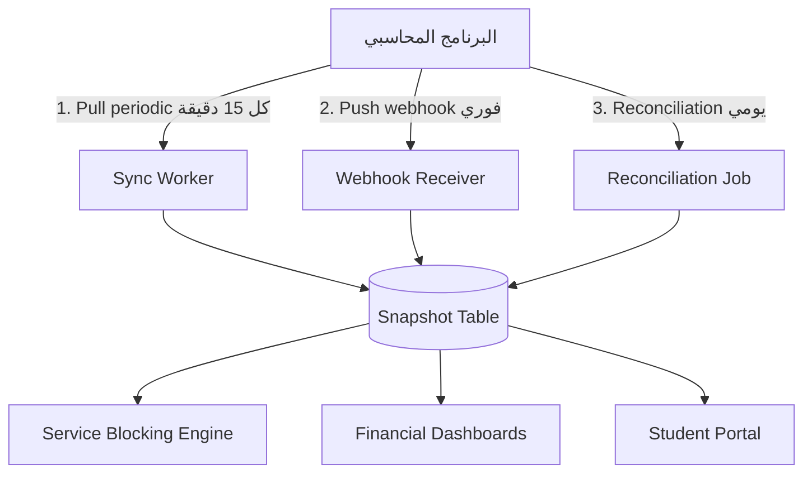
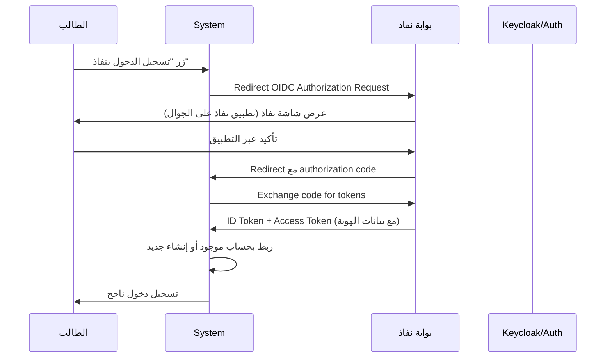
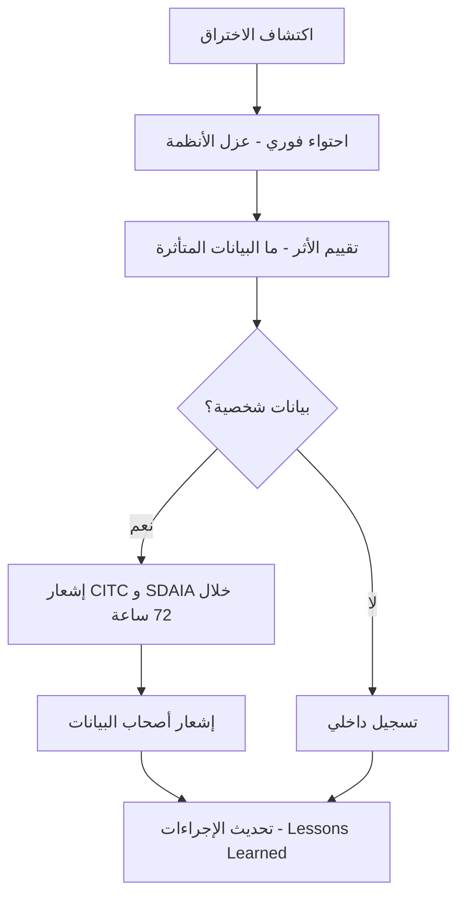
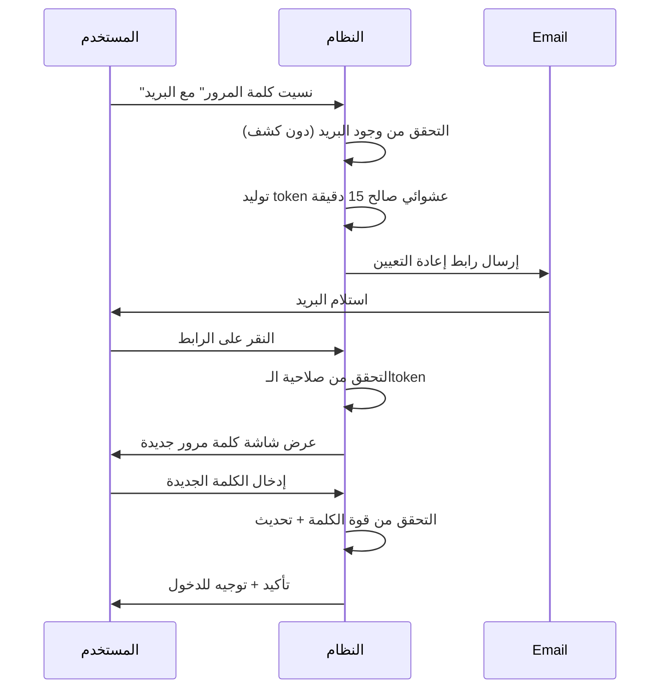
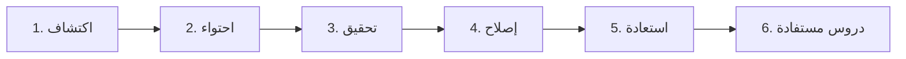
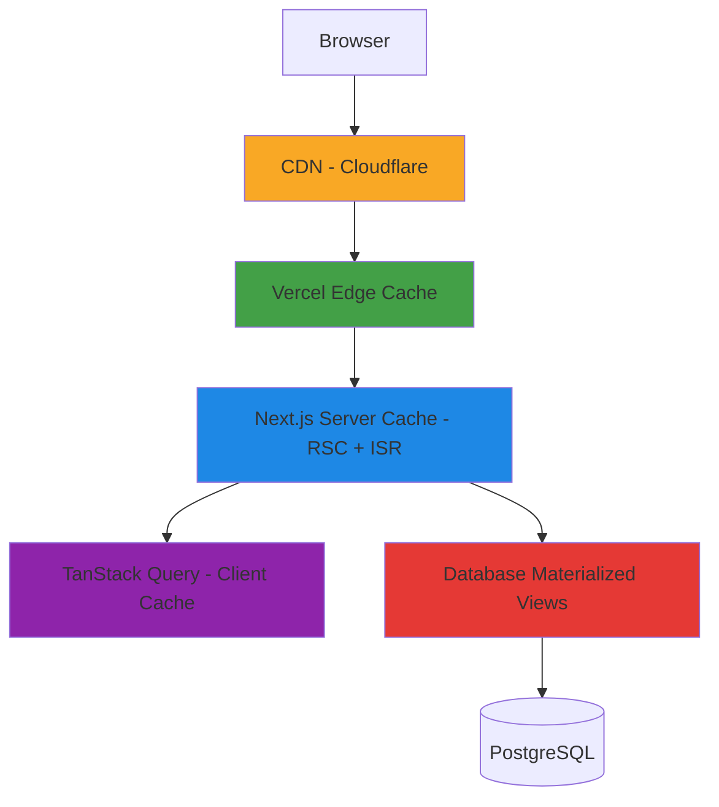
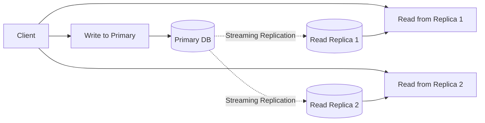

# الجزء الثالث: التكاملات والأمان والأداء

## 13. التكاملات الخارجية (External Integrations)

### 13.1 تكامل البرنامج المحاسبي ⭐

#### 13.1.1 نمط Adapter

البرنامج المحاسبي للمعهد يوفّر API للبيانات المالية. نتعامل معه عبر طبقة **Adapter** معزولة حتى يمكن تبديل البرنامج لاحقاً بدون تعديل المنطق التجاري.

```typescript
// src/server/integrations/accounting/types.ts
export type StudentBalance = {
  studentId: string;
  totalFees: number;
  paidAmount: number;
  remainingAmount: number;
  overdueDays: number;
  lastPaymentDate: Date | null;
  nextDueDate: Date | null;
  currency: 'SAR';
};

export type Payment = {
  id: string;
  studentId: string;
  amount: number;
  paidAt: Date;
  method: 'cash' | 'bank_transfer' | 'card' | 'other';
  reference: string;
  branchId: string;
};

export type BranchRevenue = {
  branchId: string;
  period: { from: Date; to: Date };
  totalCollected: number;
  totalOutstanding: number;
  collectionRate: number; // 0-1
};

export interface IAccountingService {
  getStudentBalance(studentId: string): Promise<StudentBalance>;
  getStudentPayments(studentId: string, since?: Date): Promise<Payment[]>;
  getBranchRevenue(branchId: string, period: { from: Date; to: Date }): Promise<BranchRevenue>;
  verifyWebhookSignature(signature: string, body: string): boolean;
}
```

التنفيذ الفعلي يكون في:

```typescript
// src/server/integrations/accounting/external-adapter.ts
export class ExternalAccountingAdapter implements IAccountingService {
  constructor(private config: AccountingConfig) {}

  async getStudentBalance(studentId: string): Promise<StudentBalance> {
    const cached = await this.cache.get(`balance:${studentId}`);
    if (cached) return cached;

    const response = await this.httpClient.get(`/students/${studentId}/balance`, {
      timeout: 5000,
      retry: { attempts: 3, backoff: 'exponential' },
    });

    const mapped = this.mapToStudentBalance(response.data);
    await this.cache.set(`balance:${studentId}`, mapped, 60 * 15); // 15 min TTL
    return mapped;
  }
  // ...
}
```

#### 13.1.2 الـ Contract المتوقّع من البرنامج المحاسبي (OpenAPI-like)

| Endpoint | Method | الغرض | Cache TTL |
|----------|--------|------|-----------|
| `/students/{id}/balance` | GET | رصيد الطالب الحالي | 15 دقيقة |
| `/students/{id}/payments?since=` | GET | دفعات الطالب | 30 دقيقة |
| `/students/{id}/installments` | GET | جدول الأقساط | 1 ساعة |
| `/branches/{id}/revenue?from=&to=` | GET | تحصيل الفرع لفترة | 1 ساعة |
| `/branches/{id}/outstanding` | GET | المتأخرات | 30 دقيقة |
| `/webhooks/payment` | POST | webhook عند دفعة جديدة | — |
| `/webhooks/refund` | POST | webhook عند استرجاع | — |
| `/health` | GET | فحص الاتصال | — |

#### 13.1.3 استراتيجية التزامن (Sync Strategy)

**ثلاث طبقات للتزامن:**



**1. Pull Periodic (كل 15 دقيقة):**
- Cron job يجلب آخر التحديثات.
- Incremental sync باستخدام `updated_at`.

**2. Push via Webhook (فوري):**
- البرنامج المحاسبي يرسل webhook عند كل دفعة.
- نتحقق من التوقيع، نحدّث الـsnapshot، نُطلق Service Blocking re-evaluation.

**3. Reconciliation Job (يومي):**
- مقارنة كاملة بين الـsnapshot المحلي وبيانات البرنامج المحاسبي.
- اكتشاف أي اختلافات (data drift).
- إشعار الأدمن عند الفروقات.

#### 13.1.4 معالجة الأخطاء

```typescript
// src/server/integrations/accounting/resilience.ts
import { CircuitBreaker } from '@/lib/circuit-breaker';

export const accountingCircuit = new CircuitBreaker({
  threshold: 5,           // 5 أخطاء متتالية
  timeout: 60_000,        // ينفتح لمدة دقيقة
  resetTimeout: 30_000,   // ثم يحاول مرة كل 30 ثانية
});

export async function callAccounting<T>(fn: () => Promise<T>): Promise<T> {
  return accountingCircuit.execute(async () => {
    try {
      return await retry(fn, { attempts: 3, backoff: 'exponential' });
    } catch (err) {
      await deadLetterQueue.enqueue({ fn: fn.name, error: err, timestamp: new Date() });
      throw new IntegrationError('accounting', err);
    }
  });
}
```

#### 13.1.5 جدول الـ Snapshot في Postgres

```sql
CREATE TABLE accounting_snapshot (
  student_id UUID PRIMARY KEY REFERENCES students(id),
  total_fees DECIMAL(12, 2) NOT NULL,
  paid_amount DECIMAL(12, 2) NOT NULL,
  remaining_amount DECIMAL(12, 2) NOT NULL,
  overdue_days INTEGER NOT NULL DEFAULT 0,
  last_payment_date TIMESTAMPTZ,
  next_due_date TIMESTAMPTZ,
  last_synced_at TIMESTAMPTZ NOT NULL DEFAULT NOW(),
  source_version VARCHAR(50)
);

CREATE INDEX idx_snapshot_overdue ON accounting_snapshot(overdue_days)
  WHERE overdue_days > 0;
CREATE INDEX idx_snapshot_synced ON accounting_snapshot(last_synced_at);
```

#### 13.1.6 اختبارات الـ Integration

- **Mock Server** للتطوير المحلي (يحاكي الـAPI الفعلي).
- **Contract Tests** عبر Pact أو schema validation.
- **Recorded VCR Tests** للسيناريوهات الواقعية.

---

### 13.2 WhatsApp Business API

#### 13.2.1 اختيار المزوّد

| المزوّد | المميزات | العيوب | السعر التقريبي |
|---------|---------|--------|------------------|
| **Unifonic** ⭐ | محلي سعودي، دعم عربي، فاتورة بالريال | تكلفة أعلى من Twilio | 0.20-0.40 ريال/رسالة |
| **Twilio** | الأكثر شهرة، توثيق ممتاز | فاتورة بالدولار، دعم محلي محدود | $0.05-0.10/رسالة |
| **Meta Cloud API** | الأرخص (مباشر من Meta) | تعقيد إعداد، لا دعم محلي | $0.03-0.07/رسالة |

**التوصية:** Unifonic للبيئة الإنتاجية، Meta Cloud API للتطوير.

#### 13.2.2 الـ Templates المطلوبة

WhatsApp Business يطلب اعتماد templates مسبقاً (Business Initiated Messages):

| اسم الـ Template | الفئة | المتغيرات |
|-----------------|------|----------|
| `payment_reminder` | UTILITY | {student_name}, {amount}, {due_date} |
| `request_confirmation` | UTILITY | {student_name}, {request_type}, {request_id} |
| `request_status_update` | UTILITY | {request_id}, {old_status}, {new_status} |
| `attendance_warning` | UTILITY | {student_name}, {course_name}, {absence_count} |
| `deprivation_alert` | UTILITY | {student_name}, {reason}, {action_required} |
| `exam_reminder` | UTILITY | {student_name}, {exam_name}, {date}, {time} |
| `certificate_ready` | UTILITY | {student_name}, {certificate_url} |
| `letter_ready` | UTILITY | {student_name}, {letter_type}, {download_url} |

#### 13.2.3 إدارة الـ Session Window (24h)

WhatsApp يميّز بين:
- **Business Initiated** (BI): يحتاج template معتمد، صالح دائماً.
- **User Initiated** (UI): الـ24 ساعة الأولى بعد رسالة الطالب — يمكن إرسال أي محتوى.

```typescript
async function sendWhatsApp(studentId: string, content: WhatsAppContent) {
  const lastUserMessage = await getLastUserMessage(studentId);
  const isInSessionWindow = lastUserMessage &&
    differenceInHours(new Date(), lastUserMessage.timestamp) < 24;

  if (isInSessionWindow) {
    return sendFreeFormMessage(studentId, content);
  } else {
    if (!content.template) {
      throw new Error('Template required outside session window');
    }
    return sendTemplateMessage(studentId, content.template, content.variables);
  }
}
```

#### 13.2.4 جدول `whatsapp_messages`

```sql
CREATE TABLE whatsapp_messages (
  id UUID PRIMARY KEY DEFAULT gen_random_uuid(),
  student_id UUID REFERENCES students(id),
  to_phone VARCHAR(20) NOT NULL,
  template_name VARCHAR(100),
  variables JSONB,
  body TEXT,
  status VARCHAR(20) NOT NULL CHECK (status IN ('queued','sent','delivered','read','failed')),
  provider_message_id VARCHAR(100),
  error_code VARCHAR(50),
  error_detail TEXT,
  sent_at TIMESTAMPTZ,
  delivered_at TIMESTAMPTZ,
  read_at TIMESTAMPTZ,
  created_at TIMESTAMPTZ NOT NULL DEFAULT NOW()
);

CREATE INDEX idx_wa_student ON whatsapp_messages(student_id);
CREATE INDEX idx_wa_status ON whatsapp_messages(status);
```

---

### 13.3 SMS Gateway

#### 13.3.1 المزوّدون السعوديون

| المزوّد | السعر/رسالة | الموثوقية | API |
|---------|--------------|----------|------|
| **Unifonic** | 0.15-0.25 ريال | ممتازة | REST/SOAP |
| **Mobily Business** | 0.12-0.20 ريال | ممتازة | REST |
| **Jawaly** | 0.10-0.18 ريال | جيدة | REST |
| **STC Business** | 0.15-0.30 ريال | ممتازة | REST/SOAP |

**التوصية:** Unifonic أو Mobily Business (لتوحيد بوّابات الاتصال).

#### 13.3.2 الـ Use Cases المحدودة

SMS مكلف نسبياً، يُستخدم فقط لـ:
- OTP للتحقق من رقم الجوال.
- تنبيه حرج (الحرمان، الإيقاف، فك الحجب).
- تأكيد دفعة.
- Fallback عند فشل WhatsApp.

#### 13.3.3 جدول `sms_messages`

```sql
CREATE TABLE sms_messages (
  id UUID PRIMARY KEY DEFAULT gen_random_uuid(),
  student_id UUID REFERENCES students(id),
  to_phone VARCHAR(20) NOT NULL,
  body TEXT NOT NULL,
  status VARCHAR(20) NOT NULL,
  provider VARCHAR(50) NOT NULL,
  provider_message_id VARCHAR(100),
  cost DECIMAL(6, 4),
  sent_at TIMESTAMPTZ,
  delivered_at TIMESTAMPTZ,
  created_at TIMESTAMPTZ NOT NULL DEFAULT NOW()
);
```

---

### 13.4 Email Service

#### 13.4.1 اختيار المزوّد

| المزوّد | المميزات | السعر |
|---------|---------|------|
| **Resend** ⭐ | بسيط، حديث، توثيق ممتاز، React Email | 100 رسالة/يوم مجانية، ثم $20/شهر |
| **AWS SES** | الأرخص للحجم العالي | $0.10 / 1000 رسالة |
| **SendGrid** | الأكثر نضجاً | $19.95+/شهر |

**التوصية:** Resend للبداية، AWS SES إن تجاوز الحجم 100K رسالة شهرياً.

#### 13.4.2 Templates عربية RTL

```tsx
// emails/payment-reminder.tsx
import { Html, Head, Body, Container, Text, Button } from '@react-email/components';

export function PaymentReminderEmail({ studentName, amount, dueDate }: Props) {
  return (
    <Html dir="rtl" lang="ar">
      <Head>
        <style>{`body { font-family: 'Cairo', Arial; direction: rtl; }`}</style>
      </Head>
      <Body>
        <Container>
          <Text>السلام عليكم {studentName}،</Text>
          <Text>نُذكّركم بأن قسطكم المستحق بقيمة {amount} ريال يُسدَّد قبل {dueDate}.</Text>
          <Button href="https://example.sa/portal">سداد الآن</Button>
        </Container>
      </Body>
    </Html>
  );
}
```

**تجنّب فلاتر السبام:** إعداد SPF + DKIM + DMARC على نطاق المعهد.

#### 13.4.3 جدول `email_logs`

```sql
CREATE TABLE email_logs (
  id UUID PRIMARY KEY DEFAULT gen_random_uuid(),
  student_id UUID REFERENCES students(id),
  to_email VARCHAR(255) NOT NULL,
  subject TEXT NOT NULL,
  template_name VARCHAR(100),
  variables JSONB,
  status VARCHAR(20) NOT NULL CHECK (status IN ('queued','sent','delivered','opened','clicked','bounced','complained','failed')),
  provider_id VARCHAR(100),
  opened_at TIMESTAMPTZ,
  clicked_at TIMESTAMPTZ,
  created_at TIMESTAMPTZ NOT NULL DEFAULT NOW()
);
```

---

### 13.5 Nafath SSO (المرحلة الأخيرة)

#### 13.5.1 تكامل OIDC



#### 13.5.2 بنية التسجيل المزدوج

```sql
CREATE TABLE auth_identities (
  user_id UUID NOT NULL REFERENCES users(id) ON DELETE CASCADE,
  provider VARCHAR(50) NOT NULL CHECK (provider IN ('email','nafath','google')),
  provider_user_id VARCHAR(255) NOT NULL,
  metadata JSONB,
  linked_at TIMESTAMPTZ NOT NULL DEFAULT NOW(),
  PRIMARY KEY (provider, provider_user_id)
);

CREATE INDEX idx_auth_identities_user ON auth_identities(user_id);
```

#### 13.5.3 Mock للتطوير

```typescript
// src/server/integrations/nafath/mock.ts
export class NafathMockAdapter implements INafathService {
  async verifyIdentity(nationalId: string): Promise<NafathProfile> {
    if (process.env.NODE_ENV !== 'development') {
      throw new Error('Mock only in development');
    }
    return {
      nationalId,
      fullName: 'محمد بن عبدالله الأحمد',
      birthDate: new Date('1995-03-15'),
      gender: 'M',
      mobileNumber: '+966500000000',
      nationality: 'SA',
    };
  }
}
```

---

### 13.6 طبقة Webhook الواردة

#### 13.6.1 بنية Webhook Receiver موحّدة

```typescript
// src/app/api/webhooks/[provider]/route.ts
export async function POST(req: Request, { params }: { params: { provider: string } }) {
  const signature = req.headers.get('x-webhook-signature');
  const rawBody = await req.text();

  // 1. Verify signature
  const adapter = getAdapter(params.provider);
  if (!adapter.verifyWebhookSignature(signature ?? '', rawBody)) {
    return NextResponse.json({ error: 'Invalid signature' }, { status: 401 });
  }

  // 2. Idempotency check
  const idempotencyKey = req.headers.get('x-idempotency-key');
  if (idempotencyKey && await isAlreadyProcessed(idempotencyKey)) {
    return NextResponse.json({ status: 'already_processed' }, { status: 200 });
  }

  // 3. Enqueue for async processing
  await webhookQueue.enqueue({
    provider: params.provider,
    payload: JSON.parse(rawBody),
    receivedAt: new Date(),
    idempotencyKey,
  });

  return NextResponse.json({ status: 'queued' }, { status: 202 });
}
```

#### 13.6.2 Queue للمعالجة الـ Async

**خيارات:**
- **Supabase pg_cron + pg_net** — الأبسط، يكفي لـ1000 طالب.
- **Inngest** — Cloud queue + retries مدفوع.
- **Trigger.dev** — مفتوح المصدر + Cloud option.

**التوصية:** pg_cron للبداية، الانتقال لـInngest عند تجاوز 100K event/شهر.

---

### 13.7 تنسيق رسائل الخطأ من التكاملات

```typescript
// src/server/integrations/errors.ts
export class IntegrationError extends Error {
  constructor(
    public provider: string,
    public originalError: unknown,
    public severity: 'low' | 'medium' | 'high' | 'critical' = 'medium',
  ) {
    super(`[${provider}] ${originalError}`);
  }
}

// تسجيل في جدول
CREATE TABLE integration_errors (
  id UUID PRIMARY KEY DEFAULT gen_random_uuid(),
  provider VARCHAR(50) NOT NULL,
  endpoint VARCHAR(255),
  error_code VARCHAR(50),
  error_message TEXT,
  severity VARCHAR(20) NOT NULL,
  context JSONB,
  resolved BOOLEAN NOT NULL DEFAULT FALSE,
  created_at TIMESTAMPTZ NOT NULL DEFAULT NOW()
);

CREATE INDEX idx_int_err_unresolved ON integration_errors(provider, created_at)
  WHERE resolved = FALSE;
```

---

## 14. الأمان والامتثال (Security & Compliance)

### 14.1 الامتثال لـ PDPL السعودي

#### 14.1.1 الـ Checklist الكاملة

| # | المتطلب | التنفيذ | المسؤول |
|---|---------|---------|---------|
| 1 | استضافة البيانات داخل المملكة | Self-Hosted Supabase على VPS سعودي (الإنتاج) | المطوّر |
| 2 | الموافقة الصريحة من صاحب البيانات | شاشة Consent عند التسجيل + إمكانية السحب | المطوّر |
| 3 | حق المحو (Right to Erasure) | إجراء حذف موثّق + Audit | الإدارة + المطوّر |
| 4 | حق الوصول (Right to Access) | تصدير بيانات الطالب بصيغة JSON/PDF | المطوّر |
| 5 | تصدير البيانات بصيغة مفتوحة | JSON + Excel + PDF | المطوّر |
| 6 | سجل معالجة البيانات (RoPA) | وثيقة منفصلة محدّثة | الإدارة |
| 7 | DPO (مسؤول حماية البيانات) | تعيين شخص داخل المعهد | المعهد |
| 8 | تشفير البيانات | At-Rest + In-Transit | المطوّر |
| 9 | إشعار الاختراق خلال 72 ساعة | إجراء + جهات الاتصال | الإدارة + المطوّر |
| 10 | اتفاقية معالجة البيانات (DPA) | بين المعهد والمطوّر | قانوني |
| 11 | تحديد فترة الاحتفاظ (Retention) | سياسة + تنفيذ آلي | المعهد + المطوّر |
| 12 | تقليل البيانات (Data Minimization) | جمع ما يلزم فقط | المعهد + المطوّر |
| 13 | تقييم أثر الخصوصية (DPIA) | للأنشطة عالية الخطورة | الإدارة |
| 14 | تدريب الموظفين | جلسة سنوية | المعهد |
| 15 | حماية البيانات الحساسة للأطفال (تحت 18) | موافقة ولي الأمر | المعهد + المطوّر |

#### 14.1.2 تنبيهات حرجة

- ⚠️ **Supabase Cloud** يستضيف في فرانكفورت → غير متوافق مع PDPL للبيانات الحساسة.
- ✅ **التوصية:** Self-Hosted Supabase على VPS سعودي (Hostinger KSA / Aramco / STC Cloud).
- 📅 **خط زمني:** المرحلة 0 = Supabase Free، المرحلة الإنتاج = Self-Hosted KSA.

#### 14.1.3 إجراءات الاختراق المحتمل (Breach Notification)



**جهات الاتصال:**
- CITC (هيئة الاتصالات): 1900
- SDAIA: contact@sdaia.gov.sa
- CERT-SA: cert@cert.gov.sa

---

### 14.2 RBAC الكامل (Role-Based Access Control)

#### 14.2.1 مصفوفة الصلاحيات الكاملة

| المورد | الفعل | Super Admin | Admin | Branch Mgr | Finance | Student Aff | Registration | Teacher | Student |
|--------|------|--------------|-------|-------------|---------|--------------|---------------|---------|---------|
| **Branches** | Read | All | All | Own | All | All | All | Own | — |
| **Branches** | Create/Edit/Delete | ✅ | ✅ | ❌ | ❌ | ❌ | ❌ | ❌ | ❌ |
| **Users** | Read | All | All | Branch | Finance Team | Affairs Team | Reg Team | Self | Self |
| **Users** | Create/Edit | ✅ | ✅ | Branch | ❌ | ❌ | Students | ❌ | Self (limited) |
| **Users** | Delete | ✅ | ✅ | ❌ | ❌ | ❌ | ❌ | ❌ | ❌ |
| **Students** | Read | All | All | Branch | All | All | All | Own classes | Self |
| **Students** | Create | ❌ | ✅ | Branch | ❌ | ✅ | ✅ | ❌ | ❌ |
| **Students** | Edit | ✅ | ✅ | Branch | Financial only | Status only | Profile | ❌ | Profile (limited) |
| **Students** | Delete | ✅ | ❌ | ❌ | ❌ | ❌ | ❌ | ❌ | ❌ |
| **Students** | Change Status | ✅ | ✅ | Branch | Financial | All | ❌ | ❌ | ❌ |
| **Question Bank** | Read | All | All | Branch | ❌ | ❌ | ❌ | Own subjects | ❌ |
| **Question Bank** | Create | ❌ | ❌ | ❌ | ❌ | ❌ | ❌ | ✅ | ❌ |
| **Question Bank** | Approve AI Suggestions | ❌ | ❌ | ❌ | ❌ | ❌ | ❌ | ✅ | ❌ |
| **Exams** | Create | ❌ | ✅ | ❌ | ❌ | ❌ | ❌ | Own subjects | ❌ |
| **Exams** | View Code | ❌ | All | Branch | ❌ | ❌ | ❌ | Own | ❌ |
| **Exams** | Regenerate Code | ❌ | ✅ | ❌ | ❌ | ❌ | ❌ | Own | ❌ |
| **Exam Attempts** | Take Exam | ❌ | ❌ | ❌ | ❌ | ❌ | ❌ | ❌ | Eligible only |
| **Exam Attempts** | View Live | ❌ | All | Branch | ❌ | ❌ | ❌ | Own | ❌ |
| **Grades** | Enter | ❌ | ❌ | ❌ | ❌ | ❌ | ❌ | ✅ | ❌ |
| **Grades** | Approve | ❌ | ✅ | Branch | ❌ | ❌ | ❌ | ❌ | ❌ |
| **Grades** | Bonus/Deduct | ❌ | ✅ | ❌ | ❌ | ❌ | ❌ | ❌ | ❌ |
| **Grades** | View | All | All | Branch | ❌ | ❌ | ❌ | Own subjects | Own (if visible) |
| **Attendance** | Mark | ❌ | ❌ | ❌ | ❌ | ❌ | ❌ | ✅ | ❌ |
| **Attendance** | View | All | All | Branch | ❌ | All | ❌ | Own subjects | Own |
| **Requests** | Create | ❌ | ❌ | ❌ | ❌ | On behalf | ❌ | ❌ | Self |
| **Requests** | Process | ❌ | ✅ | Branch | Finance | ✅ | Own type | ❌ | View only |
| **Requests** | View Audit | ✅ | ✅ | Branch | ❌ | ✅ | ❌ | ❌ | Own |
| **Letters** | Generate | ❌ | ✅ | ❌ | ❌ | ✅ | ❌ | ❌ | ❌ |
| **Letters** | View | All | All | Branch | ❌ | All | ❌ | ❌ | Own |
| **Finance Data** | Read | All | All | Branch | All | View only | ❌ | ❌ | Own balance |
| **Finance Data** | Sync from Accounting | ✅ | ✅ | ❌ | ✅ | ❌ | ❌ | ❌ | ❌ |
| **Service Blocking** | Configure Rules | ✅ | ✅ | ❌ | ❌ | ❌ | ❌ | ❌ | ❌ |
| **Service Blocking** | Manual Unblock | ❌ | ✅ | Branch | ❌ | ❌ | ❌ | ❌ | ❌ |
| **Reports** | Run | All | All | Branch | Finance | Affairs | Reg | Own | Own |
| **Reports** | Export | All | All | Branch | Finance | Affairs | Reg | Own | Own |
| **Settings** | System | ✅ | Limited | ❌ | ❌ | ❌ | ❌ | ❌ | ❌ |
| **Audit Log** | View | ✅ | ✅ | Branch | Finance only | Affairs only | Reg only | ❌ | ❌ |
| **Comprehensive Exam** | Manage | ❌ | ✅ | Branch | ❌ | ✅ | ❌ | ❌ | ❌ |
| **Comprehensive Exam** | Upload Results | ❌ | ✅ | ❌ | ❌ | ✅ | ❌ | ❌ | ❌ |

#### 14.2.2 جدول `permissions` في Postgres

```sql
CREATE TABLE permissions (
  id SERIAL PRIMARY KEY,
  resource VARCHAR(50) NOT NULL,
  action VARCHAR(50) NOT NULL,
  scope VARCHAR(20) NOT NULL CHECK (scope IN ('own', 'branch', 'all')),
  description TEXT,
  created_at TIMESTAMPTZ NOT NULL DEFAULT NOW(),
  UNIQUE(resource, action, scope)
);

CREATE TABLE role_permissions (
  role_id INTEGER NOT NULL REFERENCES roles(id) ON DELETE CASCADE,
  permission_id INTEGER NOT NULL REFERENCES permissions(id) ON DELETE CASCADE,
  PRIMARY KEY (role_id, permission_id)
);
```

#### 14.2.3 استراتيجية RLS

**مثال 1: عزل الطالب لبياناته**

```sql
CREATE POLICY students_self_read
ON students FOR SELECT
USING (
  user_id = auth.uid()
);
```

**مثال 2: عزل المعلم لطلابه**

```sql
CREATE POLICY teacher_view_own_students
ON enrollments FOR SELECT
USING (
  course_id IN (
    SELECT id FROM courses WHERE teacher_id = auth.uid()
  )
);
```

**مثال 3: عزل الفرع**

```sql
CREATE POLICY branch_isolation
ON students FOR SELECT
USING (
  branch_id IN (
    SELECT branch_id FROM user_branches WHERE user_id = auth.uid()
  )
  OR
  EXISTS (
    SELECT 1 FROM users
    WHERE id = auth.uid() AND role = 'super_admin'
  )
);
```

**مثال 4: المالية لا تعدّل الدرجات**

```sql
CREATE POLICY only_teachers_enter_grades
ON grades FOR INSERT
WITH CHECK (
  EXISTS (
    SELECT 1 FROM users
    WHERE id = auth.uid()
      AND role IN ('teacher', 'admin', 'super_admin')
  )
);
```

#### 14.2.4 Middleware في Next.js

```typescript
// src/middleware.ts
import { createMiddlewareClient } from '@supabase/auth-helpers-nextjs';
import { NextResponse } from 'next/server';

const PROTECTED_PATHS: Record<string, string[]> = {
  '/admin': ['super_admin', 'admin'],
  '/finance': ['super_admin', 'admin', 'finance'],
  '/teacher': ['super_admin', 'teacher'],
  '/student': ['student'],
};

export async function middleware(req: NextRequest) {
  const res = NextResponse.next();
  const supabase = createMiddlewareClient({ req, res });
  const { data: { session } } = await supabase.auth.getSession();

  const pathname = req.nextUrl.pathname;
  const requiredRoles = Object.entries(PROTECTED_PATHS).find(([path]) =>
    pathname.startsWith(path),
  )?.[1];

  if (!requiredRoles) return res;
  if (!session) return NextResponse.redirect(new URL('/login', req.url));

  const userRole = session.user.user_metadata.role;
  if (!requiredRoles.includes(userRole)) {
    return NextResponse.redirect(new URL('/403', req.url));
  }

  return res;
}
```

#### 14.2.5 اختبار الصلاحيات

```typescript
// tests/security/rbac.test.ts
describe('RBAC', () => {
  it('teacher cannot delete a student', async () => {
    const { error } = await supabase
      .auth.signInWithPassword({ email: 'teacher@test', password: 'x' });

    const result = await supabase.from('students').delete().eq('id', studentId);
    expect(result.error?.code).toBe('42501'); // permission denied
  });

  it('student cannot view another student profile', async () => {
    await signInAsStudent('student-a');
    const { data } = await supabase.from('students').select().eq('id', 'student-b');
    expect(data).toEqual([]); // RLS blocks
  });
});
```

---

### 14.3 المصادقة (Authentication)

#### 14.3.1 Supabase Auth + 2FA

- **2FA إلزامي** للأدوار:
  - Super Admin
  - Admin
  - Branch Manager
  - Finance
- **2FA اختياري** لباقي الأدوار.
- استخدام TOTP عبر Google Authenticator / Authy.

```typescript
// تفعيل 2FA
const { data, error } = await supabase.auth.mfa.enroll({
  factorType: 'totp',
  friendlyName: 'Authenticator',
});
// data.totp.qr_code → عرضه للمستخدم
// data.totp.secret → احتفظ به مؤقتاً
```

#### 14.3.2 استراتيجية كلمات المرور

| المعيار | القيمة |
|---------|--------|
| Hash Algorithm | Argon2id (افتراضي Supabase) |
| Min Length | 12 حرف |
| Complexity | حرف كبير + صغير + رقم + رمز |
| History | منع آخر 5 كلمات مرور |
| Rotation | اختياري كل 6 أشهر للأدوار الإدارية |

#### 14.3.3 Lockout Policy

```typescript
// 5 محاولات فاشلة → قفل 15 دقيقة
const MAX_ATTEMPTS = 5;
const LOCKOUT_DURATION = 15 * 60 * 1000; // 15 min

async function recordFailedAttempt(userId: string) {
  const attempts = await redis.incr(`login_attempts:${userId}`);
  await redis.expire(`login_attempts:${userId}`, 900);

  if (attempts >= MAX_ATTEMPTS) {
    await redis.set(`account_locked:${userId}`, '1', 'EX', 900);
    await notifyUser(userId, 'account_locked');
  }
}
```

#### 14.3.4 Session Management

| العنصر | القيمة |
|--------|--------|
| JWT Access Token | 1 ساعة |
| Refresh Token | 7 أيام (rolling) |
| Idle Timeout | 30 دقيقة |
| Absolute Session | 24 ساعة (مدير/مالية) / 7 أيام (طالب) |
| Cookie Flags | `Secure`, `HttpOnly`, `SameSite=Strict` |

#### 14.3.5 Password Reset Flow



---

### 14.4 التشفير (Encryption)

#### 14.4.1 At-Rest

- **Supabase Storage:** AES-256 مفعّل افتراضياً.
- **Postgres TDE:** على VPS سعودي (LUKS أو PostgreSQL pgcrypto).
- **Backups:** مشفّرة مع مفتاح منفصل (KMS).

#### 14.4.2 In-Transit

- **TLS 1.3 إلزامي** عبر Cloudflare.
- **HSTS** مع `max-age=31536000`.
- **Certificate Pinning** للموبايل (إن وُجد لاحقاً).

#### 14.4.3 Column-Level Encryption

للحقول الحساسة جداً:

```sql
-- استخدام pgcrypto
CREATE EXTENSION IF NOT EXISTS pgcrypto;

-- تشفير رقم الهوية
ALTER TABLE students ADD COLUMN national_id_encrypted BYTEA;

UPDATE students
SET national_id_encrypted = pgp_sym_encrypt(national_id, current_setting('app.encryption_key'))
WHERE national_id IS NOT NULL;

-- استخدام في الاستعلام
SELECT pgp_sym_decrypt(national_id_encrypted, current_setting('app.encryption_key'))::TEXT AS national_id
FROM students WHERE id = $1;
```

#### 14.4.4 Key Rotation Policy

| المفتاح | فترة الدوران |
|---------|-------------|
| TLS Certificates | تلقائي عبر Let's Encrypt (90 يوم) |
| JWT Signing Keys | كل 6 أشهر |
| Database Encryption Keys | كل سنة |
| Backup Encryption Keys | كل سنة |
| API Integration Keys | كل 3 أشهر |

---

### 14.5 Audit Log الكامل

#### 14.5.1 بنية جدول `audit_log`

```sql
CREATE TABLE audit_log (
  id BIGSERIAL PRIMARY KEY,
  user_id UUID REFERENCES users(id),
  user_role VARCHAR(50),
  branch_id UUID REFERENCES branches(id),
  action VARCHAR(100) NOT NULL,
  resource_type VARCHAR(50) NOT NULL,
  resource_id UUID,
  before_state JSONB,
  after_state JSONB,
  ip_address INET,
  user_agent TEXT,
  request_id UUID,
  reason TEXT,
  created_at TIMESTAMPTZ NOT NULL DEFAULT NOW()
) PARTITION BY RANGE (created_at);

-- Partitions شهرية
CREATE TABLE audit_log_2026_05 PARTITION OF audit_log
  FOR VALUES FROM ('2026-05-01') TO ('2026-06-01');
```

#### 14.5.2 العمليات الحساسة الواجبة التسجيل

| العملية | الحقول المسجلة | الإلزام |
|---------|----------------|---------|
| تغيير حالة الطالب | before/after status, reason | ✅ |
| فك الحجب | service blocked, reason, duration | ✅ |
| تعديل درجة معتمدة | before/after grade, justification | ✅ |
| حذف أي سجل | full record snapshot | ✅ |
| تغيير صلاحيات | role/permission diff | ✅ |
| استدعاء API محاسبي | endpoint, params, response status | ✅ |
| إصدار خطاب | letter type, recipient | ✅ |
| تحويل طلب | from/to department, reason | ✅ |
| محاولة فاشلة للدخول | username, IP, attempt count | ✅ |
| تصدير بيانات حساسة | resource, count, user | ✅ |

#### 14.5.3 Trigger في Postgres

```sql
CREATE OR REPLACE FUNCTION log_student_status_change()
RETURNS TRIGGER AS $$
BEGIN
  IF NEW.status IS DISTINCT FROM OLD.status THEN
    INSERT INTO audit_log (
      user_id, action, resource_type, resource_id,
      before_state, after_state, created_at
    ) VALUES (
      auth.uid(),
      'student_status_change',
      'student',
      NEW.id,
      jsonb_build_object('status', OLD.status),
      jsonb_build_object('status', NEW.status, 'reason', NEW.status_change_reason),
      NOW()
    );
  END IF;
  RETURN NEW;
END;
$$ LANGUAGE plpgsql;

CREATE TRIGGER audit_student_status
AFTER UPDATE ON students
FOR EACH ROW EXECUTE FUNCTION log_student_status_change();
```

#### 14.5.4 Retention Policy

- **فترة الاحتفاظ:** سنتان للسجلات العادية، 7 سنوات للسجلات المالية.
- **الأرشفة:** نقل السجلات الأقدم من سنة إلى Cold Storage (S3 Glacier).
- **الحذف الآمن:** بعد فترة الاحتفاظ، الحذف الفعلي (لا soft delete).

#### 14.5.5 واجهة البحث في Audit Log

```typescript
// واجهة الأدمن للبحث
interface AuditLogQuery {
  userId?: string;
  resourceType?: string;
  action?: string;
  fromDate?: Date;
  toDate?: Date;
  branchId?: string;
  page: number;
  pageSize: number;
}
```

---

### 14.6 حماية تطبيق الويب (Web App Security)

#### 14.6.1 OWASP Top 10 Mitigations

| الثغرة | الحماية في النظام |
|--------|------------------------|
| **A01 Broken Access Control** | RLS + Middleware + Permission Tests |
| **A02 Cryptographic Failures** | TLS 1.3 + Argon2 + Column Encryption |
| **A03 Injection** | Parameterized queries (Supabase JS) + Zod validation |
| **A04 Insecure Design** | Threat Modeling + Code Review |
| **A05 Security Misconfiguration** | Hardened headers + Disabled debug in prod |
| **A06 Vulnerable Components** | `npm audit` في CI + Snyk + Dependabot |
| **A07 Auth & Session Failures** | 2FA + Lockout + Strong sessions |
| **A08 Software & Data Integrity** | SHA-256 hashes للخطابات + Signed commits |
| **A09 Logging & Monitoring** | Audit Log + Sentry + Vercel Logs |
| **A10 SSRF** | URL allowlist للـ external integrations |

#### 14.6.2 Headers أمنية

```typescript
// next.config.js
const securityHeaders = [
  { key: 'Strict-Transport-Security', value: 'max-age=31536000; includeSubDomains; preload' },
  { key: 'X-Frame-Options', value: 'DENY' },
  { key: 'X-Content-Type-Options', value: 'nosniff' },
  { key: 'Referrer-Policy', value: 'strict-origin-when-cross-origin' },
  { key: 'Permissions-Policy', value: 'camera=(), microphone=(), geolocation=()' },
  {
    key: 'Content-Security-Policy',
    value: [
      "default-src 'self'",
      "script-src 'self' 'unsafe-inline' https://cdn.jsdelivr.net",
      "style-src 'self' 'unsafe-inline' https://fonts.googleapis.com",
      "font-src 'self' https://fonts.gstatic.com",
      "img-src 'self' data: https:",
      "connect-src 'self' https://*.supabase.co https://api.unifonic.com",
      "frame-ancestors 'none'",
    ].join('; '),
  },
];
```

#### 14.6.3 Rate Limiting

```typescript
// src/middleware/rate-limit.ts
import { Ratelimit } from '@upstash/ratelimit';
import { Redis } from '@upstash/redis';

const limiters = {
  auth: new Ratelimit({
    redis: Redis.fromEnv(),
    limiter: Ratelimit.slidingWindow(5, '15 m'), // 5 attempts / 15 min
  }),
  api: new Ratelimit({
    redis: Redis.fromEnv(),
    limiter: Ratelimit.slidingWindow(100, '1 m'), // 100 req / min
  }),
  export: new Ratelimit({
    redis: Redis.fromEnv(),
    limiter: Ratelimit.slidingWindow(10, '1 h'),
  }),
};
```

#### 14.6.4 CAPTCHA

- استخدام **Cloudflare Turnstile** (مجاني، يحترم الخصوصية).
- يفعّل بعد محاولتين فاشلتين.

#### 14.6.5 File Upload Security

```typescript
const ALLOWED_TYPES = {
  image: ['image/jpeg', 'image/png', 'image/webp'],
  pdf: ['application/pdf'],
  excel: ['application/vnd.openxmlformats-officedocument.spreadsheetml.sheet'],
};

const MAX_SIZES = {
  image: 5 * 1024 * 1024,    // 5MB
  pdf: 10 * 1024 * 1024,     // 10MB
  excel: 5 * 1024 * 1024,    // 5MB
};

async function validateUpload(file: File, category: 'image' | 'pdf' | 'excel') {
  // 1. Size check
  if (file.size > MAX_SIZES[category]) {
    throw new ValidationError('FILE_TOO_LARGE');
  }
  // 2. MIME type check (via magic bytes, not just extension)
  const buffer = await file.arrayBuffer();
  const detectedType = await fileTypeFromBuffer(buffer);
  if (!ALLOWED_TYPES[category].includes(detectedType?.mime ?? '')) {
    throw new ValidationError('INVALID_FILE_TYPE');
  }
  // 3. Virus scan (optional - ClamAV via worker)
  if (process.env.ENABLE_VIRUS_SCAN === 'true') {
    await virusScanService.scan(buffer);
  }
}
```

---

### 14.7 حماية الاختبارات (Exam Security)

3 طبقات (تفصيلها في الجزء الثاني):

#### 14.7.1 الطبقة الأساسية (مفعّلة دائماً)
- خلط ترتيب الأسئلة والإجابات لكل طالب.
- حفظ تلقائي كل 15-30 ثانية.
- تسجيل IP, User Agent, جهاز الدخول.
- توقيع الإجابة عند التسليم (SHA-256).

#### 14.7.2 الطبقة المتوسطة (اختياري للمعلم)
- وضع ملء الشاشة الإجباري (Fullscreen API).
- كشف تبديل التبويب (Visibility API).
- منع النسخ واللصق (onCopy, onPaste handlers).
- منع الكليك يمين (oncontextmenu).
- IP Lock لمدى معيّن (للحضوري).
- Browser Fingerprinting (مكتبة `@fingerprintjs/fingerprintjs`).

#### 14.7.3 الطبقة المتقدمة
- المراقبة الحية من المعلم (Supabase Realtime).
- لقطات شاشة دورية (Proctoring) — اختياري.
- AI Anomaly Detection لاحقاً.

---

### 14.8 النسخ الاحتياطي والاستعادة

#### 14.8.1 استراتيجية النسخ

| النسخة | التكرار | الاحتفاظ |
|--------|---------|----------|
| Daily Full | يومياً 02:00 | 30 يوم |
| Hourly Incremental | كل ساعة | 7 أيام |
| Weekly Archive | كل أحد | 12 أسبوع |
| Monthly Cold | أول كل شهر | 7 سنوات |
| Yearly Compliance | 31 ديسمبر | 10 سنوات |

#### 14.8.2 RTO و RPO

| المعيار | القيمة | الشرح |
|---------|--------|------|
| **RTO** | 4 ساعات | الحد الأقصى لزمن الاستعادة بعد الكارثة |
| **RPO** | 1 ساعة | الحد الأقصى لفقدان البيانات (من آخر نسخة) |
| **MTTR** | 30 دقيقة | متوسط زمن الإصلاح للأعطال العادية |

#### 14.8.3 اختبار الاستعادة

- **ربع سنوي:** Restore Drill على بيئة منفصلة.
- **توثيق النتائج:** Runbook محدّث.
- **التدريب:** فريق التشغيل مدرّب على الاستعادة.

#### 14.8.4 التخزين الجغرافي

- **النسخة الأساسية:** VPS سعودي (الرياض).
- **النسخة الثانية:** VPS سعودي ثانٍ (جدة) — Cross-region replication.
- **النسخة طويلة الأمد:** S3 Glacier (مشفّر، مع KMS).

---

### 14.9 خطة حادث الاختراق (Incident Response Plan)

#### 14.9.1 خطوات الاستجابة



| المرحلة | الإجراء | المدة المستهدفة |
|---------|--------|------------------|
| اكتشاف (Detect) | Alert من Sentry / مراقبة يدوية | < 15 دقيقة |
| احتواء (Contain) | عزل النظام المصاب، تعطيل الـsessions | < 1 ساعة |
| تحقيق (Investigate) | تحديد النطاق والأثر | < 4 ساعات |
| إصلاح (Eradicate) | إزالة السبب الجذري | < 24 ساعة |
| استعادة (Recover) | إعادة النظام للعمل | < 4 ساعات (RTO) |
| دروس (Lessons) | تقرير + تحديث الإجراءات | خلال أسبوع |

#### 14.9.2 جهات الاتصال

| الجهة | متى نتصل بها |
|------|---------------|
| **CERT-SA** | cert@cert.gov.sa | حوادث الأمن السيبراني الكبيرة |
| **SDAIA** | contact@sdaia.gov.sa | اختراق بيانات شخصية |
| **CITC** | 1900 | اختراق نظام اتصالات |
| **Supabase Support** | support@supabase.com | مشاكل قاعدة البيانات |
| **Vercel Support** | support@vercel.com | مشاكل الاستضافة |
| **Cloudflare** | dash.cloudflare.com/support | هجمات DDoS |

#### 14.9.3 اتصال العميل خلال 72 ساعة

عند اختراق بيانات شخصية:
1. إشعار CITC و SDAIA رسمياً خلال 72 ساعة.
2. إشعار الطلاب المتأثرين خلال 72 ساعة.
3. نشر بيان رسمي إن طُلب.
4. توفير دعم للطلاب المتأثرين.

---

## 15. الأداء وقابلية التوسع (Performance & Scalability)

### 15.1 متطلبات الأداء (NFR Performance Targets)

| المعيار | الهدف (p95) | الهدف (p99) | الفشل |
|---------|---------------|---------------|--------|
| **Page Load (Landing)** | < 1.5s | < 2.5s | > 4s |
| **Page Load (Dashboard)** | < 2s | < 3s | > 5s |
| **API Response (Read)** | < 300ms | < 500ms | > 1s |
| **API Response (Write)** | < 1s | < 2s | > 3s |
| **Database Query** | < 100ms | < 200ms | > 500ms |
| **PDF Generation (Letter)** | < 3s | < 5s | > 10s |
| **Excel Export (1K rows)** | < 5s | < 8s | > 15s |
| **Concurrent Users (Peak)** | 200 | 300 | 500 |
| **Uptime SLA** | 99.5% (شهرياً) | 99.9% (سنوياً) | < 99% |

---

### 15.2 استراتيجية Caching متعددة الطبقات



#### 15.2.1 CDN Edge (Cloudflare)
- الأصول الثابتة (JS, CSS, fonts, images).
- TTL: 1 سنة للأصول المُهَشَّمة (hashed).
- Page Rules للـregional caching.

#### 15.2.2 Vercel Edge Cache
- Static pages (ISR).
- Image Optimization.
- Edge Functions output.

#### 15.2.3 Next.js Server Cache
```typescript
// Revalidate كل 5 دقائق
export const revalidate = 300;

// أو on-demand
import { revalidatePath, revalidateTag } from 'next/cache';
revalidatePath('/admin/students');
revalidateTag('students-list');
```

#### 15.2.4 TanStack Query (Client)
```typescript
useQuery({
  queryKey: ['students', branchId],
  queryFn: () => fetchStudents(branchId),
  staleTime: 5 * 60 * 1000,    // 5 min
  gcTime: 10 * 60 * 1000,       // 10 min
});
```

#### 15.2.5 Database Materialized Views
```sql
CREATE MATERIALIZED VIEW branch_kpis AS
SELECT
  branch_id,
  COUNT(*) FILTER (WHERE status = 'active') AS active_students,
  COUNT(*) FILTER (WHERE status = 'suspended_financial') AS suspended_count,
  AVG(CASE WHEN status = 'graduated' THEN final_gpa END) AS avg_gpa
FROM students
GROUP BY branch_id;

-- Refresh كل 15 دقيقة
SELECT cron.schedule(
  'refresh-branch-kpis',
  '*/15 * * * *',
  $$REFRESH MATERIALIZED VIEW CONCURRENTLY branch_kpis$$
);
```

---

### 15.3 تحسين قاعدة البيانات (Database Optimization)

#### 15.3.1 Indexes الإلزامية

```sql
-- Students
CREATE INDEX idx_students_branch ON students(branch_id);
CREATE INDEX idx_students_status ON students(status);
CREATE INDEX idx_students_status_branch ON students(status, branch_id);
CREATE INDEX idx_students_national_id ON students(national_id);
CREATE INDEX idx_students_program ON students(program_id);

-- Enrollments
CREATE INDEX idx_enrollments_student ON enrollments(student_id);
CREATE INDEX idx_enrollments_course ON enrollments(course_id);
CREATE INDEX idx_enrollments_active ON enrollments(student_id, course_id)
  WHERE status = 'active';

-- Exams
CREATE INDEX idx_exams_course ON exams(course_id);
CREATE INDEX idx_exams_active_window ON exams(starts_at, ends_at)
  WHERE published = TRUE;

-- Exam Attempts
CREATE INDEX idx_attempts_exam_student ON exam_attempts(exam_id, student_id);
CREATE INDEX idx_attempts_status ON exam_attempts(status);
CREATE INDEX idx_attempts_submitted ON exam_attempts(submitted_at)
  WHERE submitted_at IS NOT NULL;

-- Requests
CREATE INDEX idx_requests_student ON requests(student_id);
CREATE INDEX idx_requests_status ON requests(status);
CREATE INDEX idx_requests_assigned ON requests(assigned_dept, status)
  WHERE status != 'closed';

-- Attendance
CREATE INDEX idx_attendance_student_date ON attendance(student_id, date);
CREATE INDEX idx_attendance_course_date ON attendance(course_id, date);
CREATE INDEX idx_attendance_absent ON attendance(student_id, course_id)
  WHERE status = 'absent';

-- Accounting Snapshot
CREATE INDEX idx_snapshot_overdue ON accounting_snapshot(overdue_days)
  WHERE overdue_days > 0;
CREATE INDEX idx_snapshot_synced ON accounting_snapshot(last_synced_at);

-- Service Blocks
CREATE INDEX idx_blocks_student ON service_blocks(student_id)
  WHERE active = TRUE;
CREATE INDEX idx_blocks_service ON service_blocks(service_type)
  WHERE active = TRUE;

-- Audit Log
CREATE INDEX idx_audit_user_date ON audit_log(user_id, created_at);
CREATE INDEX idx_audit_resource ON audit_log(resource_type, resource_id);
CREATE INDEX idx_audit_action ON audit_log(action, created_at);
```

#### 15.3.2 Query Optimization

```sql
-- استخدم EXPLAIN ANALYZE لكل استعلام بطيء
EXPLAIN (ANALYZE, BUFFERS)
SELECT s.*, ab.remaining_amount
FROM students s
LEFT JOIN accounting_snapshot ab ON ab.student_id = s.id
WHERE s.branch_id = $1 AND s.status = 'active'
ORDER BY ab.overdue_days DESC NULLS LAST
LIMIT 50;
```

**القواعد الذهبية:**
- ✅ Index على كل عمود في WHERE / ORDER BY.
- ✅ Avoid `SELECT *` — حدد الأعمدة.
- ✅ استخدم `LIMIT` دائماً للقوائم.
- ✅ استخدم `EXISTS` بدل `IN` للـsubqueries الكبيرة.
- ✅ `JSONB` operators (`@>`, `?`) مع GIN index.

#### 15.3.3 Connection Pooling

Supabase Pooler (PgBouncer) إلزامي:

```typescript
// .env.local
DATABASE_URL=postgres://...?pgbouncer=true&pool_mode=transaction
DIRECT_URL=postgres://... # للـmigrations فقط
```

| الإعداد | القيمة |
|---------|--------|
| Pool Mode | Transaction |
| Pool Size | 20 (للبداية) → 50 |
| Max Connections | 100 |
| Idle Timeout | 10 دقائق |

#### 15.3.4 Partitioning للجداول الضخمة

```sql
-- Audit Log: شهرياً
CREATE TABLE audit_log (
  ...
) PARTITION BY RANGE (created_at);

-- Exam Answers: سنوياً
CREATE TABLE exam_answers (
  ...
) PARTITION BY RANGE (created_at);

-- Attendance: شهرياً (محتمل)
CREATE TABLE attendance (
  ...
) PARTITION BY RANGE (date);
```

#### 15.3.5 Vacuum + Analyze

```sql
-- ضبط autovacuum للجداول النشطة
ALTER TABLE attendance SET (
  autovacuum_vacuum_scale_factor = 0.05,
  autovacuum_analyze_scale_factor = 0.02
);

-- Vacuum يدوي ليلي للجداول الكبيرة
SELECT cron.schedule('vacuum-audit', '0 3 * * *', $$VACUUM ANALYZE audit_log$$);
```

---

### 15.4 Code Splitting و Lazy Loading

#### 15.4.1 Next.js Dynamic Imports

```typescript
// مكوّن ثقيل مع dynamic import
import dynamic from 'next/dynamic';

const ExamCharts = dynamic(() => import('@/features/exams/ExamCharts'), {
  loading: () => <Skeleton />,
  ssr: false,
});

const PdfPreview = dynamic(() => import('@/features/letters/PdfPreview'), {
  loading: () => <p>جارٍ تحميل المعاينة...</p>,
});
```

#### 15.4.2 Route-Based Splitting

تلقائي في Next.js App Router — كل route يصبح bundle منفصل.

#### 15.4.3 Image Optimization

```tsx
import Image from 'next/image';

<Image
  src="/students/avatar.jpg"
  alt="صورة الطالب"
  width={64}
  height={64}
  placeholder="blur"
  blurDataURL={blurDataUrl}
  loading="lazy"
/>
```

#### 15.4.4 Font Loading

```typescript
// src/app/layout.tsx
import { Cairo } from 'next/font/google';

const cairo = Cairo({
  subsets: ['arabic'],
  display: 'swap',
  variable: '--font-cairo',
  preload: true,
});

export default function RootLayout({ children }) {
  return (
    <html lang="ar" dir="rtl" className={cairo.variable}>
      <body className="font-cairo">{children}</body>
    </html>
  );
}
```

---

### 15.5 Realtime Performance

#### 15.5.1 استخدام مدروس

```typescript
// ✅ صحيح: للـDashboards الحية فقط
const channel = supabase
  .channel('exam-monitoring')
  .on('postgres_changes', {
    event: 'UPDATE',
    schema: 'public',
    table: 'exam_attempts',
    filter: `exam_id=eq.${examId}`,
  }, handleUpdate)
  .subscribe();

// ❌ خطأ: تشغيله على صفحات لا تحتاجه
```

#### 15.5.2 Throttling

```typescript
import { throttle } from 'lodash-es';

const throttledUpdate = throttle((event) => {
  setExamData(event.new);
}, 1000); // مرة واحدة بالثانية كحد أقصى
```

#### 15.5.3 Pagination

```typescript
// كل قائمة ≥ 20 صف يجب أن تكون مرقّمة
const PAGE_SIZE = 20;

const { data, count } = await supabase
  .from('students')
  .select('*', { count: 'exact' })
  .range(page * PAGE_SIZE, (page + 1) * PAGE_SIZE - 1);
```

---

### 15.6 استراتيجية Multi-Branch Performance

#### 15.6.1 Index على branch_id في كل الجداول

كل جدول مرتبط بفرع يحتاج index على `branch_id`:

```sql
CREATE INDEX idx_students_branch ON students(branch_id);
CREATE INDEX idx_attendance_branch ON attendance(branch_id);
CREATE INDEX idx_requests_branch ON requests(branch_id);
-- ... كل جدول
```

#### 15.6.2 Partial Indexes حسب الفرع

للفروع الكبيرة، partial indexes تحسّن الأداء:

```sql
CREATE INDEX idx_students_taif_active
  ON students(created_at)
  WHERE branch_id = 'branch-a-uuid' AND status = 'active';
```

#### 15.6.3 الاستعلامات مفلترة دائماً بـbranch_id

```typescript
// ✅ صحيح
const { data } = await supabase
  .from('students')
  .select()
  .eq('branch_id', currentUser.branchId)
  .eq('status', 'active');

// ❌ خطأ: قد يستعلم على كل الفروع (وإن كان RLS يحمي)
const { data } = await supabase.from('students').select();
```

---

### 15.7 المراقبة والـ Telemetry

#### 15.7.1 الأدوات

| الأداة | الغرض |
|--------|------|
| **Sentry** | Error tracking + Performance monitoring |
| **Vercel Analytics** | Real User Monitoring (RUM) |
| **Supabase Dashboard** | DB metrics + Slow queries |
| **UptimeRobot** | Uptime + Response time |
| **Cloudflare Analytics** | Traffic + Cache hit ratio |
| **Custom Dashboards** | KPIs خاصة بالمشروع |

#### 15.7.2 Custom KPIs

```typescript
// تسجيل KPIs مخصصة
import * as Sentry from '@sentry/nextjs';

export async function logKpi(name: string, value: number, tags: Record<string, string>) {
  Sentry.captureMessage(`kpi.${name}`, {
    level: 'info',
    tags,
    extra: { value },
  });
}

// أمثلة
logKpi('exam_submission_time_ms', 1245, { exam_id: 'xyz' });
logKpi('letter_generation_time_ms', 2300, { letter_type: 'intro' });
logKpi('accounting_sync_duration_ms', 5400, { sync_type: 'full' });
```

#### 15.7.3 Alerts

```yaml
# قواعد التنبيه
alerts:
  - name: high_error_rate
    condition: error_rate > 5% over 5min
    notify: [admin@example.sa, +966500000000]
    channels: [email, whatsapp]

  - name: db_slow_query
    condition: query_p95 > 500ms over 10min
    notify: [dev@example.sa]

  - name: accounting_sync_failure
    condition: 3 consecutive failures
    notify: [admin@, finance@]
    severity: critical

  - name: site_down
    condition: uptime_check fails
    notify: [admin@, on-call@]
    severity: critical
```

---

### 15.8 خطة الاستضافة المتطورة

| المرحلة | Frontend | Backend | DB | الموارد | التكلفة الشهرية |
|---------|----------|---------|------|---------|------------------|
| **MVP** | Vercel Free | Supabase Free | Supabase Free (500MB) | 1 GB RAM, 0.5 GB DB | **0 ريال** |
| **Beta** | Vercel Pro | Supabase Pro | Supabase Pro (8GB) | 2 GB RAM, 8 GB DB | **~170 ريال** ($45) |
| **Production** | Vercel Pro | Self-Hosted Supabase | VPS سعودي | 4 GB RAM, 100 GB SSD | **~250 ريال** |
| **Growth** | Vercel Pro | Self-Hosted Cluster | VPS سعودي + Read Replica | 8 GB RAM, 250 GB SSD | **~500 ريال** |

---

### 15.9 خطة قابلية التوسع

#### 15.9.1 التوسع الأفقي للـ Frontend

- Vercel auto-scales (لا تدخّل).
- Edge Functions تتوسّع تلقائياً.

#### 15.9.2 التوسع العمودي للـ Database

| الفئة | المستخدمون المتزامنون | المواصفات |
|------|-------------------------|------------|
| Small | < 50 | 2 vCPU, 4 GB RAM |
| Medium | 50-200 | 4 vCPU, 8 GB RAM |
| Large | 200-500 | 8 vCPU, 16 GB RAM |
| XL | 500-1000 | 16 vCPU, 32 GB RAM |

#### 15.9.3 Read Replicas



عند الوصول لـ:
- 1,000 req/min → Read Replica 1.
- 5,000 req/min → Read Replica 2.
- 10,000+ req/min → Multi-Region أو Multi-Tenant.

#### 15.9.4 استراتيجية للوصول لـ 10,000+ طالب

- **Multi-Tenancy** (معاهد متعددة).
- Database Sharding بـ`tenant_id`.
- Microservices لفصل الموديولات الثقيلة (PDF Generation, AI Integration).
- Queue-based architecture للعمليات الـasync.
- CDN عالمي.

---

**انتهى الجزء الثالث.**
