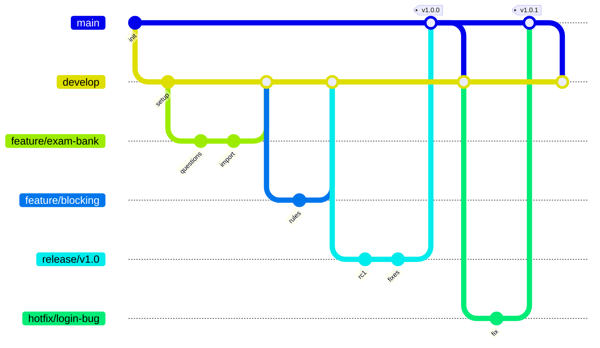
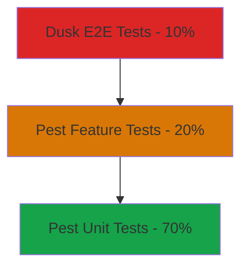
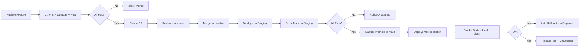
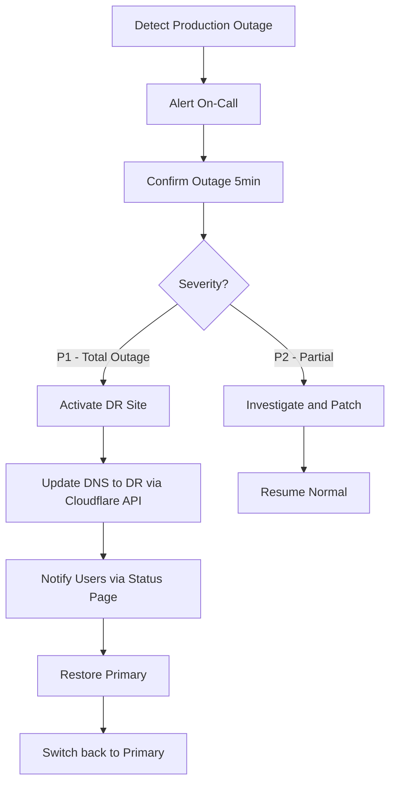

# الجزء الرابع: معايير التطوير والـ DevOps

> **المشروع:** نظام إدارة معهد IIMS
> **Stack:** Laravel 11 + Filament 3 + Livewire 3 + PostgreSQL 15
> **التاريخ:** 2026-05-15

## 16. معايير البرمجة (Coding Standards)

### 16.1 معايير PHP 8.3

#### 16.1.1 PSR-12 + Laravel Conventions

نلتزم بـ **PSR-12** كأساس + **Laravel Coding Standards** (Pint default preset) كطبقة فوقه.

**القواعد الحرجة:**

- ✅ Type Declarations إلزامية على كل parameter و return type.
- ✅ `declare(strict_types=1);` في كل ملف (يضيفه Pint تلقائياً).
- ✅ Readonly properties حيث أمكن (PHP 8.1+).
- ✅ Promoted Constructor Parameters (PHP 8.0+).
- ✅ Enums للقيم الثابتة (PHP 8.1+).
- ✅ Named Arguments للوضوح في الـ callsites.
- ❌ ممنوع `mixed` بلا مبرر — استخدم Union Types أو generics-via-PHPStan.
- ❌ ممنوع `var_dump`/`dd`/`die` في الكود المرسل.

#### 16.1.2 Strict Types + Type Safety

```php
<?php

declare(strict_types=1);

namespace App\Services\Grading;

use App\Models\Question;

final class GradingService
{
    public function __construct(
        private readonly GraderFactory $factory,
    ) {}

    public function grade(Question $question, array $response): float
    {
        $grader = $this->factory->for($question->type);
        return $grader->grade($question, $response);
    }
}
```

#### 16.1.3 Naming Conventions

| العنصر | النمط | مثال |
|--------|------|------|
| Classes | `PascalCase` | `StudentResource`, `ExamGenerator` |
| Interfaces | `PascalCase` + `Interface` suffix | `AccountingServiceInterface` |
| Abstract Classes | `Abstract` prefix أو descriptive | `AbstractGrader` |
| Traits | `PascalCase` + `able` أو descriptive | `Searchable`, `HasUlids` |
| Methods | `camelCase` | `calculateGpa()`, `evaluateForStudent()` |
| Properties | `camelCase` | `public string $fullName` |
| Constants | `SCREAMING_SNAKE_CASE` | `MAX_EXAM_ATTEMPTS` |
| Enums | `PascalCase` + cases `PascalCase` | `enum Status { case Active; }` |
| Files (PHP classes) | `PascalCase.php` | `StudentService.php` |
| Files (Migrations) | `snake_case.php` | `2026_05_15_create_students_table.php` |
| DB Tables | `snake_case_plural` | `exam_attempts` |
| DB Columns | `snake_case` | `created_at`, `branch_id` |
| Routes (URI) | `kebab-case` | `/student-affairs/requests` |
| Route Names | `snake_case` بفواصل `.` | `students.show`, `requests.update` |
| Config keys | `snake_case` | `config('services.accounting.api_key')` |
| Views (Blade) | `kebab-case.blade.php` | `intro-letter.blade.php` |
| Env Variables | `SCREAMING_SNAKE_CASE` | `ACCOUNTING_API_KEY` |

#### 16.1.4 PHP Enums للقيم الثابتة

```php
<?php
// app/Enums/StudentStatus.php
namespace App\Enums;

enum StudentStatus: string
{
    case Registered = 'registered';
    case Active = 'active';
    case LateFinancial = 'late_financial';
    case SuspendedFinancial = 'suspended_financial';
    case DeprivedFees = 'deprived_fees';
    case DeprivedAttendance = 'deprived_attendance';
    case Withdrawn = 'withdrawn';
    case Deferred = 'deferred';
    case Graduated = 'graduated';

    public function labelAr(): string
    {
        return match ($this) {
            self::Registered => 'مسجل',
            self::Active => 'منتظم',
            self::LateFinancial => 'متأخر مالياً',
            self::SuspendedFinancial => 'موقوف مالياً',
            self::DeprivedFees => 'محروم بسبب الرسوم',
            self::DeprivedAttendance => 'محروم بسبب الغياب',
            self::Withdrawn => 'منسحب',
            self::Deferred => 'مؤجل',
            self::Graduated => 'متخرج',
        };
    }

    public function color(): string
    {
        return match ($this) {
            self::Active, self::Graduated => 'success',
            self::Registered, self::Deferred => 'gray',
            self::LateFinancial => 'warning',
            self::SuspendedFinancial, self::DeprivedFees, self::DeprivedAttendance => 'danger',
            self::Withdrawn => 'gray',
        };
    }
}
```

#### 16.1.5 Service Class جيد vs سيء

```php
// ❌ Service سيء — Logic داخل Controller
class StudentController extends Controller
{
    public function store(Request $request)
    {
        $request->validate([...]);
        $student = Student::create($request->all());
        Mail::to($student->email)->send(new WelcomeMail);
        Cache::forget('students.list');
        Log::info('Student created');
        return response()->json($student);
    }
}

// ✅ Service جيد — منطق معزول + Action class
class StudentController extends Controller
{
    public function __construct(
        private readonly CreateStudentAction $action,
    ) {}

    public function store(StoreStudentRequest $request): JsonResponse
    {
        $student = $this->action->execute($request->validated());
        return new StudentResource($student)->response()->setStatusCode(201);
    }
}

// app/Actions/Students/CreateStudentAction.php
final class CreateStudentAction
{
    public function __construct(
        private readonly StudentRegistry $registry,
    ) {}

    public function execute(array $data): Student
    {
        return DB::transaction(function () use ($data) {
            $student = Student::create($data);

            event(new StudentCreated($student));

            return $student->fresh();
        });
    }
}
```

#### 16.1.6 منع `mixed` و`null` العشوائي

```php
// ❌ خطأ
public function process($data): mixed
{
    return $data->foo ?? null;
}

// ✅ صحيح — Union Type + DTO
public function process(StudentData $data): ?Student
{
    if (! $data->isValid()) return null;
    return Student::create($data->toArray());
}
```

---

### 16.2 معايير Laravel

#### 16.2.1 Models — Slim & Configured

```php
<?php
// app/Models/Student.php
namespace App\Models;

use App\Enums\StudentStatus;
use App\Models\Scopes\BranchScope;
use Illuminate\Database\Eloquent\Concerns\HasUuids;
use Illuminate\Database\Eloquent\Model;
use Illuminate\Database\Eloquent\SoftDeletes;
use Spatie\Activitylog\LogOptions;
use Spatie\Activitylog\Traits\LogsActivity;
use Spatie\MediaLibrary\HasMedia;
use Spatie\MediaLibrary\InteractsWithMedia;

final class Student extends Model implements HasMedia
{
    use HasUuids, SoftDeletes, LogsActivity, InteractsWithMedia;

    protected $guarded = [];

    protected function casts(): array
    {
        return [
            'birth_date' => 'date',
            'enrolled_at' => 'date',
            'graduated_at' => 'date',
            'national_id_encrypted' => 'encrypted',
            'metadata' => 'array',
            'status' => StudentStatus::class,
        ];
    }

    protected static function booted(): void
    {
        static::addGlobalScope(new BranchScope);
    }

    public function getActivitylogOptions(): LogOptions
    {
        return LogOptions::defaults()
            ->logOnly(['status', 'branch_id', 'enrollment_type'])
            ->logOnlyDirty()
            ->dontSubmitEmptyLogs();
    }

    // Relationships
    public function branch() { return $this->belongsTo(Branch::class); }
    public function user() { return $this->belongsTo(User::class); }
    public function enrollments() { return $this->hasMany(Enrollment::class); }
    public function accountingSnapshot() { return $this->hasOne(AccountingSnapshot::class); }
    public function activeBlocks() { return $this->hasMany(ServiceBlock::class)->where('is_active', true); }
}
```

#### 16.2.2 Controllers — Thin & Single-Responsibility

```php
<?php
// app/Http/Controllers/StudentController.php
namespace App\Http\Controllers;

use App\Actions\Students\{CreateStudentAction, UpdateStudentAction};
use App\Http\Requests\Students\{StoreStudentRequest, UpdateStudentRequest};
use App\Http\Resources\StudentResource;
use App\Models\Student;
use Illuminate\Http\JsonResponse;

final class StudentController extends Controller
{
    public function index(): JsonResponse
    {
        $students = Student::query()
            ->with(['branch:id,name_ar', 'accountingSnapshot:student_id,remaining_amount,overdue_days'])
            ->paginate(20);

        return StudentResource::collection($students)->response();
    }

    public function show(Student $student): StudentResource
    {
        $this->authorize('view', $student);
        return new StudentResource($student->load(['branch', 'enrollments.course']));
    }

    public function store(StoreStudentRequest $request, CreateStudentAction $action): StudentResource
    {
        $student = $action->execute($request->validated());
        return new StudentResource($student);
    }

    public function update(UpdateStudentRequest $request, Student $student, UpdateStudentAction $action): StudentResource
    {
        $this->authorize('update', $student);
        $action->execute($student, $request->validated());
        return new StudentResource($student->fresh());
    }

    public function destroy(Student $student): JsonResponse
    {
        $this->authorize('delete', $student);
        $student->delete();
        return response()->json(null, 204);
    }
}
```

#### 16.2.3 Form Requests — كل Validation معزولة

```php
<?php
// app/Http/Requests/Students/StoreStudentRequest.php
namespace App\Http\Requests\Students;

use Illuminate\Foundation\Http\FormRequest;
use Illuminate\Validation\Rule;

final class StoreStudentRequest extends FormRequest
{
    public function authorize(): bool
    {
        return $this->user()->can('create', \App\Models\Student::class);
    }

    public function rules(): array
    {
        return [
            'full_name_ar' => ['required', 'string', 'min:5', 'max:100'],
            'national_id' => ['required', 'regex:/^[12][0-9]{9}$/'],
            'phone' => ['required', 'regex:/^(05|\+9665|9665)[0-9]{8}$/'],
            'email' => ['nullable', 'email', 'max:255'],
            'birth_date' => ['nullable', 'date', 'before:' . now()->subYears(16)->toDateString()],
            'gender' => ['required', 'in:male,female'],
            'branch_id' => ['required', 'uuid', 'exists:branches,id'],
            'enrollment_type' => ['required', Rule::in(['onsite', 'remote', 'hybrid'])],
        ];
    }

    public function messages(): array
    {
        return [
            'national_id.regex' => 'رقم الهوية يجب أن يبدأ بـ1 أو 2 ويتكون من 10 أرقام',
            'phone.regex' => 'رقم جوال سعودي غير صحيح',
            'birth_date.before' => 'العمر يجب ألا يقل عن 16 سنة',
        ];
    }
}
```

#### 16.2.4 Filament Resources — Standard Pattern

```php
<?php
// app/Filament/Admin/Resources/StudentResource.php
namespace App\Filament\Admin\Resources;

use App\Enums\StudentStatus;
use App\Models\Student;
use Filament\Forms;
use Filament\Forms\Form;
use Filament\Resources\Resource;
use Filament\Tables;
use Filament\Tables\Table;

class StudentResource extends Resource
{
    protected static ?string $model = Student::class;
    protected static ?string $navigationIcon = 'heroicon-o-academic-cap';
    protected static ?string $modelLabel = 'طالب';
    protected static ?string $pluralModelLabel = 'الطلاب';

    public static function form(Form $form): Form
    {
        return $form->schema([
            Forms\Components\TextInput::make('full_name_ar')
                ->label('الاسم الكامل')
                ->required()
                ->maxLength(100),

            Forms\Components\TextInput::make('national_id')
                ->label('رقم الهوية')
                ->required()
                ->unique(ignoreRecord: true)
                ->regex('/^[12][0-9]{9}$/'),

            Forms\Components\Select::make('branch_id')
                ->label('الفرع')
                ->relationship('branch', 'name_ar')
                ->required(),

            Forms\Components\Select::make('status')
                ->label('الحالة')
                ->options(collect(StudentStatus::cases())
                    ->mapWithKeys(fn ($s) => [$s->value => $s->labelAr()]))
                ->required(),
        ]);
    }

    public static function table(Table $table): Table
    {
        return $table
            ->columns([
                Tables\Columns\TextColumn::make('student_number')->searchable()->sortable(),
                Tables\Columns\TextColumn::make('full_name_ar')->searchable(),
                Tables\Columns\TextColumn::make('branch.name_ar')->label('الفرع'),
                Tables\Columns\TextColumn::make('status')
                    ->badge()
                    ->color(fn (StudentStatus $state) => $state->color())
                    ->formatStateUsing(fn (StudentStatus $state) => $state->labelAr()),
                Tables\Columns\TextColumn::make('enrolled_at')->date()->sortable(),
            ])
            ->filters([
                Tables\Filters\SelectFilter::make('branch')->relationship('branch', 'name_ar'),
                Tables\Filters\SelectFilter::make('status')
                    ->options(collect(StudentStatus::cases())
                        ->mapWithKeys(fn ($s) => [$s->value => $s->labelAr()])),
            ])
            ->actions([
                Tables\Actions\ViewAction::make(),
                Tables\Actions\EditAction::make(),
            ]);
    }
}
```

#### 16.2.5 Livewire Components

```php
<?php
// app/Livewire/Student/RequestForm.php
namespace App\Livewire\Student;

use App\Actions\Requests\CreateRequestAction;
use App\Enums\RequestType;
use App\Models\Student;
use Livewire\Attributes\Computed;
use Livewire\Attributes\Validate;
use Livewire\Component;

final class RequestForm extends Component
{
    #[Validate('required|in:intro_letter,study_proof,training_letter,withdrawal')]
    public string $type = '';

    #[Validate('required|string|min:10|max:500')]
    public string $reason = '';

    public array $attachments = [];

    #[Computed]
    public function student(): Student
    {
        return auth()->user()->student;
    }

    public function submit(CreateRequestAction $action): void
    {
        $this->validate();

        $request = $action->execute(
            student: $this->student,
            data: [
                'type' => $this->type,
                'reason' => $this->reason,
                'attachments' => $this->attachments,
            ],
        );

        $this->reset();
        $this->dispatch('request-created', requestId: $request->id);
        session()->flash('success', 'تم تقديم طلبك بنجاح');
    }

    public function render()
    {
        return view('livewire.student.request-form');
    }
}
```

#### 16.2.6 منع N+1 (Eager Loading)

```php
// ❌ خطأ — N+1
$students = Student::all();
foreach ($students as $student) {
    echo $student->branch->name_ar;  // query لكل طالب
}

// ✅ صحيح — Eager Loading
$students = Student::with('branch:id,name_ar')->get();
foreach ($students as $student) {
    echo $student->branch->name_ar;
}

// ✅ أفضل — تفعيل preventLazyLoading في dev
// app/Providers/AppServiceProvider.php
use Illuminate\Database\Eloquent\Model;

Model::preventLazyLoading(! $this->app->isProduction());
```

---

### 16.3 معايير CSS (Tailwind 3 + Filament Design Tokens)

#### 16.3.1 يأتي Tailwind مع Filament

Filament يأتي بـ Tailwind 3 + design system كامل. نحن نمد التكوين فقط حسب الحاجة:

```js
// tailwind.config.js
import preset from './vendor/filament/support/tailwind.config.preset';

export default {
    presets: [preset],
    content: [
        './app/Filament/**/*.php',
        './resources/views/**/*.blade.php',
        './vendor/filament/**/*.blade.php',
        './app/Livewire/**/*.php',
    ],
    theme: {
        extend: {
            colors: {
                primary: {
                    50: '#ECFDF5',
                    100: '#D1FAE5',
                    500: '#10B981',
                    600: '#059669',
                    700: '#047857',
                    800: '#065F46',
                    900: '#064E3B',
                },
                accent: {
                    DEFAULT: '#D4A574',
                    light: '#E8C9A0',
                    dark: '#B58853',
                },
            },
            fontFamily: {
                sans: ['Cairo', 'IBM Plex Sans Arabic', 'system-ui', 'sans-serif'],
            },
        },
    },
};
```

#### 16.3.2 منع `style` inline في Blade

```blade
{{-- ❌ خطأ --}}
<div style="padding: 16px; color: #065F46;">...</div>

{{-- ✅ صحيح --}}
<div class="p-4 text-primary-800">...</div>
```

#### 16.3.3 RTL Strategy عبر Logical Properties

Filament يعرف الـ RTL تلقائياً عبر `<html dir="rtl">`. نحن نستخدم **Logical Properties** بدلاً من physical:

```blade
{{-- ❌ خطأ (يكسر في RTL) --}}
<div class="ml-4 pl-2 border-l text-left">

{{-- ✅ صحيح (Logical Properties) --}}
<div class="ms-4 ps-2 border-s text-start">

{{-- التحويلات: --}}
{{-- ml-* → ms-* (margin-inline-start) --}}
{{-- mr-* → me-* (margin-inline-end) --}}
{{-- pl-* → ps-* --}}
{{-- pr-* → pe-* --}}
{{-- text-left → text-start --}}
{{-- text-right → text-end --}}
{{-- border-l → border-s --}}
{{-- rounded-l-* → rounded-s-* --}}
```

#### 16.3.4 Mobile-First Responsive

```blade
{{-- ✅ نبدأ بالموبايل --}}
<div class="grid grid-cols-1 md:grid-cols-2 lg:grid-cols-3 gap-4">

{{-- Breakpoints (نفسها مع Filament): --}}
{{-- sm: 640px (هاتف) --}}
{{-- md: 768px (تابلت) --}}
{{-- lg: 1024px (لابتوب) --}}
{{-- xl: 1280px (شاشة كبيرة) --}}
{{-- 2xl: 1536px (شاشة ضخمة) --}}
```

#### 16.3.5 Filament Component Customization

```blade
{{-- resources/views/filament/components/student-status-badge.blade.php --}}
@props(['status'])

<x-filament::badge :color="$status->color()">
    {{ $status->labelAr() }}
</x-filament::badge>
```

---

### 16.4 معايير Eloquent + PostgreSQL

#### 16.4.1 الفصل بين القراءة والكتابة

```php
// config/database.php
'pgsql' => [
    'driver' => 'pgsql',
    'read' => [
        'host' => [env('DB_READ_HOST_1'), env('DB_READ_HOST_2')],
    ],
    'write' => [
        'host' => env('DB_WRITE_HOST'),
    ],
    'sticky' => true,
    'port' => env('DB_PORT', 5432),
    'database' => env('DB_DATABASE'),
    'username' => env('DB_USERNAME'),
    'password' => env('DB_PASSWORD'),
    // ...
],
```

#### 16.4.2 منع كشف Sensitive Data في Routes

```php
// ❌ خطأ — كشف user_id في URL مفتوح
Route::get('/admin/users/{id}', [UserController::class, 'show']);

// ✅ صحيح — Route Model Binding مع Policy
Route::get('/admin/users/{user}', [UserController::class, 'show'])
    ->middleware(['auth', 'can:view,user']);
```

#### 16.4.3 Database Transactions للعمليات المركّبة

```php
DB::transaction(function () use ($student, $data) {
    $student->update(['status' => StudentStatus::Withdrawn]);
    StudentStatusHistory::create([
        'student_id' => $student->id,
        'from_status' => $student->getOriginal('status'),
        'to_status' => StudentStatus::Withdrawn->value,
        'reason' => $data['reason'],
        'changed_by' => auth()->id(),
    ]);
    $student->activeBlocks()->update(['is_active' => false]);
});
```

#### 16.4.4 Database Notifications & Indexes

- ✅ Index على كل `branch_id` و `student_id`.
- ✅ GIN Index على JSONB columns مع `jsonb_path_ops`.
- ✅ Partial indexes للـ `WHERE deleted_at IS NULL`.
- ✅ Full-Text Search عبر `to_tsvector('arabic', ...)`.

---

### 16.5 معايير الـ Forms (Form Request + Livewire)

#### 16.5.1 Schema-First مع Form Request

```php
<?php
// app/Http/Requests/Students/StoreStudentRequest.php
namespace App\Http\Requests\Students;

use Illuminate\Foundation\Http\FormRequest;
use Illuminate\Validation\Rules\Password;

final class StoreStudentRequest extends FormRequest
{
    public function authorize(): bool
    {
        return $this->user()->can('create', \App\Models\Student::class);
    }

    public function rules(): array
    {
        return [
            'full_name_ar' => ['required', 'string', 'min:5', 'max:100'],
            'national_id' => ['required', 'regex:/^[12][0-9]{9}$/'],
            'phone' => ['required', 'regex:/^(05|\+9665|9665)[0-9]{8}$/'],
            'email' => ['nullable', 'email', 'max:255'],
            'branch_id' => ['required', 'uuid', 'exists:branches,id'],
            'program_id' => ['required', 'uuid', 'exists:programs,id'],
            'guardian.name' => ['nullable', 'string', 'min:3'],
            'guardian.relation' => ['nullable', 'in:father,mother,brother,sister,spouse,other'],
            'guardian.phone' => ['nullable', 'regex:/^(05|\+9665|9665)[0-9]{8}$/'],
        ];
    }
}
```

#### 16.5.2 Livewire Form Validation

```php
<?php
// app/Livewire/Forms/EnrollmentForm.php
namespace App\Livewire\Forms;

use Livewire\Attributes\Validate;
use Livewire\Form;

class EnrollmentForm extends Form
{
    #[Validate('required|string|min:5|max:100')]
    public string $fullName = '';

    #[Validate('required|regex:/^[12][0-9]{9}$/')]
    public string $nationalId = '';

    #[Validate('required|regex:/^(05|\+9665|9665)[0-9]{8}$/')]
    public string $phone = '';

    #[Validate('nullable|email')]
    public ?string $email = null;

    #[Validate('required|uuid|exists:branches,id')]
    public string $branchId = '';

    #[Validate('required|accepted')]
    public bool $consentPdpl = false;

    public function rules(): array
    {
        return [
            'fullName' => ['required', 'string', 'min:5', 'max:100'],
            // ...
        ];
    }
}
```

#### 16.5.3 Action Class للـ Mutations

```php
<?php
// app/Actions/Students/CreateStudentAction.php
namespace App\Actions\Students;

use App\Models\Student;
use App\Events\StudentEnrolled;
use Illuminate\Support\Facades\DB;

final class CreateStudentAction
{
    public function execute(array $data): Student
    {
        return DB::transaction(function () use ($data) {
            $student = Student::create($data);

            event(new StudentEnrolled($student));

            return $student->fresh();
        });
    }
}
```

---

### 16.6 معايير الأخطاء

#### 16.6.1 Custom Exception Classes

```php
<?php
// app/Exceptions/AppException.php
namespace App\Exceptions;

use RuntimeException;

abstract class AppException extends RuntimeException
{
    public function __construct(
        public readonly string $appCode,
        string $message,
        public readonly int $statusCode = 500,
        public readonly mixed $details = null,
        ?\Throwable $previous = null,
    ) {
        parent::__construct($message, 0, $previous);
    }

    public function render(): \Illuminate\Http\JsonResponse
    {
        return response()->json([
            'error' => [
                'code' => $this->appCode,
                'message' => $this->getMessage(),
                'details' => $this->details,
            ],
        ], $this->statusCode);
    }
}

// app/Exceptions/ServiceBlockedException.php
final class ServiceBlockedException extends AppException
{
    public function __construct(string $service, $blocks)
    {
        parent::__construct(
            appCode: 'SERVICE_BLOCKED',
            message: "الخدمة محجوبة: {$service}",
            statusCode: 403,
            details: ['service' => $service, 'blocks' => $blocks],
        );
    }
}

// app/Exceptions/ValidationException.php  (custom على Laravel's)
// app/Exceptions/NotFoundException.php
// app/Exceptions/IntegrationException.php
```

#### 16.6.2 Filament Notifications للمستخدم

```php
use Filament\Notifications\Notification;

// ✅ رسائل واضحة بالعربية
Notification::make()
    ->title('تم حفظ الطالب بنجاح')
    ->success()
    ->send();

Notification::make()
    ->title('فشل حفظ البيانات')
    ->body('حاول مرة أخرى. إذا استمرت المشكلة، اتصل بالدعم.')
    ->danger()
    ->send();

// ❌ منع الرسائل التقنية
Notification::make()
    ->title('Database connection failed: ECONNREFUSED')  // 🚨
    ->send();
```

#### 16.6.3 Sentry Integration

```php
// config/sentry.php
return [
    'dsn' => env('SENTRY_LARAVEL_DSN'),
    'traces_sample_rate' => 0.1,  // 10% للأداء
    'send_default_pii' => false,   // PDPL
    'before_send' => function (\Sentry\Event $event): ?\Sentry\Event {
        // إزالة بيانات حساسة
        $event->setUser(null);
        return $event;
    },
];

// في bootstrap/app.php (Laravel 11)
->withExceptions(function (Exceptions $exceptions) {
    $exceptions->reportable(function (\Throwable $e) {
        if (app()->bound('sentry')) {
            \Sentry\Laravel\Integration::captureUnhandledException($e);
        }
    });
})
```

---

### 16.7 معايير الـ i18n / RTL

#### 16.7.1 Laravel Localization

```php
// lang/ar/students.php
return [
    'title' => 'إدارة الطلاب',
    'create' => 'إضافة طالب جديد',
    'fields' => [
        'full_name' => 'الاسم الكامل',
        'national_id' => 'رقم الهوية',
        'phone' => 'رقم الجوال',
    ],
    'status' => [
        'active' => 'منتظم',
        'suspended_financial' => 'موقوف مالياً',
        'graduated' => 'متخرج',
    ],
];

// الاستخدام في Blade
{{ __('students.title') }}
{{ __('students.fields.full_name') }}

// الاستخدام في PHP
__('students.title');
trans('students.fields.full_name');
```

#### 16.7.2 Filament Translations

```bash
php artisan vendor:publish --tag=filament-panels-translations
php artisan vendor:publish --tag=filament-tables-translations
php artisan vendor:publish --tag=filament-forms-translations
```

نُحدّث ملفات `lang/ar/filament-*.php` حسب الحاجة.

#### 16.7.3 منع Hard-coded Strings في الواجهة

```blade
{{-- ❌ خطأ --}}
<button>حفظ</button>

{{-- ✅ صحيح --}}
<button>{{ __('common.save') }}</button>
```

في Filament:

```php
Forms\Components\TextInput::make('name')
    ->label(__('students.fields.full_name'));  // ✅
```

#### 16.7.4 اختبار RTL

كل component يجب أن يُختبر في RTL:
- التحقق من الـlayout (الأيقونات، النصوص، الأسهم).
- التحقق من الـscrolling.
- التحقق من tooltip positioning.

---

### 16.8 توثيق الكود

#### 16.8.1 PHPDoc للـ Public APIs

```php
<?php

namespace App\Services\Diplomas;

use App\Models\Student;
use App\Exceptions\NotFoundException;

/**
 * يحسب المعدل التراكمي للطالب.
 */
final class GpaCalculator
{
    /**
     * يحسب المعدل التراكمي للطالب بناءً على درجات المواد المعتمدة فقط.
     *
     * @param  Student  $student  الطالب
     * @return float  المعدل من 0 إلى 100
     * @throws NotFoundException  إذا لم توجد درجات معتمدة
     */
    public function calculate(Student $student): float
    {
        $grades = $student->approvedGrades();
        if ($grades->isEmpty()) {
            throw new NotFoundException('لا توجد درجات معتمدة لهذا الطالب');
        }

        $totalWeight = $grades->sum(fn ($g) => (float) $g->weight);
        $weightedSum = $grades->sum(fn ($g) => (float) $g->score * (float) $g->weight);

        return round($weightedSum / $totalWeight, 2);
    }
}
```

#### 16.8.2 README لكل Service Module

```markdown
# Service: Accounting Integration

## Overview
طبقة Adapter للتكامل مع البرنامج المحاسبي الخارجي عبر REST API...

## Key Files
- `app/Services/Accounting/Contracts/AccountingServiceInterface.php` — الواجهة
- `app/Services/Accounting/ExternalAccountingService.php` — التنفيذ الفعلي
- `app/Services/Accounting/MockAccountingService.php` — للتطوير المحلي
- `app/Jobs/Accounting/SyncStudentBalancesJob.php` — Sync periodic

## Database Tables
- `accounting_snapshots`, `accounting_sync_log`

## Environment Variables
- `ACCOUNTING_API_URL`
- `ACCOUNTING_API_KEY`
- `ACCOUNTING_WEBHOOK_SECRET`

## Testing
```bash
./vendor/bin/pest tests/Feature/Accounting
```
```

#### 16.8.3 ADRs (Architecture Decision Records)

```markdown
# ADR-001: اختيار Laravel + Filament بدلاً من Next.js + Supabase

## السياق
الخطة الأصلية كانت Next.js 14 + Supabase. بعد مراجعة الفريق ومتطلبات العميل،
تم اتخاذ قرار التحول إلى Laravel + Filament + Livewire + PostgreSQL.

## القرار
- **Laravel 11** كإطار backend.
- **Filament 3** كـ Admin Panel.
- **Livewire 3** للتفاعلات.
- **PostgreSQL 15** على VPS سعودي مباشرة.

## النتائج
- ✅ سرعة تطوير عالية مع Filament (CRUD جاهز).
- ✅ مجتمع PHP في السعودية أكبر من مجتمع Next.js.
- ✅ ملكية كاملة للبنية التحتية (VPS سعودي مباشر، لا تبعية على مزود سحابي خارجي).
- ✅ PDPL compliant افتراضياً (بيانات داخل المملكة).
- ✅ تكلفة استضافة أقل (لا حاجة لـ Vercel + Supabase Pro).

## البدائل المرفوضة
- Next.js + Supabase: تبعية على Vercel + Frankfurt servers (PDPL issues).
- Symfony + EasyAdmin: مجتمع أصغر، أقل في الـ packages الجاهزة.
```

#### 16.8.4 منع التعليقات الزائدة

```php
// ❌ تعليق زائد
// زيادة العداد بواحد
$counter++;

// ❌ تعليق يكرر اسم الدالة
// دالة حساب المعدل
public function calculateGpa() { }

// ✅ تعليق يشرح "لماذا"
// نستخدم Cache::tags للسماح بإبطال جماعي عند تحديث أي طالب في الفرع
return Cache::tags(['students', "branch:{$branchId}"])
    ->remember(...);
```

---

### 16.9 Laravel Pint + PHPStan (Larastan) Config

#### 16.9.1 `pint.json`

```json
{
    "preset": "laravel",
    "rules": {
        "declare_strict_types": true,
        "final_class": false,
        "global_namespace_import": {
            "import_classes": true,
            "import_constants": false,
            "import_functions": false
        },
        "ordered_imports": {
            "sort_algorithm": "alpha"
        },
        "no_unused_imports": true,
        "single_quote": true,
        "binary_operator_spaces": {
            "default": "single_space"
        }
    }
}
```

#### 16.9.2 `phpstan.neon`

```neon
includes:
    - vendor/larastan/larastan/extension.neon

parameters:
    paths:
        - app
        - config
        - database
        - routes
    level: 6
    ignoreErrors:
        - '#PHPDoc tag @var#'
    excludePaths:
        - vendor
        - bootstrap
        - storage
    checkOctaneCompatibility: true
    checkModelProperties: true
```

#### 16.9.3 Pre-commit via composer + Captain Hook

```json
// composer.json
{
    "scripts": {
        "lint": "vendor/bin/pint",
        "lint:check": "vendor/bin/pint --test",
        "stan": "vendor/bin/phpstan analyse --memory-limit=2G",
        "test": "vendor/bin/pest",
        "test:coverage": "vendor/bin/pest --coverage --min=80",
        "ci": [
            "@lint:check",
            "@stan",
            "@test"
        ]
    }
}
```

`.git/hooks/pre-commit` (أو عبر `captainhook/captainhook`):

```sh
#!/bin/sh
composer ci
```

#### 16.9.4 PR Check Failing — مثال

```yaml
# .github/workflows/ci.yml — failed example
✗ Laravel Pint
  app/Services/Accounting/ExternalAccountingService.php
    23  no_unused_imports

✗ Larastan
  app/Models/Student.php:45
    Access to undefined property App\Models\Student::$foo.

✗ Pest Tests
  ✗ it calculates GPA correctly
    Failed asserting that 4.5 is equal to 4.3
```

---

## 17. استراتيجية Git (Branching Strategy)

### 17.1 نموذج Branching المقترح

نستخدم نسخة مبسّطة من **GitFlow** ملائمة لمشروع متوسط:



### 17.2 الـ Branches

| الـ Branch | الغرض | محمي؟ |
|----------|------|--------|
| `main` | Production-ready | ✅ نعم |
| `develop` | Integration branch | ✅ نعم |
| `feature/*` | تطوير ميزة جديدة | ❌ لا |
| `bugfix/*` | إصلاح خطأ | ❌ لا |
| `hotfix/*` | إصلاح حرج في production | ❌ لا |
| `release/*` | تجهيز إصدار | ✅ نعم |

### 17.3 Naming Conventions

```
feature/IIMS-123-exam-question-bank
bugfix/IIMS-456-grade-approval-not-saving
hotfix/IIMS-789-login-fails-after-deploy
release/v1.2.0
```

**القواعد:**
- ✅ lowercase + kebab-case.
- ✅ يبدأ بـticket number (مثلاً IIMS-123).
- ✅ وصف موجز (3-5 كلمات).
- ❌ لا مسافات أو أحرف خاصة.

### 17.4 Commit Messages (Conventional Commits)

```
<type>(<scope>): <description>

[optional body in Arabic or English]

[optional footer]
```

**الأنواع المسموحة:**

| Type | الاستخدام |
|------|-----------|
| `feat` | ميزة جديدة |
| `fix` | إصلاح خطأ |
| `refactor` | إعادة هيكلة بدون تغيير سلوك |
| `docs` | توثيق |
| `test` | إضافة/تعديل اختبارات |
| `chore` | تحديث dependencies, configs |
| `perf` | تحسين أداء |
| `style` | تنسيق فقط (مسافات، فواصل) |
| `ci` | تعديل CI/CD |
| `build` | تعديل composer/npm scripts |

**أمثلة:**

```bash
feat(exams): add question bank import from Excel
fix(blocking): unblock action not saving reason field
refactor(workflow): extract state machine to spatie/laravel-model-states
docs(readme): update Laravel Sail setup instructions
test(grades): add tests for GPA calculator
chore(deps): bump laravel/framework to 11.10
perf(students): add index on branch_id for faster queries
ci(github-actions): add Larastan check on PRs
build(composer): require spatie/laravel-data
```

### 17.5 Pull Request Workflow

#### 17.5.1 PR Template

```markdown
# .github/pull_request_template.md

## الوصف
<!-- ما الذي يحلّه هذا الـPR؟ -->

## نوع التغيير
- [ ] إصلاح خطأ (Bug Fix)
- [ ] ميزة جديدة (New Feature)
- [ ] تحسين أداء (Performance)
- [ ] إعادة هيكلة (Refactoring)
- [ ] توثيق (Documentation)

## كيف اختُبر؟
<!-- خطوات الاختبار -->
1. ...
2. ...

## Screenshots / Videos
<!-- إن كانت تغييرات بصرية -->

## Checklist
- [ ] الكود يتبع معايير المشروع (Pint pass)
- [ ] PHPStan/Larastan pass (Level 6)
- [ ] أضفت اختبارات Pest للتغييرات
- [ ] جميع الاختبارات تمر بنجاح
- [ ] حدّثت التوثيق إن لزم
- [ ] راجعت الأمان (PDPL, Policies, Mass Assignment, etc.)
- [ ] راجعت RTL وعمل الواجهة العربية
- [ ] لا breaking changes (أو موثّقة في الـ release notes)
- [ ] Migrations قابلة للـ rollback

## Related Issues
Closes #...
```

#### 17.5.2 Required Checks

| الفحص | إلزامي؟ |
|------|---------|
| Laravel Pint | ✅ |
| Larastan (PHPStan Level 6) | ✅ |
| Pest Unit + Feature Tests | ✅ |
| `composer audit` | ✅ |
| Migration dry-run | ✅ |
| Code Reviewer | ✅ (1 على الأقل) |

#### 17.5.3 Merge Strategy

- إلى `develop`: **Squash and Merge** (تاريخ نظيف).
- إلى `main`: **Merge Commit** (للحفاظ على سياق الـrelease).
- ❌ لا force push على `main` أو `develop`.

---

### 17.6 Code Review Standards

#### 17.6.1 7 معايير المراجعة

| المعيار | السؤال |
|---------|------|
| 1. الصحة الوظيفية | هل الكود يعمل كما هو موصوف؟ |
| 2. الاختبارات | هل التغطية مناسبة؟ هل الاختبارات تختبر السلوك الفعلي؟ |
| 3. الأمان (Policies) | هل الـPolicy موجود لكل Model حساس؟ Mass Assignment محمي؟ |
| 4. الـ RTL | هل اختُبر في الوضع العربي؟ |
| 5. الـ Accessibility | هل ARIA labels صحيحة؟ keyboard navigation؟ |
| 6. الأداء | هل هناك N+1 queries؟ Eager Loading مستخدم؟ |
| 7. التوثيق | هل PHPDoc محدّث؟ README إن لزم؟ |

#### 17.6.2 آداب المراجعة

- ✅ **كن محدداً:** `لاحظت أن هذا الـ query يسبب N+1 مع 100 طالب` بدلاً من `هذا سيء`.
- ✅ **اشرح "لماذا":** `الأفضل استخدام Cache::tags هنا لأننا نحتاج إبطال جماعي`.
- ✅ **اقترح حلولاً:** ليس فقط أشر للمشكلة.
- ✅ **افصل بين nit و blocker:** `nit: ربما تسمية أوضح؟` vs `blocker: هذا يكسر الـ Policy`.
- ❌ **لا هجوم شخصي:** انتقد الكود لا الشخص.

---

### 17.7 Release Workflow

#### 17.7.1 Semver Tags

```
v0.1.0  ← MVP داخلي
v0.2.0  ← Beta للعميل
v1.0.0  ← أول release رسمي
v1.0.1  ← hotfix
v1.1.0  ← ميزة جديدة
v2.0.0  ← breaking changes
```

#### 17.7.2 Changelog عبر Conventional Changelog

```bash
# عبر composer plugin أو script Node.js
npx conventional-changelog -p angular -i CHANGELOG.md -s
```

**مثال:**
```markdown
# CHANGELOG

## v1.1.0 (2026-08-01)

### Features
- **exams**: add question bank import from Excel ([#42](.../pull/42))
- **letters**: add Conduct Certificate template ([#48](.../pull/48))

### Bug Fixes
- **blocking**: unblock action not saving reason ([#45](.../pull/45))

### Performance
- **students**: add index on branch_id ([#50](.../pull/50))
```

#### 17.7.3 Release Notes للعميل (بالعربية)

```markdown
# الإصدار 1.1.0 - 2026-08-01

## الميزات الجديدة
- 📥 **استيراد بنك الأسئلة من Excel:** يمكن الآن رفع ملف Excel يحتوي مئات الأسئلة دفعة واحدة.
- 📄 **شهادة حسن سلوك:** أُضيف قالب جديد للخطابات.

## إصلاحات
- 🐛 إصلاح مشكلة عدم حفظ سبب فك الحجب.

## تحسينات الأداء
- ⚡ تسريع شاشة قائمة الطلاب بنسبة 60%.
```

---

## 18. استراتيجية الاختبار (Testing Strategy)

### 18.1 هرم الاختبار



**التوزيع المستهدف:**
- **70% Unit Tests** — سريعة، معزولة، Pure functions و Service classes.
- **20% Feature Tests** — تختبر التفاعل مع DB، HTTP، Queue.
- **10% Dusk E2E Tests** — تختبر User Flows الكاملة في المتصفح.

---

### 18.2 Unit Tests (Pest)

#### 18.2.1 ما يُختبر

- ✅ Service classes (Pure logic).
- ✅ Action classes.
- ✅ Graders (كل نوع سؤال).
- ✅ Calculators (GPA, SLA, Attendance Rate).
- ✅ State Machine transitions.
- ✅ Data Transfer Objects (DTOs).
- ✅ Enums methods.

#### 18.2.2 التغطية المطلوبة

| المنطقة | التغطية الدنيا |
|---------|----------------|
| Business Logic (Services) | 90% |
| Action Classes | 90% |
| Graders | 100% |
| Calculators | 95% |
| State Machines | 100% |
| Form Requests | 80% |
| Filament Resources | 60% |
| Livewire Components | 70% |

#### 18.2.3 مثال: اختبار حساب GPA

```php
<?php
// tests/Unit/Services/Diplomas/GpaCalculatorTest.php

use App\Models\Student;
use App\Models\StudentSubjectResult;
use App\Services\Diplomas\GpaCalculator;

it('يحسب المعدل من الدرجات المعتمدة فقط', function () {
    $student = Student::factory()->create();
    $approved1 = StudentSubjectResult::factory()->approved()->for($student)->create([
        'final_grade' => 90,
        'weight' => 3,
    ]);
    $approved2 = StudentSubjectResult::factory()->approved()->for($student)->create([
        'final_grade' => 80,
        'weight' => 2,
    ]);
    $unapproved = StudentSubjectResult::factory()->pending()->for($student)->create([
        'final_grade' => 50,
        'weight' => 4,
    ]);

    $gpa = app(GpaCalculator::class)->calculate($student);

    // (90*3 + 80*2) / (3+2) = 430/5 = 86
    expect($gpa)->toEqualWithDelta(86.0, 0.1);
});

it('يرجع 0 إذا لم توجد درجات معتمدة', function () {
    $student = Student::factory()->create();

    expect(app(GpaCalculator::class)->calculate($student))->toBe(0.0);
});

it('يطبق الأوزان بشكل صحيح', function () {
    $student = Student::factory()->create();
    StudentSubjectResult::factory()->approved()->for($student)->createMany([
        ['final_grade' => 100, 'weight' => 1],
        ['final_grade' => 50, 'weight' => 3],
    ]);

    // (100*1 + 50*3) / (1+3) = 250/4 = 62.5
    expect(app(GpaCalculator::class)->calculate($student))->toEqualWithDelta(62.5, 0.1);
});
```

#### 18.2.4 Mocking Services

```php
<?php
// tests/Unit/Services/Blocking/BlockingEngineTest.php

use App\Services\Accounting\Contracts\AccountingServiceInterface;
use App\Services\Blocking\BlockingEngine;
use App\Data\Accounting\BalanceSnapshotData;

it('يحجب الخطابات عند تأخر دفع 31 يوم', function () {
    $student = Student::factory()->create();

    $this->mock(AccountingServiceInterface::class, function ($mock) {
        $mock->shouldReceive('getStudentBalance')
            ->andReturn(new BalanceSnapshotData(
                studentExternalId: 'ext-1',
                totalFees: 12000,
                totalPaid: 4000,
                totalDue: 8000,
                overdueAmount: 1000,
                overdueDays: 35,
                nextDueDate: null,
                installmentStatus: 'late',
                hasPendingPromise: false,
                snapshotAt: now()->toImmutable(),
            ));
    });

    $engine = app(BlockingEngine::class);
    $blocks = $engine->evaluateForStudent($student);

    expect($blocks)->toContain(fn ($b) => in_array('letter_issuance', $b->affects, true));
});
```

#### 18.2.5 Testing Graders (Strategy Pattern)

```php
<?php
// tests/Unit/Services/Grading/Graders/McqSingleGraderTest.php

use App\Models\Question;
use App\Services\Grading\Graders\McqSingleGrader;

it('يعطي الدرجة الكاملة عند اختيار الإجابة الصحيحة', function () {
    $question = Question::factory()->mcqSingle()->make([
        'weight' => 5.0,
        'answer_data' => ['correct_option_id' => 'b'],
    ]);

    $score = app(McqSingleGrader::class)->grade($question, ['selected_option_id' => 'b']);

    expect($score)->toBe(5.0);
});

it('يعطي صفراً عند اختيار إجابة خاطئة', function () {
    $question = Question::factory()->mcqSingle()->make([
        'weight' => 5.0,
        'answer_data' => ['correct_option_id' => 'b'],
    ]);

    $score = app(McqSingleGrader::class)->grade($question, ['selected_option_id' => 'a']);

    expect($score)->toBe(0.0);
});
```

---

### 18.3 Feature Tests (Pest)

#### 18.3.1 ما يُختبر

- ✅ HTTP Endpoints (API + Web).
- ✅ Form Request Validation.
- ✅ Authorization (Policies).
- ✅ Database transactions.
- ✅ Webhook handlers.
- ✅ Notifications (Mail, SMS).
- ✅ Queue Jobs.
- ✅ Livewire Components.

#### 18.3.2 إعداد بيئة الاختبار

```php
// phpunit.xml
<?xml version="1.0" encoding="UTF-8"?>
<phpunit ...>
    <php>
        <env name="APP_ENV" value="testing"/>
        <env name="DB_CONNECTION" value="pgsql_testing"/>
        <env name="DB_DATABASE" value="iims_testing"/>
        <env name="CACHE_DRIVER" value="array"/>
        <env name="QUEUE_CONNECTION" value="sync"/>
        <env name="MAIL_MAILER" value="array"/>
        <env name="SESSION_DRIVER" value="array"/>
        <env name="ACCOUNTING_DRIVER" value="mock"/>
    </php>
</phpunit>
```

```php
// tests/TestCase.php
namespace Tests;

use Illuminate\Foundation\Testing\TestCase as BaseTestCase;
use Illuminate\Foundation\Testing\RefreshDatabase;

abstract class TestCase extends BaseTestCase
{
    use RefreshDatabase;

    protected function setUp(): void
    {
        parent::setUp();
        $this->artisan('db:seed', ['--class' => 'TestSeeder']);
    }
}
```

#### 18.3.3 مثال: اختبار Server Action عبر HTTP

```php
<?php
// tests/Feature/Requests/CreateRequestTest.php

use App\Models\{User, Student};

it('ينشئ طلب خطاب تعريف بنجاح', function () {
    $student = Student::factory()->active()->create();
    $this->actingAs($student->user);

    $response = $this->postJson(route('api.requests.store'), [
        'type' => 'intro_letter',
        'reason' => 'للتقديم على وظيفة في القطاع الخاص',
    ]);

    $response->assertCreated();
    $this->assertDatabaseHas('student_requests', [
        'student_id' => $student->id,
        'type' => 'intro_letter',
        'status' => 'new',
    ]);
});

it('يرفض طلب الخطاب إذا الطالب موقوف مالياً', function () {
    $student = Student::factory()->financiallySuspended()->create();
    $this->actingAs($student->user);

    $response = $this->postJson(route('api.requests.store'), [
        'type' => 'intro_letter',
        'reason' => 'للتقديم على وظيفة',
    ]);

    $response->assertForbidden();
    $response->assertJsonPath('error.code', 'SERVICE_BLOCKED');
});

it('يرسل إشعاراً لشؤون المتدربين عند إنشاء طلب', function () {
    Notification::fake();
    $student = Student::factory()->active()->create();
    $staffAffairs = User::factory()->forBranch($student->branch_id)->create()->assignRole('student_affairs');

    $this->actingAs($student->user)->postJson(route('api.requests.store'), [
        'type' => 'intro_letter',
        'reason' => 'للتقديم على وظيفة',
    ]);

    Notification::assertSentTo($staffAffairs, NewRequestNotification::class);
});
```

#### 18.3.4 اختبار Livewire Component

```php
<?php
// tests/Feature/Livewire/Student/RequestFormTest.php

use App\Livewire\Student\RequestForm;
use App\Models\Student;
use Livewire\Livewire;

it('يحقق من الحقول الإلزامية', function () {
    $student = Student::factory()->active()->create();

    Livewire::actingAs($student->user)
        ->test(RequestForm::class)
        ->call('submit')
        ->assertHasErrors(['type' => 'required', 'reason' => 'required']);
});

it('يقدم الطلب بنجاح', function () {
    $student = Student::factory()->active()->create();

    Livewire::actingAs($student->user)
        ->test(RequestForm::class)
        ->set('type', 'intro_letter')
        ->set('reason', 'للتقديم على وظيفة في القطاع الخاص')
        ->call('submit')
        ->assertHasNoErrors()
        ->assertSessionHas('success');

    $this->assertDatabaseHas('student_requests', [
        'student_id' => $student->id,
        'type' => 'intro_letter',
    ]);
});
```

#### 18.3.5 اختبار Authorization (Policies)

```php
<?php
// tests/Feature/Security/RbacTest.php

use App\Models\{User, Student};

it('teacher cannot delete a student', function () {
    $teacher = User::factory()->create();
    $teacher->assignRole('teacher');
    $student = Student::factory()->create();

    $this->actingAs($teacher);

    expect($teacher->can('delete', $student))->toBeFalse();
});

it('student cannot view another student profile', function () {
    $studentA = Student::factory()->create();
    $studentB = Student::factory()->create();

    $this->actingAs($studentA->user);

    expect($studentA->user->can('view', $studentB))->toBeFalse();
});

it('branch admin sees only own branch students', function () {
    $branchAdmin = User::factory()->forBranch('branch-a')->create();
    $branchAdmin->assignRole('admin');
    Student::factory()->count(5)->forBranch('branch-a')->create();
    Student::factory()->count(3)->forBranch('branch-b')->create();

    $this->actingAs($branchAdmin);

    // Global Scope يفلتر تلقائياً
    expect(Student::query()->count())->toBe(5);
});
```

---

### 18.4 Browser Tests (Laravel Dusk)

#### 18.4.1 السيناريوهات السبعة من العميل

```php
<?php
// tests/Browser/Scenarios/StudentEnrollmentTest.php

use App\Models\Branch;
use Laravel\Dusk\Browser;

it('1. طالب جديد يسجّل ويرفع المرفقات ويدفع', function () {
    $branch = Branch::factory()->create(['code' => 'BRANCH_A']);

    $this->browse(function (Browser $browser) use ($branch) {
        $browser->visit('/register')
            ->type('full_name', 'محمد بن عبدالله الأحمد')
            ->type('national_id', '1234567890')
            ->type('phone', '0501234567')
            ->select('branch_id', $branch->id)
            ->check('consent_pdpl')
            ->press('إكمال التسجيل')
            ->waitForText('تم إنشاء الحساب بنجاح')
            ->assertSee('تم إنشاء الحساب بنجاح');
    });
});

it('2. طالب عليه رسوم يطلب خطاباً، يُحجب', function () {
    $student = Student::factory()->financiallySuspended()->create();

    $this->browse(function (Browser $browser) use ($student) {
        $browser->loginAs($student->user)
            ->visit('/student/requests/create')
            ->select('type', 'intro_letter')
            ->type('reason', 'للتقديم على وظيفة')
            ->press('تقديم الطلب')
            ->waitForText('طلبك محجوب بسبب رسوم متأخرة')
            ->assertSee('طلبك محجوب');
    });
});
```

#### 18.4.2 استراتيجية الـ Test Data (Factories + Seeders)

```php
<?php
// database/factories/StudentFactory.php
namespace Database\Factories;

use App\Enums\StudentStatus;
use Illuminate\Database\Eloquent\Factories\Factory;

class StudentFactory extends Factory
{
    public function definition(): array
    {
        return [
            'full_name_ar' => fake('ar_SA')->name(),
            'national_id_encrypted' => '1' . fake()->numerify('#########'),
            'phone' => '05' . fake()->numerify('########'),
            'branch_id' => Branch::factory(),
            'enrollment_type' => 'onsite',
            'enrolled_at' => now()->subYear(),
            'status' => StudentStatus::Active,
        ];
    }

    public function active(): static
    {
        return $this->state(['status' => StudentStatus::Active]);
    }

    public function financiallySuspended(): static
    {
        return $this->state(['status' => StudentStatus::SuspendedFinancial])
            ->afterCreating(function ($student) {
                $student->accountingSnapshot()->create([
                    'external_id' => $student->id,
                    'total_fees' => 12000,
                    'total_paid' => 2000,
                    'total_due' => 10000,
                    'overdue_amount' => 1000,
                    'overdue_days' => 45,
                    'installment_status' => 'critical',
                    'fetched_at' => now(),
                ]);
            });
    }

    public function forBranch(string $branchId): static
    {
        return $this->state(['branch_id' => $branchId]);
    }
}
```

#### 18.4.3 اختبار RTL

```php
it('الواجهة تظهر صحيحة في RTL', function () {
    $this->browse(function (Browser $browser) {
        $browser->loginAs(User::factory()->create())
            ->visit('/admin/students')
            ->assertAttribute('html', 'dir', 'rtl')
            ->assertSourceHas('lang="ar"');

        $sidebar = $browser->element('[data-testid=sidebar]');
        $box = $sidebar->getRect();
        expect($box->getX())->toBeGreaterThan($browser->driver->manage()->window()->getSize()->getWidth() / 2);
    });
});
```

#### 18.4.4 المتصفحات المدعومة

```php
// tests/DuskTestCase.php
protected function driver(): RemoteWebDriver
{
    $options = (new ChromeOptions)->addArguments(collect([
        $this->shouldStartMaximized() ? '--start-maximized' : '--window-size=1920,1080',
        '--disable-search-engine-choice-screen',
        '--lang=ar-SA',
    ])->all());

    return RemoteWebDriver::create(
        $_ENV['DUSK_DRIVER_URL'] ?? env('DUSK_DRIVER_URL') ?? 'http://localhost:9515',
        DesiredCapabilities::chrome()->setCapability(ChromeOptions::CAPABILITY, $options),
    );
}
```

---

### 18.5 Security Tests

| الأداة | التكرار |
|--------|---------|
| `composer audit` | كل PR |
| `npm audit` (frontend) | كل PR |
| Dependabot | تلقائي |
| PHPStan Security Rules | كل PR |
| OWASP ZAP | أسبوعياً |
| Pentest يدوي | قبل كل major release |

---

### 18.6 Performance Tests

#### 18.6.1 Laravel Pulse في الإنتاج

```php
// config/pulse.php
'recorders' => [
    Recorders\SlowQueries::class => ['threshold' => 1000, 'sample_rate' => 1],
    Recorders\SlowRequests::class => ['threshold' => 1000, 'sample_rate' => 1],
    Recorders\SlowJobs::class => ['threshold' => 5000, 'sample_rate' => 1],
    Recorders\Exceptions::class => ['sample_rate' => 1],
],
```

#### 18.6.2 Load Testing مع k6

```javascript
// tests/load/students-list.js
import http from 'k6/http';
import { check, sleep } from 'k6';

export const options = {
    stages: [
        { duration: '1m', target: 50 },   // ramp up
        { duration: '3m', target: 200 },  // peak load
        { duration: '1m', target: 0 },    // ramp down
    ],
    thresholds: {
        http_req_duration: ['p(95)<500'],
        http_req_failed: ['rate<0.01'],
    },
};

export default function () {
    const res = http.get('https://staging.iims.sa/api/students', {
        headers: { Authorization: `Bearer ${__ENV.TOKEN}` },
    });
    check(res, { 'status 200': (r) => r.status === 200 });
    sleep(1);
}
```

#### 18.6.3 PostgreSQL EXPLAIN ANALYZE

```php
// أداة Debug
DB::listen(function ($query) {
    if ($query->time > 100) {
        logger()->warning('Slow query', [
            'sql' => $query->sql,
            'time' => $query->time,
        ]);
    }
});
```

---

### 18.7 Accessibility Tests

#### 18.7.1 axe-core عبر Laravel Dusk + JS

```php
$browser->visit('/admin/students')
    ->driver->executeScript(file_get_contents('node_modules/axe-core/axe.min.js'));

$results = $browser->driver->executeScript('
    return new Promise(resolve => {
        axe.run().then(results => resolve(JSON.stringify(results)));
    });
');

$decoded = json_decode($results, true);
expect($decoded['violations'])->toBeEmpty();
```

#### 18.7.2 الحد الأدنى

- **WCAG 2.1 Level AA** لكل الواجهات.
- اختبار قارئ الشاشة (NVDA / VoiceOver) قبل كل major release.
- Color contrast 4.5:1 للنصوص العادية، 3:1 للنصوص الكبيرة.
- Keyboard navigation كامل (Tab, Enter, Escape, Arrow keys).

Filament يأتي بـ Accessibility مدمجة لأنه يستخدم semantic HTML + ARIA attributes.

---

## 19. النشر والـ DevOps

### 19.1 البيئات (Environments)

| البيئة | الغرض | URL | DB | App Server |
|--------|------|-----|-----|------------|
| **Local** | تطوير محلي | localhost | PostgreSQL (Docker via Sail) | PHP built-in / Octane |
| **Staging** | QA + UAT | staging.iims.sa | PostgreSQL (VPS سعودي مصغر) | Octane + Nginx |
| **Production** | الموقع الحي | iims.sa | PostgreSQL (VPS سعودي إنتاجي) | Octane (Swoole) + Nginx + Cloudflare |
| **DR-Mirror** | Disaster Recovery | dr.iims.sa | PostgreSQL (VPS سعودي ثانٍ) | Octane |

---

### 19.2 CI/CD Pipeline

#### 19.2.1 المخطط



#### 19.2.2 GitHub Actions Config

```yaml
# .github/workflows/ci.yml
name: CI

on:
  pull_request:
    branches: [develop, main]
  push:
    branches: [develop, main]

jobs:
  lint-and-stan:
    runs-on: ubuntu-latest
    steps:
      - uses: actions/checkout@v4
      - uses: shivammathur/setup-php@v2
        with:
          php-version: '8.3'
          extensions: pgsql, redis, bcmath, gd, intl, zip, mbstring
          coverage: none
      - run: composer install --no-interaction --prefer-dist
      - run: composer lint:check
      - run: composer stan

  test:
    runs-on: ubuntu-latest
    services:
      postgres:
        image: postgres:15
        env:
          POSTGRES_PASSWORD: postgres
          POSTGRES_USER: postgres
          POSTGRES_DB: iims_testing
        ports: [5432:5432]
        options: --health-cmd "pg_isready -U postgres" --health-interval 10s
      redis:
        image: redis:7
        ports: [6379:6379]
    steps:
      - uses: actions/checkout@v4
      - uses: shivammathur/setup-php@v2
        with:
          php-version: '8.3'
          extensions: pgsql, redis, bcmath, gd, intl, zip, mbstring
          coverage: xdebug
      - uses: actions/setup-node@v4
        with: { node-version: 20, cache: npm }
      - run: composer install --no-interaction --prefer-dist
      - run: npm ci
      - run: npm run build
      - run: cp .env.example .env.testing
      - run: php artisan key:generate --env=testing
      - run: php artisan migrate --env=testing --force
      - run: php artisan test --coverage --min=80

  security:
    runs-on: ubuntu-latest
    steps:
      - uses: actions/checkout@v4
      - uses: shivammathur/setup-php@v2
        with: { php-version: '8.3' }
      - run: composer install --no-interaction
      - run: composer audit
      - run: npm audit --audit-level=high

  dusk:
    needs: test
    runs-on: ubuntu-latest
    steps:
      - uses: actions/checkout@v4
      - uses: shivammathur/setup-php@v2
      - run: composer install --no-interaction
      - run: php artisan dusk:chrome-driver --detect
      - run: php artisan serve --env=dusk &
      - run: php artisan dusk
```

---

### 19.3 Database Migrations (Laravel)

#### 19.3.1 إنشاء migration

```bash
# 1. إنشاء migration جديد
php artisan make:migration create_student_archive_table

# 2. تحرير الملف
# 3. تطبيقه محلياً
./vendor/bin/sail artisan migrate

# 4. عند الـ Deploy
# Deployer ينفذها تلقائياً عبر artisan migrate --force
```

#### 19.3.2 Migration Template

```php
<?php
// database/migrations/2026_05_15_create_student_archive_table.php
use Illuminate\Database\Migrations\Migration;
use Illuminate\Database\Schema\Blueprint;
use Illuminate\Support\Facades\Schema;

return new class extends Migration {
    public function up(): void
    {
        Schema::create('student_archive', function (Blueprint $table) {
            $table->uuid('id')->primary();
            $table->foreignUuid('original_student_id');
            $table->timestampTz('archived_at')->useCurrent();
            $table->foreignUuid('archived_by')->constrained('users');
            $table->jsonb('snapshot');
            $table->text('reason')->nullable();

            $table->index('original_student_id', 'idx_archive_original');
        });
    }

    public function down(): void
    {
        Schema::dropIfExists('student_archive');
    }
};
```

#### 19.3.3 Migration Best Practices

- ✅ كل migration **idempotent** (يمكن تشغيلها مرة أخرى دون أثر سلبي).
- ✅ `down()` ينظف بالكامل.
- ✅ تجنّب `down()` يتلف بيانات إنتاجية — اكتب migrations جديدة بدلاً من ذلك.
- ✅ الـ Migrations الكبيرة تُقسّم إلى ملفات صغيرة.
- ✅ Indexes تُضاف في migration منفصلة عند الإمكان (لتجنّب القفل الطويل).

---

### 19.4 Environment Variables

#### 19.4.1 قائمة الـ Env Vars

```bash
# .env.example
APP_NAME=IIMS
APP_ENV=production
APP_KEY=
APP_DEBUG=false
APP_URL=https://iims.sa
APP_LOCALE=ar
APP_FALLBACK_LOCALE=ar
APP_TIMEZONE=Asia/Riyadh

# Database
DB_CONNECTION=pgsql
DB_HOST=postgres.internal
DB_PORT=5432
DB_DATABASE=iims_production
DB_USERNAME=iims_app
DB_PASSWORD=

# Cache + Session + Queue
CACHE_DRIVER=redis
SESSION_DRIVER=redis
SESSION_LIFETIME=30
QUEUE_CONNECTION=redis

# Redis
REDIS_HOST=redis.internal
REDIS_PASSWORD=
REDIS_PORT=6379

# Mail (Resend)
MAIL_MAILER=resend
RESEND_API_KEY=re_...
MAIL_FROM_ADDRESS=no-reply@iims.sa
MAIL_FROM_NAME="${APP_NAME}"

# Accounting Integration
ACCOUNTING_DRIVER=onyx
ACCOUNTING_API_URL=https://accounting.example.sa/api/v1
ACCOUNTING_API_KEY=
ACCOUNTING_WEBHOOK_SECRET=

# WhatsApp + SMS (Unifonic)
UNIFONIC_API_URL=https://api.unifonic.com
UNIFONIC_APP_SID=
UNIFONIC_SENDER_ID=IIMS

# AI (Claude)
ANTHROPIC_API_KEY=sk-ant-...
ANTHROPIC_MODEL=claude-opus-4-7

# Sentry
SENTRY_LARAVEL_DSN=https://...@sentry.io/...
SENTRY_TRACES_SAMPLE_RATE=0.1

# Broadcasting (Reverb)
BROADCAST_CONNECTION=reverb
REVERB_APP_ID=
REVERB_APP_KEY=
REVERB_APP_SECRET=
REVERB_HOST=reverb.iims.sa
REVERB_PORT=443
REVERB_SCHEME=https

# Octane
OCTANE_SERVER=swoole
OCTANE_HTTPS=true
OCTANE_WORKERS=8

# Filesystem
FILESYSTEM_DISK=s3-saudi
AWS_ACCESS_KEY_ID=
AWS_SECRET_ACCESS_KEY=
AWS_DEFAULT_REGION=me-central-1
AWS_BUCKET=iims-files

# Backup
BACKUP_ARCHIVE_PASSWORD=
BACKUP_DESTINATION_DISKS=s3-backup

# Feature Flags
FEATURE_AI_QUESTIONS=true
FEATURE_BIOMETRIC=true
```

#### 19.4.2 Validation

```php
// app/Providers/AppServiceProvider.php
public function register(): void
{
    if ($this->app->isProduction()) {
        $required = [
            'APP_KEY', 'DB_PASSWORD', 'REDIS_PASSWORD',
            'ACCOUNTING_API_KEY', 'ANTHROPIC_API_KEY',
            'UNIFONIC_APP_SID',
        ];
        foreach ($required as $key) {
            if (empty(env($key))) {
                throw new \RuntimeException("Missing required env: {$key}");
            }
        }
    }
}
```

---

### 19.5 Monitoring & Observability

#### 19.5.1 الأدوات الإلزامية

| الأداة | الغرض | السعر |
|--------|------|------|
| **Sentry Laravel** | Errors + Performance | Free tier كافٍ |
| **Laravel Pulse** | Built-in real-time metrics | مجاني |
| **Laravel Horizon Dashboard** | Queue monitoring | مجاني |
| **PostgreSQL Stats** | DB metrics (`pg_stat_statements`) | مدمج |
| **UptimeRobot** | Uptime monitoring | Free tier |
| **Cloudflare Analytics** | Traffic + Security | مدمج |
| **Laravel Telescope** (dev only) | Debugging | مجاني |

#### 19.5.2 إعداد Sentry

```php
// config/sentry.php
return [
    'dsn' => env('SENTRY_LARAVEL_DSN'),
    'environment' => env('APP_ENV'),
    'traces_sample_rate' => (float) env('SENTRY_TRACES_SAMPLE_RATE', 0.1),
    'send_default_pii' => false,   // PDPL: لا نرسل بيانات شخصية
    'before_send' => function (\Sentry\Event $event): ?\Sentry\Event {
        // إزالة User PII
        $event->setUser(null);

        // hashing بدلاً من القيمة الفعلية
        $request = $event->getRequest();
        if (isset($request['cookies'])) {
            unset($request['cookies']);
        }

        return $event;
    },
];
```

#### 19.5.3 Laravel Pulse

```bash
composer require laravel/pulse
php artisan pulse:install
php artisan migrate
```

ثم زيارة `/pulse` (محمي بـ Gate `viewPulse`).

---

### 19.6 Backup & Restore (spatie/laravel-backup)

#### 19.6.1 الاستراتيجية (كما في القسم 14.8)

```php
// config/backup.php
return [
    'backup' => [
        'name' => env('APP_NAME', 'iims'),
        'source' => [
            'files' => [
                'include' => [storage_path('app'), base_path('config')],
                'exclude' => [storage_path('app/temp'), base_path('vendor')],
            ],
            'databases' => ['pgsql'],
        ],
        'destination' => [
            'disks' => explode(',', env('BACKUP_DESTINATION_DISKS', 's3-backup')),
        ],
        'temporary_directory' => storage_path('app/backup-temp'),
        'password' => env('BACKUP_ARCHIVE_PASSWORD'),
    ],

    'notifications' => [
        'notifications' => [
            BackupHasFailed::class => ['mail', 'slack'],
            UnhealthyBackupWasFound::class => ['mail', 'slack'],
        ],
        'mail' => ['to' => 'ops@iims.sa'],
    ],

    'cleanup' => [
        'strategy' => DefaultStrategy::class,
        'default_strategy' => [
            'keep_all_backups_for_days' => 7,
            'keep_daily_backups_for_days' => 30,
            'keep_weekly_backups_for_weeks' => 12,
            'keep_monthly_backups_for_months' => 12,
            'keep_yearly_backups_for_years' => 7,
        ],
    ],
];
```

Schedule:

```php
// routes/console.php
Schedule::command('backup:clean')->daily()->at('01:00');
Schedule::command('backup:run')->dailyAt('02:00');
Schedule::command('backup:monitor')->hourly();
```

#### 19.6.2 Restore Runbook

```markdown
# Restore Runbook

## السيناريو: فقدان قاعدة البيانات بالكامل

### الخطوات (RTO < 4 ساعات)
1. **تأكيد الفقدان** (5 دقائق)
   - مراجعة Sentry alerts
   - محاولة الاتصال بـ PostgreSQL
2. **إشعار الفريق** (5 دقائق)
   - اتصال CTO + Lead Developer
3. **اختيار النسخة** (10 دقائق)
   - `php artisan backup:list`
   - استخدام آخر hourly snapshot
4. **Restore على بيئة منفصلة أولاً** (60 دقيقة)
   - تحميل النسخة من S3
   - `pg_restore --dbname=iims_restore backup.dump`
   - تشغيل smoke tests
5. **التطبيق على Production** (60 دقيقة)
   - فك الاتصال بالـ DB القديمة
   - استبدالها بالمستعادة
   - تشغيل migrations الناقصة إن وجدت
6. **التحقق** (30 دقيقة)
   - Smoke tests
   - فحص integrations (Accounting API)
7. **إعادة فتح الموقع** (5 دقائق)
   - Cloudflare maintenance mode off
   - `php artisan up`
```

---

### 19.7 Disaster Recovery Plan

#### 19.7.1 RTO/RPO Targets

(كما في القسم 14.8.2)

#### 19.7.2 Failover Procedure



#### 19.7.3 جهات الاتصال

| الدور | الاسم | الهاتف | الإيميل |
|------|------|--------|---------|
| CTO | [الاسم] | [+966...] | cto@iims.sa |
| Lead Dev | [الاسم] | [+966...] | lead@iims.sa |
| DevOps | [الاسم] | [+966...] | ops@iims.sa |
| VPS Provider Support | — | — | support@hostinger.sa |
| Cloudflare | — | — | dash.cloudflare.com/support |

---

### 19.8 Deployment (Deployer)

#### 19.8.1 `deploy.php`

```php
<?php
namespace Deployer;

require 'recipe/laravel.php';
require 'contrib/rsync.php';

set('application', 'iims');
set('repository', 'git@github.com:iims/iims.git');
set('php_fpm_service', 'php8.3-fpm');

add('shared_files', ['.env']);
add('shared_dirs', ['storage']);
add('writable_dirs', [
    'bootstrap/cache',
    'storage',
    'storage/app',
    'storage/app/public',
    'storage/framework',
    'storage/framework/cache',
    'storage/framework/sessions',
    'storage/framework/views',
    'storage/logs',
]);

host('production')
    ->set('hostname', 'iims.sa')
    ->set('remote_user', 'deploy')
    ->set('deploy_path', '/var/www/iims')
    ->set('branch', 'main');

host('staging')
    ->set('hostname', 'staging.iims.sa')
    ->set('remote_user', 'deploy')
    ->set('deploy_path', '/var/www/iims-staging')
    ->set('branch', 'develop');

task('build:assets', function () {
    run('cd {{release_path}} && npm ci && npm run build');
});

task('octane:reload', function () {
    run('cd {{release_path}} && php artisan octane:reload');
});

task('horizon:terminate', function () {
    run('cd {{release_path}} && php artisan horizon:terminate');
});

after('deploy:vendors', 'build:assets');
after('artisan:migrate', 'horizon:terminate');
after('deploy:symlink', 'octane:reload');

// Auto-rollback on failure
after('deploy:failed', 'deploy:unlock');
```

#### 19.8.2 Deploy Commands

```bash
# Deploy to staging
dep deploy staging

# Deploy to production
dep deploy production

# Rollback
dep rollback production
```

---

### 19.9 Feature Flags

#### 19.9.1 الاستخدام البسيط (Config + Env)

```php
// config/features.php
return [
    'ai_questions' => env('FEATURE_AI_QUESTIONS', false),
    'biometric' => env('FEATURE_BIOMETRIC', false),
    'whatsapp_integration' => env('FEATURE_WHATSAPP', false),
];

// الاستخدام
if (config('features.ai_questions')) {
    // عرض زر "اقتراح سؤال بالذكاء الاصطناعي"
}
```

#### 19.9.2 الاستخدام المتقدم (Laravel Pennant)

```bash
composer require laravel/pennant
php artisan vendor:publish --tag=pennant-migrations
php artisan migrate
```

```php
// app/Providers/AppServiceProvider.php
use Laravel\Pennant\Feature;

Feature::define('ai-question-suggestions', function (User $user) {
    if ($user->hasRole('super_admin')) return true;
    if ($user->hasRole('teacher') && in_array($user->branch->code, ['BRANCH_A'], true)) return true;
    return false;
});

// الاستخدام
if (Feature::active('ai-question-suggestions')) {
    // ...
}
```

---

## 20. تصميم الـ API (API Design Principles)

### 20.1 REST Conventions

#### 20.1.1 Naming

```
/api/v1/students                  ← قائمة
/api/v1/students/{student}        ← مفرد (Route Model Binding)
/api/v1/students/{student}/grades ← sub-resource
/api/v1/exams/{exam}/attempts     ← sub-resource
```

#### 20.1.2 HTTP Methods

| Method | الاستخدام |
|--------|----------|
| GET | قراءة (لا تغيير state) |
| POST | إنشاء جديد |
| PUT | استبدال كامل |
| PATCH | تعديل جزئي |
| DELETE | حذف |

#### 20.1.3 Status Codes

| Code | الاستخدام |
|------|----------|
| 200 | OK — نجاح GET / PATCH |
| 201 | Created — POST نجح |
| 204 | No Content — DELETE نجح |
| 400 | Bad Request — جسم الطلب خطأ |
| 401 | Unauthorized — لم يسجّل دخول |
| 403 | Forbidden — مسجّل لكن لا يملك صلاحية |
| 404 | Not Found |
| 409 | Conflict — duplicate أو state mismatch |
| 422 | Unprocessable — validation failed |
| 429 | Too Many Requests — rate limit |
| 500 | Server Error |

#### 20.1.4 Controllers vs Livewire Actions

في Laravel + Filament + Livewire:

- **Web (Internal):** Livewire Actions للـ Mutations + Filament Actions.
- **API (External):** Laravel API Controllers + Sanctum.
- **Webhooks:** Controllers في `app/Http/Controllers/Webhooks/`.

API يُستخدم فقط لـ:
- Webhooks الواردة.
- تكاملات الأطراف الخارجية المستقبلية (PWA، تطبيق جوال محتمل).
- تكامل المحاسبي.

---

### 20.2 Request/Response Format

#### 20.2.1 Laravel API Resources

```php
<?php
// app/Http/Resources/StudentResource.php
namespace App\Http\Resources;

use Illuminate\Http\Resources\Json\JsonResource;

class StudentResource extends JsonResource
{
    public function toArray($request): array
    {
        return [
            'id' => $this->id,
            'student_number' => $this->student_number,
            'full_name' => $this->full_name_ar,
            'phone' => $this->phone,
            'status' => [
                'value' => $this->status->value,
                'label' => $this->status->labelAr(),
                'color' => $this->status->color(),
            ],
            'branch' => new BranchResource($this->whenLoaded('branch')),
            'enrolled_at' => $this->enrolled_at?->toIso8601String(),
            'balance' => $this->whenLoaded('accountingSnapshot', fn () => [
                'total_due' => $this->accountingSnapshot->total_due,
                'overdue_days' => $this->accountingSnapshot->overdue_days,
            ]),
        ];
    }
}
```

#### 20.2.2 بنية الاستجابة الموحّدة

عند paginate:

```json
{
  "data": [
    { "id": "uuid", "full_name": "محمد الأحمد", ... }
  ],
  "links": {
    "first": "https://iims.sa/api/v1/students?page=1",
    "last": "https://iims.sa/api/v1/students?page=10",
    "prev": null,
    "next": "https://iims.sa/api/v1/students?page=2"
  },
  "meta": {
    "current_page": 1,
    "per_page": 20,
    "total": 200,
    "last_page": 10
  }
}
```

عند الخطأ:

```json
{
  "message": "البيانات المُدخلة غير صحيحة",
  "errors": {
    "national_id": ["رقم الهوية غير صحيح"],
    "phone": ["رقم الجوال مطلوب"]
  }
}
```

عند custom AppException:

```json
{
  "error": {
    "code": "SERVICE_BLOCKED",
    "message": "الخدمة محجوبة: letter_issuance",
    "details": { "service": "letter_issuance", "blocks": [...] }
  }
}
```

---

### 20.3 Pagination

#### 20.3.1 Page-based (Default Laravel)

```
GET /api/v1/students?page=1&per_page=20
```

```php
return StudentResource::collection(
    Student::query()->paginate($request->get('per_page', 20))
);
```

#### 20.3.2 Cursor-based (للأداء على الجداول الكبيرة)

```
GET /api/v1/students?cursor=eyJpZCI6IjEyMyJ9
```

```php
return StudentResource::collection(
    Student::query()->cursorPaginate(50)
);
```

---

### 20.4 Filtering & Sorting (Spatie Query Builder)

```bash
composer require spatie/laravel-query-builder
```

```
GET /api/v1/students?filter[status]=active&filter[branch_id]=...
GET /api/v1/students?sort=-created_at,name
GET /api/v1/students?include=branch,enrollments
```

```php
<?php
// app/Http/Controllers/StudentController.php
use Spatie\QueryBuilder\QueryBuilder;
use Spatie\QueryBuilder\AllowedFilter;

public function index(Request $request)
{
    $students = QueryBuilder::for(Student::class)
        ->allowedFilters([
            AllowedFilter::exact('status'),
            AllowedFilter::exact('branch_id'),
            AllowedFilter::partial('full_name_ar', 'full_name_ar'),
        ])
        ->allowedSorts(['created_at', 'full_name_ar', 'enrolled_at'])
        ->allowedIncludes(['branch', 'enrollments', 'accountingSnapshot'])
        ->paginate($request->get('per_page', 20));

    return StudentResource::collection($students);
}
```

---

### 20.5 Authentication & Authorization (Sanctum)

#### 20.5.1 Token Generation

```php
// إنشاء token عند تسجيل الدخول
$user = User::where('email', $request->email)->firstOrFail();

if (! Hash::check($request->password, $user->password)) {
    throw ValidationException::withMessages(['email' => ['بيانات الدخول غير صحيحة']]);
}

$token = $user->createToken('mobile-app', ['student:read', 'requests:create'])->plainTextToken;

return response()->json(['token' => $token]);
```

#### 20.5.2 Middleware

```php
// routes/api.php
Route::middleware(['auth:sanctum'])->group(function () {
    Route::apiResource('students', StudentController::class);
    Route::apiResource('requests', RequestController::class);
});

Route::middleware(['auth:sanctum', 'abilities:students:read'])->get('/students', ...);
```

#### 20.5.3 Policies كطبقة دفاع ثانية

حتى لو فشل الـ middleware، Policies تحمي البيانات:

```php
public function show(Student $student): StudentResource
{
    $this->authorize('view', $student);  // ← Policy check
    return new StudentResource($student);
}
```

---

### 20.6 Rate Limiting (Laravel RateLimiter)

```php
// app/Providers/AppServiceProvider.php
use Illuminate\Cache\RateLimiting\Limit;
use Illuminate\Support\Facades\RateLimiter;

RateLimiter::for('api', fn ($req) =>
    Limit::perMinute(60)->by(optional($req->user())->id ?: $req->ip())
);

RateLimiter::for('auth', fn ($req) =>
    Limit::perMinutes(15, 5)->by($req->ip())
);

RateLimiter::for('otp', fn ($req) =>
    Limit::perMinutes(15, 3)->by($req->input('phone'))
);
```

```php
// routes/api.php
Route::middleware(['throttle:api'])->group(function () { /* ... */ });
Route::middleware(['throttle:auth'])->post('/login', ...);
Route::middleware(['throttle:otp'])->post('/otp/send', ...);
```

---

### 20.7 Versioning

#### 20.7.1 URL Versioning

```
/api/v1/students   ← الإصدار الحالي
/api/v2/students   ← إصدار مستقبلي مع breaking changes
```

```php
// routes/api.php
Route::prefix('v1')->group(function () {
    Route::apiResource('students', V1\StudentController::class);
});

Route::prefix('v2')->group(function () {
    Route::apiResource('students', V2\StudentController::class);
});
```

#### 20.7.2 Deprecation Policy

- إصدار جديد يصدر مع breaking changes فقط.
- الإصدار القديم يبقى لـ6 أشهر بعد إصدار الجديد.
- إشعار الـclients قبل الإلغاء بـ3 أشهر.
- Headers للتنبيه:
```
Deprecation: true
Sunset: Wed, 31 Dec 2026 23:59:59 GMT
Link: </api/v2/students>; rel="successor-version"
```

---

### 20.8 OpenAPI Spec

#### 20.8.1 توليد عبر Scribe

```bash
composer require --dev knuckleswtf/scribe
php artisan vendor:publish --tag=scribe-config
php artisan scribe:generate
```

Scribe يولّد:
- توثيق HTML/Markdown.
- OpenAPI 3.0 spec.
- Postman collection.

#### 20.8.2 Annotations

```php
/**
 * @group Students
 * @authenticated
 *
 * عرض قائمة الطلاب
 *
 * @queryParam filter[status] string الحالة. Example: active
 * @queryParam page integer رقم الصفحة. Example: 1
 * @queryParam per_page integer عدد العناصر في الصفحة. Example: 20
 */
public function index(Request $request) { /* ... */ }
```

---

### 20.9 GraphQL؟ (قرار: لا)

**القرار:** لا نستخدم GraphQL في هذا المشروع.

**المبررات:**
1. **Eloquent + Livewire** يحققان نفس فوائد GraphQL (selective fetching عبر `with()`).
2. **Laravel API Resources** توفّر type safety + structured responses.
3. **Filament** يوفّر كل الـ CRUD المطلوب جاهزاً.
4. **التعقيد** غير مبرر لمشروع بهذا الحجم.

**إن احتجناه لاحقاً:**
- Lighthouse PHP أو Rebing/GraphQL-Laravel.
- يمكن إضافته كطبقة فوق REST دون إعادة بناء.

---
