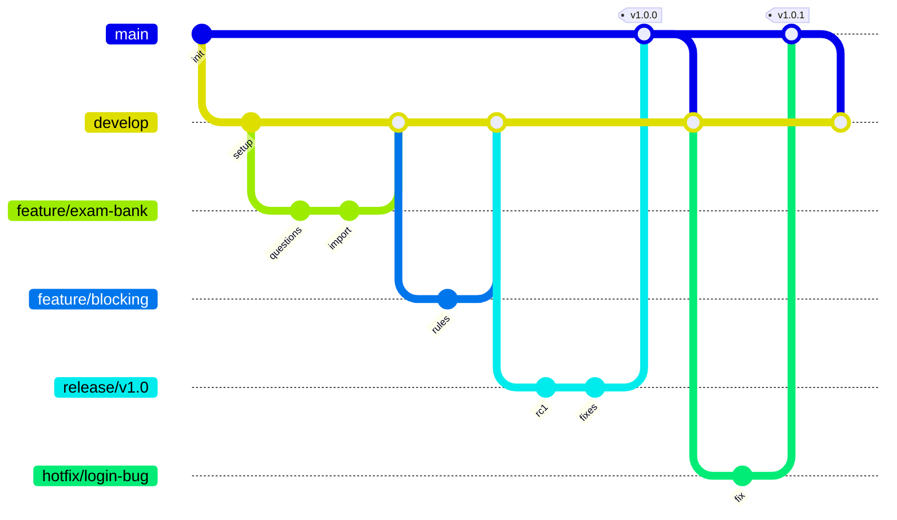
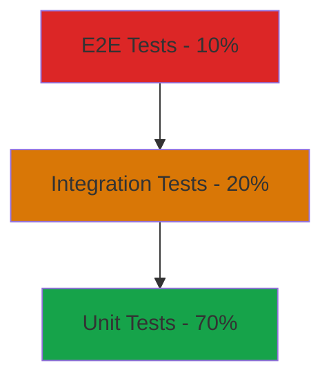
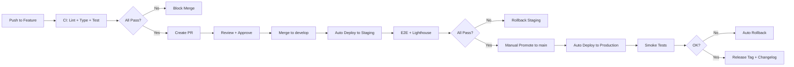
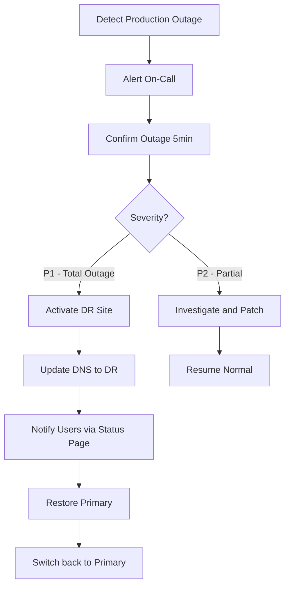

# الجزء الرابع: معايير التطوير والـ DevOps

## 16. معايير البرمجة (Coding Standards)

### 16.1 معايير TypeScript

#### 16.1.1 `tsconfig.json` المقترح

```json
{
  "compilerOptions": {
    "target": "ES2022",
    "lib": ["dom", "dom.iterable", "esnext"],
    "allowJs": false,
    "skipLibCheck": true,
    "strict": true,
    "noEmit": true,
    "esModuleInterop": true,
    "module": "esnext",
    "moduleResolution": "bundler",
    "resolveJsonModule": true,
    "isolatedModules": true,
    "jsx": "preserve",
    "incremental": true,
    "plugins": [{ "name": "next" }],
    "baseUrl": ".",
    "paths": {
      "@/*": ["./src/*"]
    },
    "noUnusedLocals": true,
    "noUnusedParameters": true,
    "noImplicitReturns": true,
    "noFallthroughCasesInSwitch": true,
    "forceConsistentCasingInFileNames": true,
    "noImplicitOverride": true,
    "exactOptionalPropertyTypes": true,
    "noUncheckedIndexedAccess": true
  },
  "include": ["next-env.d.ts", "**/*.ts", "**/*.tsx", ".next/types/**/*.ts"],
  "exclude": ["node_modules"]
}
```

**شرح الخيارات الحرجة:**

| الخيار | الأثر |
|--------|------|
| `strict: true` | تفعيل كل فحوصات النوع الصارمة |
| `noUnusedLocals` | منع المتغيرات غير المستخدمة |
| `noUnusedParameters` | منع المعاملات غير المستخدمة |
| `noImplicitReturns` | كل branch يجب أن يرجع قيمة |
| `noFallthroughCasesInSwitch` | منع نسيان break في switch |
| `exactOptionalPropertyTypes` | تمييز `undefined` من غياب الحقل |
| `noUncheckedIndexedAccess` | `arr[i]` يصبح `T \| undefined` (أمان) |

#### 16.1.2 منع `any`

```typescript
// ❌ خطأ
function process(data: any) { return data.foo; }

// ✅ صحيح
function process(data: unknown) {
  if (typeof data === 'object' && data && 'foo' in data) {
    return (data as { foo: unknown }).foo;
  }
  throw new Error('Invalid input');
}

// ✅ أفضل: Zod
import { z } from 'zod';
const schema = z.object({ foo: z.string() });
function process(input: unknown) {
  const data = schema.parse(input);
  return data.foo;
}
```

#### 16.1.3 Naming Conventions

| العنصر | النمط | مثال |
|--------|------|------|
| Components | `PascalCase` | `StudentCard.tsx` |
| Hooks | `useCamelCase` | `useExamSession.ts` |
| Files (non-component) | `kebab-case` | `exam-engine.ts` |
| Functions | `camelCase` | `calculateGpa()` |
| Constants | `SCREAMING_SNAKE_CASE` | `MAX_EXAM_ATTEMPTS` |
| Types/Interfaces | `PascalCase` | `type ExamAttempt = {}` |
| Enums | ❌ ممنوع | استخدم const objects |
| DB Tables | `snake_case_plural` | `exam_attempts` |
| DB Columns | `snake_case` | `created_at` |

#### 16.1.4 type vs interface

**نُفضّل `type` على `interface` إلا للـ classes:**

```typescript
// ✅ صحيح
type Student = {
  id: string;
  name: string;
};

type StudentWithBalance = Student & { balance: number };

// ✅ Discriminated Union
type RequestStatus =
  | { kind: 'new' }
  | { kind: 'in_review'; reviewer: string }
  | { kind: 'closed'; closedAt: Date; reason: string };

// ⚠️ interface فقط للـ classes
interface IAccountingService {
  getBalance(id: string): Promise<number>;
}

class ExternalAccountingService implements IAccountingService {
  async getBalance(id: string) { return 0; }
}
```

#### 16.1.5 ممنوع استخدام `enum`

```typescript
// ❌ خطأ
enum Status { Active = 'active', Suspended = 'suspended' }

// ✅ صحيح
export const STUDENT_STATUS = {
  ACTIVE: 'active',
  FINANCIAL_DELAY: 'financial_delay',
  FINANCIAL_SUSPENDED: 'financial_suspended',
  DEPRIVED_FEES: 'deprived_fees',
  DEPRIVED_ATTENDANCE: 'deprived_attendance',
  WITHDRAWN: 'withdrawn',
  POSTPONED: 'postponed',
  GRADUATED: 'graduated',
} as const;

export type StudentStatus = typeof STUDENT_STATUS[keyof typeof STUDENT_STATUS];
```

#### 16.1.6 مثال على Component جيد vs سيء

```typescript
// ❌ Component سيء
export default function Card(props: any) {
  return (
    <div style={{ padding: 16, color: 'red' }}>
      <h1>{props.title}</h1>
      {props.data.map((d: any, i: number) => <p key={i}>{d}</p>)}
    </div>
  );
}

// ✅ Component جيد
import { cn } from '@/lib/utils';

type StudentCardProps = {
  student: Pick<Student, 'id' | 'name' | 'branchId'>;
  variant?: 'default' | 'compact';
  className?: string;
};

export function StudentCard({ student, variant = 'default', className }: StudentCardProps) {
  return (
    <article
      className={cn(
        'rounded-lg border bg-card p-4 shadow-sm',
        variant === 'compact' && 'p-2',
        className,
      )}
      aria-label={`بطاقة الطالب ${student.name}`}
    >
      <h3 className="text-lg font-semibold">{student.name}</h3>
      <p className="text-sm text-muted-foreground">رقم الطالب: {student.id}</p>
    </article>
  );
}
```

---

### 16.2 معايير React

#### 16.2.1 Server Components كافتراضي

```typescript
// ✅ Server Component (افتراضي في App Router)
// app/admin/students/page.tsx
import { getStudents } from '@/server/students';

export default async function StudentsPage() {
  const students = await getStudents();
  return <StudentsList students={students} />;
}

// 'use client' فقط للتفاعل
// components/StudentsList.tsx
'use client';
import { useState } from 'react';

export function StudentsList({ students }: { students: Student[] }) {
  const [filter, setFilter] = useState('');
  return (
    <>
      <input value={filter} onChange={(e) => setFilter(e.target.value)} />
      {students.filter((s) => s.name.includes(filter)).map(...)}
    </>
  );
}
```

#### 16.2.2 منع `useEffect` للـ Data Fetching

```typescript
// ❌ خطأ
function Component() {
  const [data, setData] = useState(null);
  useEffect(() => {
    fetch('/api/students').then((r) => r.json()).then(setData);
  }, []);
  return <List data={data} />;
}

// ✅ Server Component
async function Component() {
  const data = await getStudents();
  return <List data={data} />;
}

// ✅ Client مع TanStack Query
function Component() {
  const { data } = useQuery({
    queryKey: ['students'],
    queryFn: () => fetch('/api/students').then((r) => r.json()),
  });
  return <List data={data} />;
}
```

#### 16.2.3 Composition over Inheritance

```typescript
// ✅ Composition
function StudentCard({ student, children }: PropsWithChildren<{ student: Student }>) {
  return (
    <Card>
      <CardHeader>{student.name}</CardHeader>
      {children}
    </Card>
  );
}

// الاستخدام:
<StudentCard student={s}>
  <StudentFinancialInfo balance={s.balance} />
</StudentCard>
```

#### 16.2.4 Custom Hooks

```typescript
// hooks/use-student.ts
export function useStudent(studentId: string) {
  return useQuery({
    queryKey: ['student', studentId],
    queryFn: () => fetchStudent(studentId),
    enabled: !!studentId,
  });
}

// hooks/use-exam-session.ts
export function useExamSession(examId: string) {
  const [autoSaveStatus, setAutoSaveStatus] = useState<'idle' | 'saving' | 'saved' | 'error'>('idle');

  const saveAnswer = useCallback(
    debounce(async (questionId, answer) => {
      setAutoSaveStatus('saving');
      try {
        await saveAnswerApi({ examId, questionId, answer });
        setAutoSaveStatus('saved');
      } catch {
        setAutoSaveStatus('error');
      }
    }, 1000),
    [examId],
  );

  return { saveAnswer, autoSaveStatus };
}
```

#### 16.2.5 Error Boundaries

```typescript
// app/admin/students/error.tsx
'use client';

export default function StudentsError({ error, reset }: { error: Error; reset: () => void }) {
  return (
    <div className="rounded border border-destructive p-4">
      <h2>حدث خطأ غير متوقع</h2>
      <p className="text-sm text-muted-foreground">{error.message}</p>
      <Button onClick={reset}>إعادة المحاولة</Button>
    </div>
  );
}
```

---

### 16.3 معايير CSS (Tailwind)

#### 16.3.1 استخدام `cn()` Utility

```typescript
// src/lib/utils.ts
import { clsx, type ClassValue } from 'clsx';
import { twMerge } from 'tailwind-merge';

export function cn(...inputs: ClassValue[]) {
  return twMerge(clsx(inputs));
}

// الاستخدام
<div className={cn(
  'rounded-lg p-4',
  isActive && 'bg-primary text-primary-foreground',
  className,
)} />
```

#### 16.3.2 منع `style` inline

```typescript
// ❌ خطأ
<div style={{ padding: 16, color: '#065F46' }}>...</div>

// ✅ صحيح
<div className="p-4 text-primary">...</div>
```

#### 16.3.3 Design Tokens في `tailwind.config.ts`

```typescript
// tailwind.config.ts
import type { Config } from 'tailwindcss';

const config: Config = {
  content: ['./src/**/*.{ts,tsx}'],
  theme: {
    extend: {
      colors: {
        primary: {
          DEFAULT: '#065F46',
          50: '#ECFDF5',
          100: '#D1FAE5',
          200: '#A7F3D0',
          500: '#10B981',
          600: '#059669',
          700: '#047857',
          800: '#065F46',
          900: '#064E3B',
        },
        accent: {
          DEFAULT: '#D4A574',
          light: '#E8C9A0',
          dark: '#B58853',
        },
      },
      fontFamily: {
        sans: ['var(--font-cairo)', 'system-ui', 'sans-serif'],
      },
      spacing: {
        '128': '32rem',
      },
    },
  },
  plugins: [require('tailwindcss-rtl')],
};

export default config;
```

#### 16.3.4 Mobile-First Responsive

```tsx
// ✅ صحيح: نبدأ بالموبايل
<div className="grid grid-cols-1 md:grid-cols-2 lg:grid-cols-3 gap-4">

// Breakpoints:
// sm: 640px (هاتف)
// md: 768px (تابلت)
// lg: 1024px (لابتوب صغير)
// xl: 1280px (لابتوب كبير)
// 2xl: 1536px (شاشة كبيرة)
```

#### 16.3.5 RTL Strategy

استخدام **Logical Properties** بدلاً من physical:

```tsx
// ❌ خطأ (يكسر في RTL)
<div className="ml-4 pl-2 border-l text-left">

// ✅ صحيح (Logical Properties)
<div className="ms-4 ps-2 border-s text-start">

// التحويلات:
// ml-* → ms-*
// mr-* → me-*
// pl-* → ps-*
// pr-* → pe-*
// left-* → start-*
// right-* → end-*
// text-left → text-start
// text-right → text-end
// border-l → border-s
// border-r → border-e
// rounded-l-* → rounded-s-*
// rounded-r-* → rounded-e-*
```

#### 16.3.6 Component Variants مع `cva`

```typescript
// components/ui/badge.tsx
import { cva, type VariantProps } from 'class-variance-authority';

const badgeVariants = cva(
  'inline-flex items-center rounded-full px-2 py-0.5 text-xs font-medium',
  {
    variants: {
      variant: {
        default: 'bg-primary text-primary-foreground',
        secondary: 'bg-secondary text-secondary-foreground',
        destructive: 'bg-destructive text-destructive-foreground',
        outline: 'border border-input text-foreground',
        success: 'bg-green-100 text-green-800',
        warning: 'bg-yellow-100 text-yellow-800',
      },
      size: {
        sm: 'text-[10px] px-1.5',
        default: 'text-xs px-2',
        lg: 'text-sm px-3 py-1',
      },
    },
    defaultVariants: { variant: 'default', size: 'default' },
  },
);

type BadgeProps = React.HTMLAttributes<HTMLSpanElement> & VariantProps<typeof badgeVariants>;

export function Badge({ className, variant, size, ...props }: BadgeProps) {
  return <span className={cn(badgeVariants({ variant, size }), className)} {...props} />;
}
```

---

### 16.4 معايير Supabase

#### 16.4.1 الفصل بين Server و Client

```typescript
// ✅ Server Component / Server Action
// src/lib/supabase/server.ts
import { createServerClient } from '@supabase/ssr';
import { cookies } from 'next/headers';

export async function getSupabaseServer() {
  const cookieStore = cookies();
  return createServerClient(
    process.env.NEXT_PUBLIC_SUPABASE_URL!,
    process.env.NEXT_PUBLIC_SUPABASE_ANON_KEY!,
    {
      cookies: {
        get: (name) => cookieStore.get(name)?.value,
        set: (name, value, options) => cookieStore.set({ name, value, ...options }),
        remove: (name, options) => cookieStore.set({ name, value: '', ...options }),
      },
    },
  );
}

// ✅ Client Component
// src/lib/supabase/client.ts
import { createBrowserClient } from '@supabase/ssr';

export function getSupabaseBrowser() {
  return createBrowserClient(
    process.env.NEXT_PUBLIC_SUPABASE_URL!,
    process.env.NEXT_PUBLIC_SUPABASE_ANON_KEY!,
  );
}
```

#### 16.4.2 منع كشف `service_role` Key

```typescript
// ❌ خطأ: لا تكشف service_role في الـclient
const supabase = createClient(url, serviceRoleKey); // 🚨 خطر!

// ✅ صحيح: استخدمه فقط في Server Actions أو Route Handlers
// src/lib/supabase/admin.ts (Server-only)
import 'server-only';
import { createClient } from '@supabase/supabase-js';

export const supabaseAdmin = createClient(
  process.env.NEXT_PUBLIC_SUPABASE_URL!,
  process.env.SUPABASE_SERVICE_ROLE_KEY!, // لا يبدأ بـ NEXT_PUBLIC_
);
```

#### 16.4.3 TypeScript Types من Supabase

```bash
# توليد الأنواع من schema
npx supabase gen types typescript --project-id "abcxyz" > src/types/database.ts

# الاستخدام
import { Database } from '@/types/database';
type Student = Database['public']['Tables']['students']['Row'];
type InsertStudent = Database['public']['Tables']['students']['Insert'];
```

---

### 16.5 معايير الـ Forms

#### 16.5.1 Schema-First مع Zod

```typescript
// src/features/students/schemas.ts
import { z } from 'zod';

export const studentSchema = z.object({
  firstName: z.string().min(2, 'الاسم الأول مطلوب').max(50),
  lastName: z.string().min(2, 'اسم العائلة مطلوب').max(50),
  nationalId: z.string().regex(/^[12]\d{9}$/, 'رقم الهوية يجب أن يبدأ بـ1 أو 2 ويتكون من 10 أرقام'),
  mobile: z.string().regex(/^(\+9665|05)\d{8}$/, 'رقم جوال غير صحيح'),
  email: z.string().email('بريد إلكتروني غير صحيح').optional(),
  branchId: z.string().uuid(),
  programId: z.string().uuid(),
  guardian: z.object({
    name: z.string().min(2).optional(),
    mobile: z.string().regex(/^(\+9665|05)\d{8}$/).optional(),
    relation: z.enum(['father', 'mother', 'guardian']).optional(),
  }).optional(),
});

export type StudentInput = z.infer<typeof studentSchema>;
```

#### 16.5.2 Form Component مع React Hook Form

```typescript
'use client';
import { useForm } from 'react-hook-form';
import { zodResolver } from '@hookform/resolvers/zod';
import { studentSchema, type StudentInput } from './schemas';
import { createStudent } from './actions';

export function StudentForm() {
  const form = useForm<StudentInput>({
    resolver: zodResolver(studentSchema),
    defaultValues: { firstName: '', lastName: '', nationalId: '' },
  });

  async function onSubmit(data: StudentInput) {
    const result = await createStudent(data);
    if (result.error) {
      form.setError('root', { message: result.error.message });
      return;
    }
    toast.success('تم إنشاء الطالب بنجاح');
  }

  return (
    <Form {...form}>
      <form onSubmit={form.handleSubmit(onSubmit)} className="space-y-4">
        <FormField
          control={form.control}
          name="firstName"
          render={({ field }) => (
            <FormItem>
              <FormLabel>الاسم الأول</FormLabel>
              <FormControl><Input {...field} /></FormControl>
              <FormMessage />
            </FormItem>
          )}
        />
        {/* ... */}
        <Button type="submit" disabled={form.formState.isSubmitting}>
          {form.formState.isSubmitting ? 'جارٍ الحفظ...' : 'حفظ'}
        </Button>
      </form>
    </Form>
  );
}
```

#### 16.5.3 Server Actions

```typescript
// src/features/students/actions.ts
'use server';
import { studentSchema } from './schemas';
import { getSupabaseServer } from '@/lib/supabase/server';
import { revalidatePath } from 'next/cache';

export async function createStudent(input: unknown) {
  const parsed = studentSchema.safeParse(input);
  if (!parsed.success) {
    return { error: { code: 'VALIDATION', message: parsed.error.message } };
  }

  const supabase = await getSupabaseServer();
  const { data, error } = await supabase
    .from('students')
    .insert(parsed.data)
    .select()
    .single();

  if (error) return { error: { code: error.code, message: error.message } };

  revalidatePath('/admin/students');
  return { data };
}
```

---

### 16.6 معايير الأخطاء

#### 16.6.1 Custom Error Classes

```typescript
// src/lib/errors.ts
export class AppError extends Error {
  constructor(
    public code: string,
    message: string,
    public statusCode: number = 500,
    public details?: unknown,
  ) {
    super(message);
    this.name = 'AppError';
  }
}

export class ValidationError extends AppError {
  constructor(message: string, details?: unknown) {
    super('VALIDATION', message, 422, details);
  }
}

export class AuthError extends AppError {
  constructor(message = 'غير مصرّح') {
    super('AUTH', message, 401);
  }
}

export class ForbiddenError extends AppError {
  constructor(message = 'لا تملك صلاحية') {
    super('FORBIDDEN', message, 403);
  }
}

export class NotFoundError extends AppError {
  constructor(resource: string) {
    super('NOT_FOUND', `${resource} غير موجود`, 404);
  }
}
```

#### 16.6.2 Toast Notifications مع Sonner

```typescript
import { toast } from 'sonner';

// ✅ رسائل واضحة بالعربية
toast.success('تم حفظ الطالب بنجاح');
toast.error('فشل حفظ البيانات. حاول مرة أخرى');
toast.info('جارٍ التحقق من البيانات...');
toast.warning('هذه الدرجة غير معتمدة بعد');

// ❌ منع الرسائل التقنية
toast.error('Database connection failed: ECONNREFUSED'); // 🚨
```

#### 16.6.3 Sentry Integration

```typescript
// src/lib/sentry.ts
import * as Sentry from '@sentry/nextjs';

export function reportError(error: unknown, context?: Record<string, unknown>) {
  if (error instanceof AppError && error.statusCode < 500) {
    // لا نُرسل الأخطاء البسيطة (validation, 404)
    return;
  }
  Sentry.captureException(error, { extra: context });
}
```

---

### 16.7 معايير الـ i18n / RTL

#### 16.7.1 رسائل في ملفات JSON

```json
// src/i18n/ar.json
{
  "common": {
    "save": "حفظ",
    "cancel": "إلغاء",
    "edit": "تعديل",
    "delete": "حذف",
    "confirm": "تأكيد",
    "loading": "جارٍ التحميل..."
  },
  "students": {
    "title": "إدارة الطلاب",
    "create": "إضافة طالب جديد",
    "fields": {
      "firstName": "الاسم الأول",
      "lastName": "اسم العائلة",
      "nationalId": "رقم الهوية"
    },
    "status": {
      "active": "منتظم",
      "financial_suspended": "موقوف مالياً",
      "graduated": "متخرج"
    }
  }
}
```

#### 16.7.2 الاستخدام

```typescript
// مع next-intl
import { useTranslations } from 'next-intl';

export function StudentForm() {
  const t = useTranslations('students');
  return (
    <div>
      <h1>{t('title')}</h1>
      <label>{t('fields.firstName')}</label>
    </div>
  );
}
```

#### 16.7.3 منع Hard-coded Strings

```typescript
// ❌ خطأ
<Button>حفظ</Button>

// ✅ صحيح
<Button>{t('common.save')}</Button>
```

#### 16.7.4 اختبار RTL

كل component يجب أن يُختبر في RTL:
- التحقق من الـlayout (الأيقونات، النصوص، الأسهم).
- التحقق من الـscrolling.
- التحقق من tooltip positioning.

---

### 16.8 توثيق الكود

#### 16.8.1 JSDoc للـ Public APIs

```typescript
/**
 * يحسب المعدل التراكمي للطالب بناءً على درجات المواد المعتمدة فقط.
 *
 * @param studentId - معرّف الطالب (UUID)
 * @returns المعدل من 0 إلى 100
 * @throws {NotFoundError} إذا لم يوجد الطالب
 */
export async function calculateGpa(studentId: string): Promise<number> {
  // ...
}
```

#### 16.8.2 README لكل Feature Module

```markdown
# Feature: Exams

## Overview
موديول إدارة الاختبارات الإلكترونية بما فيه بنك الأسئلة...

## Key Files
- `src/features/exams/server/actions.ts` — Server Actions
- `src/features/exams/components/ExamForm.tsx` — نموذج إنشاء اختبار

## Database Tables
- `exams`, `exam_questions`, `exam_attempts`, `exam_answers`

## Environment Variables
- `EXAM_CODE_LENGTH=6`

## Testing
```bash
pnpm test src/features/exams
```
```

#### 16.8.3 ADRs (Architecture Decision Records)

```markdown
# ADR-001: استخدام Supabase كـ BaaS رئيسي

## السياق
نحتاج backend سريع التطوير يدعم Auth, Storage, Realtime, RLS...

## القرار
استخدام Supabase Cloud في المرحلة الأولى، Self-Hosted في الإنتاج.

## النتائج
- ✅ سرعة تطوير عالية.
- ✅ RLS قوي للـ multi-branch.
- ⚠️ vendor lock-in (مخفّف بـSelf-Hosted option).

## البدائل المرفوضة
- Firebase: لا يدعم Postgres ولا RLS.
- Nest.js custom: وقت تطوير أطول.
```

#### 16.8.4 منع التعليقات الزائدة

```typescript
// ❌ تعليق زائد
// زيادة العداد بواحد
counter++;

// ❌ تعليق يكرر اسم الدالة
// دالة حساب المعدل
function calculateGpa() {}

// ✅ تعليق يشرح "لماذا"
// نستخدم setTimeout لأن Supabase realtime يحتاج وقت لتسجيل الـconnection
setTimeout(() => channel.subscribe(), 100);
```

---

### 16.9 ESLint + Prettier Config

#### 16.9.1 `.eslintrc.json`

```json
{
  "extends": [
    "next/core-web-vitals",
    "plugin:@typescript-eslint/strict-type-checked",
    "plugin:tailwindcss/recommended",
    "prettier"
  ],
  "plugins": ["@typescript-eslint", "tailwindcss"],
  "parserOptions": {
    "project": "./tsconfig.json"
  },
  "rules": {
    "@typescript-eslint/no-explicit-any": "error",
    "@typescript-eslint/consistent-type-imports": "error",
    "@typescript-eslint/no-unused-vars": ["error", { "argsIgnorePattern": "^_" }],
    "react/jsx-curly-brace-presence": ["error", "never"],
    "react-hooks/exhaustive-deps": "error",
    "tailwindcss/classnames-order": "warn",
    "tailwindcss/no-custom-classname": "off",
    "import/order": ["error", {
      "groups": ["builtin", "external", "internal", "parent", "sibling"],
      "newlines-between": "always"
    }]
  }
}
```

#### 16.9.2 `.prettierrc`

```json
{
  "semi": true,
  "trailingComma": "all",
  "singleQuote": true,
  "printWidth": 100,
  "tabWidth": 2,
  "useTabs": false,
  "arrowParens": "always",
  "plugins": ["prettier-plugin-tailwindcss"]
}
```

#### 16.9.3 Husky Pre-commit Hooks

```bash
# package.json
{
  "scripts": {
    "prepare": "husky install"
  },
  "lint-staged": {
    "*.{ts,tsx}": ["eslint --fix", "prettier --write"],
    "*.{md,json}": ["prettier --write"]
  }
}
```

```bash
# .husky/pre-commit
#!/usr/bin/env sh
. "$(dirname -- "$0")/_/husky.sh"

pnpm lint-staged
pnpm typecheck
```

#### 16.9.4 PR Check Failing — مثال

```yaml
# .github/workflows/ci.yml — failed example
✗ ESLint
  src/features/students/form.tsx
    23:5  error  Unexpected any. Specify a different type  @typescript-eslint/no-explicit-any

✗ TypeScript
  src/features/exams/engine.ts(45,3): error TS2322: Type 'string' is not assignable to type 'number'.

✗ Tests
  ✗ should calculate GPA correctly
    AssertionError: expected 4.5 to equal 4.3
```

---

## 17. استراتيجية Git (Branching Strategy)

### 17.1 نموذج Branching المقترح

نستخدم نسخة مبسّطة من **GitFlow** ملائمة لمشروع متوسط:



### 17.2 الـ Branches

| الـ Branch | الغرض | محمي؟ |
|----------|------|--------|
| `main` | Production-ready | ✅ نعم |
| `develop` | Integration branch | ✅ نعم |
| `feature/*` | تطوير ميزة جديدة | ❌ لا |
| `bugfix/*` | إصلاح خطأ | ❌ لا |
| `hotfix/*` | إصلاح حرج في production | ❌ لا |
| `release/*` | تجهيز إصدار | ✅ نعم |

### 17.3 Naming Conventions

```
feature/RUA-123-exam-question-bank
bugfix/RUA-456-grade-approval-not-saving
hotfix/RUA-789-login-fails-after-deploy
release/v1.2.0
```

**القواعد:**
- ✅ lowercase + kebab-case.
- ✅ يبدأ بـticket number (مثلاً RUA-123).
- ✅ وصف موجز (3-5 كلمات).
- ❌ لا مسافات أو أحرف خاصة.

### 17.4 Commit Messages (Conventional Commits)

```
<type>(<scope>): <description>

[optional body in Arabic or English]

[optional footer]
```

**الأنواع المسموحة:**

| Type | الاستخدام |
|------|-----------|
| `feat` | ميزة جديدة |
| `fix` | إصلاح خطأ |
| `refactor` | إعادة هيكلة بدون تغيير سلوك |
| `docs` | توثيق |
| `test` | إضافة/تعديل اختبارات |
| `chore` | تحديث dependencies, configs |
| `perf` | تحسين أداء |
| `style` | تنسيق فقط (مسافات، فواصل) |
| `ci` | تعديل CI/CD |
| `build` | تعديل build system |

**أمثلة:**

```bash
feat(exams): add question bank import from Excel
fix(blocking): unblock action not saving reason field
refactor(workflow): extract state machine to xstate
docs(readme): update setup instructions
test(grades): add tests for GPA calculation
chore(deps): bump next to 14.2.0
perf(students): add index on branch_id for faster queries
ci(github-actions): add Lighthouse check on PRs
```

### 17.5 Pull Request Workflow

#### 17.5.1 PR Template

```markdown
# .github/pull_request_template.md

## الوصف
<!-- ما الذي يحلّه هذا الـPR؟ -->

## نوع التغيير
- [ ] إصلاح خطأ (Bug Fix)
- [ ] ميزة جديدة (New Feature)
- [ ] تحسين أداء (Performance)
- [ ] إعادة هيكلة (Refactoring)
- [ ] توثيق (Documentation)

## كيف اختُبر؟
<!-- خطوات الاختبار -->
1. ...
2. ...

## Screenshots / Videos
<!-- إن كانت تغييرات بصرية -->

## Checklist
- [ ] الكود يتبع معايير المشروع
- [ ] أضفت اختبارات للتغييرات
- [ ] جميع الاختبارات تمر بنجاح
- [ ] حدّثت التوثيق إن لزم
- [ ] راجعت الأمان (PDPL, RBAC, XSS, etc.)
- [ ] راجعت RTL وعمل الواجهة العربية
- [ ] لا breaking changes (أو موثّقة)
- [ ] أضفت تنبيه في الـ release notes إن لزم

## Related Issues
Closes #...
```

#### 17.5.2 Required Checks

| الفحص | إلزامي؟ |
|------|---------|
| ESLint | ✅ |
| TypeScript | ✅ |
| Unit Tests | ✅ |
| Integration Tests | ✅ |
| Build | ✅ |
| Lighthouse (للـUI changes) | ✅ |
| Code Reviewer | ✅ (1 على الأقل) |
| Security Scan (Snyk) | ✅ |

#### 17.5.3 Merge Strategy

- إلى `develop`: **Squash and Merge** (تاريخ نظيف).
- إلى `main`: **Merge Commit** (للحفاظ على سياق الـrelease).
- ❌ لا force push على `main` أو `develop`.

---

### 17.6 Code Review Standards

#### 17.6.1 7 معايير المراجعة

| المعيار | السؤال |
|---------|------|
| 1. الصحة الوظيفية | هل الكود يعمل كما هو موصوف؟ |
| 2. الاختبارات | هل التغطية مناسبة؟ هل الاختبارات تختبر السلوك الفعلي؟ |
| 3. الأمان (RLS) | هل الـRLS Policy موجود لكل جدول جديد؟ |
| 4. الـ RTL | هل اختُبر في الوضع العربي؟ |
| 5. الـ Accessibility | هل ARIA labels صحيحة؟ keyboard navigation؟ |
| 6. الأداء | هل هناك N+1 queries؟ unnecessary re-renders؟ |
| 7. التوثيق | هل JSDoc محدّث؟ README إن لزم؟ |

#### 17.6.2 آداب المراجعة

- ✅ **كن محدداً:** `لاحظت أن useState هنا قد يسبب re-render إضافي` بدلاً من `هذا سيء`.
- ✅ **اشرح "لماذا":** `الأفضل استخدام useMemo هنا لأن الحسبة تتكرر مع كل render`.
- ✅ **اقترح حلولاً:** ليس فقط أشر للمشكلة.
- ✅ **افصل بين nit و blocker:** `nit: ربما تسمية أوضح؟` vs `blocker: هذا يكسر RLS`.
- ❌ **لا هجوم شخصي:** انتقد الكود لا الشخص.

---

### 17.7 Release Workflow

#### 17.7.1 Semver Tags

```
v0.1.0  ← MVP داخلي
v0.2.0  ← Beta للعميل
v1.0.0  ← أول release رسمي
v1.0.1  ← hotfix
v1.1.0  ← ميزة جديدة
v2.0.0  ← breaking changes
```

#### 17.7.2 Changelog عبر Conventional Changelog

```bash
pnpm changelog
# يقرأ commits منذ آخر tag ويولّد CHANGELOG.md
```

**مثال:**
```markdown
# CHANGELOG

## v1.1.0 (2026-08-01)

### Features
- **exams**: add question bank import from Excel ([#42](.../pull/42))
- **letters**: add Hassan Sulook letter template ([#48](.../pull/48))

### Bug Fixes
- **blocking**: unblock action not saving reason ([#45](.../pull/45))

### Performance
- **students**: add index on branch_id ([#50](.../pull/50))
```

#### 17.7.3 Release Notes للعميل (بالعربية)

```markdown
# الإصدار 1.1.0 - 2026-08-01

## الميزات الجديدة
- 📥 **استيراد بنك الأسئلة من Excel:** يمكن الآن رفع ملف Excel يحتوي مئات الأسئلة دفعة واحدة.
- 📄 **خطاب حسن سلوك:** أُضيف قالب جديد للخطابات.

## إصلاحات
- 🐛 إصلاح مشكلة عدم حفظ سبب فك الحجب.

## تحسينات الأداء
- ⚡ تسريع شاشة قائمة الطلاب بنسبة 60%.
```

---

## 18. استراتيجية الاختبار (Testing Strategy)

### 18.1 هرم الاختبار



**التوزيع المستهدف:**
- **70% Unit Tests** — سريعة، معزولة، Pure functions.
- **20% Integration Tests** — تختبر التفاعل مع DB، APIs، Services.
- **10% E2E Tests** — تختبر User Flows الكاملة.

---

### 18.2 Unit Tests (Vitest)

#### 18.2.1 ما يُختبر

- ✅ Pure utility functions.
- ✅ Zod schemas.
- ✅ Business logic functions (e.g., calculateGpa, isEligibleForExam).
- ✅ State machines (XState).
- ✅ Component logic (مع Testing Library).

#### 18.2.2 التغطية المطلوبة

| المنطقة | التغطية الدنيا |
|---------|----------------|
| Business Logic | 90% |
| Utility Functions | 95% |
| State Machines | 100% |
| Components UI | 60% |
| Server Actions | 80% |

#### 18.2.3 مثال: اختبار حساب GPA

```typescript
// src/features/grades/calculate-gpa.test.ts
import { describe, it, expect } from 'vitest';
import { calculateGpa } from './calculate-gpa';

describe('calculateGpa', () => {
  it('يحسب المعدل من الدرجات المعتمدة فقط', () => {
    const grades = [
      { score: 90, weight: 3, approved: true },
      { score: 80, weight: 2, approved: true },
      { score: 50, weight: 4, approved: false }, // غير معتمدة
    ];
    expect(calculateGpa(grades)).toBeCloseTo(86, 1);
  });

  it('يرجع 0 إذا لم توجد درجات معتمدة', () => {
    expect(calculateGpa([])).toBe(0);
    expect(calculateGpa([{ score: 100, weight: 1, approved: false }])).toBe(0);
  });

  it('يطبق الأوزان بشكل صحيح', () => {
    const grades = [
      { score: 100, weight: 1, approved: true },
      { score: 50, weight: 3, approved: true },
    ];
    // (100*1 + 50*3) / (1+3) = 250/4 = 62.5
    expect(calculateGpa(grades)).toBe(62.5);
  });
});
```

#### 18.2.4 Mocking Supabase

```typescript
// tests/mocks/supabase.ts
import { vi } from 'vitest';

export function createSupabaseMock() {
  return {
    from: vi.fn().mockReturnThis(),
    select: vi.fn().mockReturnThis(),
    insert: vi.fn().mockReturnThis(),
    update: vi.fn().mockReturnThis(),
    delete: vi.fn().mockReturnThis(),
    eq: vi.fn().mockReturnThis(),
    single: vi.fn(),
    auth: {
      getSession: vi.fn(),
      signIn: vi.fn(),
    },
  };
}

// في الاختبار
import { createSupabaseMock } from '@/tests/mocks/supabase';

vi.mock('@/lib/supabase/server', () => ({
  getSupabaseServer: () => createSupabaseMock(),
}));
```

---

### 18.3 Integration Tests

#### 18.3.1 ما يُختبر

- ✅ Server Actions مع DB حقيقية (Supabase Local).
- ✅ API Routes.
- ✅ Webhook handlers.
- ✅ مكوّنات تتفاعل مع Supabase.

#### 18.3.2 Supabase Local Dev

```bash
# تشغيل Supabase محلياً
npx supabase start

# يفعّل:
# - Postgres على :54322
# - Auth, Storage, Realtime
# - Studio على :54323
```

#### 18.3.3 مثال: اختبار Server Action

```typescript
// src/features/requests/create-request.test.ts
import { describe, it, expect, beforeEach } from 'vitest';
import { createClient } from '@supabase/supabase-js';
import { createRequest } from './actions';

const supabase = createClient(
  'http://localhost:54321',
  process.env.SUPABASE_ANON_KEY!,
);

describe('createRequest', () => {
  beforeEach(async () => {
    // Reset DB
    await supabase.from('requests').delete().neq('id', '');
  });

  it('ينشئ طلب خطاب تعريف بنجاح', async () => {
    // Sign in as student
    const { data: auth } = await supabase.auth.signInWithPassword({
      email: 'test-student@test.com',
      password: 'password',
    });

    const result = await createRequest({
      type: 'intro_letter',
      reason: 'للتقديم على وظيفة',
    });

    expect(result.error).toBeUndefined();
    expect(result.data?.status).toBe('new');
    expect(result.data?.type).toBe('intro_letter');
  });

  it('يرفض طلب الخطاب إذا الطالب موقوف مالياً', async () => {
    // ...
  });
});
```

---

### 18.4 E2E Tests (Playwright)

#### 18.4.1 السيناريوهات السبعة من العميل (مرجع DOCX)

```typescript
// tests/e2e/scenarios.spec.ts
import { test, expect } from '@playwright/test';

test.describe('سيناريوهات قبول العميل', () => {
  test('1. طالب جديد يسجّل ويرفع المرفقات ويدفع', async ({ page }) => {
    await page.goto('/register');
    await page.fill('[name=firstName]', 'محمد');
    await page.fill('[name=nationalId]', '1234567890');
    // ...
    await page.click('text=إكمال التسجيل');
    await expect(page.getByText('تم إنشاء الحساب بنجاح')).toBeVisible();
  });

  test('2. طالب عليه رسوم يطلب خطاباً، يُحجب', async ({ page }) => {
    await page.goto('/student/requests/new');
    await page.selectOption('[name=type]', 'intro_letter');
    await page.click('text=تقديم');
    await expect(page.getByText('طلبك محجوب بسبب رسوم متأخرة')).toBeVisible();
  });

  test('3. طالب متأخر يظهر في تقرير التحصيل', async ({ page }) => {
    // ...
  });

  test('4. طالب كثير الغياب تظهر إنذاراته', async ({ page }) => {
    // ...
  });

  test('5. طلب انسحاب يمر على شؤون → مالية → إدارة', async ({ page }) => {
    // ...
  });

  test('6. مدرب يرفع درجات Excel ويتم اعتمادها', async ({ page }) => {
    // ...
  });

  test('7. شؤون المتدربين ترفع نتائج الاختبار الشامل', async ({ page }) => {
    // ...
  });
});
```

#### 18.4.2 استراتيجية الـ Test Data

```typescript
// tests/fixtures/seed.ts
export async function seedDatabase() {
  // 1. Create branches
  await supabase.from('branches').insert([
    { id: 'branch-a', name: 'الفرع الأول' },
    { id: 'branch-b', name: 'الفرع الرابع' },
  ]);

  // 2. Create test users (per role)
  await supabase.auth.admin.createUser({
    email: 'admin@test.com',
    password: 'password',
    user_metadata: { role: 'admin' },
  });
  // ... باقي الأدوار

  // 3. Create test students
  await supabase.from('students').insert([
    { name: 'طالب منتظم', status: 'active' },
    { name: 'طالب متأخر', status: 'financial_delay' },
    { name: 'طالب موقوف', status: 'financial_suspended' },
  ]);
}
```

#### 18.4.3 اختبار RTL

```typescript
test('الواجهة تظهر صحيحة في RTL', async ({ page }) => {
  await page.goto('/admin/students');

  // التحقق من dir="rtl"
  const dir = await page.locator('html').getAttribute('dir');
  expect(dir).toBe('rtl');

  // التحقق من اتجاه القائمة
  const sidebar = page.locator('[data-testid=sidebar]');
  const sidebarBox = await sidebar.boundingBox();
  const viewportSize = page.viewportSize();
  expect(sidebarBox?.x).toBeGreaterThan(viewportSize!.width / 2); // على اليمين
});
```

#### 18.4.4 المتصفحات المدعومة

```typescript
// playwright.config.ts
export default {
  projects: [
    { name: 'chromium', use: { browserName: 'chromium' } },
    { name: 'firefox', use: { browserName: 'firefox' } },
    { name: 'webkit', use: { browserName: 'webkit' } },  // Safari
  ],
};
```

---

### 18.5 Component Tests (Storybook)

#### 18.5.1 Storybook لكل Component

```typescript
// src/components/ui/badge.stories.tsx
import type { Meta, StoryObj } from '@storybook/react';
import { Badge } from './badge';

const meta: Meta<typeof Badge> = {
  title: 'UI/Badge',
  component: Badge,
};
export default meta;

export const Default: StoryObj<typeof Badge> = {
  args: { children: 'منتظم' },
};

export const Success: StoryObj<typeof Badge> = {
  args: { children: 'متخرج', variant: 'success' },
};

export const Warning: StoryObj<typeof Badge> = {
  args: { children: 'متأخر', variant: 'warning' },
};

export const Destructive: StoryObj<typeof Badge> = {
  args: { children: 'محروم', variant: 'destructive' },
};
```

#### 18.5.2 Visual Regression (اختياري)

استخدام **Chromatic** لاختبار التغييرات البصرية تلقائياً.

---

### 18.6 Security Tests

| الأداة | التكرار |
|--------|---------|
| `npm audit` | كل PR |
| Snyk | يومياً |
| Dependabot | تلقائي |
| OWASP ZAP | أسبوعياً |
| Pentest يدوي | قبل كل major release |

---

### 18.7 Performance Tests

#### 18.7.1 Lighthouse في CI

```yaml
# .github/workflows/lighthouse.yml
- name: Lighthouse CI
  uses: treosh/lighthouse-ci-action@v10
  with:
    urls: |
      ${{ env.PREVIEW_URL }}
      ${{ env.PREVIEW_URL }}/admin/students
    budgetPath: ./lighthouse-budget.json
```

```json
// lighthouse-budget.json
{
  "performance": 90,
  "accessibility": 95,
  "best-practices": 95,
  "seo": 90
}
```

#### 18.7.2 Load Testing مع k6

```javascript
// tests/load/students-list.js
import http from 'k6/http';
import { check, sleep } from 'k6';

export const options = {
  stages: [
    { duration: '1m', target: 50 },   // ramp up
    { duration: '3m', target: 200 },  // peak load
    { duration: '1m', target: 0 },    // ramp down
  ],
  thresholds: {
    http_req_duration: ['p(95)<500'],
    http_req_failed: ['rate<0.01'],
  },
};

export default function () {
  const res = http.get('https://staging.example.sa/api/students');
  check(res, { 'status 200': (r) => r.status === 200 });
  sleep(1);
}
```

---

### 18.8 Accessibility Tests

#### 18.8.1 axe-core

```typescript
import { test, expect } from '@playwright/test';
import AxeBuilder from '@axe-core/playwright';

test('admin students page is accessible', async ({ page }) => {
  await page.goto('/admin/students');
  const results = await new AxeBuilder({ page })
    .withTags(['wcag2a', 'wcag2aa'])
    .analyze();
  expect(results.violations).toEqual([]);
});
```

#### 18.8.2 الحد الأدنى

- **WCAG 2.1 Level AA** لكل الواجهات.
- اختبار قارئ الشاشة (NVDA / VoiceOver) قبل كل major release.
- Color contrast 4.5:1 للنصوص العادية، 3:1 للنصوص الكبيرة.
- Keyboard navigation كامل (Tab, Enter, Escape, Arrow keys).

---

## 19. النشر والـ DevOps

### 19.1 البيئات (Environments)

| البيئة | الغرض | URL | DB |
|--------|------|-----|-----|
| **Local** | تطوير محلي | localhost:3000 | Supabase Local |
| **Development** | تطوير مشترك | dev.example.sa | Supabase Dev |
| **Staging** | QA + UAT | staging.example.sa | Supabase Staging |
| **Production** | الموقع الحي | example.sa | Supabase Prod |
| **DR-Mirror** | Disaster Recovery | dr.example.sa | VPS سعودي ثانٍ |

---

### 19.2 CI/CD Pipeline

#### 19.2.1 المخطط



#### 19.2.2 GitHub Actions Config

```yaml
# .github/workflows/ci.yml
name: CI

on:
  pull_request:
    branches: [develop, main]
  push:
    branches: [develop, main]

jobs:
  lint:
    runs-on: ubuntu-latest
    steps:
      - uses: actions/checkout@v4
      - uses: pnpm/action-setup@v2
        with: { version: 9 }
      - uses: actions/setup-node@v4
        with: { node-version: 20, cache: pnpm }
      - run: pnpm install --frozen-lockfile
      - run: pnpm lint
      - run: pnpm typecheck

  test:
    runs-on: ubuntu-latest
    services:
      postgres:
        image: postgres:15
        env: { POSTGRES_PASSWORD: postgres }
        ports: [5432:5432]
    steps:
      - uses: actions/checkout@v4
      - uses: pnpm/action-setup@v2
      - uses: actions/setup-node@v4
        with: { node-version: 20, cache: pnpm }
      - run: pnpm install --frozen-lockfile
      - run: pnpm test:unit
      - run: pnpm test:integration

  e2e:
    needs: test
    runs-on: ubuntu-latest
    steps:
      - uses: actions/checkout@v4
      - uses: pnpm/action-setup@v2
      - uses: actions/setup-node@v4
      - run: pnpm install --frozen-lockfile
      - run: pnpm exec playwright install --with-deps
      - run: pnpm test:e2e

  security:
    runs-on: ubuntu-latest
    steps:
      - uses: actions/checkout@v4
      - run: pnpm audit --audit-level=high
      - uses: snyk/actions/node@master
        env: { SNYK_TOKEN: ${{ secrets.SNYK_TOKEN }} }

  build:
    needs: [lint, test]
    runs-on: ubuntu-latest
    steps:
      - uses: actions/checkout@v4
      - uses: pnpm/action-setup@v2
      - uses: actions/setup-node@v4
      - run: pnpm install --frozen-lockfile
      - run: pnpm build
```

---

### 19.3 Database Migrations (Supabase)

#### 19.3.1 إنشاء migration

```bash
# 1. إنشاء migration جديد
npx supabase migration new add_student_archive_table

# 2. تحرير الملف في supabase/migrations/{timestamp}_add_student_archive_table.sql
# 3. تطبيقه محلياً
npx supabase db reset

# 4. تطبيقه على Staging
npx supabase db push --project-ref staging-ref

# 5. تطبيقه على Production (بعد UAT)
npx supabase db push --project-ref prod-ref
```

#### 19.3.2 Migration Template

```sql
-- supabase/migrations/20260512000001_add_student_archive.sql

-- Up Migration
CREATE TABLE student_archive (
  id UUID PRIMARY KEY,
  original_student_id UUID NOT NULL,
  archived_at TIMESTAMPTZ NOT NULL DEFAULT NOW(),
  archived_by UUID NOT NULL,
  snapshot JSONB NOT NULL,
  reason TEXT
);

CREATE INDEX idx_archive_original ON student_archive(original_student_id);

-- RLS
ALTER TABLE student_archive ENABLE ROW LEVEL SECURITY;

CREATE POLICY admin_read_archive ON student_archive FOR SELECT
USING (
  EXISTS (
    SELECT 1 FROM users WHERE id = auth.uid()
      AND role IN ('admin', 'super_admin')
  )
);

-- Comments
COMMENT ON TABLE student_archive IS 'أرشيف الطلاب المنسحبين أو المتخرجين';
```

#### 19.3.3 Rollback

```sql
-- supabase/migrations/20260512000001_add_student_archive_rollback.sql
DROP POLICY IF EXISTS admin_read_archive ON student_archive;
ALTER TABLE student_archive DISABLE ROW LEVEL SECURITY;
DROP INDEX IF EXISTS idx_archive_original;
DROP TABLE IF EXISTS student_archive;
```

---

### 19.4 Environment Variables

#### 19.4.1 قائمة الـ Env Vars

```bash
# .env.example
# ====== Public (يكشف للـclient) ======
NEXT_PUBLIC_SUPABASE_URL=https://abc.supabase.co
NEXT_PUBLIC_SUPABASE_ANON_KEY=eyJ...
NEXT_PUBLIC_APP_URL=https://example.sa
NEXT_PUBLIC_SENTRY_DSN=https://...@sentry.io/...

# ====== Server-only (لا يكشف) ======
SUPABASE_SERVICE_ROLE_KEY=eyJ...
DATABASE_URL=postgresql://...

# Accounting Integration
ACCOUNTING_API_URL=https://accounting.example.sa/api/v1
ACCOUNTING_API_KEY=...
ACCOUNTING_WEBHOOK_SECRET=...

# WhatsApp
UNIFONIC_API_URL=https://api.unifonic.com
UNIFONIC_APP_SID=...
UNIFONIC_SENDER_ID=...

# SMS
SMS_PROVIDER=unifonic
SMS_API_KEY=...

# Email
RESEND_API_KEY=re_...

# AI
ANTHROPIC_API_KEY=sk-ant-...

# Security
ENCRYPTION_KEY=...  # 32 bytes hex
SESSION_SECRET=...

# Feature Flags
FEATURE_AI_QUESTIONS=true
FEATURE_NAFATH_SSO=false
```

#### 19.4.2 Validation

```typescript
// src/lib/env.ts
import { z } from 'zod';

const envSchema = z.object({
  NEXT_PUBLIC_SUPABASE_URL: z.string().url(),
  NEXT_PUBLIC_SUPABASE_ANON_KEY: z.string().min(1),
  SUPABASE_SERVICE_ROLE_KEY: z.string().min(1),
  ACCOUNTING_API_URL: z.string().url(),
  ACCOUNTING_API_KEY: z.string().min(1),
  ANTHROPIC_API_KEY: z.string().regex(/^sk-ant-/),
  FEATURE_AI_QUESTIONS: z.enum(['true', 'false']).transform((v) => v === 'true'),
});

export const env = envSchema.parse(process.env);
```

---

### 19.5 Monitoring & Observability

#### 19.5.1 الأدوات الإلزامية

| الأداة | الغرض | السعر |
|--------|------|------|
| **Sentry** | Errors + Performance | Free tier كافٍ |
| **Vercel Analytics** | RUM + Speed Insights | Free مع Vercel Pro |
| **Supabase Dashboard** | DB metrics | مدمج |
| **UptimeRobot** | Uptime monitoring | Free tier |
| **Cloudflare Analytics** | Traffic + Security | مدمج |

#### 19.5.2 إعداد Sentry

```typescript
// sentry.client.config.ts
import * as Sentry from '@sentry/nextjs';

Sentry.init({
  dsn: process.env.NEXT_PUBLIC_SENTRY_DSN,
  environment: process.env.NEXT_PUBLIC_VERCEL_ENV,
  tracesSampleRate: 0.1, // 10% للأداء
  replaysSessionSampleRate: 0.0, // عطل في الإنتاج لـPDPL
  replaysOnErrorSampleRate: 1.0, // 100% عند الأخطاء فقط

  beforeSend(event) {
    // إزالة بيانات حساسة
    if (event.request?.cookies) delete event.request.cookies;
    if (event.user?.email) {
      event.user.email = hashEmail(event.user.email);
    }
    return event;
  },
});
```

---

### 19.6 Backup & Restore

#### 19.6.1 الاستراتيجية (كما في القسم 14.8)

#### 19.6.2 Restore Runbook

```markdown
# Restore Runbook

## السيناريو: فقدان قاعدة البيانات بالكامل

### الخطوات (RTO < 4 ساعات)
1. **تأكيد الفقدان** (5 دقائق)
   - مراجعة Sentry alerts
   - محاولة الاتصال بـ Supabase Dashboard
2. **إشعار الفريق** (5 دقائق)
   - اتصال CTO + Lead Developer
3. **اختيار النسخة** (10 دقائق)
   - استخدام آخر hourly snapshot
4. **Restore على بيئة منفصلة أولاً** (60 دقيقة)
   - التحقق من سلامة البيانات
5. **التطبيق على Production** (60 دقيقة)
   - تشغيل supabase db reset مع backup file
6. **التحقق** (30 دقيقة)
   - Smoke tests
   - فحص integrations
7. **إعادة فتح الموقع** (5 دقائق)
   - Cloudflare maintenance mode off
```

---

### 19.7 Disaster Recovery Plan

#### 19.7.1 RTO/RPO Targets

(كما في القسم 14.8.2)

#### 19.7.2 Failover Procedure



#### 19.7.3 جهات الاتصال

| الدور | الاسم | الهاتف | الإيميل |
|------|------|--------|---------|
| CTO | [الاسم] | [+966...] | cto@... |
| Lead Dev | [الاسم] | [+966...] | lead@... |
| DevOps | [الاسم] | [+966...] | ops@... |
| Vercel Support | — | — | support@vercel.com |
| Supabase Support | — | — | support@supabase.com |
| Cloudflare | — | — | dash.cloudflare.com/support |

---

### 19.8 Feature Flags

#### 19.8.1 الاستخدام البسيط (env vars)

```typescript
// src/lib/feature-flags.ts
import { env } from './env';

export const features = {
  aiQuestions: env.FEATURE_AI_QUESTIONS,
  nafathSso: env.FEATURE_NAFATH_SSO,
  whatsappIntegration: env.FEATURE_WHATSAPP === 'true',
};

// الاستخدام
if (features.aiQuestions) {
  // عرض زر "اقتراح سؤال بالذكاء الاصطناعي"
}
```

#### 19.8.2 الاستخدام المتقدم (Postgres-based)

```sql
CREATE TABLE feature_flags (
  key VARCHAR(100) PRIMARY KEY,
  enabled BOOLEAN NOT NULL DEFAULT FALSE,
  targeting JSONB,  -- {"branches": ["taif"], "roles": ["admin"]}
  description TEXT,
  updated_at TIMESTAMPTZ NOT NULL DEFAULT NOW()
);
```

```typescript
export async function isFeatureEnabled(key: string, context: { branchId?: string; role?: string }) {
  const supabase = await getSupabaseServer();
  const { data } = await supabase
    .from('feature_flags')
    .select()
    .eq('key', key)
    .single();

  if (!data?.enabled) return false;
  if (!data.targeting) return true;

  if (data.targeting.branches && !data.targeting.branches.includes(context.branchId)) return false;
  if (data.targeting.roles && !data.targeting.roles.includes(context.role)) return false;

  return true;
}
```

---

## 20. تصميم الـ API (API Design Principles)

### 20.1 REST Conventions

#### 20.1.1 Naming

```
/api/v1/students                  ← قائمة
/api/v1/students/{id}              ← مفرد
/api/v1/students/{id}/grades       ← sub-resource
/api/v1/students/{id}/requests     ← sub-resource
/api/v1/exams/{id}/attempts        ← sub-resource
```

#### 20.1.2 HTTP Methods

| Method | الاستخدام |
|--------|----------|
| GET | قراءة (لا تغيير state) |
| POST | إنشاء جديد |
| PUT | استبدال كامل |
| PATCH | تعديل جزئي |
| DELETE | حذف |

#### 20.1.3 Status Codes

| Code | الاستخدام |
|------|----------|
| 200 | OK — نجاح GET / PATCH |
| 201 | Created — POST نجح |
| 204 | No Content — DELETE نجح |
| 400 | Bad Request — جسم الطلب خطأ |
| 401 | Unauthorized — لم يسجّل دخول |
| 403 | Forbidden — مسجّل لكن لا يملك صلاحية |
| 404 | Not Found |
| 409 | Conflict — duplicate أو state mismatch |
| 422 | Unprocessable — validation failed |
| 429 | Too Many Requests — rate limit |
| 500 | Server Error |

#### 20.1.4 Server Actions vs API Routes

في Next.js 14 App Router، **نُفضّل Server Actions** على API Routes لـ:
- Mutations (create/update/delete).
- Form submissions.

نستخدم **API Routes** فقط لـ:
- Webhooks الواردة.
- Public APIs للأطراف الخارجية.
- File uploads ثقيلة.
- Webhooks لـ Stripe/Payment.

---

### 20.2 Request/Response Format

#### 20.2.1 بنية الاستجابة الموحّدة

```typescript
type ApiResponse<T> =
  | { success: true; data: T; meta?: ApiMeta }
  | { success: false; error: ApiError };

type ApiError = {
  code: string;         // e.g., 'VALIDATION', 'NOT_FOUND'
  message: string;      // رسالة بالعربية للمستخدم
  details?: unknown;    // تفاصيل إضافية (validation errors)
  requestId?: string;   // لتتبع الطلب
};

type ApiMeta = {
  pagination?: {
    page: number;
    pageSize: number;
    total: number;
    totalPages: number;
  };
  cursor?: { next?: string; prev?: string };
};
```

#### 20.2.2 أمثلة

**نجاح:**
```json
{
  "success": true,
  "data": {
    "id": "uuid",
    "name": "محمد الأحمد"
  },
  "meta": {
    "pagination": { "page": 1, "pageSize": 20, "total": 145 }
  }
}
```

**فشل (Validation):**
```json
{
  "success": false,
  "error": {
    "code": "VALIDATION",
    "message": "البيانات المُدخلة غير صحيحة",
    "details": [
      { "field": "nationalId", "message": "رقم الهوية غير صحيح" },
      { "field": "mobile", "message": "رقم الجوال مطلوب" }
    ],
    "requestId": "req-abc123"
  }
}
```

---

### 20.3 Pagination

#### 20.3.1 Cursor-based (للأداء)

```
GET /api/v1/students?cursor=eyJpZCI6IjEyMyJ9&limit=20
```

```typescript
type CursorResponse<T> = {
  success: true;
  data: T[];
  meta: {
    cursor: {
      next?: string;
      prev?: string;
    };
  };
};
```

#### 20.3.2 Page-based (للقوائم البسيطة)

```
GET /api/v1/students?page=1&pageSize=20
```

---

### 20.4 Filtering & Sorting

```
GET /api/v1/students?status=active&branch_id=branch-a&program_id=xyz
GET /api/v1/students?sort=created_at:desc,name:asc
GET /api/v1/students?search=محمد
```

```typescript
// Server-side validation
const querySchema = z.object({
  status: z.enum(['active', 'suspended', 'graduated']).optional(),
  branchId: z.string().uuid().optional(),
  sort: z.string().regex(/^[\w_]+:(asc|desc)(,[\w_]+:(asc|desc))*$/).optional(),
  page: z.coerce.number().min(1).default(1),
  pageSize: z.coerce.number().min(1).max(100).default(20),
});
```

---

### 20.5 Authentication & Authorization

#### 20.5.1 Bearer Token

```typescript
// كل request محمي
fetch('/api/v1/students', {
  headers: {
    'Authorization': `Bearer ${accessToken}`,
  },
});
```

#### 20.5.2 Middleware

```typescript
// src/middleware.ts
const PROTECTED_API = /^\/api\/v1\//;

export async function middleware(req: NextRequest) {
  if (PROTECTED_API.test(req.nextUrl.pathname)) {
    const token = req.headers.get('authorization')?.replace('Bearer ', '');
    if (!token) {
      return NextResponse.json(
        { success: false, error: { code: 'AUTH', message: 'مطلوب تسجيل الدخول' } },
        { status: 401 },
      );
    }
    // verify token via Supabase
    // ...
  }
}
```

#### 20.5.3 RLS كطبقة دفاع ثانية

حتى لو فشل الـmiddleware، الـRLS في Postgres يحمي البيانات.

---

### 20.6 Rate Limiting

(تفصيل في القسم 14.6.3)

```typescript
// مثال: حماية endpoint تسجيل دخول
import { limiters } from '@/lib/rate-limit';

export async function POST(req: Request) {
  const ip = req.headers.get('x-forwarded-for') ?? 'unknown';
  const { success } = await limiters.auth.limit(ip);
  if (!success) {
    return NextResponse.json(
      { success: false, error: { code: 'RATE_LIMIT', message: 'محاولات كثيرة جداً' } },
      { status: 429 },
    );
  }
  // ... normal flow
}
```

---

### 20.7 Versioning

#### 20.7.1 URL Versioning

```
/api/v1/students   ← الإصدار الحالي
/api/v2/students   ← إصدار مستقبلي مع breaking changes
```

#### 20.7.2 Deprecation Policy

- إصدار جديد يصدر مع breaking changes فقط.
- الإصدار القديم يبقى لـ6 أشهر بعد إصدار الجديد.
- إشعار الـclients قبل الإلغاء بـ3 أشهر.
- Headers للتنبيه:
```
Deprecation: true
Sunset: Wed, 31 Dec 2026 23:59:59 GMT
Link: </api/v2/students>; rel="successor-version"
```

---

### 20.8 OpenAPI Spec

#### 20.8.1 توليد من Zod

```typescript
import { extendZodWithOpenApi } from '@asteasolutions/zod-to-openapi';
import { OpenAPIRegistry, OpenApiGeneratorV3 } from '@asteasolutions/zod-to-openapi';

extendZodWithOpenApi(z);

const registry = new OpenAPIRegistry();

registry.registerPath({
  method: 'get',
  path: '/api/v1/students',
  description: 'قائمة الطلاب',
  responses: {
    200: {
      description: 'نجاح',
      content: { 'application/json': { schema: StudentsListResponseSchema } },
    },
  },
});

const generator = new OpenApiGeneratorV3(registry.definitions);
const document = generator.generateDocument({
  openapi: '3.0.0',
  info: { title: 'رواد العطاء API', version: '1.0.0' },
});
```

#### 20.8.2 Swagger UI

```typescript
// app/api/docs/route.ts (متاح فقط في dev)
if (process.env.NODE_ENV !== 'development') {
  return new Response('Not Found', { status: 404 });
}
return new Response(swaggerHtml, { headers: { 'Content-Type': 'text/html' } });
```

---

### 20.9 GraphQL؟ (قرار: لا)

**القرار:** لا نستخدم GraphQL في هذا المشروع.

**المبررات:**
1. **Server Actions + RSC** يحققان نفس فوائد GraphQL (selective fetching).
2. **TypeScript End-to-End** يوفّر type safety بدون schema منفصل.
3. **Supabase** يوفّر REST + Realtime مدمج.
4. **التعقيد** غير مبرر لمشروع بهذا الحجم.

**إن احتجناه لاحقاً:**
- Supabase يدعم pg_graphql تلقائياً.
- يمكن إضافته كطبقة فوق REST دون إعادة بناء.

---

**انتهى الجزء الرابع.**
